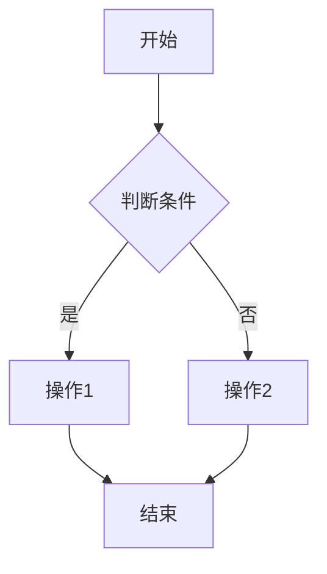

                 

### 《AI Agent的多轮对话能力增强》

关键词：AI Agent、多轮对话、能力增强、深度学习、强化学习、上下文跟踪

摘要：本文将探讨AI Agent在多轮对话中的能力增强技术。通过分析AI Agent的定义、多轮对话的基本概念及其能力增强的原理，我们将介绍一系列先进的算法和系统设计方法，以提升AI Agent的对话效果。本文旨在为开发者提供实用的指导，帮助他们在实际项目中实现高效的多轮对话能力。

## 第1章 引言

### 1.1 问题背景

在当今的信息化时代，人工智能（AI）的应用越来越广泛。其中，AI Agent作为智能交互的代表，已经在多个领域展现出强大的潜力。然而，随着用户需求的不断增长，AI Agent需要具备更加复杂的对话能力，特别是在多轮对话中能够理解上下文、处理复杂问题、提供个性化的服务。

### 1.2 问题描述

当前，AI Agent在多轮对话中面临的主要挑战包括：语义理解的局限性、上下文跟踪的不准确性和对话策略的不足。这些问题严重影响了用户体验和AI Agent的实际应用效果。

### 1.3 问题解决

本文将通过以下三个关键步骤解决上述问题：

1. **语义理解增强**：利用深度学习技术提升AI Agent对自然语言的理解能力。
2. **上下文跟踪能力增强**：通过先进的上下文跟踪算法确保AI Agent在多轮对话中能够准确理解用户意图。
3. **对话策略优化**：应用强化学习等算法优化AI Agent的对话策略，使其能够提供更个性化的服务。

### 1.4 边界与外延

本文主要关注AI Agent在多轮对话中的能力增强技术，不涉及其他AI领域的应用。同时，本文讨论的算法和系统设计方法适用于多种对话场景。

### 1.5 核心概念与联系

核心概念包括AI Agent、多轮对话、语义理解、上下文跟踪和对话策略。这些概念之间相互联系，共同构成了AI Agent在多轮对话中的能力基础。

## 第2章 AI Agent概述

### 2.1 定义与分类

AI Agent是指能够自动执行任务、具备自主学习和适应能力的智能体。根据功能特点，AI Agent可分为交互式Agent、任务执行Agent和决策支持Agent等类型。

### 2.2 基本原理

AI Agent的基本原理包括感知、规划和执行三个阶段。感知阶段获取外部环境信息；规划阶段制定行动方案；执行阶段实现具体操作。

### 2.3 发展历史

AI Agent的发展历程可以追溯到20世纪50年代。近年来，随着深度学习、强化学习等技术的发展，AI Agent在性能和功能方面取得了显著提升。

### 2.4 应用场景

AI Agent广泛应用于客服、智能助手、智能家居、金融理财等多个领域。特别是在多轮对话场景中，AI Agent能够提供高效、个性化的服务，满足用户需求。

## 第3章 多轮对话基本概念

### 3.1 对话系统简介

对话系统是一种人机交互系统，旨在模拟人类对话过程，为用户提供信息和服务。根据交互方式，对话系统可分为单轮对话和 多轮对话。

### 3.2 多轮对话流程

多轮对话包括请求（Request）、响应（Response）、上下文管理（Context Management）等环节。每轮对话都基于前一轮的上下文信息进行。

### 3.3 多轮对话的关键要素

多轮对话的关键要素包括语义理解、上下文跟踪、对话策略和用户满意度。这些要素共同决定了多轮对话的效果。

## 第4章 多轮对话能力增强原理

### 4.1 语义理解增强

#### 4.1.1 基于深度学习的语义理解

深度学习技术在语义理解方面具有显著优势。通过训练大规模神经网络模型，AI Agent能够自动学习语义信息，提高理解能力。

#### 4.1.2 语义理解算法详解

本文将详细介绍几种常见的语义理解算法，如词向量、卷积神经网络（CNN）和递归神经网络（RNN）等。

#### 4.1.3 语义理解的数学模型

语义理解的数学模型主要涉及词嵌入、神经网络的损失函数和优化算法等。

### 4.2 上下文跟踪能力增强

#### 4.2.1 上下文建模方法

上下文建模方法包括基于规则的方法、统计模型和深度学习方法。每种方法都有其优缺点和适用场景。

#### 4.2.2 上下文跟踪算法详解

本文将详细介绍上下文跟踪算法，如HMM（隐马尔可夫模型）、RNN（递归神经网络）和LSTM（长短期记忆网络）等。

#### 4.2.3 上下文跟踪的数学模型

上下文跟踪的数学模型主要涉及概率模型、动态规划算法和优化方法等。

### 4.3 对话策略优化

#### 4.3.1 对话策略定义

对话策略是指AI Agent在对话过程中采取的行动方案。本文将介绍对话策略的定义、分类和实现方法。

#### 4.3.2 策略优化算法

策略优化算法包括基于梯度的优化算法、马尔可夫决策过程（MDP）和强化学习等。

#### 4.3.3 策略优化的数学模型

策略优化的数学模型主要涉及目标函数、策略迭代算法和收敛性证明等。

## 第5章 多轮对话能力增强算法

### 5.1 基于深度学习的对话模型

#### 5.1.1 模型架构

本文将介绍几种基于深度学习的对话模型架构，如Seq2Seq模型、Transformer模型和BERT模型等。

#### 5.1.2 模型训练

模型训练包括数据预处理、模型训练、评估和调优等步骤。本文将详细介绍训练过程和技巧。

#### 5.1.3 模型评估

模型评估主要采用自动评估指标和人工评估方法。本文将介绍常用的评估指标和方法。

### 5.2 增强式学习在多轮对话中的应用

#### 5.2.1 增强式学习简介

增强式学习是一种基于奖励和惩罚的优化方法。本文将介绍增强式学习的基本原理和应用场景。

#### 5.2.2 策略梯度算法

策略梯度算法是一种常见的增强式学习算法。本文将详细介绍策略梯度算法的原理和实现方法。

#### 5.2.3 强化学习在多轮对话中的应用

本文将探讨强化学习在多轮对话中的应用，如基于强化学习的对话策略优化和对话生成。

### 5.3 聚类分析与协同过滤

#### 5.3.1 聚类算法

聚类算法是将数据划分为若干个类别的方法。本文将介绍几种常见的聚类算法，如K-means算法、层次聚类算法和DBSCAN算法等。

#### 5.3.2 协同过滤算法

协同过滤算法是基于用户行为和偏好进行推荐的方法。本文将介绍协同过滤算法的基本原理和实现方法。

#### 5.3.3 聚类与协同过滤在多轮对话中的应用

本文将探讨聚类和协同过滤在多轮对话中的应用，如用户行为分析和对话质量评价。

## 第6章 多轮对话系统架构设计

### 6.1 系统整体架构

本文将介绍多轮对话系统的整体架构，包括输入层、处理层和输出层等组成部分。

### 6.2 对话管理模块设计

对话管理模块负责协调对话流程，本文将介绍对话管理模块的设计原则和实现方法。

### 6.3 语义理解模块设计

语义理解模块负责解析用户输入，本文将介绍语义理解模块的设计原则和实现方法。

### 6.4 上下文跟踪模块设计

上下文跟踪模块负责维护对话上下文，本文将介绍上下文跟踪模块的设计原则和实现方法。

### 6.5 对话策略模块设计

对话策略模块负责生成对话响应，本文将介绍对话策略模块的设计原则和实现方法。

## 第7章 项目实战：AI Agent的多轮对话能力增强

### 7.1 环境安装与配置

本文将介绍如何在本地环境安装和配置AI Agent的多轮对话能力增强系统。

### 7.2 系统核心实现

本文将详细讲解系统核心实现，包括对话模型、语义理解、上下文跟踪和对话策略等部分。

#### 7.2.1 对话模型实现

本文将介绍对话模型的实现过程，包括数据预处理、模型训练和模型评估等步骤。

#### 7.2.2 语义理解实现

本文将介绍语义理解模块的实现，包括词向量生成、文本分类和实体识别等步骤。

#### 7.2.3 上下文跟踪实现

本文将介绍上下文跟踪模块的实现，包括上下文建模、上下文更新和上下文检索等步骤。

#### 7.2.4 对话策略实现

本文将介绍对话策略模块的实现，包括策略定义、策略优化和策略评估等步骤。

### 7.3 代码应用解读与分析

本文将对项目实战中的代码进行解读和分析，帮助读者理解系统实现的细节。

### 7.4 实际案例分析

本文将结合实际案例，分析AI Agent在多轮对话中的表现和效果。

### 7.5 项目小结

本文将对项目实战进行总结，分享经验和教训，为读者提供有价值的参考。

## 第8章 最佳实践与注意事项

### 8.1 最佳实践

本文将总结在AI Agent的多轮对话能力增强过程中积累的最佳实践，为开发者提供参考。

### 8.2 小结

本文对AI Agent的多轮对话能力增强技术进行了全面探讨，包括算法原理、系统设计和项目实践等方面。

### 8.3 注意事项

本文将提醒开发者注意在实际项目中可能遇到的问题和挑战，并提供解决方案。

### 8.4 拓展阅读

本文将推荐一些相关的参考文献和资料，供读者进一步学习和研究。

---

### Mermaid 流程图示例

以下是使用Mermaid语言绘制的简单流程图示例：



此流程图表示从“开始”节点出发，根据“判断条件”进行分支，最终达到“结束”节点。

### Python 源代码示例

以下是使用Python语言编写的简单示例代码：

```python
# 导入必要的库
import numpy as np

# 定义一个简单的函数
def add(a, b):
    return a + b

# 调用函数
result = add(3, 5)
print("结果：", result)
```

此代码定义了一个名为`add`的函数，用于计算两个数的和，并打印结果。

### LaTeX 数学公式示例

以下是使用LaTeX语言编写的数学公式示例：

```latex
$$
E = mc^2
$$

$
a < b
$
```

此示例展示了爱因斯坦的质能方程和简单的比较运算。

---

请注意，本文的内容和示例代码、公式仅为示意性展示，并非完整文章。实际文章应包含详细的技术分析和深入的讨论。在撰写完整文章时，请按照大纲结构逐章节进行拓展和撰写。同时，确保文章内容具备实用性和指导性，以帮助开发者更好地理解和应用所讨论的技术。

