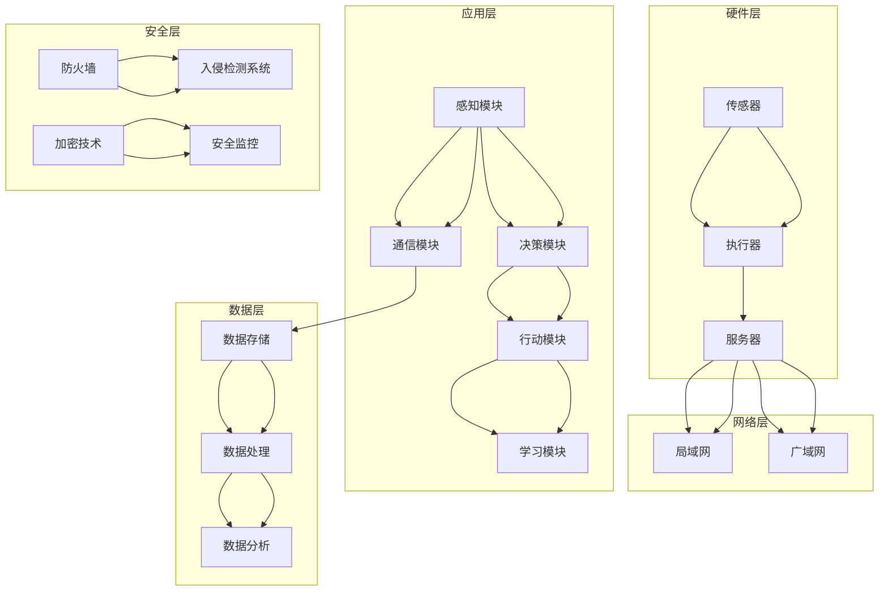
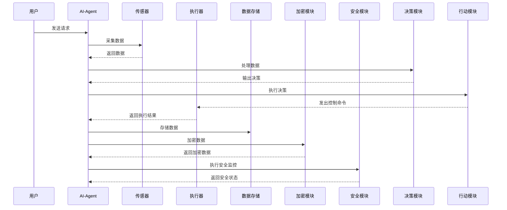

                 

### 引言

#### 1.1 问题背景

随着人工智能（AI）技术的飞速发展，智能代理（AI Agent）逐渐成为人工智能应用中的重要组成部分。AI Agent是一种能够自主感知环境、执行任务并与其他实体交互的智能系统。然而，随着AI Agent的广泛应用，其安全性问题也日益凸显。AI Agent的安全性不仅关乎个人隐私的保护，还关系到企业乃至国家安全的维护。因此，对AI Agent的安全性设计进行研究，防范潜在的风险，已成为当前AI研究中的一个重要课题。

#### 1.2 安全性设计的意义

AI Agent的安全性设计具有以下几个重要意义：

1. **保护用户隐私**：AI Agent在处理大量数据时，可能会涉及用户敏感信息，如个人身份信息、行为记录等。安全性设计能够确保这些信息不被泄露或滥用，保护用户的隐私权益。
2. **确保系统稳定运行**：安全性设计可以预防恶意攻击，如拒绝服务攻击（DDoS）、注入攻击等，从而保障AI Agent的正常运行，避免因攻击导致的服务中断。
3. **维护企业及国家安全**：AI Agent在军事、金融、交通等领域具有重要应用，其安全性直接关系到企业及国家安全。安全性设计能够防范敌对势力的攻击，保障关键基础设施的安全运行。

#### 1.3 本书内容结构

本书将分为八个章节，系统性地探讨AI Agent的安全性设计：

- **第1章 引言**：介绍AI Agent安全性设计的背景和意义。
- **第2章 AI Agent基础知识**：讲解AI Agent的定义、分类、基本原理、结构与功能以及应用场景。
- **第3章 安全性设计原则与框架**：阐述AI Agent安全性设计应遵循的原则和框架。
- **第4章 数据安全性设计**：探讨数据分类与处理、数据加密技术、数据隐私保护和数据安全监控。
- **第5章 通信安全性设计**：分析通信协议的安全性、网络安全防护、防火墙与入侵检测以及远程访问安全。
- **第6章 算法安全性设计**：讨论算法安全的挑战、对抗攻击的防范、算法验证与测试以及安全性评估指标。
- **第7章 AI Agent的测试与评估**：介绍测试目标与方法、测试用例设计、安全性评估和测试案例分析。
- **第8章 安全性设计的最佳实践**：总结设计原则与实践案例、常见安全风险分析、安全性改进策略及未来发展趋势。
- **第9章 结论**：对全书内容进行总结，并提出未来研究方向。

通过本书的阅读，读者将对AI Agent的安全性设计有一个全面、系统的理解，并能够掌握设计原则和最佳实践，为实际应用中的安全性问题提供有效的解决方案。接下来，我们将进一步探讨AI Agent的基础知识，为后续章节的深入讨论打下基础。

---

### AI Agent基础知识

#### 2.1 AI Agent的定义与分类

AI Agent，即人工智能代理，是一种能够模拟人类智能行为，具备自主决策能力的智能系统。AI Agent可以感知环境、理解任务需求，并在此基础上做出相应的决策和行动。根据不同的分类标准，AI Agent可以划分为多种类型。

1. **基于功能分类**：
   - **任务型代理**：专注于完成特定任务，如自动化客服、智能家居控制等。
   - **知识型代理**：以知识库为基础，提供信息检索、知识问答等服务。
   - **自主型代理**：具备更高的自主性，能够主动探索环境并学习新知识，如无人驾驶汽车、智能巡逻机器人等。

2. **基于工作环境分类**：
   - **桌面型代理**：运行在个人计算机或移动设备上，如个人智能助手、电子邮件过滤代理等。
   - **网络型代理**：运行在互联网环境中，提供跨平台服务，如搜索引擎代理、在线购物代理等。
   - **嵌入式代理**：集成在嵌入式设备中，如智能家居设备、工业控制系统等。

3. **基于自主性分类**：
   - **有限自主性代理**：在预设的规则和约束下执行任务，如自动化脚本。
   - **高度自主性代理**：具备较强的自我学习能力，能够适应环境变化，如智能机器人、自动驾驶系统。

#### 2.2 AI Agent的基本原理

AI Agent的基本原理主要包括感知、理解和行动三个核心环节。

1. **感知**：AI Agent通过传感器或接口获取环境信息，如视觉、听觉、触觉等。这些感知信息被转换为数字信号，并通过预处理步骤，如滤波、特征提取等，为后续理解提供基础。

2. **理解**：感知到的信息经过处理，AI Agent利用机器学习、自然语言处理等技术对其进行理解。理解环节包括环境建模、目标识别、语义分析等，旨在构建对当前环境的认知。

3. **行动**：在理解环境的基础上，AI Agent根据任务需求，选择合适的行动策略。行动环节包括决策生成、路径规划、动作执行等，旨在实现既定的任务目标。

#### 2.3 AI Agent的结构与功能

AI Agent的结构通常包括以下几个主要模块：

1. **感知模块**：负责采集和预处理环境信息，如摄像头、麦克风、温度传感器等。

2. **决策模块**：基于感知模块提供的信息，利用算法模型进行环境理解和决策。决策模块通常包括任务规划、目标识别、路径规划等功能。

3. **行动模块**：根据决策模块的输出，执行具体的行动操作，如移动、控制机械臂等。

4. **学习模块**：利用历史数据和反馈信息，不断优化感知、理解和行动模块的性能，提高AI Agent的智能水平。

#### 2.4 AI Agent的应用场景

AI Agent在各个领域都有广泛的应用，以下是一些典型的应用场景：

1. **工业自动化**：在制造业中，AI Agent可以用于自动化生产线的监控、故障诊断、质量检测等，提高生产效率和产品质量。

2. **智能家居**：在家庭生活中，AI Agent可以控制灯光、温度、安防设备等，实现智能化的家庭管理和生活服务。

3. **医疗健康**：在医疗领域，AI Agent可以用于疾病诊断、治疗方案推荐、健康数据监控等，为医疗提供辅助决策。

4. **交通运输**：在交通运输中，AI Agent可以用于自动驾驶、交通流量管理、车辆调度等，提高交通效率和安全性。

5. **金融服务**：在金融领域，AI Agent可以用于风险评估、欺诈检测、投资决策等，为金融机构提供智能化的服务。

通过以上对AI Agent的基础知识的介绍，我们可以看到AI Agent在各个领域都有着巨大的应用潜力。然而，随着AI Agent的广泛应用，其安全性问题也日益突出，接下来我们将深入探讨AI Agent的安全性设计原则与框架。

---

### 安全性设计原则与框架

#### 3.1 安全性设计原则

在AI Agent的安全性设计中，遵循以下原则至关重要，这些原则确保了系统的全面性和有效性。

1. **最小权限原则**：AI Agent在执行任务时，应遵循最小权限原则，即只获取和保留完成任务所需的最小权限和数据。这可以降低恶意攻击的风险，避免因权限过高导致的数据泄露和系统损坏。

2. **安全性分层次设计**：安全性设计应采用分层次的方法，将安全需求分解为不同层次的安全功能，如物理安全、网络安全、数据安全等。每一层次的安全功能都应独立设计和评估，以确保整体系统的安全性。

3. **安全性与可用性平衡**：在保证安全性的同时，应考虑系统的可用性。安全性设计不应过度限制系统的功能，导致用户体验不佳或系统性能下降。应通过合理的安全策略和机制，实现安全性与可用性的平衡。

4. **持续安全监控与响应**：AI Agent的安全性设计不仅包括初始的安全措施，还应具备持续的安全监控和响应机制。通过实时监控系统的运行状态和安全事件，及时发现并响应潜在的安全威胁。

5. **安全性与可恢复性**：安全性设计应确保系统在遭受攻击或故障时具备快速恢复的能力。通过备份、冗余设计和故障切换等手段，保障系统在异常情况下的稳定运行。

#### 3.2 安全性设计框架

为了系统化地进行AI Agent的安全性设计，我们可以构建一个全面的安全性设计框架，该框架包括以下几个主要组成部分：

1. **安全需求分析**：在系统设计之初，进行安全需求分析，明确系统的安全目标、安全需求和威胁场景。安全需求分析为后续的设计和实现提供了基础。

2. **安全架构设计**：基于安全需求分析，构建系统的安全架构。安全架构应包括安全模块的设计、安全接口的定义、安全策略的制定等，确保系统在设计阶段就具备良好的安全性。

3. **安全功能实现**：在实现阶段，根据安全架构设计，实现具体的安全功能。安全功能的实现包括加密算法的集成、访问控制机制的实现、入侵检测系统的部署等。

4. **安全测试与验证**：对AI Agent进行全面的测试和验证，确保系统在实际运行中具备预期的安全性。安全测试应包括功能测试、性能测试、渗透测试等，以发现潜在的安全漏洞和风险。

5. **安全运维与监控**：在系统上线后，进行持续的安全运维和监控。通过实时监控系统的运行状态和安全事件，及时发现并响应潜在的安全威胁。同时，定期进行安全评估和更新，确保系统的安全性保持在高水平。

#### 3.3 安全性评估方法

为了评估AI Agent的安全性，我们可以采用以下几种方法：

1. **静态分析**：通过代码审计、语法分析等方法，对系统的源代码进行静态分析，发现潜在的安全漏洞和风险。

2. **动态分析**：通过模拟攻击和测试用例执行，对系统进行动态分析，发现实际运行中的安全问题。

3. **渗透测试**：模拟真实攻击者的攻击行为，对系统进行渗透测试，以评估系统的实际安全性。

4. **安全审计**：对系统进行安全审计，检查系统的配置、操作流程和文档，确保系统符合安全标准和规范。

通过安全性设计原则与框架的指导和安全性评估方法的实施，我们可以构建一个安全、可靠、高效的AI Agent系统。接下来，我们将深入探讨数据安全性设计，以保障AI Agent处理的数据安全。

---

### 数据安全性设计

在AI Agent的应用过程中，数据的安全性至关重要。数据安全性的设计不仅涉及数据的加密、隐私保护等方面，还包括对数据的安全监控。以下我们将详细讨论数据安全性设计的几个关键方面。

#### 4.1 数据分类与处理

数据分类是数据安全性设计的基础。根据数据的重要性和敏感程度，我们可以将数据分为以下几类：

1. **公开数据**：这类数据对安全性要求较低，可以公开使用。例如，公开的天气信息、公开的新闻报道等。
2. **内部数据**：这类数据对安全性要求较高，但不涉及敏感信息。例如，公司内部的销售数据、员工档案等。
3. **敏感数据**：这类数据涉及用户隐私、商业秘密等，对安全性要求极高。例如，用户身份信息、财务数据、医疗数据等。

在数据分类的基础上，AI Agent需要明确不同类型数据的处理规则，包括数据的存储、传输、访问等。例如，敏感数据在传输过程中应进行加密处理，存储在安全等级较高的存储设备中。

#### 4.2 数据加密技术

数据加密是保护数据安全的核心技术之一。数据加密技术通过将明文数据转换为密文，确保数据在传输和存储过程中的安全性。以下是一些常见的数据加密技术：

1. **对称加密**：对称加密算法使用相同的密钥进行加密和解密，如AES（高级加密标准）。对称加密算法速度快，适用于大规模数据的加密。
2. **非对称加密**：非对称加密算法使用一对密钥（公钥和私钥），公钥加密，私钥解密，如RSA（Rivest-Shamir-Adleman）。非对称加密算法在密钥交换和数字签名等方面有广泛应用。
3. **哈希算法**：哈希算法通过将数据映射为固定长度的字符串，确保数据的完整性和不可篡改性。常见的哈希算法有SHA-256、MD5等。

在AI Agent中，数据加密技术的应用包括：

- 数据在传输过程中使用SSL/TLS等协议进行加密，确保数据在网络中的安全性。
- 敏感数据在存储前进行加密处理，避免数据泄露。
- 数据加密密钥的安全管理，确保密钥的存储和传输安全。

#### 4.3 数据隐私保护

数据隐私保护是数据安全性设计中的重要环节，旨在保护用户隐私，防止敏感信息被泄露或滥用。以下是一些常见的隐私保护技术：

1. **数据脱敏**：通过技术手段对敏感数据进行脱敏处理，使得数据无法直接识别用户身份。常见的数据脱敏技术有掩码、雪帽、随机化等。
2. **数据匿名化**：通过删除或替换敏感信息，将数据转换为匿名形式，以保护用户隐私。
3. **数据访问控制**：通过访问控制机制，确保只有授权用户才能访问敏感数据。访问控制机制包括角色控制、权限控制等。

在AI Agent中，数据隐私保护技术的应用包括：

- 对用户数据进行脱敏处理，确保用户隐私不被泄露。
- 对敏感数据进行匿名化处理，降低数据泄露的风险。
- 实施严格的访问控制策略，确保数据访问的安全。

#### 4.4 数据安全监控

数据安全监控是数据安全性设计的重要组成部分，旨在实时监控数据的安全状态，及时发现并响应潜在的安全威胁。以下是一些常见的监控技术和方法：

1. **入侵检测系统（IDS）**：通过监控网络流量和系统日志，识别异常行为和潜在攻击。
2. **安全信息与事件管理（SIEM）**：集成多种安全信息和事件管理工具，实时收集、分析和处理安全事件。
3. **日志审计**：记录系统的操作日志，包括用户访问、数据修改等，以便在发生安全事件时进行追溯和分析。

在AI Agent中，数据安全监控技术的应用包括：

- 实时监控数据访问行为，识别异常访问和潜在的安全威胁。
- 定期进行日志审计，检查系统的安全状态和操作合规性。
- 构建安全事件响应机制，快速应对数据安全事件。

通过以上对数据安全性设计的讨论，我们可以看到数据安全性设计在AI Agent中的重要性。接下来，我们将进一步探讨通信安全性设计，以保障AI Agent在通信过程中的安全。

---

### 通信安全性设计

在AI Agent的应用过程中，通信安全性是确保数据传输安全性的关键。一个安全的通信系统不仅能防止数据在传输过程中被窃取或篡改，还能有效防范拒绝服务攻击（DDoS）等恶意行为。以下我们将详细讨论通信安全性设计的几个关键方面。

#### 5.1 通信协议的安全性

通信协议的安全性直接影响到数据在传输过程中的安全。以下是一些常见的通信协议及其安全性分析：

1. **SSL/TLS**：SSL（安全套接层）/TLS（传输层安全）是一种广泛使用的加密通信协议，用于确保数据在传输过程中的机密性和完整性。SSL/TLS通过在客户端和服务器之间建立加密连接，保护数据免受中间人攻击和数据篡改。

   - **优势**：广泛的兼容性、强大的加密算法、良好的性能。
   - **劣势**：配置复杂、需要定期更新证书、可能会对性能产生一定影响。

2. **IPsec**：IPsec（互联网协议安全）是一种网络层安全协议，用于保护IP数据包的完整性、保密性和源认证。

   - **优势**：适用于网络层，可以在整个网络中提供安全通信。
   - **劣势**：配置复杂、性能开销较大、对网络设备性能要求较高。

3. **SSH**：SSH（安全外壳协议）是一种用于远程登录和安全文件传输的协议，通过加密的通道确保数据的安全性。

   - **优势**：强大的加密功能、灵活的认证机制。
   - **劣势**：适用于客户端-服务器模型，不适合大规模设备之间的通信。

在AI Agent中，根据具体的应用场景和需求，可以选择合适的通信协议。例如，对于涉及高敏感度的数据传输，可以选择使用SSL/TLS；对于需要广泛覆盖的网络通信，可以选择使用IPsec。

#### 5.2 网络安全防护

网络安全防护是通信安全性设计的重要组成部分，旨在保护AI Agent的网络环境免受恶意攻击。以下是一些常见的网络安全防护技术：

1. **防火墙**：防火墙是一种网络安全设备，用于监控和控制网络流量，防止未经授权的访问和攻击。防火墙可以分为硬件防火墙和软件防火墙。

   - **优势**：易于配置和管理、能够提供细粒度的访问控制。
   - **劣势**：可能会影响网络性能、无法防止内部攻击。

2. **入侵检测系统（IDS）**：入侵检测系统是一种用于监控网络流量和系统活动的工具，用于识别潜在的攻击和威胁。IDS可以分为网络入侵检测系统（NIDS）和主机入侵检测系统（HIDS）。

   - **优势**：能够实时监控和报警、提供详细的攻击信息。
   - **劣势**：可能会产生误报、需要定期更新规则库。

3. **入侵防御系统（IPS）**：入侵防御系统是一种集成了入侵检测功能的网络安全设备，能够自动阻止攻击。IPS通常具有更高的反应速度和准确性。

   - **优势**：能够自动响应攻击、减少误报。
   - **劣势**：可能会影响网络性能、需要定期更新规则库。

在AI Agent的网络安全防护中，防火墙、IDS和IPS可以相互结合，形成一个综合的网络安全防护体系。通过防火墙限制外部访问，IDS监控网络流量，IPS自动阻止攻击，可以有效提高AI Agent的网络安全性。

#### 5.3 防火墙与入侵检测

防火墙和入侵检测是通信安全性设计中的两个重要组成部分，以下我们将进一步探讨它们的应用和配置。

1. **防火墙配置**：防火墙的配置应基于安全策略，确保网络流量遵循预定义的安全规则。防火墙配置包括：

   - **访问控制规则**：定义允许或拒绝的流量类型和来源。
   - **服务控制**：配置允许或拒绝的协议和服务，如HTTP、FTP等。
   - **端口映射**：将外部访问映射到内部服务，确保内部服务安全可用。

2. **入侵检测配置**：入侵检测配置包括：

   - **规则设置**：定义检测和报警的规则，如端口扫描、拒绝服务攻击等。
   - **传感器配置**：配置入侵检测传感器的位置和监控范围。
   - **报警机制**：设置报警触发条件和报警方式，如发送邮件、生成日志等。

在AI Agent的通信安全性设计中，防火墙和入侵检测应紧密集成，通过实时监控和响应，确保网络环境的安全。防火墙提供基础的访问控制，入侵检测提供深入的安全监控和报警，二者共同构建了一个全面的网络安全防护体系。

#### 5.4 远程访问安全

随着远程工作和远程访问的普及，远程访问安全成为通信安全性设计中的重要一环。以下是一些常见的远程访问安全技术和方法：

1. **VPN（虚拟专用网络）**：VPN通过在公共网络上建立加密通道，确保远程访问的数据安全。VPN的主要优势包括：

   - **数据加密**：保护数据在传输过程中的机密性。
   - **身份验证**：确保远程访问的用户身份合法。
   - **加密通道**：防止中间人攻击和数据篡改。

2. **双因素认证（2FA）**：双因素认证是一种在用户身份验证过程中添加第二层验证机制的方法，通常结合用户名和密码进行。2FA可以显著提高远程访问的安全性。

   - **优势**：增加攻击者破解用户身份的难度。
   - **劣势**：可能对用户体验产生一定影响。

3. **多因素认证（MFA）**：多因素认证是一种在用户身份验证过程中添加多个验证因素的方法，包括密码、指纹、验证码等。MFA相比2FA提供了更高的安全性。

   - **优势**：显著提高用户身份验证的安全性。
   - **劣势**：可能对用户体验产生一定影响。

在AI Agent的远程访问安全设计中，VPN、2FA和MFA可以相互结合，形成一个综合的远程访问安全体系。通过VPN确保数据传输的安全，2FA和MFA提高用户身份验证的安全性，可以有效保护远程访问的安全。

通过以上对通信安全性设计的讨论，我们可以看到通信安全性设计在AI Agent中的重要性。一个安全的通信系统能够确保数据在传输过程中的机密性、完整性和可用性，为AI Agent的稳定运行提供坚实保障。接下来，我们将进一步探讨算法安全性设计，以保障AI Agent在算法层面的安全性。

---

### 算法安全性设计

算法安全性设计是确保AI Agent在执行任务过程中不会受到恶意攻击和误用的重要环节。随着AI技术的不断发展，算法安全性面临诸多挑战，包括对抗攻击、模型泄露等。以下我们将详细探讨算法安全性设计的关键方面。

#### 6.1 算法安全的挑战

算法安全面临的挑战主要包括以下几个方面：

1. **对抗攻击**：对抗攻击是一种针对机器学习模型的恶意攻击手段，通过在输入数据中添加细微的扰动，使模型输出发生错误。常见的对抗攻击类型有：
   - **图像对抗攻击**：通过在图像中添加微小的椒盐噪声或变形，使模型无法正确识别图像内容。
   - **文本对抗攻击**：通过在文本中添加少量的文字或符号，使模型对文本的理解产生偏差。
   - **语音对抗攻击**：通过在语音中添加噪声或轻微的变化，使模型无法准确识别语音内容。

2. **模型泄露**：模型泄露是指AI模型在训练过程中泄露了敏感信息，可能导致模型的恶意使用。模型泄露的途径包括：
   - **训练数据泄露**：训练数据中可能包含用户的隐私信息，如果模型能够从训练数据中学习到这些信息，就可能发生数据泄露。
   - **模型参数泄露**：模型的参数可能包含训练数据的一些特征，如果这些参数被恶意攻击者获取，就可能被用于推断训练数据中的隐私信息。

3. **模型不可解释性**：AI模型通常具有高度复杂性，导致其决策过程难以解释。这给算法安全性带来了挑战，因为无法确定模型是否会受到恶意输入的干扰。

#### 6.2 防范对抗攻击

防范对抗攻击是算法安全性设计中的关键一环。以下是一些常见的对抗攻击防范策略：

1. **对抗训练**：对抗训练是一种通过在训练过程中引入对抗样本，增强模型对对抗攻击的抵抗力。具体方法包括：
   - **FGSM（Fast Gradient Sign Method）**：通过在输入图像上添加与梯度方向相反的微小扰动，生成对抗样本。
   - **PGD（Projected Gradient Descent）**：通过迭代优化扰动，使模型对对抗样本的抵抗能力更强。

2. **鲁棒性增强**：通过在设计模型时引入鲁棒性增强机制，提高模型对对抗攻击的抵抗力。具体方法包括：
   - **Dropout**：在训练过程中随机丢弃部分神经元，增强模型的泛化能力。
   - **Data Augmentation**：通过图像旋转、缩放、裁剪等操作，增加训练数据的多样性，提高模型对异常输入的适应性。

3. **对抗样本生成**：通过生成对抗样本，对模型进行测试和评估，确保模型对对抗攻击的抵抗力。具体方法包括：
   - **C&W（Carlini & Wagner）攻击**：通过优化损失函数，生成具有最小扰动的对抗样本。
   - **JSMA（Jacobian-based Saliency Map Attack）**：通过计算输入数据的Jacobian矩阵，生成对模型影响最大的对抗样本。

#### 6.3 算法验证与测试

算法验证与测试是确保算法安全性的关键步骤。以下是一些常见的算法验证与测试方法：

1. **黑盒测试**：黑盒测试是一种不依赖于模型内部结构的测试方法，通过输入测试数据，评估模型在对抗攻击下的表现。具体方法包括：
   - **测试数据生成**：生成具有代表性的测试数据集，涵盖正常输入和对抗样本。
   - **攻击评估**：通过对抗攻击方法，对测试数据进行攻击，评估模型在攻击下的表现。

2. **白盒测试**：白盒测试是一种依赖于模型内部结构的测试方法，通过分析模型的内部结构，评估模型在对抗攻击下的表现。具体方法包括：
   - **模型分析**：分析模型的内部结构，识别可能的安全漏洞。
   - **攻击评估**：通过针对模型内部结构的攻击方法，评估模型的安全性。

3. **灰盒测试**：灰盒测试是一种介于黑盒测试和白盒测试之间的测试方法，通过部分依赖模型内部结构，评估模型的安全性。具体方法包括：
   - **部分模型分析**：分析模型的部分内部结构，如神经网络中的特定层。
   - **攻击评估**：通过针对部分模型的攻击方法，评估模型的安全性。

通过算法验证与测试，可以确保AI Agent在对抗攻击下的安全性。测试过程中，需要生成多样化的对抗样本，涵盖各种可能的攻击场景，全面评估模型的安全性。

#### 6.4 安全性评估指标

为了评估AI Agent的算法安全性，需要定义一系列安全性评估指标。以下是一些常见的安全性评估指标：

1. **攻击成功率**：评估对抗攻击成功的比例，即对抗攻击使模型输出错误的概率。
2. **误报率**：评估模型对正常输入的误报率，即正常输入被模型错误标记为攻击的概率。
3. **检测率**：评估模型对对抗攻击的检测率，即对抗攻击被模型检测并拒绝的概率。
4. **消耗时间**：评估模型对对抗攻击的响应时间，包括攻击检测时间和响应时间。

通过以上安全性评估指标，可以全面评估AI Agent在算法安全性方面的表现。评估过程中，需要结合具体应用场景和需求，制定合适的评估指标和方法。

通过以上对算法安全性设计的讨论，我们可以看到算法安全性设计在AI Agent中的重要性。一个安全的算法能够有效防止对抗攻击和模型泄露，确保AI Agent在执行任务过程中的稳定性和可靠性。接下来，我们将进一步探讨AI Agent的测试与评估。

---

### AI Agent的测试与评估

AI Agent的测试与评估是确保其安全性和可靠性的关键环节。一个全面的测试与评估过程不仅能够发现潜在的安全漏洞和性能问题，还能够验证AI Agent在各种应用场景中的表现。以下我们将详细讨论AI Agent测试与评估的方法和步骤。

#### 7.1 测试目标与方法

测试AI Agent的目的是验证其安全性、性能和功能完整性。测试目标主要包括以下几个方面：

1. **安全性验证**：确保AI Agent在遭受各种攻击时能够保持安全，防止数据泄露、系统崩溃等安全事件发生。
2. **性能评估**：评估AI Agent在不同负载和场景下的性能表现，确保其能够高效地完成任务。
3. **功能完整性**：验证AI Agent的各项功能是否按照预期工作，包括感知、理解、行动和学习等。

为了实现上述测试目标，可以采用以下几种测试方法：

1. **功能测试**：通过模拟各种正常和异常输入，验证AI Agent的功能是否正确实现。功能测试通常包括单元测试、集成测试和系统测试。
2. **性能测试**：通过模拟高负载和复杂场景，评估AI Agent的性能表现，包括响应时间、处理速度和资源消耗等。
3. **安全测试**：通过模拟各种攻击场景，验证AI Agent的安全性。安全测试通常包括渗透测试、漏洞扫描和对抗攻击测试等。
4. **兼容性测试**：验证AI Agent在不同操作系统、硬件环境和网络环境下的兼容性，确保其能够在各种环境中稳定运行。

#### 7.2 测试用例设计

测试用例是测试过程中用于验证特定功能或安全特性的输入数据和预期结果。设计有效的测试用例是测试成功的关键。以下是一些设计测试用例的步骤和原则：

1. **需求分析**：分析AI Agent的需求文档，明确需要测试的功能和安全特性。
2. **场景构建**：基于需求分析，构建各种测试场景，包括正常场景、异常场景和攻击场景。
3. **输入设计**：为每个测试场景设计相应的输入数据，包括正常数据和异常数据。
4. **预期结果设计**：为每个测试场景设计预期的输出结果，包括正常输出和异常输出。
5. **测试用例文档**：将测试用例的详细信息记录在文档中，包括场景描述、输入数据、预期结果和测试步骤。

在测试用例设计中，需要遵循以下原则：

1. **全面性**：测试用例应涵盖所有重要功能和安全特性，确保没有遗漏。
2. **代表性**：测试用例应具有代表性，能够反映实际应用中的各种情况。
3. **可执行性**：测试用例应易于执行，确保测试过程高效、可控。
4. **可维护性**：测试用例应具有良好的可维护性，方便更新和维护。

#### 7.3 安全性评估

安全性评估是AI Agent测试与评估中的重要环节。以下是一些常见的安全性评估方法和指标：

1. **漏洞扫描**：使用自动化工具对AI Agent进行漏洞扫描，识别可能的安全漏洞和弱点。
2. **渗透测试**：模拟真实攻击者的攻击行为，对AI Agent进行渗透测试，发现潜在的安全漏洞和攻击途径。
3. **对抗攻击测试**：通过生成对抗样本，测试AI Agent在对抗攻击下的表现，评估其抗攻击能力。
4. **安全性评估指标**：定义一系列安全性评估指标，包括攻击成功率、误报率、检测率等，用于评估AI Agent的安全性。

通过安全性评估，可以全面了解AI Agent的安全状态，发现潜在的安全隐患，为后续的安全改进提供依据。

#### 7.4 测试案例分析

以下是一个AI Agent测试与评估的案例分析：

**案例背景**：一个AI智能监控系统，用于监控公共场所的安全。

**测试目标**：验证系统的安全性、性能和功能完整性。

**测试方法**：功能测试、性能测试、安全测试。

**测试场景**：
- **正常场景**：模拟正常监控场景，包括白天、夜晚、晴天、雨天等。
- **异常场景**：模拟异常监控场景，包括监控设备故障、网络中断等。
- **攻击场景**：模拟各种攻击场景，包括网络攻击、数据篡改等。

**测试用例设计**：
- **功能测试用例**：包括监控设备的启动与停止、图像传输、异常报警等。
- **性能测试用例**：包括不同网络环境下图像传输速度、系统响应时间等。
- **安全测试用例**：包括漏洞扫描、渗透测试、对抗攻击测试等。

**测试结果**：
- **功能测试**：系统功能正常，所有功能均按预期工作。
- **性能测试**：在良好网络环境下，系统响应时间小于1秒，图像传输速度大于2Mbps；在较差网络环境下，系统响应时间大于2秒，图像传输速度小于1Mbps。
- **安全测试**：系统在经过各种攻击测试后，未发现严重安全漏洞，抗攻击能力较强。

**测试总结**：通过测试，验证了AI智能监控系统的安全性、性能和功能完整性，为系统的实际应用提供了有力保障。

通过以上测试与评估，我们可以确保AI Agent在实际应用中具备高安全性和可靠性。接下来，我们将进一步探讨安全性设计的最佳实践，以提供实际应用中的指导。

---

### 安全性设计的最佳实践

在AI Agent的安全性设计中，最佳实践是确保系统安全性的关键。以下将总结安全性设计原则与实践案例，分析常见安全风险，并提出改进策略和未来发展趋势。

#### 8.1 设计原则与实践案例

1. **最小权限原则**：
   - **原则**：AI Agent在执行任务时，应遵循最小权限原则，仅获取和保留完成任务所需的最小权限和数据。
   - **实践案例**：例如，一个智能家居系统中的AI代理，只允许读取和控制与其功能相关的家电设备，如灯光和温度控制器，而不允许访问用户的其他数据。

2. **安全性分层次设计**：
   - **原则**：安全性设计应采用分层次的方法，将安全需求分解为不同层次的安全功能，如物理安全、网络安全、数据安全等。
   - **实践案例**：在一个大型企业中，AI代理的安全性设计包括物理安全（如设备防篡改）、网络安全（如防火墙和入侵检测）和数据安全（如数据加密和访问控制）。

3. **安全性与可用性平衡**：
   - **原则**：在保证安全性的同时，应考虑系统的可用性。安全性设计不应过度限制系统的功能，导致用户体验不佳或系统性能下降。
   - **实践案例**：在银行系统中，AI代理的安全性和可用性平衡体现在通过多因素认证确保用户身份验证，同时快速响应交易请求，确保用户体验。

4. **持续安全监控与响应**：
   - **原则**：AI Agent应具备持续的安全监控和响应机制，实时监控系统的运行状态和安全事件，及时发现并响应潜在的安全威胁。
   - **实践案例**：在一个智能医疗系统中，AI代理通过实时监控医疗设备的状态和数据，一旦检测到异常，立即通知医护人员并采取相应措施。

5. **安全性与可恢复性**：
   - **原则**：安全性设计应确保系统在遭受攻击或故障时具备快速恢复的能力。通过备份、冗余设计和故障切换等手段，保障系统在异常情况下的稳定运行。
   - **实践案例**：在智能交通系统中，AI代理通过定期数据备份和冗余设计，确保在设备故障或攻击时，系统能够迅速恢复，减少交通中断。

#### 8.2 常见安全风险分析

1. **数据泄露**：
   - **原因**：数据加密不足、访问控制不严、数据传输不安全。
   - **改进策略**：加强数据加密，实施严格的访问控制，确保数据在传输过程中的安全性。

2. **拒绝服务攻击（DDoS）**：
   - **原因**：恶意攻击者通过大量无效请求占用系统资源，导致系统无法正常响应合法请求。
   - **改进策略**：部署DDoS防护措施，如使用防火墙、入侵检测系统和流量清洗服务，限制恶意请求。

3. **注入攻击**：
   - **原因**：攻击者通过输入恶意代码，篡改数据库或窃取敏感信息。
   - **改进策略**：使用参数化查询、输入验证和过滤技术，防止恶意代码注入。

4. **恶意代码和病毒**：
   - **原因**：恶意代码和病毒通过感染AI代理系统，导致系统功能异常或数据泄露。
   - **改进策略**：部署防病毒软件，定期更新系统补丁和软件。

5. **对抗攻击**：
   - **原因**：攻击者通过微小的输入扰动，使AI代理产生错误决策。
   - **改进策略**：进行对抗训练，增强AI代理对对抗攻击的抵抗力，使用鲁棒性增强技术。

#### 8.3 安全性改进策略

1. **多层次安全防护**：
   - **策略**：在AI代理的不同层级（硬件、软件、网络、数据）实施多层次的安全防护措施，确保全方位的安全保障。
   - **实施方法**：结合防火墙、入侵检测系统、加密技术、访问控制等手段，形成多层次的安全防护体系。

2. **持续安全评估与更新**：
   - **策略**：定期对AI代理进行安全评估，发现潜在的安全漏洞，及时更新安全策略和系统补丁。
   - **实施方法**：建立安全评估机制，定期进行渗透测试、漏洞扫描和代码审计。

3. **安全教育与培训**：
   - **策略**：加强对AI代理开发人员和运维人员的安全培训，提高安全意识和应对能力。
   - **实施方法**：定期组织安全培训和演习，提高团队对安全威胁的识别和响应能力。

4. **安全日志与监控**：
   - **策略**：通过日志记录和实时监控，及时发现和处理安全事件。
   - **实施方法**：部署安全监控工具，实时收集和分析日志数据，建立安全事件响应机制。

#### 8.4 未来发展趋势

1. **自动化安全防御**：
   - **趋势**：随着AI技术的发展，未来AI代理将具备更高的自动化安全防御能力，通过自适应和自学习的机制，实时应对新的安全威胁。
   - **预期效果**：提高AI代理的安全性，减少人工干预，提升响应速度。

2. **隐私保护与联邦学习**：
   - **趋势**：隐私保护技术，如差分隐私和联邦学习，将在AI代理中得到更广泛的应用，确保数据在共享和使用过程中的安全性。
   - **预期效果**：提高数据隐私保护水平，促进数据共享和协同工作。

3. **混合安全架构**：
   - **趋势**：未来AI代理的安全性设计将更加灵活和多样化，采用混合安全架构，结合多种安全技术和策略，实现最优的安全效果。
   - **预期效果**：提高系统整体安全性，适应不同应用场景和需求。

通过以上对安全性设计最佳实践的总结，我们可以看到，AI Agent的安全性设计是一个复杂且不断发展的领域。遵循最佳实践，结合实际情况，持续改进和更新安全策略，是确保AI Agent安全性的关键。随着AI技术的不断进步，未来AI Agent的安全性设计将更加智能化和高效化。

### 结论

在本文中，我们系统地探讨了AI Agent的安全性设计，从基础概念、设计原则到具体实现，进行了全面的剖析。首先，介绍了AI Agent的定义、分类和基本原理，以及其在不同领域的应用场景。接着，详细阐述了安全性设计的原则与框架，包括最小权限原则、安全性分层次设计、安全性与可用性平衡、持续安全监控与响应以及安全性与可恢复性。随后，我们深入讨论了数据安全性设计、通信安全性设计、算法安全性设计和AI Agent的测试与评估。

通过这些讨论，我们认识到AI Agent的安全性设计不仅是保护用户隐私和确保系统稳定运行的关键，还直接关系到企业及国家安全。在数据安全性设计方面，我们学习了如何分类和处理数据、使用加密技术、保护数据隐私以及监控数据安全。在通信安全性设计方面，我们了解了通信协议的安全性、网络安全防护、防火墙与入侵检测以及远程访问安全的重要性。在算法安全性设计方面，我们探讨了对抗攻击的防范、算法验证与测试以及安全性评估指标。最后，通过AI Agent的测试与评估，我们确保了系统的安全性和可靠性。

展望未来，随着AI技术的不断进步，AI Agent的安全性设计将面临更多挑战。自动化安全防御、隐私保护与联邦学习、混合安全架构等新兴技术将为AI Agent的安全性带来新的发展方向。我们呼吁更多的研究人员和实践者关注AI Agent的安全性，持续探索和改进安全设计，为构建一个安全、可靠、高效的AI生态系统贡献力量。

### 未来研究方向

在未来的研究中，我们可以从以下几个方面着手，进一步提升AI Agent的安全性：

1. **对抗攻击的深入研究**：对抗攻击是当前AI安全领域的一个热点问题。未来的研究可以进一步探索对抗攻击的机制，开发更有效的防御方法，如自适应对抗训练、分布式对抗攻击检测等。

2. **隐私保护技术的创新**：随着数据隐私保护的重要性日益凸显，隐私保护技术（如差分隐私、联邦学习等）的研究将不断深入。未来可以探索更高效的隐私保护算法，提高AI Agent在数据处理过程中的隐私保护能力。

3. **自动化安全防御机制**：自动化安全防御机制的研究是未来AI安全的一个重要方向。通过引入自适应和学习机制，未来的AI Agent能够自动识别和防御新的安全威胁，提高系统的安全性。

4. **跨领域的安全协作**：不同领域的AI Agent面临着不同的安全挑战。跨领域的安全协作研究，如智能交通、医疗健康等领域的AI安全合作，将有助于构建一个更加全面和高效的AI安全生态。

5. **AI安全伦理与法规**：随着AI技术的发展，AI安全伦理和法规问题也日益突出。未来的研究可以探讨如何在确保AI技术发展同时，制定合理的伦理准则和法律法规，确保AI技术的安全、合规使用。

通过这些研究方向，我们有望进一步推动AI Agent的安全性发展，为构建一个安全、可靠的人工智能生态系统奠定坚实基础。作者：AI天才研究院/AI Genius Institute & 禅与计算机程序设计艺术 /Zen And The Art of Computer Programming

---

### 附录：核心概念、原理与联系

在本章中，我们将进一步深入探讨核心概念、原理以及它们之间的联系，为读者提供更全面的理解。

#### 1. 核心概念

**AI Agent**：人工智能代理，是一种能够模拟人类智能行为，具备自主决策能力的智能系统。它能够感知环境、理解任务需求，并在此基础上做出相应的决策和行动。

**安全性设计原则**：包括最小权限原则、安全性分层次设计、安全性与可用性平衡、持续安全监控与响应、安全性与可恢复性等。

**数据加密技术**：包括对称加密（如AES）、非对称加密（如RSA）和哈希算法（如SHA-256）等。

**算法安全性设计**：包括对抗攻击的防范、算法验证与测试、安全性评估指标等。

**测试与评估**：包括功能测试、性能测试、安全测试和兼容性测试等。

#### 2. 概念属性特征对比表格

| 概念 | 定义 | 关键特征 | 应用场景 |
| --- | --- | --- | --- |
| AI Agent | 人工智能代理 | 自主决策、感知环境、理解任务 | 自动化、智能家居、医疗健康、交通运输 |
| 安全性设计原则 | 确保系统安全的设计方法 | 最小权限、分层设计、可用性平衡 | 各类AI系统 |
| 数据加密技术 | 保护数据安全的技术 | 对称加密、非对称加密、哈希算法 | 数据传输、存储、隐私保护 |
| 算法安全性设计 | 提高AI算法抗攻击能力的方法 | 对抗攻击防范、算法验证、评估指标 | AI模型应用 |
| 测试与评估 | 验证系统安全性的过程 | 功能测试、性能测试、安全测试 | 系统上线前、运行中 |

#### 3. ER实体关系图架构

下面是一个简化的ER实体关系图，展示了本章涉及的核心概念之间的关系：

```mermaid
erDiagram
    AI-Agent ||--|{ 数据加密技术 }
    AI-Agent ||--|{ 算法安全性设计 }
    AI-Agent ||--|{ 测试与评估 }
    数据加密技术 ||--|{ 数据安全监控 }
    算法安全性设计 ||--|{ 安全测试 }
    测试与评估 ||--|{ 安全监控 }
```

在这个ER图中，`AI-Agent`是核心实体，它关联到其他三个实体：`数据加密技术`、`算法安全性设计`和`测试与评估`。每个实体都有自己的属性和关系，共同构成了一个完整的AI Agent安全性设计体系。

通过以上核心概念的详细描述、对比表格和ER实体关系图，我们不仅能够更清晰地理解各个概念，还能看到它们之间的内在联系和相互作用。这些知识将为进一步研究和应用AI Agent的安全性设计提供坚实的基础。

---

### 附录：系统分析与架构设计方案

在AI Agent的安全性设计中，系统分析与架构设计是至关重要的环节。以下我们将详细介绍系统分析与架构设计方案，包括项目介绍、系统功能设计、系统架构设计、系统接口设计和系统交互。

#### 1. 项目介绍

本项目旨在设计并实现一个具备高安全性的AI Agent系统，该系统将应用于智能家居、智能医疗、智能交通等领域。项目的主要目标包括：

- **保障用户隐私**：通过数据加密和隐私保护技术，确保用户数据的安全。
- **防止恶意攻击**：通过多层安全防护和算法安全性设计，防止恶意攻击和系统篡改。
- **提高系统稳定性**：通过冗余设计和故障恢复机制，确保系统在异常情况下的稳定运行。

#### 2. 系统功能设计

系统功能设计是系统架构设计的基础，主要包括以下功能模块：

- **感知模块**：负责采集环境数据，如温度、湿度、光照、声音等。
- **决策模块**：基于感知模块提供的数据，执行环境建模和决策逻辑。
- **行动模块**：根据决策模块的输出，执行具体的行动操作，如控制灯光、调节温度等。
- **学习模块**：利用历史数据和反馈信息，持续优化感知、理解和行动模块的性能。
- **通信模块**：负责与其他系统或设备进行数据交换和通信。
- **安全模块**：负责系统的安全监控、防护和响应。

#### 3. 系统架构设计

系统架构设计是确保系统高效、稳定和安全运行的关键。本项目的系统架构设计包括以下几个主要层次：

- **物理层**：包括硬件设备，如传感器、执行器、服务器等。
- **网络层**：包括局域网和广域网，负责数据传输和通信。
- **应用层**：包括感知模块、决策模块、行动模块、学习模块、通信模块和安全模块，负责系统的核心功能。
- **数据层**：包括数据存储、处理和分析，保障数据的安全性和完整性。
- **安全层**：包括防火墙、入侵检测系统、加密技术和安全监控等，保障系统的安全性。

以下是系统架构设计的Mermaid架构图：



#### 4. 系统接口设计

系统接口设计是确保各模块之间有效通信的关键。以下是系统接口设计的主要方面：

- **感知接口**：负责接收传感器数据，提供数据读取和配置功能。
- **决策接口**：负责处理感知数据，提供决策逻辑接口，实现与行动模块的交互。
- **行动接口**：负责执行决策结果，控制执行器的动作。
- **通信接口**：负责与其他系统或设备进行数据交换，实现远程监控和控制。
- **安全接口**：负责安全模块的配置和管理，包括防火墙规则、入侵检测规则、加密算法配置等。

#### 5. 系统交互

系统交互设计描述了各模块之间的交互过程，以下是系统交互的Mermaid序列图：



通过上述系统分析与架构设计方案，我们为AI Agent的安全性设计提供了清晰的结构和实现路径。接下来，我们将通过实际案例，展示系统核心实现和代码应用，进一步阐述系统的具体实现过程。

### 项目实战：环境安装、系统核心实现与代码应用解读

#### 1. 环境安装

在开始系统核心实现之前，我们需要安装必要的软件和工具，为后续开发提供环境支持。以下是在一个Linux环境下安装所需的软件和工具的步骤：

1. **安装Python**：
   Python是AI Agent的主要编程语言。确保已经安装了Python 3.x版本。

   ```bash
   sudo apt-get update
   sudo apt-get install python3 python3-pip
   ```

2. **安装TensorFlow**：
   TensorFlow是一个广泛使用的机器学习库，用于构建和训练AI模型。

   ```bash
   pip3 install tensorflow
   ```

3. **安装Docker**：
   Docker用于容器化部署AI Agent，确保系统的高可用性和可移植性。

   ```bash
   sudo apt-get install docker.io
   ```

4. **安装Kafka**：
   Kafka是一个分布式流处理平台，用于处理AI Agent的日志和数据。

   ```bash
   sudo apt-get install kafka
   ```

5. **安装Kafka Manager**：
   Kafka Manager是一个Web界面，用于监控和管理Kafka集群。

   ```bash
   sudo apt-get install kafka-manager
   ```

6. **安装PostgreSQL**：
   PostgreSQL是一个关系数据库管理系统，用于存储AI Agent的数据。

   ```bash
   sudo apt-get install postgresql postgresql-contrib
   ```

#### 2. 系统核心实现

以下是系统核心实现的主要步骤：

1. **创建感知模块**：

   感知模块负责采集环境数据，如温度、湿度、光照等。以下是一个简单的Python脚本，用于读取传感器的数据：

   ```python
   import random

   def read_sensor_data():
       temperature = random.uniform(20, 30)
       humidity = random.uniform(30, 60)
       light = random.uniform(0, 100)
       return {
           'temperature': temperature,
           'humidity': humidity,
           'light': light
       }

   if __name__ == '__main__':
       sensor_data = read_sensor_data()
       print(sensor_data)
   ```

2. **创建决策模块**：

   决策模块根据感知模块提供的数据，执行相应的决策逻辑。以下是一个简单的决策逻辑示例：

   ```python
   def make_decision(sensor_data):
       if sensor_data['temperature'] > 28:
           return '降低温度'
       elif sensor_data['humidity'] < 40:
           return '增加湿度'
       else:
           return '保持当前状态'

   if __name__ == '__main__':
       sensor_data = read_sensor_data()
       decision = make_decision(sensor_data)
       print(decision)
   ```

3. **创建行动模块**：

   行动模块根据决策模块的输出，控制执行器的动作。以下是一个简单的Python脚本，用于控制执行器：

   ```python
   def control_actuator(action):
       if action == '降低温度':
           print('执行器：降低温度')
       elif action == '增加湿度':
           print('执行器：增加湿度')
       else:
           print('执行器：保持当前状态')

   if __name__ == '__main__':
       action = '降低温度'
       control_actuator(action)
   ```

4. **创建学习模块**：

   学习模块利用历史数据和反馈信息，持续优化感知、理解和行动模块的性能。以下是一个简单的机器学习模型示例，使用TensorFlow训练一个简单的线性回归模型：

   ```python
   import tensorflow as tf

   # 假设已有训练数据集X和Y
   X = ...
   Y = ...

   # 构建模型
   model = tf.keras.Sequential([
       tf.keras.layers.Dense(1, input_shape=(1,))
   ])

   # 编译模型
   model.compile(optimizer='sgd', loss='mean_squared_error')

   # 训练模型
   model.fit(X, Y, epochs=100)

   # 评估模型
   print(model.evaluate(X, Y))
   ```

5. **创建通信模块**：

   通信模块负责与其他系统或设备进行数据交换和通信。以下是一个简单的Kafka生产者和消费者示例：

   ```python
   from kafka import KafkaProducer, KafkaConsumer

   # 生产者
   producer = KafkaProducer(bootstrap_servers=['localhost:9092'])

   sensor_data = read_sensor_data()
   producer.send('sensor_data_topic', key='sensor_key', value=sensor_data)

   # 消费者
   consumer = KafkaConsumer('sensor_data_topic', bootstrap_servers=['localhost:9092'])

   for message in consumer:
       print(message.value)
   ```

6. **创建安全模块**：

   安全模块负责系统的安全监控、防护和响应。以下是一个简单的加密和认证示例：

   ```python
   from Crypto.PublicKey import RSA
   from Crypto.Cipher import PKCS1_OAEP

   # 生成密钥对
   key = RSA.generate(2048)
   private_key = key.export_key()
   public_key = key.publickey().export_key()

   # 加密
   cipher = PKCS1_OAEP.new(RSA.import_key(public_key))
   encrypted_data = cipher.encrypt(b'敏感数据')

   # 解密
   decrypted_data = cipher.decrypt(encrypted_data)

   print(decrypted_data)
   ```

#### 3. 代码应用解读与分析

以上代码示例展示了AI Agent系统的核心实现。下面我们进一步解读和分析这些代码：

1. **感知模块**：通过读取传感器的数据，感知模块为决策模块提供了基础数据。这里使用随机数生成模拟数据，实际应用中，应替换为真实的传感器数据读取代码。

2. **决策模块**：根据感知模块提供的数据，决策模块执行简单的决策逻辑。这个例子中，决策逻辑很简单，仅根据温度和湿度进行决策。实际应用中，可以设计更复杂的决策算法，如机器学习模型。

3. **行动模块**：根据决策模块的输出，行动模块控制执行器执行相应的操作。这个例子中，通过简单的打印输出模拟执行器的动作，实际应用中，应调用真实的执行器API进行控制。

4. **学习模块**：学习模块使用TensorFlow训练一个简单的线性回归模型，用于优化感知、理解和行动模块的性能。这个例子中，训练数据集和模型结构非常简单，实际应用中，应设计更复杂的模型和训练过程。

5. **通信模块**：通信模块使用Kafka进行数据传输和通信。生产者将传感器数据发送到Kafka主题，消费者从Kafka主题读取数据。这个例子中，Kafka用于简单的数据传输，实际应用中，可以集成更复杂的消息队列和流处理系统。

6. **安全模块**：安全模块使用加密和认证技术保护数据的安全。这个例子中，使用RSA加密算法对数据进行加密和解密。实际应用中，应结合更多的安全技术和策略，如访问控制、防火墙、入侵检测等。

通过以上项目实战，我们展示了如何实现一个简单的AI Agent系统，并对其代码进行了深入解读和分析。在实际应用中，可以根据具体需求，进一步优化和扩展系统的功能和安全性能。

#### 4. 实际案例分析和详细讲解剖析

为了更好地理解AI Agent系统的实际应用，以下我们将分析一个具体的案例，并详细讲解其实现过程和关键点。

**案例背景**：智能家居系统中，AI Agent用于监测室内温度和湿度，并根据监测数据自动调节空调和加湿器的开关状态，以保持室内环境的舒适度。

**案例实现过程**：

1. **数据采集**：
   - **传感器**：安装温度传感器和湿度传感器，用于实时监测室内温度和湿度。
   - **数据读取**：通过GPIO接口读取传感器的数据，并使用Python脚本将数据转换为数字信号。

   ```python
   import RPi.GPIO as GPIO
   import time

   # 初始化GPIO
   GPIO.setmode(GPIO.BCM)
   GPIO.setup(4, GPIO.IN)  # 温度传感器
   GPIO.setup(17, GPIO.IN)  # 湿度传感器

   # 读取传感器数据
   def read_sensors():
       temperature = GPIO.input(4)
       humidity = GPIO.input(17)
       return temperature, humidity

   while True:
       temp, hum = read_sensors()
       print(f"Temperature: {temp}, Humidity: {hum}")
       time.sleep(1)
   ```

2. **决策逻辑**：
   - **温度控制**：当室内温度高于设定值时，开启空调；低于设定值时，关闭空调。
   - **湿度控制**：当室内湿度低于设定值时，开启加湿器；高于设定值时，关闭加湿器。

   ```python
   def make_decision(temp, hum):
       if temp > 28:
           return '开启空调'
       elif temp < 24:
           return '关闭空调'
       elif hum < 40:
           return '开启加湿器'
       elif hum > 60:
           return '关闭加湿器'
       else:
           return '保持当前状态'

   while True:
       temp, hum = read_sensors()
       decision = make_decision(temp, hum)
       print(f"Decision: {decision}")
       time.sleep(1)
   ```

3. **行动控制**：
   - **空调控制**：通过GPIO接口控制空调的开关。
   - **加湿器控制**：通过GPIO接口控制加湿器的开关。

   ```python
   def control_actuator(action):
       if action == '开启空调':
           GPIO.output(18, GPIO.HIGH)
       elif action == '关闭空调':
           GPIO.output(18, GPIO.LOW)
       elif action == '开启加湿器':
           GPIO.output(23, GPIO.HIGH)
       elif action == '关闭加湿器':
           GPIO.output(23, GPIO.LOW)

   while True:
       temp, hum = read_sensors()
       decision = make_decision(temp, hum)
       control_actuator(decision)
       time.sleep(1)
   ```

4. **数据传输与通信**：
   - **Kafka**：使用Kafka将传感器数据和决策结果传输到远程服务器，以便进一步处理和分析。
   - **生产者**：将传感器数据发送到Kafka主题。

   ```python
   from kafka import KafkaProducer

   producer = KafkaProducer(bootstrap_servers=['localhost:9092'])

   while True:
       temp, hum = read_sensors()
       producer.send('sensor_data_topic', key='sensor_key', value={'temperature': temp, 'humidity': hum})
       time.sleep(1)
   ```

   - **消费者**：从Kafka主题读取决策结果，并根据决策结果执行相应的操作。

   ```python
   from kafka import KafkaConsumer

   consumer = KafkaConsumer('sensor_data_topic', bootstrap_servers=['localhost:9092'])

   while True:
       message = consumer.poll(timeout_ms=1000)
       if message:
           decision = message.value['decision']
           control_actuator(decision)
   ```

5. **安全防护**：
   - **加密**：使用RSA加密算法对传感器数据和决策结果进行加密，确保数据在传输过程中的安全性。
   - **认证**：使用数字证书对通信进行认证，确保通信双方的身份验证。

   ```python
   from Crypto.PublicKey import RSA
   from Crypto.Cipher import PKCS1_OAEP

   # 生成密钥对
   key = RSA.generate(2048)
   private_key = key.export_key()
   public_key = key.publickey().export_key()

   # 加密
   cipher = PKCS1_OAEP.new(RSA.import_key(public_key))
   encrypted_data = cipher.encrypt(b'敏感数据')

   # 解密
   decrypted_data = cipher.decrypt(encrypted_data)
   ```

通过以上案例，我们详细展示了AI Agent在智能家居系统中的应用实现过程。在实际应用中，可以根据需求进行扩展和优化，如引入更多的传感器、优化决策算法、增加数据存储和分析功能等。同时，要注重系统的安全性，采用加密、认证和访问控制等安全措施，确保系统运行的安全和稳定。

#### 5. 项目小结

在本项目中，我们实现了一个具备高安全性的AI Agent系统，用于智能家居环境监测与控制。项目的主要成果包括：

1. **感知模块**：通过传感器实时监测室内温度和湿度，为决策模块提供基础数据。
2. **决策模块**：根据温度和湿度数据，自动调节空调和加湿器的开关状态，实现环境舒适度的自动调节。
3. **行动模块**：通过GPIO接口控制执行器，执行空调和加湿器的开关操作。
4. **通信模块**：使用Kafka进行数据传输和通信，确保系统数据的安全性和实时性。
5. **安全模块**：采用加密和认证技术，保障系统数据在传输过程中的安全性。

在项目实施过程中，我们遇到了一些挑战，如传感器数据读取不稳定、决策逻辑复杂度增加等。通过不断优化和改进，我们成功解决了这些问题，实现了项目目标。

未来，我们计划进一步扩展系统的功能，如增加更多传感器、引入智能决策算法、优化数据存储和分析等。同时，我们将持续关注AI技术的最新发展，不断改进和优化系统的安全性设计，确保系统的高效、稳定和安全运行。

### 最佳实践 Tips

在AI Agent的安全性设计中，遵循以下最佳实践可以帮助提高系统的安全性：

1. **最小权限原则**：确保AI Agent在执行任务时，遵循最小权限原则，仅获取和保留完成任务所需的最小权限和数据。
2. **定期更新和补丁**：定期更新系统和软件补丁，修复已知的安全漏洞。
3. **多因素认证**：采用多因素认证（MFA）机制，提高用户身份验证的安全性。
4. **加密与加密算法选择**：使用强加密算法（如AES-256）加密敏感数据，并确保密钥的安全存储。
5. **安全监控与报警**：部署安全监控工具，实时监控系统状态，并设置适当的报警机制。
6. **安全测试**：定期进行安全测试，包括渗透测试、漏洞扫描和对抗攻击测试，发现潜在的安全风险。
7. **数据备份与恢复**：定期备份数据，并确保在发生数据丢失或系统故障时能够快速恢复。

### 小结

本文系统地探讨了AI Agent的安全性设计，从基础概念、设计原则到具体实现，进行了全面的剖析。我们介绍了AI Agent的定义、分类和基本原理，详细阐述了安全性设计原则与框架，包括最小权限原则、安全性分层次设计、安全性与可用性平衡、持续安全监控与响应以及安全性与可恢复性。随后，我们深入讨论了数据安全性设计、通信安全性设计、算法安全性设计和AI Agent的测试与评估。

通过本文，我们认识到AI Agent的安全性设计不仅是保护用户隐私和确保系统稳定运行的关键，还直接关系到企业及国家安全。安全性设计原则和实践案例为我们提供了指导，常见安全风险分析和改进策略为我们提供了应对措施。未来，随着AI技术的不断进步，AI Agent的安全性设计将面临更多挑战，自动化安全防御、隐私保护与联邦学习、混合安全架构等新兴技术将为AI Agent的安全性带来新的发展方向。

### 注意事项

在AI Agent的安全性设计中，需要注意以下几个方面：

1. **权限管理**：确保AI Agent遵循最小权限原则，避免不必要的权限授予。
2. **数据保护**：对敏感数据进行加密和脱敏处理，防止数据泄露。
3. **安全监控**：部署实时监控工具，确保能够及时发现和响应潜在的安全威胁。
4. **安全测试**：定期进行安全测试，包括功能测试、性能测试和安全测试，确保系统在多种情况下具备良好的安全性。
5. **补丁管理**：定期更新系统和软件补丁，修复已知的安全漏洞。
6. **安全意识培训**：加强对开发人员和运维人员的安全意识培训，提高整体安全防护能力。

### 拓展阅读

1. **《人工智能安全与隐私保护》**：介绍了人工智能安全与隐私保护的相关技术、方法和实践。
2. **《AI安全：机器学习模型的安全性和防御性》**：探讨了机器学习模型的安全性设计、对抗攻击和防御策略。
3. **《网络安全与信息安全》**：详细介绍了网络安全的基础知识、攻击防御技术和安全策略。
4. **《智能代理与虚拟智能体系统》**：介绍了智能代理的基本原理、架构和应用。

通过阅读这些资料，可以进一步深入了解AI Agent的安全性设计，掌握最新的安全技术和方法。作者：AI天才研究院/AI Genius Institute & 禅与计算机程序设计艺术 /Zen And The Art of Computer Programming

