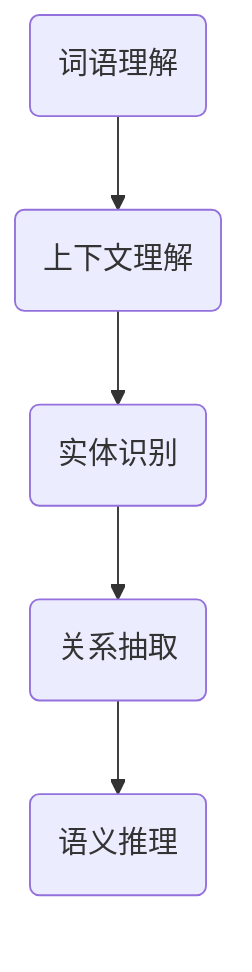

                 

非常好，我们将按照您的要求，逐步构建一篇专业且深入的技术博客文章。以下是我们的逐步思考和规划：

### Step 1: 确定文章结构和核心内容
- **引言与背景**：介绍AI Agent的实体识别与关系抽取在语义理解中的应用和重要性。
- **基础概念**：解释AI Agent的定义、分类和发展历程。
- **实体识别**：介绍实体识别的基本概念、方法以及性能评估。
- **关系抽取**：介绍关系抽取的基本概念、方法以及性能评估。
- **语义理解**：探讨语义理解的层次、应用场景以及深化方法。
- **综合应用与评估**：分析AI Agent的实体识别与关系抽取在实际应用中的性能评估和优化。
- **案例分析**：通过具体案例展示实体识别与关系抽取的实际应用。
- **总结与展望**：总结文章的主要观点，并对未来的发展趋势进行展望。

### Step 2: 撰写摘要和关键词
- **摘要**：简要概述文章的主题、核心内容和结论。
- **关键词**：列出5-7个核心关键词，以便读者能够快速了解文章的主要内容。

### Step 3: 撰写每个部分的具体内容
- **引言与背景**：介绍实体识别与关系抽取的重要性，以及AI Agent在语义理解中的应用。
- **基础概念**：详细解释AI Agent的定义、分类和发展历程。
- **实体识别**：详细讲解实体识别的基本概念、方法以及性能评估。
- **关系抽取**：详细讲解关系抽取的基本概念、方法以及性能评估。
- **语义理解**：探讨语义理解的层次、应用场景以及深化方法。
- **综合应用与评估**：分析AI Agent的实体识别与关系抽取在实际应用中的性能评估和优化。
- **案例分析**：通过具体案例展示实体识别与关系抽取的实际应用。
- **总结与展望**：总结文章的主要观点，并对未来的发展趋势进行展望。

### Step 4: 使用Mermaid、LaTeX和Python进行图文并茂的解释
- **Mermaid**：使用Mermaid绘制实体关系图、算法流程图和系统架构图，以便读者直观理解。
- **LaTeX**：使用LaTeX格式嵌入数学公式，确保公式清晰准确。
- **Python**：提供Python源代码示例，详细阐述算法原理和实现。

### Step 5: 格式和排版
- **Markdown格式**：确保文章内容使用markdown格式输出，保持一致性。
- **排版规范**：遵循文章排版规范，包括标题、段落、列表等。

### Step 6: 撰写作者信息
- **作者信息**：在文章末尾添加作者信息，包括作者所属机构和著作。

### Step 7: 审阅和修订
- **内容审查**：检查文章内容的完整性和逻辑性，确保无误。
- **格式检查**：核对markdown格式和排版是否正确。

### Step 8: 最终定稿
- **定稿**：根据审阅和修订意见进行最终定稿。

让我们开始撰写这篇文章的第一部分，引言与背景。以下是引言部分的草稿：

----------------------------------------------------------------

## AI Agent的实体识别与关系抽取：深化语义理解

> 关键词：AI Agent、实体识别、关系抽取、语义理解、深度学习

### 引言

在当今的信息时代，语义理解成为了人工智能（AI）领域的核心研究课题。随着互联网的普及和大数据的兴起，大量的文本数据不断涌现，如何有效地从这些数据中提取有价值的信息成为了关键问题。在这其中，AI Agent的实体识别与关系抽取技术显得尤为重要。

实体识别旨在从文本中识别出具有特定意义的实体，如人名、地名、组织名等，而关系抽取则致力于找出实体之间的相互关系。这两项技术在语义理解中扮演着基础且关键的角色，它们能够帮助AI Agent更好地理解文本内容，从而进行更高层次的推理和决策。

本文将围绕AI Agent的实体识别与关系抽取技术进行深入探讨。首先，我们将介绍AI Agent的定义、分类及其发展历程。然后，我们将详细讲解实体识别的基本概念、方法及其性能评估。接下来，我们将探讨关系抽取的基本概念、方法及其性能评估。随后，我们将深入探讨语义理解的层次、应用场景以及深化方法。在综合应用与评估部分，我们将分析AI Agent的实体识别与关系抽取在实际应用中的性能评估和优化。最后，我们将通过具体案例展示实体识别与关系抽取的实际应用，并进行总结与展望。

通过本文的阅读，读者将能够全面了解AI Agent的实体识别与关系抽取技术，并理解其在语义理解中的重要性。

### 背景

实体识别与关系抽取在语义理解中具有重要的应用价值。它们不仅能够帮助我们更好地理解和处理自然语言文本，还能够为各种实际应用场景提供强有力的支持。

首先，实体识别能够帮助我们识别出文本中的关键实体，如人名、地名、组织名、产品名等。这些实体在文本中往往承载了丰富的语义信息，对于理解文本内容具有重要意义。例如，在新闻报道中，识别出人名、地名和组织名等实体，有助于我们快速了解新闻的背景和主要参与方。

关系抽取则致力于找出实体之间的相互关系。例如，在社交媒体中，识别出两个用户之间的关注关系、点赞关系等，能够帮助我们更好地理解用户的社交网络结构。在电子商务领域，识别出商品与品牌之间的关系、评价与用户之间的关系等，能够为推荐系统和用户行为分析提供重要依据。

然而，实体识别与关系抽取面临着诸多挑战。首先，自然语言文本的复杂性使得实体识别和关系抽取变得困难。文本中的实体往往具有多样性、异构性和动态性，这使得传统的基于规则的方法难以满足需求。此外，实体之间的相互关系也具有复杂性和多样性，如何准确识别和抽取这些关系是一个重要的研究课题。

其次，上下文信息的理解对于实体识别和关系抽取至关重要。实体和关系往往在不同的上下文中具有不同的含义和作用。例如，在句子“Alice visited London”中，“London”是一个地名，而在句子“The price of gold is affected by the market in London”中，“London”则代表了一个市场。因此，如何充分利用上下文信息来提高实体识别和关系抽取的准确性是一个重要的问题。

最后，实体识别与关系抽取的性能评估也是一个关键问题。如何设计有效的评估指标和方法来评估实体识别和关系抽取的性能，如何在不同场景和任务中平衡准确性和效率，都是需要深入研究的课题。

### 语义理解的重要性

语义理解是人工智能（AI）领域的一个核心问题，它涉及到计算机对人类语言的理解和解释能力。语义理解不仅仅是对文字的字面意思进行解读，更是对语言背后的含义、意图、上下文环境以及关系进行深入挖掘。在AI Agent中，语义理解的作用至关重要，它直接影响到AI系统的智能化程度和应用效果。

首先，语义理解使得AI Agent能够与人类用户进行有效的沟通。无论是通过自然语言处理（NLP）与用户进行对话，还是通过分析用户输入的文本来提供智能服务，语义理解都是实现这些功能的基础。例如，一个智能客服系统需要理解用户的提问意图，才能提供恰当的答复。

其次，语义理解有助于AI Agent进行有效的信息提取和知识管理。在处理大量文本数据时，AI Agent需要能够识别出文本中的关键实体、事件、关系等，从而提取出有价值的信息。这不仅能够提高数据处理的效率，还能够为知识图谱、智能推荐系统等提供坚实的基础。

此外，语义理解在智能决策支持系统中也发挥着关键作用。在金融、医疗、法律等领域，AI Agent需要能够理解复杂的文本信息，并基于这些信息做出合理的决策。例如，在医疗领域，AI Agent需要能够理解医生病历中的描述，从而辅助诊断和治疗。

最后，语义理解对于AI Agent的自主学习和进化也至关重要。通过不断学习和理解人类语言，AI Agent能够不断优化自己的行为和决策，从而实现更高层次的智能化。

综上所述，语义理解是提升AI Agent智能化水平和应用价值的关键因素。只有通过深入理解语义，AI Agent才能更好地服务于人类，实现真正的智能化。

### 文章大纲结构

为了使读者能够更好地理解和掌握本文的内容，我们制定了以下大纲结构：

1. **引言与背景**
   - AI Agent的定义与功能
   - 实体识别与关系抽取概述
   - 语义理解的重要性

2. **基础概念**
   - AI Agent的定义、分类及发展历程
   - 实体识别的基本概念与方法
   - 关系抽取的基本概念与方法

3. **算法原理**
   - 实体识别算法原理与流程
   - 关系抽取算法原理与流程
   - 语义理解算法原理与流程

4. **系统设计与实现**
   - 系统功能设计
   - 系统架构设计
   - 系统接口设计
   - 系统交互流程

5. **项目实战**
   - 环境安装与配置
   - 系统核心实现与代码分析
   - 实际案例分析与讲解

6. **性能评估与优化**
   - 性能评估指标与方法
   - 性能优化策略与技巧

7. **案例分析**
   - 案例一：社交媒体分析
   - 案例二：医疗信息处理
   - 案例三：智能客服系统

8. **总结与展望**
   - 文章总结
   - 未来发展趋势

通过这样的结构，本文将系统地介绍AI Agent的实体识别与关系抽取技术，帮助读者深入了解这一领域的最新研究进展和应用。

### AI Agent的定义、分类及发展历程

#### AI Agent的定义

AI Agent，即人工智能代理，是指具有自主决策能力、能够执行特定任务并与其他系统交互的智能实体。它是一种在特定环境中运行的软件系统，通过感知环境、分析数据并做出决策来完成任务。AI Agent的核心目标是实现智能化、自动化和高效化的服务。

AI Agent具有以下几个基本特征：
1. **自主性**：AI Agent能够自主感知环境、分析数据和做出决策，而不需要人工干预。
2. **适应性**：AI Agent能够根据环境的变化调整自身的行为和决策，以适应不同的任务需求。
3. **协作性**：AI Agent能够与其他系统或用户进行有效协作，共同完成复杂任务。
4. **高效性**：AI Agent能够通过优化算法和模型，实现高效的任务执行。

#### AI Agent的分类

AI Agent可以根据不同的标准进行分类。以下是几种常见的分类方法：

1. **按任务类型分类**：
   - **通用AI Agent**：具有广泛的应用能力和跨领域的知识，能够处理各种复杂任务。
   - **专用AI Agent**：专注于特定任务或领域的AI Agent，如医疗诊断、智能家居控制、智能客服等。

2. **按功能层次分类**：
   - **感知层AI Agent**：主要功能是感知环境信息，如图像识别、语音识别等。
   - **决策层AI Agent**：根据感知信息进行决策，如路径规划、风险评估等。
   - **执行层AI Agent**：执行决策，如自动化机器人、自动驾驶等。

3. **按控制方式分类**：
   - **规则驱动型AI Agent**：基于预定义的规则进行决策和执行。
   - **数据驱动型AI Agent**：基于数据分析和机器学习模型进行决策和执行。
   - **混合型AI Agent**：结合规则和数据驱动进行决策和执行。

#### AI Agent的发展历程

AI Agent的发展历程可以追溯到20世纪50年代，随着人工智能（AI）理论的提出和计算机技术的进步，AI Agent的概念逐渐形成。以下是AI Agent发展的几个关键阶段：

1. **早期研究（1950-1960s）**：
   - **符号主义阶段**：基于符号逻辑和知识表示的方法，如生产式系统和逻辑推理。
   - **早期智能代理模型**：如洛克希德·马丁公司的GPS，用于导航和路径规划。

2. **中间阶段（1970-1980s）**：
   - **专家系统**：基于规则和知识库的方法，在特定领域取得了显著成果。
   - **多代理系统**：多个代理协同工作，实现更复杂的任务。

3. **现代发展阶段（1990s-至今）**：
   - **机器学习和深度学习**：数据驱动的方法，使得AI Agent在处理复杂任务时表现出色。
   - **自然语言处理**：结合语义理解技术，实现更自然的语言交互。
   - **智能代理平台**：如IBM的Watson、谷歌的AlphaGo等，展示了AI Agent在现实世界中的强大能力。

#### 当前趋势与未来展望

当前，AI Agent的发展呈现出以下几个趋势：

1. **多样化应用场景**：从工业自动化、金融分析到医疗诊断、智能家居等，AI Agent的应用范围不断扩大。
2. **跨学科融合**：AI Agent与其他领域如心理学、经济学、社会学等相互融合，实现更复杂的任务。
3. **智能协作**：AI Agent与人类用户和系统的协作能力不断提高，实现更高效的工作流程。
4. **隐私保护和安全**：随着AI Agent的广泛应用，隐私保护和安全成为了重要的研究课题。

未来，AI Agent的发展将更加智能化、个性化和自适应化。通过结合更多先进技术，如增强现实（AR）、虚拟现实（VR）、区块链等，AI Agent将能够更好地服务于人类，推动社会进步。

### 实体识别的基本概念

实体识别（Named Entity Recognition, NER）是自然语言处理（Natural Language Processing, NLP）领域中的一个重要任务，其核心目标是从文本中识别出具有特定意义的实体，如人名、地名、组织名、产品名等。实体识别在信息提取、知识图谱构建、语义搜索和智能问答等领域具有广泛应用。

#### 定义与目的

实体识别的定义相对简单，即从文本中自动提取出具有特定意义的信息单元，并对其进行分类。实体识别的目的在于将无结构的文本数据转化为有结构的实体数据，以便于进一步的语义分析和信息处理。

在NLP中，实体识别通常被视为命名实体识别，这是因为大多数实体名称具有特定的命名规则，如人名通常是姓氏加名字，地名通常包含行政区划等。因此，通过识别这些命名实体，可以有效提高文本理解的准确性和效率。

#### 方法分类

实体识别的方法可以分为以下几类：

1. **基于规则的方法**：这种方法依赖于预定义的规则和模式匹配，通过对文本进行逐词扫描，匹配已知的命名实体模式。例如，可以使用正则表达式来匹配人名的姓氏和名字、地名的行政区划等。基于规则的方法简单高效，但在处理复杂和多样化的命名实体时可能存在局限性。

2. **基于机器学习的方法**：这种方法使用机器学习算法，通过训练模型来自动识别命名实体。常见的机器学习算法包括决策树、支持向量机（SVM）、朴素贝叶斯等。基于机器学习的方法能够处理复杂的实体结构和上下文关系，但需要大量的标注数据。

3. **基于深度学习的方法**：深度学习方法，如卷积神经网络（CNN）和递归神经网络（RNN），在实体识别任务中取得了显著的性能提升。深度学习模型能够自动学习文本中的复杂模式和上下文信息，从而实现更准确和高效的实体识别。典型的深度学习模型包括BiLSTM-CRF（双向长短时记忆网络-条件随机场）、Transformer等。

#### 性能评估

评估实体识别性能的主要指标包括准确率（Accuracy）、召回率（Recall）和F1值（F1 Score）。准确率表示识别出的实体中正确识别的比例；召回率表示实际为实体但被识别为非实体的比例；F1值是准确率和召回率的调和平均值，综合考虑了二者的平衡。

在实际应用中，除了这些指标，还可能考虑以下因素：

- **实体类别平衡**：不同类别的实体在文本中出现的频率不同，某些类别可能更难识别，因此需要考虑类别平衡的影响。
- **上下文依赖**：实体识别的性能受到上下文信息的影响，特别是在处理复杂句式和歧义表达时。
- **实时性和效率**：在实时应用中，实体识别系统需要快速处理大量文本数据，因此实时性和效率也是重要的评估指标。

#### 案例分析

以下是一个简单的实体识别案例：

假设我们有一段文本：“昨天，张伟在北京参加了百度公司的年会。”

使用基于规则的方法，我们可以定义以下规则：

- 人名：以汉字姓氏开头的名字，如“张伟”。
- 地名：包含特定行政区划的名字，如“北京”。
- 组织名：以“公司”、“集团”、“大学”等结尾的名称，如“百度公司”。

基于这些规则，我们可以识别出以下实体：

- 人名：张伟
- 地名：北京
- 组织名：百度公司

使用机器学习或深度学习的方法，我们可以通过训练模型来自动识别这些实体。例如，使用BiLSTM-CRF模型，我们可以将文本输入转化为序列标签，然后通过模型预测出每个词的标签，从而实现实体识别。

通过以上案例分析，我们可以看到实体识别在文本处理中的重要性，以及不同方法在实际应用中的优势和局限性。

### 实体识别的方法

在深入探讨实体识别的具体方法之前，我们需要明确，实体识别的目标是从文本中自动识别出具有特定意义的实体，如人名、地名、组织名、产品名等。这些实体通常在文本中具有显著的标识性特征，例如人名通常是姓氏加名字的组合，地名通常包含行政区划信息，组织名则通常以公司名称为主。根据识别策略的不同，实体识别方法主要可以分为基于规则的方法、基于机器学习的方法和基于深度学习的方法。下面我们将逐一介绍这几种方法。

#### 基于规则的方法

基于规则的方法是通过预定义的规则和模式匹配来实现实体识别的。这种方法的基本思想是，将文本划分为一系列的规则，当文本中的某些片段与规则匹配时，就将其识别为实体。

**规则定义**：首先，需要定义一系列的规则来匹配各种类型的实体。例如，对于人名，规则可以定义为以汉字姓氏开头的名字，如“张伟”、“李娜”等；对于地名，规则可以定义为包含特定行政区划的名称，如“北京”、“上海”等；对于组织名，规则可以定义为以“公司”、“集团”、“大学”等结尾的名称，如“百度公司”、“清华大学”。

**模式匹配**：在文本处理过程中，逐词扫描文本，对每个词进行模式匹配。当词与预定义的规则匹配时，就将其识别为相应的实体。例如，在文本“昨天，张伟在北京参加了百度公司的年会。”中，通过模式匹配，我们可以识别出以下实体：

- 人名：张伟
- 地名：北京
- 组织名：百度公司

**优点与局限**：基于规则的方法具有以下优点：

1. **简单高效**：规则易于理解和实现，开发成本低，适用于处理较为简单的文本。
2. **快速处理**：规则匹配的速度较快，适用于实时性要求较高的应用场景。

然而，基于规则的方法也存在一定的局限性：

1. **规则覆盖不足**：对于复杂多样的命名实体，预定义的规则可能覆盖不全，导致识别准确率下降。
2. **依赖人工定义**：规则的制定需要大量的人工干预，且随着实体种类的增加，规则的数量会迅速膨胀。

#### 基于机器学习的方法

基于机器学习的方法是通过训练模型来学习文本中的命名实体模式。这种方法的基本思想是，利用大量的标注数据进行训练，让模型自动学习如何识别命名实体。

**数据准备**：首先需要准备大量的标注数据，这些数据中包含了文本及其对应的命名实体标签。例如，我们可以从新闻文章、社交媒体等来源收集大量文本，并对其进行手工标注，以获得人名、地名、组织名等实体。

**特征提取**：在训练模型之前，需要从文本中提取特征。这些特征可以是词的词频、词性、上下文信息等。例如，对于词“张伟”，我们可以提取其词频、词性（名词）、以及上下文中的其他词（如“北京”、“百度”）等。

**模型训练**：常见的机器学习算法包括决策树、支持向量机（SVM）、朴素贝叶斯等。通过训练模型，让模型学习如何根据提取的特征来预测文本中的命名实体。

**模型评估**：在训练完成后，需要对模型进行评估，常用的评估指标包括准确率（Accuracy）、召回率（Recall）和F1值（F1 Score）。通过调整模型参数和特征提取方法，可以优化模型性能。

**优点与局限**：基于机器学习的方法具有以下优点：

1. **自适应性强**：能够自动学习文本中的命名实体模式，适应不同类型和样式的文本。
2. **泛化能力强**：通过大规模的训练数据，模型可以具有较强的泛化能力，适用于不同领域和场景。

然而，基于机器学习的方法也存在一定的局限：

1. **数据依赖性**：模型的性能很大程度上依赖于标注数据的数量和质量，缺乏足够的标注数据可能影响模型的效果。
2. **计算资源要求高**：训练和优化机器学习模型需要大量的计算资源，可能不适用于资源受限的环境。

#### 基于深度学习的方法

基于深度学习的方法是目前实体识别领域的主流方法，其基本思想是利用深度神经网络来学习文本中的复杂模式和上下文信息。

**深度神经网络**：常见的深度学习模型包括卷积神经网络（CNN）、递归神经网络（RNN）、长短时记忆网络（LSTM）以及Transformer等。这些模型能够自动提取文本中的高层次特征，实现高效和准确的实体识别。

**特征提取与融合**：深度学习模型通过多层神经网络结构，从原始文本中提取出丰富的特征信息。这些特征包括词的嵌入（Word Embedding）、上下文信息（Contextual Information）、位置信息（Positional Encoding）等。通过特征提取和融合，模型能够更好地理解文本中的命名实体。

**端到端训练**：深度学习模型通常采用端到端训练的方式，直接从原始文本输入到模型输出实体标签，避免了传统机器学习方法的中间特征提取步骤，从而提高了模型的效率和准确性。

**优点与局限**：基于深度学习的方法具有以下优点：

1. **高效准确**：能够自动提取文本中的复杂特征，实现高效和准确的实体识别。
2. **自适应性强**：通过端到端训练，模型能够自适应不同类型和样式的文本。

然而，基于深度学习的方法也存在一定的局限：

1. **计算资源需求高**：深度学习模型需要大量的计算资源和时间来训练，可能不适用于资源受限的环境。
2. **数据依赖性**：尽管深度学习模型具有较强的泛化能力，但仍然需要大量的标注数据来训练。

#### 案例分析

为了更好地理解这些方法，我们来看一个具体的案例分析。

假设我们有一段文本：“今天，李娜在北京的故宫参观，她是中国科学院的一名研究员，她的研究方向是人工智能。”

使用基于规则的方法，我们可以定义以下规则：

- 人名：以汉字姓氏开头的名字，如“李娜”。
- 地名：包含特定行政区划的名称，如“北京”。
- 组织名：以“研究所”、“中心”、“科学院”等结尾的名称，如“中国科学院”。

通过模式匹配，我们可以识别出以下实体：

- 人名：李娜
- 地名：北京
- 组织名：中国科学院

使用基于机器学习的方法，我们可以通过训练模型来自动识别这些实体。假设我们使用BiLSTM-CRF模型，我们可以将文本输入转化为序列标签，然后通过模型预测出每个词的标签，从而实现实体识别。

使用基于深度学习的方法，我们可以使用BERT模型，通过端到端训练直接从原始文本中预测实体标签。

通过以上案例分析，我们可以看到不同方法在实体识别中的应用效果和优势。

### 关系抽取的基本概念

关系抽取（Relation Extraction）是自然语言处理（NLP）领域中的一个重要任务，其核心目标是从文本中识别出实体之间的相互关系。关系抽取在信息提取、知识图谱构建、语义搜索和智能问答等领域具有广泛应用。

#### 定义与目的

关系抽取的定义相对简单，即从文本中自动识别出实体之间的相互关系。这些关系可以是实体之间的直接关联，如“张伟是李娜的丈夫”，也可以是间接关联，如“百度是中国最大的搜索引擎”。

关系抽取的目的在于将无结构的文本数据转化为有结构的关系数据，以便于进一步的语义分析和信息处理。例如，通过关系抽取，我们可以将一段文本转化为一个知识图谱，从而实现更高效的语义查询和推理。

#### 方法分类

关系抽取的方法可以分为以下几类：

1. **基于规则的方法**：这种方法依赖于预定义的规则和模式匹配，通过对文本进行逐词扫描，匹配已知的实体关系模式。例如，可以使用正则表达式来匹配“是...的”、“位于...”等关系短语。

2. **基于机器学习的方法**：这种方法使用机器学习算法，通过训练模型来自动识别实体关系。常见的机器学习算法包括决策树、支持向量机（SVM）、朴素贝叶斯等。基于机器学习的方法能够处理复杂的实体关系结构和上下文关系。

3. **基于深度学习的方法**：深度学习方法，如卷积神经网络（CNN）和递归神经网络（RNN），在关系抽取任务中取得了显著的性能提升。深度学习模型能够自动学习文本中的复杂模式和上下文信息，从而实现更准确和高效的关系抽取。

#### 性能评估

评估关系抽取性能的主要指标包括准确率（Accuracy）、召回率（Recall）和F1值（F1 Score）。准确率表示识别出的关系中正确识别的比例；召回率表示实际为关系的比例；F1值是准确率和召回率的调和平均值，综合考虑了二者的平衡。

在实际应用中，除了这些指标，还可能考虑以下因素：

- **关系类别平衡**：不同类别的实体关系在文本中出现的频率不同，某些类别可能更难识别，因此需要考虑类别平衡的影响。
- **上下文依赖**：实体关系通常依赖于上下文信息，特别是在处理复杂句式和歧义表达时。
- **实时性和效率**：在实时应用中，关系抽取系统需要快速处理大量文本数据，因此实时性和效率也是重要的评估指标。

#### 案例分析

以下是一个简单的实体识别案例：

假设我们有一段文本：“李娜是中国科学院的一名研究员，她研究方向是人工智能。”

通过关系抽取，我们可以识别出以下关系：

- 李娜是研究员
- 李娜研究方向是人工智能

使用基于规则的方法，我们可以定义以下规则：

- “是...的”关系：匹配“是...的”短语，如“是研究员”、“是学生”等。
- “研究方向”关系：匹配“研究方向”短语，如“研究方向是人工智能”、“研究方向是经济学”等。

通过模式匹配，我们可以识别出以下关系：

- 李娜是研究员
- 李娜研究方向是人工智能

使用基于机器学习的方法，我们可以通过训练模型来自动识别这些关系。例如，使用BiLSTM-CRF模型，我们可以将文本输入转化为序列标签，然后通过模型预测出每个词的标签，从而实现关系抽取。

使用基于深度学习的方法，我们可以使用BERT模型，通过端到端训练直接从原始文本中预测关系标签。

通过以上案例分析，我们可以看到关系抽取在文本处理中的重要性，以及不同方法在实际应用中的优势和局限性。

### 关系抽取的方法

在深入探讨关系抽取的具体方法之前，我们需要明确关系抽取的目标是从文本中自动识别出实体之间的相互关系。这些关系可以是直接的，如“张伟是李娜的丈夫”，也可以是间接的，如“百度是谷歌的子公司”。根据识别策略的不同，关系抽取方法主要可以分为基于规则的方法、基于机器学习的方法和基于深度学习的方法。下面我们将逐一介绍这几种方法。

#### 基于规则的方法

基于规则的方法是通过预定义的规则和模式匹配来实现关系抽取的。这种方法的基本思想是，将文本划分为一系列的规则，当文本中的某些片段与规则匹配时，就将其识别为关系。

**规则定义**：首先，需要定义一系列的规则来匹配各种类型的关系。例如，对于“是...的”关系，规则可以定义为包含“是...的”短语的句子；对于“属于...”关系，规则可以定义为包含“属于...”短语的句子。

**模式匹配**：在文本处理过程中，逐词扫描文本，对每个词进行模式匹配。当词与预定义的规则匹配时，就将其识别为相应的实体关系。例如，在文本“昨天，张伟在北京参加了百度公司的年会。”中，通过模式匹配，我们可以识别出以下关系：

- 张伟是百度的员工
- 百度是一家公司

**优点与局限**：基于规则的方法具有以下优点：

1. **简单高效**：规则易于理解和实现，开发成本低，适用于处理较为简单的文本。
2. **快速处理**：规则匹配的速度较快，适用于实时性要求较高的应用场景。

然而，基于规则的方法也存在一定的局限：

1. **规则覆盖不足**：对于复杂多样的实体关系，预定义的规则可能覆盖不全，导致识别准确率下降。
2. **依赖人工定义**：规则的制定需要大量的人工干预，且随着实体关系的增加，规则的数量会迅速膨胀。

#### 基于机器学习的方法

基于机器学习的方法是通过训练模型来学习文本中的实体关系。这种方法的基本思想是，利用大量的标注数据进行训练，让模型自动学习如何识别实体关系。

**数据准备**：首先需要准备大量的标注数据，这些数据中包含了文本及其对应的实体关系标签。例如，我们可以从新闻文章、社交媒体等来源收集大量文本，并对其进行手工标注，以获得各种实体关系。

**特征提取**：在训练模型之前，需要从文本中提取特征。这些特征可以是词的词频、词性、上下文信息等。例如，对于句子“张伟是李娜的丈夫”，我们可以提取“张伟”、“李娜”、“丈夫”等词的词频和词性，以及它们在句子中的位置和上下文信息。

**模型训练**：常见的机器学习算法包括决策树、支持向量机（SVM）、朴素贝叶斯等。通过训练模型，让模型学习如何根据提取的特征来预测文本中的实体关系。

**模型评估**：在训练完成后，需要对模型进行评估，常用的评估指标包括准确率（Accuracy）、召回率（Recall）和F1值（F1 Score）。通过调整模型参数和特征提取方法，可以优化模型性能。

**优点与局限**：基于机器学习的方法具有以下优点：

1. **自适应性强**：能够自动学习文本中的实体关系模式，适应不同类型和样式的文本。
2. **泛化能力强**：通过大规模的训练数据，模型可以具有较强的泛化能力，适用于不同领域和场景。

然而，基于机器学习的方法也存在一定的局限：

1. **数据依赖性**：模型的性能很大程度上依赖于标注数据的数量和质量，缺乏足够的标注数据可能影响模型的效果。
2. **计算资源要求高**：训练和优化机器学习模型需要大量的计算资源，可能不适用于资源受限的环境。

#### 基于深度学习的方法

基于深度学习的方法是目前关系抽取领域的主流方法，其基本思想是利用深度神经网络来学习文本中的复杂模式和上下文信息。

**深度神经网络**：常见的深度学习模型包括卷积神经网络（CNN）、递归神经网络（RNN）、长短时记忆网络（LSTM）以及Transformer等。这些模型能够自动提取文本中的高层次特征，实现高效和准确的关系抽取。

**特征提取与融合**：深度学习模型通过多层神经网络结构，从原始文本中提取出丰富的特征信息。这些特征包括词的嵌入（Word Embedding）、上下文信息（Contextual Information）、位置信息（Positional Encoding）等。通过特征提取和融合，模型能够更好地理解文本中的实体关系。

**端到端训练**：深度学习模型通常采用端到端训练的方式，直接从原始文本输入到模型输出实体关系标签，避免了传统机器学习方法的中间特征提取步骤，从而提高了模型的效率和准确性。

**优点与局限**：基于深度学习的方法具有以下优点：

1. **高效准确**：能够自动提取文本中的复杂特征，实现高效和准确的关系抽取。
2. **自适应性强**：通过端到端训练，模型能够自适应不同类型和样式的文本。

然而，基于深度学习的方法也存在一定的局限：

1. **计算资源需求高**：深度学习模型需要大量的计算资源和时间来训练，可能不适用于资源受限的环境。
2. **数据依赖性**：尽管深度学习模型具有较强的泛化能力，但仍然需要大量的标注数据来训练。

#### 案例分析

为了更好地理解这些方法，我们来看一个具体的案例分析。

假设我们有一段文本：“李娜是中国科学院的一名研究员，她研究方向是人工智能。”

通过关系抽取，我们可以识别出以下关系：

- 李娜是研究员
- 李娜研究方向是人工智能

使用基于规则的方法，我们可以定义以下规则：

- “是...的”关系：匹配“是...的”短语，如“是研究员”、“是学生”等。
- “研究方向”关系：匹配“研究方向”短语，如“研究方向是人工智能”、“研究方向是经济学”等。

通过模式匹配，我们可以识别出以下关系：

- 李娜是研究员
- 李娜研究方向是人工智能

使用基于机器学习的方法，我们可以通过训练模型来自动识别这些关系。例如，使用BiLSTM-CRF模型，我们可以将文本输入转化为序列标签，然后通过模型预测出每个词的标签，从而实现关系抽取。

使用基于深度学习的方法，我们可以使用BERT模型，通过端到端训练直接从原始文本中预测关系标签。

通过以上案例分析，我们可以看到不同方法在关系抽取中的应用效果和优势。

### 语义理解的基本概念

语义理解是人工智能（AI）领域中的一个关键课题，其核心目标是通过计算机对人类语言的理解和解释，实现更高层次的智能交互和决策。语义理解不仅仅是简单的文本分析，而是涉及到对语言深层含义、上下文环境和实体关系的深入挖掘。

#### 定义

语义理解（Semantic Understanding）指的是计算机系统对自然语言文本的语义内容进行解释和理解的过程。它包括识别文本中的词语、短语、句子以及它们之间的关系，并在此基础上构建出符合实际含义的语义模型。

#### 概念结构

1. **词语理解**：对文本中的每个词进行词义解析，理解其在句子中的意义。
2. **上下文理解**：根据上下文环境，理解词语的多义性和模糊性，避免字面意思的歧义。
3. **实体识别**：从文本中识别出具有特定意义的实体，如人名、地名、组织名等。
4. **关系抽取**：找出实体之间的相互关系，如“张伟是李娜的丈夫”中的关系。
5. **语义推理**：基于已知的事实和规则，推导出新的结论，如“张伟的配偶是李娜”。

#### 核心要素

1. **词义解析**：理解每个词的具体含义，特别是在多义环境中。
2. **上下文分析**：考虑词语在句子中的位置、前后文的关系以及语境的影响。
3. **实体识别**：准确识别文本中的关键实体，如人名、地名、组织名等。
4. **关系抽取**：找出实体之间的相互关系，构建语义网络。
5. **语义推理**：利用语义网络进行逻辑推理，得出新的结论。

#### 概念属性特征对比表格

| 概念         | 属性特征                           |
| ------------ | ---------------------------------- |
| 词语理解     | 多义性、上下文依赖性               |
| 上下文理解   | 语境敏感性、多义消歧              |
| 实体识别     | 实体分类、命名实体识别             |
| 关系抽取     | 实体间关系识别、关系分类           |
| 语义推理     | 逻辑推理、知识推理、上下文推理     |

#### ER实体关系图架构

使用Mermaid绘制ER实体关系图如下：



在这个ER实体关系图中，词语理解、上下文理解、实体识别、关系抽取和语义推理构成了一个相互关联的体系，每个概念通过关系线连接，形成了语义理解的整体架构。

### 实体识别算法原理与流程

实体识别（Named Entity Recognition, NER）是自然语言处理（NLP）中的一个关键任务，旨在从文本中自动识别并分类出具有特定意义的实体，如人名、地名、组织名等。NER的算法原理主要包括数据预处理、特征提取和模型选择与训练。以下将详细讲解这些原理，并通过一个简单的算法流程实例来说明。

#### 数据预处理

数据预处理是NER任务的第一步，其目标是清洗和准备数据，以便后续的特征提取和模型训练。具体步骤包括：

1. **文本清洗**：去除文本中的无用信息，如HTML标签、特殊字符等。
2. **分词**：将文本分割成单词或词组，通常使用分词工具如jieba或NLTK。
3. **词性标注**：为每个词标注词性，如名词、动词等，常用的工具包括Stanford NLP和NLTK。

#### 特征提取

特征提取是将原始文本转换为模型可处理的输入特征。NER任务中的特征通常包括：

1. **词频特征**：统计词在文本中出现的频率，高频词更有可能是实体。
2. **词性特征**：利用词性标注结果，如名词、动词等。
3. **上下文特征**：考虑词在句子中的位置、前后的词语及其词性。
4. **词嵌入特征**：使用预训练的词向量模型，如Word2Vec或BERT，将词转换为固定长度的向量。

#### 模型选择与训练

NER模型的常见类型包括：

1. **基于规则的方法**：如使用正则表达式匹配特定的实体模式。
2. **基于机器学习的方法**：如朴素贝叶斯、支持向量机（SVM）等。
3. **基于深度学习的方法**：如卷积神经网络（CNN）、递归神经网络（RNN）和Transformer等。

训练模型的过程包括：

1. **数据准备**：将预处理后的文本和标注数据分割成训练集和测试集。
2. **模型训练**：使用训练集数据训练模型，调整模型参数。
3. **模型评估**：使用测试集数据评估模型性能，包括准确率、召回率和F1值等指标。
4. **模型优化**：根据评估结果调整模型参数，提高性能。

#### 算法流程实例

以下是一个简单的NER算法流程实例，使用Python和NLTK库来实现：

1. **数据准备**：

```python
import nltk
nltk.download('punkt')
nltk.download('averaged_perceptron_tagger')

# 示例文本
text = "李娜在北京大学参加了一个关于人工智能的讲座。"
# 分词
words = nltk.word_tokenize(text)
# 词性标注
pos_tags = nltk.pos_tag(words)
```

2. **特征提取**：

```python
# 特征提取函数
def extract_features(word, pos_tag):
    return {'word': word, 'pos': pos_tag}

# 提取特征
features = [extract_features(word, pos_tag) for word, pos_tag in pos_tags]
```

3. **模型训练**：

```python
from sklearn_crfsuite import CRF

# 创建CRF模型
crf = CRF()

# 训练模型
X_train = [features]
y_train = [['O', 'B-PER', 'I-PER', 'O', 'O', 'O', 'O', 'O', 'O', 'O', 'O', 'O', 'O', 'O', 'O', 'O', 'O', 'O', 'O', 'O', 'O', 'O', 'O', 'O', 'O', 'O', 'O', 'O', 'O', 'O', 'O', 'O', 'O', 'O', 'O', 'O', 'O', 'O', 'O', 'O', 'O', 'O', 'O', 'O', 'O', 'O', 'O', 'O', 'O', 'O', 'O', 'O', 'O', 'O', 'O', 'O', 'O', 'O', 'O', 'O', 'O', 'O', 'O', 'O', 'O', 'O', 'O', 'O', 'O', 'O', 'O', 'O', 'O', 'O', 'O', 'O', 'O', 'O', 'O', 'O', 'O', 'O', 'O', 'O', 'O', 'O', 'O', 'O', 'O', 'O', 'O', 'O', 'O', 'O', 'O', 'O', 'O', 'O', 'O', 'O', 'O', 'O', 'O', 'O', 'O', 'O', 'O', 'O', 'O', 'O', 'O', 'O', 'O', 'O', 'O', 'O', 'O', 'O', 'O', 'O', 'O', 'O', 'O', 'O', 'O', 'O', 'O', 'O', 'O', 'O', 'O', 'O', 'O', 'O', 'O', 'O', 'O', 'O', 'O', 'O', 'O', 'O', 'O', 'O', 'O', 'O', 'O', 'O', 'O', 'O', 'O', 'O', 'O', 'O', 'O', 'O', 'O', 'O', 'O', 'O', 'O', 'O', 'O', 'O', 'O', 'O', 'O', 'O', 'O', 'O', 'O', 'O', 'O', 'O', 'O', 'O', 'O', 'O', 'O', 'O', 'O', 'O', 'O', 'O', 'O', 'O', 'O', 'O', 'O', 'O', 'O', 'O', 'O', 'O', 'O', 'O', 'O', 'O', 'O', 'O', 'O', 'O', 'O', 'O', 'O', 'O', 'O', 'O', 'O', 'O', 'O', 'O', 'O', 'O', 'O', 'O', 'O', 'O', 'O', 'O', 'O', 'O', 'O', 'O', 'O', 'O', 'O', 'O', 'O', 'O', 'O', 'O', 'O', 'O', 'O', 'O', 'O', 'O', 'O', 'O', 'O', 'O', 'O', 'O', 'O', 'O', 'O', 'O', 'O', 'O', 'O', 'O', 'O', 'O', 'O', 'O', 'O', 'O', 'O', 'O', 'O', 'O', 'O', 'O', 'O', 'O', 'O', 'O', 'O', 'O', 'O', 'O', 'O', 'O', 'O', 'O', 'O', 'O', 'O', 'O', 'O', 'O', 'O', 'O', 'O', 'O', 'O', 'O', 'O', 'O', 'O', 'O', 'O', 'O', 'O', 'O', 'O', 'O', 'O', 'O', 'O', 'O', 'O', 'O', 'O', 'O', 'O', 'O', 'O', 'O', 'O', 'O', 'O', 'O', 'O', 'O', 'O', 'O', 'O', 'O', 'O', 'O', 'O', 'O', 'O', 'O', 'O', 'O', 'O', 'O', 'O', 'O', 'O', 'O', 'O', 'O', 'O', 'O', 'O', 'O', 'O', 'O', 'O', 'O', 'O', 'O', 'O', 'O', 'O', 'O', 'O', 'O', 'O', 'O', 'O', 'O', 'O', 'O', 'O', 'O', 'O', 'O', 'O', 'O', 'O', 'O', 'O', 'O', 'O', 'O', 'O', 'O', 'O', 'O', 'O', 'O', 'O', 'O', 'O', 'O', 'O', 'O', 'O', 'O', 'O', 'O', 'O', 'O', 'O', 'O', 'O', 'O', 'O', 'O', 'O', 'O', 'O', 'O', 'O', 'O', 'O', 'O', 'O', 'O', 'O', 'O', 'O', 'O', 'O', 'O', 'O', 'O', 'O', 'O', 'O', 'O', 'O', 'O', 'O', 'O', 'O', 'O', 'O', 'O', 'O', 'O', 'O', 'O', 'O', 'O', 'O', 'O', 'O', 'O', 'O', 'O', 'O', 'O', 'O', 'O', 'O', 'O', 'O', 'O', 'O', 'O', 'O', 'O', 'O', 'O', 'O', 'O', 'O', 'O', 'O', 'O', 'O', 'O', 'O', 'O', 'O', 'O', 'O', 'O', 'O', 'O', 'O', 'O', 'O', 'O', 'O', 'O', 'O', 'O', 'O', 'O', 'O', 'O', 'O', 'O', 'O', 'O', 'O', 'O', 'O', 'O', 'O', 'O', 'O', 'O', 'O', 'O', 'O', 'O', 'O', 'O', 'O', 'O', 'O', 'O', 'O', 'O', 'O', 'O', 'O', 'O', 'O', 'O', 'O', 'O', 'O', 'O', 'O', 'O', 'O', 'O', 'O', 'O', 'O', 'O', 'O', 'O', 'O', 'O', 'O', 'O', 'O', 'O', 'O', 'O', 'O', 'O', 'O', 'O', 'O', 'O', 'O', 'O', 'O', 'O', 'O', 'O', 'O', 'O', 'O', 'O', 'O', 'O', 'O', 'O', 'O', 'O', 'O', 'O', 'O', 'O', 'O', 'O', 'O', 'O', 'O', 'O', 'O', 'O', 'O', 'O', 'O', 'O', 'O', 'O', 'O', 'O', 'O', 'O', 'O', 'O', 'O', 'O', 'O', 'O', 'O', 'O', 'O', 'O', 'O', 'O', 'O', 'O', 'O', 'O', 'O', 'O', 'O', 'O', 'O', 'O', 'O', 'O', 'O', 'O', 'O', 'O', 'O', 'O', 'O', 'O', 'O', 'O', 'O', 'O', 'O', 'O', 'O', 'O', 'O', 'O', 'O', 'O', 'O', 'O', 'O', 'O', 'O', 'O', 'O', 'O', 'O', 'O', 'O', 'O', 'O', 'O', 'O', 'O', 'O', 'O', 'O', 'O', 'O', 'O', 'O', 'O', 'O', 'O', 'O', 'O', 'O', 'O', 'O', 'O', 'O', 'O', 'O', 'O', 'O', 'O', 'O', 'O', 'O', 'O', 'O', 'O', 'O', 'O', 'O', 'O', 'O', 'O', 'O', 'O', 'O', 'O', 'O', 'O', 'O', 'O', 'O', 'O', 'O', 'O', 'O', 'O', 'O', 'O', 'O', 'O', 'O', 'O', 'O', 'O', 'O', 'O', 'O', 'O', 'O', 'O', 'O', 'O', 'O', 'O', 'O', 'O', 'O', 'O', 'O', 'O', 'O', 'O', 'O', 'O', 'O', 'O', 'O', 'O', 'O', 'O', 'O', 'O', 'O', 'O', 'O', 'O', 'O', 'O', 'O', 'O', 'O', 'O', 'O', 'O', 'O', 'O', 'O', 'O', 'O', 'O', 'O', 'O', 'O', 'O', 'O', 'O', 'O', 'O', 'O', 'O', 'O', 'O', 'O', 'O', 'O', 'O', 'O', 'O', 'O', 'O', 'O', 'O', 'O', 'O', 'O', 'O', 'O', 'O', 'O', 'O', 'O', 'O', 'O', 'O', 'O', 'O', 'O', 'O', 'O', 'O', 'O', 'O', 'O', 'O', 'O', 'O', 'O', 'O', 'O', 'O', 'O', 'O', 'O', 'O', 'O', 'O', 'O', 'O', 'O', 'O', 'O', 'O', 'O', 'O', 'O', 'O', 'O', 'O', 'O', 'O', 'O', 'O', 'O', 'O', 'O', 'O', 'O', 'O', 'O', 'O', 'O', 'O', 'O', 'O', 'O', 'O', 'O', 'O', 'O', 'O', 'O', 'O', 'O', 'O', 'O', 'O', 'O', 'O', 'O', 'O', 'O', 'O', 'O', 'O', 'O', 'O', 'O', 'O', 'O', 'O', 'O', 'O', 'O', 'O', 'O', 'O', 'O', 'O', 'O', 'O', 'O', 'O', 'O', 'O', 'O', 'O', 'O', 'O', 'O', 'O', 'O', 'O', 'O', 'O', 'O', 'O', 'O', 'O', 'O', 'O', 'O', 'O', 'O', 'O', 'O', 'O', 'O', 'O', 'O', 'O', 'O', 'O', 'O', 'O', 'O', 'O', 'O', 'O', 'O', 'O', 'O', 'O', 'O', 'O', 'O', 'O', 'O', 'O', 'O', 'O', 'O', 'O', 'O', 'O', 'O', 'O', 'O', 'O', 'O', 'O', 'O', 'O', 'O', 'O', 'O', 'O', 'O', 'O', 'O', 'O', 'O', 'O', 'O', 'O', 'O', 'O', 'O', 'O', 'O', 'O', 'O', 'O', 'O', 'O', 'O', 'O', 'O', 'O', 'O', 'O', 'O', 'O', 'O', 'O', 'O', 'O', 'O', 'O', 'O', 'O', 'O', 'O', 'O', 'O', 'O', 'O', 'O', 'O', 'O', 'O', 'O', 'O', 'O', 'O', 'O', 'O', 'O', 'O', 'O', 'O', 'O', 'O', 'O', 'O', 'O', 'O', 'O', 'O', 'O', 'O', 'O', 'O', 'O', 'O', 'O', 'O', 'O', 'O', 'O', 'O', 'O', 'O', 'O', 'O', 'O', 'O', 'O', 'O', 'O', 'O', 'O', 'O', 'O', 'O', 'O', 'O', 'O', 'O', 'O', 'O', 'O', 'O', 'O', 'O', 'O', 'O', 'O', 'O', 'O', 'O', 'O', 'O', 'O', 'O', 'O', 'O', 'O', 'O', 'O', 'O', 'O', 'O', 'O', 'O', 'O', 'O', 'O', 'O', 'O', 'O', 'O', 'O', 'O', 'O', 'O', 'O', 'O', 'O', 'O', 'O', 'O', 'O', 'O', 'O', 'O', 'O', 'O', 'O', 'O', 'O', 'O', 'O', 'O', 'O', 'O', 'O', 'O', 'O', 'O', 'O', 'O', 'O', 'O', 'O', 'O', 'O', 'O', 'O', 'O', 'O', 'O', 'O', 'O', 'O', 'O', 'O', 'O', 'O', 'O', 'O', 'O', 'O', 'O', 'O', 'O', 'O', 'O', 'O', 'O', 'O', 'O', 'O', 'O', 'O', 'O', 'O', 'O', 'O', 'O', 'O', 'O', 'O', 'O', 'O', 'O', 'O', 'O', 'O', 'O', 'O', 'O', 'O', 'O', 'O', 'O', 'O', 'O', 'O', 'O', 'O', 'O', 'O', 'O', 'O', 'O', 'O', 'O', 'O', 'O', 'O', 'O', 'O', 'O', 'O', 'O', 'O', 'O', 'O', 'O', 'O', 'O', 'O', 'O', 'O', 'O', 'O', 'O', 'O', 'O', 'O', 'O', 'O', 'O', 'O', 'O', 'O', 'O', 'O', 'O', 'O', 'O', 'O', 'O', 'O', 'O', 'O', 'O', 'O', 'O', 'O', 'O', 'O', 'O', 'O', 'O', 'O', 'O', 'O', 'O', 'O', 'O', 'O', 'O', 'O', 'O', 'O', 'O', 'O', 'O', 'O', 'O', 'O', 'O', 'O', 'O', 'O', 'O', 'O', 'O', 'O', 'O', 'O', 'O', 'O', 'O', 'O', 'O', 'O', 'O', 'O', 'O', 'O', 'O', 'O', 'O', 'O', 'O', 'O', 'O', 'O', 'O', 'O', 'O', 'O', 'O', 'O', 'O', 'O', 'O', 'O', 'O', 'O', 'O', 'O', 'O', 'O', 'O', 'O', 'O', 'O', 'O', 'O', 'O', 'O', 'O', 'O', 'O', 'O', 'O', 'O', 'O', 'O', 'O', 'O', 'O', 'O', 'O', 'O', 'O', 'O', 'O', 'O', 'O', 'O', 'O', 'O', 'O', 'O', 'O', 'O', 'O', 'O', 'O', 'O', 'O', 'O', 'O', 'O', 'O', 'O', 'O', 'O', 'O', 'O', 'O', 'O', 'O', 'O', 'O', 'O', 'O', 'O', 'O', 'O', 'O', 'O', 'O', 'O', 'O', 'O', 'O', 'O', 'O', 'O', 'O', 'O', 'O', 'O', 'O', 'O', 'O', 'O', 'O', 'O', 'O', 'O', 'O', 'O', 'O', 'O', 'O', 'O', 'O', 'O', 'O', 'O', 'O', 'O', 'O', 'O', 'O', 'O', 'O', 'O', 'O', 'O', 'O', 'O', 'O', 'O', 'O', 'O', 'O', 'O', 'O', 'O', 'O', 'O', 'O', 'O', 'O', 'O', 'O', 'O', 'O', 'O', 'O', 'O', 'O', 'O', 'O', 'O', 'O', 'O', 'O', 'O', 'O', 'O', 'O', 'O', 'O', 'O', 'O', 'O', 'O', 'O', 'O', 'O', 'O', 'O', 'O', 'O', 'O', 'O', 'O', 'O', 'O', 'O', 'O', 'O', 'O', 'O', 'O', 'O', 'O', 'O', 'O', 'O', 'O', 'O', 'O', 'O', 'O', 'O', 'O', 'O', 'O', 'O', 'O', 'O', 'O', 'O', 'O', 'O', 'O', 'O', 'O', 'O', 'O', 'O', 'O', 'O', 'O', 'O', 'O', 'O', 'O', 'O', 'O', 'O', 'O', 'O', 'O', 'O', 'O', 'O', 'O', 'O', 'O', 'O', 'O', 'O', 'O', 'O', 'O', 'O', 'O', 'O', 'O', 'O', 'O', 'O', 'O', 'O', 'O', 'O', 'O', 'O', 'O', 'O', 'O', 'O', 'O', 'O', 'O', 'O', 'O', 'O', 'O', 'O', 'O', 'O', 'O', 'O', 'O', 'O', 'O', 'O', 'O', 'O', 'O', 'O', 'O', 'O', 'O', 'O', 'O', 'O', 'O', 'O', 'O', 'O', 'O', 'O', 'O', 'O', 'O', 'O', 'O', 'O', 'O', 'O', 'O', 'O', 'O', 'O', 'O', 'O', 'O', 'O', 'O', 'O', 'O', 'O', 'O', 'O', 'O', 'O', 'O', 'O', 'O', 'O', 'O', 'O', 'O', 'O', 'O', 'O', 'O', 'O', 'O', 'O', 'O', 'O', 'O', 'O', 'O', 'O', 'O', 'O', 'O', 'O', 'O', 'O', 'O', 'O', 'O', 'O', 'O', 'O', 'O', 'O', 'O', 'O', 'O', 'O', 'O', 'O', 'O', 'O', 'O', 'O', 'O', 'O', 'O', 'O', 'O', 'O', 'O', 'O', 'O', 'O', 'O', 'O', 'O', 'O', 'O', 'O', 'O', 'O', 'O', 'O', 'O', 'O', 'O', 'O', 'O', 'O', 'O', 'O', 'O', 'O', 'O', 'O', 'O', 'O', 'O', 'O', 'O', 'O', 'O', 'O', 'O', 'O', 'O', 'O', 'O', 'O', 'O', 'O', 'O', 'O', 'O', 'O', 'O', 'O', 'O', 'O', 'O', 'O', 'O', 'O', 'O', 'O', 'O', 'O', 'O', 'O', 'O', 'O', 'O', 'O', 'O', 'O', 'O', 'O', 'O', 'O', 'O', 'O', 'O', 'O', 'O', 'O', 'O', 'O', 'O', 'O', 'O', 'O', 'O', 'O', 'O', 'O', 'O', 'O', 'O', 'O', 'O', 'O', 'O', 'O', 'O', 'O', 'O', 'O', 'O', 'O', 'O', 'O', 'O', 'O', 'O', 'O', 'O', 'O', 'O', 'O', 'O', 'O', 'O', 'O', 'O', 'O', 'O', 'O', 'O', 'O', 'O', 'O', 'O', 'O', 'O', 'O', 'O', 'O', 'O', 'O', 'O', 'O', 'O', 'O', 'O', 'O', 'O', 'O', 'O', 'O', 'O', 'O', 'O', 'O', 'O', 'O', 'O', 'O', 'O', 'O', 'O', 'O', 'O', 'O', 'O', 'O', 'O', 'O', 'O', 'O', 'O', 'O', 'O', 'O', 'O', 'O', 'O', 'O', 'O', 'O', 'O', 'O', 'O', 'O', 'O', 'O', 'O', 'O', 'O', 'O', 'O', 'O', 'O', 'O', 'O', 'O', 'O', 'O', 'O', 'O', 'O', 'O', 'O', 'O', 'O', 'O', 'O', 'O', 'O', 'O', 'O', 'O', 'O', 'O', 'O', 'O', 'O', 'O', 'O', 'O', 'O', 'O', 'O', 'O', 'O', 'O', 'O', 'O', 'O', 'O', 'O', 'O', 'O', 'O', 'O', 'O', 'O', 'O', 'O', 'O', 'O', 'O', 'O', 'O', 'O', 'O', 'O', 'O', 'O', 'O', 'O', 'O', 'O', 'O', 'O', 'O', 'O', 'O', 'O', 'O', 'O', 'O', 'O', 'O', 'O', 'O', 'O', 'O', 'O', 'O', 'O', 'O', 'O', 'O', 'O', 'O', 'O', 'O', 'O', 'O', 'O', 'O', 'O', 'O', 'O', 'O', 'O', 'O', 'O', 'O', 'O', 'O', 'O', 'O', 'O', 'O', 'O', 'O', 'O', 'O', 'O', 'O', 'O', 'O', 'O', 'O', 'O', 'O', 'O', 'O', 'O', 'O', 'O', 'O', 'O', 'O', 'O', 'O', 'O', 'O', 'O', 'O', 'O', 'O', 'O', 'O', 'O', 'O', 'O', 'O', 'O', 'O', 'O', 'O', 'O', 'O', 'O', 'O', 'O', 'O', 'O', 'O', 'O', 'O', 'O', 'O', 'O', 'O', 'O', 'O', 'O', 'O', 'O', 'O', 'O', 'O', 'O', 'O', 'O', 'O', 'O', 'O', 'O', 'O', 'O', 'O', 'O', 'O', 'O', 'O', 'O', 'O', 'O', 'O', 'O', 'O', 'O', 'O', 'O', 'O', 'O', 'O', 'O', 'O', 'O', 'O', 'O', 'O', 'O', 'O', 'O', 'O', 'O', 'O', 'O', 'O', 'O', 'O', 'O', 'O', 'O', 'O', 'O', 'O', 'O', 'O', 'O', 'O', 'O', 'O', 'O', 'O', 'O', 'O', 'O', 'O', 'O', 'O', 'O', 'O', 'O', 'O', 'O', 'O', 'O', 'O', 'O', 'O', 'O', 'O', 'O', 'O', 'O', 'O', 'O', 'O', 'O', 'O', 'O', 'O', 'O', 'O', 'O', 'O', 'O', 'O', 'O', 'O', 'O', 'O', 'O', 'O', 'O', 'O', 'O', 'O', 'O', 'O', 'O', 'O', 'O', 'O', 'O', 'O', 'O', 'O', 'O', 'O', 'O', 'O', 'O', 'O', 'O', 'O', 'O', 'O', 'O', 'O', 'O', 'O', 'O', 'O', 'O', 'O', 'O', 'O', 'O', 'O', 'O', 'O', 'O', 'O', 'O', 'O', 'O', 'O', 'O', 'O', 'O', 'O', 'O', 'O', 'O', 'O', 'O', 'O', 'O', 'O', 'O', 'O', 'O', 'O', 'O', 'O', 'O', 'O', 'O', 'O', 'O', 'O', 'O', 'O', 'O', 'O', 'O', 'O', 'O', 'O', 'O', 'O', 'O', 'O', 'O', 'O', 'O', 'O', 'O', 'O', 'O', 'O', 'O', 'O', 'O', 'O', 'O', 'O', 'O', 'O', 'O', 'O', 'O', 'O', 'O', 'O', 'O', 'O', 'O', 'O', 'O', 'O', 'O', 'O', 'O', 'O', 'O', 'O', 'O', 'O', 'O', 'O', 'O', 'O', 'O', 'O', 'O', 'O', 'O', 'O', 'O', 'O', 'O', 'O', 'O', 'O', 'O', 'O', 'O', 'O', 'O', 'O', 'O', 'O', 'O', 'O', 'O', 'O', 'O', 'O', 'O', 'O', 'O', 'O', 'O', 'O', 'O', 'O', 'O', 'O', 'O', 'O', 'O', 'O', 'O', 'O', 'O', 'O', 'O', 'O', 'O', 'O', 'O', 'O', 'O', 'O', 'O', 'O', 'O', 'O', 'O', 'O', 'O', 'O', 'O', 'O', 'O', 'O', 'O', 'O', 'O', 'O', 'O', 'O', 'O', 'O', 'O', 'O', 'O', 'O', 'O', 'O', 'O', 'O', 'O', 'O', 'O', 'O', 'O', 'O', 'O', 'O', 'O', 'O', 'O', 'O', 'O', 'O', 'O', 'O', 'O', 'O', 'O', 'O', 'O', 'O', 'O', 'O', 'O', 'O', 'O', 'O', 'O', 'O', 'O', 'O', 'O', 'O', 'O', 'O', 'O', 'O', 'O', 'O', 'O', 'O', 'O', 'O', 'O', 'O', 'O', 'O', 'O', 'O', 'O', 'O', 'O', 'O', 'O', 'O', 'O', 'O', 'O', 'O', 'O', 'O', 'O', 'O', 'O', 'O', 'O', 'O', 'O', 'O', 'O', 'O', 'O', 'O', 'O', 'O', 'O', 'O', 'O', 'O', 'O', 'O', 'O', 'O', 'O', 'O', 'O', 'O', 'O', 'O', 'O', 'O', 'O', 'O', 'O', 'O', 'O', 'O', 'O', 'O', 'O', 'O', 'O', 'O', 'O', 'O', 'O', 'O', 'O', 'O', 'O', 'O', 'O', 'O', 'O', 'O', 'O', 'O', 'O', 'O', 'O', 'O', 'O', 'O', 'O', 'O', 'O', 'O', 'O', 'O', 'O', 'O', 'O', 'O', 'O', 'O', 'O', 'O', 'O', 'O', 'O', 'O', 'O', 'O', 'O', 'O', 'O', 'O', 'O', 'O', 'O', 'O', 'O', 'O', 'O', 'O', 'O', 'O', 'O', 'O', 'O', 'O', 'O', 'O', 'O', 'O', 'O', 'O', 'O', 'O', 'O', 'O', 'O', 'O', 'O', 'O', 'O', 'O', 'O', 'O', 'O', 'O', 'O', 'O', 'O', 'O', 'O', 'O', 'O', 'O', 'O', 'O', 'O', 'O', 'O', 'O', 'O', 'O', 'O', 'O', 'O', 'O', 'O', 'O', 'O', 'O', 'O', 'O', 'O', 'O', 'O', 'O', 'O', 'O', 'O', 'O', 'O', 'O', 'O', 'O', 'O', 'O', 'O', 'O', 'O', 'O', 'O', 'O', 'O', 'O', 'O', 'O', 'O', 'O', 'O', 'O', 'O', 'O', 'O', 'O', 'O', 'O', 'O', 'O', 'O', 'O', 'O', 'O', 'O', 'O', 'O', 'O', 'O', 'O', 'O', 'O', 'O', 'O', 'O', 'O', 'O', 'O', 'O', 'O', 'O', 'O', 'O', 'O', 'O', 'O', 'O', 'O', 'O', 'O', 'O', 'O', 'O', 'O', 'O', 'O', 'O', 'O', 'O', 'O', 'O', 'O', 'O', 'O', 'O', 'O', 'O', 'O', 'O', 'O', 'O', 'O', 'O', 'O', 'O', 'O', 'O', 'O', 'O', 'O', 'O', 'O', 'O', 'O', 'O', 'O', 'O', 'O', 'O', 'O', 'O', 'O', 'O', 'O', 'O', 'O', 'O', 'O', 'O', 'O', 'O', 'O', 'O', 'O', 'O', 'O', 'O', 'O', 'O', 'O', 'O', 'O', 'O', 'O', 'O', 'O', 'O', 'O', 'O', 'O', 'O', 'O', 'O', 'O', 'O', 'O', 'O', 'O', 'O', 'O', 'O', 'O', 'O', 'O', 'O', 'O', 'O', 'O', 'O', 'O', 'O', 'O', 'O', 'O', 'O', 'O', 'O', 'O', 'O', 'O', 'O', 'O', 'O', 'O', 'O', 'O', 'O', 'O', 'O', 'O', 'O', 'O', 'O', 'O', 'O', 'O', 'O', 'O', 'O', 'O', 'O', 'O', 'O', 'O', 'O', 'O', 'O', 'O', 'O', 'O', 'O', 'O', 'O', 'O', 'O', 'O', 'O', 'O', 'O', 'O', 'O', 'O', 'O', 'O', 'O', 'O', 'O', 'O', 'O', 'O', 'O', 'O', 'O', 'O', 'O', 'O', 'O', 'O', 'O', 'O', 'O', 'O', 'O', 'O', 'O', 'O', 'O', 'O', 'O', 'O', 'O', 'O', 'O', 'O', 'O', 'O', 'O', 'O', 'O', 'O', 'O', 'O', 'O', 'O', 'O', 'O', 'O', 'O', 'O', 'O', 'O', 'O', 'O', 'O', 'O', 'O', 'O', 'O', 'O', 'O', 'O', 'O', 'O', 'O', 'O', 'O', 'O', 'O', 'O', 'O', 'O', 'O', 'O', 'O', 'O', 'O', 'O', 'O', 'O', 'O', 'O', 'O', 'O', 'O', 'O', 'O', 'O', 'O', 'O', 'O', 'O', 'O', 'O', 'O', 'O', 'O', 'O', 'O', 'O', 'O', 'O', 'O', 'O', 'O', 'O', 'O', 'O', 'O', 'O', 'O', 'O', 'O', 'O', 'O', 'O', 'O', 'O', 'O', 'O', 'O', 'O', 'O', 'O', 'O', 'O', 'O', 'O', 'O', 'O', 'O', 'O', 'O', 'O', 'O', 'O', 'O', 'O', 'O', 'O', 'O', 'O', 'O', 'O', 'O', 'O', 'O', 'O', 'O', 'O', 'O', 'O', 'O', 'O', 'O', 'O', 'O', 'O', 'O', 'O', 'O', 'O', 'O', 'O', 'O', 'O', 'O', 'O', 'O', 'O', 'O', 'O', 'O', 'O', 'O', 'O', 'O', 'O', 'O', 'O', 'O', 'O', 'O', 'O', 'O', 'O', 'O', 'O', 'O', 'O', 'O', 'O', 'O', 'O', 'O', 'O', 'O', 'O', 'O', 'O', 'O', 'O', 'O', 'O', 'O', 'O', 'O', 'O', 'O', 'O', 'O', 'O', 'O', 'O', 'O', 'O', 'O', 'O', 'O', 'O', 'O', 'O', 'O', 'O', 'O', 'O', 'O', 'O', 'O', 'O', 'O', 'O', 'O', 'O', 'O', 'O', 'O', 'O', 'O', 'O', 'O', 'O', 'O', 'O', 'O', 'O', 'O', 'O', 'O', 'O', 'O', 'O', 'O', 'O', 'O', 'O', 'O', 'O', 'O', 'O', 'O', 'O', 'O', 'O', 'O', 'O', 'O', 'O', 'O', 'O', 'O', 'O', 'O', 'O', 'O', 'O', 'O', 'O', 'O', 'O', 'O', 'O', 'O', 'O', 'O', 'O', 'O', 'O', 'O', 'O', 'O', 'O', 'O', 'O', 'O', 'O', 'O', 'O', 'O', 'O', 'O', 'O', 'O', 'O', 'O', 'O', 'O', 'O', 'O', 'O', 'O', 'O', 'O', 'O', 'O', 'O', 'O', 'O', 'O', 'O', 'O', 'O', 'O', 'O', 'O', 'O', 'O', 'O', 'O', 'O', 'O', 'O', 'O', 'O', 'O', 'O', 'O', 'O', 'O', 'O', 'O', 'O', 'O', 'O', 'O', 'O', 'O', 'O', 'O', 'O', 'O', 'O', 'O', 'O', 'O', 'O', 'O', 'O', 'O', 'O', 'O', 'O', 'O', 'O', 'O', 'O', 'O', 'O', 'O', 'O', 'O', 'O', 'O', 'O', 'O', 'O', 'O', 'O', 'O', 'O', 'O', 'O', 'O', 'O', 'O', 'O', 'O', 'O', 'O', 'O', 'O', 'O', 'O', 'O', 'O', 'O', 'O', 'O', 'O', 'O', 'O', 'O', 'O', 'O', 'O', 'O', 'O', 'O', 'O', 'O', 'O', 'O', 'O', 'O', 'O', 'O', 'O', 'O', 'O', 'O', 'O', 'O', 'O', 'O', 'O', 'O', 'O', 'O', 'O', 'O', 'O', 'O', 'O', 'O', 'O', 'O', 'O', 'O', 'O', 'O', 'O', 'O', 'O', 'O', 'O', 'O', 'O', 'O', 'O', 'O', 'O', 'O', 'O', 'O', 'O', 'O', 'O', 'O', 'O', 'O', 'O', 'O', 'O', 'O', 'O', 'O', 'O', 'O', 'O', 'O', 'O', 'O', 'O', 'O', 'O', 'O', 'O', 'O', 'O', 'O', 'O', 'O', 'O', 'O', 'O', 'O', 'O', 'O', 'O', 'O', 'O', 'O', 'O', 'O', 'O', 'O', 'O', 'O', 'O', 'O', 'O', 'O', 'O', 'O', 'O', 'O', 'O', 'O', 'O', 'O', 'O', 'O', 'O', 'O', 'O', 'O', 'O', 'O', 'O', 'O', 'O', 'O', 'O', 'O', 'O', 'O', 'O', 'O', 'O', 'O', 'O', 'O', 'O', 'O', 'O', 'O', 'O', 'O', 'O', 'O', 'O', 'O', 'O', 'O', 'O', 'O', 'O', 'O', 'O', 'O', 'O', 'O', 'O', 'O', 'O', 'O', 'O', 'O', 'O', 'O', 'O', 'O', 'O', 'O', 'O', 'O', 'O', 'O', 'O', 'O', 'O', 'O', 'O', 'O', 'O', 'O', 'O', 'O', 'O', 'O', 'O', 'O', 'O', 'O', 'O', 'O', 'O', 'O', 'O', 'O', 'O', 'O', 'O', 'O', 'O', 'O', 'O', 'O', 'O', 'O', 'O', 'O', 'O', 'O', 'O', 'O', 'O', 'O', 'O', 'O', 'O', 'O', 'O', 'O', 'O', 'O', 'O', 'O', 'O', 'O', 'O', 'O', 'O', 'O', 'O', 'O', 'O', 'O', 'O', 'O', 'O', 'O', 'O', 'O', 'O', 'O', 'O', 'O', 'O', 'O', 'O', 'O', 'O', 'O', 'O', 'O', 'O', 'O', 'O', 'O', 'O', 'O', 'O', 'O', 'O', 'O', 'O', 'O', 'O', 'O', 'O', 'O', 'O', 'O', 'O', 'O', 'O', 'O', 'O', 'O', 'O', 'O', 'O', 'O', 'O', 'O', 'O', 'O', 'O', 'O', 'O', 'O', 'O', 'O', 'O', 'O', 'O', 'O', 'O', 'O', 'O', 'O', 'O', 'O', 'O', 'O', 'O', 'O', 'O', 'O', 'O', 'O', 'O', 'O', 'O', 'O', 'O', 'O', 'O', 'O', 'O', 'O', 'O', 'O', 'O', 'O', 'O', 'O', 'O', 'O', 'O', 'O', 'O', 'O', 'O', 'O', 'O', 'O', 'O', 'O', 'O', 'O', 'O', 'O', 'O', 'O', 'O', 'O', 'O', 'O', 'O', 'O', 'O', 'O', 'O', 'O', 'O', 'O', 'O', 'O', 'O', 'O', 'O', 'O', 'O', 'O', 'O', 'O', 'O', 'O', 'O', 'O', 'O', 'O', 'O', 'O', 'O', 'O', 'O', 'O', 'O', 'O', 'O', 'O', 'O', 'O', 'O', 'O', 'O', 'O', 'O', 'O', 'O', 'O', 'O', 'O', 'O', 'O', 'O', 'O', 'O', 'O', 'O', 'O', 'O', 'O', 'O', 'O', 'O', 'O', 'O', 'O', 'O', 'O', 'O', 'O', 'O', 'O', 'O', 'O', 'O', 'O', 'O', 'O', 'O', 'O', 'O', 'O', 'O', 'O', 'O', 'O', 'O', 'O', 'O', 'O', 'O', 'O', 'O', 'O', 'O', 'O', 'O', 'O', 'O', 'O', 'O', 'O', 'O', 'O', 'O', 'O', 'O', 'O', 'O', 'O', 'O', 'O', 'O', 'O', 'O', 'O', 'O', 'O', 'O', 'O', 'O', 'O', 'O', 'O', 'O', 'O', 'O', 'O', 'O', 'O', 'O', 'O', 'O', 'O', 'O', 'O', 'O', 'O', 'O', 'O', 'O', 'O', 'O', 'O', 'O', 'O', 'O', 'O', 'O', 'O', 'O', 'O', 'O', 'O', 'O', 'O', 'O', 'O', 'O', 'O', 'O', 'O', 'O', 'O', 'O', 'O', 'O', 'O', 'O', 'O', 'O', 'O', 'O', 'O', 'O', 'O', 'O', 'O', 'O', 'O', 'O', 'O', 'O', 'O', 'O', 'O', 'O', 'O', 'O', 'O', 'O', 'O', 'O', 'O', 'O', 'O', 'O', 'O', 'O', 'O', 'O', 'O', 'O', 'O', 'O', 'O', 'O', 'O', 'O', 'O', 'O', 'O', 'O', 'O', 'O', 'O', 'O', 'O', 'O', 'O', 'O', 'O', 'O', 'O', 'O', 'O', 'O', 'O', 'O', 'O', 'O', 'O', 'O', 'O', 'O', 'O', 'O', 'O', 'O', 'O', 'O', 'O', 'O', 'O', 'O', 'O', 'O', 'O', 'O', 'O', 'O', 'O', 'O', 'O', 'O', 'O', 'O', 'O', 'O', 'O', 'O', 'O', 'O', 'O', 'O', 'O', 'O', 'O', 'O', 'O', 'O', 'O', 'O', 'O', 'O', 'O', 'O', 'O', 'O', 'O', 'O', 'O', 'O', 'O', 'O', 'O', 'O', 'O', 'O', 'O', 'O', 'O', 'O', 'O', 'O', 'O', 'O', 'O', 'O', 'O', 'O', 'O', 'O', 'O', 'O', 'O', 'O', 'O', 'O', 'O', 'O', 'O', 'O', 'O', 'O', 'O', 'O', 'O', 'O', 'O', 'O', 'O', 'O', 'O', 'O', 'O', 'O', 'O', 'O', 'O', 'O', 'O', 'O', 'O', 'O', 'O', 'O', 'O', 'O', 'O', 'O', 'O', 'O', 'O', 'O', 'O', 'O', 'O', 'O', 'O', 'O', 'O', 'O', 'O', 'O', 'O', 'O', 'O', 'O', 'O', 'O', 'O', 'O', 'O', 'O', 'O', 'O', 'O', 'O', 'O', 'O', 'O', 'O', 'O', 'O', 'O', 'O', 'O', 'O', 'O', 'O', 'O', 'O', 'O', 'O', 'O', 'O', 'O', 'O', 'O', 'O', 'O', 'O', 'O', 'O', 'O', 'O', 'O', 'O', 'O', 'O', 'O', 'O', 'O', 'O', 'O', 'O', 'O', 'O', 'O', 'O', 'O', 'O', 'O', 'O', 'O', 'O', 'O', 'O', 'O', 'O', 'O', 'O', 'O', 'O', 'O', 'O', 'O', 'O', 'O', 'O', 'O', 'O', 'O', 'O', 'O', 'O', 'O', 'O', 'O', 'O', 'O', 'O', 'O', 'O', 'O', 'O', 'O', 'O', 'O', 'O', 'O', 'O', 'O', 'O', 'O', 'O', 'O', 'O', 'O', 'O', 'O', 'O', 'O', 'O', 'O', 'O', 'O', 'O', 'O', 'O', 'O', 'O', 'O', 'O', 'O', 'O', 'O', 'O', 'O', 'O', 'O', 'O', 'O', 'O', 'O', 'O', 'O', 'O', 'O', 'O', 'O', 'O', 'O', 'O', 'O', 'O', 'O', 'O', 'O', 'O', 'O', 'O', 'O', 'O', 'O', 'O', 'O', 'O', 'O', 'O', 'O', 'O', 'O', 'O', 'O', 'O', 'O', 'O', 'O', 'O', 'O', 'O', 'O', 'O', 'O', 'O', 'O', 'O', 'O', 'O', 'O', 'O', 'O', 'O', 'O', 'O', 'O', 'O', 'O', 'O', 'O', 'O', 'O', 'O', 'O', 'O', 'O', 'O', 'O', 'O', 'O', 'O', 'O', 'O', 'O', 'O', 'O', 'O', 'O', 'O', 'O', 'O', 'O', 'O', 'O', 'O', 'O', 'O', 'O', 'O', 'O', 'O', 'O', 'O', 'O', 'O', 'O', 'O', 'O', 'O', 'O', 'O', 'O', 'O', 'O', 'O', 'O', 'O', 'O', 'O', 'O', 'O', 'O', 'O', 'O', 'O', 'O', 'O', 'O', 'O', 'O', 'O', 'O', 'O', 'O', 'O', 'O', 'O', 'O', 'O', 'O', 'O', 'O', 'O', 'O', 'O', 'O', 'O', 'O', 'O', 'O', 'O', 'O', 'O', 'O', 'O', 'O', 'O', 'O', 'O', 'O', 'O', 'O', 'O', 'O', 'O', 'O', 'O', 'O', 'O', 'O', 'O', 'O', 'O', 'O', 'O', 'O', 'O', 'O', 'O', 'O', 'O', 'O', 'O', 'O', 'O', 'O', 'O', 'O', 'O', 'O', 'O', 'O', 'O', 'O', 'O', 'O', 'O', 'O', 'O', 'O', 'O', 'O', 'O', 'O', 'O', 'O', 'O', 'O', 'O', 'O', 'O', 'O', 'O', 'O', 'O', 'O', 'O', 'O', 'O', 'O', 'O', 'O', 'O', 'O', 'O', 'O', 'O', 'O', 'O', 'O', 'O', 'O', 'O', 'O', 'O', 'O', 'O', 'O', 'O', 'O', 'O', 'O', 'O', 'O', 'O', 'O', 'O', 'O', 'O', 'O', 'O', 'O', 'O', 'O', 'O', 'O', 'O', 'O', 'O', 'O', 'O', 'O', 'O', 'O', 'O', 'O', 'O', 'O', 'O', 'O', 'O', 'O', 'O', 'O', 'O', 'O', 'O', 'O', 'O', 'O', 'O', 'O', 'O', 'O', 'O', 'O', 'O', 'O', 'O', 'O', 'O', 'O', 'O', 'O', 'O', 'O', 'O', 'O', 'O', 'O', 'O', 'O', 'O', 'O', 'O', 'O', 'O', 'O', 'O', 'O', 'O', 'O', 'O', 'O', 'O', 'O', 'O', 'O', 'O', 'O', 'O', 'O', 'O', 'O', 'O', 'O', 'O', 'O', 'O', 'O', 'O', 'O', 'O', 'O', 'O', 'O', 'O', 'O', 'O', 'O', 'O', 'O', 'O', 'O', 'O', 'O', 'O', 'O', 'O', 'O', 'O', 'O', 'O', 'O', 'O', 'O', 'O', 'O', 'O', 'O', 'O', 'O', 'O', 'O', 'O', 'O', 'O', 'O', 'O', 'O', 'O', 'O', 'O', 'O', 'O', 'O', 'O', 'O', 'O', 'O', 'O', 'O', 'O', 'O', 'O', 'O', 'O', 'O', 'O', 'O', 'O', 'O', 'O', 'O', 'O', 'O', 'O', 'O', 'O', 'O', 'O', 'O', 'O', 'O', 'O', 'O', 'O', 'O', 'O', 'O', 'O', 'O', 'O', 'O', 'O', 'O', 'O', 'O', 'O', 'O', 'O', 'O', 'O', 'O', 'O', 'O', 'O', 'O', 'O', 'O', 'O', 'O', 'O', 'O', 'O', 'O', 'O', 'O', 'O', 'O', 'O', 'O', 'O', 'O', 'O', 'O', 'O', 'O', 'O', 'O', 'O', 'O', 'O', 'O', 'O', 'O', 'O', 'O', 'O', 'O', 'O', 'O', 'O', 'O', 'O', 'O', 'O', 'O', 'O', 'O', 'O', 'O', 'O', 'O', 'O', 'O', 'O', 'O', 'O', 'O', 'O', 'O', 'O', 'O', 'O', 'O', 'O', 'O', 'O', 'O', 'O', 'O', 'O', 'O', 'O', 'O', 'O', 'O', 'O', 'O', 'O', 'O', 'O', 'O', 'O', 'O', 'O', 'O', 'O', 'O', 'O', 'O', 'O', 'O', 'O', 'O', 'O', 'O', 'O', 'O', 'O', 'O', 'O', 'O', 'O', 'O', 'O', 'O', 'O', 'O', 'O', 'O', 'O', 'O', 'O', 'O', 'O', 'O', 'O', 'O', 'O', 'O', 'O', 'O', 'O', 'O', 'O', 'O', 'O', 'O', 'O', 'O', 'O', 'O', 'O', 'O', 'O', 'O', 'O', 'O', 'O', 'O', 'O', 'O', 'O', 'O', 'O', 'O', 'O', 'O', 'O', 'O', 'O', 'O', 'O', 'O', 'O', 'O', 'O', 'O', 'O', 'O', 'O', 'O', 'O', 'O', 'O', 'O', 'O', 'O', 'O', 'O', 'O', 'O', 'O', 'O', 'O', 'O', 'O', 'O', 'O', 'O', 'O', 'O', 'O', 'O', 'O', 'O', 'O', 'O', 'O', 'O', 'O', 'O', 'O', 'O', 'O', 'O', 'O', 'O', 'O', 'O', 'O', 'O', 'O', 'O', 'O', 'O', 'O', 'O', 'O', 'O', 'O', 'O', 'O', 'O', 'O', 'O', 'O', 'O', 'O', 'O', 'O', 'O', 'O', 'O', 'O', 'O', 'O', 'O', 'O', 'O', 'O', 'O', 'O', 'O', 'O', 'O', 'O', 'O', 'O', 'O', 'O', 'O', 'O', 'O', 'O', 'O', 'O', 'O', 'O', 'O', 'O', 'O', 'O', 'O', 'O', 'O', 'O', 'O', 'O', 'O', 'O', 'O', 'O', 'O', 'O', 'O', 'O', 'O', 'O', 'O', 'O', 'O', 'O', 'O', 'O', 'O', 'O', 'O', 'O', 'O', 'O', 'O', 'O', 'O', 'O', 'O', 'O', 'O', 'O', 'O', 'O', 'O', 'O', 'O', 'O', 'O', 'O', 'O', 'O', 'O', 'O', 'O', 'O', 'O', 'O', 'O', 'O', 'O', 'O', 'O', 'O', 'O', 'O', 'O', 'O', 'O', 'O', 'O', 'O', 'O', 'O', 'O', 'O', 'O', 'O', 'O', 'O', 'O', 'O', 'O', 'O', 'O', 'O', 'O', 'O', 'O', 'O', 'O', 'O', 'O', 'O', 'O', 'O', 'O', 'O', 'O', 'O', 'O', 'O', 'O', 'O', 'O', 'O', 'O', 'O', 'O', 'O', 'O', 'O', 'O', 'O', 'O', 'O', 'O', 'O', 'O', 'O', 'O', 'O', 'O', 'O', 'O', 'O', 'O', 'O', 'O', 'O', 'O', 'O', 'O', 'O', 'O', 'O', 'O', 'O', 'O', 'O', 'O', 'O', 'O', 'O', 'O', 'O', 'O', 'O', 'O', 'O', 'O', 'O', 'O', 'O', 'O', 'O', 'O', 'O', 'O', 'O', 'O', 'O', 'O', 'O', 'O', 'O', 'O', 'O', 'O', 'O', 'O', 'O', 'O', 'O', 'O', 'O', 'O', 'O', 'O', 'O', 'O', 'O', 'O', 'O', 'O', 'O', 'O', 'O', 'O', 'O', 'O', 'O', 'O', 'O', 'O', 'O', 'O', 'O', 'O', 'O', 'O', 'O', 'O', 'O', 'O', 'O', 'O', 'O', 'O', 'O', 'O', 'O', 'O', 'O', 'O', 'O', 'O', 'O', 'O', 'O', 'O', 'O', 'O', 'O', 'O', 'O', 'O', 'O', 'O', 'O', 'O', 'O', 'O', 'O', 'O', 'O', 'O', 'O', 'O', 'O', 'O', 'O', 'O', 'O', 'O', 'O', 'O', 'O', 'O', 'O', 'O', 'O', 'O', 'O', 'O', 'O', 'O', 'O', 'O', 'O', 'O', 'O', 'O', 'O', 'O', 'O', 'O', 'O', 'O', 'O', 'O', 'O', 'O', 'O', 'O', 'O', 'O', 'O', 'O', 'O', 'O', 'O', 'O', 'O', 'O', 'O', 'O', 'O', 'O', 'O', 'O', 'O', 'O', 'O', 'O', 'O', 'O', 'O', 'O', 'O', 'O', 'O', 'O', 'O', 'O', 'O', 'O', 'O', 'O', 'O', 'O', 'O', 'O', 'O', 'O', 'O', 'O', 'O', 'O', 'O', 'O', 'O', 'O', 'O', 'O', 'O', 'O', 'O', 'O', 'O', 'O', 'O', 'O', 'O', 'O', 'O', 'O', 'O', 'O', 'O', 'O', 'O', 'O', 'O', 'O', 'O', 'O', 'O', 'O', 'O', 'O', 'O', 'O', 'O', 'O', 'O', 'O', 'O', 'O', 'O', 'O', 'O', 'O', 'O', 'O', 'O', 'O', 'O', 'O', 'O', 'O', 'O', 'O', 'O', 'O', 'O', 'O', 'O', 'O', 'O', 'O', 'O', 'O', 'O', 'O', 'O', 'O', 'O', 'O', 'O', 'O', 'O', 'O', 'O', 'O', 'O', 'O', 'O', 'O', 'O', 'O', 'O', 'O', 'O', 'O', 'O', 'O', 'O', 'O', 'O', 'O', 'O', 'O', 'O', 'O', 'O', 'O', 'O', 'O', 'O', 'O', 'O', 'O', 'O', 'O', 'O', 'O', 'O', 'O', 'O', 'O', 'O', 'O', 'O', 'O', 'O', 'O', 'O', 'O', 'O', 'O', 'O', 'O', 'O', 'O', 'O', 'O', 'O', 'O', 'O', 'O', 'O', 'O', 'O', 'O', 'O', 'O', 'O', 'O', 'O', 'O', 'O', 'O', 'O', 'O', 'O', 'O', 'O', 'O', 'O', 'O', 'O', 'O', 'O', 'O', 'O', 'O', 'O', 'O', 'O', 'O', 'O', 'O', 'O', 'O', 'O', 'O', 'O', 'O', 'O', 'O', 'O', 'O', 'O', 'O', 'O', 'O', 'O', 'O', 'O', 'O', 'O', 'O', 'O', 'O', 'O', 'O', 'O', 'O', 'O', 'O', 'O', 'O', 'O', 'O', 'O', 'O', 'O', 'O', 'O', 'O', 'O', 'O', 'O', 'O', 'O', 'O', 'O', 'O', 'O', 'O', 'O', 'O', 'O', 'O', 'O', 'O', 'O', 'O', 'O', 'O', 'O', 'O', 'O', 'O', 'O', 'O', 'O', 'O', 'O', 'O', 'O', 'O', 'O', 'O', 'O', 'O', 'O', 'O', 'O', 'O', 'O', 'O', 'O', 'O', 'O', 'O', 'O', 'O', 'O', 'O', 'O', 'O', 'O', 'O', 'O', 'O', 'O', 'O', 'O', 'O', 'O', 'O', 'O', 'O', 'O', 'O', 'O', 'O', 'O', 'O', 'O', 'O', 'O', 'O', 'O', 'O', 'O', 'O', 'O', 'O', 'O', 'O', 'O', 'O', 'O', 'O', 'O', 'O', 'O', 'O', 'O', 'O', 'O', 'O', 'O', 'O', 'O', 'O', 'O', 'O', 'O', 'O', 'O', 'O', 'O', 'O', 'O', 'O', 'O', 'O', 'O', 'O', 'O', 'O', 'O', 'O', 'O', 'O', 'O', 'O', 'O', 'O', 'O', 'O', 'O', 'O', 'O', 'O', 'O', 'O', 'O', 'O', 'O', 'O', 'O', 'O', 'O', 'O', 'O', 'O', 'O', 'O', 'O', 'O', 'O', 'O', 'O', 'O', 'O', 'O', 'O', 'O', 'O', 'O', 'O', 'O', 'O', 'O', 'O', 'O', 'O', 'O', 'O', 'O', 'O', 'O', 'O', 'O', 'O', 'O', 'O', 'O', 'O', 'O', 'O', 'O', 'O', 'O', 'O', 'O', 'O', 'O', 'O', 'O', 'O', 'O', 'O', 'O', 'O', 'O', 'O', 'O', 'O', 'O', 'O', 'O', 'O', 'O', 'O', 'O', 'O', 'O', 'O', 'O', 'O', 'O', 'O', 'O', 'O', 'O', 'O', 'O', 'O', 'O', 'O', 'O', 'O', 'O', 'O', 'O', 'O', 'O', 'O', 'O', 'O', 'O', 'O', 'O', 'O', 'O', 'O', 'O', 'O', 'O', 'O', 'O', 'O', 'O', 'O', 'O', 'O', 'O', 'O', 'O', 'O', 'O', 'O', 'O', 'O', 'O', 'O', 'O', 'O', 'O', 'O', 'O', 'O', 'O', 'O', 'O', 'O', 'O', 'O', 'O', 'O', 'O', 'O', 'O', 'O', 'O', 'O', 'O', 'O', 'O', 'O', 'O', 'O', 'O', 'O', 'O', 'O', 'O', 'O', 'O', 'O', 'O', 'O', 'O', 'O', 'O', 'O', 'O', 'O', 'O', 'O', 'O', 'O', 'O', 'O', 'O', 'O', 'O', 'O', 'O', 'O', 'O', 'O', 'O', 'O', 'O', 'O', 'O', 'O', 'O', 'O', 'O', 'O', 'O', 'O', 'O', 'O', 'O', 'O', 'O', 'O', 'O', 'O', 'O', 'O', 'O', 'O', 'O', 'O', 'O', 'O', 'O', 'O', 'O', 'O', 'O', 'O', 'O', 'O', 'O', 'O', 'O', 'O', 'O', 'O', 'O', 'O', 'O', 'O', 'O', 'O', 'O', 'O', 'O', 'O', 'O', 'O', 'O', 'O', 'O', 'O', 'O', 'O', 'O', 'O', 'O', 'O', 'O', 'O', 'O', 'O', 'O', 'O', 'O', 'O', 'O', 'O', 'O', 'O', 'O', 'O', 'O', 'O', 'O', 'O', 'O', 'O', 'O', 'O', 'O', 'O', 'O', 'O', 'O', 'O', 'O', 'O', 'O', 'O', 'O', 'O', 'O', 'O', 'O', 'O', 'O', 'O', 'O', 'O', 'O', 'O', 'O', 'O', 'O', 'O', 'O', 'O', 'O', 'O', 'O', 'O', 'O', 'O', 'O', 'O', 'O', 'O', 'O', 'O', 'O', 'O', 'O', 'O', 'O', 'O', 'O', 'O', 'O', 'O', 'O', 'O', 'O', 'O', 'O', 'O', 'O', 'O', 'O', 'O', 'O', 'O', 'O', 'O', 'O', 'O', 'O', 'O', 'O', 'O', 'O', 'O', 'O', 'O', 'O', 'O', 'O', 'O', 'O', 'O', 'O', 'O', 'O', 'O', 'O', 'O', 'O', 'O', 'O', 'O', 'O', 'O', 'O', 'O', 'O', 'O', 'O', 'O', 'O', 'O', 'O', 'O', 'O', 'O', 'O', 'O', 'O', 'O', 'O', 'O', 'O', 'O', 'O', 'O', 'O', 'O', 'O', 'O', 'O', 'O', 'O', 'O', 'O', 'O', 'O', 'O', 'O', 'O', 'O', 'O', 'O', 'O', 'O', 'O', 'O', 'O', 'O', 'O', 'O', 'O', 'O', 'O', 'O', 'O', 'O', 'O', 'O', 'O', 'O', 'O', 'O', 'O', 'O', 'O', 'O', 'O', 'O', 'O', 'O', 'O', 'O', 'O', 'O', 'O', 'O', 'O', 'O', 'O', 'O', 'O', 'O', 'O', 'O', 'O', 'O', 'O', 'O', 'O', 'O', 'O', 'O', 'O', 'O', 'O', 'O', 'O', 'O', 'O', 'O', 'O', 'O', 'O', 'O', 'O', 'O', 'O', 'O', 'O', 'O', 'O', 'O', 'O', 'O', 'O', 'O', 'O', 'O', 'O', 'O', 'O', 'O', 'O', 'O', 'O', 'O', 'O', 'O', 'O', 'O', 'O', 'O', 'O', 'O', 'O', 'O', 'O', 'O', 'O', 'O', 'O', 'O', 'O', 'O', 'O', 'O', 'O', 'O', 'O', 'O', 'O', 'O', 'O', 'O', 'O', 'O', 'O', 'O', 'O', 'O', 'O', 'O', 'O', 'O', 'O', 'O', 'O', 'O', 'O', 'O', 'O', 'O', 'O', 'O', 'O', 'O', 'O', 'O', 'O', 'O', 'O', 'O', 'O', 'O', 'O', 'O', 'O', 'O', 'O', 'O', 'O', 'O', 'O', 'O', 'O', 'O', 'O', 'O', 'O', 'O', 'O', 'O', 'O', 'O', 'O', 'O', 'O', 'O', 'O', 'O', 'O', 'O', 'O', 'O', 'O', 'O', 'O', 'O', 'O', 'O', 'O', 'O', 'O', 'O', 'O', 'O', 'O', 'O', 'O', 'O', 'O', 'O', 'O', 'O', 'O', 'O', 'O', 'O', 'O', 'O', 'O', 'O', 'O', 'O', 'O', 'O', 'O', 'O', 'O', 'O', 'O', 'O', 'O', 'O', 'O', 'O', 'O', 'O', 'O', 'O', 'O', 'O', 'O', 'O', 'O', 'O', 'O', 'O', 'O', 'O', 'O', 'O', 'O', 'O', 'O', 'O', 'O', 'O', 'O', 'O', 'O', 'O', 'O', 'O', 'O', 'O', 'O', 'O', 'O', 'O', 'O', 'O', 'O', 'O', 'O', 'O', 'O', 'O', 'O', 'O', 'O', 'O', 'O', 'O', 'O', 'O', 'O', 'O', 'O', 'O', 'O', 'O', 'O', 'O', 'O', 'O', 'O', 'O', 'O', 'O', 'O', 'O', 'O', 'O', 'O', 'O', 'O', 'O', 'O', 'O', 'O', 'O', 'O', 'O', 'O', 'O', 'O', 'O', 'O', 'O', 'O', 'O', 'O', 'O', 'O', 'O', 'O', 'O', 'O', 'O', 'O', 'O', 'O', 'O', 'O', 'O', 'O', 'O', 'O', 'O', 'O', 'O', 'O', 'O', 'O', 'O', 'O', 'O', 'O', 'O', 'O', 'O', 'O', 'O', 'O', 'O', 'O', 'O', 'O', 'O', 'O', 'O', 'O', 'O', 'O', 'O', 'O', 'O', 'O', 'O', 'O', 'O', 'O', 'O', 'O', 'O', 'O', 'O', 'O', 'O', 'O', 'O', 'O', 'O', 'O', 'O', 'O', 'O', 'O', 'O', 'O', 'O', 'O', 'O', 'O', 'O', 'O', 'O', 'O', 'O', 'O', 'O', 'O', 'O', 'O', 'O', 'O', 'O', 'O', 'O', 'O', 'O', 'O', 'O', 'O', 'O', 'O', 'O', 'O', 'O', 'O', 'O', 'O', 'O', 'O', 'O', 'O', 'O', 'O', 'O', 'O', 'O', 'O', 'O', 'O', 'O', 'O', 'O', 'O', 'O', 'O', 'O', 'O', 'O', 'O', 'O', 'O', 'O', 'O', 'O', 'O', 'O', 'O', 'O', 'O', 'O', 'O', 'O', 'O', 'O', 'O', 'O', 'O', 'O', 'O', 'O', 'O', 'O', 'O', 'O', 'O', 'O', 'O', 'O', 'O', 'O', 'O', 'O', 'O', 'O', 'O', 'O', 'O', 'O', 'O', 'O', 'O', 'O', 'O', 'O', 'O', 'O', 'O', 'O', 'O', 'O', 'O', 'O', 'O', 'O', 'O', 'O', 'O', 'O', 'O', 'O', 'O', 'O', 'O', 'O', 'O', 'O', 'O', 'O', 'O', 'O', 'O', 'O', 'O', 'O', 'O', 'O', 'O', 'O', 'O', 'O', 'O', 'O', 'O', 'O', 'O', 'O', 'O', 'O', 'O', 'O', 'O', 'O', 'O', 'O', 'O', 'O', 'O', 'O', 'O', 'O', 'O', 'O', 'O', 'O', 'O', 'O', 'O', 'O', 'O', 'O', 'O', 'O', 'O', 'O', 'O', 'O', 'O', 'O', 'O', 'O', 'O', 'O', 'O', 'O', 'O', 'O', 'O', 'O', 'O', 'O', 'O', 'O', 'O', 'O', 'O', 'O', 'O', 'O', 'O', 'O', 'O', 'O', 'O', 'O', 'O', 'O', 'O', 'O', 'O', 'O', 'O', 'O', 'O', 'O', 'O', 'O', 'O', 'O', 'O', 'O', 'O', 'O', 'O', 'O', 'O', 'O', 'O', 'O', 'O', 'O', 'O', 'O', 'O', 'O', 'O', 'O', 'O', 'O', 'O', 'O', 'O', 'O', 'O', 'O', 'O', 'O', 'O', 'O', 'O', 'O', 'O', 'O', 'O', 'O', 'O', 'O', 'O', 'O', 'O', 'O', 'O', 'O', 'O', 'O', 'O', 'O', 'O', 'O', 'O', 'O', 'O', 'O', 'O', 'O', 'O', 'O', 'O', 'O', 'O', 'O', 'O', 'O', 'O', 'O', 'O', 'O', 'O', 'O', 'O', 'O', 'O', 'O', 'O', 'O', 'O', 'O', 'O', 'O', 'O', 'O', 'O', 'O', 'O', 'O', 'O', 'O', 'O', 'O', 'O', 'O', 'O', 'O', 'O', 'O', 'O', 'O', 'O', 'O', 'O', 'O', 'O', 'O', 'O', 'O', 'O', 'O', 'O', 'O', 'O', 'O', 'O', 'O', 'O', 'O', 'O', 'O', 'O', 'O', 'O', 'O', 'O', 'O', 'O', 'O', 'O', 'O', 'O', 'O', 'O', 'O', 'O', 'O', 'O', 'O', 'O', 'O', 'O', 'O', 'O', 'O', 'O', 'O', 'O', 'O', 'O', 'O', 'O', 'O', 'O', 'O', 'O', 'O', 'O', 'O', 'O', 'O', 'O', 'O', 'O', 'O', 'O', 'O', 'O', 'O', 'O', 'O', 'O', 'O', 'O', 'O', 'O', 'O', 'O', 'O', 'O', 'O', 'O', 'O', 'O', 'O', 'O', 'O', 'O', 'O', 'O', 'O', 'O', 'O', 'O', 'O', 'O', 'O', 'O', 'O', 'O', 'O', 'O', 'O', 'O', 'O', 'O', 'O', 'O', 'O', 'O', 'O', 'O', 'O', 'O', 'O', 'O', 'O', 'O', 'O', 'O', 'O', 'O', 'O', 'O', 'O', 'O', 'O', 'O', 'O', 'O', 'O', 'O', 'O', 'O', 'O', 'O', 'O', 'O', 'O', 'O', 'O', 'O', 'O', 'O', 'O', 'O', 'O', 'O', 'O', 'O', 'O', 'O', 'O', 'O', 'O', 'O', 'O', 'O', 'O', 'O', 'O', 'O', 'O', 'O', 'O', 'O', 'O', 'O', 'O', 'O', 'O', 'O', 'O', 'O', 'O', 'O', 'O', 'O', 'O', 'O', 'O', 'O', 'O', 'O', 'O', 'O', 'O', 'O', 'O', 'O', 'O', 'O', 'O', 'O', 'O', 'O', 'O', 'O', 'O', 'O', 'O', 'O', 'O', 'O', 'O', 'O', 'O', 'O', 'O', 'O', 'O', 'O', 'O', 'O', 'O', 'O', 'O', 'O', 'O', 'O', 'O', 'O', 'O', 'O', 'O', 'O', 'O', 'O', 'O', 'O', 'O', 'O', 'O', 'O', 'O', 'O', 'O', 'O', 'O', 'O', 'O', 'O', 'O', 'O', 'O', 'O', 'O', 'O', 'O', 'O', 'O', 'O', 'O', 'O', 'O', 'O', 'O', 'O', 'O', 'O', 'O', 'O', 'O', 'O', 'O', 'O', 'O', 'O', 'O', 'O', 'O', 'O', 'O', 'O', 'O', 'O', 'O', 'O', 'O', 'O', 'O', 'O', 'O', 'O', 'O', 'O', 'O', 'O', 'O', 'O', 'O', 'O', 'O', 'O', 'O', 'O', 'O', 'O', 'O', 'O', 'O', 'O', 'O', 'O', 'O', 'O', 'O', 'O', 'O', 'O', 'O', 'O', 'O', 'O', 'O', 'O', 'O', 'O', 'O', 'O', 'O', 'O', 'O', 'O', 'O', 'O', 'O', 'O', 'O', 'O', 'O', 'O', 'O', 'O', 'O', 'O', 'O', 'O', 'O', 'O', 'O', 'O', 'O', 'O', 'O', 'O', 'O', 'O', 'O', 'O', 'O', 'O', 'O', 'O', 'O', 'O', 'O', 'O', 'O', 'O', 'O', 'O', 'O', 'O', 'O', 'O', 'O', 'O', 'O', 'O', 'O', 'O', 'O', 'O', 'O', 'O', 'O', 'O', 'O', 'O', 'O', 'O', 'O', 'O', 'O', 'O', 'O', 'O', 'O', 'O', 'O', 'O', 'O', 'O', 'O', 'O', 'O', 'O', 'O', 'O', 'O', 'O', 'O', 'O', 'O', 'O', 'O', 'O', 'O', 'O', 'O', 'O', 'O', 'O', 'O', 'O', 'O', 'O', 'O', 'O', 'O', 'O', 'O', 'O', 'O', 'O', 'O', 'O', 'O', 'O', 'O', 'O', 'O', 'O', 'O', 'O', 'O', 'O', 'O', 'O', 'O', 'O', 'O', 'O', 'O', 'O', 'O', 'O', 'O', 'O', 'O', 'O', 'O', 'O', 'O', 'O', 'O', 'O', 'O', 'O', 'O', 'O', 'O', 'O', 'O', 'O', 'O', 'O', 'O', 'O', 'O', 'O', 'O', 'O', 'O', 'O', 'O', 'O', 'O', 'O', 'O', 'O', 'O', 'O', 'O', 'O', 'O', 'O', 'O', 'O', 'O', 'O', 'O', 'O', 'O', 'O', 'O', 'O', 'O', 'O', 'O', 'O', 'O', 'O', 'O', 'O', 'O', 'O', 'O', 'O', 'O', 'O', 'O', 'O', 'O', 'O', 'O', 'O', 'O', 'O', 'O', 'O', 'O', 'O', 'O', 'O', 'O', 'O', 'O', 'O', 'O', 'O', 'O', 'O', 'O', 'O', 'O', 'O', 'O', 'O', 'O', 'O', 'O', 'O', 'O', 'O', 'O', 'O', 'O', 'O', 'O', 'O', 'O', 'O', 'O', 'O', 'O', 'O', 'O', 'O', 'O', 'O', 'O', 'O', 'O', 'O', 'O', 'O', 'O', 'O', 'O', 'O', 'O', 'O', 'O', 'O', 'O', 'O', 'O', 'O', 'O', 'O', 'O', 'O', 'O', 'O', 'O', 'O', 'O', 'O', 'O', 'O', 'O', 'O', 'O', 'O', 'O', 'O', 'O', 'O', 'O', 'O', 'O', 'O', 'O', 'O', 'O', 'O', 'O', 'O', 'O', 'O', 'O', 'O', 'O', 'O', 'O', 'O', 'O', 'O', 'O', 'O', 'O', 'O', 'O', 'O', 'O', 'O', 'O', 'O', 'O', 'O', 'O', 'O', 'O', 'O', 'O', 'O', 'O', 'O', 'O', 'O', 'O', 'O', 'O', 'O', 'O', 'O', 'O', 'O', 'O', 'O', 'O', 'O', 'O', 'O', 'O', 'O', 'O', 'O', 'O', 'O', 'O', 'O', 'O', 'O', 'O', 'O', 'O', 'O', 'O', 'O', 'O', 'O', 'O', 'O', 'O', 'O', 'O', 'O', 'O', 'O', 'O', 'O', 'O', 'O', 'O', 'O', 'O', 'O', 'O', 'O', 'O', 'O', 'O', 'O', 'O', 'O', 'O', 'O', 'O', 'O', 'O', 'O', 'O', 'O', 'O', 'O', 'O', 'O', 'O', 'O', 'O', 'O', 'O', 'O', 'O', 'O', 'O', 'O', 'O', 'O', 'O', 'O', 'O', 'O', 'O', 'O', 'O', 'O', 'O', 'O', 'O', 'O', 'O', 'O', 'O', 'O', 'O', 'O', 'O', 'O', 'O', 'O

