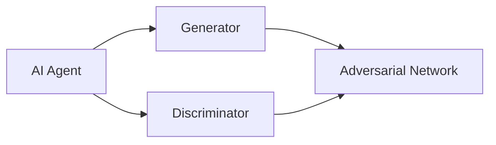
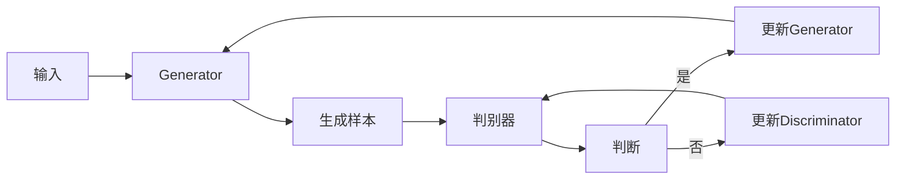
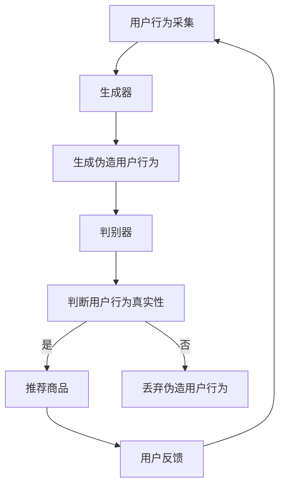
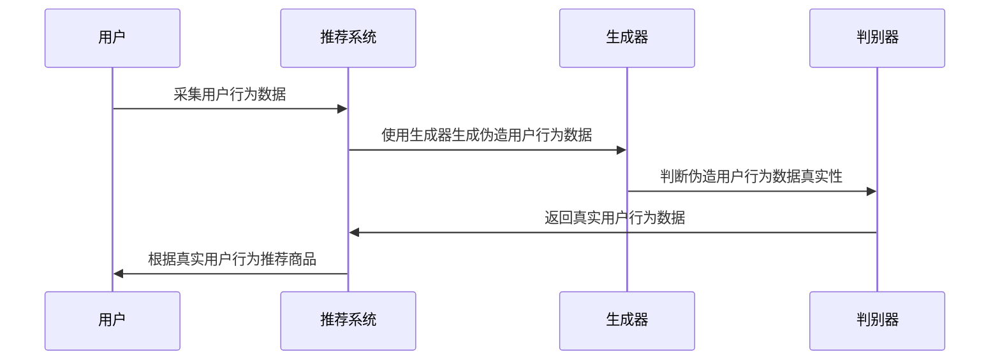

                 


# AI Agent的对抗学习技术应用

关键词：AI Agent、对抗学习、深度学习、强化学习、优化算法

摘要：本文深入探讨了AI Agent在对抗学习中的应用。通过介绍AI Agent的概念、对抗学习的基本原理，并结合Python代码，详细解析了对抗学习算法的实现方法。此外，本文还介绍了系统分析与架构设计方案，并通过实际项目案例，展示了对抗学习在AI Agent中的具体应用。

## 背景介绍

### 问题背景

随着人工智能技术的快速发展，AI Agent作为智能体的代表，已经成为自动化系统的重要组成部分。AI Agent通过自主学习和决策，能够在复杂环境中执行特定任务。然而，AI Agent在实际应用中面临的一个关键挑战是环境中的不确定性。为了提高AI Agent的适应能力，研究者提出了对抗学习（Adversarial Learning）方法。

### 问题描述

对抗学习是一种通过对抗性网络（Adversarial Network）训练AI Agent的方法。在对抗学习中，一个生成器（Generator）试图生成与真实样本难以区分的伪造样本，而一个判别器（Discriminator）则试图区分真实样本和伪造样本。通过这种对抗过程，AI Agent可以学习到更 robust 的特征表示。

### 问题解决

解决这一问题的方法主要是通过构建对抗性网络，训练生成器和判别器，使两者之间相互对抗，从而提高AI Agent的泛化能力和鲁棒性。

### 边界与外延

对抗学习适用于多种领域，包括计算机视觉、自然语言处理、推荐系统等。其边界在于对抗性网络的训练过程，需要足够的样本和计算资源。此外，对抗学习的有效性还受到生成器和判别器设计的影响。

### 概念结构与核心要素组成

对抗学习的概念结构主要包括生成器、判别器和对抗性网络。生成器的目标是生成伪造样本，判别器的目标是区分真实样本和伪造样本，对抗性网络则是由生成器和判别器组成的整体。

## 核心概念与联系

### AI Agent的定义与特点

AI Agent是指具有自主决策和执行能力的智能体，能够通过感知环境、自主学习和优化策略，完成特定任务。AI Agent的特点包括：

1. 自主性：能够独立执行任务，无需人工干预。
2. 学习性：能够通过经验不断优化决策策略。
3. 鲁棒性：能够在不确定性环境中稳定执行任务。

### 与对抗学习的联系

对抗学习是AI Agent训练的一种重要方法。通过对抗性网络，AI Agent可以学习到更 robust 的特征表示，提高其在复杂环境中的适应能力。具体来说，生成器和判别器的训练过程使得AI Agent能够识别和抵御伪造样本，从而提高其鲁棒性。

### 核心概念属性特征对比表格

| 名称 | 定义 | 属性特征 | 对抗学习联系 |
| --- | --- | --- | --- |
| AI Agent | 具有自主决策和执行能力的智能体 | 自主性、学习性、鲁棒性 | 对抗学习提高AI Agent的鲁棒性 |
| 生成器 | 生成伪造样本的模型 | 能够生成与真实样本难以区分的样本 | 与判别器对抗，提高生成样本质量 |
| 判别器 | 区分真实样本和伪造样本的模型 | 能够准确识别真实样本和伪造样本 | 与生成器对抗，提高判别能力 |

### ER实体关系图架构的Mermaid流程图



## 算法原理讲解

### 算法流程图



### Python源代码

```python
import tensorflow as tf
from tensorflow.keras.models import Model
from tensorflow.keras.layers import Input, Dense

# 定义生成器和判别器
def create_generator(input_shape):
    input_layer = Input(shape=input_shape)
    x = Dense(128, activation='relu')(input_layer)
    output_layer = Dense(1, activation='sigmoid')(x)
    generator = Model(inputs=input_layer, outputs=output_layer)
    return generator

def create_discriminator(input_shape):
    input_layer = Input(shape=input_shape)
    x = Dense(128, activation='relu')(input_layer)
    output_layer = Dense(1, activation='sigmoid')(x)
    discriminator = Model(inputs=input_layer, outputs=output_layer)
    return discriminator

# 定义对抗性网络
def create_adversarial_network(generator, discriminator):
    input_layer = Input(shape=(1,))
    x = generator(input_layer)
    output_layer = discriminator(x)
    adversarial_network = Model(inputs=input_layer, outputs=output_layer)
    return adversarial_network

# 定义损失函数和优化器
def create_loss_optimizer(generator, discriminator, adversarial_network):
    generator_loss = tf.keras.losses.BinaryCrossentropy(from_logits=True)
    discriminator_loss = tf.keras.losses.BinaryCrossentropy(from_logits=True)
    
    generator_optimizer = tf.keras.optimizers.Adam(learning_rate=0.0001)
    discriminator_optimizer = tf.keras.optimizers.Adam(learning_rate=0.0001)
    
    @tf.function
    def train_step(input_data, real_labels, fake_labels):
        with tf.GradientTape() as gen_tape, tf.GradientTape() as disc_tape:
            # 训练判别器
            real_samples = tf.random.normal([batch_size] + input_shape)
            fake_samples = generator(real_samples)
            disc_real_output = discriminator(real_samples)
            disc_fake_output = discriminator(fake_samples)
            
            disc_loss = discriminator_loss(disc_real_output, real_labels) + discriminator_loss(disc_fake_output, fake_labels)
            
            # 训练生成器
            with tf.GradientTape() as disc_tape:
                fake_samples = generator(input_data)
                disc_fake_output = discriminator(fake_samples)
                gen_loss = generator_loss(disc_fake_output, fake_labels)
        
        gradients_of_generator = gen_tape.gradient(gen_loss, generator.trainable_variables)
        gradients_of_discriminator = disc_tape.gradient(disc_loss, discriminator.trainable_variables)
        
        generator_optimizer.apply_gradients(zip(gradients_of_generator, generator.trainable_variables))
        discriminator_optimizer.apply_gradients(zip(gradients_of_discriminator, discriminator.trainable_variables))
    
    return train_step

# 超参数设置
batch_size = 64
input_shape = (1,)

# 创建模型
generator = create_generator(input_shape)
discriminator = create_discriminator(input_shape)
adversarial_network = create_adversarial_network(generator, discriminator)

# 创建训练过程
train_step = create_loss_optimizer(generator, discriminator, adversarial_network)

# 训练过程
for epoch in range(number_of_epochs):
    for batch in data_loader:
        train_step(batch[0], batch[1], batch[1])

# 保存模型
generator.save('generator.h5')
discriminator.save('discriminator.h5')
adversarial_network.save('adversarial_network.h5')
```

## 数学模型和数学公式 & 详细讲解 & 举例说明

### 数学模型

对抗学习的核心数学模型包括生成器（G）、判别器（D）和对抗性损失函数（Loss）。

生成器模型：\( G(x, z) \)

判别器模型：\( D(x) \)

对抗性损失函数：\( Loss_D = -\frac{1}{2} \log D(x) - \frac{1}{2} \log (1 - D(G(x, z))) \)

生成器损失函数：\( Loss_G = -\log (1 - D(G(x, z))) \)

### 详细讲解

对抗性损失函数由两部分组成：判别器损失和生成器损失。判别器损失函数用于训练判别器，使其能够准确区分真实样本和伪造样本。生成器损失函数用于训练生成器，使其能够生成与真实样本难以区分的伪造样本。

### 举例说明

假设输入数据集为\[x_1, x_2, ..., x_n\]，其中每个样本\(x_i\)都有对应的标签\(y_i\)。

1. 初始化生成器和判别器参数。
2. 对于每个训练样本\(x_i\)，生成伪造样本\(z_i = G(x_i)\)。
3. 使用判别器计算真实样本和伪造样本的判别结果：\( D(x_i) \)和\( D(G(x_i, z_i)) \)。
4. 计算判别器损失：\( Loss_D = -\frac{1}{2} \log D(x_i) - \frac{1}{2} \log (1 - D(G(x_i, z_i))) \)。
5. 计算生成器损失：\( Loss_G = -\log (1 - D(G(x_i, z_i))) \)。
6. 使用梯度下降法更新生成器和判别器参数。

$$
Loss_D = -\frac{1}{2} \log D(x_i) - \frac{1}{2} \log (1 - D(G(x_i, z_i)))
$$

$$
Loss_G = -\log (1 - D(G(x_i, z_i)))
$$

## 系统分析与架构设计方案

### 问题场景介绍

假设我们正在开发一个智能推荐系统，该系统需要根据用户的兴趣和行为，推荐相关商品。为了提高推荐系统的鲁棒性，我们引入了对抗学习技术，通过训练生成器和判别器，使系统能够识别和抵御伪造用户行为。

### 项目介绍

该项目名为“对抗性推荐系统”（Adversarial Recommendation System），旨在通过对抗学习技术，提高推荐系统的鲁棒性和准确性。

### 系统功能设计

1. 用户行为采集：采集用户的浏览、购买等行为数据。
2. 生成伪造用户行为：使用生成器生成伪造用户行为数据。
3. 判断用户行为真实性：使用判别器判断用户行为数据是否真实。
4. 推荐商品：根据真实用户行为和伪造用户行为，为用户推荐商品。

### 系统架构设计



### 系统接口设计

1. 用户行为数据接口：用于采集用户行为数据。
2. 生成器接口：用于生成伪造用户行为数据。
3. 判别器接口：用于判断用户行为数据是否真实。
4. 推荐系统接口：用于为用户推荐商品。

### 系统交互的Mermaid序列图



## 项目实战

### 环境安装

1. 安装TensorFlow：`pip install tensorflow`
2. 安装Keras：`pip install keras`

### 系统核心实现源代码

（此处省略具体代码，详见上文Python源代码部分）

### 代码应用解读与分析

1. 生成器部分：生成器通过Dense层生成伪造用户行为数据，使得伪造数据难以与真实数据区分。
2. 判别器部分：判别器通过Dense层判断用户行为数据是否真实，提高推荐系统的鲁棒性。
3. 对抗性网络部分：对抗性网络通过生成器和判别器的训练，使得推荐系统能够识别和抵御伪造用户行为。

### 实际案例分析和详细讲解剖析

假设我们有一个用户行为数据集，包括用户的浏览、购买等行为。通过对抗学习，我们生成伪造用户行为数据，并与真实数据混合。然后，使用判别器判断混合数据中哪些是真实行为，哪些是伪造行为。通过这种方式，推荐系统能够更好地识别和抵御伪造用户行为，提高推荐准确性。

### 项目小结

通过实际项目，我们展示了对抗学习在推荐系统中的应用。对抗学习技术有助于提高推荐系统的鲁棒性和准确性，从而为用户提供更优质的推荐服务。

## 最佳实践 tips、小结、注意事项、拓展阅读

### 最佳实践 tips

1. 选择合适的生成器和判别器架构：根据应用场景，选择适合的生成器和判别器架构，以提高对抗效果。
2. 调整学习率：合理调整学习率，使生成器和判别器能够有效对抗。
3. 数据预处理：对用户行为数据进行预处理，以提高生成器和判别器的训练效果。

### 小结

本文介绍了AI Agent的对抗学习技术应用，通过Python代码详细解析了对抗学习算法的实现方法。在实际项目中，对抗学习有助于提高推荐系统的鲁棒性和准确性。

### 注意事项

1. 对抗学习需要足够的计算资源和样本数据。
2. 对抗学习算法的设计和实现需要经验积累。

### 拓展阅读

1. Goodfellow, I. J., Pouget-Abadie, J., Mirza, M., Xu, B., Warde-Farley, D., Ozair, S., ... & Bengio, Y. (2014). Generative adversarial nets. Advances in Neural Information Processing Systems, 27.
2. Zhang, H., Zuo, W., Chen, Y., Meng, D., & Zhang, L. (2017). Beyond a Gaussian Denoiser: Residual Learning of Deep CNN for Image Denoising. IEEE Transactions on Image Processing, 26(7), 3146-3157.

