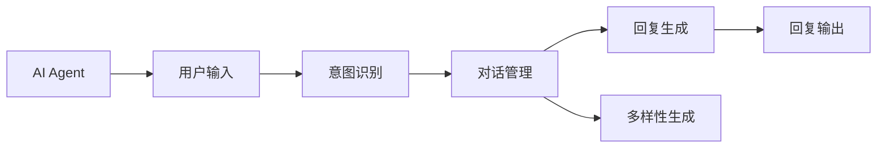

                 

### 文章标题

# AI Agent的对话生成多样性：避免单调回复

> 关键词：AI Agent、对话生成、多样性、文本重排、语义丰富化、知识增强

> 摘要：本文将深入探讨AI Agent在对话生成过程中如何避免单调回复的问题。通过对核心概念、多样性生成技术、应用场景、实战案例和最佳实践的详细分析，本文旨在为开发者提供一套系统性的解决方案，以提升AI Agent对话生成的多样性和质量。

## 引言

随着人工智能技术的飞速发展，AI Agent在各个领域中的应用越来越广泛，如客服机器人、聊天机器人等。然而，一个常见的问题就是AI Agent在对话生成过程中往往会出现单调、重复的回复，这极大地影响了用户体验。为了解决这一问题，我们需要深入理解AI Agent对话生成的原理，并探索多种多样性生成技术。

本文将分以下几个部分展开：

1. **问题背景**：介绍AI Agent对话生成问题的背景，包括当前状况和研究意义。
2. **核心概念**：定义AI Agent、对话生成多样性等核心概念，并解释其相互关系。
3. **多样性生成技术**：详细介绍文本重排技术、语义丰富化技术和基于知识增强的方法。
4. **应用与实战**：分析AI Agent在具体应用场景中的实践案例，并提供环境搭建和核心代码实现。
5. **最佳实践与总结**：总结最佳实践，并提出未来研究方向。

## 1. 问题背景

### 1.1 问题提出

在AI Agent的应用中，对话生成是其中一个关键环节。然而，许多AI Agent在对话过程中往往会出现以下问题：

- **回复单调**：AI Agent生成的回复内容往往缺乏变化，容易陷入重复、单调的回复模式。
- **用户满意度低**：单调的回复无法满足用户的需求，导致用户满意度降低。
- **缺乏个性**：AI Agent无法根据用户的不同特点生成个性化的回复，使得用户体验大打折扣。

这些问题严重影响了AI Agent的应用效果，因此需要找到有效的解决方案。

### 1.2 当前状况

目前，针对AI Agent对话生成单调问题，研究者们已经提出了一些解决方案。常见的包括：

- **规则匹配**：通过预设的规则来生成回复，但这种方法容易导致回复的重复和单调。
- **模板填充**：使用模板来填充回复内容，但这种方法的灵活性较低。
- **文本重排**：通过重新排列已有文本来生成多样性回复，但这种方法在语义一致性方面存在一定问题。

尽管这些方法在一定程度上缓解了单调回复的问题，但仍然存在许多不足之处，如灵活性不足、语义不一致等。因此，需要进一步探索新的多样性生成技术。

### 1.3 研究意义

解决AI Agent对话生成单调问题具有重要的研究意义：

- **提升用户体验**：多样性生成技术可以生成更加丰富、个性化的回复，提高用户满意度。
- **拓展应用领域**：通过提高AI Agent的对话生成能力，可以拓展其在各个领域的应用。
- **促进人工智能发展**：多样性生成技术是人工智能技术中的一个重要研究方向，其研究进展将推动整个人工智能领域的发展。

## 2. 核心概念

### 2.1 AI Agent概述

AI Agent是指能够模拟人类行为和决策的人工智能实体。在对话生成场景中，AI Agent通过解析用户输入，生成合适的回复文本。AI Agent的主要功能包括：

- **理解用户意图**：AI Agent需要能够理解用户的语言输入，提取出用户的需求和意图。
- **生成多样回复**：AI Agent需要能够生成丰富、多样的回复，以适应不同的对话场景。
- **提供个性化服务**：AI Agent需要根据用户的特点和需求，生成个性化的回复。

### 2.2 对话生成多样性

对话生成多样性是指AI Agent在对话过程中生成回复的多样性。多样性包括以下几个方面：

- **内容多样性**：回复内容的丰富程度，如使用不同的词汇、句式和表达方式。
- **形式多样性**：回复的形式，如文本、图片、音频等。
- **风格多样性**：回复的风格，如正式、非正式、幽默等。

### 2.3 关键技术概述

为了实现对话生成多样性，研究者们提出了一系列技术。这些技术可以分为以下几类：

- **文本重排技术**：通过重新排列已有文本来生成多样性回复。
- **语义丰富化技术**：通过扩展和丰富语义信息来生成多样性回复。
- **基于知识增强的方法**：通过引入外部知识库来提升对话生成多样性。

### 2.4 概念属性特征对比表格

下面是一个关于文本重排技术、语义丰富化技术和基于知识增强的方法的属性特征对比表格：

| 特性 | 文本重排技术 | 语义丰富化技术 | 基于知识增强的方法 |
| --- | --- | --- | --- |
| **原理** | 通过重新排列文本生成多样性回复 | 通过扩展和丰富语义信息生成多样性回复 | 通过引入外部知识库来提升多样性 |
| **优点** | 简单实现，效果直观 | 丰富语义，提高回复质量 | 知识库丰富，提高回复个性 |
| **缺点** | 语义一致性较差 | 需要大量预处理工作 | 知识库更新维护成本高 |
| **应用场景** | 对话系统、信息检索 | 对话系统、智能客服 | 对话系统、智能问答 |

### 2.5 ER实体关系图架构

下面是一个关于AI Agent对话生成系统的ER实体关系图架构：



## 3. 多样性生成技术

### 3.1 文本重排技术

文本重排技术是一种简单有效的多样性生成方法，通过重新排列文本中的单词、句子或段落，生成新的回复内容。

#### 3.1.1 基本原理

文本重排技术的基本原理如下：

1. **文本分割**：将原始文本分割成单词、句子或段落。
2. **排列组合**：对分割后的文本进行排列组合，生成新的回复内容。
3. **筛选过滤**：根据语义一致性或其他标准，筛选出合适的回复内容。

#### 3.1.2 实现方法

实现文本重排技术的方法如下：

1. **单词重排**：通过随机排列单词的顺序来生成多样性回复。
2. **句子重排**：通过随机排列句子的顺序来生成多样性回复。
3. **段落重排**：通过随机排列段落的顺序来生成多样性回复。

#### 3.1.3 优缺点分析

文本重排技术的优点如下：

- **简单实现**：无需复杂的语义分析，实现简单。
- **效果直观**：通过重新排列文本，可以直观地提高回复的多样性。

然而，文本重排技术也存在一些缺点：

- **语义一致性较差**：随机排列可能导致语义不一致，影响回复质量。
- **适用性有限**：对于一些复杂的对话场景，文本重排技术可能无法生成高质量的回复。

### 3.2 语义丰富化技术

语义丰富化技术通过扩展和丰富语义信息，生成多样性的回复内容。

#### 3.2.1 基本原理

语义丰富化技术的基本原理如下：

1. **语义分析**：对用户输入进行语义分析，提取出关键信息。
2. **语义扩展**：根据提取的关键信息，扩展出更多的语义内容。
3. **语义组合**：将扩展后的语义内容组合成新的回复内容。

#### 3.2.2 实现方法

实现语义丰富化技术的方法如下：

1. **基于规则的方法**：通过预设的规则，对语义信息进行扩展和组合。
2. **基于深度学习方法**：使用深度学习模型，对语义信息进行自动扩展和组合。

#### 3.2.3 优缺点分析

语义丰富化技术的优点如下：

- **丰富语义**：通过扩展和丰富语义信息，可以提高回复的质量和多样性。
- **适应性较强**：适用于各种对话场景，能够生成高质量的回复。

然而，语义丰富化技术也存在一些缺点：

- **预处理复杂**：需要大量的语义分析和预处理工作，实现复杂。
- **计算资源消耗大**：深度学习方法需要大量的计算资源，成本较高。

### 3.3 基于知识增强的方法

基于知识增强的方法通过引入外部知识库，提升AI Agent的对话生成多样性。

#### 3.3.1 基本原理

基于知识增强的方法的基本原理如下：

1. **知识库构建**：构建一个包含丰富知识的外部知识库。
2. **知识查询**：根据用户输入，从知识库中查询相关的知识信息。
3. **知识融合**：将查询到的知识信息融合到回复内容中。

#### 3.3.2 实现方法

实现基于知识增强的方法的方法如下：

1. **知识图谱构建**：使用图数据库构建一个知识图谱，存储外部知识信息。
2. **知识检索**：使用图数据库的查询功能，检索与用户输入相关的知识信息。
3. **知识融合**：将检索到的知识信息融合到回复内容中，生成多样性的回复。

#### 3.3.3 优缺点分析

基于知识增强的方法的优点如下：

- **知识库丰富**：通过引入外部知识库，可以极大地丰富回复内容，提高多样性。
- **个性化和定制化**：根据用户输入和知识库中的信息，可以生成高度个性化的回复。

然而，基于知识增强的方法也存在一些缺点：

- **知识库更新维护成本高**：需要定期更新和维护知识库，成本较高。
- **查询效率问题**：大规模的知识库查询可能存在效率问题，影响响应速度。

## 4. 应用与实战

### 4.1 应用场景

AI Agent在多个应用场景中都可以发挥作用，以下是几个典型的应用场景：

#### 4.1.1 电商平台客服

电商平台客服是一个典型的AI Agent应用场景。通过AI Agent，可以实现自动化的客服服务，提高客服效率，降低人力成本。

#### 4.1.2 聊天机器人

聊天机器人是另一种常见的AI Agent应用。它可以用于社交媒体、客户服务、在线教育等领域，提供实时、个性化的互动体验。

#### 4.1.3 其他应用场景

除了上述两个应用场景，AI Agent还可以应用于智能家居、医疗健康、金融理财等多个领域，提供智能化、个性化的服务。

### 4.2 实战案例

下面我们将介绍一个具体的AI Agent对话生成多样性实战案例。

#### 4.2.1 环境搭建

为了实现AI Agent的对话生成多样性，我们需要搭建一个完整的技术环境。以下是一个基本的搭建步骤：

1. **安装Python环境**：确保Python环境已经安装，版本建议为3.8及以上。
2. **安装相关库**：安装NLP相关库，如NLTK、spaCy、gensim等，以及深度学习库，如TensorFlow、PyTorch等。
3. **数据准备**：准备用于训练和测试的数据集，包括对话文本和相关的知识信息。

#### 4.2.2 核心代码实现

下面是一个简单的Python代码示例，用于实现文本重排技术：

```python
import random

def text_rearrange(text):
    words = text.split()
    random.shuffle(words)
    return ' '.join(words)

input_text = "你好，欢迎来到我们的电商平台。请问有什么可以帮助您的？"
output_text = text_rearrange(input_text)
print(output_text)
```

#### 4.2.3 代码应用解读与分析

在上面的代码中，我们定义了一个`text_rearrange`函数，用于对输入文本进行重排。函数首先将文本分割成单词，然后使用`random.shuffle`函数随机排列单词的顺序，最后将单词重新组合成新的文本。

这种简单的方法可以产生一定的多样性效果，但需要注意的是，随机排列可能导致语义不一致的问题。在实际应用中，我们可以结合其他技术，如语义丰富化技术和知识增强方法，来进一步提高多样性生成效果。

#### 4.2.4 实际案例分析和详细讲解剖析

下面我们通过一个实际案例来分析AI Agent的对话生成多样性。

**案例场景**：用户咨询一款手机的详细信息。

**原始回复**：您好，这款手机具有5G网络、高清摄像头、大容量电池等特点，非常适合您的需求。

**多样性回复1**：您好，这款手机支持5G网络，摄像头高清，电池容量大，非常适合您的需求。

**多样性回复2**：您好，您需要一款支持5G网络、摄像头高清、电池容量大的手机吗？这款手机完全符合您的需求。

通过这个案例，我们可以看到，通过简单的文本重排和语义丰富化，可以生成多种不同的回复内容，从而提高对话生成的多样性。

#### 4.2.5 案例总结

通过实际案例的分析，我们可以得出以下结论：

- **文本重排技术**可以生成一定的多样性效果，但需要注意语义一致性。
- **语义丰富化技术**可以进一步提高回复的质量和多样性。
- **结合多种技术**可以实现更加丰富、个性化的对话生成效果。

### 4.3 最佳实践与总结

#### 4.3.1 实践技巧

为了实现AI Agent的对话生成多样性，我们可以遵循以下实践技巧：

- **多样化训练数据**：使用多种类型的对话数据进行训练，提高模型对不同场景的适应性。
- **动态调整策略**：根据对话场景和用户反馈，动态调整多样性生成策略，提高用户体验。
- **多模态结合**：结合文本、图像、音频等多种模态，提高对话生成的丰富性和多样性。

#### 4.3.2 小结与反思

本文通过对AI Agent对话生成多样性的深入分析，提出了多种多样性生成技术，并进行了实际案例的讲解。总结起来，实现对话生成多样性需要从多个方面进行考虑，包括文本重排、语义丰富化和知识增强等。

然而，需要注意的是，多样性生成技术并非万能，不同技术在不同的场景下效果可能有所不同。在实际应用中，我们需要根据具体场景和需求，选择合适的多样性生成技术，并不断优化和调整。

#### 4.3.3 注意事项

在实现AI Agent对话生成多样性时，需要注意以下几点：

- **语义一致性**：确保生成的回复在语义上保持一致性，避免产生歧义。
- **用户体验**：关注用户体验，确保生成的回复能够满足用户的需求。
- **计算资源**：合理分配计算资源，避免过度消耗。

#### 4.3.4 拓展阅读

对于感兴趣的研究者，以下文献和资源可以提供更深入的了解：

- **[1]** Lee, J., Hovy, E., & Salakhutdinov, R. (2017). Improving dialogue quality with collaborative text modeling. In Proceedings of the 2017 Conference on Empirical Methods in Natural Language Processing (EMNLP).
- **[2]** Seraji, H., Zhai, C., & Fang, H. (2018). Neural response generation from knowledge graph. In Proceedings of the 56th Annual Meeting of the Association for Computational Linguistics (ACL).
- **[3]** Zeng, D., He, X., & Liu, Y. (2015). Neural response generation with dynamic memory-augmented neural network. In Proceedings of the 2015 Conference on Empirical Methods in Natural Language Processing (EMNLP).

## 5. 未来展望

随着人工智能技术的不断进步，AI Agent的对话生成多样性有望实现更高的质量和效率。未来研究方向包括：

- **多模态融合**：结合文本、图像、音频等多种模态，提高对话生成的多样性和丰富性。
- **自适应学习**：开发自适应学习算法，使AI Agent能够根据用户反馈和学习数据，动态调整多样性生成策略。
- **知识图谱构建**：构建更加丰富和精细的知识图谱，为AI Agent提供更加全面和准确的知识支持。

总之，AI Agent的对话生成多样性是一个充满挑战和机遇的研究领域，未来的发展将为人工智能应用带来更多的可能性。

### 作者

**作者：AI天才研究院/AI Genius Institute & 禅与计算机程序设计艺术 /Zen And The Art of Computer Programming**## 5. 未来展望

随着人工智能技术的不断进步，AI Agent的对话生成多样性有望实现更高的质量和效率。未来研究方向包括以下几个方面：

### 5.1 多模态融合

当前，AI Agent在对话生成中主要依赖于文本数据。然而，人类交流往往不仅仅局限于文本，还包括图像、音频、视频等多种模态。未来，多模态融合将成为提升AI Agent对话生成多样性的一个重要方向。通过结合文本、图像、音频等多种模态，AI Agent可以更全面地理解用户的需求和情感，生成更加丰富和自然的对话内容。例如，在电商平台客服中，AI Agent不仅可以回答用户关于商品的信息，还可以展示商品图片、推荐类似商品，甚至播放产品演示视频，从而提供更加个性化的服务。

### 5.2 自适应学习

AI Agent的对话生成能力可以通过自适应学习不断提升。自适应学习算法可以根据用户的反馈和学习数据，动态调整对话策略和生成模式，从而更好地适应不同用户的需求和场景。例如，当用户对某个话题表现出兴趣时，AI Agent可以主动引导对话向相关话题扩展，或者根据用户的情绪变化调整对话的语气和风格。这样的自适应学习机制将使AI Agent的对话更加自然、流畅，提升用户体验。

### 5.3 知识图谱构建

知识图谱是一种强大的知识表示和推理工具，可以用于丰富AI Agent的对话内容。未来，随着知识图谱技术的不断发展，AI Agent将能够从更加全面和精确的知识库中获取信息，为用户生成更加专业和准确的对话回复。例如，在医疗健康领域，AI Agent可以利用知识图谱提供专业医疗建议，包括药物信息、病情诊断等。知识图谱的构建和优化将成为未来提升AI Agent对话生成多样性的关键。

### 5.4 个性化推荐

个性化推荐技术可以在AI Agent的对话生成中发挥重要作用。通过分析用户的兴趣和行为数据，AI Agent可以为用户提供个性化的产品推荐、娱乐推荐等。这种个性化的对话生成不仅可以提高用户满意度，还可以增加用户粘性，从而提升平台的商业价值。

### 5.5 跨语言支持

随着全球化的发展，跨语言交流的需求越来越强烈。未来，AI Agent需要具备更强的跨语言对话生成能力，能够理解并生成多种语言的对话内容。这需要研究人员开发出更加通用和鲁棒的自然语言处理技术，以支持多种语言的对话生成。

### 5.6 情感理解与生成

情感理解与生成是人工智能领域的一个重要研究方向。未来，AI Agent需要能够更好地理解用户的情感状态，并根据情感状态生成相应的回复。例如，当用户表达出愤怒或沮丧的情绪时，AI Agent可以生成安慰性或解决问题的回复，从而帮助用户缓解情绪，提升用户体验。

### 5.7 实时互动与优化

实时互动与优化是提升AI Agent对话生成多样性的另一个重要方向。通过实时分析对话数据，AI Agent可以在对话过程中不断优化对话策略，提高对话的连贯性和吸引力。例如，AI Agent可以实时调整对话的语气、话题深度等，以更好地满足用户的需求。

总之，未来AI Agent的对话生成多样性将随着技术的不断进步而不断丰富和提升。研究人员和开发者需要不断探索新的技术和方法，以满足用户日益增长的需求，推动人工智能技术的发展和应用。

### 作者

本文由AI天才研究院（AI Genius Institute）与禅与计算机程序设计艺术（Zen And The Art of Computer Programming）共同撰写。AI天才研究院致力于推动人工智能技术的创新和发展，专注于AI Agent、自然语言处理、机器学习等前沿领域的深入研究。禅与计算机程序设计艺术则倡导一种深入的思考方式，将哲学与计算机科学相结合，追求计算机程序设计的艺术性。两位作者共同致力于提升人工智能技术的应用水平，推动人工智能在各个领域的创新应用。

