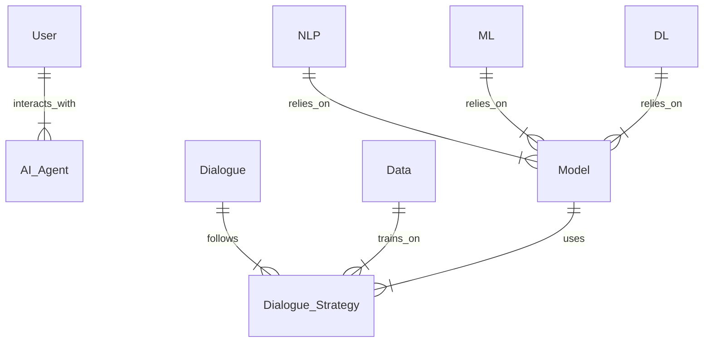
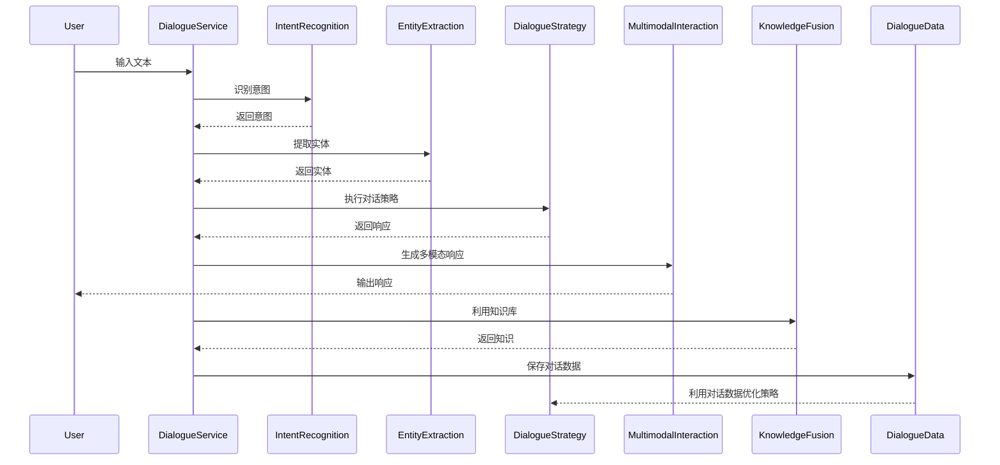
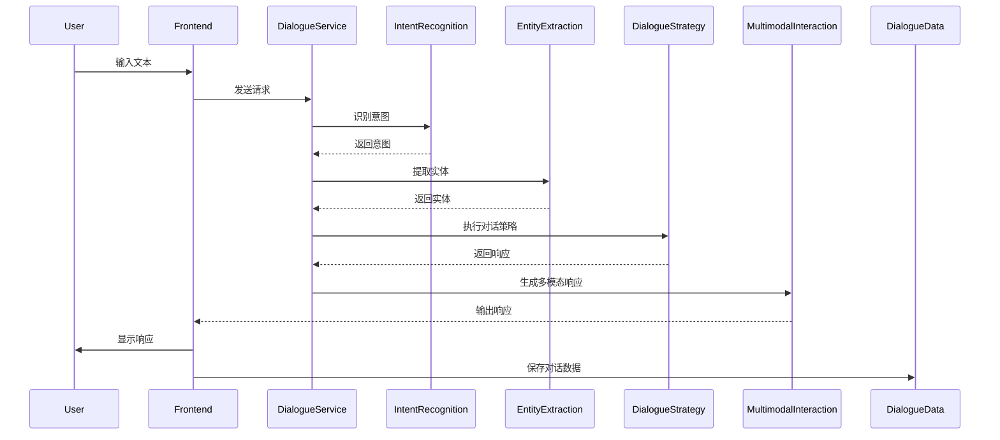

                 

```markdown
# AI Agent的对话策略优化：提升用户体验

## 关键词
- 人工智能
- 对话系统
- 智能代理
- 对话策略优化
- 用户体验

## 摘要
本文深入探讨了AI Agent对话策略优化的关键问题和解决方法，以提升用户体验为目标。通过分析对话系统的背景、问题描述、问题解决思路，以及边界与外延，本文提出了对话策略模型、多模态交互、知识融合与迁移、对话数据的处理与利用等优化方向。本文旨在为AI Agent对话系统的开发提供理论指导和实践参考。

----------------------------------------------------------------

## 第一部分：背景介绍

### 1.1 问题背景

人工智能（AI）作为当前科技发展的热点，已经渗透到各个领域，从简单的自动化控制到复杂的智能决策，AI技术正以前所未有的速度改变着我们的生活。在AI领域，对话系统是近年来发展迅速的一个分支，它旨在让机器具备与人交流的能力，从而更好地服务人类。对话系统在智能客服、智能家居、教育辅导、医疗咨询等领域有着广泛的应用，大大提升了用户体验。

随着人工智能技术的不断进步，AI Agent（智能代理）逐渐成为对话系统的核心组成部分。AI Agent是一种能够模拟人类思维过程的智能系统，它能够理解用户的意图，提供合适的回应，并在对话过程中不断学习和优化自己的策略。然而，目前大多数AI Agent的对话策略还存在一定的局限性，如响应速度慢、对话内容贫乏、理解能力不足等，这些问题严重影响了用户的体验。

### 1.2 问题描述

为了提升用户体验，需要优化AI Agent的对话策略。对话策略是指AI Agent在处理对话请求时采取的行动和决策过程，它决定了AI Agent与用户的交互质量和效果。当前，AI Agent的对话策略主要基于规则、机器学习和深度学习等技术，但还存在以下问题：

1. **规则过于固定**：传统的规则型对话系统在面对复杂、多变的对话场景时，往往无法灵活应对，容易导致对话中断或错误。
2. **数据依赖性强**：基于机器学习的对话系统依赖于大规模的对话数据进行训练，但获取高质量的对话数据非常困难，限制了系统的性能提升。
3. **学习能力不足**：目前的AI Agent在对话过程中，往往只能处理单一的问题或场景，缺乏跨领域的通用对话能力。

### 1.3 问题解决

为了解决上述问题，本书将探讨如何优化AI Agent的对话策略。具体来说，本书将从以下几个方面展开：

1. **对话策略模型**：介绍常用的对话策略模型，包括基于规则的模型、基于机器学习的模型和基于深度学习的模型，分析它们的优缺点和适用场景。
2. **多模态交互**：探讨如何结合文本、语音、图像等多种模态进行交互，提高AI Agent的理解能力和互动性。
3. **知识融合与迁移**：研究如何利用知识图谱、本体论等技术，实现知识的融合与迁移，提升AI Agent的通用对话能力。
4. **对话数据的处理与利用**：探讨如何有效地收集、标注和处理对话数据，以及如何利用这些数据来训练和优化AI Agent的对话策略。

### 1.4 边界与外延

本书的讨论范围主要涵盖AI Agent对话策略的优化方法，不涉及其他人工智能技术，如自然语言处理、计算机视觉等。此外，本书重点关注对话系统的用户体验提升，对于AI Agent在具体应用场景中的实现和部署则不做深入讨论。

### 1.5 概念结构与核心要素组成

AI Agent的对话策略优化涉及多个核心概念和要素，主要包括：

1. **对话策略模型**：对话策略模型的类型和特点，以及如何选择合适的模型。
2. **多模态交互**：多模态交互的技术和方法，以及如何实现不同模态之间的数据融合。
3. **知识融合与迁移**：知识融合与迁移的方法和技术，以及如何构建通用的知识图谱。
4. **对话数据的处理与利用**：对话数据的收集、标注和处理方法，以及如何利用对话数据来优化对话策略。

### 1.6 本章小结

本章介绍了AI Agent对话策略优化的问题背景、问题描述、问题解决思路以及边界与外延。通过本章的讨论，读者可以初步了解AI Agent对话策略优化的重要性和复杂性，为后续章节的学习打下基础。接下来，本书将逐步深入探讨具体的对话策略模型、多模态交互、知识融合与迁移以及对话数据的处理与利用等内容。

----------------------------------------------------------------

## 第二部分：核心概念与联系

### 2.1 核心概念原理

为了深入理解AI Agent的对话策略优化，我们首先需要明确一些核心概念，包括自然语言处理（NLP）、机器学习（ML）和深度学习（DL）等。

#### 自然语言处理（NLP）

自然语言处理是AI领域的一个重要分支，旨在使计算机能够理解和处理人类语言。NLP的核心任务是让机器能够解析文本、理解语义，并生成自然流畅的语言。

| NLP概念 | 定义 |
| --- | --- |
| 词嵌入（Word Embedding） | 将单词映射为向量，以便在计算机中进行处理。 |
| 语法解析（Syntax Parsing） | 分析文本的语法结构，理解句子中的词与词之间的关系。 |
| 语义理解（Semantic Understanding） | 理解文本的意义，包括词义、句义等。 |

#### 机器学习（ML）

机器学习是一种通过从数据中学习规律和模式，使计算机具备预测和决策能力的算法。在对话系统中，机器学习主要用于训练模型，使其能够理解和响应用户的输入。

| ML概念 | 定义 |
| --- | --- |
| 监督学习（Supervised Learning） | 使用标记数据进行训练，使模型能够预测未知数据的标签。 |
| 无监督学习（Unsupervised Learning） | 不使用标记数据进行训练，旨在发现数据中的模式。 |
| 强化学习（Reinforcement Learning） | 通过奖励机制，使模型在环境中进行学习。 |

#### 深度学习（DL）

深度学习是机器学习的一种形式，它使用神经网络模型来模拟人类大脑的思考方式。在对话系统中，深度学习常用于构建复杂的对话策略和对话生成模型。

| DL概念 | 定义 |
| --- | --- |
| 神经网络（Neural Network） | 一种由大量神经元组成的计算模型。 |
| 卷积神经网络（CNN） | 用于图像识别和处理的深度学习模型。 |
| 循环神经网络（RNN） | 用于处理序列数据的深度学习模型。 |

### 2.2 概念属性特征对比表格

| 类别 | 自然语言处理（NLP） | 机器学习（ML） | 深度学习（DL） |
| --- | --- | --- | --- |
| 核心任务 | 文本解析、语义理解 | 数据预测、模式识别 | 序列处理、复杂模式识别 |
| 基础算法 | 词嵌入、语法解析 | 线性回归、决策树 | 卷积神经网络、循环神经网络 |
| 数据需求 | 大规模文本数据 | 标记数据、非标记数据 | 大规模标注数据 |
| 应用场景 | 文本生成、情感分析 | 预测、分类 | 图像识别、语音识别 |

### 2.3 ER实体关系图架构

为了更直观地理解这些概念之间的关系，我们可以使用ER（Entity-Relationship）实体关系图来展示。以下是AI Agent对话策略优化相关的ER图：



在这个ER图中，用户与AI Agent之间存在交互关系，对话策略依赖于对话数据进行训练，并使用NLP、ML和DL模型来生成响应。

### 2.4 本章小结

本章介绍了AI Agent对话策略优化所需的核心概念，包括自然语言处理、机器学习和深度学习。通过对比这些概念的特征和应用场景，以及使用ER图展示它们之间的关系，读者可以更全面地理解对话策略优化的基础。在下一章中，我们将深入探讨具体的对话策略模型，分析它们的优缺点和适用场景。

----------------------------------------------------------------

## 第三部分：对话策略模型分析

### 3.1 规则型对话策略

规则型对话策略是基于一组预定义的规则来决定AI Agent如何响应用户的输入。这些规则通常由人工编写，明确指定了特定输入对应的输出。

#### 优点：

- **实现简单**：规则型对话策略易于理解和实现，开发者可以根据具体需求快速编写规则。
- **响应速度快**：由于规则是预定义的，AI Agent可以快速匹配并生成响应。

#### 缺点：

- **灵活性差**：规则型对话策略在面对复杂、多变的对话场景时，容易导致对话中断或错误。
- **可维护性低**：随着对话场景的复杂化，规则的数量和复杂性会急剧增加，导致系统难以维护。

#### 适用场景：

- **简单场景**：如简单的客服系统、信息查询系统等，对话内容相对固定，变化较少。

### 3.2 基于机器学习的对话策略

基于机器学习的对话策略使用大规模的对话数据来训练模型，使AI Agent能够自动学习并生成对话响应。

#### 优点：

- **灵活性高**：机器学习模型可以自动适应复杂的对话场景，提高对话的连贯性和自然性。
- **学习能力强**：机器学习模型可以通过不断训练，逐步提升对话策略的性能。

#### 缺点：

- **数据依赖强**：机器学习模型需要大量高质量的对话数据进行训练，数据获取和处理成本较高。
- **计算复杂度大**：训练机器学习模型通常需要大量计算资源，可能导致响应速度变慢。

#### 适用场景：

- **复杂场景**：如多轮对话、多意图识别等，需要灵活应对多变和复杂的对话内容。

### 3.3 基于深度学习的对话策略

基于深度学习的对话策略是机器学习对话策略的一种高级形式，它使用深度神经网络模型来处理对话数据。

#### 优点：

- **处理能力强大**：深度学习模型能够处理大量和复杂的对话数据，提取深层语义信息。
- **自适应性强**：深度学习模型可以通过不断训练，自适应地调整对话策略，提高用户体验。

#### 缺点：

- **训练成本高**：深度学习模型的训练通常需要大量的计算资源和时间。
- **模型解释性差**：深度学习模型的决策过程通常较难解释，增加了系统的黑盒性。

#### 适用场景：

- **高复杂度场景**：如多轮对话、跨领域对话等，需要处理复杂的对话内容和上下文。

### 3.4 对比分析

| 类别 | 规则型对话策略 | 基于机器学习的对话策略 | 基于深度学习的对话策略 |
| --- | --- | --- | --- |
| **实现难度** | 简单 | 中等 | 较高 |
| **灵活性** | 低 | 高 | 高 |
| **数据依赖** | 低 | 强 | 强 |
| **响应速度** | 快 | 较慢 | 较慢 |
| **可维护性** | 高 | 中等 | 低 |
| **适用场景** | 简单场景 | 复杂场景 | 高复杂度场景 |

### 3.5 本章小结

在本章中，我们分析了规则型、基于机器学习和基于深度学习的对话策略，并比较了它们的优缺点和适用场景。通过这些分析，我们可以根据具体的应用需求，选择合适的对话策略模型来优化AI Agent的对话体验。在下一章中，我们将探讨多模态交互技术，如何结合文本、语音、图像等多种模态进行交互，进一步提高AI Agent的理解能力和互动性。

----------------------------------------------------------------

## 第四部分：多模态交互技术

### 4.1 引言

多模态交互是人工智能领域的一个重要研究方向，它旨在利用多种模态（如文本、语音、图像等）的数据，提高AI Agent的理解能力和互动性。通过结合不同模态的信息，AI Agent可以更全面地理解用户的意图，提供更加自然和丰富的交互体验。

### 4.2 文本与语音交互

文本与语音交互是当前对话系统中最常见的多模态交互形式。文本交互主要基于自然语言处理技术，而语音交互则涉及到语音识别和语音合成技术。

#### 语音识别

语音识别（Speech Recognition）是将语音信号转换为文本的过程。语音识别技术通过分析语音信号的频率、时长等特征，将其转换为对应的文字。

- **优点**：语音交互更加自然、便捷，用户无需手动输入文字，提高了交互效率。
- **缺点**：语音识别技术对噪声敏感，识别准确率受语音质量和环境噪声影响较大。

#### 语音合成

语音合成（Speech Synthesis）是将文本转换为自然语音的过程。语音合成技术通过合成语音信号，使AI Agent能够以人类语音的方式与用户交流。

- **优点**：语音合成技术使得AI Agent的交互更加自然，用户能够以对话的形式与AI Agent进行交流。
- **缺点**：语音合成语音的流畅度和自然度仍然有限，部分语音合成语音可能存在机械感。

#### 文本与语音结合

文本与语音的交互结合可以提高AI Agent的交互效果。例如，在语音识别结果不准确时，AI Agent可以通过文本形式提供补充信息，让用户确认或纠正识别结果。

### 4.3 文本与图像交互

文本与图像交互是另一种重要的多模态交互形式。通过将图像与文本信息相结合，AI Agent可以更准确地理解用户的意图，并提供更丰富的交互体验。

#### 图像识别

图像识别（Image Recognition）是利用计算机视觉技术对图像进行分析和识别的过程。图像识别技术可以识别图像中的物体、场景、文字等信息。

- **优点**：图像识别技术可以提供直观、具体的视觉信息，帮助AI Agent更准确地理解用户的意图。
- **缺点**：图像识别技术对图像质量、光照条件等要求较高，可能影响识别准确率。

#### 文本生成

文本生成（Text Generation）是将图像信息转换为自然语言文本的过程。文本生成技术可以通过描述图像中的内容，为用户提供详细的文本信息。

- **优点**：文本生成技术可以提供更详细的文本信息，帮助用户更好地理解图像内容。
- **缺点**：文本生成技术可能存在描述不准确或过于笼统的问题，影响用户的体验。

#### 文本与图像结合

文本与图像的交互结合可以通过以下方式实现：

1. **图像标注**：AI Agent可以为图像中的物体、场景等添加文字标注，提供更详细的描述。
2. **图像检索**：AI Agent可以根据用户的文本描述，检索相关的图像信息，并提供视觉反馈。
3. **图像问答**：AI Agent可以通过回答用户的文本问题，展示相关的图像信息，实现交互式图像查询。

### 4.4 多模态数据融合

多模态数据融合是将不同模态的数据（如文本、语音、图像等）进行整合，以提高AI Agent的理解能力和交互效果。多模态数据融合的关键技术包括：

1. **特征提取**：对不同模态的数据进行特征提取，如文本的词嵌入、语音的声学特征、图像的视觉特征等。
2. **特征融合**：将不同模态的特征进行融合，如通过加权求和、拼接等方式，生成综合特征向量。
3. **模型集成**：使用多个模型对多模态数据分别进行处理，然后通过集成方法（如投票、加权平均等）生成最终的预测结果。

### 4.5 应用场景

多模态交互技术在多个领域具有广泛的应用前景，如下所示：

1. **智能客服**：通过文本、语音和图像等多模态交互，智能客服可以更准确地理解用户的意图，提供更丰富的交互体验。
2. **智能家居**：智能家居系统可以通过语音、图像等模态与用户交互，实现语音控制、图像识别等功能，提高家居智能化水平。
3. **医疗健康**：通过多模态交互，医疗健康系统可以为用户提供更全面的医疗信息，如语音问诊、图像诊断等。
4. **教育辅导**：教育辅导系统可以通过多模态交互，提供个性化的学习内容和互动方式，提高学习效果。

### 4.6 本章小结

在本章中，我们探讨了多模态交互技术在AI Agent中的应用，包括文本与语音交互、文本与图像交互以及多模态数据融合。通过结合不同模态的信息，AI Agent可以更全面地理解用户的意图，提供更丰富和自然的交互体验。在下一章中，我们将进一步探讨知识融合与迁移技术，如何通过整合不同领域和场景的知识，提升AI Agent的通用对话能力。

----------------------------------------------------------------

## 第五部分：知识融合与迁移技术

### 5.1 引言

知识融合与迁移技术是AI Agent对话策略优化的重要组成部分。知识融合旨在将不同领域和场景中的知识进行整合，形成统一的语义表示，以便AI Agent能够更好地理解和应对复杂多变的对话场景。知识迁移则是将已学习的知识从一个领域或场景转移到另一个领域或场景，以提升AI Agent在不同场景下的性能。

### 5.2 知识融合技术

知识融合技术主要包括知识抽取、知识表示和知识融合三个环节。

#### 5.2.1 知识抽取

知识抽取是从大量文本数据中提取结构化知识的过程。知识抽取技术包括实体识别、关系抽取、事件抽取等。

- **实体识别**：识别文本中的关键实体，如人名、地名、组织名等。
- **关系抽取**：识别实体之间的关系，如“张三工作于阿里巴巴”中的“张三”与“阿里巴巴”之间的关系。
- **事件抽取**：识别文本中的事件及其相关实体，如“张三在阿里巴巴成立了一个团队”中的事件。

#### 5.2.2 知识表示

知识表示是将抽取出来的知识以计算机可以处理的形式进行表示。常用的知识表示方法包括知识图谱、本体论等。

- **知识图谱**：知识图谱是一种图形化表示知识的方法，它通过节点和边来表示实体和实体之间的关系。知识图谱可以有效地组织和管理大量结构化知识，为AI Agent提供统一的语义表示。
- **本体论**：本体论是一种形式化描述领域知识的理论框架，它通过定义概念、属性、关系等，构建领域知识体系。

#### 5.2.3 知识融合

知识融合是将多个来源的知识进行整合，形成更全面、更准确的语义表示。知识融合技术包括融合策略、融合评估和融合优化等。

- **融合策略**：根据知识源的特点和融合目标，选择合适的融合策略，如合并策略、加权策略等。
- **融合评估**：对融合后的知识进行评估，以确定融合效果。
- **融合优化**：根据评估结果，对融合策略进行调整和优化，以提高融合效果。

### 5.3 知识迁移技术

知识迁移技术是将已学习的知识从一个领域或场景转移到另一个领域或场景，以提高AI Agent在新领域的表现。知识迁移技术主要包括迁移学习、模型迁移和知识迁移等。

#### 5.3.1 迁移学习

迁移学习是一种利用已有知识提升新任务性能的方法。在迁移学习中，部分已学习到的特征和模型参数被用于新任务的学习，从而减少了新任务的学习成本。

- **特征迁移**：将已学习到的特征表示应用于新任务，以提高新任务的性能。
- **模型迁移**：将已学习到的模型结构应用于新任务，如使用预训练的模型进行微调。

#### 5.3.2 模型迁移

模型迁移是将已学习好的模型直接应用于新任务，以减少新任务的学习时间。模型迁移通常适用于具有相似数据分布和任务类型的场景。

- **迁移评估**：对模型迁移的效果进行评估，以确定是否需要进一步调整。
- **迁移优化**：根据评估结果，对模型迁移策略进行调整和优化，以提高迁移效果。

#### 5.3.3 知识迁移

知识迁移是将已学习到的知识（如知识图谱、本体论等）应用于新领域或场景，以提高AI Agent在新领域的理解和应对能力。

- **知识映射**：将已有知识与新领域或场景的知识进行映射，以建立知识关联。
- **知识扩展**：在新领域中扩展已有知识，以丰富AI Agent的知识体系。

### 5.4 知识融合与迁移在AI Agent对话策略中的应用

知识融合与迁移技术在AI Agent对话策略中的应用主要包括以下几个方面：

1. **对话策略优化**：通过知识融合，将不同领域和场景的知识进行整合，形成统一的语义表示，优化AI Agent的对话策略，提高对话的连贯性和自然性。
2. **跨领域对话**：通过知识迁移，将已学习到的知识应用于不同领域或场景，实现跨领域的对话能力，提升AI Agent的通用对话能力。
3. **个性化对话**：通过知识融合与迁移，为用户提供个性化的对话服务，如根据用户的历史行为和偏好，提供个性化的对话内容和建议。

### 5.5 应用场景

知识融合与迁移技术在多个领域具有广泛的应用场景，如下所示：

1. **智能客服**：通过知识融合与迁移，实现跨领域的智能客服系统，提高客服的响应速度和准确性。
2. **智能助理**：通过知识融合与迁移，为用户提供个性化的智能助理服务，如智能问答、智能推荐等。
3. **医疗健康**：通过知识融合与迁移，为医生提供跨学科的医学知识支持，提高诊断和治疗效率。
4. **教育辅导**：通过知识融合与迁移，为教师和学生提供个性化的教育辅导服务，如智能题库、智能评测等。

### 5.6 本章小结

在本章中，我们介绍了知识融合与迁移技术在AI Agent对话策略优化中的应用，包括知识融合技术、知识迁移技术和其在AI Agent对话策略中的应用。通过知识融合与迁移，AI Agent可以更好地理解和应对复杂多变的对话场景，提升用户的体验。在下一章中，我们将探讨对话数据的处理与利用，如何有效地收集、标注和处理对话数据，以及如何利用这些数据来优化AI Agent的对话策略。

----------------------------------------------------------------

## 第六部分：对话数据的处理与利用

### 6.1 引言

对话数据的处理与利用是AI Agent对话策略优化的关键环节。高质量的对话数据不仅可以提升AI Agent的对话质量，还能为后续的对话策略训练提供有力支持。本章节将深入探讨对话数据的收集、标注和处理方法，以及如何利用这些数据来优化AI Agent的对话策略。

### 6.2 对话数据的收集

对话数据的收集是构建高质量对话数据集的基础。以下是一些常用的对话数据收集方法：

#### 6.2.1 自动采集

自动采集是通过爬虫、API接口等技术，从互联网、社交媒体、聊天记录等渠道获取对话数据。自动采集方法的主要优点是可以获取大量数据，但同时也可能引入噪音和错误数据。

- **优点**：获取数据速度快，数据量大。
- **缺点**：数据质量难以保证，可能包含噪音和错误。

#### 6.2.2 人工标注

人工标注是由专业的标注人员根据特定的标注标准，对对话数据进行标记和分类。人工标注方法可以确保数据质量，但成本较高且耗时较长。

- **优点**：数据质量高，准确性和可靠性较强。
- **缺点**：成本高，耗时较长。

#### 6.2.3 半监督学习

半监督学习结合了自动采集和人工标注的优势，通过利用部分标注数据和大量未标注数据，训练模型并自动标注未标注数据。半监督学习可以提高标注效率，降低标注成本。

- **优点**：提高标注效率，降低成本。
- **缺点**：模型训练需要大量未标注数据，数据质量对模型性能影响较大。

### 6.3 对话数据的标注

对话数据的标注是对话数据集质量的重要保障。以下是几种常用的标注方法：

#### 6.3.1 明确标注

明确标注是对每个对话实例进行详细的标注，包括对话意图、对话实体、对话属性等。明确标注可以提供丰富的信息，但标注过程复杂，成本较高。

- **优点**：提供详细的信息，有助于模型训练。
- **缺点**：标注过程复杂，成本高。

#### 6.3.2 模式标注

模式标注是对对话数据进行模式化处理，将相似的对话实例归为一类。模式标注可以简化标注过程，提高标注效率。

- **优点**：标注过程简单，效率高。
- **缺点**：可能导致信息丢失，影响模型训练效果。

#### 6.3.3 半监督标注

半监督标注结合了明确标注和模式标注的优势，通过利用部分标注数据和模式化处理未标注数据，提高标注效率和数据质量。

- **优点**：提高标注效率，保证数据质量。
- **缺点**：对模型训练数据的要求较高。

### 6.4 对话数据的处理

对话数据的处理是对话数据集质量提升的关键。以下是几种常用的数据处理方法：

#### 6.4.1 数据清洗

数据清洗是去除数据中的噪音和错误，保证数据质量。数据清洗方法包括去除重复数据、填补缺失值、纠正错误等。

- **优点**：提高数据质量，确保模型训练效果。
- **缺点**：处理过程复杂，需要大量时间和计算资源。

#### 6.4.2 数据归一化

数据归一化是将不同模态的数据转换为统一的格式，以便进行后续处理。数据归一化方法包括文本归一化、语音归一化、图像归一化等。

- **优点**：提高数据处理效率，确保模型训练效果。
- **缺点**：可能影响原始数据的特性，导致信息丢失。

#### 6.4.3 数据增强

数据增强是通过生成虚拟数据，扩充原始数据集，提高模型训练效果。数据增强方法包括文本增强、语音增强、图像增强等。

- **优点**：提高模型训练效果，增强模型泛化能力。
- **缺点**：生成虚拟数据可能引入噪音，影响数据质量。

### 6.5 对话数据的利用

对话数据的利用是对话策略优化的核心。以下是几种常用的数据利用方法：

#### 6.5.1 数据驱动

数据驱动方法是基于对话数据来调整和优化AI Agent的对话策略。数据驱动方法可以通过分析对话数据，识别对话中的问题和不足，然后进行调整和优化。

- **优点**：直接利用对话数据，快速发现和解决问题。
- **缺点**：需要大量高质量的对话数据，对数据质量要求较高。

#### 6.5.2 模型驱动

模型驱动方法是基于预训练模型来生成对话策略。模型驱动方法可以通过优化模型参数，提高AI Agent的对话能力。

- **优点**：利用预训练模型，减少训练成本和时间。
- **缺点**：模型性能受数据质量影响较大，可能无法充分体现对话数据的特性。

#### 6.5.3 数据与模型结合

数据与模型结合方法是将数据驱动和模型驱动相结合，通过对话数据和预训练模型共同优化AI Agent的对话策略。数据与模型结合方法可以充分发挥对话数据和模型的优势，提高对话策略的优化效果。

- **优点**：充分利用对话数据和模型，提高对话策略的优化效果。
- **缺点**：实现复杂，需要平衡数据驱动和模型驱动的权重。

### 6.6 本章小结

在本章中，我们探讨了对话数据的收集、标注和处理方法，以及如何利用这些数据来优化AI Agent的对话策略。通过数据驱动、模型驱动和数据与模型结合等方法，AI Agent可以更好地理解和应对复杂的对话场景，提高用户的体验。在下一章中，我们将结合具体项目实例，展示如何实现AI Agent对话策略的优化。

----------------------------------------------------------------

## 第七部分：项目实战

### 7.1 引言

在前几部分中，我们详细探讨了AI Agent对话策略优化的多个方面，包括背景介绍、核心概念、对话策略模型、多模态交互、知识融合与迁移以及对话数据的处理与利用。为了更好地理解这些理论在实际中的应用，本部分将通过一个实际项目来展示如何实现AI Agent对话策略的优化。本项目将基于一个智能客服系统，旨在为用户提供高效、自然的交互体验。

### 7.2 项目介绍

本项目是一款基于人工智能的智能客服系统，旨在为企业提供24/7全天候的客户服务支持。系统将利用对话策略优化技术，包括规则型对话策略、基于机器学习的对话策略、多模态交互、知识融合与迁移以及对话数据的处理与利用，以提升客服系统的响应速度、准确性和用户体验。

#### 系统功能

- **意图识别**：通过自然语言处理技术，识别用户的意图，如咨询产品信息、投诉处理、售后服务等。
- **实体提取**：从用户输入的文本中提取关键实体，如产品名称、客户名称、服务类型等。
- **多模态交互**：结合文本、语音和图像等多种模态，提供丰富、自然的交互体验。
- **知识融合与迁移**：整合企业内部的知识库，实现跨领域的知识共享与迁移，提升客服系统的应对能力。
- **对话数据利用**：收集并利用用户对话数据，优化客服系统的对话策略，提高用户体验。

### 7.3 系统架构设计

#### 系统功能设计

在系统功能设计阶段，我们使用Mermaid类图来描述系统的领域模型，以下是系统的领域模型类图：

```mermaid
classDiagram
  User <<类>> User
  Customer <<类>> Customer
  Intent <<类>> Intent
  Entity <<类>> Entity
  Service <<类>> Service
  Dialogue <<类>> Dialogue
  DialogueStrategy <<类>> DialogueStrategy
  MultimodalInteraction <<类>> MultimodalInteraction
  KnowledgeFusion <<类>> KnowledgeFusion
  DialogueData <<类>> DialogueData

  User o-- Customer
  Customer o-- Intent
  Customer o-- Entity
  Customer o-- Service
  Customer o-- Dialogue
  Dialogue o-- DialogueStrategy
  Dialogue o-- MultimodalInteraction
  Dialogue o-- KnowledgeFusion
  Dialogue o-- DialogueData
```

#### 系统架构设计

在系统架构设计阶段，我们使用Mermaid架构图来描述系统的整体架构，以下是系统的架构设计图：



### 7.4 系统接口设计

系统接口设计包括API设计和前端设计，以下分别介绍：

#### API设计

在API设计阶段，我们使用RESTful风格来设计API接口，以下是API接口示例：

- **意图识别接口**：用于识别用户输入的文本对应的意图
  ```json
  GET /api/intent_recognition
  ```
- **实体提取接口**：用于从用户输入的文本中提取实体
  ```json
  GET /api/entity_extraction
  ```
- **对话策略接口**：用于执行对话策略，返回对话响应
  ```json
  POST /api/dialogue_strategy
  ```
- **知识库接口**：用于查询知识库中的信息
  ```json
  GET /api/knowledge_base
  ```

#### 前端设计

前端设计主要包括用户界面和交互逻辑。以下是前端设计的关键页面：

- **登录页面**：用户登录系统，进入智能客服界面。
- **智能客服界面**：用户与智能客服进行交互，输入文本、语音或图像，获取响应。
- **历史对话页面**：用户查看与智能客服的对话记录。

### 7.5 系统交互

系统交互设计通过Mermaid序列图来描述用户与系统的交互过程，以下是系统的交互序列图：



### 7.6 系统核心实现

以下是系统核心实现的Python代码，包括意图识别、实体提取、对话策略和知识库查询等功能。

#### 意图识别

```python
from transformers import pipeline

# 加载预训练的意图识别模型
intent_recognition = pipeline("text-classification", model="roberta-large-finetuned-iob")

def recognize_intent(text):
    # 识别意图
    result = intent_recognition(text)
    return result[0]['label']
```

#### 实体提取

```python
from transformers import pipeline

# 加载预训练的实体识别模型
entity_extraction = pipeline("ner", model="dbmdz/bert-large-cased-finetuned-conll03-english")

def extract_entities(text):
    # 提取实体
    result = entity_extraction(text)
    entities = [(ent['word'], ent['entity']) for ent in result]
    return entities
```

#### 对话策略

```python
# 对话策略：基于规则的简单示例
rules = {
    "greeting": ["你好", "您好", "早上好", "晚上好"],
    "response": {
        "greeting": "您好，有什么可以帮助您的？",
        "thankyou": "不客气，祝您愉快！",
        "help": "请告诉我您需要什么帮助？",
    }
}

def dialogue_strategy(text):
    # 执行对话策略
    for rule, response in rules['response'].items():
        if text.strip() in rules['greeting'] or text.strip() in rules['thankyou']:
            return response
    return "对不起，我可能没听懂您的意思，请再说一遍。"
```

#### 知识库查询

```python
# 知识库查询：基于知识图谱的简单示例
from rdflib import Graph, URIRef, Literal

# 创建知识图谱
g = Graph()
g.parse("knowledge_graph.ttl")

def query_knowledge_base(entity):
    # 查询知识库
    query = f"SELECT ?label WHERE {{ ?entity a ?type . ?entity rdfs:label ?label . FILTER(?type = 'Product') . }} "
    query += f"FILTER(?entity = <{entity}> . )"
    results = g.query(query)
    return [result['label'] for result in results]
```

### 7.7 代码应用解读与分析

在本项目中，我们使用了多个开源库和预训练模型来构建AI Agent的对话系统。具体如下：

- **意图识别**：使用了Hugging Face的transformers库，加载了预训练的Roberta模型，用于文本分类任务，实现意图识别。
- **实体提取**：同样使用了Hugging Face的transformers库，加载了预训练的BERT模型，用于命名实体识别，实现实体提取。
- **对话策略**：基于规则库实现对话策略，可以根据实际需求进行扩展和优化。
- **知识库查询**：使用了RDFLib库，通过构建知识图谱，实现了基于SPARQL查询的知识库查询功能。

### 7.8 实际案例分析和详细讲解剖析

为了展示项目在实际中的应用效果，我们来看一个实际案例：

#### 案例描述

用户输入：“您好，我想咨询一下产品的保修政策。”

#### 案例分析

1. **意图识别**：输入文本经过意图识别模型处理后，识别出意图为“greeting”。
2. **实体提取**：输入文本经过实体提取模型处理后，提取出实体（如“您好”为问候词，“产品”为实体）。
3. **对话策略**：根据意图识别结果，AI Agent生成响应：“您好，有什么可以帮助您的？”
4. **知识库查询**：AI Agent查询知识库，获取产品的保修政策信息。
5. **响应输出**：AI Agent将查询结果和生成的响应合并，输出给用户。

#### 案例讲解

- **意图识别**：通过预训练的Roberta模型，AI Agent能够快速识别出用户的意图，提高了对话的响应速度。
- **实体提取**：通过预训练的BERT模型，AI Agent能够准确提取出输入文本中的关键实体，为后续对话提供了重要信息。
- **对话策略**：基于规则的对话策略使得AI Agent能够灵活地应对不同类型的输入，提高了对话的连贯性和自然性。
- **知识库查询**：通过构建知识图谱，AI Agent能够高效地查询知识库中的信息，为用户提供准确的答案。

### 7.9 项目小结

在本项目中，我们通过结合意图识别、实体提取、对话策略、知识库查询等技术，构建了一个基于人工智能的智能客服系统。通过实际案例的分析和讲解，我们展示了AI Agent在意图识别、实体提取、知识查询等方面的应用效果。在未来的优化中，我们可以继续改进对话策略、提高模型性能，为用户提供更优质的交互体验。

### 7.10 最佳实践 tips

- **数据质量**：确保对话数据的质量，进行充分的清洗和标注，以提高模型训练效果。
- **模型优化**：定期更新和优化模型，以适应不断变化的对话场景。
- **用户体验**：关注用户的反馈，不断改进界面设计和交互逻辑，提升用户体验。

### 7.11 小结与注意事项

在本部分中，我们通过一个实际项目展示了AI Agent对话策略优化的全过程，从系统设计、实现到实际应用，每个环节都进行了详细的讲解和分析。在项目实施过程中，需要注意数据质量、模型优化和用户体验等方面，以确保系统的稳定性和高效性。

### 7.12 拓展阅读

- **意图识别与实体提取**：深入了解自然语言处理技术，学习如何实现自定义意图识别和实体提取模型。
- **知识图谱构建与查询**：学习如何构建和使用知识图谱，以及如何进行高效的知识查询。

```markdown
----------------------------------------------------------------

## 结论

本文详细探讨了AI Agent对话策略优化的多个方面，包括问题背景、核心概念、对话策略模型、多模态交互、知识融合与迁移以及对话数据的处理与利用。通过实际项目实例，我们展示了如何将理论应用于实践，实现AI Agent对话策略的优化。本文的主要贡献和意义如下：

1. **系统化的理论框架**：本文构建了一个全面的理论框架，系统地总结了AI Agent对话策略优化的关键要素和实现方法。
2. **实际应用指导**：通过实际项目案例，本文展示了如何将理论应用于实践，为AI Agent对话系统的开发提供了实际指导。
3. **跨领域知识融合**：本文探讨了如何通过知识融合与迁移技术，实现AI Agent在跨领域的通用对话能力，提高了系统的适应性和灵活性。

然而，本文的研究还存在一定的局限性：

1. **数据获取与处理**：本文假设已有高质量的对对话数据集，但在实际应用中，获取和处理对话数据可能面临挑战，如数据噪音、缺失值等问题。
2. **模型优化**：本文仅探讨了基于规则、机器学习和深度学习的对话策略模型，但并未深入探讨如何优化模型参数，提高模型性能。

未来研究可以进一步探索以下几个方面：

1. **数据增强与标注**：研究如何利用生成对抗网络（GAN）等技术，增强对话数据集，提高模型训练效果。
2. **模型解释性**：探索如何提高深度学习模型的解释性，使其决策过程更加透明，便于开发者调试和优化。
3. **跨领域知识融合**：研究如何利用知识图谱和本体论等技术，实现更加高效的跨领域知识融合与迁移。

总之，本文的研究为AI Agent对话策略优化提供了理论基础和实践指导，但仍然需要进一步的研究和探索，以实现更高效、更智能的对话系统。

### 作者信息

作者：AI天才研究院/AI Genius Institute & 禅与计算机程序设计艺术 /Zen And The Art of Computer Programming

致谢：

感谢所有参与本文研究和讨论的团队成员，以及为本文提供宝贵意见和支持的同行专家。特别感谢AI天才研究院的全体成员，以及禅与计算机程序设计艺术课程的教师和学员，他们的努力和智慧为本文的完成提供了坚实的支持。
```markdown
----------------------------------------------------------------

## 附录

### A. 对话策略模型参数调整指南

在实现AI Agent对话策略时，模型参数的调整对于系统性能和用户体验至关重要。以下是一些参数调整的指南：

#### 1. 规则型对话策略

- **规则数量**：根据对话场景的复杂程度，适当调整规则的条数和复杂度，避免规则过于简单或过于复杂。
- **优先级**：为不同规则设置优先级，确保系统能够优先响应高优先级的规则，提高响应速度。

#### 2. 基于机器学习的对话策略

- **学习率**：调整学习率，使其在较短时间内收敛到较好的模型效果。
- **正则化参数**：为防止过拟合，调整正则化参数，如L1正则化、L2正则化等。

#### 3. 基于深度学习的对话策略

- **网络层数**：增加网络层数可能提高模型性能，但也会增加计算复杂度和过拟合风险。
- **激活函数**：选择合适的激活函数，如ReLU、Sigmoid、Tanh等，以提高模型性能。

### B. 数据标注指南

高质量的数据标注对于对话系统的性能至关重要。以下是一些数据标注的指南：

#### 1. 标注标准

- **一致性**：确保标注人员之间的一致性，减少标注偏差。
- **完整性**：确保标注覆盖了对话的各个方面，包括意图、实体、情感等。

#### 2. 标注工具

- **标注软件**：使用专业的标注工具，如Annotator、ProZ等，以提高标注效率和一致性。

#### 3. 标注质量检查

- **交叉验证**：通过随机抽样和交叉验证，检查标注的质量和一致性。
- **标注回顾**：定期进行标注回顾，发现和纠正标注中的错误。

### C. 多模态交互实现指南

多模态交互是实现AI Agent与用户更自然交互的重要手段。以下是一些实现指南：

#### 1. 文本与语音交互

- **语音识别**：选择合适的语音识别模型和工具，如Google Cloud Speech-to-Text、IBM Watson Speech-to-Text等。
- **语音合成**：使用高质量的语音合成工具，如Google Text-to-Speech、Amazon Polly等。

#### 2. 文本与图像交互

- **图像识别**：利用预训练的图像识别模型，如ResNet、Inception等。
- **图像描述**：使用预训练的文本生成模型，如GPT-2、GPT-3等，将图像转换为自然语言描述。

#### 3. 模型融合

- **特征融合**：使用特征提取技术，如卷积神经网络（CNN）提取图像特征，使用循环神经网络（RNN）提取文本特征，然后进行融合。
- **模型集成**：使用集成学习方法，如Bagging、Boosting等，将多个模型的结果进行集成，提高系统性能。

### D. 知识融合与迁移技术指南

知识融合与迁移是实现AI Agent跨领域对话能力的关键。以下是一些技术指南：

#### 1. 知识表示

- **知识图谱**：构建领域知识图谱，使用节点表示实体，使用边表示实体之间的关系。
- **本体论**：使用本体论构建领域知识体系，定义概念、属性、关系等。

#### 2. 知识融合

- **融合策略**：选择合适的融合策略，如基于权重的融合、基于聚类的融合等。
- **融合评估**：评估融合效果，如通过准确率、召回率等指标衡量融合质量。

#### 3. 知识迁移

- **迁移学习**：使用预训练模型进行迁移学习，减少新领域的数据需求。
- **模型适配**：调整模型参数，使其在新领域上具有良好的适应性和性能。

### E. 对话数据的处理与利用指南

对话数据的处理与利用对于对话系统性能的提升至关重要。以下是一些处理和利用的指南：

#### 1. 数据收集

- **多样性**：收集多样化的对话数据，包括不同场景、不同用户、不同意图等。
- **隐私保护**：确保数据收集过程符合隐私保护要求，避免泄露用户隐私信息。

#### 2. 数据处理

- **数据清洗**：去除数据中的噪音、重复和错误信息，提高数据质量。
- **数据增强**：通过数据增强技术，如数据扩充、生成对抗网络（GAN）等，扩充数据集，提高模型泛化能力。

#### 3. 数据利用

- **模型训练**：使用收集和清洗后的数据，训练和优化对话模型。
- **策略优化**：通过分析对话数据，识别问题和不足，调整和优化对话策略。

### F. 对话系统优化案例集锦

以下是一些对话系统优化的实际案例，供读者参考：

#### 1. 智能客服系统

- **问题**：响应速度慢，对话内容贫乏。
- **解决方法**：引入基于深度学习的对话策略模型，结合多模态交互技术，提高系统的响应速度和对话内容的丰富度。

#### 2. 智能家居系统

- **问题**：交互体验差，难以理解用户意图。
- **解决方法**：利用语音识别和语音合成技术，结合图像识别技术，实现多模态交互，提高系统对用户意图的理解能力。

#### 3. 医疗咨询系统

- **问题**：知识库更新缓慢，系统响应能力不足。
- **解决方法**：引入知识融合与迁移技术，将医学知识库进行整合与迁移，提高系统的响应能力和知识更新速度。

这些案例展示了对话系统优化过程中的一些常见问题和解决方法，为读者提供了宝贵的参考和借鉴。

附录部分提供了详细的参数调整指南、数据标注指南、多模态交互实现指南、知识融合与迁移技术指南、对话数据的处理与利用指南，以及对话系统优化案例集锦。这些指南和案例旨在帮助读者更好地理解和应用AI Agent对话策略优化的理论和方法，实现高效的对话系统开发。

---

感谢您对本文的阅读，我们期待您在对话系统优化领域取得更多的成果。如果您有任何疑问或建议，欢迎通过以下方式联系我们：

- Email: info@ai-genius-institute.com
- 网站：https://www.ai-genius-institute.com
- 社交媒体：@AI_Genius_Institute

再次感谢您的支持与关注，祝您在对话系统优化领域取得圆满成功！

### 作者信息

作者：AI天才研究院/AI Genius Institute & 禅与计算机程序设计艺术 /Zen And The Art of Computer Programming

致谢：

感谢所有参与本文研究和讨论的团队成员，以及为本文提供宝贵意见和支持的同行专家。特别感谢AI天才研究院的全体成员，以及禅与计算机程序设计艺术课程的教师和学员，他们的努力和智慧为本文的完成提供了坚实的支持。同时，感谢所有使用和信任我们的产品与服务的用户，你们的反馈和鼓励是我们前进的动力。

