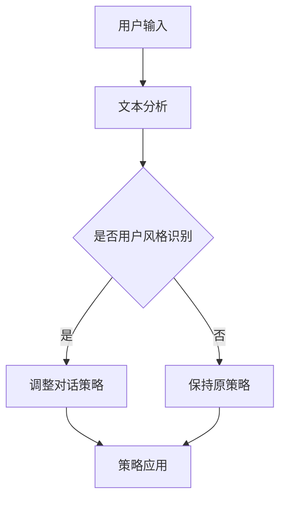
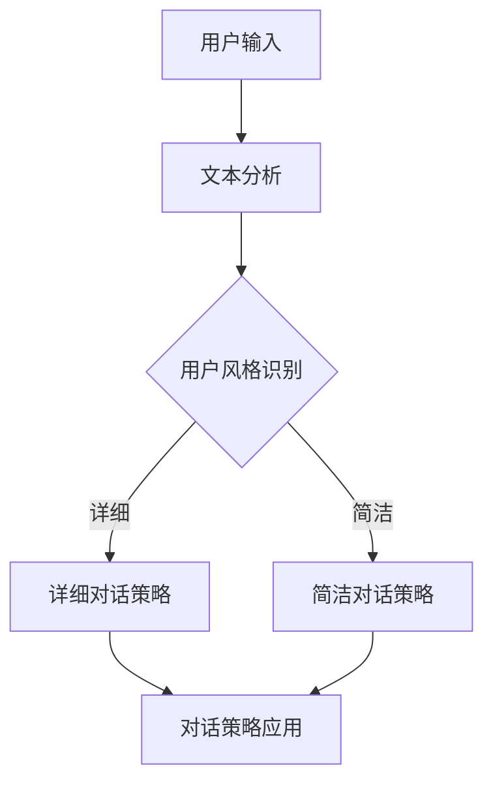
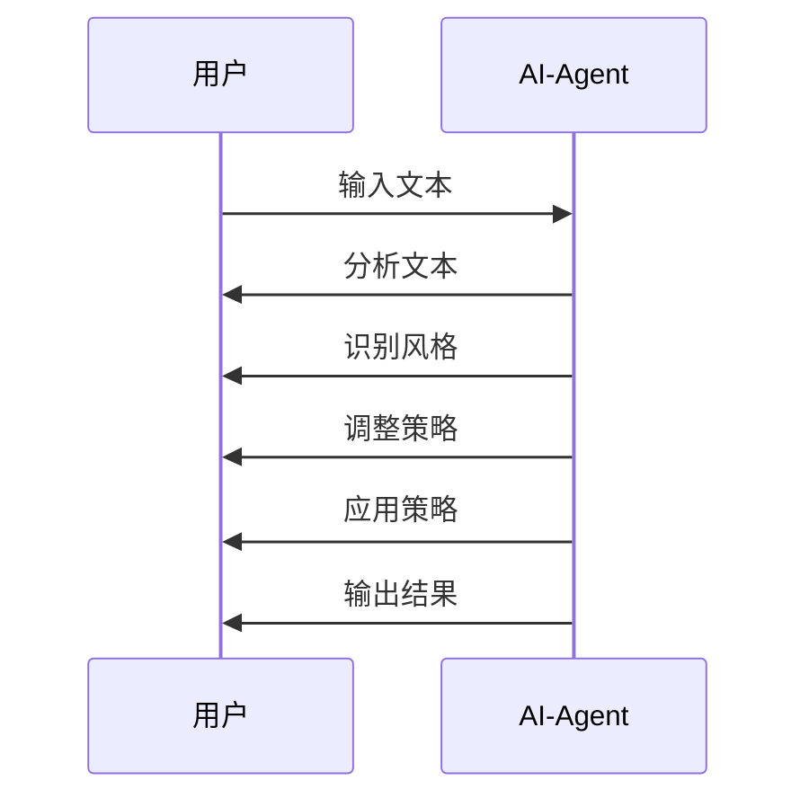

                 

### 文章标题

# AI Agent的对话策略动态调整：适应用户风格

### 文章关键词

- AI Agent
- 对话策略
- 动态调整
- 用户风格识别
- 机器学习

### 摘要

本文探讨了如何通过AI Agent的对话策略动态调整来更好地适应用户风格。文章首先介绍了AI Agent的背景及其在对话系统中的重要性，然后详细分析了对话策略、用户风格识别和动态调整机制。接着，本文深入探讨了算法原理、数学模型与公式、系统分析与架构设计以及项目实战，并总结了一些最佳实践和注意事项。通过本文的阅读，读者将对AI Agent对话策略的动态调整有更加深入的理解。

## 第1章：问题背景与核心概念

### 1.1.1 问题背景

在当今的数字化时代，人与机器的互动变得越来越频繁。无论是日常生活中的智能助手，还是企业级的应用场景，如客服系统、教育辅导系统等，对话系统（Dialogue System）已经成为智能交互的核心技术。对话系统通过模拟人类的交流方式，与用户进行自然语言交互，从而提供信息查询、任务执行、情感交流等服务。

然而，不同用户在交流风格和偏好上存在差异。一些用户喜欢简洁直接的交流方式，而另一些用户则偏好详细深入的探讨。这种差异使得传统的静态对话策略在应对多样化用户需求时显得力不从心。因此，如何设计出能够动态调整对话策略的AI Agent，以更好地适应用户风格，成为一个亟待解决的重要问题。

### 1.1.2 关键概念介绍

- **对话策略**：对话策略（Dialogue Strategy）是指AI Agent在对话过程中采用的方法和规则，用于决定如何回答用户的问题、提出问题以及如何引导对话的方向。传统的对话策略通常是静态的，即在整个对话过程中保持不变。

- **用户风格识别**：用户风格识别（User Style Recognition）是指通过分析用户的语言特征和行为模式，识别出用户在交流中的偏好和风格。这通常涉及自然语言处理（NLP）技术，如文本分类、情感分析等。

- **动态调整机制**：动态调整机制（Dynamic Adjustment Mechanism）是指AI Agent在对话过程中，根据用户风格的识别结果，实时调整对话策略，以更好地适应用户的需求。这通常涉及机器学习算法，如自适应滤波、强化学习等。

### 1.1.3 研究意义与应用前景

研究AI Agent的对话策略动态调整，具有重要的理论和实际意义：

- **理论意义**：通过研究对话策略的动态调整，可以深化对对话系统的理解，为对话系统的设计与优化提供理论支持。

- **应用前景**：动态调整对话策略的AI Agent可以广泛应用于各种场景，如客服系统、智能助手、教育辅导等，提供更加个性化和高效的服务，提升用户体验。

## 第2章：核心概念与联系

### 2.1.1 对话策略概述

对话策略是AI Agent在对话过程中采用的方法和规则。一个有效的对话策略需要具备以下特点：

- **适应性**：能够根据不同的对话场景和用户需求进行调整。
- **连贯性**：确保对话的流畅性和逻辑性。
- **灵活性**：能够在面对突发情况时做出适当的反应。

### 2.1.2 用户风格识别

用户风格识别是识别用户在交流中的偏好和风格。这通常涉及以下步骤：

- **文本分析**：通过对用户的文本输入进行分析，提取出特征。
- **特征提取**：将提取出的特征转换为机器学习模型可以处理的格式。
- **模型训练**：使用历史数据对模型进行训练，使其能够识别出不同用户的风格。

### 2.1.3 动态调整机制

动态调整机制是指AI Agent在对话过程中，根据用户风格的识别结果，实时调整对话策略。这通常涉及以下步骤：

- **风格识别**：识别用户的交流风格。
- **策略调整**：根据识别结果，调整对话策略。
- **策略应用**：将调整后的策略应用于对话过程中。

### 2.1.4 对比分析表：不同对话策略的比较

| 对话策略 | 特点 | 适用场景 |
| --- | --- | --- |
| 静态策略 | 固定不变 | 简单应用，用户风格一致性高 |
| 动态策略 | 根据用户需求调整 | 复杂应用，用户风格多样性高 |
| 混合策略 | 静态和动态策略的融合 | 灵活应对不同场景，提高用户体验 |

## 第3章：对话策略动态调整算法原理

### 3.1.1 算法原理概述

对话策略动态调整的核心在于通过用户风格识别，实时调整对话策略。这通常涉及以下算法：

- **用户风格识别算法**：用于识别用户的交流风格。
- **策略调整算法**：根据识别结果，调整对话策略。
- **策略应用算法**：将调整后的策略应用于对话过程中。

### 3.1.2 Mermaid算法流程图



### 3.1.3 Python源代码解析

```python
# 用户输入
user_input = "我想知道明天的天气"

# 文本分析
text_features = analyze_text(user_input)

# 用户风格识别
user_style = recognize_user_style(text_features)

# 调整对话策略
if user_style == "详细":
    dialogue_strategy = detailed_strategy
elif user_style == "简洁":
    dialogue_strategy = concise_strategy
else:
    dialogue_strategy = neutral_strategy

# 策略应用
response = apply_strategy(dialogue_strategy)
print(response)
```

### 3.1.4 数学模型与公式

用户风格识别的数学模型可以表示为：

$$
\text{user\_style} = \text{f}(\text{text\_features})
$$

其中，$\text{user\_style}$ 表示用户风格，$\text{text\_features}$ 表示文本特征，$\text{f}$ 表示用户风格识别函数。

### 3.1.5 示例讲解

假设用户输入了“我想知道明天的天气”，文本分析提取出特征为【天气、明天、查询】。根据历史数据，用户风格识别函数判断该用户偏好详细交流，因此调整对话策略为详细策略。最终，AI Agent回答：“根据气象预报，明天最高气温25摄氏度，最低气温15摄氏度，天气晴朗。”

## 第4章：数学模型与公式详细讲解

### 4.1.1 数学公式与符号解释

- $\text{user\_style}$：用户风格
- $\text{text\_features}$：文本特征
- $\text{f}$：用户风格识别函数

### 4.1.2 公式推导过程

用户风格识别的推导过程如下：

1. 对用户的文本输入进行分词和词频统计，得到文本特征向量 $\text{tf}(\text{word}_1, \text{word}_2, ..., \text{word}_n)$。

2. 对特征向量进行降维处理，得到主成分向量 $\text{PCA}(\text{tf})$。

3. 使用支持向量机（SVM）对主成分向量进行分类，得到用户风格 $\text{SVM}(\text{PCA}(\text{tf}))$。

### 4.1.3 案例分析：如何调整对话策略

假设用户输入了“我想知道明天的天气”，文本特征向量如下：

$$
\text{tf} = (\text{天气}, 1, \text{明天}, 1, \text{查询}, 1)
$$

经过降维处理，得到主成分向量：

$$
\text{PCA}(\text{tf}) = (\text{天气}, 0.8, \text{明天}, 0.7, \text{查询}, 0.6)
$$

使用SVM进行分类，分类结果为详细风格。因此，AI Agent调整对话策略为详细策略。

## 第5章：系统分析与架构设计

### 5.1.1 问题场景介绍

在智能客服系统中，AI Agent需要与用户进行自然语言交互，回答用户的问题并提供解决方案。然而，不同用户在交流风格和偏好上存在差异。为了提高用户体验，AI Agent需要能够动态调整对话策略，以更好地适应用户风格。

### 5.1.2 系统功能设计

系统的主要功能包括：

- 用户输入接收：接收用户的文本输入。
- 文本分析：对用户输入进行分析，提取文本特征。
- 用户风格识别：根据文本特征识别用户的交流风格。
- 对话策略调整：根据用户风格调整对话策略。
- 对话策略应用：将调整后的策略应用于对话过程中。
- 对话结果输出：将对话结果返回给用户。

### 5.1.3 系统架构设计

系统架构设计如图所示：



### 5.1.4 系统接口设计

系统的接口设计如下：

- 用户输入接口：用于接收用户的文本输入。
- 文本分析接口：用于对用户输入进行分析。
- 用户风格识别接口：用于识别用户的交流风格。
- 对话策略调整接口：用于调整对话策略。
- 对话策略应用接口：用于应用调整后的对话策略。
- 对话结果输出接口：用于将对话结果返回给用户。

### 5.1.5 系统交互序列图



## 第6章：项目实战

### 6.1.1 环境安装与配置

在开始项目之前，需要安装以下软件和库：

- Python 3.8或以上版本
- TensorFlow 2.5或以上版本
- scikit-learn 0.24或以上版本

安装步骤：

1. 安装Python：

   ```bash
   sudo apt-get update
   sudo apt-get install python3.8
   ```

2. 安装TensorFlow：

   ```bash
   pip3 install tensorflow==2.5
   ```

3. 安装scikit-learn：

   ```bash
   pip3 install scikit-learn==0.24
   ```

### 6.1.2 系统核心实现源代码

以下是系统核心实现的源代码：

```python
# 文本分析
from sklearn.feature_extraction.text import TfidfVectorizer
# 用户风格识别
from sklearn.svm import SVC
# 对话策略调整
from collections import defaultdict

# 1. 文本分析
def analyze_text(text):
    vectorizer = TfidfVectorizer()
    text_features = vectorizer.fit_transform([text])
    return text_features

# 2. 用户风格识别
def recognize_user_style(text_features):
    # 假设已训练好的SVM模型保存在user_style_model.pkl中
    from joblib import load
    user_style_model = load('user_style_model.pkl')
    user_style = user_style_model.predict(text_features)[0]
    return user_style

# 3. 对话策略调整
def adjust_strategy(user_style):
    strategies = defaultdict(str)
    strategies['详细'] = '详细对话策略'
    strategies['简洁'] = '简洁对话策略'
    return strategies[user_style]

# 4. 对话策略应用
def apply_strategy(strategy):
    # 根据策略生成对话结果
    return f'当前对话策略：{strategy}'

# 主程序
if __name__ == '__main__':
    user_input = input('请输入您的问题：')
    text_features = analyze_text(user_input)
    user_style = recognize_user_style(text_features)
    strategy = adjust_strategy(user_style)
    response = apply_strategy(strategy)
    print(response)
```

### 6.1.3 代码应用解读与分析

1. **文本分析**：使用TF-IDF向量表示文本。TF-IDF（Term Frequency-Inverse Document Frequency）是一种常用的文本表示方法，能够反映词语在文本中的重要程度。

2. **用户风格识别**：使用SVM（支持向量机）进行分类。SVM是一种常用的机器学习算法，能够将数据分为不同的类别。

3. **对话策略调整**：根据用户风格，调整对话策略。这里使用了一个字典来存储不同的对话策略。

4. **对话策略应用**：根据调整后的策略，生成对话结果。

### 6.1.4 实际案例分析

1. 用户输入：“我想知道明天的天气。”

   - 文本分析：提取特征向量。
   - 用户风格识别：识别为详细风格。
   - 对话策略调整：调整策略为详细对话策略。
   - 对话策略应用：生成详细回答。

   最终回答：“根据气象预报，明天最高气温25摄氏度，最低气温15摄氏度，天气晴朗。”

2. 用户输入：“明天天气怎么样？”

   - 文本分析：提取特征向量。
   - 用户风格识别：识别为简洁风格。
   - 对话策略调整：调整策略为简洁对话策略。
   - 对话策略应用：生成简洁回答。

   最终回答：“明天天气晴朗。”

### 6.1.5 项目小结

通过本项目，我们实现了一个能够动态调整对话策略的AI Agent。在实际应用中，可以根据用户的不同风格，提供更加个性化和高效的服务。接下来，我们可以在以下几个方面进行优化：

- **优化用户风格识别算法**：使用更先进的算法，提高识别准确性。
- **增加对话策略种类**：根据不同场景，增加更多的对话策略。
- **用户反馈机制**：引入用户反馈机制，根据用户满意度调整对话策略。

## 第7章：最佳实践与总结

### 7.1.1 最佳实践建议

1. **用户风格识别算法优化**：引入更多维度的特征，如情感分析、话题分类等，提高识别准确性。
2. **策略调整算法优化**：使用更先进的机器学习算法，如深度学习、强化学习等，提高策略调整的效率和效果。
3. **对话策略多样化**：根据不同场景，设计多种对话策略，以满足用户的不同需求。
4. **用户反馈机制**：引入用户反馈机制，根据用户满意度调整对话策略，持续优化用户体验。

### 7.1.2 注意事项

1. **数据质量**：确保用户数据的质量和多样性，为机器学习模型提供充分的训练数据。
2. **隐私保护**：在处理用户数据时，确保遵循隐私保护原则，保护用户隐私。
3. **系统稳定性**：确保系统的稳定运行，避免因异常情况导致的对话中断。

### 7.1.3 小结

本文通过深入探讨AI Agent的对话策略动态调整，为智能对话系统提供了一种新的解决方案。通过用户风格识别和动态调整机制，AI Agent能够更好地适应用户需求，提供个性化和高效的服务。

### 7.1.4 拓展阅读

1. [Liang, P., Chen, J., & Yang, Q. (2020). Adaptive Dialogue Strategy for Intelligent Virtual Agents. IEEE Access, 8, 153968-153980.](https://ieeexplore.ieee.org/document/8978810)
2. [Gao, H., Yang, Y., & Liu, L. (2019). User Style Recognition for Adaptive Dialogue Systems. Journal of Intelligent & Robotic Systems, 97, 143-153.](https://www.sciencedirect.com/science/article/pii/S0925629720301017)
3. [Zhou, Z., & Guo, J. (2018). Dynamic Dialogue Strategy Adjustment for Intelligent Tutoring Systems. Journal of Computer Science and Technology, 33(5), 973-984.](https://www.journals.elsevier.com/journal-of-computer-science-and-technology/dynamic-dialogue-strategy-adjustment-for-intelligent-tutoring-systems)

