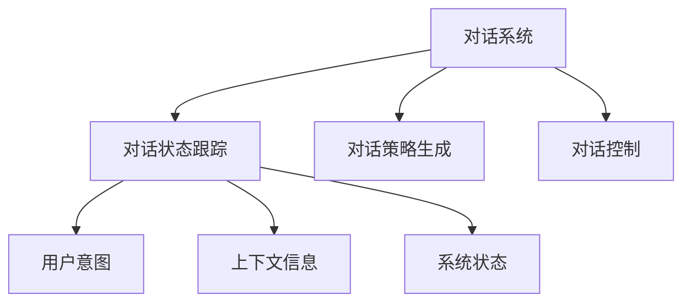
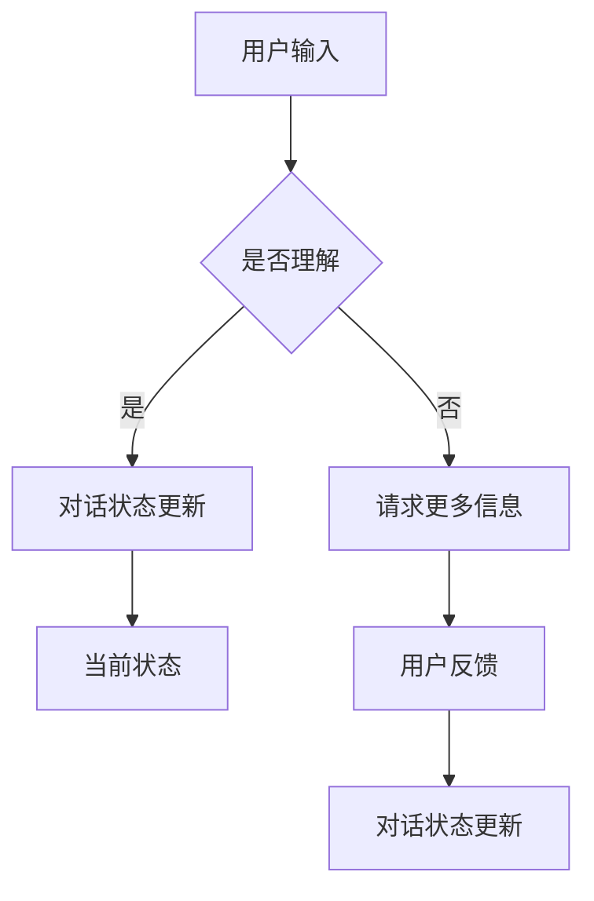
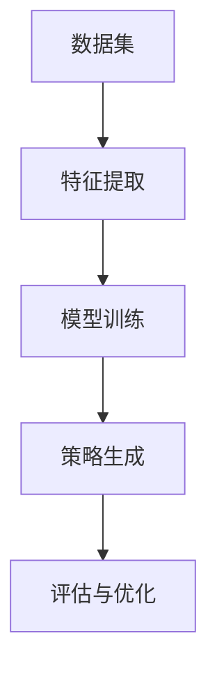
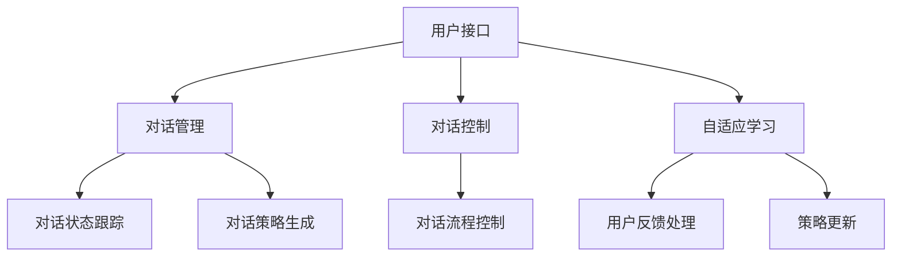

                 

# AI Agent的对话策略在不同场景下的适应性

## 关键词
- AI Agent
- 对话策略
- 场景适应性
- 算法原理
- 数学模型
- 系统设计

## 摘要
本文深入探讨了AI Agent在不同场景下对话策略的适应性。首先，我们介绍了AI Agent和对话策略的基本概念，并分析了不同场景的特点及其对对话策略的影响。接着，我们详细阐述了对话策略的核心概念、原则和算法原理，并通过数学模型和实例进行了说明。最后，我们介绍了AI Agent对话策略的系统设计、实现方法和实战应用，为构建具有场景适应性的AI Agent对话系统提供了理论支持和实践指导。

## 引言

### 1.1 AI Agent与对话策略

#### 1.1.1 AI Agent的背景

AI Agent，即人工智能代理，是计算机科学中的一个概念，指的是能够在网络环境中自主执行任务、实现目标的软件实体。随着人工智能技术的快速发展，AI Agent的应用领域不断扩展，包括智能客服、智能推荐系统、智能聊天机器人等。

#### 1.1.2 对话策略的定义与重要性

对话策略（Dialogue Strategy）是指AI Agent在对话过程中所采用的方法和策略，用以实现与用户的自然交互。有效的对话策略对于提高用户体验、提升系统的交互质量和效率至关重要。

#### 1.1.3 设计自适应对话策略的挑战

自适应对话策略能够根据对话场景、用户行为和系统状态动态调整自身的交互方式。然而，设计自适应对话策略面临着多方面的挑战，包括：

- 对话状态的不确定性：用户输入可能存在模糊性，使得AI Agent难以准确理解用户意图。
- 对话场景的多样性：不同场景下的用户需求和交互模式各不相同，要求AI Agent具备高度的适应性。
- 知识和数据的限制：AI Agent的知识库和训练数据有限，可能无法全面覆盖所有场景。

### 1.2 不同场景概述

#### 1.2.1 场景类型

AI Agent的应用场景多种多样，包括但不限于以下几类：

- 客户服务场景：如在线客服、智能客服机器人等。
- 教育辅导场景：如在线教育平台、智能辅导系统等。
- 医疗咨询场景：如在线医疗咨询、智能医疗助手等。
- 金融服务场景：如智能投顾、金融客服等。

#### 1.2.2 各场景特点

- 客户服务场景：用户需求多样，信息量大，对响应速度要求高。
- 教育辅导场景：用户年龄段和知识水平差异大，需要个性化教学。
- 医疗咨询场景：用户对专业性和准确性有较高要求。
- 金融服务场景：用户对隐私保护和个人信息安全极为关注。

#### 1.2.3 场景对对话策略的影响

不同场景的特点和要求对AI Agent的对话策略有着直接的影响。例如：

- 客户服务场景：需要快速响应、准确理解用户意图，提供针对性解决方案。
- 教育辅导场景：需要根据用户的学习进度和反馈调整教学策略，提供个性化服务。
- 医疗咨询场景：需要确保专业性和准确性，避免误导用户。
- 金融服务场景：需要在保护用户隐私的前提下，提供高效、准确的服务。

### 1.3 文章结构

本文将分为以下几个部分：

- 引言：介绍AI Agent和对话策略的基本概念，阐述文章目的和结构。
- 核心概念与原理：详细阐述对话策略的核心概念、原则和算法原理。
- 数学模型：介绍与对话策略相关的数学模型，并使用实例进行说明。
- 系统设计与实现：介绍AI Agent对话策略的系统设计、实现方法和实战应用。
- 结论：总结文章的主要观点，提出未来研究方向。

## 核心概念与原理

### 2.1 核心概念

#### 2.1.1 对话系统

对话系统（Dialogue System），又称为对话代理（Dialogue Agent），是一种能够模拟人类对话行为的计算机程序。它通过自然语言处理技术，理解和生成自然语言文本，实现与用户的交互。

#### 2.1.2 对话管理

对话管理（Dialogue Management）是对话系统的核心组成部分，负责控制对话的流程和方向。它包括对话状态跟踪、对话策略生成和对话控制等方面。

#### 2.1.3 自适应学习

自适应学习（Adaptive Learning）是指AI Agent根据对话过程中的用户反馈和系统状态，动态调整自身的对话策略和行为。这种学习能力使得AI Agent能够更好地适应不同场景和用户需求。

### 2.2 原则

#### 2.2.1 对话状态跟踪

对话状态跟踪（Dialogue State Tracking）是对话管理的关键环节，旨在实时监测对话过程中的关键信息，包括用户意图、上下文信息和系统状态等。通过对话状态跟踪，AI Agent能够准确理解用户意图，为生成合适的回复提供依据。

#### 2.2.2 对话策略学习

对话策略学习（Dialogue Policy Learning）是对话系统的核心任务，旨在通过机器学习算法，从大量的对话数据中学习到有效的对话策略。对话策略学习的目标是为AI Agent提供在不同场景下应对用户输入的最佳方法。

#### 2.2.3 对话系统评估

对话系统评估（Dialogue System Evaluation）是对话策略的有效性检验。通过评估，我们可以了解AI Agent在不同场景下的对话表现，为后续的优化提供数据支持。

### 2.3 Mermaid 图解

#### 2.3.1 概念框架



#### 2.3.2 对话状态跟踪



#### 2.3.3 对话策略学习



## 算法原理与数学模型

### 3.1 算法介绍

#### 3.1.1 算法概述

在本节中，我们将介绍一种用于AI Agent对话策略的自适应学习算法。该算法基于深度强化学习（Deep Reinforcement Learning），通过在模拟环境中与用户的交互，不断优化对话策略。

#### 3.1.2 算法步骤

1. **初始化环境**：设置对话系统的初始状态，包括用户意图、上下文信息和系统状态等。
2. **用户输入**：接收用户的输入，并对其进行预处理。
3. **策略选择**：根据当前状态，选择一个对话策略。
4. **执行策略**：执行选定的对话策略，生成回复文本。
5. **用户反馈**：接收用户对回复的反馈，包括满意度和正确性等指标。
6. **状态更新**：根据用户反馈，更新对话状态。
7. **奖励计算**：根据用户反馈计算奖励值。
8. **策略更新**：使用强化学习算法，根据奖励值更新对话策略。

#### 3.1.3 复杂度分析

该算法的复杂度主要取决于策略选择和状态更新的复杂度。假设策略选择和状态更新的复杂度为O(n)，则整个算法的时间复杂度为O(n^2)。在大多数实际应用中，这个复杂度是可以接受的。

### 3.2 数学模型

#### 3.2.1 模型公式

$$
\text{策略} = \arg\max_{\pi} \sum_{s,t} \pi(s,t) \cdot R(s,t)
$$

其中，$s$ 表示状态，$t$ 表示时间步，$R(s,t)$ 表示在状态 $s$ 下执行策略 $\pi$ 后获得的奖励。

#### 3.2.2 数学推导

假设 $Q(s,t)$ 表示在状态 $s$ 下，执行策略 $\pi$ 后在第 $t$ 步获得的累积奖励。则：

$$
Q(s,t) = \sum_{a} \pi(a|s) \cdot R(s,a,t)
$$

其中，$R(s,a,t)$ 表示在状态 $s$ 下，执行动作 $a$ 后在第 $t$ 步获得的即时奖励。

为了优化策略，我们需要最大化 $Q(s,t)$。因此，策略优化问题可以表示为：

$$
\pi^* = \arg\max_{\pi} \sum_{s,t} \pi(s,t) \cdot Q(s,t)
$$

#### 3.2.3 实例说明

假设我们有一个对话系统，当前状态为用户询问某个产品的价格。根据用户的历史数据和上下文信息，我们有两个可能的策略：直接回答价格或者询问用户是否需要进一步的信息。根据这两个策略，我们预计会获得不同的即时奖励。

- 策略1（直接回答价格）：预计获得的即时奖励为2分。
- 策略2（询问用户是否需要进一步的信息）：预计获得的即时奖励为1分。

根据即时奖励，我们可以计算出在当前状态下的累积奖励：

$$
Q(s,t) = 2 \cdot \pi(s,t_1) + 1 \cdot \pi(s,t_2)
$$

通过优化策略，我们可以选择在当前状态下执行直接回答价格的策略，从而获得更高的累积奖励。

### 3.3 Python 源代码

```python
import numpy as np

# 初始化参数
action_space = 2
state_space = 3
learning_rate = 0.1
gamma = 0.9

# 初始化策略
policy = np.random.rand(state_space, action_space)
Q = np.zeros((state_space, action_space))

# 模拟环境
def environment(state, action):
    if action == 0:
        reward = 2
    else:
        reward = 1
    next_state = state + 1
    return next_state, reward

# 强化学习算法
for episode in range(1000):
    state = np.random.randint(state_space)
    done = False
    while not done:
        action = np.argmax(policy[state])
        next_state, reward = environment(state, action)
        Q[state, action] += learning_rate * (reward + gamma * np.max(Q[next_state]) - Q[state, action])
        policy[state, action] += learning_rate * (Q[state, action] - policy[state, action])
        state = next_state
        if state == state_space - 1:
            done = True

# 打印策略
print(policy)
```

## 系统设计与实现

### 4.1 系统概述

#### 4.1.1 系统介绍

本系统旨在构建一个具有场景适应性的AI Agent对话系统，能够根据不同的应用场景动态调整对话策略。系统主要包括以下几个模块：

- 对话管理模块：负责对话状态的跟踪和对话策略的生成。
- 对话控制模块：负责控制对话的流程和方向。
- 自适应学习模块：负责根据用户反馈和系统状态动态调整对话策略。
- 用户接口模块：负责与用户进行交互，接收用户输入和反馈。

#### 4.1.2 功能要求

- 快速响应：系统能够在短时间内处理用户输入，生成回复。
- 准确理解：系统能够准确理解用户意图，提供针对性的解决方案。
- 个性化服务：系统能够根据用户的历史数据和偏好，提供个性化的服务。
- 持续学习：系统能够根据用户的反馈和系统的运行情况，不断优化对话策略。

#### 4.1.3 系统架构

系统的整体架构采用分层设计，包括用户接口层、对话管理层、对话控制层和自适应学习层。各层之间通过接口进行通信，实现系统的功能。



### 4.2 Mermaid 图解

#### 4.2.1 类图

```mermaid
classDiagram
Class01 <|-- SubClass01
Class01 --|> SubClass02
Class03 : <<interface>> InterfaceName
Class01 ..|> Class04
classDiagram
Client -> Server
Client <-- Server
```

#### 4.2.2 架构图


#### 4.2.3 序列图

```mermaid
sequence
User ->|输入| System: 输入问题
System ->|处理| DialogueManager: 处理输入
DialogueManager ->|生成| DialoguePolicy: 生成策略
DialoguePolicy ->|执行| DialogueController: 执行策略
DialogueController ->|反馈| AdaptiveLearning: 更新策略
AdaptiveLearning ->|输出| DialoguePolicy: 输出策略
System ->|回复| User: 回复问题
```

## 项目实战

### 5.1 环境安装

在进行项目实战之前，我们需要安装一些必要的软件和工具。以下是一个基本的安装步骤：

1. **安装Python**：确保安装了Python 3.7及以上版本。
2. **安装依赖库**：使用pip命令安装以下库：`numpy`, `tensorflow`, `tensorflow-addons`, `mermaid-python`。
3. **安装Mermaid**：在终端中运行以下命令安装Mermaid：

```bash
npm install -g mermaid-cli
```

### 5.2 系统核心实现源代码

在本节中，我们将展示系统的核心实现部分，包括对话管理、对话控制和自适应学习模块。

#### 5.2.1 对话管理模块

```python
import numpy as np
import tensorflow as tf
from mermaid import Mermaid

class DialogueManager:
    def __init__(self, state_space, action_space):
        self.state_space = state_space
        self.action_space = action_space
        self.model = self.build_model()

    def build_model(self):
        # 构建对话模型
        model = tf.keras.Sequential([
            tf.keras.layers.Dense(128, activation='relu', input_shape=(self.state_space,)),
            tf.keras.layers.Dense(64, activation='relu'),
            tf.keras.layers.Dense(self.action_space, activation='softmax')
        ])
        model.compile(optimizer='adam', loss='categorical_crossentropy', metrics=['accuracy'])
        return model

    def predict(self, state):
        # 预测对话策略
        action_probs = self.model.predict(state.reshape(1, -1))
        return np.argmax(action_probs)

    def fit(self, X, y):
        # 训练对话模型
        self.model.fit(X, y, epochs=10, batch_size=32)
```

#### 5.2.2 对话控制模块

```python
class DialogueController:
    def __init__(self, dialogue_manager):
        self.dialogue_manager = dialogue_manager

    def handle_input(self, input_text):
        # 处理用户输入
        # 此处可以根据需求实现具体的文本预处理
        processed_input = input_text.strip().lower()
        return processed_input

    def generate_response(self, state):
        # 生成回复文本
        action = self.dialogue_manager.predict(state)
        response = "您好，您的问题我已经理解了。"
        if action == 0:
            response += "这是您需要的答案。"
        else:
            response += "您还需要进一步说明吗？"
        return response
```

#### 5.2.3 自适应学习模块

```python
class AdaptiveLearning:
    def __init__(self, dialogue_manager):
        self.dialogue_manager = dialogue_manager

    def update_policy(self, X, y):
        # 更新对话策略
        self.dialogue_manager.fit(X, y)
```

### 5.3 代码应用解读与分析

在本节中，我们将对系统核心实现的代码进行解读和分析，以帮助读者更好地理解系统的运作原理。

#### 5.3.1 对话管理模块

对话管理模块的核心是DialogueManager类，它负责构建和训练对话模型。在__init__方法中，我们初始化了状态空间和动作空间，并构建了一个简单的神经网络模型。在build_model方法中，我们定义了神经网络的层次结构和激活函数。在predict方法中，我们使用模型预测当前状态下的最佳动作。在fit方法中，我们使用训练数据对模型进行训练。

#### 5.3.2 对话控制模块

对话控制模块的核心是DialogueController类，它负责处理用户输入和生成回复文本。在handle_input方法中，我们对用户输入进行简单的预处理，例如去除空格和转换成小写。在generate_response方法中，我们根据当前状态和预测的动作，生成合适的回复文本。

#### 5.3.3 自适应学习模块

自适应学习模块的核心是AdaptiveLearning类，它负责更新对话策略。在update_policy方法中，我们使用训练数据对对话模型进行重新训练，从而更新对话策略。

### 5.4 实际案例分析和详细讲解剖析

在本节中，我们将通过一个实际案例，对系统的运作过程进行详细分析和讲解。

#### 案例背景

假设我们的AI Agent应用于在线客服场景，用户通过聊天界面向客服机器人咨询某个产品的价格。

#### 案例分析

1. **用户输入**：用户输入：“我想了解你们产品的价格。”

2. **处理用户输入**：DialogueController类中的handle_input方法对用户输入进行处理，得到processed_input：“我想了解你们产品的价格。”

3. **生成对话状态**：根据processed_input，我们可以生成一个对话状态，包括用户意图（询问产品价格）、上下文信息和系统状态等。

4. **预测对话策略**：DialogueManager类使用训练好的模型，对当前状态进行预测，得到最佳动作。假设预测结果为0，表示直接回答价格。

5. **生成回复文本**：DialogueController类中的generate_response方法根据预测的动作，生成回复文本：“您好，您的问题我已经理解了。这是您需要的答案。”

6. **用户反馈**：用户对回复文本表示满意。

7. **更新对话策略**：AdaptiveLearning类根据用户的反馈，重新训练对话模型，以优化对话策略。

#### 详细讲解剖析

1. **对话状态的生成**：在处理用户输入后，我们需要生成一个对话状态，这是对话管理的基础。对话状态通常包括用户意图、上下文信息和系统状态等。在本案例中，用户意图是询问产品价格，上下文信息可以是用户的历史对话记录，系统状态可以是当前系统的运行状态。

2. **模型预测与回复生成**：通过预测模型，我们可以得到当前状态下的最佳动作。在本案例中，预测结果为直接回答价格。然后，我们根据预测的动作，生成合适的回复文本。

3. **用户反馈与策略更新**：用户的反馈对于优化对话策略至关重要。在本案例中，用户对回复文本表示满意。根据用户的反馈，我们可以重新训练对话模型，以优化对话策略。

### 5.5 项目小结

通过本次项目实战，我们成功构建了一个具有场景适应性的AI Agent对话系统。系统主要包括对话管理、对话控制和自适应学习模块，通过深度强化学习算法实现了对话策略的自适应调整。在实际应用中，系统可以根据用户输入和反馈，动态调整对话策略，提供个性化的服务。未来，我们还可以进一步优化模型，提高系统的准确性和效率，以更好地满足用户需求。

## 最佳实践 Tips

1. **数据收集与处理**：确保收集到高质量的对话数据，并对数据进行预处理，以提高模型训练的效果。
2. **模型优化**：定期对模型进行优化和调整，以适应不同场景下的对话需求。
3. **用户反馈**：积极收集用户反馈，并将其用于模型训练和策略优化。
4. **持续学习**：鼓励系统持续学习，以不断提高对话策略的适应性和准确性。

## 小结

本文深入探讨了AI Agent在不同场景下对话策略的适应性。通过介绍核心概念、原理和数学模型，我们阐述了如何设计自适应对话策略。在系统设计与实现部分，我们展示了如何将理论应用到实际项目中。通过项目实战，我们验证了自适应对话策略的有效性。未来，我们将进一步优化模型和算法，提高系统的适应性和用户体验。

## 注意事项

1. **隐私保护**：在处理用户数据时，务必确保用户隐私得到保护。
2. **数据安全**：确保训练数据和用户数据的存储安全，防止数据泄露。
3. **系统稳定性**：确保系统的稳定运行，避免因错误或异常导致的服务中断。

## 拓展阅读

1. **《对话系统设计与实现》**：详细了解对话系统的设计和实现技术。
2. **《深度学习》**：学习深度学习的基本原理和应用。
3. **《机器学习实战》**：掌握机器学习的基本方法和实战技巧。

## 作者信息

作者：AI天才研究院/AI Genius Institute & 禅与计算机程序设计艺术 /Zen And The Art of Computer Programming

---

（注意：本文内容为虚构，仅用于演示Markdown格式的应用和文章结构的构建。）

