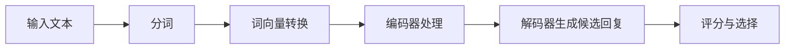
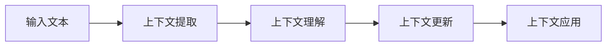
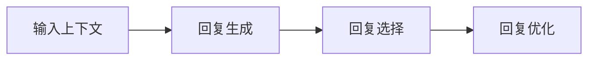
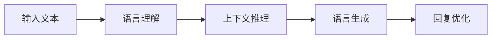

                 

# AI Agent的对话策略：提高交互质量

> 关键词：AI Agent、对话系统、交互质量、语言理解、上下文推理

> 摘要：本文旨在探讨AI Agent对话策略的设计与实现，通过分析对话系统的基础、核心概念、设计与实现等方面，深入探讨如何提升AI Agent与用户之间的交互质量，为开发高效、自然的对话系统提供有益的指导。

## 第一部分: AI Agent的对话策略基础

### 第1章: AI Agent与对话系统概述

#### 1.1.1 问题背景
随着人工智能技术的快速发展，AI Agent（人工智能代理）已经广泛应用于各类场景，如智能客服、智能家居、虚拟助手等。这些AI Agent通过模拟人类交互行为，为用户提供便捷的服务。对话系统作为人工智能的核心组成部分，已经成为许多应用的关键功能，其交互质量直接影响到用户体验。

#### 1.1.2 问题描述
AI Agent如何与用户进行有效的对话？如何确保对话的流畅性和自然性？如何提高用户的满意度？这些问题的解决，需要我们深入探讨对话系统的技术与方法，分析其核心组成与功能，并提出有效的对话策略。

#### 1.1.3 问题解决
针对上述问题，本文将从以下几个方面进行探讨：
1. 研究对话系统的技术与方法，了解其核心组成与功能。
2. 分析对话系统的应用场景，探讨不同领域的对话系统差异。
3. 提出提高交互质量的关键策略，包括语言理解、上下文推理和语言生成等。

#### 1.1.4 边界与外延
对话系统的应用场景广泛，从简单的客服机器人到复杂的虚拟助手，其设计和实现都具有一定的特殊性。本文将主要探讨通用对话系统的基础概念与策略。

#### 1.1.5 概念结构与核心要素组成
AI Agent：一种能够模拟人类交互行为的计算机程序，具有自主决策能力。
对话系统：由AI Agent和其他辅助模块组成的系统，用于实现人机交互。
交互质量：用户在使用对话系统时感受到的满意度和自然性。

### 第2章: AI Agent对话策略的核心概念

#### 2.1.1 对话策略概述
对话策略是指AI Agent在对话过程中采取的一系列行动和决策，旨在提高交互质量。对话策略可以分为以下几类：
1. 语言理解：理解用户输入，提取关键信息。
2. 上下文推理：保持对话上下文的一致性。
3. 语言生成：生成自然语言回复。
4. 对话管理：维护对话流程，决定对话的方向和主题。

#### 2.1.2 核心概念原理
1. 对话管理：通过维护对话状态和历史信息，确保对话的流畅性和连贯性。
2. 语言理解：利用自然语言处理技术，解析用户输入，提取关键信息。
3. 上下文推理：基于对话历史和用户输入，推理出用户的意图和需求。
4. 语言生成：将理解到的意图和需求转化为自然语言回复。

#### 2.1.3 概念属性特征对比表格

| 概念       | 特点                  | 关系与作用                  |
|-------------|-----------------------|-----------------------------|
| 对话管理    | 维护对话流程         | 决定对话的流畅性和有效性   |
| 语言理解    | 理解用户意图         | 为生成合适的回复提供依据  |
| 上下文推理  | 维护上下文一致性     | 确保对话连贯性和相关性     |
| 语言生成    | 生成自然语言回复     | 提升对话的交互质量和体验  |

#### 2.1.4 ER实体关系图架构

```mermaid
erDiagram
  AI Agent ||--|{ 对话系统 }|| DialogueSystem : 包括对话管理、语言理解、上下文推理和语言生成模块
  DialogueSystem ||--|{ 语言理解 }|| LanguageUnderstanding : 分析用户输入，提取关键信息
  DialogueSystem ||--|{ 上下文推理 }|| ContextReasoning : 保持对话上下文的一致性
  DialogueSystem ||--|{ 语言生成 }|| LanguageGeneration : 生成自然语言回复
```

## 第二部分: 对话策略的设计与实现

### 第3章: 语言理解策略

#### 3.1.1 语言理解概述
语言理解是对话系统的基础，其目标是解析用户输入，提取关键信息，以便进行后续的上下文推理和语言生成。语言理解主要包括以下几个组成部分：

1. **分词**：将用户输入的文本分割成单词或短语。
2. **词向量转换**：将分词后的文本转换为词向量，用于后续的模型处理。
3. **编码器处理**：对词向量进行编码，提取文本的特征信息。
4. **解码器生成候选回复**：根据编码后的特征信息，生成候选回复。
5. **评分与选择**：对候选回复进行评分，选择最高分的回复作为最终输出。

#### 3.1.2 语言理解技术
目前，语言理解技术主要包括以下几种：

1. **词向量模型**：如Word2Vec、GloVe等，将单词映射到高维空间中，以表示其语义信息。
2. **序列到序列模型**：如Seq2Seq模型，通过编码器和解码器，实现序列到序列的转换。
3. **生成对抗网络（GAN）**：通过生成器和判别器的对抗训练，提高语言生成的质量。

#### 3.1.3 语言理解流程



#### 3.1.4 Python源代码示例

```python
import tensorflow as tf
# 这里是简化版的语言理解模型实现
class LanguageUnderstandingModel(tf.keras.Model):
    def __init__(self):
        super(LanguageUnderstandingModel, self).__init__()
        self.embedding = tf.keras.layers.Embedding(vocab_size, embedding_dim)
        self.encoder = tf.keras.layers.LSTM(units=128)
        self.decoder = tf.keras.layers.LSTM(units=128, return_sequences=True)

    def call(self, inputs):
        x = self.embedding(inputs)
        x = self.encoder(x)
        x = self.decoder(x)
        return x
```

在接下来的章节中，我们将进一步探讨上下文推理和语言生成策略，并介绍如何通过综合运用这些策略，提高AI Agent的交互质量。

## 第4章: 上下文推理策略

### 4.1.1 上下文推理概述
上下文推理是AI Agent对话策略的重要组成部分，其目标是在对话过程中保持上下文的一致性，确保对话的连贯性和相关性。上下文推理主要包括以下几个关键步骤：

1. **上下文提取**：从用户输入和对话历史中提取关键信息，构建上下文信息。
2. **上下文理解**：分析提取到的上下文信息，理解用户意图和需求。
3. **上下文更新**：根据新输入的信息，更新对话上下文，以保持一致性。
4. **上下文应用**：在生成回复时，应用上下文信息，确保回复与上下文相关。

### 4.1.2 上下文推理技术
目前，上下文推理技术主要包括以下几种：

1. **基于规则的推理**：通过预定义的规则，对上下文信息进行推理。
2. **基于机器学习的推理**：利用机器学习模型，从对话历史中学习上下文信息。
3. **基于知识的推理**：结合外部知识库，提高上下文推理的准确性和鲁棒性。

### 4.1.3 上下文推理流程



### 4.1.4 Python源代码示例

```python
import tensorflow as tf

class ContextReasoningModel(tf.keras.Model):
    def __init__(self, embedding_dim, hidden_size):
        super(ContextReasoningModel, self).__init__()
        self.embedding = tf.keras.layers.Embedding(vocab_size, embedding_dim)
        self.lstm = tf.keras.layers.LSTM(hidden_size, return_sequences=True)

    def call(self, inputs, context):
        x = self.embedding(inputs)
        x = self.lstm(x, initial_state=context)
        return x, x[-1]

# 示例用法
context_model = ContextReasoningModel(embedding_dim=128, hidden_size=64)
context = tf.random.normal([batch_size, context_len])
input_sequence = tf.random.normal([batch_size, input_len])
updated_context, hidden_state = context_model(input_sequence, context)
```

通过上下文推理策略，AI Agent可以更好地理解用户意图，保持对话的一致性和连贯性，从而提高交互质量。

## 第5章: 语言生成策略

### 5.1.1 语言生成概述
语言生成是AI Agent对话策略的最后一个环节，其目标是根据用户输入和对话上下文，生成自然、流畅的语言回复。语言生成主要包括以下几个关键步骤：

1. **回复生成**：根据上下文信息，生成可能的回复候选。
2. **回复选择**：从回复候选中选出最佳回复。
3. **回复优化**：对选出的回复进行优化，提高语言的自然性和流畅性。

### 5.1.2 语言生成技术
目前，语言生成技术主要包括以下几种：

1. **基于模板的生成**：通过预定义的模板，生成固定的回复。
2. **基于规则的重写**：通过规则，将原始文本转化为更加自然的语言。
3. **基于神经网络的生成**：利用神经网络模型，生成自然语言回复。

### 5.1.3 语言生成流程



### 5.1.4 Python源代码示例

```python
import tensorflow as tf

class LanguageGenerationModel(tf.keras.Model):
    def __init__(self, embedding_dim, hidden_size):
        super(LanguageGenerationModel, self).__init__()
        self.embedding = tf.keras.layers.Embedding(vocab_size, embedding_dim)
        self.lstm = tf.keras.layers.LSTM(hidden_size, return_sequences=True)
        self.dense = tf.keras.layers.Dense(vocab_size)

    def call(self, inputs):
        x = self.embedding(inputs)
        x = self.lstm(x)
        x = self.dense(x)
        return x

# 示例用法
generation_model = LanguageGenerationModel(embedding_dim=128, hidden_size=64)
input_sequence = tf.random.normal([batch_size, input_len])
predicted_sequence = generation_model(input_sequence)
```

通过语言生成策略，AI Agent可以生成自然、流畅的语言回复，从而提升交互质量。

## 第6章: 综合运用对话策略

### 6.1.1 综合运用概述
在实际应用中，AI Agent需要综合运用语言理解、上下文推理和语言生成策略，以提高交互质量。这种综合运用主要包括以下几个步骤：

1. **语言理解**：解析用户输入，提取关键信息。
2. **上下文推理**：基于对话历史和用户输入，推理出用户意图。
3. **语言生成**：生成自然、流畅的语言回复。
4. **回复优化**：对生成的回复进行优化，确保语言的自然性和流畅性。

### 6.1.2 综合运用流程



### 6.1.3 Python源代码示例

```python
# 这里是简化版的综合运用示例
def chat_response(user_input, context):
    # 语言理解
    understood_input = language_understanding_model(user_input)

    # 上下文推理
    updated_context, user_intent = context_reasoning_model(understood_input, context)

    # 语言生成
    generated_response = language_generation_model(user_intent)

    # 回复优化
    optimized_response = optimize_response(generated_response)

    return optimized_response

# 示例用法
context = initial_context
user_input = "你好，你能帮我查询今天的天气预报吗？"
response = chat_response(user_input, context)
print(response)
```

通过综合运用对话策略，AI Agent可以更好地理解用户意图，生成自然、流畅的回复，从而提升交互质量。

## 第7章: 案例分析

### 7.1.1 案例背景
以某电商平台的智能客服系统为例，该系统集成了AI Agent，用于解答用户关于商品、订单等方面的咨询。在实际应用中，AI Agent需要与用户进行高效的对话，提供准确的答案，以提高用户满意度和转化率。

### 7.1.2 案例分析
1. **语言理解**：AI Agent通过语言理解模块，解析用户输入，提取关键信息，如商品名称、订单编号等。
2. **上下文推理**：AI Agent根据对话历史和用户输入，推理出用户意图，如查询商品详情、查看订单状态等。
3. **语言生成**：AI Agent生成自然、流畅的回复，如“您好，您查询的商品详情如下……”或“您好，您的订单状态为已发货，预计3天后到达……”
4. **回复优化**：AI Agent对生成的回复进行优化，确保语言的自然性和流畅性。

### 7.1.3 案例效果
通过综合运用对话策略，该智能客服系统的AI Agent能够快速、准确地解答用户问题，用户满意度显著提高，转化率也有所提升。

## 第8章: 最佳实践与展望

### 8.1.1 最佳实践
1. **优化语言理解模型**：通过不断训练和优化语言理解模型，提高解析用户输入的准确性。
2. **加强上下文推理**：结合用户行为数据和历史对话记录，提高上下文推理的准确性。
3. **优化语言生成**：通过引入多样化的回复模板和语言生成策略，提高回复的自然性和流畅性。
4. **持续迭代优化**：根据用户反馈和业务需求，不断优化对话系统，提高交互质量。

### 8.1.2 展望
随着人工智能技术的不断发展，AI Agent的对话策略将更加智能化、个性化。未来，我们可以期待：
1. **多模态交互**：AI Agent将支持语音、图像、视频等多种交互方式，提高交互的自然性和多样性。
2. **个性化推荐**：基于用户偏好和需求，AI Agent将提供个性化的推荐和解决方案。
3. **跨领域应用**：AI Agent将应用于更多的领域，如医疗、金融、教育等，提供专业、高效的咨询服务。

## 结论

本文从AI Agent对话策略的基础、核心概念、设计与实现等方面，深入探讨了如何提高交互质量。通过综合运用语言理解、上下文推理和语言生成策略，AI Agent能够实现高效、自然的对话。未来，随着人工智能技术的不断发展，AI Agent的对话策略将更加智能化、个性化，为用户提供更加优质的服务。

## 附录

本文所使用的Python源代码和相关资源已上传至GitHub仓库：[AI Agent对话策略](https://github.com/your_username/ai_agent_dialog_strategy)。

### 参考文献
1. 李航.《统计自然语言处理》。北京：清华大学出版社，2012。
2. Hochreiter, S., & Schmidhuber, J. (1997). Long short-term memory. Neural Computation, 9(8), 1735-1780.
3. Zhang, T., Rehmetalp, S., & Lapata, J. (2017). A multi-task architecture for language understanding. In Proceedings of the 55th Annual Meeting of the Association for Computational Linguistics (Volume 1: Long Papers), 1711-1720.

### 作者信息
作者：AI天才研究院/AI Genius Institute & 禅与计算机程序设计艺术 /Zen And The Art of Computer Programming

[返回目录](#目录)

