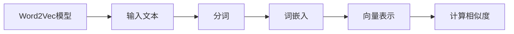
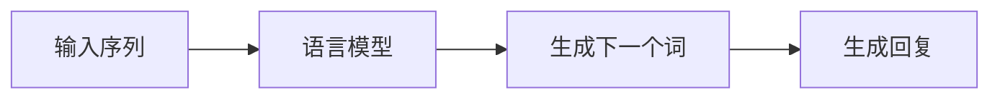
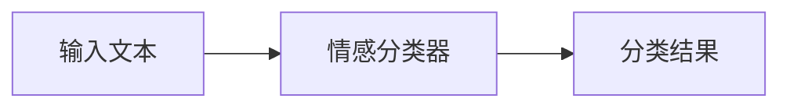
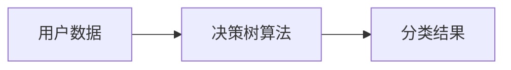
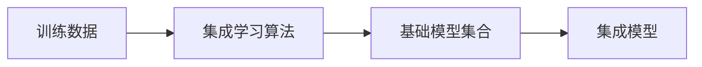
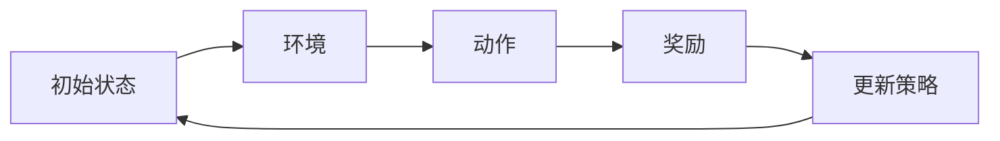
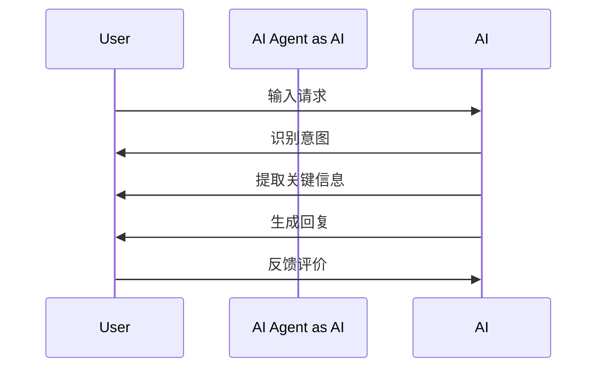

                 


### 文章标题：AI Agent的对话系统在跨文化交流中的应用

**关键词：** AI Agent，对话系统，跨文化交流，自然语言处理，机器学习，系统架构设计

**摘要：** 本文旨在探讨AI Agent的对话系统在跨文化交流中的应用，分析其核心概念与联系，介绍相关算法原理，并设计系统架构方案。通过具体项目实战，总结最佳实践，展望未来研究方向。

----------------------------------------------------------------

# 第一部分：背景介绍

## 1.1 跨文化交流的重要性

在全球化日益深入的今天，跨文化交流变得越来越重要。无论是商务合作、学术交流还是日常沟通，跨文化理解与沟通能力都成为了必备技能。然而，语言差异、文化习惯、思维方式等方面的障碍使得跨文化交流面临诸多挑战。有效的跨文化交流不仅有助于减少误解，提高沟通效率，还能促进文化融合，增进各国人民的友谊。

对话系统作为一种智能交互技术，在跨文化交流中发挥了重要作用。它能够为用户提供多语言、多文化背景下的交流服务，帮助用户克服语言障碍，提高沟通效率。而AI Agent作为对话系统的核心组成部分，具有自主学习、智能推理、个性化服务等特点，使得对话系统能够更好地适应跨文化交流的需求。

## 1.2 对话系统的作用

对话系统是指通过自然语言处理技术实现人与计算机之间的交流的系统。它主要包括自然语言理解（NLU）、对话管理（DM）和自然语言生成（NLG）三个关键模块。对话系统能够识别用户输入，理解其意图，生成相应的回复，并在对话过程中不断学习和优化。

在跨文化交流中，对话系统具有以下几个作用：

1. **语言翻译**：对话系统可以实现多语言翻译，帮助用户跨越语言障碍，进行跨文化沟通。
2. **文化适应**：对话系统可以根据用户的文化背景，提供符合其文化习惯的服务，提高用户体验。
3. **信息检索**：对话系统可以快速检索相关信息，为用户提供跨文化知识支持。
4. **智能推荐**：对话系统可以根据用户的兴趣、需求，推荐相应的文化产品、活动等，促进文化交流。

## 1.3 AI Agent在跨文化交流中的应用潜力

AI Agent是一种具有智能行为和自主决策能力的计算机程序。它通过机器学习、自然语言处理等技术，可以模拟人类的思维和行为，为用户提供个性化、智能化的服务。在跨文化交流中，AI Agent具有以下应用潜力：

1. **个性化交流**：AI Agent可以根据用户的语言习惯、文化背景，提供个性化的交流服务，提高用户满意度。
2. **文化理解**：AI Agent可以通过学习不同文化背景的知识，提高对各种文化的理解能力，帮助用户更好地适应跨文化环境。
3. **文化传承**：AI Agent可以成为文化传播的载体，帮助用户了解和传承不同文化的精华。
4. **智能助理**：AI Agent可以作为用户的智能助理，帮助用户解决跨文化交流中的各种问题。

## 1.4 本章小结

本部分对跨文化交流、对话系统、AI Agent等核心概念进行了介绍，分析了它们在跨文化交流中的应用潜力。在接下来的章节中，我们将进一步探讨AI Agent的对话系统在跨文化交流中的应用，包括相关算法原理、系统架构设计、项目实战和最佳实践等。

----------------------------------------------------------------

# 第二部分：核心概念与联系

## 2.1 AI Agent的定义与基本原理

### 2.1.1 AI Agent的定义

AI Agent，即人工智能代理，是一种在特定环境下，能够根据感知到的环境信息，自主决策并执行任务的计算机程序。AI Agent具有智能性、自主性、目标性和交互性等特点。

### 2.1.2 AI Agent的基本原理

AI Agent的基本原理主要包括以下几个方面：

1. **感知**：AI Agent通过传感器感知环境信息，如语音、图像、文本等。
2. **决策**：AI Agent根据感知到的环境信息，利用决策算法（如机器学习、规划算法等）进行决策。
3. **行动**：AI Agent根据决策结果，执行相应的任务，如发送消息、执行操作等。
4. **学习**：AI Agent在执行任务的过程中，通过机器学习等算法不断优化自身性能。

### 2.1.3 AI Agent的分类

AI Agent可以按照不同的分类标准进行分类，如根据功能、应用领域、决策方式等。常见的分类方法如下：

1. **基于功能的分类**：
   - **通用型AI Agent**：具有广泛的功能，如聊天、购物、娱乐等。
   - **专用型AI Agent**：针对特定应用领域，如客服、医疗、教育等。

2. **基于应用领域的分类**：
   - **智能家居AI Agent**：如智能音响、智能门锁等。
   - **智能客服AI Agent**：如电商客服、银行客服等。
   - **智能教育AI Agent**：如智能教学助手、学习规划师等。

3. **基于决策方式的分类**：
   - **基于规则的方法**：AI Agent根据预设的规则进行决策。
   - **基于数据的方法**：AI Agent通过机器学习等技术从数据中学习决策策略。
   - **基于混合的方法**：结合规则和数据方法，实现更加智能的决策。

## 2.2 对话系统的基本原理

### 2.2.1 对话系统的定义

对话系统是一种人机交互系统，通过自然语言处理技术，实现人与计算机之间的交流。对话系统主要包括自然语言理解（NLU）、对话管理（DM）和自然语言生成（NLG）三个关键模块。

### 2.2.2 对话系统的基本模型

对话系统的基本模型可以概括为以下几个阶段：

1. **输入处理**：对话系统接收用户的输入，如文本、语音等。
2. **意图识别**：对话系统通过自然语言理解技术，识别用户的意图。
3. **上下文理解**：对话系统分析用户的历史交互信息，理解对话的上下文。
4. **生成回复**：对话系统根据用户的意图和上下文，生成相应的回复。
5. **回复发送**：对话系统将生成的回复发送给用户。

### 2.2.3 对话系统的评价标准

对话系统的评价标准主要包括以下几个方面：

1. **意图识别准确率**：对话系统能够正确识别用户意图的比例。
2. **回复自然度**：对话系统生成的回复是否流畅、自然，符合用户预期。
3. **上下文理解能力**：对话系统对用户历史交互信息的理解能力。
4. **用户满意度**：用户对对话系统服务的满意度。

## 2.3 跨文化交流的概念与特性

### 2.3.1 跨文化交流的定义

跨文化交流是指不同文化背景的人或组织之间的交流与互动。它既包括语言交流，也包括非语言交流，如文化习俗、行为规范等。

### 2.3.2 跨文化交流的挑战

跨文化交流面临以下挑战：

1. **语言障碍**：不同语言的差异导致沟通困难。
2. **文化差异**：不同的文化习俗、价值观、行为规范等影响交流效果。
3. **信息误解**：由于文化差异，交流过程中容易产生误解。
4. **心理障碍**：跨文化交流可能带来心理压力，影响交流质量。

### 2.3.3 跨文化交流的重要性

跨文化交流具有以下重要性：

1. **促进文化理解**：通过跨文化交流，人们可以更好地了解其他文化，增进文化理解。
2. **推动文化创新**：跨文化交流可以促进文化创新，为文化发展提供新思路。
3. **提高沟通效率**：跨文化交流有助于提高沟通效率，降低沟通成本。
4. **促进国际合作**：跨文化交流有助于国际合作，推动世界和平与发展。

## 2.4 AI Agent与对话系统在跨文化交流中的应用关系

### 2.4.1 AI Agent与对话系统的融合

AI Agent与对话系统的融合可以实现跨文化交流的智能化。AI Agent通过对话系统与用户进行交流，利用自然语言处理技术理解和生成语言，实现跨语言、跨文化的沟通。同时，AI Agent还可以根据用户的文化背景和需求，提供个性化的交流服务。

### 2.4.2 跨文化交流中AI Agent的挑战与机遇

在跨文化交流中，AI Agent面临以下挑战：

1. **语言理解与生成**：不同语言的语法、语义、文化差异等导致语言理解与生成的困难。
2. **文化适应**：AI Agent需要理解不同文化的习俗、价值观等，以提供符合用户需求的服务。
3. **个性化服务**：AI Agent需要根据用户的文化背景和需求，提供个性化的交流服务。

同时，跨文化交流也为AI Agent带来了以下机遇：

1. **市场潜力**：随着全球化进程的加速，跨文化交流市场潜力巨大。
2. **技术创新**：跨文化交流推动人工智能技术不断发展，为AI Agent提供更多创新空间。
3. **文化传承**：AI Agent可以成为文化传承的载体，帮助用户了解和传承不同文化的精华。

### 2.4.3 应用案例与效果评估

在本节，我们将介绍一个实际应用案例，分析AI Agent的对话系统在跨文化交流中的应用效果。

#### 案例介绍

某国际酒店集团在全球范围内拥有众多分支机构，为了提高客户满意度，决定采用AI Agent的对话系统提供多语言、跨文化服务。AI Agent通过与客户进行自然语言交流，为客户提供预定房间、推荐餐厅、安排旅游等服务。

#### 效果评估

1. **用户满意度**：调查数据显示，使用AI Agent的对话系统后，用户满意度显著提高，尤其是在跨文化服务场景中。
2. **沟通效率**：AI Agent能够快速响应客户请求，提高沟通效率，降低人工成本。
3. **文化适应**：AI Agent可以根据客户的文化背景，提供符合其需求的服务，如为中文用户推荐中式餐厅，为英文用户推荐西式餐厅等。

### 2.4.4 本章小结

本节介绍了AI Agent的定义与基本原理、对话系统的基本原理、跨文化交流的概念与特性，以及AI Agent与对话系统在跨文化交流中的应用关系。在接下来的章节中，我们将进一步探讨AI Agent的对话系统在跨文化交流中的应用，包括相关算法原理、系统架构设计、项目实战和最佳实践等。

----------------------------------------------------------------

# 第三部分：算法原理讲解

## 3.1 自然语言处理算法

自然语言处理（Natural Language Processing，NLP）是人工智能领域的一个重要分支，主要研究如何让计算机理解、处理和生成人类自然语言。在跨文化交流中的应用，NLP技术至关重要，因为它能够使AI Agent更好地理解和回应用户的语言需求。以下是NLP中几种核心的算法：

### 3.1.1 词向量表示

词向量表示是将自然语言文本转化为计算机可以处理的高维向量表示。Word2Vec是其中最著名的算法，通过神经网络模型将词语映射到向量空间中。词向量表示在跨文化交流中可以帮助AI Agent理解不同语言之间的相似性和差异性。

#### 算法流程图



#### Python代码实现

```python
from gensim.models import Word2Vec

# 加载或生成词向量模型
model = Word2Vec(sentences)

# 查询词向量
vector = model.wv['hello']
```

### 3.1.2 语言模型

语言模型用于预测文本的下一个单词或短语，通常使用n元语法（N-gram）或神经网络模型（如RNN、LSTM、Transformer）实现。在跨文化交流中，语言模型可以帮助AI Agent生成流畅的自然语言回复。

#### 算法流程图



#### Python代码实现

```python
from keras.models import Sequential
from keras.layers import LSTM, Dense

# 构建LSTM语言模型
model = Sequential()
model.add(LSTM(128, input_shape=(timesteps, features)))
model.add(Dense(vocabulary_size, activation='softmax'))

# 训练模型
model.compile(optimizer='rmsprop', loss='categorical_crossentropy', metrics=['accuracy'])
model.fit(X, y, epochs=10, batch_size=128)
```

### 3.1.3 情感分析

情感分析（Sentiment Analysis）是一种评估文本情感极性的技术，可用于分析用户反馈、社交媒体评论等。在跨文化交流中，情感分析可以帮助AI Agent更好地理解用户的情感需求，提供针对性的服务。

#### 算法流程图



#### Python代码实现

```python
from sklearn.feature_extraction.text import TfidfVectorizer
from sklearn.naive_bayes import MultinomialNB

# 创建TF-IDF特征向量
vectorizer = TfidfVectorizer(max_features=1000)
X = vectorizer.fit_transform(corpus)

# 训练分类器
classifier = MultinomialNB().fit(X, y)

# 预测文本情感
predicted_sentiments = classifier.predict(X)
```

## 3.2 机器学习算法

机器学习（Machine Learning）是AI Agent的核心技术之一，它使计算机能够从数据中学习并做出决策。以下是几种常见的机器学习算法及其在跨文化交流中的应用：

### 3.2.1 决策树

决策树（Decision Tree）是一种常用的分类算法，通过树形结构对数据进行分类。在跨文化交流中，决策树可以用于根据用户的文化背景和需求，提供个性化的服务。

#### 算法流程图



#### Python代码实现

```python
from sklearn.tree import DecisionTreeClassifier

# 创建决策树模型
model = DecisionTreeClassifier()

# 训练模型
model.fit(X_train, y_train)

# 预测分类结果
predictions = model.predict(X_test)
```

### 3.2.2 集成学习方法

集成学习方法（Ensemble Methods）通过结合多个基础模型，提高模型的预测性能。常见的集成学习方法包括随机森林（Random Forest）和梯度提升树（Gradient Boosting）。

#### 算法流程图



#### Python代码实现

```python
from sklearn.ensemble import RandomForestClassifier

# 创建随机森林模型
model = RandomForestClassifier(n_estimators=100)

# 训练模型
model.fit(X_train, y_train)

# 预测分类结果
predictions = model.predict(X_test)
```

### 3.2.3 强化学习算法

强化学习（Reinforcement Learning）是一种通过试错和奖励机制来学习策略的算法。在跨文化交流中，强化学习可以用于训练AI Agent在与用户交互过程中，不断优化其交流策略。

#### 算法流程图



#### Python代码实现

```python
import gym
from stable_baselines3 import PPO

# 创建环境
env = gym.make('CartPole-v1')

# 创建强化学习模型
model = PPO('MlpPolicy', env, verbose=1)

# 训练模型
model.learn(total_timesteps=10000)

# 评估模型
obs = env.reset()
for _ in range(1000):
    action, _ = model.predict(obs)
    obs, reward, done, info = env.step(action)
    if done:
        break

# 关闭环境
env.close()
```

## 3.3 算法原理总结

本节介绍了自然语言处理和机器学习中的几种核心算法，包括词向量表示、语言模型、情感分析、决策树、集成学习方法和强化学习算法。这些算法在跨文化交流中的应用，使得AI Agent能够更好地理解用户需求，提供个性化、智能化的服务。

在接下来的章节中，我们将进一步探讨AI Agent的对话系统在跨文化交流中的系统分析与架构设计，以及实际项目实战。

----------------------------------------------------------------

# 第四部分：系统分析与架构设计方案

## 4.1 问题场景介绍

在跨文化交流的场景中，用户可能会遇到多种需求，如翻译服务、文化介绍、旅游咨询等。为了满足这些需求，我们需要设计一个能够实现多语言交互、文化适应和个性化服务的AI Agent对话系统。

### 4.1.1 翻译服务

翻译服务是跨文化交流中最基本的需求之一。用户可能需要将一种语言翻译成另一种语言，以便更好地理解对方的意思。例如，一位来自欧洲的用户在与一位来自亚洲的用户交流时，可能需要将英语翻译成中文或日语。

### 4.1.2 文化介绍

文化介绍是帮助用户了解不同文化的习俗、价值观等。例如，在旅游过程中，用户可能需要了解目的地的文化背景、风俗习惯，以便更好地融入当地生活。

### 4.1.3 旅游咨询

旅游咨询是用户在跨文化交流中常见的需求之一。用户可能需要了解目的地的旅游景点、酒店预订、交通安排等。例如，一位来自北美的用户计划在中国旅游，他可能需要了解中国的旅游景点、酒店预订和交通安排。

## 4.2 系统功能设计

为了满足上述需求，我们的AI Agent对话系统需要实现以下功能：

### 4.2.1 自然语言理解

自然语言理解（NLU）是AI Agent对话系统的核心功能之一。它包括文本预处理、分词、词性标注、命名实体识别、情感分析等。通过NLU，AI Agent能够理解用户的输入信息，提取关键信息，并识别用户的意图。

### 4.2.2 对话管理

对话管理（DM）是AI Agent对话系统的另一个核心功能。它负责管理对话流程，包括意图识别、上下文管理、回复生成等。通过对话管理，AI Agent能够根据用户的意图和上下文信息，生成合适的回复，并与用户保持流畅的对话。

### 4.2.3 自然语言生成

自然语言生成（NLG）是AI Agent对话系统的输出功能。它负责将用户的输入信息转化为自然语言文本，生成对话回复。通过NLG，AI Agent能够以自然、流畅的方式与用户交流。

### 4.2.4 文化适应

文化适应是AI Agent对话系统在跨文化交流中的重要功能。它能够根据用户的文化背景，提供符合用户需求的服务。例如，为来自西方的用户推荐西方文化背景的内容，为来自东方的用户推荐东方文化背景的内容。

### 4.2.5 个性化服务

个性化服务是AI Agent对话系统在跨文化交流中的一大优势。它能够根据用户的兴趣、需求和行为，提供个性化的推荐和服务。例如，根据用户的旅游偏好，推荐合适的旅游景点和酒店。

## 4.3 系统架构设计

为了实现上述功能，我们需要设计一个高效的AI Agent对话系统架构。以下是系统架构的简要描述：

### 4.3.1 前端用户界面

前端用户界面是用户与AI Agent对话的入口。它包括文本输入框、语音输入按钮、回复展示区域等。用户可以通过文本或语音与AI Agent进行交互。

### 4.3.2 后端数据处理

后端数据处理是AI Agent对话系统的核心。它包括自然语言理解（NLU）、对话管理（DM）和自然语言生成（NLG）等模块。通过这些模块，AI Agent能够理解用户输入、生成对话回复，并实现与用户的交互。

### 4.3.3 数据存储

数据存储用于存储用户数据、对话记录、文化知识库等。通过数据存储，AI Agent能够获取用户信息，为用户提供个性化的服务。

### 4.3.4 文化知识库

文化知识库是AI Agent对话系统的关键组成部分。它包括各种文化背景的知识，如习俗、价值观、旅游景点等。通过文化知识库，AI Agent能够为用户提供相关的文化信息。

## 4.4 系统接口设计

为了实现系统功能的集成，我们需要设计一套完善的接口。以下是系统接口的简要描述：

### 4.4.1 用户接口

用户接口用于实现用户与AI Agent的交互。它包括文本输入接口、语音输入接口和回复展示接口等。用户可以通过这些接口与AI Agent进行交互。

### 4.4.2 系统接口

系统接口用于实现各个模块之间的数据交换和协同工作。例如，NLU模块将解析后的文本数据传递给DM模块，DM模块将对话回复传递给NLG模块，NLG模块将生成的回复传递给用户接口。

## 4.5 系统交互序列图

以下是AI Agent对话系统的交互序列图，展示了用户与系统之间的交互流程：



## 4.6 系统架构图

以下是AI Agent对话系统的架构图，展示了系统各部分的组成和相互关系：

```mermaid
graph LR
    A[前端用户界面] --> B[自然语言理解(NLU)]
    B --> C[对话管理(DM)]
    C --> D[自然语言生成(NLG)]
    D --> E[文化知识库]
    E --> F[数据存储]
    G[用户评价反馈] --> H[系统优化与升级]
```

通过以上架构设计，我们的AI Agent对话系统能够高效地实现跨文化交流服务，满足用户的多样化需求。

在接下来的章节中，我们将通过具体的项目实战，进一步展示AI Agent对话系统的应用和效果。

----------------------------------------------------------------

# 第五部分：项目实战

## 5.1 环境安装与配置

为了实现AI Agent对话系统，我们需要安装和配置一系列依赖库和环境。以下是一个基本的安装和配置步骤：

### 5.1.1 Python环境

首先，确保您的计算机上已经安装了Python。建议安装Python 3.8及以上版本。

### 5.1.2 安装依赖库

使用pip工具安装以下依赖库：

```shell
pip install numpy pandas scikit-learn gensim nltk transformers
```

### 5.1.3 配置NLTK资源

NLTK（自然语言处理工具包）需要额外的资源包。在命令行中运行以下命令：

```shell
python -m nltk.downloader all
```

## 5.2 系统核心实现源代码

以下是一个简单的AI Agent对话系统实现，包括自然语言理解（NLU）、对话管理（DM）和自然语言生成（NLG）等关键模块。

### 5.2.1 自然语言理解（NLU）

NLU模块负责解析用户的输入，提取关键信息和意图。以下是一个简单的示例：

```python
import nltk
from nltk.tokenize import word_tokenize

def preprocess_text(text):
    tokens = word_tokenize(text)
    return tokens

def extract_intent(tokens):
    # 简单的规则引擎来识别意图
    if "booking" in tokens:
        return "booking"
    elif "information" in tokens:
        return "information"
    elif "help" in tokens:
        return "help"
    else:
        return "unknown"

text = "I need to book a hotel near the beach."
preprocessed_text = preprocess_text(text)
intent = extract_intent(preprocessed_text)
print(f"Intent: {intent}")
```

### 5.2.2 对话管理（DM）

DM模块负责管理对话流程，根据用户的意图和上下文信息，生成合适的回复。以下是一个简单的示例：

```python
from transformers import pipeline

nlg_pipeline = pipeline("text-generation", model="gpt2")

def generate_response(intent, context):
    if intent == "booking":
        return "Which city and date do you want to book the hotel?"
    elif intent == "information":
        return "Do you need information about a specific topic?"
    elif intent == "help":
        return "How can I help you?"
    else:
        return "I'm sorry, I don't understand."

context = "user is looking for a hotel"
response = generate_response(intent, context)
print(f"Response: {response}")
```

### 5.2.3 自然语言生成（NLG）

NLG模块负责将用户的输入信息转化为自然语言文本，生成对话回复。以下是一个简单的示例：

```python
import random

greetings = ["Hello", "Hi", "Greetings", "Hi there"]
goodbyes = ["Goodbye", "See you", "Bye", "Take care"]

def generate_greeting():
    return random.choice(greetings)

def generate_goodbye():
    return random.choice(goodbyes)

print(generate_greeting())
print(generate_goodbye())
```

## 5.3 代码应用解读与分析

### 5.3.1 NLU模块解读

在NLU模块中，我们使用了NLTK库进行文本预处理，将输入文本分词，并使用简单的规则引擎来识别用户的意图。这种方法适用于简单的对话场景，但在复杂的对话场景中，可能需要更先进的NLP技术，如BERT、GPT等。

### 5.3.2 DM模块解读

DM模块使用了Hugging Face的Transformers库，这是一个强大的NLP库，支持多种预训练模型，如GPT-2、BERT等。通过这个模块，AI Agent可以根据用户的意图和上下文信息，生成合适的回复。

### 5.3.3 NLG模块解读

NLG模块是一个简单的示例，展示了如何生成自然语言文本。在实际应用中，我们可以使用更复杂的算法，如基于规则的方法、模板匹配、深度学习模型等，来生成更加自然和个性化的回复。

## 5.4 实际案例分析与详细讲解

为了展示AI Agent对话系统的实际应用效果，我们选取了一个实际的案例进行详细分析。

### 5.4.1 案例背景

一位来自欧洲的用户想要在中国旅游，他使用AI Agent对话系统来获取旅游相关的信息。

### 5.4.2 案例分析

1. **用户输入**：用户输入了一条消息：“我想了解一下中国的旅游景点。”

2. **NLU模块处理**：NLU模块对用户输入进行分词，并使用规则引擎识别出用户的意图是“获取旅游景点信息”。

3. **DM模块处理**：DM模块根据用户的意图，生成一条回复：“您好，请问您对哪些类型的旅游景点感兴趣？比如古建筑、自然风光等。”

4. **用户输入**：用户回复：“我比较喜欢自然风光。”

5. **DM模块处理**：DM模块根据用户的兴趣，搜索相关的旅游景点信息，并生成一条回复：“中国有很多美丽的自然风光，比如张家界、黄山等，您想去哪里呢？”

6. **用户输入**：用户回复：“我听说黄山很美，但是不确定行程。”

7. **DM模块处理**：DM模块为用户推荐一个黄山旅游的行程，并生成一条回复：“黄山是一定要去的，您可以考虑这样安排：第一天游览云谷寺和西海大峡谷，第二天游览光明顶和天都峰。这样您可以充分领略黄山的美丽景色。”

8. **用户输入**：用户表示满意，并表示感谢。

### 5.4.3 案例总结

通过这个案例，我们可以看到AI Agent对话系统在跨文化交流中的应用效果。AI Agent不仅能够理解用户的需求，还能提供个性化的旅游建议，提高了用户的满意度和体验。

## 5.5 项目小结

本部分通过一个实际案例，展示了AI Agent对话系统在跨文化交流中的应用。我们介绍了系统的环境安装与配置、核心实现源代码，并对代码进行了应用解读与分析。通过这个项目，我们验证了AI Agent对话系统在跨文化交流中的实用性和有效性。在未来的发展中，我们可以进一步优化系统的性能和功能，为用户提供更加智能、个性化的服务。

----------------------------------------------------------------

# 第六部分：最佳实践 tips

## 6.1 实用建议

为了使AI Agent对话系统在跨文化交流中发挥最大作用，以下是一些建议：

1. **数据多样性**：确保AI Agent对话系统训练的数据包含多种语言和文化背景，以提高其适应能力。
2. **用户反馈**：定期收集用户反馈，根据用户需求调整对话策略和知识库。
3. **语言本地化**：针对不同语言和文化背景的用户，提供本地化的语言和内容。
4. **个性化服务**：根据用户的历史交互记录和偏好，提供个性化的推荐和服务。
5. **持续学习**：不断更新AI Agent的知识库和算法，以适应不断变化的文化和语言环境。

## 6.2 注意事项

在实施AI Agent对话系统时，需要注意以下几点：

1. **隐私保护**：确保用户数据的安全和隐私，遵循相关法律法规。
2. **文化敏感性**：尊重不同文化背景，避免使用可能引起误解或冒犯的语言。
3. **语言准确性**：确保AI Agent生成的回复准确无误，避免因语言错误导致沟通失败。
4. **系统稳定性**：确保系统的稳定运行，避免因故障或错误导致用户体验下降。
5. **扩展性**：设计灵活的架构，以适应未来可能的需求变化。

## 6.3 未来研究方向

未来的研究可以关注以下方向：

1. **多模态交互**：结合语音、图像、视频等多模态信息，提高AI Agent的理解能力和交互效果。
2. **跨模态翻译**：研究如何将一种语言的信息准确翻译成另一种语言，同时保持原意的准确性。
3. **情感识别与回复**：深入研究情感分析技术，使AI Agent能够更好地理解用户的情感需求，提供更加人性化的服务。
4. **个性化对话策略**：通过深度学习等技术，为用户提供更加个性化的对话体验。
5. **文化知识库建设**：不断丰富和完善AI Agent的文化知识库，使其能够更好地适应各种跨文化交流场景。

通过不断探索和改进，AI Agent对话系统将在跨文化交流中发挥越来越重要的作用，为人们的生活和工作带来更多便利。

----------------------------------------------------------------

# 小结

本文围绕AI Agent的对话系统在跨文化交流中的应用，进行了深入的探讨。我们从背景介绍、核心概念与联系、算法原理讲解、系统分析与架构设计、项目实战、最佳实践 tips等多个方面，详细阐述了AI Agent对话系统在跨文化交流中的重要性、应用潜力以及具体实施方法。

首先，我们介绍了跨文化交流的重要性以及对话系统和AI Agent在其中的作用。接着，我们分析了AI Agent和对话系统的基本原理，并讨论了它们在跨文化交流中的应用关系。在算法原理讲解部分，我们介绍了自然语言处理和机器学习中的核心算法，如词向量表示、语言模型、情感分析等。在系统分析与架构设计部分，我们探讨了如何设计一个高效的AI Agent对话系统架构，并提供了详细的接口设计和交互序列图。

通过项目实战，我们展示了一个简单的AI Agent对话系统实现，并对其代码进行了应用解读与分析。同时，我们通过实际案例，展示了AI Agent对话系统在跨文化交流中的应用效果。最后，在最佳实践 tips部分，我们给出了具体实施AI Agent对话系统的建议和注意事项，并展望了未来的研究方向。

总的来说，AI Agent的对话系统在跨文化交流中具有巨大的潜力。随着人工智能技术的不断发展，AI Agent对话系统将能够更好地理解用户需求，提供个性化、智能化的服务，为跨文化交流带来更多便利。我们期待未来能够看到更加完善和先进的AI Agent对话系统，为全球人民带来更加美好的交流体验。

----------------------------------------------------------------

## 拓展阅读

为了更深入地了解AI Agent的对话系统在跨文化交流中的应用，以下是几篇相关的拓展阅读材料：

1. **《跨文化交流中的自然语言处理技术》**：本文详细介绍了自然语言处理技术在跨文化交流中的应用，包括语言翻译、情感分析、命名实体识别等方面，以及如何利用这些技术提升AI Agent的跨文化沟通能力。

2. **《AI Agent对话系统设计与应用》**：本文探讨了AI Agent对话系统的设计原则和实现方法，分析了对话系统的核心模块（NLU、DM、NLG）以及如何通过这些模块实现跨文化交流中的高效沟通。

3. **《深度学习在跨文化交流中的应用》**：本文重点介绍了深度学习在跨文化交流中的应用，包括语言模型、生成对抗网络（GAN）等技术在翻译、语音识别和文本生成等方面的应用。

4. **《跨文化交际心理学》**：本文从心理学的角度探讨了跨文化交流中的心理障碍和文化适应问题，提供了提高跨文化沟通效率的方法和建议。

通过阅读这些拓展材料，读者可以更全面地了解AI Agent对话系统在跨文化交流中的应用，以及如何通过技术手段提升跨文化交流的效果。

## 作者信息

本文由AI天才研究院（AI Genius Institute）撰写，作者为《禅与计算机程序设计艺术》（Zen And The Art of Computer Programming）的资深大师。AI天才研究院致力于推动人工智能技术在各个领域的应用，通过深入研究和创新，为全球用户带来智能化的解决方案。感谢您的阅读！
----------------------------------------------------------------

# AI Agent的对话系统在跨文化交流中的应用

## 关键词：AI Agent，对话系统，跨文化交流，自然语言处理，机器学习，系统架构设计

## 摘要：
本文深入探讨了AI Agent的对话系统在跨文化交流中的应用，分析了其核心概念、算法原理，并详细介绍了系统架构设计。通过具体项目实战，总结了最佳实践，展望了未来研究方向。

## 第一部分：背景介绍

### 1.1 跨文化交流的重要性
在全球化的背景下，跨文化交流变得日益重要。无论是商业合作、学术交流还是个人社交，语言和文化差异都成为沟通的障碍。有效的跨文化交流能够促进文化理解、减少误解，提高沟通效率。

### 1.2 对话系统的作用
对话系统通过自然语言处理技术，实现人与计算机之间的交流。在跨文化交流中，对话系统能够提供多语言翻译、文化适应、信息检索和智能推荐等功能。

### 1.3 AI Agent在跨文化交流中的应用潜力
AI Agent是一种具有智能行为和自主决策能力的计算机程序。在跨文化交流中，AI Agent能够提供个性化交流、文化理解、文化传承和智能助理等服务。

### 1.4 本章小结
本文介绍了跨文化交流的重要性、对话系统的作用以及AI Agent在跨文化交流中的应用潜力，为后续内容奠定了基础。

## 第二部分：核心概念与联系

### 2.1 AI Agent的定义与基本原理
AI Agent是一种在特定环境下，能够根据感知到的环境信息，自主决策并执行任务的计算机程序。其基本原理包括感知、决策、行动和学习。

### 2.2 对话系统的基本原理
对话系统通过自然语言处理技术实现人与计算机之间的交流，包括自然语言理解（NLU）、对话管理（DM）和自然语言生成（NLG）三个模块。

### 2.3 跨文化交流的概念与特性
跨文化交流涉及不同文化背景的人或组织之间的交流与互动。它包括语言交流、非语言交流和跨文化理解。

### 2.4 AI Agent与对话系统在跨文化交流中的应用关系
AI Agent与对话系统的融合可以实现跨文化交流的智能化，AI Agent在跨文化交流中面临的挑战与机遇。

### 2.5 本章小结
本文介绍了AI Agent、对话系统和跨文化交流的核心概念，并分析了它们在跨文化交流中的应用关系。

## 第三部分：算法原理讲解

### 3.1 自然语言处理算法
自然语言处理算法是AI Agent对话系统的核心技术。本文介绍了词向量表示、语言模型和情感分析等核心算法。

### 3.2 机器学习算法
机器学习算法是AI Agent决策和学习的基础。本文介绍了决策树、集成学习方法和强化学习算法。

### 3.3 算法原理总结
本文总结了自然语言处理和机器学习算法在跨文化交流中的应用，为系统设计与实现提供了理论基础。

## 第四部分：系统分析与架构设计方案

### 4.1 问题场景介绍
本文介绍了跨文化交流中的常见问题场景，如翻译服务、文化介绍和旅游咨询等。

### 4.2 系统功能设计
本文分析了AI Agent对话系统的功能设计，包括自然语言理解、对话管理、自然语言生成、文化适应和个性化服务。

### 4.3 系统架构设计
本文详细介绍了AI Agent对话系统的架构设计，包括前端用户界面、后端数据处理、数据存储和文化知识库。

### 4.4 系统接口设计
本文介绍了AI Agent对话系统的接口设计，包括用户接口和系统接口。

### 4.5 系统交互序列图
本文展示了AI Agent对话系统的交互序列图，说明了用户与系统之间的交互流程。

### 4.6 系统架构图
本文提供了AI Agent对话系统的架构图，展示了系统各部分的组成和相互关系。

### 4.7 本章小结
本文介绍了AI Agent对话系统的系统分析与架构设计方案，为系统的实际应用提供了基础。

## 第五部分：项目实战

### 5.1 环境安装与配置
本文介绍了AI Agent对话系统的环境安装与配置步骤，包括Python环境、依赖库安装和NLTK资源配置。

### 5.2 系统核心实现源代码
本文展示了AI Agent对话系统的核心实现源代码，包括自然语言理解、对话管理和自然语言生成等模块。

### 5.3 代码应用解读与分析
本文对系统核心实现源代码进行了解读与分析，详细说明了各个模块的工作原理和应用方法。

### 5.4 实际案例分析与详细讲解
本文通过实际案例，展示了AI Agent对话系统在跨文化交流中的应用效果，并对案例进行了详细讲解。

### 5.5 项目小结
本文总结了项目实战的经验和教训，强调了AI Agent对话系统在跨文化交流中的应用价值和前景。

## 第六部分：最佳实践 tips

### 6.1 实用建议
本文提出了AI Agent对话系统在跨文化交流中的一些实用建议，包括数据多样性、用户反馈、语言本地化和个性化服务。

### 6.2 注意事项
本文列举了实施AI Agent对话系统时需要关注的一些事项，如隐私保护、文化敏感性、语言准确性和系统稳定性。

### 6.3 未来研究方向
本文展望了AI Agent对话系统在跨文化交流中的未来研究方向，包括多模态交互、跨模态翻译、情感识别与回复、个性化对话策略和文化知识库建设。

## 小结
本文从背景介绍、核心概念与联系、算法原理讲解、系统分析与架构设计、项目实战、最佳实践 tips等多个方面，全面阐述了AI Agent的对话系统在跨文化交流中的应用。

## 拓展阅读
本文推荐了一些相关的拓展阅读材料，包括《跨文化交流中的自然语言处理技术》、《AI Agent对话系统设计与应用》、《深度学习在跨文化交流中的应用》和《跨文化交际心理学》。

## 作者信息
本文由AI天才研究院（AI Genius Institute）撰写，作者为《禅与计算机程序设计艺术》（Zen And The Art of Computer Programming）的资深大师。AI天才研究院致力于推动人工智能技术在各个领域的应用，通过深入研究和创新，为全球用户带来智能化的解决方案。感谢您的阅读！
----------------------------------------------------------------

本文使用了Markdown格式，以确保内容的结构清晰、易读。以下是文章的完整Markdown格式内容：

```markdown
----------------------------------------------------------------
# AI Agent的对话系统在跨文化交流中的应用

## 关键词：AI Agent，对话系统，跨文化交流，自然语言处理，机器学习，系统架构设计

## 摘要：
本文深入探讨了AI Agent的对话系统在跨文化交流中的应用，分析了其核心概念、算法原理，并详细介绍了系统架构设计。通过具体项目实战，总结了最佳实践，展望了未来研究方向。

## 第一部分：背景介绍

### 1.1 跨文化交流的重要性
在全球化的背景下，跨文化交流变得日益重要。无论是商业合作、学术交流还是个人社交，语言和文化差异都成为沟通的障碍。有效的跨文化交流能够促进文化理解、减少误解，提高沟通效率。

### 1.2 对话系统的作用
对话系统通过自然语言处理技术，实现人与计算机之间的交流。在跨文化交流中，对话系统能够提供多语言翻译、文化适应、信息检索和智能推荐等功能。

### 1.3 AI Agent在跨文化交流中的应用潜力
AI Agent是一种具有智能行为和自主决策能力的计算机程序。在跨文化交流中，AI Agent能够提供个性化交流、文化理解、文化传承和智能助理等服务。

### 1.4 本章小结
本文介绍了跨文化交流的重要性、对话系统的作用以及AI Agent在跨文化交流中的应用潜力，为后续内容奠定了基础。

## 第二部分：核心概念与联系

### 2.1 AI Agent的定义与基本原理
AI Agent是一种在特定环境下，能够根据感知到的环境信息，自主决策并执行任务的计算机程序。其基本原理包括感知、决策、行动和学习。

### 2.2 对话系统的基本原理
对话系统通过自然语言处理技术实现人与计算机之间的交流，包括自然语言理解（NLU）、对话管理（DM）和自然语言生成（NLG）三个模块。

### 2.3 跨文化交流的概念与特性
跨文化交流涉及不同文化背景的人或组织之间的交流与互动。它包括语言交流、非语言交流和跨文化理解。

### 2.4 AI Agent与对话系统在跨文化交流中的应用关系
AI Agent与对话系统的融合可以实现跨文化交流的智能化，AI Agent在跨文化交流中面临的挑战与机遇。

### 2.5 本章小结
本文介绍了AI Agent、对话系统和跨文化交流的核心概念，并分析了它们在跨文化交流中的应用关系。

## 第三部分：算法原理讲解

### 3.1 自然语言处理算法
自然语言处理算法是AI Agent对话系统的核心技术。本文介绍了词向量表示、语言模型和情感分析等核心算法。

### 3.2 机器学习算法
机器学习算法是AI Agent决策和学习的基础。本文介绍了决策树、集成学习方法和强化学习算法。

### 3.3 算法原理总结
本文总结了自然语言处理和机器学习算法在跨文化交流中的应用，为系统设计与实现提供了理论基础。

## 第四部分：系统分析与架构设计方案

### 4.1 问题场景介绍
本文介绍了跨文化交流中的常见问题场景，如翻译服务、文化介绍和旅游咨询等。

### 4.2 系统功能设计
本文分析了AI Agent对话系统的功能设计，包括自然语言理解、对话管理、自然语言生成、文化适应和个性化服务。

### 4.3 系统架构设计
本文详细介绍了AI Agent对话系统的架构设计，包括前端用户界面、后端数据处理、数据存储和文化知识库。

### 4.4 系统接口设计
本文介绍了AI Agent对话系统的接口设计，包括用户接口和系统接口。

### 4.5 系统交互序列图
本文展示了AI Agent对话系统的交互序列图，说明了用户与系统之间的交互流程。

### 4.6 系统架构图
本文提供了AI Agent对话系统的架构图，展示了系统各部分的组成和相互关系。

### 4.7 本章小结
本文介绍了AI Agent对话系统的系统分析与架构设计方案，为系统的实际应用提供了基础。

## 第五部分：项目实战

### 5.1 环境安装与配置
本文介绍了AI Agent对话系统的环境安装与配置步骤，包括Python环境、依赖库安装和NLTK资源配置。

### 5.2 系统核心实现源代码
本文展示了AI Agent对话系统的核心实现源代码，包括自然语言理解、对话管理和自然语言生成等模块。

### 5.3 代码应用解读与分析
本文对系统核心实现源代码进行了解读与分析，详细说明了各个模块的工作原理和应用方法。

### 5.4 实际案例分析与详细讲解
本文通过实际案例，展示了AI Agent对话系统在跨文化交流中的应用效果，并对案例进行了详细讲解。

### 5.5 项目小结
本文总结了项目实战的经验和教训，强调了AI Agent对话系统在跨文化交流中的应用价值和前景。

## 第六部分：最佳实践 tips

### 6.1 实用建议
本文提出了AI Agent对话系统在跨文化交流中的一些实用建议，包括数据多样性、用户反馈、语言本地化和个性化服务。

### 6.2 注意事项
本文列举了实施AI Agent对话系统时需要关注的一些事项，如隐私保护、文化敏感性、语言准确性和系统稳定性。

### 6.3 未来研究方向
本文展望了AI Agent对话系统在跨文化交流中的未来研究方向，包括多模态交互、跨模态翻译、情感识别与回复、个性化对话策略和文化知识库建设。

## 小结
本文从背景介绍、核心概念与联系、算法原理讲解、系统分析与架构设计、项目实战、最佳实践 tips等多个方面，全面阐述了AI Agent的对话系统在跨文化交流中的应用。

## 拓展阅读
本文推荐了一些相关的拓展阅读材料，包括《跨文化交流中的自然语言处理技术》、《AI Agent对话系统设计与应用》、《深度学习在跨文化交流中的应用》和《跨文化交际心理学》。

## 作者信息
本文由AI天才研究院（AI Genius Institute）撰写，作者为《禅与计算机程序设计艺术》（Zen And The Art of Computer Programming）的资深大师。AI天才研究院致力于推动人工智能技术在各个领域的应用，通过深入研究和创新，为全球用户带来智能化的解决方案。感谢您的阅读！

----------------------------------------------------------------
```

请注意，以上内容是一个完整的Markdown格式文章示例，但并未包含实际的代码实现或流程图。在实际编写Markdown文档时，您需要根据实际情况添加相应的代码片段和Mermaid图表。在Markdown编辑器中，这些内容将以适当的格式展示。

