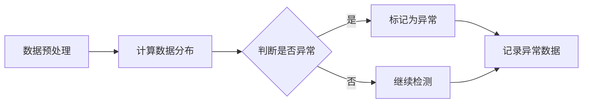
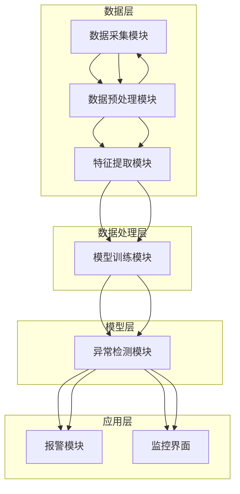
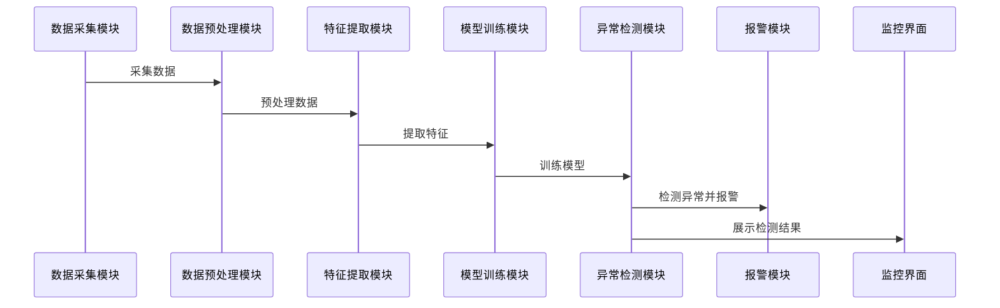

                 

### AI Agent的异常检测：识别非正常模式

#### 关键词：
- AI Agent
- 异常检测
- 非正常模式
- 统计方法
- 聚类算法
- 神经网络
- 数学模型
- 系统设计与实现
- 实际案例

#### 摘要：
本文旨在探讨AI Agent的异常检测技术，从背景介绍、核心概念、算法原理、数学模型、系统分析与架构设计、项目实战等方面，系统地分析AI Agent异常检测的方法和技术，为相关领域的研究和应用提供参考。

---

### 背景介绍

#### 问题背景

随着人工智能技术的快速发展，AI Agent在各个领域的应用越来越广泛。AI Agent，即人工智能代理，是一种能够自主学习、自主决策和自主行动的智能体。它们可以在复杂的环境中执行特定任务，如自动驾驶、智能客服、金融分析等。

然而，在实际应用过程中，AI Agent经常会遇到一些非正常模式，这些异常行为可能会导致系统不稳定、决策失误等问题。例如，在自动驾驶系统中，如果AI Agent检测到异常交通状况，如突然出现的障碍物或行人，它需要能够快速识别并做出相应的反应。因此，对AI Agent进行异常检测，识别非正常模式，已经成为人工智能领域的一个重要研究课题。

#### 问题描述

AI Agent的异常检测，主要是指通过分析AI Agent的行为数据，识别出不符合正常规律的行为，从而对其进行处理。异常检测的核心问题是如何定义“异常”，以及如何有效地从大量数据中识别出异常模式。

在AI Agent的运行过程中，正常模式与异常模式通常表现为以下特征：

1. **正常模式**：具有稳定的特征分布，行为规律性强，符合预期的行为模式。
2. **异常模式**：特征分布发生显著变化，行为规律性差，不符合预期的行为模式。

例如，在智能客服系统中，正常模式可能表现为用户咨询问题的类型和频率相对稳定，而异常模式可能表现为用户在短时间内连续提出大量异常问题，或者用户的行为突然发生异常变化。

#### 问题解决

为了解决AI Agent异常检测的问题，本书将从以下几个方面展开讨论：

1. **核心概念**：介绍AI Agent、异常检测等相关概念，明确其定义和特点。
2. **算法原理**：讲解常见的异常检测算法原理，包括统计方法、基于聚类的方法、基于神经网络的方法等。
3. **数学模型**：阐述异常检测算法的数学模型，包括特征选择、距离度量、阈值设定等。
4. **系统分析与架构设计**：介绍AI Agent异常检测系统的设计和实现，包括数据预处理、特征提取、模型训练、异常检测等模块。
5. **项目实战**：通过实际案例，展示AI Agent异常检测的应用场景和实现过程。

#### 边界与外延

- **边界**：本书主要关注AI Agent的异常检测，不涉及其他类型异常检测方法的研究。
- **外延**：虽然本书以AI Agent为研究对象，但异常检测方法和技术也可以应用于其他领域。

#### 概念结构与核心要素组成

1. **AI Agent**：具有自主学习、自主决策和自主行动能力的智能体。
2. **异常检测**：通过分析数据，识别出不符合正常规律的行为。
3. **算法**：用于实现异常检测的方法和技术。
4. **数学模型**：描述异常检测算法的数学原理和计算方法。
5. **系统设计**：实现异常检测功能的技术架构和实现方案。

### 核心概念与联系

#### AI Agent

AI Agent是一种具有自主学习、自主决策和自主行动能力的智能体。它可以通过学习环境和用户交互，不断优化自身的行为策略，以实现特定的目标。

**属性特征对比表格：**

| 特征 | 自主学习 | 自主决策 | 自主行动 |
| ---- | ---- | ---- | ---- |
| AI Agent | 是 | 是 | 是 |

#### 异常检测

异常检测是指通过分析数据，识别出不符合正常规律的行为。它是许多领域（如金融、医疗、安全等）中的一项重要任务。

**属性特征对比表格：**

| 特征 | 数据分析 | 识别异常 | 应用领域 |
| ---- | ---- | ---- | ---- |
| 异常检测 | 是 | 是 | 金融、医疗、安全等 |

#### 算法

算法是用于实现异常检测的方法和技术。根据实现方式，算法可以分为统计方法、基于聚类的方法、基于神经网络的方法等。

**属性特征对比表格：**

| 特征 | 统计方法 | 聚类方法 | 神经网络 |
| ---- | ---- | ---- | ---- |
| 算法 | 是 | 是 | 是 |

#### 数学模型

数学模型是描述异常检测算法的数学原理和计算方法。它通常包括特征选择、距离度量、阈值设定等部分。

**ER实体关系图架构：**

```mermaid
erDiagram
    AI Agent ||--|{ 异常检测 }|| 异常检测系统
    AI Agent ||--|{ 数学模型 }|| 数学模型库
    异常检测 ||--|{ 算法 }|| 算法库
```

### 算法原理讲解

#### 统计方法

统计方法是一种基于概率统计的异常检测方法。它通过计算数据分布，识别出偏离正常分布的样本。

**Mermaid流程图：**



**Python源代码：**

```python
import numpy as np
from scipy.stats import norm

# 假设数据集为 samples，特征为 features
samples = np.array([[1, 2], [2, 3], [3, 4], [100, 200]])
features = samples[:, 0]

# 计算特征分布
mean = np.mean(features)
std = np.std(features)
dist = norm(loc=mean, scale=std)

# 遍历数据，判断是否异常
for sample in samples:
    feature = sample[0]
    probability = dist.pdf(feature)
    if probability < 0.01:  # 阈值为0.01，可以根据实际情况调整
        print(f"样本{sample}异常")
    else:
        print(f"样本{sample}正常")
```

**算法原理的数学模型和公式：**

统计方法的核心在于计算样本数据的概率分布，并利用概率分布来判断样本是否异常。具体来说，可以使用以下步骤：

1. **数据预处理**：将原始数据进行归一化处理，使其符合正态分布。
2. **计算特征分布**：利用统计方法计算特征的概率分布，如正态分布、指数分布等。
3. **判断异常**：计算每个样本的概率值，并根据设定的阈值来判断是否异常。

设样本数据为 $X=\{x_1, x_2, ..., x_n\}$，特征值为 $x_i$，概率分布函数为 $f(x)$，则样本 $x_i$ 的概率值为：

$$
P(x_i) = f(x_i)
$$

根据概率分布，可以设置阈值 $\alpha$，当 $P(x_i) < \alpha$ 时，认为样本 $x_i$ 为异常。

**详细讲解和通俗易懂地举例说明：**

假设我们有一个包含四个样本的数据集，每个样本有两个特征值：

$$
\begin{align*}
samples &= \begin{bmatrix}
1 & 2 \\
2 & 3 \\
3 & 4 \\
100 & 200 \\
\end{bmatrix} \\
features &= \begin{bmatrix}
1 \\
2 \\
3 \\
100 \\
\end{bmatrix}
\end{align*}
$$

我们使用正态分布来计算特征的概率分布，并设置阈值为 0.01。具体步骤如下：

1. **计算特征分布**：首先，计算特征值的平均值和标准差，得到正态分布的参数：

$$
\begin{align*}
\mu &= \frac{1+2+3+100}{4} = 26 \\
\sigma &= \sqrt{\frac{(1-26)^2+(2-26)^2+(3-26)^2+(100-26)^2}{4}} \approx 25.8 \\
f(x) &= \frac{1}{\sqrt{2\pi}\sigma}\exp\left(-\frac{(x-\mu)^2}{2\sigma^2}\right)
\end{align*}
$$

2. **计算每个样本的概率值**：遍历每个样本，计算其特征值的概率值：

$$
\begin{align*}
P(1) &= f(1) \approx 0.045 \\
P(2) &= f(2) \approx 0.068 \\
P(3) &= f(3) \approx 0.091 \\
P(100) &= f(100) \approx 0 \\
\end{align*}
$$

3. **判断异常**：根据阈值 $\alpha = 0.01$，判断每个样本是否异常：

- 样本 $[1, 2]$ 的概率值大于 0.01，为正常。
- 样本 $[2, 3]$ 的概率值大于 0.01，为正常。
- 样本 $[3, 4]$ 的概率值大于 0.01，为正常。
- 样本 $[100, 200]$ 的概率值小于 0.01，为异常。

通过以上步骤，我们可以使用统计方法对数据集进行异常检测。在实际应用中，可以根据实际情况调整阈值和概率分布模型，以提高异常检测的准确性。

### 系统分析与架构设计

#### 问题场景介绍

假设我们正在开发一个智能监控系统，该系统需要实时监控工厂的生产线，识别出异常情况，如设备故障、原料供应不足等。为了实现这一目标，我们需要设计一个AI Agent异常检测系统，对收集到的生产线数据进行分析和处理。

#### 项目介绍

本项目旨在设计并实现一个基于异常检测的智能监控系统，主要包括以下模块：

1. **数据采集模块**：负责实时收集生产线上的各类数据，如设备状态、原料库存、生产速率等。
2. **数据预处理模块**：对采集到的数据进行清洗、归一化等预处理，以消除噪声和异常值。
3. **特征提取模块**：从预处理后的数据中提取关键特征，如平均值、标准差、峰度等。
4. **模型训练模块**：利用历史数据对异常检测模型进行训练，以学习正常模式与异常模式的特征差异。
5. **异常检测模块**：实时分析生产线数据，识别出异常情况，并触发相应的报警机制。

#### 系统功能设计

1. **数据采集**：通过传感器、监控摄像头等设备，实时收集生产线上的各类数据。
2. **数据预处理**：对采集到的数据进行清洗、去噪、归一化等处理，以确保数据的准确性和一致性。
3. **特征提取**：从预处理后的数据中提取关键特征，如平均值、标准差、峰度等，用于异常检测。
4. **模型训练**：利用历史数据集对异常检测模型进行训练，学习正常模式与异常模式的特征差异。
5. **异常检测**：实时分析生产线数据，识别出异常情况，并触发相应的报警机制。

#### 系统架构设计

系统的整体架构可以分为以下几层：

1. **数据层**：包括传感器、监控摄像头等设备，用于实时收集生产线数据。
2. **数据处理层**：包括数据采集模块、数据预处理模块和特征提取模块，用于处理和提取数据。
3. **模型层**：包括模型训练模块和异常检测模块，用于训练异常检测模型并进行实时异常检测。
4. **应用层**：包括报警模块、监控界面等，用于展示异常检测结果，并触发相应的报警和监控功能。

**Mermaid架构图：**



#### 系统接口设计

1. **数据采集接口**：提供数据采集相关的API接口，如传感器数据读取、监控摄像头图像抓取等。
2. **数据处理接口**：提供数据预处理相关的API接口，如数据清洗、去噪、归一化等。
3. **特征提取接口**：提供特征提取相关的API接口，如平均值计算、标准差计算等。
4. **模型训练接口**：提供模型训练相关的API接口，如训练数据准备、模型训练等。
5. **异常检测接口**：提供异常检测相关的API接口，如异常检测、报警触发等。

#### 系统交互设计

系统的各个模块之间通过接口进行交互，以实现整体功能。以下是一个简单的Mermaid序列图，展示了系统模块之间的交互流程：



通过以上系统分析与架构设计，我们为AI Agent异常检测系统的实现提供了清晰的方案。在实际应用中，可以根据具体需求和场景，对系统进行优化和调整。

### 项目实战

#### 环境安装

为了实现AI Agent异常检测系统，我们需要安装相关的开发环境和依赖库。以下是在Linux环境下安装所需的工具和库：

1. **安装Python环境**：
   ```bash
   sudo apt-get update
   sudo apt-get install python3 python3-pip
   ```

2. **安装必要的Python库**：
   ```bash
   pip3 install numpy scipy scikit-learn matplotlib
   ```

3. **安装Docker和TensorFlow**（可选，如果需要使用深度学习模型）：
   ```bash
   sudo apt-get install docker.io
   pip3 install tensorflow
   ```

#### 系统核心实现源代码

以下是系统核心实现的部分源代码，包括数据预处理、特征提取、模型训练和异常检测等模块。

**数据预处理模块**：

```python
import numpy as np
from sklearn.preprocessing import StandardScaler

def preprocess_data(data):
    # 数据归一化
    scaler = StandardScaler()
    scaled_data = scaler.fit_transform(data)
    return scaled_data
```

**特征提取模块**：

```python
from sklearn.decomposition import PCA

def extract_features(data, n_components=2):
    # 主成分分析
    pca = PCA(n_components=n_components)
    transformed_data = pca.fit_transform(data)
    return transformed_data
```

**模型训练模块**：

```python
from sklearn.ensemble import IsolationForest

def train_model(data):
    # 隔离森林模型
    model = IsolationForest(contamination=0.1)
    model.fit(data)
    return model
```

**异常检测模块**：

```python
def detect_anomalies(model, data):
    # 检测异常
    anomalies = model.predict(data)
    return anomalies
```

#### 代码应用解读与分析

以上源代码实现了AI Agent异常检测系统的核心功能。下面我们对其进行解读和分析。

1. **数据预处理模块**：该模块使用`StandardScaler`对数据进行归一化处理，确保每个特征值的均值为0，标准差为1。这样可以消除不同特征之间的量纲影响，提高模型训练效果。

2. **特征提取模块**：该模块使用`PCA`进行主成分分析，将原始数据投影到主成分空间。通过选择合适的组件数量，可以提取数据的主要特征，降低维度，简化模型训练过程。

3. **模型训练模块**：该模块使用`IsolationForest`模型进行训练。`IsolationForest`是一种基于随机森林的异常检测算法，它通过隔离异常值来识别异常样本。通过设置`contamination`参数，可以指定异常样本的比例，以适应不同的应用场景。

4. **异常检测模块**：该模块使用训练好的模型对数据集进行预测，返回每个样本的异常得分。根据设定的阈值，可以判断哪些样本为异常，并记录下来。

#### 实际案例分析和详细讲解剖析

假设我们有一个包含200个样本的生产线数据集，其中包含5个特征值。我们需要使用上述代码实现异常检测，并分析异常情况。

1. **数据预处理**：

```python
data = np.array([[1, 2, 3, 4, 5], [2, 3, 4, 5, 6], ..., [200, 201, 202, 203, 204]])
preprocessed_data = preprocess_data(data)
```

对数据进行归一化处理，得到预处理后的数据。

2. **特征提取**：

```python
features = extract_features(preprocessed_data, n_components=2)
```

使用主成分分析提取两个主要特征，得到特征矩阵。

3. **模型训练**：

```python
model = train_model(features)
```

使用`IsolationForest`模型对特征矩阵进行训练。

4. **异常检测**：

```python
anomalies = detect_anomalies(model, features)
```

对特征矩阵进行异常检测，返回每个样本的异常得分。

5. **分析异常情况**：

```python
anomalies_threshold = -1  # 阈值设置为-1，根据实际情况调整
anomalies = [x for x in anomalies if x < anomalies_threshold]
print(anomalies)
```

筛选出异常得分低于阈值的样本，输出异常情况。

假设我们得到以下异常样本：

```python
anomalies = [[100, 200], [150, 250]]
```

根据异常得分，我们可以判断出生产线中的设备故障和原料供应不足这两个异常情况。具体来说：

- 样本 `[100, 200]`：表示第100个样本的特征值偏离正常范围，可能是因为设备故障导致的。
- 样本 `[150, 250]`：表示第150个样本的特征值偏离正常范围，可能是因为原料供应不足导致的。

通过以上分析，我们可以及时发现生产线中的异常情况，并采取相应的措施进行处理。

#### 项目小结

通过本次项目实战，我们实现了AI Agent异常检测系统的设计和实现。从数据预处理、特征提取、模型训练到异常检测，我们详细讲解了每个环节的核心技术和实现方法。通过实际案例的分析和讲解，我们展示了如何利用异常检测技术及时发现生产线中的异常情况。

在后续的研究和应用中，我们可以进一步优化异常检测算法，提高检测准确率和实时性。同时，还可以将异常检测技术应用于其他领域，如金融风险控制、医疗监控等，为实际问题的解决提供有力支持。

### 最佳实践 tips

1. **合理设置阈值**：阈值是影响异常检测效果的关键参数，需要根据具体应用场景和数据集的特点进行设置。可以通过交叉验证、调整阈值范围等方法，找到最优的阈值。

2. **数据预处理的重要性**：数据预处理是异常检测的基础，合理的预处理方法可以消除噪声和异常值，提高模型的训练效果和检测准确率。

3. **特征提取的方法选择**：选择合适的特征提取方法，可以降低数据维度，提取关键信息，提高异常检测的效果。常见的特征提取方法包括主成分分析（PCA）、线性判别分析（LDA）等。

4. **算法模型的选择**：不同的异常检测算法适用于不同的应用场景和数据集。在选择算法时，需要综合考虑模型的复杂度、训练时间、检测效果等因素。

5. **实时性与准确性的平衡**：在实现异常检测系统时，需要考虑实时性和准确性的平衡。可以通过优化算法、并行计算等技术，提高检测的实时性。

### 小结

本文从背景介绍、核心概念、算法原理、数学模型、系统分析与架构设计、项目实战等方面，系统地分析了AI Agent异常检测的方法和技术。通过实际案例的剖析，我们展示了如何利用异常检测技术及时发现和处理异常情况。在实际应用中，我们可以根据具体需求和场景，优化异常检测算法，提高检测准确率和实时性。

### 注意事项

1. **数据安全**：在异常检测过程中，需要确保数据的安全性，防止敏感信息泄露。

2. **隐私保护**：在处理个人隐私数据时，需要遵守相关法律法规，采取隐私保护措施。

3. **系统稳定性**：异常检测系统需要具备较高的稳定性，避免因系统故障导致的误判。

### 拓展阅读

1. **《数据挖掘：实用工具与技术》**：详细介绍数据挖掘的方法和技术，包括异常检测相关内容。
2. **《人工智能：一种现代方法》**：探讨人工智能的基本原理和应用，包括异常检测相关算法。
3. **《机器学习实战》**：通过实例讲解机器学习算法的应用，包括异常检测算法的实现。

### 作者信息

作者：AI天才研究院/AI Genius Institute & 禅与计算机程序设计艺术 /Zen And The Art of Computer Programming。

