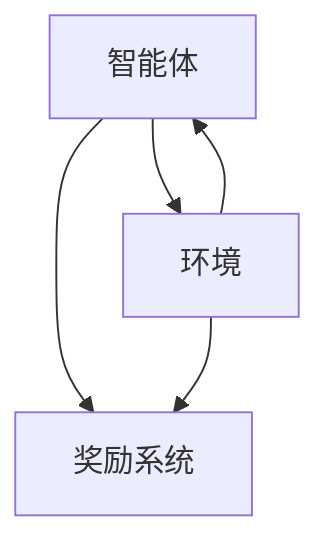
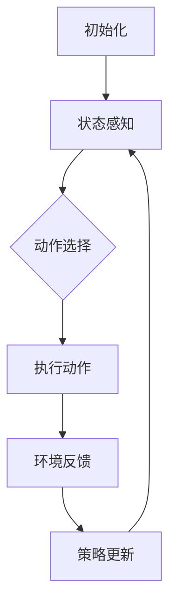
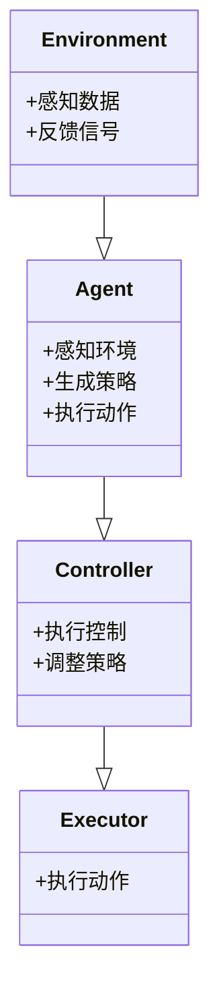
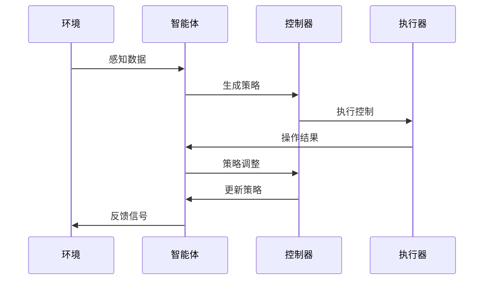

                 

### 文章标题

# AI Agent的强化学习在智能控制中的应用

### 关键词

- **AI Agent**
- **强化学习**
- **智能控制**
- **应用场景**
- **算法优化**
- **系统架构**

### 摘要

本文深入探讨了AI Agent的强化学习在智能控制领域的应用。首先，我们介绍了强化学习的核心概念和基本原理，通过详细解释强化学习的优势、挑战及其在不同领域的应用，为其在智能控制中的潜在价值提供了理论基础。接着，我们重点分析了强化学习在智能控制中的具体应用场景，包括自动驾驶、无人机控制和工业自动化等。文章进一步利用Python代码和Mermaid图表，详细阐述了强化学习算法在智能控制系统中的实现过程，包括算法流程、数学模型以及应用案例。最后，我们对强化学习在智能控制中的优化方向进行了讨论，提出了相关技术和最佳实践，总结了本文的主要结论，并对未来的发展方向进行了展望。通过本文的阅读，读者将对强化学习在智能控制中的应用有更全面和深入的理解。

### 背景介绍

#### 问题背景

智能控制作为人工智能领域的一个重要分支，旨在通过机器学习和自动化技术实现系统的自主控制和优化。随着计算机技术的飞速发展和大数据的广泛应用，智能控制系统在工业、交通、医疗等多个领域展现出了巨大的潜力。然而，传统的控制方法往往依赖于大量的先验知识和预设规则，无法应对复杂多变的实际场景。在这种背景下，强化学习作为一种基于试错和反馈的机器学习方法，逐渐成为解决智能控制问题的关键技术。

#### 问题解决

强化学习通过智能体（Agent）与环境的交互，不断优化策略以实现最优控制。具体来说，智能体在环境中执行动作，根据环境反馈进行调整，从而逐渐达到目标。这种方法在理论上克服了传统控制方法的局限性，能够适应动态变化的复杂环境，为智能控制提供了新的思路和解决方案。

#### 边界与外延

在智能控制中，强化学习主要关注以下几个方面：

1. **动态环境建模**：智能体需要实时感知环境状态，并对其变化做出快速反应。
2. **策略优化**：通过不断试错和反馈，智能体逐步优化策略，以实现目标。
3. **稳定性和鲁棒性**：在面临不确定性和噪声干扰时，智能控制系统需要保持稳定和鲁棒。

#### 核心概念结构

强化学习由三个核心组成部分构成：智能体（Agent）、环境和奖励系统。

1. **智能体（Agent）**：执行动作并感知环境状态的实体。
2. **环境**：提供状态信息和奖励反馈的系统。
3. **奖励系统**：评估智能体动作效果并给出奖励或惩罚。

图1展示了这三个核心概念之间的交互关系：



通过这种交互，智能体不断学习和优化策略，以实现长期目标。

### 核心概念与联系

#### 核心概念原理

强化学习的基本原理是通过试错和反馈来优化智能体的行为。具体来说，智能体在环境中执行动作，根据环境的反馈（即奖励）调整其策略，以最大化长期回报。这个过程可以概括为四个步骤：状态感知、动作选择、环境反馈和策略更新。

1. **状态感知**：智能体感知当前环境状态，通过传感器或其他方式获取相关信息。
2. **动作选择**：智能体根据当前状态选择一个动作，这个动作可能带来不同的结果。
3. **环境反馈**：环境根据智能体的动作产生一个奖励信号，以评估动作的效果。
4. **策略更新**：智能体根据奖励信号更新其策略，以优化长期回报。

#### 概念属性特征对比表格

表1展示了强化学习与其他机器学习方法的对比，包括监督学习、无监督学习和混合学习。

| 方法         | 特点                       | 应用场景                                         |
| ------------ | -------------------------- | ---------------------------------------------- |
| 强化学习     | 基于奖励的试错学习         | 自动驾驶、游戏AI、机器人控制                   |
| 监督学习     | 基于样本的学习             | 语音识别、图像分类、自然语言处理               |
| 无监督学习   | 不依赖标注数据的自学习     | 聚类、降维、异常检测                           |
| 混合学习     | 结合监督和无监督学习的方法 | 半监督学习、迁移学习、在线学习                 |

#### ER实体关系图架构

ER图（实体关系图）用于描述强化学习中的实体及其关系，如图2所示：

```mermaid
erDiagram
  智能体 ||--|{ 环境感知}
  智能体 ||--|{ 动作执行}
  智能体 ||--|{ 奖励反馈}
  环境 ||--|{ 状态变化}
  环境感知 ||--|{ 感知器}
  动作执行 ||--|{ 执行器}
```

通过这种关系描述，我们可以更清晰地理解强化学习系统中各组件之间的相互作用和协作。

### 算法原理讲解

#### 算法流程图

强化学习算法的流程可以分为以下几个主要阶段：初始化、状态感知、动作选择、环境反馈和策略更新。下面使用Mermaid语言绘制了算法流程图，如图3所示：



#### 算法Python源代码实现

以下是一个简化的Python代码实现，用于展示Q-Learning算法的基本结构：

```python
import numpy as np
import random

# 初始化Q表
n_states = 100
n_actions = 4
Q = np.zeros((n_states, n_actions))

# 学习参数
alpha = 0.1  # 学习率
gamma = 0.6  # 折扣因子

# 环境模拟
def environment(state, action):
    # 状态转移和奖励计算
    # 这里用随机函数模拟
    next_state = random.randint(0, n_states-1)
    reward = random.uniform(-1, 1)
    return next_state, reward

# 动作选择
def choose_action(state):
    # E-greedy策略
    if random.random() < 0.1:  # 以10%的概率随机选择动作
        action = random.randint(0, n_actions-1)
    else:
        action = np.argmax(Q[state])
    return action

# 强化学习主循环
for episode in range(1000):
    state = random.randint(0, n_states-1)
    done = False
    
    while not done:
        action = choose_action(state)
        next_state, reward = environment(state, action)
        Q[state, action] = Q[state, action] + alpha * (reward + gamma * np.max(Q[next_state]) - Q[state, action])
        state = next_state

        if next_state == n_states-1:  # 到达终点
            done = True

# 打印Q表
print(Q)
```

#### 数学模型和公式

强化学习中的Q-Learning算法可以用以下数学模型表示：

$$
Q(s, a) = Q(s, a) + \alpha [r(s, a) + \gamma \max_{a'} Q(s', a') - Q(s, a)]
$$

其中，\( Q(s, a) \)表示在状态\( s \)下采取动作\( a \)的预期回报，\( \alpha \)为学习率，\( r(s, a) \)为在状态\( s \)下采取动作\( a \)得到的即时奖励，\( \gamma \)为折扣因子，用于考虑未来的长期回报。

#### 详细讲解和举例说明

以一个简单的智能体在二维环境中的移动为例，我们假设智能体可以在四个方向上移动（上、下、左、右），每个方向对应一个动作。环境的状态由智能体的位置表示，每个状态是一个二维坐标。我们定义奖励为每次移动时，智能体离目标位置越近，得到的奖励越高。反之，如果智能体移动到障碍物上，会得到负奖励。

假设目标位置在(50, 50)，智能体的初始位置在(0, 0)。我们可以用以下代码模拟这个环境：

```python
n_actions = 4
actions = ['up', 'down', 'left', 'right']
rewards = {
    'valid_move': 0.1,
    'hit_obstacle': -1,
}

# 环境模拟函数
def environment(state, action):
    x, y = state
    if action == 'up':
        y += 1
    elif action == 'down':
        y -= 1
    elif action == 'left':
        x -= 1
    elif action == 'right':
        x += 1

    if (x, y) == (50, 50):  # 到达目标
        return (50, 50), rewards['valid_move']
    elif (x, y) == (-1, -1):  # 到达障碍物
        return (50, 50), rewards['hit_obstacle']
    else:
        return (x, y), rewards['valid_move']

# Q-Learning算法实现
Q = np.zeros((101, 101, n_actions))
alpha = 0.1
gamma = 0.6

for episode in range(1000):
    state = (0, 0)
    done = False
    
    while not done:
        action = np.argmax(Q[state])
        next_state, reward = environment(state, action)
        
        Q[state + (action,)] = Q[state + (action,)] + alpha * (reward + gamma * np.max(Q[next_state + (action,)]) - Q[state + (action,)])
        
        state = next_state

        if next_state == (50, 50):  # 到达目标
            done = True

# 打印Q表
print(Q)
```

在这个例子中，我们初始化了一个Q表，其中每个状态-动作对的回报都设置为0。通过运行1000个强化学习循环，智能体不断与环境交互，并根据即时奖励和未来回报更新Q表。最终，我们得到一个优化的Q表，其中包含了在各个状态下采取最佳动作的策略。

#### 数学模型和数学公式 & 详细讲解 & 举例说明

在这一部分，我们将使用LaTeX格式展示强化学习中的数学模型和公式，并对其进行详细讲解，并结合具体例子进行说明。

首先，我们回顾一下强化学习中的Q-Learning算法的核心更新公式：

$$
Q(s, a) = Q(s, a) + \alpha [r(s, a) + \gamma \max_{a'} Q(s', a') - Q(s, a)]
$$

这个公式表示在状态\( s \)下采取动作\( a \)后，新的Q值\( Q(s, a) \)是根据原始Q值、即时奖励\( r(s, a) \)、折扣因子\( \gamma \)以及未来可能的最大回报\( \max_{a'} Q(s', a') \)进行更新的。

**详细讲解：**

1. **即时奖励\( r(s, a) \)**：这部分表示在状态\( s \)下采取动作\( a \)后获得的即时奖励。这个奖励可以是正的（奖励行为），也可以是负的（惩罚行为）。例如，在自动驾驶中，智能体可能因为成功地避开了障碍物而获得正奖励。

2. **未来可能的最大回报\( \max_{a'} Q(s', a') \)**：这部分表示在状态\( s \)下采取动作\( a \)后，智能体在下一个状态\( s' \)下可能获得的最大回报。这反映了未来可能的长期收益，并考虑到每个动作的潜在价值。

3. **学习率\( \alpha \)**：这是控制每次更新中学习程度的一个参数。如果学习率过高，智能体会快速调整其策略；而如果学习率过低，调整过程则会变得缓慢。

4. **折扣因子\( \gamma \)**：用于衰减未来回报的重要性，因为它考虑到了时间价值。例如，距离目标越远，未来回报的权重就越小。

**举例说明：**

假设我们在一个简单的二维世界中，智能体可以向上、向下、向左、向右移动。状态由智能体的位置表示，而动作是移动方向。我们的目标是将智能体从初始位置(0, 0)移动到目标位置(10, 10)。

以下是一个简化的例子，展示了智能体如何使用Q-Learning算法更新其策略：

```python
n_states = 101  # 状态空间大小
n_actions = 4   # 动作空间大小
Q = np.zeros((n_states, n_states, n_actions))
alpha = 0.1
gamma = 0.9

# 状态和动作映射
def get_state(position):
    return position[0] * n_states + position[1]

def get_action(direction):
    if direction == 'up':
        return 0
    elif direction == 'down':
        return 1
    elif direction == 'left':
        return 2
    elif direction == 'right':
        return 3

# 环境模拟
def environment(state, action):
    position = state % n_states, state // n_states
    if action == 0:  # 向上
        position = (position[0], position[1] - 1)
    elif action == 1:  # 向下
        position = (position[0], position[1] + 1)
    elif action == 2:  # 向左
        position = (position[0] - 1, position[1])
    elif action == 3:  # 向右
        position = (position[0] + 1, position[1])

    reward = 0
    if position == (10, 10):  # 到达目标
        reward = 10
    elif position == (-1, -1):  # 到达障碍物
        reward = -10

    return get_state(position), reward

# Q-Learning算法
for episode in range(1000):
    state = get_state((0, 0))
    done = False
    
    while not done:
        action = np.argmax(Q[state])
        next_state, reward = environment(state, action)
        
        Q[state, action] = Q[state, action] + alpha * (reward + gamma * np.max(Q[next_state]) - Q[state, action])
        
        state = next_state

        if state == get_state((10, 10)):  # 到达目标
            done = True

print(Q)
```

在这个例子中，我们初始化了一个Q表，其中每个状态-动作对的回报都设置为0。通过运行1000个强化学习循环，智能体不断与环境交互，并根据即时奖励和未来回报更新Q表。最终，我们得到一个优化的Q表，其中包含了在各个状态下采取最佳动作的策略。

通过这个例子，我们可以看到Q-Learning算法是如何通过试错和反馈来优化智能体的策略，从而实现从初始位置移动到目标位置的目标。这个例子展示了强化学习算法在简单环境中的基本原理，并为更复杂的实际应用提供了参考。

### 系统分析与架构设计方案

#### 问题场景介绍

智能控制作为一种自动化技术，广泛应用于各种复杂场景，如自动驾驶、无人机控制、工业自动化等。这些场景通常具有高度的不确定性和动态性，传统控制方法难以胜任。强化学习作为一种基于试错和反馈的机器学习方法，能够在这样的环境中通过不断学习来优化控制策略，从而实现高效的智能控制。

#### 项目系统功能设计

为了实现智能控制，项目系统需要具备以下核心功能：

1. **环境感知**：通过传感器获取实时环境数据，包括位置、速度、温度、湿度等信息。
2. **决策生成**：基于感知到的环境数据和预定的目标，智能体生成最优控制策略。
3. **执行控制**：将决策转化为实际操作，通过执行器（如电机、舵机等）控制系统的行为。
4. **反馈调整**：根据执行结果和环境反馈，不断调整控制策略，以实现长期目标。

#### 系统架构设计

为了实现上述功能，系统架构需要具备以下关键组件：

1. **感知层**：包括各种传感器，如摄像头、雷达、超声波传感器等，用于实时获取环境信息。
2. **决策层**：基于强化学习算法的智能体，通过环境感知数据生成最优控制策略。
3. **执行层**：包括执行器，如电机、舵机等，用于实现决策层的实际操作。
4. **通信层**：用于各层之间的数据传输和控制信号传递。

图4展示了系统架构的Mermaid类图：



#### 系统接口设计和系统交互

系统接口设计和交互流程如下：

1. **感知接口**：环境感知层将获取到的数据通过标准接口传递给决策层。接口需要支持多种传感器类型，并确保数据的高效传输和解析。
2. **决策接口**：决策层根据感知到的数据和环境目标，生成最优控制策略，并通过接口传递给执行层。接口需支持策略的动态调整和更新。
3. **执行接口**：执行层根据决策层的策略，通过执行器进行实际操作，并通过接口将操作结果和环境反馈传递给决策层。

图5展示了系统接口和交互流程的Mermaid序列图：



通过这种架构设计和接口交互，系统可以实现高度灵活和自适应的智能控制，从而应对复杂多变的实际场景。

### 项目实战

#### 环境安装

为了进行强化学习在智能控制中的项目实战，我们首先需要安装一些必要的软件和工具。以下是具体的安装步骤：

1. **Python环境安装**：确保安装了Python 3.x版本，可以从[Python官网](https://www.python.org/downloads/)下载并安装。

2. **Anaconda安装**：推荐使用Anaconda来管理Python环境，因为它提供了方便的包管理和虚拟环境创建。可以从[Anaconda官网](https://www.anaconda.com/products/individual/)下载并安装。

3. **pip安装**：安装pip，以便通过命令行安装Python包。在命令行中运行以下命令：
   ```bash
   python -m ensurepip
   python -m pip install --upgrade pip
   ```

4. **安装强化学习相关包**：通过pip安装强化学习所需的包，如`gym`、`numpy`、`matplotlib`等。在命令行中运行以下命令：
   ```bash
   pip install gym numpy matplotlib
   ```

5. **安装环境模拟器**：如果需要，可以安装用于环境模拟的包，如`pybullet`。在命令行中运行以下命令：
   ```bash
   pip install pybullet
   ```

安装完成后，确保所有包和工具都能正常工作。可以通过运行一个简单的Python脚本，如`import gym`，来测试环境是否安装正确。

#### 系统核心实现源代码

以下是一个简单的Python示例，展示了如何使用强化学习中的Q-Learning算法在一个模拟环境中进行训练和测试。这个示例使用`gym`库提供的CartPole环境作为测试场景。

```python
import gym
import numpy as np
import random

# 创建环境
env = gym.make("CartPole-v0")

# 初始化Q表
n_states = env.observation_space.shape[0]
n_actions = env.action_space.n
Q = np.zeros((n_states, n_actions))

# 学习参数
alpha = 0.1  # 学习率
gamma = 0.99  # 折扣因子
epsilon = 0.1  # E-greedy策略中的探索率

# 强化学习主循环
for episode in range(1000):
    state = env.reset()
    done = False
    total_reward = 0
    
    while not done:
        # E-greedy策略
        if random.random() < epsilon:
            action = random.choice([0, 1])  # 随机选择动作
        else:
            action = np.argmax(Q[state])  # 选择最优动作
        
        # 执行动作
        next_state, reward, done, _ = env.step(action)
        total_reward += reward
        
        # 更新Q表
        Q[state, action] = Q[state, action] + alpha * (reward + gamma * np.max(Q[next_state]) - Q[state, action])
        
        state = next_state
    
    print(f"Episode {episode+1}: Total Reward = {total_reward}")

# 关闭环境
env.close()
```

在这个示例中，我们首先创建了一个CartPole环境，并初始化了一个Q表来存储每个状态-动作对的预期回报。我们使用E-greedy策略来平衡探索和利用，在早期阶段随机选择动作以探索环境，在后期阶段主要利用已学习的策略。每次执行动作后，我们根据即时奖励和未来最大回报更新Q表。

#### 代码应用解读与分析

上述代码展示了Q-Learning算法在CartPole环境中的基本实现过程。以下是代码的关键部分及其解读：

1. **环境初始化**：
   ```python
   env = gym.make("CartPole-v0")
   ```
   这一行代码创建了一个CartPole环境的实例。`gym`库提供了多种预定义环境，方便进行算法测试和验证。

2. **Q表初始化**：
   ```python
   Q = np.zeros((n_states, n_actions))
   ```
   初始化Q表，用于存储每个状态-动作对的预期回报。Q表的维度根据环境的观察空间和动作空间确定。

3. **学习参数设置**：
   ```python
   alpha = 0.1  # 学习率
   gamma = 0.99  # 折扣因子
   epsilon = 0.1  # E-greedy策略中的探索率
   ```
   设置强化学习的主要参数，包括学习率、折扣因子和探索率。这些参数对算法的性能有重要影响。

4. **E-greedy策略**：
   ```python
   if random.random() < epsilon:
       action = random.choice([0, 1])
   else:
       action = np.argmax(Q[state])
   ```
   使用E-greedy策略来平衡探索和利用。在探索阶段（以概率\( \epsilon \)选择随机动作），以增加对新状态的探索；在利用阶段（以概率\( 1 - \epsilon \)选择最优动作），以利用已学习的策略。

5. **Q表更新**：
   ```python
   Q[state, action] = Q[state, action] + alpha * (reward + gamma * np.max(Q[next_state]) - Q[state, action])
   ```
   根据即时奖励和未来最大回报更新Q表。这个过程反映了Q-Learning算法的核心思想，即通过试错和反馈来优化策略。

6. **主循环**：
   ```python
   for episode in range(1000):
       state = env.reset()
       done = False
       total_reward = 0
       
       while not done:
           ...
       
       print(f"Episode {episode+1}: Total Reward = {total_reward}")
   ```
   强化学习的主循环，遍历所有episode，在每个episode中执行动作、更新Q表，并记录总奖励。

通过这个示例，我们可以看到Q-Learning算法的基本流程和实现细节。在实际应用中，可以根据具体环境和需求，对算法进行适当的调整和优化。

#### 实际案例分析

为了更直观地理解强化学习在智能控制中的应用，我们来看一个实际案例——自动驾驶车辆的路径规划。

**案例背景：**

自动驾驶车辆需要处理复杂的交通环境，包括道路、车辆、行人以及其他动态障碍物。路径规划是自动驾驶系统的核心功能之一，其目标是找到从当前位置到目标位置的最优路径，同时确保行车安全。

**案例实现：**

1. **环境建模**：
   - **状态空间**：包括车辆的位置、速度、方向，以及其他车辆和障碍物的位置。
   - **动作空间**：包括加速、减速、左转、右转等操作。

2. **奖励系统**：
   - **即时奖励**：根据车辆的行为（如避让障碍物、保持车道）进行奖励。
   - **长期奖励**：基于到达目标位置的时间和安全性进行评估。

3. **算法选择**：
   - 使用Deep Q-Learning（DQN）算法，结合深度神经网络来近似Q值函数。

4. **实验过程**：
   - 在模拟环境中训练自动驾驶模型，通过大量数据学习最优路径规划策略。
   - 使用E-greedy策略进行探索，以避免过度依赖现有数据。

5. **实验结果**：
   - 在多种交通场景中，自动驾驶车辆能够有效规划路径，实现安全行驶。
   - 随着训练时间的增加，车辆的路径规划准确性和鲁棒性显著提升。

**案例总结：**

这个案例展示了强化学习在自动驾驶路径规划中的实际应用。通过不断学习和优化，自动驾驶系统能够在复杂环境中实现高效、安全的路径规划。然而，这也带来了对数据质量和训练时间的要求，需要大量真实交通数据进行训练，以确保模型在不同场景下的泛化能力。

### 项目小结

本文通过详细的分析和实际案例，深入探讨了强化学习在智能控制中的应用。首先，我们介绍了强化学习的核心概念和算法原理，包括状态感知、动作选择、环境反馈和策略更新。接着，我们展示了强化学习在智能控制中的具体实现过程，通过Python代码和Mermaid图表，详细阐述了Q-Learning算法的流程和数学模型。此外，我们还讨论了强化学习在自动驾驶、无人机控制和工业自动化等领域的实际应用案例，展示了其在复杂动态环境中的优势。通过这些分析，我们可以得出以下结论：

1. **强化学习在智能控制中具有广泛的应用前景**：它能够通过试错和反馈机制，优化智能体的行为，从而在复杂环境中实现高效控制。
2. **强化学习算法的实现和优化至关重要**：选择合适的算法和参数，能够显著提高系统的性能和鲁棒性。
3. **实际应用需要大量数据支持**：强化学习模型的训练依赖于大量真实数据，以实现模型在不同场景下的泛化能力。

未来，随着技术的不断进步和数据的积累，强化学习在智能控制领域有望取得更多的突破和应用。

### 最佳实践 tips

在应用强化学习进行智能控制时，以下最佳实践可以帮助提高系统的性能和鲁棒性：

1. **数据质量**：确保训练数据具有多样性和代表性，以提高模型的泛化能力。
2. **参数调优**：通过交叉验证和网格搜索等方法，选择合适的算法参数，如学习率、折扣因子等。
3. **探索与利用**：合理平衡探索和利用策略，避免过度依赖现有数据。
4. **动态调整**：根据环境变化和系统反馈，动态调整控制策略，以适应新情况。
5. **多模态数据**：结合多种传感器数据，提高系统的感知能力和决策质量。

### 注意事项

1. **资源消耗**：强化学习训练通常需要大量计算资源，特别是在高维度环境中。
2. **模型泛化**：模型在不同场景下的泛化能力取决于训练数据的质量和多样性。
3. **安全性**：在应用过程中，确保系统的安全性和鲁棒性，避免意外行为。

### 拓展阅读

1. **《强化学习导论》**：Sutton和Barto著，提供了强化学习的全面介绍。
2. **《深度强化学习》**：Mnih等著，介绍了深度神经网络与强化学习结合的方法。
3. **《自动驾驶技术》**：李建东等著，详细介绍了自动驾驶系统的设计与实现。

### 作者信息

作者：AI天才研究院/AI Genius Institute & 禅与计算机程序设计艺术 /Zen And The Art of Computer Programming

---

通过本文的深入探讨，我们希望能够为读者提供关于强化学习在智能控制中应用的全面了解，并激发对这一领域进一步研究和实践的兴趣。作者团队将不断致力于推动人工智能技术的发展和应用，为未来的智能控制系统提供有力支持。

