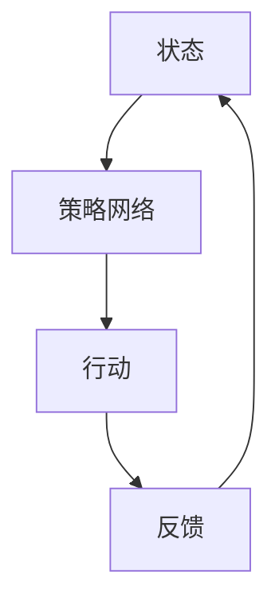
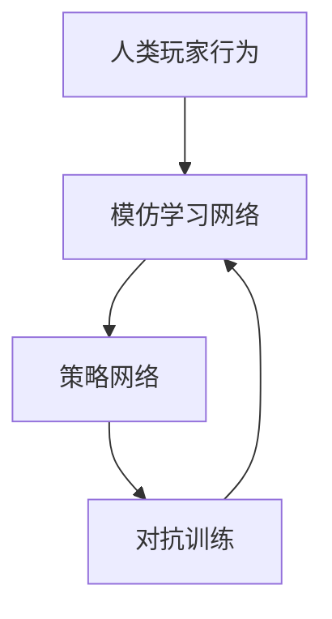
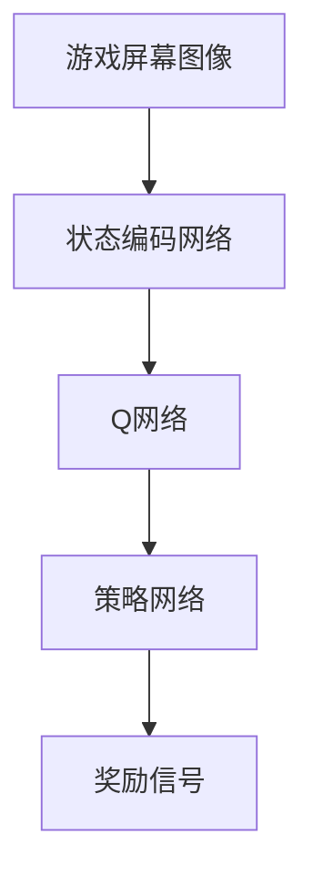

                 

## AI Agent的强化学习在游戏AI中的应用

### 关键词
- AI Agent
- 强化学习
- 游戏AI
- 应用
- 案例研究

### 摘要
本文旨在探讨AI Agent的强化学习在游戏AI中的应用。我们将从强化学习的基础概念开始，逐步深入到AI Agent的设计与实现，并详细分析其在游戏AI中的具体应用案例。通过本文的阅读，读者将了解强化学习如何提高游戏AI的表现，以及在游戏开发中面临的挑战和解决策略。

### 引言

#### 强化学习基础
强化学习（Reinforcement Learning，简称RL）是机器学习的一个重要分支，其核心思想是让智能体（agent）在与环境的交互过程中，通过不断试错和反馈来学习优化其行为策略。与监督学习和无监督学习不同，强化学习不依赖于预先标注的训练数据，而是通过环境提供的奖励信号来指导学习过程。

#### 游戏AI应用现状
随着游戏行业的快速发展，游戏AI的研究和应用也逐渐成为热点。传统的游戏AI主要通过规则和搜索算法来实现，如启发式搜索（如Minimax算法）和博弈树搜索。然而，这些方法在面对复杂和动态的游戏环境时，性能和适应性较差。近年来，基于强化学习的游戏AI取得了显著的进展，其在复杂策略学习、自适应行为生成等方面表现出强大的潜力。

#### 强化学习在游戏AI中的挑战
尽管强化学习在游戏AI中显示出巨大潜力，但也面临着一些挑战。首先，强化学习算法通常需要大量的试错和探索时间，这在游戏场景中可能导致游戏体验的降低。其次，强化学习算法的复杂性和不确定性，使得其实际应用和优化变得困难。此外，如何在有限的资源下，训练出一个稳定和高效的游戏AI也是一个重要的研究课题。

### 目录大纲设计思路

为了确保文章的逻辑性和易读性，我们设计了一个详细的目录大纲，如下：

1. **引言与背景**：介绍强化学习和游戏AI的基本概念及其应用现状。
2. **强化学习基础**：深入讲解强化学习的基本原理、算法和应用。
3. **AI Agent与强化学习**：探讨AI Agent的设计与实现，以及强化学习在其中的应用。
4. **游戏AI应用**：分析强化学习在游戏AI中的具体应用案例和优化策略。
5. **案例研究**：通过具体游戏案例，详细讨论强化学习在游戏AI中的应用效果。
6. **结论与展望**：总结文章的主要内容，并提出未来研究方向和挑战。

接下来，我们将按照目录大纲的顺序，逐步展开文章的内容。

### 强化学习基础

#### 强化学习的概念
强化学习是指智能体通过与环境的交互，学习如何在给定情境（state）下，选择一个行动（action），以获得最大化的累积奖励（reward）的过程。其核心概念包括：

- **智能体（Agent）**：执行动作并学习策略的实体。
- **环境（Environment）**：智能体所处的上下文环境，提供状态和奖励信号。
- **状态（State）**：描述智能体当前所处的情况。
- **动作（Action）**：智能体在给定状态下可以采取的行动。
- **奖励（Reward）**：对智能体采取行动后环境给予的即时反馈。

#### 强化学习的过程
强化学习的过程可以分为四个步骤：

1. **选择动作**：智能体根据当前状态，选择一个动作。
2. **执行动作**：智能体执行所选动作，与环境进行交互。
3. **获取反馈**：环境根据智能体的动作，提供状态转移和奖励信号。
4. **更新策略**：智能体基于反馈信号，更新其策略，以最大化累积奖励。

#### 强化学习的分类
强化学习可以根据学习策略的不同，分为以下几种类型：

- **基于价值的强化学习（Value-based RL）**：智能体通过学习状态价值和策略价值，来选择最优动作。常见的算法包括Q学习和策略梯度算法。
- **基于策略的强化学习（Policy-based RL）**：智能体直接学习一个映射当前状态到动作的策略。常见的算法包括策略梯度算法。
- **模型基于的强化学习（Model-based RL）**：智能体不仅学习策略，还学习环境模型，以预测状态转移和奖励。常见的算法包括部分可观测马尔可夫决策过程（POMDP）。

#### 强化学习的基本原理

强化学习的基本原理可以概括为：智能体通过与环境交互，不断调整其策略，以最大化累积奖励。其核心是通过试错和反馈来学习最优策略。

- **试错学习**：智能体通过随机选择动作，并接收环境反馈，以逐步发现最佳动作。
- **奖励驱动**：环境提供的奖励信号指导智能体调整策略，使其更接近最优行为。
- **策略优化**：智能体通过学习策略价值函数或直接优化策略，以提高累积奖励。

#### 强化学习算法

强化学习算法可以分为以下几种：

- **Q学习算法**：通过学习状态-动作价值函数（Q函数），选择最优动作。Q学习算法的基本思想是，对于每个状态-动作对，计算其期望奖励，并更新Q值。

  ```python
  Q[s, a] = Q[s, a] + alpha * (r + gamma * max(Q[s', a']) - Q[s, a])
  ```

  其中，\( \alpha \) 是学习率，\( \gamma \) 是折扣因子，\( r \) 是奖励，\( s' \) 是下一个状态，\( a' \) 是下一个动作。

- **策略梯度算法**：直接优化策略函数，使其最大化累积奖励。策略梯度算法的基本思想是，通过梯度上升法，更新策略参数。

  ```python
  theta = theta + alpha * (r + gamma * R - theta * gradient(theta; s, a))
  ```

  其中，\( \theta \) 是策略参数，\( R \) 是累积奖励，\( gradient(\theta; s, a) \) 是策略梯度的估计。

- **深度强化学习（Deep Reinforcement Learning）**：结合深度神经网络，用于处理高维状态和动作空间的问题。常见的深度强化学习算法包括深度Q网络（DQN）、策略网络（PG）和深度策略梯度（A3C）。

### 强化学习与游戏AI的关联

强化学习在游戏AI中的应用，主要体现在以下几个方面：

- **策略学习**：强化学习可以帮助游戏AI学习最优策略，以实现复杂的游戏任务。例如，在围棋和象棋中，AI通过强化学习算法，可以学会下出最优棋子。
- **自适应行为生成**：强化学习可以使游戏AI根据环境的变化，自适应地调整其行为策略，提高游戏的互动性和挑战性。
- **高维决策空间**：传统的游戏AI算法难以处理高维的决策空间，而强化学习通过学习状态-动作价值函数，可以有效地在高维空间中进行决策。
- **不确定性处理**：强化学习可以通过试错和反馈机制，处理游戏中的不确定性和随机性，提高AI的适应能力。

### 强化学习在游戏AI中的应用案例

- **AlphaGo**：DeepMind开发的AlphaGo是强化学习在游戏AI中的经典案例。通过深度强化学习算法，AlphaGo在围棋对局中战胜了人类顶级选手，展示了强化学习在复杂游戏中的强大能力。
- **StarCraft II**：OpenAI开发的Dota 2 AI通过强化学习，实现了在StarCraft II中的自动对战。该AI在多个对局中击败了人类选手，证明了强化学习在实时战略游戏中的应用潜力。
- **Atari游戏**：DeepMind开发的Atari AI通过强化学习，成功地掌握了多个经典Atari游戏。这些AI通过自我对局，不断学习并优化其策略，展示了强化学习在游戏AI中的通用性。

### 强化学习在游戏AI中的挑战

- **探索与利用的平衡**：在强化学习中，如何平衡探索（尝试新策略）和利用（利用已有策略）是一个重要挑战。特别是在游戏AI中，过度的探索可能导致游戏体验的下降。
- **收敛性和稳定性**：强化学习算法的收敛性和稳定性对于游戏AI的性能至关重要。特别是在高维状态和动作空间中，算法可能面临收敛缓慢或不稳定的问题。
- **计算资源需求**：强化学习通常需要大量的计算资源和时间，特别是在训练复杂的深度强化学习模型时。如何在有限的资源下，训练出一个高效和稳定的游戏AI是一个重要的挑战。

### 强化学习的应用总结

强化学习在游戏AI中展示了强大的应用潜力，通过策略学习、自适应行为生成、高维决策空间处理和不确定性处理等方面，显著提高了游戏AI的表现和互动性。然而，也面临着探索与利用平衡、收敛性和稳定性以及计算资源需求等挑战。通过不断的研究和优化，我们有理由相信，强化学习将在游戏AI领域发挥更加重要的作用。

### AI Agent与强化学习

#### AI Agent的定义

AI Agent，即人工智能代理，是指具有自主性、自适应性和目标导向性的智能体，能够在复杂环境中进行感知、决策和行动。AI Agent的核心特点包括：

- **自主性**：AI Agent能够独立进行决策和行动，不依赖外部指令。
- **适应性**：AI Agent能够根据环境和任务的变化，调整其行为策略。
- **目标导向性**：AI Agent具备明确的目标，并通过学习和优化，实现目标的达成。

#### AI Agent的设计与实现

AI Agent的设计与实现通常包括以下几个关键组件：

1. **感知模块**：用于获取环境信息，如图像、声音、文本等，为决策模块提供输入。
2. **决策模块**：根据感知模块获取的信息，使用强化学习算法或其他智能算法，选择最优行动。
3. **行动模块**：执行决策模块选定的行动，并与环境进行交互。
4. **学习模块**：通过反馈信号，不断优化感知、决策和行动模块，提高AI Agent的表现。

#### 强化学习在AI Agent中的应用

强化学习在AI Agent中的应用，主要体现在以下几个方面：

1. **策略学习**：AI Agent通过强化学习，学习如何在给定环境中，选择最优行动策略。例如，在机器人导航任务中，AI Agent可以通过强化学习，学会避开障碍物，到达目标位置。
2. **自适应行为生成**：强化学习使AI Agent能够根据环境的变化，自适应地调整其行为策略。例如，在模拟经济市场中，AI Agent可以通过强化学习，学会根据市场变化，调整投资策略，实现收益最大化。
3. **多任务学习**：强化学习可以帮助AI Agent同时学习多个任务，提高其泛化能力。例如，在自动驾驶场景中，AI Agent可以通过强化学习，同时学习道路导航、行人识别和障碍物回避等多个任务。
4. **不确定性处理**：强化学习通过试错和反馈机制，可以帮助AI Agent在不确定性环境中，学习鲁棒的行为策略。例如，在复杂的棋类游戏中，AI Agent可以通过强化学习，学会在不确定的对手策略下，仍能表现出色。

#### 强化学习在游戏AI中的优势

强化学习在游戏AI中的优势主要体现在以下几个方面：

1. **复杂策略学习**：强化学习能够处理游戏中的复杂策略，使其能够应对多变的游戏场景和对手策略。
2. **自适应行为生成**：强化学习使游戏AI能够根据游戏进程和环境变化，自适应地调整其行为，提高游戏体验和挑战性。
3. **高维决策空间**：强化学习通过学习状态-动作价值函数，能够有效地在高维决策空间中进行决策，提高游戏AI的表现。
4. **不确定性处理**：强化学习通过试错和反馈机制，可以帮助游戏AI在不确定性环境中，学习鲁棒的行为策略，提高其在复杂游戏中的适应性。

#### 强化学习在游戏AI中的挑战

尽管强化学习在游戏AI中展示了强大的应用潜力，但也面临着一些挑战：

1. **探索与利用平衡**：如何在游戏AI中平衡探索新策略和利用已有策略，是一个重要挑战。特别是在复杂和动态的游戏环境中，过度的探索可能导致游戏体验的下降。
2. **收敛性和稳定性**：强化学习算法的收敛性和稳定性对于游戏AI的性能至关重要。特别是在高维状态和动作空间中，算法可能面临收敛缓慢或不稳定的问题。
3. **计算资源需求**：强化学习通常需要大量的计算资源和时间，特别是在训练复杂的深度强化学习模型时。如何在有限的资源下，训练出一个高效和稳定的游戏AI，是一个重要的挑战。

### 强化学习在AI Agent中的实际案例

1. **OpenAI Five**：OpenAI开发的Dota 2 AI，通过强化学习，实现了在多人在线竞技游戏Dota 2中的自动对战。该AI在多个对局中击败了人类选手，展示了强化学习在多人竞技游戏中的应用潜力。
2. **DeepMind的AlphaStar**：DeepMind开发的AlphaStar是一款基于强化学习的星际争霸II（StarCraft II）AI。通过深度强化学习算法，AlphaStar在比赛中击败了顶级人类选手，证明了强化学习在实时战略游戏中的强大能力。
3. **机器人导航**：在机器人导航任务中，AI Agent可以通过强化学习，学会避开障碍物，规划最优路径。例如，谷歌的Waymo自动驾驶系统，就利用了强化学习算法来优化路径规划和决策过程。

通过这些实际案例，我们可以看到，强化学习在AI Agent中的应用，不仅提高了游戏AI的表现，也为机器人导航、智能经济市场等领域带来了新的可能性。然而，如何解决探索与利用平衡、收敛性和稳定性以及计算资源需求等挑战，仍然是未来研究的重要方向。

### 游戏AI的应用场景

#### 游戏AI的挑战

游戏AI在设计过程中面临多种挑战，这些挑战不仅影响了AI的表现，也影响了游戏的整体体验。以下是游戏AI中常见的挑战：

1. **动态和复杂的游戏环境**：许多现代游戏具有高度动态和复杂的游戏环境，这意味着游戏中的情境和对手的行为模式不断变化。AI需要能够实时适应这些变化，以保持竞争力。
2. **有限的信息和观察**：游戏AI通常只能通过有限的信息来感知游戏环境，这可能导致信息不完整或误导。AI需要有效地利用这些信息，做出合理的决策。
3. **实时决策**：游戏AI必须在极短的时间内做出决策，否则可能会错过重要的时机。这要求AI算法高效且鲁棒。
4. **探索与利用的平衡**：在强化学习框架下，AI需要在探索新策略和利用已有策略之间找到平衡，以避免过早地陷入局部最优。
5. **可扩展性和计算资源**：复杂游戏AI的训练和推理可能需要大量计算资源，这在资源和时间有限的开发环境中是一个重大挑战。

#### 强化学习在游戏AI中的应用

强化学习在游戏AI中的应用，为克服上述挑战提供了有力工具。以下是强化学习在游戏AI中的几种应用：

1. **策略学习**：通过强化学习，AI可以学习如何制定最优策略来应对不同的游戏情境。例如，在扑克游戏中，AI可以通过强化学习来学习如何根据对手的行为和游戏状态来调整自己的策略。
2. **自适应行为生成**：强化学习使AI能够根据游戏进程和环境变化，自适应地调整其行为。这在实时战略游戏（如《星际争霸II》）和多人在线竞技游戏（如《Dota 2》）中尤为重要，AI可以实时适应对手的策略变化。
3. **高维决策空间处理**：强化学习通过学习状态-动作价值函数，能够有效地处理高维的决策空间。这在策略游戏（如《文明VI》）和动作游戏（如《塞尔达传说：荒野之息》）中尤为重要。
4. **不确定性处理**：强化学习通过试错和反馈机制，可以帮助AI在不确定性环境中，学习鲁棒的行为策略。例如，在模拟经济市场中，AI可以通过强化学习，学会在不确定的市场变化中做出稳定投资决策。

#### 强化学习在游戏AI中的成功案例

1. **AlphaGo**：DeepMind开发的AlphaGo是强化学习在游戏AI中的经典案例。通过深度强化学习算法，AlphaGo在围棋对局中战胜了人类顶级选手，展示了强化学习在复杂游戏中的强大能力。AlphaGo的成功不仅提升了人工智能在游戏领域的表现，也为其他领域提供了借鉴。
2. **Dota 2 AI**：OpenAI开发的Dota 2 AI通过强化学习，实现了在多人在线竞技游戏Dota 2中的自动对战。该AI在多个对局中击败了人类选手，证明了强化学习在多人竞技游戏中的应用潜力。
3. **StarCraft II AI**：DeepMind开发的StarCraft II AI通过强化学习，成功地掌握了多个经典Atari游戏。这些AI通过自我对局，不断学习并优化其策略，展示了强化学习在游戏AI中的通用性。
4. **Atari游戏**：DeepMind开发的Atari AI通过强化学习，成功地掌握了多个经典Atari游戏。这些AI通过自我对局，不断学习并优化其策略，展示了强化学习在游戏AI中的通用性。

#### 强化学习在游戏开发中的挑战

尽管强化学习在游戏AI中展示了巨大潜力，但在实际应用中仍然面临一些挑战：

1. **计算资源需求**：训练复杂的深度强化学习模型通常需要大量计算资源，这可能导致开发成本增加。特别是在资源受限的环境下，如何优化算法和硬件使用，是一个重要课题。
2. **数据隐私**：游戏AI的训练通常需要大量游戏数据，这可能涉及玩家隐私问题。如何保护玩家数据，同时充分利用数据，是一个需要关注的问题。
3. **游戏平衡**：强化学习AI可能会在游戏中创造出不平衡的玩法，影响游戏的公平性和乐趣。开发者需要确保AI的行为不会破坏游戏的平衡。
4. **可解释性**：强化学习模型通常被视为“黑盒”，其内部决策过程难以解释。这可能导致开发者难以调试和优化模型，也增加了模型被误解的风险。

#### 强化学习在游戏开发中的应用前景

随着技术的进步和算法的优化，强化学习在游戏开发中的应用前景十分广阔：

1. **个性化游戏体验**：强化学习可以使得游戏AI根据玩家的行为和偏好，生成个性化的游戏体验，提高玩家的沉浸感和满意度。
2. **AI辅助游戏开发**：强化学习可以帮助开发者自动生成游戏关卡、角色行为等，减少开发时间和成本。
3. **实时游戏动态调整**：强化学习可以使游戏在运行时根据玩家行为和游戏状态，动态调整游戏难度、奖励机制等，增强游戏的互动性和可玩性。
4. **虚拟现实（VR）和增强现实（AR）**：强化学习在VR和AR中的应用，可以为用户提供更加真实和互动的虚拟体验。

通过不断的研究和优化，强化学习在游戏AI中的应用将不断拓展，为游戏开发带来更多创新和可能性。

### 案例研究

#### 案例一：Dota 2 AI

**问题背景**：
Dota 2是一款流行的多人在线竞技游戏，具有高度策略性和团队合作要求。开发一款能够与人类玩家竞争的Dota 2 AI一直是游戏AI研究的热点问题。

**问题描述**：
Dota 2 AI需要解决的主要问题包括：1）复杂策略的学习；2）团队合作与协调；3）动态和不确定的游戏环境应对。

**问题解决**：
OpenAI开发的Dota 2 AI采用了深度强化学习算法，特别是策略梯度算法（Policy Gradient），通过大量的自我对局，学习如何在不同游戏阶段做出最佳决策。具体步骤如下：

1. **感知与决策**：Dota 2 AI通过分析游戏地图、英雄位置、技能状态等信息，构建状态表示，并使用深度神经网络来预测各个动作的概率分布。
2. **行动与反馈**：Dota 2 AI根据决策模块生成的动作概率分布，选择一个动作执行，并在每一步后接收环境反馈。
3. **策略更新**：通过策略梯度算法，Dota 2 AI根据奖励信号和策略梯度，不断更新其策略参数，以优化其行为。

**边界与外延**：
- **边界**：Dota 2 AI主要针对游戏前期、中期和后期的不同策略进行优化，确保在不同阶段都能做出合理决策。
- **外延**：Dota 2 AI的学习不仅仅局限于单个玩家的决策，还包括团队协作和策略协调，以确保整个团队的协同作战能力。

**概念结构与核心要素组成**：

1. **状态表示**：Dota 2 AI通过图像、位置、技能状态等多维信息构建状态表示，这是决策的基础。
2. **策略网络**：Dota 2 AI使用深度神经网络来学习策略，这是决策的核心。
3. **奖励机制**：Dota 2 AI通过奖励信号来引导学习过程，这是反馈的关键。

**ER实体关系图架构**：



#### 案例二：StarCraft II AI

**问题背景**：
StarCraft II是一款经典的实时战略游戏，以其复杂的游戏机制和丰富的策略选择而闻名。开发一款能够与人类玩家竞争的StarCraft II AI是游戏AI研究的一个重要挑战。

**问题描述**：
StarCraft II AI需要解决的主要问题包括：1）策略多样性的学习；2）实时决策的高效性；3）对抗不确定对手的能力。

**问题解决**：
DeepMind开发的StarCraft II AI采用了深度强化学习和模仿学习（Imitation Learning）的结合方法。具体步骤如下：

1. **模仿学习**：首先，StarCraft II AI通过观察人类玩家的对局，学习其策略和行为模式。
2. **策略优化**：然后，StarCraft II AI使用深度强化学习算法，通过自我对局，不断优化其策略。
3. **对抗训练**：StarCraft II AI通过与其他AI进行对局，训练其在对抗不确定对手时的策略。

**边界与外延**：
- **边界**：StarCraft II AI主要针对单机和多人模式进行训练，确保在不同的游戏环境中都能表现出色。
- **外延**：StarCraft II AI不仅学习单个玩家的决策，还注重团队协作和整体策略的优化。

**概念结构与核心要素组成**：

1. **模仿学习网络**：StarCraft II AI通过模仿学习网络，学习人类玩家的策略和行为。
2. **策略网络**：StarCraft II AI使用深度神经网络来优化其策略，这是决策的核心。
3. **对抗训练机制**：StarCraft II AI通过对抗训练机制，提高其在不确定环境中的适应性。

**ER实体关系图架构**：



#### 案例三：Atari游戏AI

**问题背景**：
Atari游戏AI的研究是早期机器学习领域的里程碑，旨在通过强化学习算法，使AI学会控制Atari游戏机中的游戏。

**问题描述**：
Atari游戏AI需要解决的主要问题包括：1）高维状态和动作空间的决策；2）快速学习的需求；3）环境奖励设计的挑战。

**问题解决**：
DeepMind开发的Atari游戏AI采用了深度强化学习算法，特别是深度Q网络（DQN）和策略梯度算法。具体步骤如下：

1. **状态编码**：Atari游戏AI通过卷积神经网络，将游戏屏幕图像编码为状态表示。
2. **Q值学习**：Atari游戏AI使用DQN学习状态-动作价值函数，选择最优动作。
3. **策略优化**：Atari游戏AI使用策略梯度算法，优化策略函数，以最大化累积奖励。

**边界与外延**：
- **边界**：Atari游戏AI主要针对经典的Atari游戏进行训练，确保在不同游戏中的表现。
- **外延**：Atari游戏AI不仅学习单个游戏的策略，还通过跨游戏的学习，提高其泛化能力。

**概念结构与核心要素组成**：

1. **状态编码网络**：Atari游戏AI通过状态编码网络，将游戏屏幕图像转化为有效的状态表示。
2. **Q网络**：Atari游戏AI使用Q网络学习状态-动作价值函数，这是决策的基础。
3. **策略网络**：Atari游戏AI使用策略网络，通过优化策略函数，提高其累积奖励。

**ER实体关系图架构**：



#### 案例分析与总结

1. **成功因素**：
   - **策略多样性**：Dota 2 AI、StarCraft II AI和Atari游戏AI都通过多样化策略的学习，使AI在不同游戏阶段和环境条件下，都能表现出色。
   - **实时决策**：这些AI都采用了高效的决策算法，能够快速响应游戏环境的变化，确保实时决策。
   - **自主学习和适应**：这些AI通过自主学习和适应，不断提高其性能，适应不断变化的游戏环境和对手策略。

2. **改进方向**：
   - **探索与利用平衡**：如何在探索新策略和利用已有策略之间找到平衡，是未来需要解决的重要问题。
   - **计算资源优化**：优化算法和硬件使用，减少训练和推理所需的时间，是提高AI性能的关键。
   - **数据隐私和安全**：在利用大量游戏数据进行训练时，确保玩家数据的安全和隐私，是可持续发展的基础。

通过这些案例，我们可以看到，强化学习在游戏AI中的应用，不仅显著提升了AI的性能和适应性，也为游戏开发带来了新的机遇和挑战。

### 结论与展望

#### 强化学习在游戏AI中的应用总结

强化学习在游戏AI中的应用，为游戏开发带来了诸多变革和创新。通过强化学习，游戏AI能够学习复杂策略，自适应行为生成，处理高维决策空间，并在不确定性环境中表现出色。以下是对强化学习在游戏AI中应用的总结：

1. **策略学习**：强化学习使游戏AI能够通过自我对局和反馈，学习最优策略，提高其游戏表现和适应性。
2. **自适应行为生成**：强化学习帮助游戏AI根据游戏进程和环境变化，动态调整其行为策略，提升游戏互动性和挑战性。
3. **高维决策空间处理**：强化学习通过学习状态-动作价值函数，能够有效地在高维决策空间中做出最优决策。
4. **不确定性处理**：强化学习通过试错和反馈机制，帮助游戏AI在不确定环境中学习鲁棒的行为策略。

#### 未来研究方向与挑战

尽管强化学习在游戏AI中展示了巨大潜力，但仍面临一些挑战和未来研究方向：

1. **探索与利用平衡**：如何在探索新策略和利用已有策略之间找到最佳平衡，是一个重要的研究课题。
2. **计算资源优化**：如何优化算法和硬件使用，减少训练和推理所需的时间和计算资源，是提高AI性能的关键。
3. **数据隐私和安全**：在利用大量游戏数据进行训练时，确保玩家数据的安全和隐私，是可持续发展的基础。
4. **模型可解释性**：强化学习模型通常被视为“黑盒”，提高其可解释性，有助于开发者调试和优化模型。

#### 未来发展展望

随着技术的进步和算法的优化，强化学习在游戏AI中的应用前景将更加广阔：

1. **个性化游戏体验**：通过强化学习，游戏AI可以更好地理解和适应玩家行为和偏好，提供个性化的游戏体验。
2. **AI辅助游戏开发**：强化学习可以帮助开发者自动生成游戏关卡、角色行为等，减少开发时间和成本。
3. **实时游戏动态调整**：强化学习可以使游戏在运行时根据玩家行为和游戏状态，动态调整游戏难度、奖励机制等，增强游戏的互动性和可玩性。
4. **跨领域应用**：强化学习在游戏AI中的成功经验，可以为其他领域（如自动驾驶、智能经济市场）提供借鉴和启示。

#### 结论

强化学习在游戏AI中的应用，不仅提升了游戏AI的表现和适应性，也为游戏开发带来了新的机遇和挑战。通过不断的研究和优化，我们有理由相信，强化学习将在游戏AI领域发挥更加重要的作用，推动游戏行业的持续创新和发展。

### 最佳实践 Tips

1. **优化探索与利用平衡**：使用ε-贪婪策略和贪婪策略的混合方法，可以有效平衡探索和利用，提高AI的性能。
2. **合理设计奖励机制**：设计一个合理且具有挑战性的奖励机制，可以激励AI更好地学习策略。
3. **充分利用先验知识**：在训练AI时，充分利用先验知识，如游戏规则、常见策略等，可以加速学习过程。
4. **优化计算资源**：使用分布式计算和硬件加速（如GPU、TPU）等技术，可以提高训练效率，减少计算资源需求。

### 小结

本文系统性地探讨了AI Agent的强化学习在游戏AI中的应用，包括强化学习的基础概念、AI Agent的设计与实现、强化学习在游戏AI中的应用场景以及具体案例研究。通过这些分析，我们不仅了解了强化学习在游戏AI中的优势，也认识到其面临的挑战和未来研究方向。

### 注意事项

1. **环境准备**：在进行强化学习模型训练前，确保环境配置齐全，特别是计算资源和硬件设备的准备。
2. **数据隐私**：在处理游戏数据时，注意保护玩家隐私，遵守相关法律法规。
3. **模型优化**：定期对模型进行优化和调整，以适应不断变化的游戏环境和对手策略。

### 拓展阅读

1. **《深度强化学习》（Deep Reinforcement Learning）**：由David Silver等人编写的经典教材，详细介绍了深度强化学习的理论和方法。
2. **《游戏AI编程实战》（Game AI Pro）**：收集了多位游戏AI专家的经验和案例，涵盖了游戏AI的各个方面。
3. **《强化学习手册》（Reinforcement Learning: An Introduction）**：由理查德·S·萨克莱夫等人编写的入门级教材，适合初学者了解强化学习的基本原理。

### 作者信息

作者：AI天才研究院/AI Genius Institute & 禅与计算机程序设计艺术 /Zen And The Art of Computer Programming。

