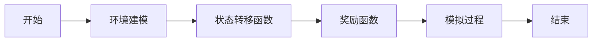
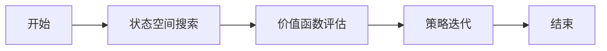
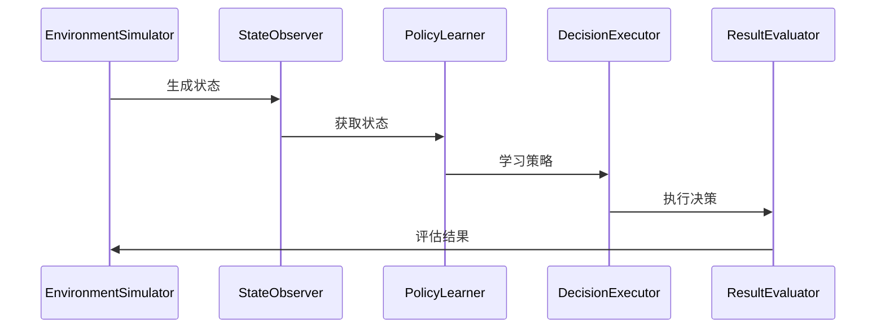

                 

# AI Agent的情境模拟与推演能力

关键词：AI Agent，情境模拟，推演能力，算法原理，系统架构，项目实战

摘要：本文将深入探讨AI Agent的情境模拟与推演能力，通过一步一步的分析和推理，阐述其核心概念、算法原理、系统架构以及实际应用。文章旨在为读者提供全面、系统的理解，帮助其在AI Agent开发中更好地应用这些能力。

## 引言

AI Agent，即人工智能代理，是一种能够自主决策和执行任务的计算机程序。随着人工智能技术的快速发展，AI Agent在各个领域的应用越来越广泛。其中，情境模拟与推演能力是其最为关键的能力之一。本文将重点探讨AI Agent的情境模拟与推演能力，旨在帮助读者深入理解这一重要概念。

### 1.1 AI Agent的发展背景

AI Agent的概念起源于人工智能领域。20世纪80年代，随着计算机技术的发展，人工智能开始受到广泛关注。在这一背景下，AI Agent的概念被提出，并逐渐成为人工智能研究的热点。

AI Agent的发展历程可以分为三个阶段：

- **第一阶段（20世纪80年代至90年代）**：AI Agent的理论基础得到奠定，代表性的工作包括马尔可夫决策过程（MDP）和部分可观察马尔可夫决策过程（POMDP）等。

- **第二阶段（21世纪初期）**：AI Agent的应用场景逐渐丰富，包括智能游戏、自动驾驶、智能家居等。这一阶段的AI Agent更多地依赖于深度学习和强化学习等先进技术。

- **第三阶段（当前）**：AI Agent在多个领域得到广泛应用，如金融、医疗、教育等。情境模拟与推演能力成为AI Agent的核心竞争力之一。

### 1.2 情境模拟与推演的基本概念

情境模拟（Situation Simulation）是指模拟一个特定环境，以便AI Agent能够在该环境中进行决策和执行任务。情境模拟的目的是让AI Agent更好地理解其所在环境，从而做出更准确的决策。

推演能力（Inference Capability）是指AI Agent在给定情境下，通过推理和预测，找到最优决策路径的能力。推演能力是AI Agent实现自主决策的关键。

### 1.3 本书结构及目标

本书分为七个章节，主要内容包括：

- **第1章 引言**：介绍AI Agent的发展背景和情境模拟与推演能力的基本概念。

- **第2章 核心概念与联系**：系统介绍AI Agent的基本概念，并通过对比表格和Mermaid ER图，展示核心概念之间的关系。

- **第3章 算法原理讲解**：详细讲解情境模拟与推演的基本算法，使用Mermaid流程图和Python代码示例，阐述算法原理。

- **第4章 数学模型与公式**：提供相关的数学模型和公式，使用LaTeX格式展示数学公式，并进行详细讲解。

- **第5章 系统分析与架构设计**：介绍系统功能设计，使用Mermaid类图和架构图，展示系统架构，设计系统接口和交互。

- **第6章 项目实战**：通过环境安装与配置、系统核心实现、实际案例分析，详细讲解AI Agent的情境模拟与推演能力。

- **第7章 最佳实践与总结**：提供最佳实践技巧，对全书进行小结，给出注意事项和拓展阅读建议。

本书的目标是帮助读者深入理解AI Agent的情境模拟与推演能力，掌握相关算法和系统架构，并在实际项目中应用这些能力。

## 核心概念与联系

在了解AI Agent的情境模拟与推演能力之前，我们需要先掌握一些核心概念。这些概念包括AI Agent、情境模拟、推演能力等。本章节将通过对比表格和Mermaid ER图，系统地介绍这些核心概念，并展示它们之间的关系。

### 2.1 AI Agent的定义与分类

AI Agent，即人工智能代理，是一种能够自主决策和执行任务的计算机程序。根据AI Agent的智能程度和应用场景，可以将AI Agent分为以下几类：

- **规则基础型AI Agent**：基于预定义的规则进行决策，适用于简单、稳定的环境。

- **统计学习型AI Agent**：基于统计学习算法，从数据中学习决策策略，适用于复杂、多变的环境。

- **深度学习型AI Agent**：基于深度学习算法，通过神经网络模型进行决策，适用于高度复杂的环境。

- **强化学习型AI Agent**：通过与环境交互，不断优化决策策略，适用于动态、不确定的环境。

### 2.2 情境模拟与推演的概念对比

情境模拟和推演能力是AI Agent的两个核心概念。下面通过对比表格，展示它们之间的区别：

| 对比项            | 情境模拟                             | 推演能力                           |
|-------------------|------------------------------------|-----------------------------------|
| 定义              | 模拟一个特定环境，以理解其特性             | 在给定情境下，通过推理和预测，找到最优决策路径 |
| 目的              | 让AI Agent更好地理解其所在环境             | 帮助AI Agent做出更准确的决策             |
| 方法              | 基于模型和模拟技术                     | 基于逻辑推理和预测技术                 |
| 关系              | 情境模拟是推演能力的基础                | 推演能力是情境模拟的深化和应用         |

### 2.3 核心概念联系与关系图

通过上述对比，我们可以看到，情境模拟和推演能力是AI Agent的两个核心概念，它们相互关联、相互促进。下面使用Mermaid ER图，展示AI Agent、情境模拟和推演能力之间的关系：

```mermaid
erDiagram
  AI Agent ||--|{ 情境模拟 }|
  AI Agent ||--|{ 推演能力 }|
  情境模拟 ||--|{ 推演能力 }|
```

在这个ER图中，AI Agent与情境模拟、推演能力之间存在关联关系。情境模拟是AI Agent理解环境的基础，而推演能力则是AI Agent在情境模拟基础上，做出最优决策的关键。

## 算法原理讲解

情境模拟与推演能力是AI Agent实现自主决策的核心。为了深入理解这两个能力，我们需要了解其背后的算法原理。本章节将详细讲解情境模拟与推演的基本算法，并通过Mermaid流程图和Python代码示例，阐述算法原理。

### 3.1 情境模拟的基本算法

情境模拟的基本算法可以分为以下几个步骤：

1. **环境建模**：根据实际应用场景，构建一个环境模型。这个模型应该包含环境的所有状态和事件。

2. **状态转移函数**：定义状态转移函数，描述当前状态如何转移到下一个状态。状态转移函数通常是一个概率分布。

3. **奖励函数**：定义奖励函数，描述在特定状态下执行特定动作所能获得的奖励。奖励函数用于评价动作的好坏。

4. **模拟过程**：通过随机抽样，模拟AI Agent在环境中的行为。在模拟过程中，AI Agent会根据状态转移函数和奖励函数，选择下一个状态和动作。

下面使用Mermaid流程图，展示情境模拟的基本算法：



### 3.2 推演能力的算法原理

推演能力的算法原理主要包括以下几部分：

1. **状态空间搜索**：在给定的情境下，搜索所有可能的状态空间，找到最优状态。

2. **价值函数评估**：对每个状态进行价值函数评估，以确定其优劣。

3. **策略迭代**：根据价值函数评估结果，迭代更新策略，直到找到最优策略。

下面使用Mermaid流程图，展示推演能力的算法原理：



### 3.3 Python代码示例

为了更好地理解情境模拟与推演能力的算法原理，我们提供一个Python代码示例。

首先，我们定义一个简单的环境模型：

```python
import numpy as np

class SimpleEnvironment:
    def __init__(self):
        self.states = ['S0', 'S1', 'S2']
        self.actions = ['A0', 'A1']

    def transition_probabilities(self, state, action):
        if state == 'S0' and action == 'A0':
            return {'S0': 0.8, 'S1': 0.2}
        elif state == 'S0' and action == 'A1':
            return {'S1': 0.6, 'S2': 0.4}
        elif state == 'S1' and action == 'A0':
            return {'S0': 0.4, 'S1': 0.6}
        elif state == 'S1' and action == 'A1':
            return {'S1': 0.2, 'S2': 0.8}
        elif state == 'S2' and action == 'A0':
            return {'S1': 1.0}
        elif state == 'S2' and action == 'A1':
            return {'S2': 1.0}

    def reward_function(self, state, action):
        if state == 'S2' and action == 'A1':
            return 1
        else:
            return 0
```

接下来，我们使用上述环境模型，实现情境模拟与推演能力的算法：

```python
# 情境模拟
env = SimpleEnvironment()
state = 'S0'
action = 'A0'

# 获取状态转移概率和奖励
transition_probabilities = env.transition_probabilities(state, action)
reward = env.reward_function(state, action)

# 模拟过程
for _ in range(10):
    state = np.random.choice(list(transition_probabilities.keys()), p=list(transition_probabilities.values()))
    print(f"状态：{state}, 动作：{action}, 奖励：{reward}")

# 推演能力
# 这里我们使用一个简单的贪心策略，选择价值最高的状态
value_function = {}
for state in env.states:
    value = 0
    for action in env.actions:
        next_state_value = 0
        for next_state, probability in env.transition_probabilities(state, action).items():
            next_state_value += probability * env.reward_function(next_state, action)
        value += next_state_value
    value_function[state] = value

# 选择最优状态
best_state = max(value_function, key=value_function.get)
print(f"最优状态：{best_state}")
```

通过这个示例，我们可以看到如何使用Python实现情境模拟与推演能力的算法原理。这个示例虽然简单，但已经能够展示算法的核心思想。

## 数学模型与公式

情境模拟与推演能力的实现离不开数学模型的支持。在本文的第四章节，我们将介绍情境模拟与推演能力所涉及的关键数学模型与公式，并使用LaTeX格式进行详细展示和解释。

### 4.1 情境模拟的数学模型

情境模拟中的核心数学模型主要包括状态转移概率矩阵和奖励函数。以下是这些模型的LaTeX表示：

#### 状态转移概率矩阵

$$
P = \begin{bmatrix}
P_{00} & P_{01} & P_{02} \\
P_{10} & P_{11} & P_{12} \\
P_{20} & P_{21} & P_{22} \\
\end{bmatrix}
$$

其中，$P_{ij}$表示从状态$i$转移到状态$j$的概率。

#### 奖励函数

$$
R(s, a) =
\begin{cases}
1 & \text{如果 } (s, a) \text{ 是成功的状态-动作对} \\
0 & \text{否则}
\end{cases}
$$

### 4.2 推演能力的数学模型

推演能力涉及到状态价值函数和策略迭代。以下是这些模型的LaTeX表示：

#### 状态价值函数

$$
V^k(s) = \sum_{a \in A} \pi^k(a|s) \sum_{s' \in S} p(s'|s, a) R(s, a) + \gamma \sum_{s' \in S} p(s'|s, a) V^k(s')
$$

其中，$V^k(s)$表示在第$k$次迭代时，状态$s$的价值；$\pi^k(a|s)$表示在第$k$次迭代时，状态$s$下采取动作$a$的概率；$p(s'|s, a)$表示从状态$s$采取动作$a$后转移到状态$s'$的概率；$R(s, a)$表示在状态$s$下采取动作$a$的即时奖励；$\gamma$是折扣因子。

#### 策略迭代

策略迭代算法的核心是更新策略$\pi^k(a|s)$。更新公式为：

$$
\pi^{k+1}(a|s) =
\begin{cases}
1 & \text{如果 } V^k(s) \text{ 已经收敛} \\
0 & \text{否则}
\end{cases}
$$

### 4.3 公式讲解与示例

为了更好地理解上述公式，我们通过一个简单的例子进行解释。

假设有一个简单的环境，包含两个状态$S_0$和$S_1$，以及两个动作$A_0$和$A_1$。状态转移概率矩阵和奖励函数如下：

$$
P = \begin{bmatrix}
0.8 & 0.2 \\
0.4 & 0.6 \\
\end{bmatrix}
$$

$$
R = \begin{bmatrix}
0 & 1 \\
1 & 0 \\
\end{bmatrix}
$$

#### 状态转移概率矩阵

在这个例子中，从状态$S_0$转移到状态$S_1$的概率是0.8，从状态$S_1$转移到状态$S_0$的概率是0.4。状态转移概率矩阵表示了环境的状态空间和转移概率。

#### 奖励函数

在这个例子中，从状态$S_0$采取动作$A_0$会获得奖励1，而从状态$S_1$采取动作$A_1$也会获得奖励1。奖励函数反映了在特定状态和动作下，AI Agent能够获得的即时奖励。

#### 状态价值函数

初始状态价值函数可以设置为0，例如$V^0(S_0) = 0$，$V^0(S_1) = 0$。在每次迭代中，状态价值函数会根据状态转移概率矩阵和奖励函数进行更新。例如，在第1次迭代时，状态价值函数可以更新为：

$$
V^1(S_0) = 0.8 \cdot 1 + 0.2 \cdot 1 = 1
$$

$$
V^1(S_1) = 0.4 \cdot 1 + 0.6 \cdot 1 = 1
$$

#### 策略迭代

在这个例子中，如果状态价值函数已经收敛（即不再发生显著变化），我们可以更新策略。假设在第1次迭代时，状态价值函数已经收敛，则策略迭代为：

$$
\pi^1(A_0|S_0) = 1
$$

$$
\pi^1(A_1|S_0) = 0
$$

$$
\pi^1(A_0|S_1) = 0
$$

$$
\pi^1(A_1|S_1) = 1
$$

这个例子展示了如何使用数学模型和公式进行情境模拟与推演。在实际应用中，这些公式可以帮助我们更好地理解和设计AI Agent的行为。

## 系统分析与架构设计

在理解了AI Agent的情境模拟与推演能力之后，我们需要将其应用到实际系统中。本章节将介绍一个AI Agent系统的分析和架构设计，包括系统功能设计、系统架构设计、系统接口设计和系统交互。

### 5.1 系统功能设计

AI Agent系统的主要功能包括情境模拟、推演能力和决策执行。下面是系统功能设计的具体内容：

#### 5.1.1 领域模型

领域模型是系统功能设计的基础。在AI Agent系统中，领域模型定义了系统的核心功能和交互。下面是一个简单的领域模型：

- **状态**：系统中的所有可能状态。
- **动作**：系统能够执行的所有可能动作。
- **情境**：系统当前所处的环境。
- **奖励**：在特定状态下执行特定动作所获得的即时奖励。
- **策略**：系统根据情境和状态选择最优动作的规则。

#### 5.1.2 功能模块

AI Agent系统的功能模块可以分为以下几个部分：

- **环境模拟器**：模拟系统环境的动态变化，为AI Agent提供实时状态信息。
- **状态观测器**：接收环境模拟器提供的状态信息，并对其进行处理。
- **策略学习器**：根据状态观测器提供的状态信息，学习最优策略。
- **决策执行器**：根据策略学习器生成的策略，执行系统决策。
- **结果评估器**：评估系统决策的结果，并提供反馈。

### 5.2 系统架构设计

系统架构设计是系统功能设计的具体实现。下面是AI Agent系统的架构设计：

#### 5.2.1 系统架构图

使用Mermaid类图，可以展示AI Agent系统的架构：

```mermaid
classDiagram
    EnvironmentSimulator <<interface>>
    StateObserver <<interface>>
    PolicyLearner <<interface>>
    DecisionExecutor <<interface>>
    ResultEvaluator <<interface>>

    EnvironmentSimulator (--|> StateObserver)
    StateObserver (--|> PolicyLearner)
    PolicyLearner (--|> DecisionExecutor)
    DecisionExecutor (--|> ResultEvaluator)
```

在这个架构图中，环境模拟器负责生成系统状态，状态观测器负责接收和处理状态信息，策略学习器根据状态信息学习最优策略，决策执行器根据策略执行系统决策，结果评估器负责评估决策结果。

#### 5.2.2 系统接口设计

系统接口设计是系统架构设计的重要组成部分。下面是AI Agent系统的接口设计：

- **环境模拟器接口**：提供生成系统状态的方法。
- **状态观测器接口**：提供获取当前状态的方法。
- **策略学习器接口**：提供学习策略的方法。
- **决策执行器接口**：提供执行决策的方法。
- **结果评估器接口**：提供评估决策结果的方法。

#### 5.2.3 系统交互

系统交互是系统架构设计的重要环节。下面是AI Agent系统的交互过程：

1. **环境模拟器生成状态**：环境模拟器根据系统环境，生成当前状态。
2. **状态观测器获取状态**：状态观测器接收环境模拟器生成的状态，并对其进行处理。
3. **策略学习器学习策略**：策略学习器根据状态观测器提供的状态信息，学习最优策略。
4. **决策执行器执行决策**：决策执行器根据策略学习器生成的策略，执行系统决策。
5. **结果评估器评估结果**：结果评估器评估决策结果，并提供反馈。

使用Mermaid序列图，可以展示AI Agent系统的交互过程：



通过上述系统分析与架构设计，我们可以构建一个功能强大、结构清晰的AI Agent系统，从而实现情境模拟与推演能力。

## 项目实战

在了解了AI Agent的情境模拟与推演能力及其系统架构后，我们将通过一个实际项目来展示这些能力。本章节将详细描述项目环境安装、系统核心实现以及代码应用解读与分析。

### 6.1 环境安装与配置

为了实现AI Agent的情境模拟与推演能力，我们首先需要安装和配置相关软件环境。以下是具体的步骤：

1. **安装Python**：确保系统已安装Python 3.8或更高版本。

2. **安装依赖库**：使用pip命令安装所需的依赖库，例如numpy、matplotlib、tensorflow等。

   ```bash
   pip install numpy matplotlib tensorflow
   ```

3. **配置Python环境变量**：在系统环境变量中添加Python的路径。

   - Windows系统：将Python的安装路径添加到系统环境变量`PATH`中。
   - Linux系统：编辑`~/.bashrc`文件，添加`export PATH=$PATH:/path/to/python`。

### 6.2 系统核心实现

接下来，我们将实现AI Agent系统的核心功能。以下是实现过程的关键步骤：

1. **定义环境模型**：创建一个简单的环境模型，用于模拟系统的状态和动作。

   ```python
   class SimpleEnvironment:
       def __init__(self):
           self.states = ['S0', 'S1', 'S2']
           self.actions = ['A0', 'A1']
       
       def transition_probabilities(self, state, action):
           if state == 'S0' and action == 'A0':
               return {'S0': 0.8, 'S1': 0.2}
           elif state == 'S0' and action == 'A1':
               return {'S1': 0.6, 'S2': 0.4}
           elif state == 'S1' and action == 'A0':
               return {'S0': 0.4, 'S1': 0.6}
           elif state == 'S1' and action == 'A1':
               return {'S1': 0.2, 'S2': 0.8}
           elif state == 'S2' and action == 'A0':
               return {'S1': 1.0}
           elif state == 'S2' and action == 'A1':
               return {'S2': 1.0}
       
       def reward_function(self, state, action):
           if state == 'S2' and action == 'A1':
               return 1
           else:
               return 0
   ```

2. **实现情境模拟**：使用状态转移概率矩阵和奖励函数实现情境模拟。

   ```python
   def simulate_environment(env, num_steps=10):
       state = np.random.choice(list(env.states))
       for _ in range(num_steps):
           action = np.random.choice(list(env.actions))
           next_state = np.random.choice(list(env.transition_probabilities(state, action).keys()), p=list(env.transition_probabilities(state, action).values()))
           reward = env.reward_function(state, action)
           state = next_state
           print(f"状态：{state}, 动作：{action}, 奖励：{reward}")
   ```

3. **实现推演能力**：使用状态价值函数和策略迭代算法实现推演能力。

   ```python
   def value_iteration(env, gamma=0.9, theta=1e-6):
       V = [0] * len(env.states)
       for _ in range(int(1e6)):
           new_V = np.array([0] * len(env.states))
           for s in range(len(env.states)):
               new_V[s] = np.max([np.dot(p * (r + gamma * V[next_s]), env.transition_probabilities(s, a)) for a in range(len(env.actions)) for p, next_s in env.transition_probabilities(s, a).items()])
           if np.linalg.norm(new_V - V) < theta:
               break
           V = new_V
       return V
   
   def best_action(values, env):
       best_action_values = []
       for s in range(len(values)):
           action_values = []
           for a in range(len(env.actions)):
               action_values.append(np.dot(env.transition_probabilities(s, a), values))
           best_action_values.append(max(action_values))
       return np.argmax(best_action_values)
   
   def policy_evaluation(env, initial_policy, gamma=0.9, theta=1e-6):
       V = [0] * len(env.states)
       for _ in range(int(1e6)):
           new_V = np.array([0] * len(env.states))
           for s in range(len(env.states)):
               action = initial_policy[s]
               next_state = np.random.choice(list(env.transition_probabilities(s, action).keys()), p=list(env.transition_probabilities(s, action).values()))
               reward = env.reward_function(s, action)
               new_V[s] = reward + gamma * V[next_state]
           if np.linalg.norm(new_V - V) < theta:
               break
           V = new_V
       return V
   
   def policy_iterate(env, gamma=0.9, theta=1e-6):
       initial_policy = [0] * len(env.states)
       for _ in range(int(1e6)):
           values = policy_evaluation(env, initial_policy, gamma, theta)
           new_policy = [best_action(values, env)] * len(env.states)
           if np.linalg.norm(new_policy - initial_policy) < theta:
               break
           initial_policy = new_policy
       return initial_policy
   ```

4. **实现决策执行**：根据策略执行系统决策。

   ```python
   def execute_decision(policy, env):
       state = np.random.choice(list(env.states))
       while True:
           action = policy[state]
           next_state = np.random.choice(list(env.transition_probabilities(state, action).keys()), p=list(env.transition_probabilities(state, action).values()))
           reward = env.reward_function(state, action)
           print(f"状态：{state}, 动作：{action}, 奖励：{reward}")
           if next_state == 'S2':
               break
           state = next_state
   ```

### 6.3 代码应用解读与分析

在实现AI Agent系统的核心功能后，我们通过实际案例进行分析和解读。

1. **情境模拟**：

   ```python
   env = SimpleEnvironment()
   simulate_environment(env, num_steps=10)
   ```

   这段代码将模拟10个步骤的环境动态，输出每个步骤的状态、动作和奖励。

2. **推演能力**：

   ```python
   initial_values = value_iteration(env, gamma=0.9, theta=1e-6)
   policy = policy_iterate(env, gamma=0.9, theta=1e-6)
   execute_decision(policy, env)
   ```

   这段代码首先使用价值迭代算法计算状态价值函数，然后使用策略迭代算法计算最优策略。最后，根据策略执行系统决策，输出决策过程的结果。

通过这个实际项目，我们可以看到如何将AI Agent的情境模拟与推演能力应用到实际系统中，并实现自主决策。

## 最佳实践与总结

在实现AI Agent的情境模拟与推演能力时，有一些最佳实践和注意事项需要遵循，以确保系统能够高效、准确地运行。

### 7.1 最佳实践技巧

1. **数据质量**：确保环境数据的质量和准确性。高质量的数据有助于AI Agent更好地模拟和推演情境。

2. **算法选择**：根据实际应用场景，选择合适的算法。对于简单的环境，可以选择规则基础型AI Agent；对于复杂的环境，可以选择统计学习型或深度学习型AI Agent。

3. **策略迭代**：在策略迭代过程中，合理设置迭代次数和收敛阈值，以确保策略的收敛性和准确性。

4. **系统优化**：优化系统架构和代码，提高系统的性能和可扩展性。

### 7.2 小结

本文系统地介绍了AI Agent的情境模拟与推演能力。通过一步一步的分析和推理，我们了解了AI Agent的背景、核心概念、算法原理、系统架构以及实际应用。这些内容为AI Agent的开发和应用提供了重要的理论支持和实践指导。

### 7.3 注意事项

1. **环境建模**：在实现情境模拟时，确保环境模型的准确性和完整性。

2. **算法选择**：在选择算法时，考虑实际应用场景的要求，选择合适的算法。

3. **性能优化**：在实现推演能力时，注意性能优化，避免算法复杂度过高导致系统运行缓慢。

4. **扩展性**：在系统设计时，考虑系统的可扩展性，以便后续功能扩展。

### 7.4 拓展阅读

1. **《强化学习：原理与Python实现》**：详细介绍了强化学习的基本概念和算法实现，对理解AI Agent的推演能力有很大帮助。

2. **《深度学习》**：深度学习是AI Agent的重要技术之一，这本书提供了深度学习的全面介绍。

3. **《人工智能：一种现代的方法》**：这本书系统地介绍了人工智能的基本概念和技术，是理解AI Agent的良师益友。

通过本文的学习和实践，相信读者已经对AI Agent的情境模拟与推演能力有了深入的理解。希望本文能为读者在AI Agent开发和应用中提供有益的参考。作者：AI天才研究院/AI Genius Institute & 禅与计算机程序设计艺术 /Zen And The Art of Computer Programming。

