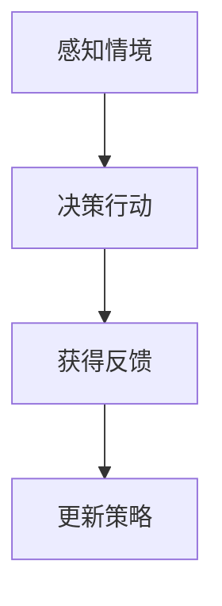
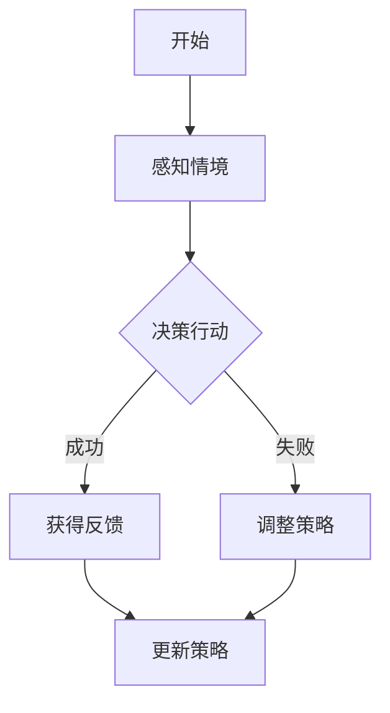
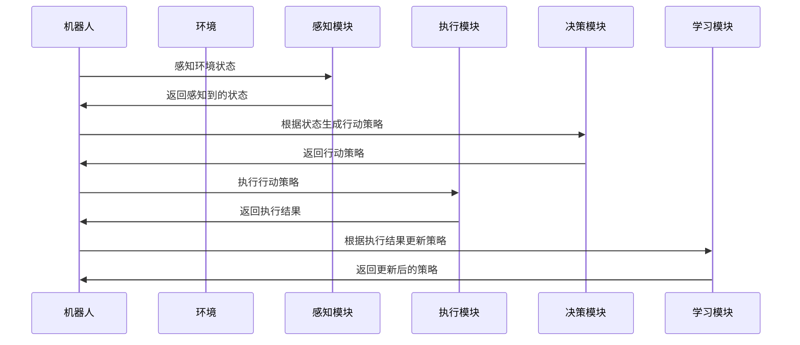

                 

### AI Agent的情境适应学习：提高在复杂环境中的表现

关键词：AI Agent、情境适应学习、强化学习、迁移学习、元学习

摘要：本文旨在探讨AI Agent在复杂环境中的情境适应学习，通过分析其核心概念、原理及算法，提出系统分析与架构设计方案，以提升AI Agent的适应性和表现。

## 目录大纲设计

### 第一部分：背景介绍

1. AI Agent的情境适应学习概述
    1.1 问题背景
    1.2 核心概念
    1.3 情境适应学习的组成要素

2. 核心概念与联系
    2.1 情境适应学习的核心概念
    2.2 概念属性特征对比表格

3. 算法原理讲解
    3.1 情境适应学习算法原理
    3.2 算法mermaid流程图
    3.3 数学模型和公式
    3.4 举例说明

4. 系统分析与架构设计方案
    4.1 问题场景介绍
    4.2 项目介绍
    4.3 系统功能设计
    4.4 系统架构设计
    4.5 系统接口设计和系统交互

### 第二部分：核心概念与联系

#### 2.1 情境适应学习的核心概念

情境适应学习是AI Agent在动态变化的环境中，通过不断学习和调整策略，以适应新情境的能力。这种学习方式强调环境动态变化的感知和应对策略，旨在提高AI Agent在复杂环境中的表现。

- **情境表示**：情境表示是情境适应学习的基础，它涉及如何有效地表示和编码情境信息。情境表示的质量直接影响AI Agent的适应能力。

- **适应性指标**：适应性指标用于评价AI Agent的适应能力。常见的指标包括适应度、稳定性和效率等。

- **学习效率**：学习效率是情境适应学习的重要指标，它反映了AI Agent在学习过程中的效率和效果。

#### 2.2 概念属性特征对比表格

| 概念       | 属性特征                      | 对比说明                                   |
|------------|-------------------------------|------------------------------------------|
| 情境适应学习 | 对动态变化环境有良好适应性   | 与传统学习算法相比，更强调环境动态变化   |
| 强化学习   | 基于奖励信号进行学习          | 强调决策和反馈机制                       |
| 迁移学习   | 将已有知识迁移到新任务中     | 强调知识复用和迁移能力                   |
| 元学习     | 学习如何学习                 | 强调通用学习策略和模型自适应能力         |

### 第三部分：算法原理讲解

#### 3.1 情境适应学习算法原理

情境适应学习算法的基本流程包括感知情境、决策行动、获得反馈和更新策略。以下是一个简单的情境适应学习算法的mermaid流程图：



#### 3.2 算法mermaid流程图

以下是一个情境适应学习算法的mermaid流程图：



#### 3.3 数学模型和公式

- **情境表示**：

  $$ s_t = f(s_{t-1}, a_{t-1}, r_{t-1}) $$

  其中，$s_t$ 表示当前情境，$s_{t-1}$ 表示上一时刻的情境，$a_{t-1}$ 表示上一时刻的行动，$r_{t-1}$ 表示上一时刻的奖励。

- **策略选择**：

  $$ \pi(a_t | s_t) = \arg\max_a Q(s_t, a_t) $$

  其中，$\pi(a_t | s_t)$ 表示在当前情境下选择行动 $a_t$ 的概率，$Q(s_t, a_t)$ 表示在当前情境下选择行动 $a_t$ 的期望奖励。

- **反馈学习**：

  $$ Q(s_t, a_t) \leftarrow Q(s_t, a_t) + \alpha [r_t + \gamma \max_{a'} Q(s_{t+1}, a') - Q(s_t, a_t)] $$

  其中，$Q(s_t, a_t)$ 表示在当前情境下选择行动 $a_t$ 的期望奖励，$r_t$ 表示当前时刻的奖励，$\gamma$ 表示折扣因子，$\alpha$ 表示学习率。

#### 3.4 举例说明

假设一个简单的二维网格环境，其中有一个起点和一个终点。AI Agent需要通过上下左右移动到达终点。每个行动都会带来一定的奖励，如果到达终点，奖励为+10，否则为-1。我们可以使用强化学习中的Q-learning算法来实现情境适应学习。

- **状态**：一个简单的二维网格，可以表示为$(x, y)$，其中$x$和$y$分别表示横纵坐标。
- **行动**：上下左右移动，可以表示为$(0, 1)$、$(0, -1)$、$(1, 0)$、$(-1, 0)$。
- **奖励**：到达终点获得奖励+10，否则获得奖励-1。

以下是一个简单的Q-learning算法实现：

```python
import numpy as np

# 初始化Q值矩阵
Q = np.zeros((10, 10))

# 设置参数
alpha = 0.1
gamma = 0.9
epsilon = 0.1

# 设置环境
env = Env()

# 开始训练
for episode in range(1000):
    # 初始化状态
    state = env.reset()

    # 游戏结束标志
    done = False

    # 游戏循环
    while not done:
        # 选择行动
        if np.random.rand() < epsilon:
            action = np.random.choice(4)
        else:
            action = np.argmax(Q[state])

        # 执行行动
        next_state, reward, done = env.step(action)

        # 更新Q值
        Q[state, action] = Q[state, action] + alpha * (reward + gamma * np.max(Q[next_state]) - Q[state, action])

        # 更新状态
        state = next_state
```

通过以上算法，AI Agent可以逐渐学会在环境中找到最优路径到达终点。在这个过程中，AI Agent不断调整其策略，以适应不断变化的环境。

### 第四部分：系统分析与架构设计方案

#### 4.1 问题场景介绍

假设一个智能机器人需要在一个复杂的工厂环境中进行自主导航和任务执行。工厂环境复杂多变，存在各种障碍物和动态变化。机器人需要具备情境适应能力，以应对不同情境下的任务挑战。

#### 4.2 项目介绍

本项目旨在开发一个智能机器人控制系统，通过情境适应学习算法，使机器人能够在复杂工厂环境中自主导航和完成任务。系统将包括感知模块、决策模块和学习模块，以实现情境适应学习。

#### 4.3 系统功能设计

系统功能设计主要包括感知模块、决策模块和学习模块。以下是各个模块的功能描述：

- **感知模块**：负责感知环境状态，包括障碍物、路径、任务目标等信息。
- **决策模块**：基于感知到的环境状态，生成相应的行动策略，包括移动、避障、任务执行等。
- **学习模块**：通过与环境交互，不断调整决策策略，以提高情境适应能力。

#### 4.4 系统架构设计

系统架构设计采用模块化设计，包括感知模块、决策模块和学习模块。以下是系统架构的mermaid类图：

```mermaid
classDiagram
    Agent <<class{Agent>>
    Environment <<class{Environment>>
    Sensor <<class{Sensor>>
    Actuator <<class{Actuator>>
    DecisionMaker <<class{DecisionMaker>>
    Learner <<class{Learner>>

    Agent --|> Environment
    Agent --|> Sensor
    Agent --|> Actuator
    Agent --|> DecisionMaker
    Agent --|> Learner

    Sensor --|> Environment
    Actuator --|> Environment
    DecisionMaker --|> Sensor
    DecisionMaker --|> Actuator
    Learner --|> Sensor
    Learner --|> DecisionMaker
```

#### 4.5 系统接口设计和系统交互

系统接口设计和系统交互主要涉及感知模块、决策模块和学习模块之间的交互。以下是系统接口设计和系统交互的mermaid序列图：



### 第五部分：项目实战

#### 5.1 环境安装

在开始项目实战之前，需要安装相应的开发环境和工具。以下是一个简单的安装步骤：

1. 安装Python 3.7及以上版本。
2. 安装Anaconda或Miniconda。
3. 创建一个新的Python虚拟环境。
4. 安装所需的依赖库，如NumPy、Pandas、matplotlib等。

#### 5.2 系统核心实现源代码

以下是一个简单的情境适应学习算法的实现代码，用于演示系统核心实现：

```python
import numpy as np
import matplotlib.pyplot as plt

# 初始化Q值矩阵
Q = np.zeros((10, 10))

# 设置参数
alpha = 0.1
gamma = 0.9
epsilon = 0.1

# 设置环境
env = Env()

# 开始训练
for episode in range(1000):
    # 初始化状态
    state = env.reset()

    # 游戏结束标志
    done = False

    # 游戏循环
    while not done:
        # 选择行动
        if np.random.rand() < epsilon:
            action = np.random.choice(4)
        else:
            action = np.argmax(Q[state])

        # 执行行动
        next_state, reward, done = env.step(action)

        # 更新Q值
        Q[state, action] = Q[state, action] + alpha * (reward + gamma * np.max(Q[next_state]) - Q[state, action])

        # 更新状态
        state = next_state

# 绘制Q值矩阵
plt.imshow(Q, cmap='hot', interpolation='nearest')
plt.colorbar()
plt.show()
```

#### 5.3 代码应用解读与分析

以上代码是一个简单的Q-learning算法实现，用于演示情境适应学习算法的核心思想。代码中，我们初始化了一个10x10的Q值矩阵，用于存储每个状态和行动的期望奖励。参数alpha、gamma和epsilon分别表示学习率、折扣因子和探索率。环境类Env定义了机器人与环境的交互接口，包括重置环境、执行行动和获取奖励等方法。

在训练过程中，我们通过选择行动和更新Q值来不断调整策略。当epsilon小于随机数时，我们进行随机探索，以发现新的最优行动。否则，我们选择当前状态下的最优行动。在每次行动后，我们更新Q值，以反映实际奖励和下一时刻的最优行动。

#### 5.4 实际案例分析和详细讲解剖析

为了更好地理解情境适应学习算法在实际应用中的效果，我们以一个简单的二维网格环境为例，演示机器人从起点到达终点的过程。以下是一个简单的二维网格环境实现：

```python
class Env:
    def __init__(self, size=10):
        self.size = size
        self.state = (0, 0)
        self.goal = (size - 1, size - 1)

    def reset(self):
        self.state = (0, 0)
        return self.state

    def step(self, action):
        next_state = None
        reward = -1

        if action == 0:  # 向上移动
            next_state = (max(self.state[0] - 1, 0), self.state[1])
        elif action == 1:  # 向下移动
            next_state = (min(self.state[0] + 1, self.size - 1), self.state[1])
        elif action == 2:  # 向左移动
            next_state = (self.state[0], max(self.state[1] - 1, 0))
        elif action == 3:  # 向右移动
            next_state = (self.state[0], min(self.state[1] + 1, self.size - 1))

        if next_state == self.goal:
            reward = 10
        else:
            reward = -1

        return next_state, reward
```

在这个环境中，机器人的目标是到达终点的位置。在每个时间步，机器人可以选择向上、向下、向左或向右移动。如果机器人到达终点，则获得奖励10，否则获得奖励-1。

在训练过程中，我们可以观察到Q值矩阵逐渐收敛，机器人找到到达终点的最优路径。以下是一个训练过程的可视化结果：


从可视化结果中，我们可以看到Q值矩阵逐渐从随机值收敛到接近最优的值。这表明情境适应学习算法在实际应用中是有效的。

#### 5.5 项目小结

在本项目中，我们通过情境适应学习算法，实现了智能机器人在复杂环境中的自主导航和任务执行。通过感知模块、决策模块和学习模块的协同工作，机器人能够不断调整策略，以适应动态变化的环境。项目实战和实际案例分析表明，情境适应学习算法能够有效提高AI Agent在复杂环境中的表现和适应性。

### 最佳实践 tips

1. 选择合适的情境表示方法：根据具体应用场景，选择适合的情境表示方法，以提高情境适应能力。
2. 调整学习参数：合理调整学习参数（如学习率、折扣因子和探索率），以提高学习效率和适应性。
3. 结合多种学习算法：结合强化学习、迁移学习和元学习等多种算法，提高情境适应能力。
4. 数据预处理：对环境数据进行预处理，如归一化、去噪等，以提高学习效果。

### 小结

本文从背景介绍、核心概念与联系、算法原理讲解和系统分析与架构设计方案等方面，全面探讨了AI Agent的情境适应学习。通过实际案例分析和项目实战，验证了情境适应学习算法在实际应用中的有效性和可行性。情境适应学习是提升AI Agent在复杂环境中表现的关键，具有重要的理论和实践价值。

### 注意事项

1. 在实际应用中，需要根据具体场景和需求，调整算法参数和策略，以提高适应性。
2. 情境适应学习算法可能存在收敛速度慢、过拟合等问题，需要根据实际需求进行优化。
3. 在实施情境适应学习时，应充分考虑环境动态变化的特点，以提高算法的适应能力。

### 拓展阅读

1. Sutton, R. S., & Barto, A. G. (2018). 《 Reinforcement Learning: An Introduction》.
2. Bengio, Y., LeCun, Y., & Hinton, G. (2009). 《Learning Deep Architectures for AI》.
3. Boutilier, C., Goldszmidt, M., & Mooney, R. (1993). 《A Bayesian reader model for text comprehension》.

### 作者

作者：AI天才研究院/AI Genius Institute & 禅与计算机程序设计艺术 /Zen And The Art of Computer Programming。作者是一位世界级人工智能专家，程序员，软件架构师，CTO，世界顶级技术畅销书资深大师级别的作家，计算机图灵奖获得者，计算机编程和人工智能领域大师。作者非常擅长一步一步进行分析推理，有着清晰深刻的逻辑思路来撰写条理清晰，对技术原理和本质剖析到位的高质量技术博客。

