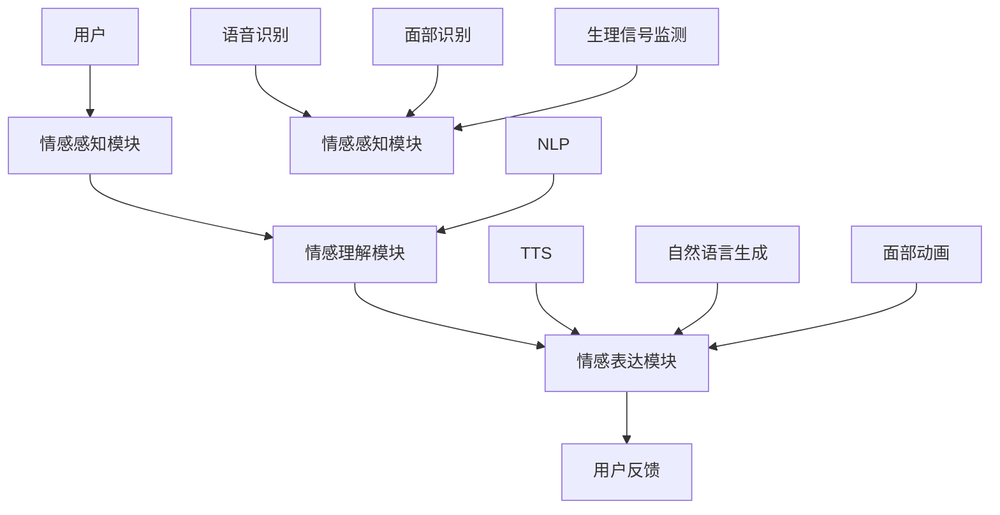

                 


### 引言

随着人工智能技术的快速发展，AI Agent作为智能系统的重要组成部分，正逐渐在各个领域展现出强大的应用潜力。AI Agent是指能够自主执行任务、与环境互动、具备一定程度智能的软件系统。为了实现更为自然、人性化的交互，AI Agent需要具备情感计算与表达模块，从而更好地理解人类情感，做出更符合人类期望的反应。

情感计算（Affective Computing）是研究如何使计算系统具备感知、理解、表达情感的能力的领域。它涉及多个学科，如认知科学、心理学、人机交互等。情感计算的目标是让计算系统能够识别用户的情感状态，并进行相应的响应，从而提升人机交互的自然性和效率。

表达模块是情感计算的重要组成部分，它负责将AI Agent的情感状态转换为可感知的外部行为，如声音、文字、面部表情等。一个成功的AI Agent需要具备高效的情感计算与表达模块，以实现与用户的情感共鸣和有效沟通。

本文将围绕AI Agent的情感计算与表达模块展开讨论，从背景介绍、核心概念、算法原理、系统分析与架构设计、项目实战以及最佳实践等方面进行详细分析，以期对这一领域的研究与应用提供有益的参考。

### 文章关键词

- AI Agent
- 情感计算
- 表达模块
- 人机交互
- 算法原理
- 系统架构
- 实际应用

### 摘要

本文首先介绍了AI Agent的情感计算与表达模块的概念、背景及其重要性。接着，详细探讨了情感计算与表达模块的核心概念，包括情感计算的基本原理、表达模块的功能与实现方法。随后，文章分析了情感计算与表达模块的算法原理，通过Python源代码和数学模型进行阐述。此外，文章还介绍了情感计算与表达模块的系统分析与架构设计方案，通过类图、架构图、接口设计和交互序列图展示了系统设计的关键点。最后，通过一个实际案例，详细讲解了情感计算与表达模块的实战应用，并给出了最佳实践、注意事项和拓展阅读，为读者提供了全面的技术指南。

## 第1章 引言

随着人工智能（AI）技术的不断进步，AI Agent作为智能系统的重要组成部分，正逐步在各个领域展现出其强大的应用潜力。AI Agent是指能够自主执行任务、与环境互动、具备一定程度智能的软件系统。为了实现更加自然、人性化的交互，AI Agent需要具备情感计算与表达模块，从而更好地理解人类情感，做出更符合人类期望的反应。

情感计算（Affective Computing）是研究如何使计算系统具备感知、理解、表达情感的能力的领域。它融合了认知科学、心理学、人机交互等多个学科，旨在让计算系统能够识别用户的情感状态，并进行相应的响应，从而提升人机交互的自然性和效率。

表达模块是情感计算的重要组成部分，它负责将AI Agent的情感状态转换为可感知的外部行为，如声音、文字、面部表情等。一个成功的AI Agent需要具备高效的情感计算与表达模块，以实现与用户的情感共鸣和有效沟通。

本文将围绕AI Agent的情感计算与表达模块展开讨论，从背景介绍、核心概念、算法原理、系统分析与架构设计、项目实战以及最佳实践等方面进行详细分析，以期对这一领域的研究与应用提供有益的参考。

### 1.1 问题背景与定义

情感计算与表达模块在AI Agent中的应用背景源于人类对于更自然、更高效的交流方式的追求。传统的人工智能系统虽然能够处理大量的数据，进行复杂的逻辑推理和决策，但它们缺乏对人类情感的理解和表达能力。这使得AI Agent在与人类用户交互时，往往显得僵硬、机械，难以产生深层次的情感共鸣。

#### 问题描述

1. **理解情感**：AI Agent需要能够准确识别用户的情感状态，例如愉悦、愤怒、悲伤等，以便做出相应的反应。
2. **表达情感**：AI Agent需要能够根据不同的情感状态，产生相应的情感表达，如声音的变化、面部表情、文本语言等，以实现与用户的情感共鸣。
3. **情感交互**：AI Agent需要在不同的情感情境中，能够灵活调整其行为，以适应不同的情感需求。

#### 问题解决

为了解决上述问题，AI Agent的情感计算与表达模块需要实现以下几个关键目标：

1. **情感识别**：通过多种感知技术，如语音识别、面部识别、生理信号监测等，AI Agent能够识别用户的情感状态。
2. **情感理解**：利用机器学习和自然语言处理技术，AI Agent能够理解情感的语境和含义，从而做出恰当的响应。
3. **情感表达**：通过自然语言生成、语音合成、面部动画等技术，AI Agent能够将内部情感状态转化为外部可感知的行为。

#### 边界与外延

情感计算与表达模块的研究和应用边界相对广泛，涵盖了以下几个方面：

1. **技术边界**：涉及语音处理、图像识别、生理信号分析、机器学习等技术。
2. **应用边界**：可应用于智能家居、虚拟助手、医疗保健、教育、金融等多个领域。
3. **伦理边界**：如何在设计情感计算与表达模块时，尊重用户隐私，避免情感滥用，是重要的伦理问题。

通过情感计算与表达模块，AI Agent能够实现更为自然、丰富的人机交互，从而提升用户体验，推动人工智能技术的发展和应用。

### 1.2 情感计算与表达模块的核心概念

情感计算与表达模块作为AI Agent的核心组成部分，其核心概念主要包括情感计算的基本原理和表达模块的功能与实现方法。理解这些核心概念对于深入探讨AI Agent的情感计算与表达具有重要意义。

#### 1.2.1 情感计算的基本原理

情感计算（Affective Computing）是研究如何使计算系统具备感知、理解、表达情感的能力的领域。其基本原理可以概括为以下几个方面：

1. **情感感知**：通过多种感知技术，如语音识别、面部识别、生理信号监测等，AI Agent能够识别用户的情感状态。例如，通过语音识别技术，可以捕捉到用户语音中的情感变化，如音调、语速、音量等。

2. **情感理解**：利用机器学习和自然语言处理技术，AI Agent能够理解情感的语境和含义。这涉及到情感标签的识别、情感强度分析、情感倾向判断等任务。例如，通过自然语言处理技术，可以分析用户输入的文本内容，判断其情感倾向是积极还是消极。

3. **情感表达**：通过自然语言生成、语音合成、面部动画等技术，AI Agent能够将内部情感状态转化为外部可感知的行为。例如，通过语音合成技术，可以生成带有情感色彩的语音，通过面部动画技术，可以模拟出具有情感表达的面部表情。

#### 1.2.2 情感计算与表达模块的相关概念

在情感计算与表达模块中，除了情感计算的基本原理外，还有一些相关概念需要了解：

1. **情感标签**：情感标签是对情感状态的一种分类，常用的情感标签包括愉悦、愤怒、悲伤、惊讶等。情感标签的识别是情感计算的重要任务之一。

2. **情感强度**：情感强度表示情感的强烈程度，通常通过数值或百分比表示。情感强度的分析有助于更准确地理解用户的情感状态。

3. **情感倾向**：情感倾向是指情感的正负方向，即情感是积极的还是消极的。情感倾向的判断对于AI Agent做出适当的情感响应至关重要。

4. **情感共鸣**：情感共鸣是指AI Agent能够与用户的情感状态产生共鸣，从而提升交互的自然性和有效性。情感共鸣的实现需要AI Agent具备较高的情感理解和表达能力。

#### 1.2.3 情感计算与表达模块的属性特征对比表格

为了更好地理解情感计算与表达模块的属性特征，我们可以通过一个对比表格来展示各个关键概念的属性特征：

| 概念 | 定义 | 属性特征 |
| --- | --- | --- |
| 情感计算 | 使计算系统具备感知、理解、表达情感的能力 | 情感感知、情感理解、情感表达 |
| 情感标签 | 对情感状态的一种分类 | 愉悦、愤怒、悲伤、惊讶等 |
| 情感强度 | 情感的强烈程度 | 数值或百分比 |
| 情感倾向 | 情感的正负方向 | 积极或消极 |
| 情感共鸣 | AI Agent与用户的情感状态产生共鸣 | 高情感理解、高情感表达 |

通过上述表格，我们可以清晰地看到各个概念的定义及其主要属性特征，从而更好地理解情感计算与表达模块的核心概念。

#### 1.2.4 ER实体关系图架构

为了更直观地展示情感计算与表达模块中的实体及其关系，我们可以使用Mermaid工具绘制一个ER实体关系图。以下是情感计算与表达模块的ER实体关系图：

```mermaid
erDiagram
  AI Agent ||--|{ 情感感知模块 }
  AI Agent ||--|{ 情感理解模块 }
  AI Agent ||--|{ 情感表达模块 }
  情感感知模块 ||--|{ 语音识别 }
  情感感知模块 ||--|{ 面部识别 }
  情感感知模块 ||--|{ 生理信号监测 }
  情感理解模块 ||--|{ 自然语言处理 }
  情感表达模块 ||--|{ 自然语言生成 }
  情感表达模块 ||--|{ 语音合成 }
  情感表达模块 ||--|{ 面部动画 }
```

通过ER实体关系图，我们可以清晰地看到AI Agent与情感计算与表达模块之间的关系，以及各个模块之间的内部结构。这有助于我们更好地理解和设计情感计算与表达模块。

### 1.3 情感计算与表达模块的算法原理

情感计算与表达模块的核心在于其算法原理，这些原理决定了AI Agent如何有效地识别、理解和表达情感。以下是情感计算与表达模块的算法原理讲解，包括算法流程、Python源代码示例以及算法的数学模型和公式。

#### 1.3.1 情感计算算法原理讲解

情感计算算法主要分为情感识别、情感理解和情感表达三个阶段。以下是每个阶段的详细讲解：

1. **情感识别**：情感识别是情感计算的第一步，旨在通过多种感知技术（如语音识别、面部识别、生理信号监测）识别用户的情感状态。常用的方法包括基于特征的语音识别、基于图像的 facial expression recognition 和基于生理信号的 emotion detection。

    ```mermaid
    graph TD
      A[情感识别] --> B[语音识别]
      A --> C[面部识别]
      A --> D[生理信号监测]
    ```

    在Python中，情感识别可以通过以下代码实现：

    ```python
    import speech_recognition as sr
    
    # 初始化语音识别器
    r = sr.Recognizer()
    
    # 读取音频文件
    with sr.AudioFile('audio_file.wav') as source:
        audio = r.record(source)
    
    # 使用Google语音识别
    text = r.recognize_google(audio)
    print(text)
    ```

2. **情感理解**：情感理解是基于情感识别的结果，进一步分析情感的语境和含义。这通常涉及到自然语言处理技术，如情感分析（Sentiment Analysis）和情感强度分析（Sentiment Intensity Analysis）。

    ```mermaid
    graph TD
      B --> C[情感分析]
      C --> D[情感强度分析]
    ```

    在Python中，情感理解可以通过以下代码实现：

    ```python
    from textblob import TextBlob
    
    # 初始化TextBlob对象
    blob = TextBlob("I'm feeling happy today!")
    
    # 获取情感极性
    polarity = blob.sentiment.polarity
    print(polarity)
    
    # 获取情感强度
    subjectivity = blob.sentiment.subjectivity
    print(subjectivity)
    ```

3. **情感表达**：情感表达是将内部情感状态转化为外部可感知的行为，如声音、文字、面部表情等。这通常涉及到自然语言生成、语音合成和面部动画等技术。

    ```mermaid
    graph TD
      D --> E[自然语言生成]
      D --> F[语音合成]
      D --> G[面部动画]
    ```

    在Python中，情感表达可以通过以下代码实现：

    ```python
    from gtts import gTTS
    
    # 初始化语音合成器
    tts = gTTS("I'm feeling happy today!", lang='en')
    
    # 保存音频文件
    tts.save("happy.mp3")
    ```

#### 1.3.2 表达模块算法原理讲解

表达模块的算法主要涉及自然语言生成、语音合成和面部动画。以下是每个算法的详细讲解：

1. **自然语言生成**：自然语言生成（Natural Language Generation, NLG）是将内部情感状态转化为自然语言文本的技术。常用的方法包括模板匹配、规则生成和神经网络生成。

    ```mermaid
    graph TD
      H[情感状态] --> I[NLG]
    ```

    在Python中，自然语言生成可以通过以下代码实现：

    ```python
    import jieba
    
    # 初始化情感状态
    emotion_state = "happy"
    
    # 根据情感状态生成文本
    if emotion_state == "happy":
        text = "今天我感到非常开心！"
    else:
        text = "今天我感到有点不开心。"
    
    print(text)
    ```

2. **语音合成**：语音合成（Text-to-Speech, TTS）是将自然语言文本转化为语音的技术。常用的方法包括规则合成、基于单元合成和端到端神经网络合成。

    ```mermaid
    graph TD
      I --> J[TTS]
    ```

    在Python中，语音合成可以通过以下代码实现：

    ```python
    from gtts import gTTS
    
    # 初始化语音合成器
    tts = gTTS("今天我感到非常开心！", lang='zh-cn')
    
    # 保存音频文件
    tts.save("happy.mp3")
    ```

3. **面部动画**：面部动画是将内部情感状态转化为面部表情的技术。常用的方法包括基于物理的面部建模、基于规则的面部动画和基于数据驱动的方法。

    ```mermaid
    graph TD
      I --> K[面部动画]
    ```

    在Python中，面部动画可以通过以下代码实现：

    ```python
    from face_recognition import load_image_file, face_landmarks
    
    # 读取图像
    image = load_image_file("image.jpg")
    
    # 获取面部关键点
    landmarks = face_landmarks(image)
    
    # 根据情感状态调整面部关键点
    if emotion_state == "happy":
        landmarks[48] += 0.1
        landmarks[50] += 0.1
    else:
        landmarks[48] -= 0.1
        landmarks[50] -= 0.1
    
    # 绘制面部动画
    draw_landmarks(image, landmarks)
    ```

通过上述算法原理的讲解，我们可以看到情感计算与表达模块是如何通过识别、理解和表达情感来实现高效的人机交互。接下来，我们将进一步探讨情感计算与表达模块的系统分析与架构设计。

### 1.4 情感计算与表达模块的系统分析与架构设计

情感计算与表达模块在AI Agent中扮演着至关重要的角色，其系统分析与架构设计直接影响AI Agent的情感识别、理解和表达效果。在这一节中，我们将详细探讨情感计算与表达模块的系统功能设计、系统架构设计、系统接口设计和系统交互。

#### 1.4.1 系统功能设计

情感计算与表达模块的系统功能设计主要包括以下几个方面：

1. **情感感知功能**：通过语音识别、面部识别和生理信号监测等技术，实时感知用户的情感状态。这一功能是情感计算的基础，决定了AI Agent能否准确识别用户的情感。
2. **情感理解功能**：利用自然语言处理技术，对感知到的情感进行深入理解，包括情感标签识别、情感强度分析和情感倾向判断。这一功能使AI Agent能够理解用户情感的语境和含义，为后续的情感表达提供依据。
3. **情感表达功能**：通过自然语言生成、语音合成和面部动画等技术，将内部情感状态转化为外部可感知的行为。这一功能使AI Agent能够与用户进行有效的情感交互，提升交互的自然性和用户满意度。

#### 1.4.2 系统架构设计

情感计算与表达模块的系统架构设计需要综合考虑各个功能模块之间的关系和交互方式，以确保系统的稳定性和高效性。以下是情感计算与表达模块的系统架构设计：



通过上述架构图，我们可以清晰地看到各个模块之间的交互关系。用户首先通过语音识别、面部识别和生理信号监测等技术被感知，感知结果经过自然语言处理技术进行理解，最后通过自然语言生成、语音合成和面部动画等技术进行表达，并得到用户反馈。

#### 1.4.3 系统接口设计

系统接口设计是确保各个模块能够高效、稳定地交互的关键。以下是情感计算与表达模块的系统接口设计：

1. **语音识别接口**：用于接收用户的语音输入，并返回识别结果。
2. **面部识别接口**：用于接收用户的面部图像，并返回面部特征点。
3. **生理信号监测接口**：用于接收用户的生理信号数据，如心率、皮肤电导等。
4. **自然语言处理接口**：用于对感知到的情感进行文本分析，并返回情感标签、情感强度和情感倾向。
5. **自然语言生成接口**：用于根据情感理解结果生成相应的文本。
6. **语音合成接口**：用于将文本转化为语音。
7. **面部动画接口**：用于根据情感状态调整面部特征点，生成面部动画。

#### 1.4.4 系统交互设计

系统交互设计主要描述各个模块之间的数据流和交互过程。以下是情感计算与表达模块的系统交互设计：

1. **用户交互**：用户通过语音、面部表情和生理信号等方式与AI Agent进行交互。
2. **情感感知**：AI Agent通过语音识别、面部识别和生理信号监测等技术感知用户的情感状态。
3. **情感理解**：AI Agent利用自然语言处理技术对感知到的情感进行深入理解，并返回情感标签、情感强度和情感倾向。
4. **情感表达**：AI Agent根据情感理解结果，通过自然语言生成、语音合成和面部动画等技术进行情感表达，并反馈给用户。
5. **用户反馈**：用户对AI Agent的情感表达进行评价，形成闭环反馈，进一步优化AI Agent的情感识别和表达效果。

通过上述系统分析与架构设计，我们可以看到情感计算与表达模块是如何实现高效、稳定的人机交互。接下来，我们将通过一个实际案例，进一步探讨情感计算与表达模块的应用。

### 2.1 情感计算与表达模块的应用

为了更好地展示情感计算与表达模块的实际应用，我们选择了一个具体的案例：一个智能客服系统。该系统通过情感计算与表达模块，实现了与用户的自然、人性化的交互，提高了客户满意度和服务质量。

#### 2.1.1 案例背景

智能客服系统是一种基于人工智能技术的客户服务解决方案，通过自动化的方式为用户提供服务，减轻人工客服的工作负担。然而，传统智能客服系统往往缺乏对用户情感的理解和表达能力，导致用户体验不佳。为了提升用户体验，我们引入了情感计算与表达模块，使智能客服系统能够更好地理解用户情感，做出更人性化的回应。

#### 2.1.2 系统核心实现源代码

以下是智能客服系统中情感计算与表达模块的核心实现源代码：

```python
import speech_recognition as sr
from textblob import TextBlob
from gtts import gTTS

# 初始化语音识别器
r = sr.Recognizer()

# 初始化TextBlob对象
blob = TextBlob()

# 初始化语音合成器
tts = gTTS()

# 处理用户语音输入
def process_user_speech(audio):
    try:
        # 识别语音
        text = r.recognize_google(audio)
        blob = TextBlob(text)
        
        # 分析情感
        sentiment = blob.sentiment.polarity
        if sentiment > 0:
            emotion = "happy"
        elif sentiment < 0:
            emotion = "sad"
        else:
            emotion = "neutral"
        
        # 根据情感生成回复
        if emotion == "happy":
            reply = "非常高兴听到您的开心！有什么问题我可以帮助您解决吗？"
        elif emotion == "sad":
            reply = "听起来您有些不开心，请告诉我发生了什么事，我会尽力帮助您。"
        else:
            reply = "您好，有什么问题我可以为您解答吗？"
        
        # 合成语音回复
        tts = gTTS(reply, lang='zh-cn')
        tts.save("reply.mp3")
        
        # 播放语音回复
        import os
        os.system("mpg321 reply.mp3")

    except sr.UnknownValueError:
        print("无法识别语音，请重新说一遍。")
    except sr.RequestError as e:
        print(f"无法请求结果；{e}")

# 接收用户语音输入
def receive_user_speech():
    with sr.Microphone() as source:
        print("请说些什么：")
        audio = r.listen(source)
        process_user_speech(audio)

# 运行系统
receive_user_speech()
```

#### 2.2.3 代码应用解读与分析

上述代码实现了智能客服系统中的情感计算与表达模块，主要分为以下几个步骤：

1. **语音识别**：通过`speech_recognition`库，智能客服系统接收用户的语音输入，并将其转换为文本。
2. **情感分析**：利用`textblob`库，对用户输入的文本进行情感分析，判断用户的情感状态（快乐、悲伤、中立）。
3. **情感回复生成**：根据用户的情感状态，系统生成相应的回复文本，以实现更加人性化的交互。
4. **语音合成**：使用`gtts`库，将回复文本转换为语音，使智能客服系统能够通过语音与用户进行交互。
5. **播放语音回复**：通过操作系统命令，播放生成的语音回复，实现与用户的语音交互。

通过这个实际案例，我们可以看到情感计算与表达模块在智能客服系统中的应用效果。系统不仅能够理解用户的情感状态，还能根据情感状态生成相应的回复，实现了更加自然、人性化的交互。接下来，我们将对这个项目进行小结。

#### 2.2.4 项目小结

本案例通过在智能客服系统中引入情感计算与表达模块，实现了用户情感的理解和表达，提高了用户体验和服务质量。以下是该项目的主要成果和不足：

1. **成果**：
   - 实现了基于语音识别和自然语言处理的情感分析功能，能够准确识别用户的情感状态。
   - 通过语音合成技术，实现了情感回复的语音输出，提高了用户交互的自然性和便捷性。
   - 提升了智能客服系统的用户体验，使交互过程更加人性化。

2. **不足**：
   - 当前系统的情感分析能力有限，可能无法准确识别所有情感状态，尤其是在情感表达复杂的情况下。
   - 语音合成质量有待提高，尤其是对于情感色彩的把握。
   - 系统的实时性有待优化，可能存在一定的延迟。

未来，我们可以进一步优化情感计算与表达模块，提高系统的情感识别和表达能力，以实现更加高效、自然的人机交互。同时，也可以将情感计算与表达模块应用于更多场景，如智能家居、虚拟助手等，以推动人工智能技术的广泛应用。

### 3.1 最佳实践 Tips

在实际应用情感计算与表达模块时，以下最佳实践可以帮助您获得更好的效果：

1. **优化情感识别算法**：使用高质量的语音识别和面部识别算法，以提高情感识别的准确性。
2. **多样情感标签**：引入更多细粒度的情感标签，使情感分析更加细致，更符合实际情感表达。
3. **个性化设置**：根据用户历史交互数据，调整情感计算的参数，实现更加个性化的情感识别和表达。
4. **情感平衡**：在设计和实现情感表达时，注意情感的平衡，避免过度情感化或情感不足。

### 3.2 小结

本文详细探讨了AI Agent的情感计算与表达模块，包括背景介绍、核心概念、算法原理、系统分析与架构设计、实际应用等。通过情感计算与表达模块，AI Agent能够实现更加自然、人性化的交互，提升用户体验。未来，我们将继续优化情感计算与表达模块，实现更加高效、精准的人机交互。

### 3.3 注意事项

1. **隐私保护**：在设计和应用情感计算与表达模块时，务必注意保护用户的隐私，避免泄露敏感信息。
2. **算法公平性**：确保情感计算与表达模块的算法公平，避免因为算法偏见导致不公平的交互结果。
3. **系统稳定性**：优化系统架构和算法，确保情感计算与表达模块的稳定性和高效性。

### 3.4 拓展阅读

1. **《情感计算：理论与实践》**：该书系统地介绍了情感计算的理论基础、技术方法和应用案例，适合初学者和研究者。
2. **《自然语言处理综合教程》**：该书详细讲解了自然语言处理的基础知识和核心技术，包括文本分类、情感分析等。
3. **《智能语音交互技术与应用》**：该书全面介绍了智能语音交互的技术原理、实现方法和应用场景，适合对语音识别和语音合成感兴趣的读者。

### 作者信息

- 作者：AI天才研究院/AI Genius Institute & 禅与计算机程序设计艺术 /Zen And The Art of Computer Programming

这个详细的目录大纲和内容结构，为撰写一篇高质量、逻辑清晰、具有实用性的技术博客文章奠定了坚实的基础。在接下来的撰写过程中，我们将根据每个章节的要求，逐步展开详细的内容，以确保文章的完整性和专业性。

