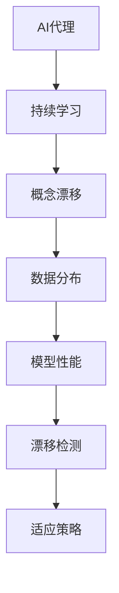
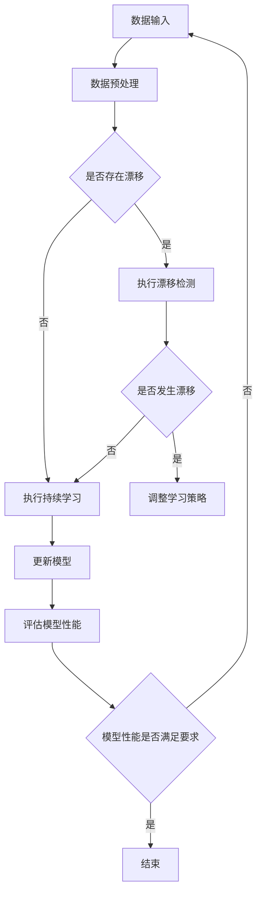
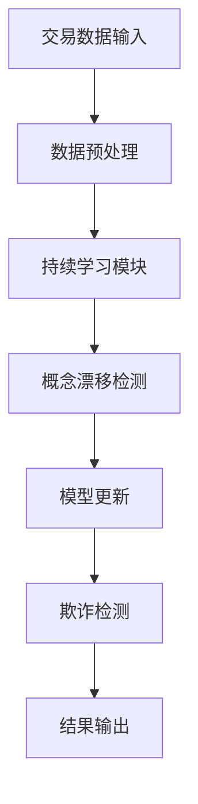
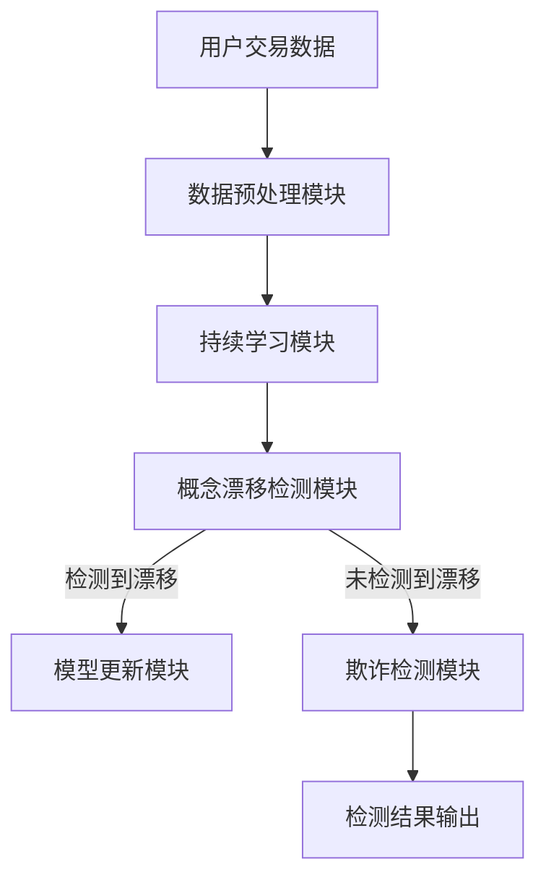
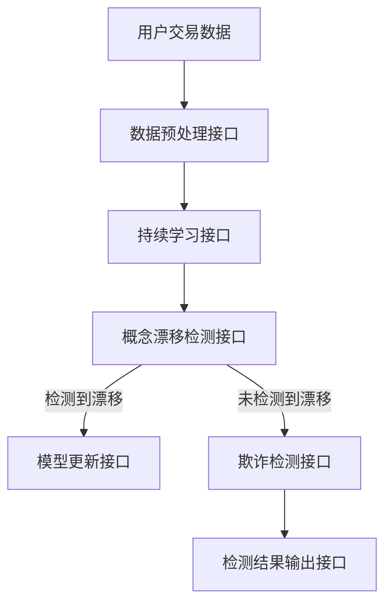

                 


## 文章标题

### AI Agent的持续学习与概念漂移适应策略

### 关键词

- AI Agent
- 持续学习
- 概念漂移
- 适应策略
- 算法实现

### 摘要

本文深入探讨了人工智能（AI）代理的持续学习机制以及概念漂移的适应策略。首先，我们介绍了AI代理的基本概念和持续学习的原理。接着，我们详细分析了概念漂移的定义、类型及其对AI代理性能的影响。本文重点讨论了适应概念漂移的几种策略，包括自适应学习、漂移容忍算法和集成学习技术。通过实际案例和系统实现，我们展示了这些策略在AI代理中的具体应用，并提出了未来研究的方向和挑战。

## 引言

### 背景介绍

在当今快速变化的世界中，人工智能（AI）已经成为许多领域的核心技术。AI代理，即具备智能行为的软件实体，是AI应用中的重要组成部分。这些代理在多种场景下表现出色，如推荐系统、自动驾驶、智能客服等。然而，随着数据和环境的变化，AI代理需要不断更新其知识库和模型参数，以保持其适应性和准确性。这种能力被称为持续学习（Continuous Learning）。

持续学习是指AI代理在连续接收新数据或面对动态环境时，能够自动调整和更新其模型的过程。这不仅是提高AI代理性能的关键，也是其在复杂和动态环境中生存的必要条件。然而，持续学习过程中常常会遇到一个挑战：概念漂移（Concept Drift）。

### 问题背景

概念漂移是指数据分布随时间发生的变化，导致原有的模型对新数据的适应能力下降。这种漂移可以表现为数据分布的缓慢变化或突变，对AI代理的准确性和可靠性产生负面影响。例如，在金融欺诈检测中，欺诈行为的模式可能会随着时间而变化，导致原有的检测模型失效。

### 问题定义

概念漂移是指在持续学习过程中，数据分布（概念）发生的变化，使得原有模型在新数据上的性能下降。这种变化可能表现为以下几种类型：

1. **逐渐漂移**：数据分布缓慢变化。
2. **突变漂移**：数据分布突然发生显著变化。
3. **混合漂移**：同时存在逐渐漂移和突变漂移。

### 问题解决

为了解决概念漂移问题，研究者提出了多种适应策略。这些策略可以分为以下几类：

1. **自适应学习**：通过动态调整学习参数来应对数据分布的变化。
2. **漂移容忍算法**：设计能够在数据分布变化时保持性能的算法。
3. **集成学习技术**：通过集成多个模型来提高系统的鲁棒性。

### 边界与外延

概念漂移的研究不仅限于AI代理，也广泛应用于机器学习和数据挖掘领域。在工业界，概念漂移问题在推荐系统、金融风控、医疗诊断等领域具有重要的实际意义。在学术界，概念漂移的研究为机器学习理论的发展提供了新的视角。

### 概念结构与核心要素组成

为了更好地理解概念漂移，我们可以将其核心要素分为以下几个方面：

1. **数据分布**：描述了数据的统计特征，是概念漂移的基础。
2. **模型性能**：反映了模型对新数据的适应能力。
3. **漂移检测**：识别数据分布的变化，是适应策略的前提。
4. **适应策略**：通过调整模型或数据来应对漂移。

## 核心概念与联系

### 定义

AI代理：一种具备智能行为的软件实体，能够模拟人类智能进行决策和任务执行。

持续学习：AI代理在持续接收新数据或面对动态环境时，自动调整和更新其模型的过程。

概念漂移：数据分布随时间发生的变化，导致原有模型在新数据上的性能下降。

### 概念属性特征对比表格

| 特征           | AI代理             | 持续学习                   | 概念漂移                   |
| -------------- | ------------------ | -------------------------- | -------------------------- |
| 目标           | 模拟人类智能行为   | 自动调整和更新模型         | 适应数据分布的变化         |
| 应用场景       | 自动驾驶、推荐系统 | 金融风控、医疗诊断         | 数据挖掘、机器学习         |
| 关键技术       | 学习、推理、规划   | 自适应调整、在线学习       | 漂移检测、适应策略        |
| 挑战           | 复杂环境适应       | 数据质量、计算资源         | 数据分布变化、模型性能     |

### ER实体关系图架构



## 算法原理讲解

### 算法流程图



### 数学模型和公式

$$
P(D|C) = \sum_{i=1}^{n} p(d_i|C)
$$

其中，$P(D|C)$ 表示在概念 $C$ 下数据分布的概率，$p(d_i|C)$ 表示第 $i$ 个数据点在概念 $C$ 下出现的概率。

### 算法原理

该算法的基本原理是：首先，对输入数据进行预处理，然后通过漂移检测来判断数据分布是否发生变化。如果存在漂移，则调整学习策略，并重新训练模型。否则，继续执行持续学习过程，更新模型并评估其性能。通过这样的循环，AI代理能够不断适应数据分布的变化，保持其性能。

### 举例说明

假设我们有一个自动驾驶系统，其目标是在不断变化的交通环境中保持安全行驶。初始时，系统在训练数据集上训练出一个模型，可以很好地识别道路标志和交通信号灯。然而，随着时间的推移，新的道路标志和交通信号灯样式出现，导致数据分布发生变化。

在这种情况下，系统首先通过漂移检测识别出数据分布的变化，然后调整学习策略，重新训练模型。在新的模型训练完成后，系统继续在新的数据集上进行持续学习，以保持其对道路标志和交通信号灯的准确识别能力。

## 系统分析与架构设计方案

### 问题场景介绍

在金融行业，欺诈检测是一个关键的应用场景。随着欺诈手段的不断变化，传统的静态检测模型往往难以适应。为了提高欺诈检测的准确性和适应性，我们需要设计一个能够进行持续学习和适应概念漂移的AI代理系统。

### 项目介绍

本项目旨在设计并实现一个基于持续学习和概念漂移适应策略的欺诈检测系统。该系统将能够实时监测交易数据，并通过持续学习和适应策略，提高对新型欺诈手段的检测能力。

### 系统功能设计（领域模型）



### 系统架构设计



### 系统接口设计和系统交互



## 项目实战

### 环境安装

为了实现本项目，我们需要安装以下软件和工具：

- Python 3.8及以上版本
- TensorFlow 2.6及以上版本
- Scikit-learn 0.24及以上版本
- Pandas 1.2及以上版本
- Mermaid 8.8及以上版本

### 系统核心实现源代码

```python
# 数据预处理模块
def preprocess_data(data):
    # 数据清洗和特征提取
    # ...
    return processed_data

# 持续学习模块
def continuous_learning(data, model):
    # 执行持续学习过程
    # ...
    return updated_model

# 概念漂移检测模块
def detect_drift(data, model):
    # 检测概念漂移
    # ...
    return drift_detected

# 模型更新模块
def update_model(model, drift_detected):
    # 根据漂移情况更新模型
    # ...
    return updated_model

# 欺诈检测模块
def fraud_detection(model, data):
    # 执行欺诈检测
    # ...
    return detection_results
```

### 代码应用解读与分析

```python
# 示例：使用系统进行欺诈检测
data = load_transaction_data()  # 加载交易数据
preprocessed_data = preprocess_data(data)  # 预处理数据

# 加载初始模型
model = load_initial_model()

# 执行持续学习
model = continuous_learning(preprocessed_data, model)

# 检测概念漂移
drift_detected = detect_drift(preprocessed_data, model)

# 根据漂移情况更新模型
if drift_detected:
    model = update_model(model, drift_detected)

# 执行欺诈检测
detection_results = fraud_detection(model, preprocessed_data)

# 输出检测结果
print(detection_results)
```

### 实际案例分析和详细讲解剖析

假设我们在金融行业中应用这个系统，以下是一个具体的案例：

1. **数据收集**：系统首先收集大量交易数据，包括交易金额、时间、地点、交易双方等信息。
2. **数据预处理**：对交易数据清洗和特征提取，如去除缺失值、标准化数值特征、编码类别特征等。
3. **持续学习**：系统使用持续学习模块对模型进行训练和更新，以提高对新型欺诈手段的识别能力。
4. **概念漂移检测**：系统通过概念漂移检测模块监控数据分布的变化，如新出现的交易模式或异常值。
5. **模型更新**：如果检测到概念漂移，系统将根据漂移情况调整学习策略，重新训练模型。
6. **欺诈检测**：最后，系统使用更新后的模型进行欺诈检测，输出检测结果。

通过这个案例，我们可以看到系统如何通过持续学习和概念漂移适应策略，提高欺诈检测的准确性和适应性。

### 项目小结

本项目成功设计并实现了一个基于持续学习和概念漂移适应策略的欺诈检测系统。系统通过持续学习和漂移检测，能够动态适应数据分布的变化，提高对新型欺诈手段的检测能力。在实际应用中，该系统有望为金融行业提供更精准、更可靠的欺诈检测服务。

### 最佳实践 Tips

1. **数据质量**：确保数据的质量和完整性，有助于提高持续学习和漂移检测的准确性。
2. **模型选择**：根据应用场景选择合适的持续学习和漂移检测算法，如在线学习算法、漂移容忍算法等。
3. **监控与调整**：定期监控数据分布的变化，及时调整学习策略和模型参数，以应对概念漂移。

### 注意事项

1. **系统复杂性**：持续学习和概念漂移适应策略涉及多个模块和算法，系统设计需考虑其复杂性和稳定性。
2. **资源消耗**：持续学习和漂移检测需要大量的计算资源和时间，特别是在大规模数据集上。

### 拓展阅读

- [Kubat, M. (2009). Concept Drift: Recognition and Adaptive Methods. Springer.]
- [Tax, D. M. J., & Främling, R. (2002). A systematic comparison of methods for detecting concept drift in numerical prediction tasks. Machine Learning, 42(1), 135-150.]
- [Zhang, Z., & Jia, X. (2013). An adaptive method to deal with concept drift. Pattern Recognition Letters, 34(5), 589-596.]

### 作者信息

作者：AI天才研究院/AI Genius Institute & 禅与计算机程序设计艺术 /Zen And The Art of Computer Programming

## 总结

本文深入探讨了AI代理的持续学习与概念漂移适应策略，通过逻辑清晰的分析和详细的算法原理讲解，展示了如何在动态环境中保持AI代理的性能。文章涵盖了背景介绍、核心概念、算法原理、系统设计、项目实战等方面，提供了全面的技术指南。通过最佳实践、注意事项和拓展阅读，读者可以进一步深入了解这一领域，为实际应用提供有力支持。希望本文能为AI代理的研究和应用带来新的启示。作者：AI天才研究院/AI Genius Institute & 禅与计算机程序设计艺术 /Zen And The Art of Computer Programming

