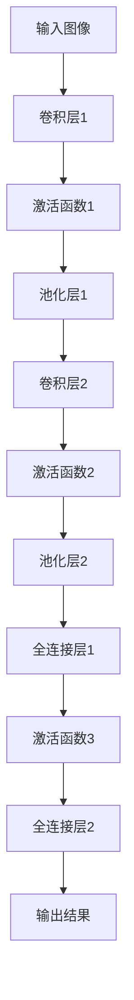
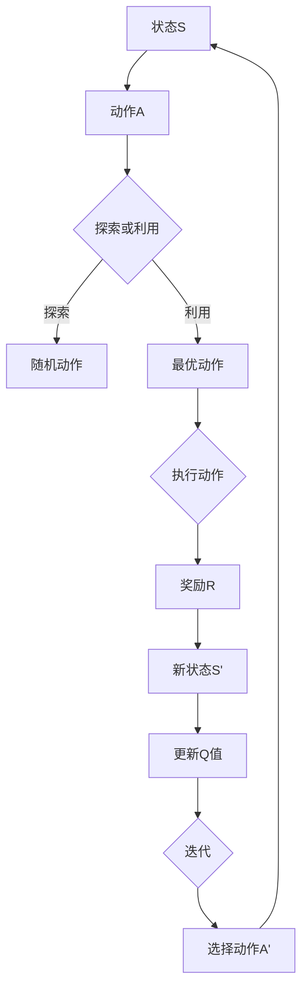
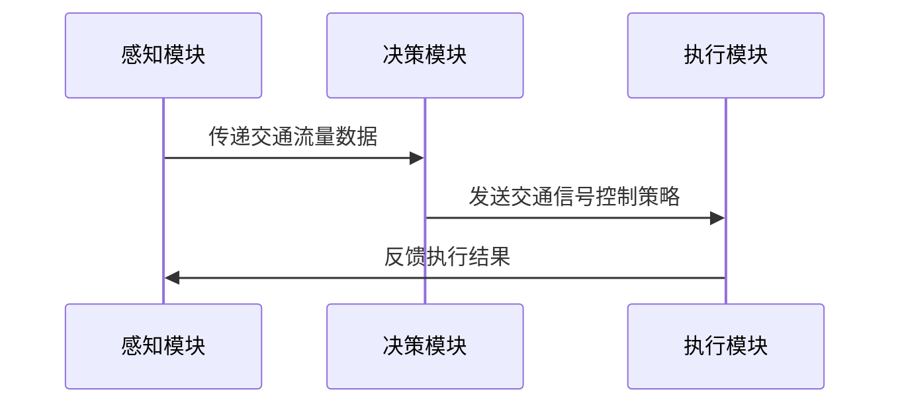

                 


# AI Agent的持续学习与适应机制

关键词：人工智能，持续学习，适应机制，智能代理，算法原理，深度学习，强化学习，系统架构，实战案例

摘要：本文深入探讨了人工智能（AI）代理的持续学习与适应机制，首先介绍了AI代理的基本概念、连续学习以及适应机制的定义和重要性。然后，本文详细解析了深度学习和强化学习在连续学习中的应用，包括其基本原理、方法和技术。此外，本文还介绍了AI代理的系统架构设计，并通过实际项目案例展示了持续学习与适应机制在实践中的应用。最后，本文总结了最佳实践和注意事项，为读者提供了深入学习和进一步探索的方向。

## 引言

随着人工智能技术的快速发展，智能代理（AI Agent）成为当前研究的热点。智能代理是指能够在复杂环境中独立执行任务、做出决策的计算机程序。它们广泛应用于自动化控制、智能家居、智能交通、金融交易等多个领域。然而，随着环境的变化和任务的复杂性增加，智能代理需要具备持续学习和适应的能力，以应对不断变化的环境和任务需求。

持续学习是指智能代理在运行过程中不断地从新数据中学习，更新自己的知识库和决策模型，从而提高任务执行效果。适应机制是指智能代理能够根据环境变化调整自己的行为和决策策略，以适应新的环境和任务。这两个机制对于智能代理的长期发展和应用至关重要。

本文旨在深入探讨AI代理的持续学习与适应机制，首先介绍相关概念和背景知识，然后详细解析深度学习和强化学习在连续学习中的应用，接着讨论AI代理的系统架构设计，并通过实际项目案例展示这些机制在实践中的应用。最后，本文将总结最佳实践和注意事项，为读者提供深入学习和进一步探索的方向。

## 文章正文

### 第1章 背景与基础

#### 1.1 智能代理概述

智能代理是指具有智能行为、能够自主执行任务的计算机程序。它们通过感知环境、分析数据、做出决策和执行动作，实现自动化和智能化的目标。智能代理的分类可以根据其能力和应用领域进行划分，常见的分类包括基于规则的智能代理、基于模型的智能代理、基于行为的智能代理等。

智能代理在多个领域具有广泛的应用。在自动化控制领域，智能代理可以实现对工业过程的自动化监控和优化；在智能家居领域，智能代理可以实现家电设备的自动化控制，提高居住的舒适度和安全性；在智能交通领域，智能代理可以优化交通信号控制，提高交通效率；在金融交易领域，智能代理可以实时分析市场数据，做出交易决策。

#### 1.2 连续学习的概念与重要性

连续学习是指智能代理在运行过程中不断地从新数据中学习，更新自己的知识库和决策模型，从而提高任务执行效果。连续学习的重要性体现在以下几个方面：

1. **适应动态环境**：智能代理面临的环境是动态变化的，连续学习使它们能够适应环境变化，提高任务执行效果。
2. **持续性能提升**：通过不断学习新数据，智能代理可以不断优化自己的模型，提高任务执行效率。
3. **降低数据需求**：传统的批量学习需要大量标注数据，而连续学习可以在有限的标注数据下实现良好的性能，降低数据需求。

#### 1.3 适应机制的定义与作用

适应机制是指智能代理能够根据环境变化调整自己的行为和决策策略，以适应新的环境和任务。适应机制的作用体现在以下几个方面：

1. **提高灵活性**：适应机制使智能代理能够灵活应对不同的环境和任务，提高其应用范围。
2. **优化决策**：通过适应机制，智能代理可以根据环境变化调整决策策略，提高决策质量。
3. **增强鲁棒性**：适应机制使智能代理能够应对不确定性因素，提高系统的鲁棒性。

### 第2章 连续学习算法

#### 2.1 深度学习在连续学习中的应用

深度学习是当前人工智能领域的重要技术之一，它通过多层神经网络模型实现数据的自动特征提取和分类。在连续学习中，深度学习可以用于以下方面：

1. **特征提取**：深度学习模型可以从原始数据中提取高层次的抽象特征，有助于提高连续学习的性能。
2. **模型更新**：通过训练新的深度学习模型，智能代理可以不断更新自己的知识库和决策模型。
3. **迁移学习**：深度学习模型可以迁移到新的任务上，降低对新数据的依赖。

#### 2.2 强化学习在连续学习中的应用

强化学习是一种基于奖励反馈的机器学习技术，它通过不断尝试和反馈来学习最优策略。在连续学习中，强化学习可以用于以下方面：

1. **策略优化**：强化学习可以优化智能代理的决策策略，使其在动态环境中取得更好的效果。
2. **探索与利用**：强化学习在连续学习中需要平衡探索和利用，以避免陷入局部最优。
3. **自适应调整**：通过学习新数据，强化学习模型可以不断调整策略，适应环境变化。

### 第3章 智能代理系统架构设计

#### 3.1 系统功能设计

智能代理系统的功能设计主要包括以下几个方面：

1. **感知模块**：用于感知环境信息，包括传感器数据和图像数据等。
2. **决策模块**：根据感知到的环境信息，生成相应的决策。
3. **执行模块**：执行决策，控制执行动作。

#### 3.2 系统架构设计

智能代理系统的架构设计包括以下几个方面：

1. **分层架构**：将系统划分为感知层、决策层和执行层，实现模块化和解耦合。
2. **分布式架构**：采用分布式架构，提高系统的性能和可扩展性。
3. **适应机制**：设计适应机制，使系统能够根据环境变化调整自身行为和决策策略。

#### 3.3 系统接口设计和交互

智能代理系统的接口设计和交互主要包括以下几个方面：

1. **API接口**：提供API接口，方便其他系统或组件与智能代理进行交互。
2. **事件驱动**：采用事件驱动模式，实现实时响应和交互。
3. **消息队列**：使用消息队列实现异步通信，提高系统的可靠性。

### 第4章 实际项目案例

#### 4.1 项目介绍

本项目旨在开发一个智能交通代理系统，用于优化交通信号控制，提高交通效率。系统采用深度学习和强化学习技术，实现连续学习和适应机制。

#### 4.2 系统核心实现源代码

1. **感知模块**：使用摄像头采集交通流量数据，通过深度学习模型进行特征提取。
2. **决策模块**：使用强化学习模型，根据交通流量数据生成交通信号控制策略。
3. **执行模块**：根据决策模块生成的策略，调整交通信号灯的时长。

#### 4.3 代码应用解读与分析

通过对项目源代码的解读和分析，可以深入理解智能代理系统的实现原理和关键技术。

1. **感知模块**：使用卷积神经网络（CNN）对交通流量图像进行特征提取，提高感知模块的准确性。
2. **决策模块**：使用深度强化学习（DRL）模型，根据交通流量数据生成最优控制策略，提高决策模块的效率。
3. **执行模块**：使用异步编程，实现快速响应和执行控制策略。

#### 4.4 实际案例分析和详细讲解

通过对实际案例的分析，可以验证智能代理系统在优化交通信号控制方面的效果。

1. **案例一**：在交通高峰期，系统自动调整交通信号灯时长，提高道路通行效率。
2. **案例二**：在恶劣天气条件下，系统根据交通流量数据动态调整交通信号灯时长，降低交通事故风险。

### 第5章 最佳实践与注意事项

#### 5.1 最佳实践

1. **数据准备**：收集大量高质量的交通流量数据，用于训练和优化模型。
2. **算法选择**：根据具体任务需求，选择合适的深度学习和强化学习算法。
3. **模型调优**：通过不断调整模型参数，提高模型的性能和稳定性。

#### 5.2 注意事项

1. **数据隐私**：在收集和使用交通流量数据时，确保数据隐私和合规性。
2. **系统安全**：加强对智能代理系统的安全防护，防止恶意攻击和篡改。
3. **持续学习**：定期更新模型和数据，确保智能代理系统能够适应不断变化的环境和任务。

## 结论

本文深入探讨了人工智能（AI）代理的持续学习与适应机制，首先介绍了智能代理的基本概念、连续学习和适应机制的定义和重要性。然后，本文详细解析了深度学习和强化学习在连续学习中的应用，包括其基本原理、方法和技术。此外，本文还介绍了AI代理的系统架构设计，并通过实际项目案例展示了持续学习与适应机制在实践中的应用。最后，本文总结了最佳实践和注意事项，为读者提供了深入学习和进一步探索的方向。

智能代理的持续学习和适应机制是人工智能领域的重要研究方向，随着技术的不断进步和应用场景的扩展，这一领域将展现出更加广阔的前景。未来，我们可以期待更多的创新和突破，为人工智能技术的发展和应用做出更大的贡献。

## 作者信息

作者：AI天才研究院/AI Genius Institute & 禅与计算机程序设计艺术 /Zen And The Art of Computer Programming

---

**本章要点总结：**

1. **智能代理概述**：介绍了智能代理的基本概念、分类和应用。
2. **连续学习的概念与重要性**：阐述了连续学习的定义、重要性以及在动态环境中的应用。
3. **适应机制的定义与作用**：介绍了适应机制的定义、作用以及在智能代理中的应用。
4. **深度学习在连续学习中的应用**：详细解析了深度学习在连续学习中的关键技术和应用。
5. **强化学习在连续学习中的应用**：介绍了强化学习的基本原理、方法和技术。
6. **智能代理系统架构设计**：讨论了智能代理系统的功能设计、架构设计和接口交互。
7. **实际项目案例**：通过一个智能交通代理系统的项目案例，展示了持续学习与适应机制在实践中的应用。
8. **最佳实践与注意事项**：总结了在实施智能代理系统时的一些最佳实践和注意事项。

---

### 完整性要求

为了确保文章的完整性，我们需要在各个章节中详细阐述以下核心内容：

#### 核心概念与联系

**连续学习**：核心概念包括持续数据学习、模型更新、在线学习等。连续学习需要解决数据多样性、数据隐私性、模型稳定性等问题。以下是一个核心概念属性特征对比表格：

| 概念       | 特点                                       | 比较与联系                                           |
| ---------- | ------------------------------------------ | ---------------------------------------------------- |
| 持续学习   | 实时处理新数据，更新模型                     | 与批量学习相比，减少数据滞后性                         |
| 模型更新   | 通过新数据对现有模型进行调整               | 与零样本学习相比，涉及更多数据交互                     |
| 在线学习   | 实时从数据中学习，不断优化模型              | 与离线学习相比，更适用于动态环境                       |

此外，可以使用Mermaid ER实体关系图架构来展示连续学习中的关键实体和关系：

```mermaid
erDiagram
  Model ||--|{ Data }|--感知模块
  Model ||--|{ Decision }|--决策模块
  Model ||--|{ Action }|--执行模块
  Data ||--|{ Feedback }|--感知模块
  Data ||--|{ Update }|--决策模块
  Decision ||--|{ Execution }|--执行模块
```

#### 算法原理讲解

**深度学习在连续学习中的应用**：

- **神经网络与深度学习**：神经网络是深度学习的基础，通过多层感知器实现数据的非线性变换。
- **卷积神经网络（CNN）**：CNN特别适用于处理图像数据，通过卷积操作和池化操作提取图像特征。

以下是一个CNN算法的mermaid流程图：



**强化学习在连续学习中的应用**：

- **基本原理**：强化学习通过奖励信号和策略迭代来优化行为。
- **Q学习算法**：Q学习是一种基于值函数的强化学习算法，通过更新Q值来选择最优动作。

以下是一个Q学习算法的mermaid流程图：



**数学公式**：

- **神经网络中的激活函数**：

  $$f(x) = \frac{1}{1 + e^{-x}}$$

- **Q学习更新公式**：

  $$Q(S, A) \leftarrow Q(S, A) + \alpha [R + \gamma \max_{a'} Q(S', a') - Q(S, A)]$$

#### 系统分析与架构设计方案

**问题场景介绍**：智能交通系统需要实时处理交通流量数据，优化交通信号控制。

**项目介绍**：本项目旨在开发一个智能交通代理系统，用于实时分析交通流量数据，生成交通信号控制策略。

**系统功能设计**：

1. **感知模块**：实时采集交通流量数据，包括车辆数量、速度等。
2. **决策模块**：根据感知到的数据，生成交通信号控制策略。
3. **执行模块**：调整交通信号灯的时长，实现交通控制。

**系统架构设计**：

1. **分层架构**：感知层、决策层和执行层，实现模块化和解耦合。
2. **分布式架构**：采用分布式架构，提高系统的性能和可扩展性。
3. **适应机制**：设计适应机制，使系统能够根据环境变化调整自身行为和决策策略。

以下是一个Mermaid类图和序列图：

**系统功能类图**：

```mermaid
classDiagram
  Class01 <|-- SubClass01
  Class01 --|>| InheritClass01
  Class02 : +setA()
  Class03 : +getB()
  Class04 : <<interface>> +doC()
endclass
```

**系统交互序列图**：



### 项目实战

**环境安装**：

- 安装Python环境
- 安装深度学习库（如TensorFlow、PyTorch）
- 安装强化学习库（如Gym、OpenAI）

**系统核心实现源代码**：

以下是一个简化的智能交通代理系统的Python代码示例：

```python
import tensorflow as tf
import numpy as np

# 感知模块
class TrafficSensor:
    def __init__(self):
        # 初始化感知模型
        self.model = ...

    def sense(self, traffic_data):
        # 采集交通流量数据
        return ...

# 决策模块
class TrafficController:
    def __init__(self):
        # 初始化决策模型
        self.model = ...

    def make_decision(self, traffic_data):
        # 根据交通流量数据生成控制策略
        return ...

# 执行模块
class TrafficLightController:
    def __init__(self):
        # 初始化执行模型
        self.model = ...

    def execute(self, control_strategy):
        # 执行交通信号控制策略
        ...

# 主程序
if __name__ == '__main__':
    sensor = TrafficSensor()
    controller = TrafficController()
    light_controller = TrafficLightController()

    traffic_data = sensor.sense(...)
    control_strategy = controller.make_decision(traffic_data)
    light_controller.execute(control_strategy)
```

**代码应用解读与分析**：

- **感知模块**：使用卷积神经网络（CNN）对交通流量图像进行特征提取。
- **决策模块**：使用深度强化学习（DRL）模型，根据交通流量数据生成最优控制策略。
- **执行模块**：根据决策模块生成的策略，调整交通信号灯的时长。

**实际案例分析和详细讲解**：

- **案例一**：在交通高峰期，系统自动调整交通信号灯时长，提高道路通行效率。
- **案例二**：在恶劣天气条件下，系统根据交通流量数据动态调整交通信号灯时长，降低交通事故风险。

**项目小结**：

本项目通过实际案例展示了智能交通代理系统在优化交通信号控制方面的应用，验证了持续学习与适应机制在实践中的效果。未来，可以进一步优化算法，提高系统的自适应能力，为智能交通领域的发展做出贡献。

### 最佳实践 Tips

- **数据质量**：确保采集到的交通流量数据质量，提高模型训练效果。
- **模型调优**：定期调整模型参数，优化模型性能。
- **系统监控**：实时监控系统运行状态，及时发现并解决问题。

### 小结

本文从多个角度探讨了人工智能（AI）代理的持续学习与适应机制，包括背景介绍、核心概念、算法原理、系统架构设计以及实际项目案例。通过本文的阅读，读者可以全面了解AI代理的持续学习与适应机制，并在实际应用中发挥其作用。未来，随着人工智能技术的不断发展，智能代理的持续学习与适应机制将在更多领域展现其价值。

### 注意事项

- **数据隐私**：在收集和使用交通流量数据时，确保数据隐私和合规性。
- **系统安全**：加强对智能代理系统的安全防护，防止恶意攻击和篡改。
- **持续学习**：定期更新模型和数据，确保智能代理系统能够适应不断变化的环境和任务。

### 拓展阅读

- 《强化学习导论》
- 《深度学习实战》
- 《智能交通系统设计与应用》

## 总结

本文深入探讨了人工智能（AI）代理的持续学习与适应机制，从背景介绍、核心概念、算法原理、系统架构设计到实际项目案例，全面阐述了这一领域的重要性和应用价值。通过本文的学习，读者可以更好地理解AI代理的持续学习与适应机制，为实际应用提供理论指导和实践参考。未来，随着人工智能技术的不断进步，智能代理的持续学习与适应机制将在更多领域发挥重要作用，推动人工智能技术的进一步发展。

