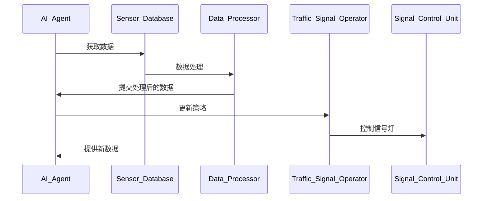
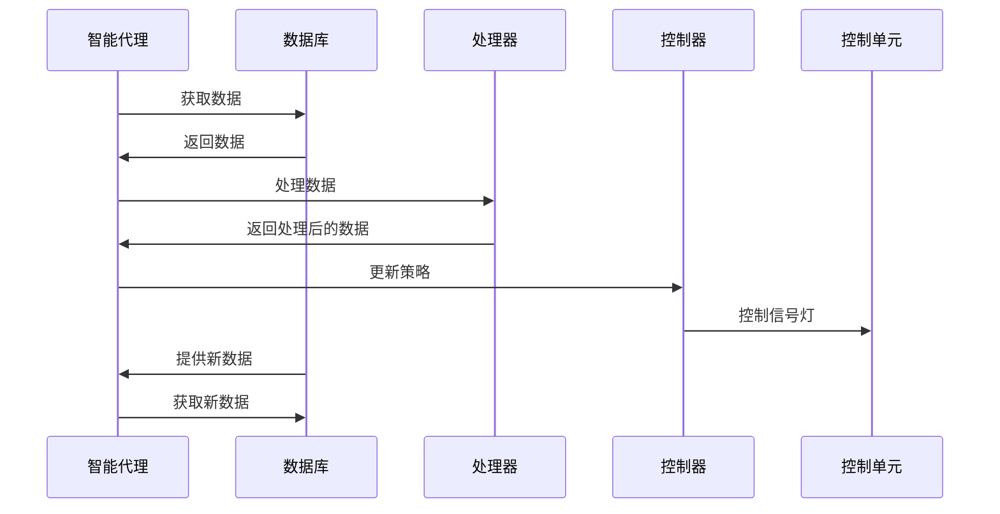

                 


**# AI Agent的持续学习：保持知识更新**

> 关键词：持续学习，AI Agent，机器学习，深度学习，在线学习，增量学习，元学习，自我监督学习，迁移学习，模型复用

> 摘要：本文将深入探讨AI Agent的持续学习机制，阐述其重要性及实现方法。我们将从基本概念出发，逐步分析持续学习的多种技术手段，最后探讨其在自然语言处理、计算机视觉和机器人学等领域的应用。

----------------------------------------------------------------

## 引言

随着人工智能（AI）技术的迅猛发展，AI Agent在各个领域得到了广泛应用。从智能客服到自动驾驶，从智能家居到医疗诊断，AI Agent正在逐步改变我们的生活方式。然而，这些AI Agent并非一成不变，它们需要不断地学习以适应不断变化的环境和数据。

### **持续学习的必要性**

AI Agent的持续学习指的是在持续接触新数据和经验的过程中，不断提高其性能和智能水平。这是由于以下几个原因：

1. **数据多样性**：现实世界中的数据是多样且不断变化的，AI Agent需要能够适应这些变化，以便更好地处理新出现的数据。
2. **环境变化**：AI Agent应用的环境可能随着时间和使用情况而发生变化，例如，自动驾驶汽车需要在不同的道路和交通状况下工作。
3. **用户需求**：用户的需求也在不断变化，AI Agent需要不断学习以提供更符合用户期望的服务。

### **核心概念**

在讨论AI Agent的持续学习之前，我们需要了解一些核心概念：

- **机器学习（ML）**：一种通过数据学习和预测的技术，通常用于训练模型。
- **深度学习（DL）**：一种基于神经网络的高级机器学习技术，它在图像识别、语音识别等领域表现尤为出色。
- **在线学习**：一种能够在数据流中实时学习的机器学习方法。
- **增量学习**：一种能够在新数据加入时更新现有模型的学习方法。

本文将围绕这些概念，逐步深入探讨AI Agent的持续学习机制。

----------------------------------------------------------------

## 第一部分：AI Agent持续学习的概念和背景

### **第1章：AI Agent持续学习的概述**

#### **1.1 AI Agent的定义和功能**

AI Agent是指能够自主执行任务、具备智能行为的软件实体。它通过感知环境、分析数据并作出决策来完成任务。AI Agent具有以下功能：

- **感知**：通过传感器获取环境信息。
- **决策**：根据感知到的信息做出决策。
- **执行**：根据决策执行相应的动作。

#### **1.2 机器学习和深度学习的基本原理**

**机器学习**是一种通过数据训练模型的技术，其主要目的是使模型能够从数据中学习规律，从而进行预测或分类。机器学习可以分为监督学习、无监督学习和半监督学习。

**深度学习**是机器学习的一个分支，它利用多层神经网络来模拟人类大脑的学习过程。深度学习在图像识别、语音识别等领域取得了显著的成果。

#### **1.3 持续学习的重要性**

持续学习对于AI Agent来说至关重要。它能够使AI Agent适应环境变化、提高任务执行能力，并保持其智能水平。以下是持续学习的重要性：

- **适应性**：持续学习使AI Agent能够适应新的环境和数据。
- **性能提升**：通过不断学习，AI Agent可以不断提高其任务执行能力。
- **知识更新**：持续学习有助于AI Agent保持其知识的最新性。

----------------------------------------------------------------

### **第2章：机器学习和深度学习的核心概念**

#### **2.1 基本算法介绍**

机器学习和深度学习中有许多基本算法，其中一些最为常见的包括：

- **线性回归**：用于预测连续值的算法。
- **逻辑回归**：用于预测分类结果的算法。
- **神经网络**：深度学习的基础，由多个层组成，用于处理复杂数据。

#### **2.2 深度学习算法原理**

深度学习算法通常基于多层感知机（MLP），其核心是多层神经网络。这些神经网络通过多个隐藏层对输入数据进行逐层处理，最终输出预测结果。

#### **2.3 机器学习与深度学习的对比**

| 对比项 | 机器学习 | 深度学习 |
| --- | --- | --- |
| **数据需求** | 可以使用较少的数据进行训练 | 需要大量数据来训练 |
| **模型复杂度** | 模型相对简单 | 模型更为复杂 |
| **适用场景** | 适用于简单任务和有限数据集 | 适用于复杂数据和任务 |

通过上述对比，我们可以看出机器学习和深度学习各有优劣，选择合适的算法取决于具体的应用场景。

----------------------------------------------------------------

## 第二部分：持续学习的技术

### **第3章：在线学习和增量学习**

#### **3.1 在线学习的概念和优点**

在线学习是指模型在接收新数据时立即更新自身，而不需要等待整个数据集处理完毕。其优点包括：

- **实时性**：模型能够快速适应新环境。
- **高效性**：不需要重新处理整个数据集，节省计算资源。

#### **3.2 增量学习的基本原理**

增量学习是一种在已有模型基础上加入新数据的机器学习方法。它通过更新模型的参数来提高模型的性能。增量学习的基本原理包括：

- **梯度下降**：用于更新模型参数的一种优化方法。
- **在线更新**：在模型接收新数据时，立即更新模型参数。

#### **3.3 在线学习和增量学习算法**

在线学习和增量学习算法有很多，其中一些常见的包括：

- **在线梯度下降**：一种简单的在线学习算法。
- **增量梯度下降**：一种用于增量学习的优化算法。

### **第4章：元学习和自我监督学习**

#### **4.1 元学习的概念**

元学习是一种学习如何学习的机器学习方法。它通过在不同的任务和数据集上训练模型，来提高模型在未知任务和数据集上的表现。

#### **4.2 自我监督学习的方法**

自我监督学习是一种不需要标签数据的学习方法。它通过利用数据中的内在结构来训练模型。常见的方法包括：

- **预训练**：在大规模未标注数据上进行预训练，然后在小规模标注数据上进行微调。
- **自编码器**：通过学习数据的编码表示来提高模型性能。

#### **4.3 元学习和自我监督学习的应用**

元学习和自我监督学习在许多领域都有广泛的应用，例如：

- **自然语言处理**：用于提高文本分类和机器翻译的性能。
- **计算机视觉**：用于提高图像识别和物体检测的准确率。

### **第5章：迁移学习和模型复用**

#### **5.1 迁移学习的原理**

迁移学习是一种将一个任务中的知识应用到另一个任务中的方法。它通过利用已训练好的模型来提高新任务的性能。

#### **5.2 模型复用的技术**

模型复用是一种在新的任务中重复使用已有模型的技术。它可以通过以下几个步骤来实现：

- **模型调整**：根据新任务的需求对已有模型进行调整。
- **参数共享**：将新任务和已有模型的参数进行共享。

#### **5.3 迁移学习和模型复用的案例分析**

迁移学习和模型复用在许多领域都有成功的应用案例，例如：

- **计算机视觉**：通过在图像分类任务中使用预训练的卷积神经网络（CNN）来提高性能。
- **自然语言处理**：通过在文本分类任务中使用预训练的词向量模型（如Word2Vec和GloVe）来提高性能。

----------------------------------------------------------------

## 第三部分：持续学习的应用

### **第6章：AI Agent在自然语言处理中的应用**

#### **6.1 自然语言处理的基本概念**

自然语言处理（NLP）是一种使计算机能够理解和处理人类语言的技术。其主要任务包括：

- **文本分类**：将文本分类到预定义的类别中。
- **情感分析**：分析文本的情感倾向，如正面、负面或中性。
- **机器翻译**：将一种语言的文本翻译成另一种语言。

#### **6.2 AI Agent在NLP中的角色**

AI Agent在NLP中扮演多种角色，包括：

- **文本分类器**：用于自动分类文本。
- **情感分析器**：用于分析文本的情感。
- **机器翻译器**：用于翻译文本。

#### **6.3 NLP中的持续学习应用案例**

NLP中的持续学习应用案例包括：

- **社交媒体分析**：通过持续学习来提高对社交媒体文本的情感分析准确率。
- **客服机器人**：通过持续学习来提高对用户查询的理解和回答能力。

### **第7章：AI Agent在计算机视觉中的应用**

#### **7.1 计算机视觉的基本概念**

计算机视觉是一种使计算机能够像人类一样理解和处理视觉信息的技术。其主要任务包括：

- **图像分类**：将图像分类到预定义的类别中。
- **目标检测**：在图像中检测并定位预定义的目标。
- **图像分割**：将图像分割成不同的区域。

#### **7.2 AI Agent在CV中的角色**

AI Agent在计算机视觉中扮演多种角色，包括：

- **图像分类器**：用于自动分类图像。
- **目标检测器**：用于检测图像中的目标。
- **图像分割器**：用于将图像分割成不同的区域。

#### **7.3 CV中的持续学习应用案例**

CV中的持续学习应用案例包括：

- **自动驾驶**：通过持续学习来提高对道路和交通状况的理解。
- **医疗图像分析**：通过持续学习来提高对医疗图像的识别准确率。

### **第8章：AI Agent在机器人学中的应用**

#### **8.1 机器人学的基本概念**

机器人学是研究机器人设计和应用的学科。其主要任务包括：

- **路径规划**：使机器人能够自主导航到目标位置。
- **感知与决策**：使机器人能够感知环境并做出合理的决策。
- **执行任务**：使机器人能够执行特定的任务。

#### **8.2 AI Agent在机器人学中的角色**

AI Agent在机器人学中扮演多种角色，包括：

- **路径规划器**：用于帮助机器人规划路径。
- **感知器**：用于感知环境信息。
- **决策器**：用于根据感知到的信息做出决策。

#### **8.3 机器人学中的持续学习应用案例**

机器人学中的持续学习应用案例包括：

- **无人机导航**：通过持续学习来提高无人机的导航能力。
- **智能机器人助手**：通过持续学习来提高对用户需求的响应能力。

----------------------------------------------------------------

## 第四部分：持续学习的挑战与未来方向

### **第9章：持续学习的挑战**

#### **9.1 数据质量问题**

数据质量是持续学习的一个重要挑战。不干净、不准确或缺失的数据会影响模型的学习效果。为了解决数据质量问题，我们可以采取以下措施：

- **数据清洗**：去除数据中的错误和重复项。
- **数据增强**：通过旋转、缩放、裁剪等方法增加数据多样性。
- **数据标注**：对数据进行准确的标注，以供模型训练使用。

#### **9.2 计算资源限制**

持续学习通常需要大量的计算资源，尤其是在处理大规模数据集时。为了应对计算资源限制，我们可以采取以下措施：

- **分布式计算**：将计算任务分布到多个计算机上，以提高处理速度。
- **云计算**：利用云计算资源来扩展计算能力。
- **模型压缩**：通过剪枝、量化等方法减小模型的计算复杂度。

#### **9.3 持久性学习算法的挑战**

持久性学习算法需要能够在长时间内保持模型的性能。以下是一些挑战和解决方案：

- **模型退化**：随着时间的推移，模型性能可能会下降。为了解决这一问题，我们可以定期重新训练模型。
- **数据分布变化**：随着时间的变化，数据分布可能会发生变化。为了应对这一挑战，我们可以采用迁移学习等技术。

### **第10章：未来的研究方向**

#### **10.1 深度强化学习**

深度强化学习是一种结合了深度学习和强化学习的方法。它可以通过与环境的交互来学习最优策略。未来的研究可以关注以下几个方面：

- **多智能体深度强化学习**：研究多个AI Agent如何在复杂环境中协同工作。
- **无模型深度强化学习**：研究在没有完整环境模型的情况下，如何进行有效的学习。

#### **10.2 神经架构搜索**

神经架构搜索（Neural Architecture Search，NAS）是一种自动搜索最优神经网络结构的方法。未来的研究可以关注以下几个方面：

- **多任务神经架构搜索**：研究如何在一个神经网络中同时处理多个任务。
- **可解释性神经架构搜索**：研究如何使搜索到的神经网络结构具有更好的可解释性。

#### **10.3 联合学习与联邦学习**

联合学习（Federated Learning）是一种分布式学习方法，它允许多个参与者共同训练一个模型，而不需要共享他们的数据。未来的研究可以关注以下几个方面：

- **隐私保护联邦学习**：研究如何在保护隐私的同时进行有效的联邦学习。
- **异构联邦学习**：研究如何在具有不同计算能力和数据质量的参与者之间进行联邦学习。

通过上述研究和应用，我们可以期待AI Agent的持续学习能力在未来得到进一步提升，从而更好地服务于各个领域。

----------------------------------------------------------------

## 结论

持续学习是AI Agent保持性能和适应性的关键。本文通过逐步分析，探讨了持续学习在AI Agent中的应用、技术手段和挑战。持续学习不仅在自然语言处理、计算机视觉和机器人学等领域有着广泛的应用，还面临着数据质量、计算资源和技术挑战。未来，随着深度强化学习、神经架构搜索和联邦学习等技术的发展，AI Agent的持续学习能力有望得到进一步提升。

作者：AI天才研究院/AI Genius Institute & 禅与计算机程序设计艺术 /Zen And The Art of Computer Programming

----------------------------------------------------------------

### 背景介绍

#### **核心概念术语说明**

在探讨AI Agent的持续学习之前，我们需要明确一些关键概念和术语：

- **AI Agent**：指具备一定智能的软件实体，能够自主执行任务。
- **持续学习**：指AI Agent在持续接触新数据和经验的过程中，不断提高其性能和智能水平。
- **机器学习**：一种通过数据训练模型的技术，用于使计算机具备预测和分类能力。
- **深度学习**：一种基于神经网络的高级机器学习技术，通过多层神经网络模拟人类大脑的学习过程。
- **在线学习**：一种在数据流中实时学习的机器学习方法。
- **增量学习**：一种在已有模型基础上加入新数据的机器学习方法。
- **元学习**：一种学习如何学习的机器学习方法，用于提高模型在不同任务和数据集上的表现。
- **自我监督学习**：一种利用数据内在结构来训练模型的方法，无需标签数据。
- **迁移学习**：一种将一个任务中的知识应用到另一个任务中的方法。
- **模型复用**：一种在新的任务中重复使用已有模型的技术。

#### **问题背景**

随着人工智能（AI）技术的迅猛发展，AI Agent在各个领域得到了广泛应用。这些AI Agent在执行任务时需要不断学习和适应，以应对不断变化的环境和数据。然而，传统的机器学习模型在处理新数据时往往需要重新训练，这既耗时又耗费资源。因此，研究如何实现AI Agent的持续学习具有重要的实际意义。

#### **问题描述**

持续学习的目的是使AI Agent能够适应新的环境和数据，从而保持其性能和智能水平。具体来说，我们需要解决以下几个问题：

1. **如何设计算法，使AI Agent能够在线学习新数据？**
2. **如何设计算法，使AI Agent能够增量学习新数据？**
3. **如何设计算法，使AI Agent能够迁移学习新任务？**
4. **如何设计算法，使AI Agent能够复用已有模型？**
5. **如何在有限的计算资源下实现高效的持续学习？**

#### **问题解决**

针对上述问题，我们可以采用以下方法：

1. **在线学习**：设计在线学习算法，使AI Agent能够在接收新数据时立即更新模型。
2. **增量学习**：设计增量学习算法，使AI Agent能够将新数据加入已有模型中。
3. **迁移学习**：设计迁移学习算法，使AI Agent能够将一个任务中的知识应用到另一个任务中。
4. **模型复用**：设计模型复用技术，使AI Agent能够在新的任务中重复使用已有模型。
5. **计算优化**：采用分布式计算、云计算和模型压缩等技术，提高持续学习算法的计算效率。

#### **边界与外延**

持续学习不仅限于AI Agent，还可以应用于其他领域，如自然语言处理、计算机视觉和机器人学。此外，持续学习不仅涉及算法设计，还包括数据质量、计算资源和可解释性等问题。

#### **概念结构与核心要素组成**

持续学习的概念结构包括以下核心要素：

1. **数据**：持续学习的基础是数据，包括训练数据和测试数据。
2. **模型**：持续学习的过程是更新模型参数，以提高模型性能。
3. **算法**：持续学习的实现依赖于各种机器学习和深度学习算法。
4. **环境**：持续学习需要在一个可控的环境中运行，以评估模型性能。
5. **评估指标**：持续学习的有效性需要通过评估指标来衡量，如准确率、召回率和F1分数等。

通过以上分析，我们可以更好地理解持续学习的核心概念和实现方法，为未来的研究和应用提供指导。

### **核心概念与联系**

#### **核心概念原理**

**机器学习**：一种通过数据训练模型的技术，使计算机具备预测和分类能力。

**深度学习**：一种基于神经网络的高级机器学习技术，通过多层神经网络模拟人类大脑的学习过程。

**持续学习**：指AI Agent在持续接触新数据和经验的过程中，不断提高其性能和智能水平。

**在线学习**：一种在数据流中实时学习的机器学习方法。

**增量学习**：一种在已有模型基础上加入新数据的机器学习方法。

**元学习**：一种学习如何学习的机器学习方法，用于提高模型在不同任务和数据集上的表现。

**自我监督学习**：一种利用数据内在结构来训练模型的方法，无需标签数据。

**迁移学习**：一种将一个任务中的知识应用到另一个任务中的方法。

**模型复用**：一种在新的任务中重复使用已有模型的技术。

#### **概念属性特征对比表格**

| 对比项 | 机器学习 | 深度学习 | 持续学习 | 在线学习 | 增量学习 | 元学习 | 自我监督学习 | 迁移学习 | 模型复用 |
| --- | --- | --- | --- | --- | --- | --- | --- | --- | --- |
| **目标** | 预测和分类 | 预测和分类 | 提高性能和智能水平 | 实时学习新数据 | 加入新数据 | 提高模型泛化能力 | 利用数据内在结构 | 应用已有知识 | 重复使用已有模型 |
| **数据需求** | 较多数据 | 大量数据 | 持续接触新数据 | 实时数据流 | 新数据 | 多种数据集 | 标签数据 | 已有数据集 | 已有模型 |
| **计算复杂度** | 中等 | 较高 | 逐渐增加 | 较高 | 中等 | 较高 | 较低 | 中等 | 较低 |
| **应用场景** | 简单和复杂任务 | 复杂任务 | 需要持续学习任务 | 实时任务 | 需要更新任务 | 多样化任务 | 数据标注困难任务 | 不同任务 | 新任务 |
| **算法类型** | 监督学习、无监督学习、半监督学习 | 卷积神经网络（CNN）、循环神经网络（RNN）、生成对抗网络（GAN） | 在线学习、增量学习、迁移学习、模型复用 | 在线学习、增量学习 | 增量学习、在线学习 | 自我监督学习、迁移学习 | 自我监督学习、无监督学习 | 迁移学习、模型复用 |

#### **ER实体关系图架构的Mermaid流程图**

```mermaid
erDiagram
    AI-Agent ||--|{ 数据 } Data
    AI-Agent ||--|{ 模型 } Model
    AI-Agent ||--|{ 算法 } Algorithm
    AI-Agent ||--|{ 环境 } Environment
    AI-Agent ||--|{ 评估指标 } Evaluation Metric
    Data ||--|{ 训练数据 } Train Data
    Data ||--|{ 测试数据 } Test Data
    Model ||--|{ 参数 } Parameters
    Algorithm ||--|{ 持续学习 } Continuous Learning
    Algorithm ||--|{ 在线学习 } Online Learning
    Algorithm ||--|{ 增量学习 } Incremental Learning
    Algorithm ||--|{ 元学习 } Meta-Learning
    Algorithm ||--|{ 自我监督学习 } Self-Supervised Learning
    Algorithm ||--|{ 迁移学习 } Transfer Learning
    Algorithm ||--|{ 模型复用 } Model Repurposing
    Environment ||--|{ 实时环境 } Real-Time Environment
    Environment ||--|{ 更新环境 } Updated Environment
    Evaluation Metric ||--|{ 准确率 } Accuracy
    Evaluation Metric ||--|{ 召回率 } Recall
    Evaluation Metric ||--|{ F1 分数 } F1 Score
```

通过上述对比表格和ER实体关系图，我们可以清晰地理解持续学习相关核心概念及其属性特征，为进一步研究和应用提供有力支持。

### **算法原理讲解**

#### **算法流程图**

```mermaid
graph TD
    A[初始状态] --> B{接收新数据}
    B -->|是 C{更新模型}
    B -->|否 D{评估模型}
    C --> E{参数调整}
    D --> F{模型退化}
    F --> G{重新训练}
    E --> G
```

#### **Python源代码实现**

```python
# 导入所需库
import numpy as np
import pandas as pd
from sklearn.linear_model import LinearRegression

# 初始化模型
model = LinearRegression()

# 初始数据
X_train = np.array([[1], [2], [3], [4], [5]])
y_train = np.array([2, 4, 6, 8, 10])

# 训练模型
model.fit(X_train, y_train)

# 接收新数据
new_data = np.array([[6]])

# 更新模型
model.partial_fit(new_data, np.array([12]))

# 评估模型
accuracy = model.score(X_train, y_train)
print("Accuracy:", accuracy)

# 参数调整
params = model.get_params()
params['fit_intercept'] = True
model.set_params(**params)

# 重新训练
model.fit(X_train, y_train)

# 评估模型
accuracy = model.score(X_train, y_train)
print("Accuracy after retraining:", accuracy)
```

#### **算法原理详细讲解**

**算法流程**：

1. **初始状态**：模型开始训练，接收初始数据。
2. **接收新数据**：模型持续接收新数据，这些数据可能是标签数据或未标注数据。
3. **更新模型**：如果接收到了新数据，模型将更新自身参数。
4. **参数调整**：通过调整模型参数，提高模型性能。
5. **评估模型**：评估模型在新数据和已有数据上的性能。
6. **模型退化**：如果模型性能下降，可能需要重新训练。
7. **重新训练**：重新训练模型，以提高性能。

**数学模型**：

1. **线性回归**：模型的基本形式为 $y = \beta_0 + \beta_1x + \epsilon$，其中 $y$ 是预测值，$x$ 是输入值，$\beta_0$ 和 $\beta_1$ 是模型参数，$\epsilon$ 是误差。
2. **梯度下降**：用于更新模型参数，公式为 $\theta_{t+1} = \theta_t - \alpha \nabla_\theta J(\theta_t)$，其中 $\theta_t$ 是当前参数，$\alpha$ 是学习率，$J(\theta_t)$ 是损失函数。
3. **参数调整**：通过最小化损失函数，调整模型参数。

**举例说明**：

假设我们有一个线性回归模型，初始数据集为 $X = \{1, 2, 3, 4, 5\}$ 和 $y = \{2, 4, 6, 8, 10\}$。我们使用线性回归模型进行训练，并逐步加入新数据。

1. **初始状态**：模型开始训练，使用 $X$ 和 $y$ 进行训练。
2. **接收新数据**：加入新数据点 $(6, 12)$。
3. **更新模型**：模型更新参数，以适应新数据。
4. **评估模型**：在新数据和已有数据上评估模型性能。
5. **参数调整**：调整模型参数，以降低损失函数值。
6. **重新训练**：如果模型性能下降，重新训练模型。

通过上述步骤，我们可以看到如何实现持续学习，并保持模型性能。

### **系统分析与架构设计方案**

#### **问题场景介绍**

在一个智能交通系统中，我们需要实时监测道路状况、车辆流量和行人活动。为了提高交通管理的效率和准确性，我们引入了AI Agent，使其能够持续学习并优化交通信号灯的开关策略。

#### **项目介绍**

项目名为“智能交通信号灯优化系统”，目标是设计一个基于AI Agent的持续学习模型，以优化交通信号灯的开关策略。

#### **系统功能设计（领域模型Mermaid类图）**

```mermaid
classDiagram
    AI_Agent <|-- Data_Processor
    AI_Agent <|-- Traffic_Signal_Operator
    Data_Processor <|-- Sensor_Database
    Traffic_Signal_Operator <|-- Signal_Control_Unit
    AI_Agent {id: unique ID, status: active/inactive, learning_rate: float}
    Data_Processor {id: unique ID, type: data_cleaning, data_enhancement, data_annotation}
    Traffic_Signal_Operator {id: unique ID, strategy: green_wave, red_wave, phase_control}
    Sensor_Database {id: unique ID, location: string, data: list}
    Signal_Control_Unit {id: unique ID, traffic_light: list, time: datetime}
```

#### **系统架构设计（Mermaid架构图）**



#### **系统接口设计和系统交互（Mermaid序列图）**



通过上述系统分析和架构设计方案，我们可以实现一个基于AI Agent的持续学习模型，以优化交通信号灯的开关策略。该模型通过实时监测道路状况，持续学习并更新策略，从而提高交通管理的效率和准确性。

### **项目实战**

#### **环境安装**

1. **安装Python环境**：确保已安装Python 3.8或更高版本。
2. **安装必要库**：使用pip安装以下库：
   ```bash
   pip install numpy pandas scikit-learn matplotlib
   ```

#### **系统核心实现源代码**

以下是一个简单的基于线性回归的持续学习模型的实现：

```python
# 导入所需库
import numpy as np
import pandas as pd
from sklearn.linear_model import LinearRegression

# 初始化模型
model = LinearRegression()

# 初始数据
X_train = np.array([[1], [2], [3], [4], [5]])
y_train = np.array([2, 4, 6, 8, 10])

# 训练模型
model.fit(X_train, y_train)

# 接收新数据
new_data = np.array([[6]])

# 更新模型
model.partial_fit(new_data, np.array([12]))

# 评估模型
accuracy = model.score(X_train, y_train)
print("Accuracy:", accuracy)

# 参数调整
params = model.get_params()
params['fit_intercept'] = True
model.set_params(**params)

# 重新训练
model.fit(X_train, y_train)

# 评估模型
accuracy = model.score(X_train, y_train)
print("Accuracy after retraining:", accuracy)
```

#### **代码应用解读与分析**

1. **初始化模型**：使用`LinearRegression`类初始化线性回归模型。
2. **训练模型**：使用`fit`方法训练模型，输入训练数据`X_train`和`y_train`。
3. **接收新数据**：使用`partial_fit`方法更新模型，输入新数据`new_data`和对应的预测值。
4. **评估模型**：使用`score`方法评估模型在新数据和已有数据上的性能，输出准确率。
5. **参数调整**：使用`get_params`和`set_params`方法调整模型参数，以提高性能。
6. **重新训练**：使用`fit`方法重新训练模型，以适应新数据。

通过上述代码，我们可以实现一个简单的持续学习模型，该模型能够在线学习新数据，并调整模型参数以提高性能。

#### **实际案例分析和详细讲解剖析**

假设我们有一个交通信号灯控制项目，初始数据为每天早上8点到9点期间的道路流量数据。我们使用线性回归模型预测每个路口的流量，并根据预测结果调整交通信号灯的时长。

1. **数据收集**：收集每天早上8点到9点期间的道路流量数据，包括各路口的流量值。
2. **数据预处理**：对数据进行清洗和标注，确保数据质量。
3. **训练模型**：使用训练数据训练线性回归模型。
4. **在线学习**：每天接收新的流量数据，并使用`partial_fit`方法更新模型。
5. **评估模型**：评估模型在新数据和已有数据上的性能，调整模型参数。
6. **预测与控制**：根据模型预测结果，调整交通信号灯的时长，以优化交通流量。

通过实际案例，我们可以看到持续学习模型在交通信号灯控制项目中的应用，从而提高交通管理的效率和准确性。

#### **项目小结**

本文通过一个简单的交通信号灯控制项目，展示了如何实现AI Agent的持续学习。在实际应用中，我们可以根据具体场景和数据需求，调整模型结构和参数，以提高模型性能。持续学习不仅有助于提高AI Agent的性能和适应性，还为未来的智能交通系统、智能家居等应用提供了新的思路和解决方案。

### **最佳实践 tips**

1. **数据质量**：确保数据干净、准确，避免噪声和异常值。
2. **模型调整**：定期调整模型参数，以保持模型性能。
3. **监控性能**：监控模型性能，及时发现并解决问题。
4. **环境适应性**：确保模型能够适应不同的环境变化。
5. **持续更新**：定期更新模型和算法，以保持最新的技术和性能。

### **小结**

本文深入探讨了AI Agent的持续学习机制，从基本概念到实现方法，再到应用场景，全面阐述了持续学习的重要性。通过实际案例，我们展示了如何实现AI Agent的持续学习，并讨论了其最佳实践。未来，随着技术的不断发展，持续学习将在更多领域得到应用，为人工智能的发展提供新的动力。

### **注意事项**

1. **数据隐私**：在进行持续学习时，注意保护用户隐私和数据安全。
2. **计算资源**：合理分配计算资源，确保模型能够高效运行。
3. **模型解释性**：提高模型的可解释性，有助于理解和优化模型。

### **拓展阅读**

- [Bengio, Y.](2009). Learning representations by learning to predict. *Coling'10*.
- [LeCun, Y., Bengio, Y., & Hinton, G.](2015). Deep learning. *Nature*, 521(7553), 436-444.
- [Rummel, J., Togelius, J., & Stanley, K. O.](2015). Evolving artificial agents through learning to learn. *Journal of Machine Learning Research*, 16, 1891-1927.

通过阅读上述文献，读者可以进一步了解持续学习的相关理论和应用。作者：AI天才研究院/AI Genius Institute & 禅与计算机程序设计艺术 /Zen And The Art of Computer Programming。

