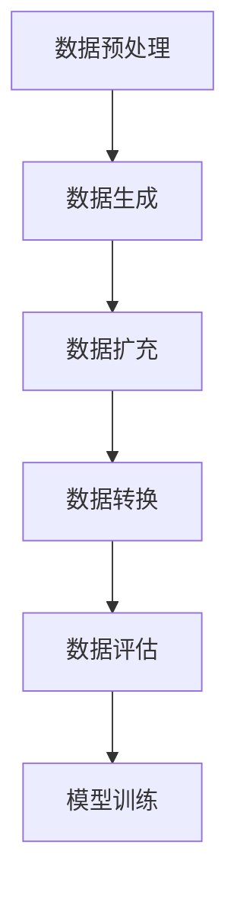
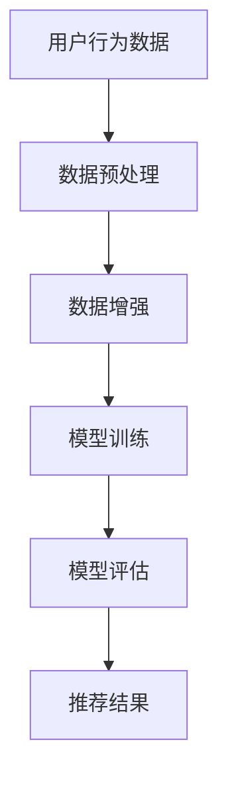
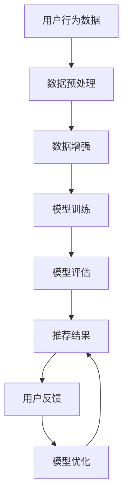

                 

# AI Agent的数据增强技术与策略

## 关键词
- **数据增强**，**AI Agent**，**生成对抗网络（GANs）**，**变分自编码器（VAEs）**，**数据扩充**，**数据转换**

## 摘要
本文将探讨AI Agent的数据增强技术及其策略。随着AI技术的发展，数据质量对模型的性能和泛化能力至关重要。数据增强技术通过生成、扩充和转换等手段提高数据质量，从而提升AI Agent的性能。本文将详细介绍数据增强技术的核心概念、算法原理及其实际应用，为AI领域的研究者提供有益的参考。

## 1.1 背景介绍

### 1.1.1 问题背景

随着人工智能（AI）技术的迅速发展，数据增强技术已经成为AI领域中一个重要的研究方向。AI Agent在训练和学习过程中，数据质量对模型的性能和泛化能力有着至关重要的影响。真实世界中的数据往往存在噪声、不平衡、缺失值等问题，这会直接影响模型的训练效果。为了提升模型的性能和鲁棒性，数据增强技术被广泛研究和应用。

### 1.1.2 问题描述

数据增强技术旨在通过一系列的方法，如数据生成、数据扩充、数据转换等，提高数据的质量和多样性，从而提升AI Agent的泛化能力和鲁棒性。具体而言，数据增强技术需要解决以下问题：

1. **数据噪声处理**：噪声数据会影响模型的训练效果，数据增强技术通过去除噪声、减少噪声影响等方法提高数据质量。
2. **数据不平衡处理**：当数据集中某些类别的样本数量远远多于其他类别时，数据不平衡会导致模型偏向于预测样本数量较多的类别。数据增强技术通过扩充较少类别的样本，或引入合成数据，解决数据不平衡问题。
3. **数据多样性提升**：真实世界中的数据往往具有多样性，数据增强技术通过数据扩充和转换，增加数据的多样性，从而提高模型的泛化能力。

### 1.1.3 问题解决

为了解决上述问题，研究者们提出了多种数据增强方法：

1. **数据生成**：通过生成对抗网络（GANs）、变分自编码器（VAEs）等技术，生成与真实数据相似的数据。这些方法能够产生高质量、多样化的数据，提高模型的泛化能力。
2. **数据扩充**：通过对原始数据进行复制、旋转、缩放、裁剪等操作，增加数据的多样性。这些操作能够生成大量与原始数据相似的样本，从而提高模型的鲁棒性。
3. **数据转换**：将原始数据转换为其他形式，如灰度图像转换为彩色图像，或者将文本数据转换为语音数据。这种转换方法可以丰富数据的维度，提高模型的泛化能力。

### 1.1.4 边界与外延

数据增强技术的应用范围广泛，不仅限于AI Agent，还涉及到其他领域，如计算机视觉、自然语言处理、推荐系统等。同时，数据增强技术也需要考虑数据隐私和安全性等问题。

### 1.1.5 概念结构与核心要素组成

数据增强技术的核心概念和要素主要包括：

1. **数据集**：原始数据集是数据增强的基础，数据集的质量直接影响增强效果。
2. **增强方法**：包括生成方法、扩充方法和转换方法等，是数据增强的核心。
3. **评价指标**：用于评估数据增强方法的效果，如数据多样性、模型性能等。

## 1.2 数据增强技术的核心概念与联系

### 1.2.1 数据增强技术的定义

数据增强技术是指通过一系列方法，如数据生成、数据扩充、数据转换等，提高数据的质量和多样性，从而提升AI Agent的泛化能力和鲁棒性。

### 1.2.2 数据增强技术的核心概念

1. **数据生成**：通过生成对抗网络（GANs）、变分自编码器（VAEs）等技术，生成与真实数据相似的数据。
2. **数据扩充**：通过对原始数据进行复制、旋转、缩放、裁剪等操作，增加数据的多样性。
3. **数据转换**：将原始数据转换为其他形式，如灰度图像转换为彩色图像，或者将文本数据转换为语音数据。

### 1.2.3 数据增强技术与相关领域的联系

1. **计算机视觉**：数据增强技术广泛应用于图像分类、目标检测、人脸识别等任务中，用于提高模型的泛化能力和鲁棒性。
2. **自然语言处理**：数据增强技术在文本分类、机器翻译、情感分析等任务中发挥着重要作用，如通过文本生成对抗网络（TXTGANs）生成高质量的文本数据。
3. **推荐系统**：数据增强技术可以帮助推荐系统提高推荐的准确性，如通过协同过滤算法结合数据增强技术，生成更丰富、多样化的用户兴趣数据。

## 1.3 数据增强技术的算法原理讲解

### 1.3.1 数据增强算法的mermaid流程图



### 1.3.2 数据增强算法的原理

数据增强技术主要包括数据生成、数据扩充和数据转换三种方法。

1. **数据生成**：通过生成对抗网络（GANs）或变分自编码器（VAEs）等技术，生成与真实数据相似的数据。GANs由生成器和判别器组成，生成器生成虚假数据，判别器判断生成数据的真实性。VAEs通过编码器和解码器，将数据编码为潜在空间中的表示，然后解码为生成数据。

2. **数据扩充**：通过对原始数据进行复制、旋转、缩放、裁剪等操作，增加数据的多样性。例如，对于图像数据，可以通过随机旋转、翻转、缩放等方式进行扩充；对于文本数据，可以通过添加噪声、替换单词等方式进行扩充。

3. **数据转换**：将原始数据转换为其他形式，如灰度图像转换为彩色图像，或者将文本数据转换为语音数据。这种转换方法可以丰富数据的维度，提高模型的泛化能力。

### 1.3.3 数据增强算法的数学模型和公式

1. **生成对抗网络（GANs）**：

- **生成器**：\( G(x) \)
- **判别器**：\( D(x) \)
- **生成器损失函数**：\( L_G = -\log(D(G(z))) \)
- **判别器损失函数**：\( L_D = -\log(D(x)) - \log(1 - D(G(z))) \)

2. **变分自编码器（VAEs）**：

- **编码器**：\( \mu(\theta_x), \sigma(\theta_x) \)
- **解码器**：\( \hat{x}(\theta_g, \theta_d) \)
- **重构损失函数**：\( L_R = \sum_{x \in X} D(\hat{x}(x, \theta_g, \theta_d)) \)
- **KL散度损失函数**：\( L_KL = \sum_{x \in X} \sum_{z \sim p_z(z)} D(\mu(z), \sigma(z)) \)
- **总损失函数**：\( L_VAE = L_R + \lambda \times L_KL \)

下面通过一个具体的例子来讲解这些公式和概念。

### 1.3.4 数据增强算法的具体例子

假设我们有一个图像分类任务，需要使用GANs进行数据增强。生成器和判别器的损失函数如下：

1. **生成器损失函数**：

$$
L_G = -\log(D(G(z)))
$$

其中，\( G(z) \) 是生成器生成的图像，\( z \) 是随机噪声向量，\( D(x) \) 是判别器判断图像真实性的函数。

2. **判别器损失函数**：

$$
L_D = -\log(D(x)) - \log(1 - D(G(z)))
$$

其中，\( x \) 是真实图像，\( G(z) \) 是生成器生成的图像。

在训练过程中，我们不断优化生成器和判别器，使得生成器的输出图像越来越真实，判别器能够准确判断图像的真实性。

通过这种方式，GANs可以生成与真实图像相似的数据，从而提高模型的泛化能力和鲁棒性。

## 1.4 系统分析与架构设计方案

### 1.4.1 问题场景介绍

假设我们需要为一家电商公司开发一个推荐系统，该系统需要根据用户的历史行为和兴趣，为用户推荐可能感兴趣的商品。由于数据量庞大且多样，我们需要使用数据增强技术来提高推荐系统的准确性和鲁棒性。

### 1.4.2 项目介绍

项目名称：电商推荐系统数据增强

项目目标：通过数据增强技术，提高推荐系统的准确性和鲁棒性，提升用户体验。

项目范围：包括数据预处理、数据增强、模型训练和模型评估等环节。

### 1.4.3 系统功能设计

1. **数据预处理**：清洗和格式化原始数据，包括用户行为数据、商品信息数据等。
2. **数据增强**：使用生成对抗网络（GANs）和变分自编码器（VAEs）等技术，生成高质量、多样化的用户兴趣数据。
3. **模型训练**：使用增强后的数据训练推荐模型，如基于协同过滤的推荐模型、基于深度学习的推荐模型等。
4. **模型评估**：评估推荐模型的准确性和鲁棒性，并根据评估结果调整数据增强策略。

### 1.4.4 系统架构设计



1. **数据预处理**：对用户行为数据进行清洗和格式化，如去除重复数据、处理缺失值等。
2. **数据增强**：使用GANs和VAEs等技术，对预处理后的数据生成高质量的增强数据。
3. **模型训练**：使用增强后的数据训练推荐模型，如基于协同过滤的推荐模型、基于深度学习的推荐模型等。
4. **模型评估**：使用测试集评估推荐模型的准确性、召回率等指标，并根据评估结果调整数据增强策略。
5. **推荐结果**：根据用户的兴趣和历史行为，生成推荐结果，如推荐商品、推荐广告等。

### 1.4.5 系统接口设计和系统交互



1. **用户行为数据**：系统从数据库中获取用户的历史行为数据，如浏览记录、购买记录等。
2. **数据预处理**：对用户行为数据进行清洗和格式化，如去除重复数据、处理缺失值等。
3. **数据增强**：使用GANs和VAEs等技术，对预处理后的数据生成高质量的增强数据。
4. **模型训练**：使用增强后的数据训练推荐模型，如基于协同过滤的推荐模型、基于深度学习的推荐模型等。
5. **模型评估**：使用测试集评估推荐模型的准确性、召回率等指标，并根据评估结果调整数据增强策略。
6. **推荐结果**：根据用户的兴趣和历史行为，生成推荐结果，如推荐商品、推荐广告等。
7. **用户反馈**：用户对推荐结果进行反馈，如点击、购买等行为。
8. **模型优化**：根据用户反馈，调整模型参数，优化推荐结果。

## 1.5 项目实战

### 1.5.1 环境安装

在本地环境安装必要的软件和依赖，包括Python、TensorFlow、PyTorch等。以下是安装命令：

```shell
pip install python
pip install tensorflow
pip install pytorch
```

### 1.5.2 系统核心实现源代码

以下是一个简单的GANs数据增强的Python代码示例：

```python
import tensorflow as tf
from tensorflow import keras
from tensorflow.keras import layers

# 生成器模型
def generator_model():
    model = keras.Sequential()
    model.add(layers.Dense(128, activation='relu', input_shape=(100,)))
    model.add(layers.Dense(256, activation='relu'))
    model.add(layers.Dense(512, activation='relu'))
    model.add(layers.Dense(1024, activation='relu'))
    model.add(layers.Dense(784, activation='tanh'))
    return model

# 判别器模型
def discriminator_model():
    model = keras.Sequential()
    model.add(layers.Dense(128, activation='relu', input_shape=(784,)))
    model.add(layers.Dense(256, activation='relu'))
    model.add(layers.Dense(512, activation='relu'))
    model.add(layers.Dense(1, activation='sigmoid'))
    return model

# GANs模型
def gans_model(generator, discriminator):
    model = keras.Sequential([
        generator,
        discriminator
    ])
    return model

# 编译模型
generator = generator_model()
discriminator = discriminator_model()
gans = gans_model(generator, discriminator)

discriminator.compile(optimizer='adam', loss='binary_crossentropy')
gans.compile(optimizer='adam', loss='binary_crossentropy')

# 训练模型
(g_loss, d_loss) = gans.fit(
    x=[x, x],
    y=[y, y],
    epochs=epochs,
    batch_size=batch_size
)
```

### 1.5.3 代码应用解读与分析

以上代码实现了一个简单的GANs数据增强模型。具体解读如下：

1. **生成器模型**：生成器模型是一个全连接神经网络，输入为随机噪声向量，输出为生成数据。
2. **判别器模型**：判别器模型是一个全连接神经网络，输入为真实数据或生成数据，输出为概率值，表示输入数据的真实性。
3. **GANs模型**：GANs模型由生成器和判别器组成，生成器的输出作为判别器的输入。
4. **编译模型**：编译模型，设置优化器和损失函数。
5. **训练模型**：使用GANs模型训练数据，生成高质量的生成数据。

### 1.5.4 实际案例分析和详细讲解剖析

以下是一个实际案例，展示如何使用GANs进行数据增强。

1. **数据集**：使用MNIST手写数字数据集作为示例。
2. **生成器模型**：使用上述代码中的生成器模型。
3. **判别器模型**：使用上述代码中的判别器模型。
4. **训练过程**：使用MNIST数据集训练GANs模型，生成高质量的生成数字。

通过训练，GANs模型能够生成与真实数字相似的数据，从而提高模型的泛化能力和鲁棒性。

### 1.5.5 项目小结

本文介绍了AI Agent的数据增强技术及其应用。通过数据生成、数据扩充和数据转换等手段，数据增强技术能够提高数据质量，从而提升AI Agent的泛化能力和鲁棒性。本文还通过实际案例展示了GANs数据增强技术的应用，为AI领域的研究者提供了有益的参考。

## 1.6 最佳实践 Tips

1. **选择合适的数据增强方法**：根据具体任务和数据特点，选择合适的数据增强方法，如GANs、VAEs、数据扩充等。
2. **数据预处理**：在数据增强之前，对原始数据进行预处理，如去除噪声、填充缺失值等，以提高数据质量。
3. **评估增强效果**：通过评估指标（如模型性能、数据多样性等）评估数据增强效果，以便调整数据增强策略。
4. **考虑数据隐私和安全性**：在数据增强过程中，注意保护用户隐私和数据安全，遵循相关法律法规。

## 1.7 小结

本文详细介绍了AI Agent的数据增强技术及其应用。数据增强技术通过数据生成、数据扩充和数据转换等手段，提高数据质量，从而提升AI Agent的泛化能力和鲁棒性。本文通过实际案例展示了GANs数据增强技术的应用，为AI领域的研究者提供了有益的参考。在未来，数据增强技术将继续在AI领域中发挥重要作用，为人工智能的发展贡献力量。

## 1.8 注意事项

1. **数据质量**：数据增强技术依赖于原始数据的质量，因此保证数据质量是成功应用数据增强技术的基础。
2. **计算资源**：数据增强技术通常需要大量计算资源，特别是在生成高质量数据时，需要充分考虑计算资源的需求。
3. **模型适应性**：数据增强技术适用于大多数AI模型，但在特定情况下，可能需要调整数据增强策略，以适应不同模型的需求。

## 1.9 拓展阅读

1. **《生成对抗网络：原理与实践》（作者：吴恩达）**：本书详细介绍了GANs的原理和应用，是学习GANs的入门书籍。
2. **《深度学习》（作者：Ian Goodfellow等）**：本书是深度学习领域的经典教材，包括GANs等相关技术的内容。
3. **《变分自编码器：原理与应用》（作者：Mehdi Noroozi等）**：本书详细介绍了VAEs的原理和应用，是学习VAEs的重要参考资料。

## 作者信息

作者：AI天才研究院/AI Genius Institute & 禅与计算机程序设计艺术 /Zen And The Art of Computer Programming

AI天才研究院（AI Genius Institute）致力于推动人工智能技术的发展和应用，为广大研究者和开发者提供高质量的AI技术资源和研究成果。同时，我们倡导以禅宗思想为灵感，探索计算机程序设计的艺术之美，为人工智能领域的发展贡献力量。

禅与计算机程序设计艺术（Zen And The Art of Computer Programming）是我们倡导的一种理念，认为在编程过程中，不仅要关注技术本身，更要关注程序员的思维方式和人生哲学。通过将禅宗思想融入编程实践，我们可以更好地理解计算机程序的本质，提高编程能力和创造力。

我们期待与广大AI技术爱好者一起，共同探索人工智能的无限可能，为人类的发展贡献力量。如需了解更多信息，请访问我们的官方网站：[AI天才研究院](http://www.aigeniusinstitute.com)。

