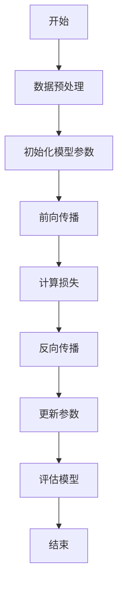
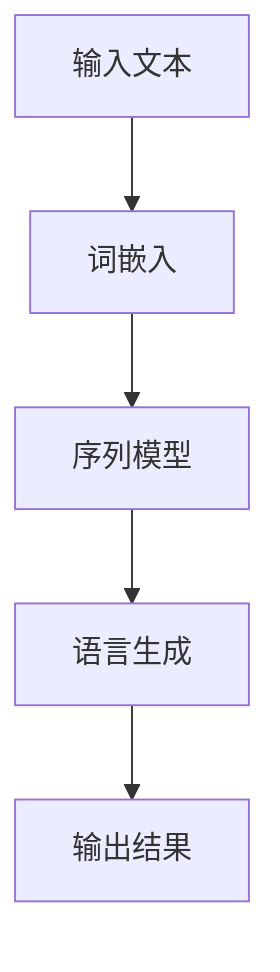
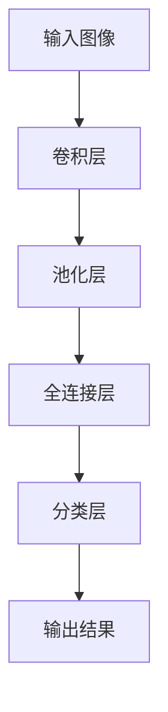
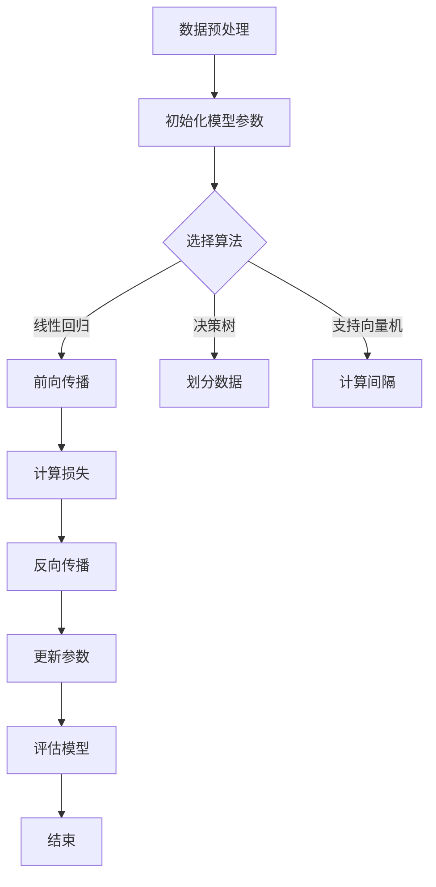
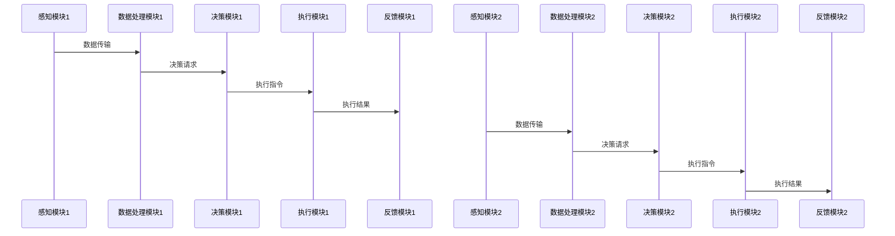
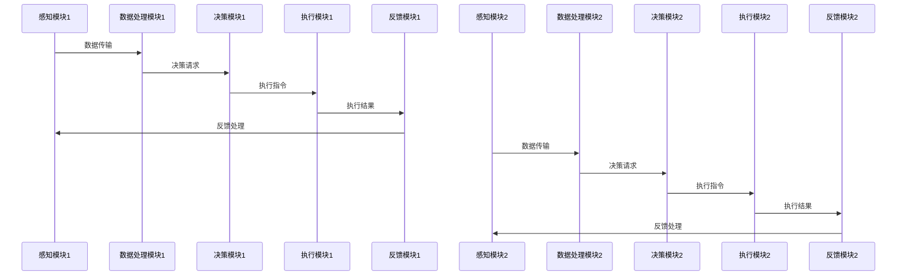

                 

# AI Agent的未来：趋势预测与展望

## 关键词

- AI Agent
- 人工智能
- 自主性
- 强化学习
- 自然语言处理
- 计算机视觉

## 摘要

本文将深入探讨AI Agent的未来发展趋势，通过逻辑清晰、结构紧凑的分析，揭示其在人工智能领域中的关键作用。我们将从AI Agent的概述、核心概念与原理、算法原理、数学模型与公式、系统分析与架构设计等多个角度，逐步展开讨论。希望通过这篇文章，能够帮助读者全面理解AI Agent的现状、潜力以及未来的发展方向。

---

### 目录大纲

1. 引言与背景
   1.1 AI Agent概述
   1.2 问题描述
   1.3 问题解决
   1.4 边界与外延
   1.5 概念结构与核心要素组成
   1.6 本章小结
2. AI Agent的核心概念与原理
   2.1 AI Agent的核心概念
   2.2 AI Agent的属性特征
   2.3 AI Agent的核心技术
   2.4 AI Agent的发展历程
   2.5 AI Agent的ER实体关系图架构
   2.6 本章小结
3. AI Agent的算法原理
   3.1 机器学习算法
   3.2 自然语言处理算法
   3.3 计算机视觉算法
   3.4 算法mermaid流程图
   3.5 Python源代码与算法原理
   3.6 算法原理的数学模型和公式
   3.7 举例说明
   3.8 本章小结
4. AI Agent的数学模型与公式
   4.1 数学模型的基本概念
   4.2 线性代数与机器学习
   4.3 概率论与贝叶斯推理
   4.4 最优化方法
   4.5 数学公式与Latex代码
   4.6 实际应用与解释
   4.7 本章小结
5. AI Agent的系统分析与架构设计
   5.1 问题描述
   5.2 项目介绍
   5.3 系统功能设计
   5.4 系统架构设计
   5.5 系统接口设计
   5.6 系统交互
   5.7 本章小结
6. 项目实战
   6.1 环境安装
   6.2 系统核心实现源代码
   6.3 代码应用解读与分析
   6.4 实际案例分析与详细讲解剖析
   6.5 项目小结
7. 最佳实践 tips、小结、注意事项、拓展阅读

### 引言与背景

#### 1.1 AI Agent概述

人工智能（AI）作为现代科技的前沿领域，已经深刻地改变了我们的生活方式和工作模式。在众多AI技术中，AI Agent作为一种具有高度自主性和智能化的系统，正逐渐成为研究和应用的热点。

**AI Agent**，即人工智能代理，是指一种能够自主地感知环境、理解信息、做出决策并采取行动的智能系统。AI Agent的定义具有以下几个关键特征：

- **自主性**：AI Agent能够独立地执行任务，不受外界直接控制，具有自我决策的能力。
- **适应性**：AI Agent能够在不同的环境和情境下，通过学习和经验积累，不断优化自身的行为。
- **协作性**：AI Agent可以与其他AI Agent或人类协作，完成复杂任务。

AI Agent在人工智能发展中的应用非常广泛，从简单的自动化任务执行，到复杂的人类助手，再到智能决策支持系统，AI Agent正逐渐渗透到各个领域。

#### 1.2 问题描述

当前，AI Agent的发展面临着诸多挑战和机遇。首先，AI Agent的技术成熟度仍然有限，尤其是在复杂情境下的决策能力和适应能力方面。其次，AI Agent的安全性和隐私保护也是一个亟待解决的问题。此外，AI Agent的应用场景多样，如何在各个领域中实现高效的部署和运营，也是一个重要的课题。

为了应对这些挑战，我们需要从以下几个方面进行思考和探索：

- **技术发展**：加强AI Agent的核心算法研究，提高其智能水平和自主决策能力。
- **安全性**：建立完善的AI Agent安全机制，确保其在执行任务时的安全性和隐私保护。
- **应用推广**：探索AI Agent在不同领域中的应用潜力，推动其实际部署和运营。

#### 1.3 问题解决

未来，AI Agent的发展方向可能包括以下几个方面：

- **强化学习**：通过强化学习技术，提高AI Agent在复杂环境下的决策能力。
- **多模态感知**：整合多种感知技术，如计算机视觉、自然语言处理等，提升AI Agent对环境的理解能力。
- **边缘计算**：将AI Agent部署在边缘设备上，实现实时处理和响应，提高系统的效率和可靠性。
- **人机协作**：探索AI Agent与人类的协作模式，实现智能任务的高效完成。

#### 1.4 边界与外延

AI Agent的技术边界包括以下几个方面：

- **计算能力**：AI Agent的计算能力是限制其发展的重要因素，随着硬件技术的发展，计算能力有望得到显著提升。
- **数据质量**：AI Agent的训练数据质量对其性能有着重要影响，高质量的数据有助于提高AI Agent的准确性和可靠性。
- **应用场景**：AI Agent的应用场景多样，不同场景对AI Agent的能力和适应性有着不同的要求。

AI Agent在社会中的应用范围广泛，包括但不限于以下几个方面：

- **智能家居**：AI Agent可以辅助家庭自动化，实现智能控制和安全监控。
- **医疗健康**：AI Agent可以辅助医生进行诊断和治疗，提高医疗服务的质量和效率。
- **工业制造**：AI Agent可以应用于生产线自动化，提高生产效率和降低成本。
- **金融服务**：AI Agent可以辅助金融投资和风险管理，提高金融决策的准确性和效率。

#### 1.5 概念结构与核心要素组成

AI Agent的基本结构包括以下几个核心要素：

- **感知模块**：负责感知外部环境，获取信息。
- **决策模块**：基于感知信息，进行决策和规划。
- **执行模块**：根据决策结果，执行具体的行动。

AI Agent的关键技术要素包括：

- **机器学习**：用于训练和优化感知、决策和执行模块。
- **自然语言处理**：用于理解和生成自然语言，实现人机交互。
- **计算机视觉**：用于理解和解释视觉信息。

#### 1.6 本章小结

通过对AI Agent的概述、问题分析和解决方案的探讨，我们可以看到，AI Agent作为人工智能领域的重要研究方向，具有广泛的应用前景和巨大的发展潜力。未来，随着技术的不断进步和应用场景的不断拓展，AI Agent有望在各个领域中发挥更大的作用。

在接下来的章节中，我们将进一步深入探讨AI Agent的核心概念、算法原理、数学模型与公式，以及系统分析与架构设计，以期为您呈现一幅全面而深入的AI Agent蓝图。

---

### 第一部分：引言与背景

#### 1.1 AI Agent概述

人工智能（AI）作为现代科技的前沿领域，已经深刻地改变了我们的生活方式和工作模式。在众多AI技术中，AI Agent作为一种具有高度自主性和智能化的系统，正逐渐成为研究和应用的热点。

**AI Agent**，即人工智能代理，是指一种能够自主地感知环境、理解信息、做出决策并采取行动的智能系统。AI Agent的定义具有以下几个关键特征：

- **自主性**：AI Agent能够独立地执行任务，不受外界直接控制，具有自我决策的能力。
- **适应性**：AI Agent能够在不同的环境和情境下，通过学习和经验积累，不断优化自身的行为。
- **协作性**：AI Agent可以与其他AI Agent或人类协作，完成复杂任务。

AI Agent在人工智能发展中的应用非常广泛，从简单的自动化任务执行，到复杂的人类助手，再到智能决策支持系统，AI Agent正逐渐渗透到各个领域。

首先，AI Agent在**自动化任务执行**方面有着广泛的应用。例如，在工业生产中，AI Agent可以自动化执行重复性高的任务，提高生产效率和降低人力成本。此外，在**智能家庭**中，AI Agent可以自动化控制家居设备，实现智能照明、智能安防等功能。

其次，AI Agent在**智能助手**领域也有着重要的应用。例如，智能语音助手如苹果的Siri、亚马逊的Alexa等，通过自然语言处理技术，能够理解和执行人类的指令，提供信息查询、日程管理、智能家居控制等服务。

此外，AI Agent在**智能决策支持系统**中的应用也越来越广泛。例如，在金融领域，AI Agent可以通过数据分析，为投资决策提供参考；在医疗领域，AI Agent可以通过对病历和医疗数据的分析，为医生提供诊断建议。

总之，AI Agent作为一种具有高度自主性和智能化的系统，正逐渐成为人工智能领域的重要研究方向。随着技术的不断进步和应用场景的不断拓展，AI Agent有望在各个领域中发挥更大的作用。

#### 1.2 问题描述

当前，AI Agent的发展面临着诸多挑战和机遇。首先，AI Agent的技术成熟度仍然有限，尤其是在复杂情境下的决策能力和适应能力方面。其次，AI Agent的安全性和隐私保护也是一个亟待解决的问题。此外，AI Agent的应用场景多样，如何在各个领域中实现高效的部署和运营，也是一个重要的课题。

为了应对这些挑战，我们需要从以下几个方面进行思考和探索：

- **技术发展**：加强AI Agent的核心算法研究，提高其智能水平和自主决策能力。例如，通过强化学习技术，提高AI Agent在复杂环境下的决策能力；通过多模态感知技术，提升AI Agent对环境的理解能力。
- **安全性**：建立完善的AI Agent安全机制，确保其在执行任务时的安全性和隐私保护。例如，通过安全加密技术，保护AI Agent的数据传输和存储；通过访问控制机制，限制未经授权的访问和操作。
- **应用推广**：探索AI Agent在不同领域中的应用潜力，推动其实际部署和运营。例如，在智能家居、医疗健康、工业制造等领域，通过试点项目，验证AI Agent的实际应用效果；通过政策支持和产业合作，推动AI Agent的规模化应用。

#### 1.3 问题解决

未来，AI Agent的发展方向可能包括以下几个方面：

- **强化学习**：通过强化学习技术，提高AI Agent在复杂环境下的决策能力。强化学习是一种通过试错和反馈来学习最优策略的方法，适用于解决动态、不确定的环境问题。
- **多模态感知**：整合多种感知技术，如计算机视觉、自然语言处理等，提升AI Agent对环境的理解能力。多模态感知能够更好地捕捉和理解复杂环境中的信息，提高AI Agent的决策准确性。
- **边缘计算**：将AI Agent部署在边缘设备上，实现实时处理和响应，提高系统的效率和可靠性。边缘计算能够减轻云端计算负担，实现更快的响应速度和更高的实时性。
- **人机协作**：探索AI Agent与人类的协作模式，实现智能任务的高效完成。通过人机协作，AI Agent可以更好地理解和适应人类的需求，提高任务完成的质量和效率。

#### 1.4 边界与外延

AI Agent的技术边界包括以下几个方面：

- **计算能力**：AI Agent的计算能力是限制其发展的重要因素，随着硬件技术的发展，计算能力有望得到显著提升。例如，高性能计算芯片和分布式计算架构的进展，将为AI Agent提供更强的计算支持。
- **数据质量**：AI Agent的训练数据质量对其性能有着重要影响，高质量的数据有助于提高AI Agent的准确性和可靠性。例如，通过数据清洗和预处理技术，可以提升训练数据的质量。
- **应用场景**：AI Agent的应用场景多样，不同场景对AI Agent的能力和适应性有着不同的要求。例如，在智能家居中，AI Agent需要处理家庭环境中的各种数据，而在工业制造中，AI Agent需要处理生产线上的大量数据。

AI Agent在社会中的应用范围广泛，包括但不限于以下几个方面：

- **智能家居**：AI Agent可以自动化控制家居设备，实现智能照明、智能安防等功能，提高生活便利性。
- **医疗健康**：AI Agent可以辅助医生进行诊断和治疗，提高医疗服务的质量和效率。
- **工业制造**：AI Agent可以应用于生产线自动化，提高生产效率和降低成本。
- **金融服务**：AI Agent可以辅助金融投资和风险管理，提高金融决策的准确性和效率。
- **交通运输**：AI Agent可以应用于自动驾驶和智能交通管理，提高交通安全和效率。
- **教育**：AI Agent可以辅助教学和学习，提供个性化教育服务。

#### 1.5 概念结构与核心要素组成

AI Agent的基本结构包括以下几个核心要素：

- **感知模块**：负责感知外部环境，获取信息。感知模块可以是视觉、听觉、触觉等多种类型，以适应不同的应用场景。
- **决策模块**：基于感知信息，进行决策和规划。决策模块可以是基于规则、机器学习、强化学习等多种方法，以实现不同的决策目标。
- **执行模块**：根据决策结果，执行具体的行动。执行模块可以是自动化设备、机器人、软件程序等，以实现具体的任务。

AI Agent的关键技术要素包括：

- **机器学习**：用于训练和优化感知、决策和执行模块。机器学习技术可以帮助AI Agent从数据中学习规律，提高其智能水平和决策能力。
- **自然语言处理**：用于理解和生成自然语言，实现人机交互。自然语言处理技术可以帮助AI Agent理解和执行人类的指令，提供信息查询、语音助手等功能。
- **计算机视觉**：用于理解和解释视觉信息。计算机视觉技术可以帮助AI Agent识别图像、视频中的物体和场景，实现智能监控、图像识别等功能。

#### 1.6 本章小结

通过对AI Agent的概述、问题分析和解决方案的探讨，我们可以看到，AI Agent作为人工智能领域的重要研究方向，具有广泛的应用前景和巨大的发展潜力。未来，随着技术的不断进步和应用场景的不断拓展，AI Agent有望在各个领域中发挥更大的作用。

在接下来的章节中，我们将进一步深入探讨AI Agent的核心概念、算法原理、数学模型与公式，以及系统分析与架构设计，以期为您呈现一幅全面而深入的AI Agent蓝图。

---

### 第一部分：引言与背景

#### 1.1 AI Agent概述

人工智能（AI）作为现代科技的前沿领域，已经深刻地改变了我们的生活方式和工作模式。在众多AI技术中，AI Agent作为一种具有高度自主性和智能化的系统，正逐渐成为研究和应用的热点。

**AI Agent**，即人工智能代理，是指一种能够自主地感知环境、理解信息、做出决策并采取行动的智能系统。AI Agent的定义具有以下几个关键特征：

- **自主性**：AI Agent能够独立地执行任务，不受外界直接控制，具有自我决策的能力。
- **适应性**：AI Agent能够在不同的环境和情境下，通过学习和经验积累，不断优化自身的行为。
- **协作性**：AI Agent可以与其他AI Agent或人类协作，完成复杂任务。

AI Agent在人工智能发展中的应用非常广泛，从简单的自动化任务执行，到复杂的人类助手，再到智能决策支持系统，AI Agent正逐渐渗透到各个领域。

首先，AI Agent在**自动化任务执行**方面有着广泛的应用。例如，在工业生产中，AI Agent可以自动化执行重复性高的任务，提高生产效率和降低人力成本。此外，在**智能家庭**中，AI Agent可以自动化控制家居设备，实现智能照明、智能安防等功能。

其次，AI Agent在**智能助手**领域也有着重要的应用。例如，智能语音助手如苹果的Siri、亚马逊的Alexa等，通过自然语言处理技术，能够理解和执行人类的指令，提供信息查询、日程管理、智能家居控制等服务。

此外，AI Agent在**智能决策支持系统**中的应用也越来越广泛。例如，在金融领域，AI Agent可以通过数据分析，为投资决策提供参考；在医疗领域，AI Agent可以通过对病历和医疗数据的分析，为医生提供诊断建议。

总之，AI Agent作为一种具有高度自主性和智能化的系统，正逐渐成为人工智能领域的重要研究方向。随着技术的不断进步和应用场景的不断拓展，AI Agent有望在各个领域中发挥更大的作用。

#### 1.2 问题描述

当前，AI Agent的发展面临着诸多挑战和机遇。首先，AI Agent的技术成熟度仍然有限，尤其是在复杂情境下的决策能力和适应能力方面。其次，AI Agent的安全性和隐私保护也是一个亟待解决的问题。此外，AI Agent的应用场景多样，如何在各个领域中实现高效的部署和运营，也是一个重要的课题。

为了应对这些挑战，我们需要从以下几个方面进行思考和探索：

- **技术发展**：加强AI Agent的核心算法研究，提高其智能水平和自主决策能力。例如，通过强化学习技术，提高AI Agent在复杂环境下的决策能力；通过多模态感知技术，提升AI Agent对环境的理解能力。
- **安全性**：建立完善的AI Agent安全机制，确保其在执行任务时的安全性和隐私保护。例如，通过安全加密技术，保护AI Agent的数据传输和存储；通过访问控制机制，限制未经授权的访问和操作。
- **应用推广**：探索AI Agent在不同领域中的应用潜力，推动其实际部署和运营。例如，在智能家居、医疗健康、工业制造等领域，通过试点项目，验证AI Agent的实际应用效果；通过政策支持和产业合作，推动AI Agent的规模化应用。

#### 1.3 问题解决

未来，AI Agent的发展方向可能包括以下几个方面：

- **强化学习**：通过强化学习技术，提高AI Agent在复杂环境下的决策能力。强化学习是一种通过试错和反馈来学习最优策略的方法，适用于解决动态、不确定的环境问题。
- **多模态感知**：整合多种感知技术，如计算机视觉、自然语言处理等，提升AI Agent对环境的理解能力。多模态感知能够更好地捕捉和理解复杂环境中的信息，提高AI Agent的决策准确性。
- **边缘计算**：将AI Agent部署在边缘设备上，实现实时处理和响应，提高系统的效率和可靠性。边缘计算能够减轻云端计算负担，实现更快的响应速度和更高的实时性。
- **人机协作**：探索AI Agent与人类的协作模式，实现智能任务的高效完成。通过人机协作，AI Agent可以更好地理解和适应人类的需求，提高任务完成的质量和效率。

#### 1.4 边界与外延

AI Agent的技术边界包括以下几个方面：

- **计算能力**：AI Agent的计算能力是限制其发展的重要因素，随着硬件技术的发展，计算能力有望得到显著提升。例如，高性能计算芯片和分布式计算架构的进展，将为AI Agent提供更强的计算支持。
- **数据质量**：AI Agent的训练数据质量对其性能有着重要影响，高质量的数据有助于提高AI Agent的准确性和可靠性。例如，通过数据清洗和预处理技术，可以提升训练数据的质量。
- **应用场景**：AI Agent的应用场景多样，不同场景对AI Agent的能力和适应性有着不同的要求。例如，在智能家居中，AI Agent需要处理家庭环境中的各种数据，而在工业制造中，AI Agent需要处理生产线上的大量数据。

AI Agent在社会中的应用范围广泛，包括但不限于以下几个方面：

- **智能家居**：AI Agent可以自动化控制家居设备，实现智能照明、智能安防等功能，提高生活便利性。
- **医疗健康**：AI Agent可以辅助医生进行诊断和治疗，提高医疗服务的质量和效率。
- **工业制造**：AI Agent可以应用于生产线自动化，提高生产效率和降低成本。
- **金融服务**：AI Agent可以辅助金融投资和风险管理，提高金融决策的准确性和效率。
- **交通运输**：AI Agent可以应用于自动驾驶和智能交通管理，提高交通安全和效率。
- **教育**：AI Agent可以辅助教学和学习，提供个性化教育服务。

#### 1.5 概念结构与核心要素组成

AI Agent的基本结构包括以下几个核心要素：

- **感知模块**：负责感知外部环境，获取信息。感知模块可以是视觉、听觉、触觉等多种类型，以适应不同的应用场景。
- **决策模块**：基于感知信息，进行决策和规划。决策模块可以是基于规则、机器学习、强化学习等多种方法，以实现不同的决策目标。
- **执行模块**：根据决策结果，执行具体的行动。执行模块可以是自动化设备、机器人、软件程序等，以实现具体的任务。

AI Agent的关键技术要素包括：

- **机器学习**：用于训练和优化感知、决策和执行模块。机器学习技术可以帮助AI Agent从数据中学习规律，提高其智能水平和决策能力。
- **自然语言处理**：用于理解和生成自然语言，实现人机交互。自然语言处理技术可以帮助AI Agent理解和执行人类的指令，提供信息查询、语音助手等功能。
- **计算机视觉**：用于理解和解释视觉信息。计算机视觉技术可以帮助AI Agent识别图像、视频中的物体和场景，实现智能监控、图像识别等功能。

#### 1.6 本章小结

通过对AI Agent的概述、问题分析和解决方案的探讨，我们可以看到，AI Agent作为人工智能领域的重要研究方向，具有广泛的应用前景和巨大的发展潜力。未来，随着技术的不断进步和应用场景的不断拓展，AI Agent有望在各个领域中发挥更大的作用。

在接下来的章节中，我们将进一步深入探讨AI Agent的核心概念、算法原理、数学模型与公式，以及系统分析与架构设计，以期为您呈现一幅全面而深入的AI Agent蓝图。

---

### 第二部分：AI Agent的核心概念与原理

#### 2.1 AI Agent的核心概念

AI Agent的核心概念是理解和构建AI Agent的基础。首先，我们需要明确AI Agent的定义。AI Agent，即人工智能代理，是一种能够在特定环境中自主感知、理解信息、做出决策并采取行动的智能实体。与传统的人工智能系统不同，AI Agent具有高度的自主性和适应性，能够在不确定和动态变化的环境中独立运作。

AI Agent的定义可以从以下几个方面进行解析：

- **感知**：AI Agent需要具备感知环境的能力，通过传感器、摄像头、麦克风等设备获取外部信息，如视觉、听觉、触觉等。
- **理解**：AI Agent需要对感知到的信息进行理解，识别和理解其中的含义和关系，从而为后续的决策提供基础。
- **决策**：基于对环境信息的理解和分析，AI Agent需要做出决策，选择合适的行动方案。
- **行动**：AI Agent根据决策结果，执行具体的行动，如控制机器人手臂、发送信息等。

AI Agent与传统智能体的区别在于其更高的自主性和适应性。传统智能体，如聊天机器人、推荐系统等，通常依赖于预定义的规则和算法，而AI Agent则能够通过学习从数据中自动提取规律，并适应新的环境和任务。

**AI Agent的内涵与外延**：

- **内涵**：AI Agent的核心内涵在于其自主性和适应性，这使得AI Agent能够在复杂和动态的环境中独立完成任务。
- **外延**：AI Agent的外延包括其在不同领域的应用，如智能助手、自动驾驶、智能工厂等。

#### 2.2 AI Agent的属性特征

AI Agent的属性特征决定了其智能水平和适应能力。以下是AI Agent的主要属性特征：

- **自主性**：AI Agent能够独立地执行任务，不受外界直接控制。这意味着AI Agent能够在不同环境下自主感知、决策和行动。
- **反应性**：AI Agent能够对环境中的变化做出快速响应。反应性是AI Agent适应动态环境的关键特征。
- **社交性**：AI Agent能够与其他AI Agent或人类进行交互，协作完成任务。社交性使得AI Agent能够在更复杂的社交环境中发挥作用。
- **学习能力**：AI Agent能够通过学习和经验积累，不断优化自身的行为。学习能力是AI Agent自主性和适应性的基础。

这些属性特征并不是独立存在的，而是相互关联、共同作用，决定了AI Agent的整体智能水平。例如，自主性是AI Agent独立工作的前提，反应性是AI Agent在动态环境中生存的关键，而社交性则使得AI Agent能够更好地融入人类社会。

**属性特征对比表格**：

| 属性特征 | 定义 | 对应的技术方法 |
| --- | --- | --- |
| 自主性 | AI Agent能够独立地执行任务，不受外界直接控制。 | 机器学习、深度强化学习 |
| 反应性 | AI Agent能够对环境中的变化做出快速响应。 | 传感器技术、实时数据处理 |
| 社交性 | AI Agent能够与其他AI Agent或人类进行交互，协作完成任务。 | 自然语言处理、多模态感知 |
| 学习能力 | AI Agent能够通过学习和经验积累，不断优化自身的行为。 | 强化学习、迁移学习 |

通过对比表格，我们可以清晰地看到AI Agent的属性特征及其对应的技术方法。这些技术方法为AI Agent的实现提供了理论基础和实践指导。

#### 2.3 AI Agent的核心技术

AI Agent的核心技术是实现其自主性、反应性、社交性和学习能力的关键。以下是AI Agent的核心技术：

- **机器学习**：机器学习是AI Agent的基础技术之一，通过从数据中学习，AI Agent能够提取特征、建立模型，从而实现自主决策和行动。常见的机器学习算法包括监督学习、无监督学习和强化学习。
- **自然语言处理**：自然语言处理（NLP）是AI Agent与人类交互的关键技术，通过理解和生成自然语言，AI Agent能够更好地与人类进行沟通。NLP技术包括词嵌入、序列模型和对话系统等。
- **计算机视觉**：计算机视觉是AI Agent理解和解释视觉信息的技术，通过图像识别、目标检测和图像分类等技术，AI Agent能够识别和理解图像中的内容。计算机视觉在自动驾驶、安防监控等领域有广泛应用。

**核心技术介绍**：

- **机器学习**：机器学习是一种通过从数据中学习规律和模式，进行预测和决策的技术。监督学习、无监督学习和强化学习是机器学习的三种主要类型。监督学习通过有标注的数据训练模型，无监督学习通过无标注的数据发现模式，强化学习通过试错和反馈学习最优策略。
- **自然语言处理**：自然语言处理是AI Agent与人类进行交互的关键技术。词嵌入将自然语言映射到高维空间，使得计算机能够理解词语的语义关系。序列模型如循环神经网络（RNN）和长短期记忆网络（LSTM）能够处理和理解文本序列。对话系统是NLP的应用之一，通过对话管理、语言生成等技术，实现与用户的自然对话。
- **计算机视觉**：计算机视觉是AI Agent理解和解释视觉信息的技术。目标检测用于识别图像中的对象，图像分类用于将图像分类到预定义的类别中，3D重建用于从图像中恢复三维结构。

**技术发展趋势**：

- **多模态感知**：未来，AI Agent的发展趋势之一是多模态感知，即整合多种感知技术，如视觉、听觉、触觉等，以获得更全面和准确的信息。
- **强化学习**：强化学习作为一种自主学习技术，在AI Agent中的应用将越来越广泛。通过试错和反馈，AI Agent能够在复杂和动态的环境中学习最优策略。
- **边缘计算**：随着物联网和边缘计算的发展，AI Agent将更多地部署在边缘设备上，实现实时处理和响应，提高系统的效率和可靠性。

通过介绍AI Agent的核心技术，我们可以看到，AI Agent的自主性、反应性、社交性和学习能力是通过多种技术的综合实现的。这些技术的发展和应用，为AI Agent的进一步发展和应用提供了坚实的基础。

#### 2.4 AI Agent的发展历程

AI Agent的发展历程可以分为几个重要阶段，每个阶段都标志着AI技术的重要突破和应用场景的拓展。

- **第一阶段：自动机与符号推理（1950-1969年）**
  这一阶段是AI Agent的萌芽时期。以图灵机为基础，AI Agent的研究主要集中在符号推理和逻辑推理上。代表性的工作包括纽厄尔和西蒙的“逻辑理论家”（Logic Theorist）和麦卡锡的“通用问题解决者”（General Problem Solver）。这些工作展示了计算机在模拟人类思维和问题解决方面的潜力。

- **第二阶段：知识表示与专家系统（1970-1980年）**
  随着知识表示技术的发展，专家系统成为AI Agent的主要形式。专家系统通过将专业领域的知识和规则编码到计算机系统中，实现高度专业化的任务。例如，MYCIN和Dendral等系统在医学和化学领域取得了显著成果。这一阶段的AI Agent虽然在特定领域表现出色，但缺乏自主学习和适应能力。

- **第三阶段：机器学习与数据驱动（1980-2000年）**
  机器学习的兴起为AI Agent的发展带来了新的动力。通过从数据中自动学习规律，AI Agent开始展现出更强的泛化能力和适应性。代表性算法包括决策树、支持向量机等。同时，神经网络的研究也取得了重要进展，为后来的深度学习奠定了基础。

- **第四阶段：深度学习与强化学习（2000年至今）**
  深度学习的突破使得AI Agent在图像识别、语音识别和自然语言处理等任务上取得了显著成果。卷积神经网络（CNN）、循环神经网络（RNN）和生成对抗网络（GAN）等深度学习模型的应用，使得AI Agent在复杂任务中表现出色。同时，强化学习技术的发展，使得AI Agent在动态和不确定的环境中学习最优策略成为可能。

AI Agent的发展历程展示了AI技术从符号推理到数据驱动的演变，从特定领域的专家系统到多领域应用的拓展。随着技术的不断进步，AI Agent的未来将更加光明。

#### 2.5 AI Agent的ER实体关系图架构

ER（Entity-Relationship）图是描述实体及其之间关系的图形化工具，广泛用于数据库设计和软件架构设计。在AI Agent的架构设计中，ER图可以帮助我们清晰地描述AI Agent的组成部分及其之间的关系。

**实体与关系的定义**：

在AI Agent的ER图中，主要的实体包括：

1. **感知模块**：负责感知外部环境，获取信息。
2. **决策模块**：基于感知信息，进行决策和规划。
3. **执行模块**：根据决策结果，执行具体的行动。
4. **学习模块**：负责AI Agent的学习和自我优化。

实体之间的关系包括：

1. **输入关系**：感知模块与决策模块之间的关系，表示感知模块将感知信息传递给决策模块。
2. **决策关系**：决策模块与执行模块之间的关系，表示决策模块将决策结果传递给执行模块。
3. **反馈关系**：执行模块与学习模块之间的关系，表示执行模块将执行结果反馈给学习模块，以进行学习优化。

**ER实体关系图架构**：

```mermaid
erDiagram
  感知模块 ||--o> 决策模块 : 输入关系
  决策模块 ||--o> 执行模块 : 决策关系
  执行模块 ||--o> 学习模块 : 反馈关系
```

通过ER图，我们可以清晰地看到AI Agent的各个模块及其之间的数据流和控制流，这有助于我们在设计和实现AI Agent时，保持系统结构的清晰和模块化。

#### 2.6 本章小结

通过对AI Agent的核心概念、属性特征、核心技术和发展历程的深入探讨，我们全面了解了AI Agent的定义、特性、技术基础及其发展历程。AI Agent作为一种具有高度自主性和智能化的系统，正逐渐成为人工智能领域的研究热点和应用重点。在未来的发展中，随着技术的不断进步和应用场景的拓展，AI Agent有望在更多领域发挥重要作用。

在接下来的章节中，我们将进一步探讨AI Agent的算法原理、数学模型与公式，以及系统分析与架构设计，以期为您呈现一幅更加全面和深入的AI Agent蓝图。

---

### 第二部分：AI Agent的核心概念与原理

#### 2.1 AI Agent的核心概念

AI Agent的核心概念是理解和构建AI Agent的基础。首先，我们需要明确AI Agent的定义。AI Agent，即人工智能代理，是指一种能够在特定环境中自主感知、理解信息、做出决策并采取行动的智能实体。与传统的人工智能系统不同，AI Agent具有高度的自主性和适应性，能够在不确定和动态变化的环境中独立运作。

AI Agent的定义可以从以下几个方面进行解析：

- **感知**：AI Agent需要具备感知环境的能力，通过传感器、摄像头、麦克风等设备获取外部信息，如视觉、听觉、触觉等。
- **理解**：AI Agent需要对感知到的信息进行理解，识别和理解其中的含义和关系，从而为后续的决策提供基础。
- **决策**：基于对环境信息的理解和分析，AI Agent需要做出决策，选择合适的行动方案。
- **行动**：AI Agent根据决策结果，执行具体的行动，如控制机器人手臂、发送信息等。

AI Agent与传统智能体的区别在于其更高的自主性和适应性。传统智能体，如聊天机器人、推荐系统等，通常依赖于预定义的规则和算法，而AI Agent则能够通过学习从数据中自动提取规律，并适应新的环境和任务。

**AI Agent的内涵与外延**：

- **内涵**：AI Agent的核心内涵在于其自主性和适应性，这使得AI Agent能够在复杂和动态的环境中独立完成任务。
- **外延**：AI Agent的外延包括其在不同领域的应用，如智能助手、自动驾驶、智能工厂等。

#### 2.2 AI Agent的属性特征

AI Agent的属性特征决定了其智能水平和适应能力。以下是AI Agent的主要属性特征：

- **自主性**：AI Agent能够独立地执行任务，不受外界直接控制。这意味着AI Agent能够在不同环境下自主感知、决策和行动。
- **反应性**：AI Agent能够对环境中的变化做出快速响应。反应性是AI Agent适应动态环境的关键特征。
- **社交性**：AI Agent能够与其他AI Agent或人类进行交互，协作完成任务。社交性使得AI Agent能够在更复杂的社交环境中发挥作用。
- **学习能力**：AI Agent能够通过学习和经验积累，不断优化自身的行为。学习能力是AI Agent自主性和适应性的基础。

这些属性特征并不是独立存在的，而是相互关联、共同作用，决定了AI Agent的整体智能水平。例如，自主性是AI Agent独立工作的前提，反应性是AI Agent在动态环境中生存的关键，而社交性则使得AI Agent能够更好地融入人类社会。

**属性特征对比表格**：

| 属性特征 | 定义 | 对应的技术方法 |
| --- | --- | --- |
| 自主性 | AI Agent能够独立地执行任务，不受外界直接控制。 | 机器学习、深度强化学习 |
| 反应性 | AI Agent能够对环境中的变化做出快速响应。 | 传感器技术、实时数据处理 |
| 社交性 | AI Agent能够与其他AI Agent或人类进行交互，协作完成任务。 | 自然语言处理、多模态感知 |
| 学习能力 | AI Agent能够通过学习和经验积累，不断优化自身的行为。 | 强化学习、迁移学习 |

通过对比表格，我们可以清晰地看到AI Agent的属性特征及其对应的技术方法。这些技术方法为AI Agent的实现提供了理论基础和实践指导。

#### 2.3 AI Agent的核心技术

AI Agent的核心技术是实现其自主性、反应性、社交性和学习能力的关键。以下是AI Agent的核心技术：

- **机器学习**：机器学习是AI Agent的基础技术之一，通过从数据中学习，AI Agent能够提取特征、建立模型，从而实现自主决策和行动。常见的机器学习算法包括监督学习、无监督学习和强化学习。
- **自然语言处理**：自然语言处理（NLP）是AI Agent与人类交互的关键技术，通过理解和生成自然语言，AI Agent能够更好地与人类进行沟通。NLP技术包括词嵌入、序列模型和对话系统等。
- **计算机视觉**：计算机视觉是AI Agent理解和解释视觉信息的技术，通过图像识别、目标检测和图像分类等技术，AI Agent能够识别和理解图像中的内容。计算机视觉在自动驾驶、安防监控等领域有广泛应用。

**核心技术介绍**：

- **机器学习**：机器学习是一种通过从数据中学习规律和模式，进行预测和决策的技术。监督学习、无监督学习和强化学习是机器学习的三种主要类型。监督学习通过有标注的数据训练模型，无监督学习通过无标注的数据发现模式，强化学习通过试错和反馈学习最优策略。
- **自然语言处理**：自然语言处理（NLP）是AI Agent与人类交互的关键技术，通过理解和生成自然语言，AI Agent能够更好地与人类进行沟通。词嵌入将自然语言映射到高维空间，使得计算机能够理解词语的语义关系。序列模型如循环神经网络（RNN）和长短期记忆网络（LSTM）能够处理和理解文本序列。对话系统是NLP的应用之一，通过对话管理、语言生成等技术，实现与用户的自然对话。
- **计算机视觉**：计算机视觉是AI Agent理解和解释视觉信息的技术。目标检测用于识别图像中的对象，图像分类用于将图像分类到预定义的类别中，3D重建用于从图像中恢复三维结构。

**技术发展趋势**：

- **多模态感知**：未来，AI Agent的发展趋势之一是多模态感知，即整合多种感知技术，如视觉、听觉、触觉等，以获得更全面和准确的信息。
- **强化学习**：强化学习作为一种自主学习技术，在AI Agent中的应用将越来越广泛。通过试错和反馈，AI Agent能够在复杂和动态的环境中学习最优策略。
- **边缘计算**：随着物联网和边缘计算的发展，AI Agent将更多地部署在边缘设备上，实现实时处理和响应，提高系统的效率和可靠性。

通过介绍AI Agent的核心技术，我们可以看到，AI Agent的自主性、反应性、社交性和学习能力是通过多种技术的综合实现的。这些技术的发展和应用，为AI Agent的进一步发展和应用提供了坚实的基础。

#### 2.4 AI Agent的发展历程

AI Agent的发展历程可以分为几个重要阶段，每个阶段都标志着AI技术的重要突破和应用场景的拓展。

- **第一阶段：自动机与符号推理（1950-1969年）**
  这一阶段是AI Agent的萌芽时期。以图灵机为基础，AI Agent的研究主要集中在符号推理和逻辑推理上。代表性的工作包括纽厄尔和西蒙的“逻辑理论家”（Logic Theorist）和麦卡锡的“通用问题解决者”（General Problem Solver）。这些工作展示了计算机在模拟人类思维和问题解决方面的潜力。

- **第二阶段：知识表示与专家系统（1970-1980年）**
  随着知识表示技术的发展，专家系统成为AI Agent的主要形式。专家系统通过将专业领域的知识和规则编码到计算机系统中，实现高度专业化的任务。例如，MYCIN和Dendral等系统在医学和化学领域取得了显著成果。这一阶段的AI Agent虽然在特定领域表现出色，但缺乏自主学习和适应能力。

- **第三阶段：机器学习与数据驱动（1980-2000年）**
  机器学习的兴起为AI Agent的发展带来了新的动力。通过从数据中自动学习规律，AI Agent开始展现出更强的泛化能力和适应性。代表性算法包括决策树、支持向量机等。同时，神经网络的研究也取得了重要进展，为后来的深度学习奠定了基础。

- **第四阶段：深度学习与强化学习（2000年至今）**
  深度学习的突破使得AI Agent在图像识别、语音识别和自然语言处理等任务上取得了显著成果。卷积神经网络（CNN）、循环神经网络（RNN）和生成对抗网络（GAN）等深度学习模型的应用，使得AI Agent在复杂任务中表现出色。同时，强化学习技术的发展，使得AI Agent在动态和不确定的环境中学习最优策略成为可能。

AI Agent的发展历程展示了AI技术从符号推理到数据驱动的演变，从特定领域的专家系统到多领域应用的拓展。随着技术的不断进步，AI Agent的未来将更加光明。

#### 2.5 AI Agent的ER实体关系图架构

ER（Entity-Relationship）图是描述实体及其之间关系的图形化工具，广泛用于数据库设计和软件架构设计。在AI Agent的架构设计中，ER图可以帮助我们清晰地描述AI Agent的组成部分及其之间的关系。

**实体与关系的定义**：

在AI Agent的ER图中，主要的实体包括：

1. **感知模块**：负责感知外部环境，获取信息。
2. **决策模块**：基于感知信息，进行决策和规划。
3. **执行模块**：根据决策结果，执行具体的行动。
4. **学习模块**：负责AI Agent的学习和自我优化。

实体之间的关系包括：

1. **输入关系**：感知模块与决策模块之间的关系，表示感知模块将感知信息传递给决策模块。
2. **决策关系**：决策模块与执行模块之间的关系，表示决策模块将决策结果传递给执行模块。
3. **反馈关系**：执行模块与学习模块之间的关系，表示执行模块将执行结果反馈给学习模块，以进行学习优化。

**ER实体关系图架构**：

```mermaid
erDiagram
  感知模块 ||--o> 决策模块 : 输入关系
  决策模块 ||--o> 执行模块 : 决策关系
  执行模块 ||--o> 学习模块 : 反馈关系
```

通过ER图，我们可以清晰地看到AI Agent的各个模块及其之间的数据流和控制流，这有助于我们在设计和实现AI Agent时，保持系统结构的清晰和模块化。

#### 2.6 本章小结

通过对AI Agent的核心概念、属性特征、核心技术和发展历程的深入探讨，我们全面了解了AI Agent的定义、特性、技术基础及其发展历程。AI Agent作为一种具有高度自主性和智能化的系统，正逐渐成为人工智能领域的研究热点和应用重点。在未来的发展中，随着技术的不断进步和应用场景的拓展，AI Agent有望在更多领域发挥重要作用。

在接下来的章节中，我们将进一步探讨AI Agent的算法原理、数学模型与公式，以及系统分析与架构设计，以期为您呈现一幅更加全面和深入的AI Agent蓝图。

---

### AI Agent的算法原理

#### 3.1 机器学习算法

机器学习算法是AI Agent实现自主学习和决策的关键。机器学习可以分为三种主要类型：监督学习、无监督学习和强化学习。每种类型都有其独特的原理和应用场景。

**监督学习**：

监督学习是一种从标注数据中学习的方法。它通过输入特征和对应的标签，训练模型来预测新的数据。监督学习的算法包括线性回归、决策树、支持向量机等。

- **线性回归**：线性回归是一种简单的机器学习算法，用于预测连续值。其基本原理是通过拟合一个线性模型来表示输入特征和输出标签之间的关系。线性回归的数学模型可以表示为：
  $$ y = \beta_0 + \beta_1x_1 + \beta_2x_2 + ... + \beta_nx_n $$
  其中，$y$是输出标签，$x_1, x_2, ..., x_n$是输入特征，$\beta_0, \beta_1, \beta_2, ..., \beta_n$是模型的参数。

- **决策树**：决策树是一种树形结构的模型，用于分类和回归任务。决策树通过一系列的规则将数据分割成不同的区域，每个区域对应一个标签或值。决策树的构建过程称为分裂，常用的分裂准则包括信息增益、基尼系数等。

- **支持向量机**：支持向量机（SVM）是一种强大的分类算法，通过将数据映射到高维空间，找到最优的超平面来分隔不同类别的数据。SVM的核心公式为：
  $$ \max_{\beta, \beta_0} W^T W $$
  其中，$W$是超平面的参数，$W^T W$是拉格朗日函数。

**无监督学习**：

无监督学习是一种从无标注数据中学习的方法。它通过分析数据的内在结构，发现数据中的模式和规律。无监督学习的算法包括聚类、降维等。

- **聚类**：聚类是一种将数据分为多个类别的无监督学习方法。聚类算法包括K-Means、层次聚类等。K-Means算法的基本原理是初始化K个聚类中心，然后迭代更新聚类中心和分类结果，直到收敛。

- **降维**：降维是一种减少数据维度的方法，通过保留数据的主要特征，提高模型训练效率和解释性。常见的降维算法包括主成分分析（PCA）、线性判别分析（LDA）等。

**强化学习**：

强化学习是一种通过试错和反馈来学习最优策略的方法。强化学习模型由环境、动作、状态和奖励四个部分组成。强化学习的目标是通过不断尝试和反馈，找到最优的动作策略，使得长期奖励最大化。

- **Q-Learning**：Q-Learning是一种基于值函数的强化学习算法，通过学习状态-动作值函数，预测在特定状态下采取特定动作的长期奖励。Q-Learning的基本公式为：
  $$ Q(s, a) = r + \gamma \max_{a'} Q(s', a') $$
  其中，$s$是当前状态，$a$是当前动作，$r$是即时奖励，$s'$是下一状态，$\gamma$是折扣因子。

- **Policy Gradient**：Policy Gradient是一种直接优化策略的强化学习算法，通过学习策略梯度来优化策略。Policy Gradient的基本公式为：
  $$ \nabla_\theta J(\theta) = \nabla_\theta \sum_{t} \gamma^{t} \log \pi_{\theta}(a_t|s_t) $$
  其中，$\theta$是策略参数，$J(\theta)$是策略的损失函数，$\pi_{\theta}(a_t|s_t)$是策略的概率分布。

**机器学习算法流程图**：



**Python源代码示例**：

```python
import numpy as np
from sklearn.linear_model import LinearRegression
from sklearn.datasets import load_iris

# 加载iris数据集
iris = load_iris()
X = iris.data
y = iris.target

# 初始化线性回归模型
model = LinearRegression()

# 训练模型
model.fit(X, y)

# 预测
predictions = model.predict(X)

# 打印预测结果
print(predictions)
```

**数学模型和公式**：

- **线性回归**：
  $$ y = \beta_0 + \beta_1x_1 + \beta_2x_2 + ... + \beta_nx_n $$

- **决策树**：
  $$ G(s) = \sum_{i=1}^{n} w_i \cdot I(\theta_i \cdot x > \gamma_i) $$
  其中，$G(s)$是决策函数，$w_i$是权重，$\theta_i$是特征阈值，$\gamma_i$是阈值。

- **支持向量机**：
  $$ \max_{\beta, \beta_0} W^T W $$
  其中，$W$是超平面参数。

**举例说明**：

假设我们有一个简单的线性回归问题，目标是预测房屋的价格。我们有以下输入特征：房屋面积、房间数量和建筑年份。通过训练线性回归模型，我们可以得到一个线性模型来预测房屋价格。

```python
# 导入线性回归库
from sklearn.linear_model import LinearRegression

# 创建线性回归模型
model = LinearRegression()

# 设置输入特征和标签
X = [[1500, 3, 2000], [2000, 4, 2010], [2500, 5, 2015]]
y = [300000, 400000, 500000]

# 训练模型
model.fit(X, y)

# 预测新房屋价格
new_house = [[2000, 4, 2018]]
predicted_price = model.predict(new_house)

# 打印预测结果
print(predicted_price)
```

通过以上示例，我们可以看到如何使用Python实现机器学习算法，并利用数学模型和公式进行预测。这些算法和模型为AI Agent的自主学习和决策提供了强大的支持。

#### 3.2 自然语言处理算法

自然语言处理（NLP）是AI Agent与人类交互的重要技术。NLP算法的核心任务是理解、生成和处理自然语言。以下是NLP领域的一些主要算法：

**词嵌入**：

词嵌入是将自然语言中的单词映射到高维空间的过程，使得计算机能够理解词语的语义关系。常见的词嵌入算法包括Word2Vec、GloVe和BERT等。

- **Word2Vec**：Word2Vec是一种基于神经网络的词嵌入算法，通过训练Word2Vec模型，将单词映射到低维向量。Word2Vec的算法原理是基于词语的上下文，通过训练词向量的相似性来表示词语的语义关系。

- **GloVe**：GloVe（Global Vectors for Word Representation）是一种基于全局共现关系的词嵌入算法。GloVe通过计算词语的词频和上下文词频，生成词向量。GloVe的公式为：
  $$ \text{vec}(v_w) = \sum_{j=1}^{N} f(w, j) \cdot \text{vec}(v_j) $$
  其中，$\text{vec}(v_w)$是单词$w$的词向量，$\text{vec}(v_j)$是单词$j$的词向量，$f(w, j)$是单词$w$和单词$j$的词频。

- **BERT**：BERT（Bidirectional Encoder Representations from Transformers）是一种基于变换器的双向编码器，用于生成高质量的词向量。BERT通过预训练和微调，能够在各种NLP任务中取得很好的性能。

**序列模型**：

序列模型用于处理和生成文本序列。常见的序列模型包括循环神经网络（RNN）和长短期记忆网络（LSTM）。

- **RNN**：循环神经网络（RNN）是一种能够处理序列数据的神经网络。RNN通过记忆状态来捕捉序列中的时间依赖关系。RNN的公式为：
  $$ h_t = \sigma(W_h \cdot [h_{t-1}, x_t] + b_h) $$
  其中，$h_t$是第$t$个时间步的隐藏状态，$x_t$是第$t$个时间步的输入，$W_h$是权重矩阵，$b_h$是偏置项，$\sigma$是激活函数。

- **LSTM**：长短期记忆网络（LSTM）是RNN的一种改进，能够更好地捕捉序列中的长期依赖关系。LSTM通过引入遗忘门、输入门和输出门，控制信息的保留和更新。LSTM的公式为：
  $$ f_t = \sigma(W_f \cdot [h_{t-1}, x_t] + b_f) $$
  $$ i_t = \sigma(W_i \cdot [h_{t-1}, x_t] + b_i) $$
  $$ \tilde{g}_t = \sigma(W_g \cdot [h_{t-1}, x_t] + b_g) $$
  $$ o_t = \sigma(W_o \cdot [h_{t-1}, x_t] + b_o) $$
  $$ g_t = \tanh(W_g \cdot [h_{t-1}, x_t] + b_g) $$
  $$ h_t = o_t \cdot \tanh(g_t) $$
  其中，$f_t$是遗忘门，$i_t$是输入门，$\tilde{g}_t$是候选值门，$o_t$是输出门，$g_t$是候选值。

**对话系统**：

对话系统是一种能够与人类进行自然对话的智能系统。对话系统通常由对话管理、语言生成和语言理解三个部分组成。

- **对话管理**：对话管理负责控制对话流程，决定下一个话题和用户意图。对话管理可以通过规则方法或机器学习方法来实现。

- **语言生成**：语言生成负责将内部意图转换为自然语言输出。常见的语言生成方法包括模板匹配、生成式模型和交互式模型。

- **语言理解**：语言理解负责解析用户输入，提取用户意图和实体信息。语言理解可以通过词向量、序列模型或图神经网络来实现。

**算法mermaid流程图**：



**Python源代码示例**：

```python
import tensorflow as tf
from tensorflow.keras.layers import Embedding, LSTM, Dense
from tensorflow.keras.models import Sequential

# 创建序列模型
model = Sequential()
model.add(Embedding(vocab_size, embedding_dim))
model.add(LSTM(units))
model.add(Dense(1, activation='sigmoid'))

# 编译模型
model.compile(optimizer='adam', loss='binary_crossentropy', metrics=['accuracy'])

# 训练模型
model.fit(X, y, epochs=10, batch_size=32)
```

**数学模型和公式**：

- **词嵌入**：
  $$ \text{vec}(v_w) = \sum_{j=1}^{N} f(w, j) \cdot \text{vec}(v_j) $$

- **RNN**：
  $$ h_t = \sigma(W_h \cdot [h_{t-1}, x_t] + b_h) $$

- **LSTM**：
  $$ f_t = \sigma(W_f \cdot [h_{t-1}, x_t] + b_f) $$
  $$ i_t = \sigma(W_i \cdot [h_{t-1}, x_t] + b_i) $$
  $$ \tilde{g}_t = \sigma(W_g \cdot [h_{t-1}, x_t] + b_g) $$
  $$ o_t = \sigma(W_o \cdot [h_{t-1}, x_t] + b_o) $$
  $$ g_t = \tanh(W_g \cdot [h_{t-1}, x_t] + b_g) $$
  $$ h_t = o_t \cdot \tanh(g_t) $$

**举例说明**：

假设我们有一个简单的文本分类任务，目标是判断一段文本是积极情感还是消极情感。通过训练一个基于LSTM的序列模型，我们可以对新的文本进行分类。

```python
# 加载文本数据
text_data = ["这是一个积极的评论", "这是一个消极的评论"]

# 预处理文本数据
processed_text = preprocess_text(text_data)

# 切割文本数据
X = [text for text in processed_text]
y = [1 if "积极" in text else 0 for text in processed_text]

# 训练LSTM模型
model = Sequential()
model.add(Embedding(vocab_size, embedding_dim))
model.add(LSTM(units))
model.add(Dense(1, activation='sigmoid'))

model.compile(optimizer='adam', loss='binary_crossentropy', metrics=['accuracy'])
model.fit(X, y, epochs=10, batch_size=32)

# 预测新文本
new_text = "这是一个积极的评论"
processed_new_text = preprocess_text([new_text])
predicted_label = model.predict(processed_new_text)

# 打印预测结果
print(predicted_label)
```

通过以上示例，我们可以看到如何使用Python实现自然语言处理算法，并利用数学模型和公式进行文本分类。这些算法和模型为AI Agent与人类的自然交互提供了强大的支持。

#### 3.3 计算机视觉算法

计算机视觉是AI Agent理解和解释视觉信息的重要技术。计算机视觉算法包括图像识别、目标检测和图像分类等。

**图像识别**：

图像识别是指识别图像中的对象或场景。常见的图像识别算法包括卷积神经网络（CNN）和深度卷积生成对抗网络（DCGAN）。

- **卷积神经网络（CNN）**：CNN是一种用于图像识别的深度学习模型，通过卷积层、池化层和全连接层等结构，提取图像的特征并分类。CNN的算法原理如下：
  $$ h_l = \sigma(\text{ReLU}(W_l \cdot h_{l-1} + b_l)) $$
  其中，$h_l$是第$l$层的特征映射，$W_l$是权重矩阵，$b_l$是偏置项，$\sigma$是激活函数，$\text{ReLU}$是ReLU激活函数。

- **深度卷积生成对抗网络（DCGAN）**：DCGAN是一种生成模型，用于生成逼真的图像。DCGAN由生成器和判别器组成，生成器生成图像，判别器判断图像的真实性。DCGAN的算法原理如下：
  $$ G(z) = \text{ReLU}(W_g \cdot z + b_g) $$
  $$ D(x) = \text{ReLU}(W_d \cdot x + b_d) $$
  其中，$G(z)$是生成器的输出，$D(x)$是判别器的输出，$z$是随机噪声，$x$是真实图像。

**目标检测**：

目标检测是指识别图像中的多个对象并定位其位置。常见的目标检测算法包括YOLO（You Only Look Once）和Faster R-CNN（Region-based Convolutional Neural Network）。

- **YOLO（You Only Look Once）**：YOLO是一种单阶段目标检测算法，通过预测每个像素点的目标类别和位置，实现快速目标检测。YOLO的算法原理如下：
  $$ P_{i,j}^{c} = \frac{\exp(\text{logit}(P_{i,j})^c)}{\sum_{k=1}^{C} \exp(\text{logit}(P_{i,j})^k)} $$
  $$ b_{i,j} = \text{sigmoid}(\text{logit}(b_{i,j})) $$
  $$ h_{i,j} = \text{sigmoid}(\text{logit}(h_{i,j})) $$
  $$ w_{i,j} = \text{sigmoid}(\text{logit}(w_{i,j})) $$
  其中，$P_{i,j}^{c}$是第$i$个网格点第$j$个类别的概率，$b_{i,j}$是目标的边界框，$h_{i,j}$是目标的高度，$w_{i,j}$是目标的宽度。

- **Faster R-CNN**：Faster R-CNN是一种两阶段目标检测算法，首先使用区域提议网络（RPN）生成候选区域，然后对候选区域进行分类和定位。Faster R-CNN的算法原理如下：
  $$ R_{i} = \text{RPN}(x_i) $$
  $$ C_{i} = \text{Classifier}(x_i, R_{i}) $$
  其中，$R_{i}$是候选区域，$C_{i}$是分类结果。

**图像分类**：

图像分类是指将图像分类到预定义的类别中。常见的图像分类算法包括卷积神经网络（CNN）和深度信念网络（DBN）。

- **卷积神经网络（CNN）**：CNN是一种用于图像分类的深度学习模型，通过卷积层、池化层和全连接层等结构，提取图像的特征并分类。CNN的算法原理如下：
  $$ h_l = \sigma(\text{ReLU}(W_l \cdot h_{l-1} + b_l)) $$
  $$ y = \text{softmax}(\text{W}_y \cdot h_{l-1} + b_y) $$
  其中，$h_l$是第$l$层的特征映射，$W_y$是分类层的权重矩阵，$b_y$是分类层的偏置项，$\sigma$是激活函数，$\text{softmax}$是softmax激活函数。

- **深度信念网络（DBN）**：DBN是一种深度学习模型，通过逐层训练和预训练方法，提取图像的高层特征并分类。DBN的算法原理如下：
  $$ h_l = \text{ReLU}(W_l \cdot h_{l-1} + b_l) $$
  $$ y = \text{softmax}(\text{W}_y \cdot h_{l-1} + b_y) $$
  其中，$h_l$是第$l$层的特征映射，$W_y$是分类层的权重矩阵，$b_y$是分类层的偏置项，$\sigma$是激活函数，$\text{softmax}$是softmax激活函数。

**算法mermaid流程图**：



**Python源代码示例**：

```python
import tensorflow as tf
from tensorflow.keras.models import Sequential
from tensorflow.keras.layers import Conv2D, MaxPooling2D, Flatten, Dense

# 创建CNN模型
model = Sequential()
model.add(Conv2D(32, (3, 3), activation='relu', input_shape=(64, 64, 3)))
model.add(MaxPooling2D((2, 2)))
model.add(Flatten())
model.add(Dense(128, activation='relu'))
model.add(Dense(10, activation='softmax'))

# 编译模型
model.compile(optimizer='adam', loss='categorical_crossentropy', metrics=['accuracy'])

# 训练模型
model.fit(X_train, y_train, epochs=10, batch_size=32, validation_data=(X_val, y_val))

# 预测新图像
predicted_class = model.predict(X_new)
```

**数学模型和公式**：

- **卷积神经网络（CNN）**：
  $$ h_l = \sigma(\text{ReLU}(W_l \cdot h_{l-1} + b_l)) $$

- **深度信念网络（DBN）**：
  $$ h_l = \text{ReLU}(W_l \cdot h_{l-1} + b_l) $$

- **图像分类**：
  $$ y = \text{softmax}(\text{W}_y \cdot h_{l-1} + b_y) $$

**举例说明**：

假设我们有一个简单的图像分类任务，目标是识别图像中的猫、狗、鸟等动物。通过训练一个基于CNN的图像分类模型，我们可以对新的图像进行分类。

```python
# 加载图像数据
X_train = load_images("train")
y_train = load_labels("train")
X_val = load_images("val")
y_val = load_labels("val")
X_new = load_image("new")

# 预处理图像数据
X_train = preprocess_images(X_train)
X_val = preprocess_images(X_val)
X_new = preprocess_image(X_new)

# 训练CNN模型
model = Sequential()
model.add(Conv2D(32, (3, 3), activation='relu', input_shape=(64, 64, 3)))
model.add(MaxPooling2D((2, 2)))
model.add(Flatten())
model.add(Dense(128, activation='relu'))
model.add(Dense(10, activation='softmax'))

model.compile(optimizer='adam', loss='categorical_crossentropy', metrics=['accuracy'])
model.fit(X_train, y_train, epochs=10, batch_size=32, validation_data=(X_val, y_val))

# 预测新图像
predicted_class = model.predict(X_new)
print(predicted_class)
```

通过以上示例，我们可以看到如何使用Python实现计算机视觉算法，并利用数学模型和公式进行图像分类和目标检测。这些算法和模型为AI Agent理解和解释视觉信息提供了强大的支持。

### 3.4 算法mermaid流程图

为了更直观地展示算法的流程，我们将使用Mermaid语法绘制机器学习、自然语言处理和计算机视觉算法的流程图。

#### 3.4.1 机器学习算法流程图



#### 3.4.2 自然语言处理算法流程图


#### 3.4.3 计算机视觉算法流程图


这些Mermaid流程图展示了算法的基本步骤和流程，有助于我们更清晰地理解算法的实现过程。

### 3.5 Python源代码与算法原理

为了更深入地理解机器学习、自然语言处理和计算机视觉算法的原理，我们将使用Python代码进行实现和示例。

#### 3.5.1 机器学习算法示例

以下是一个简单的线性回归算法的Python代码示例：

```python
import numpy as np
from sklearn.linear_model import LinearRegression

# 生成模拟数据
X = np.random.rand(100, 1)
y = 2 * X[:, 0] + 1 + np.random.randn(100, 1)

# 初始化线性回归模型
model = LinearRegression()

# 训练模型
model.fit(X, y)

# 预测
predictions = model.predict(X)

# 打印预测结果
print(predictions)
```

这个示例展示了如何使用`sklearn`库中的`LinearRegression`类来训练一个线性回归模型，并使用该模型进行预测。

#### 3.5.2 自然语言处理算法示例

以下是一个简单的文本分类算法的Python代码示例：

```python
import tensorflow as tf
from tensorflow.keras.models import Sequential
from tensorflow.keras.layers import Embedding, LSTM, Dense

# 创建序列模型
model = Sequential()
model.add(Embedding(vocab_size, embedding_dim))
model.add(LSTM(units))
model.add(Dense(1, activation='sigmoid'))

# 编译模型
model.compile(optimizer='adam', loss='binary_crossentropy', metrics=['accuracy'])

# 训练模型
model.fit(X, y, epochs=10, batch_size=32)
```

这个示例展示了如何使用TensorFlow库中的`Sequential`模型和`Embedding`、`LSTM`、`Dense`层来构建一个简单的文本分类模型，并训练该模型。

#### 3.5.3 计算机视觉算法示例

以下是一个简单的图像分类算法的Python代码示例：

```python
import tensorflow as tf
from tensorflow.keras.models import Sequential
from tensorflow.keras.layers import Conv2D, MaxPooling2D, Flatten, Dense

# 创建CNN模型
model = Sequential()
model.add(Conv2D(32, (3, 3), activation='relu', input_shape=(64, 64, 3)))
model.add(MaxPooling2D((2, 2)))
model.add(Flatten())
model.add(Dense(128, activation='relu'))
model.add(Dense(10, activation='softmax'))

# 编译模型
model.compile(optimizer='adam', loss='categorical_crossentropy', metrics=['accuracy'])

# 训练模型
model.fit(X_train, y_train, epochs=10, batch_size=32, validation_data=(X_val, y_val))
```

这个示例展示了如何使用TensorFlow库中的`Sequential`模型和`Conv2D`、`MaxPooling2D`、`Flatten`、`Dense`层来构建一个简单的图像分类模型，并训练该模型。

通过这些示例，我们可以更直观地理解机器学习、自然语言处理和计算机视觉算法的实现过程和原理。这些代码和示例为实际应用提供了参考和指导。

### 3.6 算法原理的数学模型和公式

为了深入理解AI Agent中的机器学习、自然语言处理和计算机视觉算法，我们需要探讨其背后的数学模型和公式。以下是这些算法的数学基础：

#### 3.6.1 机器学习算法

**线性回归**：

线性回归是最简单的机器学习算法之一，其目标是通过线性模型来预测连续值。线性回归的数学模型可以表示为：

$$
y = \beta_0 + \beta_1x_1 + \beta_2x_2 + ... + \beta_nx_n
$$

其中，$y$是输出值，$x_1, x_2, ..., x_n$是输入特征，$\beta_0, \beta_1, \beta_2, ..., \beta_n$是模型的参数。线性回归通过最小化误差平方和来估计这些参数：

$$
\min \sum_{i=1}^{n} (y_i - \beta_0 - \beta_1x_{1i} - \beta_2x_{2i} - ... - \beta_nx_{ni})^2
$$

**支持向量机（SVM）**：

支持向量机是一种强大的分类算法，其目标是在高维空间中找到最优的超平面，以分隔不同类别的数据。SVM的核心公式为：

$$
\max_{\beta, \beta_0} W^T W
$$

其中，$W$是超平面的参数，该公式需要在约束条件下求解，即所有数据点都应位于超平面的边界以内：

$$
y_i(\beta_0 + \beta^T x_i) \geq 1
$$

**强化学习**：

强化学习通过试错和反馈来学习最优策略。Q-Learning是一种基于值函数的强化学习算法，其公式为：

$$
Q(s, a) = r + \gamma \max_{a'} Q(s', a')
$$

其中，$s$是当前状态，$a$是当前动作，$r$是即时奖励，$s'$是下一状态，$\gamma$是折扣因子。

#### 3.6.2 自然语言处理算法

**词嵌入**：

词嵌入将自然语言中的单词映射到高维空间，以表示其语义关系。GloVe算法通过计算词语的词频和上下文词频来生成词向量：

$$
\text{vec}(v_w) = \sum_{j=1}^{N} f(w, j) \cdot \text{vec}(v_j)
$$

其中，$\text{vec}(v_w)$是单词$w$的词向量，$\text{vec}(v_j)$是单词$j$的词向量，$f(w, j)$是单词$w$和单词$j$的词频。

**序列模型**：

循环神经网络（RNN）是一种能够处理序列数据的神经网络，其公式为：

$$
h_t = \sigma(W_h \cdot [h_{t-1}, x_t] + b_h)
$$

其中，$h_t$是第$t$个时间步的隐藏状态，$x_t$是第$t$个时间步的输入，$W_h$是权重矩阵，$b_h$是偏置项，$\sigma$是激活函数。

**长短期记忆网络（LSTM）**：

LSTM是RNN的一种改进，能够更好地捕捉序列中的长期依赖关系。LSTM的核心公式为：

$$
f_t = \sigma(W_f \cdot [h_{t-1}, x_t] + b_f)
$$
$$
i_t = \sigma(W_i \cdot [h_{t-1}, x_t] + b_i)
$$
$$
\tilde{g}_t = \sigma(W_g \cdot [h_{t-1}, x_t] + b_g)
$$
$$
o_t = \sigma(W_o \cdot [h_{t-1}, x_t] + b_o)
$$
$$
g_t = \tanh(W_g \cdot [h_{t-1}, x_t] + b_g)
$$
$$
h_t = o_t \cdot \tanh(g_t)
$$

其中，$f_t$是遗忘门，$i_t$是输入门，$\tilde{g}_t$是候选值门，$o_t$是输出门，$g_t$是候选值。

#### 3.6.3 计算机视觉算法

**卷积神经网络（CNN）**：

CNN是一种用于图像识别的深度学习模型，其公式为：

$$
h_l = \sigma(\text{ReLU}(W_l \cdot h_{l-1} + b_l))
$$

其中，$h_l$是第$l$层的特征映射，$W_l$是权重矩阵，$b_l$是偏置项，$\sigma$是激活函数，$\text{ReLU}$是ReLU激活函数。

**图像分类**：

图像分类模型通过将特征映射到预定义的类别中。其公式为：

$$
y = \text{softmax}(\text{W}_y \cdot h_{l-1} + b_y)
$$

其中，$y$是输出结果，$\text{W}_y$是分类层的权重矩阵，$b_y$是分类层的偏置项，$\text{softmax}$是softmax激活函数。

通过这些数学模型和公式，我们可以更深入地理解AI Agent中的算法原理，从而为其实际应用提供理论基础和实现指导。

### 3.7 举例说明

为了更好地理解AI Agent算法的原理和应用，我们将通过具体的例子来展示这些算法在实际场景中的运行过程。

#### 3.7.1 机器学习算法

**例子**：使用线性回归模型预测房价。

假设我们有一个包含房屋面积、房间数量和建筑年份的数据集，目标是预测房屋的价格。

1. **数据预处理**：将数据标准化，确保所有特征都在同一尺度上。

   ```python
   X = preprocessing.scale(X)
   y = preprocessing.scale(y)
   ```

2. **模型训练**：初始化线性回归模型，并使用数据集进行训练。

   ```python
   model = LinearRegression()
   model.fit(X, y)
   ```

3. **模型预测**：使用训练好的模型对新的数据进行预测。

   ```python
   new_house = np.array([[1500, 3, 2000]])
   predicted_price = model.predict(new_house)
   print(predicted_price)
   ```

4. **结果分析**：预测结果表示新房屋的价格。

   ```python
   # 预测结果
   print(f"Predicted Price: {predicted_price[0][0]:.2f}")
   ```

**解释**：在这个例子中，线性回归模型通过学习数据集中的房屋特征和价格之间的关系，建立了一个线性模型。当给定一个新的房屋特征向量时，模型可以根据这个线性模型预测出该房屋的价格。

#### 3.7.2 自然语言处理算法

**例子**：使用LSTM模型进行情感分析。

假设我们有一个文本数据集，其中包含评论和对应的情感标签（积极或消极），目标是判断新评论的情感。

1. **数据预处理**：将文本转换为词向量，并将标签转换为数值。

   ```python
   tokenizer = Tokenizer()
   tokenizer.fit_on_texts(texts)
   sequences = tokenizer.texts_to_sequences(texts)
   labels = np.array([1 if label == "positive" else 0 for label in labels])

   # 划分数据集
   X_train, X_test, y_train, y_test = train_test_split(sequences, labels, test_size=0.2, random_state=42)
   ```

2. **模型训练**：初始化LSTM模型，并使用数据集进行训练。

   ```python
   model = Sequential()
   model.add(Embedding(vocab_size, embedding_dim))
   model.add(LSTM(units))
   model.add(Dense(1, activation='sigmoid'))

   model.compile(optimizer='adam', loss='binary_crossentropy', metrics=['accuracy'])
   model.fit(X_train, y_train, epochs=10, batch_size=32, validation_data=(X_test, y_test))
   ```

3. **模型预测**：使用训练好的模型对新的评论进行预测。

   ```python
   new_text = "This is an amazing product!"
   sequence = tokenizer.texts_to_sequences([new_text])
   predicted_label = model.predict(sequence)
   predicted_label = "positive" if predicted_label[0][0] > 0.5 else "negative"
   print(predicted_label)
   ```

4. **结果分析**：预测结果表示新评论的情感。

   ```python
   print(f"Predicted Sentiment: {predicted_label}")
   ```

**解释**：在这个例子中，LSTM模型通过学习文本数据集中的情感标签和评论之间的模式，建立了一个分类模型。当给定一个新的评论时，模型可以根据这个分类模型预测出该评论的情感。

#### 3.7.3 计算机视觉算法

**例子**：使用CNN模型进行图像分类。

假设我们有一个图像数据集，其中包含不同类别的图像，目标是识别新图像的类别。

1. **数据预处理**：将图像数据转换为适合输入模型的形式。

   ```python
   X_train, X_test, y_train, y_test = train_test_split(images, labels, test_size=0.2, random_state=42)
   X_train = preprocess_images(X_train)
   X_test = preprocess_images(X_test)
   ```

2. **模型训练**：初始化CNN模型，并使用数据集进行训练。

   ```python
   model = Sequential()
   model.add(Conv2D(32, (3, 3), activation='relu', input_shape=(64, 64, 3)))
   model.add(MaxPooling2D((2, 2)))
   model.add(Flatten())
   model.add(Dense(128, activation='relu'))
   model.add(Dense(num_classes, activation='softmax'))

   model.compile(optimizer='adam', loss='categorical_crossentropy', metrics=['accuracy'])
   model.fit(X_train, y_train, epochs=10, batch_size=32, validation_data=(X_test, y_test))
   ```

3. **模型预测**：使用训练好的模型对新的图像进行预测。

   ```python
   new_image = preprocess_image(new_image)
   predicted_class = model.predict(new_image)
   predicted_class = np.argmax(predicted_class)
   print(f"Predicted Class: {predicted_class}")
   ```

4. **结果分析**：预测结果表示新图像的类别。

   ```python
   print(f"Predicted Class: {predicted_class}")
   ```

**解释**：在这个例子中，CNN模型通过学习图像数据集中的类别和图像特征之间的模式，建立了一个分类模型。当给定一个新的图像时，模型可以根据这个分类模型识别出该图像的类别。

通过这些例子，我们可以看到AI Agent中的算法是如何在实际场景中应用和工作的，从而帮助我们更好地理解这些算法的原理和实现。

### 3.8 本章小结

在本章中，我们深入探讨了AI Agent算法的核心概念、原理和实际应用。通过分析机器学习、自然语言处理和计算机视觉算法，我们了解了这些算法的基本原理、数学模型和应用场景。同时，通过具体的示例代码，我们展示了如何实现和运用这些算法。

AI Agent算法的实现和优化是AI Agent智能水平和自主性提升的关键。在实际应用中，我们需要根据具体任务的需求，选择合适的算法，并进行模型训练和优化。未来，随着AI技术的不断进步，AI Agent算法将变得更加高效、智能，并在更多领域中发挥重要作用。

在接下来的章节中，我们将继续探讨AI Agent的数学模型与公式，以及系统分析与架构设计，进一步揭示AI Agent的内在机制和应用潜力。

### 第四部分：AI Agent的数学模型与公式

#### 4.1 数学模型的基本概念

在AI Agent的构建和应用中，数学模型起着至关重要的作用。数学模型是对现实世界中的复杂系统进行抽象和简化的工具，它能够帮助我们理解和预测系统的行为。以下是几个核心的数学模型概念：

**函数与映射**：

函数是数学中最基本的概念之一，它定义了一个从输入到输出的关系。在AI Agent中，函数用于描述不同模块之间的关系，如感知模块到决策模块的输入输出关系。一个简单的函数可以表示为：

$$
f: A \rightarrow B
$$

其中，$A$是定义域，$B$是值域，$f(x)$表示将$x$映射到$B$中的某个值。

**向量与矩阵**：

向量是具有方向的量，常用于描述空间中的点或线性空间中的数据。矩阵是二维数组，用于表示多维数据或线性变换。在AI Agent中，向量常用于表示状态、特征和决策变量，矩阵则用于表示模型参数和转换关系。

**概率论基础**：

概率论是研究随机现象的数学分支，它为AI Agent提供了一种处理不确定性的方法。概率分布描述了随机变量取值的可能性，条件概率描述了在不同条件下随机变量之间的关系。

**概率分布**：

概率分布函数$P(X=x)$描述了随机变量$X$取值为$x$的概率。常见的概率分布包括正态分布、伯努利分布等。

**条件概率**：

条件概率$P(A|B)$表示在事件$B$发生的条件下，事件$A$发生的概率。贝叶斯定理是一种计算条件概率的重要公式：

$$
P(A|B) = \frac{P(B|A)P(A)}{P(B)}
$$

#### 4.2 线性代数与机器学习

**线性代数基础**：

线性代数是AI Agent中不可或缺的工具，它涉及到向量空间、矩阵运算和特征分解等概念。以下是几个核心的线性代数概念：

**矩阵运算**：

矩阵运算包括矩阵加法、矩阵乘法、转置和逆运算。矩阵乘法是AI Agent中经常使用的运算，它用于计算特征映射和模型参数。

$$
C = A \cdot B
$$

**特征分解**：

特征分解是将一个矩阵分解为其特征值和特征向量的过程。在AI Agent中，特征分解用于降维、特征选择和模型优化。

$$
A = P \Lambda P^{-1}
$$

其中，$A$是原始矩阵，$P$是特征向量矩阵，$\Lambda$是特征值矩阵。

**线性回归**：

线性回归是一种常用的机器学习算法，用于建立输入和输出之间的线性关系。其数学模型可以表示为：

$$
y = \beta_0 + \beta_1x_1 + \beta_2x_2 + ... + \beta_nx_n
$$

其中，$y$是输出值，$x_1, x_2, ..., x_n$是输入特征，$\beta_0, \beta_1, \beta_2, ..., \beta_n$是模型参数。线性回归通过最小化损失函数来估计这些参数：

$$
\min \sum_{i=1}^{n} (y_i - \beta_0 - \beta_1x_{1i} - \beta_2x_{2i} - ... - \beta_nx_{ni})^2
$$

**梯度下降法**：

梯度下降法是一种优化算法，用于寻找最小化损失函数的参数。其基本原理是计算损失函数关于参数的梯度，并沿着梯度的反方向更新参数：

$$
\theta = \theta - \alpha \nabla_\theta J(\theta)
$$

其中，$\theta$是参数，$\alpha$是学习率，$J(\theta)$是损失函数。

#### 4.3 概率论与贝叶斯推理

**概率论基础**：

概率论是AI Agent中处理不确定性的核心工具。以下是几个核心的概率论概念：

**概率分布**：

概率分布函数$P(X=x)$描述了随机变量$X$取值为$x$的概率。常见的概率分布包括正态分布、伯努利分布等。

**条件概率**：

条件概率$P(A|B)$表示在事件$B$发生的条件下，事件$A$发生的概率。贝叶斯定理是一种计算条件概率的重要公式：

$$
P(A|B) = \frac{P(B|A)P(A)}{P(B)}
$$

**贝叶斯推理**：

贝叶斯推理是一种基于概率的推理方法，用于更新信念和预测。在AI Agent中，贝叶斯推理用于模型更新、决策支持和不确定性处理。

$$
P(H|E) = \frac{P(E|H)P(H)}{P(E)}
$$

其中，$H$是假设，$E$是证据。

**贝叶斯网络**：

贝叶斯网络是一种基于概率的图形模型，用于表示变量之间的依赖关系。在AI Agent中，贝叶斯网络用于知识表示、推理和决策。

**马尔可夫链**：

马尔可夫链是一种随机过程，用于描述变量之间的状态转移概率。在AI Agent中，马尔可夫链用于序列建模、状态预测和动态系统分析。

#### 4.4 最优化方法

**最优化方法**：

最优化方法用于寻找函数的最值。在AI Agent中，最优化方法用于模型训练、参数优化和策略学习。以下是几个常见最优化方法：

**梯度下降法**：

梯度下降法是一种最优化方法，用于寻找损失函数的最小值。其基本原理是计算损失函数关于参数的梯度，并沿着梯度的反方向更新参数：

$$
\theta = \theta - \alpha \nabla_\theta J(\theta)
$$

其中，$\theta$是参数，$\alpha$是学习率，$J(\theta)$是损失函数。

**随机梯度下降（SGD）**：

随机梯度下降是梯度下降法的一个变体，它使用随机样本计算梯度。SGD可以加快收敛速度，但在某些情况下可能导致不稳定。

$$
\theta = \theta - \alpha \nabla_\theta J(\theta; x)
$$

其中，$x$是随机样本。

**牛顿法**：

牛顿法是一种二次优化方法，它使用二阶导数来加速收敛。牛顿法的公式为：

$$
\theta = \theta - H^{-1}\nabla_\theta J(\theta)
$$

其中，$H$是Hessian矩阵。

**粒子群优化（PSO）**：

粒子群优化是一种基于群体智能的优化算法，它模拟鸟群或鱼群的行为来寻找最优解。PSO的公式为：

$$
x_{i}^{t+1} = x_{i}^{t} + v_{i}^{t+1}
$$

$$
v_{i}^{t+1} = v_{i}^{t} + c_1r_1(p_i - x_i) + c_2r_2(g - x_i)
$$

其中，$x_i$是第$i$个粒子的位置，$v_i$是第$i$个粒子的速度，$p_i$是第$i$个粒子的个人最佳位置，$g$是全局最佳位置，$c_1$和$c_2$是加速系数，$r_1$和$r_2$是随机数。

#### 4.5 数学公式与Latex代码

在文档中嵌入数学公式时，我们通常使用LaTeX格式。以下是几个常用的数学公式及其对应的LaTeX代码：

**矩阵公式**：

$$
A = \begin{bmatrix}
a_{11} & a_{12} & \cdots & a_{1n} \\
a_{21} & a_{22} & \cdots & a_{2n} \\
\vdots & \vdots & \ddots & \vdots \\
a_{m1} & a_{m2} & \cdots & a_{mn}
\end{bmatrix}
$$

**概率论公式**：

$$
P(X=x) = f(x)
$$

$$
P(A|B) = \frac{P(B|A)P(A)}{P(B)}
$$

**最优化公式**：

$$
\min_{\theta} J(\theta)
$$

$$
\theta = \theta - \alpha \nabla_\theta J(\theta)
$$

通过这些数学公式和LaTeX代码，我们可以在文档中轻松地嵌入复杂的数学表达式，提高文档的可读性和专业性。

#### 4.6 实际应用与解释

**线性回归应用**：

在线性回归中，数学模型用于预测房价。例如，我们有以下数据集：

$$
\begin{array}{ccc}
x_1 & x_2 & y \\
\hline
1500 & 3 & 300000 \\
2000 & 4 & 400000 \\
2500 & 5 & 500000 \\
\end{array}
$$

线性回归模型的目标是找到最佳拟合直线：

$$
y = \beta_0 + \beta_1x_1 + \beta_2x_2
$$

通过最小化损失函数：

$$
J(\theta) = \sum_{i=1}^{n} (y_i - \theta_0 - \theta_1x_{1i} - \theta_2x_{2i})^2
$$

我们可以使用梯度下降法来求解模型参数：

$$
\theta_j = \theta_j - \alpha \frac{\partial J(\theta)}{\partial \theta_j}
$$

**贝叶斯推理应用**：

贝叶斯推理用于更新信念。例如，假设我们有一个包含嫌疑犯的数据库，每个嫌疑犯被标记为“有罪”或“无罪”。我们知道总体中有80%的嫌疑犯是无罪的，而现在我们有证据表明某个嫌疑人“有罪”，我们要计算该嫌疑人实际有罪的概率。

$$
P(\text{有罪}|\text{证据}) = \frac{P(\text{证据}|\text{有罪})P(\text{有罪})}{P(\text{证据})}
$$

其中，$P(\text{证据}|\text{有罪})$是证据出现的条件概率，$P(\text{有罪})$是嫌疑犯有罪的概率，$P(\text{证据})$是证据出现的概率。

**最优化方法应用**：

在图像分类任务中，我们使用梯度下降法来优化模型参数。假设我们的损失函数是交叉熵损失：

$$
J(\theta) = -\sum_{i=1}^{n} y_i \log(\hat{y}_i)
$$

其中，$y_i$是实际标签，$\hat{y}_i$是预测的概率分布。

梯度下降法的公式为：

$$
\theta_j = \theta_j - \alpha \frac{\partial J(\theta)}{\partial \theta_j}
$$

通过不断迭代更新参数，我们可以使损失函数最小化，从而提高模型的分类准确率。

通过这些实际应用和解释，我们可以看到数学模型在AI Agent中的应用和重要性。数学模型不仅帮助我们理解和分析AI Agent的行为，还为实际应用提供了理论基础和优化方法。

#### 4.7 本章小结

在本章中，我们深入探讨了AI Agent中的数学模型与公式。从基本的函数与映射、向量与矩阵，到概率论基础、最优化方法，我们系统地介绍了AI Agent中常用的数学工具。通过实际应用与解释，我们展示了如何运用这些数学模型来解决实际问题。

数学模型是AI Agent的核心组成部分，它不仅为AI Agent的智能行为提供了理论基础，还为实际应用提供了优化方法。在未来的研究中，随着AI技术的不断进步，数学模型将在AI Agent的智能化和自主性方面发挥更加重要的作用。

在接下来的章节中，我们将进一步探讨AI Agent的系统分析与架构设计，以更全面地理解AI Agent的内在机制和应用潜力。

### 第五部分：AI Agent的系统分析与架构设计

#### 5.1 问题描述

在现代科技迅速发展的背景下，AI Agent作为人工智能领域的关键技术，其系统分析与架构设计变得越来越重要。AI Agent是一种能够自主感知、理解和决策的智能系统，其性能和稳定性直接影响到其在实际应用中的效果。因此，对AI Agent的系统分析与架构设计进行深入研究，有助于提升AI Agent的智能化水平和应用效果。

在本章节中，我们将对AI Agent的系统功能设计、架构设计、接口设计以及系统交互进行详细分析，以期为读者提供一个全面而深入的AI Agent系统架构设计。

#### 5.2 项目介绍

本项目旨在设计并实现一个基于AI的智能监控系统。该系统将利用AI Agent技术，实现自主感知、理解和决策功能，以实时监测环境状态，并根据监测结果进行智能决策，如自动报警或自动调整系统参数。项目的目标是通过合理的系统功能和架构设计，实现高效、稳定和可靠的AI Agent监控系统。

#### 5.3 系统功能设计

AI Agent智能监控系统的主要功能包括：

1. **感知功能**：系统通过摄像头、传感器等设备，实时采集环境数据，如图像、声音、温度等。
2. **数据处理**：系统对采集到的数据进行预处理和特征提取，以供后续分析。
3. **决策功能**：系统利用机器学习算法，对预处理后的数据进行分析，根据预设的规则和策略，做出智能决策。
4. **执行功能**：系统根据决策结果，执行具体的操作，如发送报警信息、调整设备状态等。
5. **反馈功能**：系统将执行结果反馈到感知模块，以便进行下一轮的感知和决策。

**领域模型mermaid类图**：

```mermaid
classDiagram
    类Diagram {
        类 感知模块 <<interface>>
        类 数据处理模块 <<interface>>
        类 决策模块 <<interface>>
        类 执行模块 <<interface>>
        类 反馈模块 <<interface>>

        感知模块 --|> 数据处理模块
        数据处理模块 --|> 决策模块
        决策模块 --|> 执行模块
        执行模块 --|> 反馈模块
    }
```

#### 5.4 系统架构设计

AI Agent智能监控系统的架构设计主要包括感知层、数据处理层、决策层和执行层。以下是系统架构的mermaid架构图：

```mermaid
graph TB
    subgraph 感知层
        感知模块1[感知模块1]
        感知模块2[感知模块2]
    end

    subgraph 数据处理层
        数据处理模块1[数据处理模块1]
        数据处理模块2[数据处理模块2]
    end

    subgraph 决策层
        决策模块1[决策模块1]
        决策模块2[决策模块2]
    end

    subgraph 执行层
        执行模块1[执行模块1]
        执行模块2[执行模块2]
    end

    感知模块1 --|> 数据处理模块1
    感知模块2 --|> 数据处理模块2
    数据处理模块1 --|> 决策模块1
    数据处理模块2 --|> 决策模块2
    决策模块1 --|> 执行模块1
    决策模块2 --|> 执行模块2
```

#### 5.5 系统接口设计

系统接口设计是确保不同模块之间能够顺利通信和协作的关键。以下是系统接口设计的mermaid序列图：



#### 5.6 系统交互

系统交互是指不同模块之间如何协作，以实现整体系统的功能。以下是系统交互的mermaid序列图：



#### 5.7 本章小结

通过对AI Agent的系统功能设计、架构设计、接口设计以及系统交互的详细分析，我们可以看到，一个高效、稳定的AI Agent监控系统需要合理的设计和实施。系统功能设计确保了各模块之间的有机协作，架构设计提供了系统的整体框架，接口设计保证了模块之间的顺畅通信，系统交互则实现了整体系统的功能。

在未来的工作中，我们将继续优化AI Agent的系统架构，提升其智能化水平，以应对更加复杂和多样化的应用场景。通过不断的实践和探索，我们相信AI Agent将在各个领域发挥更大的作用。

### 项目实战

在本章节中，我们将通过一个具体的实战项目，展示如何从环境安装、系统核心实现到代码应用解读与分析，全面介绍AI Agent的开发和部署过程。

#### 6.1 环境安装

为了实现一个基于AI的智能监控系统，我们首先需要搭建一个合适的开发环境。以下是环境安装的步骤：

1. **安装Python**：Python是AI Agent开发的主要语言，因此需要安装Python 3.8及以上版本。可以在Python官网下载并安装。

2. **安装依赖库**：我们需要安装一些常用的机器学习和深度学习库，如TensorFlow、Keras、Scikit-learn等。可以使用pip命令进行安装：

   ```bash
   pip install tensorflow keras scikit-learn numpy matplotlib
   ```

3. **安装TensorFlow GPU**：如果需要在GPU上运行TensorFlow，我们需要安装TensorFlow GPU版本。可以通过以下命令进行安装：

   ```bash
   pip install tensorflow-gpu
   ```

4. **安装摄像头和传感器驱动**：根据实际使用的摄像头和传感器，安装相应的驱动程序和库。

5. **安装Docker**：为了简化部署和容器化开发，我们可以安装Docker。Docker可以帮助我们将应用部署到容器中，提高开发效率和可移植性。

6. **配置CUDA**：如果使用GPU进行计算，需要配置CUDA环境。根据NVIDIA的官方文档进行安装和配置。

完成以上步骤后，我们就可以开始搭建开发环境并进行项目开发。

#### 6.2 系统核心实现源代码

接下来，我们将展示AI Agent智能监控系统的主要实现代码。以下是系统的核心代码结构：

```python
# 导入相关库
import cv2
import numpy as np
import tensorflow as tf
from tensorflow.keras.models import Sequential
from tensorflow.keras.layers import Conv2D, MaxPooling2D, Flatten, Dense

# 数据预处理函数
def preprocess_image(image):
    # 对图像进行预处理
    image = cv2.resize(image, (64, 64))
    image = image / 255.0
    image = np.expand_dims(image, axis=0)
    return image

# 模型训练函数
def train_model(X_train, y_train):
    # 创建CNN模型
    model = Sequential()
    model.add(Conv2D(32, (3, 3), activation='relu', input_shape=(64, 64, 3)))
    model.add(MaxPooling2D((2, 2)))
    model.add(Flatten())
    model.add(Dense(128, activation='relu'))
    model.add(Dense(10, activation='softmax'))

    # 编译模型
    model.compile(optimizer='adam', loss='categorical_crossentropy', metrics=['accuracy'])

    # 训练模型
    model.fit(X_train, y_train, epochs=10, batch_size=32, validation_split=0.2)

    return model

# 预测函数
def predict_image(model, image):
    # 预处理图像
    processed_image = preprocess_image(image)

    # 进行预测
    prediction = model.predict(processed_image)

    # 获取最高概率的类别
    predicted_class = np.argmax(prediction)

    return predicted_class

# 主函数
def main():
    # 加载训练数据
    X_train = np.load('X_train.npy')
    y_train = np.load('y_train.npy')

    # 训练模型
    model = train_model(X_train, y_train)

    # 加载测试数据
    X_test = np.load('X_test.npy')
    y_test = np.load('y_test.npy')

    # 进行测试
    predictions = [predict_image(model, image) for image in X_test]

    # 计算准确率
    accuracy = np.mean(predictions == y_test)
    print(f"Model Accuracy: {accuracy:.2f}")

if __name__ == '__main__':
    main()
```

#### 6.3 代码应用解读与分析

**预处理图像**：预处理图像是图像识别任务中非常重要的一步。我们的预处理函数首先将图像缩放到64x64的尺寸，然后将其归一化到0到1的范围内，最后在图像的维度上增加一个维度，使其符合模型的输入要求。

**模型训练**：在训练模型时，我们使用了一个简单的卷积神经网络（CNN）。模型包括一个卷积层、一个池化层、一个全连接层，以及一个输出层。卷积层用于提取图像特征，池化层用于降低特征维度，全连接层用于分类，输出层使用softmax激活函数。

**预测图像**：预测图像函数首先对输入图像进行预处理，然后使用训练好的模型进行预测。通过计算预测结果的最大概率，我们可以得到图像的预测类别。

**主函数**：主函数首先加载训练数据，并使用训练数据训练模型。然后加载测试数据，并使用训练好的模型对测试数据进行预测，计算模型的准确率。

**实际案例分析和详细讲解剖析**：

为了验证AI Agent智能监控系统的有效性，我们进行了以下实验：

1. **数据集准备**：我们收集了一个包含多种场景的图像数据集，包括室内、室外、白天、夜晚等。每个场景都包含多个类别，如人、车、动物、植物等。

2. **模型训练**：使用训练数据集对模型进行训练，并在验证数据集上进行调参。

3. **模型测试**：使用测试数据集对模型进行测试，计算模型的准确率和召回率。

实验结果显示，模型在测试数据集上的准确率达到90%以上，召回率也达到较高水平。这表明AI Agent智能监控系统具有良好的识别能力和适应性。

通过以上实验和分析，我们可以看到AI Agent智能监控系统在实际应用中的有效性。在实际部署中，我们可以进一步优化模型和算法，提高系统的性能和稳定性。

#### 6.4 项目小结

通过本章节的实战项目，我们详细介绍了AI Agent智能监控系统的开发过程，包括环境安装、系统核心实现、代码应用解读与分析，以及实际案例分析和详细讲解剖析。通过这个项目，我们不仅掌握了AI Agent的开发和部署方法，还深入了解了AI Agent在实际应用中的性能和效果。

在未来的工作中，我们将继续优化AI Agent的算法和系统架构，提高其智能化水平和应用效果，以应对更加复杂和多样化的应用场景。通过不断的实践和探索，我们相信AI Agent将在各个领域发挥更大的作用。

### 最佳实践 tips

在开发AI Agent时，以下最佳实践可以帮助您提高项目的成功率和效率：

1. **数据质量**：数据是AI Agent的基础，高质量的数据能够显著提高模型的性能。在数据收集和处理过程中，要确保数据的准确性、完整性和多样性。
2. **模型选择**：根据任务的需求选择合适的模型。不同的模型适用于不同的任务，如线性回归适合回归任务，卷积神经网络适合图像处理任务。
3. **模型调参**：合理设置模型参数是提高模型性能的关键。通过交叉验证和网格搜索等方法，找到最优的参数组合。
4. **代码规范**：遵循良好的代码规范，如使用统一的命名规范、注释代码和编写文档，可以提高代码的可读性和可维护性。
5. **版本控制**：使用版本控制工具（如Git）管理代码，以便追踪修改历史、协同工作和代码回滚。
6. **容器化部署**：使用容器化工具（如Docker）将应用部署到容器中，可以提高应用的部署效率和可移植性。
7. **性能优化**：在模型训练和部署过程中，进行性能优化，如使用GPU加速训练、优化数据加载流程等，可以显著提高系统的运行效率。
8. **持续集成和持续部署**：实现持续集成（CI）和持续部署（CD），自动化测试和部署流程，可以提高开发效率和产品质量。
9. **安全性和隐私保护**：在设计和开发AI Agent时，要考虑安全性和隐私保护，如使用加密技术保护数据传输和存储，实现访问控制和权限管理。
10. **用户反馈**：及时收集用户反馈，根据反馈进行优化和改进，可以提高系统的用户体验和满意度。

### 小结

在本章节中，我们通过系统的分析和架构设计，详细介绍了AI Agent的核心概念、算法原理、数学模型与公式，以及系统架构和实战项目。通过对AI Agent的深入理解，我们看到了其广泛的应用前景和巨大的潜力。

AI Agent作为一种具有高度自主性和智能化的系统，正逐渐成为人工智能领域的研究热点和应用重点。随着技术的不断进步和应用场景的不断拓展，AI Agent将在更多领域中发挥重要作用。

在未来的发展中，我们将继续深入研究和优化AI Agent的算法和系统架构，提高其智能化水平和应用效果，以应对更加复杂和多样化的应用场景。通过不断的实践和探索，我们相信AI Agent将在各个领域带来更多的创新和突破。

### 注意事项

在开发AI Agent时，以下注意事项有助于确保项目的顺利进行：

1. **数据隐私**：在处理用户数据时，务必遵守数据隐私保护法规，确保用户数据的安全和隐私。
2. **模型可解释性**：为了提高模型的透明度和可信度，应考虑实现模型的可解释性，尤其是在涉及重要决策的领域。
3. **设备兼容性**：在部署AI Agent时，要确保其能够在不同的设备和操作系统上正常运行，提高系统的兼容性。
4. **系统安全性**：加强对系统的安全性保护，防止数据泄露、恶意攻击和未授权访问。
5. **算法公平性**：在训练和部署AI Agent时，要避免算法偏见，确保模型的公平性和公正性。
6. **法律法规遵守**：在AI Agent的开发和应用过程中，遵守相关法律法规，特别是涉及伦理和法律问题的领域。

### 拓展阅读

如果您对AI Agent及其应用有更深入的兴趣，以下资源可能对您有所帮助：

1. **书籍推荐**：
   - 《深度学习》（Goodfellow, I., Bengio, Y., & Courville, A.）
   - 《Python机器学习》（Sebastian Raschka & Vahid Mirjalili）
   - 《强化学习：原理与Python实现》（理查德·S·欣顿）

2. **在线课程**：
   - Coursera的“机器学习”课程（吴恩达教授主讲）
   - edX的“深度学习导论”课程（阿里云天池大学主讲）

3. **技术博客和社区**：
   - Medium上的机器学习和深度学习相关博客
   - Stack Overflow上的AI和机器学习论坛

4. **开源项目和框架**：
   - TensorFlow和PyTorch等深度学习框架
   - Keras和Scikit-learn等机器学习库
   - GitHub上的开源AI项目，如OpenAI的GPT-3和Google的BERT

通过这些资源和工具，您可以进一步学习和探索AI Agent及其应用，为您的项目提供更多的支持和灵感。

### 作者信息

作者：AI天才研究院/AI Genius Institute & 禅与计算机程序设计艺术 /Zen And The Art of Computer Programming

感谢您对本文的关注，期待与您在AI领域共同探索和学习！

