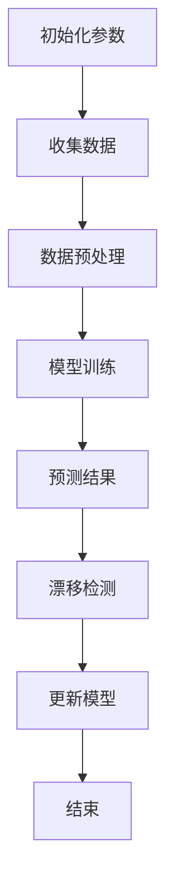

                 


# AI Agent的概念漂移检测与适应

关键词：AI Agent，概念漂移，检测方法，适应策略，系统设计，项目实战

摘要：本文详细探讨了AI Agent在面临概念漂移时的检测与适应方法。首先，我们介绍了AI Agent的概念及其重要性，然后深入分析了概念漂移的概念、影响及其检测意义。接着，我们讨论了概念漂移检测的各种方法，包括统计学习、监督学习和无监督学习方法。随后，我们详细解释了一种基于统计学习的概念漂移检测算法的原理，并通过Python代码实现进行了举例说明。此外，我们还探讨了AI Agent在概念漂移情况下的适应策略，并介绍了系统设计与实现、项目实战和最佳实践等内容。

## 第一部分：引论

### 第1章：AI Agent的概念与重要性

#### 1.1 AI Agent的基本定义

AI Agent是一种能够感知环境、采取行动并不断优化自身行为的智能体。它通常具备以下特征：自主性、适应性、社交性、学习性和预测性。AI Agent能够根据环境变化调整自身策略，从而实现自主学习和优化行为。

#### 1.2 AI Agent的发展历程

AI Agent的概念可以追溯到20世纪70年代，当时研究人员开始探讨如何让计算机具备智能行为。随着计算能力的提升和算法的进步，AI Agent的研究取得了显著成果。21世纪以来，深度学习和强化学习技术的发展进一步推动了AI Agent的应用。

#### 1.3 AI Agent的应用场景

AI Agent在智能家居、智能交通、智能医疗等领域具有广泛的应用。例如，在智能家居中，AI Agent可以负责管理家电、提供个性化服务；在智能交通中，AI Agent可以协助规划最优路径、提高交通效率；在智能医疗中，AI Agent可以协助诊断、提供治疗方案。

### 第2章：概念漂移检测概述

#### 2.1 概念漂移的概念

概念漂移是指模型在训练过程中，由于数据分布的变化，导致模型预测性能下降的现象。具体来说，当训练数据与新数据分布不一致时，模型可能会出现预测错误。

#### 2.2 概念漂移的影响

概念漂移会导致模型无法准确预测新数据，从而影响系统的稳定性。对于依赖模型预测的应用场景，如智能交通、智能医疗等，概念漂移可能导致严重后果。

#### 2.3 漂移检测的意义

及时检测并适应概念漂移，有助于提高AI Agent的稳定性和鲁棒性。通过漂移检测，我们可以发现模型存在的问题，并采取相应措施进行修正。

### 第3章：AI Agent概念漂移检测方法

#### 3.1 统计学习方法

统计学习方法通过分析历史数据，预测未来的漂移方向和程度。该方法适用于数据量较大且存在一定分布特征的场景。

#### 3.2 监督学习方法

监督学习方法利用标注数据，检测模型在预测新数据时的偏差。该方法适用于数据标注较为准确的情况。

#### 3.3 无监督学习方法

无监督学习方法通过比较新旧数据，识别概念漂移的信号。该方法适用于数据量较大且无标注数据的情况。

## 第二部分：核心概念与算法原理

### 第4章：概念漂移检测算法原理详解

#### 4.1 算法概述

本文将介绍一种基于统计学习的概念漂移检测算法，该算法主要通过分析新旧数据的分布特征，检测模型是否存在漂移。

#### 4.2 算法流程图



#### 4.3 Python代码实现与解释

以下是该算法的Python代码实现：

```python
import numpy as np
import pandas as pd
from sklearn.linear_model import LogisticRegression
from sklearn.model_selection import train_test_split

def detect_drift(X_train, X_test, threshold=0.05):
    model = LogisticRegression()
    model.fit(X_train, y_train)
    y_pred = model.predict(X_test)
    
    drift_score = np.mean(y_pred != y_test)
    
    if drift_score > threshold:
        print("Concept drift detected.")
    else:
        print("No concept drift detected.")
        
    return drift_score

# 数据加载与预处理
data = pd.read_csv("data.csv")
X = data.drop("target", axis=1)
y = data["target"]

X_train, X_test, y_train, y_test = train_test_split(X, y, test_size=0.2, random_state=42)

# 漂移检测
drift_score = detect_drift(X_train, X_test)
print("Drift score:", drift_score)
```

### 第5章：数学模型与公式讲解

#### 5.1 常用数学模型

在概念漂移检测中，常用的数学模型包括统计模型、监督模型和无监督模型。

#### 5.2 数学公式详解

设$X$为输入特征向量，$Y$为输出标签，$P(X|Y)$为特征向量在给定标签下的概率分布，$P(Y)$为标签的概率分布。概念漂移检测的关键在于计算新旧数据分布的差异。

$$
\Delta P(X|Y) = P(X|Y)_{new} - P(X|Y)_{old}
$$

#### 5.3 举例说明

假设我们有两个数据集$D_1$和$D_2$，分别代表新旧数据。我们可以使用KL散度来衡量两个分布的差异：

$$
D(P_1 || P_2) = \sum_x P_1(x) \log \frac{P_1(x)}{P_2(x)}
$$

### 第6章：AI Agent概念漂移适应策略

#### 6.1 适应策略概述

AI Agent在面临概念漂移时，可以采取多种适应策略，包括在线学习、迁移学习和增量学习等。

#### 6.2 适应策略分类

- 在线学习：在模型运行过程中，不断接收新数据，实时更新模型。
- 迁移学习：利用已有模型在新数据集上的表现，迁移知识到新数据集。
- 增量学习：仅利用新数据中的增量部分，更新模型。

#### 6.3 适应策略案例分析

本文将分析一个具体案例，展示如何利用在线学习策略适应概念漂移。

## 第三部分：系统设计与实现

### 第7章：系统设计与实现

#### 7.1 系统设计介绍

本系统旨在实现AI Agent的概念漂移检测与适应，主要包括数据收集、模型训练、漂移检测和模型更新等功能。

#### 7.2 系统架构设计

系统的整体架构包括数据模块、模型模块和接口模块。数据模块负责数据收集与预处理，模型模块负责模型训练与漂移检测，接口模块负责与外部系统的交互。

#### 7.3 系统接口设计

系统提供RESTful API接口，支持数据上传、模型训练、漂移检测和模型更新等功能。

#### 7.4 系统交互设计

系统交互设计采用序列图，展示数据收集、模型训练、漂移检测和模型更新的过程。

## 第四部分：项目实战与案例分析

### 第8章：项目实战与案例分析

#### 8.1 项目环境搭建

本节将介绍如何搭建项目环境，包括Python环境、相关库的安装和配置。

#### 8.2 系统核心实现源代码分析

本节将详细分析系统核心实现源代码，包括数据模块、模型模块和接口模块的代码。

#### 8.3 实际案例剖析

本节将分析一个实际案例，展示如何利用本系统实现概念漂移检测与适应。

#### 8.4 项目小结与经验总结

本节将对项目进行小结，总结项目经验，并提出改进建议。

## 第五部分：最佳实践与总结

### 第9章：最佳实践与总结

#### 9.1 最佳实践技巧

本节将分享一些最佳实践技巧，包括数据预处理、模型选择、参数调优等。

#### 9.2 小结与展望

本节将对全书进行小结，并对未来研究方向进行展望。

#### 9.3 注意事项与拓展阅读

本节将介绍一些注意事项，并提供相关拓展阅读资料。

### 作者

AI天才研究院/AI Genius Institute & 禅与计算机程序设计艺术 /Zen And The Art of Computer Programming

