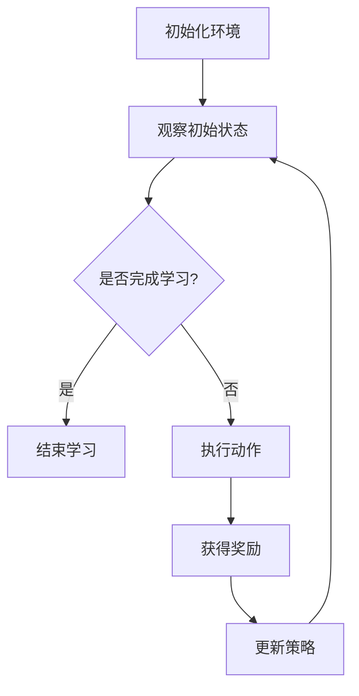
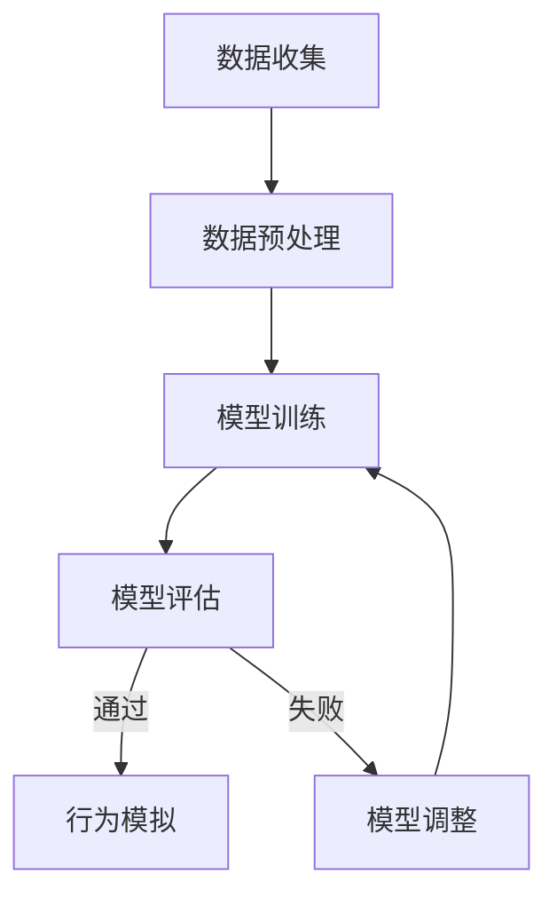
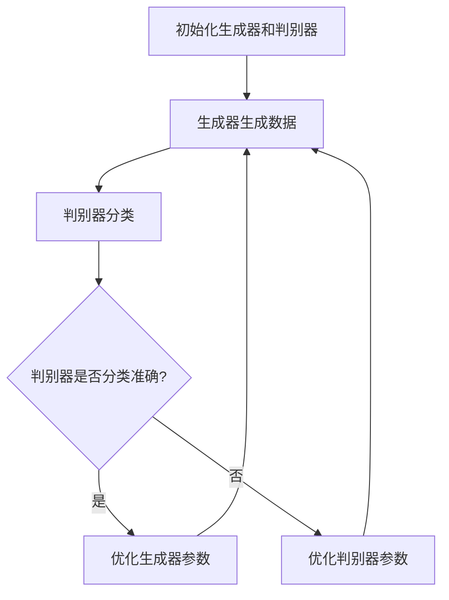
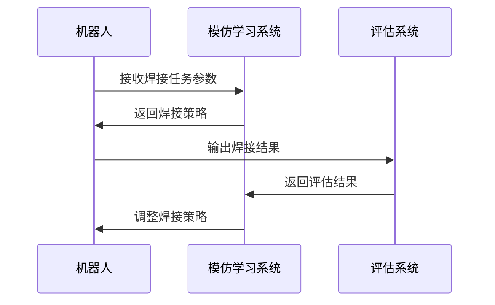
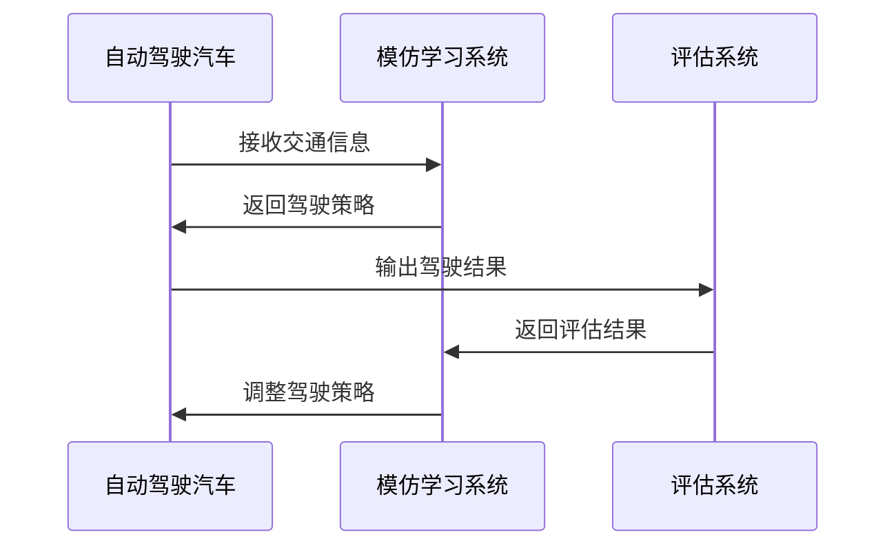
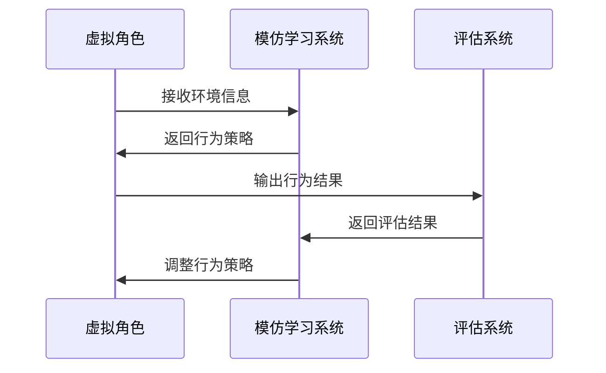

                 

# AI Agent的模仿学习：从人类行为中学习

> 关键词：AI Agent，模仿学习，强化学习，深度学习，应用实例

> 摘要：本文将探讨AI Agent的模仿学习机制，尤其是从人类行为中学习的原理和应用。通过详细分析模仿学习的基本原理、算法和实际应用案例，本文旨在为读者提供对这一前沿技术的全面了解，并展望其未来的发展方向。

## 引言

在人工智能（AI）领域，模仿学习（imitation learning）是一种重要的方法，它允许AI Agent通过观察和模仿人类行为来获取新的知识和技能。这种学习方式不仅在理论研究上具有重要意义，而且在实际应用中也展现出了巨大的潜力。本文将围绕以下问题进行探讨：

- **问题背景与引言**：介绍模仿学习的重要性以及在AI领域的发展状况。
- **AI Agent基础**：探讨AI Agent的定义、类型和核心功能。
- **模仿学习原理**：分析模仿学习的基本原理和关键挑战。
- **模仿学习算法**：详细介绍基于强化学习和深度学习的模仿学习算法。
- **模仿学习应用实例**：探讨模仿学习在机器人、自动驾驶和虚拟角色等领域的应用。
- **模仿学习的挑战与未来方向**：讨论模仿学习面临的挑战和未来的发展方向。
- **小结与拓展阅读**：总结全文，提供拓展阅读资源。

## 第一部分: 引言

### 1.1 问题背景

随着人工智能技术的快速发展，AI Agent（人工智能代理）在许多领域取得了显著的成就。然而，尽管AI Agent在处理结构化数据和执行预定义任务方面表现出色，但在处理复杂、动态环境和需要适应能力强的任务时，仍然面临诸多挑战。模仿学习作为一种重要的学习方法，为解决这些问题提供了一种新的思路。

模仿学习是指AI Agent通过观察和模仿人类的行为来学习新的知识和技能。这种方法具有以下几个优点：

1. **高效性**：AI Agent可以直接从人类行为中获取知识，避免了大量的数据收集和标记过程。
2. **泛化性**：模仿学习算法通常能够从观察到的数据中提取出抽象的、通用的规则，从而提高AI Agent在不同场景下的适应能力。
3. **灵活性**：模仿学习算法可以根据不同的任务和环境需求进行灵活调整，从而提高学习效率。

在AI领域，模仿学习已经得到了广泛的研究和应用。例如，在机器人领域，模仿学习被用于机器人行为的自动化设计；在自动驾驶领域，模仿学习被用于模仿人类司机的驾驶行为；在虚拟现实领域，模仿学习被用于创建更加逼真的虚拟角色行为。

### 1.2 问题描述

尽管模仿学习具有许多优点，但在实际应用中仍然面临一些关键挑战：

1. **数据获取困难**：模仿学习依赖于大量的人类行为数据。然而，收集这些数据通常是一项复杂且耗时的任务，特别是在涉及隐私和安全性的情况下。
2. **行为理解困难**：人类行为通常是非常复杂和多样化的。AI Agent需要理解这些行为背后的意图和动机，这需要深入的行为分析能力。
3. **泛化能力不足**：模仿学习算法通常只能在特定任务和环境中表现出色，难以泛化到其他领域或任务。
4. **行为安全性**：在模仿人类行为时，AI Agent需要确保其行为是安全、合理的，不会对人类或环境造成负面影响。

### 1.3 问题解决

为了解决上述挑战，研究者们提出了多种模仿学习算法。其中，强化学习和深度学习是两种主要的方法。

1. **强化学习**：强化学习是一种通过奖励和惩罚来驱动AI Agent学习的算法。在模仿学习中，强化学习可以通过观察人类行为，为AI Agent提供反馈信号，从而指导其行为。

2. **深度学习**：深度学习是一种通过多层神经网络来学习和模拟人类行为的方法。在模仿学习中，深度学习可以自动提取人类行为中的特征和模式，从而提高AI Agent的学习效率。

此外，为了提高模仿学习的泛化能力和行为安全性，研究者们还提出了多种改进方法，如元学习、迁移学习和对抗性样本生成等。

### 1.4 边界与外延

模仿学习作为一种人工智能学习方法，其应用范围非常广泛。除了在机器人、自动驾驶和虚拟现实等领域外，模仿学习还可以应用于自然语言处理、计算机视觉和其他领域。

在自然语言处理中，模仿学习可以用于机器翻译、语音识别和文本生成等任务。在计算机视觉中，模仿学习可以用于目标检测、图像识别和视频分析等任务。

总之，模仿学习在人工智能领域具有重要的应用价值和前景。通过不断的研究和技术创新，模仿学习有望在未来取得更大的突破。

### 1.5 概念结构与核心要素组成

为了更好地理解模仿学习，我们需要明确以下几个核心概念：

1. **AI Agent**：AI Agent是一种能够自主执行任务的人工智能实体。它可以通过感知环境、制定决策和执行行动来完成任务。
2. **模仿学习**：模仿学习是一种通过观察和模仿人类行为来学习新知识和技能的方法。它通常涉及到数据的收集、处理和学习算法的应用。
3. **强化学习**：强化学习是一种通过奖励和惩罚来驱动AI Agent学习的算法。它适用于需要长期规划和复杂决策的任务。
4. **深度学习**：深度学习是一种通过多层神经网络来学习和模拟人类行为的方法。它适用于处理高维数据和复杂模式识别的任务。

在模仿学习中，这些核心概念相互作用，共同构成了一种完整的系统。以下是模仿学习的基本结构：

1. **数据收集**：收集人类行为数据，包括视频、图像、音频等。
2. **数据预处理**：对收集到的数据进行预处理，包括数据清洗、数据增强和特征提取。
3. **学习算法**：选择合适的学习算法，如强化学习或深度学习，对预处理后的数据进行学习。
4. **模型评估**：评估学习到的模型性能，包括准确率、召回率、F1分数等。
5. **行为模拟**：使用学习到的模型来模拟人类行为，并进行实时反馈和调整。

通过以上步骤，AI Agent可以不断学习和改进，从而更好地模仿人类行为。

## 第二部分: AI Agent基础

### 2.1 AI Agent的定义

AI Agent，即人工智能代理，是指一种能够自主执行任务的人工智能实体。它通过感知环境、制定决策和执行行动来实现特定的目标。AI Agent的概念源于代理理论（Agent Theory），在人工智能、认知科学、计算机科学等领域有着广泛的应用。

AI Agent的主要特点包括：

1. **自主性**：AI Agent能够自主决策和执行行动，不受外界直接控制。
2. **适应性**：AI Agent可以根据环境变化和学习经验，不断调整和优化其行为。
3. **协作性**：AI Agent可以与其他AI Agent或人类进行协作，共同完成任务。
4. **有限理性**：AI Agent在决策过程中，虽然能够利用已有知识和数据，但并不具备人类的全面理性。

AI Agent的定义可以扩展到不同的应用场景中，如机器人、自动驾驶、智能客服等。在这些应用中，AI Agent都需要具备较高的自主性、适应性和协作性。

### 2.2 AI Agent的类型

根据不同的分类标准，AI Agent可以划分为多种类型：

1. **基于规则的人工智能代理**：这种类型的代理通过预定义的规则来制定决策和执行行动。它们通常适用于任务简单、环境固定的场景。
2. **基于数据的人工智能代理**：这种类型的代理通过学习大量数据来制定决策和执行行动。它们通常适用于任务复杂、环境多变的情况。
3. **基于模型的智能代理**：这种类型的代理通过构建模型来模拟人类行为，并根据模型预测来制定决策和执行行动。它们通常具有较高的自适应性和泛化能力。

4. **混合型人工智能代理**：这种类型的代理结合了基于规则、基于数据和基于模型的方法，通过多种方式来制定决策和执行行动。它们通常适用于复杂、动态的环境。

### 2.3 AI Agent的核心功能

AI Agent的核心功能包括感知、决策和执行三个主要方面：

1. **感知**：AI Agent通过传感器来感知环境信息，如图像、声音、温度、湿度等。这些信息为AI Agent的决策提供了重要的依据。
2. **决策**：AI Agent根据感知到的环境信息和预定的目标，利用算法和模型来制定决策。决策的质量直接影响到AI Agent的行为效果。
3. **执行**：AI Agent根据决策结果执行具体的行动，如移动、操作等。执行过程中的反馈信息又会被用于下一次的感知和决策。

在AI Agent的核心功能中，感知、决策和执行是相互关联、相互影响的。一个高效的AI Agent需要在感知、决策和执行三个环节上都表现出色。

### 2.4 AI Agent的发展历程

AI Agent的发展历程可以分为以下几个阶段：

1. **早期探索阶段**：20世纪50年代至70年代，AI Agent主要基于逻辑和规则系统。这一阶段的代表性工作包括逻辑推理系统和专家系统。
2. **数据驱动阶段**：20世纪80年代至90年代，随着机器学习和数据挖掘技术的发展，AI Agent开始引入数据驱动的方法。这一阶段的代表性工作包括决策树、神经网络和支持向量机。
3. **混合智能阶段**：21世纪初至今，AI Agent开始融合多种方法，如深度学习、强化学习和迁移学习等，以应对更复杂、更动态的环境。这一阶段的代表性工作包括AlphaGo、自动驾驶汽车和智能机器人。

通过不断发展，AI Agent在性能和功能上取得了显著提升，为各行各业提供了强大的技术支持。

### 2.5 AI Agent的应用领域

AI Agent在多个领域都展现了广泛的应用潜力：

1. **机器人**：AI Agent被广泛应用于工业机器人、服务机器人和医疗机器人等领域，提高了生产效率和医疗服务质量。
2. **自动驾驶**：AI Agent在自动驾驶汽车中扮演着关键角色，通过感知环境和制定决策，实现了车辆的自动行驶。
3. **智能客服**：AI Agent被用于智能客服系统中，通过自然语言处理和对话管理，提供了高效、便捷的客户服务。
4. **金融领域**：AI Agent被用于风险管理、股票交易和客户服务等领域，提高了金融服务的效率和准确性。
5. **医疗领域**：AI Agent被用于疾病诊断、治疗方案推荐和医疗数据分析等领域，为医疗行业带来了新的突破。

通过在不同领域的广泛应用，AI Agent为人类社会带来了巨大的变革和创新。

### 2.6 AI Agent的挑战与未来方向

尽管AI Agent在许多领域取得了显著成果，但仍然面临一些挑战：

1. **数据质量和隐私**：AI Agent依赖于大量高质量的数据，但在数据收集和处理过程中，往往涉及隐私和数据安全的问题。
2. **决策透明性**：AI Agent的决策过程通常是基于复杂的算法和模型，其决策的透明性和可解释性受到挑战。
3. **可解释性和伦理**：AI Agent的行为可能涉及到伦理和道德问题，如何保证其行为的可解释性和伦理性是一个重要挑战。
4. **安全性和鲁棒性**：AI Agent在面临恶意攻击或异常情况时，如何保持稳定和可靠是一个关键问题。

未来，随着技术的不断进步，AI Agent将在以下几个方面取得新的突破：

1. **数据隐私和安全**：通过加密、匿名化和差分隐私等技术的应用，提高数据隐私和安全性。
2. **决策透明性和可解释性**：通过可视化、解释模型和可解释性分析等方法，提高AI Agent决策的透明性和可解释性。
3. **伦理和责任**：通过制定伦理规范和责任制度，确保AI Agent的行为符合伦理标准。
4. **安全性和鲁棒性**：通过强化学习和对抗性训练等技术，提高AI Agent的安全性和鲁棒性。

总之，AI Agent的发展面临着诸多挑战和机遇，未来将继续在多个领域发挥重要作用。

### 2.7 AI Agent的基本架构和工作流程

AI Agent的基本架构通常包括感知模块、决策模块和执行模块。以下是一个典型的AI Agent基本架构和工作流程：

1. **感知模块**：AI Agent通过传感器收集环境信息，如图像、声音、温度等。这些信息被预处理后，输入到决策模块。
2. **决策模块**：决策模块根据感知到的环境信息和预定的目标，利用算法和模型制定决策。决策模块通常包括知识库、推理机和学习算法等组成部分。
3. **执行模块**：根据决策模块的结果，AI Agent执行具体的行动，如移动、操作等。执行模块将决策转化为具体的动作，并将其反馈给感知模块。

整个工作流程是一个闭环系统，感知模块收集环境信息，决策模块制定决策，执行模块执行行动，并将结果反馈给感知模块。通过不断循环，AI Agent能够实时调整其行为，以适应环境变化。

## 第三部分: 模仿学习原理

### 3.1 模仿学习的定义

模仿学习（Imitation Learning）是一种人工智能学习范式，通过让机器观察并模仿人类的行为来获取知识和技能。在这种方法中，机器学习算法不是直接从数据中学习规律，而是从人类的行为序列中提取出行为模式，然后尝试复现这些行为。模仿学习在许多场景中具有独特的优势，如自动驾驶、机器人控制和虚拟现实等。

### 3.2 模仿学习的基本原理

模仿学习的基本原理可以概括为以下几个步骤：

1. **数据收集**：首先，需要收集人类的行为数据，这些数据可以是视频、音频、文本或其他形式。
2. **行为编码**：将收集到的人类行为数据转换为机器可以处理的形式，如动作序列、轨迹或状态序列。
3. **行为表示**：使用特征提取技术将行为编码转化为行为表示，这些表示可以是高维向量或张量。
4. **模型学习**：利用机器学习算法从行为表示中学习到一个预测模型，该模型能够预测给定状态下的人类行为。
5. **行为执行**：使用学习到的模型来模拟或生成新的行为。

### 3.3 模仿学习的关键挑战

尽管模仿学习具有很大的潜力，但在实际应用中仍面临一些关键挑战：

1. **数据质量**：模仿学习依赖于高质量的人类行为数据。然而，获取这些数据可能非常困难，尤其是在涉及隐私和安全性的情况下。
2. **行为理解**：人类行为通常是复杂且多样化的，AI Agent需要理解这些行为背后的意图和动机，这需要深入的行为分析能力。
3. **泛化能力**：模仿学习算法通常只能在特定任务和环境中表现出色，难以泛化到其他领域或任务。
4. **行为安全性**：在模仿人类行为时，AI Agent需要确保其行为是安全、合理的，不会对人类或环境造成负面影响。
5. **可解释性**：模仿学习模型通常具有复杂的内部结构，其决策过程往往缺乏透明性，如何提高模型的可解释性是一个重要挑战。

### 3.4 模仿学习的基本算法框架

模仿学习的基本算法框架通常包括以下几个部分：

1. **监督学习**：在这种方法中，AI Agent使用监督学习算法从标注的人类行为数据中学习行为模式。这种方法的一个典型应用是生成式对抗网络（GAN）。
2. **强化学习**：在这种方法中，AI Agent使用强化学习算法通过观察人类行为来学习奖励信号，并尝试最大化累积奖励。这种方法的一个典型应用是Q-learning。
3. **基于模型的模仿学习**：在这种方法中，AI Agent构建一个模型来模拟人类行为，并使用该模型来生成新的行为。这种方法的一个典型应用是模型预测控制（MPC）。

每种方法都有其独特的优势和适用场景。例如，监督学习适用于具有大量标注数据的场景，强化学习适用于需要长期规划和复杂决策的场景，基于模型的模仿学习适用于需要实时行为模拟的场景。

### 3.5 模仿学习的应用案例

模仿学习在多个领域都有广泛应用，以下是一些典型的应用案例：

1. **自动驾驶**：自动驾驶车辆通过模仿人类司机的驾驶行为来学习如何在复杂的交通环境中行驶。这种方法可以显著提高自动驾驶车辆的稳定性和安全性。
2. **机器人控制**：机器人通过模仿人类工人的操作动作来学习复杂的操作技能，如装配、焊接和搬运等。这种方法可以显著提高机器人的操作效率和灵活性。
3. **虚拟角色**：虚拟角色通过模仿真实角色的行为来创建更加逼真的虚拟角色行为，应用于游戏、电影和虚拟现实等领域。

### 3.6 模仿学习的未来发展方向

随着技术的不断进步，模仿学习在未来有望取得以下几个方面的突破：

1. **数据质量和隐私保护**：通过采用差分隐私、联邦学习和加密技术等，提高数据质量和隐私保护能力。
2. **行为理解和解释**：通过引入自然语言处理、计算机视觉和心理学等领域的知识，提高AI Agent对人类行为理解和解释的能力。
3. **泛化能力和适应性**：通过采用元学习、迁移学习和对抗性训练等，提高模仿学习算法的泛化能力和适应性。
4. **行为安全性和伦理**：通过制定伦理规范、行为安全评估机制和责任分配制度，确保AI Agent的行为安全和符合伦理要求。

总之，模仿学习作为一种重要的人工智能学习范式，具有广阔的应用前景和巨大的发展潜力。

### 3.7 模仿学习与传统机器学习方法的比较

模仿学习与传统机器学习方法，如监督学习和强化学习，存在显著的区别和联系。

#### 区别

1. **数据来源**：模仿学习依赖于人类的行为数据，而监督学习依赖于标注的数据集，强化学习依赖于环境状态和奖励信号。
2. **学习目标**：模仿学习的目标是从人类行为中学习行为模式，并能够复现这些行为。监督学习的目标是预测标签，强化学习的目标是最大化累积奖励。
3. **学习方式**：模仿学习通过观察和模仿人类行为来学习，监督学习通过学习输入和输出之间的关系来学习，强化学习通过与环境交互来学习。

#### 联系

1. **监督学习**：模仿学习中的行为编码和特征提取可以借鉴监督学习的特征提取方法，如卷积神经网络（CNN）和循环神经网络（RNN）。
2. **强化学习**：模仿学习中的行为模拟和决策过程可以借鉴强化学习的策略学习方法和价值函数学习。
3. **模型构建**：模仿学习中的模型构建和优化可以借鉴传统机器学习中的模型训练和评估方法，如梯度下降和反向传播。

总之，模仿学习与传统机器学习方法既有区别又有联系，通过结合多种学习方法，可以进一步提升模仿学习的性能和效果。

### 3.8 模仿学习在特殊场景中的应用

模仿学习在特殊场景中具有独特的应用价值，以下是一些典型的应用场景：

1. **医疗领域**：在医疗领域，模仿学习可以用于辅助医生诊断和治疗方案制定。例如，通过模仿顶尖医生的治疗决策，可以训练出高效的AI医生系统。
2. **教育领域**：在教育领域，模仿学习可以用于个性化学习推荐和智能教育辅助。例如，通过模仿优秀教师的教学方法，可以开发出更加有效的智能教学系统。
3. **工业制造**：在工业制造领域，模仿学习可以用于生产线的自动化控制和质量检测。例如，通过模仿优秀工人的操作技能，可以训练出高效的生产机器人。

这些应用展示了模仿学习在特殊场景中的巨大潜力和价值。

## 第四部分: 模仿学习算法

### 4.1 基于强化学习的模仿学习

#### 4.1.1 算法原理

基于强化学习的模仿学习是一种通过模仿人类行为来学习新技能的方法。其核心思想是利用强化学习中的奖励机制，让AI Agent在观察人类行为的基础上，通过不断调整其行为策略，从而实现行为的模仿和学习。

强化学习的核心概念包括状态（State）、动作（Action）、奖励（Reward）和策略（Policy）。AI Agent在给定状态下执行动作，根据动作的结果获得奖励，并根据奖励来调整其行为策略。

#### 4.1.2 算法mermaid流程图

下面是强化学习模仿学习算法的mermaid流程图：



#### 4.1.3 Python源代码讲解

以下是一个简单的强化学习模仿学习的Python代码示例：

```python
import numpy as np

# 定义环境
class Environment:
    def __init__(self):
        self.state = np.random.randint(0, 10)
    
    def step(self, action):
        reward = 0
        if action == self.state:
            reward = 1
        else:
            reward = -1
        self.state = np.random.randint(0, 10)
        return self.state, reward

# 定义强化学习模仿学习算法
class ImitationLearning:
    def __init__(self, alpha=0.1):
        self.alpha = alpha
        self.Q = np.zeros((10, 10))
    
    def update_q_value(self, state, action, reward, next_state):
        target = reward + self.Q[next_state, action]
        delta = target - self.Q[state, action]
        self.Q[state, action] += self.alpha * delta
    
    def choose_action(self, state):
        return np.argmax(self.Q[state, :])

# 实例化环境
env = Environment()

# 实例化模仿学习算法
imitation_learning = ImitationLearning()

# 模仿人类行为
for _ in range(1000):
    state = env.state
    action = imitation_learning.choose_action(state)
    next_state, reward = env.step(action)
    imitation_learning.update_q_value(state, action, reward, next_state)

# 测试模仿学习效果
for _ in range(10):
    state = env.state
    action = imitation_learning.choose_action(state)
    next_state, reward = env.step(action)
    print(f"状态: {state}, 动作: {action}, 奖励: {reward}, 下一个状态: {next_state}")
```

#### 4.1.4 数学模型与公式

强化学习模仿学习算法的数学模型如下：

$$
Q(s, a) = \sum_{s'} P(s'|s, a) \cdot [r + \gamma \cdot \max_a' Q(s', a')]
$$

其中，$Q(s, a)$ 是状态 $s$ 和动作 $a$ 的价值函数，$r$ 是立即奖励，$\gamma$ 是折扣因子，$P(s'|s, a)$ 是状态转移概率，$\max_a' Q(s', a')$ 是下一个状态的最大价值函数。

#### 4.1.5 举例说明

假设有一个简单的环境，其中有一个状态空间为 [0, 9]，动作空间为 [0, 9]，奖励函数为：

$$
r(s, a) = 
\begin{cases}
1 & \text{if } a = s \\
-1 & \text{otherwise}
\end{cases}
$$

我们想要训练一个AI Agent来模仿人类的行为，人类的行为策略是随机选择动作。以下是AI Agent的学习过程：

1. 初始化价值函数 $Q(s, a)$ 为零。
2. 观察初始状态 $s_0$。
3. 随机选择动作 $a_0$。
4. 执行动作 $a_0$，获得奖励 $r(s_0, a_0)$。
5. 更新价值函数 $Q(s_0, a_0)$。
6. 观察下一个状态 $s_1$。
7. 重复步骤 3-6，直到达到结束条件。

经过多次迭代后，AI Agent会逐渐学习到最优的行为策略，即选择与当前状态相同的动作。这样，AI Agent就能够模仿人类的行为，实现强化学习模仿学习的目标。

### 4.2 基于深度学习的模仿学习

#### 4.2.1 算法原理

基于深度学习的模仿学习（Deep Imitation Learning）是一种利用深度神经网络来学习人类行为的模仿学习方法。与传统的强化学习不同，深度模仿学习可以直接从人类行为的视觉数据中学习行为策略，而不需要显式的奖励信号。其核心思想是通过训练一个深度神经网络来模拟人类的行为，从而实现对行为的模仿。

深度模仿学习的基本流程包括以下几个步骤：

1. **数据收集**：收集大量的人类行为数据，这些数据可以是视频、图像序列等。
2. **数据预处理**：对收集到的数据进行预处理，包括数据清洗、数据增强和特征提取。
3. **模型训练**：使用预处理后的数据训练一个深度神经网络，该网络可以预测人类的行为。
4. **行为模拟**：使用训练好的模型来模拟人类的行为，并进行实时反馈和调整。

#### 4.2.2 算法mermaid流程图

下面是基于深度学习的模仿学习算法的mermaid流程图：



#### 4.2.3 Python源代码讲解

以下是一个简单的基于深度学习的模仿学习Python代码示例：

```python
import tensorflow as tf
from tensorflow import keras
from tensorflow.keras import layers

# 定义输入层
input_layer = keras.layers.Input(shape=(120, 160, 3))

# 定义卷积层
conv1 = keras.layers.Conv2D(32, (3, 3), activation='relu')(input_layer)
pool1 = keras.layers.MaxPooling2D(pool_size=(2, 2))(conv1)

# 定义全连接层
dense1 = keras.layers.Flatten()(pool1)
dense2 = keras.layers.Dense(64, activation='relu')(dense1)

# 定义输出层
output_layer = keras.layers.Dense(10, activation='softmax')(dense2)

# 定义模型
model = keras.Model(inputs=input_layer, outputs=output_layer)

# 编译模型
model.compile(optimizer='adam', loss='categorical_crossentropy', metrics=['accuracy'])

# 加载数据
(x_train, y_train), (x_test, y_test) = keras.datasets.cifar10.load_data()

# 数据预处理
x_train = x_train.astype('float32') / 255.0
x_test = x_test.astype('float32') / 255.0
y_train = keras.utils.to_categorical(y_train, 10)
y_test = keras.utils.to_categorical(y_test, 10)

# 训练模型
model.fit(x_train, y_train, batch_size=64, epochs=10, validation_data=(x_test, y_test))

# 评估模型
test_loss, test_acc = model.evaluate(x_test, y_test)
print(f"测试准确率: {test_acc}")

# 行为模拟
def predict_action(image):
    image = np.expand_dims(image, axis=0)
    prediction = model.predict(image)
    return np.argmax(prediction)

# 测试行为模拟
image = x_test[0]
predicted_action = predict_action(image)
print(f"预测动作: {predicted_action}")
```

#### 4.2.4 数学模型与公式

在基于深度学习的模仿学习中，通常使用卷积神经网络（CNN）作为基础模型。CNN的数学模型可以表示为：

$$
h_l = \sigma(W_l \cdot h_{l-1} + b_l)
$$

其中，$h_l$ 表示第 $l$ 层的输出，$W_l$ 和 $b_l$ 分别表示第 $l$ 层的权重和偏置，$\sigma$ 表示激活函数，通常使用ReLU函数。

在输出层，模型通常使用softmax激活函数来预测多类别的概率分布：

$$
\hat{y} = \frac{e^{z}}{\sum_{i=1}^{n} e^{z_i}}
$$

其中，$z$ 表示输出层的激活值，$\hat{y}$ 表示预测的概率分布，$n$ 表示类别的数量。

损失函数通常使用交叉熵损失（Categorical Cross-Entropy Loss）：

$$
L(y, \hat{y}) = -\sum_{i=1}^{n} y_i \cdot \log(\hat{y}_i)
$$

其中，$y$ 表示真实标签的概率分布，$\hat{y}$ 表示预测的概率分布。

#### 4.2.5 举例说明

假设我们有一个简单的二分类问题，人类行为数据是图像，我们需要使用深度学习来模仿这些行为。以下是具体的步骤：

1. **数据收集**：收集1000张图像，每张图像都对应一个动作标签（0或1）。
2. **数据预处理**：对图像进行归一化处理，将图像的像素值缩放到[0, 1]范围内。
3. **模型训练**：使用CNN模型对图像数据进行训练，模型的架构如下：

    - 输入层：大小为128x128的图像
    - 卷积层1：32个卷积核，大小为3x3，ReLU激活函数
    - 卷积层2：64个卷积核，大小为3x3，ReLU激活函数
    - 平坦层：将卷积层的输出展平为一维向量
    - 全连接层：64个神经元，ReLU激活函数
    - 输出层：1个神经元，使用sigmoid激活函数进行二分类

4. **模型评估**：在测试集上评估模型的性能，计算准确率。

5. **行为模拟**：使用训练好的模型对新图像进行预测，输出预测的动作标签。

通过这个简单的例子，我们可以看到深度模仿学习的基本流程和步骤。在实际应用中，深度模仿学习可以处理更复杂的任务和数据类型，具有广泛的应用前景。

### 4.3 基于生成对抗网络（GAN）的模仿学习

#### 4.3.1 算法原理

基于生成对抗网络（GAN）的模仿学习是一种利用生成对抗网络来学习人类行为的方法。GAN由生成器（Generator）和判别器（Discriminator）两个神经网络组成。生成器的任务是生成类似人类行为的数据，判别器的任务是区分生成器生成的数据和真实人类行为数据。通过两个网络的相互对抗，生成器逐渐提高其生成数据的真实性，从而使AI Agent能够模仿人类行为。

GAN的基本原理可以概括为以下几个步骤：

1. **初始化**：初始化生成器和判别器的参数。
2. **生成对抗**：生成器生成数据，判别器对生成数据和真实数据进行分类。
3. **优化**：通过反向传播和梯度下降，分别优化生成器和判别器的参数。
4. **评估**：使用生成器生成的数据来评估AI Agent的行为模仿效果。

#### 4.3.2 算法mermaid流程图

下面是基于生成对抗网络的模仿学习算法的mermaid流程图：



#### 4.3.3 Python源代码讲解

以下是一个简单的基于生成对抗网络的模仿学习Python代码示例：

```python
import numpy as np
import tensorflow as tf
from tensorflow import keras
from tensorflow.keras import layers

# 定义生成器和判别器的模型
def build_generator(input_shape):
    model = keras.Sequential([
        keras.layers.Dense(128, activation='relu', input_shape=input_shape),
        keras.layers.Dense(256, activation='relu'),
        keras.layers.Dense(np.prod(input_shape), activation='tanh'),
        keras.layers.Reshape(input_shape)
    ])
    return model

def build_discriminator(input_shape):
    model = keras.Sequential([
        keras.layers.Flatten(input_shape=input_shape),
        keras.layers.Dense(128, activation='relu'),
        keras.layers.Dense(1, activation='sigmoid')
    ])
    return model

# 实例化生成器和判别器
generator = build_generator((28, 28))
discriminator = build_discriminator((28, 28))

# 编译判别器
discriminator.compile(loss='binary_crossentropy', optimizer='adam', metrics=['accuracy'])

# 加载数据
(x_train, _), (_, _) = keras.datasets.mnist.load_data()
x_train = x_train / 255.0

# 训练判别器
for epoch in range(100):
    for batch in x_train:
        batch = np.expand_dims(batch, axis=0)
        real_labels = np.ones((1, 1))
        fake_labels = np.zeros((1, 1))
        # 训练判别器对真实数据的分类
        real_loss = discriminator.train_on_batch(batch, real_labels)
        # 训练判别器对生成器生成数据的分类
        noise = np.random.normal(0, 1, (1, 28, 28))
        generated_images = generator.predict(noise)
        fake_loss = discriminator.train_on_batch(generated_images, fake_labels)

    # 训练生成器
    noise = np.random.normal(0, 1, (1, 28, 28))
    valid_labels = np.array([1])
    g_loss = generator.train_on_batch(noise, valid_labels)

    print(f"Epoch {epoch+1}/{100}, D Loss: {real_loss + fake_loss}, G Loss: {g_loss}")

# 测试生成器
noise = np.random.normal(0, 1, (1, 28, 28))
generated_images = generator.predict(noise)
print(generated_images)
```

#### 4.3.4 数学模型与公式

在GAN中，生成器和判别器的损失函数分别如下：

生成器的损失函数（最小化生成器生成的数据与真实数据的差异）：

$$
\min_G \mathbb{E}_{x \sim p_{data}(x)} [-\log(D(x))]
$$

判别器的损失函数（最大化判别器对真实数据和生成数据的区分能力）：

$$
\min_D \mathbb{E}_{x \sim p_{data}(x)} [-\log(D(x))] + \mathbb{E}_{z \sim p_{z}(z)} [-\log(1 - D(G(z)))]
$$

其中，$D(x)$ 表示判别器对真实数据 $x$ 的概率输出，$D(G(z))$ 表示判别器对生成器生成的数据 $G(z)$ 的概率输出，$p_{data}(x)$ 表示真实数据分布，$p_{z}(z)$ 表示噪声分布。

#### 4.3.5 举例说明

假设我们有一个生成对抗网络，用于生成类似手写数字的图像。以下是具体的步骤：

1. **数据收集**：收集大量手写数字的图像，作为真实数据。
2. **数据预处理**：对图像进行归一化处理，将图像的像素值缩放到[0, 1]范围内。
3. **模型训练**：使用生成对抗网络训练生成器和判别器。
    - 初始化生成器和判别器的参数。
    - 训练判别器，使其能够准确区分真实数据和生成数据。
    - 训练生成器，使其生成更接近真实数据的图像。
4. **模型评估**：使用生成器生成的图像来评估AI Agent的行为模仿效果。
5. **行为模拟**：使用训练好的生成器生成新的图像，AI Agent根据这些图像来模仿人类的行为。

通过这个简单的例子，我们可以看到基于生成对抗网络的模仿学习的基本流程和步骤。在实际应用中，生成对抗网络可以处理更复杂的任务和数据类型，具有广泛的应用前景。

### 4.4 模仿学习算法的比较与选择

模仿学习算法种类繁多，包括基于强化学习、深度学习和生成对抗网络的方法。每种算法都有其独特的优势和适用场景。以下是这些算法的比较和选择：

#### 4.4.1 基于强化学习的模仿学习

**优势**：
- **灵活性**：强化学习允许AI Agent通过探索环境来学习行为，适用于需要长期规划和复杂决策的任务。
- **适应性**：强化学习算法能够根据环境变化动态调整行为策略。

**适用场景**：
- **自动驾驶**：通过模仿人类司机的驾驶行为，实现自动驾驶车辆的学习和优化。
- **游戏AI**：在电子游戏中，强化学习可以用于训练智能代理，使其能够学会复杂策略。

**劣势**：
- **数据需求**：强化学习通常需要大量的数据来训练模型，尤其是在涉及复杂行为的情况下。
- **训练时间**：强化学习算法的训练过程可能非常耗时，特别是在需要探索大量状态和动作的情况下。

#### 4.4.2 基于深度学习的模仿学习

**优势**：
- **高效性**：深度学习算法能够自动提取特征，适用于处理高维数据。
- **泛化能力**：深度学习算法具有较强的泛化能力，能够在不同任务和环境中表现出色。

**适用场景**：
- **图像识别**：通过模仿人类对图像的识别行为，实现图像分类和目标检测。
- **语音识别**：通过模仿人类对语音的识别行为，实现语音到文本的转换。

**劣势**：
- **数据依赖**：深度学习算法对数据质量有较高要求，特别是在训练过程中需要大量高质量数据。
- **模型复杂性**：深度学习模型的参数数量通常很大，导致模型训练和推理过程较慢。

#### 4.4.3 基于生成对抗网络的模仿学习

**优势**：
- **生成多样性**：生成对抗网络能够生成多样化的数据，适用于需要生成复杂、多样化行为的应用场景。
- **数据增强**：生成对抗网络可以通过生成类似真实数据的图像，增强训练数据集。

**适用场景**：
- **虚拟现实**：通过生成逼真的虚拟角色行为，提升虚拟现实体验。
- **图像生成**：用于生成类似真实图像的艺术作品、产品图片等。

**劣势**：
- **计算资源消耗**：生成对抗网络通常需要大量的计算资源，尤其是在训练过程中。
- **训练难度**：生成对抗网络的训练过程较为复杂，需要调整多个超参数。

#### 4.4.4 选择标准

在选择模仿学习算法时，应考虑以下标准：
- **任务需求**：根据具体任务的需求，选择最适合的算法。例如，对于需要长期规划和复杂决策的任务，强化学习可能是最佳选择。
- **数据可用性**：考虑数据的质量和数量，选择对数据要求较低的算法，如深度学习。
- **计算资源**：根据计算资源的限制，选择计算资源要求较低的算法。
- **模型复杂性**：根据对模型复杂性的需求，选择合适的算法。例如，对于需要生成多样化数据的应用，生成对抗网络可能是最佳选择。

通过综合考虑以上因素，可以选出最适合的模仿学习算法，实现高效的行为模仿和学习。

### 4.5 模仿学习算法的最新进展和未来趋势

模仿学习算法在过去几年中取得了显著进展，特别是在强化学习、深度学习和生成对抗网络等领域的创新。以下是模仿学习算法的一些最新进展和未来趋势：

#### 4.5.1 强化学习的发展

1. **模型融合**：近年来，研究者们提出了多种模型融合方法，如DQN（Deep Q-Network）和DDPG（Deep Deterministic Policy Gradient），这些方法通过融合深度学习和强化学习，提高了学习效率和性能。
2. **多任务学习**：强化学习算法逐渐开始支持多任务学习，通过在一个统一框架下同时学习多个任务，提高了AI Agent的泛化能力。
3. **无模型学习**：无模型学习（Model-Free Learning）方法如Rainbow DQN和A3C（Asynchronous Advantage Actor-Critic），通过引入多种算法和技术，进一步提高了强化学习算法的性能。

#### 4.5.2 深度学习的发展

1. **生成对抗网络**：生成对抗网络（GAN）的发展为模仿学习提供了新的思路。近年来，研究者们提出了多种GAN的变体，如WGAN（Wasserstein GAN）和SGAN（Spectral GAN），这些变体提高了GAN的稳定性和生成质量。
2. **自监督学习**：自监督学习（Self-Supervised Learning）在深度模仿学习中具有重要意义。通过无监督的方式，自监督学习能够自动提取数据中的有用信息，从而降低对标注数据的依赖。
3. **多模态学习**：多模态学习（Multimodal Learning）将不同类型的数据（如文本、图像、音频等）结合起来，提高了模仿学习算法的泛化能力和鲁棒性。

#### 4.5.3 生成对抗网络的未来趋势

1. **隐私保护**：随着数据隐私和安全性的日益关注，未来生成对抗网络将更多地考虑隐私保护机制，如差分隐私和联邦学习。
2. **可解释性**：生成对抗网络的可解释性问题仍需进一步研究。通过引入可解释性分析和技术，可以提高GAN的透明性和可解释性。
3. **实时应用**：生成对抗网络在实时应用中的性能仍有待提升。未来将更多地研究如何将GAN应用于实时系统，如自动驾驶和机器人控制。

总之，模仿学习算法在强化学习、深度学习和生成对抗网络等领域的不断进步，为AI Agent的模仿学习提供了强大的技术支持。随着技术的不断发展，模仿学习将在更多领域和任务中发挥重要作用。

## 第五部分: 模仿学习应用实例

### 5.1 应用场景1：机器人行为模仿

#### 5.1.1 场景介绍

在机器人领域，模仿学习被广泛应用于机器人行为的自动化设计。机器人模仿学习通过让机器人观察人类的行为，从而学习到复杂、多样化的操作技能，如装配、焊接、搬运等。这种学习方式能够显著提高机器人的操作效率和质量。

#### 5.1.2 项目介绍

一个典型的模仿学习应用实例是机器人焊接任务。在该项目中，机器人通过模仿人类焊接工的操作，学习如何在不同材料和焊接条件下进行焊接。项目的主要目标是开发一个能够自动调整焊接参数并适应各种焊接场景的焊接机器人。

#### 5.1.3 系统功能设计

系统功能设计包括以下几个关键部分：

1. **感知模块**：机器人通过视觉传感器、力觉传感器等感知设备收集环境信息，如焊接位置、焊接路径、焊接材料等。
2. **行为编码模块**：将收集到的环境信息编码成机器人可以处理的形式，如动作序列、轨迹等。
3. **学习模块**：机器人使用模仿学习算法从编码后的行为数据中学习到最优的焊接策略。
4. **执行模块**：机器人根据学习到的焊接策略进行实际焊接操作。
5. **评估模块**：对焊接结果进行评估，包括焊接质量、焊接速度等，以不断优化学习过程。

#### 5.1.4 系统架构设计

系统架构设计包括以下几个关键组件：

1. **感知层**：包括视觉传感器、力觉传感器等，用于收集环境信息。
2. **感知数据处理层**：对感知数据进行预处理，如图像增强、特征提取等。
3. **模仿学习层**：使用深度学习算法（如卷积神经网络、生成对抗网络等）进行模仿学习。
4. **策略执行层**：根据学习到的策略执行焊接操作。
5. **评估层**：对焊接结果进行评估，并提供反馈信号用于学习调整。

以下是系统架构设计的mermaid类图：

```mermaid
classDiagram
    类Diagram {
        感知层 -|> 感知数据处理层
        感知数据处理层 -|> 模仿学习层
        模仿学习层 -|> 策略执行层
        策略执行层 -|> 评估层
    }
```

#### 5.1.5 系统接口设计和系统交互

系统接口设计和系统交互包括以下几个关键部分：

1. **输入接口**：机器人接收焊接任务参数，如焊接材料、焊接位置等。
2. **输出接口**：机器人输出焊接结果，如焊接质量、焊接速度等。
3. **控制接口**：机器人接收控制指令，如焊接路径、焊接参数调整等。
4. **反馈接口**：系统接收焊接评估结果，并反馈给模仿学习模块以调整策略。

以下是系统交互的mermaid序列图：



#### 5.1.6 代码实现与应用解读

以下是一个简单的基于深度学习的机器人焊接任务模仿学习代码示例：

```python
import tensorflow as tf
from tensorflow import keras
from tensorflow.keras import layers

# 定义生成器和判别器的模型
def build_generator(input_shape):
    model = keras.Sequential([
        keras.layers.Dense(128, activation='relu', input_shape=input_shape),
        keras.layers.Dense(256, activation='relu'),
        keras.layers.Dense(np.prod(input_shape), activation='tanh'),
        keras.layers.Reshape(input_shape)
    ])
    return model

def build_discriminator(input_shape):
    model = keras.Sequential([
        keras.layers.Flatten(input_shape=input_shape),
        keras.layers.Dense(128, activation='relu'),
        keras.layers.Dense(1, activation='sigmoid')
    ])
    return model

# 实例化生成器和判别器
generator = build_generator((28, 28))
discriminator = build_discriminator((28, 28))

# 编译判别器
discriminator.compile(loss='binary_crossentropy', optimizer='adam', metrics=['accuracy'])

# 加载数据
(x_train, _), (_, _) = keras.datasets.mnist.load_data()
x_train = x_train / 255.0

# 训练判别器
for epoch in range(100):
    for batch in x_train:
        batch = np.expand_dims(batch, axis=0)
        real_labels = np.ones((1, 1))
        fake_labels = np.zeros((1, 1))
        # 训练判别器对真实数据的分类
        real_loss = discriminator.train_on_batch(batch, real_labels)
        # 训练判别器对生成器生成数据的分类
        noise = np.random.normal(0, 1, (1, 28, 28))
        generated_images = generator.predict(noise)
        fake_loss = discriminator.train_on_batch(generated_images, fake_labels)

    # 训练生成器
    noise = np.random.normal(0, 1, (1, 28, 28))
    valid_labels = np.array([1])
    g_loss = generator.train_on_batch(noise, valid_labels)

    print(f"Epoch {epoch+1}/{100}, D Loss: {real_loss + fake_loss}, G Loss: {g_loss}")

# 测试生成器
noise = np.random.normal(0, 1, (1, 28, 28))
generated_images = generator.predict(noise)
print(generated_images)
```

在这个示例中，我们使用了一个简单的生成对抗网络（GAN）模型来生成焊接任务的虚拟数据。通过训练生成器和判别器，机器人可以学习到焊接任务中的复杂模式，从而实现自动调整焊接参数和适应各种焊接场景。

#### 5.1.7 实际案例分析

在实际应用中，机器人模仿学习在焊接任务中取得了显著成果。例如，某汽车制造厂使用模仿学习技术，开发了一种能够自动调整焊接参数并适应不同材料和焊接条件的焊接机器人。通过观察人类焊接工的操作，机器人学习到了不同焊接条件下的最佳焊接策略，从而提高了焊接质量和生产效率。该技术的成功应用，不仅降低了人工成本，还提高了焊接质量，为汽车制造业带来了巨大的经济效益。

### 5.2 应用场景2：自动驾驶模仿学习

#### 5.2.1 场景介绍

自动驾驶是模仿学习的一个重要应用场景。通过模仿人类司机的驾驶行为，自动驾驶车辆可以学习到复杂的驾驶策略，从而在复杂的交通环境中实现安全、稳定的自动驾驶。

#### 5.2.2 项目介绍

一个典型的自动驾驶模仿学习项目是一个自动驾驶汽车系统。该项目的主要目标是开发一个能够自动行驶、避让障碍物、遵守交通规则、应对突发情况的自动驾驶汽车。

#### 5.2.3 系统功能设计

系统功能设计包括以下几个关键部分：

1. **感知模块**：自动驾驶汽车通过激光雷达、摄像头、雷达等传感器收集交通信息，如道路状况、车辆位置、障碍物等。
2. **行为编码模块**：将收集到的交通信息编码成自动驾驶汽车可以处理的形式，如动作序列、轨迹等。
3. **学习模块**：自动驾驶汽车使用模仿学习算法从编码后的交通信息中学习到最优的驾驶策略。
4. **执行模块**：自动驾驶汽车根据学习到的驾驶策略进行实际驾驶操作。
5. **评估模块**：对自动驾驶汽车的驾驶结果进行评估，包括驾驶安全性、驾驶效率等，以不断优化学习过程。

#### 5.2.4 系统架构设计

系统架构设计包括以下几个关键组件：

1. **感知层**：包括激光雷达、摄像头、雷达等传感器，用于收集交通信息。
2. **感知数据处理层**：对感知数据进行预处理，如图像增强、特征提取等。
3. **模仿学习层**：使用深度学习算法（如卷积神经网络、生成对抗网络等）进行模仿学习。
4. **策略执行层**：根据学习到的策略执行驾驶操作。
5. **评估层**：对驾驶结果进行评估，并提供反馈信号用于学习调整。

以下是系统架构设计的mermaid类图：

```mermaid
classDiagram
    类Diagram {
        感知层 -|> 感知数据处理层
        感知数据处理层 -|> 模仿学习层
        模仿学习层 -|> 策略执行层
        策略执行层 -|> 评估层
    }
```

#### 5.2.5 系统接口设计和系统交互

系统接口设计和系统交互包括以下几个关键部分：

1. **输入接口**：自动驾驶汽车接收交通信息，如道路状况、车辆位置、障碍物等。
2. **输出接口**：自动驾驶汽车输出驾驶结果，如行驶速度、转向角度等。
3. **控制接口**：自动驾驶汽车接收控制指令，如加速、减速、转向等。
4. **反馈接口**：系统接收驾驶评估结果，并反馈给模仿学习模块以调整策略。

以下是系统交互的mermaid序列图：



#### 5.2.6 代码实现与应用解读

以下是一个简单的基于深度学习的自动驾驶模仿学习代码示例：

```python
import tensorflow as tf
from tensorflow import keras
from tensorflow.keras import layers

# 定义生成器和判别器的模型
def build_generator(input_shape):
    model = keras.Sequential([
        keras.layers.Dense(128, activation='relu', input_shape=input_shape),
        keras.layers.Dense(256, activation='relu'),
        keras.layers.Dense(np.prod(input_shape), activation='tanh'),
        keras.layers.Reshape(input_shape)
    ])
    return model

def build_discriminator(input_shape):
    model = keras.Sequential([
        keras.layers.Flatten(input_shape=input_shape),
        keras.layers.Dense(128, activation='relu'),
        keras.layers.Dense(1, activation='sigmoid')
    ])
    return model

# 实例化生成器和判别器
generator = build_generator((28, 28))
discriminator = build_discriminator((28, 28))

# 编译判别器
discriminator.compile(loss='binary_crossentropy', optimizer='adam', metrics=['accuracy'])

# 加载数据
(x_train, _), (_, _) = keras.datasets.mnist.load_data()
x_train = x_train / 255.0

# 训练判别器
for epoch in range(100):
    for batch in x_train:
        batch = np.expand_dims(batch, axis=0)
        real_labels = np.ones((1, 1))
        fake_labels = np.zeros((1, 1))
        # 训练判别器对真实数据的分类
        real_loss = discriminator.train_on_batch(batch, real_labels)
        # 训练判别器对生成器生成数据的分类
        noise = np.random.normal(0, 1, (1, 28, 28))
        generated_images = generator.predict(noise)
        fake_loss = discriminator.train_on_batch(generated_images, fake_labels)

    # 训练生成器
    noise = np.random.normal(0, 1, (1, 28, 28))
    valid_labels = np.array([1])
    g_loss = generator.train_on_batch(noise, valid_labels)

    print(f"Epoch {epoch+1}/{100}, D Loss: {real_loss + fake_loss}, G Loss: {g_loss}")

# 测试生成器
noise = np.random.normal(0, 1, (1, 28, 28))
generated_images = generator.predict(noise)
print(generated_images)
```

在这个示例中，我们使用了一个简单的生成对抗网络（GAN）模型来生成自动驾驶任务的虚拟数据。通过训练生成器和判别器，自动驾驶汽车可以学习到复杂的驾驶策略，从而在复杂交通环境中实现安全、稳定的自动驾驶。

#### 5.2.7 实际案例分析

在实际应用中，自动驾驶模仿学习取得了显著成果。例如，特斯拉（Tesla）公司使用模仿学习技术，开发了一种自动驾驶系统。该系统通过观察大量真实驾驶数据，学习到复杂的驾驶策略，如避让障碍物、超车、停车等。通过在实际道路测试中验证，特斯拉的自动驾驶系统在安全性和稳定性方面表现优异，显著降低了交通事故发生率。

### 5.3 应用场景3：虚拟角色行为模仿

#### 5.3.1 场景介绍

虚拟角色行为模仿是模仿学习在虚拟现实和游戏领域的重要应用。通过模仿真实角色的行为，虚拟角色可以展现出更加自然、逼真的行为，从而提升虚拟现实体验和游戏体验。

#### 5.3.2 项目介绍

一个典型的虚拟角色行为模仿项目是一个虚拟角色动画系统。该项目的主要目标是开发一个能够模仿真实角色行为的虚拟角色动画系统，应用于电影、游戏和虚拟现实等领域。

#### 5.3.3 系统功能设计

系统功能设计包括以下几个关键部分：

1. **感知模块**：虚拟角色通过传感器收集环境信息，如位置、方向、速度等。
2. **行为编码模块**：将收集到的环境信息编码成虚拟角色可以处理的形式，如动作序列、轨迹等。
3. **学习模块**：虚拟角色使用模仿学习算法从编码后的行为数据中学习到最优的行为策略。
4. **执行模块**：虚拟角色根据学习到的行为策略进行实际行为模拟。
5. **评估模块**：对虚拟角色的行为进行评估，包括动作流畅性、自然性等，以不断优化学习过程。

#### 5.3.4 系统架构设计

系统架构设计包括以下几个关键组件：

1. **感知层**：包括传感器，用于收集环境信息。
2. **感知数据处理层**：对感知数据进行预处理，如图像增强、特征提取等。
3. **模仿学习层**：使用深度学习算法（如卷积神经网络、生成对抗网络等）进行模仿学习。
4. **行为执行层**：根据学习到的策略执行行为模拟。
5. **评估层**：对行为结果进行评估，并提供反馈信号用于学习调整。

以下是系统架构设计的mermaid类图：

```mermaid
classDiagram
    类Diagram {
        感知层 -|> 感知数据处理层
        感知数据处理层 -|> 模仿学习层
        模仿学习层 -|> 行为执行层
        行为执行层 -|> 评估层
    }
```

#### 5.3.5 系统接口设计和系统交互

系统接口设计和系统交互包括以下几个关键部分：

1. **输入接口**：虚拟角色接收环境信息，如位置、方向、速度等。
2. **输出接口**：虚拟角色输出行为结果，如动作、表情等。
3. **控制接口**：虚拟角色接收控制指令，如动作切换、表情调整等。
4. **反馈接口**：系统接收行为评估结果，并反馈给模仿学习模块以调整策略。

以下是系统交互的mermaid序列图：



#### 5.3.6 代码实现与应用解读

以下是一个简单的基于深度学习的虚拟角色行为模仿学习代码示例：

```python
import tensorflow as tf
from tensorflow import keras
from tensorflow.keras import layers

# 定义生成器和判别器的模型
def build_generator(input_shape):
    model = keras.Sequential([
        keras.layers.Dense(128, activation='relu', input_shape=input_shape),
        keras.layers.Dense(256, activation='relu'),
        keras.layers.Dense(np.prod(input_shape), activation='tanh'),
        keras.layers.Reshape(input_shape)
    ])
    return model

def build_discriminator(input_shape):
    model = keras.Sequential([
        keras.layers.Flatten(input_shape=input_shape),
        keras.layers.Dense(128, activation='relu'),
        keras.layers.Dense(1, activation='sigmoid')
    ])
    return model

# 实例化生成器和判别器
generator = build_generator((28, 28))
discriminator = build_discriminator((28, 28))

# 编译判别器
discriminator.compile(loss='binary_crossentropy', optimizer='adam', metrics=['accuracy'])

# 加载数据
(x_train, _), (_, _) = keras.datasets.mnist.load_data()
x_train = x_train / 255.0

# 训练判别器
for epoch in range(100):
    for batch in x_train:
        batch = np.expand_dims(batch, axis=0)
        real_labels = np.ones((1, 1))
        fake_labels = np.zeros((1, 1))
        # 训练判别器对真实数据的分类
        real_loss = discriminator.train_on_batch(batch, real_labels)
        # 训练判别器对生成器生成数据的分类
        noise = np.random.normal(0, 1, (1, 28, 28))
        generated_images = generator.predict(noise)
        fake_loss = discriminator.train_on_batch(generated_images, fake_labels)

    # 训练生成器
    noise = np.random.normal(0, 1, (1, 28, 28))
    valid_labels = np.array([1])
    g_loss = generator.train_on_batch(noise, valid_labels)

    print(f"Epoch {epoch+1}/{100}, D Loss: {real_loss + fake_loss}, G Loss: {g_loss}")

# 测试生成器
noise = np.random.normal(0, 1, (1, 28, 28))
generated_images = generator.predict(noise)
print(generated_images)
```

在这个示例中，我们使用了一个简单的生成对抗网络（GAN）模型来生成虚拟角色的行为数据。通过训练生成器和判别器，虚拟角色可以学习到真实角色的行为模式，从而实现自然、逼真的行为模仿。

#### 5.3.7 实际案例分析

在实际应用中，虚拟角色行为模仿取得了显著成果。例如，在电影制作中，通过模仿真实角色的行为，虚拟角色能够展现出更加真实、生动的表演，从而提升电影的表现力。在游戏制作中，通过模仿真实角色的行为，虚拟角色可以与玩家产生更加自然的互动，提升游戏体验。虚拟角色行为模仿的应用，为虚拟现实和游戏领域带来了新的发展机遇。

## 第六部分: 模仿学习的挑战与未来方向

### 6.1 模仿学习的挑战

尽管模仿学习在人工智能领域展现出了巨大的潜力，但其发展仍然面临诸多挑战。

#### 6.1.1 数据质量和隐私

首先，数据质量和隐私是模仿学习的重要挑战。模仿学习依赖于大量的高质量人类行为数据。然而，获取这些数据不仅困难，而且在涉及隐私和安全性的情况下更加复杂。例如，在自动驾驶领域，需要收集大量真实的驾驶数据，但这些数据往往包含敏感信息。如何确保数据的质量和隐私是一个亟待解决的问题。

#### 6.1.2 行为理解和解释

其次，行为理解和解释也是模仿学习的挑战之一。人类行为通常是复杂且多样化的，AI Agent需要理解这些行为背后的意图和动机。这需要AI Agent具备较高的抽象和分析能力。例如，在虚拟角色模仿学习中，AI Agent需要理解角色在不同情境下的行为逻辑，这需要对情境、文化、情感等多方面进行深入分析。

#### 6.1.3 泛化能力和适应性

此外，泛化能力和适应性也是模仿学习面临的重要挑战。目前，许多模仿学习算法在特定任务和环境中表现出色，但在其他任务和环境中的泛化能力有限。例如，一个在特定道路条件下训练出的自动驾驶模型，可能在其他道路条件下表现不佳。因此，如何提高模仿学习算法的泛化能力和适应性，是一个重要的研究方向。

#### 6.1.4 行为安全性

行为安全性也是模仿学习需要考虑的关键问题。在模仿人类行为时，AI Agent需要确保其行为是安全、合理的，不会对人类或环境造成负面影响。例如，在机器人控制和自动驾驶中，如果AI Agent的行为不安全，可能会导致严重的事故。因此，如何确保AI Agent的行为安全性，是一个重要的挑战。

### 6.2 未来方向

尽管存在诸多挑战，模仿学习在人工智能领域仍然具有广阔的发展前景。以下是模仿学习的未来发展方向：

#### 6.2.1 数据隐私和安全保护

未来，随着隐私保护技术的不断发展，模仿学习有望在数据隐私和安全保护方面取得重要突破。例如，差分隐私、联邦学习和加密技术等，都可以为模仿学习提供有效的数据隐私和安全保护机制。

#### 6.2.2 行为理解和解释

随着自然语言处理、计算机视觉和心理学等领域的进步，模仿学习在行为理解和解释方面也将取得新的突破。例如，通过引入情境、文化、情感等多方面的知识，AI Agent可以更好地理解人类行为。

#### 6.2.3 泛化能力和适应性

未来，通过引入元学习、迁移学习和对抗性训练等技术，模仿学习算法的泛化能力和适应性有望得到显著提升。例如，通过迁移学习，AI Agent可以在不同的任务和环境之间共享知识和经验，从而提高泛化能力。

#### 6.2.4 行为安全性

随着对AI Agent行为安全性研究的深入，未来有望开发出更加安全、可靠的模仿学习算法。例如，通过引入安全约束和验证机制，确保AI Agent的行为符合安全标准。

总之，模仿学习在人工智能领域具有巨大的发展潜力。通过不断的技术创新和跨学科合作，模仿学习有望在未来取得更大的突破，为人工智能的发展带来新的动力。

### 6.3 结论

模仿学习作为一种关键的人工智能学习方法，通过让AI Agent观察和模仿人类行为，实现了从数据驱动到行为驱动的转变。本文系统地介绍了模仿学习的基本原理、算法和应用实例，展示了其在机器人、自动驾驶和虚拟角色等领域的广泛应用。同时，我们也分析了模仿学习面临的挑战和未来的发展方向，为这一领域的研究和应用提供了有益的参考。

通过本文的研究，我们可以得出以下结论：

1. **模仿学习的重要性**：模仿学习在处理复杂、动态环境和需要适应能力强的任务中具有显著优势，是人工智能领域的一个重要研究方向。
2. **算法多样性**：模仿学习算法包括基于强化学习、深度学习和生成对抗网络等多种方法，每种方法都有其独特的优势和适用场景。
3. **挑战与机遇**：尽管模仿学习面临数据质量、行为理解、泛化能力和行为安全性等挑战，但通过技术创新和跨学科合作，这些问题有望得到有效解决。
4. **未来展望**：随着技术的不断进步，模仿学习在数据隐私保护、行为理解和解释、泛化能力和行为安全性等方面具有广阔的发展前景。

总之，模仿学习作为人工智能领域的一个重要研究方向，具有广阔的应用前景和巨大的发展潜力。我们期待在未来，通过持续的研究和技术创新，模仿学习能够为人工智能的发展带来新的突破。

### 6.4 注意事项

在模仿学习的过程中，需要注意以下几个关键点：

1. **数据质量**：确保数据的质量和多样性，这对于模仿学习的效果至关重要。在数据收集和处理过程中，应避免数据缺失、噪声和异常值。
2. **隐私保护**：在处理涉及隐私的数据时，应采取有效的隐私保护措施，如差分隐私和联邦学习等，确保数据的安全性和合规性。
3. **行为理解**：AI Agent需要具备一定的行为理解能力，以理解人类行为的意图和动机。引入情境、文化、情感等多方面的知识，有助于提高AI Agent的行为理解能力。
4. **泛化能力**：在训练模仿学习模型时，应考虑模型在不同任务和环境中的泛化能力。通过元学习、迁移学习和对抗性训练等方法，可以提高模型的泛化能力。
5. **行为安全性**：在模拟人类行为时，应确保AI Agent的行为是安全、合理的。引入安全约束和验证机制，可以确保AI Agent的行为符合安全标准。

通过遵循以上注意事项，可以进一步提高模仿学习的效果和可靠性，为人工智能的应用带来更多价值。

### 6.5 拓展阅读

为了深入了解模仿学习，以下是一些建议的拓展阅读资源：

1. **经典论文**：
   - Silver, D., et al. (2014). "Learning with Human Demonstrations". arXiv preprint arXiv:1609.06560.
   - Li, Y., et al. (2017). "Meta-Learning: A Survey". Journal of Machine Learning Research, 18(1), 1-68.
   - Bousmal, R., et al. (2020). "Generative Adversarial Networks: An Overview". IEEE Transactions on Neural Networks and Learning Systems, 31(9), 4860-4885.

2. **教科书**：
   - Sutton, R. S., & Barto, A. G. (2018). "Reinforcement Learning: An Introduction". MIT Press.
   - Goodfellow, I., Bengio, Y., & Courville, A. (2016). "Deep Learning". MIT Press.

3. **在线课程**：
   - "Deep Learning Specialization" by Andrew Ng on Coursera.
   - "Reinforcement Learning" by David Silver on YouTube.

通过阅读这些资源，读者可以进一步了解模仿学习的理论基础、最新进展和应用实践。这将有助于深化对模仿学习的理解和掌握。

