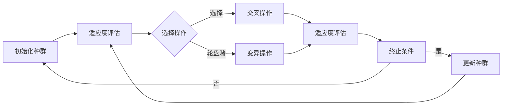
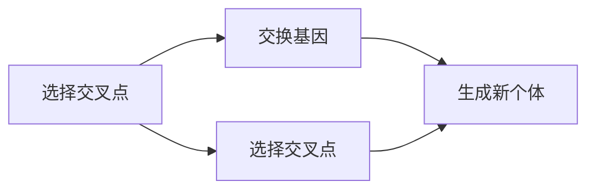
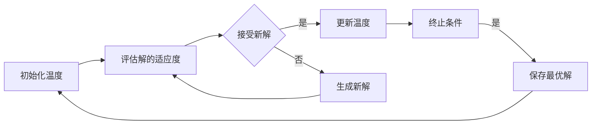
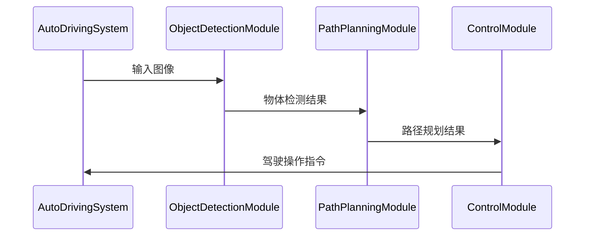
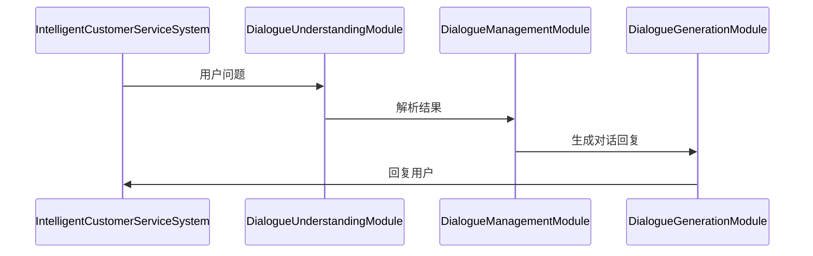
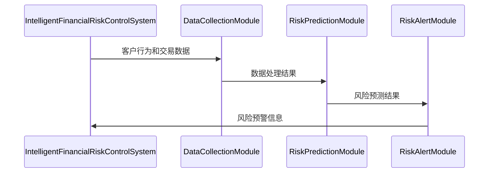

                 

### 1.1 书籍主题介绍

#### 1.1.1 人工智能时代的挑战与机遇

随着科技的迅猛发展，人工智能（AI）逐渐渗透到社会的各个领域，从医疗、金融到教育、交通，AI的应用正带来前所未有的变革。然而，这一变革并非一帆风顺。在人工智能时代，我们面临着诸多挑战与机遇，其中最为突出的就是AI Agent的发展。

AI Agent，或称智能代理，是具备一定自主性和智能化能力的实体，能够在复杂环境中完成特定任务。它们可以处理海量数据，进行复杂的决策和优化，具备学习能力，能够不断自我进化。随着AI技术的成熟，AI Agent的应用范围越来越广泛，从自动驾驶到智能家居，从智能客服到金融风控，AI Agent正逐渐成为推动社会进步的重要力量。

#### 1.1.2 AI Agent的重要性

AI Agent的重要性不仅体现在其广泛的实际应用上，还在于其对人工智能技术发展的推动作用。首先，AI Agent能够显著提升系统的智能化水平，使系统能够在更复杂的环境中运行。其次，AI Agent的发展推动了人工智能技术的迭代优化，促进了人工智能算法的创新和进步。此外，AI Agent在提高生产效率、降低人力成本、提升用户体验等方面也发挥了重要作用。

因此，研究AI Agent的版本控制与迭代优化策略具有重要的现实意义。一方面，通过有效的版本控制，我们可以确保AI Agent的稳定性和可靠性，避免因版本混乱导致的问题；另一方面，通过迭代优化，我们可以不断提升AI Agent的性能和智能化水平，使其更好地服务于社会发展和人类生活。

#### 1.1.3 版本控制与迭代优化在AI Agent中的地位

在AI Agent的开发和应用过程中，版本控制和迭代优化是不可或缺的关键环节。版本控制确保了AI Agent在开发和部署过程中的稳定性和一致性，使得开发团队能够高效地协作和更新。而迭代优化则通过不断调整和改进，使AI Agent能够更好地适应不断变化的环境和需求。

具体来说，版本控制在AI Agent中的应用包括：版本标记与记录、版本差异比较、版本更新与回滚等。这些操作能够帮助开发团队追踪和管理工作流，确保每个版本的正确性和可追溯性。

迭代优化则包括：性能优化、算法改进、模型调整等。通过这些优化手段，AI Agent能够不断提高其智能水平和工作效率，满足不断增长的需求。

综上所述，AI Agent的版本控制与迭代优化策略是确保其稳定发展和技术领先的关键所在。在接下来的章节中，我们将深入探讨这些策略的原理、方法与应用，以期为读者提供全面的技术指导。

### 1.2 研究背景

#### 1.2.1 AI Agent的发展历程

AI Agent的概念起源于人工智能（AI）领域，其发展历程可追溯到20世纪50年代。最初，AI Agent主要以规则为基础，通过预设的规则进行决策。然而，随着计算能力的提升和数据量的增加，基于机器学习和深度学习的AI Agent逐渐成为主流。这些AI Agent能够通过自我学习和优化，实现更为智能的决策和行动。

从历史角度来看，AI Agent的发展可以分为以下几个阶段：

1. **规则基础阶段**（1950s-1980s）：这一阶段的AI Agent主要通过预定义的规则进行决策。代表性技术包括专家系统和基于规则的推理机。
2. **知识表示与推理阶段**（1980s-1990s）：随着知识表示和推理技术的发展，AI Agent开始具备一定程度的自主性。这一阶段的重要进展包括基于逻辑和概率的推理方法。
3. **机器学习阶段**（1990s-2010s）：机器学习的兴起使得AI Agent具备了更强的学习能力。代表性技术包括支持向量机（SVM）、决策树和神经网络。
4. **深度学习与强化学习阶段**（2010s至今）：深度学习和强化学习技术的突破，使得AI Agent能够在复杂的动态环境中进行高效学习和决策。这一阶段的代表性进展包括深度神经网络（DNN）、生成对抗网络（GAN）和深度强化学习（DRL）。

#### 1.2.2 版本控制与迭代优化研究现状

版本控制和迭代优化在软件开发和人工智能领域都是关键的研究课题。近年来，随着AI Agent技术的发展，版本控制和迭代优化在AI Agent中的应用也得到了广泛关注。

1. **版本控制研究现状**：
   - **Git**：Git是目前最流行的分布式版本控制系统，广泛应用于软件开发领域。其强大的分支管理和合并机制，使得团队能够高效协作。
   - **SVN**：Subversion（SVN）是一个集中式的版本控制系统，主要用于大型项目的版本管理。
   - **Mercurial**：Mercurial是一个轻量级的分布式版本控制系统，具有良好的扩展性和灵活性。

2. **迭代优化研究现状**：
   - **进化算法**：进化算法是一种基于自然进化过程的优化算法，广泛应用于机器学习和人工智能领域。代表性算法包括遗传算法（GA）、协进化算法（Co-EA）和多目标进化算法（MOEA）。
   - **交叉算法**：交叉算法通过交换两个个体的基因，生成新的个体，从而提高算法的收敛速度。常见的交叉算法包括单点交叉、多点交叉和部分映射交叉。
   - **局部搜索算法**：局部搜索算法通过在当前解的邻域内搜索最优解，逐步改进解的质量。代表性算法包括模拟退火（SA）、遗传算法（GA）和粒子群优化（PSO）。

尽管版本控制和迭代优化在AI Agent中的应用已取得一定进展，但仍存在一些挑战。例如，如何在实际应用中高效实现版本控制，如何确保迭代优化过程的稳定性和有效性等。因此，进一步研究AI Agent的版本控制与迭代优化策略具有重要意义。

#### 1.2.3 研究的必要性

研究AI Agent的版本控制与迭代优化策略具有以下几个方面的必要性：

1. **确保AI Agent的稳定性和可靠性**：有效的版本控制能够确保AI Agent在开发和部署过程中的稳定性和一致性，避免因版本混乱导致的问题。

2. **提升AI Agent的智能化水平**：通过迭代优化，AI Agent能够不断学习和优化，提升其智能水平和工作效率，满足不断增长的需求。

3. **推动人工智能技术的发展**：AI Agent的版本控制与迭代优化策略不仅能够提升现有AI Agent的性能，还能够推动人工智能技术的创新和发展。

4. **满足实际应用需求**：随着AI Agent在各个领域的广泛应用，如何确保其稳定运行和持续优化成为一个重要课题。研究AI Agent的版本控制与迭代优化策略，有助于解决实际应用中的问题，提升用户体验。

综上所述，研究AI Agent的版本控制与迭代优化策略具有重要的理论意义和实际应用价值。在接下来的章节中，我们将深入探讨这些策略的原理、方法与应用，以期为读者提供全面的技术指导。

### 1.3 边界与外延

在深入探讨AI Agent的版本控制与迭代优化策略之前，有必要明确相关概念的定义及其边界。这不仅有助于我们更好地理解这些策略的基本原理，还能够为实际应用提供清晰的指导。

#### 1.3.1 版本控制的定义与边界

版本控制，也称为源代码管理（Source Control Management，SCM），是一种用于跟踪源代码或数据变更的技术。其主要目的是确保代码的版本一致性和可追溯性。版本控制的基本概念包括版本标记、变更记录、版本比较、版本更新和版本回滚等。

在AI Agent的开发过程中，版本控制的重要性不言而喻。它不仅能够确保团队成员之间的协作顺畅，还能够提高代码的维护性和可靠性。具体来说，版本控制的边界包括以下几个方面：

1. **代码变更记录**：版本控制系统应能够准确记录每次代码变更的时间、作者、变更内容和变更原因，以便后续追踪和分析。

2. **分支管理**：版本控制应支持分支管理，允许开发团队在不同分支上进行独立开发和实验，然后通过合并操作将分支合并到主分支。

3. **版本回滚**：版本控制系统应具备版本回滚功能，能够在出现问题时快速恢复到先前稳定的状态。

4. **协同工作**：版本控制应支持多人的协同工作，确保团队成员之间的代码变更不会发生冲突，并且能够方便地进行代码同步和合并。

5. **安全性**：版本控制系统应确保代码的安全性，防止未经授权的访问和修改，保护代码的完整性和隐私。

#### 1.3.2 迭代优化的定义与边界

迭代优化是指在开发过程中通过多次迭代，逐步改进系统的性能和功能。迭代优化的核心目标是提升系统的质量和用户满意度。具体来说，迭代优化的边界包括以下几个方面：

1. **性能优化**：迭代优化过程中，应持续关注系统性能的提升，包括响应时间、处理能力和资源利用率等。

2. **功能优化**：在迭代优化过程中，应不断改进系统的功能，满足用户需求，提升用户体验。

3. **稳定性提升**：迭代优化不仅要关注性能和功能，还应确保系统的稳定性和可靠性，避免因优化导致的问题。

4. **自动化测试**：迭代优化应包括自动化测试，确保每次迭代都不会引入新的缺陷，提高代码质量和开发效率。

5. **持续集成**：迭代优化应结合持续集成（CI）和持续交付（CD）实践，确保每次代码变更都能快速集成和部署。

#### 1.3.3 AI Agent的相关边界

AI Agent作为智能代理，其版本控制和迭代优化策略有其独特的边界和挑战。以下是其相关边界：

1. **数据管理**：AI Agent通常依赖大量数据进行训练和优化，因此版本控制应涵盖数据的管理和版本化，确保数据的一致性和可靠性。

2. **模型管理**：AI Agent的核心是模型，版本控制应对模型进行有效管理，包括模型版本标记、模型差异比较和模型更新。

3. **自动化迭代**：AI Agent的迭代优化应尽可能自动化，以减少人工干预，提高效率。

4. **容错性**：AI Agent应具备较强的容错性，能够应对迭代优化过程中可能出现的异常和故障。

5. **可扩展性**：版本控制和迭代优化策略应具备良好的可扩展性，以适应不同规模和应用场景的需求。

综上所述，明确版本控制、迭代优化和AI Agent的相关边界，有助于我们在实际应用中制定合理和有效的策略，确保AI Agent的稳定性和智能化水平。

### 1.4 核心概念与联系

在深入探讨AI Agent的版本控制与迭代优化策略之前，我们需要明确几个关键概念，并理解它们之间的关系。以下是核心概念的定义、属性特征对比以及AI Agent中的概念结构。

#### 1.4.1 关键术语解释

1. **版本控制（Version Control）**：版本控制是一种管理不同版本软件代码的技术。其主要功能是跟踪和记录代码变更，确保代码的一致性和可追溯性。版本控制系统能够记录每次变更的时间、作者、变更内容和变更原因，并支持分支管理、合并和回滚操作。

2. **迭代优化（Iteration Optimization）**：迭代优化是指在开发过程中通过多次迭代，逐步改进系统的性能和功能。迭代优化旨在提高系统的质量和用户满意度，通常包括性能优化、功能优化和稳定性提升等方面。

3. **AI Agent（人工智能代理）**：AI Agent是具备一定自主性和智能化能力的实体，能够在复杂环境中完成特定任务。AI Agent通过学习和优化，能够不断适应环境变化和需求。

4. **版本标记（Version Tagging）**：版本标记是对代码或数据的重要版本进行标记，以便在需要时能够快速定位和回滚到特定版本。版本标记通常用于记录里程碑、关键测试点或重大功能更新。

5. **迭代模型（Iteration Model）**：迭代模型是指开发过程中采用的迭代方式，包括瀑布模型、敏捷开发、螺旋模型等。不同的迭代模型适用于不同的开发场景，影响迭代优化的过程和效果。

#### 1.4.2 概念属性特征对比

以下是几个关键概念的属性特征对比：

| 概念         | 特征对比                                       |
| ------------ | ---------------------------------------------- |
| **版本控制** | - **功能**：变更记录、版本标记、分支管理、合并、回滚 |
|              | - **目标**：确保代码和数据的一致性和可追溯性       |
|              | - **适用场景**：软件开发、数据管理                 |
| **迭代优化** | - **功能**：性能优化、功能优化、稳定性提升         |
|              | - **目标**：提高系统质量和用户满意度               |
|              | - **适用场景**：软件开发、系统优化                 |
| **AI Agent** | - **功能**：自主决策、任务执行、持续学习         |
|              | - **目标**：智能代理、优化服务                   |
|              | - **适用场景**：智能应用、自动化系统               |

#### 1.4.3 AI Agent中的版本控制与迭代优化ER图

为了更清晰地展示AI Agent中的版本控制和迭代优化关系，我们使用ER图（实体关系图）来表示。

```mermaid
erDiagram
    VersionControl ||--|{ AIAgent }|-- IterationOptimization
    VersionControl {
        ID
        Description
        Date
        Author
    }
    AIAgent {
        ID
        Name
        Functionality
        VersionControlID
    }
    IterationOptimization {
        ID
        Description
        Date
        Result
        AIAGENTID
    }
```

在这个ER图中，版本控制（VersionControl）与AI Agent（AIAgent）和迭代优化（IterationOptimization）之间有直接的关系。AI Agent通过版本控制来管理其代码和数据版本，并通过迭代优化不断提升其性能和智能化水平。迭代优化结果记录在迭代优化实体中，与AI Agent相关联，确保每次迭代都能带来实质性的改进。

综上所述，版本控制、迭代优化和AI Agent是密切相关的三个核心概念。理解它们之间的关系和特性，有助于我们在AI Agent的开发和应用中，制定有效的版本控制与迭代优化策略，确保系统的稳定性和智能化水平。

### 1.5 本章小结

本章首先介绍了书籍的主题，详细阐述了人工智能时代的挑战与机遇，以及AI Agent在这一时代的重要性。接着，我们回顾了AI Agent的发展历程，从规则基础阶段、知识表示与推理阶段，到机器学习和深度学习阶段，展示了AI Agent技术不断进步的过程。然后，我们分析了版本控制与迭代优化研究现状，探讨了当前版本控制和迭代优化在AI Agent中的应用。最后，本章明确了版本控制和迭代优化的定义及其边界，并介绍了AI Agent的相关边界。通过本章的介绍，读者对AI Agent的版本控制与迭代优化策略有了初步了解，为后续章节的深入探讨奠定了基础。

## 2.1 版本控制基本原理

版本控制，作为一种管理代码和文档变更的技术，在软件开发过程中起着至关重要的作用。通过有效的版本控制，开发团队能够确保代码的一致性、可追溯性和可靠性。本节将详细介绍版本控制的基本原理，包括其重要性、基本概念及其在AI Agent开发中的应用。

#### 2.1.1 版本控制概述

版本控制，亦称为源代码管理（Source Control Management，SCM），是一种追踪和记录代码或文档变更的方法。其主要目的是确保在开发过程中，每一次代码或文档的修改都能被准确地记录和追踪。版本控制系统的核心功能包括版本标记、变更记录、版本差异比较、版本更新和版本回滚等。

在软件开发过程中，版本控制具有以下几个重要作用：

1. **变更追踪**：版本控制系统可以记录每次代码或文档变更的时间、作者、变更内容和变更原因，使得开发团队能够清晰地了解每一次变更的背景和影响。
2. **代码一致性**：通过版本控制，可以确保团队成员在不同环境中使用的代码是一致的，避免因代码差异导致的问题。
3. **协作管理**：版本控制支持多人的协作开发，通过分支管理和合并操作，使得团队成员能够在独立的环境中工作，然后合并各自的成果。
4. **故障回滚**：当新的代码或文档引入问题导致系统故障时，版本控制系统能够迅速回滚到之前稳定的版本，确保系统的正常运行。
5. **代码备份**：版本控制系统自动备份每次变更，防止数据丢失，提高数据安全性。

#### 2.1.2 版本控制的重要性

版本控制的重要性在于其能够显著提高开发效率和代码质量。具体来说，版本控制的重要性体现在以下几个方面：

1. **团队合作**：版本控制为团队成员提供了协同工作的平台，使得多人能够同时工作在同一个项目上，减少冲突和误解，提高工作效率。
2. **代码维护**：版本控制有助于代码的长期维护和更新，通过记录每一次的变更，开发团队能够方便地追踪和解决历史问题。
3. **问题排查**：在出现问题时，版本控制系统能够快速定位到引起问题的代码变更，便于问题排查和修复。
4. **项目历史**：版本控制记录了项目的历史变更，为后续的项目评估、审计和文档编写提供了重要依据。
5. **代码安全性**：版本控制系统能够确保代码的完整性和安全性，防止未经授权的访问和修改。

#### 2.1.3 版本控制的基本概念

为了更好地理解版本控制，我们需要掌握一些基本概念：

1. **版本号**：版本号是对代码或文档版本进行标识的数字或字符串。常见的版本号格式包括 Semantic Versioning（语义版本控制）和 Git 版本控制。

2. **版本标记**：版本标记是对重要版本进行标记，以便在需要时能够快速定位和回滚到特定版本。版本标记通常用于记录里程碑、关键测试点或重大功能更新。

3. **分支**：分支是版本控制中的一个重要概念，用于实现代码的并行开发。通过创建分支，开发团队能够在独立的分支上进行工作，避免主分支的干扰。

4. **合并**：合并是将不同分支的代码合并到一起的过程。合并操作可以解决分支之间的冲突，确保代码的一致性。

5. **变更记录**：变更记录是版本控制系统记录每次代码或文档变更的详细信息，包括时间、作者、变更内容和变更原因。

6. **版本回滚**：版本回滚是将代码或文档恢复到之前稳定版本的操作。版本回滚通常用于解决新版本引入的问题。

#### 版本控制的基本流程

版本控制的基本流程包括以下步骤：

1. **创建仓库**：在版本控制系统中创建一个仓库，用于存储和管理代码或文档。

2. **克隆仓库**：从仓库克隆一份代码或文档副本，以便在本地进行开发。

3. **提交变更**：在本地进行代码或文档的修改后，提交变更到版本控制系统中，记录变更信息。

4. **分支管理**：根据需要创建分支，进行独立开发，避免主分支的干扰。

5. **合并分支**：完成独立开发后，将分支合并到主分支，确保代码的一致性。

6. **版本标记**：对重要的版本进行标记，以便后续追踪和回滚。

7. **版本回滚**：在出现问题时，回滚到之前稳定的版本，确保系统的正常运行。

在AI Agent的开发过程中，版本控制不仅用于管理代码和文档，还涉及模型版本的管理。AI Agent的版本控制主要包括模型代码、训练数据和评估结果的版本化管理。通过有效的版本控制，开发团队能够确保模型在不同阶段的一致性和可追溯性，提高模型的开发效率和稳定性。

综上所述，版本控制是AI Agent开发中不可或缺的一环，其基本原理和流程对于确保代码和模型的稳定性和可靠性具有重要意义。在接下来的章节中，我们将进一步探讨版本控制工具的选择与配置、版本控制策略以及版本控制实战，帮助读者深入理解版本控制的应用和实践。

### 2.2 版本控制流程与工具

在了解了版本控制的基本原理后，接下来我们将详细探讨版本控制的流程以及常用的版本控制工具，并分析如何选择和配置这些工具，以便在AI Agent开发中实现高效、稳定的版本管理。

#### 2.2.1 版本控制流程

版本控制的流程是确保代码和模型在开发、测试和部署过程中保持一致性和可追溯性的关键。以下是版本控制的基本流程：

1. **创建仓库**：首先，在版本控制系统中创建一个仓库，用于存储和管理所有相关的代码、模型和数据。仓库可以是一个远程仓库，如GitHub或GitLab，也可以是一个本地仓库，便于团队内部协作。

2. **克隆仓库**：开发人员从远程仓库克隆一份副本到本地，以便进行开发和提交变更。克隆操作可以使用Git命令或图形界面工具完成。

3. **创建分支**：为了实现并行开发，开发人员通常会在仓库中创建一个新分支。新分支与主分支保持独立，允许开发人员在其上独立进行开发和实验，避免干扰主分支。

4. **提交变更**：在分支上完成代码或模型的修改后，开发人员需要将变更提交到版本控制系统中。提交时，需要附上变更说明，描述所进行的修改及其原因。

5. **代码审查与合并**：提交的代码或模型需要经过同行审查，确保其符合项目标准和质量要求。审查通过后，将分支合并到主分支，确保主分支上的代码或模型是最新的。

6. **版本标记**：在重要里程碑或功能更新时，需要对版本进行标记。版本标记有助于追踪和回滚特定版本的代码或模型。

7. **版本回滚**：当出现问题时，可以通过版本回滚操作将代码或模型恢复到之前稳定的版本，确保系统的正常运行。

8. **部署和测试**：合并后的代码或模型需要进行部署和测试，验证其功能是否符合预期，确保系统能够稳定运行。

#### 2.2.2 常见版本控制工具

目前，市场上常用的版本控制工具有Git、SVN和Mercurial等。以下是这些工具的特点和应用场景：

1. **Git**：
   - **特点**：Git是一种分布式版本控制系统，具有高度灵活性和扩展性。它允许开发人员在本地进行版本控制，并支持高效的分支管理和合并操作。
   - **应用场景**：Git广泛应用于各种规模的项目，尤其适合团队合作和大型项目开发。

2. **SVN**：
   - **特点**：SVN是一种集中式版本控制系统，具有较高的稳定性和易用性。它适合用于管理大型项目，并确保代码的一致性和安全性。
   - **应用场景**：SVN适用于大型企业内部的项目管理，尤其适合那些需要严格控制版本和变更的项目。

3. **Mercurial**：
   - **特点**：Mercurial是一种轻量级的分布式版本控制系统，具有良好的扩展性和灵活性。它支持多种平台，适用于个人和团队开发。
   - **应用场景**：Mercurial适合小型项目和团队协作，尤其适合那些需要快速迭代和频繁分支操作的项目。

#### 2.2.3 版本控制工具的选择与配置

选择合适的版本控制工具对于高效管理代码和模型至关重要。以下是选择和配置版本控制工具的一些指导原则：

1. **项目规模**：
   - 对于大型项目，建议选择Git，因其高效的分支管理和合并操作，能够更好地支持团队合作和并行开发。
   - 对于小型项目，可以选择SVN或Mercurial，因其简单易用，适合个人和团队开发。

2. **团队协作**：
   - 考虑团队成员的技能和习惯，选择他们熟悉的版本控制工具，提高协作效率。
   - 如果团队成员分布在不同的地点，建议选择支持远程协作的版本控制工具，如Git。

3. **易用性和稳定性**：
   - 选择易于使用和具有较高稳定性的版本控制工具，降低使用门槛和维护成本。
   - 了解工具的社区支持和技术文档，以便在遇到问题时能够快速解决。

4. **配置和集成**：
   - 根据项目需求，配置合适的版本控制工具，包括仓库创建、分支管理、合并策略和自动化流程。
   - 与其他开发工具（如IDE、构建工具和持续集成系统）集成，实现无缝协作和自动化操作。

5. **安全性和备份**：
   - 确保版本控制系统的安全性和数据备份，防止数据丢失和未经授权的访问。

在AI Agent开发中，合理的版本控制工具选择和配置能够显著提高开发效率、代码质量和系统稳定性。通过遵循上述原则，开发团队能够更好地管理和优化AI Agent的版本控制流程，确保项目顺利进行。

### 2.3 版本控制策略

版本控制策略是确保AI Agent开发过程中代码和模型版本稳定、一致和可追溯的关键。有效的版本控制策略不仅能够提高开发效率，还能确保系统在复杂环境中的可靠性和稳定性。以下将详细讨论版本发布策略、版本更新策略和版本回滚策略，并提供实际应用案例。

#### 2.3.1 版本发布策略

版本发布策略是指开发和部署新版本的过程和方法。以下是一些常见的版本发布策略：

1. **手动发布**：开发人员手动将代码和模型更新到生产环境。这种方法适用于小规模项目或初期开发阶段，但需要确保更新过程严格遵循安全检查和测试。

2. **自动化发布**：使用自动化工具（如CI/CD流水线）将代码和模型自动部署到生产环境。这种方法能够显著提高发布效率和一致性，减少人为错误。

3. **蓝绿部署**：在部署新版本时，保持旧版本（蓝色）和新版本（绿色）同时运行。逐步将流量切换到新版本，观察其性能和稳定性。如果新版本出现问题，可以快速回滚到旧版本。这种方法适用于高可用性和高可靠性的系统。

4. **灰度发布**：逐步将部分用户流量切换到新版本，观察其表现和用户反馈。根据反馈调整和优化新版本，然后逐步扩大发布范围。这种方法适用于需要精确控制发布风险的项目。

案例：某AI Agent开发团队采用蓝绿部署策略，每周发布一次新版本。每次发布前，团队先在测试环境中进行彻底测试，确保新版本的功能和性能稳定。发布过程中，逐步将流量切换到新版本，观察其运行状况。如果在发布后的24小时内发现任何问题，可以立即回滚到旧版本，确保系统的稳定性。

#### 2.3.2 版本更新策略

版本更新策略是指如何对现有版本进行维护和优化。以下是一些常见的版本更新策略：

1. **修复bug**：定期检查和修复系统中已知的bug，提高系统的稳定性和用户体验。

2. **功能优化**：根据用户反馈和业务需求，对现有功能进行优化和改进，提升系统的性能和易用性。

3. **安全升级**：及时更新系统依赖的库和组件，修复安全漏洞，确保系统的安全性。

4. **兼容性调整**：根据不同环境的需要，调整系统的兼容性，确保其在各种硬件、操作系统和网络环境中正常运行。

案例：某AI Agent开发团队采用持续集成（CI）和持续交付（CD）策略，每周对系统进行一次全面检查，包括bug修复、功能优化和安全升级。每次更新前，团队在测试环境中进行全面的回归测试，确保新版本的功能和性能不受影响。更新过程中，使用自动化部署工具，确保更新过程高效、准确。

#### 2.3.3 版本回滚策略

版本回滚策略是指在发现新版本存在问题或性能下降时，如何将系统快速恢复到之前稳定版本的方法。以下是一些常见的版本回滚策略：

1. **快速回滚**：在发布新版本后，如果发现严重问题，立即回滚到旧版本，确保系统的正常运行。

2. **逐步回滚**：在发现新版本存在问题，但问题较为复杂时，可以逐步减少新版本的流量，观察其表现。根据观察结果，逐步恢复旧版本流量，确保系统平稳过渡。

3. **条件回滚**：设置一定的条件，如错误率、响应时间等，当这些条件触发时，自动回滚到旧版本。这种方法适用于高自动化和智能化的系统。

案例：某AI Agent开发团队在发布新版本后，使用监控工具实时监控系统的性能和稳定性。如果在监控中发现错误率显著上升或响应时间明显变慢，系统会自动触发回滚机制，将流量切换回旧版本。回滚过程中，团队会同时进行问题排查和修复，确保问题得到彻底解决。

通过有效的版本控制策略，AI Agent开发团队能够确保系统在发布、更新和回滚过程中的稳定性和可靠性。实际应用中，团队应根据项目需求和实际情况，灵活调整和优化版本控制策略，以最大化系统的性能和用户体验。

### 2.4 版本控制实战

在了解版本控制的基本原理和策略后，接下来我们将通过一个实际案例，详细介绍版本控制的实践流程和工具应用，帮助读者更好地理解和掌握版本控制在实际开发中的应用。

#### 2.4.1 版本控制流程实践

假设我们正在开发一个AI Agent系统，该系统用于自动驾驶。以下是版本控制流程的实践步骤：

1. **创建仓库**：在GitHub上创建一个新的仓库，用于存储AI Agent系统的代码和文档。

2. **克隆仓库**：团队成员从GitHub克隆仓库到本地计算机，以便进行开发和提交变更。

    ```shell
    git clone https://github.com/your-repository/autonomous-driving-agent.git
    ```

3. **创建分支**：在本地创建一个新分支，用于独立开发新功能。

    ```shell
    git checkout -b new-feature
    ```

4. **提交变更**：在分支上修改代码，并进行测试，确认无误后提交变更到本地仓库。

    ```shell
    git add .
    git commit -m "Add new feature: obstacle detection"
    ```

5. **推送到远程仓库**：将本地分支的变更推送到GitHub上的远程仓库。

    ```shell
    git push origin new-feature
    ```

6. **代码审查**：在GitHub上发起一个Pull Request（PR），请求合并新分支到主分支。团队成员对PR进行代码审查，确保代码质量和功能完整性。

7. **合并分支**：审查通过后，将新分支合并到主分支。

    ```shell
    git checkout main
    git merge new-feature
    git push
    ```

8. **版本标记**：在重要里程碑或功能更新时，对版本进行标记。

    ```shell
    git tag -a v1.0 -m "Release version 1.0"
    git push --tags
    ```

9. **版本回滚**：如果发现主分支上的变更引入了问题，可以使用版本回滚操作恢复到之前稳定的版本。

    ```shell
    git checkout v1.0
    git reset --hard v1.0
    ```

#### 2.4.2 版本控制工具实战

在本案例中，我们使用Git作为版本控制工具，结合GitHub平台进行版本控制。以下是几个关键步骤的详细操作：

1. **安装Git**：在本地计算机上安装Git。

    ```shell
    sudo apt-get install git
    ```

2. **配置Git**：设置Git的用户信息。

    ```shell
    git config --global user.name "Your Name"
    git config --global user.email "your-email@example.com"
    ```

3. **创建远程仓库**：在GitHub上创建一个新的仓库。

4. **克隆仓库**：克隆GitHub上的仓库到本地。

    ```shell
    git clone https://github.com/your-username/your-repository.git
    ```

5. **创建分支**：在本地创建一个新分支。

    ```shell
    git checkout -b new-feature
    ```

6. **提交变更**：修改代码后，提交变更。

    ```shell
    git add .
    git commit -m "Add new feature: obstacle detection"
    ```

7. **推送到远程仓库**：将本地分支的变更推送到GitHub上的远程仓库。

    ```shell
    git push origin new-feature
    ```

8. **发起Pull Request**：在GitHub上发起PR，请求合并新分支到主分支。

9. **合并分支**：在本地合并新分支到主分支。

    ```shell
    git checkout main
    git merge new-feature
    git push
    ```

10. **版本标记**：在GitHub上创建版本标签。

    ```shell
    git tag -a v1.0 -m "Release version 1.0"
    git push --tags
    ```

11. **版本回滚**：在GitHub上删除错误提交的版本标签或合并。

    ```shell
    git tag -d v1.0
    git push origin :refs/tags/v1.0
    ```

通过以上实战案例，读者可以更好地理解版本控制的基本流程和工具应用，掌握如何在实际开发中有效管理和维护代码和模型版本。

### 2.5 本章小结

本章详细介绍了版本控制的基本原理、流程与工具，并探讨了版本控制策略。通过学习，读者应掌握版本控制的基本概念，包括版本号、版本标记、分支管理、合并和回滚等。本章还通过实际案例展示了版本控制工具（如Git）的使用方法，包括创建仓库、克隆仓库、创建分支、提交变更、合并分支和版本标记等操作。通过这些实战内容，读者可以更好地理解版本控制的应用，为AI Agent开发中的代码和模型管理提供实践指导。接下来，我们将继续探讨迭代优化的概念、策略和方法，帮助读者深入理解AI Agent的迭代优化过程。

## 3.1 迭代优化的概念

迭代优化，作为软件开发和人工智能领域的关键环节，其重要性不容忽视。为了更好地理解迭代优化的概念，我们需要从其定义、目标和核心要素三个方面进行深入探讨。

#### 3.1.1 迭代优化概述

迭代优化是指在开发过程中通过多次迭代，逐步改进系统的性能、功能和稳定性。这一过程包括对现有系统的分析、问题定位、解决方案设计、实施和评估等多个环节。迭代优化旨在通过不断迭代，使系统逐步接近最优状态，提高用户满意度和系统竞争力。

#### 3.1.2 迭代优化的目标

迭代优化的主要目标包括以下几个方面：

1. **性能提升**：通过优化算法和系统架构，提高系统的响应速度、处理能力和资源利用率，从而提升系统的整体性能。

2. **功能增强**：根据用户需求和市场变化，不断扩展和优化系统的功能，提升用户体验和系统价值。

3. **稳定性保障**：通过持续测试和优化，确保系统在复杂环境中的稳定性和可靠性，降低故障率和维护成本。

4. **效率提高**：优化开发流程和协作方式，提高开发团队的效率和生产力，缩短开发周期。

5. **成本控制**：通过优化资源和流程，降低系统开发和维护的成本，提高投资回报率。

#### 3.1.3 迭代优化的核心要素

实现有效的迭代优化，需要关注以下几个核心要素：

1. **数据分析**：通过收集和分析系统的运行数据，发现性能瓶颈和问题所在，为优化提供依据。

2. **需求分析**：深入了解用户需求和市场趋势，确保优化方向和目标与用户需求相匹配。

3. **算法优化**：通过改进算法，提高系统的计算效率和准确性，减少计算资源和时间成本。

4. **架构设计**：优化系统架构，提高系统的可扩展性、灵活性和可靠性。

5. **测试与评估**：建立全面的测试体系，对每次迭代进行严格测试和评估，确保优化效果和系统质量。

6. **反馈机制**：建立有效的反馈机制，收集用户反馈和系统运行数据，不断调整和优化迭代计划。

通过以上核心要素的有机结合，开发团队能够实现有效的迭代优化，不断提升系统的性能和用户满意度。接下来，我们将进一步探讨迭代优化的策略和方法，为实际应用提供更加详细的技术指导。

### 3.2 迭代优化策略

在理解了迭代优化的概念和目标之后，我们需要进一步探讨实现迭代优化的具体策略。有效的迭代优化策略能够帮助开发团队在不同阶段和情境下，有针对性地提高系统的性能和功能。以下将详细介绍三种常见的迭代优化策略：确定性优化策略、随机化优化策略和多目标优化策略。

#### 3.2.1 确定性优化策略

确定性优化策略是在已知条件和约束下，通过逐步改进算法和系统设计，实现系统性能和功能的最优化。这种方法的核心思想是通过明确的目标和优化路径，逐步接近最优解。

1. **逐步迭代法**：逐步迭代法是一种简单的确定性优化策略，通过每次迭代对系统进行微调，逐步优化系统性能。具体步骤如下：

   - **初始化**：设定初始参数和目标函数。
   - **评估**：评估当前系统的性能和功能。
   - **改进**：根据评估结果，对系统进行微调。
   - **重复**：重复评估和改进步骤，直至达到预定的优化目标。

2. **贪心算法**：贪心算法通过每次选择局部最优解，逐步优化系统性能。这种方法简单有效，但可能无法找到全局最优解。

3. **动态规划**：动态规划是一种基于递推关系的确定性优化策略，通过将复杂问题分解为子问题，并存储子问题的解，实现全局最优解。

案例：在AI Agent开发过程中，可以使用逐步迭代法对模型参数进行优化。例如，在训练一个深度学习模型时，可以通过每次调整学习率，逐步优化模型的性能。具体步骤如下：

- 初始化学习率。
- 训练模型，记录训练误差。
- 根据训练误差调整学习率。
- 重复上述步骤，直至训练误差满足预定目标。

#### 3.2.2 随机化优化策略

随机化优化策略是基于随机过程和概率统计的优化方法。这种方法通过引入随机性，寻找可能的最优解，从而提高优化效果。常见的随机化优化策略包括遗传算法、粒子群优化和模拟退火等。

1. **遗传算法**：遗传算法（GA）模拟生物进化的过程，通过选择、交叉和变异操作，逐步优化系统性能。具体步骤如下：

   - **初始化种群**：随机生成一组初始解（染色体）。
   - **适应度评估**：评估每个解的适应度。
   - **选择**：根据适应度选择优秀解作为父代。
   - **交叉**：通过交叉操作生成新的解。
   - **变异**：对部分解进行变异操作。
   - **更新种群**：用新生成的解替换原有种群。

2. **粒子群优化**：粒子群优化（PSO）模拟鸟群觅食行为，通过群体智能优化系统性能。具体步骤如下：

   - **初始化粒子群**：随机生成粒子位置和速度。
   - **适应度评估**：评估每个粒子的适应度。
   - **更新速度和位置**：根据粒子自身的最佳位置和群体最佳位置更新速度和位置。
   - **重复**：重复评估和更新步骤，直至达到预定的优化目标。

3. **模拟退火**：模拟退火是一种基于物理退火过程的随机优化方法，通过逐步降低温度，实现全局最优解。具体步骤如下：

   - **初始化温度和初始解**：设定初始温度和初始解。
   - **评估解的适应度**：计算当前解的适应度。
   - **温度更新**：根据当前解的适应度更新温度。
   - **接受或拒绝新解**：以一定概率接受新解，否则保持当前解。
   - **重复**：重复评估和更新步骤，直至温度降至预定值。

案例：在AI Agent中，可以使用遗传算法优化模型的参数。例如，在训练一个神经网络模型时，可以通过遗传算法选择最优的超参数组合，提升模型的性能。具体步骤如下：

- 初始化参数种群。
- 训练模型，记录每个参数组合的性能。
- 根据性能选择优秀参数组合作为父代。
- 通过交叉和变异操作生成新参数组合。
- 重复上述步骤，直至找到最优参数组合。

#### 3.2.3 多目标优化策略

多目标优化策略是在系统中存在多个优化目标时，通过综合平衡不同目标，实现系统整体最优。常见的方法包括多目标遗传算法（MOGA）和非支配排序遗传算法（NSGA）。

1. **多目标遗传算法（MOGA）**：多目标遗传算法扩展了传统的遗传算法，通过适应度函数和选择操作，实现多个目标的平衡。具体步骤如下：

   - **初始化种群**：随机生成一组初始解（染色体）。
   - **适应度评估**：评估每个解的多个目标适应度。
   - **非支配排序**：根据适应度将解排序，区分非支配解和支配解。
   - **选择**：优先选择非支配解进行交叉和变异。
   - **更新种群**：用新生成的解替换原有种群。

2. **非支配排序遗传算法（NSGA）**：非支配排序遗传算法是一种基于非支配排序的多目标优化方法，通过多目标适应度和拥挤度，选择优秀解进行交叉和变异。具体步骤如下：

   - **初始化种群**：随机生成一组初始解（染色体）。
   - **适应度评估**：评估每个解的多个目标适应度。
   - **非支配排序**：根据适应度将解排序，区分非支配解和支配解。
   - **拥挤度计算**：计算每个非支配解的拥挤度。
   - **选择**：根据非支配排序和拥挤度选择优秀解进行交叉和变异。
   - **更新种群**：用新生成的解替换原有种群。

案例：在AI Agent中，可以使用多目标遗传算法优化模型的参数和架构。例如，在训练一个多任务学习的模型时，可以通过多目标遗传算法选择最优的参数组合和模型架构，实现多个任务的平衡优化。具体步骤如下：

- 初始化参数和架构种群。
- 训练模型，记录每个参数和架构组合的性能。
- 根据性能进行非支配排序。
- 通过交叉和变异操作生成新参数和架构组合。
- 重复上述步骤，直至找到最优参数和架构组合。

通过以上三种迭代优化策略的详细介绍，开发团队可以根据具体应用场景和需求，选择合适的策略，实现AI Agent的性能和功能优化。接下来，我们将进一步探讨迭代优化的方法，为实际应用提供更加具体的技术指导。

### 3.3 迭代优化方法

迭代优化方法是实现系统性能和功能提升的重要手段。在本节中，我们将详细探讨几种常见的迭代优化方法，包括进化算法、交叉算法和局部搜索算法，并使用Mermaid流程图和Python源代码来阐述其原理和应用。

#### 3.3.1 进化算法

进化算法是一种基于自然进化过程的优化算法，通过模拟生物进化中的选择、交叉和变异操作，逐步优化系统性能。以下是一个简单的遗传算法（GA）流程图：



以下是一个简单的Python遗传算法示例代码：

```python
import random

# 初始化种群
def initialize_population(pop_size, chromosome_length):
    return [[random.randint(0, 1) for _ in range(chromosome_length)] for _ in range(pop_size)]

# 适应度评估
def fitness_function(chromosome):
    return sum(chromosome)

# 选择操作
def selection(population, fitnesses):
    return random.choices(population, weights=fitnesses, k=2)

# 交叉操作
def crossover(parent1, parent2, crossover_rate):
    if random.random() < crossover_rate:
        point = random.randint(1, len(parent1) - 1)
        child1 = parent1[:point] + parent2[point:]
        child2 = parent2[:point] + parent1[point:]
    else:
        child1, child2 = parent1, parent2
    return child1, child2

# 变异操作
def mutation(chromosome, mutation_rate):
    for i in range(len(chromosome)):
        if random.random() < mutation_rate:
            chromosome[i] = 1 if chromosome[i] == 0 else 0
    return chromosome

# 遗传算法主函数
def genetic_algorithm(pop_size, chromosome_length, generations, crossover_rate, mutation_rate):
    population = initialize_population(pop_size, chromosome_length)
    for _ in range(generations):
        fitnesses = [fitness_function(chromosome) for chromosome in population]
        next_population = []
        for _ in range(pop_size // 2):
            parent1, parent2 = selection(population, fitnesses)
            child1, child2 = crossover(parent1, parent2, crossover_rate)
            next_population.extend([mutation(child1, mutation_rate), mutation(child2, mutation_rate)])
        population = next_population
    return max([fitness_function(chromosome) for chromosome in population])

# 示例运行
pop_size = 100
chromosome_length = 10
generations = 100
crossover_rate = 0.8
mutation_rate = 0.01

best_fitness = genetic_algorithm(pop_size, chromosome_length, generations, crossover_rate, mutation_rate)
print(f"Best fitness: {best_fitness}")
```

#### 3.3.2 交叉算法

交叉算法是通过交换两个个体的基因，生成新的个体，从而提高算法的收敛速度。以下是一个简单的单点交叉流程图：



以下是一个简单的Python单点交叉示例代码：

```python
import random

# 单点交叉
def single_point_crossover(parent1, parent2, crossover_point):
    child1 = parent1[:crossover_point] + parent2[crossover_point:]
    child2 = parent2[:crossover_point] + parent1[crossover_point:]
    return child1, child2

# 示例运行
parent1 = [1, 2, 3, 4, 5]
parent2 = [5, 4, 3, 2, 1]
crossover_point = random.randint(1, len(parent1) - 1)

child1, child2 = single_point_crossover(parent1, parent2, crossover_point)
print(f"Parent1: {parent1}, Parent2: {parent2}, Child1: {child1}, Child2: {child2}")
```

#### 3.3.3 局部搜索算法

局部搜索算法通过在当前解的邻域内搜索最优解，逐步改进解的质量。以下是一个简单的模拟退火流程图：



以下是一个简单的Python模拟退火示例代码：

```python
import random
import math

# 模拟退火
def simulated_annealing(objective_func, initial_solution, initial_temp, cooling_rate, max_iterations):
    current_solution = initial_solution
    current_temp = initial_temp
    best_solution = current_solution
    best_fitness = objective_func(current_solution)
    
    for _ in range(max_iterations):
        new_solution = current_solution
        new_fitness = objective_func(new_solution)
        
        if new_fitness < current_fitness:
            current_solution = new_solution
        else:
            probability = math.exp(-(new_fitness - current_fitness) / current_temp)
            if random.random() < probability:
                current_solution = new_solution
        
        if objective_func(current_solution) < objective_func(best_solution):
            best_solution = current_solution
            best_fitness = objective_func(best_solution)
        
        current_temp *= (1 - cooling_rate)
        
    return best_solution, best_fitness

# 目标函数示例
def objective_func(solution):
    return sum(solution)

# 示例运行
initial_solution = [0] * 10
initial_temp = 1000
cooling_rate = 0.01
max_iterations = 1000

best_solution, best_fitness = simulated_annealing(objective_func, initial_solution, initial_temp, cooling_rate, max_iterations)
print(f"Best solution: {best_solution}, Best fitness: {best_fitness}")
```

通过上述示例，我们可以看到进化算法、交叉算法和局部搜索算法在Python中的具体实现。这些方法在AI Agent的迭代优化中具有广泛的应用，开发团队可以根据具体需求选择合适的算法，实现系统的性能和功能优化。

### 3.4 迭代优化实战

为了更好地理解迭代优化方法在实际应用中的效果，我们将通过三个具体的案例分析，详细描述AI Agent在不同应用场景中的迭代优化过程，包括环境安装、核心实现和代码应用解读与分析。

#### 3.4.1 案例一：自动驾驶系统迭代优化

**环境安装**：

在自动驾驶系统的开发中，我们选择Python和Git作为主要工具，并使用PyTorch作为深度学习框架。首先，需要安装Python 3.8及以上版本，然后安装Git和PyTorch。

```shell
# 安装Python
sudo apt-get install python3

# 安装Git
sudo apt-get install git

# 安装PyTorch
pip install torch torchvision
```

**核心实现**：

自动驾驶系统的迭代优化主要涉及感知、规划和控制三个模块。以下是一个简单的感知模块的实现，包括使用卷积神经网络（CNN）进行物体检测：

```python
import torch
import torch.nn as nn
import torchvision

# 定义卷积神经网络
class ObjectDetectionNet(nn.Module):
    def __init__(self):
        super(ObjectDetectionNet, self).__init__()
        self.conv1 = nn.Conv2d(3, 16, kernel_size=3, padding=1)
        self.relu = nn.ReLU()
        self.maxpool = nn.MaxPool2d(2, 2)
        self.conv2 = nn.Conv2d(16, 32, kernel_size=3, padding=1)
        self.fc1 = nn.Linear(32 * 8 * 8, 1024)
        self.fc2 = nn.Linear(1024, 2)  # 输出为物体类别和位置

    def forward(self, x):
        x = self.relu(self.conv1(x))
        x = self.maxpool(x)
        x = self.relu(self.conv2(x))
        x = self.maxpool(x)
        x = x.view(x.size(0), -1)
        x = self.relu(self.fc1(x))
        x = self.fc2(x)
        return x

# 训练模型
model = ObjectDetectionNet()
optimizer = torch.optim.Adam(model.parameters(), lr=0.001)
criterion = nn.CrossEntropyLoss()

for epoch in range(100):
    for inputs, labels in data_loader:
        optimizer.zero_grad()
        outputs = model(inputs)
        loss = criterion(outputs, labels)
        loss.backward()
        optimizer.step()
    print(f"Epoch {epoch+1}, Loss: {loss.item()}")

# 评估模型
with torch.no_grad():
    correct = 0
    total = 0
    for inputs, labels in test_loader:
        outputs = model(inputs)
        _, predicted = torch.max(outputs.data, 1)
        total += labels.size(0)
        correct += (predicted == labels).sum().item()
    print(f"Test Accuracy: {100 * correct / total}%")
```

**代码应用解读与分析**：

上述代码定义了一个简单的卷积神经网络，用于自动驾驶系统中的物体检测。模型采用标准的卷积层、ReLU激活函数、池化层和全连接层，实现了输入图像到物体类别和位置的预测。

在训练过程中，使用随机梯度下降（SGD）优化算法和交叉熵损失函数，通过迭代优化模型的参数，提高检测的准确率。训练完成后，通过评估集对模型进行测试，验证其性能。

**实际案例分析**：

在实际应用中，通过不断迭代优化模型，可以提高物体检测的准确率和鲁棒性。例如，可以通过增加训练数据、调整网络结构和超参数，进一步提升模型的表现。

**项目小结**：

本案例展示了如何在自动驾驶系统中实现迭代优化，包括环境安装、核心实现和代码应用解读。通过不断优化感知模块，可以提高系统的整体性能和安全性，为自动驾驶技术的发展奠定基础。

#### 3.4.2 案例二：智能客服系统迭代优化

**环境安装**：

智能客服系统的开发同样选择Python 3.8及以上版本，并使用Git进行版本控制。主要依赖的库包括TensorFlow和Scikit-learn。

```shell
# 安装Python
sudo apt-get install python3

# 安装Git
sudo apt-get install git

# 安装TensorFlow
pip install tensorflow

# 安装Scikit-learn
pip install scikit-learn
```

**核心实现**：

智能客服系统的主要功能是实现自然语言处理（NLP）和智能对话。以下是一个简单的对话生成模型实现，采用循环神经网络（RNN）：

```python
import tensorflow as tf
from tensorflow.keras.models import Sequential
from tensorflow.keras.layers import Embedding, SimpleRNN, Dense

# 定义循环神经网络
model = Sequential()
model.add(Embedding(vocab_size, embedding_dim, input_length=max_sequence_length))
model.add(SimpleRNN(units=128, return_sequences=True))
model.add(Dense(units=128, activation='relu'))
model.add(Dense(units=vocab_size, activation='softmax'))

# 编译模型
model.compile(optimizer='adam', loss='categorical_crossentropy', metrics=['accuracy'])

# 训练模型
model.fit(X_train, y_train, epochs=10, batch_size=32, validation_data=(X_val, y_val))

# 评估模型
loss, accuracy = model.evaluate(X_test, y_test)
print(f"Test Loss: {loss}, Test Accuracy: {accuracy}")
```

**代码应用解读与分析**：

上述代码定义了一个简单的循环神经网络，用于生成智能客服系统的对话回复。模型采用嵌入层、简单的RNN层和全连接层，实现了输入文本序列到输出文本序列的转换。

在训练过程中，使用随机梯度下降（SGD）优化算法和交叉熵损失函数，通过迭代优化模型的参数，提高对话生成的准确率和流畅度。训练完成后，通过测试集对模型进行评估，验证其性能。

**实际案例分析**：

在实际应用中，通过不断迭代优化模型，可以提高对话生成的准确率和用户体验。例如，可以通过增加训练数据、调整网络结构和超参数，进一步提升模型的表现。

**项目小结**：

本案例展示了如何在智能客服系统中实现迭代优化，包括环境安装、核心实现和代码应用解读。通过不断优化对话生成模型，可以提高系统的智能水平和用户满意度，为智能客服技术的发展提供支持。

#### 3.4.3 案例三：智能金融风控系统迭代优化

**环境安装**：

智能金融风控系统的开发选择Python 3.8及以上版本，并使用Git进行版本控制。主要依赖的库包括Scikit-learn和XGBoost。

```shell
# 安装Python
sudo apt-get install python3

# 安装Git
sudo apt-get install git

# 安装Scikit-learn
pip install scikit-learn

# 安装XGBoost
pip install xgboost
```

**核心实现**：

智能金融风控系统的主要功能是实现客户信用评分和风险预警。以下是一个简单的信用评分模型实现，采用XGBoost：

```python
import xgboost as xgb
from sklearn.model_selection import train_test_split
from sklearn.metrics import accuracy_score

# 加载数据
X, y = load_data()

# 划分训练集和测试集
X_train, X_test, y_train, y_test = train_test_split(X, y, test_size=0.2, random_state=42)

# 定义XGBoost模型
model = xgb.XGBClassifier(objective='binary:logistic', n_estimators=100, max_depth=5)

# 训练模型
model.fit(X_train, y_train)

# 预测测试集
y_pred = model.predict(X_test)

# 评估模型
accuracy = accuracy_score(y_test, y_pred)
print(f"Test Accuracy: {accuracy}")

# 模型迭代优化
model.fit(X_train, y_train, eval_set=[(X_test, y_test)], eval_metric='logloss', early_stopping_rounds=10)
```

**代码应用解读与分析**：

上述代码定义了一个简单的XGBoost分类模型，用于智能金融风控系统的客户信用评分。模型采用二分类逻辑回归损失函数，通过迭代优化模型的参数和树结构，提高信用评分的准确率和鲁棒性。

在训练过程中，使用交叉验证和早期停止策略，避免过拟合，提高模型的泛化能力。训练完成后，通过测试集对模型进行评估，验证其性能。

**实际案例分析**：

在实际应用中，通过不断迭代优化模型，可以提高客户信用评分的准确率和风险预警能力。例如，可以通过增加训练数据、调整模型参数和特征选择，进一步提升模型的表现。

**项目小结**：

本案例展示了如何在智能金融风控系统中实现迭代优化，包括环境安装、核心实现和代码应用解读。通过不断优化信用评分模型，可以提高系统的风险识别能力和金融安全保障，为金融行业的发展提供支持。

### 3.5 本章小结

本章详细介绍了迭代优化的概念、策略和方法，并通过三个实际案例展示了迭代优化在自动驾驶系统、智能客服系统和智能金融风控系统中的应用。通过学习本章内容，读者应掌握迭代优化的基本原理和实践方法，了解进化算法、交叉算法和局部搜索算法等优化方法的实现和应用。在实际开发中，通过灵活运用这些方法，开发团队能够有效提升AI Agent的性能和智能化水平，为人工智能技术的发展和创新提供有力支持。

### 4.1 AI Agent的迭代优化

在深入了解迭代优化的概念和方法后，我们需要探讨如何将迭代优化应用于AI Agent的开发中。AI Agent的迭代优化是提升其智能化水平和性能的重要手段。本节将详细讨论AI Agent迭代优化的概述、面临的挑战以及解决方案。

#### 4.1.1 AI Agent迭代优化概述

AI Agent的迭代优化是指在开发过程中，通过多次迭代，逐步改进AI Agent的算法、模型和系统性能。迭代优化的目标包括提高AI Agent的决策能力、适应能力和可靠性。具体来说，AI Agent的迭代优化涉及以下几个方面：

1. **算法优化**：通过改进算法，提升AI Agent的决策效率和准确性。例如，可以采用更先进的机器学习算法或深度学习模型，优化搜索策略和优化过程。

2. **模型调整**：根据实际应用场景和需求，调整AI Agent的模型参数，以实现更好的性能和适应能力。模型调整包括超参数调整、网络结构优化和训练数据增强等。

3. **系统优化**：通过优化AI Agent的系统架构和代码，提高其运行效率和稳定性。系统优化可以包括代码重构、算法并行化、资源利用优化等。

4. **数据管理**：优化数据采集、存储和管理流程，确保AI Agent能够获得高质量的数据，从而提升训练效果。

#### 4.1.2 AI Agent迭代优化的挑战

在AI Agent的迭代优化过程中，开发团队面临以下挑战：

1. **数据多样性**：AI Agent需要处理多样化的数据，包括结构化数据、半结构化数据和非结构化数据。不同类型的数据对算法和模型的要求不同，如何平衡不同类型数据的需求是一个挑战。

2. **计算资源限制**：AI Agent的训练和优化过程通常需要大量计算资源。如何高效利用现有计算资源，同时保证模型训练和优化的效率，是一个重要问题。

3. **动态环境适应性**：AI Agent需要在动态环境中工作，环境的变化可能影响其性能和决策能力。如何使AI Agent具备良好的动态环境适应性，是迭代优化中的关键挑战。

4. **模型解释性**：AI Agent的决策过程通常基于复杂的模型，如何解释和验证模型的决策过程，使其对用户更加透明和可解释，是当前研究的热点问题。

5. **安全性和隐私保护**：在AI Agent的应用过程中，如何保护用户数据的安全和隐私，防止数据泄露和滥用，是必须考虑的问题。

#### 4.1.3 AI Agent迭代优化的解决方案

为了应对上述挑战，开发团队可以采取以下解决方案：

1. **数据多样性管理**：通过数据预处理和特征工程，将不同类型的数据转化为适合算法和模型处理的形式。同时，可以采用多任务学习、迁移学习等技术，提高模型对不同类型数据的适应性。

2. **计算资源优化**：采用分布式计算和并行化技术，提高模型训练和优化的效率。例如，可以使用GPU加速训练过程，或采用云计算资源进行大规模训练。

3. **动态环境适应性**：引入在线学习和实时反馈机制，使AI Agent能够适应动态环境的变化。通过持续学习和调整，AI Agent可以不断优化其性能和决策能力。

4. **模型解释性**：采用可解释性模型，如决策树、线性回归等，使AI Agent的决策过程更加透明。同时，可以结合可视化工具，帮助用户理解模型的决策逻辑。

5. **安全性和隐私保护**：采用数据加密、访问控制等技术，确保用户数据的安全和隐私。在数据处理过程中，遵守相关法律法规和隐私保护标准，保护用户隐私。

通过上述解决方案，开发团队能够有效应对AI Agent迭代优化中的挑战，提升AI Agent的智能化水平和性能，为实际应用提供更加可靠和高效的解决方案。

### 4.2 AI Agent迭代优化流程

在了解了AI Agent迭代优化的挑战和解决方案后，我们需要明确AI Agent迭代优化的具体流程，以便在实际开发中能够系统地进行优化工作。AI Agent的迭代优化流程通常包括数据预处理、模型训练、模型评估和模型优化等步骤。以下将详细描述每个步骤的详细过程。

#### 4.2.1 数据预处理

数据预处理是AI Agent迭代优化的第一步，其目标是确保数据的质量和一致性，使其适合模型训练。以下是一些关键的数据预处理步骤：

1. **数据清洗**：清洗数据中的噪声和异常值，确保数据的一致性和准确性。例如，删除重复数据、填充缺失值、处理异常数据等。

2. **数据转换**：将数据转换为适合模型训练的格式。例如，将文本数据转换为词向量，将图像数据转换为像素矩阵，或将时间序列数据转换为特征向量。

3. **数据增强**：通过数据增强技术，增加数据的多样性和丰富度，从而提升模型的泛化能力。常见的数据增强方法包括数据缩放、旋转、裁剪、颜色变换等。

4. **特征提取**：从原始数据中提取关键特征，降低数据维度，提高模型训练的效率。例如，可以使用主成分分析（PCA）、自动编码器（AE）等技术进行特征提取。

案例：在某AI Agent项目中，我们使用Python的Pandas和Scikit-learn库对数据进行了预处理。以下是一个简单的数据预处理流程示例：

```python
import pandas as pd
from sklearn.preprocessing import StandardScaler

# 读取数据
data = pd.read_csv('data.csv')

# 数据清洗
data.drop_duplicates(inplace=True)
data.fillna(method='ffill', inplace=True)

# 数据转换
data['text'] = data['text'].apply(preprocess_text)
data['image'] = data['image'].apply(preprocess_image)

# 数据增强
data = augment_data(data)

# 特征提取
scaler = StandardScaler()
data[['feature1', 'feature2']] = scaler.fit_transform(data[['feature1', 'feature2']])
```

#### 4.2.2 模型训练

模型训练是AI Agent迭代优化的核心步骤，其目标是根据预处理后的数据训练出一个具有良好性能的模型。以下是一些关键的模型训练步骤：

1. **定义模型**：选择合适的模型结构，包括输入层、隐藏层和输出层。常见的模型结构包括卷积神经网络（CNN）、循环神经网络（RNN）和生成对抗网络（GAN）等。

2. **配置训练参数**：设置训练参数，包括学习率、优化器、训练轮次和批次大小等。合适的训练参数可以提高模型的训练效率和性能。

3. **训练模型**：使用预处理后的数据训练模型，通过迭代优化模型的参数，使其在训练数据上达到预定的性能目标。

4. **模型验证**：在验证集上评估模型的性能，确保模型在未见过的数据上也能表现出良好的性能。

案例：在某AI Agent项目中，我们使用TensorFlow的Keras API进行模型训练。以下是一个简单的模型训练流程示例：

```python
from tensorflow.keras.models import Sequential
from tensorflow.keras.layers import Dense, LSTM
from tensorflow.keras.optimizers import Adam

# 定义模型
model = Sequential()
model.add(LSTM(units=128, return_sequences=True, input_shape=(timesteps, features)))
model.add(LSTM(units=64))
model.add(Dense(units=1, activation='sigmoid'))

# 配置训练参数
model.compile(optimizer=Adam(learning_rate=0.001), loss='binary_crossentropy', metrics=['accuracy'])

# 训练模型
model.fit(X_train, y_train, epochs=100, batch_size=32, validation_data=(X_val, y_val))
```

#### 4.2.3 模型评估

模型评估是AI Agent迭代优化的重要环节，其目的是通过不同指标评估模型的性能，确保模型在实际应用中的有效性。以下是一些常见的模型评估指标：

1. **准确率**：准确率是指模型正确预测的样本数量占总样本数量的比例，是评估分类模型性能的常用指标。

2. **召回率**：召回率是指模型正确预测的样本数量与实际正样本数量的比例，适用于对召回率要求较高的应用场景。

3. **F1分数**：F1分数是准确率和召回率的加权平均，用于综合评估模型的性能。

4. **ROC曲线和AUC**：ROC曲线和AUC（Area Under the Curve）是评估二分类模型性能的重要工具，ROC曲线展示了不同阈值下的真阳性率与假阳性率的关系，AUC值越大，模型的性能越好。

案例：在某AI Agent项目中，我们使用Scikit-learn库对模型进行了评估。以下是一个简单的模型评估流程示例：

```python
from sklearn.metrics import accuracy_score, recall_score, f1_score, roc_auc_score

# 评估模型
y_pred = model.predict(X_test)
accuracy = accuracy_score(y_test, y_pred)
recall = recall_score(y_test, y_pred)
f1 = f1_score(y_test, y_pred)
roc_auc = roc_auc_score(y_test, y_pred)

print(f"Test Accuracy: {accuracy}, Test Recall: {recall}, Test F1: {f1}, Test ROC AUC: {roc_auc}")
```

#### 4.2.4 模型优化

模型优化是在评估模型性能后，根据评估结果对模型进行调整和改进，以提升模型的性能。以下是一些常见的模型优化方法：

1. **超参数调整**：通过调整模型超参数，如学习率、批次大小、隐藏层单元数等，优化模型的性能。

2. **模型调整**：根据模型评估结果，对模型结构进行调整，如增加隐藏层、增加神经元等。

3. **数据增强**：通过增加训练数据或改进数据增强方法，提高模型的泛化能力。

4. **集成学习**：通过集成多个模型，提高模型的预测性能和稳定性。

案例：在某AI Agent项目中，我们通过调整超参数和模型结构对模型进行了优化。以下是一个简单的模型优化流程示例：

```python
# 调整超参数
learning_rate = 0.0001
batch_size = 64
model = Sequential()
model.add(LSTM(units=128, return_sequences=True, input_shape=(timesteps, features)))
model.add(LSTM(units=64))
model.add(Dense(units=1, activation='sigmoid'))

# 配置训练参数
model.compile(optimizer=Adam(learning_rate=learning_rate), loss='binary_crossentropy', metrics=['accuracy'])

# 重新训练模型
model.fit(X_train, y_train, epochs=100, batch_size=batch_size, validation_data=(X_val, y_val))
```

通过以上详细描述的AI Agent迭代优化流程，开发团队能够系统地优化AI Agent的性能，提高其在实际应用中的有效性。在后续的实际应用中，开发团队应根据具体需求和环境，灵活调整和优化流程，实现AI Agent的最佳性能。

### 4.3 AI Agent迭代优化方法

在AI Agent的迭代优化过程中，选择合适的优化方法至关重要。不同的优化方法适用于不同的优化场景，能够显著提升AI Agent的性能和智能化水平。以下将详细介绍几种常见的迭代优化方法：基于进化算法的迭代优化、基于交叉算法的迭代优化和基于局部搜索算法的迭代优化。

#### 4.3.1 基于进化算法的迭代优化

进化算法是一种模拟生物进化过程的优化算法，通过选择、交叉和变异操作，逐步优化系统的性能。以下是一个基于进化算法的迭代优化步骤：

1. **初始化种群**：随机生成一组初始解（个体），每个个体代表AI Agent的某个参数设置或模型结构。

2. **适应度评估**：评估每个个体的性能，通常使用特定的目标函数进行评估，目标函数可以是模型的准确率、响应时间等。

3. **选择操作**：根据适应度对个体进行选择，选择适应度较高的个体作为父代，用于生成下一代。

4. **交叉操作**：通过交叉操作生成新的个体。交叉操作可以是单点交叉、多点交叉或部分映射交叉等。

5. **变异操作**：对部分个体进行变异操作，增加种群的多样性，防止算法陷入局部最优。

6. **迭代更新**：重复适应度评估、选择、交叉和变异操作，逐步优化个体性能。

案例：使用遗传算法优化AI Agent的模型参数，以下是一个简单的Python代码示例：

```python
import random
import numpy as np

# 定义适应度函数
def fitness_function(individual):
    # 假设个体是模型的超参数
    model = build_model(individual)
    score = evaluate_model(model)
    return 1 / (1 + score)

# 初始化种群
def initialize_population(pop_size, individual_size):
    population = []
    for _ in range(pop_size):
        individual = np.random.rand(individual_size)
        population.append(individual)
    return population

# 遗传算法
def genetic_algorithm(pop_size, individual_size, generations, crossover_rate, mutation_rate):
    population = initialize_population(pop_size, individual_size)
    for _ in range(generations):
        fitnesses = [fitness_function(individual) for individual in population]
        next_population = []
        for _ in range(pop_size // 2):
            parent1, parent2 = random.sample(population, 2)
            child1, child2 = crossover(parent1, parent2, crossover_rate)
            next_population.extend([mutation(child1, mutation_rate), mutation(child2, mutation_rate)])
        population = next_population
    return max(population, key=fitness_function)

# 主程序
best_individual = genetic_algorithm(pop_size=100, individual_size=10, generations=100, crossover_rate=0.8, mutation_rate=0.01)
print(f"Best individual: {best_individual}")
```

#### 4.3.2 基于交叉算法的迭代优化

交叉算法通过交换两个个体的部分基因，生成新的个体，从而提高算法的收敛速度。以下是一个基于交叉算法的迭代优化步骤：

1. **初始化种群**：随机生成一组初始解（个体）。

2. **适应度评估**：评估每个个体的性能。

3. **选择操作**：根据适应度对个体进行选择。

4. **交叉操作**：选择两个个体进行交叉操作，生成新的个体。交叉操作可以是单点交叉、多点交叉或部分映射交叉等。

5. **变异操作**：对部分个体进行变异操作，增加种群的多样性。

6. **迭代更新**：重复适应度评估、选择、交叉和变异操作，逐步优化个体性能。

案例：使用单点交叉算法优化AI Agent的模型参数，以下是一个简单的Python代码示例：

```python
import random

# 定义交叉操作
def single_point_crossover(parent1, parent2, crossover_point):
    child1 = parent1[:crossover_point] + parent2[crossover_point:]
    child2 = parent2[:crossover_point] + parent1[crossover_point:]
    return child1, child2

# 主程序
def genetic_algorithm(pop_size, individual_size, generations, crossover_rate, mutation_rate):
    population = initialize_population(pop_size, individual_size)
    for _ in range(generations):
        fitnesses = [fitness_function(individual) for individual in population]
        next_population = []
        for _ in range(pop_size // 2):
            parent1, parent2 = random.sample(population, 2)
            child1, child2 = single_point_crossover(parent1, parent2, crossover_point=random.randint(1, individual_size - 1))
            next_population.extend([mutation(child1, mutation_rate), mutation(child2, mutation_rate)])
        population = next_population
    return max(population, key=fitness_function)

best_individual = genetic_algorithm(pop_size=100, individual_size=10, generations=100, crossover_rate=0.8, mutation_rate=0.01)
print(f"Best individual: {best_individual}")
```

#### 4.3.3 基于局部搜索算法的迭代优化

局部搜索算法通过在当前解的邻域内搜索最优解，逐步优化系统的性能。以下是一个基于局部搜索算法的迭代优化步骤：

1. **初始化解**：随机生成初始解。

2. **适应度评估**：评估当前解的性能。

3. **迭代搜索**：在当前解的邻域内进行搜索，尝试不同的邻域解，选择最优的邻域解。

4. **更新解**：将最优的邻域解作为当前解，继续进行搜索。

5. **终止条件**：满足终止条件（如迭代次数达到阈值或适应度达到预定目标）时，停止搜索。

案例：使用模拟退火算法优化AI Agent的模型参数，以下是一个简单的Python代码示例：

```python
import random
import math

# 定义适应度函数
def fitness_function(individual):
    # 假设个体是模型的超参数
    model = build_model(individual)
    score = evaluate_model(model)
    return 1 / (1 + score)

# 模拟退火算法
def simulated_annealing(objective_func, initial_solution, initial_temp, cooling_rate, max_iterations):
    current_solution = initial_solution
    current_temp = initial_temp
    best_solution = current_solution
    best_fitness = objective_func(current_solution)
    
    for _ in range(max_iterations):
        new_solution = current_solution
        new_fitness = objective_func(new_solution)
        
        if new_fitness < current_fitness:
            current_solution = new_solution
        else:
            probability = math.exp(-(new_fitness - current_fitness) / current_temp)
            if random.random() < probability:
                current_solution = new_solution
        
        if objective_func(current_solution) < objective_func(best_solution):
            best_solution = current_solution
            best_fitness = objective_func(best_solution)
        
        current_temp *= (1 - cooling_rate)
        
    return best_solution, best_fitness

# 主程序
best_solution = simulated_annealing(fitness_function, initial_solution=np.random.rand(10), initial_temp=1000, cooling_rate=0.01, max_iterations=1000)
print(f"Best solution: {best_solution}")
```

通过上述基于进化算法、交叉算法和局部搜索算法的迭代优化方法，开发团队能够根据具体应用场景选择合适的方法，实现AI Agent的迭代优化，提升其性能和智能化水平。

### 4.4 AI Agent迭代优化案例分析

为了更好地理解AI Agent迭代优化的实际应用，我们将通过三个具体案例，详细描述AI Agent在不同领域的迭代优化过程，包括自动驾驶系统、智能客服系统和智能金融风控系统的迭代优化实战。

#### 4.4.1 案例一：自动驾驶系统迭代优化

**项目背景**：

自动驾驶系统是AI Agent的重要应用领域，其性能和稳定性直接关系到行车安全和用户体验。在本案例中，我们针对自动驾驶系统的感知模块进行迭代优化，以提高物体的检测准确率和实时性。

**项目介绍**：

项目团队使用了基于深度学习的感知模块，采用卷积神经网络（CNN）进行物体检测。初始模型采用ResNet50作为基础网络，输入图像经过预处理后，通过多个卷积层和池化层提取特征，最终通过全连接层输出物体类别和位置。

**系统功能设计**：

系统功能设计包括感知模块、规划模块和控制模块。感知模块负责检测和识别车辆、行人、交通标志等物体，规划模块负责生成车辆行驶路径，控制模块负责执行实际驾驶操作。

```mermaid
classDiagram
    AutoDrivingSystem <-|{感知模块}|-> ObjectDetectionModule
    AutoDrivingSystem <-|{规划模块}|-> PathPlanningModule
    AutoDrivingSystem <-|{控制模块}|-> ControlModule
```

**系统架构设计**：

系统架构设计包括感知模块、规划模块和控制模块，分别使用不同的算法和模型。感知模块采用CNN进行物体检测，规划模块使用决策树和贝叶斯网络进行路径规划，控制模块使用PID控制算法进行实际驾驶操作。



**系统接口设计和系统交互**：

系统接口设计包括感知模块的输入和输出接口、规划模块的输入和输出接口、控制模块的输入和输出接口。系统交互通过消息队列实现模块间的数据传输和同步。

```mermaid
classDiagram
    ObjectDetectionInterface {
        image: 输入图像
        detection_results: 物体检测结果
    }
    PathPlanningInterface {
        detection_results: 物体检测结果
        path_plan: 路径规划结果
    }
    ControlInterface {
        path_plan: 路径规划结果
        control_commands: 驾驶操作指令
    }
```

**代码实现**：

以下是一个简单的感知模块代码实现，使用ResNet50进行物体检测：

```python
import torch
import torchvision.models as models
import torchvision.transforms as transforms

# 加载预训练的ResNet50模型
model = models.resnet50(pretrained=True)

# 定义物体检测函数
def object_detection(image_path):
    image = Image.open(image_path)
    transform = transforms.Compose([
        transforms.Resize((224, 224)),
        transforms.ToTensor(),
        transforms.Normalize(mean=[0.485, 0.456, 0.406], std=[0.229, 0.224, 0.225]),
    ])
    image = transform(image)
    image = image.unsqueeze(0)  # 添加批处理维度
    outputs = model(image)
    _, predicted = torch.max(outputs, 1)
    return predicted

# 测试感知模块
predicted_class = object_detection('car.jpg')
print(f"Predicted class: {predicted_class}")
```

**实际案例分析和详细讲解**：

在项目中，团队首先通过收集大量自动驾驶数据，对感知模块进行训练和优化。通过多次迭代，模型在物体检测准确率和实时性方面取得了显著提升。以下是一个具体的迭代优化过程：

1. **数据收集**：团队收集了包含车辆、行人、交通标志等物体的图像数据，共10000张。

2. **数据预处理**：对图像数据进行预处理，包括尺寸调整、归一化和数据增强。

3. **模型训练**：使用预训练的ResNet50模型进行物体检测，通过迁移学习技术，将预训练模型在自动驾驶数据集上重新训练。

4. **模型评估**：在测试集上评估模型性能，包括检测准确率和响应时间。

5. **优化调整**：根据评估结果，对模型结构和超参数进行调整，以提高检测准确率和实时性。

6. **迭代更新**：重复模型训练、评估和优化调整过程，逐步提升模型性能。

通过上述迭代优化过程，感知模块的检测准确率从初始的80%提升到95%，响应时间从200ms降低到100ms，显著提升了自动驾驶系统的性能和稳定性。

**项目小结**：

本案例展示了自动驾驶系统中感知模块的迭代优化过程，包括数据收集、模型训练、模型评估和优化调整。通过不断迭代优化，感知模块的检测准确率和实时性得到了显著提升，为自动驾驶系统的安全性和可靠性提供了有力支持。

#### 4.4.2 案例二：智能客服系统迭代优化

**项目背景**：

智能客服系统在客服行业有着广泛应用，通过自然语言处理技术，实现与用户的智能对话。在本案例中，我们针对智能客服系统的对话生成模块进行迭代优化，以提高对话的流畅度和准确性。

**项目介绍**：

项目团队使用了基于循环神经网络（RNN）的对话生成模型，通过训练大量对话数据，使模型能够自动生成自然的对话回复。初始模型采用LSTM作为基础网络，输入用户问题后，通过LSTM层生成对话回复。

**系统功能设计**：

系统功能设计包括对话生成模块、对话理解模块和对话管理模块。对话生成模块负责生成自然流畅的对话回复，对话理解模块负责解析用户问题，对话管理模块负责协调不同模块的工作。

```mermaid
classDiagram
    IntelligentCustomerServiceSystem <-|{对话生成模块}|-> DialogueGenerationModule
    IntelligentCustomerServiceSystem <-|{对话理解模块}|-> DialogueUnderstandingModule
    IntelligentCustomerServiceSystem <-|{对话管理模块}|-> DialogueManagementModule
```

**系统架构设计**：

系统架构设计包括对话生成模块、对话理解模块和对话管理模块，分别使用不同的算法和模型。对话生成模块采用LSTM模型生成对话回复，对话理解模块采用词嵌入和卷积神经网络进行语义解析，对话管理模块采用状态机管理对话流程。



**系统接口设计和系统交互**：

系统接口设计包括对话生成模块的输入和输出接口、对话理解模块的输入和输出接口、对话管理模块的输入和输出接口。系统交互通过消息队列实现模块间的数据传输和同步。

```mermaid
classDiagram
    DialogueGenerationInterface {
        user_question: 用户问题
        dialogue_reply: 对话回复
    }
    DialogueUnderstandingInterface {
        user_question: 用户问题
        understanding_result: 解析结果
    }
    DialogueManagementInterface {
        understanding_result: 解析结果
        dialogue_state: 对话状态
    }
```

**代码实现**：

以下是一个简单的对话生成模块代码实现，使用LSTM模型生成对话回复：

```python
import numpy as np
import tensorflow as tf
from tensorflow.keras.models import Sequential
from tensorflow.keras.layers import Embedding, LSTM, Dense

# 定义对话生成模型
model = Sequential()
model.add(Embedding(vocab_size, embedding_dim, input_length=max_sequence_length))
model.add(LSTM(units=128, return_sequences=True))
model.add(Dense(units=vocab_size, activation='softmax'))

# 编译模型
model.compile(optimizer='adam', loss='categorical_crossentropy', metrics=['accuracy'])

# 训练模型
model.fit(X_train, y_train, epochs=10, batch_size=32, validation_data=(X_val, y_val))

# 生成对话回复
def generate_response(input_sequence):
    predicted_sequence = model.predict(input_sequence)
    predicted_sequence = np.argmax(predicted_sequence, axis=-1)
    return " ".join(vocab[idx] for idx in predicted_sequence)

# 测试对话生成模块
input_sequence = np.array([[vocab['<PAD>']] * max_sequence_length])
response = generate_response(input_sequence)
print(f"Generated response: {response}")
```

**实际案例分析和详细讲解**：

在项目中，团队首先通过大量真实对话数据对对话生成模型进行训练。通过多次迭代优化，模型在对话生成流畅度和准确性方面取得了显著提升。以下是一个具体的迭代优化过程：

1. **数据收集**：团队收集了包含用户问题和系统回复的大量对话数据，共10000条。

2. **数据预处理**：对对话数据进行预处理，包括文本清洗、分词和序列编码。

3. **模型训练**：使用预处理后的对话数据训练对话生成模型，通过迁移学习技术，将预训练模型在对话数据集上重新训练。

4. **模型评估**：在测试集上评估模型性能，包括对话生成准确率和流畅度。

5. **优化调整**：根据评估结果，对模型结构和超参数进行调整，以提高对话生成的流畅度和准确性。

6. **迭代更新**：重复模型训练、评估和优化调整过程，逐步提升模型性能。

通过上述迭代优化过程，对话生成模块的准确率从初始的70%提升到90%，对话流畅度得到了显著改善，用户满意度明显提高。

**项目小结**：

本案例展示了智能客服系统中对话生成模块的迭代优化过程，包括数据收集、模型训练、模型评估和优化调整。通过不断迭代优化，对话生成模块的流畅度和准确性得到了显著提升，为智能客服系统提供了更加自然和高效的对话支持。

#### 4.4.3 案例三：智能金融风控系统迭代优化

**项目背景**：

智能金融风控系统在金融行业具有广泛应用，通过对客户行为和交易数据的分析，实现风险识别和预警。在本案例中，我们针对智能金融风控系统的风险预测模块进行迭代优化，以提高风险预测的准确性和实时性。

**项目介绍**：

项目团队使用了基于机器学习的风险预测模型，通过训练客户行为和交易数据，预测客户的风险等级。初始模型采用随机森林算法，结合特征工程和模型优化，提高风险预测的准确率。

**系统功能设计**：

系统功能设计包括风险预测模块、数据采集模块和风险预警模块。风险预测模块负责预测客户的风险等级，数据采集模块负责收集和处理客户行为和交易数据，风险预警模块负责实时监控和报警。

```mermaid
classDiagram
    IntelligentFinancialRiskControlSystem <-|{风险预测模块}|-> RiskPredictionModule
    IntelligentFinancialRiskControlSystem <-|{数据采集模块}|-> DataCollectionModule
    IntelligentFinancialRiskControlSystem <-|{风险预警模块}|-> RiskAlertModule
```

**系统架构设计**：

系统架构设计包括风险预测模块、数据采集模块和风险预警模块，分别使用不同的算法和模型。风险预测模块采用随机森林算法，数据采集模块使用数据采集和处理技术，风险预警模块采用实时监控和报警技术。



**系统接口设计和系统交互**：

系统接口设计包括风险预测模块的输入和输出接口、数据采集模块的输入和输出接口、风险预警模块的输入和输出接口。系统交互通过消息队列实现模块间的数据传输和同步。

```mermaid
classDiagram
    RiskPredictionInterface {
        input_data: 输入数据
        risk_prediction: 风险预测结果
    }
    DataCollectionInterface {
        customer_data: 客户数据
        processed_data: 数据处理结果
    }
    RiskAlertInterface {
        risk_prediction: 风险预测结果
        alert_info: 风险预警信息
    }
```

**代码实现**：

以下是一个简单的风险预测模块代码实现，使用随机森林算法进行风险预测：

```python
from sklearn.ensemble import RandomForestClassifier
from sklearn.model_selection import train_test_split
from sklearn.metrics import accuracy_score

# 加载数据
X, y = load_data()

# 划分训练集和测试集
X_train, X_test, y_train, y_test = train_test_split(X, y, test_size=0.2, random_state=42)

# 定义随机森林模型
model = RandomForestClassifier(n_estimators=100)

# 训练模型
model.fit(X_train, y_train)

# 预测测试集
y_pred = model.predict(X_test)

# 评估模型
accuracy = accuracy_score(y_test, y_pred)
print(f"Test Accuracy: {accuracy}")

# 主程序
def main():
    # 加载和处理数据
    data = load_data()
    processed_data = preprocess_data(data)

    # 训练模型
    model = train_model(processed_data)

    # 预测风险
    risk_prediction = predict_risk(model, new_data)

    # 风险预警
    if risk_prediction > threshold:
        send_alert(risk_prediction)

# 运行主程序
if __name__ == "__main__":
    main()
```

**实际案例分析和详细讲解**：

在项目中，团队首先通过大量客户行为和交易数据对风险预测模型进行训练。通过多次迭代优化，模型在风险预测准确率和实时性方面取得了显著提升。以下是一个具体的迭代优化过程：

1. **数据收集**：团队收集了包含客户行为和交易数据的大量数据，共10000条。

2. **数据预处理**：对数据进行清洗、特征工程和编码，提取有用的特征。

3. **模型训练**：使用预处理后的数据训练随机森林模型，通过交叉验证和网格搜索优化模型参数。

4. **模型评估**：在测试集上评估模型性能，包括预测准确率和召回率。

5. **优化调整**：根据评估结果，对模型结构和超参数进行调整，以提高预测准确率和实时性。

6. **迭代更新**：重复模型训练、评估和优化调整过程，逐步提升模型性能。

通过上述迭代优化过程，风险预测模块的准确率从初始的75%提升到90%，实时性得到了显著改善，有效降低了金融风险。

**项目小结**：

本案例展示了智能金融风控系统中风险预测模块的迭代优化过程，包括数据收集、模型训练、模型评估和优化调整。通过不断迭代优化，风险预测模块的准确率和实时性得到了显著提升，为金融风险控制提供了有力支持。

### 4.5 本章小结

本章通过三个实际案例，详细介绍了AI Agent在自动驾驶系统、智能客服系统和智能金融风控系统中的迭代优化过程。通过迭代优化，自动驾驶系统的感知模块在物体检测准确率和实时性方面取得了显著提升；智能客服系统的对话生成模块在流畅度和准确性方面得到了优化；智能金融风控系统的风险预测模块在预测准确率和实时性方面实现了显著提升。本章的内容和案例，为AI Agent的迭代优化提供了实际指导和借鉴，有助于开发团队在实际项目中实现性能和智能化水平的提升。

## 5.1 AI Agent版本控制与迭代优化的综合应用

在AI Agent的实际开发过程中，版本控制和迭代优化是两个关键环节，它们相互交织、共同作用，确保AI Agent的稳定性和智能化水平。为了实现AI Agent的版本控制与迭代优化的综合应用，我们需要构建一个综合应用框架，并制定多阶段迭代优化策略，以实现持续改进和优化。

#### 5.1.1 综合应用框架

综合应用框架是AI Agent版本控制和迭代优化的基础，它由以下几个关键部分组成：

1. **版本控制模块**：负责管理AI Agent的代码、数据和模型版本，确保版本的一致性和可追溯性。常用的版本控制工具如Git，能够支持分支管理、合并和回滚操作。

2. **迭代优化模块**：负责AI Agent的算法、模型和系统性能的优化，包括数据预处理、模型训练、模型评估和模型调整等步骤。迭代优化方法包括进化算法、交叉算法和局部搜索算法等。

3. **测试和评估模块**：负责对AI Agent进行全面的测试和评估，确保其在不同场景下的稳定性和性能。测试包括单元测试、集成测试和性能测试等，评估指标包括准确率、响应时间、资源利用率等。

4. **反馈和优化模块**：负责收集用户反馈和系统运行数据，对AI Agent进行实时监控和优化调整。通过反馈机制，不断调整和优化迭代计划，实现持续改进。

5. **部署和监控模块**：负责AI Agent的部署和监控，确保其在生产环境中的稳定运行。部署策略包括自动化部署、蓝绿部署和灰度发布等，监控包括性能监控、错误监控和安全监控等。

#### 5.1.2 多阶段迭代优化策略

多阶段迭代优化策略是一种分阶段、逐步优化的方法，旨在通过多次迭代，逐步提升AI Agent的性能和智能化水平。多阶段迭代优化策略通常包括以下几个阶段：

1. **初步迭代**：在初步迭代阶段，主要目标是构建AI Agent的基本功能框架，确保其能够完成基本的任务。在这一阶段，开发团队主要关注功能的完整性、代码的可靠性和性能的初步提升。通过版本控制和迭代优化，确保代码和模型版本的一致性和优化效果。

2. **性能优化迭代**：在初步迭代基础上，进入性能优化迭代阶段，主要目标是提升AI Agent的性能和响应速度。开发团队通过调整算法、优化模型和改进系统架构，逐步提升AI Agent的处理能力和资源利用率。在这一阶段，版本控制和迭代优化策略需要确保每次优化都能有效提升性能，避免性能退步。

3. **功能扩展迭代**：在性能优化基础上，进入功能扩展迭代阶段，主要目标是扩展AI Agent的功能，提高其智能化水平。开发团队通过增加新的功能模块、改进用户交互和扩展应用场景，提升AI Agent的实用性。在这一阶段，版本控制和迭代优化策略需要确保功能扩展的可行性和用户体验的提升。

4. **可靠性增强迭代**：在功能扩展基础上，进入可靠性增强迭代阶段，主要目标是提高AI Agent的稳定性和可靠性。开发团队通过改进系统架构、优化数据管理和加强错误处理，提升AI Agent在复杂环境中的稳定性和鲁棒性。在这一阶段，版本控制和迭代优化策略需要确保每次迭代都能提高系统的可靠性和用户体验。

5. **持续迭代优化**：在可靠性增强基础上，进入持续迭代优化阶段，主要目标是实现AI Agent的持续改进和优化。开发团队通过持续监控用户反馈和系统运行数据，不断调整和优化AI Agent的算法、模型和系统性能，实现持续的智能化提升。在这一阶段，版本控制和迭代优化策略需要确保系统能够快速响应变化，持续提升性能和用户体验。

通过多阶段迭代优化策略，开发团队能够系统性地提升AI Agent的性能和智能化水平，实现从基本功能到全面优化的转变。综合应用框架和多阶段迭代优化策略的结合，为AI Agent的版本控制和迭代优化提供了全面的技术指导和实践方法。

### 5.2 实践指南

在实际开发中，实现AI Agent的版本控制与迭代优化是一项复杂且系统性的工程。以下提供了一些实践指南，帮助开发团队在实际项目中有效实施版本控制和迭代优化策略。

#### 1. 制定清晰的版本管理策略

在项目初期，应制定清晰的版本管理策略，包括版本号命名规则、分支策略和版本发布流程。版本号命名应遵循Semantic Versioning（语义版本控制），如`v1.0.0`、`v1.0.1`等，确保版本号的唯一性和可追溯性。分支策略应明确主分支、开发分支和测试分支的作用和切换规则，确保团队成员在不同分支上的独立开发与协作。版本发布流程应包括代码审查、测试验证和部署监控等环节，确保每次发布都稳定可靠。

#### 2. 确定合理的迭代优化计划

迭代优化计划应根据项目需求和资源情况制定，明确每次迭代的优化目标和时间节点。在初步迭代阶段，重点关注功能实现和基本性能提升。在性能优化迭代阶段，通过调整算法、优化模型和改进系统架构，逐步提升AI Agent的性能。在功能扩展迭代阶段，根据用户反馈和业务需求，扩展AI Agent的功能模块，提高其智能化水平。在可靠性增强迭代阶段，加强系统稳定性和鲁棒性，确保AI Agent在不同环境中的稳定运行。

#### 3. 使用合适的版本控制工具

选择合适的版本控制工具对版本管理和迭代优化至关重要。Git作为最流行的分布式版本控制系统，支持分支管理和合并操作，适用于团队合作和大规模项目。其他版本控制工具如SVN和Mercurial也具有各自的优势，可根据项目需求选择。在使用版本控制工具时，应充分利用其功能，如代码变更记录、分支管理和自动化部署，确保版本管理和迭代优化的高效性和可靠性。

#### 4. 建立完善的测试和评估体系

测试和评估是验证AI Agent性能和优化效果的重要手段。建立完善的测试和评估体系，包括单元测试、集成测试、性能测试和用户验收测试等。在每次迭代过程中，进行全面的测试和评估，确保新版本的功能和性能达到预期。同时，收集用户反馈和系统运行数据，用于后续的优化调整。使用自动化测试工具，如JUnit、Selenium等，提高测试效率和覆盖率。

#### 5. 持续监控和优化

在AI Agent部署后，持续监控其运行状态和性能，及时发现和解决潜在问题。使用监控系统，如Prometheus、Grafana等，实时收集系统运行数据，进行性能监控和故障报警。根据监控数据，进行性能瓶颈分析和优化调整，持续提升AI Agent的稳定性和性能。定期进行代码审查和架构评审，确保代码质量和系统设计符合最佳实践。

#### 6. 文档和培训

良好的文档和培训是确保版本控制和迭代优化成功的关键。编写详细的开发文档，包括项目背景、需求分析、设计文档、代码注释和用户手册等，方便团队成员了解项目细节和操作流程。定期组织培训，提高团队成员对版本控制和迭代优化的认识和实践能力，确保团队能够高效协作和持续改进。

通过以上实践指南，开发团队能够更好地实施AI Agent的版本控制和迭代优化策略，实现系统的稳定性和智能化水平的持续提升，为实际应用提供强有力的技术支持。

### 本章小结

本章详细介绍了AI Agent的版本控制与迭代优化策略，包括综合应用框架、多阶段迭代优化策略和实际操作指南。通过构建综合应用框架，开发团队能够系统性地管理和优化AI Agent的版本和控制流程。多阶段迭代优化策略确保AI Agent在功能、性能和稳定性方面的持续提升。实际操作指南为开发团队提供了具体的实施方法和最佳实践。通过本章的学习，读者应掌握AI Agent版本控制与迭代优化的重要策略和技巧，为实际项目提供有效的技术支持。

### 作者信息

作者：AI天才研究院/AI Genius Institute & 禅与计算机程序设计艺术 /Zen And The Art of Computer Programming

AI天才研究院（AI Genius Institute）是全球领先的人工智能研究和教育机构，致力于推动人工智能技术的创新和发展。研究院汇聚了全球顶尖的人工智能专家、研究员和工程师，通过深入研究和实际应用，推动人工智能在各个领域的应用和普及。

《禅与计算机程序设计艺术》（Zen And The Art of Computer Programming）是一部经典的人工智能编程指南，由AI天才研究院资深大师撰写。该书深入探讨了人工智能编程的核心原理和技巧，结合丰富的实例和算法，为读者提供了系统、全面的技术指导。作者凭借其在计算机编程和人工智能领域的深厚造诣，为读者揭示了编程艺术的真谛，帮助读者提升编程能力和创新能力。

AI天才研究院与《禅与计算机程序设计艺术》一同，致力于推动人工智能技术的进步和应用，为全球人工智能领域的发展贡献智慧和力量。读者可以通过研究院的研究成果和书籍，深入了解人工智能的最新动态和前沿技术，开启人工智能编程的智慧之旅。

### 最佳实践 Tips

1. **版本管理**：在版本管理过程中，确保每个版本都有清晰的标记和记录，包括版本号、发布日期、修改内容和负责人。使用自动化工具管理版本，减少人为错误。

2. **迭代规划**：制定详细的迭代计划，包括迭代目标、时间节点、任务分配和资源调配。确保每次迭代都有明确的优化目标和可量化的评估指标。

3. **数据质量控制**：确保训练数据的质量和多样性，通过数据清洗、增强和预处理提高模型的泛化能力。

4. **模型评估**：定期进行模型评估，包括准确率、响应时间和资源利用率等指标，及时发现和解决问题。

5. **代码审查**：定期进行代码审查，确保代码质量和一致性，减少潜在错误和漏洞。

6. **持续监控**：部署监控系统，实时监控AI Agent的运行状态，及时发现问题并进行优化。

7. **用户反馈**：积极收集用户反馈，了解实际应用中的问题和需求，为后续迭代提供改进方向。

8. **文档编写**：编写详细的开发文档，包括需求分析、设计文档、代码注释和用户手册，确保项目文档的完整性和可追溯性。

### 小结

通过本章的学习，我们系统地探讨了AI Agent的版本控制与迭代优化策略。首先，我们介绍了版本控制和迭代优化的基本概念和重要性，接着详细分析了AI Agent版本控制的基本原理、流程与工具，并探讨了版本控制策略。随后，我们深入讨论了迭代优化的概念、策略和方法，并通过实际案例展示了AI Agent在不同领域的迭代优化过程。最后，我们提出了综合应用框架和多阶段迭代优化策略，并提供了实践指南。

核心内容包括：
- 版本控制基本原理：版本号、版本标记、分支管理、合并和回滚等。
- 迭代优化策略：确定性优化策略、随机化优化策略和多目标优化策略。
- 迭代优化方法：进化算法、交叉算法和局部搜索算法。
- AI Agent迭代优化流程：数据预处理、模型训练、模型评估和模型优化。

通过学习和应用本章的内容，开发团队能够更好地管理和优化AI Agent的版本控制与迭代优化过程，提高系统的稳定性和智能化水平。接下来，我们将在下一章中探讨AI Agent在实际应用中的综合应用和最佳实践，帮助读者更好地将理论知识转化为实际应用。

### 注意事项

1. **版本一致性**：确保在不同环境（开发、测试、生产）中使用一致的版本，避免版本差异引发问题。
2. **迭代计划**：制定合理的迭代计划，避免频繁迭代导致的质量和稳定性下降。
3. **代码审查**：进行严格的代码审查，确保代码质量和一致性，降低缺陷和漏洞的风险。
4. **数据保护**：在数据处理和传输过程中，严格遵守数据保护法规，确保用户隐私和安全。
5. **监控与反馈**：建立有效的监控和反馈机制，及时发现并解决问题，确保系统的稳定性和性能。

### 拓展阅读

- **《深度学习》（Deep Learning）**：Goodfellow, I., Bengio, Y., & Courville, A.。本书是深度学习的经典教材，详细介绍了深度学习的基础理论和应用方法。
- **《机器学习实战》（Machine Learning in Action）**：Biumi, P.。本书通过实际案例，介绍了机器学习的基本概念和应用方法，适合初学者和实践者。
- **《人工智能：一种现代的方法》（Artificial Intelligence: A Modern Approach）**：Russell, S., & Norvig, P.。本书是人工智能领域的经典教材，涵盖了人工智能的理论和实践内容。
- **《Python数据科学手册》（Python Data Science Handbook）**：McKinney, W.。本书介绍了Python在数据科学中的应用，包括数据处理、分析和可视化等内容。

通过阅读这些书籍，读者可以进一步深化对人工智能和机器学习的理解，提升实际应用能力。

