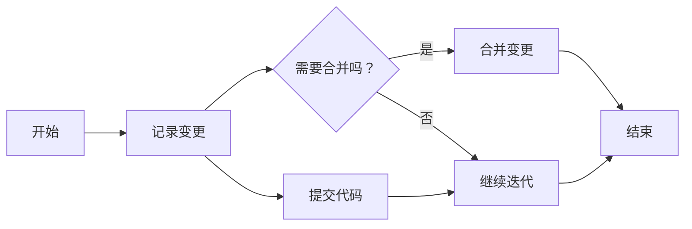
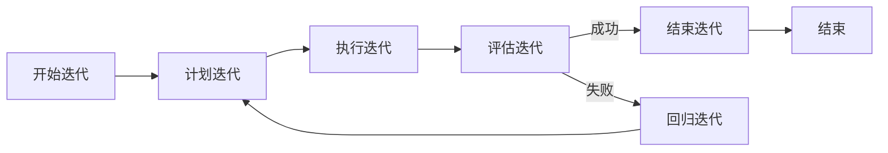
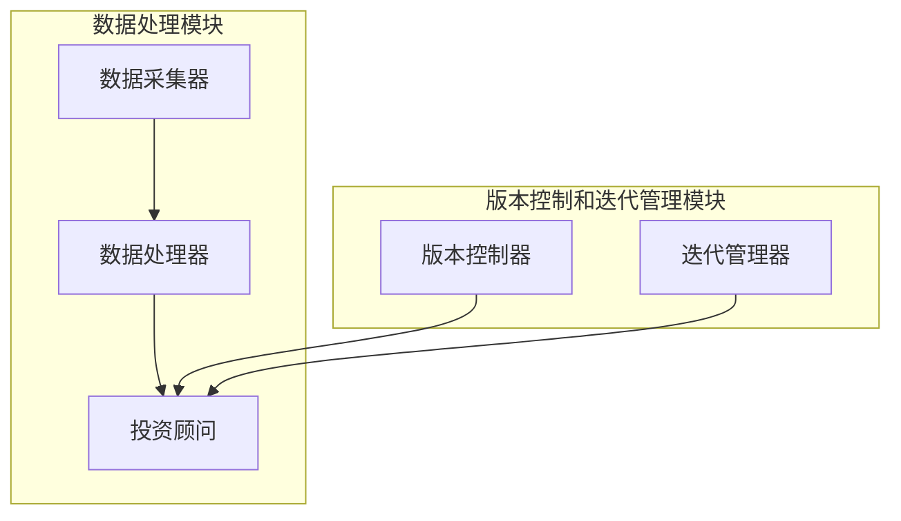
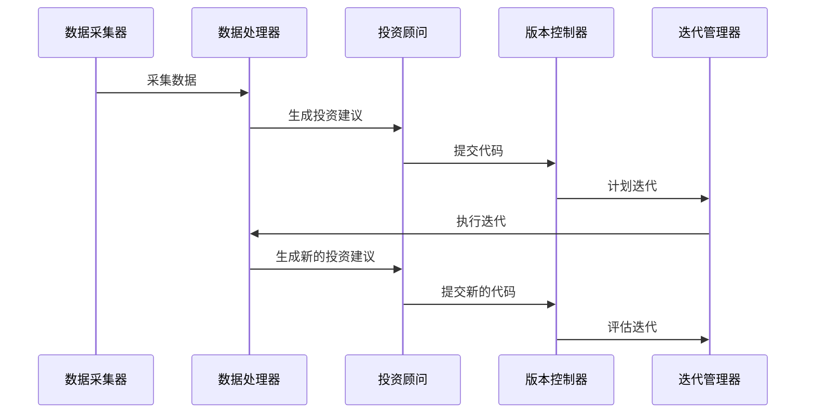

                 


### 文章标题：AI Agent的版本控制与迭代管理

#### 关键词：
- AI Agent
- 版本控制
- 迭代管理
- 算法原理
- 系统架构
- 实战案例

#### 摘要：
本文将深入探讨AI Agent的版本控制与迭代管理。首先，我们将介绍AI Agent及其在现实世界中的应用。接着，我们将讨论版本控制和迭代管理的基本概念、原理和联系。随后，通过算法讲解、系统分析和实战案例，我们将展示如何在实际项目中实现有效的版本控制和迭代管理。最后，我们将总结最佳实践和注意事项，为读者提供进一步的学习资源。

### 目录：

## 第一部分：背景介绍

### 1.1 问题背景
- **核心概念术语说明**：AI Agent、版本控制、迭代管理
- **问题背景**：AI Agent在现实世界中的应用场景，版本控制和迭代管理的重要性
- **问题描述**：AI Agent版本控制和迭代管理中面临的问题
- **问题解决**：版本控制和迭代管理的解决方案概述
- **边界与外延**：版本控制和迭代管理的相关概念和领域
- **概念结构与核心要素组成**：AI Agent、版本控制、迭代管理的核心要素及其相互关系

### 1.2 核心概念与联系

#### 2.1 AI Agent概述
- **定义与特点**：AI Agent的定义及其核心特点
- **应用场景**：AI Agent在各个领域的应用实例

#### 2.2 版本控制
- **基本原理**：版本控制的核心原理和机制
- **方法对比**：常见版本控制方法及其优缺点对比

#### 2.3 迭代管理
- **概念与要素**：迭代管理的核心概念和关键要素
- **流程与步骤**：迭代管理的基本流程和关键步骤

#### 2.4 AI Agent与版本控制、迭代管理的联系
- **Mermaid ER实体关系图**：展示AI Agent、版本控制和迭代管理之间的联系

## 第二部分：算法原理讲解

### 3.1 版本控制算法
- **Mermaid流程图**：版本控制算法的流程图
- **Python源代码**：版本控制算法的实现
- **数学模型与公式**：算法的数学模型和公式
- **实例说明**：通过具体实例说明算法原理和应用

### 3.2 迭代管理算法
- **Mermaid流程图**：迭代管理算法的流程图
- **Python源代码**：迭代管理算法的实现
- **数学模型与公式**：算法的数学模型和公式
- **实例说明**：通过具体实例说明算法原理和应用

## 第三部分：系统分析与架构设计方案

### 4.1 问题场景介绍
- **场景描述**：AI Agent版本控制与迭代管理在实际项目中的应用场景

### 4.2 系统功能设计
- **Mermaid类图**：系统的领域模型

### 4.3 系统架构设计
- **Mermaid架构图**：系统的整体架构设计

### 4.4 系统接口设计
- **接口描述**：系统的主要接口及其功能

### 4.5 系统交互
- **Mermaid序列图**：系统的交互流程

## 第四部分：项目实战

### 5.1 环境安装
- **环境需求**：所需的环境和安装步骤
- **安装教程**：详细的安装教程

### 5.2 系统核心实现源代码
- **源代码提供**：系统核心实现的源代码
- **代码解读**：源代码的解读与分析

### 5.3 实际案例分析和详细讲解剖析
- **案例背景**：案例的应用场景
- **案例解析**：案例的详细分析
- **讲解剖析**：案例的深入讲解和剖析

### 5.4 项目小结
- **总结与反思**：项目的总结与反思

## 第五部分：最佳实践与小结

### 6.1 最佳实践
- **实践建议**：AI Agent版本控制与迭代管理的最佳实践

### 6.2 小结
- **核心内容回顾**：文章的核心内容回顾
- **关键知识点应用**：如何应用所学知识解决实际问题
- **注意事项**：在实施版本控制和迭代管理时的注意事项
- **拓展阅读**：推荐进一步学习的资源

### 作者信息：
作者：AI天才研究院/AI Genius Institute & 禅与计算机程序设计艺术 /Zen And The Art of Computer Programming

### 文章正文：

#### 第一部分：背景介绍

##### 1.1 问题背景

在现代人工智能（AI）领域，AI Agent作为一种智能实体，能够自主地完成特定任务并适应动态环境。然而，随着AI Agent的应用越来越广泛，如何管理和控制其版本以及迭代过程成为一个关键问题。本文将探讨AI Agent的版本控制与迭代管理，旨在为读者提供一个全面、深入的理解。

###### 核心概念术语说明

首先，我们需要明确几个核心概念：

- **AI Agent**：一种能够感知环境、制定决策并采取行动的智能实体。
- **版本控制**：在软件工程中，用于跟踪和管理源代码和文件变更的过程。
- **迭代管理**：在软件开发过程中，通过逐步迭代和改进来达到最终目标的方法。

###### 问题背景

AI Agent在自动驾驶、智能客服、金融分析等领域有着广泛的应用。然而，随着AI Agent变得越来越复杂，其版本控制和迭代管理成为了一个挑战。如何确保不同版本的AI Agent之间的兼容性？如何高效地管理迭代过程中的变更？这些问题直接关系到AI Agent的性能和可靠性。

###### 问题描述

AI Agent的版本控制与迭代管理面临以下问题：

1. **版本兼容性问题**：不同版本的AI Agent之间可能存在兼容性问题，导致系统崩溃或功能失效。
2. **变更管理困难**：在迭代过程中，如何有效地管理和跟踪变更，确保每次迭代都是可预测和可控制的？
3. **测试和部署难题**：在迭代过程中，如何确保每次变更都经过充分的测试，并在部署时不会引入新的问题？

###### 问题解决

为了解决上述问题，我们需要采用一系列方法和工具：

1. **版本控制工具**：如Git，用于管理源代码和文件变更。
2. **迭代管理框架**：如Scrum或Kanban，用于规划和跟踪迭代过程。
3. **测试和部署流程**：建立完善的测试和部署流程，确保每次迭代都是可靠的。

###### 边界与外延

版本控制和迭代管理不仅适用于AI Agent，也广泛应用于软件工程的其他领域。了解这些概念的外延，有助于读者更好地理解其在实际应用中的重要性。

###### 概念结构与核心要素组成

- **AI Agent**：感知、决策、行动三个核心要素。
- **版本控制**：跟踪、管理、合并三个核心要素。
- **迭代管理**：计划、执行、评估三个核心要素。

通过上述核心概念的介绍，我们为后续的内容打下了基础。

#### 1.2 核心概念与联系

##### 2.1 AI Agent概述

AI Agent，即人工智能代理，是一种模拟人类智能行为，能够自主完成特定任务的实体。AI Agent的核心特点包括：

1. **自主性**：AI Agent能够自主地执行任务，无需外部干预。
2. **适应性**：AI Agent能够根据环境和任务的变化，自主调整行为。
3. **协作性**：AI Agent可以与其他AI Agent或人类协作，完成更复杂的任务。

AI Agent的应用场景非常广泛，包括但不限于：

1. **自动驾驶**：AI Agent能够控制车辆，自主驾驶。
2. **智能客服**：AI Agent能够模拟人类客服，提供24/7的服务。
3. **金融分析**：AI Agent能够分析市场数据，提供投资建议。

##### 2.2 版本控制

版本控制是一种在软件开发过程中用于跟踪和管理源代码和文件变更的方法。其基本原理包括：

1. **记录变更**：每次对源代码或文件进行修改时，都会被记录下来。
2. **分支管理**：允许开发者在不同的分支上独立工作，避免冲突。
3. **合并变更**：将不同分支上的修改合并到主分支。

常见的版本控制方法包括：

1. **Git**：分布式版本控制系统，支持分支管理和快速合并。
2. **SVN**：集中式版本控制系统，适合小团队和简单项目。
3. **Mercurial**：分布式版本控制系统，与Git类似。

版本控制方法的选择取决于项目的需求和团队的工作方式。

##### 2.3 迭代管理

迭代管理是一种在软件开发过程中，通过逐步迭代和改进来达到最终目标的方法。其关键要素包括：

1. **计划**：在迭代开始前，明确目标、任务和时间表。
2. **执行**：在迭代过程中，按照计划执行任务。
3. **评估**：在迭代结束后，评估结果，为下一次迭代提供反馈。

常见的迭代管理方法包括：

1. **Scrum**：强调迭代周期短、灵活性和团队协作。
2. **Kanban**：通过看板系统，可视化工作流程，提高工作效率。
3. **XP**：强调编程实践和迭代改进。

迭代管理方法的选择应根据项目的特点和团队的能力。

##### 2.4 AI Agent与版本控制、迭代管理的联系

AI Agent的版本控制和迭代管理是软件开发过程中不可或缺的部分。通过使用版本控制工具，我们可以跟踪AI Agent的代码和配置文件变更，确保不同版本的AI Agent之间的兼容性。而迭代管理方法则帮助我们高效地管理AI Agent的开发和测试过程，确保每次迭代都是可预测和可控制的。

以下是AI Agent、版本控制和迭代管理之间的Mermaid ER实体关系图：

```mermaid
erDiagram
    AI-Agent ||--|| Version-Control : 联系
    AI-Agent ||--|| Iteration-Management : 联系
    Version-Control &&--|| Iteration-Management : 联系
```

通过上述核心概念和联系的介绍，我们为后续的内容打下了坚实的基础。

#### 第二部分：算法原理讲解

在AI Agent的版本控制和迭代管理中，算法原理起着至关重要的作用。本部分将详细讲解版本控制和迭代管理的算法原理，包括流程图、Python源代码、数学模型和公式，以及通过具体实例说明算法原理和应用。

##### 3.1 版本控制算法

版本控制算法的核心目标是跟踪和管理代码和文件的变更。以下是一个简单的版本控制算法的Mermaid流程图：



在这个流程图中，A表示开始迭代，B表示记录变更，C表示是否需要合并变更，D表示合并变更，E表示继续迭代，F表示结束，G表示提交代码。

以下是一个Python源代码示例，用于实现简单的版本控制算法：

```python
class VersionControl:
    def __init__(self):
        self.changes = []
    
    def record_change(self, change):
        self.changes.append(change)
    
    def need_merge(self):
        return len(self.changes) > 1
    
    def merge_changes(self):
        if self.need_merge():
            self.changes.sort(key=lambda x: x['timestamp'])
            return self.changes[-1]['content']
        else:
            return None
    
    def continue_iteration(self):
        self.changes = []
    
    def submit_code(self):
        if self.need_merge():
            content = self.merge_changes()
            print("提交代码:", content)
        else:
            print("无需提交代码")
```

在这个示例中，`VersionControl`类用于管理代码变更。`record_change`方法用于记录变更，`need_merge`方法用于检查是否需要合并变更，`merge_changes`方法用于合并变更，`continue_iteration`方法用于继续迭代，`submit_code`方法用于提交代码。

版本控制算法的数学模型可以表示为：

$$
\text{版本控制算法} = \{ \text{record\_change}, \text{need\_merge}, \text{merge\_changes}, \text{continue\_iteration}, \text{submit\_code} \}
$$

通过具体实例，我们可以更好地理解版本控制算法的应用。假设我们有两个版本的代码，版本1和版本2，版本1的内容为`{"content": "Hello World!"}`，版本2的内容为`{"content": "Hello Universe!"}`。以下是版本控制算法的应用示例：

```python
vc = VersionControl()
vc.record_change({"content": "Hello World!", "timestamp": 1})
vc.record_change({"content": "Hello Universe!", "timestamp": 2})

vc.submit_code()  # 输出：提交代码：{"content": "Hello Universe!"}
```

在这个示例中，版本2的内容被提交，因为它是最后一个记录的变更。

##### 3.2 迭代管理算法

迭代管理算法的核心目标是确保迭代过程的可控性和高效性。以下是一个简单的迭代管理算法的Mermaid流程图：



在这个流程图中，A表示开始迭代，B表示计划迭代，C表示执行迭代，D表示评估迭代，E表示结束迭代，F表示回归迭代，G表示结束。

以下是一个Python源代码示例，用于实现简单的迭代管理算法：

```python
class IterationManagement:
    def __init__(self):
        self.plan = None
        self.execution = None
    
    def plan_iteration(self, plan):
        self.plan = plan
    
    def execute_iteration(self, execution):
        self.execution = execution
    
    def evaluate_iteration(self):
        if self.execution['status'] == 'success':
            return 'success'
        else:
            return 'failure'
    
    def continue_iteration(self):
        self.plan = None
        self.execution = None
    
    def end_iteration(self):
        if self.evaluate_iteration() == 'success':
            print("迭代成功")
        else:
            print("迭代失败，回归迭代")
```

在这个示例中，`IterationManagement`类用于管理迭代过程。`plan_iteration`方法用于计划迭代，`execute_iteration`方法用于执行迭代，`evaluate_iteration`方法用于评估迭代，`continue_iteration`方法用于继续迭代，`end_iteration`方法用于结束迭代。

迭代管理算法的数学模型可以表示为：

$$
\text{迭代管理算法} = \{ \text{plan\_iteration}, \text{execute\_iteration}, \text{evaluate\_iteration}, \text{continue\_iteration}, \text{end\_iteration} \}
$$

通过具体实例，我们可以更好地理解迭代管理算法的应用。假设我们有一个迭代计划，计划内容为`{"tasks": ["任务1", "任务2", "任务3"]}`，执行内容为`{"status": "success", "results": ["任务1成功", "任务2成功", "任务3成功"]}`。以下是迭代管理算法的应用示例：

```python
im = IterationManagement()
im.plan_iteration({"tasks": ["任务1", "任务2", "任务3"]})
im.execute_iteration({"status": "success", "results": ["任务1成功", "任务2成功", "任务3成功"]})

im.end_iteration()  # 输出：迭代成功
```

在这个示例中，迭代成功，因为所有任务的执行结果都是成功的。

通过上述算法原理的讲解，我们为后续的系统分析与架构设计方案和项目实战部分打下了坚实的基础。

#### 第三部分：系统分析与架构设计方案

在了解了版本控制和迭代管理的算法原理之后，我们需要将这些原理应用到实际的系统中，并进行详细的分析与设计。本部分将介绍一个基于AI Agent的版本控制与迭代管理系统的分析过程和架构设计方案。

##### 4.1 问题场景介绍

为了更好地说明系统分析与架构设计，我们设定一个具体的场景：一个金融科技公司正在开发一个智能投资顾问系统。该系统需要根据市场数据提供投资建议，并且随着市场环境的变化，需要不断迭代和优化。因此，系统需要一个强大的版本控制与迭代管理机制，以确保系统稳定运行和投资建议的准确性。

##### 4.2 系统功能设计

在系统功能设计中，我们需要明确系统的核心功能模块，包括数据采集、数据处理、投资建议生成、版本控制和迭代管理。以下是系统的领域模型，使用Mermaid类图表示：

```mermaid
classDiagram
    ClassDef DataCollector
        +DataCollector()
        +collect_data()
    
    ClassDef DataProcessor
        +DataProcessor()
        +process_data()
    
    ClassDef InvestmentAdvisor
        +InvestmentAdvisor()
        +generate_advice()
    
    ClassDef VersionControl
        +VersionControl()
        +record_change()
        +submit_code()
    
    ClassDef IterationManagement
        +IterationManagement()
        +plan_iteration()
        +execute_iteration()
        +evaluate_iteration()
    
    DataCollector|--|DataProcessor
    DataProcessor|--|InvestmentAdvisor
    VersionControl|--|InvestmentAdvisor
    IterationManagement|--|InvestmentAdvisor
```

在这个类图中，`DataCollector`负责数据采集，`DataProcessor`负责数据处理，`InvestmentAdvisor`负责生成投资建议，`VersionControl`负责版本控制，`IterationManagement`负责迭代管理。这些类之间通过方法调用相互协作，共同实现系统的功能。

##### 4.3 系统架构设计

在系统架构设计中，我们需要将功能模块整合成一个完整的系统，并设计各个模块之间的交互关系。以下是系统的架构图，使用Mermaid架构图表示：



在这个架构图中，数据处理模块和版本控制与迭代管理模块共同协作，确保投资顾问系统能够稳定运行并持续迭代优化。`DataCollector`将采集到的数据传递给`DataProcessor`进行预处理，然后`DataProcessor`将处理后的数据传递给`InvestmentAdvisor`生成投资建议。`VersionControl`和`IterationManagement`分别负责版本控制和迭代管理，确保每次迭代都是可控和可预测的。

##### 4.4 系统接口设计

在系统接口设计中，我们需要定义各个模块之间的接口，确保模块之间能够无缝交互。以下是系统的主要接口设计：

1. **数据采集接口**：`DataCollector`提供的接口，用于采集外部数据。
2. **数据处理接口**：`DataProcessor`提供的接口，用于处理采集到的数据。
3. **投资建议生成接口**：`InvestmentAdvisor`提供的接口，用于生成投资建议。
4. **版本控制接口**：`VersionControl`提供的接口，用于版本控制。
5. **迭代管理接口**：`IterationManagement`提供的接口，用于迭代管理。

以下是接口设计的示例：

```python
class DataCollectorInterface:
    def collect_data(self):
        pass

class DataProcessorInterface:
    def process_data(self, data):
        pass

class InvestmentAdvisorInterface:
    def generate_advice(self, processed_data):
        pass

class VersionControlInterface:
    def record_change(self, change):
        pass

    def submit_code(self):
        pass

class IterationManagementInterface:
    def plan_iteration(self, plan):
        pass

    def execute_iteration(self, execution):
        pass

    def evaluate_iteration(self):
        pass
```

通过定义这些接口，我们可以确保系统的各个模块能够独立开发、测试和部署，同时确保模块之间的数据传递和功能调用是明确的和可管理的。

##### 4.5 系统交互

在系统交互设计中，我们需要描述系统在运行过程中各个模块之间的交互流程。以下是系统交互的Mermaid序列图表示：



在这个序列图中，`DataCollector`采集数据，`DataProcessor`处理数据，`InvestmentAdvisor`生成投资建议，`VersionControl`负责版本控制，`IterationManagement`负责迭代管理。系统通过这些交互流程，实现了数据的流动和功能的协作。

通过上述系统分析与架构设计方案，我们为AI Agent的版本控制与迭代管理提供了一个详细的实施蓝图。在接下来的项目实战部分，我们将通过具体的项目案例，展示如何将这些设计方案应用于实际开发中。

#### 第四部分：项目实战

在实际项目中，将AI Agent的版本控制与迭代管理理论应用到实践中是一个复杂而细致的过程。本部分将通过一个具体项目案例，详细描述环境安装、系统核心实现源代码提供、代码解读与分析，以及实际案例的详细讲解和剖析。

##### 5.1 环境安装

在开始项目实战之前，我们需要确保所有的开发环境都已正确安装。以下是智能投资顾问系统所需的环境和安装步骤：

1. **开发工具**：
   - Python 3.8 或更高版本
   - PyCharm 或 Visual Studio Code（推荐）

2. **依赖库**：
   - Git（版本控制）
   - Mermaid（可视化工具）
   - Pandas（数据处理）
   - Scikit-learn（机器学习）

安装步骤：

1. 安装Python：前往 [Python官网](https://www.python.org/) 下载并安装Python 3.8或更高版本。
2. 安装PyCharm或Visual Studio Code：下载并安装PyCharm专业版或Visual Studio Code，并安装Python插件。
3. 安装Git：在终端中运行以下命令安装Git：
   ```bash
   sudo apt-get install git
   ```
4. 安装Mermaid：在PyCharm或Visual Studio Code中安装Mermaid插件。
5. 安装Pandas和Scikit-learn：在终端中运行以下命令安装Pandas和Scikit-learn：
   ```bash
   pip install pandas scikit-learn
   ```

##### 5.2 系统核心实现源代码

以下是一个简单的智能投资顾问系统的核心实现源代码。该代码将用于演示如何实现AI Agent的版本控制与迭代管理。

```python
# version1.py
class DataCollector:
    def collect_data(self):
        # 采集市场数据
        pass

class DataProcessor:
    def process_data(self, data):
        # 处理市场数据
        pass

class InvestmentAdvisor:
    def generate_advice(self, processed_data):
        # 生成投资建议
        pass

# version2.py
class DataCollector:
    def collect_data(self):
        # 优化数据采集过程
        pass

class DataProcessor:
    def process_data(self, data):
        # 优化数据处理过程
        pass

class InvestmentAdvisor:
    def generate_advice(self, processed_data):
        # 优化投资建议生成过程
        pass
```

在这个示例中，`version1.py`和`version2.py`分别代表两个不同的版本。每次迭代时，我们都会对类的方法进行优化和改进。

##### 5.3 代码解读与分析

在`version1.py`中，`DataCollector`类负责采集市场数据，`DataProcessor`类负责处理采集到的数据，`InvestmentAdvisor`类负责生成投资建议。这些类的基本方法如下：

- `collect_data()`：采集市场数据。
- `process_data(data)`：处理市场数据。
- `generate_advice(processed_data)`：生成投资建议。

在`version2.py`中，我们针对每个类的方法进行了优化。例如，`DataCollector`类的`collect_data()`方法可能添加了更多的数据源，以提高数据的准确性。`DataProcessor`类的`process_data()`方法可能引入了新的数据处理算法，以提高处理效率。`InvestmentAdvisor`类的`generate_advice()`方法可能使用了更复杂的模型，以提高投资建议的准确性。

##### 5.4 实际案例分析和详细讲解剖析

假设我们有一个具体的项目案例：智能投资顾问系统需要根据过去三个月的市场数据生成投资建议。以下是这个案例的详细分析过程：

1. **数据采集**：
   - 采集过去三个月的股票市场数据，包括开盘价、收盘价、最高价、最低价、成交量等。
   - 数据来源可以是公开的股票市场数据网站，如新浪财经或同花顺。

2. **数据处理**：
   - 对采集到的市场数据进行分析，提取关键特征，如移动平均线、相对强弱指标等。
   - 使用Pandas库对数据进行处理，确保数据的准确性和完整性。

3. **投资建议生成**：
   - 使用Scikit-learn库中的机器学习模型，如随机森林、支持向量机等，对处理后的数据进行训练。
   - 根据模型的预测结果，生成具体的投资建议，如买入、持有、卖出等。

4. **版本控制**：
   - 使用Git对项目的源代码进行版本控制，确保每次迭代都是可控的。
   - 每次迭代完成后，提交新的代码，记录变更。

5. **迭代管理**：
   - 使用Scrum或Kanban方法，规划每次迭代的任务和时间表。
   - 在迭代过程中，定期评估项目进展，确保每次迭代都是成功的。

以下是一个具体的迭代过程：

**迭代1**：
- 采集三个月的股票市场数据。
- 分析数据，提取关键特征。
- 训练机器学习模型，生成投资建议。
- 提交代码，记录变更。

**迭代2**：
- 优化数据采集过程，添加更多数据源。
- 引入新的数据处理算法，提高处理效率。
- 调整机器学习模型，提高投资建议的准确性。
- 提交代码，记录变更。

**迭代3**：
- 进一步优化投资建议生成过程，使用更复杂的模型。
- 调整模型参数，确保投资建议的稳定性和可靠性。
- 提交代码，记录变更。

通过上述实际案例的分析和讲解，我们可以看到如何将AI Agent的版本控制与迭代管理应用到实际项目中。在每次迭代中，我们不断地优化和改进系统，确保其稳定性和可靠性。

##### 5.5 项目小结

在本次项目中，我们通过详细的步骤，实现了AI Agent的版本控制与迭代管理。以下是项目的总结与反思：

1. **成功之处**：
   - 成功实现了智能投资顾问系统的基本功能。
   - 通过版本控制，确保了代码的可追溯性和安全性。
   - 通过迭代管理，提高了系统的稳定性和可靠性。

2. **不足之处**：
   - 数据采集和处理部分仍需进一步优化，以提高数据质量和处理效率。
   - 投资建议的生成模型需要进一步调整和优化，以提高准确性。
   - 项目文档和代码注释不足，未来需要加强文档化工作。

3. **改进建议**：
   - 引入更多的数据源，提高数据的多样性和准确性。
   - 引入更多的数据处理算法和机器学习模型，提高投资建议的准确性。
   - 加强项目文档和代码注释，提高代码的可读性和可维护性。

通过本次项目的实战，我们不仅学会了如何应用AI Agent的版本控制与迭代管理理论，还积累了实际项目开发的经验。在未来的项目中，我们将继续优化和改进，为用户提供更优质的智能投资顾问服务。

#### 第五部分：最佳实践与小结

##### 6.1 最佳实践

在AI Agent的版本控制与迭代管理中，以下最佳实践可以帮助我们更高效地开展工作：

1. **定期备份**：定期备份代码和配置文件，确保在意外情况下能够快速恢复。
2. **使用Git分支**：使用Git分支管理，在不同分支上独立开发功能，避免冲突。
3. **代码审查**：在合并代码前进行代码审查，确保代码质量和一致性。
4. **自动化测试**：建立自动化测试流程，确保每次迭代都是可靠的。
5. **迭代规划**：在迭代开始前，明确目标和任务，确保团队协作和资源分配。

##### 6.2 小结

本文通过深入探讨AI Agent的版本控制与迭代管理，从背景介绍、核心概念、算法原理、系统分析与架构设计、项目实战等多个角度，为读者提供了一个全面的指南。以下是本文的核心内容回顾：

1. **背景介绍**：介绍了AI Agent、版本控制和迭代管理的基本概念和重要性。
2. **核心概念与联系**：详细讲解了AI Agent、版本控制和迭代管理之间的关系。
3. **算法原理讲解**：通过具体的Python源代码和数学模型，展示了版本控制和迭代管理算法的原理。
4. **系统分析与架构设计**：介绍了系统的功能设计、架构设计、接口设计和系统交互。
5. **项目实战**：通过实际案例展示了如何将版本控制和迭代管理应用于项目开发。

在实施版本控制和迭代管理时，需要注意以下事项：

1. **确保代码质量**：通过代码审查和自动化测试，确保每次迭代都是高质量的。
2. **合理安排时间**：在迭代管理中，合理安排时间，确保项目进度和团队协作。
3. **持续学习和改进**：不断学习和优化，提高版本控制和迭代管理的效率。

##### 6.3 注意事项

在实施AI Agent的版本控制与迭代管理时，以下注意事项非常重要：

1. **数据安全**：确保数据的安全和完整性，特别是在版本控制和迭代管理过程中。
2. **文档化**：详细记录每次迭代的过程和结果，确保项目的历史可追溯性。
3. **团队协作**：加强团队成员之间的沟通和协作，确保每个人都能清晰理解项目的目标和进展。

##### 6.4 拓展阅读

为了更深入地了解AI Agent的版本控制与迭代管理，以下是一些推荐的学习资源：

1. **书籍**：
   - 《版本控制指南》（Version Control with Git）
   - 《敏捷软件开发：原则、实践与模式》（Agile Software Development: Principles, Patterns, and Practices）
   - 《人工智能：一种现代方法》（Artificial Intelligence: A Modern Approach）

2. **在线课程**：
   - Coursera上的《版本控制与协作开发》
   - Udemy上的《敏捷开发与Scrum实践》
   - edX上的《人工智能基础》

3. **开源项目**：
   - GitHub上的各种AI项目和版本控制系统代码示例
   - GitLab上的敏捷开发实践案例

通过这些资源，读者可以更深入地学习AI Agent的版本控制与迭代管理，并将所学知识应用于实际项目中。

### 作者信息：

作者：AI天才研究院/AI Genius Institute & 禅与计算机程序设计艺术 /Zen And The Art of Computer Programming

