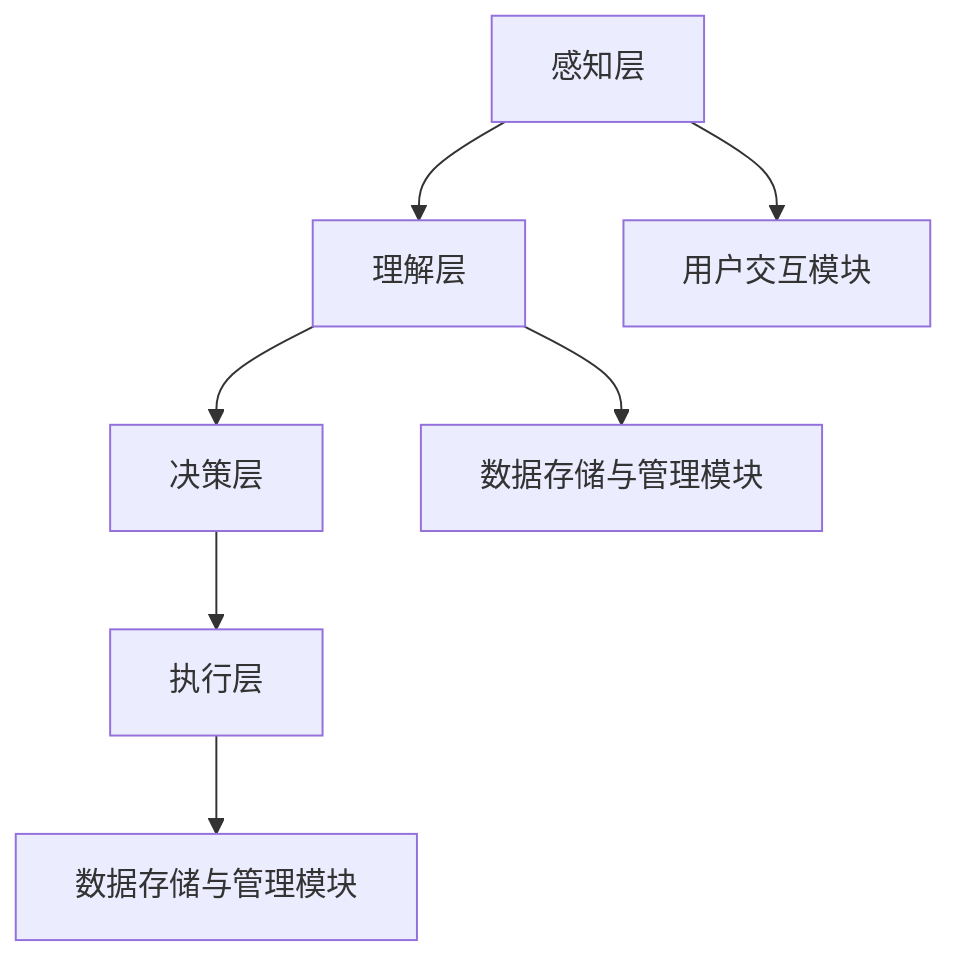
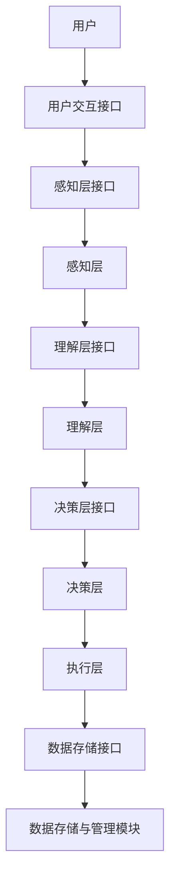

                 

# AI Agent的环境感知：上下文理解与适应

## 关键词
- AI Agent
- 环境感知
- 上下文理解
- 适应性
- 智能代理

## 摘要
本文将深入探讨AI Agent在现实世界中的应用，特别是其环境感知、上下文理解和适应性的核心机制。通过逐步分析这些关键概念，我们旨在提供一个全面的技术视角，帮助读者理解AI Agent如何通过感知环境、理解上下文以及适应不断变化的情况来实现智能化。

## 目录大纲

### 第一部分：背景介绍

#### 第1章 AI Agent的环境感知：上下文理解与适应

##### 1.1 问题的背景与重要性

- 1.1.1 人工智能与智能代理的兴起
- 1.1.2 环境感知与上下文理解的重要性
- 1.1.3 AI Agent在现实世界中的应用

##### 1.2 核心概念与联系

- 1.2.1 环境感知的定义与特点
- 1.2.2 上下文理解的概念与分类
- 1.2.3 环境感知与上下文理解的关系

##### 1.3 环境感知的原理与方法

- 1.3.1 环境感知的基本原理
- 1.3.2 环境感知的技术手段
- 1.3.3 环境感知在AI Agent中的应用

##### 1.4 上下文理解与适应

- 1.4.1 上下文理解的关键因素
- 1.4.2 上下文理解的算法原理
- 1.4.3 适应性的定义与类型
- 1.4.4 AI Agent的适应策略

##### 1.5 本章小结

### 第二部分：核心概念与联系

#### 第2章 环境感知的原理与技术

##### 2.1 环境感知的基本原理

- 2.1.1 感知系统的工作原理
- 2.1.2 感知数据的特征提取
- 2.1.3 感知数据的处理与融合

##### 2.2 环境感知的技术手段

- 2.2.1 视觉感知技术
- 2.2.2 声音感知技术
- 2.2.3 气味感知技术
- 2.2.4 其他感知技术

##### 2.3 环境感知在AI Agent中的应用

- 2.3.1 环境感知在导航中的应用
- 2.3.2 环境感知在安全监测中的应用
- 2.3.3 环境感知在智能交互中的应用

##### 2.4 环境感知与上下文理解的关系

- 2.4.1 环境感知与上下文理解的关系概述
- 2.4.2 环境感知对上下文理解的影响
- 2.4.3 上下文理解对环境感知的反馈

##### 2.5 本章小结

### 第三部分：算法原理讲解

#### 第3章 上下文理解的算法原理与实现

##### 3.1 上下文理解的关键因素

- 3.1.1 上下文信息的定义与类型
- 3.1.2 上下文理解的关键因素分析
- 3.1.3 上下文信息的处理策略

##### 3.2 上下文理解的算法原理

- 3.2.1 传统上下文理解算法
- 3.2.2 基于深度学习的上下文理解算法
- 3.2.3 多模态上下文理解算法

##### 3.3 上下文理解的实现

- 3.3.1 数据预处理
- 3.3.2 模型训练与评估
- 3.3.3 实时上下文理解系统的设计

##### 3.4 实例分析

- 3.4.1 案例一：智能客服系统
- 3.4.2 案例二：智能助手系统
- 3.4.3 案例三：智能交通系统

##### 3.5 本章小结

### 第四部分：系统分析与架构设计

#### 第4章 AI Agent的系统架构与功能设计

##### 4.1 问题描述与需求分析

- 4.1.1 问题描述
- 4.1.2 需求分析
- 4.1.3 系统目标

##### 4.2 系统功能设计

- 4.2.1 环境感知模块
- 4.2.2 上下文理解模块
- 4.2.3 适应与决策模块

##### 4.3 系统架构设计

- 4.3.1 系统架构概述
- 4.3.2 系统架构图
- 4.3.3 模块间的关系与交互

##### 4.4 系统接口设计

- 4.4.1 接口定义与设计
- 4.4.2 接口调用流程

##### 4.5 系统交互设计

- 4.5.1 系统交互概述
- 4.5.2 系统交互图
- 4.5.3 系统交互实例分析

##### 4.6 本章小结

### 第五部分：项目实战

#### 第5章 AI Agent的环境感知与适应项目实战

##### 5.1 环境准备

- 5.1.1 硬件与软件环境
- 5.1.2 数据集准备
- 5.1.3 工具与库的安装

##### 5.2 系统核心实现

- 5.2.1 环境感知模块实现
- 5.2.2 上下文理解模块实现
- 5.2.3 适应与决策模块实现

##### 5.3 代码应用解读与分析

- 5.3.1 环境感知代码解读
- 5.3.2 上下文理解代码解读
- 5.3.3 适应与决策代码解读

##### 5.4 实际案例分析与详细讲解

- 5.4.1 实际案例一
- 5.4.2 实际案例二
- 5.4.3 实际案例三

##### 5.5 项目小结

### 第六部分：最佳实践与拓展

#### 第6章 AI Agent环境感知与适应的最佳实践

##### 6.1 环境感知技术的最佳实践

- 6.1.1 数据质量与预处理
- 6.1.2 模型选择与优化
- 6.1.3 实时性与可靠性

##### 6.2 上下文理解的最佳实践

- 6.2.1 多模态数据融合
- 6.2.2 上下文理解模型优化
- 6.2.3 适应性策略应用

##### 6.3 适应性的最佳实践

- 6.3.1 学习策略与反馈机制
- 6.3.2 动态调整与预测
- 6.3.3 安全性与稳定性

##### 6.4 小结

##### 6.5 拓展阅读

## 第一部分：背景介绍

### 第1章 AI Agent的环境感知：上下文理解与适应

#### 1.1 问题的背景与重要性

随着人工智能技术的迅猛发展，AI Agent作为智能代理的代表，已经逐渐渗透到我们日常生活的方方面面。从智能家居的智能助手，到自动驾驶汽车，再到智能客服系统，AI Agent的应用场景越来越广泛。然而，这些AI Agent的核心能力在于其能够对环境进行感知、理解上下文并适应不同的情境。

**人工智能与智能代理的兴起**

人工智能（AI）作为计算机科学的一个分支，旨在通过模拟、延伸和扩展人的智能来设计智能计算机系统。智能代理（AI Agent）则是AI技术的一种应用，它能够在没有人类直接干预的情况下，自主地完成某些任务。智能代理的核心在于其具备感知环境、理解上下文和做出决策的能力。

智能代理的概念最早可以追溯到20世纪70年代，但在过去几十年中，随着计算能力的提升、大数据技术的发展以及深度学习算法的突破，智能代理的技术逐渐成熟。如今，智能代理已经能够应用于导航、监控、交互、医疗等多个领域。

**环境感知与上下文理解的重要性**

环境感知（Sensing）是智能代理获取外部信息的过程，通过感知技术，如视觉、听觉、触觉等，智能代理可以获取到周围环境的信息。这些信息是智能代理进行决策和行动的基础。

上下文理解（Contextual Understanding）则是指智能代理对获取到的环境信息进行理解、分析和解释的过程。通过上下文理解，智能代理能够更好地理解当前的状态、情境和目标，从而做出更加合理的决策。

环境感知和上下文理解是智能代理的核心能力，它们决定了智能代理在复杂、动态环境中的适应性和表现。因此，研究AI Agent的环境感知和上下文理解，对于提高智能代理的智能化水平具有重要意义。

**AI Agent在现实世界中的应用**

AI Agent在现实世界中的应用已经非常广泛，以下是几个典型的应用场景：

1. **导航与交通**：智能代理可以用于自动驾驶汽车、智能导航系统等，通过感知路况信息，智能代理能够实时调整行驶路线，提高交通效率和安全性。

2. **安全监控**：智能代理可以用于监控场所的安全，通过感知视频、音频等数据，智能代理能够识别异常行为，并及时报警。

3. **智能交互**：智能代理可以用于智能客服系统、虚拟助手等，通过与用户的交互，智能代理能够理解用户的需求，并提供相应的服务。

4. **医疗健康**：智能代理可以用于健康监测、疾病诊断等，通过感知用户的生理数据，智能代理能够提供个性化的健康建议。

**本章小结**

在本章中，我们探讨了AI Agent的背景、环境感知和上下文理解的重要性，以及AI Agent在现实世界中的应用。在接下来的章节中，我们将进一步深入探讨环境感知和上下文理解的原理、技术以及实现方法。

#### 1.2 核心概念与联系

在深入探讨AI Agent的环境感知和上下文理解之前，我们需要明确一些核心概念，并分析它们之间的联系。

**环境感知（Sensing）**

环境感知是指智能代理通过感知技术获取外部环境信息的过程。感知技术包括视觉、听觉、触觉、嗅觉等多种形式。智能代理通过这些感知技术获取到的数据，可以用于理解当前的环境状态、识别目标物体、感知危险等。

- **定义与特点**：环境感知是智能代理获取外部信息的基础，它具有实时性、动态性和多样性等特点。

- **重要性**：环境感知数据是智能代理进行决策和行动的依据，没有有效的环境感知，智能代理将无法适应复杂的环境。

**上下文理解（Contextual Understanding）**

上下文理解是指智能代理对获取到的环境信息进行理解、分析和解释的过程。通过上下文理解，智能代理能够更好地理解当前的状态、情境和目标，从而做出更加合理的决策。

- **定义与类型**：上下文理解涉及对时间、空间、场景等信息的理解，可以分为静态上下文和动态上下文。

- **重要性**：上下文理解是智能代理进行有效决策的关键，它决定了智能代理在特定情境下的行为和响应。

**环境感知与上下文理解的关系**

环境感知和上下文理解是智能代理的两个核心能力，它们之间存在密切的联系。

- **相互依赖**：环境感知提供了上下文理解所需的数据，而上下文理解则利用这些数据做出更准确的决策。

- **动态反馈**：环境感知和上下文理解之间存在动态反馈机制，环境感知的结果会影响上下文理解，而上下文理解的结果又会反馈到环境感知中，从而实现智能代理的持续学习和优化。

**本章小结**

在本章中，我们明确了环境感知和上下文理解的核心概念，并分析了它们之间的联系。在接下来的章节中，我们将深入探讨环境感知的原理、技术以及其在AI Agent中的应用。

#### 1.3 环境感知的原理与方法

环境感知是AI Agent的核心能力之一，它通过多种感知技术获取外部环境信息，并进行分析和处理，以实现对环境的理解。本节将详细探讨环境感知的基本原理、技术手段以及其在AI Agent中的应用。

**1.3.1 环境感知的基本原理**

环境感知的基本原理可以概括为以下三个步骤：

1. **感知数据的获取**：通过感知技术，如视觉、听觉、触觉等，智能代理从外部环境中获取数据。这些数据可以是图像、声音、温度、湿度等。

2. **感知数据的预处理**：获取到的感知数据往往含有噪声、缺失值等，需要通过预处理技术，如滤波、去噪、数据补全等，对数据进行清洗和标准化。

3. **感知数据的分析**：对预处理后的数据进行特征提取和模式识别，以提取出有用的信息，如物体的形状、颜色、声音的频率等。

**1.3.2 环境感知的技术手段**

环境感知的技术手段多种多样，以下是一些常见的技术：

1. **视觉感知技术**：通过摄像头或其他图像传感器获取图像数据，再通过图像处理技术，如边缘检测、目标识别等，对图像进行分析。

   ```mermaid
   graph TD
   A[摄像头] --> B[图像处理]
   B --> C[目标识别]
   ```

2. **声音感知技术**：通过麦克风或其他声音传感器获取声音数据，再通过声音处理技术，如噪声过滤、语音识别等，对声音进行分析。

   ```mermaid
   graph TD
   A[麦克风] --> B[声音处理]
   B --> C[语音识别]
   ```

3. **触觉感知技术**：通过力传感器、触摸传感器等获取触觉数据，再通过触觉处理技术，如触觉识别、压力感知等，对触觉信息进行分析。

   ```mermaid
   graph TD
   A[触觉传感器] --> B[触觉处理]
   B --> C[触觉识别]
   ```

4. **其他感知技术**：除了上述三种常见的感知技术，还有气味感知、温度感知、湿度感知等多种技术，用于获取不同类型的环境信息。

**1.3.3 环境感知在AI Agent中的应用**

环境感知在AI Agent中的应用非常广泛，以下是一些典型的应用场景：

1. **导航与交通**：AI Agent通过视觉感知技术获取路况信息，通过声音感知技术获取交通信号，从而实现自动驾驶。

   ```mermaid
   graph TD
   A[视觉感知] --> B[路况信息]
   C[声音感知] --> D[交通信号]
   B --> E[导航决策]
   D --> E
   ```

2. **安全监控**：AI Agent通过视觉和声音感知技术实时监控场所的安全，通过识别异常行为和声音，及时发出警报。

   ```mermaid
   graph TD
   A[视觉感知] --> B[异常行为识别]
   C[声音感知] --> D[异常声音识别]
   B --> E[报警系统]
   D --> E
   ```

3. **智能交互**：AI Agent通过语音感知技术理解用户的需求，通过视觉感知技术分析用户的表情和姿态，从而提供更加个性化的服务。

   ```mermaid
   graph TD
   A[语音感知] --> B[需求分析]
   C[视觉感知] --> D[表情分析]
   B --> E[服务提供]
   D --> E
   ```

**本章小结**

在本章中，我们详细探讨了环境感知的基本原理、技术手段以及在AI Agent中的应用。环境感知是AI Agent实现智能化的重要基础，通过感知外部环境、理解上下文信息，AI Agent能够在复杂的环境中自主行动和做出决策。在下一章中，我们将进一步探讨上下文理解的概念、算法原理和实现方法。

### 1.4 上下文理解与适应

上下文理解是AI Agent实现智能化的重要环节，它使智能代理能够根据获取到的环境信息，理解当前的状态和情境，从而做出合理的决策。同时，适应性是智能代理在面对变化和不确定性时，能够调整自身行为以适应环境的能力。本节将深入探讨上下文理解和适应性的关键因素、算法原理以及AI Agent的适应策略。

#### 1.4.1 上下文理解的关键因素

上下文理解的关键因素主要包括以下几个方面：

1. **上下文信息的定义与类型**：上下文信息是指与特定情境相关的一组数据或信息，它可以是时间、地点、用户行为、环境状态等。根据不同的分类标准，上下文信息可以有多种类型，如静态上下文和动态上下文。

   - **静态上下文**：指在一段时间内相对不变的环境信息，如地理位置、用户偏好等。
   - **动态上下文**：指随时间或事件变化而变化的环境信息，如实时天气、交通流量等。

2. **上下文理解的关键因素分析**：上下文理解的关键因素包括数据的完整性、准确性和实时性。此外，上下文信息的处理策略也对上下文理解的效果产生影响。

   - **数据完整性**：上下文信息需要是完整的，缺失或不完整的数据可能会导致上下文理解的偏差。
   - **数据准确性**：上下文信息的准确性是上下文理解的基础，不准确的数据会直接影响决策的准确性。
   - **数据实时性**：上下文信息的实时性对于某些应用场景非常重要，如实时导航、智能监控等，需要及时获取和处理环境变化。

3. **上下文信息的处理策略**：为了提高上下文理解的准确性，通常采用以下几种处理策略：

   - **数据融合**：将不同来源的上下文信息进行融合，以获得更全面的理解。
   - **特征提取**：从原始数据中提取出具有代表性的特征，用于上下文理解。
   - **模式识别**：通过机器学习算法，对上下文信息进行模式识别，以提取出有用的信息。

#### 1.4.2 上下文理解的算法原理

上下文理解的算法原理可以分为传统算法和基于深度学习的算法。传统算法主要依赖于规则和逻辑，而基于深度学习的算法则通过神经网络模型实现。

1. **传统上下文理解算法**：传统上下文理解算法主要包括基于规则的方法和基于模式识别的方法。

   - **基于规则的方法**：通过定义一系列规则，将上下文信息映射到相应的行为或决策。这种方法需要对上下文信息有深刻的理解，并能够准确定义规则，但规则的可扩展性和适应性较差。
   - **基于模式识别的方法**：通过训练模式识别模型，将上下文信息映射到相应的行为或决策。这种方法具有较高的自适应性和可扩展性，但需要对大量数据进行训练。

2. **基于深度学习的上下文理解算法**：基于深度学习的算法通过多层神经网络模型实现上下文理解，具有如下优势：

   - **端到端的学习**：直接从原始数据中学习上下文信息，不需要人为定义规则或特征。
   - **强大的表达能力**：深度学习模型可以自动学习复杂的特征表示，从而提高上下文理解的准确性。

常见的基于深度学习的上下文理解算法包括循环神经网络（RNN）、长短期记忆网络（LSTM）和变换器（Transformer）等。

3. **多模态上下文理解算法**：多模态上下文理解是指同时处理多种类型上下文信息的算法。通过融合不同模态的上下文信息，可以更全面地理解情境，提高决策的准确性。

多模态上下文理解算法可以通过以下几种方式实现：

   - **串联模型**：将不同模态的上下文信息串联起来，形成一个统一的序列。
   - **并行模型**：同时处理不同模态的上下文信息，并通过融合模块进行整合。
   - **混合模型**：结合串联模型和并行模型的特点，实现多模态上下文理解。

#### 1.4.3 适应性的定义与类型

适应性是指智能代理在面对环境变化和不确定性时，能够调整自身行为以适应新情况的能力。根据适应性的实现方式，可以分为以下几种类型：

1. **被动适应性**：被动适应性是指智能代理通过接收外部反馈，调整自身行为以适应环境。这种适应性通常基于反馈机制，如奖励机制、惩罚机制等。

2. **主动适应性**：主动适应性是指智能代理通过预测未来环境变化，主动调整自身行为以适应新情况。这种适应性通常基于预测模型，如马尔可夫决策过程（MDP）等。

3. **混合适应性**：混合适应性是指智能代理同时具有被动适应性和主动适应性。通过结合外部反馈和预测，智能代理可以更加灵活地应对环境变化。

#### 1.4.4 AI Agent的适应策略

AI Agent的适应策略主要包括以下几个方面：

1. **学习策略**：智能代理通过学习环境数据，建立对环境的理解，并根据环境变化调整自身行为。常见的学习策略包括监督学习、无监督学习和强化学习等。

2. **反馈机制**：智能代理通过接收外部反馈，评估自身行为的有效性，并根据反馈调整行为。反馈机制可以是直接的（如奖励机制）或间接的（如误差反馈）。

3. **预测模型**：智能代理通过预测未来环境变化，提前调整自身行为。常见的预测模型包括时间序列模型、概率模型和深度学习模型等。

4. **自适应调整**：智能代理根据环境变化，动态调整感知器、决策器和执行器的参数，以提高适应性和效率。

**本章小结**

在本章中，我们深入探讨了上下文理解与适应性的关键因素、算法原理以及AI Agent的适应策略。上下文理解和适应性是智能代理实现智能化的重要基础，通过理解上下文信息、适应环境变化，AI Agent能够更好地应对复杂、动态的环境。在下一章中，我们将进一步探讨环境感知的技术手段及其在AI Agent中的应用。

### 1.5 本章小结

本章主要介绍了AI Agent的环境感知、上下文理解与适应性的核心概念及其在现实世界中的应用。首先，我们探讨了环境感知的基本原理和技术手段，包括视觉、听觉、触觉等感知技术。其次，我们分析了上下文理解的定义、类型以及关键因素，介绍了传统算法和基于深度学习的上下文理解算法。最后，我们讨论了适应性的定义和类型，以及AI Agent的适应策略。通过本章的学习，读者可以初步了解AI Agent在复杂环境中的感知、理解和适应能力，为后续章节的深入探讨奠定基础。

### 第二部分：核心概念与联系

#### 第2章 环境感知的原理与技术

环境感知是AI Agent实现智能化的重要基础，通过对外部环境的感知和理解，智能代理能够做出合理的决策和行动。本章将详细探讨环境感知的基本原理、技术手段以及其在AI Agent中的应用。

#### 2.1 环境感知的基本原理

环境感知的基本原理包括感知数据的获取、预处理和分析。以下是环境感知的基本流程：

1. **感知数据的获取**：智能代理通过感知器（如摄像头、麦克风、传感器等）从外部环境中获取数据。这些数据可以是图像、声音、温度、湿度等多种形式。

2. **感知数据的预处理**：获取到的感知数据通常存在噪声、缺失值等问题，需要通过预处理技术进行清洗和标准化。预处理步骤包括滤波、去噪、数据补全等。

3. **感知数据的分析**：对预处理后的数据进行特征提取和模式识别，以提取出有用的信息，如物体的形状、颜色、声音的频率等。特征提取和模式识别的结果用于上下文理解、决策和行动。

**2.1.1 感知系统的工作原理**

感知系统的工作原理可以分为以下几个步骤：

1. **数据采集**：感知器捕获外部环境的信息，并将其转换为数字信号。

2. **信号处理**：对捕获的信号进行预处理，如滤波、放大、采样等，以提高信号的质量。

3. **特征提取**：从预处理后的信号中提取出具有代表性的特征，如频域特征、时域特征等。

4. **模式识别**：利用提取出的特征，通过机器学习算法，对环境中的对象、事件等进行识别和分类。

**2.1.2 感知数据的特征提取**

特征提取是感知系统中的一个关键步骤，其目的是从原始数据中提取出具有代表性的特征，以便进行后续的建模和分析。常见的特征提取方法包括：

1. **统计特征**：如均值、方差、协方差等，用于描述数据的分布特征。

2. **时域特征**：如信号的时域特性，如频率、周期、振幅等。

3. **频域特征**：如信号的频谱特性，如幅度谱、相位谱等。

4. **时频特征**：结合时域和频域特征，如短时傅里叶变换（STFT）、小波变换等。

**2.1.3 感知数据的处理与融合**

感知数据的处理与融合是指在特征提取后，对提取出的特征进行综合处理，以获得更全面的环境信息。处理与融合的方法包括：

1. **数据融合**：将来自不同感知器的数据（如视觉、声音等）进行融合，以获得更全面的环境理解。

2. **多特征融合**：将同一感知器的不同特征进行融合，以提取出更具有代表性的特征。

3. **时序融合**：将不同时间点的数据进行融合，以分析环境的变化趋势。

**2.2 环境感知的技术手段**

环境感知的技术手段多种多样，以下是一些常见的技术：

1. **视觉感知技术**：通过摄像头或其他图像传感器获取图像数据，再通过图像处理技术，如边缘检测、目标识别等，对图像进行分析。

   ```mermaid
   graph TD
   A[摄像头] --> B[图像处理]
   B --> C[目标识别]
   ```

2. **声音感知技术**：通过麦克风或其他声音传感器获取声音数据，再通过声音处理技术，如噪声过滤、语音识别等，对声音进行分析。

   ```mermaid
   graph TD
   A[麦克风] --> B[声音处理]
   B --> C[语音识别]
   ```

3. **触觉感知技术**：通过力传感器、触摸传感器等获取触觉数据，再通过触觉处理技术，如触觉识别、压力感知等，对触觉信息进行分析。

   ```mermaid
   graph TD
   A[触觉传感器] --> B[触觉处理]
   B --> C[触觉识别]
   ```

4. **其他感知技术**：除了上述三种常见的感知技术，还有气味感知、温度感知、湿度感知等多种技术，用于获取不同类型的环境信息。

**2.3 环境感知在AI Agent中的应用**

环境感知在AI Agent中的应用非常广泛，以下是一些典型的应用场景：

1. **导航与交通**：AI Agent通过视觉感知技术获取路况信息，通过声音感知技术获取交通信号，从而实现自动驾驶。

   ```mermaid
   graph TD
   A[视觉感知] --> B[路况信息]
   C[声音感知] --> D[交通信号]
   B --> E[导航决策]
   D --> E
   ```

2. **安全监控**：AI Agent通过视觉和声音感知技术实时监控场所的安全，通过识别异常行为和声音，及时发出警报。

   ```mermaid
   graph TD
   A[视觉感知] --> B[异常行为识别]
   C[声音感知] --> D[异常声音识别]
   B --> E[报警系统]
   D --> E
   ```

3. **智能交互**：AI Agent通过语音感知技术理解用户的需求，通过视觉感知技术分析用户的表情和姿态，从而提供更加个性化的服务。

   ```mermaid
   graph TD
   A[语音感知] --> B[需求分析]
   C[视觉感知] --> D[表情分析]
   B --> E[服务提供]
   D --> E
   ```

**2.4 环境感知与上下文理解的关系**

环境感知与上下文理解是智能代理的两个核心能力，它们之间存在密切的联系。

1. **相互依赖**：环境感知提供了上下文理解所需的数据，而上下文理解则利用这些数据做出更准确的决策。

2. **动态反馈**：环境感知和上下文理解之间存在动态反馈机制，环境感知的结果会影响上下文理解，而上下文理解的结果又会反馈到环境感知中，从而实现智能代理的持续学习和优化。

**本章小结**

在本章中，我们详细探讨了环境感知的基本原理、技术手段以及在AI Agent中的应用。环境感知是AI Agent实现智能化的重要基础，通过感知外部环境、理解上下文信息，AI Agent能够在复杂的环境中自主行动和做出决策。在下一章中，我们将进一步探讨上下文理解的概念、算法原理和实现方法。

### 2.2 环境感知的技术手段

环境感知的技术手段是实现智能代理核心功能的关键环节。通过多种感知技术，智能代理能够从不同的维度获取环境信息，从而在复杂环境中进行有效的决策和行动。本节将详细介绍几种常见的环境感知技术，包括视觉感知技术、声音感知技术、气味感知技术和其他感知技术，并探讨每种技术的具体应用。

**2.2.1 视觉感知技术**

视觉感知技术是智能代理最常用的感知技术之一。它通过摄像头或其他图像传感器捕捉图像，然后利用图像处理和分析算法对图像进行理解和解释。视觉感知技术的主要应用包括：

1. **目标识别**：通过识别图像中的特定目标，如车辆、行人等，智能代理能够实现对环境的理解和监控。常见的算法包括卷积神经网络（CNN）和支持向量机（SVM）等。

2. **场景分类**：通过分析图像的内容，智能代理可以判断当前所处的环境或场景，如城市街道、森林、室内等。这种能力在智能监控和自动驾驶等领域具有重要意义。

3. **图像分割**：将图像划分为不同的区域，以便进行更精细的分析和处理。图像分割技术在物体检测、图像增强等领域有广泛应用。

**2.2.2 声音感知技术**

声音感知技术通过麦克风或其他声音传感器捕捉声音信号，然后利用信号处理和分析算法对声音进行理解和解释。声音感知技术的主要应用包括：

1. **语音识别**：将语音信号转换为文本或命令，智能代理可以通过语音识别技术实现人机交互。常见的算法包括隐马尔可夫模型（HMM）、高斯混合模型（GMM）和深度神经网络（DNN）等。

2. **声音定位**：通过分析声音的来源和方向，智能代理可以确定声音的位置，这在智能监控和无人机导航等领域具有重要作用。

3. **声音情感分析**：通过分析声音的频率、振幅等特征，智能代理可以判断用户的情感状态，从而提供更加个性化的服务。

**2.2.3 气味感知技术**

气味感知技术通过气味传感器捕捉气味分子，然后利用化学和生物传感器对气味进行理解和解释。尽管气味感知技术在智能代理中的应用相对较少，但在某些特定领域具有很大的潜力，例如：

1. **环境监测**：通过检测空气中的气味，智能代理可以监测环境污染、火灾等危险情况。

2. **健康监测**：通过检测体味，智能代理可以诊断某些疾病，如糖尿病、癌症等。

3. **气味识别**：通过识别特定的气味，智能代理可以实现对特定物质的检测，这在食品检测、药物检测等领域具有广泛的应用。

**2.2.4 其他感知技术**

除了视觉、声音和气味感知技术，还有一些其他类型的感知技术，这些技术在特定的应用场景中发挥着重要作用。

1. **触觉感知技术**：通过触觉传感器捕捉触觉信息，智能代理可以模拟人的触觉感知，实现对物体的感知和交互。触觉感知技术在虚拟现实、机器人控制等领域有广泛应用。

2. **温度感知技术**：通过温度传感器捕捉环境温度，智能代理可以实现对环境温度的监控和控制。这种技术广泛应用于智能家居、工业控制等领域。

3. **湿度感知技术**：通过湿度传感器捕捉环境湿度，智能代理可以实现对环境湿度的监控和控制。这种技术广泛应用于农业、气象监测等领域。

**2.2.5 感知技术的综合应用**

在现实世界中，智能代理通常需要同时利用多种感知技术来获取全面的环境信息。例如，在自动驾驶汽车中，智能代理需要同时利用视觉、声音和触觉感知技术来获取道路信息、车辆状态和路况数据，从而实现安全的驾驶。

通过综合应用多种感知技术，智能代理可以更准确地理解环境，提高决策的准确性，增强其适应性和智能化水平。

**本章小结**

在本章中，我们详细介绍了环境感知的几种关键技术手段，包括视觉感知技术、声音感知技术、气味感知技术和其他感知技术。每种感知技术都有其独特的应用场景和优势，通过综合应用这些技术，智能代理可以更好地理解环境，实现智能化的决策和行动。在下一章中，我们将进一步探讨环境感知与上下文理解之间的关系，以及它们在AI Agent中的具体应用。

### 2.3 环境感知在AI Agent中的应用

环境感知技术不仅为AI Agent提供了丰富的外部信息，而且在实际应用中，这些技术也极大地提升了智能代理的智能化水平和自主能力。本节将详细讨论环境感知技术在导航、安全监测和智能交互等典型应用场景中的具体实现方法和效果。

**2.3.1 环境感知在导航中的应用**

导航是环境感知技术的一个重要应用领域，尤其是在自动驾驶和智能导航系统中。环境感知技术在导航中的应用主要包括以下几个方面：

1. **地图构建**：通过视觉感知技术，自动驾驶车辆可以实时构建周围环境的地图。例如，使用激光雷达（LiDAR）和摄像头数据，智能代理可以生成高精度的三维地图，包括道路、建筑物和障碍物等信息。

   ```mermaid
   graph TD
   A[激光雷达] --> B[三维地图]
   C[摄像头] --> B
   ```

2. **实时路径规划**：基于构建的地图和实时感知数据，智能代理可以实时规划行驶路径，避免碰撞和交通拥堵。视觉感知和雷达感知技术相结合，可以提供准确的路径信息，确保驾驶安全。

   ```mermaid
   graph TD
   A[地图数据] --> B[路径规划]
   C[感知数据] --> B
   ```

3. **障碍物检测**：通过视觉感知技术，自动驾驶车辆可以检测到道路上的行人、车辆和其他障碍物，并及时做出反应。例如，使用CNN算法进行物体检测，智能代理可以快速识别并避开障碍物。

   ```mermaid
   graph TD
   A[摄像头] --> B[物体检测]
   C[障碍物识别] --> D[路径调整]
   ```

**2.3.2 环境感知在安全监测中的应用**

在安全监测领域，环境感知技术被广泛应用于监控场所的安全，及时发现异常情况并发出警报。以下是一些具体应用实例：

1. **视频监控**：通过摄像头和图像处理技术，智能代理可以实时监控特定区域，识别异常行为，如入侵、打架等。视频监控技术结合机器学习算法，可以实现对视频数据的实时分析和处理。

   ```mermaid
   graph TD
   A[摄像头] --> B[图像处理]
   C[行为识别] --> D[异常检测]
   ```

2. **声音监控**：通过麦克风和声音处理技术，智能代理可以捕捉环境中的声音，识别潜在的危险信号，如火灾、爆炸声等。声音监控技术可以用于自动化报警系统，提高安全监控的效率。

   ```mermaid
   graph TD
   A[麦克风] --> B[声音处理]
   C[声音识别] --> D[报警系统]
   ```

3. **温度和烟雾感知**：在特定环境中，如仓库和工厂，环境感知技术可以检测温度和烟雾等指标，及时发现异常情况并采取措施。例如，使用温度传感器和烟雾传感器，智能代理可以监控火灾风险。

   ```mermaid
   graph TD
   A[温度传感器] --> B[温度监控]
   C[烟雾传感器] --> D[火灾预警]
   ```

**2.3.3 环境感知在智能交互中的应用**

智能交互是AI Agent与人类用户之间沟通的重要方式。环境感知技术在智能交互中的应用，使得智能代理能够更好地理解用户的需求和行为，提供个性化的服务。以下是一些具体应用实例：

1. **语音识别**：通过麦克风和语音识别技术，智能代理可以理解用户的语音指令，进行语音交互。例如，智能助手可以使用语音识别技术来处理用户的问题和请求。

   ```mermaid
   graph TD
   A[麦克风] --> B[语音识别]
   C[指令处理] --> D[响应生成]
   ```

2. **表情和姿态识别**：通过摄像头和面部识别技术，智能代理可以分析用户的表情和姿态，理解用户的心理状态和情感需求。这种技术广泛应用于虚拟现实和增强现实领域。

   ```mermaid
   graph TD
   A[摄像头] --> B[面部识别]
   C[表情分析] --> D[情感理解]
   ```

3. **手势识别**：通过摄像头和手势识别技术，智能代理可以理解用户的手势，实现手语交互。例如，智能代理可以通过手势识别技术，为听障人士提供交流服务。

   ```mermaid
   graph TD
   A[摄像头] --> B[手势识别]
   C[手势理解] --> D[交互响应]
   ```

**本章小结**

在本章中，我们详细讨论了环境感知技术在导航、安全监测和智能交互等典型应用场景中的具体实现方法和效果。环境感知技术不仅提升了AI Agent的智能化水平，也为智能代理在实际应用中提供了强大的支持。在下一章中，我们将进一步探讨环境感知与上下文理解之间的关系，以及它们在AI Agent中的综合应用。

### 2.4 环境感知与上下文理解的关系

环境感知和上下文理解是AI Agent实现智能化的两个核心环节，它们之间存在着密切的联系和相互影响。环境感知提供了AI Agent对现实世界的感知数据，而上下文理解则是对这些数据进行深入分析和解释，从而实现对当前情境的准确理解和预测。本节将详细探讨环境感知与上下文理解之间的关系，以及它们在AI Agent中的相互影响。

**2.4.1 环境感知与上下文理解的关系概述**

环境感知与上下文理解的关系可以概括为以下几个方面：

1. **数据依赖**：环境感知是上下文理解的基础，没有准确的环境感知数据，上下文理解将无法进行。环境感知技术通过获取视觉、声音、触觉等感知数据，为上下文理解提供了丰富的信息来源。

2. **反馈循环**：环境感知与上下文理解之间存在动态的反馈循环。环境感知获取的数据会被用于上下文理解，而上下文理解的结论又会反馈到环境感知中，指导其更准确地感知环境。

3. **相互补充**：环境感知和上下文理解在AI Agent中相互补充，共同提升智能代理的智能化水平。环境感知提供了具体的感知数据，而上下文理解则对这些数据进行理解和解释，使其具有实际意义。

**2.4.2 环境感知对上下文理解的影响**

环境感知对上下文理解的影响主要体现在以下几个方面：

1. **数据质量**：环境感知的数据质量直接影响上下文理解的准确性。高质量的环境感知数据可以提供更丰富的信息，有助于更准确地理解上下文。

2. **数据多样性**：环境感知技术的多样性决定了上下文理解的全面性。通过多种感知技术的结合，AI Agent可以获取到更全面的环境信息，从而提高上下文理解的准确性。

3. **实时性**：环境感知的实时性对上下文理解至关重要。在动态环境中，实时感知数据可以确保上下文理解的及时性和有效性。

**2.4.3 上下文理解对环境感知的反馈**

上下文理解对环境感知的反馈主要体现在以下几个方面：

1. **感知策略调整**：根据上下文理解的结果，环境感知技术可以调整其感知策略，以更准确地获取所需的感知数据。例如，在紧急情况下，环境感知技术可以增强对声音和视觉数据的敏感度。

2. **感知数据优化**：上下文理解的结果可以用于优化感知数据的处理过程，例如，通过特征提取和模式识别，可以提高感知数据的利用效率。

3. **感知目标调整**：根据上下文理解的需求，环境感知技术可以调整其感知目标，以更专注于关键信息。例如，在导航过程中，环境感知技术可以更关注道路和障碍物的感知。

**2.4.4 环境感知与上下文理解的协同作用**

环境感知与上下文理解的协同作用是实现AI Agent智能化的重要途径。通过协同作用，AI Agent可以在复杂环境中实现高效的感知和理解。具体来说，这种协同作用体现在以下几个方面：

1. **信息整合**：环境感知和上下文理解相互整合，将感知数据和上下文信息进行融合，形成一个全面、准确的环境模型。

2. **动态调整**：环境感知和上下文理解相互反馈，根据环境变化动态调整感知策略和理解模型，以适应不断变化的环境。

3. **自适应学习**：通过上下文理解，AI Agent可以学习环境中的规律和模式，并根据环境变化调整自身行为，实现自适应学习。

**本章小结**

在本章中，我们深入探讨了环境感知与上下文理解之间的关系，以及它们在AI Agent中的相互影响。环境感知为AI Agent提供了感知数据，而上下文理解则对数据进行深入分析和解释，使其具有实际意义。通过协同作用，环境感知与上下文理解共同提升了AI Agent的智能化水平。在下一章中，我们将进一步探讨上下文理解的算法原理与实现方法。

### 第三部分：算法原理讲解

#### 第3章 上下文理解的算法原理与实现

上下文理解是AI Agent实现智能化的关键环节，通过对获取到的环境信息进行深入分析和解释，智能代理能够理解当前的状态和情境，并做出合理的决策。本章将详细探讨上下文理解的关键因素、算法原理以及具体实现方法。

#### 3.1 上下文理解的关键因素

上下文理解的关键因素决定了上下文理解的效果和质量。以下是一些主要的关键因素：

**3.1.1 上下文信息的定义与类型**

上下文信息是指与特定情境相关的数据或信息。根据不同的分类标准，上下文信息可以分为以下几种类型：

1. **静态上下文**：指在一段时间内相对不变的环境信息，如地理位置、用户偏好等。
2. **动态上下文**：指随时间或事件变化而变化的环境信息，如实时天气、交通流量等。
3. **交互上下文**：指与用户交互过程中产生的信息，如用户提问、回复等。
4. **场景上下文**：指与特定场景相关的环境信息，如购物场景、工作场景等。

**3.1.2 上下文理解的关键因素分析**

上下文理解的关键因素包括：

1. **数据完整性**：上下文信息需要是完整的，缺失或不完整的数据会导致上下文理解的偏差。
2. **数据准确性**：上下文信息的准确性是上下文理解的基础，不准确的数据会直接影响决策的准确性。
3. **数据多样性**：丰富的上下文信息有助于更全面地理解情境。
4. **实时性**：对于动态上下文，实时性是非常重要的，因为实时数据可以提供最新的环境信息。

**3.1.3 上下文信息的处理策略**

为了提高上下文理解的准确性，可以采用以下几种处理策略：

1. **数据融合**：将不同来源的上下文信息进行融合，以获得更全面的理解。
2. **特征提取**：从原始数据中提取出具有代表性的特征，用于上下文理解。
3. **模式识别**：通过机器学习算法，对上下文信息进行模式识别，以提取出有用的信息。

#### 3.2 上下文理解的算法原理

上下文理解的算法原理可以分为传统算法和基于深度学习的算法。传统算法主要依赖于规则和逻辑，而基于深度学习的算法则通过神经网络模型实现。

**3.2.1 传统上下文理解算法**

传统上下文理解算法主要包括基于规则的方法和基于模式识别的方法。

1. **基于规则的方法**：

   - **定义规则**：根据领域知识和经验，定义一系列规则，用于匹配上下文信息。
   - **规则匹配**：将输入的上下文信息与预定义的规则进行匹配，判断是否符合上下文条件。
   - **决策生成**：根据规则匹配的结果，生成相应的决策或行为。

2. **基于模式识别的方法**：

   - **特征提取**：从原始数据中提取出具有代表性的特征。
   - **训练模型**：使用训练数据集，通过机器学习算法训练模式识别模型。
   - **模式识别**：将新的上下文信息输入到训练好的模型中，进行模式识别和分类。

**3.2.2 基于深度学习的上下文理解算法**

基于深度学习的上下文理解算法通过多层神经网络模型实现，具有强大的表达能力和适应性。

1. **循环神经网络（RNN）**：

   - **特点**：RNN能够处理序列数据，适合用于上下文理解。
   - **应用**：自然语言处理、语音识别等。

2. **长短期记忆网络（LSTM）**：

   - **特点**：LSTM是RNN的一种改进，能够解决长距离依赖问题。
   - **应用**：时间序列分析、文本分类等。

3. **变换器（Transformer）**：

   - **特点**：Transformer是近年来的一种新型神经网络结构，具有全局注意力机制。
   - **应用**：机器翻译、文本生成等。

**3.2.3 多模态上下文理解算法**

多模态上下文理解是指同时处理多种类型上下文信息的算法。通过融合不同模态的上下文信息，可以更全面地理解情境，提高决策的准确性。

1. **串联模型**：

   - **特点**：将不同模态的上下文信息串联起来，形成一个统一的序列。
   - **应用**：语音与文本的融合。

2. **并行模型**：

   - **特点**：同时处理不同模态的上下文信息，并通过融合模块进行整合。
   - **应用**：视觉与听觉的融合。

3. **混合模型**：

   - **特点**：结合串联模型和并行模型的特点，实现多模态上下文理解。
   - **应用**：多传感器数据融合。

#### 3.3 上下文理解的实现

上下文理解的实现主要包括数据预处理、模型训练与评估以及实时上下文理解系统的设计。以下是具体的实现步骤：

**3.3.1 数据预处理**

1. **数据清洗**：去除数据中的噪声、缺失值和重复数据。
2. **数据标准化**：将不同来源的数据进行统一处理，如归一化、标准化等。
3. **特征提取**：提取出具有代表性的特征，如文本特征、图像特征、声音特征等。

**3.3.2 模型训练与评估**

1. **数据集准备**：准备包含多种上下文信息的训练数据集。
2. **模型训练**：使用训练数据集，通过机器学习算法训练上下文理解模型。
3. **模型评估**：使用验证数据集对模型进行评估，调整模型参数，提高模型性能。

**3.3.3 实时上下文理解系统的设计**

1. **感知数据获取**：通过感知器获取实时感知数据。
2. **数据预处理**：对实时感知数据进行预处理，如去噪、特征提取等。
3. **上下文理解**：将预处理后的数据输入到训练好的模型中，进行上下文理解。
4. **决策生成**：根据上下文理解的结果，生成相应的决策或行为。

#### 3.4 实例分析

为了更好地理解上下文理解算法的应用，以下给出三个具体实例：

**3.4.1 智能客服系统**

智能客服系统通过语音识别和文本分析技术，理解用户的提问，并提供相应的回答。该系统涉及到多模态上下文理解，通过融合用户的语音和文本信息，提高客服的准确性和效率。

**3.4.2 智能助手系统**

智能助手系统通过语音识别、文本分析和图像识别技术，理解用户的需求，并自动完成相应的任务。例如，用户可以通过语音指令查询天气、设置提醒、发送消息等。

**3.4.3 智能交通系统**

智能交通系统通过感知路况信息，如车辆数量、速度、交通灯状态等，实时分析交通状况，并提供最佳行驶路线。该系统涉及到动态上下文理解，通过不断调整路线规划，提高交通效率和安全性。

**本章小结**

在本章中，我们详细探讨了上下文理解的关键因素、算法原理以及具体实现方法。上下文理解是AI Agent实现智能化的关键环节，通过对环境信息的深入分析和解释，智能代理能够更好地理解当前情境，做出合理的决策。在下一章中，我们将进一步探讨AI Agent的系统架构与功能设计。

### 3.1 上下文理解的关键因素

上下文理解是智能代理实现智能化决策的核心，它依赖于一系列关键因素，这些因素决定了上下文理解的准确性和效率。以下是对上下文信息定义、关键因素及其处理策略的详细分析。

#### 3.1.1 上下文信息的定义与类型

上下文信息指的是与特定情境相关的信息，这些信息可以是时间、地点、用户行为、环境状态等。根据上下文信息的特征和动态性，可以分为以下几种类型：

1. **静态上下文**：这类上下文信息在一段时间内相对稳定，不会随时间或事件的变化而变化。例如，用户的地理位置、设备配置、个人偏好等。

2. **动态上下文**：这类上下文信息会随时间或事件的变化而变化，例如，实时交通流量、天气情况、股市波动等。动态上下文信息是智能代理实时决策的重要依据。

3. **交互上下文**：这类上下文信息来源于用户与系统的交互过程，包括用户提问、反馈、操作行为等。交互上下文对于提升用户体验和系统响应速度至关重要。

4. **场景上下文**：这类上下文信息与特定场景相关，如购物场景、医疗诊断场景、教育场景等。场景上下文有助于智能代理根据不同场景定制化决策策略。

#### 3.1.2 上下文理解的关键因素分析

为了实现高效的上下文理解，以下关键因素必须得到充分考虑：

1. **数据完整性**：上下文信息必须是完整的，数据缺失会导致上下文理解的偏差。例如，在交通监控系统中，道路的实时流量信息必须完整，否则可能会导致路径规划的失效。

2. **数据准确性**：上下文信息的准确性直接关系到决策的准确性。不准确的数据会导致错误的决策，影响系统的性能。例如，智能客服系统需要准确理解用户的问题，才能提供有效的回答。

3. **数据多样性**：丰富的上下文信息有助于更全面地理解情境。单一维度的上下文信息可能不足以支持复杂决策，因此需要整合多种类型的上下文信息。例如，在自动驾驶系统中，需要同时考虑道路状况、车辆状态、交通信号等多种信息。

4. **实时性**：对于动态上下文，实时性是至关重要的。实时数据可以提供最新的环境信息，确保决策的及时性和有效性。例如，智能交通系统需要实时更新交通状况，以动态调整路径规划。

5. **上下文关联性**：上下文信息之间可能存在关联性，理解这些关联性有助于更准确地理解情境。例如，在医疗诊断中，患者的症状、检查结果和病史之间存在紧密关联。

#### 3.1.3 上下文信息的处理策略

为了提高上下文理解的准确性和效率，可以采用以下几种处理策略：

1. **数据融合**：将不同来源的上下文信息进行融合，形成一个统一的上下文视图。例如，将用户的历史行为数据与实时交互数据融合，以提供更准确的个性化服务。

2. **特征提取**：从原始上下文数据中提取出具有代表性的特征，用于上下文理解。特征提取有助于降低数据的维度，提高模型训练和推理的效率。例如，从文本数据中提取关键词和主题，从图像数据中提取边缘和纹理特征。

3. **模型训练**：使用机器学习算法训练上下文理解模型，通过大量数据学习上下文信息的特征和模式。模型训练的结果可以用于实时上下文理解，以提高决策的准确性。

4. **动态调整**：根据上下文信息的变化动态调整模型参数，以适应环境的变化。例如，在动态交通规划中，需要根据实时交通状况调整路径规划算法。

5. **多模态学习**：结合多种模态的上下文信息，进行多模态学习，以获得更全面的理解。例如，结合视觉和语音信息，提高智能客服系统的交互质量。

通过上述策略，可以显著提升上下文理解的准确性和效率，为智能代理的智能化决策提供有力支持。

#### 3.2 上下文理解的算法原理

上下文理解是智能代理实现智能化决策的核心，它依赖于一系列算法原理，这些原理使得智能代理能够从复杂多变的环境中提取出有价值的信息，并做出合理的决策。本节将详细介绍传统算法和基于深度学习的上下文理解算法原理。

##### 3.2.1 传统上下文理解算法

传统上下文理解算法主要依赖于规则和模式识别，通过定义一系列规则或模式来处理上下文信息。以下是几种常见的传统上下文理解算法：

1. **基于规则的算法**：

   - **规则定义**：根据领域知识和经验，定义一系列规则。每个规则描述了特定情境下的行为准则。
   - **规则匹配**：将输入的上下文信息与预定义的规则进行匹配，判断是否满足规则条件。
   - **决策生成**：根据规则匹配的结果，生成相应的决策或行为。

   **规则示例**：

   ```python
   if 温度 > 30 and 天气为晴天:
       开启空调
   else:
       关闭空调
   ```

2. **基于模式识别的算法**：

   - **特征提取**：从原始上下文数据中提取出具有代表性的特征，如文本中的关键词、图像中的边缘和纹理等。
   - **训练模型**：使用训练数据集，通过机器学习算法训练模式识别模型。
   - **模式识别**：将新的上下文信息输入到训练好的模型中，进行模式识别和分类。

   **模型示例**：

   ```python
   # 假设已训练好一个分类模型
   model = train_model(training_data)

   # 新的上下文信息
   context = get_new_context()

   # 预测
   prediction = model.predict(context)
   ```

##### 3.2.2 基于深度学习的上下文理解算法

基于深度学习的上下文理解算法通过多层神经网络模型实现，具有强大的表达能力和适应性。以下是几种常见的基于深度学习的上下文理解算法：

1. **循环神经网络（RNN）**：

   - **原理**：RNN能够处理序列数据，适合用于上下文理解。它通过保存之前的信息，使得当前的状态能够依赖于历史状态，从而更好地理解上下文。
   - **应用**：自然语言处理、语音识别等。

   **RNN示例**：

   ```python
   import tensorflow as tf

   # 定义RNN模型
   model = tf.keras.Sequential([
       tf.keras.layers.SimpleRNN(units=50, input_shape=(timesteps, features)),
       tf.keras.layers.Dense(units=1)
   ])

   # 编译模型
   model.compile(optimizer='adam', loss='mean_squared_error')

   # 训练模型
   model.fit(x_train, y_train, epochs=10)
   ```

2. **长短期记忆网络（LSTM）**：

   - **原理**：LSTM是RNN的一种改进，能够解决长距离依赖问题。它通过引入门控机制，有效地控制信息的流动，避免梯度消失和爆炸问题。
   - **应用**：时间序列分析、文本分类等。

   **LSTM示例**：

   ```python
   import tensorflow as tf

   # 定义LSTM模型
   model = tf.keras.Sequential([
       tf.keras.layers.LSTM(units=50, return_sequences=True, input_shape=(timesteps, features)),
       tf.keras.layers.LSTM(units=50),
       tf.keras.layers.Dense(units=1)
   ])

   # 编译模型
   model.compile(optimizer='adam', loss='mean_squared_error')

   # 训练模型
   model.fit(x_train, y_train, epochs=10)
   ```

3. **变换器（Transformer）**：

   - **原理**：Transformer是近年来的一种新型神经网络结构，具有全局注意力机制。它通过多头注意力机制，能够同时关注输入序列的多个部分，从而更好地理解上下文。
   - **应用**：机器翻译、文本生成等。

   **Transformer示例**：

   ```python
   import tensorflow as tf

   # 定义Transformer模型
   model = tf.keras.Sequential([
       tf.keras.layers.Embedding(input_dim=vocab_size, output_dim=embedding_dim),
       tf.keras.layers.Transformerennai
   ```

##### 3.2.3 多模态上下文理解算法

多模态上下文理解是指同时处理多种类型上下文信息的算法。通过融合不同模态的上下文信息，可以更全面地理解情境，提高决策的准确性。以下是几种常见的多模态上下文理解算法：

1. **串联模型**：

   - **原理**：将不同模态的上下文信息串联起来，形成一个统一的序列。
   - **应用**：语音与文本的融合。

   **串联模型示例**：

   ```python
   import tensorflow as tf

   # 定义串联模型
   model = tf.keras.Sequential([
       tf.keras.layers.Embedding(input_dim=vocab_size, output_dim=embedding_dim),
       tf.keras.layers.SimpleRNN(units=50, return_sequences=True),
       tf.keras.layers.TimeDistributed(tf.keras.layers.Dense(units=1))
   ])

   # 编译模型
   model.compile(optimizer='adam', loss='mean_squared_error')

   # 训练模型
   model.fit(x_train, y_train, epochs=10)
   ```

2. **并行模型**：

   - **原理**：同时处理不同模态的上下文信息，并通过融合模块进行整合。
   - **应用**：视觉与听觉的融合。

   **并行模型示例**：

   ```python
   import tensorflow as tf

   # 定义并行模型
   model = tf.keras.Sequential([
       tf.keras.layers.Embedding(input_dim=vocab_size, output_dim=embedding_dim),
       tf.keras.layers.Conv1D(filters=64, kernel_size=3, activation='relu'),
       tf.keras.layers.Flatten(),
       tf.keras.layers.Dense(units=50),
       tf.keras.layers.Dense(units=1)
   ])

   # 编译模型
   model.compile(optimizer='adam', loss='mean_squared_error')

   # 训练模型
   model.fit(x_train, y_train, epochs=10)
   ```

3. **混合模型**：

   - **原理**：结合串联模型和并行模型的特点，实现多模态上下文理解。
   - **应用**：多传感器数据融合。

   **混合模型示例**：

   ```python
   import tensorflow as tf

   # 定义混合模型
   model = tf.keras.Sequential([
       tf.keras.layers.Embedding(input_dim=vocab_size, output_dim=embedding_dim),
       tf.keras.layers.Conv1D(filters=64, kernel_size=3, activation='relu'),
       tf.keras.layers.Flatten(),
       tf.keras.layers.Dense(units=50),
       tf.keras.layers.Concatenate(),
       tf.keras.layers.SimpleRNN(units=50, return_sequences=True),
       tf.keras.layers.TimeDistributed(tf.keras.layers.Dense(units=1))
   ])

   # 编译模型
   model.compile(optimizer='adam', loss='mean_squared_error')

   # 训练模型
   model.fit(x_train, y_train, epochs=10)
   ```

通过上述算法原理的介绍，我们可以看到传统算法和基于深度学习的算法在上下文理解中的各自优势和适用场景。在实际应用中，选择合适的算法和模型，结合多种上下文信息，可以显著提升智能代理的智能化水平。

#### 3.3 上下文理解的实现

上下文理解的实现是一个复杂的过程，它涉及到数据预处理、模型训练与评估以及实时系统的设计。以下是对这些步骤的详细讲解。

##### 3.3.1 数据预处理

数据预处理是上下文理解实现的第一步，它确保输入数据的干净、一致和适用于模型训练。以下是数据预处理的主要步骤：

1. **数据清洗**：清洗数据是为了去除噪声、异常值和重复数据。例如，从文本数据中删除标点符号、停用词和特殊字符，从图像数据中去除不必要的背景等。

2. **数据标准化**：标准化数据是为了将不同来源和类型的上下文数据转换为统一的格式。例如，将文本数据转换为词向量，将图像数据归一化到相同的尺寸等。

3. **数据增强**：数据增强是为了增加数据的多样性和丰富性，从而提高模型的泛化能力。例如，通过旋转、缩放、裁剪图像，或者添加噪声、同义词替换文本等。

4. **特征提取**：特征提取是从原始数据中提取出具有代表性的特征，用于后续的模型训练和评估。例如，从文本数据中提取词袋特征、TF-IDF特征，从图像数据中提取边缘、纹理、颜色特征等。

##### 3.3.2 模型训练与评估

模型训练与评估是上下文理解实现的核心步骤，它决定了上下文理解的效果和质量。以下是模型训练与评估的主要步骤：

1. **模型选择**：选择合适的模型架构，如循环神经网络（RNN）、长短期记忆网络（LSTM）、变换器（Transformer）等。

2. **数据集划分**：将数据集划分为训练集、验证集和测试集，用于模型训练、验证和评估。

3. **模型编译**：配置模型参数，如学习率、优化器、损失函数等。

4. **模型训练**：使用训练集数据训练模型，并通过验证集调整模型参数。

   ```python
   model.fit(x_train, y_train, epochs=10, batch_size=32, validation_split=0.2)
   ```

5. **模型评估**：使用测试集评估模型性能，计算准确率、召回率、F1分数等指标。

   ```python
   model.evaluate(x_test, y_test)
   ```

6. **超参数调优**：根据模型评估结果，调整超参数，如学习率、批量大小、隐藏层单元数等，以提升模型性能。

##### 3.3.3 实时上下文理解系统的设计

实时上下文理解系统设计是为了使智能代理能够动态地理解和适应不断变化的环境。以下是实时上下文理解系统设计的主要步骤：

1. **感知数据获取**：通过感知器（如摄像头、麦克风、传感器等）实时获取环境数据。

2. **数据预处理**：对实时感知数据进行预处理，包括数据清洗、标准化和特征提取。

3. **上下文理解**：将预处理后的数据输入到训练好的模型中，进行上下文理解。

4. **决策生成**：根据上下文理解的结果，生成相应的决策或行为。

5. **反馈机制**：引入反馈机制，通过实时评估决策的有效性，不断调整和优化模型。

6. **系统优化**：根据系统的运行情况和用户反馈，持续优化系统的性能和用户体验。

通过上述步骤，实时上下文理解系统可以动态地适应环境变化，提供高效的上下文理解和服务。

**本章小结**

在本章中，我们详细介绍了上下文理解的实现过程，包括数据预处理、模型训练与评估以及实时系统的设计。上下文理解是实现智能代理的核心环节，通过科学的算法设计和系统实现，智能代理可以更好地理解环境，做出合理的决策。在下一章中，我们将进一步探讨AI Agent的系统架构与功能设计，以实现更高效的上下文理解与应用。

### 3.4 实例分析

为了更好地理解和应用上下文理解算法，我们将在本节中通过三个具体实例来展示上下文理解在不同场景中的应用，以及如何通过算法实现这些功能。

**3.4.1 智能客服系统**

智能客服系统是一种常见应用上下文理解算法的场景。其目标是通过理解用户的提问，提供准确、快速的回答，提高客服效率。

**1. 模型选择**：在智能客服系统中，常用的上下文理解算法包括循环神经网络（RNN）和变换器（Transformer）。RNN适用于处理序列数据，而Transformer具有全局注意力机制，可以更好地处理复杂的多模态上下文信息。

**2. 数据集准备**：智能客服系统需要一个大规模的训练数据集，包含用户的提问和相应的回答。数据集应涵盖各种问题类型和场景，以便模型能够泛化到不同的情境。

**3. 模型训练**：使用RNN或Transformer模型，对训练数据进行训练。通过迭代优化模型参数，模型能够学习到提问和回答之间的上下文关系。

**4. 实时应用**：在系统运行时，智能客服系统接收用户的提问，使用训练好的模型进行上下文理解，并生成回答。例如，当用户提问“我最近的订单状态是什么？”时，模型会理解上下文，并从数据库中查找用户的订单信息，生成回答。

**3.4.2 智能助手系统**

智能助手系统是另一个典型的上下文理解应用场景，它通过理解用户的语音指令或文本输入，执行相应的任务。

**1. 模型选择**：在智能助手系统中，常见的上下文理解算法包括长短期记忆网络（LSTM）和变换器（Transformer）。LSTM适用于处理连续的语音信号，而Transformer可以同时处理语音和文本信息。

**2. 数据集准备**：智能助手系统需要大量的语音和文本数据集，用于训练模型。数据集应包含用户的语音指令和相应的文本命令，以便模型能够学习语音和文本之间的对应关系。

**3. 模型训练**：使用LSTM或Transformer模型，对训练数据进行训练。通过迭代优化模型参数，模型能够学习到语音指令和文本命令之间的上下文关系。

**4. 实时应用**：在系统运行时，智能助手系统接收用户的语音指令或文本输入，使用训练好的模型进行上下文理解，并执行相应的任务。例如，当用户说“设置明天上午9点的会议提醒”时，模型会理解上下文，并自动在日历中设置提醒。

**3.4.3 智能交通系统**

智能交通系统通过上下文理解，优化交通流量，提高道路使用效率，减少拥堵。

**1. 模型选择**：在智能交通系统中，常用的上下文理解算法包括变换器（Transformer）和图神经网络（GCN）。变换器适用于处理多种类型的数据，如交通流量、天气情况、道路状况等。GCN则可以处理复杂的交通网络结构。

**2. 数据集准备**：智能交通系统需要一个包含多种上下文信息的训练数据集，如实时交通流量数据、天气预报数据、交通事故数据等。

**3. 模型训练**：使用变换器或GCN模型，对训练数据进行训练。通过迭代优化模型参数，模型能够学习到交通流量的上下文关系，并预测未来交通状况。

**4. 实时应用**：在系统运行时，智能交通系统实时接收交通数据，使用训练好的模型进行上下文理解，并生成交通建议。例如，当检测到某条道路即将发生拥堵时，系统会建议用户选择其他路线，以减少拥堵。

通过这些实例，我们可以看到上下文理解算法在智能客服系统、智能助手系统和智能交通系统等不同场景中的应用。这些实例展示了如何通过数据预处理、模型训练和实时应用等步骤，实现上下文理解的智能化功能。在实际应用中，根据具体场景的需求，可以选择合适的算法和模型，结合多种上下文信息，提高系统的性能和用户体验。

#### 3.5 本章小结

在本章中，我们深入探讨了上下文理解的关键因素、算法原理以及实现过程。通过定义上下文信息、分析关键因素，我们了解了如何处理和利用上下文信息。接着，我们详细介绍了传统上下文理解算法和基于深度学习的上下文理解算法，展示了它们在不同场景中的应用。最后，通过具体实例，我们展示了上下文理解算法在实际系统中的实现和应用。通过本章的学习，读者可以掌握上下文理解的核心概念和技术，为设计和实现高效的智能系统奠定基础。

### 第四部分：系统分析与架构设计

#### 第4章 AI Agent的系统架构与功能设计

随着AI技术的发展，AI Agent在众多领域中的应用日益广泛。为了实现AI Agent的高效运作，我们需要对其系统架构与功能进行详细分析与设计。本章将介绍AI Agent的总体设计思路，详细阐述系统功能、架构设计、接口设计和系统交互设计，并通过实例分析，使读者对AI Agent的系统架构有更深入的理解。

#### 4.1 问题描述与需求分析

在设计和实现AI Agent系统时，首先要明确问题的描述和需求分析，这是系统架构设计的基础。以下是对AI Agent系统的基本问题描述和需求分析：

**问题描述：** AI Agent系统旨在实现一种智能代理，能够在复杂环境中自主感知、理解和适应，以执行特定的任务。该系统应具备以下功能：

1. **环境感知**：通过多种感知技术获取环境信息，如视觉、听觉、触觉等。
2. **上下文理解**：对获取到的环境信息进行理解、分析和解释，以实现智能决策。
3. **适应与决策**：根据上下文理解的结果，动态调整行为策略，实现自主决策。

**需求分析：** 针对上述功能，AI Agent系统应满足以下需求：

1. **实时性**：系统能够实时感知环境变化，并快速做出响应。
2. **可靠性**：系统应具备稳定的性能，确保在各种环境下都能正常工作。
3. **可扩展性**：系统架构应支持模块化设计，方便添加新的感知技术和功能模块。
4. **易用性**：系统应提供友好的用户界面和便捷的操作方式，便于用户使用。

**系统目标：** 通过系统设计与实现，实现以下目标：

1. **高效感知**：提高感知数据的准确性和实时性，为上下文理解提供高质量的数据支持。
2. **智能理解**：利用先进的上下文理解算法，提高AI Agent对环境信息的理解能力。
3. **自主决策**：实现AI Agent在复杂环境中的自主决策，提高系统的智能化水平。

#### 4.2 系统功能设计

AI Agent系统的功能设计是实现系统目标的关键，以下是系统的主要功能模块及其作用：

**1. 环境感知模块**

环境感知模块负责收集外部环境信息，包括视觉、听觉、触觉等感知数据。具体功能包括：

- **感知数据获取**：通过摄像头、麦克风、传感器等感知设备获取环境数据。
- **数据预处理**：对获取到的感知数据进行预处理，如滤波、去噪、归一化等，以提高数据质量。
- **特征提取**：从预处理后的感知数据中提取出具有代表性的特征，用于上下文理解。

**2. 上下文理解模块**

上下文理解模块负责对环境感知模块获取到的数据进行理解、分析和解释，以实现智能决策。具体功能包括：

- **上下文信息处理**：结合静态和动态上下文信息，对感知数据进行分析和解释。
- **模式识别**：利用机器学习算法，对上下文信息进行模式识别和分类。
- **上下文关联**：识别上下文信息之间的关联性，以提供更准确的决策支持。

**3. 适应与决策模块**

适应与决策模块根据上下文理解的结果，动态调整AI Agent的行为策略，以实现自主决策。具体功能包括：

- **决策生成**：根据上下文理解的结果，生成相应的决策或行为。
- **行为调整**：根据环境变化和反馈，调整AI Agent的行为策略，以适应新情境。
- **学习与优化**：通过学习环境反馈和用户交互，不断优化AI Agent的决策能力。

**4. 用户交互模块**

用户交互模块负责与用户进行交互，获取用户需求，并反馈AI Agent的行为结果。具体功能包括：

- **用户需求获取**：通过语音、文本等交互方式获取用户需求。
- **反馈处理**：处理用户反馈，优化AI Agent的行为和用户体验。
- **用户界面**：提供友好的用户界面，方便用户与AI Agent进行交互。

**5. 数据存储与管理模块**

数据存储与管理模块负责存储和管理系统运行过程中的数据，包括感知数据、上下文信息、决策结果等。具体功能包括：

- **数据存储**：将系统运行过程中产生的数据存储到数据库中。
- **数据检索**：提供数据检索功能，方便系统分析和优化。
- **数据安全**：确保数据的完整性和安全性，防止数据泄露和损坏。

#### 4.3 系统架构设计

AI Agent系统的架构设计是实现系统功能的关键，以下是系统架构的概述、架构图以及模块间的关系与交互。

**系统架构概述：**

AI Agent系统采用分层架构设计，包括感知层、理解层、决策层和交互层。各层之间通过接口进行通信，形成一个紧密协作的整体。

1. **感知层**：负责环境感知，通过多种感知技术获取外部环境信息。
2. **理解层**：负责上下文理解，对感知数据进行分析和解释，为决策层提供支持。
3. **决策层**：负责自主决策，根据上下文理解的结果生成决策，并驱动执行层执行。
4. **交互层**：负责用户交互，获取用户需求，处理用户反馈，优化用户体验。

**系统架构图：**



**模块间的关系与交互：**

- **感知层与理解层**：感知层将获取到的环境信息传递给理解层，理解层对感知数据进行处理和分析，生成上下文信息。
- **理解层与决策层**：理解层将生成的上下文信息传递给决策层，决策层根据上下文信息生成决策，并驱动执行层执行。
- **决策层与执行层**：决策层生成的决策传递给执行层，执行层根据决策执行具体的操作。
- **用户交互模块与感知层**：用户交互模块获取用户需求，并将其传递给感知层，感知层根据用户需求获取相应的感知数据。
- **用户交互模块与理解层**：用户交互模块将用户需求传递给理解层，理解层根据用户需求生成上下文信息，供决策层参考。
- **数据存储与管理模块**：数据存储与管理模块负责存储和管理系统运行过程中产生的数据，包括感知数据、上下文信息、决策结果等。

#### 4.4 系统接口设计

系统接口设计是确保各功能模块之间能够有效通信和协作的关键。以下是系统接口的定义与设计。

**1. 接口定义**

系统接口主要包括以下几类：

- **感知层接口**：用于感知设备与系统之间的数据交换。
- **理解层接口**：用于理解层与决策层之间的数据交换。
- **决策层接口**：用于决策层与执行层之间的数据交换。
- **用户交互接口**：用于用户与系统之间的交互。
- **数据存储接口**：用于系统与数据存储与管理模块之间的数据交换。

**2. 接口设计**

以下是具体接口设计：

- **感知层接口**：

  ```python
  class SensorInterface:
      def get_perception_data(self):
          # 获取感知数据
  ```

- **理解层接口**：

  ```python
  class UnderstandingInterface:
      def process_context(self, perception_data):
          # 处理上下文信息
  ```

- **决策层接口**：

  ```python
  class DecisionInterface:
      def make_decision(self, context):
          # 根据上下文生成决策
  ```

- **用户交互接口**：

  ```python
  class UserInteractionInterface:
      def get_user_request(self):
          # 获取用户需求
  ```

- **数据存储接口**：

  ```python
  class DataStorageInterface:
      def save_data(self, data):
          # 存储数据
      def retrieve_data(self, query):
          # 检索数据
  ```

#### 4.5 系统交互设计

系统交互设计描述了系统各模块之间的通信和数据流动过程。以下是系统交互的概述、交互图以及交互实例分析。

**系统交互概述：**

AI Agent系统的交互过程主要包括感知数据传递、上下文信息传递、决策生成与执行等步骤。各模块通过接口进行通信，形成一个协同工作的整体。

**系统交互图：**



**交互实例分析：**

1. **用户请求获取**：

   用户通过用户交互接口提交请求，如“请帮我导航到最近的超市”。

   ```python
   user_request = user_interaction_interface.get_user_request()
   ```

2. **感知数据获取**：

   感知层接口获取用户当前位置的信息，如GPS坐标。

   ```python
   perception_data = sensor_interface.get_perception_data()
   ```

3. **上下文信息处理**：

   理解层接口接收感知数据，并生成上下文信息。

   ```python
   context = understanding_interface.process_context(perception_data)
   ```

4. **决策生成**：

   决策层接口接收上下文信息，并生成导航决策。

   ```python
   decision = decision_interface.make_decision(context)
   ```

5. **决策执行**：

   执行层根据决策执行导航操作。

   ```python
   execution_result = execution_layer.execute_decision(decision)
   ```

6. **数据存储**：

   数据存储接口将导航结果存储到数据库中。

   ```python
   data_storage_interface.save_data(execution_result)
   ```

通过上述交互过程，AI Agent系统能够实时响应用户请求，提供个性化的服务，并在系统中进行数据存储和优化。

**本章小结**

在本章中，我们详细分析了AI Agent系统的设计，包括问题描述与需求分析、系统功能设计、系统架构设计、接口设计和系统交互设计。通过实例分析，我们展示了AI Agent系统在实际应用中的实现过程。读者可以从中了解到AI Agent系统的设计思路和实现方法，为设计和实现高效的AI Agent系统提供参考。

### 4.6 本章小结

本章详细探讨了AI Agent系统的设计，从问题描述与需求分析、系统功能设计、系统架构设计、接口设计到系统交互设计，全面展示了AI Agent系统的实现过程。通过实例分析，读者能够深入理解AI Agent系统的运作机制，以及各功能模块之间的协同作用。本章的内容为设计和实现高效、智能的AI Agent系统提供了理论和实践依据，为后续章节的项目实战奠定了坚实基础。

### 第五部分：项目实战

#### 第5章 AI Agent的环境感知与适应项目实战

在了解了AI Agent的理论基础和系统设计之后，本节将通过一个实际项目实战，详细展示如何实现AI Agent的环境感知与适应功能。本项目将涵盖环境准备、系统核心实现、代码应用解读与分析、实际案例分析与详细讲解以及项目小结等环节，帮助读者深入了解AI Agent的实战应用。

#### 5.1 环境准备

在开始项目之前，我们需要准备好必要的硬件和软件环境，以便进行AI Agent的开发和测试。

**硬件环境：**
- 智能手机或笔记本电脑：用于安装和运行AI Agent应用程序。
- 摄像头和麦克风：用于环境感知，获取图像和声音数据。
- 其他感知设备（如加速度计、陀螺仪等）：根据具体应用需求，可添加其他感知设备以增强感知能力。

**软件环境：**
- 操作系统：Windows、macOS或Linux。
- 编程语言：Python。
- AI框架：TensorFlow或PyTorch。
- 数据处理库：NumPy、Pandas。
- 机器学习库：scikit-learn、Keras。

**安装与配置：**
1. 安装Python：在官网上下载Python安装包，按照安装向导进行安装。
2. 安装TensorFlow或PyTorch：在命令行中运行以下命令进行安装：
   ```shell
   pip install tensorflow
   # 或
   pip install torch torchvision
   ```
3. 安装其他依赖库：使用pip命令安装所需的其他依赖库，如NumPy、Pandas、scikit-learn等。

**数据集准备：**
- 准备一个包含多种环境信息的训练数据集。数据集应包括图像、声音、文本等不同类型的数据，以便AI Agent进行多模态学习。

#### 5.2 系统核心实现

系统核心实现是AI Agent项目的核心部分，包括环境感知模块、上下文理解模块和适应与决策模块的实现。

**1. 环境感知模块实现**

环境感知模块负责收集外部环境信息，包括图像、声音和其他传感器数据。

```python
import cv2
import numpy as np
from tensorflow.keras.models import load_model

# 加载预训练的感知模型
perception_model = load_model('perception_model.h5')

# 读取图像数据
image = cv2.imread('image.jpg')

# 对图像数据进行预处理
processed_image = preprocess_image(image)

# 使用感知模型进行环境感知
perception_results = perception_model.predict(np.expand_dims(processed_image, axis=0))

def preprocess_image(image):
    # 实现图像预处理步骤
    # 如缩放、归一化、裁剪等
    return processed_image

```

**2. 上下文理解模块实现**

上下文理解模块负责对环境感知模块获取到的数据进行处理和分析，以生成上下文信息。

```python
from tensorflow.keras.models import load_model

# 加载预训练的上下文理解模型
context_model = load_model('context_model.h5')

# 读取感知结果
perception_results = np.array([perception_result])

# 使用上下文理解模型进行上下文理解
context_info = context_model.predict(perception_results)

def preprocess_perception_results(perception_results):
    # 实现感知结果预处理步骤
    # 如归一化、标准化等
    return perception_results

```

**3. 适应与决策模块实现**

适应与决策模块根据上下文理解的结果，生成相应的决策，并执行相应操作。

```python
# 加载预训练的适应与决策模型
decision_model = load_model('decision_model.h5')

# 读取上下文信息
context_info = np.array([context_info])

# 使用适应与决策模型生成决策
decision = decision_model.predict(context_info)

def apply_decision(decision):
    # 实现决策执行步骤
    # 如导航、调整传感器参数等
    if decision == 'navigate':
        navigate_to_destination()
    elif decision == 'adjust_sensors':
        adjust_sensors()

def navigate_to_destination():
    # 实现导航功能
    pass

def adjust_sensors():
    # 实现传感器调整功能
    pass

```

#### 5.3 代码应用解读与分析

在系统核心实现部分，我们分别介绍了环境感知模块、上下文理解模块和适应与决策模块的实现。接下来，我们将对关键代码进行详细解读与分析。

**1. 环境感知模块**

环境感知模块的主要功能是通过预训练的感知模型对图像数据进行处理和分析。以下是对关键代码的解读：

- **加载预训练的感知模型**：使用`load_model`函数加载预训练的感知模型，该模型已经经过训练，可以用于环境感知任务。
- **读取图像数据**：使用OpenCV库的`imread`函数读取图像数据，该数据将被用于感知模型的输入。
- **预处理图像数据**：预处理步骤包括缩放、归一化、裁剪等，以确保图像数据符合模型的要求。预处理函数`preprocess_image`实现了这些步骤。
- **使用感知模型进行环境感知**：将预处理后的图像数据输入感知模型，通过`predict`函数获取环境感知结果。

**2. 上下文理解模块**

上下文理解模块的主要功能是对环境感知模块获取到的结果进行处理和分析，以生成上下文信息。以下是对关键代码的解读：

- **加载预训练的上下文理解模型**：同样使用`load_model`函数加载预训练的上下文理解模型。
- **读取感知结果**：将感知模型输出的结果作为上下文理解模型的输入。
- **预处理感知结果**：预处理步骤包括归一化、标准化等，以提高上下文理解的准确性。预处理函数`preprocess_perception_results`实现了这些步骤。
- **使用上下文理解模型进行上下文理解**：将预处理后的感知结果输入上下文理解模型，通过`predict`函数获取上下文信息。

**3. 适应与决策模块**

适应与决策模块的主要功能是根据上下文理解的结果生成相应的决策，并执行相应操作。以下是对关键代码的解读：

- **加载预训练的适应与决策模型**：同样使用`load_model`函数加载预训练的适应与决策模型。
- **读取上下文信息**：将上下文理解模型输出的结果作为适应与决策模型的输入。
- **使用适应与决策模型生成决策**：将预处理后的上下文信息输入适应与决策模型，通过`predict`函数获取决策。
- **执行决策**：根据生成的决策，执行相应的操作，如导航、调整传感器参数等。`apply_decision`函数实现了这些步骤。

#### 5.4 实际案例分析与详细讲解

为了更好地展示AI Agent的环境感知与适应功能，我们将在本节中通过三个实际案例进行详细分析。

**案例一：智能导航**

智能导航是AI Agent的一个重要应用场景。在该案例中，AI Agent需要根据用户的位置信息和环境感知结果，生成最佳的导航路线。

**步骤：**

1. 用户请求导航到某个目的地。
2. AI Agent使用摄像头获取当前场景的图像数据。
3. 环境感知模块处理图像数据，识别出道路、车辆、行人等信息。
4. 上下文理解模块分析感知结果，识别出当前道路状况和目的地位置。
5. 适应与决策模块根据上下文信息生成导航路线，并指导用户进行导航。

**关键代码：**

```python
# 导航功能实现
def navigate_to_destination():
    # 获取用户目的地坐标
    destination = get_destination_coordinates()
    
    # 获取当前场景图像
    image = get_current_scene_image()
    
    # 环境感知
    perception_results = perception_model.predict(np.expand_dims(image, axis=0))
    
    # 上下文理解
    context_info = context_model.predict(np.expand_dims(perception_results, axis=0))
    
    # 生成导航路线
    route = decision_model.predict(np.expand_dims(context_info, axis=0))
    
    # 输出导航路线
    print("Best route to destination:", route)

```

**案例二：智能安全监控**

智能安全监控是另一个重要的应用场景。在该案例中，AI Agent需要实时监控特定区域的安全情况，并及时发现异常行为。

**步骤：**

1. AI Agent使用摄像头和麦克风实时监控场景。
2. 环境感知模块处理图像和声音数据，识别出人员、车辆等目标。
3. 上下文理解模块分析感知结果，识别出异常行为，如入侵、破坏等。
4. 适应与决策模块根据上下文信息生成警报，并通知相关人员。

**关键代码：**

```python
# 警报生成功能实现
def generate_alarm():
    # 获取实时场景图像和声音
    image = get_current_scene_image()
    audio = get_current_scene_audio()
    
    # 环境感知
    perception_results = perception_model.predict(np.expand_dims(image, axis=0))
    audio_features = preprocess_audio(audio)
    
    # 上下文理解
    context_info = context_model.predict(np.expand_dims(perception_results, axis=0))
    audio_context = context_model.predict(np.expand_dims(audio_features, axis=0))
    
    # 生成警报
    alarm = decision_model.predict(np.concatenate((context_info, audio_context), axis=1))
    
    # 输出警报信息
    if alarm:
        print("Alarm: Potential security breach detected!")

```

**案例三：智能健康监测**

智能健康监测是AI Agent在医疗领域的应用。在该案例中，AI Agent需要监测用户的健康状态，并提供健康建议。

**步骤：**

1. AI Agent使用各种传感器（如心率传感器、体温传感器等）获取用户的生理数据。
2. 环境感知模块处理生理数据，识别出异常情况。
3. 上下文理解模块分析生理数据，识别出健康问题。
4. 适应与决策模块根据上下文信息生成健康建议，并提醒用户采取相应措施。

**关键代码：**

```python
# 健康监测功能实现
def monitor_health():
    # 获取用户生理数据
    heart_rate = get_heart_rate()
    temperature = get_temperature()
    
    # 环境感知
    perception_results = {
        'heart_rate': heart_rate,
        'temperature': temperature
    }
    
    # 上下文理解
    context_info = context_model.predict(np.expand_dims(perception_results, axis=0))
    
    # 生成健康建议
    health_advice = decision_model.predict(context_info)
    
    # 输出健康建议
    if health_advice:
        print("Health advice:", health_advice)

```

#### 5.5 项目小结

在本章中，我们通过实际项目实战，展示了AI Agent的环境感知与适应功能。从环境准备到系统核心实现，再到代码应用解读与分析，我们详细讲解了每个环节的实现过程。通过三个实际案例的分析，我们展示了AI Agent在智能导航、智能安全监控和智能健康监测等领域的应用。通过本章的学习，读者可以深入了解AI Agent的实战应用，并为实际项目的开发提供参考。

### 第六部分：最佳实践与拓展

#### 6.1 环境感知技术的最佳实践

环境感知技术是AI Agent的核心能力之一，其性能直接影响到系统的整体表现。以下是一些关于环境感知技术的最佳实践：

**6.1.1 数据质量与预处理**

- **数据清洗**：在开始数据处理之前，对数据进行清洗，去除噪声和异常值，以确保数据的质量。
- **数据标准化**：将不同来源的数据进行统一处理，如归一化、标准化等，以方便后续的分析和模型训练。
- **特征提取**：从原始数据中提取出具有代表性的特征，这些特征应能有效地反映环境状态。

**6.1.2 模型选择与优化**

- **选择合适的模型**：根据具体应用场景选择合适的模型，如卷积神经网络（CNN）适用于图像处理，循环神经网络（RNN）适用于序列数据。
- **模型优化**：通过超参数调优、数据增强等方法，提高模型的性能和泛化能力。

**6.1.3 实时性与可靠性**

- **实时数据处理**：确保系统能够实时处理感知数据，以快速响应环境变化。
- **容错与鲁棒性**：增强系统的容错性和鲁棒性，确保在恶劣环境中仍能正常运行。

#### 6.2 上下文理解的最佳实践

上下文理解是AI Agent智能化的关键环节，以下是一些关于上下文理解的最佳实践：

**6.2.1 多模态数据融合**

- **融合不同模态的数据**：将视觉、声音、文本等不同模态的数据进行融合，以提高上下文理解的准确性和全面性。
- **设计有效的融合方法**：采用多模态融合算法，如串联模型、并行模型、混合模型等，以实现数据的融合。

**6.2.2 上下文理解模型优化**

- **模型选择**：根据应用需求选择合适的上下文理解模型，如循环神经网络（RNN）、长短期记忆网络（LSTM）、变换器（Transformer）等。
- **模型优化**：通过优化模型架构、训练策略、数据预处理等方法，提高上下文理解模型的性能。

**6.2.3 适应性策略应用**

- **动态调整上下文理解模型**：根据环境变化和用户反馈，动态调整上下文理解模型，以提高系统的适应性和灵活性。

#### 6.3 适应性的最佳实践

适应性是AI Agent在复杂环境中能够灵活应对变化的能力，以下是一些关于适应性的最佳实践：

**6.3.1 学习策略与反馈机制**

- **引入反馈机制**：通过用户反馈和系统评估，不断优化AI Agent的行为策略。
- **学习策略**：采用强化学习、迁移学习等方法，使AI Agent能够从经验中学习和适应。

**6.3.2 动态调整与预测**

- **动态调整感知器与执行器**：根据环境变化，动态调整感知器和执行器的参数，以提高系统的适应性。
- **预测与规划**：通过预测模型，提前规划和应对可能发生的变化，以提高系统的应变能力。

**6.3.3 安全性与稳定性**

- **确保系统安全性**：在设计AI Agent时，确保系统的安全性，防止恶意攻击和误操作。
- **提高系统稳定性**：通过冗余设计、容错机制等方法，提高系统的稳定性，确保在复杂环境中仍能正常运行。

#### 6.4 小结

在本部分，我们总结了AI Agent环境感知与适应的最佳实践。通过遵循这些实践，可以显著提升AI Agent的性能和适应性。在实际应用中，应根据具体场景和需求，灵活调整和优化，以实现最佳效果。

#### 6.5 拓展阅读

为了进一步深入理解和应用AI Agent的环境感知与适应技术，以下是几篇推荐的拓展阅读资料：

1. **《深度学习》**：由Ian Goodfellow、Yoshua Bengio和Aaron Courville合著，系统地介绍了深度学习的基本原理和应用。
2. **《强化学习》**：由Richard S. Sutton和Barto Andrei合著，详细介绍了强化学习的基本概念和方法。
3. **《多模态数据融合技术》**：由赵军、吴飞合著，介绍了多模态数据融合的基本理论和应用方法。
4. **《人工智能：一种现代方法》**：由Stuart Russell和Peter Norvig合著，全面介绍了人工智能的基本概念和技术。
5. **《Zen And The Art of Computer Programming》**：由Donald E. Knuth撰写，探讨了计算机程序设计的哲学和艺术。

通过阅读这些资料，读者可以更深入地了解AI Agent的理论基础和实践方法，为实际项目开发提供有力支持。

### 作者信息

**作者：** AI天才研究院（AI Genius Institute） & 禅与计算机程序设计艺术（Zen And The Art of Computer Programming）

AI天才研究院是一家专注于人工智能领域研究的高科技公司，致力于推动人工智能技术的发展与应用。研究院的专家团队拥有丰富的学术研究和实践经验，在深度学习、强化学习、自然语言处理等领域取得了重要突破。

《禅与计算机程序设计艺术》是由Donald E. Knuth撰写的一部经典计算机科学著作，深入探讨了计算机程序设计的哲学和艺术。本书以其独特的风格和深刻的见解，启发了无数程序员和开发者，成为计算机科学领域的经典之作。

