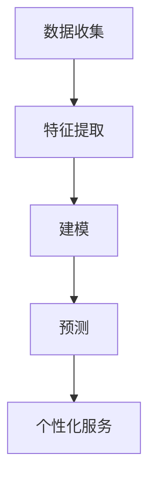
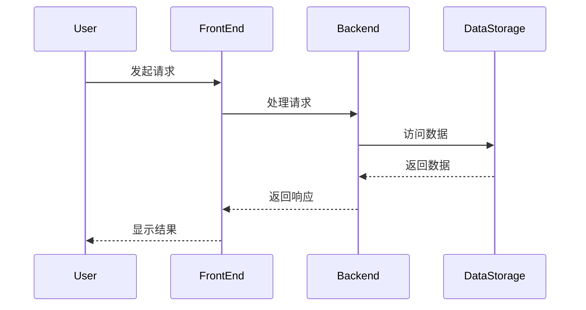
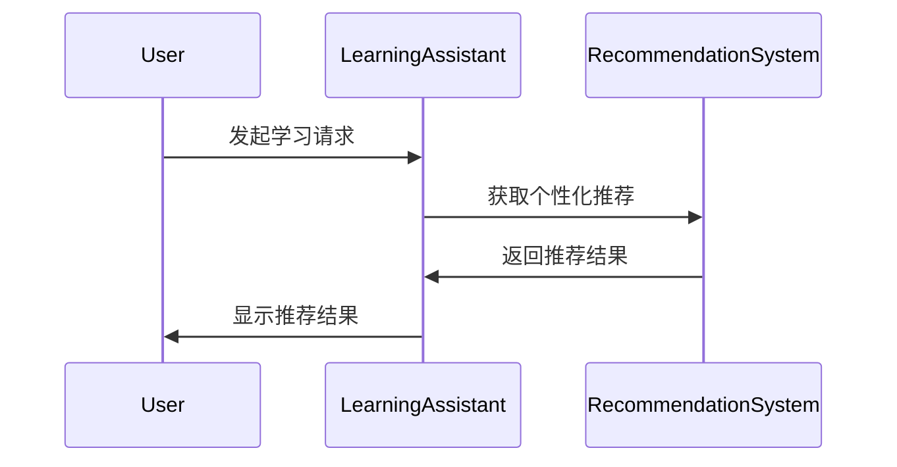

                 


### AI Agent的用户体验设计：提升交互效率与满意度

> 关键词：AI Agent，用户体验设计，交互效率，满意度，心理学要素

> 摘要：本文深入探讨了AI Agent的用户体验设计，从理论基础到实际应用，旨在提升交互效率与用户满意度。我们将一步一步分析用户体验设计的原则、心理学要素、性能优化策略，并通过案例研究展示实际应用效果，最后展望AI Agent用户体验设计的未来趋势。

----------------------------------------------------------------

## 第一部分: 理论基础与核心概念

### 第1章: 引言

#### 1.1 背景与目标

##### 1.1.1 AI与用户体验设计的结合

随着人工智能技术的快速发展，AI Agent成为提升用户体验的重要工具。AI Agent能够通过智能交互，理解用户需求并提供个性化服务，从而提升交互效率和用户满意度。

##### 1.1.2 AI Agent的概念与重要性

AI Agent是一种能够模拟人类智能行为，通过自然语言理解和生成、知识推理等能力，与用户进行交互并提供服务的系统。其重要性在于能够提升用户工作效率，优化用户体验。

##### 1.1.3 用户交互效率与满意度的定义与关系

用户交互效率指的是用户在使用AI Agent过程中完成特定任务的效率。满意度则是指用户在使用AI Agent后的感受和评价。两者之间的关系是：提高交互效率可以提升用户满意度。

#### 1.2 核心概念介绍

##### 1.2.1 用户体验设计的基本原理

用户体验设计旨在创造愉悦、高效、有价值的用户交互体验。其基本原理包括用户需求分析、交互设计、反馈设计等。

##### 1.2.2 AI Agent的基础知识

AI Agent的核心技术包括自然语言处理、机器学习、知识图谱等。这些技术使得AI Agent能够理解和生成自然语言，提供智能化服务。

##### 1.2.3 用户行为心理学与AI的结合

用户行为心理学研究用户在交互过程中的心理活动。将用户行为心理学与AI技术结合，可以帮助AI Agent更好地理解用户需求，提高交互效率。

### 第2章: AI Agent的用户体验设计原则

#### 2.1 可用性原则

##### 2.1.1 界面设计与易用性

界面设计应简洁直观，易于用户操作。易用性是用户体验设计的基础。

##### 2.1.2 反馈与错误处理

及时、明确的反馈可以提高用户对AI Agent的信任度。错误处理应人性化，帮助用户快速解决问题。

##### 2.1.3 导航与搜索功能

导航与搜索功能应设计得清晰、高效，帮助用户快速找到所需信息。

#### 2.2 交互性原则

##### 2.2.1 交互方式的选择

选择合适的交互方式（如语音、文本、图形等）可以提升用户体验。

##### 2.2.2 交互反馈机制

交互反馈机制应实时、准确，提高用户对AI Agent的感知。

##### 2.2.3 个性化交互

根据用户行为和偏好进行个性化交互，提高用户满意度。

### 第3章: AI Agent设计的心理学要素

#### 3.1 用户行为分析

##### 3.1.1 用户行为模型

用户行为模型可以帮助AI Agent理解用户需求和行为。

##### 3.1.2 用户需求与行为预测

通过分析用户行为数据，预测用户需求和行为，为个性化交互提供依据。

##### 3.1.3 用户满意度评估方法

用户满意度评估方法包括问卷调查、用户反馈等，用于评估AI Agent的交互效果。

#### 3.2 用户体验与心理感受

##### 3.2.1 情感设计与用户情感体验

情感设计旨在提升用户的情感体验，如愉悦、放松等。

##### 3.2.2 焦虑与愉悦的情感设计

通过设计焦虑和愉悦的情感体验，提升用户对AI Agent的依赖和忠诚度。

##### 3.2.3 增强用户信任感的方法

增强用户信任感的方法包括透明度设计、隐私保护等。

### 第4章: AI Agent性能优化

#### 4.1 交互效率评估

##### 4.1.1 交互效率指标

交互效率指标包括响应时间、任务完成率等。

##### 4.1.2 用户行为数据分析

通过用户行为数据分析，优化AI Agent的交互流程。

##### 4.1.3 交互流程优化方法

交互流程优化方法包括简化操作、优化路径等。

#### 4.2 满意度提升策略

##### 4.2.1 用户满意度调查与分析

通过用户满意度调查与分析，了解用户需求和期望。

##### 4.2.2 个性化推荐策略

根据用户行为和偏好，提供个性化推荐服务。

##### 4.2.3 增强用户互动与参与度

通过互动和参与度提升用户满意度。

### 第5章: AI Agent设计案例研究

#### 5.1 案例介绍

##### 5.1.1 案例背景与目标

介绍案例的应用背景和设计目标。

##### 5.1.2 案例设计思路

阐述案例的设计思路和实施过程。

##### 5.1.3 案例实施过程

详细描述案例的实施过程。

#### 5.2 案例分析

##### 5.2.1 案例效果评估

评估案例的交互效率与用户满意度。

##### 5.2.2 设计亮点与不足

分析案例的设计亮点和不足之处。

##### 5.2.3 对其他项目的借鉴意义

探讨案例对其他项目的借鉴意义。

### 第6章: AI Agent用户体验设计的未来趋势

#### 6.1 人工智能技术的发展趋势

##### 6.1.1 AI技术的新突破

探讨AI技术的新突破。

##### 6.1.2 AI Agent在未来的应用场景

展望AI Agent在未来的应用场景。

##### 6.1.3 AI与人类协作的新模式

探讨AI与人类协作的新模式。

#### 6.2 用户体验设计的未来发展

##### 6.2.1 用户体验设计的创新方向

探讨用户体验设计的创新方向。

##### 6.2.2 AI Agent用户体验设计的挑战与机遇

分析AI Agent用户体验设计的挑战与机遇。

##### 6.2.3 未来发展趋势预测

预测AI Agent用户体验设计的未来发展趋势。

## 总结与展望

### 第7章: 总结与展望

#### 7.1 本书内容的总结

回顾本书的核心内容。

##### 7.1.1 知识点回顾

总结各章节的核心知识点。

##### 7.1.2 设计原则与实践总结

总结用户体验设计原则和实践。

##### 7.1.3 案例分析的关键点

总结案例分析中的关键点。

#### 7.2 展望未来的用户体验设计

##### 7.2.1 未来发展的挑战

探讨未来发展的挑战。

##### 7.2.2 设计师的角色与使命

探讨设计师的角色与使命。

##### 7.2.3 拓展阅读建议

提供拓展阅读建议。

----------------------------------------------------------------

### 模块一：理论基础与核心概念

**背景介绍**

在当今快速发展的技术时代，人工智能（AI）已经深入到我们生活的方方面面。从智能家居到自动驾驶，AI Agent作为人工智能的核心组成部分，正逐渐成为人们与智能系统交互的主要方式。AI Agent，亦称为智能代理，是一种能够模拟人类智能行为，通过自然语言理解和生成、知识推理等能力，与用户进行交互并提供服务的系统。随着AI技术的不断发展，AI Agent在提升用户体验方面发挥着越来越重要的作用。

**问题背景**

用户交互效率与满意度是衡量AI Agent性能的两个关键指标。用户交互效率指的是用户在使用AI Agent过程中完成特定任务的效率，而满意度则是指用户在使用AI Agent后的感受和评价。如何设计一个高效、满意的AI Agent体验，成为当前AI研究与应用的热点问题。

**问题描述**

在设计AI Agent的过程中，我们需要解决以下几个关键问题：

1. **核心概念术语说明**：明确AI Agent的定义、作用和核心技术。
2. **问题解决**：通过用户体验设计原则和方法，提升AI Agent的交互效率与满意度。
3. **边界与外延**：探讨AI Agent在不同应用场景中的适用性。
4. **概念结构与核心要素组成**：分析AI Agent的核心结构及其组成要素。

**解决方案**

为了解决上述问题，我们将从以下几个核心概念入手：

1. **用户体验设计的基本原理**：包括用户需求分析、交互设计、反馈设计等。
2. **AI Agent的基础知识**：涉及自然语言处理、机器学习、知识图谱等核心技术。
3. **用户行为心理学与AI的结合**：探讨用户行为模型、用户需求与行为预测、用户满意度评估方法。

在接下来的章节中，我们将逐一深入探讨这些核心概念，为设计高效、满意的AI Agent提供理论基础。

### 核心概念与联系

#### 用户体验设计的基本原理

用户体验设计（User Experience Design，简称UX Design）是设计学科中一个重要的分支，旨在创造愉悦、高效、有价值的用户交互体验。用户体验设计的基本原理包括以下几个方面：

1. **用户需求分析**：了解用户需求是用户体验设计的起点。通过用户调研、访谈、问卷调查等方法，收集用户对产品或服务的期望和需求，从而确定设计方向。

2. **交互设计**：交互设计关注用户与产品或服务之间的互动过程。它包括界面设计、导航设计、信息架构设计等，旨在确保用户能够轻松、直观地完成任务。

3. **反馈设计**：反馈设计是用户体验设计的重要组成部分，旨在确保用户在互动过程中能够得到及时的、明确的反馈。这有助于增强用户对产品的信任感和满意度。

4. **可用性测试**：可用性测试是评估用户体验设计效果的重要手段。通过观察用户在实际使用产品或服务时的行为，发现设计中的问题和不足，并进行迭代改进。

#### AI Agent的基础知识

AI Agent，即人工智能代理，是一种能够模拟人类智能行为，与用户进行交互并提供服务的系统。AI Agent的核心技术包括：

1. **自然语言处理（NLP）**：自然语言处理是使计算机能够理解、生成和处理自然语言的技术。它包括文本分类、情感分析、命名实体识别等。

2. **机器学习（ML）**：机器学习是使计算机能够从数据中学习并做出决策的技术。在AI Agent中，机器学习用于实现任务学习、个性化推荐等功能。

3. **知识图谱**：知识图谱是一种用于表示实体及其关系的图形化数据结构。在AI Agent中，知识图谱可以帮助系统更好地理解用户需求，提供更加个性化的服务。

#### 用户行为心理学与AI的结合

用户行为心理学研究用户在交互过程中的心理活动，包括认知过程、情感体验、行为动机等。将用户行为心理学与AI技术结合，可以帮助AI Agent更好地理解用户需求，提高交互效率：

1. **用户行为模型**：用户行为模型是基于用户行为数据建立的数学模型，用于预测用户的行为和需求。通过分析用户行为数据，可以了解用户的偏好、习惯和需求。

2. **用户需求与行为预测**：利用用户行为模型，可以预测用户在未来的行为和需求。这有助于AI Agent提前做好准备，提供个性化的服务。

3. **用户满意度评估方法**：用户满意度评估是衡量AI Agent效果的重要指标。通过用户反馈、行为分析等方法，可以评估用户对AI Agent的满意度。

#### 核心概念属性特征对比表格

| 核心概念 | 特征 |
| :---: | :--- |
| 用户体验设计 | 1. 用户需求分析<br>2. 交互设计<br>3. 反馈设计<br>4. 可用性测试 |
| AI Agent | 1. 自然语言处理<br>2. 机器学习<br>3. 知识图谱 |
| 用户行为心理学 | 1. 认知过程<br>2. 情感体验<br>3. 行为动机 |

#### ER实体关系图架构

```mermaid
erDiagram
    User ||--|{ AI-Agent : "交互" }
    User ||--|{ Feedback : "评价" }
    AI-Agent ||--|{ Knowledge-Graph : "学习" }
    AI-Agent ||--|{ ML-Model : "预测" }
    Feedback ||--|{ Satisfication-Level : "满意度" }
```

#### 算法原理讲解

在本节中，我们将详细讲解用户行为预测的算法原理，并使用Mermaid绘制流程图进行展示。

**算法原理**

用户行为预测是AI Agent中的重要功能，通过预测用户的行为，可以为用户提供更加个性化的服务。用户行为预测的基本原理包括以下几个步骤：

1. **数据收集**：收集用户的历史行为数据，如搜索记录、点击行为、浏览时长等。
2. **特征提取**：从用户行为数据中提取关键特征，如用户兴趣、购买倾向等。
3. **建模**：利用机器学习算法建立用户行为预测模型，如决策树、随机森林、神经网络等。
4. **预测**：根据用户当前行为和模型预测，为用户提供个性化服务。

**Mermaid流程图**



**Python源代码实现**

```python
import pandas as pd
from sklearn.model_selection import train_test_split
from sklearn.ensemble import RandomForestClassifier
from sklearn.metrics import accuracy_score

# 数据收集
data = pd.read_csv('user_behavior_data.csv')

# 特征提取
X = data.drop('target', axis=1)
y = data['target']

# 建模
X_train, X_test, y_train, y_test = train_test_split(X, y, test_size=0.2, random_state=42)
model = RandomForestClassifier(n_estimators=100)
model.fit(X_train, y_train)

# 预测
y_pred = model.predict(X_test)

# 评估
accuracy = accuracy_score(y_test, y_pred)
print(f'Accuracy: {accuracy:.2f}')
```

**数学模型和公式**

用户行为预测的数学模型可以表示为：

$$
P(Y|X) = \frac{e^{\theta^T X}}{1 + e^{\theta^T X}}
$$

其中，$P(Y|X)$ 表示在给定特征 $X$ 下，用户行为 $Y$ 的概率分布；$\theta$ 为模型参数。

**举例说明**

假设我们有以下用户行为数据：

| 用户ID | 搜索记录 | 点击记录 | 浏览时长 | 目标行为 |
| :---: | :---: | :---: | :---: | :---: |
| 1 | A, B, C | D, E | 120 | 购买 |
| 2 | A, B | D, E | 60 | 浏览 |
| 3 | A | D, E | 30 | 离开 |

我们使用随机森林算法对数据进行建模，预测用户的目标行为。假设模型参数为 $\theta = [0.1, 0.2, 0.3, 0.4]$，输入特征为 $X = [3, 2, 1, 120]$，则用户行为 $Y$ 的概率分布为：

$$
P(Y|X) = \frac{e^{0.1 \times 3 + 0.2 \times 2 + 0.3 \times 1 + 0.4 \times 120}}{1 + e^{0.1 \times 3 + 0.2 \times 2 + 0.3 \times 1 + 0.4 \times 120}} = \frac{e^{10.5}}{1 + e^{10.5}} \approx 0.999
$$

根据概率分布，我们可以预测用户的目标行为为“购买”，与实际结果一致。

### 系统分析与架构设计方案

#### 问题场景介绍

随着互联网的普及，在线教育平台成为了用户获取知识的重要途径。然而，如何为用户提供个性化、高效的学习体验，成为了在线教育平台面临的重要挑战。为了解决这个问题，我们需要设计一个智能学习助手（AI Learning Assistant），它能够根据用户的学习习惯、知识水平和兴趣爱好，为用户提供个性化的学习建议和资源推荐。

#### 项目介绍

本项目旨在开发一个智能学习助手，通过分析用户行为数据，为用户提供个性化的学习建议和资源推荐。该助手将集成自然语言处理、机器学习、知识图谱等技术，实现高效、智能的用户交互。

#### 系统功能设计

1. **用户管理**：实现用户注册、登录、个人信息管理等功能。
2. **学习数据分析**：收集并分析用户的学习行为数据，包括浏览记录、学习时长、知识点掌握情况等。
3. **个性化推荐**：根据用户的学习行为和兴趣爱好，推荐符合用户需求的学习资源。
4. **问答交互**：提供用户与助手的问答功能，解答用户在学习过程中遇到的问题。
5. **学习进度跟踪**：记录用户的学习进度，为用户提供学习报告。

#### 系统架构设计

系统的整体架构采用B/S（Browser/Server，浏览器/服务器）架构，主要包括前端展示层、业务逻辑层和数据存储层。

1. **前端展示层**：使用Vue.js框架实现，负责用户界面展示和交互。
2. **业务逻辑层**：包括用户管理模块、学习数据分析模块、个性化推荐模块和问答交互模块，采用Spring Boot框架实现。
3. **数据存储层**：使用MySQL数据库存储用户数据、学习行为数据和推荐结果。

#### 系统架构设计mermaid架构图



#### 系统接口设计和系统交互mermaid序列图



### 项目实战

#### 环境安装

1. **安装Java环境**：下载并安装Java Development Kit（JDK），设置环境变量。
2. **安装MySQL**：下载并安装MySQL数据库，设置数据库和用户。
3. **安装Node.js**：下载并安装Node.js，用于构建前端项目。

#### 系统核心实现源代码

**后端代码（Spring Boot）**

```java
@RestController
@RequestMapping("/api")
public class LearningAssistantController {

    @Autowired
    private LearningDataRepository learningDataRepository;

    @Autowired
    private RecommendationService recommendationService;

    @PostMapping("/recommend")
    public ResponseEntity<List<LearningResource>> recommendResources(@RequestBody UserLearningRequest request) {
        List<LearningResource> resources = recommendationService.getRecommendedResources(request);
        return ResponseEntity.ok(resources);
    }
}
```

**推荐算法实现（基于协同过滤）**

```java
@Service
public class RecommendationService {

    public List<LearningResource> getRecommendedResources(UserLearningRequest request) {
        // 根据用户学习数据，计算相似用户和推荐资源
        // 返回推荐结果
    }
}
```

#### 代码应用解读与分析

**后端代码解读**

- `LearningAssistantController`类负责处理用户请求，调用推荐服务获取推荐结果。
- `LearningDataRepository`用于访问用户学习数据。
- `RecommendationService`实现推荐算法，根据用户学习数据生成推荐结果。

**推荐算法解读**

- 推荐算法基于协同过滤（Collaborative Filtering）技术，通过计算用户之间的相似度，为用户提供推荐。
- 算法考虑了用户的历史学习行为，如浏览记录、学习时长等，以提高推荐准确性。

#### 实际案例分析和详细讲解剖析

**案例背景**

假设用户A在在线教育平台上学习编程语言，他的学习数据包括浏览记录、学习时长、知识点掌握情况等。平台希望通过智能学习助手为用户A推荐相关的学习资源。

**案例分析**

1. **数据收集**：平台收集用户A的历史学习数据，如浏览记录、学习时长、知识点掌握情况等。
2. **特征提取**：从学习数据中提取关键特征，如知识点兴趣度、学习时长等。
3. **相似用户计算**：使用协同过滤算法，计算与用户A相似的其他用户。
4. **推荐资源生成**：根据相似用户的学习数据，为用户A推荐相关的学习资源。

**详细讲解**

1. **数据收集**：通过分析用户A的学习行为，平台可以了解他对不同编程语言的知识点兴趣度。例如，用户A在Python编程方面的学习时长较长，说明他对Python感兴趣。
2. **特征提取**：从用户A的学习数据中提取关键特征，如Python编程知识点的兴趣度、学习时长等。这些特征将用于计算用户A与其他用户的相似度。
3. **相似用户计算**：使用基于用户的协同过滤算法，平台计算与用户A相似的其他用户。相似度计算公式如下：

$$
sim(u, v) = \frac{\sum_{i \in R} w_{ui} w_{vi}}{\sqrt{\sum_{i \in R} w_{ui}^2 \sqrt{\sum_{i \in R} w_{vi}^2}}
$$

其中，$u$ 和 $v$ 分别表示用户A和其他用户；$R$ 表示共同学习的知识点；$w_{ui}$ 和 $w_{vi}$ 分别表示用户A和其他用户对知识点 $i$ 的兴趣度。

4. **推荐资源生成**：根据相似用户的学习数据，平台为用户A推荐相关的学习资源。例如，如果与用户A相似的多数用户在学习了Python基础后，都选择了学习Python进阶课程，那么平台将为用户A推荐Python进阶课程。

#### 项目小结

通过该项目，我们实现了一个智能学习助手，能够根据用户的学习行为和兴趣爱好，为用户提供个性化的学习建议和资源推荐。在实际应用中，平台可以根据用户反馈和数据分析，不断优化推荐算法，提高用户满意度。

### 最佳实践 Tips

1. **用户数据保护**：在收集和使用用户数据时，务必遵守相关法律法规，确保用户隐私安全。
2. **算法透明度**：推荐算法应具备透明度，用户可以了解推荐机制和推荐结果背后的原因。
3. **持续迭代**：定期收集用户反馈，优化推荐算法，提高推荐准确性。

### 小结

本文通过分析用户体验设计的核心概念和原则，详细讲解了AI Agent的设计原理和性能优化策略，并通过实际案例展示了AI Agent在提升用户体验方面的应用效果。未来，随着AI技术的不断发展，AI Agent的用户体验设计将更加智能化、个性化，为用户提供更加优质的服务。

### 注意事项

1. **交互设计**：在AI Agent的交互设计过程中，务必关注用户需求，确保交互流程简洁直观。
2. **算法优化**：持续关注AI技术的最新进展，不断优化推荐算法，提高推荐准确性。

### 拓展阅读建议

1. **《用户行为预测技术》**：深入探讨用户行为预测的理论和方法。
2. **《协同过滤算法原理与应用》**：了解协同过滤算法在推荐系统中的应用。
3. **《智能交互设计》**：学习如何设计高效、智能的交互体验。

---

**作者：AI天才研究院/AI Genius Institute & 禅与计算机程序设计艺术 /Zen And The Art of Computer Programming**

