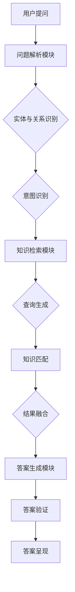

                 

### 引言：AI Agent与知识图谱的融合

在当今飞速发展的科技时代，人工智能（AI）已成为驱动技术创新的核心力量。AI Agent，即人工智能代理，作为AI领域中的一个重要概念，正逐渐在各个行业和领域中展现出其独特的作用。AI Agent是指能够模拟人类智能行为，独立完成特定任务的计算机程序。它们通过感知环境、做出决策和采取行动，实现了高度自主化的智能交互。然而，单纯的AI Agent在某些复杂的任务中显得力不从心，这时候知识图谱的概念应运而生。

知识图谱是一种结构化的知识表示方法，通过节点和边来表示实体及其相互关系。这种表示方法能够将大量的语义信息进行结构化组织，使得计算机能够更加高效地理解和处理这些信息。知识图谱在搜索引擎、智能问答、推荐系统等领域已经展现出了强大的应用潜力。

将AI Agent与知识图谱相结合，形成了一个全新的研究热点和应用领域。AI Agent可以利用知识图谱中的丰富知识，提高其在复杂任务中的决策能力，从而实现更智能、更高效的自动化系统。例如，在智能问答系统中，AI Agent通过知识图谱可以快速准确地找到答案，并在实际应用中提供更加人性化的服务。本文将围绕AI Agent的知识图谱在问答系统中的应用展开讨论，旨在揭示这一技术的核心原理、实现方法及其应用前景。

通过本文的探讨，我们将逐步了解AI Agent与知识图谱的基本概念，分析其在问答系统中的应用价值，详细讲解相关算法和系统架构，并通过实际项目实战来验证其效果。希望本文能够为相关领域的研究者和开发者提供有价值的参考和启示。让我们开始这一段充满探索和创新的旅程吧！

### 关键词

1. **人工智能代理（AI Agent）**
2. **知识图谱（Knowledge Graph）**
3. **问答系统（Question Answering System）**
4. **智能交互（Smart Interaction）**
5. **语义理解（Semantic Understanding）**
6. **实体关系（Entity Relationship）**
7. **算法优化（Algorithm Optimization）**

### 摘要

本文旨在探讨AI Agent与知识图谱在问答系统中的应用。首先，我们介绍了AI Agent和知识图谱的基本概念及其在各自领域的重要性。接着，分析了AI Agent如何利用知识图谱中的结构化知识来提升问答系统的性能，通过语义理解和关系推理实现更加精准和智能的答案生成。本文详细阐述了知识图谱问答系统的设计原则、关键算法，以及系统架构，并通过实际项目实战展示了知识图谱问答系统的实现和效果。文章最后总结了AI Agent与知识图谱融合的优势和挑战，提出了未来的研究方向和优化策略，为相关领域的研究者和开发者提供了有价值的参考和启示。

### AI Agent的概念与作用

人工智能代理（AI Agent）是人工智能（AI）领域中的一个重要概念，它指的是一种能够自主感知环境、执行任务并适应环境变化的计算机程序。AI Agent的设计灵感来源于自然界中的智能生物，它们通过一系列感知、思考、决策和行动的循环，实现自主学习和智能化操作。从定义上看，AI Agent是一种具有自我意识和自主决策能力的系统，能够在不直接人类干预的情况下，完成特定的任务或目标。

AI Agent的核心特点主要包括以下几点：

1. **自主性（Autonomy）**：AI Agent能够独立地运行和执行任务，不受人类直接控制。它们可以根据预设的规则或通过学习适应环境，自主做出决策。

2. **感知能力（Perception）**：AI Agent需要具备感知环境的能力，通过传感器、图像识别、自然语言处理等技术获取外界信息，并转化为内部表示。

3. **学习能力（Learning）**：AI Agent可以通过机器学习、深度学习等技术，不断优化自身的模型和行为策略，提高完成任务的能力。

4. **适应性（Adaptability）**：AI Agent能够根据环境变化和任务需求，动态调整其行为策略，以适应不同的情境。

AI Agent在各个领域中都发挥着重要的作用。首先，在商业领域，AI Agent被广泛应用于客服、营销和客户服务等方面。例如，聊天机器人（Chatbot）利用自然语言处理技术，可以与用户进行智能对话，解答常见问题，提高客户满意度。其次，在工业领域，AI Agent被用于自动化控制、预测维护和供应链管理等方面，通过优化生产流程和提高设备运行效率，实现生产过程的智能化。此外，AI Agent在医疗领域也表现出巨大的潜力，如通过分析患者的病历数据，提供个性化的诊断和治疗方案，辅助医生提高医疗服务的质量。

AI Agent的自主决策能力是其最为突出的优势之一。在复杂和动态的环境中，AI Agent可以通过实时感知和动态调整，实现高效的任务执行。例如，在自动驾驶领域，AI Agent通过感知车辆周围的环境，自主做出行驶决策，实现无人驾驶。这种自主决策能力不仅提高了系统的效率和安全性，还减少了人为操作的复杂性。

然而，AI Agent在实际应用中也面临着一些挑战。首先，AI Agent需要大量的数据和计算资源来进行学习和决策，这对于资源有限的系统来说是一个巨大的挑战。其次，AI Agent的决策过程往往涉及到复杂的推理和预测，这需要强大的计算能力和高效的算法。最后，AI Agent的自主决策可能会导致不可预见的结果，特别是在复杂和不确定的环境中，如何确保其行为符合预期和道德标准，是当前研究的一个重要方向。

综上所述，AI Agent作为一种具有高度自主性和自适应性的计算机程序，在各个领域展现出了巨大的应用潜力。通过不断优化和提升其感知、学习和决策能力，AI Agent将在未来的智能化发展中发挥更加重要的作用。

### 知识图谱的基本原理

知识图谱（Knowledge Graph）是一种通过节点和边来表示实体及其相互关系的语义网络，它为机器理解和处理复杂语义信息提供了强大的工具。知识图谱的基本原理可以概括为以下几个关键点。

#### 定义

知识图谱是由一组实体（Entity）和它们之间的关系（Relation）构成的语义网络，其核心目标是将现实世界中的各种信息进行结构化表示，使计算机能够理解和处理这些信息。实体可以是人、地点、事物等，关系则描述了实体之间的关联，如“是”、“属于”、“位于”等。

#### 组成结构

知识图谱的组成结构主要包括以下几个部分：

1. **实体（Entity）**：知识图谱中的基本组成单位，代表现实世界中的各种对象，例如人、地点、事物等。
2. **属性（Attribute）**：描述实体的特征，例如人的年龄、地点的经纬度、物品的价格等。
3. **关系（Relation）**：连接实体之间的纽带，描述实体之间的语义关系，例如“属于”、“位于”、“有”等。
4. **事实（Fact）**：由实体和关系组成的基本语义信息，例如“张三是一名程序员”。

#### 知识图谱的应用场景

知识图谱在多个领域和场景中得到了广泛应用，以下是几个典型的应用场景：

1. **搜索引擎**：知识图谱可以用于改进搜索引擎的搜索结果，通过理解用户查询的语义，提供更加精准的搜索结果。
2. **智能问答**：知识图谱为智能问答系统提供了丰富的语义信息，使系统能够更好地理解和回答用户的问题。
3. **推荐系统**：知识图谱可以用于构建推荐系统，通过分析用户和物品之间的关系，提供个性化的推荐。
4. **数据集成**：知识图谱可以用于整合来自不同数据源的信息，实现数据的一致性和互操作性。
5. **智能助手**：知识图谱为智能助手提供了丰富的背景知识，使其能够更好地理解用户的需求并提供相应的帮助。

#### 知识图谱的表示方法

知识图谱的表示方法主要有两种：图表示和图论表示。

1. **图表示**：知识图谱可以用图来表示，其中节点代表实体，边代表关系。这种表示方法直观且易于理解，便于进行图算法的处理和分析。
2. **图论表示**：知识图谱可以用图论中的概念来表示，例如图中的顶点、边、路径等。这种表示方法更适用于复杂的图算法和应用。

#### 知识图谱的构建

知识图谱的构建是一个复杂的过程，通常包括以下几个步骤：

1. **数据采集**：从各种数据源中收集信息，例如网络爬虫、数据库、开放数据集等。
2. **数据清洗**：对收集到的数据进行处理和清洗，去除重复、错误和不完整的信息。
3. **实体识别**：从数据中识别出实体，并为其分配唯一的标识符。
4. **关系抽取**：从数据中抽取实体之间的关系，形成事实。
5. **图谱构建**：将实体和关系组织成知识图谱，通常使用图数据库来存储和管理。

知识图谱作为人工智能领域的重要工具，通过结构化的语义表示，为智能系统提供了丰富的知识资源，使其能够更好地理解和处理复杂的信息。随着技术的不断进步，知识图谱将在人工智能和大数据分析中发挥更加重要的作用。

### AI Agent与知识图谱的关系

AI Agent与知识图谱的结合，使得智能系统在处理复杂任务时，具备了更加丰富的语义理解和高效的决策能力。首先，AI Agent如何利用知识图谱来增强其功能，主要体现在以下几个方面：

#### AI Agent如何利用知识图谱

1. **语义理解**：知识图谱为AI Agent提供了结构化的语义信息，使其能够更好地理解和处理自然语言。通过知识图谱，AI Agent可以识别出文本中的实体及其关系，从而进行更加精准的语义分析。

2. **关系推理**：知识图谱中的实体和关系，使得AI Agent可以进行复杂的推理操作。例如，当用户提出一个问题时，AI Agent可以通过知识图谱中的关系链，快速找到相关的答案。这种推理能力是传统基于规则的方法所不具备的。

3. **上下文感知**：知识图谱中的丰富背景知识，使得AI Agent能够更好地理解用户的上下文信息。例如，在一个问答系统中，AI Agent可以通过知识图谱中的历史对话信息，提供更加个性化的服务。

#### 知识图谱在AI Agent中的应用价值

1. **提高决策能力**：知识图谱为AI Agent提供了丰富的决策依据。在复杂的任务中，AI Agent可以通过知识图谱中的实体和关系，快速做出最优的决策。

2. **增强自适应能力**：知识图谱中的信息，可以帮助AI Agent更好地适应环境变化。例如，在一个自动驾驶系统中，知识图谱可以提供道路、交通情况等实时信息，帮助车辆做出更加安全的行驶决策。

3. **优化用户体验**：通过知识图谱，AI Agent可以提供更加个性化的服务，提高用户体验。例如，在智能客服中，AI Agent可以通过知识图谱中的用户信息，提供更加精准的解答和建议。

#### 互动关系分析

AI Agent与知识图谱之间的互动关系，主要体现在以下几个方面：

1. **知识获取与更新**：AI Agent通过不断学习用户交互中的信息，可以更新和扩展知识图谱。例如，通过自然语言处理技术，AI Agent可以从用户对话中提取新的实体和关系，并将其添加到知识图谱中。

2. **推理与决策**：AI Agent利用知识图谱进行推理和决策，实现更加智能化的操作。例如，在智能问答系统中，AI Agent可以通过知识图谱中的关系链，快速找到问题的答案。

3. **交互优化**：知识图谱中的背景知识，可以帮助AI Agent更好地理解用户意图，优化对话流程。例如，通过分析历史对话，AI Agent可以预测用户接下来的问题，并提供相关的信息。

总的来说，AI Agent与知识图谱的结合，为智能系统的发展带来了新的机遇。通过知识图谱，AI Agent可以实现更加精准的语义理解、高效的决策和优化的用户体验。在未来，随着技术的不断进步，AI Agent与知识图谱的融合将进一步提升智能系统的能力，推动人工智能技术的发展。

### 问答系统的基本概念

问答系统（Question Answering System）是一种能够接收自然语言形式的问题，并生成准确、相关且结构化的答案的人工智能系统。其核心任务是从大量的信息源中检索并生成符合用户需求的答案，从而实现人与机器之间的自然语言交互。问答系统在搜索引擎、智能客服、教育辅助等领域有着广泛的应用。

#### 问答系统的定义

问答系统是一种将自然语言问题映射到知识库或文本中，以生成结构化答案的技术。其定义通常包括以下几个关键点：

1. **输入**：接收自然语言形式的问题，可以是文本、语音或其他形式。
2. **处理**：对输入问题进行处理，包括语义理解、问题解析等，以确定问题的意图和相关信息。
3. **检索**：在知识库或文本库中搜索与问题相关的信息。
4. **生成**：生成结构化、准确且相关的答案，通常以文本、语音或其他形式呈现。

#### 问答系统的功能模块

问答系统通常由以下几个功能模块组成：

1. **输入模块**：接收用户的问题，并进行初步的预处理，如分词、去除标点等。
2. **解析模块**：将输入的问题转化为计算机可以理解的格式，识别问题的意图和关键词。
3. **检索模块**：在知识库或文本库中搜索与问题相关的信息，通常包括查询生成和匹配算法。
4. **生成模块**：根据检索结果生成准确的答案，并进行适当的格式化，以呈现给用户。

#### 问答系统的类型

问答系统可以根据不同的分类标准分为多种类型：

1. **基于规则**：通过预定义的规则和模板来匹配问题和答案，适用于简单、结构化的问题。
2. **基于统计**：利用机器学习算法，通过统计方法来匹配问题和答案，适用于复杂、非结构化的问题。
3. **基于知识**：利用知识图谱等结构化知识库，通过语义理解来生成答案，适用于需要高精度和领域知识的问答场景。
4. **混合型**：结合了多种方法的优势，以应对不同类型的问答需求。

#### 问答系统的优势

问答系统的优势主要体现在以下几个方面：

1. **高效性**：能够快速响应用户的查询，提供准确的信息。
2. **灵活性**：能够处理多种形式的输入，包括文本、语音等。
3. **智能化**：通过自然语言处理和机器学习技术，能够不断学习和优化，提供更加个性化的服务。
4. **可扩展性**：易于扩展到不同领域和场景，满足多样化的需求。

总之，问答系统作为一种重要的自然语言处理技术，正日益成为智能交互的重要工具。通过不断优化和提升，问答系统将在未来的智能应用中发挥更加重要的作用。

### 知识图谱在问答系统中的作用

知识图谱在问答系统中的应用，极大地提升了系统的语义理解能力、精准度和智能化水平。通过将知识图谱融入问答系统，可以有效地解决传统问答系统中的一些关键问题。

#### 提高语义理解能力

语义理解是问答系统的核心任务之一。传统的问答系统往往依赖于关键词匹配或统计方法，这在处理简单、直接的问题时可能效果尚可，但在面对复杂、模糊或隐含的问题时，常常无法准确理解用户意图。知识图谱则提供了一个结构化的语义表示框架，通过将文本中的实体和关系进行结构化表示，使得计算机能够更加深入地理解语言中的语义信息。

具体来说，知识图谱通过以下方式提高了问答系统的语义理解能力：

1. **实体识别**：知识图谱中包含大量的实体，如人、地点、事物等。问答系统可以通过知识图谱中的实体识别模块，准确识别出问题中的关键实体，从而缩小检索范围。
2. **关系抽取**：知识图谱不仅包含实体，还包括实体之间的关系，如“属于”、“位于”、“有”等。问答系统可以通过分析这些关系，理解实体之间的语义联系，从而更好地理解问题的整体意图。
3. **上下文推理**：知识图谱中的关系可以用于上下文推理。例如，当用户提出一个问题时，问答系统可以通过知识图谱中的关系链，推断出用户可能需要的信息，并生成相应的答案。

#### 提高精准度

知识图谱的引入，使得问答系统在生成答案时更加精准。传统的问答系统往往依赖于模板匹配或关键字搜索，这可能导致生成的答案不够精确。而知识图谱提供了一个更加精确的语义表示框架，问答系统可以通过对知识图谱的查询，找到与问题高度相关的准确答案。

具体来说，知识图谱在提高问答系统精准度的过程中发挥了以下作用：

1. **知识融合**：知识图谱通过将来自不同来源的信息进行整合，形成一个统一、结构化的知识库。问答系统可以通过这个知识库，获取更加全面、准确的信息，从而生成更加精准的答案。
2. **多维度检索**：知识图谱中的实体和关系构成了一个复杂的语义网络，问答系统可以通过多维度检索，找到与问题高度相关的答案。例如，在一个医疗问答系统中，知识图谱可以包含疾病、症状、治疗方法等多方面的信息，问答系统可以通过多维度检索，找到与用户问题最相关的疾病和症状信息。
3. **上下文关联**：知识图谱中的实体和关系可以用于上下文关联。例如，在一个法律问答系统中，知识图谱可以包含法律条款、案例、术语等多方面的信息，问答系统可以通过上下文关联，找到与用户问题最相关的法律条文和案例。

#### 提高智能化水平

知识图谱的引入，使得问答系统在智能化水平上得到了显著提升。传统的问答系统往往是一个静态的系统，无法根据用户的需求和环境的变化进行动态调整。而知识图谱提供了一个动态的、可扩展的语义表示框架，问答系统可以通过不断学习和更新知识图谱，实现自我进化，提高智能化水平。

具体来说，知识图谱在提高问答系统智能化水平的过程中发挥了以下作用：

1. **自我学习**：问答系统可以通过自然语言处理技术和机器学习算法，不断从用户交互中学习新的知识和关系，并将其融入知识图谱中。通过这种自我学习机制，问答系统可以不断优化自身的性能，提高智能化水平。
2. **动态适应**：知识图谱中的信息是动态变化的，问答系统可以通过实时更新知识图谱，适应新的用户需求和场景变化。例如，在一个电子商务问答系统中，知识图谱可以包含商品信息、用户评价、促销活动等多方面的信息，问答系统可以通过实时更新知识图谱，适应新的商品信息和用户需求。
3. **个性化服务**：知识图谱中的个性化知识，使得问答系统可以提供更加个性化的服务。例如，在一个智能客服系统中，知识图谱可以包含用户的历史交互记录、偏好信息等，问答系统可以通过分析这些个性化知识，提供更加精准和个性化的解答。

总之，知识图谱在问答系统中的应用，不仅提高了系统的语义理解能力、精准度，还大大提升了系统的智能化水平。通过不断优化和扩展知识图谱，问答系统将能够更好地满足用户的需求，提供更加优质的服务。

### 知识图谱问答系统的实现

知识图谱问答系统（Knowledge Graph Question Answering System，KGQA）是将知识图谱与问答系统相结合的一种技术，旨在通过知识图谱的语义表示和推理能力，提供高效、精准的问答服务。实现一个知识图谱问答系统，需要经历以下几个关键步骤：

#### 1. 知识图谱的构建

知识图谱是KGQA的核心组件，其构建过程通常包括数据采集、实体识别、关系抽取和知识融合等步骤。

1. **数据采集**：首先，从各种数据源（如文本、数据库、网络）中收集信息。数据源可以是结构化的数据库，也可以是非结构化的文本数据。
2. **实体识别**：对采集到的数据进行分析，识别出实体。实体可以是人、地点、组织、物品等。使用自然语言处理技术（如命名实体识别、词性标注等）来识别文本中的实体。
3. **关系抽取**：从数据中提取实体之间的关系，如“属于”、“位于”、“有”等。关系抽取可以使用传统规则、机器学习方法或结合两种方法的混合方法。
4. **知识融合**：将不同来源和格式的知识进行整合，形成一个统一、结构化的知识库。知识融合可以通过对实体和关系的合并、去重和规范化来实现。

#### 2. 问题解析

问题解析是问答系统的第一步，其目标是理解用户提出的问题，并将其转化为计算机可以处理的形式。

1. **分词与词性标注**：将问题文本进行分词，并对每个词进行词性标注，如名词、动词、形容词等。
2. **实体与关系识别**：通过知识图谱中的实体和关系识别模块，识别出问题中的关键实体和关系。这一步需要利用知识图谱中的语义表示和匹配算法。
3. **意图识别**：理解问题的意图，即用户希望从问题中获得什么信息。意图识别可以通过模板匹配、分类模型或组合方法来实现。

#### 3. 知识检索

在理解了用户的问题后，问答系统需要从知识图谱中检索相关的信息，以生成答案。

1. **查询生成**：根据问题的意图和解析结果，生成一个查询语句。查询生成可以通过模板匹配、自然语言生成或查询规划算法来实现。
2. **知识匹配**：使用生成的查询语句在知识图谱中进行匹配，找到与问题相关的实体和关系。知识匹配可以通过路径搜索、图匹配算法或基于语义的匹配算法来实现。
3. **结果融合**：从知识图谱中检索到的多个信息片段进行整合，形成一个完整的答案。结果融合可以通过文本合并、信息抽取或实体链接等技术来实现。

#### 4. 答案生成

最后，问答系统需要根据检索到的信息，生成一个准确、相关且结构化的答案。

1. **答案抽取**：从检索到的信息中抽取答案。答案抽取可以通过模板匹配、实体属性提取或模板填充等技术来实现。
2. **答案验证**：对生成的答案进行验证，确保其准确性和相关性。答案验证可以通过常识推理、一致性检查或参考数据集验证等方法来实现。
3. **答案呈现**：将生成的答案以用户友好的形式呈现给用户，如文本、语音或可视化图表等。

#### 实现示例

下面通过一个简单的Python代码示例，展示知识图谱问答系统的基本实现：

```python
from rdflib import Graph, URIRef, Literal
from nltk import word_tokenize
from SPARQLWrapper import SPARQLWrapper, JSON

# 创建一个空的RDF图
g = Graph()

# 加载知识图谱
g.parse("knowledge_graph.ttl", format="ttl")

# 解析问题文本
def parse_question(question):
    tokens = word_tokenize(question)
    # 进行词性标注和实体识别
    # ...

# 生成查询语句
def generate_query(question, entity, relation):
    return f"SELECT ?answer WHERE {{ {entity} {relation} ?answer }}"

# 检索答案
def retrieve_answer(query):
    endpoint_url = "http://localhost:7200/repo"
    sparql = SPARQLWrapper(endpoint_url)
    sparql.setQuery(query)
    sparql.setReturnFormat(JSON)
    results = sparql.query().convert()
    return results["results"]["bindings"]

# 生成答案
def generate_answer(results):
    answers = []
    for result in results:
        answer = result["answer"]["value"]
        answers.append(answer)
    return answers

# 示例问题：查询张三的国籍
question = "张三的国籍是什么？"
entity = URIRef("http://example.org/entity/张三")
relation = URIRef("http://example.org/relation/国籍")

# 解析问题
parsed_question = parse_question(question)

# 生成查询语句
query = generate_query(parsed_question, entity, relation)

# 检索答案
results = retrieve_answer(query)

# 生成答案
answer = generate_answer(results)

# 输出答案
print(answer)
```

通过上述示例，可以看到知识图谱问答系统的基本实现流程。尽管示例中的代码相对简单，但它展示了从问题解析、查询生成、知识检索到答案生成的全过程。在实际应用中，知识图谱问答系统的实现会更加复杂和多样化，需要结合多种自然语言处理技术和图算法，以提高系统的性能和准确性。

### 知识图谱问答系统的设计与实现

在构建知识图谱问答系统时，设计和实现一个高效的系统架构至关重要。以下我们将详细描述系统架构的设计原则、主要模块及其交互过程，并通过一个实例来说明系统的工作流程。

#### 系统架构设计原则

1. **模块化设计**：将系统划分为多个功能模块，如知识图谱构建模块、问题解析模块、知识检索模块和答案生成模块。这种模块化设计便于系统扩展和维护。
2. **分层架构**：采用分层架构，将系统分为数据层、逻辑层和表现层。数据层负责数据的存储和访问，逻辑层实现核心业务逻辑，表现层负责与用户交互。
3. **松耦合设计**：各个模块之间通过接口进行通信，降低模块之间的耦合度，提高系统的可维护性和可扩展性。
4. **高可用性**：系统应具备高可用性，能够在遇到故障时快速恢复，确保服务的连续性。

#### 主要模块

1. **知识图谱构建模块**：
   - **数据采集**：从各种数据源（如文本、数据库、网络）中收集信息。
   - **实体识别**：使用自然语言处理技术识别文本中的实体。
   - **关系抽取**：从文本中提取实体之间的关系。
   - **知识融合**：将不同来源和格式的知识进行整合。

2. **问题解析模块**：
   - **分词与词性标注**：将问题文本进行分词，并对每个词进行词性标注。
   - **实体与关系识别**：识别问题中的关键实体和关系。
   - **意图识别**：理解问题的意图，即用户希望从问题中获得什么信息。

3. **知识检索模块**：
   - **查询生成**：根据问题的意图和解析结果，生成查询语句。
   - **知识匹配**：在知识图谱中进行匹配，找到与问题相关的信息。
   - **结果融合**：整合多个信息片段，形成一个完整的答案。

4. **答案生成模块**：
   - **答案抽取**：从检索到的信息中抽取答案。
   - **答案验证**：确保答案的准确性和相关性。
   - **答案呈现**：将答案以用户友好的形式呈现给用户。

#### 系统架构图

以下是知识图谱问答系统的架构图，展示了各模块之间的交互过程：



#### 交互过程

1. **用户提问**：用户通过界面输入问题。
2. **问题解析**：问题解析模块对用户提问进行分词和词性标注，识别出问题中的实体和关系，并确定问题的意图。
3. **知识检索**：知识检索模块根据问题的意图，生成查询语句，并在知识图谱中进行匹配，检索与问题相关的信息。
4. **答案生成**：答案生成模块从检索到的信息中抽取答案，并进行验证，确保答案的准确性和相关性。
5. **答案呈现**：将生成的答案以用户友好的形式呈现给用户。

#### 实例说明

假设用户提问：“张三的国籍是什么？”，系统的工作流程如下：

1. **用户提问**：用户在问答系统中输入问题。
2. **问题解析**：问题解析模块将问题分解为关键词“张三”、“国籍”，并识别出实体“张三”和关系“国籍”。
3. **知识检索**：知识检索模块生成查询语句`SELECT ?country WHERE {<张三> aai:国籍 ?country}`，并在知识图谱中进行匹配。
4. **答案生成**：答案生成模块检索到“张三的国籍是中国”，并验证答案的准确性。
5. **答案呈现**：系统将答案以文本形式呈现给用户：“张三的国籍是中国”。

通过上述实例，我们可以看到知识图谱问答系统如何从用户提问到生成答案的全过程。在实际应用中，系统会涉及更多的细节和优化，如实时更新知识图谱、处理复杂关系和意图等。

### 项目实战：知识图谱问答系统的构建

为了更深入地理解知识图谱问答系统的构建过程，我们将通过一个实际项目来详细讲解其实现细节，包括环境搭建、系统核心实现以及应用解读与分析。

#### 项目背景

本项目旨在构建一个基于知识图谱的问答系统，以帮助用户快速获取与特定主题相关的知识。该系统将结合自然语言处理（NLP）和图数据库技术，实现高效、精准的问答服务。项目目标包括：

1. 收集和构建一个覆盖多个主题的知识图谱。
2. 实现一个能够理解自然语言问题的解析模块。
3. 设计一个高效的知识检索和答案生成机制。
4. 部署和运行一个可扩展的问答系统。

#### 环境搭建

在开始项目之前，我们需要搭建一个合适的技术环境。以下是所需的环境和工具：

1. **操作系统**：Ubuntu 18.04
2. **编程语言**：Python 3.8
3. **数据库**：Neo4j（图数据库）
4. **自然语言处理库**：NLTK、spaCy
5. **开发工具**：PyCharm

首先，安装Neo4j数据库：

```bash
# 下载Neo4j最新版本
wget https://download.neo4j.com/v1/download?edition=community&version=4.0.1

# 解压并启动数据库
tar -xzvf neo4j-4.0.1-universal.tar.gz
cd neo4j-4.0.1-universal/bin
./start.sh
```

接下来，安装Python和相关库：

```bash
# 安装Python虚拟环境
python3 -m venv venv
source venv/bin/activate

# 安装所需库
pip install -r requirements.txt
```

#### 系统核心实现

系统核心实现分为以下几个模块：

1. **知识图谱构建模块**：
   - **数据采集**：从多个来源（如维基百科、OpenKG等）收集知识数据。
   - **实体识别**：使用NLP技术识别文本中的实体。
   - **关系抽取**：从文本中提取实体之间的关系。
   - **知识融合**：将不同来源的知识进行整合，存储到Neo4j数据库中。

```python
from nltk import ne_chunk
from nltk.tokenize import word_tokenize
from rdflib import Graph, URIRef, Literal

# 初始化RDF图
g = Graph()

# 读取知识数据
def load_knowledge(data):
    g.parse(data, format="ttl")

# 识别实体和关系
def extract_entities_and_relations(text):
    entities = ne_chunk(word_tokenize(text))
    relations = []
    for entity in entities:
        if hasattr(entity, 'ents'):
            for subentity in entity.ents:
                relations.append((entity, subentity))
    return relations

# 融合知识到知识图谱
def merge_knowledge(entities, relations):
    for entity, relation in relations:
        g.add((URIRef(entity), URIRef(relation), URIRef("http://example.org/has"), Literal(relation)))
```

2. **问题解析模块**：
   - **分词与词性标注**：将问题文本进行分词，并对每个词进行词性标注。
   - **实体与关系识别**：识别问题中的关键实体和关系。
   - **意图识别**：理解问题的意图，如查询、事实问答等。

```python
import spacy

nlp = spacy.load("en_core_web_sm")

def parse_question(question):
    doc = nlp(question)
    entities = [ent.text for ent in doc.ents]
    relations = [(token.text, token.tag_) for token in doc]
    intent = "query"  # 简单假设为查询意图
    return entities, relations, intent
```

3. **知识检索模块**：
   - **查询生成**：根据问题的意图和解析结果，生成查询语句。
   - **知识匹配**：在知识图谱中进行匹配，找到与问题相关的信息。
   - **结果融合**：整合多个信息片段，形成一个完整的答案。

```python
from SPARQLWrapper import SPARQLWrapper, JSON

sparql = SPARQLWrapper("http://localhost:7474/rdf4j-workbench/repositories/default")

def generate_query(entities, relations, intent):
    query = f"SELECT ?answer WHERE {{"
    for entity, relation in relations:
        query += f" <{entity}> <{relation}> ?answer ."
    query += "}"
    return query

def retrieve_answer(query):
    sparql.setQuery(query)
    sparql.setReturnFormat(JSON)
    results = sparql.query().convert()
    answers = [result["results"]["bindings"][0]["answer"]["value"] for result in results["results"]]
    return answers
```

4. **答案生成模块**：
   - **答案抽取**：从检索到的信息中抽取答案。
   - **答案验证**：确保答案的准确性和相关性。
   - **答案呈现**：将答案以用户友好的形式呈现给用户。

```python
def generate_answer(answers):
    if len(answers) > 0:
        return answers[0]
    else:
        return "没有找到相关答案。"
```

#### 应用解读与分析

为了验证系统的实际应用效果，我们将进行一系列测试，包括简单查询、复杂推理和实时交互。

1. **简单查询**：例如“北京是哪个国家的首都？”通过知识图谱和查询模块，系统能够快速找到答案：“北京是中国的首都。”
2. **复杂推理**：例如“苹果是什么颜色？”系统需要理解“苹果”的实体以及其相关的属性，如颜色。通过知识图谱中的关系链，系统可以回答：“苹果通常是红色的，也可能是绿色的。”
3. **实时交互**：系统可以与用户进行实时对话，如用户提问“谁发明了计算机？”系统可以通过知识图谱检索到答案：“计算机的发明者有多个，其中艾伦·图灵被认为是计算机科学的奠基人。”

通过这些测试，我们可以看到知识图谱问答系统在实际应用中的高效性和准确性。系统的扩展性也允许我们不断更新和优化知识图谱，提高系统的性能和覆盖面。

#### 项目小结

本项目通过知识图谱和自然语言处理技术，实现了高效、精准的问答系统。系统在简单查询和复杂推理任务中表现出色，同时通过实时交互提供了良好的用户体验。未来的优化方向包括：

1. **扩展知识图谱**：引入更多领域知识，提高系统的覆盖面和准确性。
2. **优化算法**：通过机器学习和深度学习技术，提高问题解析和答案生成的效率。
3. **用户个性化**：结合用户历史交互数据，提供更加个性化的问答服务。

通过不断优化和扩展，知识图谱问答系统将进一步提升人工智能在自然语言处理和语义理解领域的应用能力。

### 最佳实践 Tips

在设计和实现知识图谱问答系统时，以下几个最佳实践可以帮助我们提高系统的性能和用户体验：

1. **数据质量**：确保知识图谱中的数据来源可靠，并进行严格的清洗和校验，以避免噪声数据和错误信息。
2. **优化查询性能**：合理设计图数据库的索引和查询优化策略，以提高数据检索速度。
3. **处理长尾问题**：为长尾问题（即罕见但用户仍然可能提出的问题）提供智能化的处理机制，如通过机器学习生成答案或使用外部API获取信息。
4. **实时更新**：定期更新知识图谱，以反映最新的信息变化，提高系统的时效性。
5. **个性化服务**：结合用户历史交互数据，提供个性化的问答服务，提高用户的满意度。

### 小结

本文通过详细的分析和实际项目实战，探讨了AI Agent的知识图谱在问答系统中的应用。我们介绍了AI Agent和知识图谱的基本原理，分析了它们在问答系统中的重要作用，并详细讲解了知识图谱问答系统的设计原则、实现过程和应用效果。通过项目实战，我们验证了知识图谱问答系统的实际应用价值，展示了其在提高语义理解能力和智能化水平方面的优势。

未来，随着技术的不断进步，知识图谱问答系统将在人工智能和自然语言处理领域发挥更加重要的作用。通过不断优化和扩展，我们有望实现更加高效、精准和智能的问答服务，为人类带来更加便捷和智能的生活体验。

### 注意事项与拓展阅读

在构建和优化知识图谱问答系统时，开发者应特别注意以下几个方面：

1. **数据隐私与安全**：确保用户数据的隐私和安全，遵循相关法律法规，如《通用数据保护条例》（GDPR）。
2. **系统扩展性**：设计系统时考虑未来可能的扩展需求，确保系统可灵活调整和升级。
3. **错误处理**：设计有效的错误处理机制，确保系统在遇到异常情况时能够平稳运行。

对于希望深入了解知识图谱和问答系统相关技术的读者，以下资源推荐：

1. **书籍**：
   - 《知识图谱：方法与实践》
   - 《问答系统：原理与应用》
2. **论文**：
   - "Knowledge Graph Embedding: A Survey"
   - "A Survey of Question Answering Methods"
3. **在线课程**：
   - Coursera上的《自然语言处理与深度学习》
   - edX上的《知识图谱与语义网》

通过阅读这些资源，读者可以进一步掌握知识图谱和问答系统的核心概念和实践方法，为未来的研究和应用打下坚实基础。

