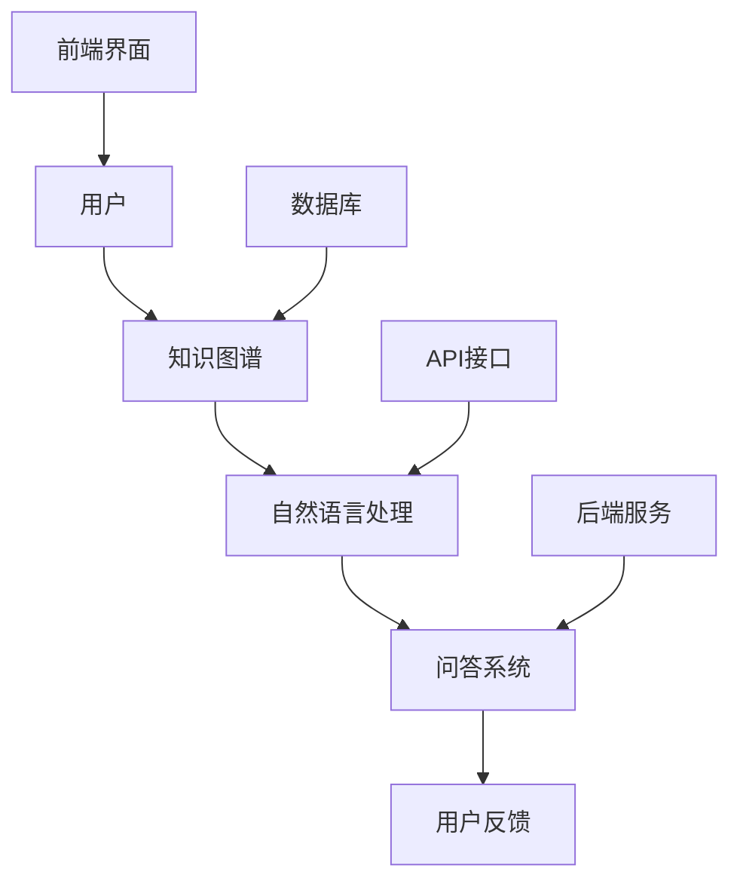
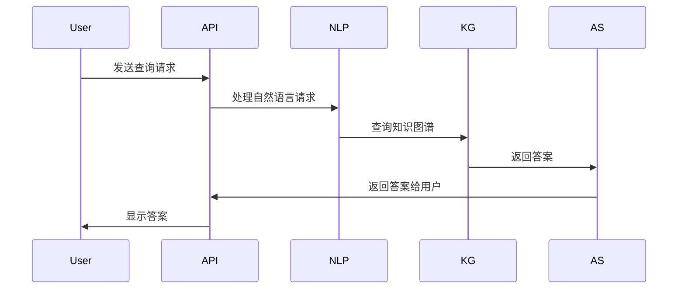
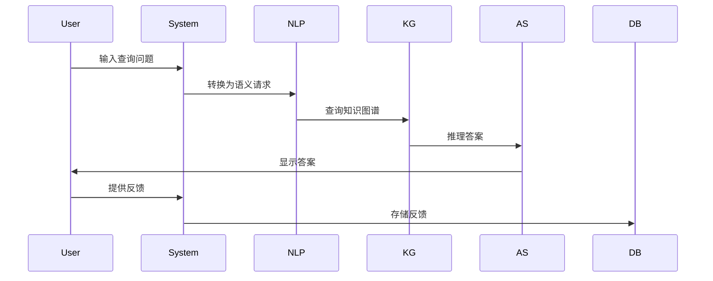

                 


# AI Agent的知识图谱应用

关键词：AI代理，知识图谱，智能推理，数据集成，应用场景

摘要：
本文将探讨AI代理与知识图谱的集成应用，详细解析AI代理的基本概念、知识图谱的核心原理，以及它们之间的融合策略。通过逐步分析，我们将展示如何构建知识图谱、整合AI代理，并探讨其在实际应用中的优势与挑战。本文旨在为读者提供一个全面的技术指南，帮助理解AI代理与知识图谱的深度结合，以及其在未来技术发展中的潜力。

## 引言与背景

### 定义和背景介绍

AI代理（Artificial Intelligence Agent）是一种能够代表人类或系统在特定环境中执行任务的智能实体。它们具有自主性、适应性和交互性，能够在动态环境中通过感知、决策和行动实现目标。AI代理的发展始于20世纪50年代，随着计算能力和算法的进步，AI代理逐渐成为人工智能研究的重要方向。

知识图谱（Knowledge Graph）是一种结构化的知识表示方法，通过实体、属性和关系的组合来表示信息。它源自语义网（Semantic Web）的概念，旨在解决传统关键字搜索无法捕捉复杂关系的局限性。知识图谱的兴起可以追溯到2012年Google推出知识图谱项目，它通过大规模实体和关系的关联，提供了更精准的信息检索和推理能力。

### 发展与重要性

AI代理的发展经历了几个关键阶段，从最初的规则基础代理到基于机器学习和深度学习的智能代理。知识图谱的发展同样经历了从简单的本体工程到大规模图数据库和分布式计算的支持。两者的结合不仅能够提升AI代理的知识处理能力，还能够增强其智能推理和决策能力。

### AI代理与知识图谱的关系

AI代理和知识图谱的结合具有巨大的潜力。知识图谱为AI代理提供了丰富的知识资源，使得代理能够进行更为复杂的信息处理和决策。同时，AI代理能够通过知识图谱中的实体和关系，进行更加准确和高效的智能推理。两者的融合不仅能够提高系统的智能水平，还能够应对更复杂的应用场景。

## 核心概念和原理

### AI代理的设计核心

AI代理的设计涉及多个方面，包括代理的自主性、适应性、交互性和学习能力。首先，代理的自主性使其能够在没有外部干预的情况下自主执行任务。其次，适应性意味着代理能够根据环境变化调整其行为策略。交互性要求代理能够与用户和环境进行有效的沟通。最后，学习能力强使得代理能够通过经验不断改进其性能。

#### 代理类型与分类

AI代理可以分为基于规则的代理、基于模型的代理和混合代理。基于规则的代理通过预定义的规则集进行决策，适用于结构化数据和环境。基于模型的代理使用机器学习和深度学习算法，能够处理大规模数据并适应动态环境。混合代理结合了规则和模型的优势，适用于复杂多变的环境。

#### 代理架构与学习

代理的架构通常包括感知模块、决策模块和行动模块。感知模块负责收集环境信息，决策模块根据感知信息进行策略选择，行动模块执行决策。代理的学习能力主要通过经验反馈和在线学习实现。例如，强化学习算法允许代理通过尝试和错误来优化其行为。

#### 知识表示

知识表示是AI代理的核心，决定了代理处理信息的效率和准确性。常用的知识表示方法包括知识图谱、本体论、符号逻辑等。知识图谱通过实体、属性和关系的组合，提供了直观且结构化的知识表示。本体论则通过定义概念和关系，提供了语义一致的知识框架。符号逻辑通过形式化表示知识，使得推理过程更加精确。

### 知识图谱的基本原理

知识图谱的核心在于其结构化的知识表示方法。它通过实体、属性和关系的组合，形成了一个大规模的语义网络。每个实体可以表示一个概念或对象，属性描述实体的特征，关系则表示实体之间的关联。

#### 实体与关系的建模

实体建模是知识图谱构建的基础。实体可以是任何具有独立意义的事物，如人、地点、事物等。关系则描述实体之间的相互作用，如“属于”、“位于”、“创造”等。关系建模需要考虑关系的类型、方向和权重。

#### 模式与本体设计

模式设计是知识图谱的骨架，它定义了实体和关系的结构。本体设计则是模式的具体实现，通过定义概念和关系，提供了一致性和互操作性的基础。本体设计需要考虑语义一致性、领域特定性和通用性。

#### 知识图谱的存储与索引

知识图谱的存储和索引是保证其高效性和可扩展性的关键。常见的存储方案包括图数据库和关系数据库。图数据库能够高效地处理大规模图结构数据，而关系数据库则通过索引技术提供快速的查询响应。索引技术如B+树、哈希索引和位图索引，能够根据不同的查询需求，提供最佳的访问性能。

## 知识图谱的构建

### 数据收集与准备

构建知识图谱的第一步是数据收集。数据来源可以是结构化数据（如数据库）、半结构化数据（如XML）和非结构化数据（如文本）。数据收集后，需要进行数据清洗和预处理，以去除噪声、填充缺失值和标准化数据格式。

#### 数据清洗与预处理

数据清洗包括去除重复数据、纠正错误数据和处理缺失值。预处理则涉及数据格式的标准化、特征提取和降维。例如，将文本数据转换为统一编码，提取关键词和实体，然后进行词干提取和词性标注。

### 知识图谱建模

知识图谱建模是将收集到的数据转化为实体和关系的表示。建模过程中需要确定实体类型、属性和关系类型。实体类型可以是人、地点、事物等，属性则描述实体的特征，关系类型则描述实体之间的相互作用。

#### 实体与关系建模

实体建模涉及识别数据集中的实体，并定义其属性。关系建模则通过确定实体之间的关联类型，建立实体之间的关系。例如，在一个社交媒体数据集中，实体可以是人或地点，关系可以是“好友”、“位于”等。

#### 模式与本体设计

模式设计定义了知识图谱的框架，包括实体类型、属性和关系类型。本体设计则是模式的具体实现，通过定义概念和关系，提供了一致性和互操作性的基础。本体设计需要考虑领域特定性和通用性。

### 知识图谱存储与索引

知识图谱的存储和索引是保证其高效性和可扩展性的关键。常见的存储方案包括图数据库和关系数据库。图数据库能够高效地处理大规模图结构数据，而关系数据库则通过索引技术提供快速的查询响应。

#### 数据库选择

图数据库如Neo4j、Amazon Neptune和Alibaba Graphdb，提供了高效的数据存储和查询能力，适用于大规模知识图谱。关系数据库如PostgreSQL和MongoDB，则通过索引技术提供快速的查询响应，适用于较小规模的知识图谱。

#### 索引技术

索引技术如B+树、哈希索引和位图索引，能够根据不同的查询需求，提供最佳的访问性能。B+树适用于范围查询和排序查询，哈希索引适用于快速查找，位图索引适用于处理大量数据。

## AI代理与知识图谱的整合

### 结合策略与架构

AI代理与知识图谱的整合涉及多个层面，包括数据集成、推理机制和交互界面。数据集成是将知识图谱中的知识转化为AI代理可用的形式。推理机制则允许AI代理在知识图谱中查找信息、验证假设和推理新事实。交互界面则是AI代理与用户和系统之间的交互渠道。

#### 数据集成

数据集成是将知识图谱中的数据转化为AI代理可用的形式。这可以通过直接访问知识图谱数据库、API接口或数据转换中间件实现。例如，AI代理可以使用图数据库的查询API，获取特定实体的属性和关系。

#### 推理机制

推理机制是AI代理在知识图谱中查找信息、验证假设和推理新事实的核心。推理机制可以分为基于规则的推理和基于模型的推理。基于规则的推理使用预定义的规则集，而基于模型的推理使用机器学习和深度学习算法。

#### 交互界面

交互界面是AI代理与用户和系统之间的交互渠道。交互界面可以是命令行界面、图形用户界面或自然语言处理界面。命令行界面适用于专业用户，图形用户界面适用于普通用户，自然语言处理界面则适用于非专业用户。

## 系统分析与架构设计

### 问题场景介绍

本文将探讨一个实际应用场景：智能客服系统。智能客服系统需要能够理解用户的查询、提供准确的答案，并在对话中进行交互。这要求系统具备知识图谱的构建和AI代理的推理能力。

### 项目介绍

项目名称：智能客服知识图谱系统

项目目标：构建一个智能客服系统，能够通过知识图谱提供准确、高效的回答，并能够进行自然语言交互。

### 系统功能设计

#### 领域模型

领域模型描述了智能客服系统涉及的主要实体和关系。主要实体包括用户、客服代表、问题和答案。关系包括用户提出问题、客服代表回答问题、问题关联答案等。

#### 类图

```mermaid
classDiagram
Class01 <|-- Class02
Class03 --|> Class04
Class05 : +int x
Class06 : +int y
Class06 : +setX(int x)
Class06 : +setY(int y)
Class06 : +getX():int
Class06 : +getY():int
```

### 系统架构设计

系统架构设计展示了智能客服系统的整体结构和各模块之间的关系。



### 系统接口设计

系统接口设计描述了系统内部模块之间的交互接口。



### 系统交互

系统交互图展示了用户与系统的交互过程。



## 项目实战

### 环境安装

安装所需环境包括Python、Neo4j数据库和Docker。首先，安装Python和pip，然后通过pip安装Neo4j和Docker。最后，通过Docker启动Neo4j容器。

### 系统核心实现

以下是智能客服系统的核心实现：

#### 数据库配置

```python
import neo4j

# 连接Neo4j数据库
driver = neo4j.GraphDatabase.driver("bolt://localhost:7687", auth=("neo4j", "password"))

# 创建数据库连接
session = driver.session()

# 创建实体和关系
session.run("CREATE (u:User {name: 'Alice'})")
session.run("CREATE (q:Question {text: 'What is the capital of France?'})")
session.run("CREATE (u)-[:ASKS]->(q)")
session.run("CREATE (a:Answer {text: 'Paris'})")
session.run("CREATE (q)-[:HAS_ANSWER]->(a)")
```

#### 自然语言处理

```python
from nltk.tokenize import word_tokenize

# 处理自然语言请求
def process_query(query):
    tokens = word_tokenize(query)
    # 进行词性标注和语义分析
    # ...
    return tokens

# 示例查询
query = "What is the capital of France?"
processed_query = process_query(query)
print(processed_query)
```

#### 知识图谱查询

```python
def query_knowledge_graph(tokens):
    # 查询知识图谱
    result = session.run("MATCH (q:Question)-[:HAS_ANSWER]->(a:Answer) WHERE q.text = $query RETURN a.text", query=tokens)
    answers = [record[0] for record in result]
    return answers

# 示例查询
answers = query_knowledge_graph(processed_query)
print(answers)
```

#### 问答系统

```python
def answer_query(answers):
    # 返回答案
    if answers:
        return answers[0]
    else:
        return "I'm sorry, I don't have the answer to that question."

# 示例查询
answer = answer_query(answers)
print(answer)
```

### 代码应用解读与分析

以下是代码的详细解读和分析：

1. **数据库配置**：首先连接到Neo4j数据库，并创建用户、问题和答案实体以及它们之间的关系。
2. **自然语言处理**：使用NLTK库对自然语言请求进行词性标注和语义分析，以便更好地理解查询。
3. **知识图谱查询**：查询知识图谱以获取与查询相关的答案。
4. **问答系统**：根据查询结果返回合适的答案。

### 实际案例分析

假设用户输入查询：“What is the capital of France?”，系统将执行以下步骤：

1. **自然语言处理**：将查询转换为处理程序可以理解的格式。
2. **知识图谱查询**：查询知识图谱，获取答案。
3. **问答系统**：返回答案给用户。

通过这些步骤，系统能够为用户提供准确、高效的回答。

### 项目小结

通过本项目的实战，我们展示了如何构建一个智能客服系统，该系统结合了知识图谱和AI代理，能够提供准确、高效的回答。项目中的核心实现包括数据库配置、自然语言处理、知识图谱查询和问答系统。通过逐步分析和实战，我们深入了解了AI代理与知识图谱的整合应用，并为未来的项目提供了参考。

## 最佳实践与注意事项

### 最佳实践

1. **数据质量**：确保知识图谱的数据质量，进行充分的数据清洗和预处理，以提高推理准确性。
2. **模型选择**：根据应用场景选择合适的自然语言处理和推理模型，以达到最佳性能。
3. **迭代优化**：持续迭代和优化系统，以适应不断变化的应用需求和数据。

### 注意事项

1. **性能优化**：注意优化知识图谱的查询性能，选择合适的存储和索引策略。
2. **安全隐私**：确保系统的安全性和用户隐私，遵循相关法律法规。
3. **用户体验**：设计友好的用户界面和交互方式，以提高用户满意度。

## 拓展阅读

- [1] "Knowledge Graph: A Graph Data Model for Rich Semantic Data" by Christian Bizer, Georgi Kobilarov, Jared Rhodes, and Tomasz Z. Strzalkowski
- [2] "AI Agents: Intelligent Software Agents" by Michael Wooldridge
- [3] "Building Intelligent Systems with Python" by Thomas A. Ryan, III and Mikołaj Leski
- [4] "Neural Networks and Deep Learning" by Michael A. Nielsen

## 作者信息

作者：AI天才研究院/AI Genius Institute & 禅与计算机程序设计艺术 /Zen And The Art of Computer Programming

