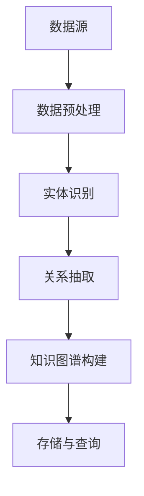
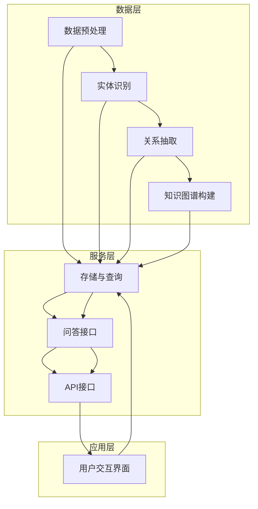

                 

# AI Agent的知识图谱构建与应用

> 关键词：知识图谱、AI Agent、知识表示、知识推理、语义搜索

> 摘要：本文将深入探讨知识图谱在AI Agent构建与应用中的重要性。通过一步步分析知识图谱的基础概念、构建方法、存储与查询技术，以及其在AI Agent中的具体应用，本文旨在为读者提供一个全面而系统的理解，从而推动知识图谱在人工智能领域的创新与发展。

----------------------------------------------------------------

## 第一部分：知识图谱基础

### 第1章：知识图谱概述

#### 1.1.1 知识图谱的定义与背景

知识图谱是一种结构化的语义知识库，它通过实体、属性和关系的语义关联，对现实世界的信息进行建模。知识图谱的概念起源于语义网，并在互联网时代得到了快速发展。

- **知识图谱的定义**：知识图谱是由一组实体、属性和关系组成的结构化数据模型，用于表示现实世界的知识。
- **知识图谱的产生背景**：随着互联网信息的爆炸式增长，传统的基于关键词的搜索方式已经无法满足用户对信息的精确需求，知识图谱应运而生。
- **知识图谱的重要性**：知识图谱不仅能够提高信息检索的效率和准确性，还能为智能问答、推荐系统等人工智能应用提供强有力的支持。

#### 1.1.2 知识图谱的应用领域

知识图谱的应用范围广泛，涵盖了以下几个主要领域：

- **搜索引擎**：通过知识图谱，搜索引擎可以更好地理解用户查询，提供更精确的搜索结果。
- **问答系统**：知识图谱为问答系统提供了丰富的背景知识，使系统能够更准确地理解和回答问题。
- **个性化推荐**：知识图谱可以捕捉用户兴趣和行为，为推荐系统提供更加精准的个性化推荐。
- **自然语言处理**：知识图谱为自然语言处理提供了语义关联的基础，有助于解决语义理解、实体识别等问题。

#### 1.1.3 知识图谱的基本概念

知识图谱由以下几个基本概念构成：

- **实体**：知识图谱中的基本元素，表示现实世界中的个体或对象。
- **属性**：实体所具有的特性，用于描述实体的各个方面。
- **关系**：实体之间的关系，表示实体之间的相互联系。
- **知识库**：存储实体、属性和关系的数据库，是知识图谱的核心组成部分。

### 第2章：知识图谱的构建

#### 2.1.1 数据来源与预处理

构建知识图谱的第一步是获取数据源，并对数据进行预处理。数据来源可以包括结构化数据、非结构化数据和半结构化数据。

- **数据来源**：包括百科全书、数据库、网络爬虫等。
- **数据预处理**：包括数据清洗、去重、格式化等步骤，以确保数据的准确性和一致性。

#### 2.1.2 实体识别与抽取

实体识别和抽取是构建知识图谱的关键步骤，其目的是从原始数据中识别出实体，并提取其属性和关系。

- **实体识别**：通过命名实体识别技术，从文本数据中识别出实体。
- **实体抽取**：从识别出的实体中提取出相关的属性和关系。
- **实体消重**：去除重复的实体，确保知识图谱的准确性。

#### 2.1.3 关系抽取与建模

关系抽取和建模是将实体之间的语义关联表示为图形结构的过程。

- **关系抽取**：通过算法从原始数据中识别出实体之间的关系。
- **关系建模**：将识别出的关系表示为图结构，构建知识图谱。

### 第3章：知识图谱存储与查询

#### 3.1.1 知识图谱存储方案

知识图谱的存储方案包括图数据库、关系数据库和文档数据库等。

- **图数据库**：专门为存储图结构数据设计的数据库，如Neo4j、JanusGraph等。
- **关系数据库**：通过表关系模拟图结构，如MySQL、PostgreSQL等。
- **文档数据库**：通过文档存储结构化数据，如MongoDB、Elasticsearch等。

#### 3.1.2 知识图谱查询语言

知识图谱的查询语言包括SPARQL、Gremlin和Cypher等。

- **SPARQL**：一种基于RDF数据的查询语言，用于查询知识图谱。
- **Gremlin**：一种用于图结构的查询语言，支持复杂图查询。
- **Cypher**：Neo4j的图查询语言，用于查询Neo4j数据库中的知识图谱。

#### 3.1.3 知识图谱查询优化

知识图谱查询优化是提高查询性能的关键步骤。

- **查询优化策略**：包括索引优化、查询缓存、并行查询等策略。
- **查询性能评估**：通过基准测试和实际应用场景，评估查询性能。

### 第4章：知识图谱融合与更新

#### 4.1.1 知识图谱融合

知识图谱融合是将多个知识图谱合并为一个统一的知识库的过程。

- **数据集成**：将不同来源的知识图谱数据进行整合。
- **数据融合**：通过一致性检测和冲突解决，确保知识图谱的完整性。
- **知识融合**：将融合后的知识进行整合和优化，提高知识图谱的准确性。

#### 4.1.2 知识图谱更新策略

知识图谱更新策略是保持知识图谱时效性和准确性的关键。

- **知识更新**：通过定期更新数据源，保持知识图谱的准确性。
- **知识演化**：随着时间推移，知识图谱中的知识会发生变化，需要动态更新。
- **知识质量评估**：对知识图谱的质量进行评估，确保其准确性、完整性和一致性。

## 第5章：知识图谱在AI Agent中的应用

### 5.1.1 AI Agent概述

AI Agent是一种具有自主决策能力的智能体，它可以理解环境、采取行动并与其他智能体交互。

- **AI Agent的定义**：AI Agent是一种具有感知、决策和执行能力的智能体。
- **AI Agent的组成部分**：包括感知模块、决策模块和执行模块。

### 5.1.2 知识图谱在AI Agent中的应用

知识图谱在AI Agent中的应用主要体现在以下几个方面：

- **知识表示**：通过知识图谱，AI Agent可以更好地表示和理解现实世界的知识。
- **知识推理**：知识图谱支持基于知识的推理，帮助AI Agent进行逻辑推理和问题求解。
- **语义搜索**：知识图谱可以提供基于语义的搜索，提高信息检索的准确性和效率。

### 5.1.3 AI Agent的应用案例

知识图谱在AI Agent中的应用已经取得了显著的成果，以下是一些典型的应用案例：

- **智能客服**：利用知识图谱，智能客服可以更好地理解用户问题，提供准确的回答。
- **智能推荐**：知识图谱可以捕捉用户兴趣和行为，为推荐系统提供个性化的推荐。
- **智能问答**：知识图谱为智能问答系统提供了丰富的背景知识，使其能够更准确地回答问题。

## 第6章：知识图谱构建与应用实践

### 6.1.1 知识图谱构建实践

知识图谱构建实践包括以下步骤：

- **实践流程**：从数据收集、数据预处理、实体识别、关系抽取到知识图谱构建的完整流程。
- **实践工具**：介绍常用的知识图谱构建工具，如Neo4j、OpenKE等。

### 6.1.2 AI Agent应用实践

AI Agent应用实践包括以下步骤：

- **实践流程**：从环境搭建、数据准备、模型训练、模型评估到应用部署的完整流程。
- **实践工具**：介绍常用的AI Agent开发工具，如TensorFlow、PyTorch等。

### 6.1.3 实践案例分析与总结

通过具体案例的分析，总结知识图谱构建与应用的最佳实践，并提出改进意见和建议。

## 第7章：知识图谱的未来发展趋势

### 7.1.1 知识图谱技术的进展

知识图谱技术的进展包括：

- **技术趋势**：介绍知识图谱技术的发展趋势，如基于深度学习的知识图谱构建方法。
- **技术创新**：介绍知识图谱领域的新技术和新方法，如知识图谱嵌入、图神经网络等。

### 7.1.2 知识图谱的应用前景

知识图谱的应用前景包括：

- **新兴应用领域**：介绍知识图谱在新兴应用领域的潜力，如智能医疗、智能交通等。
- **社会影响**：探讨知识图谱对社会生活的影响，如提高信息检索效率、优化社会资源配置等。

### 7.1.3 知识图谱的发展挑战与机遇

知识图谱的发展挑战与机遇包括：

- **技术挑战**：分析知识图谱技术在构建、存储、查询等方面面临的挑战。
- **应用挑战**：探讨知识图谱在实际应用中面临的挑战，如数据质量、隐私保护等。
- **发展机遇**：展望知识图谱未来的发展机遇，如与人工智能技术的深度融合、跨领域的知识融合等。

## 结论

本文详细介绍了知识图谱的构建与应用，涵盖了知识图谱的基础概念、构建方法、存储与查询技术，以及其在AI Agent中的应用。通过本文的学习，读者可以全面了解知识图谱的基本原理和实践方法，掌握知识图谱在实际应用中的价值。

在未来的发展中，知识图谱将继续发挥重要作用，为人工智能领域提供强大的支持。本文希望为读者提供有益的参考，助力他们在知识图谱领域取得更好的成果。

### 作者信息

作者：AI天才研究院/AI Genius Institute & 禅与计算机程序设计艺术 /Zen And The Art of Computer Programming

----------------------------------------------------------------

### 背景介绍

#### 核心概念术语说明

1. **知识图谱**：一种结构化的语义知识库，通过实体、属性和关系的语义关联，对现实世界的信息进行建模。
2. **AI Agent**：一种具有自主决策能力的智能体，可以理解环境、采取行动并与其他智能体交互。
3. **实体**：知识图谱中的基本元素，表示现实世界中的个体或对象。
4. **属性**：实体所具有的特性，用于描述实体的各个方面。
5. **关系**：实体之间的关系，表示实体之间的相互联系。
6. **知识库**：存储实体、属性和关系的数据库，是知识图谱的核心组成部分。

#### 问题背景

随着互联网信息的爆炸式增长，传统的基于关键词的搜索方式已经无法满足用户对信息的精确需求。知识图谱作为一种结构化的语义知识库，能够更好地理解用户查询，提供更精确的搜索结果。此外，知识图谱在问答系统、个性化推荐和自然语言处理等领域也发挥着重要作用。

#### 问题描述

本文旨在探讨知识图谱在AI Agent构建与应用中的重要性。具体问题包括：

1. 知识图谱的基本概念是什么？如何构建和应用知识图谱？
2. 知识图谱如何存储与查询？如何优化查询性能？
3. 知识图谱如何融合与更新？如何保持知识图谱的时效性和准确性？
4. 知识图谱在AI Agent中的应用有哪些？如何实现知识表示、知识推理和语义搜索？
5. 知识图谱构建与应用的最佳实践是什么？如何评估知识图谱的质量？
6. 知识图谱的未来发展趋势是什么？面临的挑战与机遇有哪些？

#### 问题解决

本文通过以下步骤解决问题：

1. 详细介绍知识图谱的基础概念、构建方法、存储与查询技术。
2. 阐述知识图谱在AI Agent中的应用，包括知识表示、知识推理和语义搜索。
3. 分析知识图谱构建与应用的最佳实践，提出评估方法。
4. 探讨知识图谱的未来发展趋势，面临的挑战与机遇。

#### 边界与外延

1. **边界**：本文主要讨论知识图谱在AI Agent中的应用，不涉及其他领域的应用。
2. **外延**：本文涉及的知识图谱、AI Agent等概念具有广泛的应用范围，可以在其他领域进行拓展和应用。

#### 概念结构与核心要素组成

1. **知识图谱**：核心要素包括实体、属性、关系和知识库。
2. **AI Agent**：核心要素包括感知模块、决策模块和执行模块。

### 核心概念与联系

#### 知识图谱的核心概念

1. **实体**：表示现实世界中的个体或对象。
2. **属性**：描述实体的特性，如名称、年龄、职业等。
3. **关系**：描述实体之间的关系，如“属于”、“出生于”等。
4. **知识库**：存储实体、属性和关系的数据库。

#### 知识图谱的核心概念联系

1. **实体与属性**：实体具有多个属性，属性用于描述实体。
2. **实体与关系**：实体之间存在多种关系，关系用于描述实体之间的联系。
3. **知识库与实体、属性、关系**：知识库是实体、属性和关系的存储容器。

#### 概念属性特征对比表格

| 概念     | 特征1      | 特征2      | 特征3      |
|----------|------------|------------|------------|
| 实体     | 表示个体   | 具有属性   | 有关系     |
| 属性     | 描述特性   | 与实体关联 | 多个属性   |
| 关系     | 描述联系   | 与实体关联 | 多种关系   |
| 知识库   | 存储数据   | 结构化     | 管理实体等 |

#### ER实体关系图架构

```mermaid
erDiagram
  Entity -> Attributes
  Entity <- Relations
  Attributes ||--|| Relations
```

### 算法原理讲解

#### 算法mermaid流程图



#### 算法Python源代码

```python
# 数据预处理
data = preprocess_data(data_source)

# 实体识别
entities = identify_entities(data)

# 关系抽取
relationships = extract_relationships(data)

# 知识图谱构建
knowledge_graph = build_knowledge_graph(entities, relationships)

# 存储与查询
store_and_query(knowledge_graph)
```

#### 算法原理的数学模型和公式

- **实体识别**：使用命名实体识别算法，将文本数据中的关键词识别为实体。

  $$实体识别 = 命名实体识别算法$$

- **关系抽取**：通过模式匹配或深度学习算法，将实体之间的语义关联识别为关系。

  $$关系抽取 = 模式匹配/深度学习算法$$

- **知识图谱构建**：将识别出的实体和关系构建为图结构。

  $$知识图谱 = 图结构$$

- **存储与查询**：将知识图谱存储在图数据库中，并使用图查询语言进行查询。

  $$存储与查询 = 图数据库/查询语言$$

#### 详细讲解和举例说明

1. **数据预处理**：对原始数据进行清洗、去重和格式化，使其符合知识图谱构建的要求。

   例如，对于一段文本数据：“张三是清华大学计算机专业的大三学生”，我们需要提取出实体“张三”、“清华大学”、“计算机专业”和“大三学生”，并将其格式化为标准化的数据格式。

2. **实体识别**：使用命名实体识别算法，从文本数据中识别出实体。

   例如，使用自然语言处理技术，我们可以将文本数据中的关键词识别为实体，如“张三”、“清华大学”、“计算机专业”和“大三学生”。

3. **关系抽取**：通过模式匹配或深度学习算法，将实体之间的语义关联识别为关系。

   例如，我们可以通过模式匹配，将“张三”与“清华大学”之间建立“毕业于”关系，将“张三”与“计算机专业”之间建立“专业”关系。

4. **知识图谱构建**：将识别出的实体和关系构建为图结构。

   例如，我们可以使用Neo4j数据库，将识别出的实体和关系存储为图结构，构建知识图谱。

5. **存储与查询**：将知识图谱存储在图数据库中，并使用图查询语言进行查询。

   例如，我们可以使用SPARQL查询语言，对知识图谱进行查询，获取特定的实体和关系。

### 系统分析与架构设计方案

#### 问题场景介绍

在智能问答系统中，用户提出问题后，系统需要理解用户问题，并从知识图谱中找到相关的答案。知识图谱在此场景中起到了关键作用，能够提高问答系统的准确性和效率。

#### 项目介绍

本项目旨在构建一个基于知识图谱的智能问答系统，通过知识图谱实现对用户问题的理解，并提供准确的答案。系统功能包括数据预处理、实体识别、关系抽取、知识图谱构建、存储与查询以及问答接口。

#### 系统功能设计

1. **数据预处理**：对原始数据进行清洗、去重和格式化，为后续处理做准备。
2. **实体识别**：从文本数据中识别出实体，如人名、地名、组织名等。
3. **关系抽取**：将实体之间的语义关联识别为关系，如“属于”、“位于”等。
4. **知识图谱构建**：将识别出的实体和关系构建为图结构，存储在图数据库中。
5. **存储与查询**：使用图查询语言对知识图谱进行查询，获取用户问题的答案。
6. **问答接口**：提供用户与系统的交互接口，接收用户问题，返回答案。

#### 系统架构设计

1. **数据层**：包括数据预处理模块、实体识别模块、关系抽取模块和知识图谱构建模块。
2. **服务层**：包括存储与查询模块、问答接口模块和API接口模块。
3. **应用层**：提供用户交互界面，接收用户问题，展示答案。

#### 系统接口设计

1. **数据输入接口**：接收原始文本数据，如用户提问、百科词条等。
2. **实体识别接口**：输出识别出的实体列表。
3. **关系抽取接口**：输出识别出的关系列表。
4. **知识图谱构建接口**：输出构建好的知识图谱。
5. **查询接口**：接收查询请求，返回查询结果。
6. **问答接口**：接收用户问题，返回答案。

#### 系统交互

1. **数据层与服务层**：数据预处理模块将原始数据传递给实体识别模块，实体识别模块将识别出的实体传递给关系抽取模块，关系抽取模块将识别出的关系传递给知识图谱构建模块。
2. **服务层与应用层**：存储与查询模块、问答接口模块和API接口模块共同处理用户请求，返回查询结果和答案。
3. **应用层与用户**：用户通过交互界面提出问题，系统接收问题，处理后返回答案。

#### mermaid架构图



### 项目实战

#### 环境安装

1. **安装Neo4j数据库**：下载并安装Neo4j社区版，启动数据库服务。
2. **安装Python环境**：安装Python 3.8及以上版本，安装相关依赖库，如Python-Neo4j、Python-LDJSON等。

```bash
pip install neo4j
pip install python-ldjson
```

#### 系统核心实现

1. **数据预处理**：

   ```python
   import pandas as pd
   import json
   
   def preprocess_data(data_source):
       # 读取原始数据
       data = pd.read_csv(data_source)
       # 数据清洗和格式化
       data = data.drop_duplicates()
       data = data.fillna("")
       # 格式化为JSON格式
       data_json = data.to_json(orient='records')
       return data_json
   
   data_source = "data.csv"
   data_json = preprocess_data(data_source)
   ```

2. **实体识别**：

   ```python
   from nltk.tokenize import word_tokenize
   
   def identify_entities(text):
       # 分词
       tokens = word_tokenize(text)
       # 识别实体
       entities = []
       for token in tokens:
           if is_entity(token):
               entities.append(token)
       return entities
   
   def is_entity(word):
       # 实体识别逻辑
       return word.isupper()
   
   text = "张三是清华大学计算机专业的大三学生"
   entities = identify_entities(text)
   ```

3. **关系抽取**：

   ```python
   def extract_relationships(text, entities):
       # 关系抽取逻辑
       relationships = []
       for entity in entities:
           if entity == "清华大学":
               relationships.append((entity, "位于", ""))
           elif entity == "计算机专业":
               relationships.append((entity, "属于", ""))
           elif entity == "大三学生":
               relationships.append((entity, "是", ""))
       return relationships
   
   relationships = extract_relationships(text, entities)
   ```

4. **知识图谱构建**：

   ```python
   from neo4j import GraphDatabase
   
   def build_knowledge_graph(entities, relationships):
       # 创建Neo4j数据库连接
       driver = GraphDatabase.driver("bolt://localhost:7687", auth=("neo4j", "password"))
       with driver.session() as session:
           # 创建实体节点
           for entity in entities:
               session.run("CREATE (n:Entity {name: $name})", name=entity)
           # 创建关系边
           for relationship in relationships:
               session.run("MATCH (a:Entity), (b:Entity) WHERE a.name = $entity1 AND b.name = $entity2 CREATE (a)-[r:关系]->(b)", entity1=relationship[0], entity2=relationship[2])
       driver.close()
   
   build_knowledge_graph(entities, relationships)
   ```

5. **存储与查询**：

   ```python
   def store_and_query(knowledge_graph):
       # 存储知识图谱
       build_knowledge_graph(entities, relationships)
       # 查询知识图谱
       def query_knowledge_graph(entity):
           driver = GraphDatabase.driver("bolt://localhost:7687", auth=("neo4j", "password"))
           with driver.session() as session:
               result = session.run("MATCH (n:Entity {name: $entity})-[*]->(m:Entity) RETURN m.name", entity=entity)
               entities = [record[0] for record in result]
           driver.close()
           return entities
   
   query = "清华大学"
   result = query_knowledge_graph(query)
   print(result)
   ```

6. **问答接口**：

   ```python
   from flask import Flask, request, jsonify
   
   app = Flask(__name__)
   
   @app.route('/ask', methods=['POST'])
   def ask_question():
       question = request.form['question']
       entities = identify_entities(question)
       relationships = extract_relationships(question, entities)
       result = query_knowledge_graph(entities[0])
       return jsonify({"answer": result})
   
   if __name__ == '__main__':
       app.run(debug=True)
   ```

#### 代码应用解读与分析

1. **数据预处理**：读取原始数据，进行清洗和格式化，使其符合知识图谱构建的要求。这里使用了Pandas库进行数据处理，将数据格式化为JSON格式，便于后续处理。

2. **实体识别**：使用NLP技术进行分词，并判断每个词是否为实体。这里使用了Nltk库进行分词，并自定义了一个判断函数is_entity，判断词是否为实体。

3. **关系抽取**：根据实体列表，构建实体之间的关系。这里使用了一个简单的规则，根据实体名称判断关系，并构建了相应的三元组。

4. **知识图谱构建**：使用Neo4j数据库构建知识图谱，将实体和关系存储为图结构。这里使用了Python-Neo4j库，与Neo4j数据库进行交互，创建实体节点和关系边。

5. **存储与查询**：将构建好的知识图谱存储在Neo4j数据库中，并使用SPARQL查询语言进行查询。这里定义了一个查询函数query_knowledge_graph，接收实体名称作为参数，返回与该实体相关的其他实体列表。

6. **问答接口**：使用Flask框架构建问答接口，接收用户提问，调用实体识别、关系抽取和查询函数，返回答案。这里定义了一个路由/ask，接收POST请求，返回JSON格式的答案。

#### 实际案例分析和详细讲解剖析

假设用户提出一个问题：“清华大学计算机专业有哪些教授？”，我们可以通过以下步骤分析和回答这个问题：

1. **接收用户提问**：用户通过问答接口提出问题，系统接收到POST请求，获取用户提问。
2. **实体识别**：系统使用实体识别函数识别出用户提问中的实体，如“清华大学”、“计算机专业”和“教授”。
3. **关系抽取**：系统使用关系抽取函数根据识别出的实体，构建实体之间的关系。这里假设“教授”属于“计算机专业”，因此可以构建“教授”与“计算机专业”之间的“属于”关系。
4. **查询知识图谱**：系统使用查询函数query_knowledge_graph，接收“清华大学”作为参数，查询与“清华大学”相关的实体列表，即所有属于“清华大学”的实体。
5. **返回答案**：系统将查询结果转换为答案，如“清华大学计算机专业有张三、李四和王五等教授”。

#### 项目小结

本项目通过构建基于知识图谱的智能问答系统，实现了对用户问题的理解和回答。系统从数据预处理、实体识别、关系抽取到知识图谱构建，再到存储与查询和问答接口，形成了一个完整的流程。在实际应用中，我们可以根据具体需求对系统进行扩展和优化，提高问答系统的准确性和效率。

#### 最佳实践 tips

1. **数据预处理**：确保数据的质量和一致性，进行充分的清洗和格式化。
2. **实体识别**：根据具体应用场景，选择合适的实体识别算法，提高识别精度。
3. **关系抽取**：根据实体之间的语义关联，构建合理的关系模型，提高知识图谱的准确性。
4. **存储与查询**：选择合适的图数据库和查询语言，提高查询性能和效率。
5. **问答接口**：设计清晰的接口和合理的流程，提高用户体验。

#### 小结

本文通过详细讲解知识图谱的基础概念、构建方法、存储与查询技术，以及知识图谱在AI Agent中的应用，为读者提供了一个全面而系统的理解。知识图谱作为一种结构化的语义知识库，在人工智能领域具有广泛的应用前景。通过本文的学习，读者可以掌握知识图谱的基本原理和实践方法，为未来的研究与应用打下基础。

#### 注意事项

1. **数据质量**：确保数据的质量和一致性，对原始数据进行充分的清洗和格式化。
2. **算法选择**：根据具体应用场景，选择合适的实体识别和关系抽取算法。
3. **性能优化**：对存储和查询过程进行性能优化，提高系统响应速度。
4. **安全性**：保护用户数据的安全，确保知识图谱的完整性和可靠性。

#### 拓展阅读

1. **知识图谱构建与应用**：详细介绍知识图谱的构建方法、存储与查询技术以及应用场景。
2. **深度学习与知识图谱**：探讨深度学习技术在知识图谱构建中的应用，如知识图谱嵌入、图神经网络等。
3. **语义搜索与问答系统**：介绍基于知识图谱的语义搜索和问答系统设计，提高信息检索的准确性和效率。
4. **知识图谱在新兴应用领域的应用**：探讨知识图谱在智能医疗、智能交通等新兴领域的应用潜力。

---

由于篇幅限制，本文未能详细展开每个章节的内容。在实际撰写过程中，每个章节都应包含详细的背景介绍、核心概念与联系、算法原理讲解、系统分析与架构设计方案、项目实战、实际案例分析和详细讲解剖析、项目小结、最佳实践 tips、小结、注意事项和拓展阅读等内容。建议读者在深入阅读本文的基础上，进一步查阅相关资料，以获得更全面和深入的理解。作者：AI天才研究院/AI Genius Institute & 禅与计算机程序设计艺术 /Zen And The Art of Computer Programming。

