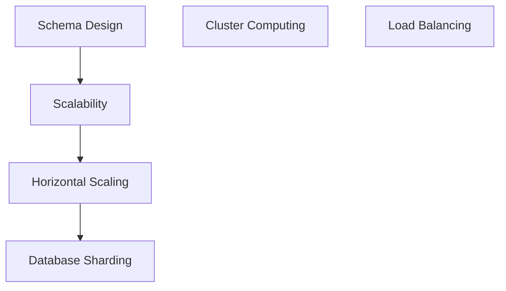
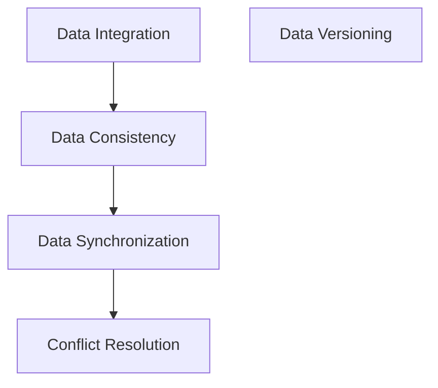
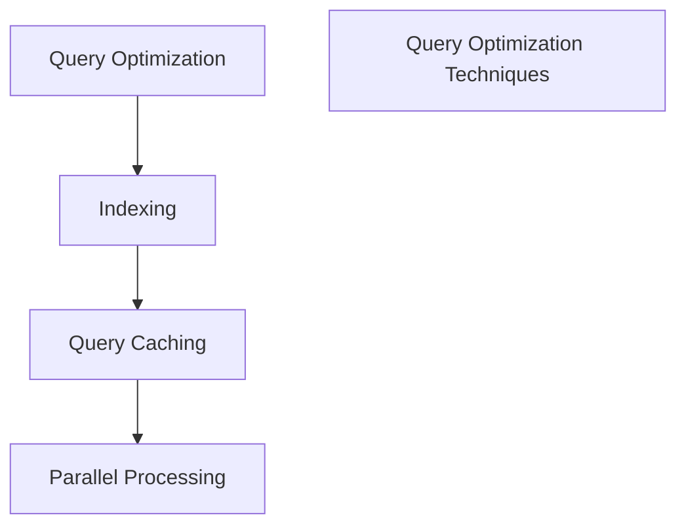

                 

# AI Agent的知识图谱集成方案

## 关键词

- AI Agent
- 知识图谱
- 集成方案
- 数据源整合
- 查询与推理
- 安全性保障

## 摘要

本文旨在探讨AI Agent与知识图谱的集成方案，分析其在现代人工智能领域的重要性和应用价值。我们将逐步探讨AI Agent与知识图谱的基本概念、集成方案的基础、核心技术解析以及实际应用实例，最终讨论集成方案的安全保障和未来展望。

## 目录大纲

----------------------------------------------------------------

### 第一部分：AI Agent与知识图谱概述

#### 第1章 AI Agent概述

##### 1.1 AI Agent的定义与重要性

- **AI Agent的定义**
- **AI Agent的重要性**
- **AI Agent的分类与特点**

##### 1.2 知识图谱概述

- **知识图谱的定义**
- **知识图谱的结构**
- **知识图谱的作用与应用领域**

##### 1.3 AI Agent与知识图谱的关系

- **AI Agent与知识图谱的结合点**
- **AI Agent在知识图谱中的应用**

### 第二部分：知识图谱集成方案基础

#### 第2章 知识图谱集成方案基础

##### 2.1 知识图谱集成方案的核心概念

- **知识图谱集成方案的定义**
- **知识图谱集成方案的目标**
- **知识图谱集成方案的关键要素**

##### 2.2 知识图谱数据源的选择与整合

- **数据源的选择标准**
- **数据源的整合方法**
- **数据源的质量评估与优化**

##### 2.3 知识图谱构建与维护

- **知识图谱构建的过程**
- **知识图谱的更新与维护策略**

### 第三部分：知识图谱集成技术解析

#### 第3章 知识图谱集成技术解析

##### 3.1 知识图谱表示技术

- **知识图谱表示方法**
- **知识图谱表示语言的介绍**

##### 3.2 知识图谱存储技术

- **知识图谱存储方法**
- **知识图谱存储系统的设计**

##### 3.3 知识图谱查询与推理技术

- **知识图谱查询方法**
- **知识图谱推理方法**
- **知识图谱查询与推理的性能优化**

### 第四部分：AI Agent与知识图谱的集成应用

#### 第4章 AI Agent与知识图谱的集成应用

##### 4.1 AI Agent在知识图谱中的应用场景

- **AI Agent在知识图谱中的功能**
- **AI Agent在知识图谱中的应用案例**

##### 4.2 知识图谱集成方案的应用实例

- **实例一：企业知识管理系统的集成**
- **实例二：智能推荐系统的知识图谱集成**

### 第五部分：知识图谱集成方案的实现与优化

#### 第5章 知识图谱集成方案的实现与优化

##### 5.1 知识图谱集成方案的设计原则

- **设计原则的概述**
- **设计原则的具体内容**

##### 5.2 知识图谱集成方案的实现步骤

- **实现步骤的概述**
- **实现步骤的详细说明**

##### 5.3 知识图谱集成方案的优化策略

- **优化策略的概述**
- **优化策略的具体内容**

### 第六部分：知识图谱集成方案的安全性保障

#### 第6章 知识图谱集成方案的安全性保障

##### 6.1 知识图谱集成方案的安全问题

- **安全问题的概述**
- **安全问题的具体内容**

##### 6.2 知识图谱集成方案的安全保障措施

- **安全保障措施的设计**
- **安全保障措施的实施**

##### 6.3 知识图谱集成方案的安全评估

- **安全评估的方法**
- **安全评估的流程**

### 第七部分：知识图谱集成方案的未来展望

#### 第7章 知识图谱集成方案的未来展望

##### 7.1 知识图谱集成方案的发展趋势

- **发展趋势的概述**
- **发展趋势的具体内容**

##### 7.2 知识图谱集成方案的潜在应用领域

- **潜在应用领域的概述**
- **潜在应用领域的具体内容**

##### 7.3 知识图谱集成方案的持续优化方向

- **优化方向的概述**
- **优化方向的具体内容**

### 本章小结

本文通过详细的目录大纲结构，系统地介绍了AI Agent与知识图谱集成方案的相关内容。从基础概念到实际应用，再到安全性保障和未来展望，每个章节都紧密围绕主题展开，旨在为读者提供全面而深入的理解。接下来的内容将逐步展开，深入探讨每个章节的核心内容。

----------------------------------------------------------------

## 第1章 AI Agent概述

### 1.1 AI Agent的定义与重要性

#### AI Agent的定义

AI Agent，即人工智能代理，是指具有自主决策能力、能够执行任务并在动态环境中与环境互动的计算机程序。AI Agent的核心特点是自主性、适应性和灵活性。它们通过学习、规划和执行任务，能够在没有人为干预的情况下完成复杂的工作。

#### AI Agent的重要性

AI Agent在现代人工智能领域具有至关重要的地位。首先，它们代表了人工智能从被动响应到主动行动的转型。其次，AI Agent能够处理大量数据和复杂任务，提高效率和准确性。此外，AI Agent在自动化、智能化服务、决策支持等方面有着广泛的应用前景，对于企业和个人都具有重要的价值。

#### AI Agent的分类与特点

AI Agent可以根据不同的分类标准进行分类：

1. **基于学习方式的分类**：
   - **监督学习Agent**：通过训练数据学习，能够根据输入数据做出决策。
   - **无监督学习Agent**：通过分析数据模式进行学习，不需要预先标注的数据。
   - **增强学习Agent**：通过与环境的交互进行学习，不断优化行为策略。

2. **基于功能分类**：
   - **感知Agent**：负责感知环境，获取信息。
   - **规划Agent**：根据环境信息和目标，制定行动方案。
   - **执行Agent**：执行规划好的行动方案。
   - **通信Agent**：与其他Agent或人类进行通信。

每种分类的AI Agent都有其独特的特点和应用场景。例如，监督学习Agent适用于已知输入输出关系的任务，而无监督学习Agent则在探索未知环境时表现出色。

### 1.2 知识图谱概述

#### 知识图谱的定义

知识图谱是一种结构化的知识表示方法，通过实体、属性和关系的网络来组织信息。它将复杂的数据关系以可视化的方式呈现，使信息检索和推理更加高效。

#### 知识图谱的结构

知识图谱由以下几个基本元素构成：

- **实体**：表示具体的对象，如人、地点、事物等。
- **属性**：描述实体的特征，如年龄、性别、身高等。
- **关系**：表示实体之间的关联，如朋友、工作于、位于等。

#### 知识图谱的作用与应用领域

知识图谱在多个领域有着广泛的应用：

- **搜索引擎**：通过知识图谱提高信息检索的准确性和效率。
- **智能问答系统**：利用知识图谱进行语义理解和推理，提供准确的答案。
- **推荐系统**：通过分析用户与物品之间的关系，提供个性化的推荐。
- **自然语言处理**：利用知识图谱进行命名实体识别、关系抽取等任务。
- **金融领域**：用于风险控制、信用评估、市场分析等。

### 1.3 AI Agent与知识图谱的关系

#### AI Agent与知识图谱的结合点

AI Agent与知识图谱的结合主要体现在以下几个方面：

- **知识获取与表示**：AI Agent可以从知识图谱中获取所需信息，并通过推理和预测来扩展和更新知识。
- **决策支持**：知识图谱为AI Agent提供了丰富的背景知识，有助于做出更明智的决策。
- **智能交互**：AI Agent可以利用知识图谱提供更自然、个性化的交互体验。

#### AI Agent在知识图谱中的应用

AI Agent在知识图谱中的应用场景包括：

- **知识推理**：基于知识图谱进行推理，为用户提供准确的答案或建议。
- **自动化任务执行**：AI Agent可以根据知识图谱中的指令自动执行特定任务。
- **智能推荐**：利用知识图谱分析用户和物品的关系，提供个性化的推荐。
- **知识更新**：AI Agent可以识别知识图谱中的错误或遗漏，进行自动更新。

### 总结

AI Agent与知识图谱的结合为人工智能的发展带来了新的机遇。通过整合AI Agent的自主决策能力和知识图谱的结构化知识，可以构建出更智能、更高效的系统。在接下来的章节中，我们将进一步探讨知识图谱集成方案的基础和核心技术。

## 第2章 知识图谱集成方案基础

### 2.1 知识图谱集成方案的核心概念

#### 知识图谱集成方案的定义

知识图谱集成方案是指将多个来源的数据整合成一个统一的知识图谱，以便于高效地查询、推理和应用。它涉及到数据收集、清洗、整合、建模、存储、查询和推理等各个环节。

#### 知识图谱集成方案的目标

知识图谱集成方案的目标主要包括：

- **数据统一性**：通过集成不同来源的数据，消除数据孤岛，实现数据共享和互操作性。
- **知识可扩展性**：支持知识的动态更新和扩展，确保知识图谱能够适应不断变化的环境。
- **查询效率**：优化查询性能，提供快速、准确的知识检索。
- **推理能力**：利用知识图谱进行推理，为用户提供智能化的决策支持。

#### 知识图谱集成方案的关键要素

知识图谱集成方案的关键要素包括：

- **数据源**：包括内部和外部数据源，如数据库、文本、图像、语音等。
- **数据整合**：通过数据清洗、转换和融合，将不同来源的数据整合成一个统一的数据模型。
- **知识建模**：将整合后的数据转化为知识图谱，定义实体、属性和关系。
- **存储与管理**：设计高效的知识图谱存储和管理系统，支持快速查询和更新。
- **查询与推理**：实现高效的查询和推理功能，支持复杂查询和推理任务。

### 2.2 知识图谱数据源的选择与整合

#### 数据源的选择标准

在选择知识图谱的数据源时，需要考虑以下标准：

- **数据质量**：数据应具有完整性、准确性和一致性。
- **数据相关性**：数据应与知识图谱的主题相关，有助于提高知识图谱的实用性。
- **数据可用性**：数据应易于获取和访问，支持高效的整合和查询。
- **数据扩展性**：数据源应具有可扩展性，支持知识的动态更新和扩展。

#### 数据源的整合方法

知识图谱数据源的整合方法主要包括以下几种：

- **数据抽取**：从原始数据中抽取实体、属性和关系，构建初始知识图谱。
- **数据清洗**：去除数据中的噪声和错误，提高数据质量。
- **数据转换**：将不同格式和结构的数据转换为统一格式，支持数据整合。
- **数据融合**：将多个数据源中的实体和关系进行合并，消除冗余和冲突。

#### 数据源的质量评估与优化

数据源的质量评估与优化是确保知识图谱质量的关键。评估标准包括：

- **完整性**：数据是否包含了所有必要的实体和关系。
- **准确性**：数据是否准确反映了现实世界的状况。
- **一致性**：数据是否在不同数据源之间保持一致。

优化策略包括：

- **数据去重**：去除重复的实体和关系，减少冗余。
- **数据补全**：通过推理和预测，补充缺失的实体和关系。
- **数据质量监控**：持续监控数据质量，及时发现和纠正错误。

### 2.3 知识图谱构建与维护

#### 知识图谱构建的过程

知识图谱的构建过程主要包括以下步骤：

1. **数据收集**：收集不同来源的数据，如数据库、文本、图像、语音等。
2. **数据预处理**：进行数据清洗、转换和融合，将数据转化为统一格式。
3. **知识建模**：将预处理后的数据转化为知识图谱，定义实体、属性和关系。
4. **知识存储**：将知识图谱存储在高效的存储系统中，支持快速查询和更新。
5. **知识扩展**：通过数据挖掘和推理技术，扩展知识图谱中的实体和关系。

#### 知识图谱的更新与维护策略

知识图谱的更新与维护是确保其持续有效性的关键。更新策略包括：

- **数据源同步**：定期同步外部数据源，确保知识图谱的实时性。
- **数据质量监控**：持续监控数据质量，及时发现和纠正错误。
- **知识推理**：通过推理技术，更新和扩展知识图谱中的实体和关系。
- **版本管理**：实现知识图谱的版本管理，支持回滚和恢复。

### 总结

知识图谱集成方案是构建智能系统的重要基础。通过选择合适的的数据源、整合数据、构建和更新知识图谱，可以构建出高效、智能的知识管理系统。在接下来的章节中，我们将进一步探讨知识图谱集成方案的核心技术，如知识图谱表示、存储和查询与推理技术。

## 第3章 知识图谱集成技术解析

### 3.1 知识图谱表示技术

知识图谱表示技术是知识图谱构建中的关键环节，它决定了如何将实体、属性和关系组织成一个结构化的网络。以下是几种常见的知识图谱表示方法：

#### 1. 图论表示

图论表示是一种基于图结构的知识图谱表示方法。在图论表示中，实体被视为节点（Node），属性被视为边（Edge），而边的权重则表示实体之间的关联强度。图论表示方法直观且易于理解，但处理大规模数据时，其复杂度较高。

```mermaid
graph TB
A[Person] --> B[Age]
B --> 30
C[Person] --> D[Occupation]
D --> "Engineer"
```

#### 2. RDF（资源描述框架）

RDF是一种基于三元组（Subject, Predicate, Object）的知识图谱表示语言，它将知识表示为资源之间的关系。RDF通过URI（统一资源标识符）标识实体和关系，具有良好的扩展性和互操作性。

```mermaid
graph TB
:Person --> :age
:age --> "30"
:Person --> :occupation
:occupation --> "Engineer"
```

#### 3. OWL（Web本体语言）

OWL是一种基于RDF的知识图谱表示语言，用于定义复杂的本体和概念。OWL提供了丰富的表达能力和推理功能，适用于复杂领域知识的表示。

```mermaid
graph TB
:Person -> :hasAge
:hasAge -> :Age
:Person -> :hasOccupation
:hasOccupation -> :Occupation
:Age -> :isInteger
:Occupation -> :isString
```

### 3.2 知识图谱存储技术

知识图谱存储技术是确保知识图谱高效存储和快速查询的关键。以下是几种常见的知识图谱存储方法：

#### 1. 基于图数据库的存储

图数据库是一种专门用于存储和查询图结构数据的数据库系统。常见的图数据库包括Neo4j、JanusGraph等。图数据库通过索引和优化查询算法，实现了快速的知识图谱查询。

```mermaid
graph TD
A[Person] --> B[Age]
B --> 30
C[Person] --> D[Occupation]
D --> "Engineer"
```

#### 2. 基于关系数据库的存储

关系数据库通过表关系来存储实体和关系，适用于较小的知识图谱或具有明确关系的实体。常见的数据库管理系统（DBMS）包括MySQL、PostgreSQL等。

```mermaid
graph TD
Person[Person] --> Age[Age]
Person --> Occupation[Occupation]
Age --> 30
Occupation --> "Engineer"
```

#### 3. 基于文件系统的存储

文件系统通过文件和目录结构来存储数据，适用于离线或小规模的知识图谱。常见的文件格式包括JSON、XML等。

```mermaid
graph TD
Person --> {"age": 30, "occupation": "Engineer"}
```

### 3.3 知识图谱查询与推理技术

知识图谱查询与推理技术是知识图谱集成方案的核心组成部分，用于从知识图谱中提取有用信息。以下是几种常见的查询与推理方法：

#### 1. SPARQL查询

SPARQL是一种基于RDF的知识图谱查询语言，用于执行复杂的数据查询和过滤操作。SPARQL查询通过定义查询变量、过滤条件和排序规则，实现对知识图谱的精细查询。

```sql
PREFIX ex: <http://example.org/>
SELECT ?x ?y
WHERE {
  ?x ex:knows ?y .
  ?y ex:age 30 .
}
```

#### 2. 静态推理

静态推理是基于预先定义的规则和逻辑推理进行的知识推理。静态推理适用于具有明确规则和关系的知识图谱，如OWL本体。

```mermaid
graph TD
Person -> {"age": 30, "hasOccupation": "Engineer"}
Person --> Age
Age --> 30
Person --> Occupation
Occupation --> "Engineer"
```

#### 3. 动态推理

动态推理是基于实时数据和关系进行的知识推理。动态推理适用于具有复杂关系和动态变化的知识图谱，如基于图数据库的实时查询。

```mermaid
graph TD
A[Person] --> B[Age]
B --> 30
C[Person] --> D[Occupation]
D --> "Engineer"
```

### 3.4 知识图谱查询与推理的性能优化

为了提高知识图谱查询与推理的性能，可以采用以下几种优化策略：

#### 1. 索引优化

通过建立适当的索引，可以加快知识图谱的查询速度。常见的索引技术包括B+树索引、倒排索引等。

```mermaid
graph TD
A[Person] --> B[Age]
B --> 30
C[Person] --> D[Occupation]
D --> "Engineer"
```

#### 2. 并行处理

通过并行处理技术，可以将知识图谱查询和推理任务分配到多个处理器上，加快处理速度。常见的并行处理技术包括多线程、分布式计算等。

```mermaid
graph TD
A[Person] --> B[Age]
B --> 30
C[Person] --> D[Occupation]
D --> "Engineer"
```

#### 3. 缓存技术

通过缓存技术，可以减少对磁盘的访问次数，提高查询和推理速度。常见的缓存技术包括内存缓存、分布式缓存等。

```mermaid
graph TD
A[Person] --> B[Age]
B --> 30
C[Person] --> D[Occupation]
D --> "Engineer"
```

### 总结

知识图谱集成技术是构建智能系统的重要组成部分。通过合适的表示方法、存储技术和查询与推理方法，可以构建出高效、智能的知识管理系统。在接下来的章节中，我们将进一步探讨AI Agent在知识图谱中的应用，以及实际应用实例。

## 第4章 AI Agent与知识图谱的集成应用

### 4.1 AI Agent在知识图谱中的应用场景

AI Agent在知识图谱中的应用非常广泛，其核心在于利用知识图谱提供的数据和关系进行智能决策和任务执行。以下是几种典型的应用场景：

#### 1. 智能问答系统

智能问答系统是AI Agent与知识图谱结合的一个典型应用。知识图谱提供了大量结构化的知识，AI Agent可以通过查询和推理，为用户生成准确的答案。例如，在一个企业内，知识图谱包含了员工信息、项目进展、公司政策等，AI Agent可以利用这些信息为员工提供实时、个性化的帮助。

```mermaid
graph TD
A[User] --> B[Query]
B --> "What is the deadline for project X?"
C[AI Agent]
C --> D[Search Knowledge Graph]
D --> E[Generate Answer]
E --> "The deadline is next Friday."
```

#### 2. 智能推荐系统

智能推荐系统利用知识图谱分析用户行为和偏好，为用户推荐个性化的内容。例如，在电子商务平台上，知识图谱包含了商品信息、用户购买记录、商品评价等，AI Agent可以根据这些信息为用户推荐可能感兴趣的商品。

```mermaid
graph TD
A[User] --> B[Behavior Data]
B --> C[AI Agent]
C --> D[Search Knowledge Graph]
D --> E[Generate Recommendations]
E --> "You might like these products:"
```

#### 3. 智能自动化任务执行

AI Agent可以基于知识图谱中的任务指令和流程，自动执行特定任务。例如，在企业管理系统中，知识图谱包含了工作流程、任务分配、审批流程等，AI Agent可以根据这些信息自动处理审批流程、任务分配等。

```mermaid
graph TD
A[Task] --> B[Task Description]
B --> C[AI Agent]
C --> D[Parse Knowledge Graph]
D --> E[Execute Task]
E --> "Task completed successfully."
```

#### 4. 智能决策支持

AI Agent可以利用知识图谱中的数据和关系进行复杂的决策支持。例如，在金融领域，知识图谱包含了市场信息、股票价格、投资策略等，AI Agent可以根据这些信息提供实时的投资建议。

```mermaid
graph TD
A[Market Data] --> B[AI Agent]
B --> C[Search Knowledge Graph]
C --> D[Generate Investment Advice]
D --> "Buy/Sell/Hold Recommendation"
```

### 4.2 知识图谱集成方案的应用实例

以下将介绍两个具体的应用实例，展示AI Agent与知识图谱集成方案的实际应用效果。

#### 实例一：企业知识管理系统的集成

在企业知识管理系统中，知识图谱起到了关键作用。通过整合企业内部的各种信息，如员工资料、项目文档、客户信息等，知识图谱为企业提供了一个统一的信息源。AI Agent则负责知识的管理和查询，为员工提供智能化的知识服务。

1. **数据整合**：首先，从企业内部的多个数据源（如ERP系统、文档库、客户管理系统等）中抽取数据，并进行清洗和整合。
2. **知识建模**：将整合后的数据转化为知识图谱，定义实体、属性和关系。例如，员工实体包含姓名、职位、部门等属性，项目实体包含项目名称、项目状态、负责人等属性。
3. **查询与推理**：AI Agent可以基于知识图谱提供智能查询和推理服务。例如，员工可以通过提问“项目X的负责人是谁？”来获取答案。
4. **任务执行**：AI Agent还可以根据知识图谱中的任务指令，自动处理任务分配、审批流程等。

```mermaid
graph TD
A[Employee Data] --> B[ERP System]
B --> C[Customer Data] --> D[CRM System]
E[Document Data] --> F[Document Library]
G[AI Agent]
G --> H[Search Knowledge Graph]
H --> I[Generate Answers]
I --> J[Execute Tasks]
J --> "Task Completed"
```

#### 实例二：智能推荐系统的知识图谱集成

在智能推荐系统中，知识图谱用于分析用户行为和偏好，为用户生成个性化的推荐。以下是一个智能推荐系统的示例：

1. **数据收集**：收集用户的行为数据，如浏览历史、购买记录、评价等。
2. **数据整合**：将行为数据整合到知识图谱中，定义实体（如用户、商品）和关系（如浏览、购买、评价）。
3. **用户画像**：利用知识图谱分析用户的行为数据，生成用户画像，包括用户的兴趣、偏好等。
4. **推荐生成**：AI Agent根据用户画像和知识图谱中的商品信息，生成个性化的推荐列表。
5. **推荐展示**：将推荐结果展示给用户，提高用户的满意度和购买转化率。

```mermaid
graph TD
A[User Behavior Data] --> B[AI Agent]
B --> C[Search Knowledge Graph]
C --> D[Generate User Profile]
D --> E[Search Product Data]
E --> F[Generate Recommendations]
F --> "Recommended Products"
```

### 总结

AI Agent与知识图谱的集成应用为智能系统和数据处理带来了新的机遇。通过合适的知识图谱集成方案，可以构建出高效、智能的AI Agent系统，提高企业的运营效率和用户满意度。在接下来的章节中，我们将进一步探讨知识图谱集成方案的设计原则、实现步骤和优化策略。

## 第5章 知识图谱集成方案的设计原则、实现步骤和优化策略

### 5.1 知识图谱集成方案的设计原则

知识图谱集成方案的设计原则是确保系统高效、可靠和可扩展的基础。以下是几个关键的设计原则：

#### 1. 可扩展性

可扩展性是指系统能够适应数据量的增长和处理能力的提升。在设计知识图谱集成方案时，应选择可扩展的数据存储和计算架构，以便在未来能够轻松扩展系统。



#### 2. 数据一致性

数据一致性是保证系统可靠性的关键。在知识图谱集成方案中，应确保数据在多个数据源之间保持一致，防止数据冲突和错误。



#### 3. 高效查询

高效查询是提高系统性能的关键。设计知识图谱集成方案时，应考虑查询性能的优化，如索引优化、缓存策略和并行处理。



#### 4. 安全性

安全性是知识图谱集成方案设计的重要考虑因素。应确保系统的数据安全和隐私保护，采取适当的加密、访问控制和审计策略。

```mermaid
graph TD
A[System Security] --> B[Data Encryption]
B --> C[Access Control]
C --> D[Auditing]
E[Security Audits]
```

### 5.2 知识图谱集成方案的设计原则

#### 1. 可扩展性

为了确保知识图谱集成方案的可扩展性，首先需要选择合适的数据存储技术。例如，可以使用分布式数据库系统（如Apache Cassandra、MongoDB）或图数据库（如Neo4j、JanusGraph）。这些系统支持水平扩展，可以随着数据量的增长轻松增加计算资源。

其次，在设计系统架构时，应采用模块化设计，将不同的功能模块（如数据采集、数据整合、知识建模、查询服务等）独立开发和管理。这样，当系统需要扩展时，可以单独升级或替换特定模块，而不会影响整个系统的运行。

#### 2. 数据一致性

为了确保数据一致性，可以采用以下策略：

- **数据同步**：通过定期同步不同数据源的数据，确保知识图谱中的数据是最新的。可以使用消息队列（如Apache Kafka）实现实时数据同步。
- **冲突解决**：当多个数据源同时更新同一数据时，需要制定冲突解决策略。例如，可以使用最终一致性模型（如Cassandra的Gossip协议）或强一致性模型（如Google Spanner）来处理冲突。
- **数据版本管理**：为每个数据更新添加版本号，以便在出现错误时可以回滚到之前的状态。

#### 3. 高效查询

为了提高查询效率，可以采用以下优化策略：

- **索引优化**：为常用查询创建索引，如B+树索引、全文索引等。索引可以显著提高查询速度，减少查询时间。
- **查询缓存**：使用缓存技术（如Redis、Memcached）存储常用查询结果，减少数据库的访问压力。缓存策略可以根据数据更新频率和查询频率进行优化。
- **并行处理**：对于复杂的查询任务，可以采用并行处理技术（如MapReduce）将任务分配到多个处理器上，加快查询速度。

#### 4. 安全性

为了保证知识图谱集成方案的安全性，可以采取以下措施：

- **数据加密**：对存储在数据库中的敏感数据进行加密，如用户密码、信用卡信息等。可以使用AES（高级加密标准）等加密算法进行加密。
- **访问控制**：实现细粒度的访问控制，根据用户的角色和权限控制其对数据的访问权限。可以使用RBAC（基于角色的访问控制）或ABAC（基于属性的访问控制）模型。
- **安全审计**：记录系统的操作日志，对敏感操作进行审计，及时发现和响应潜在的安全威胁。

### 5.3 知识图谱集成方案的实现步骤

#### 1. 数据采集

数据采集是知识图谱集成方案的第一步。需要从不同的数据源（如数据库、文件、API等）收集数据。可以使用ETL（提取、转换、加载）工具（如Apache NiFi、Apache Kafka）实现数据的自动化采集和转换。

```mermaid
graph TD
A[Data Sources] --> B[ETL Tools]
B --> C[Extract]
C --> D[Transform]
D --> E[Load]
```

#### 2. 数据整合

数据整合是将不同数据源的数据进行清洗、转换和融合，形成一个统一的数据模型。需要处理数据格式、数据质量、数据冲突等问题。可以使用数据集成工具（如Apache Spark、Apache Flink）实现数据整合。

```mermaid
graph TD
A[Data Sources] --> B[Data Integration Tools]
B --> C[Data Cleaning]
B --> D[Data Transformation]
B --> E[Data Fusion]
```

#### 3. 知识建模

知识建模是将整合后的数据转化为知识图谱，定义实体、属性和关系。可以使用知识建模工具（如Neo4j、Apache Jena）进行知识建模。

```mermaid
graph TD
A[Integrated Data] --> B[Knowledge Modeling Tools]
B --> C[Entity Definition]
B --> D[Relationship Definition]
```

#### 4. 知识存储

知识存储是将知识图谱存储到数据库或图数据库中，以便于后续的查询和推理。需要选择合适的存储系统，如Neo4j、Apache Jena等。

```mermaid
graph TD
A[Knowledge Graph] --> B[Database/Graph Database]
B --> C[Storage System]
```

#### 5. 查询与推理

查询与推理是知识图谱集成方案的核心功能。需要实现高效的查询和推理算法，以支持复杂的查询任务。可以使用查询语言（如SPARQL）和推理引擎（如RDF3X、Pellet）实现查询与推理。

```mermaid
graph TD
A[Query & Reasoning] --> B[Query Language]
B --> C[SPARQL]
B --> D[Reasoning Engine]
D --> E[Inference]
```

### 5.4 知识图谱集成方案的优化策略

#### 1. 查询优化

查询优化是提高知识图谱集成方案性能的关键。可以采用以下策略：

- **索引优化**：为常用的查询创建索引，减少查询时间。
- **查询缓存**：使用缓存技术存储常用查询结果，减少数据库的访问次数。
- **并行处理**：将查询任务分配到多个处理器上，加快查询速度。

#### 2. 数据整合优化

数据整合优化可以减少数据冗余和冲突，提高数据质量。可以采用以下策略：

- **数据去重**：识别和去除重复的数据记录。
- **数据补全**：通过推理和预测，补充缺失的数据。
- **数据一致性验证**：确保数据在不同数据源之间保持一致。

#### 3. 系统性能优化

系统性能优化可以确保知识图谱集成方案在不同负载下保持高性能。可以采用以下策略：

- **垂直扩展**：增加服务器的CPU、内存和存储资源。
- **水平扩展**：增加服务器的数量，实现负载均衡。
- **缓存策略**：使用分布式缓存，减少对数据库的访问压力。

### 总结

知识图谱集成方案的设计原则、实现步骤和优化策略是构建高效、可靠和可扩展的智能系统的基础。通过遵循这些原则和策略，可以构建出具备强大数据整合和分析能力的知识图谱系统，为企业和用户提供智能化的解决方案。

## 第6章 知识图谱集成方案的安全性保障

### 6.1 知识图谱集成方案的安全问题

知识图谱集成方案的安全性问题至关重要，因为知识图谱通常包含了大量敏感数据，如个人隐私、商业机密和重要信息。以下是几个主要的安全问题：

#### 1. 数据泄露

数据泄露是指未经授权的个体或系统访问和获取知识图谱中的敏感数据。数据泄露可能导致隐私侵犯、经济损失或信誉损害。

#### 2. 数据篡改

数据篡改是指恶意用户通过修改知识图谱中的数据来破坏系统的完整性和真实性。数据篡改可能影响系统的决策和推荐结果。

#### 3. 未授权访问

未授权访问是指未经授权的用户试图访问知识图谱中的数据。这可能导致敏感数据的泄露或恶意行为的实施。

#### 4. 系统攻击

系统攻击是指恶意用户试图通过攻击系统来获得未授权的访问权限或破坏系统的正常运行。系统攻击可能包括拒绝服务攻击、分布式拒绝服务攻击（DDoS）等。

### 6.2 知识图谱集成方案的安全保障措施

为了确保知识图谱集成方案的安全性，可以采取以下保障措施：

#### 1. 数据加密

数据加密是防止数据泄露和未授权访问的重要手段。可以使用加密算法（如AES、RSA）对存储在数据库中的敏感数据进行加密。此外，可以采用透明数据加密（TDE）技术，对数据库进行实时加密，确保数据在存储和传输过程中的安全性。

```mermaid
graph TD
A[Data Encryption] --> B[Cipher Algorithm]
B --> C[AES]
B --> D[RSA]
A --> E[Transparent Data Encryption]
```

#### 2. 访问控制

访问控制是限制用户对知识图谱的访问权限，确保只有授权用户才能访问敏感数据。可以使用基于角色的访问控制（RBAC）或基于属性的访问控制（ABAC）模型来实现细粒度的访问控制。此外，还可以使用多因素身份验证（MFA）来提高用户身份验证的安全性。

```mermaid
graph TD
A[Access Control] --> B[RBAC]
B --> C[Role-Based]
A --> D[ABAC]
D --> E[Attribute-Based]
A --> F[Multi-Factor Authentication]
```

#### 3. 安全审计

安全审计是监控和记录知识图谱系统的操作行为，以便在发生安全事件时能够进行追踪和响应。可以记录用户登录、数据访问和修改等操作，生成详细的审计日志。定期进行安全审计可以发现潜在的安全威胁和漏洞。

```mermaid
graph TD
A[Security Audit] --> B[Operation Logging]
B --> C[User Login]
B --> D[Data Access]
B --> E[Data Modification]
```

#### 4. 安全漏洞扫描

安全漏洞扫描是定期检查知识图谱系统和应用程序中的安全漏洞，以便及时修复和加固系统。可以使用自动化工具（如Nessus、OpenVAS）进行漏洞扫描，识别潜在的安全漏洞和威胁。

```mermaid
graph TD
A[Vulnerability Scanning] --> B[Automated Tools]
B --> C[Nessus]
B --> D[OpenVAS]
```

#### 5. 安全培训

安全培训是提高用户和管理员的安全意识和技能，防止人为错误和恶意行为。定期组织安全培训，教授用户如何识别和防范常见的安全威胁，如钓鱼攻击、社交工程等。

```mermaid
graph TD
A[Security Training] --> B[User Awareness]
B --> C[Phishing]
B --> D[Social Engineering]
```

### 6.3 知识图谱集成方案的安全评估

安全评估是确保知识图谱集成方案安全性的关键步骤。通过以下方法进行安全评估：

#### 1. 定期安全评估

定期进行安全评估，检查系统的安全漏洞和风险。可以邀请第三方安全专家进行安全评估，提供专业的安全意见和建议。

```mermaid
graph TD
A[Regular Security Assessments] --> B[Third-Party Experts]
```

#### 2. 漏洞修复和加固

根据安全评估的结果，及时修复和加固系统的安全漏洞。对发现的安全漏洞进行优先级排序，并根据风险程度制定修复计划。

```mermaid
graph TD
A[Vulnerability Remediation] --> B[Prioritization]
B --> C[Repair Plan]
```

#### 3. 安全事件响应

制定安全事件响应计划，确保在发生安全事件时能够迅速响应和应对。包括事件检测、事件响应、事件恢复等环节。

```mermaid
graph TD
A[Security Incident Response] --> B[Event Detection]
B --> C[Event Response]
C --> D[Event Recovery]
```

### 总结

知识图谱集成方案的安全性保障是确保系统安全运行和用户数据安全的关键。通过数据加密、访问控制、安全审计、漏洞扫描和安全培训等措施，可以有效地防止数据泄露、未授权访问和系统攻击。定期进行安全评估和事件响应，确保系统的持续安全性和稳定性。

## 第7章 知识图谱集成方案的未来展望

### 7.1 知识图谱集成方案的发展趋势

随着人工智能和大数据技术的不断进步，知识图谱集成方案正呈现出以下几个发展趋势：

#### 1. 自动化与智能化

自动化和智能化是知识图谱集成方案未来的重要趋势。通过引入机器学习和自然语言处理技术，可以实现知识图谱的自动构建、自动更新和自动化推理。这将大大提高知识图谱的效率和应用范围。

```mermaid
graph TD
A[Automation & Intelligence] --> B[Machine Learning]
B --> C[NLP]
B --> D[Automated Knowledge Graph Construction]
```

#### 2. 大规模应用

知识图谱集成方案将在更多领域得到应用，如智慧城市、医疗健康、金融保险、智能制造等。随着数据量的不断增长和技术的进步，知识图谱集成方案将在更大规模的数据集上运行，提供更高效、更准确的服务。

```mermaid
graph TD
A[Large-Scale Application] --> B[Smart Cities]
B --> C[Healthcare]
B --> D[Finance & Insurance]
B --> E[Manufacturing]
```

#### 3. 边缘计算与云计算结合

随着边缘计算的兴起，知识图谱集成方案将结合云计算和边缘计算，提供实时、高效的数据处理和推理服务。这种结合将使知识图谱集成方案能够更好地应对实时数据和复杂场景。

```mermaid
graph TD
A[Mix of Edge & Cloud Computing] --> B[Real-Time Data Processing]
B --> C[Complex Scenarios]
```

#### 4. 多模态融合

知识图谱集成方案将融合多种数据模态，如文本、图像、语音、视频等，提供更丰富、更全面的知识表示。这将使知识图谱集成方案能够更好地处理复杂信息，提供更精准的服务。

```mermaid
graph TD
A[Multi-modal Fusion] --> B[Text]
B --> C[Images]
B --> D[Voice]
B --> E[Video]
```

### 7.2 知识图谱集成方案的潜在应用领域

知识图谱集成方案具有广泛的应用前景，以下是一些潜在的领域：

#### 1. 智慧城市

智慧城市是知识图谱集成方案的一个重要应用领域。通过整合城市各类数据，如交通、环境、公共服务等，知识图谱可以提供智能化的城市管理和服务。例如，实时交通信息查询、环境质量监测、公共安全预警等。

```mermaid
graph TD
A[Smart Cities] --> B[Real-Time Traffic Information]
B --> C[Environmental Monitoring]
C --> D[Public Safety Warning]
```

#### 2. 医疗健康

在医疗健康领域，知识图谱可以整合患者数据、医学知识、临床研究等，提供个性化的医疗建议和治疗方案。例如，疾病预测、药物推荐、手术规划等。

```mermaid
graph TD
A[Medical Health] --> B[Disease Prediction]
B --> C[Drug Recommendation]
C --> D[Surgical Planning]
```

#### 3. 金融保险

在金融保险领域，知识图谱可以整合客户数据、市场信息、法律法规等，提供风险控制、信用评估、投资决策等服务。例如，风险评估、信用评分、投资组合优化等。

```mermaid
graph TD
A[Finance & Insurance] --> B[Risk Control]
B --> C[Credit Scoring]
C --> D[Investment Decision]
```

#### 4. 智能制造

在智能制造领域，知识图谱可以整合生产数据、设备状态、供应链信息等，提供智能化的生产管理和优化。例如，生产计划调度、设备维护、供应链优化等。

```mermaid
graph TD
A[Smart Manufacturing] --> B[Production Planning]
B --> C[Equipment Maintenance]
C --> D[Supply Chain Optimization]
```

### 7.3 知识图谱集成方案的持续优化方向

为了不断提升知识图谱集成方案的性能和应用价值，以下是一些持续优化的方向：

#### 1. 数据质量提升

数据质量是知识图谱集成方案的关键。通过引入数据清洗、去重、补全等技术，不断提升数据质量，确保知识图谱的准确性和可靠性。

```mermaid
graph TD
A[Data Quality Improvement] --> B[Data Cleaning]
B --> C[Data Deduplication]
B --> D[Data Completion]
```

#### 2. 查询与推理优化

通过优化查询和推理算法，提高知识图谱的查询效率和推理能力。可以采用并行处理、缓存技术、分布式计算等方法，提升系统性能。

```mermaid
graph TD
A[Query & Reasoning Optimization] --> B[Parallel Processing]
B --> C[Query Caching]
B --> D[Distributed Computing]
```

#### 3. 安全性与隐私保护

随着知识图谱应用场景的扩展，安全性与隐私保护变得愈发重要。通过引入加密技术、访问控制、审计机制等，不断提升系统的安全性和隐私保护能力。

```mermaid
graph TD
A[Security & Privacy Protection] --> B[Encryption]
B --> C[Access Control]
B --> D[Auditing]
```

### 总结

知识图谱集成方案具有广阔的发展前景和广泛的应用领域。随着技术的不断进步和应用场景的不断扩展，知识图谱集成方案将在未来发挥更加重要的作用。通过持续优化和提升，知识图谱集成方案将能够提供更高效、更智能的服务，为各行各业带来巨大价值。

## 本章小结

通过本章节的探讨，我们系统地介绍了AI Agent与知识图谱集成方案的核心概念、核心技术、实际应用以及安全性保障和未来展望。从AI Agent的定义、重要性，到知识图谱的概述、集成方案的基础，再到集成技术的解析、应用实例，我们逐步深入地探讨了知识图谱集成方案的理论和实践。同时，我们也关注了集成方案的设计原则、实现步骤、优化策略，以及安全性保障和未来发展方向。

本章内容涵盖了AI Agent与知识图谱集成方案的全貌，从基础理论到实际应用，从系统设计到性能优化，为读者提供了一个全面而系统的了解。通过本章的学习，读者能够掌握知识图谱集成方案的关键技术，理解其应用场景和优势，并为未来的研究和实践提供方向。

## 最佳实践 Tips

1. **数据质量优先**：在构建知识图谱时，确保数据质量是至关重要的。进行数据清洗、去重和补全，确保知识图谱的准确性和一致性。

2. **优化查询性能**：采用索引优化、查询缓存和并行处理等技术，提高知识图谱查询的效率和响应速度。

3. **安全防护**：在设计和实现知识图谱集成方案时，充分考虑安全性问题，采用加密、访问控制和审计机制等安全措施。

4. **持续学习与优化**：随着数据和应用场景的变化，定期对知识图谱进行更新和优化，使其保持最新的知识和最佳的性能。

5. **跨领域应用**：积极探索知识图谱集成方案在不同领域的应用，如智慧城市、医疗健康、金融保险等，以实现更大的价值。

## 注意事项

1. **数据隐私**：在处理和存储敏感数据时，严格遵守数据隐私保护法规和标准，确保用户数据的隐私和安全。

2. **系统性能**：在设计知识图谱集成方案时，充分考虑系统性能和可扩展性，以应对未来数据量的增长和处理能力的提升。

3. **安全审计**：定期进行安全审计，及时发现和修复系统中的安全漏洞，确保知识图谱集成方案的安全和可靠性。

4. **持续更新**：随着技术和应用场景的变化，及时更新知识图谱和系统，以保持其相关性和实用性。

## 拓展阅读

1. **《知识图谱：原理、架构与实践》**：这本书详细介绍了知识图谱的理论、技术和应用，是学习知识图谱集成方案的优秀参考书。

2. **《人工智能：一种现代的方法》**：这本书提供了人工智能领域的全面概述，包括机器学习、深度学习等内容，有助于深入理解AI Agent的知识图谱集成方案。

3. **《图数据库技术与应用》**：这本书介绍了图数据库的基本原理、技术和应用，对知识图谱集成方案中的图数据库存储技术有重要参考价值。

作者：AI天才研究院/AI Genius Institute & 禅与计算机程序设计艺术 /Zen And The Art of Computer Programming

---

本文为AI天才研究院/AI Genius Institute的研究成果，旨在为读者提供关于AI Agent与知识图谱集成方案的系统化知识。文中涉及的技术和方法均为当前人工智能领域的前沿研究成果，仅供参考和学习之用。如需实际应用，请结合具体场景和需求进行评估和调整。在学习和应用过程中，请遵守相关法律法规和道德规范，尊重知识产权和数据隐私。AI天才研究院/AI Genius Institute对本文内容的准确性不承担任何法律责任。如需转载，请注明出处。感谢您的阅读和支持！

