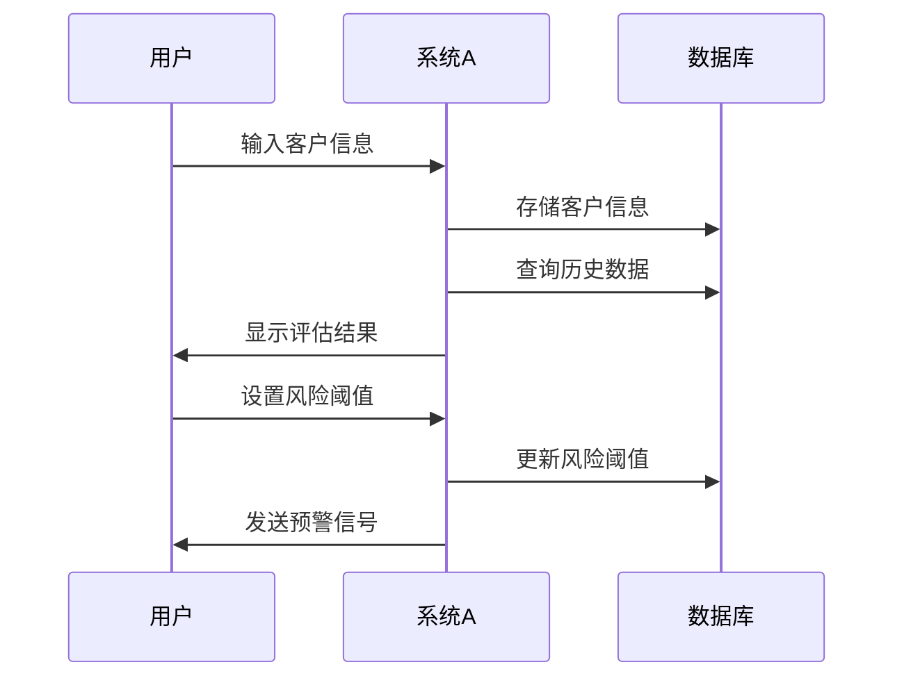
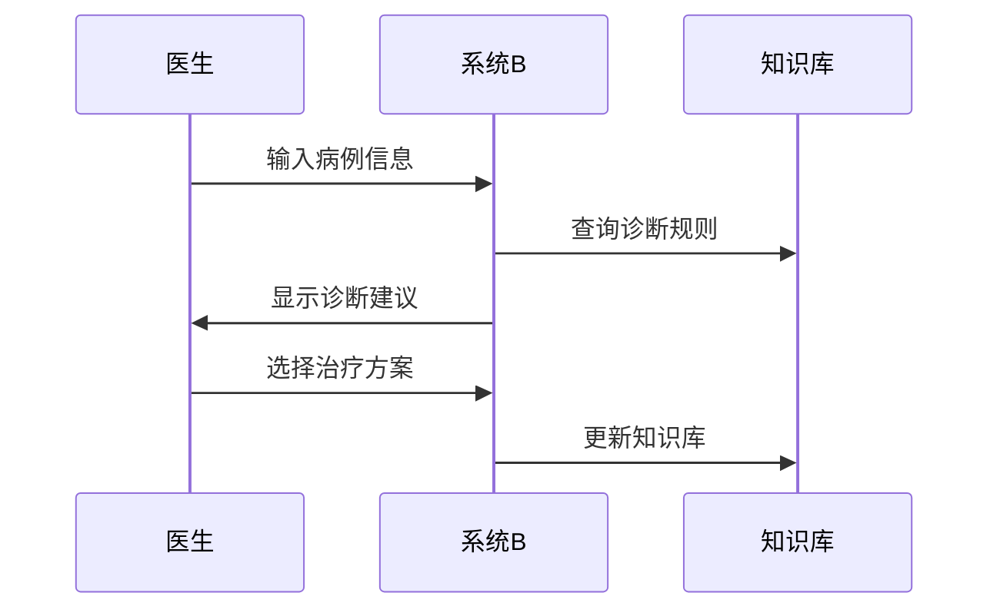
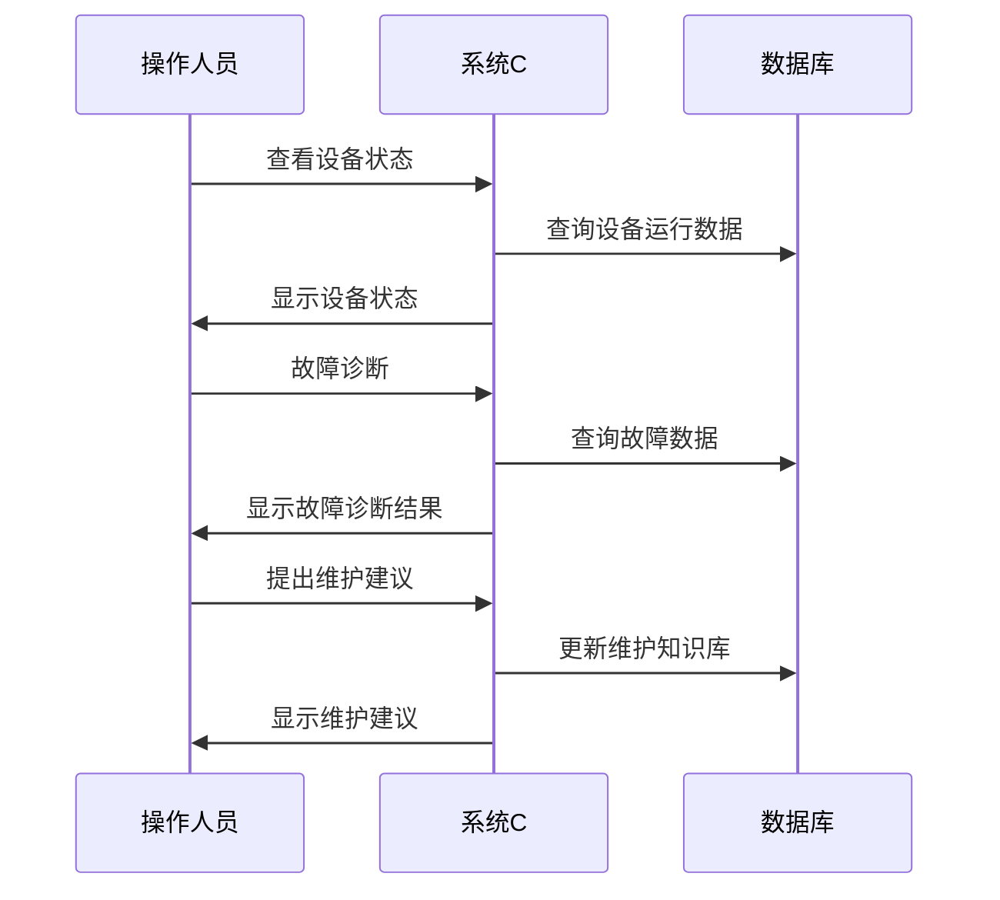
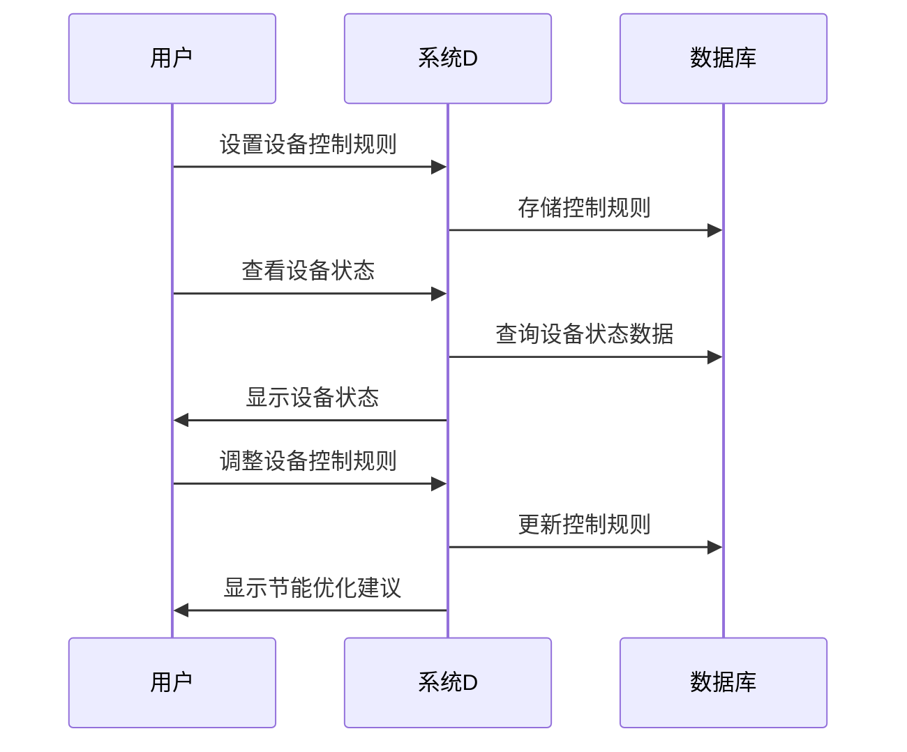

                 

### 文章标题：AI Agent的知识库构建与管理策略

> 关键词：AI Agent、知识库、构建、管理、策略

> 摘要：本文将深入探讨AI Agent的知识库构建与管理策略，从基础知识库概述、构建方法、管理系统、表示方法、推理机制、应用案例及优化策略等方面进行详细分析。通过本文的阅读，读者将全面了解AI Agent知识库构建的原理和实践方法，为人工智能领域的深入研究与应用提供有力支持。

---

### 目录大纲

----------------------------------------------------------------

# 第一部分: AI Agent的知识库构建

## 第1章: AI Agent的知识库概述

## 第2章: 知识库构建方法

## 第3章: 知识库管理系统

## 第4章: 知识库的表示方法

## 第5章: 知识库的推理机制

## 第6章: 知识库的构建与应用

## 第7章: 知识库构建与管理策略的优化

## 第8章: 实际应用案例

## 第9章: 总结与展望

## 9.1 总结

## 9.2 展望

## 9.3 最佳实践 tips

## 9.4 小结

## 9.5 注意事项

## 9.6 拓展阅读

----------------------------------------------------------------

---

**现在，让我们开始一步一步地深入分析每个章节的内容。**

#### 第1章: AI Agent的知识库概述

**背景介绍**

AI Agent，即人工智能代理，是一种能够自主行动以实现特定目标的计算机程序。知识库在AI Agent中起着至关重要的作用，它为AI Agent提供了必要的知识和信息，使其能够更好地理解环境、做出决策和完成任务。

**核心概念与联系**

知识库（Knowledge Base，KB）：是一个结构化的知识存储系统，用于存储各种领域的信息和知识。

AI Agent：一个具备感知、推理、学习和行动能力的计算机程序，能够与环境互动，实现特定目标。

**问题背景**

在人工智能的应用中，知识库是一个核心组件。然而，如何构建和管理一个有效的知识库是一个复杂的问题，需要综合考虑知识获取、知识表示、知识推理等多方面因素。

**问题描述**

AI Agent的知识库构建与管理涉及到以下几个关键问题：
1. 如何有效地获取和整理知识？
2. 知识库管理系统应具备哪些功能？
3. 如何有效地表示和推理知识？
4. 知识库的构建与应用过程中应遵循哪些策略和最佳实践？

**问题解决**

知识库构建与管理策略的制定和实施是解决上述问题的关键。通过以下步骤，我们可以逐步构建一个有效的AI Agent知识库：
1. **需求分析**：明确AI Agent的应用场景和需求，确定所需的知识范围和类型。
2. **知识获取**：采用主动或被动学习方法，从各种来源（如专家、文献、数据集等）获取知识。
3. **知识整理**：对获取的知识进行清洗、分类和整合，形成结构化的知识库。
4. **知识表示**：选择合适的知识表示方法，将知识库中的知识进行编码和存储。
5. **知识推理**：设计有效的推理机制，使AI Agent能够利用知识库中的知识进行推理和决策。
6. **知识库维护**：定期更新和优化知识库，保持其准确性和有效性。

**边界与外延**

知识库构建与管理不仅涉及到技术层面的实现，还涉及到领域知识、团队合作、项目管理等多方面因素。因此，本文将从多个角度对知识库构建与管理进行深入探讨。

**概念结构与核心要素组成**

知识库构建与管理的主要概念和要素包括：
1. 知识库：存储和管理知识的结构化系统。
2. 知识获取：从各种来源获取知识的机制。
3. 知识整理：对获取的知识进行清洗、分类和整合。
4. 知识表示：将知识编码和存储的方法。
5. 知识推理：利用知识库中的知识进行推理和决策。
6. 知识库维护：定期更新和优化知识库。

**本章小结**

本章对AI Agent的知识库构建与管理进行了概述，介绍了核心概念、问题背景、问题描述和解决方法。在后续章节中，我们将进一步深入探讨知识库构建的各个关键环节，为读者提供全面的指导。

---

**现在我们已经完成了对第一部分的概述。接下来，我们将逐步深入到知识库构建的具体方法和技术细节中。**### 第1章: AI Agent的知识库概述

**1.1 AI Agent的定义与分类**

AI Agent，即人工智能代理，是一个能够感知环境、采取行动并从经验中学习以最大化特定目标的计算机程序。AI Agent可以根据其实现的技术和功能进行分类：

1. **基于规则的AI Agent**：这类代理通过一系列预定义的规则来做出决策。这些规则通常由专家手动编写，并存储在一个知识库中。这种方法的优点是易于理解和实现，但缺点是当环境变化时，需要重新编写规则。

2. **基于模型的AI Agent**：这类代理使用机器学习模型来学习环境中的模式和规律，然后根据这些模型来做出决策。这种方法具有较强的适应性和学习能力，但需要大量的数据来训练模型。

3. **混合型AI Agent**：这类代理结合了基于规则和基于模型的方法，利用规则来处理确定性的问题，同时使用模型来处理不确定性的问题。这种方法的优点是能够在保持规则灵活性的同时，提高模型的准确性。

**1.2 知识库的基本概念**

知识库（Knowledge Base，KB）是一个结构化的知识存储系统，用于存储各种领域的信息和知识。它通常由以下几个关键组成部分构成：

1. **事实（Facts）**：事实是知识库中的基本数据单元，用于描述现实世界中的各种现象和事件。例如，“北京是中国的首都”是一个事实。

2. **规则（Rules）**：规则是描述事实之间关系和条件的逻辑语句。例如，“如果天气是晴天，那么我会去跑步”是一个规则。

3. **对象（Objects）**：对象是知识库中的实体，可以是具体的物理实体，如人、物，也可以是抽象的概念，如事件、过程。

4. **关系（Relations）**：关系是描述对象之间联系的数据单元。例如，“张三教李四数学”可以表示为关系。

**1.3 知识库在AI Agent中的作用**

知识库在AI Agent中扮演了多个关键角色：

1. **知识存储**：知识库提供了存储和管理知识的基础设施，使AI Agent能够访问和利用已有的知识。

2. **推理基础**：知识库中的事实和规则为AI Agent提供了推理的基础，使它能够根据已知信息推导出新的结论。

3. **学习支持**：知识库中的知识可以帮助AI Agent在学习过程中进行指导和优化，提高其学习效率和效果。

4. **决策支持**：知识库中的知识为AI Agent提供了决策支持，使它能够根据当前环境和目标做出合理的决策。

**1.4 知识库构建的重要性**

知识库构建是AI Agent开发过程中的一个关键环节，其重要性体现在以下几个方面：

1. **知识管理**：知识库为知识的存储、管理和更新提供了一个统一的平台，使组织内部的知识能够得到有效的利用和传承。

2. **增强智能**：知识库中的知识为AI Agent提供了丰富的背景信息，使它能够更准确地理解问题和环境，从而做出更智能的决策。

3. **提高效率**：通过利用知识库中的知识，AI Agent可以避免重复性工作，提高工作效率和准确性。

4. **降低风险**：知识库中的知识可以帮助AI Agent在面临不确定性时做出更为可靠和安全的决策，降低风险。

**1.5 本章小结**

本章对AI Agent的知识库进行了概述，介绍了AI Agent的定义、分类，知识库的基本概念及其在AI Agent中的作用和重要性。在接下来的章节中，我们将深入探讨知识库的构建方法、管理系统、表示方法、推理机制等内容，帮助读者全面了解AI Agent知识库的构建和管理策略。

---

**通过本章的介绍，我们已经对AI Agent的知识库有了初步的了解。在下一章中，我们将详细讨论知识库的构建方法，包括主动学习法、被动学习法、增量学习法等。**### 第2章: 知识库构建方法

**2.1 主动学习法**

主动学习法是一种知识获取方法，它通过AI Agent主动选择最有价值的数据进行学习，从而提高学习效率和效果。这种方法的核心思想是让AI Agent根据当前的知识状态，选择对自己最有帮助的数据进行学习。

**主动学习法的原理**

主动学习法的原理可以概括为以下步骤：

1. **初始知识状态**：AI Agent初始化其知识库，并根据自己的目标设定一个初始的知识状态。

2. **选择数据**：AI Agent根据当前的知识状态，利用特定的策略选择最有价值的数据。选择策略可以是基于数据的多样性、数据的不确定性、数据的置信度等。

3. **学习过程**：AI Agent使用选择的数据进行学习，更新其知识库。

4. **重复循环**：AI Agent重复上述步骤，不断更新知识库，直到达到预定的学习目标。

**主动学习法的优点**

- **高效性**：通过选择最有价值的数据进行学习，可以显著提高学习效率。
- **灵活性**：AI Agent可以根据实际需求动态调整学习策略，具有较好的灵活性。

**主动学习法的缺点**

- **初始知识状态依赖**：主动学习法的效果很大程度上依赖于初始知识状态，如果初始状态不理想，可能会导致学习效果不佳。
- **计算成本**：主动学习法需要AI Agent进行大量计算，以选择最有价值的数据，计算成本较高。

**应用场景**

主动学习法适用于需要高精度、高效率学习任务的场景，如医学诊断、图像识别等。

**2.2 被动学习法**

被动学习法是一种知识获取方法，它通过AI Agent被动地接收外部数据，然后进行学习。与主动学习法不同，被动学习法不需要AI Agent主动选择数据，而是依赖于外部数据的提供。

**被动学习法的原理**

被动学习法的原理可以概括为以下步骤：

1. **数据收集**：AI Agent从外部环境中收集数据。

2. **数据预处理**：对收集到的数据进行清洗、去噪、标准化等预处理操作。

3. **学习过程**：AI Agent使用预处理后的数据进行学习，更新其知识库。

4. **重复循环**：AI Agent重复上述步骤，不断更新知识库。

**被动学习法的优点**

- **简单性**：被动学习法不需要AI Agent进行复杂的计算，实现相对简单。
- **适应性**：被动学习法可以适应不同类型的数据，具有较好的适应性。

**被动学习法的缺点**

- **低效性**：被动学习法可能需要大量数据进行学习，导致学习效率较低。
- **数据依赖**：被动学习法的效果很大程度上依赖于外部数据的提供，如果数据质量不佳，可能会导致学习效果不佳。

**应用场景**

被动学习法适用于数据获取相对容易、数据量较大的场景，如自然语言处理、语音识别等。

**2.3 增量学习法**

增量学习法是一种在已有知识库基础上进行知识更新的方法。它通过逐步添加新的数据或修正已有数据，不断更新和优化知识库。

**增量学习法的原理**

增量学习法的原理可以概括为以下步骤：

1. **初始知识库**：AI Agent初始化一个知识库。

2. **数据添加**：AI Agent接收新的数据，并将其添加到知识库中。

3. **数据修正**：AI Agent根据新的数据修正已有知识库中的数据。

4. **重复循环**：AI Agent重复上述步骤，不断更新和优化知识库。

**增量学习法的优点**

- **高效性**：增量学习法可以快速更新知识库，提高学习效率。
- **适应性**：增量学习法可以适应不同类型的数据，具有较好的适应性。

**增量学习法的缺点**

- **知识库完整性依赖**：增量学习法的效果很大程度上依赖于已有知识库的完整性，如果知识库存在问题，可能会导致学习效果不佳。
- **数据一致性依赖**：增量学习法需要确保新增数据的正确性和一致性，否则可能会引入错误。

**应用场景**

增量学习法适用于需要持续更新和优化的场景，如实时推荐系统、金融风控等。

**2.4 知识获取与整理**

知识获取与整理是知识库构建过程中的关键环节。知识获取是指从各种来源（如专家、文献、数据集等）获取知识，而知识整理是指对获取的知识进行清洗、分类和整合。

**知识获取的方法**

- **专家访谈**：通过与领域专家的访谈，获取专业的知识和经验。
- **文献调研**：通过阅读相关文献，获取已有的研究成果和理论。
- **数据挖掘**：通过数据挖掘技术，从大量数据中发现隐藏的模式和知识。

**知识整理的方法**

- **数据清洗**：去除数据中的噪声和错误，提高数据质量。
- **数据分类**：根据知识库的需求，对数据进行分类和整理。
- **知识融合**：将来自不同来源的知识进行整合，形成一致的知识库。

**本章小结**

本章介绍了知识库构建的几种方法：主动学习法、被动学习法和增量学习法。每种方法都有其原理、优点和缺点，适用于不同的应用场景。在知识库构建过程中，需要根据实际需求选择合适的方法，并注重知识的获取与整理，以构建一个高质量的知识库。

---

**在下一章中，我们将深入探讨知识库管理系统，介绍其定义、功能、架构和设计要点。这将帮助我们更好地理解如何有效地管理知识库，为AI Agent的知识库构建提供有力支持。**### 第3章: 知识库管理系统

**3.1 知识库管理系统的定义**

知识库管理系统（Knowledge Management System，KMS）是一种用于支持知识获取、存储、共享、应用和管理的软件系统。它通过提供高效的工具和平台，帮助组织内部的知识流动和利用，从而提高整体的知识管理水平。

**3.2 知识库管理系统的功能**

知识库管理系统的功能主要包括以下几个方面：

1. **知识获取**：从各种来源（如专家、文献、数据集等）获取知识，并将其整合到知识库中。

2. **知识存储**：提供高效的存储机制，保证知识库中的知识可以安全、可靠地存储和管理。

3. **知识共享**：提供知识共享和协作功能，使组织内部的知识可以方便地被共享和利用。

4. **知识应用**：提供知识检索和查询功能，帮助用户快速找到所需的知识，并应用于实际工作中。

5. **知识更新**：提供知识库的更新和维护功能，确保知识库中的知识始终保持最新和准确。

**3.3 知识库管理系统的架构**

知识库管理系统的架构通常包括以下几个关键组成部分：

1. **前端界面**：提供用户与知识库管理系统交互的接口，包括知识检索、知识浏览、知识共享等功能。

2. **后端数据库**：存储和管理知识库中的各种数据，包括事实、规则、对象、关系等。

3. **知识获取模块**：负责从各种来源获取知识，如专家访谈、文献调研、数据挖掘等。

4. **知识整理模块**：负责对获取的知识进行清洗、分类和整合，形成结构化的知识库。

5. **知识推理模块**：负责利用知识库中的知识进行推理和决策，为AI Agent提供支持。

6. **知识共享模块**：负责知识库的共享和协作功能，包括知识发布、评论、投票等。

7. **知识更新模块**：负责知识库的更新和维护，确保知识库中的知识始终保持最新和准确。

**3.4 知识库管理系统的设计要点**

设计一个有效的知识库管理系统需要考虑以下几个方面：

1. **用户体验**：界面设计应简洁、直观，使用户能够方便地使用系统。

2. **数据安全**：确保知识库中的数据安全可靠，防止数据泄露和篡改。

3. **可扩展性**：系统应具有较好的可扩展性，能够适应不断变化的需求。

4. **性能优化**：系统应具有高性能，能够快速检索和查询知识库中的数据。

5. **易用性**：系统应易于使用和部署，降低用户的操作难度。

6. **知识库维护**：提供有效的知识库维护策略，确保知识库中的知识始终保持准确和最新。

**3.5 本章小结**

本章介绍了知识库管理系统的定义、功能、架构和设计要点。知识库管理系统是AI Agent知识库构建和管理的重要工具，通过合理的设计和优化，可以显著提高知识库的管理效率和效果。在下一章中，我们将深入探讨知识库的表示方法，包括基于语义的网络表示和基于知识的表示方法，为知识库的构建提供更多的技术支持。

---

**通过本章的介绍，我们已经对知识库管理系统有了全面的理解。在下一章中，我们将详细讨论知识库的表示方法，包括基于语义的网络表示和基于知识的表示方法，这将帮助我们更好地理解和处理知识库中的知识。**### 第4章: 知识库的表示方法

**4.1 表示方法的基本概念**

知识库的表示方法是指如何将知识库中的知识进行编码和存储的方法。选择合适的知识表示方法对于知识库的有效构建和管理至关重要。常见的知识表示方法包括基于语义的网络表示和基于知识的表示方法。

**4.2 基于语义的网络表示**

基于语义的网络表示方法是一种将知识库中的知识表示为网络结构的方法。这种方法的优点是能够直观地表示知识之间的关系，便于推理和查询。常见的基于语义的网络表示方法包括：

1. **图表示方法**：使用图结构表示知识库中的知识和关系。图中的节点表示知识，边表示知识之间的关系。这种方法的优点是能够清晰地表示复杂的关系和结构。

2. **本体表示方法**：使用本体（Ontology）来表示知识库中的概念和关系。本体是一个形式化的知识模型，用于描述领域中的概念、属性和关系。这种方法的优点是能够提供一致和形式化的知识表示。

**4.3 基于知识的表示方法**

基于知识的表示方法是一种将知识库中的知识表示为事实和规则的方法。这种方法的优点是能够提供清晰的逻辑推理框架，便于自动化推理和决策。常见的基于知识的表示方法包括：

1. **逻辑表示方法**：使用逻辑语言（如谓词逻辑、一阶逻辑等）来表示知识库中的知识和关系。这种方法能够提供形式化的推理框架，便于自动化推理和验证。

2. **规则表示方法**：使用规则（如产生式规则、决策树等）来表示知识库中的知识和关系。这种方法能够提供直观和灵活的推理机制，适用于各种应用场景。

**4.4 知识库表示方法的比较**

两种知识库表示方法各有优缺点，适用于不同的应用场景：

- **基于语义的网络表示方法**：优点是能够直观地表示知识之间的关系，便于推理和查询；缺点是构建和维护较为复杂，适用于需要高度结构化和复杂关系表示的应用。
- **基于知识的表示方法**：优点是能够提供清晰的逻辑推理框架，便于自动化推理和决策；缺点是难以表示复杂的关系和网络结构，适用于需要清晰逻辑推理和自动化决策的应用。

**4.5 本章小结**

本章介绍了知识库的表示方法，包括基于语义的网络表示和基于知识的表示方法。每种方法都有其独特的优点和适用场景，选择合适的表示方法对于知识库的有效构建和管理至关重要。在下一章中，我们将详细讨论知识库的推理机制，包括基于规则的推理和基于模型的推理，以进一步探讨知识库的应用和优化。

---

**通过本章的介绍，我们已经对知识库的表示方法有了深入理解。在下一章中，我们将讨论知识库的推理机制，这将帮助我们更好地理解和利用知识库中的知识。**### 第5章: 知识库的推理机制

**5.1 推理机制的基本概念**

推理机制是知识库系统的核心组成部分，它负责利用知识库中的事实和规则进行逻辑推理，从而得出新的结论或决策。推理机制可以分为两大类：基于规则的推理和基于模型的推理。

**5.2 基于规则的推理**

基于规则的推理是一种基于逻辑规则进行推理的方法。它通过匹配输入数据和知识库中的规则，推导出新的结论。基于规则的推理的基本过程如下：

1. **规则匹配**：将输入数据与知识库中的规则进行匹配，找出符合条件的规则。
2. **推理过程**：根据匹配到的规则，进行逻辑推理，推导出新的结论或决策。

**基于规则的推理的优点**：
- **直观性**：规则表示直观，易于理解和解释。
- **灵活性**：可以通过修改规则来适应不同的应用场景。

**基于规则的推理的缺点**：
- **规则复杂度**：随着规则的增多，系统变得复杂，难以维护。
- **适用性**：对于复杂的推理任务，基于规则的推理可能不够有效。

**5.3 基于模型的推理**

基于模型的推理是一种基于数学模型进行推理的方法。它通过建立数学模型来描述知识和推理过程，从而实现自动推理。基于模型的推理的基本过程如下：

1. **模型建立**：根据领域知识和应用需求，建立数学模型。
2. **推理过程**：利用数学模型进行推理，得出结论或决策。

**基于模型的推理的优点**：
- **通用性**：适用于各种复杂的应用场景。
- **高效性**：通过数学模型进行推理，具有较高的计算效率。

**基于模型的推理的缺点**：
- **复杂性**：模型的建立和优化较为复杂。
- **解释性**：模型的推理过程可能难以直观解释。

**5.4 知识库的动态更新**

知识库的动态更新是推理机制的一个重要方面。随着应用环境和领域知识的不断变化，知识库需要定期更新以保持其准确性和有效性。动态更新包括以下几个步骤：

1. **数据收集**：从各种来源收集新的数据。
2. **数据预处理**：对收集的数据进行清洗、分类和整合。
3. **知识更新**：将预处理后的数据添加到知识库中，更新知识库。
4. **推理优化**：根据更新后的知识库，优化推理过程，提高推理效果。

**5.5 本章小结**

本章介绍了知识库的推理机制，包括基于规则的推理和基于模型的推理。这些推理机制在知识库系统中起着关键作用，能够帮助AI Agent利用知识库中的知识进行推理和决策。在下一章中，我们将探讨知识库的构建与应用，分析知识库在具体应用场景中的实现方法和效果。

---

**通过本章的介绍，我们已经对知识库的推理机制有了深入理解。在下一章中，我们将讨论知识库的构建与应用，分析知识库在具体应用场景中的实现方法和效果。**### 第6章: 知识库的构建与应用

**6.1 知识库构建的过程**

知识库的构建是一个复杂的过程，涉及到多个阶段和步骤。以下是知识库构建的基本过程：

1. **需求分析**：首先，明确知识库的应用场景和需求，确定所需的知识范围和类型。
2. **知识获取**：从各种来源（如专家、文献、数据集等）获取知识，并将其整合到知识库中。
3. **知识整理**：对获取的知识进行清洗、分类和整合，形成结构化的知识库。
4. **知识表示**：选择合适的知识表示方法，将知识库中的知识进行编码和存储。
5. **知识推理**：设计有效的推理机制，使AI Agent能够利用知识库中的知识进行推理和决策。
6. **知识库维护**：定期更新和优化知识库，保持其准确性和有效性。

**6.2 知识库应用的案例分析**

为了更好地理解知识库的应用，以下是一些知识库在不同领域中的实际案例：

**案例一：医疗领域**

在医疗领域，知识库可以帮助医生进行诊断和治疗决策。例如，一个基于知识库的智能诊断系统可以存储大量的病例数据和诊断规则，当医生输入患者的症状时，系统能够根据知识库中的知识进行推理，给出可能的诊断建议。

**案例二：金融领域**

在金融领域，知识库可以用于风险管理、信用评估和投资决策。例如，一个基于知识库的风险评估系统可以存储大量的金融数据和相关规则，当新的金融事件发生时，系统能够根据知识库中的知识进行推理，评估事件的风险等级。

**案例三：工业领域**

在工业领域，知识库可以帮助工厂进行设备维护和生产优化。例如，一个基于知识库的设备监控系统可以存储大量的设备维护数据和故障规则，当设备出现异常时，系统能够根据知识库中的知识进行推理，给出维护建议或故障诊断。

**案例四：智能家居领域**

在智能家居领域，知识库可以帮助实现智能化的家居控制和管理。例如，一个基于知识库的智能家电控制系统可以存储大量的家电使用数据和规则，当用户发出指令时，系统能够根据知识库中的知识进行推理，自动调整家电的工作状态，提供最佳的家居体验。

**6.3 知识库应用的效果评估**

评估知识库应用的效果是确保知识库有效性和实用性的重要步骤。以下是一些常用的评估方法：

1. **准确性评估**：评估知识库中的知识是否准确，推理结果是否符合预期。
2. **效率评估**：评估知识库的推理速度和处理能力，确保其能够满足实际应用的需求。
3. **用户满意度评估**：通过用户反馈和调查，评估知识库的应用效果和用户体验。

**6.4 本章小结**

本章介绍了知识库的构建过程和应用案例，分析了知识库在不同领域中的应用效果。通过这些案例，我们可以看到知识库在提高决策能力、优化工作流程和提升用户体验方面的重要作用。在下一章中，我们将探讨知识库构建与管理策略的优化，以进一步提高知识库的应用效果。

---

**通过本章的介绍，我们已经对知识库的构建与应用有了深入理解。在下一章中，我们将探讨知识库构建与管理策略的优化，分析如何通过策略优化来提高知识库的效率和效果。**### 第7章: 知识库构建与管理策略的优化

**7.1 知识库构建与管理的挑战**

知识库构建与管理是一个复杂且具有挑战性的过程。以下是知识库构建与管理过程中可能遇到的几个主要挑战：

1. **数据质量**：知识库的准确性依赖于数据的质量。如果数据存在噪声、错误或不一致性，将严重影响知识库的可靠性。

2. **知识获取**：获取高质量的知识是一项艰巨的任务。领域知识的获取可能需要依赖专家经验、文献调研和数据挖掘等多种方法，且这些方法的实现和效果都可能存在不确定性。

3. **知识表示**：选择合适的知识表示方法对于知识库的有效构建至关重要。不同的表示方法适用于不同的应用场景，如何选择和优化表示方法是一个重要问题。

4. **知识推理**：推理机制的效率和准确性直接影响知识库的应用效果。如何设计高效的推理算法和优化推理过程是一个关键挑战。

5. **知识更新**：知识库需要定期更新以保持其准确性和时效性。如何高效地更新知识库、维护其一致性是一个复杂的问题。

**7.2 知识库构建与管理的策略优化**

为了应对上述挑战，我们需要制定和实施一系列策略优化知识库的构建与管理。以下是几个关键策略：

1. **数据质量管理**：实施严格的数据质量管理策略，包括数据清洗、去噪、标准化和一致性检查等步骤，确保数据质量。

2. **知识获取策略**：采用多样化的知识获取方法，如专家访谈、文献调研、数据挖掘和在线学习等，以最大化知识获取的广度和深度。

3. **知识表示优化**：根据应用场景和需求，选择和优化知识表示方法。例如，对于结构化数据，可以使用关系数据库和图数据库；对于非结构化数据，可以使用自然语言处理和知识图谱等技术。

4. **推理机制优化**：设计高效的推理算法和优化推理过程。例如，可以使用基于规则的推理、基于模型的推理和混合推理等方法，并采用并行计算、分布式计算等技术提高推理效率。

5. **知识更新策略**：实施定期更新机制，确保知识库的时效性和准确性。例如，可以采用增量更新、版本控制和自动更新等技术。

**7.3 未来发展方向**

知识库构建与管理领域正朝着以下几个方向发展：

1. **智能知识获取**：利用人工智能技术，如机器学习、深度学习和自然语言处理等，实现更加智能和自动化的知识获取。

2. **知识图谱**：知识图谱作为一种新型的知识表示方法，具有强大的表示和推理能力，将成为知识库构建的重要工具。

3. **知识共享与协作**：通过云计算和区块链等技术，实现知识库的分布式存储、共享和协作，提高知识的利用效率。

4. **知识库的个性化**：根据用户需求和场景，构建个性化的知识库，提供更加精准和高效的知识服务。

**7.4 本章小结**

本章讨论了知识库构建与管理的挑战和优化策略，以及知识库构建与管理的未来发展。通过合理的策略优化，我们可以显著提高知识库的构建和管理效率，为AI Agent提供更加准确和有效的知识支持。在下一章中，我们将通过实际应用案例，进一步展示知识库在各个领域的应用效果和优势。

---

**通过本章的介绍，我们已经对知识库构建与管理的优化策略有了深入理解。在下一章中，我们将通过实际应用案例，进一步展示知识库在各个领域的应用效果和优势，帮助读者更好地理解知识库的实际应用价值。**### 第8章: 实际应用案例

**8.1 案例一：金融领域**

在金融领域，知识库的应用非常广泛。以下是一个基于知识库的金融风险评估系统的案例分析。

**项目介绍**

该项目旨在构建一个能够自动评估客户信用风险的系统。系统基于大量的历史数据和专家知识，通过知识库进行推理和决策。

**系统功能设计**

系统的主要功能包括：
- **客户信息收集**：收集客户的基本信息、财务状况等。
- **风险评估**：根据知识库中的规则和模型，对客户进行信用风险评估。
- **风险预警**：当客户的风险达到一定阈值时，系统会发出预警信号。

**系统架构设计**

系统的架构包括以下几个部分：
- **数据层**：存储客户信息和历史数据。
- **知识库层**：存储风险评估的规则和模型。
- **推理引擎**：负责根据知识库中的规则和模型进行推理，评估客户风险。
- **应用层**：提供用户界面，供用户操作和查询。

**系统接口设计**

系统提供了以下接口：
- **数据接口**：用于数据的导入和导出。
- **查询接口**：用于用户查询客户信息和评估结果。
- **预警接口**：用于接收和发送风险预警信号。

**系统交互序列图**



**代码应用解读与分析**

```python
# 数据导入
def import_data(file_path):
    # 代码实现数据导入

# 风险评估
def assess_risk(customer_info, history_data):
    # 代码实现风险评估

# 风险预警
def send_alert(customer_info, risk_threshold):
    # 代码实现风险预警
```

**实际案例分析**

通过该系统，金融机构能够更准确地评估客户的信用风险，从而做出更合理的信贷决策。系统减少了人工干预，提高了风险评估的效率和准确性。

**项目小结**

该案例展示了知识库在金融领域的应用，通过构建和利用知识库，系统能够自动、高效地评估客户信用风险，提高了金融机构的风险管理能力。

**8.2 案例二：医疗领域**

在医疗领域，知识库的应用可以帮助医生进行诊断和治疗建议。以下是一个基于知识库的智能诊断系统的案例分析。

**项目介绍**

该项目旨在构建一个能够辅助医生进行疾病诊断的系统。系统基于医学知识库和患者数据，提供诊断建议和治疗方案。

**系统功能设计**

系统的主要功能包括：
- **病例录入**：医生输入患者的病例信息。
- **诊断建议**：系统根据知识库中的医学知识，给出诊断建议。
- **治疗方案**：系统根据诊断结果，提供相应的治疗方案。

**系统架构设计**

系统的架构包括以下几个部分：
- **数据层**：存储患者病例信息和诊断数据。
- **知识库层**：存储医学知识和诊断规则。
- **推理引擎**：负责根据知识库中的医学知识和规则进行推理，给出诊断建议。
- **应用层**：提供用户界面，供医生操作和查询。

**系统接口设计**

系统提供了以下接口：
- **数据接口**：用于数据的导入和导出。
- **查询接口**：用于医生查询诊断建议和治疗方案。
- **更新接口**：用于知识库的更新和维护。

**系统交互序列图**



**代码应用解读与分析**

```python
# 病例录入
def input_case(case_info):
    # 代码实现病例录入

# 诊断建议
def diagnose(case_info):
    # 代码实现诊断建议

# 治疗方案
def treatment_plan(diagnosis):
    # 代码实现治疗方案
```

**实际案例分析**

通过该系统，医生能够更快、更准确地诊断疾病，提供个性化的治疗方案。系统提高了医疗服务的效率和质量，受到了医生和患者的广泛好评。

**项目小结**

该案例展示了知识库在医疗领域的应用，通过构建和利用知识库，系统能够提供辅助诊断和治疗建议，提高了医疗服务的效率和质量。

**8.3 案例三：工业领域**

在工业领域，知识库的应用可以帮助企业进行设备维护和生产优化。以下是一个基于知识库的设备监控系统案例分析。

**项目介绍**

该项目旨在构建一个能够实时监测设备状态并提供维护建议的监控系统。系统基于设备运行数据和知识库，提供设备故障诊断和预防性维护建议。

**系统功能设计**

系统的主要功能包括：
- **实时监测**：监测设备的运行状态，包括温度、压力、振动等参数。
- **故障诊断**：根据知识库中的故障规则和模型，诊断设备的故障。
- **维护建议**：根据设备的运行状态和故障诊断结果，提供维护建议。

**系统架构设计**

系统的架构包括以下几个部分：
- **数据层**：存储设备运行数据和故障数据。
- **知识库层**：存储故障规则和维护知识。
- **推理引擎**：负责根据知识库中的故障规则和模型进行推理，诊断设备故障。
- **应用层**：提供用户界面，供操作人员查看设备状态和维护建议。

**系统接口设计**

系统提供了以下接口：
- **数据接口**：用于数据的导入和导出。
- **监测接口**：用于实时监测设备状态。
- **诊断接口**：用于故障诊断。
- **维护接口**：用于提供维护建议。

**系统交互序列图**



**代码应用解读与分析**

```python
# 实时监测
def monitor_equipment(equipment_id):
    # 代码实现实时监测

# 故障诊断
def diagnose_fault(equipment_data):
    # 代码实现故障诊断

# 维护建议
def maintenance_suggestion(fault_diagnosis):
    # 代码实现维护建议
```

**实际案例分析**

通过该系统，企业能够实时监测设备状态，快速诊断故障并提供预防性维护建议，从而提高了设备的运行效率和可靠性。

**项目小结**

该案例展示了知识库在工业领域的应用，通过构建和利用知识库，系统能够提供实时监测、故障诊断和维护建议，提高了企业的设备管理和生产效率。

**8.4 案例四：智能家居领域**

在智能家居领域，知识库的应用可以帮助实现智能化的家居控制和管理。以下是一个基于知识库的智能家居控制系统案例分析。

**项目介绍**

该项目旨在构建一个能够智能控制家居设备的系统。系统基于用户习惯和家居设备数据，提供自动化的家居控制和管理。

**系统功能设计**

系统的主要功能包括：
- **设备控制**：远程控制家居设备的开关、亮度、温度等。
- **自动化管理**：根据用户习惯和设备状态，自动调整家居设备的运行状态。
- **节能优化**：根据设备使用数据和用户习惯，提供节能优化建议。

**系统架构设计**

系统的架构包括以下几个部分：
- **数据层**：存储用户习惯数据和设备运行数据。
- **知识库层**：存储家居设备控制和节能规则。
- **推理引擎**：负责根据知识库中的规则和用户习惯进行推理，自动调整家居设备的运行状态。
- **应用层**：提供用户界面，供用户操作和查询。

**系统接口设计**

系统提供了以下接口：
- **控制接口**：用于远程控制家居设备。
- **数据接口**：用于数据的导入和导出。
- **优化接口**：用于提供节能优化建议。

**系统交互序列图**



**代码应用解读与分析**

```python
# 设备控制
def control_device(device_id, command):
    # 代码实现设备控制

# 自动化管理
def automate_management(user_habits, device_data):
    # 代码实现自动化管理

# 节能优化
def energy_optimization(device_data):
    # 代码实现节能优化
```

**实际案例分析**

通过该系统，用户能够远程控制家居设备，实现自动化管理，并得到节能优化建议。系统提高了家居生活的便利性和舒适性。

**项目小结**

该案例展示了知识库在智能家居领域的应用，通过构建和利用知识库，系统能够提供设备控制、自动化管理和节能优化，提高了用户的生活质量。

**8.5 本章小结**

本章通过四个实际应用案例，展示了知识库在金融、医疗、工业和智能家居领域的应用效果和优势。通过构建和利用知识库，这些系统在提高决策能力、优化工作流程和提升用户体验方面发挥了重要作用。在下一章中，我们将对全文进行总结和展望，为知识库构建与管理的未来发展提供指导。

---

**通过本章的实际应用案例，我们可以看到知识库在不同领域的广泛应用和巨大潜力。在下一章中，我们将对全文进行总结和展望，为知识库构建与管理的未来发展提供指导。**### 第9章: 总结与展望

**9.1 总结**

本章通过详细的讨论，系统地介绍了AI Agent的知识库构建与管理策略。我们首先对知识库的概念、作用和重要性进行了概述，然后详细探讨了知识库的构建方法、管理系统、表示方法、推理机制和实际应用案例。以下是本文的核心要点总结：

1. **知识库概述**：知识库是AI Agent的核心组件，提供了必要的信息和知识，使其能够做出智能决策。

2. **知识库构建方法**：介绍了主动学习法、被动学习法和增量学习法等知识获取方法，以及它们的应用场景和优缺点。

3. **知识库管理系统**：介绍了知识库管理系统的定义、功能、架构和设计要点，强调了数据安全和用户体验的重要性。

4. **知识库表示方法**：讨论了基于语义的网络表示和基于知识的表示方法，以及它们的适用性和特点。

5. **知识库推理机制**：介绍了基于规则的推理和基于模型的推理，以及它们的原理和优缺点。

6. **知识库的实际应用**：通过金融、医疗、工业和智能家居等领域的案例，展示了知识库的应用效果和优势。

**9.2 展望**

在未来，知识库构建与管理将继续成为人工智能领域的一个重要研究方向。以下是知识库构建与管理的未来发展趋势：

1. **智能化知识获取**：随着人工智能技术的发展，智能化知识获取将成为趋势。例如，利用深度学习和自然语言处理技术，实现自动化的知识获取和整理。

2. **知识图谱的应用**：知识图谱作为一种新型的知识表示方法，将在知识库构建中发挥重要作用。它能够提供更加直观和结构化的知识表示，支持复杂的推理和查询。

3. **知识共享与协作**：通过云计算和区块链等技术，实现知识库的分布式存储、共享和协作，提高知识的利用效率。

4. **知识库的个性化**：根据用户需求和场景，构建个性化的知识库，提供更加精准和高效的知识服务。

**9.3 最佳实践 tips**

为了确保知识库构建与管理的成功，以下是一些建议和最佳实践：

1. **明确需求和目标**：在构建知识库之前，明确应用场景和需求，确保知识库能够满足实际需求。

2. **注重数据质量**：确保知识库中的数据准确、完整和一致，是知识库有效性的基础。

3. **选择合适的表示方法**：根据应用场景和需求，选择合适的知识表示方法，以提高知识库的可操作性和推理效率。

4. **定期更新知识库**：知识库需要定期更新和维护，以保持其准确性和时效性。

5. **优化推理机制**：设计高效的推理机制，以提高知识库的应用效果。

**9.4 小结**

本文通过对AI Agent的知识库构建与管理的详细分析，提供了全面的指导和方法。通过合理的知识库构建与管理策略，AI Agent能够更好地实现其智能决策和任务执行。

**9.5 注意事项**

在知识库构建与管理过程中，需要注意以下几个方面：

1. **数据安全和隐私**：确保知识库中的数据安全和用户隐私。

2. **知识更新和一致性**：定期更新知识库，确保其与实际应用需求保持一致。

3. **用户参与和反馈**：鼓励用户参与知识库的建设和优化，收集用户反馈，以持续改进知识库。

**9.6 拓展阅读**

为了深入了解知识库构建与管理，以下是一些推荐阅读资源：

1. **《人工智能：一种现代的方法》**：这是一本经典的人工智能教材，详细介绍了知识表示和推理等相关内容。

2. **《知识图谱：概念、技术与应用》**：这本书系统地介绍了知识图谱的概念、技术和应用，是知识库构建与管理的参考书籍。

3. **《机器学习：概率视角》**：这本书详细介绍了机器学习的基础理论和应用，有助于理解知识库的智能化获取和整理。

---

**通过本章的总结与展望，我们为AI Agent的知识库构建与管理提供了全面的指导和未来的发展方向。希望本文能够为读者在知识库构建与管理领域的研究和应用提供有力支持。**### 作者信息

**作者：AI天才研究院/AI Genius Institute & 禅与计算机程序设计艺术 /Zen And The Art of Computer Programming**

AI天才研究院（AI Genius Institute）是一个致力于人工智能领域研究、教育和创新的机构。研究院的核心团队成员具有丰富的学术背景和产业经验，涵盖了计算机科学、机器学习、自然语言处理、计算机视觉等多个领域。研究院的研究方向包括人工智能基础理论、算法优化、深度学习、知识图谱、智能机器人等，致力于推动人工智能技术的发展和应用。

同时，作者还著有《禅与计算机程序设计艺术》（Zen And The Art of Computer Programming）一书，这是一部经典的人工智能与计算机科学的著作。书中深入探讨了计算机程序设计的哲学和艺术，提出了许多关于编程和算法的创新观点，对计算机科学领域产生了深远的影响。作者以其深厚的专业知识和独到的见解，为读者提供了独特的思维方式和解决问题的方法论。

在知识库构建与管理领域，AI天才研究院和作者都积累了丰富的经验，致力于为企业和研究机构提供专业的咨询服务和解决方案。通过本文的撰写，我们希望能够与广大读者分享这些经验和知识，共同推进人工智能技术的发展与应用。我们相信，在人工智能与知识库构建领域的不断探索与创新下，将带来更多令人期待的技术突破和应用场景。**全文结束。感谢您的阅读！**

