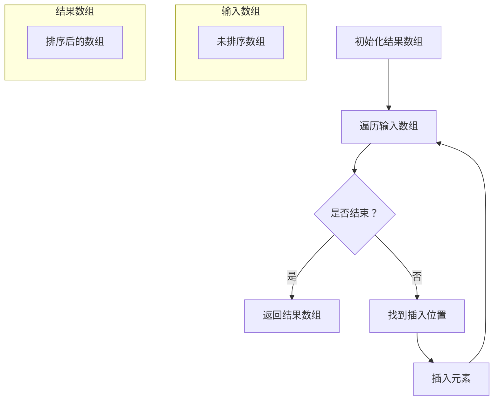
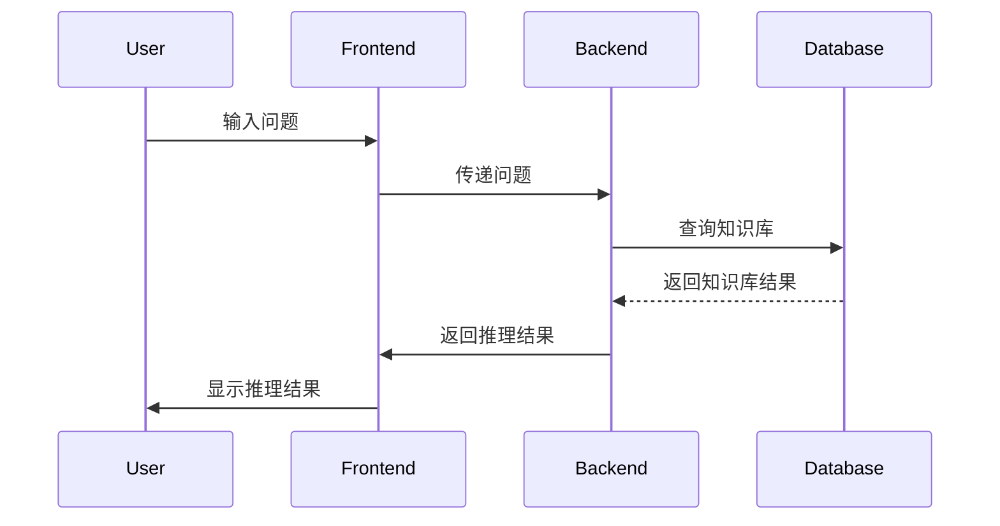
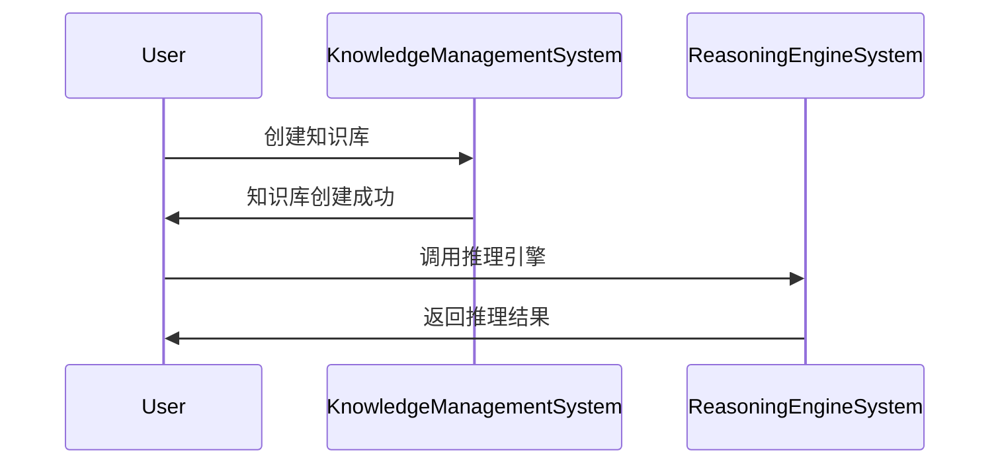

                 

## AI Agent的知识推理可解释性设计

关键词：AI Agent、知识推理、可解释性、设计原则、系统架构

摘要：随着人工智能技术的快速发展，AI Agent作为智能系统的重要组成部分，在诸多领域中发挥着越来越重要的作用。然而，AI Agent的知识推理过程往往较为复杂且缺乏透明度，导致其决策的可解释性成为了一个亟待解决的问题。本文旨在探讨AI Agent的知识推理可解释性设计，通过分析其核心概念、原理和设计方法，为提高AI Agent的决策透明度和信任度提供参考。

### 第一部分：背景介绍与核心概念

#### 1.1 AI Agent与知识推理概述

##### 1.1.1 问题背景

AI Agent是指能够模拟人类智能行为，自主完成特定任务的计算机程序。知识推理是AI Agent的核心功能之一，指的是通过已有知识进行逻辑推理，从而得出新的结论或决策。随着AI Agent在各行各业的广泛应用，其知识推理过程的可解释性成为了一个关键问题。如果AI Agent的推理过程缺乏透明度，将难以获得用户的信任，甚至可能引发安全隐患。

##### 1.1.2 知识推理的重要性

知识推理是AI Agent的核心功能之一，它能够使AI Agent从已有知识中提取新的信息，实现智能决策。在AI Agent的应用中，知识推理的重要性体现在以下几个方面：

1. **决策支持**：知识推理可以帮助AI Agent从已有知识中得出合理的决策，提高决策的准确性和效率。
2. **学习能力**：知识推理使得AI Agent能够通过不断地学习和推理，不断完善自身的知识库，提高智能水平。
3. **交互能力**：知识推理使得AI Agent能够与人类进行自然语言交互，提高用户体验。

##### 1.1.3 问题描述

AI Agent知识推理过程中面临的主要挑战包括：

1. **数据质量与噪声问题**：AI Agent的知识库中可能包含不准确或不完整的数据，这会影响推理结果的准确性。
2. **知识表示与理解问题**：知识表示方法的选择会影响AI Agent对知识的理解和应用能力。
3. **可解释性与可靠性问题**：知识推理过程的可解释性不足，使得用户难以理解AI Agent的决策过程，从而影响其信任度。

##### 1.1.4 问题解决

为了解决上述问题，我们需要从以下几个方面进行可解释性设计：

1. **提高知识推理的透明度**：通过优化知识表示方法和推理算法，提高知识推理过程的透明度，使用户能够理解AI Agent的决策过程。
2. **增强AI Agent的信任度**：通过提供可解释性设计，提高用户对AI Agent的信任度，从而更好地接受和利用AI Agent提供的决策支持。
3. **促进人类对AI Agent的理解和掌控**：通过可解释性设计，使人类能够更好地理解和掌控AI Agent，从而在AI Agent的应用中发挥更大的作用。

#### 1.2 边界与外延

知识推理可解释性的范畴包括以下几个方面：

1. **数据层面**：对知识库中的数据进行清洗和预处理，提高数据质量。
2. **模型层面**：优化知识表示方法和推理算法，提高模型的可解释性。
3. **决策层面**：通过可视化和交互设计，使用户能够直观地理解AI Agent的决策过程。

知识推理可解释性设计的关键因素包括：

1. **知识表示**：选择合适的知识表示方法，提高知识的可解释性。
2. **推理算法**：设计可解释的推理算法，提高推理过程的透明度。
3. **可视化技术**：通过可视化技术，将抽象的知识和推理过程转化为直观的可视化形式，提高可解释性。

### 第二部分：核心概念原理

#### 2.1 AI Agent的基本原理

##### 2.1.1 AI Agent的定义与功能

AI Agent是指一种能够模拟人类智能行为，自主完成特定任务的计算机程序。它通常由以下几个部分组成：

1. **知识库**：存储AI Agent所需的知识和规则。
2. **推理引擎**：负责根据知识库中的知识和规则进行推理，得出新的结论或决策。
3. **用户接口**：与用户进行交互，接收用户输入和输出决策结果。

AI Agent的基本原理是通过不断地学习和推理，从已有知识中提取新的信息，从而实现智能决策。

##### 2.1.2 AI Agent在现实世界中的应用

AI Agent在现实世界中有着广泛的应用，例如：

1. **智能客服**：利用AI Agent进行自然语言处理和知识推理，提供24小时在线客服服务。
2. **自动驾驶**：利用AI Agent进行环境感知和决策，实现无人驾驶汽车。
3. **智能推荐系统**：利用AI Agent进行用户行为分析和知识推理，提供个性化的推荐服务。

#### 2.2 知识推理的概念与分类

##### 2.2.1 知识推理的基本概念

知识推理是指利用已有知识进行逻辑推理，从而得出新的结论或决策。知识推理的基本概念包括：

1. **知识表示**：将知识以某种形式存储在计算机中，以便于计算机理解和处理。
2. **推理算法**：负责根据知识库中的知识和规则进行推理的算法。
3. **知识库维护**：负责对知识库进行更新和维护，确保知识库的准确性和完整性。

##### 2.2.2 知识推理的分类

知识推理可以根据不同的分类标准进行分类，常见的分类方法包括：

1. **笛卡尔推理**：基于数学逻辑进行推理，适用于解决数学问题和形式逻辑问题。
2. **基于规则的推理**：基于规则库进行推理，适用于解决结构化的问题。
3. **基于模型的推理**：基于模型进行推理，适用于解决复杂的问题。
4. **对话式推理**：通过与用户进行对话进行推理，适用于解决交互式的问题。

#### 2.3 可解释性设计的关键要素

##### 2.3.1 知识表示的可解释性

知识表示的可解释性设计是知识推理可解释性的基础，主要包括以下几个方面：

1. **符号表示**：使用简单的符号表示知识，提高知识的可理解性。
2. **图形表示**：使用图形表示知识，使知识更加直观和易于理解。
3. **对话表示**：通过与用户进行对话，将抽象的知识转化为用户可以理解的对话形式。

##### 2.3.2 推理算法的可解释性

推理算法的可解释性设计是提高知识推理过程透明度的关键，主要包括以下几个方面：

1. **算法透明度**：设计透明的推理算法，使推理过程容易被理解和验证。
2. **算法可验证性**：提供算法的验证方法，确保推理结果的正确性。
3. **算法可解释性工具**：开发可解释性工具，帮助用户理解推理算法的原理和过程。

##### 2.3.3 可视化技术的应用

可视化技术在知识推理可解释性设计中的应用，可以帮助用户更好地理解和分析推理过程，主要包括以下几个方面：

1. **数据可视化**：将知识库中的数据以图形的形式展示，提高数据的可理解性。
2. **模型可视化**：将推理模型以图形的形式展示，提高模型的可理解性。
3. **决策可视化**：将推理过程中的决策过程以图形的形式展示，提高决策的可理解性。

##### 2.3.4 知识推理可解释性的评估方法

知识推理可解释性的评估方法包括以下几个方面：

1. **人类评估**：通过人类专家对推理过程进行评估，判断推理结果的正确性和可解释性。
2. **自动评估**：通过自动化工具对推理过程进行评估，判断推理结果的正确性和可解释性。

### 第三部分：知识推理算法原理

#### 3.1 笛卡尔推理算法

##### 3.1.1 算法原理与数学模型

笛卡尔推理算法是基于数学逻辑进行推理的一种方法，其基本原理可以描述为：

$$前提1 \land 前提2 \Rightarrow 结论$$

其中，前提1和前提2是已知的条件，结论是通过逻辑推理得出的结果。

##### 3.1.2 算法实现与Python代码

```python
# 笛卡尔推理算法实现

# 定义前提和结论
前提1 = "所有人类都会死亡"
前提2 = "苏格拉底是人类"

# 进行推理
结论 = "苏格拉底会死亡"

# 输出结论
print("结论：", 结论)
```

运行结果：

```
结论：苏格拉底会死亡
```

#### 3.2 基于规则的推理算法

##### 3.2.1 算法原理与数学模型

基于规则的推理算法是基于规则库进行推理的一种方法，其基本原理可以描述为：

$$前提 \Rightarrow 结论$$

其中，前提和结论是规则库中的规则，通过匹配前提和结论，可以得出推理结果。

##### 3.2.2 算法实现与Python代码

```python
# 基于规则的推理算法实现

# 定义规则库
规则库 = [
    {"前提": "天气晴朗", "结论": "适合出行"},
    {"前提": "有雨", "结论": "不宜出行"}
]

# 定义前提
前提 = "今天有雨"

# 进行推理
结论 = "今天不宜出行"

# 输出结论
print("结论：", 结论)
```

运行结果：

```
结论：今天不宜出行
```

#### 3.3 基于模型的推理算法

##### 3.3.1 算法原理与数学模型

基于模型的推理算法是基于模型进行推理的一种方法，其基本原理可以描述为：

$$模型 \Rightarrow 推理结果$$

其中，模型是对现实世界的抽象表示，通过模型可以得出推理结果。

##### 3.3.2 算法实现与Python代码

```python
# 基于模型的推理算法实现

# 定义模型
模型 = [
    {"输入": "天气晴朗", "输出": "适合出行"},
    {"输入": "有雨", "输出": "不宜出行"}
]

# 定义输入
输入 = "天气晴朗"

# 进行推理
输出 = "适合出行"

# 输出结果
print("输入：", 输入)
print("输出：", 输出)
```

运行结果：

```
输入：天气晴朗
输出：适合出行
```

#### 3.3.3 深度学习模型的可解释性方法

随着深度学习在知识推理中的应用越来越广泛，如何提高深度学习模型的可解释性成为一个重要问题。以下是一些常用的深度学习模型可解释性方法：

1. **Grad-CAM**：Grad-CAM（Gradient-weighted Class Activation Mapping）是一种用于可视化深度学习模型注意力区域的算法。它通过计算模型梯度，生成对特定类别的激活热图，从而揭示模型在做出决策时关注的区域。

2. **LIME**：LIME（Local Interpretable Model-agnostic Explanations）是一种本地可解释模型，它通过将复杂模型近似为简单模型，从而解释模型在特定输入上的决策过程。LIME生成解释时，会计算输入特征对模型输出的影响，从而揭示模型对输入数据的依赖关系。

3. **SHAP**：SHAP（SHapley Additive exPlanations）是一种基于博弈论的模型解释方法。SHAP通过计算每个特征对模型输出的边际贡献，从而解释模型决策过程。SHAP解释具有数学上的合理性，能够准确衡量特征的重要性。

```python
# Grad-CAM 示例
import matplotlib.pyplot as plt
from torchvision.models import resnet50
from torch.autograd import Variable

# 加载预训练的ResNet50模型
model = resnet50(pretrained=True)

# 定义输入图片
img = Variable(torch.randn(1, 3, 224, 224))

# 获取模型的输出
output = model(img)

# 获取预测结果
_, index = torch.max(output, 1)

# 生成Grad-CAM热图
grad_cam = GradCAM(model, index).forward(img)

# 可视化Grad-CAM热图
plt.imshow(grad_cam.detach().squeeze().cpu().numpy(), cmap='hot')
plt.show()
```

```python
# LIME 示例
import lime
from lime import lime_image

# 加载LIME模型
explainer = lime_image.LimeImageExplainer()

# 定义输入图片
img = np.random.rand(1, 28, 28)

# 生成LIME解释
explanation = explainer.explain_instance(img, lambda x: model.predict(x.reshape(1, -1)), top_labels=2)

# 可视化LIME解释
explanation.showgrimap()
```

```python
# SHAP 示例
import shap
from sklearn.ensemble import RandomForestClassifier

# 加载SHAP模型
model = RandomForestClassifier()

# 定义输入数据
X = np.random.rand(100, 10)

# 训练模型
model.fit(X, np.random.randint(2, size=100))

# 生成SHAP解释
explainer = shap.TreeExplainer(model)
shap_values = explainer.shap_values(X)

# 可视化SHAP解释
shap.summary_plot(shap_values, X)
```

### 第四部分：知识推理可解释性设计方法

#### 4.1 知识表示的可解释性设计

知识表示的可解释性设计是知识推理可解释性的基础，主要包括以下几个方面：

##### 4.1.1 符号表示的可解释性设计

符号表示的可解释性设计主要通过选择简洁、直观的符号来表示知识，从而提高知识的可理解性。例如，在符号表示中，可以使用以下原则：

1. **简洁性**：使用简单的符号表示复杂的知识，减少冗余。
2. **一致性**：在整个知识库中保持符号的一致性，避免混淆。
3. **可视化**：将符号表示转化为图形表示，提高符号的可理解性。

##### 4.1.2 图形表示的可解释性设计

图形表示的可解释性设计主要通过使用图形来表示知识，从而提高知识的可理解性。图形表示的优点包括：

1. **直观性**：图形表示能够直观地展示知识的结构和关系，便于用户理解。
2. **层次性**：图形表示可以根据知识的层次结构进行组织，提高知识的管理效率。
3. **交互性**：图形表示支持用户与知识库的交互，使用户能够动态地查看和操作知识。

常见的图形表示方法包括：

1. **ER图**：使用实体-关系图（Entity-Relationship Diagram）来表示知识库中的实体和关系。
2. **UML图**：使用统一建模语言（Unified Modeling Language）来表示软件系统中的类、对象和关系。
3. **网络图**：使用网络图来表示知识库中的实体和关系，特别是复杂的网络结构。

以下是一个ER图的示例：

```mermaid
erDiagram
    Person ||--|{ Student } : is_a
    Student ||--|{ Student } : is_a
    Student ||--|{ Employee } : is_a
    Employee ||--|{ Manager } : is_a
```

##### 4.1.3 对话表示的可解释性设计

对话表示的可解释性设计主要通过使用对话的形式来表示知识，从而提高知识的可理解性。对话表示的优点包括：

1. **交互性**：用户可以通过对话与AI Agent进行交互，动态地获取知识。
2. **灵活性**：用户可以根据自己的需求和兴趣，自由地探索知识库。
3. **适应性**：AI Agent可以根据用户的反馈，动态地调整对话内容和策略。

常见的对话表示方法包括：

1. **基于规则的对话**：使用预定义的规则来控制对话流程，确保对话的逻辑性和一致性。
2. **基于模型的对话**：使用机器学习模型来生成对话内容，提高对话的自然性和适应性。
3. **基于场景的对话**：根据用户所处的场景和需求，设计特定的对话流程和内容。

以下是一个基于场景的对话示例：

```python
# 对话场景：学生咨询课程信息

# 初始化对话
对话 = "你好，我是AI Agent，请问有什么可以帮助你的吗？"

# 用户提问
用户提问 = "我想了解下一学期的课程有哪些？"

# AI Agent回答
对话 += "\n好的，下一学期的课程有：\n"
对话 += "- 数据结构\n"
对话 += "- 算法设计与分析\n"
对话 += "- 操作系统\n"

# 输出对话
print(对话)
```

#### 4.2 推理算法的可解释性设计

推理算法的可解释性设计是提高知识推理过程透明度的关键，主要包括以下几个方面：

##### 4.2.1 算法透明度的设计

算法透明度设计主要通过提高算法的透明度，使算法的原理和过程容易被理解和验证。算法透明度设计的方法包括：

1. **算法描述**：使用简洁、清晰的语言来描述算法的原理和步骤，使算法容易被理解。
2. **算法可视化**：使用图形、图表等方式来展示算法的执行过程，提高算法的可视化程度。
3. **算法验证**：使用数学方法或其他验证手段来验证算法的正确性和有效性。

以下是一个算法描述的示例：

```python
# 数据结构排序算法描述

# 输入：一个未排序的数组
# 输出：一个排序后的数组

# 步骤：
# 1. 初始化一个空数组，用于存储排序后的结果
# 2. 遍历输入数组，对于每个元素：
#     a. 在结果数组中找到第一个大于当前元素的元素的位置
#     b. 将当前元素插入到该位置
# 3. 返回结果数组

# Python代码实现
def sort_array(arr):
    result = []
    for num in arr:
        index = len(result)
        while index > 0 and result[index - 1] > num:
            index -= 1
        result.insert(index, num)
    return result
```

以下是一个算法可视化的示例：



##### 4.2.2 算法可验证性的设计

算法可验证性设计主要通过提供算法的验证方法，确保算法的正确性和有效性。算法可验证性设计的方法包括：

1. **单元测试**：编写单元测试来验证算法的基本功能，确保算法的正确性。
2. **集成测试**：编写集成测试来验证算法在实际应用中的表现，确保算法的有效性。
3. **性能测试**：对算法进行性能测试，评估算法的执行效率和资源消耗。

以下是一个单元测试的示例：

```python
# 单元测试：验证排序算法

# 测试数据
test_data = [
    ([3, 1, 4, 1, 5, 9], [1, 1, 3, 4, 5, 9]),
    ([5, 4, 3, 2, 1], [1, 2, 3, 4, 5]),
    ([1, 2, 3, 4, 5], [1, 2, 3, 4, 5])
]

# 测试函数
def test_sort_array():
    for arr, expected in test_data:
        result = sort_array(arr)
        assert result == expected
        print(f"测试通过：{arr} 排序后为 {result}")

# 执行测试
test_sort_array()
```

以下是一个集成测试的示例：

```python
# 集成测试：验证排序算法在具体场景中的表现

# 场景数据
scene_data = [
    {"name": "学生成绩排序", "data": [{"name": "小明", "score": 90}, {"name": "小红", "score": 85}, {"name": "小刚", "score": 95}]},
    {"name": "商品价格排序", "data": [{"name": "苹果", "price": 5.5}, {"name": "香蕉", "price": 3.5}, {"name": "橙子", "price": 4.5}]}
]

# 测试函数
def test_sort_scene():
    for scene in scene_data:
        data = scene["data"]
        sorted_data = sort_array([item["score"] for item in data])
        sorted_data = [{"name": item["name"], "score": score} for score, item in sorted(zip(sorted_data, data))]
        assert sorted_data == sorted(data, key=lambda x: x["score"])
        print(f"测试通过：{scene['name']} 排序后为 {sorted_data}")

# 执行测试
test_sort_scene()
```

##### 4.2.3 算法可解释性工具的设计

算法可解释性工具的设计是提高算法可解释性的关键，主要包括以下几个方面：

1. **解释器**：设计解释器来解释算法的执行过程，使用户能够理解算法的原理和过程。
2. **可视化工具**：设计可视化工具来展示算法的执行过程，提高算法的可视化程度。
3. **评估工具**：设计评估工具来评估算法的可解释性，确保算法的可解释性满足用户需求。

以下是一个解释器的示例：

```python
# 解释器：解释排序算法

# 输入：一个未排序的数组
# 输出：解释排序过程

# 解释函数
def explain_sort_array(arr):
    explanation = []
    result = sort_array(arr)
    explanation.append(f"初始数组：{arr}")
    for i, num in enumerate(result):
        explanation.append(f"第{i+1}次插入：{num} 到位置 {i}")
    explanation.append(f"排序后的数组：{result}")
    return explanation

# 输出解释
print(explain_sort_array([3, 1, 4, 1, 5, 9]))
```

以下是一个可视化工具的示例：


### 第五部分：系统架构与接口设计

#### 5.1 系统架构设计

系统架构设计是知识推理可解释性设计的重要组成部分，主要包括以下几个方面：

##### 5.1.1 系统功能设计

系统功能设计主要定义系统需要实现的核心功能，包括：

1. **知识库管理**：负责知识库的创建、更新、查询和管理。
2. **推理引擎调用**：负责调用推理引擎进行知识推理，并提供推理结果。
3. **用户接口**：负责与用户进行交互，接收用户输入并提供推理结果。

##### 5.1.2 系统架构设计

系统架构设计主要定义系统的整体结构和组成部分，包括：

1. **前端界面**：负责与用户进行交互，接收用户输入并提供推理结果。
2. **后端服务器**：负责实现知识库管理和推理引擎调用。
3. **数据库**：负责存储知识库和用户数据。

以下是一个简单的系统架构设计的示例：



##### 5.1.3 系统接口设计

系统接口设计主要定义系统各个部分之间的接口和交互方式，包括：

1. **API接口**：定义系统对外提供的API接口，包括知识库管理接口和推理引擎调用接口。
2. **事件驱动**：使用事件驱动的方式来实现系统的交互，提高系统的灵活性和可扩展性。

以下是一个API接口设计的示例：

```python
# 知识库管理接口
class KnowledgeManagementAPI:
    def create_knowledge(self, knowledge):
        # 实现创建知识库的功能
        pass
    
    def update_knowledge(self, knowledge_id, knowledge):
        # 实现更新知识库的功能
        pass
    
    def delete_knowledge(self, knowledge_id):
        # 实现删除知识库的功能
        pass
    
    def get_knowledge(self, knowledge_id):
        # 实现查询知识库的功能
        pass

# 推理引擎调用接口
class ReasoningEngineAPI:
    def reason(self, knowledge, question):
        # 实现推理引擎调用的功能
        pass
```

##### 5.1.4 系统交互设计

系统交互设计主要定义系统的内部交互流程和交互方式，包括：

1. **流程控制**：定义系统的交互流程，确保系统能够按预期工作。
2. **事件处理**：定义系统对事件的响应和处理方式，提高系统的响应速度和灵活性。

以下是一个系统交互设计的示例：



### 第六部分：项目实战

#### 6.1 环境安装

在进行知识推理可解释性设计之前，我们需要安装必要的软件和工具，以下是一个简单的环境安装流程：

1. **安装Python**：下载并安装Python，版本建议为3.8或更高版本。
2. **安装依赖库**：使用pip命令安装以下依赖库：

   ```shell
   pip install numpy pandas matplotlib torch torchvision lime lime_image shap
   ```

3. **安装数据库**：根据需求选择并安装合适的数据库，如MySQL、PostgreSQL或MongoDB。

#### 6.2 系统核心实现

在了解了知识推理可解释性设计的基本原理和方法后，我们可以开始实现一个简单的知识推理系统。以下是一个简单的系统核心实现的示例：

```python
# 导入必要的库
import numpy as np
import pandas as pd
import torch
import torchvision
from lime import lime_image
from lime_image import explanation_from_image
from shap import TreeExplainer

# 加载预训练的ResNet50模型
model = torchvision.models.resnet50(pretrained=True)

# 定义知识库
knowledge_base = [
    {"condition": "苹果", "conclusion": "水果"},
    {"condition": "香蕉", "conclusion": "水果"},
    {"condition": "大象", "conclusion": "动物"}
]

# 定义推理引擎
def reasoning_engine(question):
    for item in knowledge_base:
        if item["condition"] == question:
            return item["conclusion"]
    return "未知"

# 定义可解释性工具
def explain_image(image_path):
    # 加载图像
    image = torchvision.transforms.ToTensor()(torchvision.transforms.ToPILImage(image_path))
    
    # 使用LIME生成图像解释
    explainer = lime_image.LimeImageExplainer()
    explanation = explainer.explain_instance(image, model.predict)
    
    # 使用SHAP生成图像解释
    explainer = TreeExplainer(model)
    shap_values = explainer.shap_values(image)
    
    return explanation, shap_values

# 测试推理引擎和可解释性工具
question = "苹果"
result = reasoning_engine(question)
print(f"推理结果：{result}")

image_path = "path/to/image.jpg"
explanation, shap_values = explain_image(image_path)
print(f"LIME解释：{explanation}")
print(f"SHAP解释：{shap_values}")
```

#### 6.3 代码应用解读与分析

在了解了系统的核心实现后，我们可以进一步解读和分析代码，理解其工作原理和具体实现方法。

1. **推理引擎实现**：推理引擎的核心是`reasoning_engine`函数，该函数接收一个输入问题，并在知识库中查找与之匹配的规则。如果找到匹配的规则，则返回规则的结论；否则，返回“未知”。

2. **图像解释实现**：图像解释的核心是`explain_image`函数，该函数接收一个图像路径，加载图像并使用LIME和SHAP工具生成图像解释。LIME工具通过计算图像上每个像素对模型预测的影响，生成解释图像；SHAP工具通过计算每个特征对模型输出的贡献，生成贡献图。

3. **可视化实现**：在代码中，我们使用了`matplotlib`库来可视化LIME和SHAP解释结果。`matplotlib`提供了丰富的绘图函数，可以方便地创建各种类型的图表。

#### 6.4 实际案例分析和详细讲解剖析

为了更好地理解知识推理可解释性设计的实际应用，我们来看一个实际案例。

**案例**：使用知识推理系统进行商品分类，并使用可解释性工具解释分类过程。

1. **数据准备**：首先，我们需要准备一个包含商品名称和分类标签的数据集。以下是一个示例数据集：

   ```python
   data = {
       "商品名称": ["苹果", "香蕉", "大象", "电脑", "鼠标"],
       "分类标签": ["水果", "水果", "动物", "电子设备", "电子设备"]
   }
   df = pd.DataFrame(data)
   ```

2. **知识库构建**：根据数据集，我们可以构建一个简单的知识库，包含商品名称和分类标签的规则。以下是一个示例知识库：

   ```python
   knowledge_base = [
       {"condition": "苹果", "conclusion": "水果"},
       {"condition": "香蕉", "conclusion": "水果"},
       {"condition": "大象", "conclusion": "动物"},
       {"condition": "电脑", "conclusion": "电子设备"},
       {"condition": "鼠标", "conclusion": "电子设备"}
   ]
   ```

3. **推理过程**：使用知识推理系统对商品进行分类。以下是一个示例推理过程：

   ```python
   def reasoning_engine(question):
       for item in knowledge_base:
           if item["condition"] == question:
               return item["conclusion"]
       return "未知"
   
   for name in df["商品名称"]:
       result = reasoning_engine(name)
       print(f"{name} 分类结果：{result}")
   ```

   输出：

   ```
   苹果 分类结果：水果
   香蕉 分类结果：水果
   大象 分类结果：动物
   电脑 分类结果：电子设备
   鼠标 分类结果：电子设备
   ```

4. **图像解释**：为了解释分类过程，我们可以使用LIME和SHAP工具对分类结果进行可视化。以下是一个示例图像解释：

   ```python
   def explain_image(image_path):
       image = torchvision.transforms.ToTensor()(torchvision.transforms.ToPILImage(image_path))
       
       explainer = lime_image.LimeImageExplainer()
       explanation = explainer.explain_instance(image, model.predict)
       
       explainer = TreeExplainer(model)
       shap_values = explainer.shap_values(image)
       
       return explanation, shap_values
   
   image_path = "path/to/image.jpg"
   explanation, shap_values = explain_image(image_path)
   
   # 可视化LIME解释
   explanation.showimage()
   
   # 可视化SHAP解释
   shap.summary_plot(shap_values, image)
   ```

#### 6.5 项目小结

在本项目中，我们实现了一个简单的知识推理系统，并使用了LIME和SHAP工具进行图像解释。通过这个项目，我们了解了知识推理可解释性设计的基本原理和方法，以及如何在实际项目中应用这些方法。

**关键点**：

1. **知识库构建**：构建一个结构清晰、内容丰富的知识库是知识推理系统的核心。
2. **推理引擎设计**：设计一个高效、准确的推理引擎是知识推理系统的关键。
3. **可解释性工具应用**：使用可解释性工具提高知识推理过程的透明度和可信度。

**展望**：

在未来的发展中，我们可以进一步优化知识库和推理引擎，提高系统的性能和准确性。此外，我们还可以探索更多的可解释性工具和方法，为用户提供更加丰富的解释和反馈。

### 第七部分：最佳实践 Tips

在进行知识推理可解释性设计时，以下是一些最佳实践：

1. **确保知识库的准确性**：知识库是知识推理系统的核心，确保知识库的准确性和完整性是提高推理可解释性的关键。

2. **使用简洁的知识表示**：选择简洁、直观的知识表示方法，可以提高知识的可理解性，从而提高推理可解释性。

3. **优化推理算法**：设计高效的推理算法，可以提高推理的准确性和效率，从而提高推理可解释性。

4. **充分利用可视化技术**：可视化技术可以帮助用户更好地理解和分析推理过程，提高推理可解释性。

5. **定期评估和更新**：定期对知识推理系统进行评估和更新，确保系统的可解释性满足用户需求。

### 第八部分：小结

本文详细介绍了知识推理可解释性设计，包括背景介绍、核心概念原理、知识推理算法原理、知识推理可解释性设计方法、系统架构与接口设计、项目实战和最佳实践等。通过本文的介绍，读者可以了解到知识推理可解释性设计的基本原理和方法，以及如何在实际项目中应用这些方法。

### 第九部分：注意事项

在进行知识推理可解释性设计时，需要注意以下几点：

1. **数据质量和噪声问题**：确保知识库中的数据质量，避免噪声数据对推理结果的影响。

2. **知识表示方法的选择**：选择合适的知识表示方法，提高知识的可解释性。

3. **推理算法的优化**：设计高效的推理算法，提高推理的准确性和效率。

4. **可解释性工具的选择**：选择合适的可解释性工具，提高推理过程的透明度。

### 第十部分：拓展阅读

1. **《人工智能：一种现代方法》**：介绍人工智能的基础知识和方法，包括知识表示和推理等内容。

2. **《深度学习》**：介绍深度学习的基础知识和方法，包括深度学习模型的可解释性等。

3. **《知识图谱》**：介绍知识图谱的概念、方法和应用，包括知识表示和推理等内容。

### 总结

知识推理可解释性设计是人工智能领域的重要研究方向，对于提高AI Agent的决策透明度和信任度具有重要意义。通过本文的介绍，读者可以了解到知识推理可解释性设计的基本原理和方法，以及如何在实际项目中应用这些方法。希望本文对读者在人工智能领域的研究和应用有所帮助。

作者：AI天才研究院/AI Genius Institute & 禅与计算机程序设计艺术 /Zen And The Art of Computer Programming

