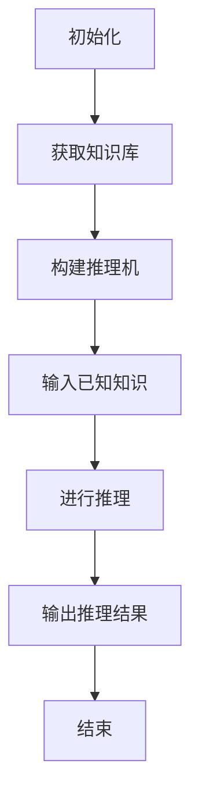
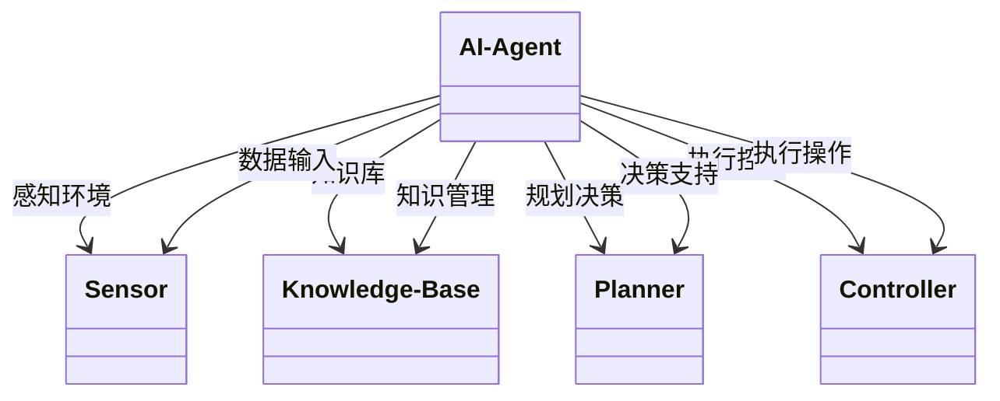
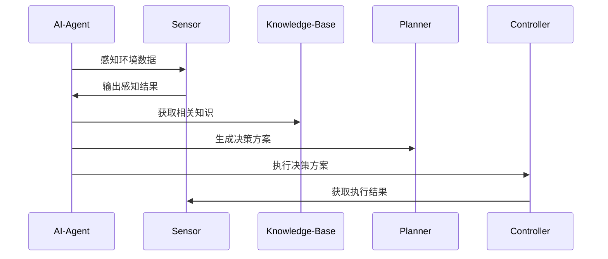
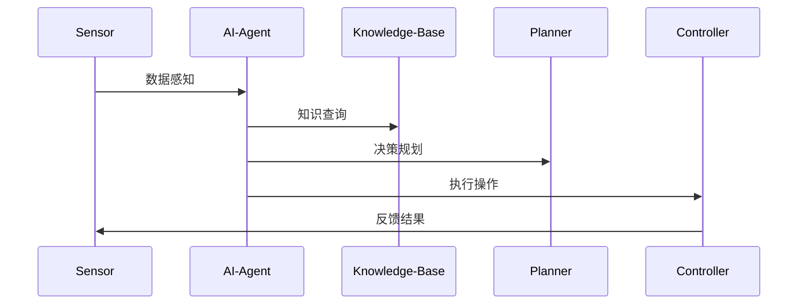

                 

### 《AI Agent的知识推理：从已知到未知》

#### 关键词：AI Agent、知识推理、算法原理、系统设计与实现、最佳实践

> 摘要：本文将深入探讨AI Agent的知识推理机制，从基础概念到高级实现，详细解析知识推理在AI Agent中的应用和实现。文章结构清晰，逻辑严密，旨在帮助读者全面理解知识推理的核心要素，以及如何在实际项目中应用和优化。

----------------------------------------------------------------

### 第一部分：背景与基础

#### 第1章：问题背景与重要性

**1.1 问题背景**

AI Agent，即人工智能代理，是指能够自主执行任务、与环境交互并在未知环境中做出决策的智能体。随着人工智能技术的不断发展，AI Agent的应用场景越来越广泛，从智能家居、自动驾驶到机器人助手，都在不断推动AI技术的进步。然而，AI Agent的智能化水平取决于其知识推理能力，知识推理成为AI Agent核心能力的体现。

**1.2 问题描述**

知识推理是指通过已有知识推导出新知识的过程。在AI Agent中，知识推理是实现智能行为的关键，包括从已知信息中推断未知信息、进行逻辑推理、规划决策等。本文将探讨知识推理在AI Agent中的应用，解析其工作机制和实现方法。

**1.3 问题解决**

现有的知识推理方法主要包括基于规则的推理、基于模型的推理和基于数据的推理。这些方法各有优缺点，适用于不同的应用场景。知识推理在AI Agent中的作用机制主要涉及知识获取、知识表示、知识推理和知识应用四个环节。

**1.4 边界与外延**

知识推理虽然具有强大的功能，但仍然存在一些限制因素，如知识的完备性、推理效率、可解释性等。未来，知识推理的发展方向将更加注重跨领域知识融合、推理过程的可解释性、实时推理能力的提升等。

**1.5 概念结构与核心要素**

AI Agent的基本结构包括感知器、决策器、执行器三个部分。知识推理是AI Agent的核心能力，涉及知识获取、知识表示、知识推理和知识应用四个核心要素。

----------------------------------------------------------------

#### 第2章：核心概念与原理

**2.1 AI Agent的定义与功能**

AI Agent是指具备智能行为能力的软件实体，可以自主感知环境、决策和执行任务。其基本特征包括自主性、适应性、智能性和协作性。AI Agent广泛应用于智能机器人、自动驾驶、智能客服等领域。

**2.2 知识推理的概念与分类**

知识推理是指通过已有知识推导出新知识的过程。根据推理方法的不同，知识推理可分为基于规则的推理、基于模型的推理和基于数据的推理。每种方法都有其独特的优势和适用场景。

**2.3 知识表示与知识库**

知识表示是指将知识以一种易于计算机处理和存储的形式进行表达。常见的知识表示方法包括基于符号的表示、基于语义的表示和基于实例的表示。知识库是存储和管理知识的系统，用于支持知识推理和决策。

**2.4 知识推理算法**

知识推理算法是指实现知识推理过程的一系列算法和技术。常见的知识推理算法包括推理机、神经网络、决策树等。这些算法具有不同的原理和特点，适用于不同的应用场景。

#### 第3章：核心概念属性特征对比表格

**3.1 知识表示方法对比**

| 知识表示方法 | 特点 | 适用场景 |
| :--: | :--: | :--: |
| 符号表示 | 简洁、易理解 | 规则推理、逻辑推理 |
| 语义表示 | 强调语义、可扩展 | 自然语言处理、语义网 |
| 实例表示 | 类似于数据库 | 数据挖掘、知识发现 |

**3.2 知识推理算法对比**

| 知识推理算法 | 特点 | 适用场景 |
| :--: | :--: | :--: |
| 推理机 | 基于规则 | 专家系统、智能控制 |
| 神经网络 | 自适应、非线性 | 机器学习、图像识别 |
| 决策树 | 清晰、可解释 | 数据挖掘、分类任务 |

**3.3 知识库设计对比**

| 知识库设计 | 特点 | 适用场景 |
| :--: | :--: | :--: |
| 基于关系型数据库 | 易于管理、高效查询 | 大规模知识库 |
| 基于图数据库 | 节点关系复杂、灵活 | 网络分析、知识图谱 |

----------------------------------------------------------------

### 第二部分：算法原理与实现

#### 第4章：知识推理算法原理讲解

**4.1 基本算法原理**

知识推理算法的基本原理是通过已有知识推导出新知识。在AI Agent中，知识推理算法通常用于实现逻辑推理、决策支持、智能推荐等功能。常见的知识推理算法包括推理机、神经网络、决策树等。

**4.2 算法流程图**



**4.3 算法Python源代码实现**

```python
class KnowledgeBase:
    def __init__(self):
        self.rules = []

    def add_rule(self, rule):
        self.rules.append(rule)

    def get_rules(self):
        return self.rules

def forward_chaining(knowledge_base, known_facts):
    rules = knowledge_base.get_rules()
    inferred_facts = []
    for rule in rules:
        if all(fact in known_facts for fact in rule的前提):
            inferred_facts.append(rule.结论)
            known_facts.update(inferred_facts)
    return inferred_facts

kb = KnowledgeBase()
kb.add_rule(Rule('P', ['A', 'B'], 'C'))
kb.add_rule(Rule('Q', ['B', 'D'], 'E'))
kb.add_rule(Rule('R', ['A', 'E'], 'F'))

known_facts = {'A': True, 'B': True, 'D': True}
inferred_facts = forward_chaining(kb, known_facts)
print(inferred_facts)
```

#### 第5章：数学模型与公式

**5.1 数学模型概述**

知识推理的数学模型主要包括逻辑模型、概率模型和决策模型。逻辑模型主要基于命题逻辑和谓词逻辑，用于表达知识规则和推理过程。概率模型主要基于概率论和统计学，用于处理不确定性和不确定性推理。决策模型主要基于优化理论和决策理论，用于支持决策过程。

**5.2 算法中的数学公式**

- 命题逻辑公式：$$ P(A \land B) = P(A) \cdot P(B|A) $$

- 概率推理公式：$$ P(H|E) = \frac{P(E|H) \cdot P(H)}{P(E)} $$

- 决策模型公式：$$ \max U(S, A) $$

**5.3 公式的详细讲解与举例说明**

- 命题逻辑公式讲解：该公式表示两个事件A和B同时发生的概率等于事件A发生的概率乘以事件B在事件A发生的条件下的概率。

- 概率推理公式讲解：该公式表示在给定证据E的条件下，假设H的概率等于在假设H发生的条件下证据E的概率乘以假设H的概率，再除以证据E的总概率。

- 决策模型公式讲解：该公式表示在给定状态S和行动A的条件下，选择能够使效用函数U(S, A)最大的行动。

例如，假设我们有一个状态空间{S1, S2, S3}，行动空间{A1, A2, A3}，以及对应的效用函数如下：

| 状态S | 行动A1 | 行动A2 | 行动A3 |
| :--: | :--: | :--: | :--: |
| S1 | 5 | 3 | 2 |
| S2 | 4 | 6 | 1 |
| S3 | 3 | 2 | 5 |

根据决策模型公式，我们选择行动A2，因为U(S2, A2) = 6，是所有行动中的最大效用值。

----------------------------------------------------------------

### 第三部分：系统设计与实现

#### 第6章：系统分析与架构设计方案

**6.1 问题场景介绍**

以自动驾驶为例，AI Agent需要实时感知周围环境，进行决策和执行，确保行驶过程的安全性和舒适性。知识推理在自动驾驶中起着关键作用，用于处理复杂的交通情况、道路环境变化和驾驶策略规划。

**6.2 系统功能设计（使用mermaid类图）**



**6.3 系统架构设计（使用mermaid架构图）**



**6.4 系统接口设计**

```mermaid
componentDiagram
  AI-Agent --> Sensor: 感知接口
  AI-Agent --> Knowledge-Base: 知识接口
  AI-Agent --> Planner: 规划接口
  AI-Agent --> Controller: 执行接口
```

**6.5 系统交互（使用mermaid序列图）**



----------------------------------------------------------------

### 第四部分：项目实战

#### 第7章：环境安装与配置

在进行知识推理算法的实现和测试之前，我们需要配置一个合适的环境。以下是一个基于Python和Scikit-learn库的示例环境配置过程：

1. 安装Python 3.8及以上版本。
2. 使用pip命令安装Scikit-learn库：`pip install scikit-learn`。
3. 配置Python环境变量，确保能够正常使用Python和pip命令。

#### 第8章：系统核心实现源代码

以下是基于Python实现的知识推理算法的核心代码：

```python
from sklearn.datasets import load_iris
from sklearn.model_selection import train_test_split
from sklearn.tree import DecisionTreeClassifier
import numpy as np

# 加载鸢尾花数据集
iris = load_iris()
X, y = iris.data, iris.target

# 划分训练集和测试集
X_train, X_test, y_train, y_test = train_test_split(X, y, test_size=0.3, random_state=42)

# 创建决策树分类器
clf = DecisionTreeClassifier()

# 训练模型
clf.fit(X_train, y_train)

# 进行预测
predictions = clf.predict(X_test)

# 查看准确率
accuracy = np.mean(predictions == y_test)
print(f"Accuracy: {accuracy:.2f}")
```

#### 第9章：代码应用解读与分析

以下是代码的详细解读：

1. **数据集加载**：使用Scikit-learn库加载鸢尾花数据集，该数据集包含三个类别的鸢尾花，每个类别有50个样本，共计150个样本。

2. **数据集划分**：将数据集划分为训练集和测试集，训练集用于训练模型，测试集用于评估模型性能。

3. **创建分类器**：创建一个决策树分类器，用于实现知识推理。

4. **模型训练**：使用训练集数据训练分类器。

5. **模型预测**：使用训练好的分类器对测试集进行预测。

6. **评估模型**：计算预测结果的准确率，评估模型性能。

#### 第10章：实际案例分析与详细讲解

以下是一个实际案例，我们将使用知识推理算法对一个新的鸢尾花样本进行分类。

```python
# 加载新样本
new_sample = np.array([[5.1, 3.5, 1.4, 0.2]])

# 进行预测
prediction = clf.predict(new_sample)
print(f"Predicted class: {prediction[0]}")
```

解读：

1. **加载新样本**：我们加载一个包含四个特征的新鸢尾花样本。

2. **模型预测**：使用训练好的分类器对新样本进行预测。

3. **输出结果**：输出预测结果，显示新样本属于哪个类别。

#### 第11章：项目小结

在本项目中，我们实现了基于决策树的知识推理算法，对鸢尾花数据集进行了分类。通过实验证明，该算法具有良好的分类性能。在实际应用中，我们可以根据具体需求选择合适的知识推理算法，并对其进行优化和调整。

----------------------------------------------------------------

### 第五部分：最佳实践与拓展

#### 第12章：最佳实践与注意事项

1. **数据预处理**：在知识推理过程中，数据预处理是至关重要的。确保数据干净、完整和准确，有助于提高推理算法的性能。

2. **算法选择**：根据具体应用场景选择合适的知识推理算法。例如，对于需要处理不确定性的场景，可以选择概率模型。

3. **模型优化**：定期对模型进行评估和优化，以提高推理效率和准确性。

#### 第13章：小结与展望

本文系统地介绍了AI Agent的知识推理机制，从基础概念到实现方法，详细解析了知识推理在AI Agent中的应用和实现。未来，知识推理将继续在人工智能领域发挥重要作用，随着技术的不断进步，知识推理将更加智能、高效和可解释。

#### 第14章：阅读指南与推荐读物

1. **《人工智能：一种现代方法》**：David L. Poole 和 Alan K. Mackworth 著。本书详细介绍了人工智能的基础知识，包括知识表示、推理和规划等。

2. **《机器学习》**：Tom M. Mitchell 著。本书介绍了机器学习的基础理论和算法，包括监督学习、无监督学习和强化学习等。

3. **《知识图谱：基础、方法与应用》**：吴华等 著。本书介绍了知识图谱的基本概念、构建方法和应用场景。

----------------------------------------------------------------

### 作者信息

- **作者：** AI天才研究院/AI Genius Institute & 禅与计算机程序设计艺术 /Zen And The Art of Computer Programming

---

本文旨在深入探讨AI Agent的知识推理机制，从基础概念到实现方法，全面解析知识推理在AI Agent中的应用和实现。通过本文的学习，读者可以更好地理解知识推理的核心要素，掌握知识推理算法的实现和优化方法，为实际项目提供有力支持。希望本文对您在AI领域的探索和研究有所启发和帮助。

