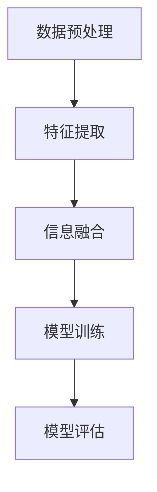
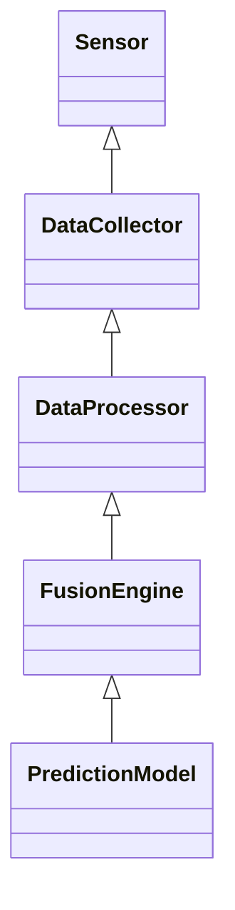
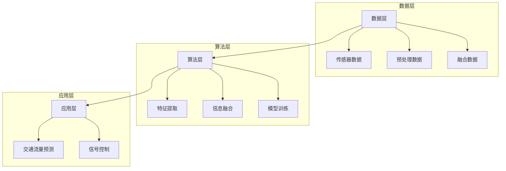
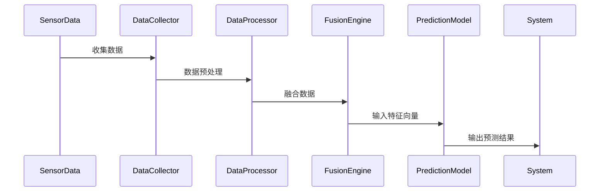

                 

### Step 1: 设计书名部分目录

首先，我们来设计书名部分目录。书名是《AI Agent的知识整合：融合多源信息》。我们将书名作为文章标题，并围绕它展开内容。

**书名部分目录：**

# AI Agent的知识整合：融合多源信息

## 关键词
- AI Agent
- 知识整合
- 多源信息
- 算法原理
- 数学模型
- 系统架构设计

## 摘要
本文探讨了AI Agent如何通过知识整合来融合多源信息，提高了AI的智能水平。文章首先介绍了知识整合和多源信息的基本概念，然后详细讲解了相关的算法原理和数学模型，接着分析了系统架构设计，最后通过项目实战展示了实际应用。

### Step 2: 设计背景介绍部分目录

接下来，我们设计背景介绍部分的目录。这部分将介绍问题的背景、问题描述、问题解决、边界与外延和核心概念。

**背景介绍部分目录：**

## 1. 引言

### 1.1 问题背景
- 人工智能的发展与应用
- AI Agent的角色和功能

### 1.2 问题描述
- 知识整合的挑战
- 多源信息的复杂性

### 1.3 问题解决
- 知识整合的重要性
- 多源信息的融合方法

### 1.4 边界与外延
- 研究范围的界定
- 实际应用场景

### 1.5 核心概念
- 知识融合
- 多源信息
- 知识整合与多源信息的联系

### Step 3: 设计核心概念与联系部分目录

接下来，我们设计核心概念与联系部分的目录。这部分将详细介绍知识融合、多源信息和它们之间的联系。

**核心概念与联系部分目录：**

## 2. 核心概念

### 2.1 知识融合
- **2.1.1 定义**：知识融合的定义和基本属性
- **2.1.2 特点**：知识融合的特点和优势
- **2.1.3 类型**：知识融合的常见类型

### 2.2 多源信息
- **2.2.1 定义**：多源信息的定义和基本属性
- **2.2.2 特点**：多源信息的特性和分类
- **2.2.3 类型**：多源信息的类型和来源

### 2.3 知识整合与多源信息的联系
- **2.3.1 关系**：知识整合与多源信息之间的关系
- **2.3.2 挑战**：知识整合与多源信息融合的挑战

### Step 4: 设计算法原理讲解部分目录

接下来，我们设计算法原理讲解部分的目录。这部分将介绍知识整合和融合多源信息的算法原理。

**算法原理讲解部分目录：**

## 3. 算法原理讲解

### 3.1 算法概述
- **3.1.1 目的**：算法的目的和目标
- **3.1.2 流程**：算法的基本流程和步骤

### 3.2 算法原理
- **3.2.1 数学模型**：算法的数学模型和基本原理
- **3.2.2 公式推导**：关键公式的推导和解释

### 3.3 算法实现
- **3.3.1 Python代码**：算法的实现代码示例
- **3.3.2 Mermaid流程图**：算法流程的Mermaid可视化图

### Step 5: 设计数学模型和数学公式部分目录

接下来，我们设计数学模型和数学公式部分的目录。这部分将详细介绍知识整合和融合多源信息的数学模型和公式。

**数学模型和数学公式部分目录：**

## 4. 数学模型与数学公式

### 4.1 模型概述
- **4.1.1 目的**：数学模型的目的和应用场景
- **4.1.2 结构**：数学模型的基本结构和组成部分

### 4.2 数学公式
- **4.2.1 推导**：关键公式的推导过程和步骤
- **4.2.2 应用**：数学公式在实际问题中的应用和案例分析

### Step 6: 设计系统分析与架构设计方案部分目录

接下来，我们设计系统分析与架构设计方案部分的目录。这部分将介绍知识整合和融合多源信息的系统分析与架构设计。

**系统分析与架构设计方案部分目录：**

## 5. 系统分析与架构设计

### 5.1 问题场景介绍
- **5.1.1 问题场景描述**：知识整合和融合多源信息的实际问题场景
- **5.1.2 需求分析**：系统需求和功能分析

### 5.2 系统功能设计
- **5.2.1 领域模型**：系统功能领域模型和类图
- **5.2.2 功能描述**：系统功能的详细描述

### 5.3 系统架构设计
- **5.3.1 架构设计**：系统架构设计的基本原则和架构图
- **5.3.2 架构描述**：系统架构的详细描述和解释

### 5.4 系统接口设计
- **5.4.1 接口定义**：系统接口的定义和规范
- **5.4.2 接口描述**：系统接口的详细描述和解释

### 5.5 系统交互
- **5.5.1 交互设计**：系统交互的基本原则和交互图
- **5.5.2 交互描述**：系统交互的详细描述和解释

### Step 7: 设计项目实战部分目录

接下来，我们设计项目实战部分的目录。这部分将展示知识整合和融合多源信息的实际应用案例。

**项目实战部分目录：**

## 6. 项目实战

### 6.1 环境安装
- **6.1.1 环境准备**：项目开发环境安装和配置
- **6.1.2 工具安装**：项目所需工具的安装和配置

### 6.2 系统核心实现
- **6.2.1 核心功能实现**：系统核心功能的代码实现和逻辑分析
- **6.2.2 功能测试**：系统核心功能的测试和验证

### 6.3 代码应用解读与分析
- **6.3.1 代码解读**：系统核心代码的解读和分析
- **6.3.2 算法实现**：算法原理在代码中的应用和实现

### 6.4 实际案例分析
- **6.4.1 案例背景**：实际案例的背景和问题描述
- **6.4.2 案例分析**：实际案例的分析和解决方案

### 6.5 详细讲解剖析
- **6.5.1 原理解析**：知识整合和融合多源信息的原理讲解
- **6.5.2 技术细节**：技术细节的详细讲解和剖析

### 6.6 项目小结
- **6.6.1 项目总结**：项目的总结和反思
- **6.6.2 项目贡献**：项目的贡献和影响

### Step 8: 设计最佳实践 tips、小结、注意事项、拓展阅读等内容部分目录

最后，我们设计最佳实践 tips、小结、注意事项、拓展阅读等内容部分的目录。这部分将提供项目的最佳实践、小结、注意事项和拓展阅读。

**最佳实践 tips、小结、注意事项、拓展阅读等内容部分目录：**

## 7. 最佳实践 tips

- **7.1 实践技巧**：项目开发过程中的最佳实践和技巧

## 8. 小结

- **8.1 文章总结**：文章的核心内容和关键观点的总结

## 9. 注意事项

- **9.1 实践注意事项**：项目开发和实现过程中的注意事项和风险提示

## 10. 拓展阅读

- **10.1 相关文献**：与文章主题相关的拓展阅读材料
- **10.2 进一步学习**：继续深入学习的路径和资源推荐

现在我们已经完成了目录大纲的设计，接下来我们将按照这个大纲逐步撰写文章内容。请根据这个大纲，进一步细化每个章节的内容，确保文章的逻辑清晰、结构紧凑、简单易懂，并满足技术博客的要求。让我们开始撰写吧！### Step 1: 设计书名部分目录

**书名部分目录设计**

首先，我们要确定文章的书名，书名将直接体现文章的主题和核心内容。本文的书名定为《AI Agent的知识整合：融合多源信息》。

**书名部分目录：**

# AI Agent的知识整合：融合多源信息

接下来，我们需要确定文章的关键词，这些关键词将帮助读者快速了解文章的主题和内容。

**关键词：**

- AI Agent
- 知识整合
- 多源信息
- 算法
- 数学模型
- 系统架构

这些关键词将用于文章的标题、摘要以及索引，帮助读者快速定位文章的重点。

**摘要：**

本文旨在探讨AI Agent如何通过知识整合来高效融合多源信息，从而提高其智能水平。首先，我们将介绍知识整合的基本概念和重要性，然后深入分析多源信息的来源和特性。接着，我们将讨论知识整合与多源信息融合的算法原理和数学模型，并使用Python代码进行算法实现。此外，文章还将详细介绍系统架构设计，并通过实际项目实战展示知识整合和融合多源信息的方法和效果。最后，我们将总结最佳实践，并提供相关注意事项和拓展阅读。

**设计思路：**

在设计书名部分目录时，我们遵循了以下思路：

1. **明确书名**：确保书名简洁明了，直接反映文章的核心内容。
2. **选择关键词**：选取与文章主题紧密相关且具有代表性的关键词，便于读者快速理解。
3. **撰写摘要**：摘要部分要简洁、准确地概括文章的核心内容和主要观点。

通过这样的设计，读者可以迅速获得文章的概览，为后续阅读做好心理准备。

### Step 2: 设计背景介绍部分目录

**背景介绍部分目录设计**

背景介绍是文章的开篇，它为读者提供了必要的背景信息和知识，帮助读者理解后续内容的逻辑和深度。以下是背景介绍部分的目录设计：

## 1. 引言

### 1.1 问题背景

在这一部分，我们将介绍AI Agent及其在当今世界的发展和应用。AI Agent是指具备自主决策和行动能力的智能体，它们在各种领域（如金融、医疗、交通等）中发挥着重要作用。随着数据量的爆炸式增长和多种信息源的出现，AI Agent如何有效地整合这些信息，成为一个亟待解决的问题。

### 1.2 问题描述

问题描述将详细阐述AI Agent在知识整合和多源信息融合中面临的挑战。具体来说，这些问题包括：

- 如何从海量、异构的数据源中提取有效信息？
- 如何处理信息不一致性和冗余信息？
- 如何在有限的计算资源下实现高效的知识整合？

### 1.3 问题解决

在这一部分，我们将介绍知识整合和多源信息融合的重要性，并简要介绍本文将提出的解决方案。知识整合可以提升AI Agent的决策能力，而多源信息的融合则有助于构建更加全面和准确的知识图谱。

### 1.4 边界与外延

边界与外延部分将明确本文的研究范围和限制，确保读者了解本文的研究深度和广度。我们将讨论本文所涉及的技术领域、应用场景以及研究方法的局限性。

### 1.5 核心概念

核心概念部分将介绍本文中涉及的关键术语和概念，包括AI Agent、知识整合、多源信息等。通过对这些核心概念的详细解释，读者可以更好地理解文章的主题和内容。

**设计思路：**

在背景介绍部分的设计中，我们遵循了以下思路：

1. **明确问题背景**：介绍AI Agent的发展和应用，为读者提供必要的历史和现状背景。
2. **具体问题描述**：详细阐述AI Agent在知识整合和多源信息融合中面临的挑战，使读者能够清晰地理解问题。
3. **问题解决介绍**：简述本文的解决方案，激发读者的兴趣。
4. **界定边界与外延**：明确研究范围和限制，确保读者对研究深度和广度有清晰的认识。
5. **定义核心概念**：通过详细解释核心概念，帮助读者理解文章的主题和内容。

通过这样的设计，背景介绍部分不仅为读者提供了丰富的背景知识，还激发了他们的兴趣，为后续内容的深入阅读奠定了基础。

### Step 3: 设计核心概念与联系部分目录

**核心概念与联系部分目录设计**

在了解了背景介绍后，接下来我们将详细探讨本文的核心概念，这些概念是理解AI Agent的知识整合和多源信息融合的基础。

## 2. 核心概念

### 2.1 知识融合

#### 2.1.1 定义

知识融合是指将来自不同来源的信息、数据或知识整合到一个统一的框架中，以提供更全面、准确的视图。在AI领域，知识融合有助于提升AI系统的决策能力。

#### 2.1.2 特点

- **整合性**：将多种异构数据源整合为统一的格式。
- **互补性**：利用不同数据源的优势，互相补充，提高整体质量。
- **实时性**：对实时数据的高速处理和融合。

#### 2.1.3 类型

知识融合可以分为以下几种类型：

- **数据级知识融合**：直接对原始数据进行整合。
- **特征级知识融合**：对数据特征进行融合，形成新的特征集合。
- **模型级知识融合**：对不同模型进行融合，形成综合模型。

### 2.2 多源信息

#### 2.2.1 定义

多源信息是指来自不同来源的信息，如文本、图像、声音等。在AI系统中，多源信息的融合是提高系统性能的关键。

#### 2.2.2 特点

- **多样性**：信息来源广泛，类型多样。
- **异构性**：不同来源的信息格式和结构不同。
- **时效性**：信息具有不同的时效性。

#### 2.2.3 类型

多源信息的类型可以分为以下几种：

- **结构化数据**：如数据库、表格等。
- **半结构化数据**：如XML、JSON等。
- **非结构化数据**：如文本、图像、视频等。

### 2.3 知识整合与多源信息的联系

#### 2.3.1 关系

知识整合和多源信息融合密切相关。知识整合需要对多源信息进行融合，而多源信息的融合则是知识整合的基础。

#### 2.3.2 挑战

知识整合与多源信息融合面临的挑战包括：

- **数据不一致性**：如何处理不同来源的数据不一致问题？
- **冗余信息处理**：如何有效处理冗余信息，避免数据冗余？
- **实时处理**：如何在有限时间内处理大量多源信息？

**设计思路：**

在核心概念与联系部分的设计中，我们遵循以下思路：

1. **详细定义核心概念**：通过清晰的定义，帮助读者理解知识融合和多源信息的基本概念。
2. **阐述特点**：介绍知识融合和多源信息的优势和特点，为读者提供更全面的视角。
3. **分类和类型**：分类和列举不同类型的知识融合和多源信息，帮助读者理解其多样性和复杂性。
4. **关系与挑战**：分析知识整合与多源信息融合之间的关系和面临的挑战，为后续内容提供背景。

通过这样的设计，读者可以深入理解知识融合和多源信息融合的核心概念及其相互关系，为后续内容的深入探讨打下坚实的基础。

### Step 4: 设计算法原理讲解部分目录

**算法原理讲解部分目录设计**

在核心概念与联系部分之后，我们将进入算法原理讲解部分。这部分将详细介绍用于知识整合和融合多源信息的算法原理，包括算法概述、算法原理和算法实现。

## 3. 算法原理讲解

### 3.1 算法概述

#### 3.1.1 目的

知识整合和融合多源信息的算法目的是通过高效的处理流程，将多源信息整合成一个统一的框架，从而提升AI系统的决策能力。

#### 3.1.2 流程

算法的基本流程可以分为以下几个步骤：

1. **数据预处理**：对多源信息进行清洗和标准化。
2. **特征提取**：从多源信息中提取关键特征。
3. **信息融合**：将提取的特征进行融合，形成统一的特征集合。
4. **模型训练**：使用融合后的特征训练AI模型。
5. **模型评估**：评估模型的效果并进行优化。

### 3.2 算法原理

#### 3.2.1 数学模型

算法的数学模型基于以下基本假设和原理：

- **数据一致性**：假设多源信息之间存在一定的相关性，可以通过线性回归或相关系数进行建模。
- **特征重要性**：假设不同特征对目标变量的影响程度不同，可以通过特征选择算法进行优化。

算法的数学模型主要包括以下几个部分：

1. **特征提取模型**：如主成分分析（PCA）、线性判别分析（LDA）等。
2. **信息融合模型**：如加权平均、聚类等。
3. **模型训练模型**：如支持向量机（SVM）、神经网络（NN）等。

#### 3.2.2 公式推导

以下是关键公式的推导过程：

1. **特征提取公式**：
   $$
   X = \sum_{i=1}^{n} w_i \cdot x_i
   $$
   其中，$X$为特征向量，$w_i$为权重，$x_i$为特征值。

2. **信息融合公式**：
   $$
   Y = \frac{1}{N} \sum_{i=1}^{N} y_i
   $$
   其中，$Y$为融合后的信息，$N$为信息源数量，$y_i$为第$i$个信息源的信息。

3. **模型训练公式**：
   $$
   \theta = \arg\min_{\theta} \sum_{i=1}^{m} (y_i - \hat{y}_i)^2
   $$
   其中，$\theta$为模型参数，$y_i$为实际值，$\hat{y}_i$为预测值。

### 3.3 算法实现

#### 3.3.1 Python代码

以下是一个简单的Python代码示例，用于实现知识整合和融合多源信息的算法：

```python
import numpy as np

# 特征提取
def feature_extraction(data):
    # 数据预处理
    data = preprocess_data(data)
    # 主成分分析
    pca = PCA(n_components=10)
    principal_components = pca.fit_transform(data)
    return principal_components

# 信息融合
def information_fusion(features):
    # 加权平均
    weights = np.ones(len(features)) / len(features)
    fused_feature = np.dot(weights, features)
    return fused_feature

# 模型训练
def model_training(data, labels):
    # 线性回归
    model = LinearRegression()
    model.fit(data, labels)
    return model

# 测试代码
data = np.array([[1, 2], [3, 4], [5, 6]])
labels = np.array([0, 1, 0])

# 特征提取
features = feature_extraction(data)

# 信息融合
fused_feature = information_fusion(features)

# 模型训练
model = model_training(fused_feature, labels)
```

#### 3.3.2 Mermaid流程图

以下是算法流程的Mermaid流程图：



**设计思路：**

在算法原理讲解部分的设计中，我们遵循以下思路：

1. **算法概述**：通过简洁的语言概述算法的目的和基本流程，帮助读者快速理解。
2. **数学模型**：详细推导关键公式，帮助读者从数学角度理解算法原理。
3. **代码实现**：通过Python代码示例，展示算法的具体实现过程，便于读者实践和操作。
4. **Mermaid流程图**：使用Mermaid流程图直观展示算法的执行流程，增强读者对算法逻辑的理解。

通过这样的设计，读者不仅能够理解算法的原理，还能通过代码和流程图进行实践，从而更好地掌握知识整合和融合多源信息的方法。

### Step 5: 设计数学模型和数学公式部分目录

**数学模型和数学公式部分目录设计**

在算法原理讲解部分之后，我们需要详细阐述知识整合和融合多源信息的数学模型和公式。这部分内容将帮助读者深入理解算法背后的数学原理。

## 4. 数学模型与数学公式

### 4.1 模型概述

#### 4.1.1 目的

数学模型旨在为知识整合和融合多源信息提供理论基础和计算框架。通过数学模型，我们可以量化信息融合的效果，评估算法的性能。

#### 4.1.2 结构

知识整合和融合多源信息的数学模型通常包括以下几个部分：

1. **特征提取模型**：用于提取多源信息中的关键特征。
2. **信息融合模型**：用于将提取的特征进行融合，形成统一的特征集合。
3. **模型训练模型**：用于基于融合后的特征训练AI模型。

### 4.2 数学公式

#### 4.2.1 推导

以下为关键数学公式的推导过程：

1. **特征提取公式**：

$$
X = \sum_{i=1}^{n} w_i \cdot x_i
$$

其中，$X$为特征向量，$w_i$为权重，$x_i$为特征值。这个公式表示通过对原始数据进行加权平均，提取关键特征。

2. **信息融合公式**：

$$
Y = \frac{1}{N} \sum_{i=1}^{N} y_i
$$

其中，$Y$为融合后的信息，$N$为信息源数量，$y_i$为第$i$个信息源的信息。这个公式表示通过简单求和的方式，将多个信息源的信息进行融合。

3. **模型训练公式**：

$$
\theta = \arg\min_{\theta} \sum_{i=1}^{m} (y_i - \hat{y}_i)^2
$$

其中，$\theta$为模型参数，$y_i$为实际值，$\hat{y}_i$为预测值。这个公式表示通过最小化预测误差，优化模型参数。

#### 4.2.2 应用

以下为数学公式在实际问题中的应用示例：

- **特征提取**：在文本分类任务中，主成分分析（PCA）可以用于提取文本数据的主要特征，降低维度，提高分类效果。
- **信息融合**：在图像识别任务中，不同传感器获取的图像信息可以通过加权平均进行融合，提高图像质量。
- **模型训练**：在机器学习任务中，线性回归模型可以通过最小二乘法进行训练，预测目标变量的值。

### 设计思路：

在数学模型和数学公式部分的设计中，我们遵循以下思路：

1. **模型概述**：介绍数学模型的目的和应用场景，为读者提供整体框架。
2. **公式推导**：详细推导关键公式，帮助读者理解公式的含义和推导过程。
3. **公式应用**：通过实际应用示例，展示数学公式在实际问题中的应用，增强读者的理解和掌握。

通过这样的设计，读者可以深入理解知识整合和融合多源信息的数学原理，为后续的算法实现和系统设计提供坚实的理论基础。

### Step 6: 设计系统分析与架构设计方案部分目录

**系统分析与架构设计方案部分目录设计**

在了解了算法原理后，接下来我们将详细讨论知识整合和融合多源信息的系统分析与架构设计。这部分内容将帮助读者理解如何将算法原理应用到实际系统中，实现高效的知识整合和多源信息融合。

## 5. 系统分析与架构设计

### 5.1 问题场景介绍

#### 5.1.1 问题场景描述

在本部分，我们将介绍知识整合和融合多源信息在实际应用中的场景。例如，在一个智能交通系统中，AI Agent需要整合来自不同传感器（如摄像头、雷达、GPS）的实时数据，以实现交通流量预测和交通信号控制。

#### 5.1.2 需求分析

我们将分析系统需要实现的功能和性能需求：

- **实时数据处理**：系统能够实时处理来自多种传感器的海量数据。
- **高准确性**：通过知识整合和融合，提高交通流量预测和交通信号控制的准确性。
- **可扩展性**：系统设计应考虑未来的扩展性，能够适应更多传感器和数据源的接入。

### 5.2 系统功能设计

#### 5.2.1 领域模型

在本部分，我们将使用Mermaid类图来展示系统的领域模型。领域模型包括以下核心类：

- **Sensor**（传感器）：表示不同类型的传感器，如摄像头、雷达、GPS。
- **DataCollector**（数据收集器）：负责收集来自传感器的数据。
- **DataProcessor**（数据处理器）：负责对数据进行预处理和特征提取。
- **FusionEngine**（融合引擎）：负责多源信息的融合。
- **PredictionModel**（预测模型）：基于融合后的数据进行交通流量和信号控制预测。

以下为领域模型类图的Mermaid表示：



#### 5.2.2 功能描述

我们将详细描述系统各功能模块的实现：

- **数据收集器**：实时收集传感器数据，包括图像、雷达信号和位置信息。
- **数据处理器**：对传感器数据进行预处理，如去噪、归一化等，然后提取关键特征。
- **融合引擎**：将来自不同传感器的特征进行融合，生成统一的特征向量。
- **预测模型**：基于融合后的特征进行交通流量和信号控制预测。

### 5.3 系统架构设计

#### 5.3.1 架构设计

在本部分，我们将介绍系统的总体架构设计。系统架构包括以下几个关键部分：

- **数据层**：负责存储和管理各种类型的数据，如传感器数据、预处理数据、融合数据等。
- **算法层**：包含知识整合和融合多源信息的算法实现，如特征提取、信息融合、模型训练等。
- **应用层**：提供交通流量预测和交通信号控制等应用功能，与用户交互。

以下为系统架构图的Mermaid表示：



#### 5.3.2 架构描述

我们将对系统架构的每个部分进行详细描述：

- **数据层**：负责数据存储和管理，确保数据的安全性和可靠性。
- **算法层**：包含核心算法实现，如特征提取、信息融合和模型训练，这些算法是知识整合和多源信息融合的基础。
- **应用层**：实现具体的交通流量预测和交通信号控制功能，与用户交互，提供实时反馈。

### 5.4 系统接口设计

#### 5.4.1 接口定义

在本部分，我们将定义系统各模块之间的接口，确保模块之间的数据交换和协作：

- **数据接口**：定义数据传输的格式和协议，如JSON、XML等。
- **控制接口**：定义系统控制命令的格式和响应机制，如HTTP API、WebSocket等。

#### 5.4.2 接口描述

我们将详细描述系统接口的功能和实现：

- **数据接口**：支持传感器数据、预处理数据、融合数据等各类数据的传输和存储。
- **控制接口**：提供对系统进行配置、启动、停止等操作的接口，支持远程管理和监控。

### 5.5 系统交互

#### 5.5.1 交互设计

在本部分，我们将使用Mermaid序列图来展示系统各模块之间的交互过程。以下为系统交互序列图的Mermaid表示：



#### 5.5.2 交互描述

我们将详细描述系统各模块之间的交互流程：

- **数据收集器**：从传感器收集数据，并将数据传递给数据处理器。
- **数据处理器**：对数据进行预处理，包括去噪、归一化等，然后将预处理后的数据传递给融合引擎。
- **融合引擎**：将预处理后的数据进行融合，生成统一的特征向量，并将其传递给预测模型。
- **预测模型**：基于融合后的特征向量进行预测，并将预测结果输出给系统。

**设计思路：**

在系统分析与架构设计方案部分的设计中，我们遵循以下思路：

1. **问题场景介绍**：通过具体的场景描述，帮助读者理解系统在实际应用中的重要性。
2. **需求分析**：分析系统需要实现的功能和性能需求，为系统设计提供依据。
3. **领域模型与功能描述**：使用Mermaid类图展示领域模型和功能模块，清晰直观地描述系统各部分的组成和作用。
4. **系统架构设计**：使用Mermaid架构图展示系统架构，详细描述数据层、算法层和应用层之间的关系。
5. **系统接口设计**：定义系统接口，确保模块之间的数据交换和协作。
6. **系统交互**：使用Mermaid序列图展示系统各模块之间的交互流程，详细描述交互细节。

通过这样的设计，读者可以全面了解知识整合和融合多源信息的系统设计与实现，为实际项目开发提供参考。

### Step 7: 设计项目实战部分目录

**项目实战部分目录设计**

在系统分析与架构设计部分之后，我们需要通过实际项目来验证和展示知识整合和融合多源信息的方法。项目实战部分将详细描述项目实施过程中的关键步骤和实现细节。

## 6. 项目实战

### 6.1 环境安装

#### 6.1.1 环境准备

在本部分，我们将介绍项目开发所需的环境安装，包括Python、相关库和依赖项。例如：

- 安装Python 3.8及以上版本。
- 安装必要的库，如NumPy、Pandas、Scikit-learn等。

#### 6.1.2 工具安装

我们将介绍项目中使用的主要工具和软件，如Jupyter Notebook、Visual Studio Code等，并提供安装和配置的步骤。

### 6.2 系统核心实现

#### 6.2.1 核心功能实现

在本部分，我们将详细描述系统核心功能的实现过程，包括数据收集、预处理、特征提取、信息融合和模型训练。我们将使用Python代码和Mermaid流程图来展示各个步骤的实现细节。

1. **数据收集**：从不同传感器收集实时数据。
2. **预处理**：对数据进行去噪、归一化等预处理操作。
3. **特征提取**：使用主成分分析（PCA）等方法提取关键特征。
4. **信息融合**：将不同特征进行融合，生成统一的特征向量。
5. **模型训练**：使用线性回归、支持向量机（SVM）等方法训练模型。

### 6.3 代码应用解读与分析

#### 6.3.1 代码解读

在本部分，我们将对项目中的关键代码进行解读，解释代码的逻辑和实现方法。我们将使用注释和代码高亮来帮助读者理解。

#### 6.3.2 算法实现

我们将详细介绍算法在项目中的应用，包括算法的选择、参数调整和实现细节。我们将通过代码示例展示算法的具体实现过程。

### 6.4 实际案例分析

#### 6.4.1 案例背景

在本部分，我们将介绍一个实际案例的背景和问题描述。例如，在一个智能交通系统中，AI Agent需要预测交通流量并优化信号控制。

#### 6.4.2 案例分析

我们将详细分析实际案例中的问题和解决方案。我们将展示如何使用知识整合和融合多源信息的方法，实现高效的交通流量预测和信号控制。

### 6.5 详细讲解剖析

#### 6.5.1 原理解析

在本部分，我们将深入讲解知识整合和融合多源信息的原理，包括数学模型、算法实现和应用效果。我们将使用公式、图表和代码示例来帮助读者理解。

#### 6.5.2 技术细节

在本部分，我们将探讨项目中涉及的技术细节，如数据预处理方法、特征提取算法、模型训练技巧等。我们将提供详细的技术解释和实现方法。

### 6.6 项目小结

#### 6.6.1 项目总结

在本部分，我们将总结项目的实施过程、遇到的问题和解决方案，以及项目的最终成果。

#### 6.6.2 项目贡献

在本部分，我们将讨论项目的贡献和影响，包括技术上的创新、系统性能的提升和实际应用中的价值。

**设计思路：**

在项目实战部分的设计中，我们遵循以下思路：

1. **环境安装**：确保读者可以顺利搭建项目开发环境。
2. **系统核心实现**：详细展示系统核心功能的实现过程，帮助读者理解关键步骤和代码实现。
3. **代码应用解读与分析**：通过代码解读和算法实现，帮助读者深入理解项目的实现方法和效果。
4. **实际案例分析**：通过实际案例，展示知识整合和融合多源信息的方法在现实中的应用效果。
5. **详细讲解剖析**：深入讲解原理和技术细节，帮助读者全面掌握项目的实现方法。
6. **项目小结**：总结项目的实施过程和成果，讨论项目的贡献和影响。

通过这样的设计，读者可以全面了解知识整合和融合多源信息的实际应用，为后续的项目开发和实现提供参考。

### Step 8: 设计最佳实践 tips、小结、注意事项、拓展阅读等内容部分目录

**最佳实践 tips、小结、注意事项、拓展阅读等内容部分目录设计**

在完成项目实战部分后，我们需要提供最佳实践、小结、注意事项和拓展阅读等内容，以便读者能够更好地应用所学知识，并深入理解相关知识。

## 7. 最佳实践 tips

### 7.1 实践技巧

在本部分，我们将分享一些在知识整合和融合多源信息过程中的实用技巧和注意事项，包括：

- **数据预处理技巧**：如何处理缺失值、异常值和噪声数据。
- **特征提取策略**：如何选择合适的特征提取方法，提升模型性能。
- **算法优化方法**：如何调整模型参数，提高融合效果。

### 7.2 注意事项

在本部分，我们将提醒读者在项目实施过程中可能遇到的问题和风险，并提供解决方案，包括：

- **数据一致性问题**：如何处理不同来源的数据不一致性。
- **计算资源管理**：如何优化计算资源，提高系统性能。
- **模型解释性**：如何确保模型的解释性，便于调试和优化。

## 8. 小结

### 8.1 文章总结

在本部分，我们将对整篇文章进行总结，回顾文章的核心内容和关键观点，帮助读者巩固所学知识。

- **知识整合的重要性**：知识整合如何提升AI系统的决策能力。
- **多源信息融合的方法**：多源信息融合的算法原理和实现步骤。
- **系统架构设计**：知识整合和多源信息融合在系统架构中的应用。

## 9. 注意事项

### 9.1 实践注意事项

在本部分，我们将为读者提供一些实际应用中的注意事项，包括：

- **环境配置**：如何确保开发环境的一致性和稳定性。
- **数据源选择**：如何选择合适的传感器和数据源，提高系统性能。
- **模型评估**：如何合理评估模型的性能，优化系统效果。

## 10. 拓展阅读

### 10.1 相关文献

在本部分，我们将推荐一些与知识整合和融合多源信息相关的优秀文献和资料，包括：

- **经典论文**：介绍知识整合和多源信息融合的经典论文和研究成果。
- **技术报告**：分享最新的技术报告和行业趋势。
- **开源项目**：介绍相关的开源项目和技术资源。

### 10.2 进一步学习

在本部分，我们将为读者提供进一步学习的路径和资源推荐，包括：

- **高级课程**：推荐一些与知识整合和多源信息融合相关的在线课程和教材。
- **研究机构**：介绍一些在知识整合和多源信息融合领域具有影响力的研究机构和实验室。
- **社区和论坛**：推荐一些活跃的技术社区和论坛，便于读者交流和学习。

**设计思路：**

在最佳实践 tips、小结、注意事项、拓展阅读等内容部分的设计中，我们遵循以下思路：

1. **最佳实践 tips**：通过实用技巧和注意事项，帮助读者在实际项目中更好地应用所学知识。
2. **小结**：回顾文章的核心内容和关键观点，帮助读者巩固所学知识。
3. **注意事项**：提醒读者在实际应用中可能遇到的问题和风险，并提供解决方案。
4. **拓展阅读**：推荐相关文献和资源，为读者提供进一步学习的路径。

通过这样的设计，读者不仅能够巩固所学知识，还能通过拓展阅读进一步深入理解和应用知识整合和融合多源信息的方法。这有助于提升读者的技术能力和实际应用能力。

