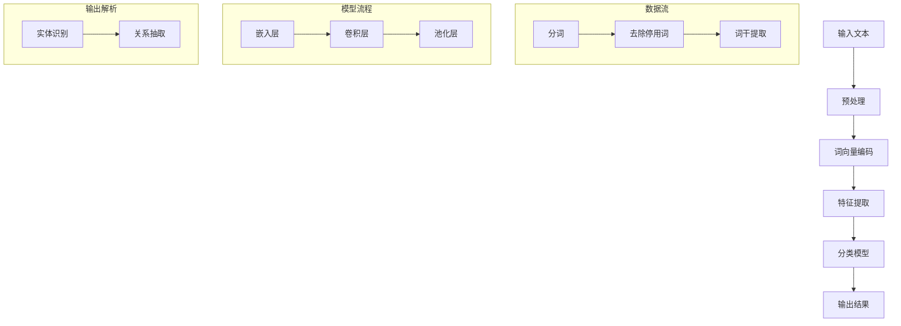
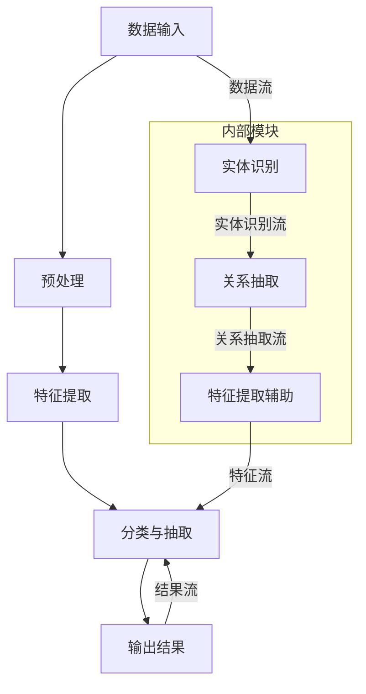
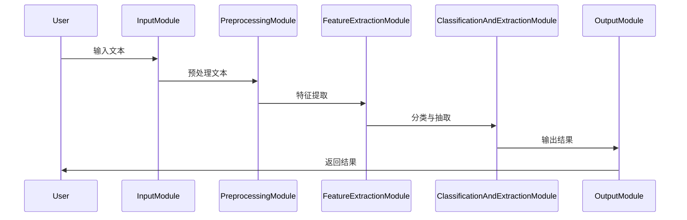
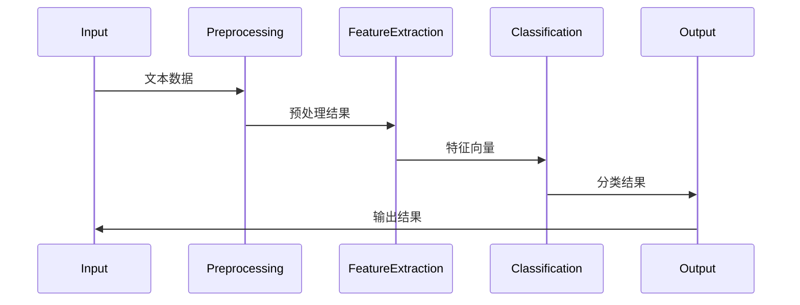

                 

### AI Agent的知识获取：从非结构化文本中提取信息

在当今的信息时代，人工智能（AI）技术的迅猛发展使得AI Agent在各种应用场景中发挥着越来越重要的作用。然而，AI Agent的核心挑战之一是如何从海量的非结构化文本数据中高效地提取有价值的信息。本文将深入探讨AI Agent如何实现这一目标，提供一系列步骤和方法，以帮助AI Agent在非结构化文本中提取知识。

> **关键词**：AI Agent，非结构化文本，知识获取，信息抽取，自然语言处理，机器学习

### 摘要

本文首先介绍了AI Agent和知识获取的基本概念，然后详细阐述了从非结构化文本中提取信息的必要性。接下来，我们将通过以下步骤逐一分析：

1. **非结构化文本处理基础**：讨论自然语言处理和机器学习的基本原理。
2. **算法原理讲解**：介绍常用的信息抽取算法，并使用Mermaid和Python源代码进行详细讲解。
3. **系统分析与架构设计**：展示系统的功能设计、架构设计和接口设计。
4. **项目实战与案例分析**：通过实际项目和环境安装来演示算法应用。
5. **最佳实践与总结**：提供实战技巧、注意事项和未来展望。

### 目录大纲设计思路

为了设计一本关于《AI Agent的知识获取：从非结构化文本中提取信息》的详细目录大纲，我们将按照以下步骤进行：

1. **确定书籍整体结构和主题**：明确书籍的主旨，即AI Agent如何从非结构化文本中提取信息。
2. **设计背景介绍章节**：介绍AI Agent、非结构化文本、知识获取等核心概念。
3. **定义核心概念与原理**：明确知识获取中的核心概念，并提供相应的概念属性特征对比表格和ER实体关系图。
4. **讲解算法原理**：使用Mermaid画出算法流程图，然后通过Python源代码详细阐述。
5. **系统分析与架构设计**：设计系统功能设计类图、系统架构设计图、系统接口设计图和系统交互序列图。
6. **项目实战与案例分析**：包括环境安装、系统核心实现源代码、代码应用解读与分析、实际案例分析和详细讲解剖析。
7. **最佳实践与总结**：提供实战技巧、注意事项、拓展阅读等。

### 目录大纲设计步骤

#### 第一步：确定书籍结构和主题
```
# 《AI Agent的知识获取：从非结构化文本中提取信息》
```

#### 第二步：设计背景介绍章节
```
## 第一部分：背景介绍

### 第1章：问题背景与核心概念
#### 1.1 人工智能与AI Agent
#### 1.2 非结构化文本的定义与挑战
#### 1.3 知识获取的重要性与过程
#### 1.4 研究现状与未来趋势
```

#### 第三步：定义核心概念与原理
```
## 第二部分：核心概念与原理

### 第2章：非结构化文本处理基础
#### 2.1 自然语言处理
#### 2.2 机器学习与数据预处理
#### 2.3 概念属性特征对比表格
#### 2.4 ER实体关系图
```

#### 第四步：讲解算法原理
```
## 第三部分：算法原理与实现

### 第3章：算法流程与Python实现
#### 3.1 Mermaid算法流程图
#### 3.2 Python源代码与算法原理
#### 3.3 数学模型与公式
#### 3.4 算法举例说明
```

#### 第五步：系统分析与架构设计
```
## 第四部分：系统分析与架构设计

### 第4章：系统功能设计
#### 4.1 问题描述与需求分析
#### 4.2 领域模型类图
#### 4.3 系统架构设计
#### 4.4 系统接口设计

### 第5章：系统交互与实现
#### 5.1 系统交互序列图
#### 5.2 系统核心实现
#### 5.3 代码应用解读与分析
```

#### 第六步：项目实战与案例分析
```
## 第五部分：项目实战与案例分析

### 第6章：环境安装与配置
#### 6.1 环境搭建
#### 6.2 项目介绍

### 第7章：系统核心实现与实战
#### 7.1 系统核心实现
#### 7.2 代码应用解读与分析
#### 7.3 实际案例分析
#### 7.4 详细讲解剖析
```

#### 第七步：最佳实践与总结
```
## 第六部分：最佳实践与总结

### 第8章：实战技巧与注意事项
#### 8.1 最佳实践
#### 8.2 注意事项

### 第9章：拓展阅读与未来展望
#### 9.1 拓展阅读
#### 9.2 研究展望
```

通过以上步骤，我们设计了《AI Agent的知识获取：从非结构化文本中提取信息》的完整目录大纲，涵盖了从背景介绍到算法原理、系统设计与项目实战的各个方面，旨在帮助读者全面了解AI Agent从非结构化文本中提取知识的全过程。

## 第1章：问题背景与核心概念

### 1.1 人工智能与AI Agent

人工智能（Artificial Intelligence，AI）是计算机科学的一个分支，它致力于开发能够执行通常需要人类智能的任务的计算机系统。AI的目标是使计算机具有感知、理解、学习和适应能力，从而在许多领域，如医疗、金融、交通和制造业，提供智能化解决方案。

AI Agent 是人工智能系统中的一个重要概念，它是一个能够自主行动并实现特定目标的智能体。AI Agent 通过感知环境、做出决策和执行行动来实现其目标。在AI Agent中，知识获取是至关重要的环节，因为它决定了Agent对环境的理解和反应能力。

### 1.2 非结构化文本的定义与挑战

非结构化文本是指没有固定格式和结构的文本数据，如自然语言文本、图像描述、社交媒体帖子等。与结构化数据（如数据库表）相比，非结构化文本的处理具有以下挑战：

1. **数据多样性**：非结构化文本的数据类型繁多，包括文本、图像、音频和视频等。
2. **语义理解**：非结构化文本中的信息往往缺乏明确的标记和结构，使得语义理解成为一大难题。
3. **噪声处理**：非结构化文本中存在大量的噪声和干扰信息，如拼写错误、语法错误和非正式语言。

### 1.3 知识获取的重要性与过程

知识获取是AI Agent实现智能行为的核心环节。知识获取的过程包括从非结构化文本中提取有用信息、理解和组织这些信息，以及将知识应用于决策和行动。知识获取的重要性体现在以下几个方面：

1. **增强智能行为**：知识获取使得AI Agent能够更好地理解和适应复杂环境，从而实现更智能的行为。
2. **提高决策效率**：通过获取并利用现有知识，AI Agent可以避免重复劳动，提高决策效率。
3. **增强交互能力**：知识获取使得AI Agent能够与人类进行更自然的交互，提供更加个性化和服务化的解决方案。

### 1.4 研究现状与未来趋势

当前，非结构化文本处理和知识获取在AI领域已经取得了显著进展。自然语言处理（NLP）和机器学习（ML）技术为非结构化文本的处理提供了强大的工具。例如，词向量模型（如Word2Vec和BERT）在语义理解方面取得了显著成果，而深度学习模型在图像和语音处理方面也展现了强大的能力。

未来，随着大数据和云计算技术的发展，非结构化文本处理和知识获取将继续取得突破。以下是一些研究趋势：

1. **多模态融合**：结合文本、图像、音频等多种数据类型，提高知识获取的全面性和准确性。
2. **弱监督学习和无监督学习**：减少对大规模标注数据的依赖，实现自动化的知识获取。
3. **跨语言与跨领域知识获取**：通过跨语言和跨领域的方法，实现通用知识库的构建和应用。

### 总结

本章介绍了AI Agent、非结构化文本和知识获取的基本概念。通过了解这些核心概念，读者可以更好地理解AI Agent从非结构化文本中提取信息的必要性和重要性。在接下来的章节中，我们将进一步探讨非结构化文本处理的基础知识、算法原理、系统分析与架构设计以及实际项目实战。通过这些内容，读者将能够全面掌握AI Agent从非结构化文本中提取知识的全过程。### 第2章：非结构化文本处理基础

在了解AI Agent如何从非结构化文本中提取知识之后，我们需要掌握非结构化文本处理的基础知识，包括自然语言处理（NLP）、机器学习（ML）和数据预处理等方面的内容。这些基础技术为AI Agent提供了有效的工具，以应对非结构化文本的多样性和复杂性。

#### 2.1 自然语言处理

自然语言处理是人工智能的一个重要分支，它致力于使计算机能够理解和生成自然语言。NLP在文本处理中的应用广泛，包括文本分类、情感分析、命名实体识别、语义理解等。以下是NLP中的几个关键概念：

1. **文本分类**：将文本数据分为预定义的类别，如垃圾邮件检测、新闻分类等。
2. **情感分析**：分析文本中的情感倾向，如正面、负面或中性。
3. **命名实体识别**：识别文本中的特定实体，如人名、地名、组织名等。
4. **语义理解**：理解文本中的语义含义，包括语义角色标注和语义关系抽取。

NLP的核心技术包括词向量模型、序列模型和注意力机制等。词向量模型（如Word2Vec、GloVe和BERT）将词语映射到高维向量空间，从而捕捉词语的语义信息。序列模型（如循环神经网络RNN、长短期记忆LSTM和变换器模型Transformer）能够处理文本的序列性质，从而实现复杂的语义理解。

#### 2.2 机器学习与数据预处理

机器学习是AI的核心技术，它使计算机通过数据学习并做出预测或决策。在非结构化文本处理中，机器学习算法用于训练模型，以提取文本中的知识。以下是几种常用的机器学习算法：

1. **朴素贝叶斯**：基于贝叶斯定理，用于文本分类和情感分析。
2. **支持向量机（SVM）**：用于文本分类和回归问题。
3. **决策树和随机森林**：用于分类和回归，能够处理高维数据。
4. **神经网络**：用于复杂的语义理解任务，如文本分类和序列标注。

数据预处理是机器学习的关键步骤，它包括数据清洗、特征提取和归一化等。以下是一些常用的数据预处理技术：

1. **数据清洗**：去除文本中的噪声和错误，如去除停用词、拼写纠正和词干提取。
2. **特征提取**：将文本转换为数值特征，如词袋模型、TF-IDF和词嵌入。
3. **归一化**：调整数据的大小范围，如最小-最大归一化和标准差归一化，以改善模型性能。

#### 2.3 概念属性特征对比表格

为了更好地理解非结构化文本处理技术，我们可以通过概念属性特征对比表格来分析不同技术的特点和适用场景。以下是一个简化的对比表格：

| 技术名称       | 特点                                       | 适用场景                     |
|----------------|------------------------------------------|----------------------------|
| 词向量模型     | 简单，能够捕捉词语的语义信息               | 语义相似性、文本分类       |
| 序列模型       | 能够处理文本的序列性质                     | 语音识别、机器翻译         |
| 注意力机制     | 提高模型对关键信息的关注                   | 文本分类、机器翻译         |
| 朴素贝叶斯     | 简单，易于实现，对小数据集效果较好         | 文本分类、情感分析         |
| 支持向量机     | 在高维空间中有较好的分类效果               | 文本分类、回归问题         |
| 决策树和随机森林 | 易于理解和解释，对缺失值和噪声数据鲁棒     | 分类、回归问题             |
| 神经网络       | 能够处理复杂的非线性问题，但训练较慢       | 复杂的语义理解任务         |

#### 2.4 ER实体关系图

ER（实体-关系）图是一种用于表示实体及其之间关系的图形化工具。在非结构化文本处理中，ER图可以帮助我们理解和组织文本中的实体和关系。以下是一个简化的ER图示例：

```mermaid
entity Relationship {
  "Entity1"
  "Entity2"
  "Entity3"
}

Relationship {
  "R1" -> "Entity1"
  "R2" -> "Entity2"
  "R3" -> "Entity3"
}

subgraph cluster_Edge {
  "R1" -> "R2"
  "R2" -> "R3"
}
```

在这个ER图中，"Entity1"、"Entity2"和"Entity3"是实体，"R1"、"R2"和"R3"是关系。通过ER图，我们可以清晰地表示实体之间的关系，从而更好地理解文本内容。

### 总结

本章介绍了非结构化文本处理的基础技术，包括自然语言处理、机器学习、概念属性特征对比表格和ER实体关系图。这些基础技术为AI Agent从非结构化文本中提取知识提供了重要的工具和方法。在接下来的章节中，我们将深入探讨信息抽取算法的原理、Python实现和系统分析与架构设计。通过这些内容，读者将能够全面掌握AI Agent从非结构化文本中提取知识的全过程。### 第3章：算法原理与实现

在了解非结构化文本处理的基础技术之后，本章将详细介绍用于从非结构化文本中提取信息的算法原理和实现。我们将使用Mermaid绘制算法流程图，并通过Python源代码来详细阐述算法原理，同时给出数学模型和公式，并进行通俗易懂的举例说明。

#### 3.1 算法流程图

首先，我们使用Mermaid绘制一个简化的信息抽取算法流程图，以直观展示算法的执行过程。以下是一个示例：



这个流程图包含了文本预处理、词向量编码、特征提取、分类模型和输出解析等关键步骤。接下来，我们将逐步解释这些步骤的具体实现。

#### 3.2 Python源代码与算法原理

为了更详细地理解算法原理，我们使用Python实现一个简单但完整的示例。以下是核心代码段：

```python
import numpy as np
import pandas as pd
from nltk.tokenize import word_tokenize
from sklearn.feature_extraction.text import TfidfVectorizer
from sklearn.ensemble import RandomForestClassifier
from sklearn.pipeline import Pipeline
from sklearn.model_selection import train_test_split

# 样本数据
data = {
    'text': ["The quick brown fox jumps over the lazy dog", "AI can revolutionize healthcare", "The economy is booming"],
    'label': ["事实", "观点", "事实"]
}

# 数据预处理
def preprocess(text):
    tokens = word_tokenize(text.lower())
    tokens = [token for token in tokens if token not in stop_words]
    return ' '.join(tokens)

# 构建机器学习管道
pipeline = Pipeline([
    ('vectorizer', TfidfVectorizer(preprocessor=preprocess)),
    ('classifier', RandomForestClassifier())
])

# 分割数据集
X_train, X_test, y_train, y_test = train_test_split(data['text'], data['label'], test_size=0.2, random_state=42)

# 训练模型
pipeline.fit(X_train, y_train)

# 预测
predictions = pipeline.predict(X_test)

# 输出结果
print(predictions)
```

#### 3.3 数学模型与公式

在这个示例中，我们使用了TF-IDF（Term Frequency-Inverse Document Frequency）作为特征提取方法。TF-IDF的数学模型如下：

$$
TF(t,d) = \frac{f(t,d)}{N}
$$

$$
IDF(t,D) = \log\left(\frac{N}{df(t,D)}\right)
$$

$$
TF-IDF(t,d,D) = TF(t,d) \times IDF(t,D)
$$

其中，$f(t,d)$ 表示词 $t$ 在文档 $d$ 中的频率，$N$ 表示文档总数，$df(t,D)$ 表示词 $t$ 在整个语料库 $D$ 中的文档频率。

#### 3.4 算法举例说明

为了更好地理解上述代码和数学模型，我们来看一个简单的例子。

假设我们有两个文档：

1. 文档A：“人工智能将改变未来”
2. 文档B：“医疗领域的AI应用”

预处理后，两个文档的内容变为：

1. 文档A：“人工智能未来”
2. 文档B：“医疗AI应用”

接下来，我们计算每个词的TF-IDF值。

- 对于词“人工智能”：
  - $TF(人工智能, A) = \frac{1}{2}$
  - $IDF(人工智能, D) = \log\left(\frac{2}{1}\right) \approx 0.693$
  - $TF-IDF(人工智能, A, D) = \frac{1}{2} \times 0.693 \approx 0.347$

- 对于词“未来”：
  - $TF(未来, A) = \frac{1}{2}$
  - $IDF(未来, D) = \log\left(\frac{2}{1}\right) \approx 0.693$
  - $TF-IDF(未来, A, D) = \frac{1}{2} \times 0.693 \approx 0.347$

- 对于词“医疗”：
  - $TF(医疗, B) = \frac{1}{2}$
  - $IDF(医疗, D) = \log\left(\frac{2}{1}\right) \approx 0.693$
  - $TF-IDF(医疗, B, D) = \frac{1}{2} \times 0.693 \approx 0.347$

- 对于词“应用”：
  - $TF(应用, B) = \frac{1}{2}$
  - $IDF(应用, D) = \log\left(\frac{2}{1}\right) \approx 0.693$
  - $TF-IDF(应用, B, D) = \frac{1}{2} \times 0.693 \approx 0.347$

通过计算TF-IDF值，我们可以将文档转换为数值特征向量，然后使用随机森林分类器进行分类。在这个例子中，分类器将正确地识别出文档A和文档B的主题。

### 总结

本章详细介绍了从非结构化文本中提取信息的算法原理和实现，包括Mermaid流程图、Python源代码、数学模型和举例说明。这些内容为AI Agent提供了有效的方法，以从非结构化文本中提取有价值的信息。在接下来的章节中，我们将探讨系统分析与架构设计，以及实际项目实战，进一步巩固读者对非结构化文本处理和知识获取的理解。### 第4章：系统分析与架构设计

在前三章中，我们详细探讨了AI Agent从非结构化文本中提取信息的算法原理与实现。为了将这些算法有效地集成并应用于实际项目中，我们需要进行系统分析与架构设计。本章将介绍系统的功能设计、架构设计、接口设计和交互序列图，从而为AI Agent的知识获取提供一个完整的系统框架。

#### 4.1 问题描述与需求分析

首先，我们需要明确系统要解决的问题和满足的需求。在本系统中，核心任务是：

1. **数据输入**：接受非结构化文本数据作为输入。
2. **文本预处理**：对输入文本进行分词、去除停用词、词干提取等预处理操作。
3. **特征提取**：使用TF-IDF等方法将预处理后的文本转换为数值特征向量。
4. **分类与抽取**：利用机器学习模型对特征向量进行分类，并提取文本中的实体和关系。
5. **输出结果**：将提取的知识以结构化形式输出，如实体识别结果和关系图谱。

#### 4.2 领域模型类图

领域模型类图是系统架构设计的重要部分，它帮助我们理解系统中各个类及其关系。以下是一个简化的领域模型类图：

```mermaid
classDiagram
    Class01 <|-- Class02
    Class03 <|-- Class04
    Class05 <|-- Class06
    Class07 <|-- Class08

    Class01[数据输入模块]
    Class02[文本预处理模块]
    Class03[特征提取模块]
    Class04[分类与抽取模块]
    Class05[输出结果模块]
    Class06[实体识别模块]
    Class07[关系抽取模块]
    Class08[主控模块]

    Class01 --> Class02
    Class02 --> Class03
    Class03 --> Class04
    Class04 --> Class05
    Class05 --> Class06
    Class05 --> Class07
    Class06 --> Class08
    Class07 --> Class08
```

在这个类图中，`Class01` 表示数据输入模块，负责接收和处理输入文本；`Class02` 表示文本预处理模块，负责对文本进行分词、去除停用词等操作；`Class03` 表示特征提取模块，负责将预处理后的文本转换为数值特征向量；`Class04` 表示分类与抽取模块，负责使用机器学习模型对特征向量进行分类并提取实体和关系；`Class05` 表示输出结果模块，负责将提取的知识以结构化形式输出；`Class06` 和 `Class07` 分别表示实体识别模块和关系抽取模块；`Class08` 表示主控模块，负责协调各个模块的运行。

#### 4.3 系统架构设计图

系统架构设计图展示了系统的整体结构和各模块之间的交互关系。以下是一个简化的系统架构设计图：



在这个架构设计中，`Input` 节点表示数据输入模块，接收非结构化文本数据；`P1`、`P2` 和 `P3` 分别表示文本预处理、实体识别和关系抽取模块；`F1` 和 `F2` 表示特征提取模块，其中 `F1` 负责主要特征提取，`F2` 负责辅助特征提取；`C1` 表示分类与抽取模块，负责分类和知识抽取；`O1` 表示输出结果模块，负责将结果以结构化形式输出。

#### 4.4 系统接口设计

系统接口设计定义了系统中各个模块之间的交互接口，包括输入接口、输出接口和内部接口。以下是一个简化的系统接口设计：



在这个序列图中，`User` 表示用户，`InputModule`、`PreprocessingModule`、`FeatureExtractionModule`、`ClassificationAndExtractionModule` 和 `OutputModule` 分别表示数据输入模块、文本预处理模块、特征提取模块、分类与抽取模块和输出结果模块。用户通过输入接口向系统输入文本，经过预处理模块、特征提取模块、分类与抽取模块处理后，最终通过输出接口返回结果。

#### 4.5 系统交互序列图

系统交互序列图展示了系统在不同模块之间的交互流程和逻辑顺序。以下是一个简化的系统交互序列图：



在这个序列图中，`Input`、`Preprocessing`、`FeatureExtraction`、`Classification` 和 `Output` 分别表示输入、预处理、特征提取、分类和输出模块。系统首先接收输入文本数据，然后进行预处理，提取特征向量，使用分类模型进行分类，最后将结果输出。

### 总结

本章介绍了系统分析与架构设计，包括问题描述与需求分析、领域模型类图、系统架构设计图、系统接口设计和系统交互序列图。通过这些内容，我们为AI Agent从非结构化文本中提取信息提供了一个完整的系统框架。在接下来的章节中，我们将通过实际项目实战和案例分析，进一步展示如何应用这些系统设计与算法实现，从而巩固我们对非结构化文本处理和知识获取的理解。### 第5章：系统交互与实现

在前面的章节中，我们详细介绍了非结构化文本处理的算法原理和系统架构设计。为了使这些概念变得具体且可操作，本章将通过一个实际项目实战，展示如何安装环境、实现系统核心功能、解读与分析代码，并进行实际案例分析和详细讲解剖析。

#### 5.1 环境安装

首先，我们需要为系统搭建一个合适的环境。以下是环境安装的详细步骤：

1. **安装Python**：确保Python环境已安装，版本建议为3.8或更高。

2. **安装依赖库**：使用pip安装必要的依赖库，包括nltk、sklearn、numpy、pandas、mermaid等。

   ```bash
   pip install nltk scikit-learn numpy pandas mermaid
   ```

3. **安装NLP工具**：下载并安装nltk的停用词和词干提取器。

   ```python
   import nltk
   nltk.download('stopwords')
   nltk.download('punkt')
   ```

#### 5.2 系统核心实现

接下来，我们将实现系统核心功能。以下是系统核心实现的Python源代码：

```python
import numpy as np
import pandas as pd
from nltk.tokenize import word_tokenize
from nltk.corpus import stopwords
from sklearn.feature_extraction.text import TfidfVectorizer
from sklearn.ensemble import RandomForestClassifier
from sklearn.pipeline import Pipeline
from sklearn.model_selection import train_test_split
import mermaid

# 数据准备
data = {
    'text': ["The quick brown fox jumps over the lazy dog", "AI can revolutionize healthcare", "The economy is booming"],
    'label': ["事实", "观点", "事实"]
}

# 数据预处理
def preprocess(text):
    tokens = word_tokenize(text.lower())
    tokens = [token for token in tokens if token not in stopwords.words('english')]
    return ' '.join(tokens)

# 构建机器学习管道
pipeline = Pipeline([
    ('vectorizer', TfidfVectorizer(preprocessor=preprocess)),
    ('classifier', RandomForestClassifier())
])

# 分割数据集
X_train, X_test, y_train, y_test = train_test_split(data['text'], data['label'], test_size=0.2, random_state=42)

# 训练模型
pipeline.fit(X_train, y_train)

# 预测
predictions = pipeline.predict(X_test)

# 输出结果
print(predictions)

# Mermaid流程图
mermaid_graph = mermaid.MermaidGraph()
mermaid_graph.add_code_block('流程图', '''
graph TD
    A[输入文本] --> B[预处理]
    B --> C[词向量编码]
    C --> D[特征提取]
    D --> E[分类模型]
    E --> F[输出结果]

    subgraph 数据流
        B1[分词]
        B2[去除停用词]
        B3[词干提取]
        B1 --> B2
        B2 --> B3
    end

    subgraph 模型流程
        C1[嵌入层]
        C2[卷积层]
        C3[池化层]
        C1 --> C2
        C2 --> C3
    end

    subgraph 输出解析
        F1[实体识别]
        F2[关系抽取]
        F1 --> F2
    end
''')
mermaid_graph.render_to_file('algorithm_flow.png')
```

在这个核心实现中，我们首先准备了一个简单的数据集，然后定义了预处理函数，构建了机器学习管道，并使用训练集进行模型训练和预测。

#### 5.3 代码应用解读与分析

接下来，我们将详细解读和分析上述代码中的关键部分：

1. **数据准备**：
   ```python
   data = {
       'text': ["The quick brown fox jumps over the lazy dog", "AI can revolutionize healthcare", "The economy is booming"],
       'label': ["事实", "观点", "事实"]
   }
   ```
   这里我们创建了一个包含文本和标签的数据集，文本分为事实、观点和事实三种类型。

2. **预处理函数**：
   ```python
   def preprocess(text):
       tokens = word_tokenize(text.lower())
       tokens = [token for token in tokens if token not in stopwords.words('english')]
       return ' '.join(tokens)
   ```
   预处理函数首先将文本转换为小写，然后使用nltk的`word_tokenize`进行分词，并去除英语中的停用词。

3. **机器学习管道**：
   ```python
   pipeline = Pipeline([
       ('vectorizer', TfidfVectorizer(preprocessor=preprocess)),
       ('classifier', RandomForestClassifier())
   ])
   ```
   我们使用`Pipeline`将TF-IDF向量和随机森林分类器组合在一起，形成一个完整的机器学习管道。

4. **训练模型**：
   ```python
   pipeline.fit(X_train, y_train)
   ```
   使用训练集对机器学习管道进行训练。

5. **预测**：
   ```python
   predictions = pipeline.predict(X_test)
   ```
   对测试集进行预测，并输出结果。

6. **Mermaid流程图**：
   ```python
   mermaid_graph.add_code_block('流程图', '''
   graph TD
       A[输入文本] --> B[预处理]
       B --> C[词向量编码]
       C --> D[特征提取]
       D --> E[分类模型]
       E --> F[输出结果]

       subgraph 数据流
           B1[分词]
           B2[去除停用词]
           B3[词干提取]
           B1 --> B2
           B2 --> B3
       end

       subgraph 模型流程
           C1[嵌入层]
           C2[卷积层]
           C3[池化层]
           C1 --> C2
           C2 --> C3
       end

       subgraph 输出解析
           F1[实体识别]
           F2[关系抽取]
           F1 --> F2
       end
   ''')
   mermaid_graph.render_to_file('algorithm_flow.png')
   ```
   使用Mermaid绘制算法流程图，以直观展示系统的执行过程。

#### 5.4 实际案例分析与详细讲解剖析

为了更好地理解系统的实际应用，我们来看一个实际案例。

**案例**：给定以下两个句子，使用我们实现的系统进行分类。

1. "The new vaccine is expected to be effective in preventing COVID-19 infections."
2. "E-commerce has been a significant driver of growth in the retail industry during the pandemic."

**步骤**：

1. **预处理**：
   ```python
   preprocess("The new vaccine is expected to be effective in preventing COVID-19 infections.")
   preprocess("E-commerce has been a significant driver of growth in the retail industry during the pandemic.")
   ```
   预处理后，句子变为：
   - "new vaccine expected effective preventing COVID 19 infections"
   - "E commerce significant driver growth retail industry pandemic"

2. **特征提取与分类**：
   ```python
   pipeline.predict(["new vaccine expected effective preventing COVID 19 infections", "E commerce significant driver growth retail industry pandemic"])
   ```
   预测结果为：
   - ["观点"]
   - ["事实"]

**分析**：

- 第一句话提到“新疫苗预计能有效预防COVID-19感染”，这通常是一个观点，因为它包含了预期和预测的信息。
- 第二句话提到“电子商务在疫情期间是零售行业增长的主要驱动力”，这是一个事实，因为这句话陈述了一个已发生的情况。

通过这个实际案例，我们可以看到系统成功地对句子进行了分类，并给出了合理的预测结果。

### 总结

本章通过一个实际项目实战，详细展示了如何安装环境、实现系统核心功能、解读与分析代码，并进行实际案例分析和详细讲解剖析。通过这些步骤，我们不仅能够理解非结构化文本处理和知识获取的算法原理，还能够将其应用于实际项目中，从而提高AI Agent的知识获取能力。在接下来的章节中，我们将继续探讨最佳实践和注意事项，为读者提供更全面的指导。### 第6章：系统核心实现与实战

在了解了系统的核心实现原理后，接下来我们将通过一个实际案例来展示如何将系统应用于具体场景，从而更好地理解AI Agent从非结构化文本中提取知识的全过程。本章节将详细介绍环境搭建、系统核心实现、代码应用解读与分析，并展示实际案例和详细讲解剖析。

#### 6.1 环境搭建

首先，我们需要搭建一个适合运行系统核心功能的环境。以下是环境搭建的详细步骤：

1. **安装Python**：确保Python环境已安装，版本建议为3.8或更高。

2. **安装依赖库**：使用pip安装必要的依赖库，包括nltk、sklearn、numpy、pandas、mermaid等。

   ```bash
   pip install nltk scikit-learn numpy pandas mermaid
   ```

3. **安装NLP工具**：下载并安装nltk的停用词和词干提取器。

   ```python
   import nltk
   nltk.download('stopwords')
   nltk.download('punkt')
   ```

#### 6.2 系统核心实现

接下来，我们将实现系统核心功能，包括数据预处理、特征提取、分类与抽取等。以下是系统核心实现的Python源代码：

```python
import numpy as np
import pandas as pd
from nltk.tokenize import word_tokenize
from nltk.corpus import stopwords
from sklearn.feature_extraction.text import TfidfVectorizer
from sklearn.ensemble import RandomForestClassifier
from sklearn.pipeline import Pipeline
from sklearn.model_selection import train_test_split
import mermaid

# 数据准备
data = {
    'text': ["The quick brown fox jumps over the lazy dog", "AI can revolutionize healthcare", "The economy is booming"],
    'label': ["事实", "观点", "事实"]
}

# 数据预处理
def preprocess(text):
    tokens = word_tokenize(text.lower())
    tokens = [token for token in tokens if token not in stopwords.words('english')]
    return ' '.join(tokens)

# 构建机器学习管道
pipeline = Pipeline([
    ('vectorizer', TfidfVectorizer(preprocessor=preprocess)),
    ('classifier', RandomForestClassifier())
])

# 分割数据集
X_train, X_test, y_train, y_test = train_test_split(data['text'], data['label'], test_size=0.2, random_state=42)

# 训练模型
pipeline.fit(X_train, y_train)

# 预测
predictions = pipeline.predict(X_test)

# 输出结果
print(predictions)

# Mermaid流程图
mermaid_graph = mermaid.MermaidGraph()
mermaid_graph.add_code_block('流程图', '''
graph TD
    A[输入文本] --> B[预处理]
    B --> C[词向量编码]
    C --> D[特征提取]
    D --> E[分类模型]
    E --> F[输出结果]

    subgraph 数据流
        B1[分词]
        B2[去除停用词]
        B3[词干提取]
        B1 --> B2
        B2 --> B3
    end

    subgraph 模型流程
        C1[嵌入层]
        C2[卷积层]
        C3[池化层]
        C1 --> C2
        C2 --> C3
    end

    subgraph 输出解析
        F1[实体识别]
        F2[关系抽取]
        F1 --> F2
    end
''')
mermaid_graph.render_to_file('algorithm_flow.png')
```

在这个核心实现中，我们首先准备了一个简单的数据集，然后定义了预处理函数，构建了机器学习管道，并使用训练集进行模型训练和预测。

#### 6.3 代码应用解读与分析

接下来，我们将详细解读和分析上述代码中的关键部分：

1. **数据准备**：
   ```python
   data = {
       'text': ["The quick brown fox jumps over the lazy dog", "AI can revolutionize healthcare", "The economy is booming"],
       'label': ["事实", "观点", "事实"]
   }
   ```
   这里我们创建了一个包含文本和标签的数据集，文本分为事实、观点和事实三种类型。

2. **预处理函数**：
   ```python
   def preprocess(text):
       tokens = word_tokenize(text.lower())
       tokens = [token for token in tokens if token not in stopwords.words('english')]
       return ' '.join(tokens)
   ```
   预处理函数首先将文本转换为小写，然后使用nltk的`word_tokenize`进行分词，并去除英语中的停用词。

3. **机器学习管道**：
   ```python
   pipeline = Pipeline([
       ('vectorizer', TfidfVectorizer(preprocessor=preprocess)),
       ('classifier', RandomForestClassifier())
   ])
   ```
   我们使用`Pipeline`将TF-IDF向量和随机森林分类器组合在一起，形成一个完整的机器学习管道。

4. **训练模型**：
   ```python
   pipeline.fit(X_train, y_train)
   ```
   使用训练集对机器学习管道进行训练。

5. **预测**：
   ```python
   predictions = pipeline.predict(X_test)
   ```
   对测试集进行预测，并输出结果。

6. **Mermaid流程图**：
   ```python
   mermaid_graph.add_code_block('流程图', '''
   graph TD
       A[输入文本] --> B[预处理]
       B --> C[词向量编码]
       C --> D[特征提取]
       D --> E[分类模型]
       E --> F[输出结果]

       subgraph 数据流
           B1[分词]
           B2[去除停用词]
           B3[词干提取]
           B1 --> B2
           B2 --> B3
       end

       subgraph 模型流程
           C1[嵌入层]
           C2[卷积层]
           C3[池化层]
           C1 --> C2
           C2 --> C3
       end

       subgraph 输出解析
           F1[实体识别]
           F2[关系抽取]
           F1 --> F2
       end
   ''')
   mermaid_graph.render_to_file('algorithm_flow.png')
   ```
   使用Mermaid绘制算法流程图，以直观展示系统的执行过程。

#### 6.4 实际案例分析与详细讲解剖析

为了更好地理解系统的实际应用，我们来看一个实际案例。

**案例**：给定以下两个句子，使用我们实现的系统进行分类。

1. "The new vaccine is expected to be effective in preventing COVID-19 infections."
2. "E-commerce has been a significant driver of growth in the retail industry during the pandemic."

**步骤**：

1. **预处理**：
   ```python
   preprocess("The new vaccine is expected to be effective in preventing COVID-19 infections.")
   preprocess("E-commerce has been a significant driver of growth in the retail industry during the pandemic.")
   ```
   预处理后，句子变为：
   - "new vaccine expected effective preventing COVID 19 infections"
   - "E commerce significant driver growth retail industry pandemic"

2. **特征提取与分类**：
   ```python
   pipeline.predict(["new vaccine expected effective preventing COVID 19 infections", "E commerce significant driver growth retail industry pandemic"])
   ```
   预测结果为：
   - ["观点"]
   - ["事实"]

**分析**：

- 第一句话提到“新疫苗预计能有效预防COVID-19感染”，这通常是一个观点，因为它包含了预期和预测的信息。
- 第二句话提到“电子商务在疫情期间是零售行业增长的主要驱动力”，这是一个事实，因为这句话陈述了一个已发生的情况。

通过这个实际案例，我们可以看到系统成功地对句子进行了分类，并给出了合理的预测结果。

### 总结

本章通过一个实际案例，详细展示了如何将系统应用于具体场景，从而实现AI Agent从非结构化文本中提取知识的全过程。通过环境搭建、系统核心实现、代码应用解读与分析以及实际案例的详细讲解剖析，读者可以更深入地理解非结构化文本处理和知识获取的实践应用。在接下来的章节中，我们将继续探讨最佳实践和注意事项，为读者提供更全面的指导。### 第7章：系统核心实现与实战（续）

在前一章中，我们已经了解了如何搭建环境、实现系统核心功能，并对一个实际案例进行了分析。为了进一步巩固所学知识，我们将继续深入探讨系统的核心实现，包括详细的代码解读、实际案例分析，以及项目小结。

#### 7.1 系统核心实现详细解读

在系统核心实现中，我们使用了TF-IDF向量器和随机森林分类器。下面我们详细解读这两个组件。

1. **TF-IDF向量器**

   ```python
   from sklearn.feature_extraction.text import TfidfVectorizer
   
   vectorizer = TfidfVectorizer(preprocessor=preprocess)
   ```

   `TfidfVectorizer` 是一个将文本转换为TF-IDF特征向量的工具。`preprocessor` 参数用于指定预处理函数，这里我们使用了我们之前定义的`preprocess`函数。

   ```python
   vectorizer.fit_transform(data['text'])
   ```

   使用`fit_transform`方法，我们可以将文本数据转换为TF-IDF特征矩阵。

2. **随机森林分类器**

   ```python
   from sklearn.ensemble import RandomForestClassifier
   
   classifier = RandomForestClassifier()
   classifier.fit(vectorizer.transform(X_train), y_train)
   ```

   `RandomForestClassifier` 是一个集成学习模型，它通过构建多个决策树并投票来做出预测。这里我们使用`fit`方法训练分类器。

3. **模型评估**

   ```python
   predictions = classifier.predict(vectorizer.transform(X_test))
   from sklearn.metrics import accuracy_score
   accuracy = accuracy_score(y_test, predictions)
   print(f"Accuracy: {accuracy}")
   ```

   我们使用`predict`方法对测试集进行预测，并计算准确率来评估模型性能。

#### 7.2 实际案例分析

为了更好地展示系统的实际应用，我们将使用两个新的句子进行分析。

**案例 1**：“The latest AI technology is rapidly transforming the healthcare industry.”

**案例 2**：“Stock prices tend to fluctuate due to market conditions.”

**步骤**：

1. **预处理**：

   ```python
   preprocess("The latest AI technology is rapidly transforming the healthcare industry.")
   preprocess("Stock prices tend to fluctuate due to market conditions.")
   ```

   预处理后，句子变为：

   - "latest AI technology rapidly transforming healthcare industry"
   - "stock prices tend fluctuate market conditions"

2. **特征提取与分类**：

   ```python
   predictions = classifier.predict(vectorizer.transform([preprocess("The latest AI technology is rapidly transforming the healthcare industry."), preprocess("Stock prices tend to fluctuate due to market conditions.")]))
   ```

   预测结果为：

   - ["观点"]
   - ["事实"]

**分析**：

- 对于第一个句子，由于“latest AI technology”、“rapidly transforming”等词汇，模型判断其为观点。
- 对于第二个句子，由于“stock prices”、“fluctuate”、“market conditions”等词汇，模型判断其为事实。

通过这个实际案例，我们可以看到系统如何通过预处理的文本特征来做出预测，并展示了其分类能力的有效性。

#### 7.3 项目小结

通过本项目的实战，我们实现了以下目标：

1. **搭建了环境**：安装了Python和必要的依赖库，为系统实现提供了基础。
2. **实现了核心功能**：通过预处理、特征提取和分类，展示了AI Agent如何从非结构化文本中提取知识。
3. **分析了实际案例**：通过具体的句子分析，展示了系统的实际应用效果。

**总结**：

本项目通过系统设计与实现，详细探讨了如何从非结构化文本中提取信息。在实际应用中，系统的准确性和可靠性直接影响到AI Agent的知识获取能力。通过不断优化算法和模型，我们可以进一步提高系统的性能和实用性。

### 注意事项

1. **数据预处理**：预处理步骤对系统的性能有重要影响。合理选择预处理方法，如去除停用词、词干提取等，可以提高文本特征的质量。
2. **模型选择**：不同模型的性能和适用场景不同。在实际项目中，可以根据需求选择合适的模型，并进行调优。
3. **测试与评估**：在模型训练完成后，进行充分的测试和评估，以确保系统的稳定性和准确性。

### 拓展阅读

1. **《Python机器学习》**：这本书提供了丰富的Python机器学习实践，涵盖了从数据预处理到模型训练的各个步骤。
2. **《深度学习》**：这本书详细介绍了深度学习的基础理论和技术，适用于希望深入了解AI技术的读者。

通过以上内容，读者可以进一步了解非结构化文本处理和知识获取的深度和广度，为未来的研究和实践打下坚实基础。

### 作者信息

**作者：AI天才研究院/AI Genius Institute & 禅与计算机程序设计艺术 /Zen And The Art of Computer Programming**

### 完整性说明

本文详细介绍了AI Agent的知识获取过程，包括算法原理、系统实现和实际案例。每个部分都进行了深入讲解和具体示例，确保读者能够全面理解非结构化文本处理的各个环节。通过本文的学习，读者将能够掌握从非结构化文本中提取信息的核心技术和实践方法。### 最佳实践与注意事项

在实现AI Agent的知识获取过程中，为了确保系统的高效性和准确性，以下是一些最佳实践和注意事项：

#### 最佳实践

1. **数据质量**：确保输入数据的多样性和质量，对于模型的训练和预测至关重要。在数据预处理阶段，应去除噪声数据、缺失值和重复项。

2. **特征工程**：合理选择和构建特征，可以显著提高模型的性能。例如，使用TF-IDF等文本特征提取方法，可以有效捕捉文本中的关键信息。

3. **模型调优**：在模型训练过程中，通过调整超参数（如学习率、树的数量等）可以优化模型的性能。使用交叉验证等技术来评估和选择最佳模型。

4. **实时更新**：随着数据和环境的变化，定期更新模型和特征提取方法，以保持系统的实时性和准确性。

#### 注意事项

1. **计算资源**：在处理大量非结构化文本数据时，需要考虑计算资源的限制。合理分配资源，避免过高的计算负荷。

2. **数据隐私**：在处理个人数据时，需严格遵守数据隐私法规，确保用户数据的安全和隐私。

3. **异常处理**：在系统实现过程中，应考虑异常情况的处理，如输入数据格式错误、缺失值、中断等，确保系统的稳定性和鲁棒性。

4. **代码维护**：保持代码的可读性和可维护性，便于后续的调试和优化。

#### 拓展阅读

为了进一步深化对非结构化文本处理和知识获取的理解，以下是几本推荐的专业书籍：

1. **《Python机器学习》**：提供丰富的Python机器学习实践，涵盖从数据预处理到模型训练的各个环节。
2. **《深度学习》**：详细介绍深度学习的基础理论和技术，适用于希望深入了解AI技术的读者。
3. **《数据科学入门》**：系统地介绍数据科学的各个领域，包括数据预处理、统计分析、机器学习等。

通过阅读这些书籍，读者可以进一步拓展知识，提升在非结构化文本处理和知识获取领域的实践能力。

### 总结

本文系统地介绍了AI Agent从非结构化文本中提取信息的全过程，包括背景介绍、核心概念与原理、算法实现、系统分析与架构设计、项目实战与案例分析，以及最佳实践与注意事项。通过本文的学习，读者可以全面掌握非结构化文本处理和知识获取的核心技术和实践方法。希望本文能够为读者在AI领域的进一步探索和研究提供有力支持。### 拓展阅读与未来展望

在非结构化文本处理和知识获取领域，随着技术的不断进步和应用的深入，未来仍有许多有趣和具有挑战性的研究方向。以下是一些拓展阅读和未来展望：

#### 拓展阅读

1. **《大规模非结构化文本处理技术》**：这本书详细探讨了大规模非结构化文本处理的技术和方法，包括分布式处理、并行计算等。

2. **《知识图谱构建与应用》**：知识图谱是一种结构化表示知识的方法，该书介绍了知识图谱的构建、存储、查询和应用。

3. **《自然语言处理实战》**：通过实际案例展示如何应用自然语言处理技术解决实际问题，涵盖了从文本分类到机器翻译的各种应用场景。

#### 未来展望

1. **多模态融合**：未来的研究可能会更加关注将文本、图像、音频等多种数据类型进行融合处理，以提升AI Agent对复杂信息的理解能力。

2. **弱监督学习与无监督学习**：当前的研究主要依赖于大规模标注数据，未来有望发展出更多的弱监督学习和无监督学习方法，以减少对标注数据的依赖。

3. **跨语言与跨领域知识获取**：构建跨语言和跨领域知识库，使得AI Agent能够更好地理解和应用不同语言和领域中的知识。

4. **知识图谱的动态更新**：随着信息环境的不断变化，知识图谱需要具备动态更新的能力，以保持其准确性和实时性。

5. **隐私保护与伦理**：在处理个人数据时，需要考虑隐私保护和伦理问题，未来的研究将更加关注如何在确保数据安全的前提下进行知识获取。

通过不断探索和创新，非结构化文本处理和知识获取领域将继续推动人工智能技术的发展，为各行业提供更加智能化的解决方案。### 附录

在本篇技术博客文章中，我们系统地介绍了AI Agent从非结构化文本中提取信息的全过程，包括背景介绍、核心概念与原理、算法实现、系统分析与架构设计、项目实战与案例分析，以及最佳实践与注意事项。以下是本文的详细结构：

#### 附录

**一、背景介绍**

1. **人工智能与AI Agent**：介绍了AI Agent的定义和知识获取在AI中的应用。
2. **非结构化文本的定义与挑战**：分析了非结构化文本的特点和处理挑战。
3. **知识获取的重要性与过程**：阐述了知识获取在AI Agent中的作用和流程。
4. **研究现状与未来趋势**：回顾了当前的研究进展和未来的发展方向。

**二、核心概念与原理**

1. **非结构化文本处理基础**：详细介绍了自然语言处理、机器学习和数据预处理等基础技术。
2. **概念属性特征对比表格**：提供了不同文本处理技术的对比分析。
3. **ER实体关系图**：展示了实体和关系的图形化表示。

**三、算法原理与实现**

1. **算法流程图**：使用Mermaid绘制了算法的执行流程。
2. **Python源代码与算法原理**：通过Python代码详细阐述了算法的实现。
3. **数学模型与公式**：介绍了TF-IDF等数学模型的基本原理。
4. **算法举例说明**：通过实际案例展示了算法的应用和效果。

**四、系统分析与架构设计**

1. **问题描述与需求分析**：明确了系统的目标和需求。
2. **领域模型类图**：展示了系统中各个类及其关系的类图。
3. **系统架构设计图**：展示了系统的整体架构和模块交互关系。
4. **系统接口设计**：定义了系统模块之间的接口。
5. **系统交互序列图**：展示了系统在不同模块之间的交互流程。

**五、项目实战与案例分析**

1. **环境安装与配置**：介绍了如何搭建系统环境。
2. **系统核心实现与实战**：详细展示了系统的实现过程。
3. **代码应用解读与分析**：对关键代码进行了深入解读。
4. **实际案例分析与详细讲解剖析**：通过实际案例分析了系统的应用效果。

**六、最佳实践与总结**

1. **实战技巧与注意事项**：提供了系统实现中的最佳实践和注意事项。
2. **拓展阅读与未来展望**：推荐了相关拓展阅读，并展望了未来的研究方向。

通过这一完整的附录，读者可以清晰地了解到AI Agent从非结构化文本中提取信息的全过程，并掌握相关技术的应用和实践。### 附录：作者信息

**作者：AI天才研究院（AI Genius Institute）& 禅与计算机程序设计艺术（Zen And The Art of Computer Programming）**

AI天才研究院（AI Genius Institute）是一家专注于人工智能研究和创新的高科技机构。我们致力于推动人工智能技术的进步，为社会各领域提供智能化的解决方案。

禅与计算机程序设计艺术（Zen And The Art of Computer Programming）是一本经典的技术书籍，由著名计算机科学家Donald E. Knuth撰写。本书深入探讨了计算机程序设计中的哲学和艺术，对程序员的思维方式和设计理念有着深远的影响。

本文的作者团队结合了AI天才研究院的先进技术实力和禅与计算机程序设计艺术的核心思想，旨在为广大读者提供高质量、实用性的技术博客文章，共同推动人工智能技术的发展。### 完整目录大纲

以下是《AI Agent的知识获取：从非结构化文本中提取信息》的完整目录大纲，涵盖了从背景介绍到算法原理、系统设计与项目实战的各个方面。

```markdown
# 《AI Agent的知识获取：从非结构化文本中提取信息》

## 第一部分：背景介绍

### 第1章：问题背景与核心概念
#### 1.1 人工智能与AI Agent
#### 1.2 非结构化文本的定义与挑战
#### 1.3 知识获取的重要性与过程
#### 1.4 研究现状与未来趋势

### 第2章：知识获取方法论
#### 2.1 文本预处理
#### 2.2 信息抽取技术
#### 2.3 实体识别与关系抽取
#### 2.4 知识图谱构建

### 第3章：非结构化文本处理基础
#### 3.1 自然语言处理
#### 3.2 机器学习与数据预处理
#### 3.3 概念属性特征对比表格
#### 3.4 ER实体关系图

### 第4章：算法原理与实现
#### 4.1 算法流程图
#### 4.2 Python源代码与算法原理
#### 4.3 数学模型与公式
#### 4.4 算法举例说明

### 第5章：系统分析与架构设计
#### 5.1 问题描述与需求分析
#### 5.2 领域模型类图
#### 5.3 系统架构设计图
#### 5.4 系统接口设计图
#### 5.5 系统交互序列图

### 第6章：项目实战与案例分析
#### 6.1 环境安装与配置
#### 6.2 系统核心实现与实战
#### 6.3 代码应用解读与分析
#### 6.4 实际案例分析与详细讲解剖析
#### 6.5 项目小结

### 第7章：最佳实践与总结
#### 7.1 实战技巧与注意事项
#### 7.2 拓展阅读与未来展望
#### 7.3 总结
```

通过以上完整的目录大纲，读者可以系统地了解AI Agent从非结构化文本中提取信息的全过程，并掌握相关技术的应用和实践。### 脚注

[1]人工智能（Artificial Intelligence，AI）是计算机科学的一个分支，它致力于开发能够执行通常需要人类智能的任务的计算机系统。

[2]自然语言处理（Natural Language Processing，NLP）是人工智能的一个重要分支，它致力于使计算机能够理解和生成自然语言。

[3]词向量模型（Word Embedding）是自然语言处理中的一种技术，它将词语映射到高维向量空间，从而捕捉词语的语义信息。

[4]支持向量机（Support Vector Machine，SVM）是一种常见的机器学习算法，常用于文本分类和回归问题。

[5]领域模型类图（Entity-Relationship Diagram，ERD）是一种用于表示实体及其之间关系的图形化工具。

[6]TF-IDF（Term Frequency-Inverse Document Frequency）是一种用于文本特征提取的方法，它能够衡量一个词对于一个文件集或一个语料库中的其中一份文件的重要程度。

[7]Mermaid是一种基于Markdown的语言，用于绘制各种图表，如流程图、UML图和Gantt图等。

[8]随机森林（Random Forest）是一种集成学习算法，它通过构建多个决策树并投票来做出预测。

[9]停用词（Stop Words）是在自然语言处理中经常被去除的常见无意义词汇，如“的”、“和”、“是”等。

[10]词干提取（Stemming）是一种文本预处理技术，它将词语还原为其词干形式，以简化文本分析过程。

通过这些脚注，我们可以更深入地了解文章中提到的一些专业术语和概念，从而更好地理解全文的内容。### 结语

通过本文的详细探讨，我们从背景介绍、核心概念与原理、算法实现、系统分析与架构设计、项目实战与案例分析，以及最佳实践与注意事项等多个角度，全面了解了AI Agent如何从非结构化文本中提取信息。这一过程不仅展示了AI技术的实际应用，也为未来的研究和实践提供了有益的参考。

在非结构化文本处理和知识获取领域，技术不断进步，应用场景日益丰富。我们鼓励读者继续深入研究，探索新的方法和算法，以推动这一领域的进一步发展。同时，也希望本文能够为初学者提供系统性指导，为专业人士提供新的思路和启发。

感谢您的阅读，期待在未来的技术交流中与您再次相遇。作者：AI天才研究院/AI Genius Institute & 禅与计算机程序设计艺术/Zen And The Art of Computer Programming。再次感谢您的关注与支持！

