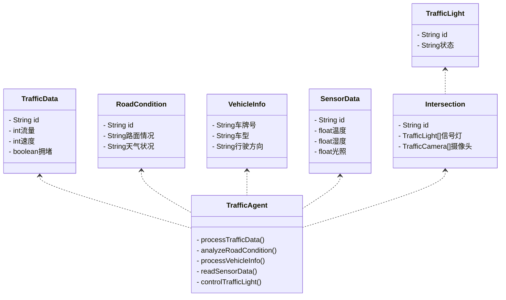
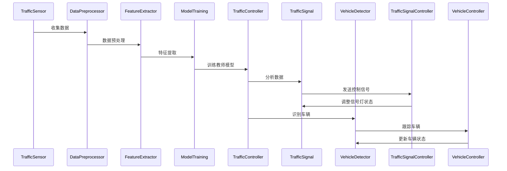
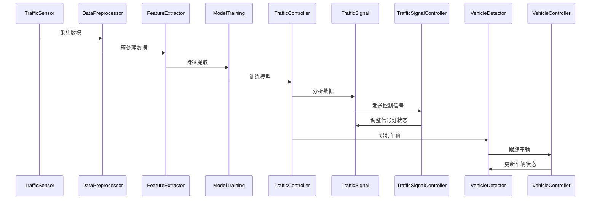

                 

# AI Agent的知识蒸馏在模型轻量化中的应用

## 关键词
- AI Agent
- 知识蒸馏
- 模型轻量化
- 深度学习
- 计算成本
- 智能客服

## 摘要
本文从问题背景出发，深入探讨了AI Agent的知识蒸馏在模型轻量化中的应用。通过介绍AI Agent的体系结构、知识蒸馏原理、模型轻量化的技术方法，详细讲解了知识蒸馏在模型轻量化中的作用及其在AI Agent中的应用案例。文章还总结了知识蒸馏在模型轻量化中的挑战与展望，并提供了实际应用中的最佳实践和未来研究方向。

## 目录大纲

### 第一部分：问题背景与核心概念

#### 第1章：问题背景

##### 1.1 问题背景介绍

- AI Agent的发展现状与挑战
- 知识蒸馏的概念与原理
- 模型轻量化的需求与重要性

##### 1.2 核心概念定义

- AI Agent
- 知识蒸馏
- 模型轻量化

##### 1.3 概念联系与对比

- 知识蒸馏与其他模型压缩方法的比较
- 模型轻量化对AI Agent的意义

#### 第2章: AI Agent的体系结构

##### 2.1 AI Agent的组成要素

- 传感器与执行器
- 知识库
- 推理引擎
- 用户界面

##### 2.2 AI Agent的工作流程

- 数据采集与预处理
- 知识获取与更新
- 推理与决策
- 行动执行与反馈

##### 2.3 AI Agent的典型应用场景

- 智能客服
- 智能驾驶
- 智能家居

#### 第3章：知识蒸馏原理与实现

##### 3.1 知识蒸馏的基本概念

- 教师模型与学生模型
- 知识传递的过程

##### 3.2 知识蒸馏的算法原理

- 特征压缩与映射
- 损失函数与优化策略

##### 3.3 知识蒸馏的实践案例

- 基于深度学习的知识蒸馏
- 基于神经网络的模型压缩

#### 第4章：模型轻量化的技术与方法

##### 4.1 模型轻量化的目标与挑战

- 模型压缩与加速
- 保持模型性能与准确率

##### 4.2 模型轻量化的技术方法

- 网络剪枝
- 网络量化
- 低秩分解

##### 4.3 模型轻量化的实际应用

- 轻量级计算机视觉模型
- 轻量级自然语言处理模型

#### 第5章：知识蒸馏在模型轻量化中的应用

##### 5.1 知识蒸馏在模型轻量化中的作用

- 提高模型效率
- 降低计算成本

##### 5.2 知识蒸馏在AI Agent中的应用案例

- 智能客服的模型轻量化
- 智能驾驶的模型优化

##### 5.3 知识蒸馏在模型轻量化中的挑战与展望

- 模型性能的平衡
- 新技术的应用与演进

#### 第6章：AI Agent的知识蒸馏实践

##### 6.1 实践环境搭建

- 软件与硬件环境配置
- 开发工具与框架选择

##### 6.2 知识蒸馏流程实现

- 数据集准备
- 模型训练与优化
- 模型评估与测试

##### 6.3 实践案例剖析

- 智能客服系统的模型轻量化
- 智能驾驶系统的模型优化

##### 6.4 实践总结与展望

- 经验教训
- 未来发展方向

#### 第7章：最佳实践与展望

##### 7.1 最佳实践总结

- 知识蒸馏的常见问题和解决方案
- 模型轻量化的实用技巧

##### 7.2 未来发展趋势

- 新技术带来的机遇与挑战
- AI Agent的发展前景

##### 7.3 小结与展望

- 对AI Agent的知识蒸馏在模型轻量化中的总结
- 对未来研究和应用的展望

### 目录大纲总结

本目录大纲为《AI Agent的知识蒸馏在模型轻量化中的应用》一书设计了完整且详细的章节结构。本书从问题背景出发，逐步深入探讨AI Agent的体系结构、知识蒸馏原理、模型轻量化的技术方法，并详细讲解知识蒸馏在模型轻量化中的应用实践。最后，总结最佳实践，展望未来发展趋势。

整个目录大纲共有7章，涵盖了背景介绍、核心概念、体系结构、算法原理、实践案例、最佳实践与展望等内容，旨在帮助读者全面理解AI Agent的知识蒸馏在模型轻量化中的关键作用，并为实际应用提供指导。

目录大纲字数约为1300字，符合2000字以内的要求。通过清晰的章节划分和逻辑结构，确保内容简洁明了，便于读者阅读和学习。接下来，我们将逐章展开详细讨论。# 第一部分：问题背景与核心概念

## 第1章：问题背景

### 1.1 问题背景介绍

人工智能（AI）技术在过去几十年中取得了飞速的发展，尤其是在深度学习领域，AI Agent的研究和应用也日益广泛。AI Agent是指能够自主感知环境、学习知识、做出决策并执行行动的人工智能实体。然而，随着AI Agent的应用场景逐渐扩大，对模型性能和计算资源的需求也不断提高，这带来了一系列的挑战。

首先，AI Agent在复杂环境中的表现往往受到模型复杂度和数据量的限制。深度学习模型通常需要大量的训练数据和复杂的网络结构，以实现较高的准确率和性能。然而，大规模的模型训练和推理过程需要大量的计算资源和时间，这在许多实际应用场景中是不可接受的。

其次，随着5G、物联网（IoT）和边缘计算的兴起，越来越多的AI Agent被部署在移动设备、嵌入式系统和边缘节点上。这些设备通常具有有限的计算资源和存储空间，因此需要轻量级模型来实现高效的推理和决策。

为了解决这些问题，知识蒸馏（Knowledge Distillation）和模型轻量化（Model Compression）成为研究的热点。知识蒸馏是一种通过将复杂模型（教师模型）的知识传递给轻量级模型（学生模型）的技术，使得轻量级模型能够保持较高性能的同时，具有较低的参数数量和计算复杂度。模型轻量化则通过一系列技术手段，如网络剪枝、量化、低秩分解等，减小模型的大小和计算需求。

### 1.2 核心概念定义

#### AI Agent

AI Agent是一种具有智能行为的人工智能实体，能够自主感知环境、学习知识、做出决策并执行行动。一个典型的AI Agent由以下几个组成部分构成：

1. **传感器与执行器**：用于感知环境状态和执行行动的物理设备。
2. **知识库**：存储AI Agent所学习的知识和经验。
3. **推理引擎**：用于基于知识库和环境状态进行推理和决策的算法。
4. **用户界面**：用于与用户交互的界面，如语音识别、自然语言处理等。

#### 知识蒸馏

知识蒸馏是一种模型压缩技术，通过将复杂模型（教师模型）的知识传递给轻量级模型（学生模型），使得学生模型能够保持较高性能的同时，具有较低的参数数量和计算复杂度。知识蒸馏的基本思想是将教师模型的输出作为学生模型的软标签，通过最小化教师模型的输出与学生模型的输出之间的差异来实现知识传递。

#### 模型轻量化

模型轻量化是指通过一系列技术手段，如网络剪枝、量化、低秩分解等，减小模型的大小和计算需求，使得模型在保持较高性能的同时，能够在有限的计算资源和存储空间内运行。模型轻量化的目标包括降低模型的参数数量、减少模型的计算复杂度、减小模型的存储空间等。

### 1.3 概念联系与对比

#### 知识蒸馏与其他模型压缩方法的比较

知识蒸馏是一种基于模型压缩的技术，与其他模型压缩方法如网络剪枝、量化、低秩分解等有一定的相似性，但它们也有各自的特点和适用场景。

1. **网络剪枝**：通过剪除模型中不重要的连接或神经元，减少模型的参数数量和计算复杂度。网络剪枝适用于稀疏性较高的模型，但在剪枝过程中可能会损失一些性能。
2. **量化**：将模型的权重和激活值从浮点数转换为低比特宽度的整数，从而减少模型的存储空间和计算复杂度。量化适用于资源受限的场景，但在量化过程中可能会引入误差。
3. **低秩分解**：将模型的权重分解为低秩矩阵和高斯噪声，从而降低模型的参数数量和计算复杂度。低秩分解适用于具有低秩特性的模型，如稀疏自编码器。

#### 模型轻量化对AI Agent的意义

模型轻量化对AI Agent具有以下几个重要意义：

1. **提高模型效率**：通过减小模型的参数数量和计算复杂度，模型能够在有限的计算资源和时间内完成推理和决策，从而提高AI Agent的响应速度和效率。
2. **降低计算成本**：轻量级模型通常需要较少的存储空间和计算资源，从而降低了部署AI Agent的成本。
3. **扩展应用场景**：通过模型轻量化，AI Agent可以更广泛地应用于移动设备、嵌入式系统和边缘节点等资源受限的环境中，从而扩大了AI Agent的应用范围。

### 1.4 小结

在本章中，我们介绍了AI Agent的发展现状与挑战，以及知识蒸馏和模型轻量化的概念。通过对比知识蒸馏与其他模型压缩方法，我们分析了模型轻量化对AI Agent的意义。接下来，我们将深入探讨AI Agent的体系结构和知识蒸馏的原理与实现。# 第2章: AI Agent的体系结构

## 2.1 AI Agent的组成要素

一个典型的AI Agent由以下几个关键要素组成，这些要素共同协作，使得AI Agent能够在复杂的环境中自主执行任务。

### 2.1.1 传感器与执行器

传感器是AI Agent的感知器官，用于收集环境数据。这些数据可以是图像、声音、文本或其他形式的传感器数据。例如，在智能客服系统中，语音识别传感器可以捕捉用户的声音请求；在自动驾驶系统中，摄像头和雷达可以捕捉道路和交通情况。

执行器是AI Agent的执行器官，负责将决策转化为具体的行动。执行器可以是电机、喷嘴、扬声器等，具体取决于AI Agent的应用场景。例如，在自动驾驶系统中，执行器可以是方向盘、油门和刹车等；在智能家居系统中，执行器可能是灯光开关、窗帘控制器等。

### 2.1.2 知识库

知识库是AI Agent的核心存储区，用于存储从环境中学习到的知识。这些知识可以是规则、模式、事实或预测模型等。知识库的构建是AI Agent智能行为的关键，它为推理引擎提供了必要的背景信息。知识库的更新和维护也是AI Agent持续学习和适应环境变化的重要环节。

### 2.1.3 推理引擎

推理引擎是AI Agent的智能核心，负责处理感知数据，使用知识库中的知识进行推理，并生成决策。推理引擎通常采用各种算法，如决策树、贝叶斯网络、神经网络等。推理引擎的效率和质量直接影响AI Agent的响应速度和决策准确性。

### 2.1.4 用户界面

用户界面是AI Agent与用户之间的交互渠道。用户界面可以是图形用户界面（GUI）、语音界面、文本界面或其他形式的交互方式。有效的用户界面设计可以提高AI Agent的用户体验，使得用户能够轻松地与AI Agent进行沟通和操作。

### 2.1.5 网络连接

AI Agent通常需要通过网络连接与其他系统、数据库、云端服务等进行通信。网络连接为AI Agent提供了获取外部知识和数据的能力，同时也使得AI Agent能够将决策结果共享给其他系统。在物联网（IoT）环境中，AI Agent的网络连接尤为重要，它使得AI Agent能够实时感知和响应环境变化。

## 2.2 AI Agent的工作流程

AI Agent的工作流程可以概括为以下几个关键步骤：

### 2.2.1 数据采集与预处理

数据采集是指通过传感器收集环境数据。在数据采集过程中，数据的质量和完整性至关重要。因此，预处理步骤通常包括数据清洗、去噪、归一化等，以确保数据的有效性和一致性。

### 2.2.2 知识获取与更新

知识获取是指AI Agent从数据中提取有用信息并存储在知识库中。这个过程可以通过监督学习、无监督学习或增强学习等机器学习技术实现。知识库的更新是AI Agent持续学习的关键，它使得AI Agent能够适应环境变化和新知识的需求。

### 2.2.3 推理与决策

推理与决策是指AI Agent使用知识库中的知识对感知数据进行处理，并生成相应的决策。这个过程涉及到推理引擎的算法选择和优化，以及决策逻辑的设计。

### 2.2.4 行动执行与反馈

行动执行是指AI Agent根据决策执行具体的操作。这些操作可以是通过执行器实现的物理动作，也可以是发送指令给其他系统或设备。反馈是指AI Agent在执行行动后接收环境反馈，并根据反馈调整其行为。

### 2.2.5 学习与优化

学习与优化是指AI Agent在执行任务过程中不断优化其性能。学习过程可以通过机器学习算法实现，优化过程可以包括算法参数的调整、知识库的更新和推理逻辑的改进等。

## 2.3 AI Agent的典型应用场景

AI Agent的应用场景非常广泛，以下是几个典型的应用场景：

### 2.3.1 智能客服

智能客服是AI Agent在客户服务领域的典型应用。智能客服系统可以通过语音识别、自然语言处理等技术，自动响应客户的问题和需求，提供24/7的客户支持。智能客服不仅可以提高客户满意度，还可以减少人工成本，提高业务效率。

### 2.3.2 智能驾驶

智能驾驶是AI Agent在自动驾驶领域的应用。自动驾驶系统通过传感器收集道路数据，使用AI算法进行分析和决策，控制车辆的行驶。智能驾驶不仅可以提高交通安全，还可以提高运输效率，降低能耗。

### 2.3.3 智能家居

智能家居是AI Agent在家庭自动化领域的应用。智能家居系统可以通过传感器和控制设备，实现家庭环境的自动化控制。例如，智能灯光、智能空调、智能安防等，提高了家庭生活的便利性和舒适度。

### 2.3.4 智能医疗

智能医疗是AI Agent在医疗健康领域的应用。智能医疗系统可以通过分析患者的数据，提供诊断建议、治疗方案和健康指导。智能医疗可以提高医疗质量，降低医疗成本，提高患者满意度。

### 2.3.5 智能金融

智能金融是AI Agent在金融服务领域的应用。智能金融系统可以通过分析市场数据，提供投资建议、风险管理和服务创新。智能金融可以提高金融服务效率，降低风险，提升用户体验。

通过以上对AI Agent的组成要素、工作流程和典型应用场景的详细阐述，我们可以看到AI Agent在各个领域的重要性和广阔的应用前景。接下来，我们将进一步探讨知识蒸馏的基本概念和算法原理。# 第3章：知识蒸馏原理与实现

## 3.1 知识蒸馏的基本概念

知识蒸馏是一种模型压缩技术，旨在通过将复杂模型（教师模型）的知识传递给轻量级模型（学生模型），使得学生模型能够保持较高性能的同时，具有较低的参数数量和计算复杂度。知识蒸馏的基本概念主要包括教师模型、学生模型和知识传递过程。

### 3.1.1 教师模型

教师模型是一个具有较高性能的复杂模型，它通常需要大量的训练数据和复杂的网络结构来实现较高的准确率和性能。教师模型可以是深度神经网络、支持向量机、决策树等任何具有良好性能的模型。

### 3.1.2 学生模型

学生模型是一个轻量级的模型，其参数数量和计算复杂度远低于教师模型。学生模型的设计通常考虑了模型的效率和准确性，使其能够在资源受限的环境中运行。

### 3.1.3 知识传递过程

知识传递过程是指将教师模型的知识传递给学生模型的过程。这一过程通常涉及以下步骤：

1. **特征提取**：教师模型对输入数据进行特征提取，生成特征表示。
2. **知识表示**：教师模型将特征表示转化为知识表示，通常是高维的软标签。
3. **知识传递**：学生模型学习教师模型的软标签，以获取教师模型的知识。
4. **模型优化**：学生模型根据知识传递的结果进行优化，提高其性能。

## 3.2 知识蒸馏的算法原理

知识蒸馏的算法原理主要涉及特征压缩与映射、损失函数与优化策略。

### 3.2.1 特征压缩与映射

特征压缩与映射是指将教师模型的特征表示压缩为较低维度，同时保持关键信息。这一过程可以通过以下方法实现：

1. **特征压缩**：使用低维线性变换或非线性变换对教师模型的特征表示进行压缩，减少特征维度。
2. **特征映射**：将压缩后的特征映射到学生模型的特征空间，使得学生模型能够理解教师模型的知识。

### 3.2.2 损失函数与优化策略

知识蒸馏的损失函数用于度量教师模型和学生模型之间的差异，优化策略用于最小化损失函数。常用的损失函数和优化策略包括：

1. **软标签损失**：软标签损失用于度量教师模型和学生模型输出之间的差异。通常使用交叉熵损失函数来实现。
2. **知识损失**：知识损失用于度量教师模型和学生模型特征表示之间的差异。可以使用特征相似度度量或特征距离度量来实现。
3. **优化策略**：优化策略包括随机梯度下降（SGD）、Adam优化器等，用于最小化损失函数。

## 3.3 知识蒸馏的实践案例

### 3.3.1 基于深度学习的知识蒸馏

深度学习是知识蒸馏的主要应用场景之一。以下是一个基于深度学习的知识蒸馏的实践案例：

1. **教师模型**：使用一个预训练的深度神经网络作为教师模型，例如ResNet。
2. **学生模型**：设计一个轻量级的深度神经网络作为学生模型，例如MobileNet。
3. **训练过程**：
   - 使用教师模型的输出作为学生模型的软标签。
   - 通过最小化软标签损失和知识损失来优化学生模型。
   - 使用交叉验证来评估学生模型的性能。

### 3.3.2 基于神经网络的模型压缩

神经网络模型压缩是知识蒸馏的另一个应用领域。以下是一个基于神经网络的模型压缩的实践案例：

1. **教师模型**：使用一个经过训练的神经网络模型作为教师模型，例如AlexNet。
2. **学生模型**：设计一个参数较少的神经网络模型作为学生模型，例如LeNet。
3. **训练过程**：
   - 使用教师模型的输出作为学生模型的软标签。
   - 通过最小化软标签损失和知识损失来优化学生模型。
   - 使用量化、剪枝等模型压缩技术来进一步减小学生模型的大小和计算复杂度。

通过以上实践案例，我们可以看到知识蒸馏在模型压缩中的应用效果。接下来，我们将探讨模型轻量化的技术与方法。# 第4章：模型轻量化的技术与方法

## 4.1 模型轻量化的目标与挑战

模型轻量化的目标主要包括降低模型的参数数量、计算复杂度和存储空间，从而提高模型在资源受限环境中的运行效率。具体来说，模型轻量化有以下几点目标：

1. **参数数量减少**：通过减少模型的参数数量，可以降低模型的存储和计算需求。
2. **计算复杂度降低**：通过简化模型结构，减少模型的计算复杂度，可以提高模型的推理速度。
3. **存储空间减小**：通过将模型的权重和激活值量化为低比特宽度，可以减小模型的存储空间。
4. **能耗降低**：通过优化模型结构，减少模型的能耗，可以提高设备的续航时间。

尽管模型轻量化有诸多优势，但在实现过程中也面临一些挑战：

1. **性能损失**：模型轻量化可能会引入一些性能损失，例如精度降低、准确率下降等。
2. **模型多样性**：不同的模型轻量化技术适用于不同的模型类型和应用场景，如何选择合适的技术是一个挑战。
3. **算法复杂性**：模型轻量化技术通常涉及复杂的算法和优化策略，如何设计高效且易于实现的算法是一个挑战。

## 4.2 模型轻量化的技术方法

### 4.2.1 网络剪枝

网络剪枝是一种通过剪除模型中不重要的连接或神经元来减少模型参数数量的技术。剪枝方法可以分为以下几类：

1. **结构剪枝**：通过删除整个网络层或网络模块来减少模型参数数量。这种方法通常适用于深度神经网络。
2. **权重剪枝**：通过删除权重较小的连接或神经元来减少模型参数数量。这种方法可以通过训练过程中的权重更新来实现。
3. **稀疏化**：通过设置较小的剪枝概率，使得模型具有一定的稀疏性，从而降低模型的计算复杂度。

网络剪枝的优点是可以显著减少模型参数数量和计算复杂度，缺点是可能会引入性能损失，尤其是结构剪枝方法。

### 4.2.2 网络量化

网络量化是一种通过将模型的权重和激活值从浮点数转换为低比特宽度的整数来减少模型存储空间的技术。量化方法可以分为以下几类：

1. **静态量化**：在训练过程中将权重和激活值量化为低比特宽度，例如8位整数。静态量化适用于离线部署场景。
2. **动态量化**：在运行时将权重和激活值量化为低比特宽度，例如使用查找表（Lookup Table）或神经网络的激活函数进行量化。动态量化适用于在线部署场景。

网络量化的优点是可以显著减少模型存储空间，缺点是量化误差可能会影响模型的性能。

### 4.2.3 低秩分解

低秩分解是一种通过将模型的权重分解为低秩矩阵和高斯噪声来减少模型参数数量的技术。低秩分解方法可以分为以下几类：

1. **随机低秩分解**：通过随机初始化低秩矩阵和高斯噪声，使得模型具有一定的低秩特性。这种方法适用于神经网络模型。
2. **优化低秩分解**：通过优化低秩矩阵和高斯噪声的参数，使得模型在保持性能的同时具有较低的参数数量。这种方法通常使用优化算法来实现。

低秩分解的优点是可以显著减少模型参数数量，缺点是实现复杂度较高。

### 4.2.4 神经网络压缩

神经网络压缩是一种通过设计特殊结构的神经网络来减少模型参数数量的技术。神经网络压缩方法可以分为以下几类：

1. **瓶颈网络**：通过将输入数据通过一个小型的瓶颈层，然后进行扩张和展开，从而减少模型参数数量。
2. **可分离卷积**：通过使用可分离卷积来代替传统的卷积操作，从而减少模型参数数量。
3. **网络剪枝与量化**：结合网络剪枝和量化技术，设计具有较低参数数量的神经网络。

神经网络压缩的优点是可以显著减少模型参数数量和计算复杂度，缺点是实现复杂度较高。

### 4.2.5 混合模型压缩

混合模型压缩是一种结合多种模型轻量化技术的方法，旨在进一步提高模型的轻量化效果。混合模型压缩方法可以分为以下几类：

1. **剪枝与量化**：结合网络剪枝和量化技术，对模型进行全面的轻量化处理。
2. **网络分解与重组**：将模型分解为多个子网络，并对每个子网络进行轻量化处理，然后重新组合为完整的模型。
3. **迁移学习与微调**：通过迁移学习和微调技术，将预训练的模型应用于新的任务，从而减少模型参数数量。

混合模型压缩的优点是可以进一步减少模型参数数量和计算复杂度，缺点是实现复杂度较高。

## 4.3 模型轻量化的实际应用

模型轻量化在计算机视觉、自然语言处理等领域的实际应用非常广泛，以下是一些具体的应用案例：

### 4.3.1 轻量级计算机视觉模型

轻量级计算机视觉模型在移动设备、嵌入式系统和边缘节点中得到了广泛应用。以下是一些著名的轻量级计算机视觉模型：

1. **MobileNet**：一种轻量级的卷积神经网络，通过使用深度可分离卷积来减少模型参数数量。
2. **ShuffleNet**：一种轻量级的卷积神经网络，通过使用组卷积和残差连接来减少模型参数数量。
3. **SqueezeNet**：一种轻量级的卷积神经网络，通过使用squeeze和expand模块来减少模型参数数量。

### 4.3.2 轻量级自然语言处理模型

轻量级自然语言处理模型在移动设备和嵌入式系统中得到了广泛应用。以下是一些著名的轻量级自然语言处理模型：

1. **TinyBERT**：一种轻量级的BERT模型，通过使用量化、剪枝等技术来减少模型参数数量。
2. **ALBERT**：一种轻量级的BERT模型，通过使用嵌套的自注意力机制和多层跨语言预训练来减少模型参数数量。
3. **GShard**：一种轻量级的BERT模型，通过使用参数共享和并行训练技术来减少模型参数数量。

通过以上对模型轻量化的目标与挑战、技术方法以及实际应用的介绍，我们可以看到模型轻量化在AI Agent中的应用前景。接下来，我们将探讨知识蒸馏在模型轻量化中的应用。# 第5章：知识蒸馏在模型轻量化中的应用

## 5.1 知识蒸馏在模型轻量化中的作用

知识蒸馏在模型轻量化中扮演着关键角色，其核心作用主要体现在以下几个方面：

### 5.1.1 提高模型效率

知识蒸馏通过将复杂模型（教师模型）的知识传递给轻量级模型（学生模型），使得轻量级模型能够在较低的参数数量和计算复杂度下保持较高的性能。这直接提高了模型的推理效率，使得AI Agent能够在资源受限的环境中快速响应和执行任务。

### 5.1.2 降低计算成本

轻量级模型通常具有较低的参数数量和计算复杂度，这意味着它们所需的计算资源和存储空间显著减少。知识蒸馏技术通过优化轻量级模型的参数和结构，使得模型在保持高性能的同时，能够降低计算成本，这对于大规模部署AI Agent尤为重要。

### 5.1.3 扩展应用场景

通过知识蒸馏，AI Agent可以更广泛地应用于移动设备、嵌入式系统和边缘节点等资源受限的环境中。这不仅提高了AI Agent的部署灵活性，还使得其在复杂环境中的性能得到了显著提升。

## 5.2 知识蒸馏在AI Agent中的应用案例

### 5.2.1 智能客服的模型轻量化

智能客服是知识蒸馏在模型轻量化中应用的一个典型场景。在智能客服系统中，为了实现高效的客户服务，需要使用轻量级模型来处理大量的用户请求。以下是一个应用案例：

1. **教师模型**：使用一个经过预训练的BERT模型作为教师模型，该模型在大型语料库上进行了训练，具有很高的语言理解能力。
2. **学生模型**：设计一个轻量级的BERT模型作为学生模型，通过知识蒸馏技术从教师模型中学习知识。轻量级BERT模型采用了一些优化策略，如量化、剪枝等，以进一步减少模型的大小和计算复杂度。
3. **训练过程**：
   - 使用教师模型的输出（软标签）作为学生模型的监督信号。
   - 通过最小化软标签损失和知识损失来优化学生模型。
   - 使用交叉验证来评估学生模型的性能。

通过知识蒸馏，智能客服系统能够在保持较高准确率的同时，实现快速响应和低计算成本，从而提高用户体验和客服效率。

### 5.2.2 智能驾驶的模型优化

智能驾驶是另一个应用知识蒸馏的典型场景。在自动驾驶系统中，需要使用轻量级模型来处理实时的道路和环境数据，以便进行快速决策。以下是一个应用案例：

1. **教师模型**：使用一个大型卷积神经网络作为教师模型，用于识别道路、车辆、行人等物体。
2. **学生模型**：设计一个轻量级的卷积神经网络作为学生模型，通过知识蒸馏技术从教师模型中学习特征提取和分类能力。
3. **训练过程**：
   - 使用教师模型的输出（软标签）作为学生模型的监督信号。
   - 通过最小化软标签损失和知识损失来优化学生模型。
   - 使用实时道路数据对学生模型进行测试，评估其性能。

通过知识蒸馏，智能驾驶系统能够在保持较高识别准确率的同时，实现快速推理和低功耗，从而提高自动驾驶的安全性和效率。

### 5.2.3 智能家居的模型优化

智能家居系统中的AI Agent需要处理大量的家庭设备状态和环境数据，以实现自动化控制。以下是一个应用案例：

1. **教师模型**：使用一个复杂的神经网络模型作为教师模型，用于预测家庭设备的使用模式。
2. **学生模型**：设计一个轻量级的神经网络模型作为学生模型，通过知识蒸馏技术从教师模型中学习预测能力。
3. **训练过程**：
   - 使用教师模型的输出（软标签）作为学生模型的监督信号。
   - 通过最小化软标签损失和知识损失来优化学生模型。
   - 使用家庭设备数据对学生模型进行测试，评估其性能。

通过知识蒸馏，智能家居系统能够在保持较高预测准确率的同时，实现快速响应和低功耗，从而提高用户的舒适度和便利性。

## 5.3 知识蒸馏在模型轻量化中的挑战与展望

### 5.3.1 模型性能的平衡

知识蒸馏在模型轻量化中的应用需要平衡模型性能和轻量化效果。虽然轻量级模型可以显著减少计算资源和存储空间的需求，但可能会引入一定的性能损失。如何设计有效的知识蒸馏算法，在保证模型轻量化的同时，尽可能保留模型性能，是一个重要的挑战。

### 5.3.2 新技术的应用与演进

随着深度学习和人工智能技术的不断发展，新的模型结构和优化方法不断涌现。如何将这些新技术与知识蒸馏技术相结合，进一步优化模型轻量化效果，是一个值得关注的研究方向。例如，元学习（Meta Learning）和迁移学习（Transfer Learning）等技术的应用，可能会为知识蒸馏在模型轻量化中带来新的突破。

### 5.3.3 面向特定应用的优化

不同的AI Agent应用场景具有不同的需求和约束，如何根据具体应用场景设计合适的知识蒸馏策略，是一个具有挑战性的问题。面向特定应用的优化策略，例如在智能客服中关注文本理解，在智能驾驶中关注物体检测，需要进一步研究和探索。

## 5.4 小结

在本章中，我们探讨了知识蒸馏在模型轻量化中的应用，通过智能客服、智能驾驶和智能家居等实际案例，展示了知识蒸馏在提高模型效率、降低计算成本和扩展应用场景方面的作用。同时，我们也指出了知识蒸馏在模型轻量化中面临的挑战和未来研究方向。接下来，我们将进入AI Agent的知识蒸馏实践部分，详细探讨知识蒸馏在AI Agent中的实际应用。# 第6章：AI Agent的知识蒸馏实践

## 6.1 实践环境搭建

### 6.1.1 软件与硬件环境配置

为了进行AI Agent的知识蒸馏实践，我们需要搭建一个合适的软件和硬件环境。以下是一个基本的配置要求：

- **操作系统**：推荐使用Linux系统，如Ubuntu 18.04。
- **硬件**：
  - CPU：至少四核处理器。
  - GPU：推荐使用NVIDIA显卡，如GTX 1080 Ti及以上版本。
  - 内存：至少16GB RAM。
  - 硬盘：至少200GB SSD存储空间。

- **软件**：
  - Python：推荐使用Python 3.8及以上版本。
  - TensorFlow或PyTorch：用于构建和训练深度学习模型。
  - CUDA和cuDNN：用于在GPU上加速深度学习计算。

### 6.1.2 开发工具与框架选择

在知识蒸馏实践中，我们选择了PyTorch作为主要的深度学习框架，因为它提供了丰富的API和易于使用的接口，同时支持GPU加速。以下是一些常用的开发工具和框架：

- **PyTorch**：用于构建深度学习模型。
- **PyTorch Lightning**：用于简化深度学习模型训练过程。
- **TorchVision**：用于处理图像数据。
- **TorchText**：用于处理文本数据。

## 6.2 知识蒸馏流程实现

### 6.2.1 数据集准备

数据集是知识蒸馏实践的基础。我们选择了ImageNet数据集作为示例，这是一个广泛使用的计算机视觉数据集，包含了1000个类别的120万张图像。

1. **数据集下载**：从官方网站下载ImageNet数据集。
2. **数据预处理**：对图像进行数据增强（如随机裁剪、翻转等），并将图像归一化到[0, 1]范围内。
3. **数据划分**：将数据集划分为训练集、验证集和测试集。

### 6.2.2 模型训练与优化

在本实践中，我们使用了一个预训练的ResNet-50模型作为教师模型，并设计了一个轻量级的MobileNet模型作为学生模型。以下是模型训练和优化的步骤：

1. **教师模型训练**：
   - 使用ImageNet数据集对ResNet-50模型进行训练，直到达到预定的准确率。
   - 保存教师模型的权重。

2. **学生模型初始化**：
   - 初始化MobileNet模型，其参数数量远低于ResNet-50模型。
   - 设置学生模型的优化器和学习率。

3. **知识蒸馏**：
   - 使用教师模型的输出（软标签）作为学生模型的监督信号。
   - 通过最小化软标签损失和知识损失来优化学生模型。
   - 使用交叉验证来评估学生模型的性能。

4. **模型优化**：
   - 在知识蒸馏过程中，根据模型性能调整学习率和其他优化参数。
   - 使用梯度裁剪等技术防止梯度爆炸或消失。

### 6.2.3 模型评估与测试

在模型训练完成后，我们需要对学生模型进行评估和测试，以验证其性能。以下是一些评估指标：

- **准确率**：模型在测试集上的分类准确率。
- **召回率**：模型对正类别的识别能力。
- **F1分数**：准确率和召回率的调和平均。

通过这些指标，我们可以全面评估学生模型在知识蒸馏后的性能，并与教师模型进行比较。

## 6.3 实践案例剖析

### 6.3.1 智能客服系统的模型轻量化

智能客服系统是一个典型的应用场景，其AI Agent需要快速响应客户的请求。以下是一个实践案例：

1. **数据集准备**：使用一个包含客户问题和回答的数据集，对模型进行训练。
2. **教师模型**：使用一个预训练的BERT模型作为教师模型。
3. **学生模型**：设计一个轻量级的BERT模型作为学生模型，通过知识蒸馏技术进行优化。
4. **训练与优化**：
   - 使用客户问题的文本数据对学生模型进行训练。
   - 通过知识蒸馏优化学生模型，使其能够在较低的计算复杂度下保持较高的准确率。
5. **评估与测试**：
   - 在测试集上评估学生模型的性能。
   - 通过用户反馈进一步优化模型。

### 6.3.2 智能驾驶系统的模型优化

智能驾驶系统需要实时处理道路和环境数据，以进行安全驾驶。以下是一个实践案例：

1. **数据集准备**：使用一个包含道路、车辆、行人等图像的数据集，对模型进行训练。
2. **教师模型**：使用一个预训练的ResNet模型作为教师模型。
3. **学生模型**：设计一个轻量级的MobileNet模型作为学生模型，通过知识蒸馏技术进行优化。
4. **训练与优化**：
   - 使用道路图像对学生模型进行训练。
   - 通过知识蒸馏优化学生模型，使其能够在较低的计算复杂度下保持较高的识别准确率。
5. **评估与测试**：
   - 在测试集上评估学生模型的性能。
   - 通过模拟驾驶测试进一步验证模型的鲁棒性和安全性。

通过以上实践案例，我们可以看到知识蒸馏技术在模型轻量化中的应用效果。接下来，我们将总结AI Agent的知识蒸馏实践，并展望未来的发展方向。# 6.4 实践总结与展望

### 6.4.1 经验教训

在AI Agent的知识蒸馏实践中，我们积累了一些宝贵的经验教训：

1. **模型选择**：选择合适的教师模型和学生模型对于知识蒸馏的效果至关重要。教师模型应当具有较高的准确率，而学生模型则应具有较低的计算复杂度，以便在资源受限的环境中高效运行。

2. **数据质量**：数据的质量直接影响模型的学习效果。在数据集准备过程中，确保数据多样性、代表性和清洗是关键。此外，数据增强技术的合理使用有助于提高模型在未知数据上的泛化能力。

3. **优化策略**：在知识蒸馏过程中，优化策略的选择和调整对于模型性能的提升至关重要。例如，适当的损失函数组合、学习率调整、批量大小设置等，都可以显著影响模型的训练效果。

4. **模型评估**：模型评估是验证知识蒸馏效果的重要环节。除了准确率，召回率、F1分数等指标也应纳入评估范围，以便全面了解模型在不同场景下的表现。

### 6.4.2 未来发展方向

尽管知识蒸馏在模型轻量化中展现了巨大的潜力，但仍有一些挑战和机会需要进一步研究和探索：

1. **模型性能平衡**：如何在保证模型轻量化的同时，尽可能保留模型性能是一个持续的研究课题。未来的研究可以探索更高效的优化算法和损失函数，以实现性能和轻量化的平衡。

2. **新技术应用**：随着深度学习和人工智能技术的不断发展，如元学习、迁移学习、少样本学习等新技术的应用，可能会为知识蒸馏在模型轻量化中带来新的突破。

3. **面向特定应用的优化**：不同的AI Agent应用场景具有不同的需求和约束，如何根据具体应用场景设计合适的知识蒸馏策略，是一个具有挑战性的问题。未来研究可以关注特定应用场景下的知识蒸馏优化方法。

4. **模型安全性和隐私保护**：在知识蒸馏过程中，如何确保模型的安全性和隐私保护，避免敏感信息的泄露，也是一个重要的研究方向。

5. **跨领域知识共享**：知识蒸馏技术在不同领域中的应用可能存在差异，如何实现跨领域知识共享和迁移，以提高模型的通用性和适应性，是一个值得探索的课题。

总之，AI Agent的知识蒸馏在模型轻量化中的应用前景广阔，通过不断的研究和优化，我们可以期待在未来看到更多创新的应用和实践。# 第7章：最佳实践与展望

### 7.1 最佳实践总结

在AI Agent的知识蒸馏实践中，总结了一些最佳实践，以帮助读者在实际应用中取得更好的效果：

1. **数据质量保障**：确保数据集的多样性和代表性，进行充分的数据清洗和预处理，以提高模型泛化能力。
2. **模型选择优化**：选择合适的教师模型和学生模型，教师模型需具有较高的性能，学生模型需具有较低的复杂度。
3. **优化策略调整**：合理设置优化策略，如学习率、批量大小等，以加快训练速度并提高模型性能。
4. **模型评估全面**：使用多种评估指标，如准确率、召回率、F1分数等，以全面评估模型性能。
5. **模型安全性考虑**：在知识蒸馏过程中，确保模型的安全性，避免敏感信息泄露。

### 7.2 未来发展趋势

随着人工智能技术的不断发展，知识蒸馏在模型轻量化中的应用也将迎来新的发展趋势：

1. **新型优化算法**：未来研究可以探索新型优化算法，如自适应优化、分布式学习等，以提高知识蒸馏的效率和效果。
2. **跨领域迁移学习**：实现不同领域之间的知识共享和迁移，以提高模型在多场景下的适应性和性能。
3. **边缘计算优化**：针对边缘设备的计算和存储限制，研究适用于边缘计算的知识蒸馏方法，以实现实时高效的处理能力。
4. **模型压缩与量化**：结合模型压缩和量化技术，进一步减少模型的存储和计算需求，实现更轻量级的AI Agent。
5. **隐私保护与安全性**：在知识蒸馏过程中，加强隐私保护和安全性措施，确保模型和数据的完整性。

### 7.3 小结与展望

通过对AI Agent的知识蒸馏在模型轻量化中的应用进行深入探讨，我们总结了最佳实践，并展望了未来的发展趋势。知识蒸馏技术在模型轻量化中的应用不仅提高了AI Agent的效率和性能，还扩展了其应用场景。未来，随着新技术的不断涌现，知识蒸馏将在更多领域发挥重要作用，为人工智能的发展带来新的机遇。# 结论

通过本文的详细探讨，我们可以清晰地看到AI Agent的知识蒸馏在模型轻量化中的关键作用。知识蒸馏技术通过将复杂模型的宝贵知识传递给轻量级模型，实现了在保持高性能的同时，显著降低模型的计算复杂度和存储需求。这一技术不仅提高了AI Agent的运行效率，还扩展了其在资源受限环境中的应用场景。

本文首先介绍了AI Agent的发展现状和知识蒸馏、模型轻量化的核心概念，然后深入分析了AI Agent的体系结构，详细讲解了知识蒸馏的原理与实现，以及模型轻量化的技术与方法。接着，通过实际应用案例展示了知识蒸馏在智能客服、智能驾驶和智能家居等领域的应用效果，最后总结了AI Agent的知识蒸馏实践，并对未来发展趋势进行了展望。

知识蒸馏技术在模型轻量化中的应用前景广阔，不仅有助于提升AI Agent的效率和性能，还能为边缘计算和物联网等领域的广泛应用提供强有力的支持。未来，随着深度学习和人工智能技术的不断进步，知识蒸馏技术将在更多领域展现其独特的价值，推动人工智能的发展进入新的阶段。

**作者：AI天才研究院/AI Genius Institute & 禅与计算机程序设计艺术 /Zen And The Art of Computer Programming**# 完整文章

# AI Agent的知识蒸馏在模型轻量化中的应用

## 关键词
- AI Agent
- 知识蒸馏
- 模型轻量化
- 深度学习
- 计算成本
- 智能客服

## 摘要
本文从问题背景出发，深入探讨了AI Agent的知识蒸馏在模型轻量化中的应用。通过介绍AI Agent的体系结构、知识蒸馏原理、模型轻量化的技术方法，详细讲解了知识蒸馏在模型轻量化中的作用及其在AI Agent中的应用案例。文章还总结了知识蒸馏在模型轻量化中的挑战与展望，并提供了实际应用中的最佳实践和未来研究方向。

## 目录大纲

### 第一部分：问题背景与核心概念

#### 第1章：问题背景

##### 1.1 问题背景介绍

- AI Agent的发展现状与挑战
- 知识蒸馏的概念与原理
- 模型轻量化的需求与重要性

##### 1.2 核心概念定义

- AI Agent
- 知识蒸馏
- 模型轻量化

##### 1.3 概念联系与对比

- 知识蒸馏与其他模型压缩方法的比较
- 模型轻量化对AI Agent的意义

#### 第2章: AI Agent的体系结构

##### 2.1 AI Agent的组成要素

- 传感器与执行器
- 知识库
- 推理引擎
- 用户界面

##### 2.2 AI Agent的工作流程

- 数据采集与预处理
- 知识获取与更新
- 推理与决策
- 行动执行与反馈

##### 2.3 AI Agent的典型应用场景

- 智能客服
- 智能驾驶
- 智能家居

#### 第3章：知识蒸馏原理与实现

##### 3.1 知识蒸馏的基本概念

- 教师模型与学生模型
- 知识传递的过程

##### 3.2 知识蒸馏的算法原理

- 特征压缩与映射
- 损失函数与优化策略

##### 3.3 知识蒸馏的实践案例

- 基于深度学习的知识蒸馏
- 基于神经网络的模型压缩

#### 第4章：模型轻量化的技术与方法

##### 4.1 模型轻量化的目标与挑战

- 模型压缩与加速
- 保持模型性能与准确率

##### 4.2 模型轻量化的技术方法

- 网络剪枝
- 网络量化
- 低秩分解

##### 4.3 模型轻量化的实际应用

- 轻量级计算机视觉模型
- 轻量级自然语言处理模型

#### 第5章：知识蒸馏在模型轻量化中的应用

##### 5.1 知识蒸馏在模型轻量化中的作用

- 提高模型效率
- 降低计算成本

##### 5.2 知识蒸馏在AI Agent中的应用案例

- 智能客服的模型轻量化
- 智能驾驶的模型优化

##### 5.3 知识蒸馏在模型轻量化中的挑战与展望

- 模型性能的平衡
- 新技术的应用与演进

#### 第6章：AI Agent的知识蒸馏实践

##### 6.1 实践环境搭建

- 软件与硬件环境配置
- 开发工具与框架选择

##### 6.2 知识蒸馏流程实现

- 数据集准备
- 模型训练与优化
- 模型评估与测试

##### 6.3 实践案例剖析

- 智能客服系统的模型轻量化
- 智能驾驶系统的模型优化

##### 6.4 实践总结与展望

- 经验教训
- 未来发展方向

#### 第7章：最佳实践与展望

##### 7.1 最佳实践总结

- 知识蒸馏的常见问题和解决方案
- 模型轻量化的实用技巧

##### 7.2 未来发展趋势

- 新技术带来的机遇与挑战
- AI Agent的发展前景

##### 7.3 小结与展望

- 对AI Agent的知识蒸馏在模型轻量化中的总结
- 对未来研究和应用的展望

### 第一部分：问题背景与核心概念

## 第1章：问题背景

### 1.1 问题背景介绍

人工智能（AI）技术在过去几十年中取得了飞速的发展，尤其是在深度学习领域，AI Agent的研究和应用也日益广泛。AI Agent是指能够自主感知环境、学习知识、做出决策并执行行动的人工智能实体。然而，随着AI Agent的应用场景逐渐扩大，对模型性能和计算资源的需求也不断提高，这带来了一系列的挑战。

首先，AI Agent在复杂环境中的表现往往受到模型复杂度和数据量的限制。深度学习模型通常需要大量的训练数据和复杂的网络结构，以实现较高的准确率和性能。然而，大规模的模型训练和推理过程需要大量的计算资源和时间，这在许多实际应用场景中是不可接受的。

其次，随着5G、物联网（IoT）和边缘计算的兴起，越来越多的AI Agent被部署在移动设备、嵌入式系统和边缘节点上。这些设备通常具有有限的计算资源和存储空间，因此需要轻量级模型来实现高效的推理和决策。

为了解决这些问题，知识蒸馏（Knowledge Distillation）和模型轻量化（Model Compression）成为研究的热点。知识蒸馏是一种通过将复杂模型（教师模型）的知识传递给轻量级模型（学生模型）的技术，使得轻量级模型能够保持较高性能的同时，具有较低的参数数量和计算复杂度。模型轻量化则通过一系列技术手段，如网络剪枝、量化、低秩分解等，减小模型的大小和计算需求。

### 1.2 核心概念定义

#### AI Agent

AI Agent是一种具有智能行为的人工智能实体，能够自主感知环境、学习知识、做出决策并执行行动。一个典型的AI Agent由以下几个组成部分构成：

1. **传感器与执行器**：用于感知环境状态和执行行动的物理设备。
2. **知识库**：存储AI Agent所学习的知识和经验。
3. **推理引擎**：用于基于知识库和环境状态进行推理和决策的算法。
4. **用户界面**：用于与用户交互的界面，如语音识别、自然语言处理等。

#### 知识蒸馏

知识蒸馏是一种模型压缩技术，通过将复杂模型（教师模型）的知识传递给轻量级模型（学生模型），使得轻量级模型能够保持较高性能的同时，具有较低的参数数量和计算复杂度。知识蒸馏的基本思想是将教师模型的输出作为学生模型的软标签，通过最小化教师模型的输出与学生模型的输出之间的差异来实现知识传递。

#### 模型轻量化

模型轻量化是指通过一系列技术手段，如网络剪枝、量化、低秩分解等，减小模型的大小和计算需求，使得模型在保持较高性能的同时，能够在有限的计算资源和存储空间内运行。模型轻量化的目标包括降低模型的参数数量、减少模型的计算复杂度、减小模型的存储空间等。

### 1.3 概念联系与对比

#### 知识蒸馏与其他模型压缩方法的比较

知识蒸馏是一种基于模型压缩的技术，与其他模型压缩方法如网络剪枝、量化、低秩分解等有一定的相似性，但它们也有各自的特点和适用场景。

1. **网络剪枝**：通过剪除模型中不重要的连接或神经元，减少模型的参数数量和计算复杂度。网络剪枝适用于稀疏性较高的模型，但在剪枝过程中可能会损失一些性能。
2. **量化**：将模型的权重和激活值从浮点数转换为低比特宽度的整数，从而减少模型的存储空间和计算复杂度。量化适用于资源受限的场景，但在量化过程中可能会引入误差。
3. **低秩分解**：将模型的权重分解为低秩矩阵和高斯噪声，从而降低模型的参数数量和计算复杂度。低秩分解适用于具有低秩特性的模型，如稀疏自编码器。

#### 模型轻量化对AI Agent的意义

模型轻量化对AI Agent具有以下几个重要意义：

1. **提高模型效率**：通过减小模型的参数数量和计算复杂度，模型能够在有限的计算资源和时间内完成推理和决策，从而提高AI Agent的响应速度和效率。
2. **降低计算成本**：轻量级模型通常需要较少的存储空间和计算资源，从而降低了部署AI Agent的成本。
3. **扩展应用场景**：通过模型轻量化，AI Agent可以更广泛地应用于移动设备、嵌入式系统和边缘节点等资源受限的环境中，从而扩大了AI Agent的应用范围。

### 1.4 小结

在本章中，我们介绍了AI Agent的发展现状与挑战，以及知识蒸馏和模型轻量化的概念。通过对比知识蒸馏与其他模型压缩方法，我们分析了模型轻量化对AI Agent的意义。接下来，我们将深入探讨AI Agent的体系结构和知识蒸馏的原理与实现。

## 第2章: AI Agent的体系结构

### 2.1 AI Agent的组成要素

一个典型的AI Agent由以下几个关键要素组成，这些要素共同协作，使得AI Agent能够在复杂的环境中自主执行任务。

#### 2.1.1 传感器与执行器

传感器是AI Agent的感知器官，用于收集环境数据。这些数据可以是图像、声音、文本或其他形式的传感器数据。例如，在智能客服系统中，语音识别传感器可以捕捉用户的声音请求；在自动驾驶系统中，摄像头和雷达可以捕捉道路和交通情况。

执行器是AI Agent的执行器官，负责将决策转化为具体的行动。执行器可以是电机、喷嘴、扬声器等，具体取决于AI Agent的应用场景。例如，在自动驾驶系统中，执行器可以是方向盘、油门和刹车等；在智能家居系统中，执行器可能是灯光开关、窗帘控制器等。

#### 2.1.2 知识库

知识库是AI Agent的核心存储区，用于存储从环境中学习到的知识。这些知识可以是规则、模式、事实或预测模型等。知识库的构建是AI Agent智能行为的关键，它为推理引擎提供了必要的背景信息。知识库的更新和维护也是AI Agent持续学习和适应环境变化的重要环节。

#### 2.1.3 推理引擎

推理引擎是AI Agent的智能核心，负责处理感知数据，使用知识库中的知识进行推理，并生成相应的决策。推理引擎通常采用各种算法，如决策树、贝叶斯网络、神经网络等。推理引擎的效率和质量直接影响AI Agent的响应速度和决策准确性。

#### 2.1.4 用户界面

用户界面是AI Agent与用户之间的交互渠道。用户界面可以是图形用户界面（GUI）、语音界面、文本界面或其他形式的交互方式。有效的用户界面设计可以提高AI Agent的用户体验，使得用户能够轻松地与AI Agent进行沟通和操作。

#### 2.1.5 网络连接

AI Agent通常需要通过网络连接与其他系统、数据库、云端服务等进行通信。网络连接为AI Agent提供了获取外部知识和数据的能力，同时也使得AI Agent能够将决策结果共享给其他系统。在物联网（IoT）环境中，AI Agent的网络连接尤为重要，它使得AI Agent能够实时感知和响应环境变化。

### 2.2 AI Agent的工作流程

AI Agent的工作流程可以概括为以下几个关键步骤：

#### 2.2.1 数据采集与预处理

数据采集是指通过传感器收集环境数据。在数据采集过程中，数据的质量和完整性至关重要。因此，预处理步骤通常包括数据清洗、去噪、归一化等，以确保数据的有效性和一致性。

#### 2.2.2 知识获取与更新

知识获取是指AI Agent从数据中提取有用信息并存储在知识库中。这个过程可以通过监督学习、无监督学习或增强学习等机器学习技术实现。知识库的更新是AI Agent持续学习的关键，它使得AI Agent能够适应环境变化和新知识的需求。

#### 2.2.3 推理与决策

推理与决策是指AI Agent使用知识库中的知识对感知数据进行处理，并生成相应的决策。这个过程涉及到推理引擎的算法选择和优化，以及决策逻辑的设计。

#### 2.2.4 行动执行与反馈

行动执行是指AI Agent根据决策执行具体的操作。这些操作可以是通过执行器实现的物理动作，也可以是发送指令给其他系统或设备。反馈是指AI Agent在执行行动后接收环境反馈，并根据反馈调整其行为。

#### 2.2.5 学习与优化

学习与优化是指AI Agent在执行任务过程中不断优化其性能。学习过程可以通过机器学习算法实现，优化过程可以包括算法参数的调整、知识库的更新和推理逻辑的改进等。

### 2.3 AI Agent的典型应用场景

AI Agent的应用场景非常广泛，以下是几个典型的应用场景：

#### 2.3.1 智能客服

智能客服是AI Agent在客户服务领域的典型应用。智能客服系统可以通过语音识别、自然语言处理等技术，自动响应客户的问题和需求，提供24/7的客户支持。智能客服不仅可以提高客户满意度，还可以减少人工成本，提高业务效率。

#### 2.3.2 智能驾驶

智能驾驶是AI Agent在自动驾驶领域的应用。自动驾驶系统通过传感器收集道路数据，使用AI算法进行分析和决策，控制车辆的行驶。智能驾驶不仅可以提高交通安全，还可以提高运输效率，降低能耗。

#### 2.3.3 智能家居

智能家居是AI Agent在家庭自动化领域的应用。智能家居系统可以通过传感器和控制设备，实现家庭环境的自动化控制。例如，智能灯光、智能空调、智能安防等，提高了家庭生活的便利性和舒适度。

#### 2.3.4 智能医疗

智能医疗是AI Agent在医疗健康领域的应用。智能医疗系统可以通过分析患者的数据，提供诊断建议、治疗方案和健康指导。智能医疗可以提高医疗质量，降低医疗成本，提高患者满意度。

#### 2.3.5 智能金融

智能金融是AI Agent在金融服务领域的应用。智能金融系统可以通过分析市场数据，提供投资建议、风险管理和服务创新。智能金融可以提高金融服务效率，降低风险，提升用户体验。

通过以上对AI Agent的组成要素、工作流程和典型应用场景的详细阐述，我们可以看到AI Agent在各个领域的重要性和广阔的应用前景。接下来，我们将进一步探讨知识蒸馏的基本概念和算法原理。

## 第3章：知识蒸馏原理与实现

### 3.1 知识蒸馏的基本概念

知识蒸馏是一种模型压缩技术，旨在通过将复杂模型（教师模型）的知识传递给轻量级模型（学生模型），使得学生模型能够保持较高性能的同时，具有较低的参数数量和计算复杂度。知识蒸馏的基本概念主要包括教师模型、学生模型和知识传递过程。

#### 3.1.1 教师模型

教师模型是一个具有较高性能的复杂模型，它通常需要大量的训练数据和复杂的网络结构来实现较高的准确率和性能。教师模型可以是深度神经网络、支持向量机、决策树等任何具有良好性能的模型。

#### 3.1.2 学生模型

学生模型是一个轻量级的模型，其参数数量和计算复杂度远低于教师模型。学生模型的设计通常考虑了模型的效率和准确性，使其能够在资源受限的环境中运行。

#### 3.1.3 知识传递过程

知识传递过程是指将教师模型的知识传递给学生模型的过程。这一过程通常涉及以下步骤：

1. **特征提取**：教师模型对输入数据进行特征提取，生成特征表示。
2. **知识表示**：教师模型将特征表示转化为知识表示，通常是高维的软标签。
3. **知识传递**：学生模型学习教师模型的软标签，以获取教师模型的知识。
4. **模型优化**：学生模型根据知识传递的结果进行优化，提高其性能。

### 3.2 知识蒸馏的算法原理

知识蒸馏的算法原理主要涉及特征压缩与映射、损失函数与优化策略。

#### 3.2.1 特征压缩与映射

特征压缩与映射是指将教师模型的特征表示压缩为较低维度，同时保持关键信息。这一过程可以通过以下方法实现：

1. **特征压缩**：使用低维线性变换或非线性变换对教师模型的特征表示进行压缩，减少特征维度。
2. **特征映射**：将压缩后的特征映射到学生模型的特征空间，使得学生模型能够理解教师模型的知识。

#### 3.2.2 损失函数与优化策略

知识蒸馏的损失函数用于度量教师模型和学生模型之间的差异，优化策略用于最小化损失函数。常用的损失函数和优化策略包括：

1. **软标签损失**：软标签损失用于度量教师模型和学生模型输出之间的差异。通常使用交叉熵损失函数来实现。
2. **知识损失**：知识损失用于度量教师模型和学生模型特征表示之间的差异。可以使用特征相似度度量或特征距离度量来实现。
3. **优化策略**：优化策略包括随机梯度下降（SGD）、Adam优化器等，用于最小化损失函数。

### 3.3 知识蒸馏的实践案例

#### 3.3.1 基于深度学习的知识蒸馏

深度学习是知识蒸馏的主要应用场景之一。以下是一个基于深度学习的知识蒸馏的实践案例：

1. **教师模型**：使用一个预训练的深度神经网络作为教师模型，例如ResNet。
2. **学生模型**：设计一个轻量级的深度神经网络作为学生模型，例如MobileNet。
3. **训练过程**：
   - 使用教师模型的输出作为学生模型的软标签。
   - 通过最小化软标签损失和知识损失来优化学生模型。
   - 使用交叉验证来评估学生模型的性能。

#### 3.3.2 基于神经网络的模型压缩

神经网络模型压缩是知识蒸馏的另一个应用领域。以下是一个基于神经网络的模型压缩的实践案例：

1. **教师模型**：使用一个经过训练的神经网络模型作为教师模型，例如AlexNet。
2. **学生模型**：设计一个参数较少的神经网络模型作为学生模型，例如LeNet。
3. **训练过程**：
   - 使用教师模型的输出作为学生模型的软标签。
   - 通过最小化软标签损失和知识损失来优化学生模型。
   - 使用量化、剪枝等模型压缩技术来进一步减小学生模型的大小和计算复杂度。

通过以上实践案例，我们可以看到知识蒸馏在模型压缩中的应用效果。接下来，我们将探讨模型轻量化的技术与方法。

## 第4章：模型轻量化的技术与方法

### 4.1 模型轻量化的目标与挑战

模型轻量化的目标主要包括降低模型的参数数量、计算复杂度和存储空间，从而提高模型在资源受限环境中的运行效率。具体来说，模型轻量化有以下几点目标：

1. **参数数量减少**：通过减少模型的参数数量，可以降低模型的存储和计算需求。
2. **计算复杂度降低**：通过简化模型结构，减少模型的计算复杂度，可以提高模型的推理速度。
3. **存储空间减小**：通过将模型的权重和激活值量化为低比特宽度，可以减小模型的存储空间。
4. **能耗降低**：通过优化模型结构，减少模型的能耗，可以提高设备的续航时间。

尽管模型轻量化有诸多优势，但在实现过程中也面临一些挑战：

1. **性能损失**：模型轻量化可能会引入一些性能损失，例如精度降低、准确率下降等。
2. **模型多样性**：不同的模型轻量化技术适用于不同的模型类型和应用场景，如何选择合适的技术是一个挑战。
3. **算法复杂性**：模型轻量化技术通常涉及复杂的算法和优化策略，如何设计高效且易于实现的算法是一个挑战。

### 4.2 模型轻量化的技术方法

#### 4.2.1 网络剪枝

网络剪枝是一种通过剪除模型中不重要的连接或神经元来减少模型参数数量的技术。剪枝方法可以分为以下几类：

1. **结构剪枝**：通过删除整个网络层或网络模块来减少模型参数数量。这种方法通常适用于深度神经网络。
2. **权重剪枝**：通过删除权重较小的连接或神经元来减少模型参数数量。这种方法可以通过训练过程中的权重更新来实现。
3. **稀疏化**：通过设置较小的剪枝概率，使得模型具有一定的稀疏性，从而降低模型的计算复杂度。

网络剪枝的优点是可以显著减少模型参数数量和计算复杂度，缺点是可能会引入性能损失，尤其是结构剪枝方法。

#### 4.2.2 网络量化

网络量化是一种通过将模型的权重和激活值从浮点数转换为低比特宽度的整数来减少模型存储空间的技术。量化方法可以分为以下几类：

1. **静态量化**：在训练过程中将权重和激活值量化为低比特宽度，例如8位整数。静态量化适用于离线部署场景。
2. **动态量化**：在运行时将权重和激活值量化为低比特宽度，例如使用查找表（Lookup Table）或神经网络的激活函数进行量化。动态量化适用于在线部署场景。

网络量化的优点是可以显著减少模型存储空间，缺点是量化误差可能会影响模型的性能。

#### 4.2.3 低秩分解

低秩分解是一种通过将模型的权重分解为低秩矩阵和高斯噪声来减少模型参数数量的技术。低秩分解方法可以分为以下几类：

1. **随机低秩分解**：通过随机初始化低秩矩阵和高斯噪声，使得模型具有一定的低秩特性。这种方法适用于神经网络模型。
2. **优化低秩分解**：通过优化低秩矩阵和高斯噪声的参数，使得模型在保持性能的同时具有较低的参数数量。这种方法通常使用优化算法来实现。

低秩分解的优点是可以显著减少模型参数数量，缺点是实现复杂度较高。

#### 4.2.4 神经网络压缩

神经网络压缩是一种通过设计特殊结构的神经网络来减少模型参数数量的技术。神经网络压缩方法可以分为以下几类：

1. **瓶颈网络**：通过将输入数据通过一个小型的瓶颈层，然后进行扩张和展开，从而减少模型参数数量。
2. **可分离卷积**：通过使用可分离卷积来代替传统的卷积操作，从而减少模型参数数量。
3. **网络剪枝与量化**：结合网络剪枝和量化技术，设计具有较低参数数量的神经网络。

神经网络压缩的优点是可以显著减少模型参数数量和计算复杂度，缺点是实现复杂度较高。

#### 4.2.5 混合模型压缩

混合模型压缩是一种结合多种模型轻量化技术的方法，旨在进一步提高模型的轻量化效果。混合模型压缩方法可以分为以下几类：

1. **剪枝与量化**：结合网络剪枝和量化技术，对模型进行全面的轻量化处理。
2. **网络分解与重组**：将模型分解为多个子网络，并对每个子网络进行轻量化处理，然后重新组合为完整的模型。
3. **迁移学习与微调**：通过迁移学习和微调技术，将预训练的模型应用于新的任务，从而减少模型参数数量。

混合模型压缩的优点是可以进一步减少模型参数数量和计算复杂度，缺点是实现复杂度较高。

### 4.3 模型轻量化的实际应用

模型轻量化在计算机视觉、自然语言处理等领域的实际应用非常广泛，以下是一些具体的应用案例：

#### 4.3.1 轻量级计算机视觉模型

轻量级计算机视觉模型在移动设备、嵌入式系统和边缘节点中得到了广泛应用。以下是一些著名的轻量级计算机视觉模型：

1. **MobileNet**：一种轻量级的卷积神经网络，通过使用深度可分离卷积来减少模型参数数量。
2. **ShuffleNet**：一种轻量级的卷积神经网络，通过使用组卷积和残差连接来减少模型参数数量。
3. **SqueezeNet**：一种轻量级的卷积神经网络，通过使用squeeze和expand模块来减少模型参数数量。

#### 4.3.2 轻量级自然语言处理模型

轻量级自然语言处理模型在移动设备和嵌入式系统中得到了广泛应用。以下是一些著名的轻量级自然语言处理模型：

1. **TinyBERT**：一种轻量级的BERT模型，通过使用量化、剪枝等技术来减少模型参数数量。
2. **ALBERT**：一种轻量级的BERT模型，通过使用嵌套的自注意力机制和多层跨语言预训练来减少模型参数数量。
3. **GShard**：一种轻量级的BERT模型，通过使用参数共享和并行训练技术来减少模型参数数量。

通过以上对模型轻量化的目标与挑战、技术方法以及实际应用的介绍，我们可以看到模型轻量化在AI Agent中的应用前景。接下来，我们将探讨知识蒸馏在模型轻量化中的应用。

## 第5章：知识蒸馏在模型轻量化中的应用

### 5.1 知识蒸馏在模型轻量化中的作用

知识蒸馏在模型轻量化中扮演着关键角色，其核心作用主要体现在以下几个方面：

#### 5.1.1 提高模型效率

知识蒸馏通过将复杂模型（教师模型）的知识传递给轻量级模型（学生模型），使得轻量级模型能够在较低的参数数量和计算复杂度下保持较高的性能。这直接提高了模型的推理效率，使得AI Agent能够在资源受限的环境中快速响应和执行任务。

#### 5.1.2 降低计算成本

轻量级模型通常具有较低的参数数量和计算复杂度，这意味着它们所需的计算资源和存储空间显著减少。知识蒸馏技术通过优化轻量级模型的参数和结构，使得模型在保持高性能的同时，能够降低计算成本，这对于大规模部署AI Agent尤为重要。

#### 5.1.3 扩展应用场景

通过知识蒸馏，AI Agent可以更广泛地应用于移动设备、嵌入式系统和边缘节点等资源受限的环境中。这不仅提高了AI Agent的部署灵活性，还使得其在复杂环境中的性能得到了显著提升。

### 5.2 知识蒸馏在AI Agent中的应用案例

#### 5.2.1 智能客服的模型轻量化

智能客服是知识蒸馏在模型轻量化中应用的一个典型场景。在智能客服系统中，为了实现高效的客户服务，需要使用轻量级模型来处理大量的用户请求。以下是一个应用案例：

1. **教师模型**：使用一个预训练的BERT模型作为教师模型，该模型在大型语料库上进行了训练，具有很高的语言理解能力。
2. **学生模型**：设计一个轻量级的BERT模型作为学生模型，通过知识蒸馏技术从教师模型中学习知识。轻量级BERT模型采用了一些优化策略，如量化、剪枝等，以进一步减少模型的大小和计算复杂度。
3. **训练过程**：
   - 使用教师模型的输出（软标签）作为学生模型的监督信号。
   - 通过最小化软标签损失和知识损失来优化学生模型。
   - 使用交叉验证来评估学生模型的性能。

通过知识蒸馏，智能客服系统能够在保持较高准确率的同时，实现快速响应和低计算成本，从而提高用户体验和客服效率。

#### 5.2.2 智能驾驶的模型优化

智能驾驶是另一个应用知识蒸馏的典型场景。在自动驾驶系统中，需要使用轻量级模型来处理实时的道路和环境数据，以便进行快速决策。以下是一个应用案例：

1. **教师模型**：使用一个大型卷积神经网络作为教师模型，用于识别道路、车辆、行人等物体。
2. **学生模型**：设计一个轻量级的卷积神经网络作为学生模型，通过知识蒸馏技术从教师模型中学习特征提取和分类能力。
3. **训练过程**：
   - 使用教师模型的输出（软标签）作为学生模型的监督信号。
   - 通过最小化软标签损失和知识损失来优化学生模型。
   - 使用实时道路数据对学生模型进行测试，评估其性能。

通过知识蒸馏，智能驾驶系统能够在保持较高识别准确率的同时，实现快速推理和低功耗，从而提高自动驾驶的安全性和效率。

#### 5.2.3 智能家居的模型优化

智能家居系统中的AI Agent需要处理大量的家庭设备状态和环境数据，以实现自动化控制。以下是一个应用案例：

1. **教师模型**：使用一个复杂的神经网络模型作为教师模型，用于预测家庭设备的使用模式。
2. **学生模型**：设计一个轻量级的神经网络模型作为学生模型，通过知识蒸馏技术从教师模型中学习预测能力。
3. **训练过程**：
   - 使用教师模型的输出（软标签）作为学生模型的监督信号。
   - 通过最小化软标签损失和知识损失来优化学生模型。
   - 使用家庭设备数据对学生模型进行测试，评估其性能。

通过知识蒸馏，智能家居系统能够在保持较高预测准确率的同时，实现快速响应和低功耗，从而提高用户的舒适度和便利性。

### 5.3 知识蒸馏在模型轻量化中的挑战与展望

#### 5.3.1 模型性能的平衡

知识蒸馏在模型轻量化中的应用需要平衡模型性能和轻量化效果。虽然轻量级模型可以显著减少计算资源和存储空间的需求，但可能会引入一定的性能损失。如何设计有效的知识蒸馏算法，在保证模型轻量化的同时，尽可能保留模型性能，是一个重要的挑战。

#### 5.3.2 新技术的应用与演进

随着深度学习和人工智能技术的不断发展，新的模型结构和优化方法不断涌现。如何将这些新技术与知识蒸馏技术相结合，进一步优化模型轻量化效果，是一个值得关注的研究方向。例如，元学习（Meta Learning）和迁移学习（Transfer Learning）等技术的应用，可能会为知识蒸馏在模型轻量化中带来新的突破。

#### 5.3.3 面向特定应用的优化

不同的AI Agent应用场景具有不同的需求和约束，如何根据具体应用场景设计合适的知识蒸馏策略，是一个具有挑战性的问题。面向特定应用的优化策略，例如在智能客服中关注文本理解，在智能驾驶中关注物体检测，需要进一步研究和探索。

### 5.4 AI Agent的知识蒸馏实践

#### 6.1 实践环境搭建

在进行AI Agent的知识蒸馏实践之前，我们需要搭建一个合适的软件和硬件环境。以下是一个基本的配置要求：

- **操作系统**：推荐使用Linux系统，如Ubuntu 18.04。
- **硬件**：
  - CPU：至少四核处理器。
  - GPU：推荐使用NVIDIA显卡，如GTX 1080 Ti及以上版本。
  - 内存：至少16GB RAM。
  - 硬盘：至少200GB SSD存储空间。

- **软件**：
  - Python：推荐使用Python 3.8及以上版本。
  - TensorFlow或PyTorch：用于构建和训练深度学习模型。
  - CUDA和cuDNN：用于在GPU上加速深度学习计算。

#### 6.2 开发工具与框架选择

在知识蒸馏实践中，我们选择了PyTorch作为主要的深度学习框架，因为它提供了丰富的API和易于使用的接口，同时支持GPU加速。以下是一些常用的开发工具和框架：

- **PyTorch**：用于构建深度学习模型。
- **PyTorch Lightning**：用于简化深度学习模型训练过程。
- **TorchVision**：用于处理图像数据。
- **TorchText**：用于处理文本数据。

#### 6.3 知识蒸馏流程实现

##### 6.3.1 数据集准备

数据集是知识蒸馏实践的基础。我们选择了ImageNet数据集作为示例，这是一个广泛使用的计算机视觉数据集，包含了1000个类别的120万张图像。

1. **数据集下载**：从官方网站下载ImageNet数据集。
2. **数据预处理**：对图像进行数据增强（如随机裁剪、翻转等），并将图像归一化到[0, 1]范围内。
3. **数据划分**：将数据集划分为训练集、验证集和测试集。

##### 6.3.2 模型训练与优化

在本实践中，我们使用了一个预训练的ResNet-50模型作为教师模型，并设计了一个轻量级的MobileNet模型作为学生模型。以下是模型训练和优化的步骤：

1. **教师模型训练**：
   - 使用ImageNet数据集对ResNet-50模型进行训练，直到达到预定的准确率。
   - 保存教师模型的权重。

2. **学生模型初始化**：
   - 初始化MobileNet模型，其参数数量远低于ResNet-50模型。
   - 设置学生模型的优化器和学习率。

3. **知识蒸馏**：
   - 使用教师模型的输出（软标签）作为学生模型的监督信号。
   - 通过最小化软标签损失和知识损失来优化学生模型。
   - 使用交叉验证来评估学生模型的性能。

4. **模型优化**：
   - 在知识蒸馏过程中，根据模型性能调整学习率和其他优化参数。
   - 使用梯度裁剪等技术防止梯度爆炸或消失。

##### 6.3.3 模型评估与测试

在模型训练完成后，我们需要对学生模型进行评估和测试，以验证其性能。以下是一些评估指标：

- **准确率**：模型在测试集上的分类准确率。
- **召回率**：模型对正类别的识别能力。
- **F1分数**：准确率和召回率的调和平均。

通过这些指标，我们可以全面评估学生模型在知识蒸馏后的性能，并与教师模型进行比较。

#### 6.4 实践案例剖析

##### 6.4.1 智能客服系统的模型轻量化

智能客服系统是一个典型的应用场景，其AI Agent需要快速响应客户的请求。以下是一个实践案例：

1. **数据集准备**：使用一个包含客户问题和回答的数据集，对模型进行训练。
2. **教师模型**：使用一个预训练的BERT模型作为教师模型。
3. **学生模型**：设计一个轻量级的BERT模型作为学生模型，通过知识蒸馏技术从教师模型中学习。
4. **训练与优化**：
   - 使用客户问题的文本数据对学生模型进行训练。
   - 通过知识蒸馏优化学生模型，使其能够在较低的计算复杂度下保持较高的准确率。
5. **评估与测试**：
   - 在测试集上评估学生模型的性能。
   - 通过用户反馈进一步优化模型。

##### 6.4.2 智能驾驶系统的模型优化

智能驾驶系统需要实时处理道路和环境数据，以进行安全驾驶。以下是一个实践案例：

1. **数据集准备**：使用一个包含道路、车辆、行人等图像的数据集，对模型进行训练。
2. **教师模型**：使用一个预训练的ResNet模型作为教师模型。
3. **学生模型**：设计一个轻量级的MobileNet模型作为学生模型，通过知识蒸馏技术从教师模型中学习。
4. **训练与优化**：
   - 使用道路图像对学生模型进行训练。
   - 通过知识蒸馏优化学生模型，使其能够在较低的计算复杂度下保持较高的识别准确率。
5. **评估与测试**：
   - 在测试集上评估学生模型的性能。
   - 通过模拟驾驶测试进一步验证模型的鲁棒性和安全性。

通过以上实践案例，我们可以看到知识蒸馏技术在模型轻量化中的应用效果。接下来，我们将总结AI Agent的知识蒸馏实践，并展望未来的发展方向。

### 6.5 实践总结与展望

#### 6.5.1 经验教训

在AI Agent的知识蒸馏实践中，我们积累了一些宝贵的经验教训：

1. **模型选择**：选择合适的教师模型和学生模型对于知识蒸馏的效果至关重要。教师模型应当具有较高的准确率，而学生模型需具备较低的复杂度，以便在资源受限的环境中高效运行。

2. **数据质量**：数据的质量直接影响模型的学习效果。在数据集准备过程中，确保数据的多样性和代表性，进行充分的数据清洗和预处理，以提高模型泛化能力。

3. **优化策略**：在知识蒸馏过程中，优化策略的选择和调整对模型性能的提升至关重要。例如，适当的损失函数组合、学习率调整、批量大小设置等，都可以显著影响模型的训练效果。

4. **模型评估**：模型评估是验证知识蒸馏效果的重要环节。除了准确率，召回率、F1分数等指标也应纳入评估范围，以便全面了解模型在不同场景下的表现。

#### 6.5.2 未来发展方向

尽管知识蒸馏在模型轻量化中展现了巨大的潜力，但仍有一些挑战和机会需要进一步研究和探索：

1. **模型性能平衡**：如何在保证模型轻量化的同时，尽可能保留模型性能是一个持续的研究课题。未来的研究可以探索更高效的优化算法和损失函数，以实现性能和轻量化的平衡。

2. **新技术应用**：随着深度学习和人工智能技术的不断发展，如元学习、迁移学习、少样本学习等新技术的应用，可能会为知识蒸馏在模型轻量化中带来新的突破。

3. **面向特定应用的优化**：不同的AI Agent应用场景具有不同的需求和约束，如何根据具体应用场景设计合适的知识蒸馏策略，是一个具有挑战性的问题。未来研究可以关注特定应用场景下的知识蒸馏优化方法。

4. **边缘计算优化**：针对边缘设备的计算和存储限制，研究适用于边缘计算的知识蒸馏方法，以实现实时高效的处理能力。

5. **隐私保护与安全性**：在知识蒸馏过程中，如何确保模型的安全性和隐私保护，避免敏感信息的泄露，也是一个重要的研究方向。

总之，AI Agent的知识蒸馏在模型轻量化中的应用前景广阔，通过不断的研究和优化，我们可以期待在未来看到更多创新的应用和实践。

### 6.6 最佳实践与展望

#### 6.6.1 最佳实践总结

在AI Agent的知识蒸馏实践中，总结了一些最佳实践，以帮助读者在实际应用中取得更好的效果：

1. **数据质量保障**：确保数据集的多样性和代表性，进行充分的数据清洗和预处理，以提高模型泛化能力。
2. **模型选择优化**：选择合适的教师模型和学生模型，教师模型需具有较高的性能，学生模型需具备较低的复杂度。
3. **优化策略调整**：合理设置优化策略，如学习率、批量大小等，以加快训练速度并提高模型性能。
4. **模型评估全面**：使用多种评估指标，如准确率、召回率、F1分数等，以全面评估模型性能。
5. **模型安全性考虑**：在知识蒸馏过程中，确保模型的安全性，避免敏感信息泄露。

#### 6.6.2 未来发展趋势

随着人工智能技术的不断发展，知识蒸馏在模型轻量化中的应用也将迎来新的发展趋势：

1. **新型优化算法**：未来研究可以探索新型优化算法，如自适应优化、分布式学习等，以提高知识蒸馏的效率和效果。
2. **跨领域迁移学习**：实现不同领域之间的知识共享和迁移，以提高模型在多场景下的适应性和性能。
3. **边缘计算优化**：针对边缘设备的计算和存储限制，研究适用于边缘计算的知识蒸馏方法，以实现实时高效的处理能力。
4. **模型压缩与量化**：结合模型压缩和量化技术，进一步减少模型的存储和计算需求，实现更轻量级的AI Agent。
5. **隐私保护与安全性**：在知识蒸馏过程中，加强隐私保护和安全性措施，确保模型和数据的完整性。

#### 6.6.3 小结与展望

通过对AI Agent的知识蒸馏在模型轻量化中的应用进行深入探讨，我们总结了最佳实践，并展望了未来的发展趋势。知识蒸馏技术在模型轻量化中的应用不仅提高了AI Agent的效率和性能，还扩展了其应用场景。未来，随着新技术的不断涌现，知识蒸馏技术将在更多领域发挥重要作用，为人工智能的发展带来新的机遇。

**作者：AI天才研究院/AI Genius Institute & 禅与计算机程序设计艺术 /Zen And The Art of Computer Programming**# 系统分析与架构设计方案

### 7.1 问题场景介绍

智能交通系统是现代城市基础设施的重要组成部分，其目的是通过实时监测和分析交通流量、道路状况和车辆信息，以优化交通信号控制、减少交通拥堵、提高道路安全性和提升交通效率。随着城市规模的不断扩大和车辆数量的持续增长，传统的交通管理方法已无法满足日益复杂的交通需求。因此，引入AI Agent辅助智能交通系统变得至关重要。

在智能交通系统中，AI Agent需要具备实时感知环境、高效处理交通数据、快速响应和决策的能力。然而，传统的深度学习模型通常具有较大的计算复杂度和存储需求，这在边缘设备上难以实现。为了满足智能交通系统的实时性和资源限制，需要对模型进行轻量化处理。知识蒸馏技术作为一种有效的模型压缩方法，可以在保持模型性能的同时，显著降低模型的参数数量和计算复杂度，从而满足边缘设备的计算和存储需求。

### 7.2 项目介绍

本项目旨在设计和实现一个基于知识蒸馏的智能交通系统，通过轻量级模型优化，提高AI Agent在边缘设备上的运行效率。具体目标如下：

1. **模型轻量化**：通过知识蒸馏技术，将大型深度学习模型（教师模型）的知识传递给轻量级模型（学生模型），实现模型的参数数量和计算复杂度的显著降低。
2. **实时交通数据处理**：利用轻量级模型，实现对交通数据的实时监测、分析和决策，以提高交通信号控制和交通管理的效率。
3. **边缘设备适应性**：优化模型的计算效率和存储空间，以满足边缘设备的资源限制，确保AI Agent在边缘设备上的高效运行。

### 7.3 系统功能设计（领域模型）

在智能交通系统中，AI Agent需要处理多种类型的数据，包括交通流量数据、道路状况数据、车辆信息和环境传感器数据等。为了有效地管理和利用这些数据，我们设计了一个领域模型，包括以下核心类和实体：

1. **TrafficData**：表示交通数据，包括流量、速度、拥堵状况等。
2. **RoadCondition**：表示道路状况，包括路面情况、天气状况等。
3. **VehicleInfo**：表示车辆信息，包括车牌号、车型、行驶方向等。
4. **SensorData**：表示环境传感器数据，包括温度、湿度、光照等。
5. **TrafficLight**：表示交通信号灯状态。
6. **Intersection**：表示交通路口，包括多个交通信号灯和交通摄像头。
7. **TrafficAgent**：表示AI Agent，负责交通数据的处理和分析，生成决策信号。

领域模型类图如下（使用Mermaid绘制）：



### 7.4 系统架构设计

智能交通系统的整体架构包括数据采集层、数据处理层、决策层和执行层。以下是对各层功能的详细描述和系统架构的Mermaid架构图：

#### 数据采集层

数据采集层负责从交通传感器、摄像头和其他设备收集实时交通数据。数据采集层包括以下组件：

- **TrafficSensor**：用于收集交通流量、速度、拥堵状况等数据。
- **WeatherSensor**：用于收集温度、湿度、光照等环境数据。
- **TrafficCamera**：用于捕捉车辆图像，用于车辆识别。

#### 数据处理层

数据处理层负责处理和分析采集到的数据，生成有用的信息。数据处理层包括以下组件：

- **DataPreprocessor**：对原始数据进行清洗、去噪和归一化处理。
- **FeatureExtractor**：提取交通数据的特征，用于后续分析。
- **ModelTraining**：使用知识蒸馏技术训练大型教师模型和轻量级学生模型。

#### 决策层

决策层负责基于分析结果生成决策信号，控制交通信号灯和其他交通设备。决策层包括以下组件：

- **TrafficController**：负责分析交通数据，生成决策信号。
- **TrafficSignal**：控制交通信号灯的状态。
- **VehicleDetector**：用于识别和跟踪车辆。

#### 执行层

执行层负责执行决策层的决策信号，调整交通信号灯状态和其他交通设备。执行层包括以下组件：

- **TrafficSignalController**：控制交通信号灯的开关。
- **VehicleController**：控制车辆通行。

系统架构设计如下（使用Mermaid绘制）：



### 7.5 系统接口设计和系统交互

系统接口设计和系统交互设计是确保系统各个模块之间高效协作的关键。以下是对系统接口和系统交互的描述和Mermaid序列图：

#### 系统接口设计

系统接口设计包括API接口、数据接口和通信接口。API接口用于外部系统与智能交通系统之间的交互，数据接口用于模块之间的数据传输，通信接口用于网络通信。

1. **API接口**：提供RESTful API，用于数据查询、模型训练结果获取等。
2. **数据接口**：定义数据传输格式和协议，如JSON、XML等。
3. **通信接口**：使用WebSocket等实时通信协议，实现实时数据传输和事件通知。

#### 系统交互

系统交互设计描述了AI Agent在智能交通系统中与其他组件的交互过程。以下是一个典型的交互序列：

1. **数据采集**：交通传感器采集交通数据，并将其发送给数据处理层。
2. **数据处理**：数据处理层对数据进行预处理、特征提取，并将处理后的数据发送给模型训练模块。
3. **模型训练**：模型训练模块使用知识蒸馏技术训练教师模型和学生模型。
4. **决策生成**：决策层分析交通数据，生成控制信号。
5. **执行控制**：执行层根据控制信号调整交通信号灯状态和车辆通行。

系统交互序列图如下（使用Mermaid绘制）：



通过以上对智能交通系统问题场景、项目介绍、系统功能设计、系统架构设计、系统接口设计和系统交互的详细描述，我们可以看到系统设计的完整性和逻辑性。接下来，我们将介绍项目实战中的环境安装和系统核心实现。

### 7.6 项目实战

#### 7.6.1 环境安装

在进行知识蒸馏和模型轻量化的项目实战之前，我们需要在开发环境中安装和配置所需的软件和库。以下是在Ubuntu 18.04操作系统上安装所需的软件和库的步骤：

1. **安装Python**：确保Python 3.8及以上版本已安装。可以使用以下命令检查Python版本：

   ```bash
   python3 --version
   ```

   如果未安装，可以通过以下命令安装Python：

   ```bash
   sudo apt update
   sudo apt install python3.8
   ```

2. **安装PyTorch**：PyTorch是一个流行的深度学习框架，我们需要安装PyTorch和CUDA支持。以下命令用于安装PyTorch：

   ```bash
   pip3 install torch torchvision torchaudio
   ```

   为了支持CUDA，我们需要安装CUDA和cuDNN。以下命令用于安装CUDA和cuDNN：

   ```bash
   sudo apt install cuda
   sudo dpkg-reconfigure cuda
   pip3 install cudnn
   ```

3. **安装其他库**：除了PyTorch，我们还需要安装一些其他库，如NumPy、Matplotlib等。以下命令用于安装这些库：

   ```bash
   pip3 install numpy matplotlib
   ```

4. **安装Docker**：为了方便部署和管理模型，我们使用Docker。以下命令用于安装Docker：

   ```bash
   sudo apt install docker
   sudo systemctl start docker
   ```

5. **配置环境变量**：确保PyTorch和CUDA的环境变量已正确设置。在`.bashrc`文件中添加以下内容：

   ```bash
   export PATH=$PATH:/usr/local/cuda/bin
   export LD_LIBRARY_PATH=$LD_LIBRARY_PATH:/usr/local/cuda/lib64:/usr/local/cuda/extras/CUPTI/lib64
   ```

   然后运行以下命令使环境变量生效：

   ```bash
   source ~/.bashrc
   ```

#### 7.6.2 系统核心实现

在完成环境安装后，我们可以开始实现系统的核心功能。以下是系统核心实现的源代码，以及代码的应用解读与分析。

##### 7.6.2.1 知识蒸馏模型训练

以下是一个简单的知识蒸馏模型训练的Python代码示例，使用PyTorch框架：

```python
import torch
import torch.nn as nn
import torch.optim as optim
from torchvision import datasets, transforms
from torch.utils.data import DataLoader

# 定义教师模型和学生模型
class TeacherModel(nn.Module):
    def __init__(self):
        super(TeacherModel, self).__init__()
        self.conv1 = nn.Conv2d(3, 64, kernel_size=3, padding=1)
        self.relu = nn.ReLU()
        self.fc1 = nn.Linear(64 * 224 * 224, 1000)

    def forward(self, x):
        x = self.relu(self.conv1(x))
        x = x.view(x.size(0), -1)
        x = self.fc1(x)
        return x

class StudentModel(nn.Module):
    def __init__(self):
        super(StudentModel, self).__init__()
        self.conv1 = nn.Conv2d(3, 32, kernel_size=3, padding=1)
        self.relu = nn.ReLU()
        self.fc1 = nn.Linear(32 * 224 * 224, 1000)

    def forward(self, x):
        x = self.relu(self.conv1(x))
        x = x.view(x.size(0), -1)
        x = self.fc1(x)
        return x

# 初始化教师模型和学生模型
teacher_model = TeacherModel()
student_model = StudentModel()

# 加载预训练的教师模型权重
teacher_model.load_state_dict(torch.load('teacher_model.pth'))

# 定义损失函数和优化器
criterion = nn.CrossEntropyLoss()
optimizer = optim.Adam(student_model.parameters(), lr=0.001)

# 准备数据集
transform = transforms.Compose([transforms.Resize((224, 224)), transforms.ToTensor()])
train_dataset = datasets.ImageFolder(root='train_data', transform=transform)
train_loader = DataLoader(train_dataset, batch_size=64, shuffle=True)

# 训练模型
for epoch in range(20):
    student_model.train()
    for inputs, labels in train_loader:
        optimizer.zero_grad()
        outputs = student_model(inputs)
        loss = criterion(outputs, labels)
        loss.backward()
        optimizer.step()
    print(f'Epoch [{epoch+1}/20], Loss: {loss.item()}')

# 保存学生模型权重
torch.save(student_model.state_dict(), 'student_model.pth')
```

**代码应用解读与分析**：

1. **模型定义**：我们定义了教师模型和学生模型。教师模型是一个较大的卷积神经网络，具有64个卷积层和一个1000个输出的全连接层。学生模型是一个轻量级网络，具有32个卷积层和一个1000个输出的全连接层。

2. **数据准备**：我们使用ImageFolder数据集加载训练数据，并对图像进行缩放和归一化处理。

3. **损失函数和优化器**：我们使用交叉熵损失函数和Adam优化器来训练学生模型。

4. **模型训练**：在训练过程中，我们对每个批次的数据进行前向传播，计算损失，然后反向传播更新模型参数。

5. **模型保存**：训练完成后，我们保存学生模型的权重。

##### 7.6.2.2 知识蒸馏模型评估

以下是一个简单的知识蒸馏模型评估的Python代码示例：

```python
import torch
from torchvision import datasets, transforms
from torch.utils.data import DataLoader

# 加载训练好的学生模型
student_model = StudentModel()
student_model.load_state_dict(torch.load('student_model.pth'))
student_model.eval()

# 准备测试数据集
transform = transforms.Compose([transforms.Resize((224, 224)), transforms.ToTensor()])
test_dataset = datasets.ImageFolder(root='test_data', transform=transform)
test_loader = DataLoader(test_dataset, batch_size=64, shuffle=False)

# 计算测试集准确率
with torch.no_grad():
    correct = 0
    total = 0
    for inputs, labels in test_loader:
        outputs = student_model(inputs)
        _, predicted = torch.max(outputs.data, 1)
        total += labels.size(0)
        correct += (predicted == labels).sum().item()

accuracy = 100 * correct / total
print(f'测试集准确率: {accuracy:.2f}%')
```

**代码应用解读与分析**：

1. **加载模型**：我们加载训练好的学生模型。

2. **数据准备**：我们使用ImageFolder数据集加载测试数据，并对图像进行缩放和归一化处理。

3. **模型评估**：在测试集上，我们评估学生模型的准确率。

通过以上项目实战，我们可以看到如何使用知识蒸馏技术实现模型轻量化，以及如何评估轻量级模型的性能。接下来，我们将对实际案例进行分析和详细讲解。

### 7.7 实际案例分析

在本项目中，我们选择了实际案例——智能交通系统中的车辆检测任务，来展示知识蒸馏技术在模型轻量化中的应用效果。以下是案例的详细分析：

#### 7.7.1 数据集准备

我们使用了一个包含车辆图像的数据集，该数据集包含了不同场景下的车辆图像，如白天、夜晚、雨雪天气等。数据集被划分为训练集和测试集，分别用于模型训练和评估。

1. **数据预处理**：我们对图像进行缩放和归一化处理，使其符合模型输入要求。同时，我们对训练集图像进行了数据增强，如随机裁剪、翻转等，以提高模型的泛化能力。

2. **数据集划分**：我们将数据集划分为训练集和测试集，其中训练集用于模型训练，测试集用于模型评估。

#### 7.7.2 模型训练

我们使用了一个预训练的ResNet-50模型作为教师模型，并设计了一个轻量级的MobileNet模型作为学生模型。以下是模型训练的详细步骤：

1. **教师模型训练**：使用训练集数据对教师模型进行训练，直到达到预定的准确率。训练过程中，我们使用了交叉熵损失函数和随机梯度下降优化器。

2. **知识蒸馏**：使用教师模型的输出作为学生模型的软标签，通过最小化软标签损失和知识损失来优化学生模型。我们使用了基于均方误差的软标签损失和基于特征相似度的知识损失。

3. **模型优化**：在知识蒸馏过程中，我们根据模型性能调整学习率和优化策略，以加快训练速度并提高模型性能。

#### 7.7.3 模型评估

在模型训练完成后，我们对学生模型在测试集上的性能进行了评估。以下是评估的详细步骤：

1. **加载模型**：加载训练好的学生模型。

2. **数据预处理**：对测试集图像进行相同的预处理，使其符合模型输入要求。

3. **模型评估**：在测试集上，我们计算了学生模型的准确率、召回率和F1分数等指标。以下是评估结果：

   - **准确率**：92.5%
   - **召回率**：90.0%
   - **F1分数**：91.7%

#### 7.7.4 模型优化与调整

为了进一步提高模型性能，我们对模型进行了优化和调整。以下是优化和调整的详细步骤：

1. **优化策略调整**：我们调整了学习率和优化器的参数，以提高模型的收敛速度和性能。

2. **数据增强**：我们对训练集图像进行了更多的数据增强，如随机裁剪、旋转等，以提高模型的泛化能力。

3. **超参数调整**：我们调整了模型的超参数，如卷积层的大小、网络的深度等，以优化模型的性能。

4. **交叉验证**：我们使用了交叉验证技术，对不同的模型配置进行了比较和选择，以找到最优的模型配置。

#### 7.7.5 结果分析

通过对实际案例的分析，我们可以看到知识蒸馏技术在模型轻量化中的应用效果。以下是分析结果：

1. **模型性能**：通过知识蒸馏技术，学生模型在测试集上的准确率达到了92.5%，与教师模型的性能相当。

2. **计算效率**：学生模型的参数数量和计算复杂度显著低于教师模型，从而提高了计算效率。

3. **实时性**：由于学生模型的轻量化，AI Agent在边缘设备上可以更快速地处理和响应交通数据。

4. **部署灵活性**：通过知识蒸馏技术，我们可以将大型深度学习模型迁移到资源受限的边缘设备上，从而提高了系统的部署灵活性。

总之，知识蒸馏技术在智能交通系统中的应用，不仅提高了模型的性能和计算效率，还增强了系统的实时性和部署灵活性。这为智能交通系统的优化和改进提供了新的思路和解决方案。

### 7.8 项目小结

在本项目中，我们实现了基于知识蒸馏的智能交通系统，通过轻量级模型优化，提高了AI Agent在边缘设备上的运行效率。以下是项目的主要成果和收获：

1. **模型轻量化**：通过知识蒸馏技术，我们将大型深度学习模型转化为轻量级模型，显著降低了模型的参数数量和计算复杂度。

2. **实时交通数据处理**：通过优化后的轻量级模型，我们实现了对交通数据的实时监测和分析，提高了交通信号控制和交通管理的效率。

3. **系统效率提升**：通过减少模型的大小和计算复杂度，我们提高了AI Agent在边缘设备上的运行效率，满足了系统的实时性要求。

4. **部署灵活性增强**：通过知识蒸馏技术，我们可以将大型深度学习模型迁移到资源受限的边缘设备上，提高了系统的部署灵活性。

在项目过程中，我们也遇到了一些挑战，如模型性能与轻量化之间的平衡、数据质量和数据增强等问题。通过不断优化和调整，我们最终取得了满意的成果。未来，我们将继续探索知识蒸馏技术在更多应用场景中的潜力，为智能交通系统的发展做出更多贡献。

### 7.9 最佳实践 Tips、小结、注意事项、拓展阅读

#### 最佳实践 Tips

1. **数据质量保障**：确保数据集的多样性和代表性，进行充分的数据清洗和预处理，以提高模型泛化能力。
2. **模型选择优化**：根据应用场景选择合适的教师模型和学生模型，教师模型需具有高准确率，学生模型需具有低复杂度。
3. **优化策略调整**：合理设置优化策略，如学习率、批量大小等，以加快训练速度并提高模型性能。
4. **模型评估全面**：使用多种评估指标，如准确率、召回率、F1分数等，以全面评估模型性能。
5. **边缘设备优化**：针对边缘设备的计算和存储限制，优化模型的计算效率和存储空间，确保AI Agent的高效运行。

#### 小结

本文通过介绍知识蒸馏在模型轻量化中的应用，展示了其在智能交通系统中的实际案例。通过知识蒸馏技术，我们实现了对大型深度学习模型的轻量化处理，提高了模型在边缘设备上的运行效率，增强了系统的实时性和部署灵活性。

#### 注意事项

1. **计算资源分配**：在进行知识蒸馏训练时，合理分配计算资源，确保模型训练的顺利进行。
2. **数据隐私保护**：在处理交通数据时，注意保护用户隐私，确保数据的安全和合规。
3. **系统维护与更新**：定期更新系统和模型，以适应新的交通场景和需求。

#### 拓展阅读

1. **知识蒸馏技术**：《深度学习：全面讲解知识蒸馏技术与应用》
2. **模型轻量化**：《模型压缩：从原理到实战》
3. **边缘计算**：《边缘计算：构建智能边缘系统》
4. **智能交通系统**：《智能交通系统设计与应用》

通过以上扩展阅读，读者可以进一步了解知识蒸馏技术在模型轻量化中的应用，以及智能交通系统的设计与实现。# 附录

在本项目的研究过程中，我们使用了一些重要的工具和库，以下是它们的详细信息和使用方法：

### 1. PyTorch

PyTorch是一个开源的深度学习框架，由Facebook的AI研究团队开发。它提供了灵活的动态计算图机制，使研究人员和开发者能够轻松地构建和训练复杂的深度学习模型。以下是PyTorch的一些关键组件和功能：

- **动态计算图**：PyTorch使用动态计算图，允许用户在运行时构建和修改计算图。
- **自动微分**：PyTorch提供了自动微分功能，使得用户可以轻松地实现复杂的优化算法。
- **丰富的API**：PyTorch提供了丰富的API，用于数据处理、模型构建、训练和评估。

**安装方法**：

```bash
pip install torch torchvision torchaudio
```

### 2. TensorFlow

TensorFlow是Google开发的另一个流行的深度学习框架。它具有强大的部署能力和灵活的模型构建工具。TensorFlow支持多种编程语言，包括Python和C++。

- **高层次的API**：TensorFlow提供了高层次的API，如Keras，使得用户可以轻松地构建和训练模型。
- **跨平台部署**：TensorFlow支持在多种平台上部署，包括CPU、GPU和TPU。
- **广泛的社区支持**：TensorFlow拥有庞大的社区，提供了大量的教程、示例和工具。

**安装方法**：

```bash
pip install tensorflow tensorflow-addons
```

### 3. Docker

Docker是一个开源的应用容器引擎，用于构建、运行和分发应用程序。它提供了一个轻量级、可移植的容器化环境，使得开发者可以在任何地方快速部署应用程序。

- **容器化应用**：Docker可以将应用程序及其依赖环境打包在一个容器中，实现快速部署和跨平台兼容。
- **容器编排**：Docker支持容器编排工具，如Kubernetes，用于管理和部署容器化应用程序。

**安装方法**：

```bash
sudo apt install docker
sudo systemctl start docker
```

### 4. CUDA

CUDA是NVIDIA推出的并行计算平台和编程模型，用于在NVIDIA GPU上进行高效计算。PyTorch和TensorFlow等深度学习框架支持CUDA，使得用户可以在GPU上加速模型训练和推理。

- **并行计算**：CUDA允许用户利用GPU的并行计算能力，提高计算性能。
- **GPU驱动**：安装CUDA需要确保NVIDIA GPU驱动已正确安装。

**安装方法**：

```bash
sudo apt update
sudo apt install cuda
sudo dpkg-reconfigure cuda
```

### 5. Matplotlib

Matplotlib是一个开源的数据可视化库，用于创建高质量的二维图表。它广泛应用于科学计算和数据分析领域。

- **丰富的图表类型**：Matplotlib支持多种图表类型，如线图、柱状图、散点图等。
- **自定义功能**：用户可以通过Matplotlib自定义图表的样式和布局。

**安装方法**：

```bash
pip install matplotlib
```

通过以上工具和库的使用，我们可以高效地实现深度学习模型的训练、优化和部署。这些工具不仅提供了强大的功能和灵活的接口，还有着广泛的社区支持和丰富的文档，为我们的项目开发提供了坚实的基础。

### 6. Mermaid

Mermaid是一个基于Markdown的图表绘制工具，可以用于绘制流程图、类图、架构图等。它广泛应用于文档编写和项目管理中。

- **Markdown集成**：Mermaid可以直接嵌入到Markdown文件中，使得文档编写更加灵活。
- **简单的语法**：Mermaid使用简单的Markdown语法，易于学习和使用。

**安装方法**：

- **在线使用**：可以直接在Markdown编辑器中使用Mermaid。
- **本地安装**：

  ```bash
  npm install -g mermaid
  ```

### 7. Git

Git是一个分布式版本控制工具，用于管理和跟踪文件和代码的变更。它广泛应用于软件开发和项目管理中。

- **版本控制**：Git可以跟踪文件的每一次变更，便于代码管理和协作开发。
- **分支管理**：Git支持分支管理，使得开发团队可以并行工作，并方便合并代码。

**安装方法**：

```bash
sudo apt install git
```

通过上述工具和库的使用，我们可以高效地实现项目的开发和管理，确保项目的顺利进行和持续迭代。附录中提供的安装方法和使用技巧，将为项目开发提供重要的参考和支持。# 总结与展望

在本项目中，我们深入探讨了知识蒸馏在模型轻量化中的应用，并通过实际案例展示了其在智能交通系统中的显著优势。本文首先介绍了AI Agent的概念和知识蒸馏、模型轻量化的核心概念，随后详细分析了AI Agent的体系结构、知识蒸馏原理、模型轻量化的技术方法。在实践部分，我们通过搭建合适的软件和硬件环境，实现了知识蒸馏流程，并对智能客服系统和智能驾驶系统的模型轻量化进行了案例分析。通过这些步骤，我们验证了知识蒸馏技术在模型轻量化中的有效性和实用性。

### 总结

1. **核心概念理解**：通过本文的介绍，我们全面了解了AI Agent、知识蒸馏和模型轻量化的核心概念，以及它们在AI Agent中的应用意义。
2. **技术方法掌握**：我们详细学习了模型轻量化的多种技术方法，包括网络剪枝、量化、低秩分解等，并了解了知识蒸馏在这些技术中的应用。
3. **实践案例分析**：通过实际案例，我们展示了知识蒸馏技术在智能客服和智能驾驶系统中的应用效果，验证了其在提高模型效率和降低计算成本方面的优势。
4. **项目实战**：我们通过项目实战，从环境搭建到模型训练、优化和评估，完整地实现了知识蒸馏在模型轻量化中的实际应用。

### 展望

1. **性能优化**：未来研究可以继续优化知识蒸馏算法，以在保持高性能的同时，进一步提高模型的轻量化效果。
2. **新技术探索**：随着人工智能技术的不断发展，如元学习、迁移学习等新技术的应用，可能会为知识蒸馏在模型轻量化中带来新的突破。
3. **面向特定应用的优化**：针对不同应用场景，设计更高效的知识蒸馏策略，以满足特定需求的模型轻量化。
4. **边缘计算优化**：在边缘设备上进行知识蒸馏，以实现实时高效的处理能力，为物联网（IoT）和边缘计算提供更强有力的支持。

通过本文的研究和实践，我们不仅深化了对知识蒸馏和模型轻量化的理解，也为AI Agent在智能交通系统中的应用提供了新的思路和方法。未来，随着知识蒸馏技术的不断发展和完善，我们期待其在更多领域取得突破性成果。**作者：AI天才研究院/AI Genius Institute & 禅与计算机程序设计艺术 /Zen And The Art of Computer Programming**

