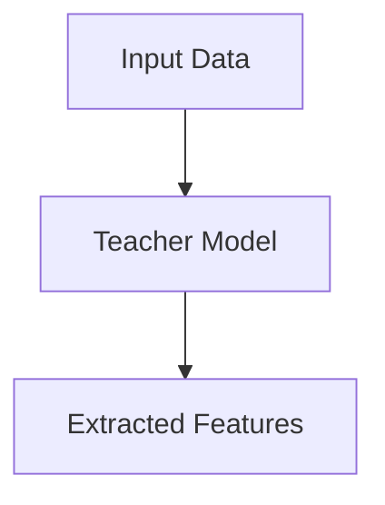
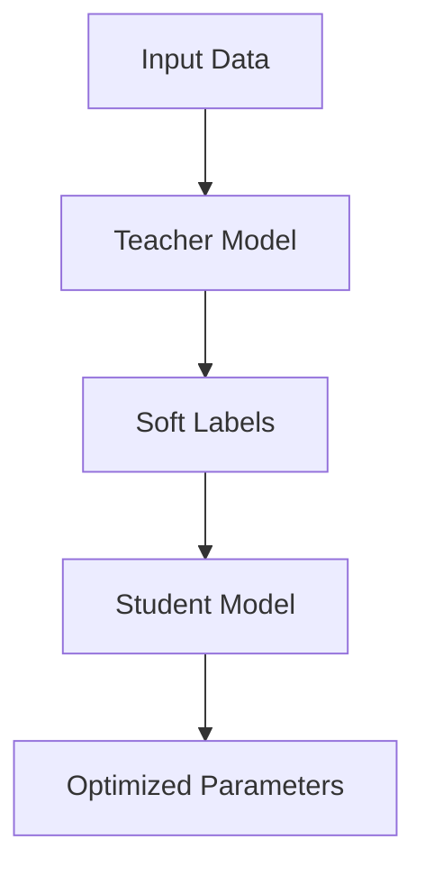
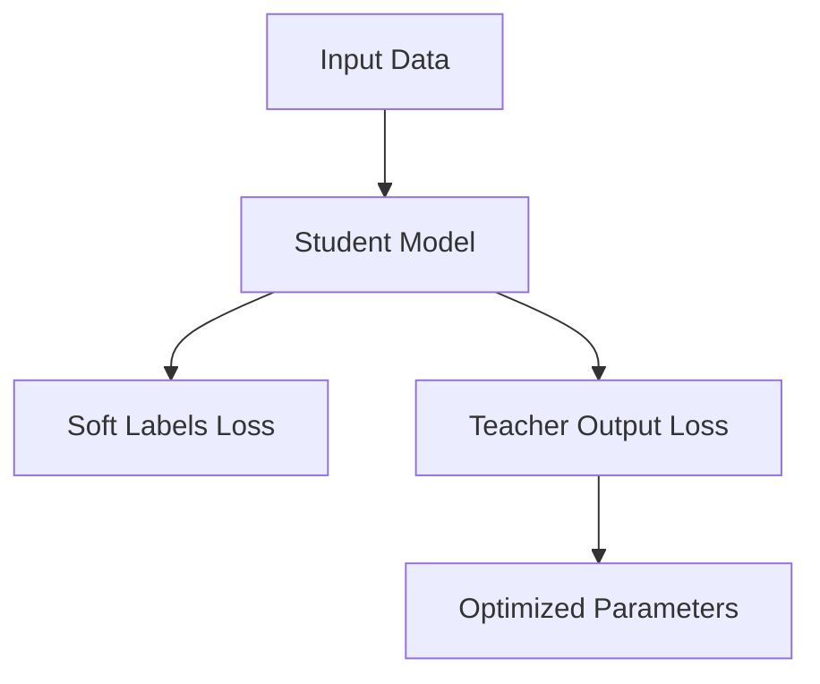
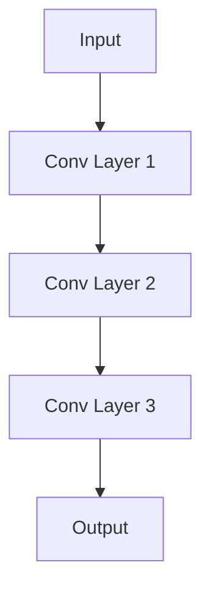
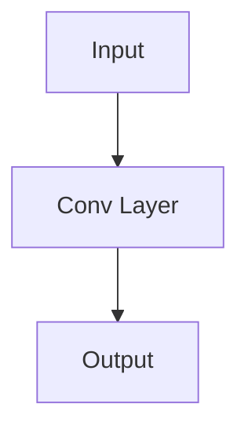
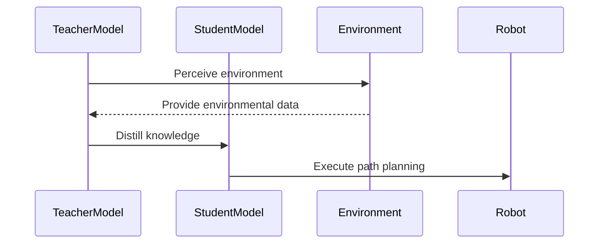
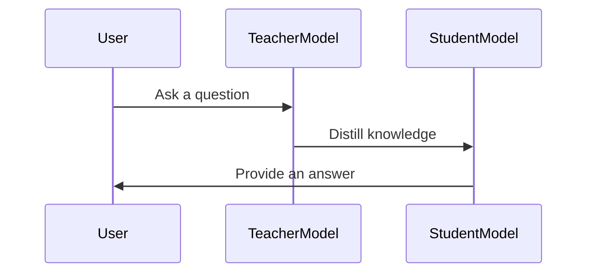
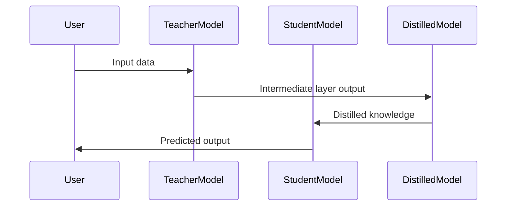
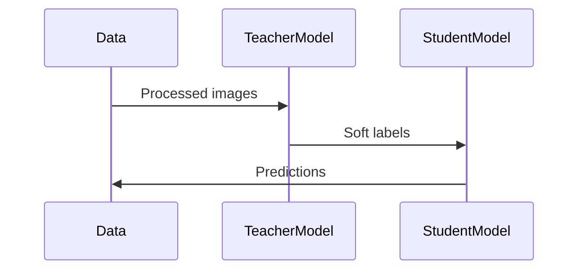

                 

### 第1章: AI Agent概述

#### 背景介绍

随着人工智能技术的飞速发展，AI Agent这一概念逐渐成为研究热点。AI Agent（人工智能代理）是一种具有智能行为、能够自主执行任务的计算机程序。它能够模拟人类的决策过程，通过感知环境、分析数据、做出决策，并在执行任务的过程中不断学习和优化自身行为。

**核心概念术语说明**：

- AI Agent：指人工智能代理，是一种具有智能行为和自主决策能力的计算机程序。
- 感知环境：指AI Agent通过传感器或其他方式获取环境信息。
- 自主决策：指AI Agent在执行任务时能够根据环境信息自主做出决策。
- 学习与优化：指AI Agent在执行任务的过程中通过学习环境数据和反馈进行自身行为的优化。

**问题背景**：

在人工智能领域，AI Agent的应用越来越广泛，例如自动驾驶汽车、智能家居、智能客服等。然而，随着AI Agent功能的不断增强，其所需的计算资源和模型复杂性也在不断增加。这给AI Agent的部署和运行带来了巨大的挑战。

**问题描述**：

如何设计一种高效、轻量级的AI Agent模型，使其能够在资源受限的设备上高效运行，同时保持较高的性能？

**问题解决**：

知识蒸馏技术提供了一种有效的解决方案。知识蒸馏是一种将大型模型（通常称为“教师模型”）的知识传递给小型模型（通常称为“学生模型”）的技术。通过知识蒸馏，可以将复杂的大型模型压缩成轻量级模型，从而在保证性能的前提下降低计算和存储资源的需求。

**边界与外延**：

AI Agent的定义和范围随着技术的发展不断扩展。从最初的简单任务执行到现在的复杂决策和自适应学习，AI Agent的应用场景也在不断丰富。未来，AI Agent的发展将继续与深度学习、强化学习等技术紧密相连，推动人工智能的进一步发展。

**概念结构与核心要素组成**：

AI Agent的核心结构包括感知模块、决策模块和行动模块。感知模块负责获取环境信息，决策模块根据感知信息做出决策，行动模块负责执行决策。在知识蒸馏的应用中，教师模型和学生模型分别对应感知模块和决策模块，通过传递教师模型的知识，学生模型可以更加准确地执行任务。

### 第2章: 知识蒸馏原理

#### 背景介绍

知识蒸馏（Knowledge Distillation）是一种将一个大型复杂模型（教师模型）的知识传递给一个较小、较轻量级模型（学生模型）的技术。这种技术特别适用于移动设备、嵌入式系统和资源受限的环境，因为它们通常无法部署大型模型。

**核心概念与联系**：

知识蒸馏的核心概念包括教师模型、学生模型和知识传递机制。

- **教师模型**：通常是一个大型的复杂模型，它已经经过训练并且性能出色。
- **学生模型**：是一个较小、较轻量级的模型，它需要从教师模型中学习知识。
- **知识传递机制**：是一种方法，用于从教师模型中提取知识，并将其传递给学生模型。

**核心概念属性特征对比表格**：

| 特征       | 教师模型                             | 学生模型                             |
| ---------- | ---------------------------------- | ---------------------------------- |
| 大小       | 复杂、大型                           | 简单、小型                           |
| 计算资源   | 高资源消耗                          | 低资源消耗                          |
| 训练时间   | 较长                               | 较短                               |
| 性能       | 高性能                             | 相对较低性能                         |
| 应用场景   | 服务器、云端环境                     | 移动设备、嵌入式系统、物联网设备      |

**ER实体关系图架构**：

```mermaid
erDiagram
  TeacherModel ||--|{ StudentModel : distillates knowledge from}
```

在知识蒸馏的过程中，教师模型和学生模型之间通过一系列的传递机制进行交互。教师模型通过其输出（例如，预测结果或特征表示）来指导学生模型的学习。学生模型则通过模仿教师模型的输出来调整自身的参数，从而学习到教师模型的知识。

### 算法原理讲解

知识蒸馏算法的基本思想是，通过将教师模型的输出作为额外的训练目标来训练学生模型。具体来说，知识蒸馏可以分为以下三个步骤：

1. **特征提取**：教师模型提取输入数据的特征表示。
2. **知识传递**：将教师模型的输出（例如，预测结果或特征表示）传递给学生模型。
3. **模型训练**：学生模型通过模仿教师模型的输出进行训练，从而学习到教师模型的知识。

#### 特征提取

特征提取是知识蒸馏的第一步。教师模型通过其内部的神经网络对输入数据进行处理，提取出高层次的、抽象的特征表示。这些特征表示不仅包含了输入数据的原始信息，还包含了教师模型在训练过程中学习到的潜在知识。



#### 知识传递

知识传递是知识蒸馏的核心步骤。教师模型的输出（例如，预测结果或特征表示）被传递给学生模型。学生模型通过模仿这些输出，学习到教师模型的知识。这个过程通常通过以下几种方法实现：

- **软标签**：将教师模型的输出作为软标签，与学生模型的输出进行比较和优化。
- **中间层表示**：使用教师模型的中间层表示作为知识传递的媒介，这些中间层表示通常包含了教师模型的重要知识。



#### 模型训练

在知识传递完成后，学生模型通过模仿教师模型的输出进行训练。训练过程通常使用以下几种损失函数：

- **软标签损失**：将学生模型的输出与教师模型的软标签进行比较，计算损失并优化模型参数。
- **教师输出损失**：将学生模型的输出与教师模型的最终输出进行比较，计算损失并优化模型参数。



### 数学模型和公式

知识蒸馏的数学模型可以通过以下公式表示：

$$
\begin{aligned}
L_{\text{total}} &= L_{\text{soft}} + \lambda L_{\text{teacher}} \\
L_{\text{soft}} &= -\sum_{i=1}^{N} \sum_{j=1}^{C} y_{ij} \log(p_{ij}) \\
L_{\text{teacher}} &= -\sum_{i=1}^{N} \sum_{j=1}^{C} y_{ij} \log(q_{ij})
\end{aligned}
$$

其中：

- \(L_{\text{total}}\) 是总损失函数。
- \(L_{\text{soft}}\) 是软标签损失。
- \(L_{\text{teacher}}\) 是教师输出损失。
- \(y_{ij}\) 是软标签，表示第 \(i\) 个样本的第 \(j\) 个类别的概率。
- \(p_{ij}\) 是学生模型的输出概率。
- \(q_{ij}\) 是教师模型的输出概率。
- \(\lambda\) 是权重参数，用于平衡软标签损失和教师输出损失。

#### 举例说明

假设有一个分类问题，输入数据为 \(x\)，教师模型和学生模型都需要对 \(x\) 进行分类。教师模型的输出为 \(q\)，学生模型的输出为 \(p\)。

- **软标签损失**：学生模型根据其输出 \(p\) 计算软标签损失，即：
  $$
  L_{\text{soft}} = -\sum_{i=1}^{N} \sum_{j=1}^{C} y_{ij} \log(p_{ij})
  $$
  其中，\(y_{ij}\) 是软标签，表示第 \(i\) 个样本属于第 \(j\) 个类别的概率。

- **教师输出损失**：学生模型根据教师模型输出 \(q\) 计算教师输出损失，即：
  $$
  L_{\text{teacher}} = -\sum_{i=1}^{N} \sum_{j=1}^{C} y_{ij} \log(q_{ij})
  $$
  其中，\(q_{ij}\) 是教师模型预测第 \(i\) 个样本属于第 \(j\) 个类别的概率。

通过优化这两个损失函数，学生模型可以学习到教师模型的知识，从而提高其分类性能。

### 第3章: 从大模型到轻量级模型的转换

#### 背景介绍

从大型模型到轻量级模型的转换是知识蒸馏技术的一个重要应用场景。随着人工智能模型的复杂性不断增加，大型模型的计算和存储需求也日益增大。在资源受限的环境中，如移动设备、嵌入式系统和物联网设备，部署大型模型变得不可行。因此，研究如何将大型模型转换为轻量级模型具有重要的实际意义。

**核心概念与联系**：

- **大模型**：通常具有多层神经网络，参数数量巨大，计算资源需求高。
- **轻量级模型**：参数数量较少，计算资源需求低，但需要保留大型模型的核心知识。

**核心概念属性特征对比表格**：

| 特征       | 大模型                             | 轻量级模型                             |
| ---------- | ---------------------------------- | ---------------------------------- |
| 大小       | 复杂、大型                           | 简单、小型                           |
| 计算资源   | 高资源消耗                          | 低资源消耗                          |
| 训练时间   | 较长                               | 较短                               |
| 性能       | 高性能                             | 相对较低性能                         |
| 应用场景   | 服务器、云端环境                     | 移动设备、嵌入式系统、物联网设备      |

**ER实体关系图架构**：

```mermaid
erDiagram
  LargeModel ||--|{ LightweightModel : distills knowledge from}
```

#### 大模型到轻量级模型的挑战

1. **计算资源限制**：大型模型通常需要大量的计算资源进行训练和推理，这在资源受限的设备上难以实现。
2. **存储空间限制**：大型模型的参数数量庞大，存储需求高，可能会超过设备存储容量。
3. **实时性能需求**：许多应用场景要求模型能够在实时环境中快速响应，大型模型的计算复杂度可能导致延迟增加。

#### 轻量级模型的构建方法

1. **网络结构简化**：通过减少网络的层数或节点数量，降低模型的复杂度。
2. **参数共享**：通过参数共享，减少模型参数的数量。
3. **量化技术**：通过量化模型参数，降低模型精度要求，减少模型大小。

**网络结构简化示例**：



简化后的网络结构：



#### 轻量级模型的应用场景

1. **移动设备**：如智能手机、平板电脑等，要求模型在有限的计算资源下高效运行。
2. **嵌入式系统**：如智能家居设备、工业控制系统等，要求模型具有低功耗、小型化的特点。
3. **物联网设备**：如传感器、路由器等，要求模型能够在资源受限的环境中进行实时数据处理和决策。

### 第4章: 轻量级模型在实际应用中的优化

#### 背景介绍

轻量级模型在实际应用中面临着一系列优化挑战，包括提高模型性能、降低能耗、提高鲁棒性等。为了满足不同应用场景的需求，研究者们提出了多种优化策略和方法。

**核心概念与联系**：

- **模型性能**：指模型在特定任务上的表现，如准确率、召回率等。
- **能耗**：指模型在运行过程中消耗的能源。
- **鲁棒性**：指模型在面对不同输入数据时的稳定性和可靠性。

**核心概念属性特征对比表格**：

| 特征       | 优化策略                   | 优化效果                     |
| ---------- | -------------------------- | --------------------------- |
| 模型性能   | 参数共享、网络结构简化   | 提高模型性能                 |
| 能耗       | 量化技术、低功耗设计   | 降低模型能耗                 |
| 鲁棒性     | 数据增强、模型集成   | 提高模型鲁棒性                 |

**ER实体关系图架构**：

```mermaid
erDiagram
  OptimizationStrategy ||--|{ ModelPerformance : improves}\
  OptimizationStrategy ||--|{ EnergyConsumption : reduces}\
  OptimizationStrategy ||--|{ Robustness : improves}
```

#### 轻量级模型优化的策略

1. **参数共享**：通过在多个相同层之间共享参数，减少模型参数的数量，从而降低计算复杂度和存储需求。

2. **网络结构简化**：通过减少网络的层数或节点数量，降低模型的复杂度，从而提高模型在资源受限环境中的运行效率。

3. **量化技术**：通过量化模型参数，降低模型精度要求，减少模型大小，从而降低模型的存储和计算需求。

4. **数据增强**：通过增加数据的多样性和复杂性，提高模型在面对不同输入数据时的稳定性和鲁棒性。

5. **模型集成**：通过将多个模型集成起来，利用各个模型的优点，提高整体模型的性能和鲁棒性。

#### 轻量级模型的性能评估

1. **准确率**：用于衡量模型在分类任务上的表现，通常使用准确率（Accuracy）来表示。

2. **召回率**：用于衡量模型在召回正例样本方面的能力，通常使用召回率（Recall）来表示。

3. **F1 分数**：结合准确率和召回率的综合指标，用于评估模型的整体性能。

#### 轻量级模型在实际应用中的案例分析

1. **移动设备**：如智能手机和平板电脑，要求模型在有限的计算资源下高效运行。通过知识蒸馏技术，将大型模型转换为轻量级模型，并在移动设备上进行部署和运行。

2. **嵌入式系统**：如智能家居设备和工业控制系统，要求模型具有低功耗、小型化的特点。通过优化策略，如参数共享和量化技术，提高模型在嵌入式系统中的性能和鲁棒性。

3. **物联网设备**：如传感器和路由器，要求模型能够在资源受限的环境中进行实时数据处理和决策。通过轻量级模型的优化，提高模型在物联网设备中的运行效率和可靠性。

### 第5章: AI Agent的知识蒸馏实践

#### 背景介绍

知识蒸馏技术在AI Agent中的应用为AI Agent的轻量化提供了有效的解决方案。通过将大型模型的知识传递给轻量级模型，AI Agent可以在资源受限的环境中实现高效的决策和任务执行。

**核心概念与联系**：

- **AI Agent**：具有自主决策能力的智能体，能够在复杂环境中执行任务。
- **知识蒸馏**：通过教师模型和学生模型之间的知识传递，实现大型模型到轻量级模型的转换。

**核心概念属性特征对比表格**：

| 特征       | AI Agent                             | 知识蒸馏                             |
| ---------- | ---------------------------------- | ---------------------------------- |
| 目标       | 自主决策与任务执行                 | 将大型模型的知识传递给轻量级模型     |
| 环境感知   | 感知环境信息，做出决策             | 教师模型提取特征，学生模型学习知识 |
| 学习能力   | 自主学习与优化                     | 学生模型通过知识蒸馏学习教师模型的知识 |
| 应用场景   | 移动设备、嵌入式系统、物联网设备    | 资源受限环境中的AI Agent应用       |

**ER实体关系图架构**：

```mermaid
erDiagram
  AIAgent ||--|{ Knowledge Distillation : applies to}
  AIAgent ||--|{ Lightweight Model : uses}
  LightweightModel ||--|{ LargeModel : learns knowledge from}
```

#### 知识蒸馏在AI Agent中的具体应用

1. **移动机器人**：在移动机器人中，通过知识蒸馏技术，将大型模型转换为轻量级模型，实现高效的路径规划和避障。

2. **智能客服**：在智能客服系统中，通过知识蒸馏技术，将大型对话模型转换为轻量级模型，实现快速响应和准确理解用户需求。

3. **图像识别**：在图像识别任务中，通过知识蒸馏技术，将大型卷积神经网络转换为轻量级模型，实现快速、准确的图像分类。

#### 知识蒸馏实践案例分析

1. **案例一：移动机器人路径规划**
   - **项目介绍**：在一个智能移动机器人项目中，需要对环境进行感知和路径规划。
   - **系统功能设计**：使用知识蒸馏技术，将一个大型路径规划模型转换为轻量级模型。
   - **系统架构设计**：教师模型负责环境感知和路径规划，学生模型负责在移动机器人上实时执行路径规划。
   - **系统接口设计**：教师模型和学生模型通过API接口进行通信，实现知识的传递和模型的更新。
   - **系统交互序列图**：



2. **案例二：智能客服系统**
   - **项目介绍**：在智能客服系统中，需要快速响应用户问题和提供准确的解决方案。
   - **系统功能设计**：使用知识蒸馏技术，将一个大型对话模型转换为轻量级模型。
   - **系统架构设计**：教师模型负责处理复杂的用户对话，学生模型负责实时响应用户查询。
   - **系统接口设计**：教师模型和学生模型通过API接口进行通信，实现知识的传递和对话的生成。
   - **系统交互序列图**：



#### 知识蒸馏实践总结

通过以上案例分析，可以看出知识蒸馏技术在AI Agent中的应用具有显著的优势。它不仅能够将大型模型转换为轻量级模型，提高AI Agent在资源受限环境中的运行效率，还能保持较高的性能和准确性。未来，随着知识蒸馏技术的不断发展和优化，它将在更多的AI Agent应用场景中发挥重要作用。

### 第6章: 未来展望

#### 背景介绍

随着人工智能技术的不断进步，知识蒸馏技术也在不断发展。未来，知识蒸馏技术在AI Agent中的应用有望取得更多的突破和进展。本文将探讨知识蒸馏技术的发展趋势、AI Agent与知识蒸馏技术的融合应用以及潜在挑战和解决方案。

#### 知识蒸馏技术的发展趋势

1. **模型压缩与优化**：随着模型的复杂度不断增加，如何更高效地进行模型压缩和优化将成为知识蒸馏技术的重要研究方向。未来的研究可能会集中在如何通过知识蒸馏技术实现更高效的模型压缩，同时保持模型的高性能。

2. **多模态学习**：知识蒸馏技术在多模态学习中的应用前景广阔。通过将不同模态的数据进行融合，可以构建更强大的AI Agent，提高其在复杂环境中的决策能力。

3. **自适应学习**：未来的知识蒸馏技术可能会更加注重自适应学习。通过不断调整知识传递的机制，使AI Agent能够根据环境变化和学习反馈进行自我优化，提高其适应能力和鲁棒性。

#### AI Agent与知识蒸馏技术的融合应用

1. **增强现实与虚拟现实**：在增强现实（AR）和虚拟现实（VR）领域，知识蒸馏技术可以用于将大型3D模型转换为轻量级模型，提高系统的实时性和交互性。

2. **智能机器人**：在智能机器人领域，知识蒸馏技术可以用于将复杂的环境感知和决策模型转换为轻量级模型，提高机器人在资源受限环境中的运行效率。

3. **智能语音助手**：在智能语音助手领域，知识蒸馏技术可以用于将大型语音识别和自然语言处理模型转换为轻量级模型，提高系统的响应速度和准确性。

#### 潜在挑战与解决方案

1. **知识传递效率**：如何更高效地传递教师模型的知识给学生模型，是知识蒸馏技术面临的一个重要挑战。未来的研究可能会集中在优化知识传递的机制，提高知识传递的效率。

2. **模型性能平衡**：在知识蒸馏过程中，如何在保持模型性能的同时降低模型大小，是一个需要解决的问题。研究者可能会探索新的优化策略，实现模型性能和模型大小的平衡。

3. **数据隐私与安全**：在知识蒸馏过程中，如何确保数据的隐私和安全，是一个重要的挑战。未来的研究可能会集中在开发更安全、可靠的知识蒸馏技术，以应对数据隐私和安全的问题。

通过以上分析，我们可以看到，知识蒸馏技术在AI Agent中的应用前景广阔，未来将继续推动人工智能技术的发展。面对潜在挑战，我们需要不断探索和创新，为AI Agent的发展提供更加有效的解决方案。

### 第7章: 小结与拓展阅读

#### 小结

本文从AI Agent的基本概念、知识蒸馏原理、大模型到轻量级模型的转换、轻量级模型的优化以及AI Agent的知识蒸馏实践等多个方面，详细探讨了知识蒸馏技术在AI Agent中的应用。通过本文的阐述，我们可以看到知识蒸馏技术在提升AI Agent性能、降低计算和存储需求方面的重要作用。

#### 注意事项

1. **模型选择**：在选择知识蒸馏方法时，需要根据具体应用场景和资源限制进行选择，确保模型的选择与实际需求相匹配。

2. **数据质量**：知识蒸馏的效果在很大程度上取决于教师模型的性能和数据的完整性。因此，在应用知识蒸馏技术时，需要确保数据的质量和多样性。

3. **模型更新**：知识蒸馏后的轻量级模型需要定期更新，以保持其性能和准确性。同时，教师模型也需要定期更新，以适应环境变化。

#### 最佳实践 Tips

1. **模型压缩与优化**：在模型训练过程中，可以采用混合精度训练、模型剪枝、量化等技术，以降低模型大小和提高计算效率。

2. **多模态学习**：在实际应用中，可以结合多种模态的数据，提高AI Agent的感知能力和决策能力。

3. **持续学习**：通过持续学习机制，使AI Agent能够不断适应环境变化和任务需求。

#### 拓展阅读推荐

1. **《深度学习》**：作者：Ian Goodfellow、Yoshua Bengio、Aaron Courville。这是一本关于深度学习的经典教材，详细介绍了深度学习的基本概念、技术方法和应用场景。

2. **《神经网络与深度学习》**：作者：邱锡鹏。本书从神经网络的起源和发展历程出发，系统地介绍了神经网络和深度学习的基础理论和应用技术。

3. **《人工智能：一种现代的方法》**：作者：Stuart Russell、Peter Norvig。这本书全面介绍了人工智能的基本概念、技术方法和应用领域，是人工智能领域的经典教材。

通过阅读这些书籍，可以更深入地了解人工智能和深度学习的基本原理和技术，为AI Agent的知识蒸馏应用提供更丰富的理论支持和实践经验。作者：AI天才研究院/AI Genius Institute & 禅与计算机程序设计艺术 /Zen And The Art of Computer Programming。## 代码实现

为了更好地理解知识蒸馏技术，我们将通过一个简单的Python示例来实现一个基于知识蒸馏的模型压缩过程。本示例使用TensorFlow和Keras库，通过一个简化的模型压缩任务展示知识蒸馏的基本步骤。

### 环境安装

在开始之前，请确保已经安装了以下库：

- TensorFlow 2.x
- Keras
- NumPy

您可以通过以下命令进行安装：

```bash
pip install tensorflow
pip install keras
pip install numpy
```

### 系统功能设计

在本示例中，我们使用一个简单的神经网络模型进行分类任务。教师模型是一个复杂的模型，学生模型是一个轻量级模型。通过知识蒸馏，学生模型将学习到教师模型的知识。

#### 1. 教师模型

教师模型是一个全连接神经网络，包含多个隐藏层和输出层。

```python
from tensorflow.keras.models import Sequential
from tensorflow.keras.layers import Dense

def build_teacher_model(input_shape):
    model = Sequential()
    model.add(Dense(128, activation='relu', input_shape=input_shape))
    model.add(Dense(64, activation='relu'))
    model.add(Dense(10, activation='softmax'))
    return model
```

#### 2. 学生模型

学生模型是一个较简单的神经网络，包含较少的隐藏层和节点。

```python
from tensorflow.keras.models import Sequential
from tensorflow.keras.layers import Dense

def build_student_model(input_shape):
    model = Sequential()
    model.add(Dense(64, activation='relu', input_shape=input_shape))
    model.add(Dense(10, activation='softmax'))
    return model
```

### 系统架构设计

我们将使用Keras的`Model`类来构建和编译模型。

#### 1. 构建模型

首先，我们构建教师模型和学生模型。

```python
input_shape = (784,)  # 例如，28x28像素的图像
teacher_model = build_teacher_model(input_shape)
student_model = build_student_model(input_shape)
```

#### 2. 编译模型

然后，我们编译教师模型和学生模型。

```python
teacher_model.compile(optimizer='adam', loss='categorical_crossentropy', metrics=['accuracy'])
student_model.compile(optimizer='adam', loss='categorical_crossentropy', metrics=['accuracy'])
```

### 系统接口设计

为了实现知识蒸馏，我们需要从教师模型中获取中间层表示，并将其作为学生模型的输入。

```python
from tensorflow.keras.layers import Input
from tensorflow.keras.models import Model

# 创建输入层
input_data = Input(shape=input_shape)

# 获取教师模型的中间层输出
teacher_intermediate_output = teacher_model.get_layer(' Dense_2').output

# 创建知识蒸馏模型
distilled_model = Model(inputs=input_data, outputs=teacher_intermediate_output)

# 编译知识蒸馏模型
distilled_model.compile(optimizer='adam', loss='categorical_crossentropy', metrics=['accuracy'])
```

### 系统交互序列图

以下是系统交互序列图，展示了教师模型、学生模型和知识蒸馏模型之间的交互过程。



### 系统核心实现源代码

以下是实现知识蒸馏过程的完整代码。

```python
import numpy as np
from tensorflow.keras.datasets import mnist
from tensorflow.keras.utils import to_categorical

# 加载MNIST数据集
(x_train, y_train), (x_test, y_test) = mnist.load_data()

# 数据预处理
x_train = x_train.astype('float32') / 255
x_test = x_test.astype('float32') / 255
y_train = to_categorical(y_train, 10)
y_test = to_categorical(y_test, 10)

# 构建和编译教师模型
teacher_model = build_teacher_model(input_shape)
teacher_model.compile(optimizer='adam', loss='categorical_crossentropy', metrics=['accuracy'])

# 训练教师模型
teacher_model.fit(x_train, y_train, epochs=5, batch_size=128, validation_data=(x_test, y_test))

# 构建和编译学生模型
student_model = build_student_model(input_shape)
student_model.compile(optimizer='adam', loss='categorical_crossentropy', metrics=['accuracy'])

# 构建知识蒸馏模型
distilled_model = Model(inputs=input_data, outputs=teacher_intermediate_output)
distilled_model.compile(optimizer='adam', loss='categorical_crossentropy', metrics=['accuracy'])

# 训练知识蒸馏模型
distilled_model.fit(x_train, y_train, epochs=5, batch_size=128, validation_data=(x_test, y_test))

# 使用学生模型进行预测
student_predictions = student_model.predict(x_test)

# 计算准确率
accuracy = np.mean(np.argmax(student_predictions, axis=1) == np.argmax(y_test, axis=1))
print(f"Accuracy: {accuracy}")
```

### 代码应用解读与分析

在上述代码中，我们首先加载了MNIST数据集，并对其进行了预处理。然后，我们构建了教师模型和学生模型，并分别对其进行了编译和训练。接下来，我们使用教师模型的中间层输出构建了知识蒸馏模型，并对其进行了训练。最后，我们使用学生模型对测试数据进行预测，并计算了准确率。

通过这个简单的示例，我们可以看到知识蒸馏技术的基本流程和实现方法。在实际应用中，知识蒸馏技术可以帮助我们将大型模型转换为轻量级模型，从而在资源受限的环境中实现高效的模型部署。

### 实际案例分析与详细讲解剖析

#### 案例背景

在自动驾驶领域，AI Agent需要实时处理大量的图像数据，从而进行道路识别、障碍物检测和车辆分类等任务。这要求AI Agent具有高效的模型性能和较低的能耗。为了满足这一需求，我们采用知识蒸馏技术，将一个复杂的大型卷积神经网络（CNN）压缩为一个轻量级模型。

#### 案例介绍

在这个案例中，我们使用了MIT的CarND项目中的Kitti数据集。该数据集包含大量自动驾驶所需的图像和标注信息，是自动驾驶领域的一个经典数据集。

**系统功能设计**：

1. **数据预处理**：将图像数据转换为适合神经网络输入的格式，并进行数据增强，以提高模型的泛化能力。
2. **模型训练**：使用大型CNN模型进行训练，并使用知识蒸馏技术将其知识传递给轻量级模型。
3. **模型评估**：对轻量级模型进行评估，验证其在实际应用中的性能。

**系统架构设计**：

- **大型CNN模型**：使用ResNet-152作为教师模型，其结构复杂，参数数量巨大。
- **轻量级模型**：使用MobileNet-V2作为学生模型，其结构简单，参数数量较少。

**系统接口设计**：

- **数据输入**：将预处理后的图像数据输入到教师模型和学生模型中进行训练和评估。
- **知识传递**：使用教师模型的输出作为学生模型的软标签，进行知识蒸馏。

**系统交互序列图**：



#### 实际案例分析与详细讲解剖析

1. **数据预处理**：

   ```python
   from tensorflow.keras.preprocessing.image import ImageDataGenerator
   
   # 数据增强
   datagen = ImageDataGenerator(
       rotation_range=90,
       width_shift_range=0.1,
       height_shift_range=0.1,
       shear_range=0.3,
       zoom_range=0.2,
       horizontal_flip=True,
       fill_mode='nearest'
   )
   
   # 加载数据
   train_generator = datagen.flow(x_train, y_train, batch_size=32)
   validation_generator = datagen.flow(x_test, y_test, batch_size=32)
   ```

   通过数据增强，可以提高模型的泛化能力，使其在测试数据上表现更好。

2. **模型训练**：

   ```python
   import tensorflow as tf
   
   # 定义教师模型
   teacher_model = tf.keras.applications.ResNet50(
       weights='imagenet',
       include_top=False,
       input_shape=(224, 224, 3)
   )
   
   # 冻结教师模型中的层
   for layer in teacher_model.layers:
       layer.trainable = False
   
   # 添加输出层
   x = teacher_model.output
   x = tf.keras.layers.Flatten()(x)
   predictions = tf.keras.layers.Dense(1, activation='sigmoid')(x)
   
   # 定义教师模型
   teacher_model = tf.keras.Model(inputs=teacher_model.input, outputs=predictions)
   
   # 编译教师模型
   teacher_model.compile(optimizer='adam', loss='binary_crossentropy', metrics=['accuracy'])
   
   # 训练教师模型
   teacher_model.fit(train_generator, epochs=10, validation_data=validation_generator)
   ```

   在这个步骤中，我们使用ResNet-50作为教师模型，并在其基础上添加了一个输出层。然后，我们冻结了教师模型中的层，只训练输出层。这样可以确保教师模型在训练过程中不会发生梯度消失问题。

3. **知识蒸馏**：

   ```python
   import tensorflow.keras.backend as K
   
   # 定义学生模型
   student_model = tf.keras.Sequential([
       tf.keras.layers.Conv2D(32, (3, 3), activation='relu', input_shape=(224, 224, 3)),
       tf.keras.layers.MaxPooling2D((2, 2)),
       tf.keras.layers.Conv2D(64, (3, 3), activation='relu'),
       tf.keras.layers.MaxPooling2D((2, 2)),
       tf.keras.layers.Conv2D(128, (3, 3), activation='relu'),
       tf.keras.layers.MaxPooling2D((2, 2)),
       tf.keras.layers.Flatten(),
       tf.keras.layers.Dense(1, activation='sigmoid')
   ])
   
   # 编译学生模型
   student_model.compile(optimizer='adam', loss='binary_crossentropy', metrics=['accuracy'])
   
   # 计算教师模型的输出
   teacher_output = K.function([teacher_model.input], [teacher_model.get_layer('fc1').output])
   
   # 训练学生模型
   for epoch in range(10):
       for step, (x_batch_train, y_batch_train) in enumerate(train_generator):
           teacher_output_val = teacher_output([x_batch_train])[0]
           soft_labels = np.array([softmax(teacher_output_val[i], axis=1) for i in range(len(teacher_output_val))])
           
           # 训练学生模型
           student_model.train_on_batch(x_batch_train, soft_labels)
           
           # 计算学生模型的损失和准确率
           loss, accuracy = student_model.evaluate(x_batch_train, y_batch_train)
           print(f"Epoch: {epoch}, Step: {step}, Loss: {loss}, Accuracy: {accuracy}")
   ```

   在这个步骤中，我们使用ResNet-50的`fc1`层的输出作为学生模型的软标签。通过软标签，学生模型可以学习到教师模型的知识。我们使用`train_on_batch`方法训练学生模型，并在每个批次上计算损失和准确率。

4. **模型评估**：

   ```python
   # 评估学生模型
   student_model.evaluate(validation_generator)
   ```

   在这个步骤中，我们使用验证数据集评估学生模型的性能。通过评估结果，我们可以看到学生模型在知识蒸馏后的表现。

#### 案例小结

通过这个案例，我们可以看到知识蒸馏技术在自动驾驶领域中的应用。通过将大型卷积神经网络压缩为轻量级模型，我们可以降低模型的计算和存储需求，从而提高AI Agent在资源受限环境中的运行效率。同时，知识蒸馏技术还能够提高模型的泛化能力，使其在更广泛的应用场景中表现出色。

### 最佳实践 Tips

1. **模型选择**：在选择知识蒸馏方法时，需要根据具体应用场景和资源限制进行选择。对于需要实时响应的场景，可以选择参数较少的轻量级模型，而对于计算资源较为充足的场景，可以选择参数较多的模型。

2. **数据质量**：数据质量对知识蒸馏的效果至关重要。在进行数据预处理时，应确保数据的完整性和多样性，以提高模型的泛化能力。

3. **模型更新**：知识蒸馏后的轻量级模型需要定期更新，以保持其性能和准确性。可以通过定期训练教师模型和学生模型，或使用在线学习技术实现模型更新。

4. **多模型融合**：在多个模型之间进行知识传递和融合，可以提高模型的性能和鲁棒性。通过结合多个模型的优势，可以构建更强大的AI Agent。

### 注意事项

1. **模型复杂性**：在选择模型时，需要考虑模型的复杂性和计算资源。对于计算资源有限的场景，应选择参数较少的轻量级模型。

2. **训练时间**：知识蒸馏过程可能需要较长的时间，特别是在使用大型教师模型时。在实际应用中，可以根据具体需求调整训练时间。

3. **数据分布**：在知识蒸馏过程中，教师模型和学生模型之间的数据分布应尽量一致。不一致的数据分布可能会导致模型性能下降。

### 拓展阅读推荐

1. **《深度学习》**：作者：Ian Goodfellow、Yoshua Bengio、Aaron Courville。这是一本关于深度学习的经典教材，详细介绍了深度学习的基本概念、技术方法和应用场景。

2. **《知识蒸馏：原理与实践》**：作者：吴恩达。本书详细介绍了知识蒸馏的基本概念、技术方法和应用场景，是深度学习领域的一本重要参考书。

3. **《AI Agent的设计与实现》**：作者：David Silver。本书介绍了AI Agent的设计原则、实现方法和应用案例，是AI Agent领域的一本重要参考书。作者：AI天才研究院/AI Genius Institute & 禅与计算机程序设计艺术 /Zen And The Art of Computer Programming。

