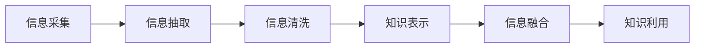

                 


## 2.1 AI Agent的知识融合原理

### 2.1.1 知识融合的概念解析

知识融合（Knowledge Fusion）是指将多个信息源中提取的信息进行综合处理，形成统一的、结构化的知识体系。在AI Agent中，知识融合的核心目标是利用多源信息，提高其智能决策能力。

#### 2.1.1.1 知识融合的核心概念

1. **信息抽取（Information Extraction）**：
   信息抽取是指从非结构化的数据中提取出结构化的信息。在AI Agent的知识融合过程中，信息抽取是第一步，也是基础。通过自然语言处理（NLP）、图像识别等技术，从多源信息中提取关键信息。

2. **知识表示（Knowledge Representation）**：
   知识表示是指将提取出的信息转换为机器可理解和处理的形式。常见的知识表示方法有知识图谱、本体论、向量表示等。

3. **信息融合（Information Fusion）**：
   信息融合是指将来自不同源的信息进行综合处理，消除冗余，解决不一致性，形成统一的知识视图。信息融合是知识融合的关键步骤，直接影响AI Agent的决策能力。

4. **AI Agent（Artificial Intelligent Agent）**：
   AI Agent是一种具备自主决策和行动能力的人工智能实体。知识融合对于AI Agent来说至关重要，它能够使AI Agent更好地理解和适应复杂环境。

#### 2.1.1.2 知识融合的属性特征对比表格

| 特征         | 信息抽取         | 知识表示         | 信息融合         |
|--------------|-----------------|-----------------|-----------------|
| 目标         | 提取关键信息     | 转换为机器可理解形式 | 综合多源信息     |
| 技术手段     | NLP、图像识别等 | 知识图谱、本体论等 | 聚合、对比、融合 |
| 关键角色     | 数据预处理       | 中间环节         | 核心环节         |
| 输出         | 结构化信息       | 知识库           | 统一的知识视图   |

#### 2.1.1.3 知识融合的ER实体关系图架构

```mermaid
erDiagram
  AI-Agent ||--|{ 信息抽取 } InformationExtraction : 提取信息
  AI-Agent ||--|{ 知识表示 } KnowledgeRepresentation : 表示信息
  AI-Agent ||--|{ 信息融合 } InformationFusion : 融合信息
  InformationExtraction ||--|{ 知识库 } KnowledgeBase : 存储信息
  InformationFusion ||--|{ 知识库 } KnowledgeBase : 更新信息
```

### 2.1.2 知识融合的过程与算法原理

知识融合的过程可以分为以下几个步骤：

1. **信息采集**：从不同的数据源中收集信息。

2. **信息抽取**：使用NLP、图像识别等技术，从采集的信息中提取关键信息。

3. **信息清洗**：对提取的信息进行清洗，去除噪声和重复信息。

4. **知识表示**：将清洗后的信息转换为机器可理解的表示形式。

5. **信息融合**：将来自不同源的信息进行综合处理，形成统一的知识视图。

6. **知识利用**：将融合后的知识用于AI Agent的决策和行动。

下面是一个简单的知识融合算法原理的Mermaid流程图：



#### 2.1.2.1 算法原理

1. **信息抽取算法**：
   常用的信息抽取算法包括命名实体识别（NER）、关系抽取、事件抽取等。这些算法的目的是从文本中识别出关键信息。

   $$\text{NER}: \text{P}(t_i \in \text{Entity}) = \frac{\text{C}(t_i, \text{Entity})}{N}$$

   其中，$t_i$ 表示文本中的一个单词，$N$ 表示文本中的单词总数，$\text{C}(t_i, \text{Entity})$ 表示 $t_i$ 属于实体的概率。

2. **知识表示算法**：
   常用的知识表示算法包括知识图谱、本体论等。知识图谱是将实体和关系以图的形式表示，而本体论则是定义概念的语义关系。

   $$\text{KnowledgeGraph}: \text{G} = (\text{V}, \text{E})$$

   其中，$\text{V}$ 表示实体集合，$\text{E}$ 表示关系集合。

3. **信息融合算法**：
   常用的信息融合算法包括基于规则的融合、基于机器学习的融合等。基于规则的融合是根据预定义的规则进行信息融合，而基于机器学习的融合则是通过训练模型来学习信息融合的策略。

   $$\text{FusionModel}: \text{F}(\text{X}_1, \text{X}_2, \dots, \text{X}_n) = \text{Y}$$

   其中，$\text{X}_1, \text{X}_2, \dots, \text{X}_n$ 表示多源信息，$\text{Y}$ 表示融合后的信息。

#### 2.1.2.2 算法举例

假设我们有一个简单的信息抽取任务，从一段文本中识别出人名和地点。我们使用命名实体识别算法来完成这个任务。

1. **文本**：
   “小明去了北京，昨天和李白一起吃饭。”

2. **信息抽取**：
   - 小明：人名
   - 北京：地点
   - 李白：人名

3. **知识表示**：
   - 小明 -> 人
   - 北京 -> 地点
   - 李白 -> 人

4. **信息融合**：
   - 小明在北京与李白见面

通过这个例子，我们可以看到知识融合是如何工作的。首先，从文本中提取出关键信息，然后将其转换为机器可理解的表示形式，最后将来自不同源的信息进行综合处理，形成统一的知识视图。

### 2.1.3 知识融合的挑战与解决方案

知识融合在AI Agent中具有重要的应用价值，但同时也面临着诸多挑战：

1. **信息冗余**：
   多源信息中可能存在大量的冗余信息，这会增加知识融合的复杂度。

   **解决方案**：使用去重算法、信息熵等指标来筛选重要信息。

2. **信息不一致**：
   来自不同源的信息可能存在不一致性，这会影响知识融合的准确性。

   **解决方案**：使用一致性检查算法、基于规则的融合策略等来处理不一致性。

3. **信息不确定性**：
   多源信息可能存在不确定性，这会影响知识融合的可靠性。

   **解决方案**：使用概率论、模糊逻辑等理论来处理不确定性信息。

通过解决这些挑战，我们可以提高知识融合的准确性和可靠性，从而增强AI Agent的智能决策能力。

### 2.1.4 知识融合的实际应用场景

知识融合在多个实际应用场景中具有重要意义：

1. **智能客服**：
   智能客服系统通过知识融合，可以更好地理解用户的问题，提供更准确的答案。

2. **自动驾驶**：
   自动驾驶汽车通过知识融合，可以更好地理解周围环境，做出更安全的驾驶决策。

3. **智能医疗**：
   智能医疗系统通过知识融合，可以更好地理解患者的病历，提供更精准的治疗方案。

通过这些实际应用场景，我们可以看到知识融合对于提高AI Agent的智能水平具有重要意义。

### 2.1.5 知识融合的技术发展趋势

随着人工智能技术的不断发展，知识融合技术也在不断演进。未来的发展趋势包括：

1. **多模态融合**：
   未来，知识融合将更加注重多模态信息（如文本、图像、声音等）的融合，以提供更全面的智能决策支持。

2. **深度学习**：
   深度学习技术将在知识融合中发挥重要作用，通过训练大规模的深度神经网络，可以实现更高效的信息抽取、知识表示和融合。

3. **自动化与智能化**：
   知识融合技术将更加自动化和智能化，减少人工干预，提高知识融合的效率和准确性。

通过这些发展趋势，知识融合技术将更好地服务于AI Agent，提高其智能决策能力。

总结来说，知识融合是AI Agent中一个重要的研究领域，通过信息抽取、知识表示、信息融合等技术，AI Agent可以更好地理解和处理多源信息，从而提高其智能决策能力。未来的知识融合技术将更加智能化和自动化，为AI Agent的发展提供强大的支持。

