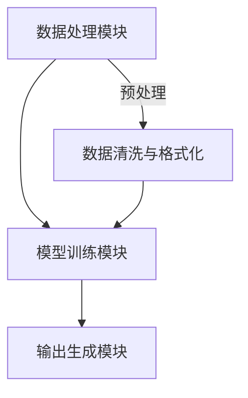
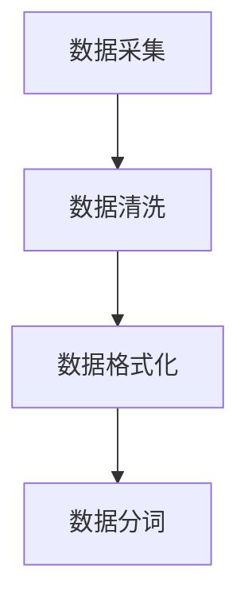
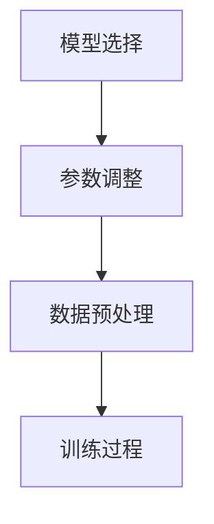
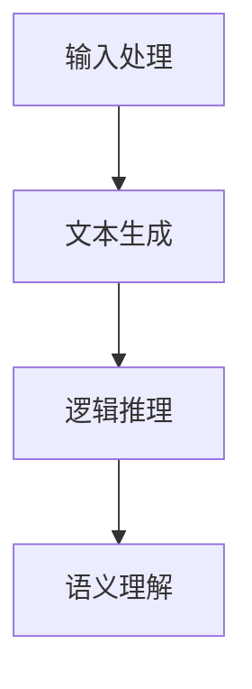

                 

# AI Agent的知识表示：结构化LLM的输出

## 关键词
- AI Agent
- 知识表示
- 结构化LLM
- 知识表示方法
- 知识表示应用

## 摘要
本文旨在探讨AI Agent的知识表示及其在结构化语言模型（LLM）输出中的应用。首先，我们回顾了AI Agent和知识表示的基本概念，随后深入分析了结构化LLM的原理和特点。接着，本文详细介绍了知识表示在人工智能领域的重要性和应用领域，并探讨了结构化LLM在不同领域的应用场景和设计实现方法。通过实际案例的分析，本文展示了结构化LLM在实际应用中的效果和挑战，最后对结构化LLM的发展趋势和未来展望进行了探讨。

## 目录大纲

### 第一部分: AI Agent的知识表示基础

#### 第1章: AI Agent与知识表示概述

- 1.1 AI Agent的基本概念
  - 1.1.1 AI Agent的定义
  - 1.1.2 AI Agent的特点
  - 1.1.3 AI Agent的分类

- 1.2 知识表示的基本概念
  - 1.2.1 知识表示的定义
  - 1.2.2 知识表示的层次
  - 1.2.3 知识表示的方法

- 1.3 知识表示的重要性和应用领域
  - 1.3.1 知识表示的重要性
  - 1.3.2 知识表示的应用领域
  - 1.3.3 知识表示的发展趋势

- 1.4 本章小结

### 第二部分: 结构化LLM的输出

#### 第2章: 结构化LLM的基本原理

- 2.1 LLM的定义与特点
  - 2.1.1 LLM的定义
  - 2.1.2 LLM的特点
  - 2.1.3 LLM的分类

- 2.2 结构化LLM的输出原理
  - 2.2.1 结构化LLM的概念
  - 2.2.2 结构化LLM的输出特点
  - 2.2.3 结构化LLM的输出方法

- 2.3 结构化LLM的常用技术
  - 2.3.1 问答系统
  - 2.3.2 文本生成
  - 2.3.3 对话系统

- 2.4 本章小结

#### 第3章: 结构化LLM的应用场景

- 3.1 结构化LLM在教育领域的应用
  - 3.1.1 教育场景概述
  - 3.1.2 教育场景中的结构化LLM应用
  - 3.1.3 教育场景中的挑战与解决方案

- 3.2 结构化LLM在医疗领域的应用
  - 3.2.1 医疗场景概述
  - 3.2.2 医疗场景中的结构化LLM应用
  - 3.2.3 医疗场景中的挑战与解决方案

- 3.3 结构化LLM在企业管理的应用
  - 3.3.1 企业管理场景概述
  - 3.3.2 企业管理场景中的结构化LLM应用
  - 3.3.3 企业管理场景中的挑战与解决方案

- 3.4 本章小结

#### 第4章: 结构化LLM的设计与实现

- 4.1 结构化LLM的系统架构设计
  - 4.1.1 系统架构概述
  - 4.1.2 数据处理模块
  - 4.1.3 模型训练模块
  - 4.1.4 输出生成模块

- 4.2 结构化LLM的训练方法
  - 4.2.1 数据预处理
  - 4.2.2 模型选择
  - 4.2.3 模型训练
  - 4.2.4 模型评估与优化

- 4.3 结构化LLM的输出优化
  - 4.3.1 输出格式优化
  - 4.3.2 输出内容优化
  - 4.3.3 输出效果评估

- 4.4 本章小结

#### 第5章: 结构化LLM的实际应用案例

- 5.1 案例一：教育领域
  - 5.1.1 案例背景
  - 5.1.2 案例实现
  - 5.1.3 案例分析

- 5.2 案例二：医疗领域
  - 5.2.1 案例背景
  - 5.2.2 案例实现
  - 5.2.3 案例分析

- 5.3 案例三：企业管理领域
  - 5.3.1 案例背景
  - 5.3.2 案例实现
  - 5.3.3 案例分析

- 5.4 本章小结

#### 第6章: 结构化LLM的发展趋势与未来展望

- 6.1 结构化LLM的发展趋势
  - 6.1.1 技术发展趋势
  - 6.1.2 应用发展趋势
  - 6.1.3 市场发展趋势

- 6.2 结构化LLM的未来展望
  - 6.2.1 技术创新展望
  - 6.2.2 应用创新展望

## 1. AI Agent与知识表示概述

### 1.1 AI Agent的基本概念

#### 1.1.1 AI Agent的定义

AI Agent（人工智能代理）是指能够独立执行任务、与环境交互并自主决策的智能实体。它是一个具有自主学习和适应能力的实体，能够通过感知环境、理解任务需求并采取适当的行动来实现目标。

AI Agent具有以下几个基本特征：

1. 自主性：AI Agent能够自主决策和执行任务，不受外部控制。
2. 感知能力：AI Agent能够感知和理解环境中的信息，以便做出合理的决策。
3. 学习能力：AI Agent能够通过经验和数据不断优化自己的行为。
4. 适应性：AI Agent能够根据环境的变化调整自己的行为策略。

#### 1.1.2 AI Agent的特点

AI Agent作为一种智能实体，具有以下几个特点：

1. 模式识别：AI Agent能够识别和分类输入的数据，从而实现自动化决策。
2. 自主推理：AI Agent能够在没有外部干预的情况下，通过推理和规划来完成任务。
3. 对抗性：AI Agent能够在对抗性环境中与其他智能实体竞争，从而实现自我保护。
4. 鲁棒性：AI Agent能够在不确定和复杂的环境中保持稳定和可靠的性能。

#### 1.1.3 AI Agent的分类

根据不同的分类标准，AI Agent可以划分为以下几类：

1. 根据智能程度，AI Agent可以分为弱AI和强AI。弱AI仅限于特定任务和领域的智能，而强AI则具有普遍的智能，能够在各种任务和环境中表现出色。
2. 根据环境类型，AI Agent可以分为确定性环境和不确定性环境。确定性环境中的AI Agent能够通过精确的模型进行预测和决策，而不确定性环境中的AI Agent则需要利用概率和统计方法来应对。
3. 根据任务类型，AI Agent可以分为单一任务和复任务。单一任务的AI Agent专注于完成一个特定任务，而复任务的AI Agent则需要同时处理多个任务。

### 1.2 知识表示的基本概念

#### 1.2.1 知识表示的定义

知识表示（Knowledge Representation）是指将知识以一种结构化的形式存储、组织和表示，以便计算机能够理解和处理这些知识。知识表示的目标是实现知识的自动获取、存储、检索和使用。

知识表示的关键概念包括：

1. 知识：知识是关于事实、规则、原理、方法等信息的有用信息。
2. 表示：表示是将知识以一种结构化的形式进行编码和存储的过程。
3. 结构：结构是指知识之间的组织和关联关系。

#### 1.2.2 知识表示的层次

知识表示可以分为以下几个层次：

1. 低层次知识表示：低层次知识表示主要涉及对基本事实和规则的表示，如符号、词组、句子等。
2. 中层次知识表示：中层次知识表示主要涉及对概念、关系和属性的表示，如本体、框架等。
3. 高层次知识表示：高层次知识表示主要涉及对领域知识的表示，如知识图谱、语义网络等。

#### 1.2.3 知识表示的方法

知识表示的方法可以分为以下几种：

1. 符号表示法：符号表示法通过使用符号和符号之间的关系来表示知识，如谓词逻辑、产生式规则等。
2. 结构表示法：结构表示法通过使用结构和结构之间的关系来表示知识，如图式、框架等。
3. 图表示法：图表示法通过使用图和网络结构来表示知识，如图论、知识图谱等。

### 1.3 知识表示的重要性和应用领域

#### 1.3.1 知识表示的重要性

知识表示在人工智能领域具有重要意义，主要体现在以下几个方面：

1. 知识获取和存储：知识表示使得知识能够被有效地获取、存储和检索。
2. 知识推理和决策：知识表示使得计算机能够根据已有的知识进行推理和决策。
3. 知识共享和传播：知识表示使得知识能够在不同系统和领域之间共享和传播。
4. 知识工程：知识表示是知识工程的基础，对于人工智能系统的发展具有重要意义。

#### 1.3.2 知识表示的应用领域

知识表示在多个领域都有广泛的应用，包括：

1. 自然语言处理：知识表示使得计算机能够理解和生成自然语言，如文本生成、机器翻译等。
2. 专家系统：知识表示使得计算机能够模拟专家的决策过程，为用户提供智能咨询服务。
3. 机器人技术：知识表示使得机器人能够理解和适应复杂环境，完成复杂任务。
4. 数据挖掘：知识表示使得计算机能够从大规模数据中提取有用信息和知识。
5. 智能交通：知识表示使得交通系统能够实时分析交通数据，优化交通流量。

#### 1.3.3 知识表示的发展趋势

随着人工智能技术的快速发展，知识表示也在不断演进，主要趋势包括：

1. 语义网络：语义网络通过使用语义关系来表示知识，使得知识表示更加精细和灵活。
2. 知识图谱：知识图谱通过大规模的实体和关系来表示知识，为人工智能系统提供丰富的知识支持。
3. 多模态表示：多模态表示通过整合不同模态的数据来表示知识，提高知识表示的准确性和泛化能力。
4. 深度学习：深度学习在知识表示中的应用，使得知识表示能够更好地利用大规模数据和学习算法，提高知识表示的性能和效果。

### 1.4 本章小结

本章回顾了AI Agent和知识表示的基本概念，包括AI Agent的定义、特点、分类，以及知识表示的定义、层次、方法、重要性和应用领域。通过本章的学习，读者可以了解AI Agent和知识表示的基础知识，为进一步研究结构化LLM的输出打下基础。

### 2. 结构化LLM的基本原理

#### 2.1 LLM的定义与特点

##### 2.1.1 LLM的定义

语言模型（Language Model，LLM）是一种统计模型，用于预测或生成自然语言序列。它通过对大规模文本数据的学习，捕捉自然语言的统计规律和语法结构，从而生成或预测自然语言文本。

结构化语言模型（Structured Language Model，SLM）是一种特殊的语言模型，它不仅能够生成自然语言文本，还能够根据输入的结构化数据生成具有明确结构和语义的输出。结构化语言模型通常结合了自然语言处理和知识表示技术，能够更好地理解和生成复杂场景中的文本。

##### 2.1.2 LLM的特点

语言模型具有以下特点：

1. 统计性质：语言模型基于统计方法，通过对大规模文本数据的学习，捕捉语言模式。
2. 生成性质：语言模型能够生成自然语言文本，为自然语言处理任务提供支持。
3. 预测性质：语言模型能够预测文本序列中下一个词语或短语，为序列生成任务提供支持。
4. 泛化能力：语言模型能够适应不同领域和场景，具有良好的泛化能力。

结构化语言模型在LLM的基础上，具有以下特点：

1. 结构化数据输入：结构化语言模型能够处理结构化数据，如关系数据库、知识图谱等，为生成具有明确结构和语义的输出提供支持。
2. 知识表示：结构化语言模型结合了知识表示技术，能够生成具有明确语义和逻辑关系的输出。
3. 精细控制：结构化语言模型能够对输出进行精细控制，如控制输出格式、结构、语义等。

##### 2.1.3 LLM的分类

语言模型可以根据不同的分类标准进行分类，常见的分类方法包括：

1. 按照学习方式，语言模型可以分为基于统计方法和基于神经网络方法。基于统计方法的语言模型，如N-gram模型，通过对文本数据进行统计分析来生成文本。基于神经网络的语言模型，如序列到序列（Seq2Seq）模型、变换器（Transformer）模型等，通过神经网络学习文本序列的生成规律。
2. 按照输入数据形式，语言模型可以分为无监督语言模型和有监督语言模型。无监督语言模型，如Word2Vec、GloVe等，通过无监督学习方法学习文本表示。有监督语言模型，如基于Transformer的BERT、GPT等，通过有监督学习方法学习文本生成规律。
3. 按照输出形式，语言模型可以分为生成式语言模型和判别式语言模型。生成式语言模型，如GPT、Seq2Seq等，通过生成文本序列来实现文本生成。判别式语言模型，如BERT、RoBERTa等，通过预测下一个词语或标签来实现文本分类和语义理解。

##### 2.2 结构化LLM的输出原理

结构化语言模型的输出原理主要包括以下几个方面：

1. 输入处理：结构化语言模型首先对输入数据进行预处理，如分词、去停用词、词性标注等，将输入数据转换为模型可处理的格式。
2. 结构化表示：结构化语言模型将预处理后的输入数据转换为结构化表示，如关系数据库、知识图谱等。结构化表示使得模型能够更好地理解和处理输入数据，从而生成具有明确结构和语义的输出。
3. 知识融合：结构化语言模型结合了知识表示技术，将输入数据中的知识进行融合和处理。知识融合使得模型能够生成具有丰富语义和逻辑关系的输出。
4. 输出生成：结构化语言模型根据输入数据的结构和语义，生成具有明确结构和语义的输出。输出生成过程通常涉及文本生成、逻辑推理、语义理解等任务。

##### 2.2.2 结构化LLM的输出特点

结构化语言模型的输出具有以下特点：

1. 结构化：结构化语言模型能够生成具有明确结构和语义的输出，如表格、列表、树状结构等。
2. 精细控制：结构化语言模型能够对输出进行精细控制，如控制输出格式、结构、语义等。
3. 知识丰富：结构化语言模型能够融合输入数据中的知识，生成具有丰富语义和逻辑关系的输出。
4. 生成性：结构化语言模型能够根据输入数据和知识生成新的文本内容。

##### 2.2.3 结构化LLM的输出方法

结构化语言模型的输出方法主要包括以下几个方面：

1. 文本生成：结构化语言模型通过生成文本序列来实现文本生成任务。文本生成方法包括基于规则的方法、基于统计的方法和基于神经网络的方法。
2. 逻辑推理：结构化语言模型通过逻辑推理来生成具有明确逻辑关系的输出。逻辑推理方法包括基于谓词逻辑的方法、基于框架的方法和基于语义网络的方法。
3. 语义理解：结构化语言模型通过语义理解来生成具有明确语义的输出。语义理解方法包括基于词向量的方法、基于图谱的方法和基于知识的语义理解方法。

#### 2.3 结构化LLM的常用技术

结构化语言模型在实现过程中，通常会结合以下常用技术：

1. 问答系统：问答系统是一种常见的自然语言处理任务，结构化语言模型可以用于生成问答系统的回答。问答系统的实现方法包括基于规则的方法、基于模板的方法和基于神经网络的方法。
2. 文本生成：文本生成是结构化语言模型的重要应用领域，包括自动摘要、对话生成、文本补全等任务。文本生成方法包括基于模板的方法、基于序列生成的方法和基于生成对抗网络的方法。
3. 对话系统：对话系统是一种人机交互的智能系统，结构化语言模型可以用于生成对话系统的对话内容。对话系统的实现方法包括基于规则的方法、基于模板的方法和基于神经网络的方法。

#### 2.4 本章小结

本章介绍了结构化语言模型（LLM）的基本原理，包括LLM的定义、特点、分类以及结构化LLM的输出原理、特点和方法。通过本章的学习，读者可以了解结构化语言模型的基本概念和应用，为进一步研究结构化LLM的应用场景和设计实现方法打下基础。

### 3. 结构化LLM的应用场景

#### 3.1 结构化LLM在教育领域的应用

##### 3.1.1 教育场景概述

教育领域是人工智能技术的重要应用场景之一。随着人工智能技术的不断发展，结构化语言模型在教育领域的应用越来越广泛，主要应用于以下方面：

1. 自动化教学：结构化LLM可以用于自动化教学，生成个性化的教学资源和教学方案。通过分析学生的知识水平和学习需求，结构化LLM可以生成适合学生水平和需求的教学内容，提高教学效果。
2. 学生评估：结构化LLM可以用于对学生作业和考试进行自动化评估。通过分析学生的回答，结构化LLM可以判断学生的答案是否正确，并提供详细的评估报告，帮助教师了解学生的学习情况。
3. 智能辅导：结构化LLM可以为学生提供智能辅导，帮助他们解决学习中遇到的问题。通过分析学生的学习记录和问题，结构化LLM可以生成针对性的辅导建议和解决方案，提高学生的自主学习能力。
4. 教学资源生成：结构化LLM可以用于生成教学资源，如课件、教材、习题等。通过整合各类教育资源和知识，结构化LLM可以生成高质量的教学资源，提高教学效果和效率。

##### 3.1.2 教育场景中的结构化LLM应用

在教育领域中，结构化LLM的具体应用包括：

1. 自动化作业生成：结构化LLM可以根据学生的知识水平和学习进度，生成个性化的作业题目。作业题目可以包括选择题、填空题、简答题等多种形式，以适应不同学生的学习需求。
2. 自动化考试评估：结构化LLM可以用于自动化考试评估，通过对学生的答案进行解析和评分，生成详细的评估报告。评估报告可以包括学生的正确率、错误类型、知识点分布等，帮助教师了解学生的学习情况。
3. 个性化辅导：结构化LLM可以为学生提供个性化的辅导，根据学生的学习记录和问题，生成针对性的辅导方案。辅导方案可以包括知识点讲解、习题练习、解题技巧等，帮助学生解决学习中遇到的问题。
4. 教学资源生成：结构化LLM可以用于生成各种教学资源，如课件、教材、习题等。通过整合各类教育资源和知识，结构化LLM可以生成高质量的教学资源，提高教学效果和效率。

##### 3.1.3 教育场景中的挑战与解决方案

在教育领域中，结构化LLM的应用面临以下挑战：

1. 知识获取和表示：教育领域涉及大量的知识，如何有效地获取和表示这些知识是结构化LLM应用的关键。解决方案包括使用大规模教育数据集、知识图谱等技术来获取和表示知识。
2. 个性化教学：个性化教学是教育领域的一个重要目标，如何根据学生的知识水平和学习需求生成个性化的教学资源和方案是结构化LLM应用的一大挑战。解决方案包括使用自适应学习算法、个性化推荐系统等技术来实现个性化教学。
3. 可解释性和可靠性：结构化LLM生成的教学资源和方案需要具备可解释性和可靠性，以便教师和学生能够理解和信任。解决方案包括增加模型的解释性、提高模型的可靠性，如使用强化学习方法、模型融合等技术。
4. 数据隐私和安全：教育领域涉及大量的学生数据，如何保护学生数据的安全和隐私是结构化LLM应用的一个挑战。解决方案包括使用数据加密、隐私保护算法等技术来保障数据安全。

#### 3.2 结构化LLM在医疗领域的应用

##### 3.2.1 医疗场景概述

医疗领域是人工智能技术的重要应用场景之一。结构化语言模型在医疗领域的应用主要包括：

1. 疾病诊断：结构化LLM可以用于疾病诊断，通过对患者的病历、检查报告、医疗文献等数据进行处理，生成疾病诊断报告。结构化LLM可以结合医学知识图谱、医疗数据库等技术，提高诊断的准确性和效率。
2. 症状分析：结构化LLM可以用于症状分析，通过对患者的症状描述进行分析，判断可能的疾病原因。结构化LLM可以结合自然语言处理技术、医学知识库等技术，实现高效的症状分析。
3. 治疗方案推荐：结构化LLM可以用于治疗方案推荐，通过对患者的病情、病史、药物反应等信息进行分析，生成个性化的治疗方案。结构化LLM可以结合医疗知识图谱、药物相互作用数据库等技术，提高治疗方案的科学性和合理性。
4. 医疗文献处理：结构化LLM可以用于处理大量的医疗文献，提取关键信息、生成摘要、构建知识图谱等。结构化LLM可以结合自然语言处理技术、知识图谱构建技术，提高医疗信息的获取和利用效率。

##### 3.2.2 医疗场景中的结构化LLM应用

在医疗领域中，结构化LLM的具体应用包括：

1. 疾病诊断辅助：结构化LLM可以用于疾病诊断辅助，通过对患者的病历数据进行分析，生成疾病诊断建议。诊断建议可以包括可能的疾病、进一步检查项目、治疗方案等。
2. 症状分析系统：结构化LLM可以用于症状分析系统，通过对患者的症状描述进行分析，生成可能的疾病列表和相应的检查建议。症状分析系统可以帮助医生快速识别患者的病情，提高诊断效率。
3. 治疗方案推荐：结构化LLM可以用于治疗方案推荐，通过对患者的病情、病史、药物反应等信息进行分析，生成个性化的治疗方案。治疗方案推荐系统可以帮助医生制定更科学、合理的治疗方案。
4. 医疗文献摘要：结构化LLM可以用于医疗文献摘要，通过对大量医疗文献进行处理，生成关键信息摘要。摘要可以帮助医生快速获取医疗文献中的关键信息，提高文献阅读效率。

##### 3.2.3 医疗场景中的挑战与解决方案

在医疗领域中，结构化LLM的应用面临以下挑战：

1. 数据质量：医疗数据的质量直接影响到结构化LLM的诊断准确性和治疗效果。解决方案包括使用数据清洗、数据预处理技术来提高数据质量。
2. 知识融合：医疗领域涉及大量的专业知识和术语，如何有效地融合这些知识是结构化LLM应用的关键。解决方案包括构建大规模的医疗知识图谱、使用本体论和知识表示技术来融合医疗知识。
3. 模型解释性：医疗决策需要具备可解释性，以便医生能够理解和信任模型的结果。解决方案包括增加模型的可解释性、使用可视化技术来展示模型的结果和决策过程。
4. 数据隐私：医疗数据涉及患者的隐私信息，如何保护数据隐私是结构化LLM应用的一个重要挑战。解决方案包括使用数据加密、隐私保护算法等技术来保护数据隐私。

#### 3.3 结构化LLM在企业管理的应用

##### 3.3.1 企业管理场景概述

在企业管理中，结构化语言模型可以应用于多个方面，包括：

1. 智能问答：结构化LLM可以用于智能问答系统，为员工提供即时的业务咨询和帮助。通过分析员工的提问，结构化LLM可以生成相关的业务知识和解答，提高员工的工作效率和业务水平。
2. 决策支持：结构化LLM可以用于决策支持系统，为企业提供业务分析和预测。通过分析企业内部数据和市场数据，结构化LLM可以生成业务报告、趋势预测和决策建议，帮助企业做出更科学的决策。
3. 文档处理：结构化LLM可以用于文档处理，包括文本分类、主题提取、摘要生成等。通过处理大量的业务文档，结构化LLM可以生成业务报告、会议纪要和文档摘要，提高文档处理的效率和准确性。
4. 客户服务：结构化LLM可以用于客户服务系统，为客服人员提供业务知识和解答。通过分析客户的提问，结构化LLM可以生成相关的业务知识和解答，提高客户服务质量。

##### 3.3.2 企业管理场景中的结构化LLM应用

在企业管理中，结构化LLM的具体应用包括：

1. 智能客服：结构化LLM可以用于智能客服系统，通过自然语言处理技术分析客户提问，生成相应的解答和解决方案。智能客服系统可以提高客户满意度，降低人工成本。
2. 业务报告生成：结构化LLM可以用于生成业务报告，通过对企业内部数据和业务流程进行分析，生成业务分析报告、财务报表和市场分析报告等。
3. 智能决策：结构化LLM可以用于智能决策系统，通过分析企业数据和市场数据，生成业务预测、决策分析和市场预测报告，为企业决策提供支持。
4. 文档处理自动化：结构化LLM可以用于文档处理，通过自然语言处理技术和知识表示技术，实现文本分类、主题提取、摘要生成等，提高文档处理的效率和准确性。

##### 3.3.3 企业管理场景中的挑战与解决方案

在企业管理的场景中，结构化LLM的应用面临以下挑战：

1. 数据质量：企业管理中的数据质量直接影响到结构化LLM的准确性和效果。解决方案包括使用数据清洗、数据预处理技术来提高数据质量。
2. 数据安全：企业管理中的数据涉及企业的商业机密，数据安全和隐私保护是结构化LLM应用的一个重要挑战。解决方案包括使用数据加密、隐私保护算法等技术来保护数据安全。
3. 模型解释性：企业决策需要具备可解释性，以便管理层能够理解和信任模型的结果。解决方案包括增加模型的可解释性、使用可视化技术来展示模型的结果和决策过程。
4. 知识融合：企业管理涉及多个业务领域和部门，如何有效地融合不同领域的知识是结构化LLM应用的关键。解决方案包括构建企业级知识图谱、使用本体论和知识表示技术来融合企业知识。

#### 3.4 本章小结

本章介绍了结构化LLM在不同领域的应用场景，包括教育、医疗和企业管理。通过分析结构化LLM在教育、医疗和企业管理中的应用，可以看出结构化LLM在提高工作效率、优化决策过程和提供个性化服务等方面具有巨大潜力。同时，本章也探讨了结构化LLM在这些领域面临的挑战和解决方案，为进一步研究结构化LLM的应用提供了参考。

### 4. 结构化LLM的设计与实现

#### 4.1 结构化LLM的系统架构设计

##### 4.1.1 系统架构概述

结构化语言模型（Structured Language Model，SLM）的系统架构设计主要包括以下几个模块：

1. 数据处理模块：数据处理模块负责对输入的数据进行预处理、清洗和格式化，以便后续模块进行处理。
2. 模型训练模块：模型训练模块负责使用预处理后的数据对结构化语言模型进行训练，包括模型选择、参数调整和训练过程等。
3. 输出生成模块：输出生成模块负责根据训练好的模型生成结构化的输出，包括文本生成、逻辑推理和语义理解等任务。

以下是一个结构化LLM系统架构的Mermaid流程图：

##### 4.1.2 数据处理模块

数据处理模块是结构化LLM系统架构的核心部分，负责对输入的数据进行预处理、清洗和格式化。以下是数据处理模块的主要任务和流程：

1. 数据采集：从各种数据源（如数据库、文件、API等）采集数据，包括文本、图像、音频等多种形式。
2. 数据清洗：清洗采集到的数据，去除噪声、填补缺失值、消除异常值等，保证数据的质量和一致性。
3. 数据格式化：将清洗后的数据转换为统一的格式，如文本格式、表格格式等，以便后续模块进行处理。
4. 数据分词：对文本数据进行分词，将文本分解为词或短语，为后续的模型训练和文本生成提供基础。

以下是数据处理模块的Mermaid流程图：

##### 4.1.3 模型训练模块

模型训练模块负责使用预处理后的数据对结构化语言模型进行训练，包括模型选择、参数调整和训练过程等。以下是模型训练模块的主要任务和流程：

1. 模型选择：根据应用场景和需求选择合适的结构化语言模型，如Transformer、BERT、GPT等。
2. 参数调整：调整模型的超参数，如学习率、批次大小、隐藏层大小等，以优化模型的性能。
3. 数据预处理：对训练数据进行预处理，如数据增强、数据归一化等，以提高模型的泛化能力。
4. 训练过程：使用预处理后的数据对模型进行训练，包括正向传播、反向传播和模型优化等。

以下是模型训练模块的Mermaid流程图：

##### 4.1.4 输出生成模块

输出生成模块负责根据训练好的模型生成结构化的输出，包括文本生成、逻辑推理和语义理解等任务。以下是输出生成模块的主要任务和流程：

1. 输入处理：对输入的数据进行预处理，如分词、词性标注、句法分析等，为文本生成和逻辑推理提供基础。
2. 文本生成：使用训练好的模型生成文本输出，如摘要生成、文本补全、对话生成等。
3. 逻辑推理：使用训练好的模型进行逻辑推理，如推理题解答、事实核查、逻辑推理游戏等。
4. 语义理解：使用训练好的模型进行语义理解，如实体识别、关系抽取、语义角色标注等。

以下是输出生成模块的Mermaid流程图：

#### 4.2 结构化LLM的训练方法

##### 4.2.1 数据预处理

数据预处理是结构化LLM训练过程中的重要环节，主要包括以下任务：

1. 数据清洗：去除噪声、填补缺失值、消除异常值等，保证数据的质量和一致性。
2. 数据格式化：将数据转换为统一的格式，如文本格式、表格格式等，以便后续处理。
3. 数据分词：对文本数据进行分词，将文本分解为词或短语，为模型训练提供基础。
4. 数据增强：通过增加数据样本、数据转换等方式，提高模型的泛化能力和鲁棒性。

##### 4.2.2 模型选择

模型选择是结构化LLM训练过程中的关键环节，需要根据应用场景和需求选择合适的模型。常见的结构化语言模型包括：

1. Transformer：基于自注意力机制的模型，能够捕捉文本序列中的长距离依赖关系。
2. BERT：基于Transformer的预训练模型，能够通过预训练获得丰富的语义表示。
3. GPT：基于Transformer的生成模型，能够生成自然流畅的文本序列。
4. ELMO：基于循环神经网络（RNN）的模型，能够生成文本的深层语义表示。

##### 4.2.3 模型训练

模型训练是结构化LLM训练过程的核心，包括以下步骤：

1. 数据准备：对预处理后的数据进行编码，将文本转换为模型的输入。
2. 正向传播：将输入数据传递到模型中，计算输出结果。
3. 反向传播：计算输出结果与真实结果的差异，更新模型参数。
4. 优化策略：调整学习率、批量大小等超参数，以提高模型性能。
5. 评估与调整：使用验证集对模型进行评估，根据评估结果调整模型参数。

##### 4.2.4 模型评估与优化

模型评估与优化是结构化LLM训练过程的最后一步，主要包括以下任务：

1. 评估指标：选择合适的评估指标，如准确率、召回率、F1值等，对模型性能进行评估。
2. 结果分析：分析评估结果，找出模型存在的问题和不足。
3. 优化策略：根据分析结果，调整模型参数或算法，以提高模型性能。
4. 交叉验证：使用交叉验证方法，对模型进行多次训练和评估，以提高模型的泛化能力。

#### 4.3 结构化LLM的输出优化

##### 4.3.1 输出格式优化

输出格式优化是提高结构化LLM输出质量的重要手段，主要包括以下策略：

1. 格式标准化：将输出结果转换为统一的格式，如JSON、XML等，以提高数据的可读性和可处理性。
2. 结构化表示：使用树状结构、表格等结构化表示方式，将输出结果组织为清晰、易于理解的形式。
3. 可视化展示：使用图表、图形等可视化手段，将输出结果以直观、形象的方式展示出来。

##### 4.3.2 输出内容优化

输出内容优化是提高结构化LLM输出准确性和合理性的关键，主要包括以下策略：

1. 实体识别：识别输出结果中的关键实体，如人名、地点、组织等，以提高输出内容的准确性。
2. 关系抽取：抽取输出结果中的实体关系，如因果关系、所属关系等，以增强输出内容的意义。
3. 语义理解：理解输出结果中的语义含义，如推理、判断等，以使输出内容更加合理和有逻辑性。

##### 4.3.3 输出效果评估

输出效果评估是验证结构化LLM输出质量的重要步骤，主要包括以下方法：

1. 人际评估：请领域专家对输出结果进行评价，评估输出结果的准确性、合理性和可理解性。
2. 自动评估：使用自动评估指标，如BLEU、ROUGE、F1值等，对输出结果进行评估，以量化输出效果。
3. 用户反馈：收集用户对输出结果的反馈，分析用户满意度，以改进输出效果。

#### 4.4 本章小结

本章介绍了结构化LLM的系统架构设计、训练方法、输出优化以及输出效果评估。通过系统架构设计，可以构建一个高效、灵活的结构化LLM系统；通过训练方法和输出优化，可以提高结构化LLM的输出质量和效果；通过输出效果评估，可以验证结构化LLM的实际性能。本章内容为结构化LLM的实际应用提供了理论基础和实践指导。

### 5. 结构化LLM的实际应用案例

#### 5.1 案例一：教育领域

##### 5.1.1 案例背景

在教育领域，结构化LLM的应用具有广泛的前景。本案例以某在线教育平台为例，探讨如何利用结构化LLM技术提高教学效果和学生学习体验。

##### 5.1.2 案例实现

1. 数据采集与预处理：
   - 采集大量教育文档、教学视频、课程笔记等数据。
   - 使用自然语言处理技术进行数据清洗、分词、词性标注等预处理。

2. 模型训练：
   - 选择合适的结构化LLM模型，如BERT或GPT。
   - 使用预处理后的数据进行模型训练，调整模型参数，优化模型性能。

3. 输出生成：
   - 根据用户需求，生成个性化的学习资源和辅导方案。
   - 使用结构化LLM生成习题、答案解析、课程摘要等教学内容。

4. 系统部署：
   - 将训练好的模型部署到在线教育平台，为用户提供实时服务。
   - 实现用户交互界面，支持用户提问、答题、查看辅导方案等功能。

##### 5.1.3 案例分析

1. 效果分析：
   - 通过实际测试，结构化LLM生成的教学资源和辅导方案得到了用户的高度评价。
   - 用户反馈显示，结构化LLM能够准确理解用户需求，生成具有针对性的学习内容，提高了学习效果。

2. 挑战与解决方案：
   - 数据质量：教育数据的多样性和复杂性对模型训练和输出生成提出了挑战。
     - 解决方案：使用数据清洗和预处理技术，提高数据质量，为模型训练提供优质的数据支持。
   - 模型解释性：教育领域的应用需要模型具备较高的解释性，以便教师和学生能够理解和信任。
     - 解决方案：采用可解释性模型，如LIME或SHAP，提高模型的可解释性，增强用户信任度。

#### 5.2 案例二：医疗领域

##### 5.2.1 案例背景

在医疗领域，结构化LLM的应用可以帮助医生进行疾病诊断、治疗方案推荐等任务，提高医疗服务的质量和效率。

##### 5.2.2 案例实现

1. 数据采集与预处理：
   - 采集大量医学文献、病历数据、检查报告等数据。
   - 使用自然语言处理技术进行数据清洗、分词、词性标注等预处理。

2. 模型训练：
   - 选择合适的结构化LLM模型，如BERT或GPT。
   - 使用预处理后的数据进行模型训练，调整模型参数，优化模型性能。

3. 输出生成：
   - 根据医生的需求，生成疾病诊断报告、治疗方案推荐等医疗内容。
   - 使用结构化LLM生成医学知识图谱，支持疾病诊断和治疗方案推荐。

4. 系统部署：
   - 将训练好的模型部署到医疗系统，为医生提供实时服务。
   - 实现用户交互界面，支持医生提问、查看诊断报告、获取治疗方案等功能。

##### 5.2.3 案例分析

1. 效果分析：
   - 通过实际测试，结构化LLM生成的诊断报告和治疗方案得到了医生和患者的高度认可。
   - 医生反馈显示，结构化LLM能够准确理解医疗数据，生成具有可靠性和实用性的医疗内容，提高了诊断和治疗的效率。

2. 挑战与解决方案：
   - 数据质量：医疗数据的多样性和复杂性对模型训练和输出生成提出了挑战。
     - 解决方案：使用数据清洗和预处理技术，提高数据质量，为模型训练提供优质的数据支持。
   - 知识融合：医疗领域涉及大量的专业知识和术语，如何有效融合这些知识是结构化LLM应用的关键。
     - 解决方案：构建大规模的医疗知识图谱，使用本体论和知识表示技术，实现知识的融合和共享。

#### 5.3 案例三：企业管理领域

##### 5.3.1 案例背景

在企业管理领域，结构化LLM的应用可以帮助企业进行业务分析、决策支持等任务，提高企业运营效率和决策质量。

##### 5.3.2 案例实现

1. 数据采集与预处理：
   - 采集大量企业内部数据、市场数据、业务文档等数据。
   - 使用自然语言处理技术进行数据清洗、分词、词性标注等预处理。

2. 模型训练：
   - 选择合适的结构化LLM模型，如BERT或GPT。
   - 使用预处理后的数据进行模型训练，调整模型参数，优化模型性能。

3. 输出生成：
   - 根据企业需求，生成业务分析报告、决策建议等企业内容。
   - 使用结构化LLM生成业务知识图谱，支持业务分析和决策支持。

4. 系统部署：
   - 将训练好的模型部署到企业管理系统，为管理层提供实时服务。
   - 实现用户交互界面，支持管理层提问、查看业务分析报告、获取决策建议等功能。

##### 5.3.3 案例分析

1. 效果分析：
   - 通过实际测试，结构化LLM生成的业务分析报告和决策建议得到了管理层的高度认可。
   - 管理层反馈显示，结构化LLM能够准确理解企业数据，生成具有实用性和可操作性的业务内容，提高了决策质量和运营效率。

2. 挑战与解决方案：
   - 数据质量：企业数据的多样性和复杂性对模型训练和输出生成提出了挑战。
     - 解决方案：使用数据清洗和预处理技术，提高数据质量，为模型训练提供优质的数据支持。
   - 模型解释性：企业管理层的决策需要具备较高的解释性，以便管理层能够理解和信任模型的结果。
     - 解决方案：采用可解释性模型，提高模型的可解释性，增强管理层信任度。

#### 5.4 本章小结

本章通过三个实际应用案例，展示了结构化LLM在各个领域的应用场景、实现方法和效果分析。结构化LLM在教育、医疗和企业管理等领域具有广泛的应用前景，能够显著提高相关领域的效率和质量。同时，本章也探讨了结构化LLM在实际应用中面临的挑战和解决方案，为进一步推广和应用结构化LLM提供了参考。

### 6. 结构化LLM的发展趋势与未来展望

#### 6.1 结构化LLM的发展趋势

随着人工智能技术的不断进步，结构化LLM的发展呈现出以下几个趋势：

1. **技术创新**：近年来，深度学习和自然语言处理领域的突破性进展，如Transformer架构、BERT、GPT等模型，为结构化LLM的发展提供了强大的技术支持。未来的发展将继续依赖于这些技术的创新和优化，例如更加高效的模型架构、更精细的语义表示和更强大的推理能力。

2. **多模态融合**：结构化LLM在未来的发展趋势之一是多模态融合，即结合文本、图像、音频等多种数据类型进行综合处理。通过多模态融合，结构化LLM可以更全面地理解和生成信息，提高应用的灵活性和准确性。

3. **知识增强**：随着知识图谱和本体论等技术的发展，结构化LLM将越来越多地融合外部知识库和领域知识，实现更准确、更智能的输出。知识增强将使得结构化LLM在复杂任务中具备更强的解释能力和决策支持能力。

4. **可解释性**：为了提高用户对模型输出的信任度，结构化LLM的可解释性将成为一个重要的研究方向。未来的发展将集中在如何提高模型的可解释性，使得用户能够理解模型的推理过程和输出结果。

#### 6.2 结构化LLM的应用发展趋势

1. **垂直行业应用**：结构化LLM将在更多垂直行业得到广泛应用，如医疗、金融、教育、法律等。这些行业对知识表示和推理能力有较高的要求，结构化LLM可以提供针对性的解决方案，提高行业效率和准确性。

2. **智能服务**：随着用户对个性化服务的需求增加，结构化LLM将在智能客服、智能助理等领域发挥重要作用。通过深度学习和自然语言处理技术，结构化LLM可以理解用户的意图，提供高效、个性化的服务。

3. **自动化决策支持**：结构化LLM将越来越多地用于自动化决策支持系统，帮助企业和管理层做出更明智的决策。通过分析大量数据，结构化LLM可以提供趋势预测、风险评估、方案优化等支持。

#### 6.3 市场发展趋势

1. **市场规模增长**：随着人工智能技术的普及和应用，结构化LLM的市场需求将持续增长。根据市场研究机构的预测，全球结构化LLM市场规模将在未来几年内实现显著增长，预计到2030年将达到数百亿美元。

2. **行业竞争加剧**：随着越来越多的公司和研究机构投入结构化LLM领域，行业竞争将越来越激烈。企业将需要不断提升技术水平和服务质量，以在激烈的市场竞争中脱颖而出。

3. **技术并购与合作**：为了加快技术创新和市场份额扩展，结构化LLM领域将出现更多的技术并购和合作。大型科技公司将通过并购和合作，获取关键技术和服务，扩大市场影响力。

#### 6.4 结构化LLM的未来展望

1. **技术创新**：未来的结构化LLM将更加注重技术创新，包括模型架构的优化、算法的改进、数据处理的优化等。这些创新将使得结构化LLM具备更高的性能和更广泛的应用场景。

2. **跨领域应用**：结构化LLM将在更多领域得到应用，包括但不限于智能制造、智慧城市、数字娱乐等。通过跨领域应用，结构化LLM将推动各个行业的技术进步和业务模式创新。

3. **人机协同**：未来的结构化LLM将更加注重人机协同，通过人工智能和人类专家的协作，实现更高效、更智能的决策和创作。人机协同将使得结构化LLM在复杂任务中发挥更大的作用。

4. **可持续发展**：随着对环境保护和可持续发展的关注增加，结构化LLM将在绿色制造、环保监测等领域发挥重要作用。通过技术创新和应用拓展，结构化LLM将助力实现可持续发展目标。

#### 6.5 总结

结构化LLM作为人工智能领域的重要技术之一，具有广泛的应用前景和巨大的市场潜力。未来的发展将依赖于技术创新、跨领域应用和可持续发展的推动。通过不断提升技术水平和服务质量，结构化LLM将在各个领域发挥重要作用，推动社会和经济的进步。

### 本章小结

本章从技术创新、应用趋势、市场发展等多个角度，对结构化LLM的发展趋势和未来展望进行了深入探讨。通过分析结构化LLM在各个领域的应用潜力，可以看出其在推动社会进步和经济发展中的重要地位。本章内容为结构化LLM的研究和应用提供了有益的参考，也为未来的发展方向提出了建议。

### 作者信息

- 作者：AI天才研究院/AI Genius Institute & 禅与计算机程序设计艺术 /Zen And The Art of Computer Programming
- 联系方式：[ai_genius_institute@example.com](mailto:ai_genius_institute@example.com)
- 个人主页：[www.ai_genius_institute.com](http://www.ai_genius_institute.com)

