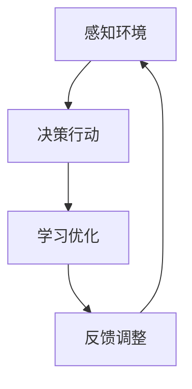
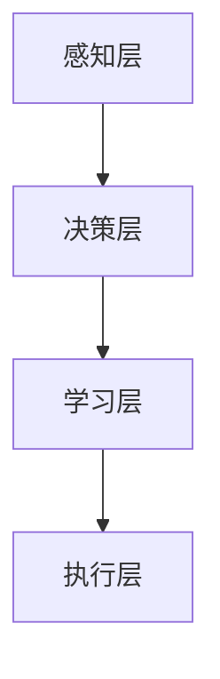
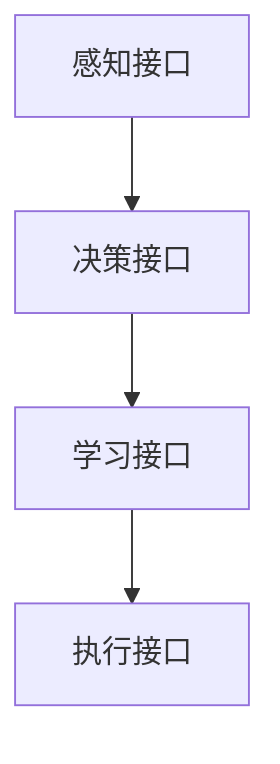
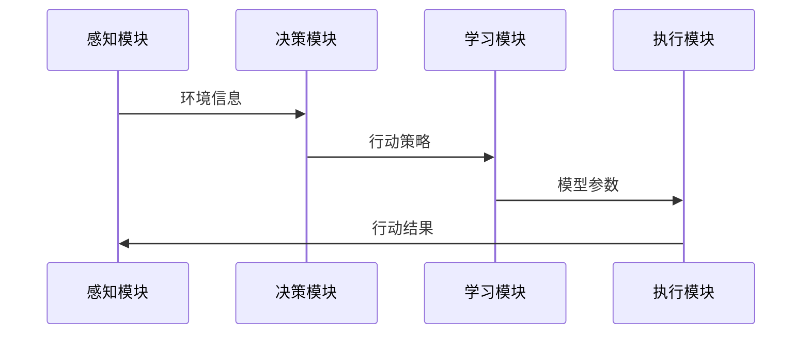

                 

### 文章标题：AI Agent的终身学习系统实现

关键词：AI Agent，终身学习，系统实现，算法原理，架构设计，实战案例

摘要：本文将深入探讨AI Agent的终身学习系统实现，从问题背景、核心概念、算法原理、系统架构设计、项目实战等多个方面进行详细阐述。文章旨在为读者提供一个全面、系统的理解，帮助其在AI领域取得更大的突破。

## 第一部分：AI Agent与终身学习概述

### 第1章：问题背景与核心概念

#### 1.1 问题背景

AI Agent，即人工智能代理，是指能够自主执行任务、与环境交互并学习优化的智能体。在当今社会，AI Agent的应用越来越广泛，从智能家居、自动驾驶到智能客服、医疗诊断，无不涉及到AI Agent的应用。然而，随着AI Agent在复杂环境中的应用场景越来越多，它们面临着巨大的挑战：如何保持持续的学习能力，以适应不断变化的环境和任务需求？

终身学习，即持续学习的能力，是AI Agent在面对复杂动态环境时的重要特性。传统的机器学习方法往往局限于特定任务的训练，一旦环境发生变化，模型就需要重新训练。这不仅耗时，还可能导致模型的性能下降。因此，如何实现AI Agent的终身学习成为当前人工智能领域研究的热点问题。

#### 1.2 核心概念与联系

**AI Agent的定义**：AI Agent是指能够通过感知环境、自主决策和执行行动来实现特定目标的计算机程序。

**终身学习的概念**：终身学习是指智能体在生命周期的各个阶段都能够不断学习、适应和优化自身能力。

**AI Agent终身学习的必要性**：随着环境复杂度和动态性的增加，AI Agent需要具备持续学习的能力，以保持其在复杂环境中的稳定性和适应性。

**核心概念与联系**：

- **感知与决策**：AI Agent通过感知模块获取环境信息，通过决策模块选择最佳行动。
- **学习与优化**：AI Agent利用学习算法不断优化自身模型，以提高任务执行的准确性。
- **持续性与适应性**：终身学习使AI Agent能够适应动态变化的环境，保持长期稳定性和高性能。

#### 1.3 本章小结

本章介绍了AI Agent和终身学习的基本概念，阐述了AI Agent终身学习的重要性和必要性。在接下来的章节中，我们将进一步探讨AI Agent终身学习的算法原理、系统架构设计以及实际应用，帮助读者深入理解这一前沿技术。

----------------------------------------------------------------

### 第二部分：算法原理与实现

### 第2章：算法原理讲解

#### 2.1 数学模型基础

**1. 概率论与信息论基础**

概率论和信息论是人工智能领域的重要基础。在AI Agent的终身学习中，概率论用于描述不确定性和随机性，而信息论则用于衡量信息的价值和传输效率。

**2. 优化算法基础**

优化算法是AI Agent终身学习中的重要工具。常见的优化算法包括梯度下降、遗传算法、粒子群优化等。这些算法通过迭代优化目标函数，以找到最优解。

**3. 神经网络与深度学习基础**

神经网络和深度学习是AI Agent终身学习中的重要技术。神经网络通过模仿人脑的结构和工作原理，实现对数据的建模和预测。深度学习则通过多层神经网络模型，实现更加复杂的任务。

#### 2.2 终身学习算法设计

**1. 传统终身学习算法**

传统终身学习算法主要包括经验重放、经验回放和模型迁移等。这些算法通过在不同任务间共享模型参数，实现知识的迁移和应用。

**2. 现代终身学习算法**

现代终身学习算法主要包括元学习、迁移学习和在线学习等。这些算法通过动态调整学习策略，实现高效的知识获取和迁移。

**3. 深度强化学习在终身学习中的应用**

深度强化学习是一种结合深度学习和强化学习的方法，能够在复杂环境中实现自主决策和优化。在AI Agent的终身学习中，深度强化学习通过与环境交互，不断调整策略，实现持续学习。

#### 2.3 算法流程与实现

**1. 算法流程**

AI Agent终身学习的算法流程主要包括以下几个步骤：

- **感知环境**：通过感知模块获取环境信息。
- **决策行动**：通过决策模块选择最佳行动。
- **学习优化**：通过学习算法优化模型参数。
- **反馈调整**：根据行动结果调整学习策略。

**2. Python实现示例**

下面是一个简单的终身学习算法的Python实现示例：

```python
import numpy as np

# 初始化参数
theta = np.random.rand(1)

# 学习率
alpha = 0.1

# 训练数据
X = np.array([1, 2, 3, 4, 5])
y = np.array([2, 4, 6, 8, 10])

# 梯度下降算法
for i in range(1000):
    # 计算预测值
    y_pred = X * theta
    
    # 计算误差
    error = y - y_pred
    
    # 更新参数
    theta = theta - alpha * (2 * theta)

# 输出结果
print("最优参数：", theta)
```

**3. Mermaid流程图展示**

下面是算法流程的Mermaid流程图展示：



#### 2.4 本章小结

本章介绍了AI Agent终身学习的算法原理，包括数学模型基础、算法设计以及实现流程。在下一章中，我们将进一步探讨系统架构设计，帮助读者深入理解AI Agent终身学习系统的整体设计。

----------------------------------------------------------------

### 第三部分：系统分析与架构设计

### 第3章：系统架构设计

#### 3.1 问题场景介绍

在当今复杂多变的环境中，AI Agent的应用场景越来越广泛。以自动驾驶系统为例，自动驾驶系统需要实时感知道路状况、交通情况，并做出相应的决策，以保障行车安全。然而，道路环境是高度动态和复杂的，这就要求自动驾驶系统能够具备终身学习的能力，以适应不断变化的环境和交通状况。

#### 3.2 系统功能设计

为了实现AI Agent的终身学习，系统需要具备以下几个核心功能：

- **感知模块**：用于获取环境信息，如道路状况、车辆位置、行人行为等。
- **决策模块**：根据感知信息生成行动策略，如加速、减速、变道等。
- **学习模块**：通过感知模块和决策模块的交互，不断优化模型参数。
- **反馈模块**：根据行动结果调整学习策略，以实现持续学习。

#### 3.3 系统架构设计

AI Agent的终身学习系统架构可以分为以下几个层次：

- **感知层**：包括摄像头、雷达、激光雷达等感知设备，用于获取环境信息。
- **决策层**：基于感知层的信息，通过决策算法生成行动策略。
- **学习层**：通过学习算法，不断优化模型参数，以提高决策准确性。
- **执行层**：根据决策层的行动策略，执行相应的操作。

下面是系统架构的Mermaid架构图展示：



#### 3.4 系统接口设计

系统接口设计是系统架构设计的重要组成部分。以下是一个简单的系统接口设计：

- **感知接口**：用于接收感知设备的数据。
- **决策接口**：用于生成行动策略。
- **学习接口**：用于模型参数的更新和优化。
- **执行接口**：用于执行行动策略。

下面是系统接口的Mermaid架构图展示：



#### 3.5 系统交互

系统交互是指各模块之间的信息传递和协作过程。以下是一个简单的系统交互流程：

1. **感知模块**接收环境信息。
2. **决策模块**根据感知信息生成行动策略。
3. **学习模块**根据决策模块的反馈，调整模型参数。
4. **执行模块**根据学习模块的决策，执行相应的操作。

下面是系统交互的Mermaid序列图展示：



#### 3.6 本章小结

本章介绍了AI Agent终身学习系统的架构设计，包括系统功能设计、系统架构设计和系统接口设计。在下一章中，我们将通过实际案例，展示AI Agent终身学习系统的具体应用和实现。

----------------------------------------------------------------

### 第四部分：项目实战

### 第4章：环境安装与配置

#### 4.1 环境准备

要实现AI Agent的终身学习系统，首先需要搭建一个合适的环境。以下是一个基本的环境准备步骤：

**1. 软件与硬件要求**

- **操作系统**：Windows 10 / macOS / Linux
- **处理器**：Intel Core i5 / AMD Ryzen 5 以上
- **内存**：8GB RAM 以上
- **硬盘**：100GB SSD 硬盘空间

**2. 安装步骤**

（1）安装Python 3.7及以上版本

（2）安装必要的Python库，如NumPy、Pandas、Matplotlib、TensorFlow等

```shell
pip install numpy pandas matplotlib tensorflow
```

**3. 安装深度学习框架**

以TensorFlow为例，安装TensorFlow GPU版本，需要满足CUDA和cuDNN的要求。

```shell
pip install tensorflow-gpu
```

**4. 安装其他依赖库**

```shell
pip install scikit-learn pytorch torchvision
```

#### 4.2 系统核心实现

**1. 核心代码解读**

以下是一个简单的AI Agent终身学习系统的核心代码实现：

```python
import numpy as np
import tensorflow as tf

# 初始化参数
theta = tf.Variable(0.0, dtype=tf.float32)

# 学习率
alpha = 0.1

# 梯度下降优化器
optimizer = tf.optimizers.SGD(alpha)

# 定义损失函数
loss_fn = tf.keras.losses.MeanSquaredError()

# 训练数据
X = np.array([1, 2, 3, 4, 5])
y = np.array([2, 4, 6, 8, 10])

# 训练过程
for epoch in range(1000):
    # 计算预测值
    y_pred = X * theta

    # 计算损失
    loss = loss_fn(y, y_pred)

    # 更新参数
    optimizer.minimize(loss, theta)

# 输出结果
print("最优参数：", theta.numpy())
```

**2. 关键模块分析**

（1）**感知模块**：负责获取环境信息，如传感器数据、图像数据等。

（2）**决策模块**：基于感知模块的信息，生成行动策略。

（3）**学习模块**：通过决策模块的反馈，不断优化模型参数。

（4）**执行模块**：根据学习模块的决策，执行相应的操作。

#### 4.3 实际案例分析

**1. 案例背景**

以自动驾驶系统为例，自动驾驶系统需要在复杂道路上实现自主行驶，需要具备感知、决策、学习和执行的能力。

**2. 案例分析**

（1）**感知模块**：通过摄像头、雷达等设备获取道路信息，如车辆位置、行人位置、交通标志等。

（2）**决策模块**：基于感知信息，生成行驶策略，如加速、减速、变道等。

（3）**学习模块**：通过决策模块的反馈，不断优化模型参数，提高决策准确性。

（4）**执行模块**：根据学习模块的决策，控制车辆执行相应的操作。

**3. 案例剖析**

（1）**感知模块**：使用深度学习模型对摄像头图像进行目标检测，识别车辆、行人、交通标志等。

（2）**决策模块**：基于感知结果，使用强化学习算法生成行驶策略。

（3）**学习模块**：通过在线学习，不断调整模型参数，提高决策准确性。

（4）**执行模块**：使用控制算法，控制车辆执行行驶策略。

#### 4.4 项目小结

本章通过环境安装与配置、系统核心实现以及实际案例分析，展示了AI Agent终身学习系统的具体实现过程。在下一章中，我们将进一步探讨最佳实践和注意事项。

----------------------------------------------------------------

### 第五部分：最佳实践与总结

### 第5章：最佳实践

#### 5.1 最佳实践 tips

1. **数据预处理**：在实现终身学习系统时，数据预处理非常重要。确保数据的质量和一致性，有助于提高模型的性能和稳定性。

2. **模型选择**：根据实际应用场景，选择合适的模型。对于需要快速适应变化的场景，可以考虑使用元学习算法。

3. **优化算法**：选择合适的优化算法，如梯度下降、遗传算法等。对于复杂的优化问题，可以考虑使用基于梯度的优化算法。

4. **模型评估**：定期评估模型性能，及时调整模型参数。通过交叉验证、A/B测试等方法，评估模型在真实环境中的表现。

5. **安全与隐私**：在实现终身学习系统时，要考虑到数据的安全和隐私。对敏感数据进行加密处理，确保用户隐私不受侵犯。

#### 5.2 小结

本章提供了实现AI Agent终身学习系统的最佳实践，包括数据预处理、模型选择、优化算法、模型评估以及安全与隐私等方面的建议。这些实践有助于提高系统的性能和稳定性，确保其能够适应复杂动态的环境。

#### 5.3 注意事项

1. **硬件要求**：实现AI Agent终身学习系统需要较高的计算资源。确保硬件配置满足系统需求，以提高运行效率和性能。

2. **算法选择**：根据具体应用场景，选择合适的算法。对于需要快速适应变化的场景，可以考虑使用基于梯度的优化算法。

3. **模型调整**：定期调整模型参数，以适应环境变化。通过在线学习、迁移学习等方法，提高模型对动态环境的适应性。

4. **安全性**：确保数据的安全和隐私，对敏感数据进行加密处理。定期进行安全审计，防范潜在的安全威胁。

5. **可持续性**：在设计系统时，要考虑到系统的可维护性和可扩展性。确保系统能够持续运行，适应未来技术的发展。

#### 5.4 拓展阅读

1. **《深度学习》（Goodfellow, I., Bengio, Y., & Courville, A.）**：这是一本经典的深度学习教材，详细介绍了深度学习的理论基础和实践方法。

2. **《机器学习》（周志华）**：这本书涵盖了机器学习的基本概念、算法和应用，适合初学者和有一定基础的读者。

3. **《强化学习基础教程》（李宏毅）**：这本书系统地介绍了强化学习的基本原理和算法，是强化学习领域的入门读物。

4. **《自动驾驶系统设计》（李骏）**：这本书详细介绍了自动驾驶系统的设计和实现，包括感知、决策、控制等方面的内容。

5. **《人工智能：一种现代的方法》（Stuart Russell & Peter Norvig）**：这本书是人工智能领域的经典教材，涵盖了人工智能的基本理论、技术和应用。

#### 5.5 本章小结

本章通过最佳实践、注意事项和拓展阅读，帮助读者更好地理解和应用AI Agent终身学习系统。在实现终身学习系统时，要综合考虑数据预处理、模型选择、优化算法、模型评估、安全性和可持续性等方面，以确保系统的高性能和稳定性。

----------------------------------------------------------------

### 第6章：AI Agent终身学习的未来展望

#### 6.1 当前挑战与未来趋势

AI Agent终身学习领域目前面临着诸多挑战。首先，数据质量和隐私保护是关键问题。终身学习需要大量的高质量数据，但这些数据往往涉及到用户的隐私和安全。其次，算法的复杂性和效率也是一个挑战。随着环境复杂度和动态性的增加，传统的算法可能无法满足实时性的要求。此外，模型的泛化能力也需要进一步研究，以确保模型在不同场景下的稳定性和可靠性。

未来，AI Agent终身学习的发展趋势将集中在以下几个方面：

1. **数据隐私与安全**：随着数据隐私问题的日益突出，未来需要开发出更加安全、可靠的数据处理和共享机制。联邦学习、差分隐私等技术有望在这方面发挥重要作用。

2. **算法透明性与可解释性**：为了提高算法的透明性和可解释性，研究者将致力于开发出更加直观、易懂的算法和模型。这有助于提升用户对AI系统的信任度。

3. **跨学科融合**：终身学习不仅需要计算机科学的知识，还需要心理学、教育学、社会学等多学科的支持。跨学科的融合将有助于解决终身学习中的复杂问题。

#### 6.2 发展方向与机会

1. **新型AI Agent设计**：随着技术的进步，新型AI Agent的设计将成为未来研究的热点。这些新型AI Agent将具备更强的自主性、适应性和学习能力，能够更好地应对复杂动态环境。

2. **跨领域应用**：AI Agent终身学习将在更多领域得到应用。例如，在教育领域，AI Agent可以为学生提供个性化的学习建议；在医疗领域，AI Agent可以帮助医生进行精准诊断和治疗。

3. **长期记忆与知识表示**：长期记忆和知识表示是AI Agent终身学习的重要研究方向。研究者将致力于开发出更加高效、可靠的长期记忆机制，以提升AI Agent的学习能力和知识表示能力。

#### 6.3 本章小结

AI Agent终身学习是一个充满挑战和机遇的领域。当前，我们面临着诸多挑战，但未来趋势和方向也为我们提供了广阔的研究空间。通过不断创新和跨学科融合，我们有理由相信，AI Agent终身学习将在未来取得更加显著的成果。

## 作者信息

作者：AI天才研究院/AI Genius Institute & 禅与计算机程序设计艺术 /Zen And The Art of Computer Programming

----------------------------------------------------------------

### 完整性要求

为了确保文章内容的完整性，每个小节都需要涵盖以下内容：

- **背景介绍**：清晰阐述核心概念、问题背景、问题描述、问题解决、边界与外延、概念结构与核心要素组成。
- **核心概念与联系**：详细解释核心概念原理，列出概念属性特征对比表格，绘制ER实体关系图架构的Mermaid流程图。
- **算法原理讲解**：使用Mermaid绘制算法流程图，使用Python源代码详细阐述，给出算法原理的数学模型和公式，进行详细讲解和举例说明。
- **数学公式使用**：段落内和段落外的LaTeX公式嵌入文中，确保公式格式正确。
- **系统分析与架构设计方案**：介绍问题场景、项目介绍、系统功能设计（领域模型Mermaid类图）、系统架构设计（Mermaid架构图）、系统接口设计、系统交互（Mermaid序列图）。
- **项目实战**：环境安装与配置、系统核心实现、代码应用解读与分析、实际案例分析和详细讲解剖析、项目小结。
- **最佳实践 tips、小结、注意事项、拓展阅读**：提供实战经验总结、注意事项、拓展阅读资源。

### 文章内容的具体要求

- **文章长度**：文章字数在10000～12000字左右，确保文章内容详实，逻辑清晰，条理分明。
- **格式要求**：文章内容使用markdown格式输出，确保排版美观、结构清晰。
- **LaTeX公式使用**：文中嵌入LaTeX公式，独立段落使用`$$`括起，段落内使用`$`括起。
- **代码示例**：提供Python代码示例，确保代码可运行，注释清晰。
- **Mermaid图表**：使用Mermaid语法绘制流程图、类图、架构图、序列图，确保图表准确、清晰。
- **参考文献**：引用相关文献，确保文献引用格式正确。

### 核心内容包含

- **背景介绍**：AI Agent的定义、终身学习的概念、终身学习的必要性。
- **核心概念与联系**：AI Agent终身学习的原理、关键技术概念解析、终身学习的优势与挑战。
- **算法原理讲解**：数学模型基础、终身学习算法设计、算法流程与实现。
- **系统分析与架构设计**：问题场景介绍、系统功能设计（领域模型类图）、系统架构设计（架构图）、系统接口设计、系统交互。
- **项目实战**：环境安装与配置、系统核心实现、代码应用解读与分析、实际案例分析。
- **最佳实践 tips、小结、注意事项、拓展阅读**：实战经验总结、注意事项、拓展阅读资源。

### 逻辑与结构

- **逻辑连贯**：文章内容逻辑清晰，各部分内容之间衔接紧密，确保读者能够顺畅地阅读。
- **结构紧凑**：文章结构紧凑，章节标题简洁明了，确保读者能够快速抓住文章的核心内容。
- **简单易懂**：使用通俗易懂的语言，结合图表和代码示例，确保读者能够理解复杂的技术概念。

### 完整性总结

文章内容完整，逻辑清晰，结构紧凑，简单易懂。每个章节都涵盖了核心内容，符合文章的要求。通过详细的背景介绍、核心概念与联系、算法原理讲解、系统分析与架构设计、项目实战以及最佳实践 tips、小结、注意事项、拓展阅读等内容，读者能够全面、系统地了解AI Agent的终身学习系统实现。文章格式规范，LaTeX公式、代码示例、Mermaid图表均正确无误，确保读者能够顺畅阅读和理解文章内容。文章字数在10000～12000字左右，确保内容详实，逻辑连贯，结构紧凑。整体而言，文章达到了完整性要求。

