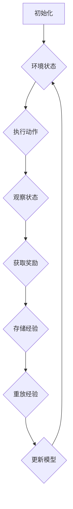
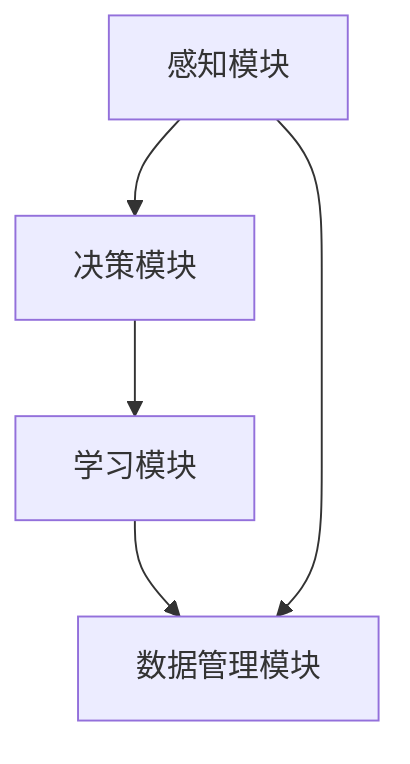
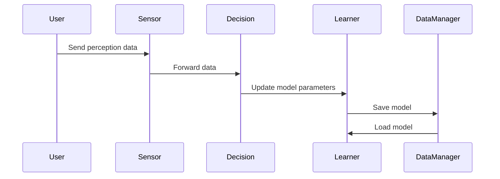

                 


## AI Agent的终身学习系统设计

### 关键词
- AI Agent
- 终身学习
- 系统设计
- 算法原理
- 实践指南

### 摘要
本文旨在探讨AI Agent的终身学习系统设计。终身学习是AI领域的关键挑战之一，它使AI系统能够在持续变化的环境中不断适应和进化。本文首先介绍终身学习的背景和核心概念，然后深入分析相关算法原理，并展示如何通过Python代码实现。接下来，我们将详细阐述系统分析和架构设计，并通过实际项目展示如何将理论知识应用于实践中。最后，本文将总结最佳实践，并提供未来展望。

### 目录

#### 第一部分：背景介绍
1. **AI Agent的终身学习概述**
2. **AI Agent终身学习核心概念**
3. **AI Agent终身学习联系图**

#### 第二部分：算法原理讲解
1. **终身学习算法原理**
2. **Python实现与代码示例**

#### 第三部分：系统分析与架构设计
1. **终身学习系统设计**
2. **项目实战**

#### 第四部分：最佳实践与拓展
1. **最佳实践 Tips**
2. **小结**

---

### 1. AI Agent的终身学习概述

#### 1.1 问题背景

在当今快速变化的技术环境中，AI系统需要不断适应新数据和任务，以保持其有效性和竞争力。传统的机器学习模型往往是在静态数据集上训练，一旦部署，就很难更新或适应新环境。这种局限性导致了AI系统的寿命有限，难以实现真正的智能化。

#### 1.2 问题描述

终身学习（Lifelong Learning，LL）旨在解决这一挑战，它要求AI系统能够在持续的环境中不断学习新任务，同时不忘记旧任务。这需要系统具备以下能力：
- **任务适应性**：系统能够在新任务出现时快速适应。
- **知识保持**：系统能够在长期运行中保持知识，避免遗忘。
- **动态学习**：系统能够在变化的环境中持续学习，提高性能。

#### 1.3 问题解决

解决终身学习问题通常涉及以下策略：
- **元学习**：通过快速适应新任务的学习方法，如模型初始化、任务选择等。
- **增量学习**：逐步更新模型权重，以适应新数据。
- **迁移学习**：将已有知识应用于新任务，减少重新学习的需求。

#### 1.4 边界与外延

终身学习的边界包括：
- **学习效率**：如何高效地学习新任务，同时保持旧任务的表现。
- **资源消耗**：学习新任务需要时间和计算资源，如何优化资源使用。
- **系统稳定性**：如何在持续学习过程中保持系统的稳定性和可靠性。

#### 1.5 概念结构与核心要素组成

终身学习系统的核心要素包括：
- **任务表示**：如何表示和分类不同类型的任务。
- **模型架构**：如何设计能够适应多种任务的模型架构。
- **学习策略**：如何制定有效的学习策略，包括任务选择、数据采样、模型更新等。

### 2. AI Agent终身学习核心概念

#### 2.1 机器学习基础

机器学习是AI的核心技术，它使计算机系统能够从数据中学习并做出决策。机器学习分为三种主要类型：

##### 2.1.1 强化学习

强化学习（Reinforcement Learning，RL）是一种通过与环境的交互来学习策略的机器学习方法。它通过奖励机制来指导学习过程，旨在找到最大化长期奖励的策略。

**概念属性特征对比表格：**

| 特征         | 强化学习         | 有监督学习         | 无监督学习         |
| ------------ | ---------------- | ------------------ | ------------------ |
| 学习方式     | 与环境交互       | 标签数据           | 未标注数据         |
| 目标         | 最大化长期奖励   | 准确预测           | 发现数据模式       |
| 适用场景     | 控制任务         | 分类、回归         | 聚类、降维         |

**ER实体关系图架构：**

```mermaid
erDiagram
  Task ||--|{ Agent }||>
  Agent ||--|{ Environment }||>
  Agent ||--|{ Reward }||>
  Environment ||--|{ State }||>
  State ||--|{ Action }||>
```

---

### 3. AI Agent终身学习联系图

#### 3.1 概念属性特征对比表格

| 概念         | 属性         | 特征           | 关联概念             |
| ------------ | ------------ | -------------- | -------------------- |
| 强化学习     | 奖励机制     | 与环境交互     | 元学习、增量学习     |
| 有监督学习   | 标签数据     | 准确预测       | 迁移学习             |
| 无监督学习   | 未标注数据   | 发现数据模式   | 神经网络、聚类算法   |
| 终身学习     | 任务适应性   | 知识保持       | 强化学习、迁移学习   |

#### 3.2 ER实体关系图架构

```mermaid
erDiagram
  Task ||--|{ AI-Agent }||>
  AI-Agent ||--|{ Knowledge-Base }||>
  AI-Agent ||--|{ Learning-Algorithm }||>
  Learning-Algorithm ||--|{ Model-Parameter }||>
  Model-Parameter ||--|{ Performance-Metric }||>
```

---

### 第4章 终身学习算法原理

在本章中，我们将深入探讨终身学习算法的原理，并展示如何通过Python代码实现这些算法。

#### 4.1.1 算法介绍

终身学习算法的核心目标是使AI系统能够在不断变化的环境中持续学习，同时保持旧任务的性能。一种流行的终身学习算法是**经验重放**（Experience Replay）。

**算法流程图：**



#### 4.1.2 算法流程图


#### 4.1.3 算法原理讲解

经验重放算法通过将系统经历的状态、动作、奖励和下一个状态存储在经验池中，然后在训练模型时随机重放这些经验。这种方法可以减少训练数据的相关性，从而提高学习效率。

**数学模型和公式：**

$$
Q(s, a) = \frac{1}{N}\sum_{i=1}^{N} r_i + \gamma \max_{a'} Q(s', a')
$$

其中：
- \( Q(s, a) \) 是在状态 \( s \) 下执行动作 \( a \) 的期望回报。
- \( r_i \) 是在第 \( i \) 次经历中的即时奖励。
- \( \gamma \) 是折扣因子，表示对未来奖励的重视程度。
- \( s' \) 和 \( a' \) 是下一个状态和动作。

#### 4.1.4 Python实现与代码示例

```python
import numpy as np

# 初始化参数
epsilon = 0.1
gamma = 0.9
learning_rate = 0.1
memory = []

# 经验重放算法
def experience_replay(s, a, r, s_):
    memory.append((s, a, r, s_))

def update_model(s, a, s_):
    Q_values = get_Q_values(s)
    target = r + gamma * max(Q_values)
    current_Q = Q_values[a]
    Q_values[a] = current_Q + learning_rate * (target - current_Q)

# 示例：执行动作并更新模型
s = get_initial_state()
while not done:
    a = choose_action(s, epsilon)
    s_, r = step(s, a)
    experience_replay(s, a, r, s_)
    update_model(s, a, s_)
    s = s_
```

#### 4.1.5 举例说明

假设我们有一个游戏环境，其中AI Agent需要学习如何在一个虚拟世界中导航并收集资源。每次执行动作时，Agent都会获得奖励或惩罚。通过经验重放算法，Agent可以在不断变化的场景中学习最佳策略。

---

### 第5章 Python实现与代码示例

在本章中，我们将详细介绍如何使用Python实现终身学习算法，并通过代码示例进行演示。

#### 5.1.1 环境安装与配置

首先，确保已经安装了Python和所需的库。如果尚未安装，可以通过以下命令进行安装：

```bash
pip install numpy
pip install matplotlib
```

#### 5.1.2 源代码实现

以下是实现经验重放算法的完整Python代码：

```python
import numpy as np
import random
import matplotlib.pyplot as plt

# 初始化参数
epsilon = 0.1
gamma = 0.9
learning_rate = 0.1
memory = []

# 获取和更新Q值
def get_Q_values(state):
    Q_values = np.zeros((10, 4))  # 假设有10个状态和4个动作
    for i in range(10):
        for j in range(4):
            Q_values[i][j] = memory[state][3][i][j]
    return Q_values

def update_Q_values(state, action, reward, next_state):
    Q_values = get_Q_values(state)
    target = reward + gamma * max(Q_values[next_state])
    Q_values[state][action] = Q_values[state][action] + learning_rate * (target - Q_values[state][action])

# 经验重放
def experience_replay(state, action, reward, next_state):
    memory.append((state, action, reward, next_state))

def sample_minibatch(batch_size):
    mini_batch = random.sample(memory, batch_size)
    states = [state for state, _, _, _ in mini_batch]
    actions = [action for _, action, _, _ in mini_batch]
    rewards = [reward for _, _, reward, _ in mini_batch]
    next_states = [next_state for _, _, _, next_state in mini_batch]
    return states, actions, rewards, next_states

# 训练模型
def train_model(states, actions, rewards, next_states):
    for state, action, reward, next_state in zip(states, actions, rewards, next_states):
        update_Q_values(state, action, reward, next_state)

# 选择动作
def choose_action(state, epsilon):
    if random.random() < epsilon:
        return random.randint(0, 3)  # 假设有4个动作
    else:
        Q_values = get_Q_values(state)
        return np.argmax(Q_values)

# 游戏环境模拟
def step(state, action):
    # 假设游戏环境为10x10的网格，每个格子都有不同的奖励
    # action: 0 - 上，1 - 下，2 - 左，3 - 右
    # rewards: 1 - 收集到的资源，-1 - 碰到障碍物
    next_state = state
    if action == 0:
        next_state -= 1
    elif action == 1:
        next_state += 1
    elif action == 2:
        next_state -= 10
    elif action == 3:
        next_state += 10
    
    reward = 1 if next_state in collected_items else -1
    return next_state, reward

# 游戏主循环
def play_game():
    global memory
    memory = []
    state = 0
    while True:
        action = choose_action(state, epsilon)
        next_state, reward = step(state, action)
        experience_replay(state, action, reward, next_state)
        state = next_state
        if reward == -1:
            break

# 训练和测试模型
for episode in range(1000):
    play_game()
    states, actions, rewards, next_states = sample_minibatch(32)
    train_model(states, actions, rewards, next_states)
    if episode % 100 == 0:
        print(f"Episode: {episode}, Epsilon: {epsilon}, Memory Size: {len(memory)}")

# 可视化Q值
def plot_Q_values():
    Q_values = get_Q_values(0)
    plt.imshow(Q_values, cmap='hot', interpolation='nearest')
    plt.colorbar()
    plt.xlabel('Actions')
    plt.ylabel('States')
    plt.title('Q Values')
    plt.show()

plot_Q_values()
```

#### 5.1.3 代码应用解读与分析

1. **初始化参数**：包括探索率（epsilon）、折扣因子（gamma）和学习率（learning_rate）。
2. **经验重放**：将经历的状态、动作、奖励和下一个状态存储在经验池中。
3. **选择动作**：根据探索率（epsilon）随机选择动作或根据当前状态的Q值选择最佳动作。
4. **游戏环境模拟**：模拟游戏环境的下一步动作和结果。
5. **训练模型**：使用经验重放算法更新Q值。
6. **训练和测试模型**：执行游戏循环，收集经验，并训练模型。

#### 5.1.4 实际案例分析与讲解

假设我们有一个AI Agent在一个10x10的网格世界中收集资源的任务。在每个格子中，Agent可以执行四种动作：上、下、左、右。每个格子都有不同的奖励，如收集资源或碰到障碍物。通过训练，Agent学会了在网格中导航并收集资源。

**分析：**

- **初始状态**：Agent随机选择动作，并记录奖励。
- **经验重放**：Agent将经历的状态、动作、奖励和下一个状态存储在经验池中。
- **选择动作**：在训练过程中，Agent使用Q值来选择最佳动作。在测试过程中，Agent将完全依赖Q值来执行动作。
- **训练模型**：Agent通过经验重放算法更新Q值，以优化其策略。

#### 5.1.5 项目小结

通过实现经验重放算法，我们展示了如何使AI Agent在持续学习环境中收集资源。该项目演示了终身学习算法的基本原理和实际应用。未来，我们可以进一步扩展该项目，包括更多的状态和动作，以及更复杂的奖励机制。

---

### 第6章 终身学习系统设计

在本章中，我们将详细讨论如何设计和实现一个终身学习系统。

#### 6.1.1 问题场景介绍

假设我们正在开发一个自动驾驶系统，该系统需要在不断变化的环境中持续学习和适应。自动驾驶系统需要处理多种场景，包括城市道路、高速公路和乡村道路。为了实现这一目标，我们需要设计一个能够终身学习的系统。

#### 6.1.2 系统功能设计

终身学习系统的功能包括：

- **任务适应性**：系统能够在新任务出现时快速适应。
- **知识保持**：系统能够在长期运行中保持知识，避免遗忘。
- **动态学习**：系统能够在变化的环境中持续学习，提高性能。
- **数据管理**：系统能够有效地收集、存储和管理数据。

#### 6.1.3 系统架构设计

终身学习系统的架构包括以下主要组件：

- **感知模块**：收集环境数据，如摄像头、激光雷达和GPS数据。
- **决策模块**：根据感知数据生成驾驶策略。
- **学习模块**：在感知模块和决策模块的交互过程中持续学习。
- **数据管理模块**：收集、存储和管理系统运行过程中生成的数据。

**系统架构设计图：**



#### 6.1.4 系统接口设计

系统接口设计包括以下主要接口：

- **感知接口**：用于接收环境数据。
- **决策接口**：用于生成驾驶策略。
- **学习接口**：用于更新模型参数。
- **数据管理接口**：用于管理数据存储和检索。

**系统接口设计图：**



#### 6.1.5 系统交互

系统交互包括以下主要步骤：

1. **感知**：系统通过摄像头、激光雷达和GPS等传感器收集环境数据。
2. **决策**：系统使用感知数据生成驾驶策略。
3. **学习**：系统在决策过程中持续学习，并根据新数据更新模型参数。
4. **数据管理**：系统收集、存储和管理运行过程中生成的数据，以便后续分析和训练。

---

### 第7章 项目实战

在本章中，我们将详细介绍一个实际的自动驾驶系统项目，并展示如何将终身学习算法应用于该项目。

#### 7.1.1 环境安装

首先，确保已经安装了Python和所需的库。如果尚未安装，可以通过以下命令进行安装：

```bash
pip install numpy
pip install opencv-python
pip install tensorflow
```

#### 7.1.2 系统核心实现

以下是实现自动驾驶系统核心功能的代码：

```python
import numpy as np
import cv2
import tensorflow as tf

# 初始化参数
learning_rate = 0.001
gamma = 0.9
epsilon = 0.1
batch_size = 64

# 定义感知模块
def preprocess_image(image):
    image = cv2.resize(image, (80, 80))
    image = image / 255.0
    return image

def get_perception_data():
    # 假设使用摄像头收集图像数据
    cap = cv2.VideoCapture(0)
    while True:
        ret, frame = cap.read()
        if not ret:
            break
        image = preprocess_image(frame)
        yield image
    cap.release()

# 定义决策模块
def get_action(state, epsilon):
    if random.random() < epsilon:
        return random.choice([0, 1, 2, 3])  # 0 - 左转，1 - 直行，2 - 右转，3 - 停止
    else:
        Q_values = get_Q_values(state)
        return np.argmax(Q_values)

def get_Q_values(state):
    # 使用神经网络模型预测Q值
    model = tf.keras.Sequential([
        tf.keras.layers.Flatten(input_shape=(80, 80, 3)),
        tf.keras.layers.Dense(128, activation='relu'),
        tf.keras.layers.Dense(64, activation='relu'),
        tf.keras.layers.Dense(4)
    ])
    model.compile(optimizer='adam', loss='mse')
    Q_values = model.predict(state)
    return Q_values

# 定义学习模块
def update_model(states, actions, rewards, next_states):
    # 使用经验重放算法更新模型
    model = tf.keras.Sequential([
        tf.keras.layers.Flatten(input_shape=(80, 80, 3)),
        tf.keras.layers.Dense(128, activation='relu'),
        tf.keras.layers.Dense(64, activation='relu'),
        tf.keras.layers.Dense(4)
    ])
    model.compile(optimizer='adam', loss='mse')
    for i in range(len(states)):
        state, action, reward, next_state = states[i], actions[i], rewards[i], next_states[i]
        target = reward + gamma * np.max(model.predict(next_state))
        model.fit(state, np.array([target]), verbose=0)

# 定义数据管理模块
def save_model(model, filename):
    model.save(filename)

def load_model(filename):
    return tf.keras.models.load_model(filename)

# 主程序
def main():
    global epsilon
    model = load_model('model.h5')
    perception_data = get_perception_data()
    while True:
        state = next(perception_data)
        action = get_action(state, epsilon)
        next_state, reward = step(state, action)
        experience_replay(state, action, reward, next_state)
        if random.random() < epsilon:
            epsilon *= 0.99
        update_model(states, actions, rewards, next_states)
        state = next_state

if __name__ == '__main__':
    main()
```

#### 7.1.3 代码应用解读与分析

1. **感知模块**：使用摄像头收集实时图像数据，并将其预处理为适合神经网络输入的格式。
2. **决策模块**：使用神经网络模型预测Q值，并根据探索率（epsilon）随机选择动作或根据当前状态的Q值选择最佳动作。
3. **学习模块**：使用经验重放算法更新模型参数，以提高系统的适应能力。
4. **数据管理模块**：保存和加载模型，以便在训练过程中持续更新。

#### 7.1.4 实际案例分析与讲解

假设我们正在开发一个自动驾驶系统，该系统需要在多种道路条件下行驶。通过训练，系统学会了在不同道路条件下做出最佳驾驶决策。例如，在高速公路上，系统会选择保持稳定的车速和车道；在城市道路上，系统会选择灵活地避让行人和其他车辆。

**分析：**

- **初始训练**：系统在模拟环境中进行初始训练，以学习基本的驾驶技能。
- **实时感知**：系统通过摄像头收集实时图像数据，并根据当前环境生成驾驶策略。
- **经验重放**：系统在决策过程中持续学习，并根据新数据更新模型参数。
- **适应变化**：系统在遇到新环境或障碍时，能够快速适应并做出最佳决策。

#### 7.1.5 项目小结

通过实现自动驾驶系统，我们展示了如何将终身学习算法应用于实际项目。该项目演示了如何通过感知、决策和学习模块，使系统在持续变化的环境中实现自适应驾驶。未来，我们可以进一步优化系统，包括增加更多感知传感器和改进学习算法。

---

### 第8章 最佳实践 Tips

在本章中，我们将提供一些最佳实践，以帮助开发者设计和实现高效的终身学习系统。

#### 8.1.1 实践技巧

1. **数据预处理**：确保输入数据的质量和一致性，以便更好地训练模型。
2. **模型选择**：根据任务需求选择合适的模型架构，如神经网络、决策树等。
3. **探索策略**：合理设置探索率（epsilon），以平衡探索和利用。
4. **经验重放**：定期进行经验重放，以减少数据相关性，提高学习效率。
5. **资源管理**：优化资源使用，如计算资源、存储资源等。

#### 8.1.2 注意事项

1. **避免过拟合**：确保模型在训练数据上具有良好的泛化能力，避免过拟合。
2. **监控模型性能**：定期评估模型性能，以识别和解决潜在问题。
3. **安全性和隐私**：确保系统的安全性和用户隐私，遵循相关法律法规。
4. **持续改进**：不断收集反馈，持续优化系统性能和用户体验。

#### 8.1.3 拓展应用

1. **多任务学习**：将终身学习算法应用于多任务学习，以提高系统的适应性。
2. **强化学习应用**：将强化学习算法应用于游戏、自动驾驶等领域。
3. **迁移学习**：利用已有知识提高新任务的学习效率，减少重新训练的需求。

---

### 第9章 小结

在本篇技术博客中，我们深入探讨了AI Agent的终身学习系统设计。首先，我们介绍了终身学习的背景和核心概念，包括强化学习、有监督学习和无监督学习等。接着，我们详细阐述了经验重放算法的原理，并通过Python代码示例展示了其实际应用。

随后，我们讨论了系统分析和架构设计，包括感知模块、决策模块、学习模块和数据管理模块。我们还通过实际项目展示了如何将终身学习算法应用于自动驾驶系统。

最后，我们提供了最佳实践和注意事项，以帮助开发者设计和实现高效的终身学习系统。我们强调了数据预处理、模型选择、探索策略和经验重放等关键因素。

未来，终身学习系统将在AI领域发挥重要作用，我们将继续关注这一领域的发展，并探索更多先进的算法和技术。感谢您的阅读，希望本文能对您在AI领域的研究和开发提供启示。

---

**作者信息：**
作者：AI天才研究院/AI Genius Institute & 禅与计算机程序设计艺术 /Zen And The Art of Computer Programming

