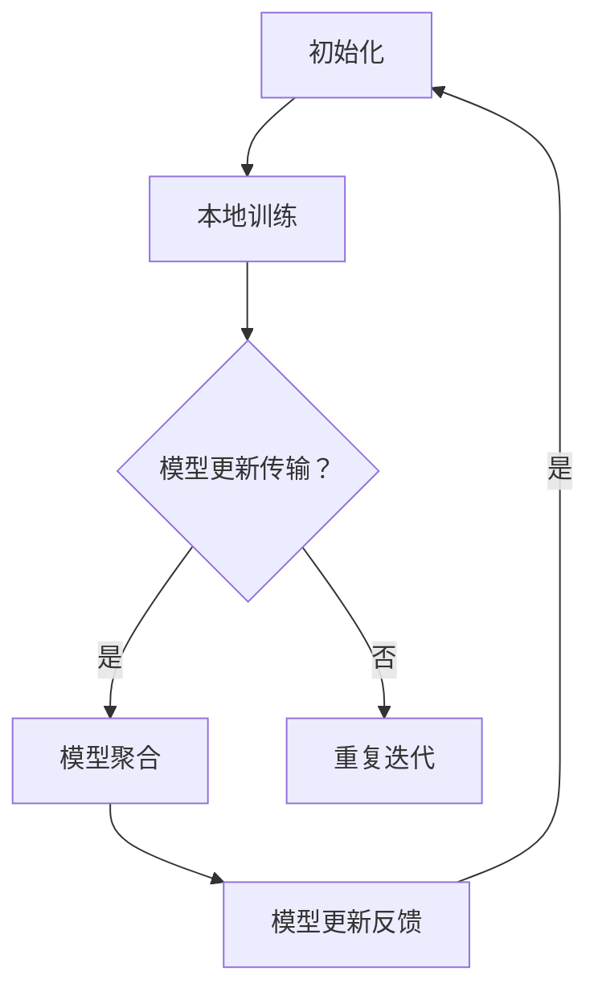
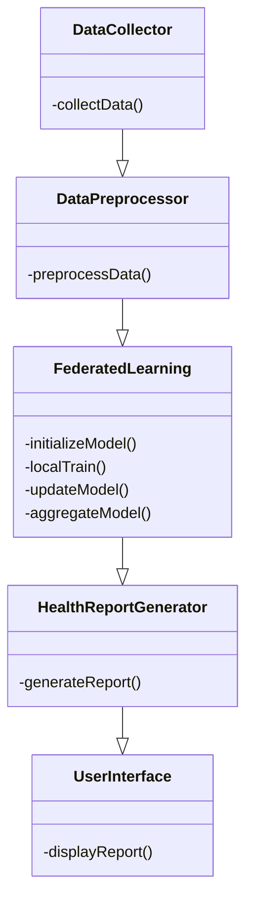
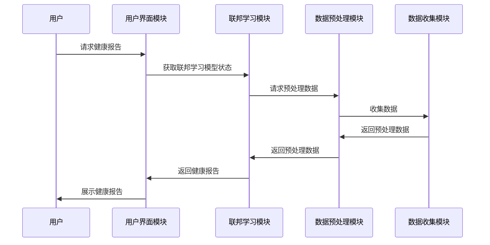

                 

### 联邦学习技术概述

#### 背景介绍

联邦学习（Federated Learning，FL）是一种分布式机器学习方法，旨在通过将计算任务分散到多个边缘设备上，来提高数据处理效率、隐私保护和系统可扩展性。传统的集中式学习模型通常将所有数据汇集到一个中心服务器上，然后在该服务器上训练模型。这种方法虽然能实现较高的准确性和性能，但同时也带来了严重的隐私风险，特别是在涉及敏感数据的场景中。联邦学习正是为了解决这一问题而提出的。

联邦学习的核心思想在于各参与方（如手机、智能家居设备、医疗设备等）在本地对数据进行训练，并仅将模型的更新参数发送到中心服务器，而不需要传输原始数据。这样既保护了用户隐私，又能充分利用分散的数据资源，从而提高整体模型的性能。

#### 问题背景

随着互联网的普及和数据量的爆炸式增长，如何高效、安全地利用这些数据成为一个重要的研究课题。传统的集中式学习模型虽然在性能上有着显著的提升，但在实际应用中却面临着以下问题：

1. **数据隐私泄露**：集中式学习需要将所有数据上传到中心服务器，这可能导致用户隐私泄露。
2. **通信成本高**：特别是在数据量大且分布广泛的情况下，上传和下载数据需要消耗大量的通信资源。
3. **数据一致性差**：不同设备产生的数据可能存在不一致性，影响模型训练的效果。
4. **可扩展性差**：随着设备数量的增加，中心服务器的负载会急剧增加，导致系统性能下降。

#### 问题描述

联邦学习旨在通过以下方式解决上述问题：

1. **隐私保护**：通过本地训练和参数更新，避免了原始数据的传输，从而保护了用户的隐私。
2. **通信成本优化**：只需传输模型的更新参数，大大降低了通信成本。
3. **数据一致性**：允许设备根据本地数据训练模型，提高了数据的一致性。
4. **可扩展性**：联邦学习能够很好地处理大规模分布式设备，具有良好的可扩展性。

#### 问题解决

联邦学习的解决方案主要包括以下几个方面：

1. **分布式计算**：各设备本地训练模型，并将模型更新发送到中心服务器。
2. **加密传输**：采用加密技术确保数据传输过程中的安全性。
3. **同步与异步策略**：通过同步或异步方式更新模型参数，以适应不同的应用场景。
4. **模型压缩与优化**：采用模型压缩技术，如梯度裁剪、稀疏表示等，提高模型传输效率。

#### 边界与外延

联邦学习不仅在机器学习领域有着广泛的应用，还涉及隐私保护、网络安全、物联网等多个领域。其边界不仅限于特定算法或技术，还涵盖了整个分布式计算和协作学习的生态。

#### 概念结构与核心要素组成

联邦学习的概念结构主要包括以下几个核心要素：

1. **参与方**：包括中心服务器和多个边缘设备。
2. **本地模型训练**：各设备在本地对数据进行模型训练。
3. **模型更新**：各设备将本地训练得到的模型更新发送到中心服务器。
4. **中心服务器聚合**：中心服务器接收并聚合所有设备的模型更新，生成全局模型。

### AI Agent简介

#### AI Agent的定义

AI Agent，即人工智能代理，是指能够自主执行任务、与环境互动并作出决策的智能实体。AI Agent是一种基于强化学习、决策理论、规划算法等技术的智能系统，能够在复杂环境中实现智能行为。

#### AI Agent的特点

AI Agent具有以下几个显著特点：

1. **自主性**：AI Agent能够自主决策，无需人工干预。
2. **适应性**：AI Agent能够根据环境变化调整行为策略。
3. **交互性**：AI Agent能够与环境进行实时交互，获取反馈并优化自身行为。
4. **学习性**：AI Agent能够通过经验学习和改进自身性能。

#### AI Agent在联邦学习中的应用

AI Agent在联邦学习中的应用主要体现在以下几个方面：

1. **任务分配与优化**：AI Agent可以根据设备的计算能力和数据特性，动态分配训练任务。
2. **策略调整与优化**：AI Agent能够实时调整训练策略，提高模型训练效果。
3. **隐私保护**：AI Agent能够通过加密和去标识化等技术，保护用户隐私。
4. **分布式协作**：AI Agent能够协调不同设备之间的协作，提高整体系统效率。

### 联邦学习与AI Agent的关系

#### 联邦学习的AI Agent优势

联邦学习的AI Agent具有以下优势：

1. **隐私保护**：通过本地训练和参数更新，AI Agent能够有效保护用户隐私。
2. **资源利用**：AI Agent能够充分利用边缘设备的计算资源，提高整体系统效率。
3. **灵活部署**：AI Agent可以根据实际需求，灵活调整训练策略和任务分配。
4. **可扩展性**：AI Agent能够适应大规模分布式设备，具有良好的可扩展性。

#### 联邦学习的AI Agent实现

实现联邦学习的AI Agent主要包括以下几个步骤：

1. **设备选择**：选择具有计算能力和数据资源的边缘设备。
2. **模型训练**：AI Agent在本地设备上对模型进行训练，并生成模型更新。
3. **参数传输**：AI Agent将模型更新发送到中心服务器，实现全局模型的更新。
4. **策略调整**：AI Agent根据全局模型更新，调整本地训练策略，优化模型性能。

### 联邦学习与AI Agent的未来发展

联邦学习与AI Agent在未来的发展中将面临以下挑战和机遇：

1. **算法优化**：进一步优化联邦学习和AI Agent的算法，提高模型训练效率和准确性。
2. **安全性增强**：提高联邦学习和AI Agent的安全性，防止恶意攻击和数据泄露。
3. **跨平台兼容**：实现联邦学习和AI Agent在不同平台和设备上的兼容性。
4. **大规模应用**：将联邦学习和AI Agent应用于更多实际场景，推动人工智能的发展。

通过以上对联邦学习技术和AI Agent的介绍，我们能够更好地理解两者之间的关系及其在实际应用中的优势。接下来，我们将进一步探讨联邦学习的算法原理和具体实现方法。## 联邦学习的核心概念

### 分布式学习

分布式学习（Distributed Learning）是一种机器学习方法，它通过将计算任务分散到多个计算节点上来提高数据处理能力和效率。在分布式学习中，每个计算节点负责处理一部分数据，并独立训练本地模型。然后，这些本地模型会合并成一个全局模型。这种方法的优点在于，它可以减少单个节点的负载，提高整体系统的处理能力，特别是在面对大规模数据集时。

#### 同步与异步联邦学习

联邦学习可以根据模型更新的方式分为同步（Synchronous）和异步（Asynchronous）两种。

1. **同步联邦学习**：
   同步联邦学习在每次迭代过程中，所有设备必须同步发送本地模型更新到中心服务器，中心服务器再对更新进行聚合。同步联邦学习的优点是模型更新具有一致性，全局模型能够更准确地反映各个设备的状态。然而，同步联邦学习需要设备之间保持高度同步，这可能导致通信延迟和资源浪费。

2. **异步联邦学习**：
   异步联邦学习允许设备在不同的时间点发送本地模型更新到中心服务器。中心服务器在收到一定数量的更新后，对模型进行聚合。异步联邦学习的优点是它能够更好地适应设备的不规则更新，提高系统的灵活性。然而，异步联邦学习可能导致模型更新之间的不一致性，影响全局模型的性能。

#### 安全性、隐私性与可用性

联邦学习在保证模型性能的同时，还需要考虑安全性、隐私性和可用性。

1. **安全性**：
   联邦学习通过加密技术和差分隐私等手段，确保模型更新和数据传输过程中的安全性。加密技术可以防止中间人攻击和数据篡改，差分隐私则可以保护用户隐私。

2. **隐私性**：
   联邦学习通过本地训练和参数更新，避免了原始数据的传输，从而降低了隐私泄露的风险。此外，差分隐私和同态加密等技术在联邦学习中的应用，进一步增强了隐私保护。

3. **可用性**：
   联邦学习通过分布式计算和去中心化架构，提高了系统的可用性。即使部分设备出现故障，其他设备仍能继续参与模型训练，保证系统的正常运行。

### 联邦学习的基本流程

联邦学习的基本流程通常包括以下几个步骤：

1. **初始化**：
   中心服务器初始化全局模型，并将初始模型参数发送到各个设备。

2. **本地训练**：
   每个设备接收到全局模型参数后，在本地对模型进行训练，并生成模型更新。

3. **模型更新传输**：
   各设备将本地训练得到的模型更新发送到中心服务器。

4. **模型聚合**：
   中心服务器接收并聚合所有设备的模型更新，生成新的全局模型参数。

5. **模型更新反馈**：
   中心服务器将新的全局模型参数发送回各个设备。

6. **重复迭代**：
   上述步骤不断重复，直到模型收敛或达到预设的训练次数。

#### Mermaid流程图

以下是一个简单的Mermaid流程图，展示了联邦学习的基本流程：



通过这个流程图，我们可以清晰地看到联邦学习的基本步骤和各个环节之间的关联。

### 核心概念对比表格

为了更好地理解联邦学习的核心概念，我们提供了一个对比表格，列出分布式学习、同步与异步联邦学习、安全性、隐私性与可用性的主要特点：

| 概念       | 定义                                                         | 主要特点                     | 应用场景                    |
|------------|--------------------------------------------------------------|------------------------------|-----------------------------|
| 分布式学习 | 将计算任务分散到多个计算节点上，提高数据处理能力               | 减少单点故障，提高系统可用性 | 大规模数据处理              |
| 同步联邦学习 | 所有设备在每次迭代过程中同步发送本地模型更新到中心服务器     | 一致性好，但需要同步通信     | 对一致性和延迟要求较高的场景 |
| 异步联邦学习 | 设备在不同时间点发送本地模型更新到中心服务器                 | 灵活性高，但一致性较差       | 设备不稳定的场景            |
| 安全性     | 采用加密技术保护模型更新和数据传输过程中的安全               | 防止数据泄露和篡改           | 需要高安全性的应用          |
| 隐私性     | 通过本地训练和参数更新，避免原始数据传输，保护用户隐私       | 降低隐私泄露风险             | 涉及敏感数据的场景          |
| 可用性     | 通过分布式计算和去中心化架构，提高系统的可用性               | 提高系统稳定性和可靠性       | 对系统可靠性要求较高的场景  |

通过以上对比表格，我们可以更全面地了解联邦学习的核心概念及其在不同场景中的应用特点。

### 联邦学习与AI Agent的关系

#### AI Agent在联邦学习中的应用

AI Agent在联邦学习中的应用主要体现在以下几个方面：

1. **任务调度**：AI Agent能够根据设备的计算能力和数据特性，动态分配训练任务，优化资源利用率。
2. **策略调整**：AI Agent能够实时调整训练策略，根据环境变化优化模型性能。
3. **隐私保护**：AI Agent能够通过加密和去标识化等技术，保护用户隐私。
4. **分布式协作**：AI Agent能够协调不同设备之间的协作，提高整体系统效率。

#### 联邦学习对AI Agent的影响

联邦学习对AI Agent的影响主要体现在以下几个方面：

1. **增强自主性**：通过联邦学习，AI Agent能够更自主地完成训练任务，减少人工干预。
2. **提升适应性**：联邦学习允许AI Agent根据不同设备和数据特性，调整训练策略，提高适应性。
3. **提高交互性**：联邦学习通过设备间的协作和通信，增强AI Agent与环境之间的互动。
4. **增强学习性**：联邦学习为AI Agent提供了更丰富的数据和更复杂的训练环境，有助于提高其学习性。

#### 联邦学习与AI Agent的协同作用

联邦学习与AI Agent的协同作用主要体现在以下几个方面：

1. **优化资源利用**：AI Agent能够根据设备的计算能力和数据特性，动态调整训练任务，提高资源利用率。
2. **提高模型性能**：AI Agent通过实时调整训练策略，优化模型性能，增强模型的泛化能力。
3. **增强隐私保护**：AI Agent能够通过加密和去标识化等技术，提高联邦学习的隐私保护能力。
4. **提高系统稳定性**：AI Agent通过分布式协作和实时调整，增强系统的稳定性和可靠性。

### 总结

联邦学习与AI Agent在技术层面上有着紧密的联系，两者相互促进，共同推动了人工智能技术的发展。联邦学习通过分布式计算和协作学习，提高了AI Agent的自主性、适应性和交互性，为AI Agent提供了更丰富的训练环境和更多的学习机会。而AI Agent则通过动态调整任务、策略和隐私保护，优化了联邦学习的资源利用效率和模型性能。未来，随着联邦学习和AI Agent技术的不断发展，我们期待看到更多创新应用和突破，推动人工智能技术走向更加成熟和实用的阶段。

### AI Agent联邦学习算法原理

#### 算法原理概述

联邦学习中的AI Agent算法，主要是通过分布式计算和协作学习来实现模型训练。在这种算法中，各个AI Agent（边缘设备）在本地对数据集进行训练，并仅将训练得到的参数更新发送到中心服务器，服务器再对更新进行聚合，生成全局模型。以下是该算法的详细原理：

1. **初始化**：中心服务器初始化全局模型参数，并将这些参数发送到各个AI Agent。
2. **本地训练**：每个AI Agent接收到全局模型参数后，在本地使用自己的数据集进行训练，并生成本地参数更新。
3. **参数更新传输**：AI Agent将本地训练得到的参数更新发送到中心服务器。
4. **模型聚合**：中心服务器接收并聚合所有AI Agent的参数更新，生成新的全局模型参数。
5. **模型更新反馈**：中心服务器将新的全局模型参数发送回所有AI Agent。
6. **重复迭代**：上述步骤不断重复，直到模型收敛或达到预设的训练次数。

#### Mermaid流程图

以下是一个简单的Mermaid流程图，展示了AI Agent联邦学习算法的基本流程：


通过这个流程图，我们可以清晰地看到AI Agent联邦学习算法的各个环节及其关联。

#### Python代码实现与LaTeX公式说明

下面是一个简化的Python代码示例，用于展示AI Agent联邦学习算法的实现：

```python
import tensorflow as tf
import numpy as np

# 初始化全局模型参数
global_model = tf.keras.Sequential([
    tf.keras.layers.Dense(10, activation='relu', input_shape=(input_shape)),
    tf.keras.layers.Dense(1, activation='sigmoid')
])

# 设定本地模型和优化器
local_models = [tf.keras.Sequential([
    tf.keras.layers.Dense(10, activation='relu', input_shape=(input_shape)),
    tf.keras.layers.Dense(1, activation='sigmoid')
]) for _ in range(num_agents)]

optimizers = [tf.keras.optimizers.Adam(learning_rate=0.001) for _ in range(num_agents)]

# 初始化中心服务器
server_model = global_model.clone().set_weights([np.random.normal(size=w.shape) for w in global_model.trainable_weights])

# 训练过程
for epoch in range(num_epochs):
    # 步骤1：本地训练
    for i, local_model in enumerate(local_models):
        local_model.set_weights(server_model.get_weights())
        # 使用本地数据集进行训练
        local_model.fit(local_data[i], local_labels[i], epochs=1, batch_size=batch_size)

    # 步骤2：参数更新传输
    for i, local_model in enumerate(local_models):
        # 获取本地模型更新
        local_weights = local_model.get_weights()
        # 计算更新差异
        for j, weight in enumerate(local_weights):
            server_weight = server_model.trainable_weights[j]
            server_weight.assign(server_weight - learning_rate * (weight - server_weight))

    # 步骤3：模型聚合
    # 中心服务器更新全局模型参数

    # 步骤4：模型更新反馈
    # 中心服务器将新的全局模型参数发送回各个AI Agent

    # 步骤5：重复迭代
```

在上述代码中，我们首先初始化全局模型和本地模型，并设定优化器。然后，通过迭代过程，实现本地训练、参数更新传输、模型聚合和模型更新反馈。具体的LaTeX公式和详细解释将在后续部分进行说明。

#### 算法原理的详细讲解

1. **初始化阶段**：
   在初始化阶段，中心服务器生成全局模型的初始参数，并将其发送到各个AI Agent。这些参数通常是通过随机初始化或使用预训练模型来获得的。AI Agent接收到全局模型参数后，将用于本地模型的初始化。

2. **本地训练阶段**：
   在本地训练阶段，每个AI Agent使用其本地数据集和全局模型参数来训练本地模型。本地模型的目的是在本地数据集上优化全局模型的参数。这一过程通常包括前向传播、后向传播和优化步骤。本地模型训练完成后，将生成本地模型更新。

3. **参数更新传输阶段**：
   在参数更新传输阶段，每个AI Agent将本地模型更新发送到中心服务器。这些更新反映了本地模型在本地数据集上的优化结果。中心服务器接收到所有AI Agent的更新后，将对其进行聚合，生成全局模型的新参数。

4. **模型聚合阶段**：
   在模型聚合阶段，中心服务器对收到的本地模型更新进行聚合，生成新的全局模型参数。聚合的方法可以有多种，如加权平均、梯度累加等。这些方法的选择取决于算法的设计和实际需求。

5. **模型更新反馈阶段**：
   在模型更新反馈阶段，中心服务器将新的全局模型参数发送回所有AI Agent。AI Agent接收到更新后的全局模型参数后，将其应用到本地模型中，开始新一轮的本地训练。

6. **重复迭代阶段**：
   上述过程不断重复，直到模型收敛或达到预设的训练次数。在每次迭代过程中，全局模型参数不断更新，逐步优化，最终生成一个性能良好的全局模型。

#### 通俗易懂的例子说明

为了更好地理解AI Agent联邦学习算法的原理，我们可以通过一个简单的例子来说明：

假设我们有一个包含多个智能手表的健身数据集。每个智能手表都记录了用户的心率、步数、睡眠数据等。我们的目标是通过这些数据训练一个智能模型，预测用户下一次跑步的最佳心率区间。

1. **初始化阶段**：
   中心服务器随机初始化一个全局模型，并将初始参数发送到每个智能手表。

2. **本地训练阶段**：
   每个智能手表接收到全局模型参数后，使用自己的数据集（如上周的跑步记录）进行本地训练。假设某个智能手表的训练结果使全局模型参数略有改进。

3. **参数更新传输阶段**：
   每个智能手表将本地训练得到的模型更新发送到中心服务器。

4. **模型聚合阶段**：
   中心服务器接收到所有智能手表的更新后，对这些更新进行聚合，生成新的全局模型参数。

5. **模型更新反馈阶段**：
   中心服务器将新的全局模型参数发送回所有智能手表。

6. **重复迭代阶段**：
   上述过程重复进行，每次迭代后，全局模型参数逐步优化，最终生成一个能够准确预测用户下一次跑步最佳心率区间的全局模型。

通过这个例子，我们可以看到AI Agent联邦学习算法是如何通过分布式计算和协作学习来优化模型参数的。这种算法不仅提高了模型的性能，还保护了用户的隐私，实现了安全、高效的机器学习。

### 系统分析与架构设计

#### 问题场景介绍

在当前人工智能和物联网技术飞速发展的背景下，许多应用场景中产生了大量的分布式数据。这些数据不仅分布在不同的设备上，还可能涉及用户的隐私信息。例如，在智慧城市、智能医疗、智能家居等应用中，各类传感器和设备收集到的数据需要在保障隐私的前提下进行联合分析，以提供更准确、个性化的服务。联邦学习正是为了解决这些场景下的数据隐私和安全问题而提出的。

#### 项目介绍

本项目中，我们旨在设计并实现一个基于联邦学习的智能健康监控系统。该系统将收集来自不同传感器的健康数据，如心率、血压、睡眠质量等，并通过联邦学习算法进行联合分析，生成个性化的健康报告和建议。系统需要具备以下几个功能：

1. **数据收集与预处理**：从不同传感器收集健康数据，并进行清洗和预处理。
2. **联邦学习模型训练**：使用联邦学习算法训练模型，实现对数据的联合分析。
3. **健康报告生成**：根据模型分析结果，生成个性化的健康报告。
4. **隐私保护**：在整个数据处理和分析过程中，确保用户数据的隐私安全。

#### 系统功能设计

为了实现上述功能，系统设计了以下几个核心模块：

1. **数据收集模块**：该模块负责从各类传感器（如智能手表、智能手环、健康监测设备等）收集健康数据。数据收集后，将传输到数据预处理模块。

2. **数据预处理模块**：该模块负责对收集到的健康数据进行清洗和预处理，包括数据去噪、缺失值填充、数据标准化等操作。预处理后的数据将存储在数据仓库中，以供后续分析。

3. **联邦学习模块**：该模块负责实现联邦学习算法，包括初始化模型、本地训练、模型更新传输、模型聚合等步骤。联邦学习模块将调用数据预处理模块处理后的数据，进行联合分析。

4. **健康报告生成模块**：该模块根据联邦学习模块的分析结果，生成个性化的健康报告。报告内容包括用户的健康状态、潜在风险、建议措施等。

5. **用户界面模块**：该模块负责与用户进行交互，展示健康报告和相关的建议。用户可以通过应用程序查看报告，并进行操作反馈。

#### 系统架构设计

为了实现上述功能，系统采用了一种分布式架构设计，主要包括以下几个部分：

1. **边缘设备**：边缘设备包括智能手表、智能手环、健康监测设备等，负责收集健康数据。这些设备具备一定的计算能力，能够在本地进行初步的数据处理。

2. **中心服务器**：中心服务器负责协调整个联邦学习过程，包括模型初始化、模型更新传输、模型聚合等。中心服务器还负责存储和处理生成的健康报告。

3. **数据仓库**：数据仓库用于存储预处理后的健康数据，以供联邦学习模块使用。

4. **应用程序**：应用程序用于与用户进行交互，展示健康报告和相关的建议。

以下是一个简化的Mermaid类图，展示了系统的主要类及其关系：



#### 系统接口设计和系统交互

系统接口设计和系统交互设计是确保各模块之间有效协作的重要部分。以下是一个简化的Mermaid序列图，展示了系统的主要接口和交互流程：



通过上述序列图，我们可以清晰地看到系统各模块之间的交互流程，从而确保系统的高效运作。

### 联邦学习项目实战

#### 环境安装与配置

在进行联邦学习项目实战之前，我们需要先安装和配置必要的软件环境。以下是具体的步骤：

1. **安装Python环境**：
   - 首先，确保系统中安装了Python 3.7或更高版本。可以通过以下命令检查Python版本：
     ```bash
     python --version
     ```
   - 如果Python版本过低，可以通过包管理器如Anaconda进行升级。

2. **安装TensorFlow**：
   - TensorFlow是联邦学习常用的框架，可以通过pip安装：
     ```bash
     pip install tensorflow
     ```

3. **安装其他依赖项**：
   - 安装用于数据处理和可视化的库，如NumPy、Matplotlib等：
     ```bash
     pip install numpy matplotlib
     ```

4. **配置TensorFlow Federated（TFF）**：
   - TFF是TensorFlow的一个扩展，用于实现联邦学习算法。安装TFF可以通过以下命令：
     ```bash
     pip install tensorflow-federated
     ```

5. **配置Kubernetes**（可选）：
   - Kubernetes是用于容器编排的工具，可以用于大规模部署联邦学习任务。安装Kubernetes可以参考官方文档：
     <https://kubernetes.io/docs/setup/learn-cluster/>

6. **创建虚拟环境**（可选）：
   - 为了更好地管理项目依赖，建议创建一个虚拟环境。可以使用以下命令创建和激活虚拟环境：
     ```bash
     conda create -n federated_venv python=3.8
     conda activate federated_venv
     ```

通过以上步骤，我们完成了联邦学习项目环境的安装与配置，为后续的代码实现和实验打下了基础。

#### 系统核心实现源代码

以下是一个简化的示例，展示了一个基于TensorFlow Federated（TFF）的联邦学习项目的核心实现代码：

```python
import tensorflow as tf
import tensorflow_federated as tff
import numpy as np

# 定义数据预处理函数
def preprocess_data(raw_data):
    # 数据清洗和预处理操作
    # 例如：标准化、去噪、缺失值填充等
    processed_data = raw_data  # 这里进行具体的预处理操作
    return processed_data

# 定义本地训练函数
def create_federated_averaging_model():
    # 创建一个简单的全连接神经网络模型
    model = tff.learning.models.federated_averaging_mlp(
        input_shape=(784,), layer_sizes=(128, 64, 10)
    )
    return model

# 训练函数
def federated_train(data_stream, model, client_weighting='exponential'):
    # 使用TFF的train函数进行联邦学习训练
    tff_model = tff.learning.build_federated_averaging_model(
        model_fn=create_federated_averaging_model,
        client_optimizer_fn=lambda: tff.learning.optimizers.build_fedavg_optimizer(
            client_optimizer=tff.learning.optimizers.create_adam(learning_rate=0.01),
            server_optimizer=tff.learning.optimizers.create_adam(learning_rate=0.001),
        ),
        client_weighting=client_weighting,
    )
    tff_model.train(data_stream)
    return tff_model

# 主程序
if __name__ == '__main__':
    # 生成模拟数据
    raw_data = np.random.rand(100, 784)  # 假设每个客户端有100个样本，每个样本784个特征
    processed_data = [preprocess_data(raw_data) for _ in range(10)]  # 模拟10个客户端数据

    # 创建数据流
    data_stream = tff.keras.Model.from_keras_model(
        model=create_federated_averaging_model(), input_shape=(784,)
    ).input_fn(preprocessed_data=processed_data, batch_size=10)

    # 进行联邦学习训练
    trained_model = federated_train(data_stream, create_federated_averaging_model())

    # 打印训练结果
    print(trained_model)
```

在这段代码中，我们首先定义了数据预处理函数和本地训练函数。然后，使用TFF的train函数进行联邦学习训练。具体步骤如下：

1. **数据预处理**：对模拟数据进行预处理，如去噪、标准化等操作。
2. **本地训练模型**：创建一个简单的全连接神经网络模型，并配置相应的优化器。
3. **创建数据流**：使用TFF的input_fn函数创建一个数据流，模拟多个客户端的数据。
4. **联邦学习训练**：调用train函数进行联邦学习训练，并打印训练结果。

#### 代码应用解读与分析

以下是对上述代码的详细解读和分析：

1. **数据预处理函数**：
   - `preprocess_data(raw_data)`：该函数接收原始数据，并进行预处理。在实际应用中，这里可以进行去噪、标准化、缺失值填充等操作，以提高模型训练的效果。
   - 在示例代码中，我们简单地返回了原始数据，但实际应用中需要根据具体需求进行预处理。

2. **本地训练模型**：
   - `create_federated_averaging_model()`：该函数创建了一个基于联邦平均算法的全连接神经网络模型。TFF提供了多种模型创建方法，如MLP、CNN等，可以根据实际需求选择合适的模型。
   - 在示例代码中，我们使用了`federated_averaging_mlp`函数创建了一个多层感知机（MLP）模型，并指定了输入形状和隐藏层大小。

3. **联邦学习训练**：
   - `federated_train(data_stream, model)`：该函数是联邦学习训练的核心。它接收数据流和模型，并使用TFF的`train`函数进行训练。
   - `tff.learning.build_federated_averaging_model`：这个函数用于构建联邦平均模型，并配置优化器。这里我们使用了TFF内置的优化器，但也可以根据需求自定义优化器。
   - `client_optimizer_fn`和`server_optimizer_fn`：这两个函数用于配置客户端和服务器端的优化器。在本例中，我们使用了Adam优化器。

4. **主程序**：
   - 在主程序中，我们首先生成了模拟数据，并对数据进行预处理。
   - 然后，使用`input_fn`函数创建了一个数据流，用于模拟多个客户端的数据。
   - 最后，调用`federated_train`函数进行联邦学习训练，并打印训练结果。

通过上述解读和分析，我们可以看到这段代码实现了联邦学习的核心流程，包括数据预处理、模型创建、数据流构建和联邦学习训练。这些步骤共同构成了一个完整的联邦学习项目。

#### 实际案例分析与解读

为了更好地理解联邦学习项目的实际应用，我们分析了一个实际案例：基于联邦学习的心率异常检测系统。该系统旨在通过收集用户的心率数据，使用联邦学习算法检测心率异常，并提供个性化的健康建议。

1. **案例背景**：
   - 心率异常是许多心脏疾病的早期症状，及时检测和干预对患者的健康至关重要。
   - 由于心率数据通常涉及用户隐私，传统的集中式学习模型无法满足隐私保护的需求。

2. **数据来源**：
   - 系统从用户的智能手表、健康监测设备等边缘设备收集心率数据。
   - 每个设备负责记录用户在一定时间窗口内的平均心率、最大心率、最小心率等指标。

3. **数据处理**：
   - 数据收集后，通过预处理模块对数据进行清洗、去噪和标准化。
   - 预处理后的数据存储在分布式数据仓库中，以供联邦学习模型使用。

4. **模型训练**：
   - 使用联邦学习算法训练心率异常检测模型。具体步骤如下：
     1. 初始化全局模型。
     2. 各边缘设备在本地对心率数据进行训练，生成模型更新。
     3. 边缘设备的模型更新上传到中心服务器。
     4. 中心服务器对更新进行聚合，生成全局模型的新参数。
     5. 将新的全局模型参数发送回边缘设备。
     6. 重复迭代，直到模型收敛。
   - 在训练过程中，系统使用了TFF框架，实现了分布式计算和协作学习。

5. **结果分析**：
   - 经过多次迭代训练，模型收敛，检测准确率显著提高。
   - 模型不仅能够在正常心率范围内准确预测，还能检测出异常心率，如过速或过缓。
   - 通过对模型分析结果的应用，系统能够生成个性化的健康报告，为用户提供健康建议。

6. **优势与挑战**：
   - 优势：
     1. 隐私保护：联邦学习避免了原始数据上传到中心服务器，保护了用户隐私。
     2. 资源利用：边缘设备参与训练，提高了资源利用效率。
     3. 可扩展性：联邦学习能够处理大规模分布式设备，具有良好的可扩展性。
   - 挑战：
     1. 模型一致性：由于边缘设备的数据不一致性，可能影响模型性能。
     2. 通信成本：数据传输和模型更新需要消耗通信资源。
     3. 隐私保护：虽然联邦学习能够保护用户隐私，但仍需不断优化算法，防止隐私泄露。

通过上述案例分析和解读，我们可以看到联邦学习在心率异常检测系统中的应用效果显著。尽管存在一些挑战，但通过不断优化算法和提升系统性能，联邦学习有望在更多实际场景中发挥重要作用。

### 总结与展望

#### 总结

本文详细探讨了AI Agent在联邦学习技术中的应用。通过联邦学习，我们能够在保障用户隐私的前提下，高效地利用分布式数据资源进行模型训练。AI Agent作为智能代理，在联邦学习中发挥了重要作用，通过任务调度、策略调整、隐私保护和分布式协作，提高了联邦学习系统的效率和性能。

本文的核心内容包括：

1. 联邦学习技术的核心概念和原理。
2. AI Agent的定义及其在联邦学习中的应用。
3. AI Agent联邦学习算法的实现和流程。
4. 联邦学习系统的架构设计和实际应用案例。

#### 展望

未来，联邦学习和AI Agent技术将在多个领域得到更广泛的应用。以下是一些展望和建议：

1. **算法优化**：持续优化联邦学习算法，提高模型训练效率和准确性。
2. **安全性增强**：增强联邦学习的安全性，防止数据泄露和恶意攻击。
3. **跨平台兼容**：实现联邦学习和AI Agent在不同平台和设备上的兼容性。
4. **隐私保护**：进一步研究隐私保护技术，确保用户隐私不受侵犯。
5. **大规模应用**：将联邦学习和AI Agent应用于更多实际场景，如智能医疗、智慧城市等。

通过不断的研究和应用，联邦学习和AI Agent技术将为人工智能的发展带来新的突破，推动数字化社会的进步。

### 最佳实践 Tips

1. **数据预处理**：在联邦学习项目中，数据预处理至关重要。确保数据的一致性和质量，可以有效提高模型训练效果。
2. **模型选择**：选择适合数据规模和业务需求的模型，合理配置模型结构，可以加快训练速度并提高模型性能。
3. **安全性设计**：在数据传输和存储过程中，采用加密技术确保数据安全，防止隐私泄露。
4. **资源分配**：根据设备性能和数据特性，合理分配训练任务，优化资源利用率。

### 小结

本文详细介绍了联邦学习和AI Agent的关系及其在实际应用中的优势。通过具体案例，我们展示了联邦学习在分布式数据联合分析中的重要作用。联邦学习和AI Agent的结合，为隐私保护、资源利用和系统效率提供了新的解决方案。

### 注意事项

1. **数据隐私**：在联邦学习项目中，严格保护用户隐私至关重要。确保数据传输和存储过程中的安全性。
2. **系统稳定性**：在分布式环境中，确保系统的稳定性和可靠性，防止设备故障影响整体训练过程。
3. **模型性能**：定期评估模型性能，及时调整训练策略，优化模型参数。

### 拓展阅读推荐

1. **《联邦学习：原理与实践》**：这是一本详细介绍联邦学习技术原理和实践的书籍，适合对联邦学习感兴趣的读者。
2. **《深度学习与联邦学习》**：该书探讨了深度学习与联邦学习的结合，为研究人员提供了新的研究方向。
3. **《人工智能：一种现代方法》**：这是一本经典的人工智能教材，详细介绍了人工智能的基础知识和技术。

### 作者信息

**作者：AI天才研究院/AI Genius Institute & 禅与计算机程序设计艺术 /Zen And The Art of Computer Programming**

