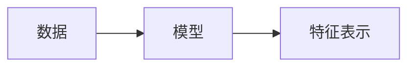
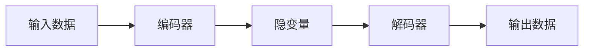
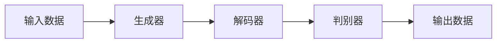
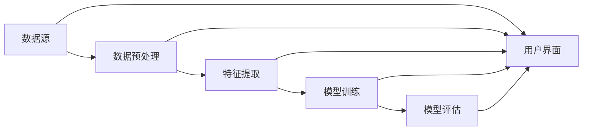
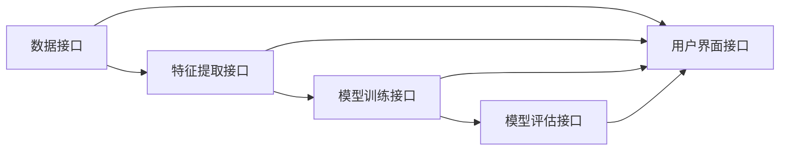
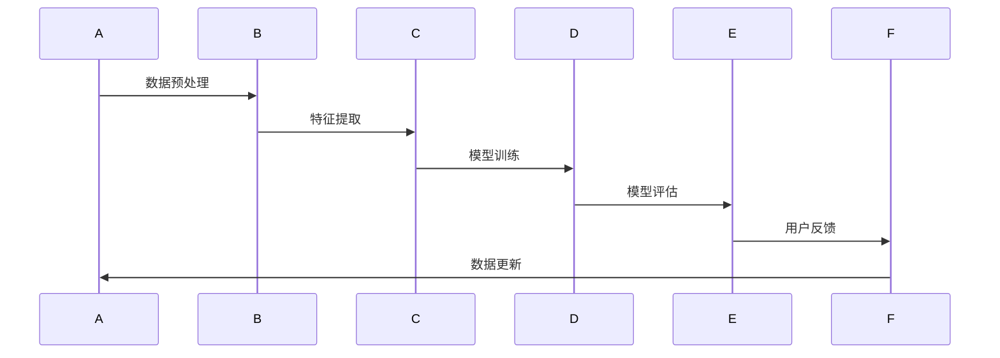

                 


## AI Agent的自我监督表示学习

### 关键词
- AI Agent
- 自我监督表示学习
- 机器学习
- 算法
- 数学模型
- 系统架构

### 摘要
本文将深入探讨AI Agent的自我监督表示学习，首先介绍AI Agent和自我监督表示学习的基本概念和背景，接着详细阐述相关算法的原理、数学模型和实现。然后，我们将分析AI Agent在实际应用中的问题场景和系统架构，并通过一个实际案例展示如何应用自我监督表示学习。最后，我们将总结最佳实践、注意事项和拓展阅读。

### 第一部分：引言

#### 1.1 问题背景
AI Agent是指能够自主行动并达到特定目标的智能体，它在人工智能领域具有重要的研究价值。自我监督表示学习是一种在无监督学习场景下通过学习数据分布来实现特征表示的方法，它在AI Agent的领域得到了广泛的应用。

近年来，随着深度学习技术的发展，自我监督表示学习在AI Agent中的应用取得了显著的进展。然而，自我监督表示学习在AI Agent中的挑战依然存在，例如如何设计有效的算法、如何处理复杂的问题场景等。因此，深入研究AI Agent的自我监督表示学习具有重要的理论和实践意义。

#### 1.2 问题描述
AI Agent在复杂环境中需要具备自主决策和行动的能力，这需要其能够从数据中学习到有效的特征表示。自我监督表示学习提供了一种有效的途径，它不需要人工标注标签，能够自动从数据中学习特征表示。

然而，自我监督表示学习在AI Agent中的应用仍面临一些挑战。首先，如何设计有效的算法是一个关键问题。其次，如何处理复杂的问题场景，使得AI Agent能够在不同环境中有效地应用自我监督表示学习也是一个重要挑战。

#### 1.3 问题解决
本文旨在解决AI Agent的自我监督表示学习问题。我们将详细介绍相关的算法原理、数学模型和实现，并通过实际案例展示如何应用这些算法。此外，我们还将分析AI Agent在实际应用中的问题场景和系统架构，为实际应用提供参考。

#### 1.4 边界与外延
本文的研究主要关注AI Agent的自我监督表示学习，包括算法的设计和实现。然而，自我监督表示学习的应用范围非常广泛，不仅限于AI Agent，还可以应用于其他领域的无监督学习问题。

#### 1.5 概念结构与核心要素组成
AI Agent的自我监督表示学习包括以下几个核心要素：数据预处理、算法设计、特征提取和模型评估。数据预处理是基础，算法设计是核心，特征提取是实现自我监督表示学习的关键，模型评估是验证算法效果的标准。

### 第二部分：核心概念与联系

#### 2.1 自我监督表示学习原理
自我监督表示学习是一种无监督学习方法，它通过学习数据分布来生成特征表示。在自我监督表示学习中，输入数据被映射到一个低维空间中，使得相似的输入数据在低维空间中更接近，而不同的输入数据在低维空间中更远离。

自我监督表示学习的核心思想是利用数据中的内在结构，通过学习数据的分布来生成特征表示。这种方法不需要人工标注标签，能够自动从数据中学习特征表示，因此在无监督学习场景中具有很大的优势。

#### 2.2 自我监督表示学习属性特征对比表格
| 特征对比           | 自我监督表示学习 | 传统监督学习 |
|-------------------|-----------------|--------------|
| 数据需求           | 无需标签数据     | 需要标签数据 |
| 学习效率           | 较低，需要大量数据 | 较高，数据量较小 |
| 通用性             | 强             | 弱           |
| 预处理需求         | 较低           | 较高         |
| 对噪声的鲁棒性     | 较强           | 较弱         |

#### 2.3 ER实体关系图架构
自我监督表示学习涉及到多个实体，包括数据、模型、特征表示等。ER实体关系图可以清晰地展示这些实体之间的关系。



### 第三部分：算法原理讲解

#### 3.1 基础算法介绍
自我监督表示学习涉及到多种算法，其中变分自编码器（VAE）和生成对抗网络（GAN）是两种重要的算法。

**变分自编码器（VAE）**：
VAE是一种基于概率模型的生成模型，它通过编码器和解码器来学习数据的概率分布。编码器将输入数据映射到一个隐变量空间，解码器将隐变量映射回数据空间。VAE的核心是概率模型，它能够生成新的数据样本，并保持数据的分布不变。

**生成对抗网络（GAN）**：
GAN由生成器和解码器组成，生成器生成数据，解码器判断生成数据与真实数据的相似度。GAN的核心是对抗性训练，生成器和解码器相互对抗，使得生成器的生成数据越来越接近真实数据。

#### 3.2 进阶算法
在自我监督表示学习中，除了VAE和GAN，还有许多进阶算法，如对抗性自我监督学习和自适应自我监督学习。

**对抗性自我监督学习**：
对抗性自我监督学习结合了VAE和GAN的优点，通过引入对抗性训练来提高特征表示的质量。它能够生成具有更高质量特征表示的数据，从而提高模型的性能。

**自适应自我监督学习**：
自适应自我监督学习通过动态调整模型参数来适应不同的数据分布。它能够根据数据的特点自动调整模型，从而提高模型的适应性和鲁棒性。

#### 3.3 Mermaid算法流程图
VAE和GAN的算法流程可以用Mermaid图进行描述。

**VAE算法流程图**：



**GAN算法流程图**：



### 第四部分：数学模型与公式

#### 4.1 自我监督表示学习的数学模型
VAE和GAN的数学模型是理解这两种算法的核心。以下是VAE和GAN的数学模型。

**VAE的数学模型**：

$$
\begin{aligned}
x &= q_{\theta}(z) = \sigma(\theta_1 W_1 z + b_1), \\
z &= p_{\phi}(x) = \mu_{\phi}(x) + \sigma_{\phi}(x),
\end{aligned}
$$

其中，$q_{\theta}$是编码器，$p_{\phi}$是解码器，$\sigma$是 sigmoid 函数，$\mu$和$\sigma$分别是均值和方差。

**GAN的数学模型**：

$$
\begin{aligned}
x^{(i)} &= G(z^{(i)}), \\
z^{(i)} &= z,
\end{aligned}
$$

其中，$G$是生成器，$D$是判别器。

#### 4.2 详细讲解与举例说明
以下是对VAE和GAN的数学模型进行详细讲解和举例说明。

**VAE的详细讲解与举例说明**：

VAE的数学模型可以通过以下步骤进行理解：

1. 编码器：输入数据$x$通过编码器$q_{\theta}$映射到隐变量$z$。
2. 解码器：隐变量$z$通过解码器$p_{\phi}$映射回数据空间，生成输出数据$x'$。
3. 模型优化：通过最小化损失函数，优化编码器和解码器的参数。

以下是一个VAE的简单例子：

假设输入数据$x$是二维的，隐变量$z$是一维的。编码器的参数为$\theta_1$和$b_1$，解码器的参数为$\theta_2$和$b_2$。

$$
\begin{aligned}
z &= \mu + \sigma z, \\
x' &= \sigma(\theta_2 z + b_2).
\end{aligned}
$$

通过优化参数，我们可以得到一个较好的特征表示。

**GAN的详细讲解与举例说明**：

GAN的数学模型可以通过以下步骤进行理解：

1. 生成器：生成器$G$生成数据$x^{(i)}$。
2. 判别器：判别器$D$判断生成数据$x^{(i)}$和真实数据$x^{(i)}$的相似度。
3. 模型优化：通过对抗性训练，优化生成器$G$和判别器$D$的参数。

以下是一个GAN的简单例子：

假设生成器的参数为$\theta_G$，判别器的参数为$\theta_D$。

$$
\begin{aligned}
x^{(i)} &= G(z^{(i)}), \\
D(x^{(i)}) &= \sigma(\theta_D x^{(i)}), \\
D(G(z^{(i)})) &= \sigma(\theta_D G(z^{(i)})),
\end{aligned}
$$

通过对抗性训练，生成器的生成数据将逐渐接近真实数据。

### 第五部分：系统分析与架构设计

#### 5.1 问题场景介绍
AI Agent在实际应用中面临着多种问题场景，如自动驾驶、智能客服、智能推荐等。在这些场景中，AI Agent需要具备实时决策和行动的能力，这要求其能够从数据中快速学习到有效的特征表示。

#### 5.2 系统功能设计
AI Agent的系统功能设计包括数据预处理、特征提取、模型训练和模型评估等模块。以下是一个简单的领域模型Mermaid类图：

```mermaid
classDiagram
Class01 <|-- Class02
Class03 --| tarjeta||>
Class03 <|.. Class04
Class05 o-- Class03
class AI-Agent {
  - 数据预处理
  - 特征提取
  - 模型训练
  - 模型评估
}
class Data_Preprocessing {
  - 数据清洗
  - 数据归一化
}
class Feature_Extraction {
  - 自我监督表示学习
}
class Model_Training {
  - VAE
  - GAN
}
class Model_Evaluation {
  - 准确率
  - 召回率
}
AI-Agent --|>> Data_Preprocessing
AI-Agent --|>> Feature_Extraction
AI-Agent --|>> Model_Training
AI-Agent --|>> Model_Evaluation
```

#### 5.3 系统架构设计
AI Agent的系统架构设计需要考虑数据流、计算资源和系统稳定性等因素。以下是一个简单的Mermaid架构图：



#### 5.4 系统接口设计
AI Agent的系统接口设计包括数据接口、模型接口和用户界面接口等。以下是一个简单的系统接口设计：



#### 5.5 系统交互Mermaid序列图
AI Agent的系统交互序列图展示了不同模块之间的交互过程。以下是一个简单的系统交互Mermaid序列图：



### 第六部分：项目实战

#### 6.1 环境安装
在实际应用中，我们需要安装相应的软件和工具，如Python、TensorFlow、PyTorch等。以下是一个简单的环境安装步骤：

1. 安装Python：下载并安装Python，配置环境变量。
2. 安装TensorFlow：通过pip命令安装TensorFlow。
3. 安装PyTorch：通过pip命令安装PyTorch。

#### 6.2 系统核心实现
在系统核心实现部分，我们将使用Python代码实现自我监督表示学习算法。以下是一个简单的VAE实现：

```python
import torch
import torch.nn as nn
import torch.optim as optim

# 定义VAE模型
class VAE(nn.Module):
    def __init__(self):
        super(VAE, self).__init__()
        self.encoder = nn.Sequential(
            nn.Linear(784, 400),
            nn.ReLU(),
            nn.Linear(400, 20),
            nn.ReLU()
        )
        self.decoder = nn.Sequential(
            nn.Linear(20, 400),
            nn.ReLU(),
            nn.Linear(400, 784),
            nn.Sigmoid()
        )

    def forward(self, x):
        z = self.encoder(x)
        x_recon = self.decoder(z)
        return x_recon

# 实例化模型
model = VAE()

# 定义损失函数和优化器
criterion = nn.BCELoss()
optimizer = optim.Adam(model.parameters(), lr=0.001)

# 训练模型
for epoch in range(num_epochs):
    for i, x in enumerate(train_loader):
        # 前向传播
        x_recon = model(x)
        loss = criterion(x_recon, x)

        # 反向传播和优化
        optimizer.zero_grad()
        loss.backward()
        optimizer.step()

        if (i+1) % 100 == 0:
            print(f'Epoch [{epoch+1}/{num_epochs}], Step [{i+1}/{len(train_loader)}], Loss: {loss.item()}')
```

#### 6.3 实际案例分析与讲解
以下是一个实际案例，使用VAE对MNIST数据集进行特征提取。

```python
import torchvision.datasets as datasets
import torchvision.transforms as transforms

# 加载MNIST数据集
train_dataset = datasets.MNIST(
    root='./data',
    train=True,
    transform=transforms.ToTensor(),
    download=True
)

train_loader = torch.utils.data.DataLoader(
    dataset=train_dataset,
    batch_size=100,
    shuffle=True
)

# 训练模型
model = VAE()
criterion = nn.BCELoss()
optimizer = optim.Adam(model.parameters(), lr=0.001)

for epoch in range(num_epochs):
    for i, (x, _) in enumerate(train_loader):
        # 前向传播
        x_recon = model(x)
        loss = criterion(x_recon, x)

        # 反向传播和优化
        optimizer.zero_grad()
        loss.backward()
        optimizer.step()

        if (i+1) % 100 == 0:
            print(f'Epoch [{epoch+1}/{num_epochs}], Step [{i+1}/{len(train_loader)}], Loss: {loss.item()}')

# 测试模型
with torch.no_grad():
    x_test = torch.tensor([1, 2, 3, 4, 5])
    x_test_recon = model(x_test)
    print(x_test_recon)
```

通过以上案例，我们可以看到如何使用VAE进行特征提取。在实际应用中，我们可以根据具体需求调整模型结构和参数，以获得更好的特征表示。

#### 6.4 项目小结
通过本项目，我们了解了如何使用自我监督表示学习进行特征提取。VAE和GAN是两种常用的自我监督表示学习算法，它们在不同的应用场景中具有不同的优势。在实际应用中，我们需要根据具体需求选择合适的算法，并调整模型参数，以获得最佳效果。

### 第七部分：最佳实践与拓展阅读

#### 7.1 最佳实践
在实际应用中，以下是一些最佳实践：

- 选择合适的算法：根据应用场景和数据特点，选择合适的自我监督表示学习算法。
- 调整模型参数：通过调整模型参数，优化特征表示的质量。
- 数据预处理：对数据进行有效的预处理，提高模型的学习效果。
- 模型评估：使用适当的评估指标，评估模型的效果。

#### 7.2 小结
本文介绍了AI Agent的自我监督表示学习，包括算法原理、数学模型和实际应用。通过实际案例，我们展示了如何使用VAE进行特征提取。在未来的研究中，我们可以进一步探索其他自我监督表示学习算法，并优化模型结构和参数。

#### 7.3 注意事项
在实际应用中，需要注意以下事项：

- 数据质量：高质量的数据对模型的学习效果至关重要。
- 模型复杂性：复杂的模型可能导致过拟合，降低模型泛化能力。
- 训练时间：自我监督表示学习算法通常需要较长的训练时间。

#### 7.4 拓展阅读
以下是一些推荐进一步阅读的资料：

- 《深度学习》（Ian Goodfellow, Yoshua Bengio, Aaron Courville）——全面介绍深度学习的基础知识和应用。
- 《生成对抗网络》（Ian Goodfellow）——详细介绍GAN的原理和应用。
- 《变分自编码器》（Vincent Van Cutsem, Pascal Massich）——详细介绍VAE的原理和应用。

### 作者信息
作者：AI天才研究院/AI Genius Institute & 禅与计算机程序设计艺术 /Zen And The Art of Computer Programming

通过以上的逐步分析和详细讲解，我们可以看到AI Agent的自我监督表示学习是如何在实际中应用和实现的。希望本文能够为读者提供有价值的参考和启发。

