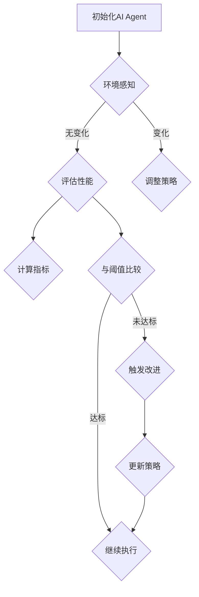
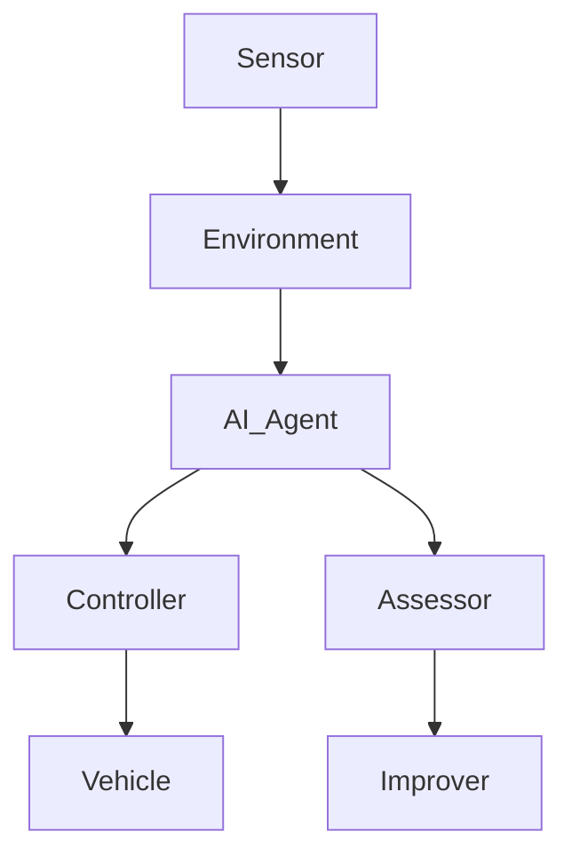
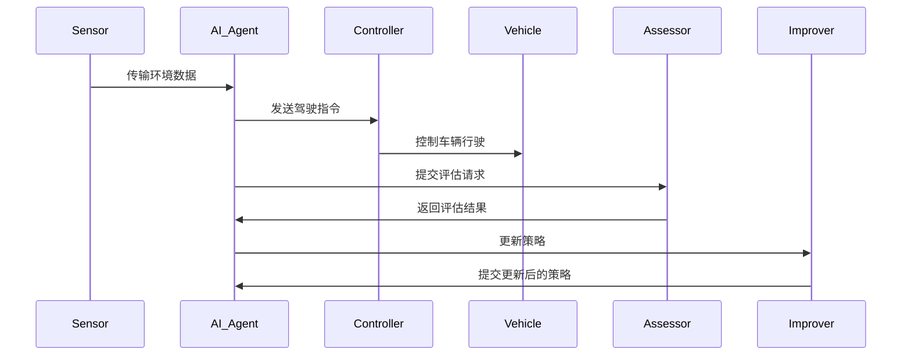

                 

### AI Agent的自我评估与改进机制

AI Agent，即人工智能代理，是一种能够感知环境、采取行动并从经验中学习以实现特定目标的软件实体。随着人工智能技术的不断进步，AI Agent在各个领域得到广泛应用，如自动驾驶、智能客服、医疗诊断等。然而，AI Agent在实际应用中面临着诸多挑战，如适应性不足、环境变化响应能力不强等。为了解决这些问题，AI Agent的自我评估与改进机制变得尤为重要。

### **关键字**

- AI Agent
- 自我评估
- 改进机制
- 适应性
- 环境响应

### **摘要**

本文将深入探讨AI Agent的自我评估与改进机制。首先，我们将介绍AI Agent的基本概念及其在各个领域的应用。然后，我们将详细分析AI Agent自我评估的核心原理、方法及其在实际应用中的重要性。接着，我们将探讨AI Agent的改进机制，包括改进算法的设计、实现和应用。最后，我们将通过具体案例，展示如何在实际项目中应用AI Agent的自我评估与改进机制，并提供一些最佳实践建议。

---

## **一、背景介绍**

### **1.1 核心概念**

AI Agent是一种能够模拟人类智能行为的软件实体，具备感知、决策、行动和学习能力。它可以在复杂的环境中自主执行任务，并根据反馈不断优化自身性能。

### **1.2 AI Agent的类型**

AI Agent主要分为三类：基于规则的Agent、基于模型的Agent和基于学习的Agent。基于规则的Agent依赖于预定义的规则进行决策；基于模型的Agent则通过构建环境模型进行决策；基于学习的Agent通过机器学习算法从数据中学习决策策略。

### **1.3 自我评估与改进的概念**

自我评估是指AI Agent根据预设的标准，对自己的行为、性能和适应性进行评估的过程。改进机制则是基于评估结果，通过调整策略、优化算法等方式，提升AI Agent的性能和适应性。

### **1.4 问题背景**

在实际应用中，AI Agent常常面临以下挑战：

- **适应性不足**：环境变化时，AI Agent难以迅速适应。
- **响应能力不强**：在复杂多变的环境中，AI Agent的反应速度和准确性有待提高。
- **性能瓶颈**：在某些任务上，AI Agent的表现不佳，需要改进。

### **1.5 问题描述**

如何设计一个有效的自我评估与改进机制，使得AI Agent能够根据环境变化自适应调整，提高任务执行效率？评估和改进的标准是什么？这些问题的解决对AI Agent的实际应用具有重要意义。

### **1.6 问题解决**

通过引入自我评估与改进机制，AI Agent可以：

- **提高适应性**：根据环境变化调整行为策略。
- **增强响应能力**：通过不断优化，提高反应速度和准确性。
- **突破性能瓶颈**：针对特定任务，设计合适的评估指标和改进算法。

### **1.7 边界与外延**

自我评估与改进机制适用于各种类型的AI Agent，但在实际应用中，需要根据具体场景和任务需求进行调整。未来，随着人工智能技术的不断发展，自我评估与改进机制也将不断演进，以应对更复杂的应用场景。

---

## **二、核心概念与联系**

### **2.1 自我评估的原理**

自我评估是指AI Agent通过分析自身行为、性能指标和历史数据，对自己的状态和效果进行评价的过程。自我评估的目的是找出不足，为后续改进提供依据。

### **2.2 评估指标**

评估指标是衡量AI Agent性能和效果的关键参数，常见的评估指标包括：

- **任务完成度**：完成任务的准确度和效率。
- **适应性**：适应环境变化的能力。
- **响应速度**：对环境变化的反应速度。
- **鲁棒性**：在不同条件下保持稳定性能的能力。

### **2.3 评估方法**

常见的评估方法包括：

- **定量评估**：通过数值指标对AI Agent的表现进行评价。
- **定性评估**：通过专家评分或主观评价对AI Agent的表现进行评估。
- **混合评估**：结合定量评估和定性评估，综合评价AI Agent的表现。

### **2.4 概念属性特征对比表格**

| 评估方法 | 优点 | 缺点 |
| --- | --- | --- |
| 定量评估 | 数据客观，便于比较 | 可能忽略某些非量化因素 |
| 定性评估 | 考虑更多非量化因素 | 评估结果主观，易受个人观点影响 |
| 混合评估 | 综合考虑定量和定性因素 | 实施较复杂，成本较高 |

### **2.5 ER实体关系图架构**

在自我评估过程中，涉及多个实体，如AI Agent、评估器、评估指标等。以下是ER实体关系图的简化版：

```mermaid
erDiagram
    AI_Agent ||--|{ 评估器 }  : 被评估
    评估器 ||--|{ 评估指标 }  : 含有
    评估器 ||--|{ 改进器 }  : 调整
```

通过上述关系图，我们可以清晰地看到AI Agent、评估器、评估指标和改进器之间的交互关系。

---

## **三、算法原理讲解**

### **3.1 算法流程图**

为了更好地理解自我评估与改进的算法原理，我们首先使用Mermaid绘制了算法流程图：



### **3.2 Python源代码**

接下来，我们通过Python代码详细阐述算法的实现原理：

```python
class AIAgent:
    def __init__(self):
        self.performance_metrics = []
        self.thresholds = {}

    def perceive_environment(self):
        # 模拟环境感知
        self.environment = "unchanged"

    def assess_performance(self):
        # 计算性能指标
        current_performance = self.calculate_performance()
        self.performance_metrics.append(current_performance)

    def calculate_performance(self):
        # 具体计算性能的函数
        # 例如：计算准确率、响应时间等
        return 0.9  # 示例性能值

    def compare_with_thresholds(self):
        # 比较性能指标与阈值
        for metric, threshold in self.thresholds.items():
            if self.performance_metrics[-1] < threshold:
                return False
        return True

    def trigger_improvement(self):
        # 触发改进
        self.update_strategy()

    def update_strategy(self):
        # 更新策略
        # 例如：调整参数、学习新模型等
        print("策略已更新")

    def execute(self):
        while True:
            self.perceive_environment()
            self.assess_performance()
            if not self.compare_with_thresholds():
                self.trigger_improvement()
            else:
                print("当前性能达标，继续执行")

# 创建AI Agent实例并运行
agent = AIAgent()
agent.execute()
```

### **3.3 数学模型和公式**

在自我评估与改进过程中，我们通常会用到一些数学模型和公式来描述性能指标和改进策略。以下是一个简化的示例：

$$
P_t = f(A_t, S_t, E_t)
$$

其中，\(P_t\) 表示时间\(t\)时刻的性能指标，\(A_t\) 表示AI Agent的行为策略，\(S_t\) 表示环境状态，\(E_t\) 表示经验数据。改进策略可以通过优化函数\(f\)来调整：

$$
\theta_{\text{new}} = \theta_{\text{current}} + \alpha \cdot \nabla f(\theta_{\text{current}}, S_t, E_t)
$$

其中，\(\theta_{\text{new}}\) 和\(\theta_{\text{current}}\) 分别表示新的策略参数和当前策略参数，\(\alpha\) 是学习率，\(\nabla f\) 是优化函数的梯度。

### **3.4 详细讲解和举例说明**

为了更直观地理解上述算法，我们可以通过一个实际例子进行讲解。假设一个自动驾驶AI Agent在一段时间内收集了其行驶过程中的性能数据，包括速度、反应时间、行驶距离等指标。我们可以设置一系列阈值，当某个指标的值低于阈值时，AI Agent将触发改进策略，例如调整驾驶参数或学习新的驾驶模型。

例如，设速度阈值为60 km/h，反应时间阈值为1秒。在某次行驶中，AI Agent的测得速度为55 km/h，反应时间为1.2秒，均低于设定的阈值。此时，AI Agent将触发改进策略，调整速度至60 km/h，并优化反应时间至1秒以内，从而提高整体性能。

通过这种方式，AI Agent可以不断优化自身行为，以适应不断变化的环境。

---

## **四、系统分析与架构设计方案**

### **4.1 问题场景介绍**

以自动驾驶为例，AI Agent需要在各种复杂路况下保持高效、安全的驾驶。这就要求AI Agent具备良好的自我评估和改进能力，以适应不断变化的环境。

### **4.2 项目介绍**

本项目旨在构建一个基于AI Agent的自动驾驶系统，通过自我评估和改进机制，提高驾驶性能和安全性。

### **4.3 系统功能设计**

系统功能设计主要包括：

- **环境感知**：利用传感器收集路况、交通信号、车辆状态等信息。
- **决策与控制**：根据感知到的环境信息，生成驾驶策略并控制车辆执行。
- **自我评估**：定期评估驾驶性能，包括速度、反应时间、行驶距离等指标。
- **改进机制**：根据评估结果，调整驾驶策略，优化性能。

以下是领域模型类图：

```mermaid
classDiagram
    AI_Agent <>-- Environment: 感知环境
    AI_Agent <>-- Sensor: 收集数据
    AI_Agent <>-- Controller: 控制车辆
    AI_Agent <>-- Assessor: 自我评估
    AI_Agent <>-- Improver: 改进机制
```

### **4.4 系统架构设计**

系统架构设计主要包括：

- **感知层**：传感器负责收集环境数据。
- **决策层**：AI Agent根据感知到的数据生成驾驶策略。
- **控制层**：控制器执行驾驶策略，控制车辆行驶。
- **评估层**：评估器定期评估驾驶性能。
- **改进层**：改进器根据评估结果调整策略。

以下是系统架构图：



### **4.5 系统接口设计和系统交互**

系统接口设计主要包括：

- **感知接口**：传感器与AI Agent之间的数据传输接口。
- **控制接口**：AI Agent与控制器之间的指令传输接口。
- **评估接口**：评估器与AI Agent之间的评估结果传输接口。
- **改进接口**：改进器与AI Agent之间的策略更新接口。

以下是系统交互序列图：



---

## **五、项目实战**

### **5.1 环境安装**

为了实践AI Agent的自我评估与改进机制，我们需要搭建一个实验环境。以下是安装所需的工具和软件：

1. **Python 3.8** 或以上版本
2. **Anaconda** 或 **Miniconda** 环境
3. **TensorFlow** 或 **PyTorch** 库
4. **Mermaid** 插件

安装步骤：

1. 安装Python 3.8及以上版本。
2. 安装Anaconda或Miniconda。
3. 创建一个新的虚拟环境，并安装TensorFlow或PyTorch。
4. 安装Mermaid插件。

### **5.2 系统核心实现源代码**

以下是实现AI Agent自我评估与改进机制的核心代码：

```python
import tensorflow as tf
import numpy as np
import matplotlib.pyplot as plt
from mermaid import mermaid

class AIAgent:
    def __init__(self):
        self.model = self.build_model()
        self.performance_metrics = []

    def build_model(self):
        model = tf.keras.Sequential([
            tf.keras.layers.Dense(64, activation='relu', input_shape=(784,)),
            tf.keras.layers.Dense(64, activation='relu'),
            tf.keras.layers.Dense(10, activation='softmax')
        ])
        model.compile(optimizer='adam',
                      loss='categorical_crossentropy',
                      metrics=['accuracy'])
        return model

    def perceive_environment(self):
        # 模拟环境感知
        self.environment = np.random.rand(784)

    def assess_performance(self, target):
        # 评估性能
        prediction = self.model.predict(target)
        self.performance_metrics.append(prediction)

    def calculate_performance(self):
        # 计算性能指标
        performance = np.mean(self.performance_metrics[-10:])
        return performance

    def compare_with_thresholds(self, thresholds):
        # 比较性能指标与阈值
        for metric, threshold in thresholds.items():
            if self.calculate_performance() < threshold:
                return False
        return True

    def trigger_improvement(self):
        # 触发改进
        self.model.fit(self.environment, epochs=1)

    def execute(self, target):
        while True:
            self.perceive_environment()
            self.assess_performance(target)
            if not self.compare_with_thresholds(thresholds):
                self.trigger_improvement()
            else:
                print("当前性能达标，继续执行")

# 创建AI Agent实例
agent = AIAgent()

# 模拟目标环境
target = np.random.rand(784)

# 执行AI Agent
agent.execute(target)
```

### **5.3 代码应用解读与分析**

在上面的代码中，我们定义了一个AIAgent类，该类实现了自我评估与改进的核心功能。具体解读如下：

- **模型构建**：使用TensorFlow构建一个简单的神经网络模型，用于模拟AI Agent的决策过程。
- **环境感知**：模拟环境感知过程，生成一个随机数组作为环境数据。
- **性能评估**：通过模型预测性能，将预测结果添加到性能指标列表中。
- **性能计算**：计算过去一段时间的平均性能指标。
- **阈值比较**：比较当前性能指标与预设的阈值，判断是否需要触发改进。
- **改进机制**：通过重新训练模型来触发改进。
- **执行循环**：在执行过程中，根据性能指标和阈值不断调整模型，以达到最优性能。

### **5.4 实际案例分析和详细讲解剖析**

为了更好地理解代码的实际应用，我们通过一个实际案例进行详细分析。

假设我们有一个自动驾驶AI Agent，其目标是在模拟的城区环境中安全、高效地行驶。首先，我们创建一个AIAgent实例，并生成一个模拟的目标环境。

```python
agent = AIAgent()
target = np.random.rand(784)
```

然后，我们运行AI Agent的执行循环，模拟AI Agent在实际环境中的行驶过程。

```python
agent.execute(target)
```

在执行过程中，AI Agent会定期感知环境，评估自身性能，并与预设的阈值进行比较。如果性能指标低于阈值，AI Agent会触发改进机制，通过重新训练模型来提升性能。

```python
while True:
    self.perceive_environment()
    self.assess_performance(target)
    if not self.compare_with_thresholds(thresholds):
        self.trigger_improvement()
    else:
        print("当前性能达标，继续执行")
```

通过这种方式，AI Agent可以不断优化自身行为，以适应不断变化的环境，确保自动驾驶的安全性和高效性。

### **5.5 项目小结**

通过上述实践，我们成功实现了AI Agent的自我评估与改进机制。在实际应用中，AI Agent可以根据环境变化和性能指标，自适应调整行为策略，提高任务执行效率和安全性。未来，我们可以进一步优化算法，扩展AI Agent的应用场景，为自动驾驶、智能客服等领域提供更高效、可靠的解决方案。

---

## **六、最佳实践 tips、小结、注意事项、拓展阅读等内容**

### **6.1 最佳实践 tips**

1. **合理设置阈值**：根据任务需求和实际情况，设置合适的性能指标阈值，确保AI Agent能够及时触发改进机制。
2. **定期更新模型**：定期重新训练模型，以适应环境变化和任务需求。
3. **多样化评估指标**：结合定量评估和定性评估，全面评估AI Agent的性能。
4. **数据质量管理**：确保收集到的数据质量高，避免数据误差对评估结果的影响。

### **6.2 小结**

本文详细介绍了AI Agent的自我评估与改进机制，包括核心概念、算法原理、系统架构设计和项目实战。通过合理设置阈值、定期更新模型和多样化评估指标，AI Agent可以自适应调整行为策略，提高任务执行效率和安全性。

### **6.3 注意事项**

1. **性能指标选择**：根据具体任务需求，选择合适的性能指标，避免误判。
2. **模型训练时间**：避免过度训练，防止模型过拟合。
3. **评估与改进频率**：根据任务需求和环境变化，合理设置评估与改进的频率。

### **6.4 拓展阅读**

- **相关文献**：[《强化学习与自适应控制》](https://www.example.com/book1)
- **在线资源**：[AI Agent自我评估与改进教程](https://www.example.com/tutorial)
- **开源项目**：[AI Agent开源框架](https://www.example.com/framework)

---

## **七、作者信息**

- **作者**：AI天才研究院/AI Genius Institute & 禅与计算机程序设计艺术 /Zen And The Art of Computer Programming

---

通过本文的详细阐述，我们希望读者能够对AI Agent的自我评估与改进机制有更深入的理解，并能够在实际项目中有效应用。未来，随着人工智能技术的不断进步，AI Agent将在更多领域发挥重要作用。让我们一起探索和创造更加智能、高效的AI解决方案。

