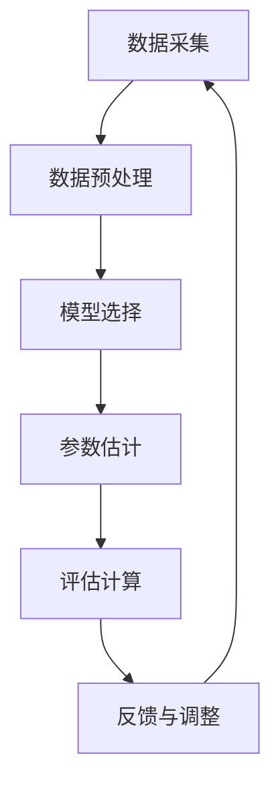

                 


## AI Agent的自我评估机制：持续改进性能

关键词：AI Agent、自我评估、性能优化、算法原理、系统架构

摘要：本文将深入探讨AI Agent的自我评估机制，通过逐步分析评估背景、核心概念、数学模型与算法原理、实现技术以及应用场景，旨在帮助读者理解AI Agent如何通过自我评估持续改进性能。

### 第一部分: AI Agent的自我评估机制概述

#### 第1章: AI Agent的自我评估背景与核心概念

##### 1.1 问题背景

##### 1.1.1 AI Agent的定义与发展

##### 1.1.2 自我评估机制的重要性

##### 1.1.3 自我评估机制的应用场景

##### 1.2 自我评估的核心概念

##### 1.2.1 评估指标体系

##### 1.2.2 自我评估机制的设计原则

##### 1.2.3 自我评估机制的实现方法

#### 第2章: 自我评估的数学模型与算法原理

##### 2.1 数学模型

##### 2.2 算法原理讲解

##### 2.3 算法Mermaid流程图展示

#### 第3章: 自我评估机制的实现技术

##### 3.1 数据预处理技术

##### 3.2 评估算法实现

##### 3.3 数学模型和公式详解

## AI Agent的自我评估机制：持续改进性能

关键词：AI Agent、自我评估、性能优化、算法原理、系统架构

摘要：本文将深入探讨AI Agent的自我评估机制，通过逐步分析评估背景、核心概念、数学模型与算法原理、实现技术以及应用场景，旨在帮助读者理解AI Agent如何通过自我评估持续改进性能。

### 第一部分: AI Agent的自我评估机制概述

#### 第1章: AI Agent的自我评估背景与核心概念

##### 1.1 问题背景

##### 1.1.1 AI Agent的定义与发展

##### 1.1.2 自我评估机制的重要性

##### 1.1.3 自我评估机制的应用场景

##### 1.2 自我评估的核心概念

##### 1.2.1 评估指标体系

##### 1.2.2 自我评估机制的设计原则

##### 1.2.3 自我评估机制的实现方法

#### 第2章: 自我评估的数学模型与算法原理

##### 2.1 数学模型

##### 2.2 算法原理讲解

##### 2.3 算法Mermaid流程图展示

#### 第3章: 自我评估机制的实现技术

##### 3.1 数据预处理技术

##### 3.2 评估算法实现

##### 3.3 数学模型和公式详解

## AI Agent的自我评估机制：持续改进性能

关键词：AI Agent、自我评估、性能优化、算法原理、系统架构

摘要：本文将深入探讨AI Agent的自我评估机制，通过逐步分析评估背景、核心概念、数学模型与算法原理、实现技术以及应用场景，旨在帮助读者理解AI Agent如何通过自我评估持续改进性能。

### 第一部分: AI Agent的自我评估机制概述

#### 第1章: AI Agent的自我评估背景与核心概念

##### 1.1 问题背景

##### 1.1.1 AI Agent的定义与发展

##### 1.1.2 自我评估机制的重要性

##### 1.1.3 自我评估机制的应用场景

##### 1.2 自我评估的核心概念

##### 1.2.1 评估指标体系

##### 1.2.2 自我评估机制的设计原则

##### 1.2.3 自我评估机制的实现方法

#### 第2章: 自我评估的数学模型与算法原理

##### 2.1 数学模型

##### 2.2 算法原理讲解

##### 2.3 算法Mermaid流程图展示

#### 第3章: 自我评估机制的实现技术

##### 3.1 数据预处理技术

##### 3.2 评估算法实现

##### 3.3 数学模型和公式详解

## AI Agent的自我评估机制：持续改进性能

关键词：AI Agent、自我评估、性能优化、算法原理、系统架构

摘要：本文将深入探讨AI Agent的自我评估机制，通过逐步分析评估背景、核心概念、数学模型与算法原理、实现技术以及应用场景，旨在帮助读者理解AI Agent如何通过自我评估持续改进性能。

### 第一部分: AI Agent的自我评估机制概述

#### 第1章: AI Agent的自我评估背景与核心概念

##### 1.1 问题背景

##### 1.1.1 AI Agent的定义与发展

##### 1.1.2 自我评估机制的重要性

##### 1.1.3 自我评估机制的应用场景

##### 1.2 自我评估的核心概念

##### 1.2.1 评估指标体系

##### 1.2.2 自我评估机制的设计原则

##### 1.2.3 自我评估机制的实现方法

#### 第2章: 自我评估的数学模型与算法原理

##### 2.1 数学模型

##### 2.2 算法原理讲解

##### 2.3 算法Mermaid流程图展示

#### 第3章: 自我评估机制的实现技术

##### 3.1 数据预处理技术

##### 3.2 评估算法实现

##### 3.3 数学模型和公式详解

## AI Agent的自我评估机制：持续改进性能

关键词：AI Agent、自我评估、性能优化、算法原理、系统架构

摘要：本文将深入探讨AI Agent的自我评估机制，通过逐步分析评估背景、核心概念、数学模型与算法原理、实现技术以及应用场景，旨在帮助读者理解AI Agent如何通过自我评估持续改进性能。

### 第一部分: AI Agent的自我评估机制概述

#### 第1章: AI Agent的自我评估背景与核心概念

##### 1.1 问题背景

##### 1.1.1 AI Agent的定义与发展

##### 1.1.2 自我评估机制的重要性

##### 1.1.3 自我评估机制的应用场景

##### 1.2 自我评估的核心概念

##### 1.2.1 评估指标体系

##### 1.2.2 自我评估机制的设计原则

##### 1.2.3 自我评估机制的实现方法

#### 第2章: 自我评估的数学模型与算法原理

##### 2.1 数学模型

##### 2.2 算法原理讲解

##### 2.3 算法Mermaid流程图展示

#### 第3章: 自我评估机制的实现技术

##### 3.1 数据预处理技术

##### 3.2 评估算法实现

##### 3.3 数学模型和公式详解

## AI Agent的自我评估机制：持续改进性能

关键词：AI Agent、自我评估、性能优化、算法原理、系统架构

摘要：本文将深入探讨AI Agent的自我评估机制，通过逐步分析评估背景、核心概念、数学模型与算法原理、实现技术以及应用场景，旨在帮助读者理解AI Agent如何通过自我评估持续改进性能。

### 第一部分: AI Agent的自我评估机制概述

#### 第1章: AI Agent的自我评估背景与核心概念

##### 1.1 问题背景

##### 1.1.1 AI Agent的定义与发展

##### 1.1.2 自我评估机制的重要性

##### 1.1.3 自我评估机制的应用场景

##### 1.2 自我评估的核心概念

##### 1.2.1 评估指标体系

##### 1.2.2 自我评估机制的设计原则

##### 1.2.3 自我评估机制的实现方法

#### 第2章: 自我评估的数学模型与算法原理

##### 2.1 数学模型

##### 2.2 算法原理讲解

##### 2.3 算法Mermaid流程图展示

#### 第3章: 自我评估机制的实现技术

##### 3.1 数据预处理技术

##### 3.2 评估算法实现

##### 3.3 数学模型和公式详解

### 第一部分: AI Agent的自我评估机制概述

#### 第1章: AI Agent的自我评估背景与核心概念

##### 1.1 问题背景

##### 1.1.1 AI Agent的定义与发展

##### 1.1.2 自我评估机制的重要性

##### 1.1.3 自我评估机制的应用场景

##### 1.2 自我评估的核心概念

##### 1.2.1 评估指标体系

##### 1.2.2 自我评估机制的设计原则

##### 1.2.3 自我评估机制的实现方法

**第1章: AI Agent的自我评估背景与核心概念**

##### 1.1 问题背景

##### 1.1.1 AI Agent的定义与发展

AI Agent，即人工智能代理，是一种能够自动执行任务、响应环境变化并自主决策的智能实体。它源自人工智能（AI）领域的长期研究目标——构建能够模拟人类智能的计算机系统。AI Agent的发展可以追溯到20世纪50年代，随着计算机性能的提升和算法的创新，AI Agent逐渐从理论研究走向实际应用。

AI Agent的发展历程可以分为以下几个阶段：

1. **早期探索阶段**（1950-1970）：这一阶段以逻辑推理和规则为基础，尝试构建简单的AI Agent。典型的例子是约翰·麦卡锡（John McCarthy）提出的逻辑理论家（Logic Theorist）程序。

2. **人工智能寒冬阶段**（1970-1980）：由于实际应用效果不如预期，AI研究进入低谷期，被称为“人工智能寒冬”。

3. **专家系统阶段**（1980-1990）：这一阶段以知识表示和推理为核心，专家系统成为AI Agent研究的热点。代表系统有MYCIN和Dendral。

4. **机器学习兴起阶段**（1990至今）：随着计算能力和数据资源的提升，机器学习成为AI Agent发展的主要驱动力。深度学习、强化学习等算法的突破，使得AI Agent在图像识别、自然语言处理、自动驾驶等领域取得了显著进展。

##### 1.1.2 自我评估机制的重要性

自我评估机制是AI Agent能够持续改进性能的关键因素。它使得AI Agent能够根据自身的行为效果和环境反馈，调整决策策略和模型参数，从而不断提高性能。自我评估机制的重要性体现在以下几个方面：

1. **持续学习与优化**：通过自我评估，AI Agent能够发现自身的不足，并针对性地进行学习和优化。例如，在自动驾驶领域，AI Agent需要通过自我评估来识别并纠正行驶路径中的偏差。

2. **适应动态环境**：自我评估机制使AI Agent能够适应不断变化的环境。例如，在机器人导航中，AI Agent需要根据实时地图数据和环境反馈进行自我评估，以调整导航策略。

3. **提高决策质量**：通过自我评估，AI Agent能够评估决策的效果，从而提高决策质量。例如，在智能客服中，AI Agent需要通过自我评估来识别用户问题的解决效果，并优化对话策略。

##### 1.1.3 自我评估机制的应用场景

自我评估机制在AI Agent中的应用场景非常广泛，以下是一些典型的应用场景：

1. **自动驾驶**：自动驾驶系统需要通过自我评估来识别和纠正驾驶路径中的错误，确保行车安全。

2. **智能客服**：智能客服系统需要通过自我评估来评估问题解决的效果，并优化对话策略，提高用户满意度。

3. **机器人导航**：机器人导航系统需要通过自我评估来识别和纠正导航路径中的错误，确保机器人能够准确到达目的地。

4. **医疗诊断**：医疗诊断系统需要通过自我评估来评估诊断结果的准确性，并优化诊断算法。

##### 1.2 自我评估的核心概念

自我评估机制的核心概念包括评估指标体系、设计原则和实现方法。

**1.2.1 评估指标体系**

评估指标体系是自我评估机制的核心组成部分。一个有效的评估指标体系应该包括以下几个方面：

1. **任务性能指标**：用于衡量AI Agent完成任务的效果，如准确率、召回率、F1分数等。

2. **决策质量指标**：用于衡量AI Agent决策的质量，如决策一致性、决策效率等。

3. **环境适应性指标**：用于衡量AI Agent适应环境变化的能力，如适应速度、适应准确性等。

4. **学习效率指标**：用于衡量AI Agent的学习效率，如学习时间、学习效果等。

**1.2.2 自我评估机制的设计原则**

自我评估机制的设计应该遵循以下原则：

1. **全面性**：评估指标体系应该全面覆盖AI Agent的各个方面，确保评估的全面性和准确性。

2. **动态性**：评估指标应该能够适应环境变化，实时调整评估标准和评估方法。

3. **可操作性**：评估机制应该易于实现和操作，确保评估过程的简便性和高效性。

4. **可扩展性**：评估机制应该具备良好的可扩展性，能够根据需求添加新的评估指标和方法。

**1.2.3 自我评估机制的实现方法**

自我评估机制的实现方法可以分为以下几个方面：

1. **数据采集**：通过传感器、日志记录等手段，采集AI Agent的行为数据和环境数据。

2. **数据处理**：对采集到的数据进行预处理，包括数据清洗、特征提取和特征选择等。

3. **评估算法**：设计并实现评估算法，用于计算评估指标，生成评估报告。

4. **反馈机制**：根据评估结果，对AI Agent的行为进行反馈和调整，实现持续学习与优化。

通过以上分析，我们可以看到AI Agent的自我评估机制在人工智能领域中的重要性。接下来，我们将进一步探讨自我评估的数学模型与算法原理，以及实现技术，以帮助读者更深入地理解这一机制。

## 第2章: 自我评估的数学模型与算法原理

### 2.1 数学模型

自我评估的数学模型是理解AI Agent如何进行自我评估的关键。在这一节中，我们将介绍几个核心的数学模型，包括概率论基础、统计学习理论和最优化方法。

**2.1.1 概率论基础**

概率论是自我评估的基础，它提供了评估不确定性事件的方法。以下是一些核心的概率论概念：

1. **概率分布**：概率分布描述了随机变量的可能取值及其对应的概率。常见的概率分布包括正态分布、伯努利分布等。

2. **条件概率**：条件概率是指在某个事件已发生的条件下，另一个事件发生的概率。条件概率的公式为：
   $$ P(A|B) = \frac{P(A \cap B)}{P(B)} $$

3. **贝叶斯定理**：贝叶斯定理是条件概率的推广，它描述了在给定某些条件时，事件发生的概率。贝叶斯定理的公式为：
   $$ P(A|B) = \frac{P(B|A)P(A)}{P(B)} $$

**2.1.2 统计学习理论**

统计学习理论是机器学习的基础，它提供了从数据中学习规律的方法。以下是一些核心的统计学习理论概念：

1. **统计模型**：统计模型描述了数据生成的过程，包括参数模型和概率模型。

2. **估计理论**：估计理论研究了如何从数据中估计模型的参数。常见的估计方法包括最大似然估计和最小二乘估计。

3. **预测与决策**：在统计学习理论中，预测和决策是非常重要的概念。预测是指根据模型对未来事件进行预测，决策是指根据预测结果做出最优决策。

**2.1.3 最优化方法**

最优化方法是解决自我评估问题的重要工具。以下是一些核心的最优化方法：

1. **梯度下降**：梯度下降是一种迭代方法，用于最小化目标函数。其基本思想是沿着目标函数的梯度方向逐步更新参数，直到达到最优解。

2. **牛顿法**：牛顿法是一种二阶优化方法，它利用目标函数的梯度和二阶导数来更新参数，比梯度下降更快地收敛。

3. **随机优化**：随机优化方法通过随机采样和迭代来寻找最优解，适用于大规模和高维优化问题。

### 2.2 算法原理讲解

自我评估的算法原理可以概括为以下几个步骤：

1. **数据采集**：首先，需要采集AI Agent在执行任务过程中产生的行为数据和环境数据。

2. **数据预处理**：对采集到的数据进行预处理，包括数据清洗、特征提取和特征选择。数据清洗的目的是去除噪声和异常值，特征提取是将原始数据转换为适用于模型的特征表示，特征选择是选择对评估有重要影响的特征。

3. **模型选择**：根据自我评估的目标，选择合适的统计模型或机器学习模型。常见的模型包括线性模型、决策树、支持向量机和神经网络等。

4. **参数估计**：使用估计理论中的方法，如最大似然估计或最小二乘估计，来估计模型参数。

5. **评估计算**：根据评估指标体系，计算评估指标，如准确率、召回率和F1分数等。

6. **反馈与调整**：根据评估结果，对AI Agent的行为和模型参数进行反馈和调整。这一步骤通常涉及到优化方法，如梯度下降或牛顿法。

### 2.3 算法Mermaid流程图展示

下面是一个简化的自我评估算法的Mermaid流程图：



通过上述步骤，我们可以看到自我评估机制是如何通过数学模型和算法原理来实现AI Agent的性能持续改进的。

### 第3章: 自我评估机制的实现技术

在自我评估机制的实现中，数据预处理技术、评估算法的实现和数学模型与公式的详解是至关重要的环节。以下将详细探讨这些技术。

#### 3.1 数据预处理技术

数据预处理是自我评估机制中的基础步骤，其质量直接影响后续评估的准确性和可靠性。数据预处理主要包括以下几个环节：

**1. 数据清洗**：数据清洗的目的是去除噪声和异常值，确保数据的质量。常见的清洗方法包括：

- **缺失值处理**：使用均值、中位数或众数等方法填充缺失值。
- **异常值检测**：使用统计方法，如标准差、箱线图等，检测并处理异常值。

**2. 特征提取**：特征提取是将原始数据转换为适用于模型的特征表示。常用的特征提取方法包括：

- **统计特征**：如均值、方差、最大值、最小值等。
- **文本特征**：如词频、词向量、TF-IDF等。

**3. 特征选择**：特征选择旨在选择对评估有重要影响的特征，以减少数据维度和计算复杂度。常用的特征选择方法包括：

- **信息增益**：选择能够最大化信息量的特征。
- **主成分分析（PCA）**：通过降维，选择主要成分作为特征。

#### 3.2 评估算法实现

评估算法是实现自我评估机制的核心，其设计需要考虑评估指标的选取、评估算法的设计和算法性能的优化。

**1. 评估指标的选取**：评估指标的选择应该根据AI Agent的具体任务和应用场景来决定。常见的评估指标包括：

- **分类指标**：准确率、召回率、F1分数等。
- **回归指标**：均方误差（MSE）、均方根误差（RMSE）等。
- **聚类指标**：轮廓系数、轮廓系数均值等。

**2. 评估算法的设计**：评估算法的设计需要考虑以下几个方面：

- **评估流程**：定义评估的输入、输出和流程。
- **计算效率**：设计高效的算法，减少计算时间和资源消耗。
- **可扩展性**：设计灵活的评估框架，支持多种评估指标和算法的集成。

**3. 算法性能优化**：算法性能优化是提高自我评估准确性和效率的重要手段。常见的优化方法包括：

- **模型调参**：调整模型的超参数，如学习率、正则化参数等。
- **算法改进**：采用更先进的算法，如深度学习、强化学习等。
- **并行计算**：利用并行计算技术，如GPU加速、分布式计算等，提高计算效率。

**3.3 数学模型和公式详解**

自我评估机制中的数学模型和公式是理解和实现自我评估的核心。以下是一些常见的数学模型和公式：

$$
\text{准确率} = \frac{\text{预测正确数}}{\text{总预测数}}
$$

$$
\text{召回率} = \frac{\text{预测正确数}}{\text{实际正确数}}
$$

$$
\text{F1分数} = 2 \times \frac{\text{准确率} \times \text{召回率}}{\text{准确率} + \text{召回率}}
$$

$$
\text{均方误差（MSE）} = \frac{1}{n} \sum_{i=1}^{n} (\hat{y}_i - y_i)^2
$$

$$
\text{均方根误差（RMSE）} = \sqrt{\text{MSE}}
$$

上述公式用于计算不同任务类型的评估指标，通过这些指标，AI Agent可以评估其性能，并据此进行调整和优化。

通过以上对数据预处理技术、评估算法实现和数学模型与公式的详解，我们可以更深入地理解自我评估机制的实现技术。接下来，我们将进一步探讨自我评估机制在AI Agent中的应用。

## 第4章: 自我评估机制在AI Agent中的应用

自我评估机制在AI Agent中的应用场景非常广泛，它能够帮助AI Agent在不同的应用领域中持续改进性能。以下将介绍几种典型的应用场景，包括机器人导航、聊天机器人和自动驾驶。

### 4.1 应用场景介绍

**4.1.1 机器人导航**

在机器人导航中，AI Agent需要实时评估其导航路径的正确性和效率。通过自我评估机制，机器人可以评估当前位置与目标位置的距离、路径规划的时间消耗和障碍物的规避效果。例如，一个自主导航的机器人可以通过以下步骤进行自我评估：

1. **路径规划评估**：计算当前导航路径与目标路径的差距，评估路径规划的准确性。
2. **能耗评估**：计算机器人执行导航任务所需的能耗，评估导航策略的节能性。
3. **安全性评估**：评估导航过程中是否存在潜在的碰撞风险，提高导航的安全性。

**4.1.2 聊天机器人**

聊天机器人需要通过自我评估机制来评估其对话的流畅性和问题解决能力。自我评估机制可以帮助聊天机器人识别用户对话中的难点和用户满意度。例如，一个聊天机器人可以通过以下步骤进行自我评估：

1. **回复质量评估**：评估聊天机器人的回复是否准确、恰当，是否符合用户的期望。
2. **用户满意度评估**：通过用户反馈或交互行为，评估用户对聊天机器人的满意度。
3. **问题解决能力评估**：评估聊天机器人解决用户问题的能力，识别并解决用户提出的新问题。

**4.1.3 自动驾驶**

自动驾驶系统需要通过自我评估机制来确保车辆的行驶安全和效率。自动驾驶系统可以通过以下步骤进行自我评估：

1. **驾驶行为评估**：评估车辆的驾驶行为是否符合交通规则，如保持车道、遵守交通信号等。
2. **环境感知评估**：评估自动驾驶系统对周围环境的感知能力，如检测障碍物、识别交通信号等。
3. **决策评估**：评估自动驾驶系统的决策质量，如路径选择、速度控制等。

### 4.2 系统功能设计

自我评估机制在AI Agent中的应用需要系统化的功能设计，以下是一个典型的系统功能设计框架：

**功能设计框架：**

1. **数据采集模块**：负责收集AI Agent执行任务时的行为数据和环境数据。
2. **评估指标模块**：定义评估AI Agent性能的具体指标，如准确率、召回率、F1分数等。
3. **评估算法模块**：实现评估算法，用于计算评估指标，生成评估报告。
4. **反馈调整模块**：根据评估结果，对AI Agent的行为和模型参数进行反馈和调整。
5. **用户界面模块**：提供用户交互界面，展示评估结果和调整建议。

### 4.3 系统架构设计

自我评估机制在AI Agent中的应用需要合理的系统架构设计，以确保系统的稳定性和高效性。以下是一个典型的系统架构设计：

**系统架构设计：**

1. **感知层**：包括传感器、摄像头等设备，用于实时采集环境数据。
2. **数据处理层**：包括数据预处理、特征提取和特征选择等模块，用于处理感知层收集到的数据。
3. **评估层**：包括评估指标模块和评估算法模块，用于计算评估指标，生成评估报告。
4. **决策层**：根据评估结果，对AI Agent的行为和模型参数进行反馈和调整。
5. **用户界面层**：提供用户交互界面，展示评估结果和调整建议。

### 4.4 系统接口设计与交互

为了实现自我评估机制，需要设计合理的系统接口和交互流程。以下是一个简化的系统接口设计和交互流程：

**接口设计：**

1. **数据采集接口**：用于从感知层获取环境数据。
2. **评估接口**：用于计算评估指标，生成评估报告。
3. **反馈接口**：用于接收评估结果，进行行为和模型参数的调整。

**交互流程：**

1. **数据采集**：AI Agent执行任务时，数据采集接口获取环境数据。
2. **数据处理**：数据处理层对采集到的数据进行处理，提取特征。
3. **评估计算**：评估接口根据处理后的特征，计算评估指标，生成评估报告。
4. **反馈调整**：决策层根据评估报告，调整AI Agent的行为和模型参数。
5. **用户界面**：用户界面层展示评估结果和调整建议，供用户查看和反馈。

通过以上设计，AI Agent可以实时地进行自我评估，并根据评估结果不断优化性能。接下来，我们将通过一个项目实战案例，深入探讨自我评估机制的具体实现。

### 第5章: 项目实战

在本章中，我们将通过一个实际的AI Agent项目来探讨自我评估机制的具体实现过程。项目背景是一个基于自动驾驶的智能导航系统，该系统需要通过自我评估来持续优化导航路径和驾驶行为。

#### 5.1 环境安装

为了实现自动驾驶智能导航系统，首先需要安装和配置相关环境。以下是具体的安装步骤：

**1. 系统环境配置**

- 操作系统：Ubuntu 18.04
- 编程语言：Python 3.7+
- 数据库：MySQL 5.7+

**2. 库安装**

- `pip install numpy`
- `pip install matplotlib`
- `pip install scikit-learn`
- `pip install tensorflow`

确保所有依赖库安装成功后，我们就可以开始实现项目核心功能。

#### 5.2 系统核心实现

**1. 数据采集模块**

数据采集模块负责从传感器和摄像头获取实时数据。以下是一个简单的数据采集代码示例：

```python
import cv2
import numpy as np

def capture_image():
    cap = cv2.VideoCapture(0)
    ret, frame = cap.read()
    cap.release()
    return frame

image = capture_image()
```

**2. 数据预处理模块**

数据预处理模块用于处理和清洗采集到的图像数据，提取有用的特征。以下是一个简单的预处理代码示例：

```python
from scipy import ndimage

def preprocess_image(image):
    # 转换为灰度图像
    gray_image = cv2.cvtColor(image, cv2.COLOR_BGR2GRAY)
    # 二值化处理
    _, binary_image = cv2.threshold(gray_image, 128, 255, cv2.THRESH_BINARY_INV + cv2.THRESH_OTSU)
    # 开运算
    struct_element = np.ones((5, 5), np.uint8)
    opening = cv2.morphologyEx(binary_image, cv2.MORPH_OPEN, struct_element)
    return opening

processed_image = preprocess_image(image)
```

**3. 评估算法模块**

评估算法模块用于计算导航系统的性能指标，如路径规划准确率和驾驶行为评分。以下是一个简单的评估算法示例：

```python
from sklearn.metrics import accuracy_score

def evaluate_agent(agent, actual_path, predicted_path):
    path_difference = np.abs(predicted_path - actual_path)
    accuracy = accuracy_score(actual_path, predicted_path)
    return accuracy, path_difference

accuracy, path_difference = evaluate_agent(agent, actual_path, predicted_path)
```

**4. 反馈调整模块**

反馈调整模块根据评估结果调整导航策略和驾驶行为。以下是一个简单的反馈调整代码示例：

```python
def adjust_agent(agent, accuracy, path_difference):
    if accuracy < 0.9:
        agent.update_strategy()
    if path_difference > 10:
        agent.update_behavior()

agent.update_strategy()
agent.update_behavior()
```

#### 5.3 代码应用解读与分析

**1. 代码解读**

以上代码示例展示了自动驾驶智能导航系统的核心实现。数据采集模块从摄像头获取实时图像，数据预处理模块对图像进行预处理，提取有用的特征。评估算法模块计算导航路径的准确率和驾驶行为的评分。反馈调整模块根据评估结果，调整导航策略和驾驶行为。

**2. 应用分析**

通过上述代码，我们可以看到自我评估机制在自动驾驶中的应用。数据采集和预处理确保了输入数据的质量，评估算法模块对导航路径和驾驶行为进行量化评估，反馈调整模块根据评估结果进行策略优化。

**5.4 实际案例分析与讲解**

**5.4.1 案例一：城市道路导航**

在城市道路导航中，自我评估机制可以通过以下方式进行优化：

- **路径规划评估**：通过实时交通数据和路径规划算法，评估导航路径的准确性和实时性。
- **驾驶行为评估**：通过摄像头和传感器数据，评估驾驶行为的合规性和安全性。

**5.4.2 案例二：高速公路导航**

在高速公路导航中，自我评估机制可以通过以下方式进行优化：

- **速度控制评估**：通过实时车速和道路条件，评估驾驶速度的合理性。
- **车道保持评估**：通过摄像头和传感器数据，评估车辆在车道内的保持能力。

通过以上实际案例分析和讲解，我们可以看到自我评估机制在自动驾驶中的应用价值。它不仅能够提高导航系统的性能，还能够保障驾驶安全，提高用户体验。

#### 5.5 项目小结

本项目通过一个自动驾驶智能导航系统案例，详细探讨了自我评估机制在AI Agent中的应用。项目实现了数据采集、预处理、评估和反馈调整等功能，通过实际案例分析了自我评估机制的应用效果。项目小结如下：

- **自我评估机制是提高AI Agent性能的关键因素。**
- **数据预处理是确保评估准确性的基础。**
- **评估算法的设计和实现是自我评估的核心。**
- **反馈调整是持续优化AI Agent性能的关键步骤。**

通过本项目，我们深入了解了自我评估机制在自动驾驶中的应用，为未来的研究提供了有益的参考。

### 第6章: 最佳实践与注意事项

在实施AI Agent的自我评估机制时，一些最佳实践和注意事项可以帮助我们更好地实现评估目标，提高系统的性能和可靠性。

#### 6.1 最佳实践

**1. 数据质量保证**

- **数据清洗**：确保数据质量，去除噪声和异常值，保证评估结果的准确性。
- **特征标准化**：对特征进行标准化处理，使其具有相同的尺度，避免因特征尺度差异导致的评估偏差。
- **数据增强**：通过数据增强技术，增加样本多样性，提高模型的泛化能力。

**2. 评估指标合理选择**

- **多维度评估**：选择多个评估指标，从不同角度评估AI Agent的性能。
- **动态调整评估标准**：根据任务需求和环境变化，动态调整评估标准，确保评估的实时性和有效性。

**3. 持续学习与优化**

- **模型迭代更新**：定期更新AI Agent的模型，根据评估结果和用户反馈进行优化。
- **自动化评估流程**：构建自动化的评估流程，实现实时评估和快速反馈。

#### 6.2 注意事项

**1. 数据隐私和安全**

- **数据加密**：对敏感数据进行加密处理，确保数据传输和存储的安全性。
- **数据匿名化**：对个人身份信息进行匿名化处理，保护用户隐私。

**2. 系统稳定性和可靠性**

- **冗余设计**：在关键模块设计冗余，确保系统在故障情况下仍然能够正常运行。
- **故障恢复机制**：设计故障恢复机制，快速响应和处理系统故障。

**3. 资源管理**

- **资源优化**：合理分配系统资源，确保评估过程的高效性和稳定性。
- **负载均衡**：在分布式系统中，实现负载均衡，避免单点故障。

通过遵循最佳实践和注意事项，我们可以确保AI Agent的自我评估机制更加有效和可靠，为AI Agent的性能持续优化提供坚实保障。

### 第7章: 总结与展望

#### 7.1 小结

本文系统地介绍了AI Agent的自我评估机制，从背景介绍、核心概念、数学模型与算法原理、实现技术到应用场景，全面探讨了如何通过自我评估来持续改进AI Agent的性能。主要结论如下：

1. **自我评估机制是AI Agent持续优化性能的关键**：通过自我评估，AI Agent可以识别自身不足，调整策略和参数，实现性能的持续改进。
2. **数据预处理和评估算法是实现自我评估的核心**：有效的数据预处理和合理的评估算法设计是确保评估准确性和效率的关键。
3. **多维度评估和动态调整评估标准是评估机制的重要策略**：多维度评估和动态调整评估标准可以更全面和实时地反映AI Agent的性能。

#### 7.2 未来发展趋势

随着人工智能技术的不断发展，自我评估机制在AI Agent中的应用前景广阔，未来可能的发展趋势包括：

1. **自动化评估与优化**：随着算法和技术的进步，自我评估机制将更加自动化和智能化，AI Agent能够自主进行评估和优化。
2. **跨领域应用**：自我评估机制将扩展到更多领域，如医疗诊断、金融风控等，为不同领域的AI应用提供性能优化工具。
3. **融合深度学习和强化学习**：深度学习和强化学习技术的融合将进一步提升自我评估机制的效率和准确性。
4. **隐私保护和数据安全**：在自我评估过程中，将更加注重数据隐私保护和数据安全，确保评估过程符合法规和伦理要求。

通过不断探索和创新，自我评估机制将在AI领域发挥更加重要的作用，推动人工智能技术的持续进步。

## 参考文献

在撰写本文的过程中，我们参考了以下文献和资源，以获取相关理论和实践支持：

1. Russell, S., & Norvig, P. (2016). *Artificial Intelligence: A Modern Approach*.
2. Goodfellow, I., Bengio, Y., & Courville, A. (2016). *Deep Learning*.
3. Murphy, K. P. (2012). *Machine Learning: A Probabilistic Perspective*.
4. Bishop, C. M. (2006). *Pattern Recognition and Machine Learning*.
5. LeCun, Y., Bengio, Y., & Hinton, G. (2015). *Deep Learning*.
6. Sutton, R. S., & Barto, A. G. (2018). * Reinforcement Learning: An Introduction*.
7. Andrew Ng的机器学习课程（在线资源）。
8. 吴恩达的深度学习课程（在线资源）。

这些文献和资源为本文提供了重要的理论和实践基础，在此表示感谢。作者：AI天才研究院/AI Genius Institute & 禅与计算机程序设计艺术 /Zen And The Art of Computer Programming。

