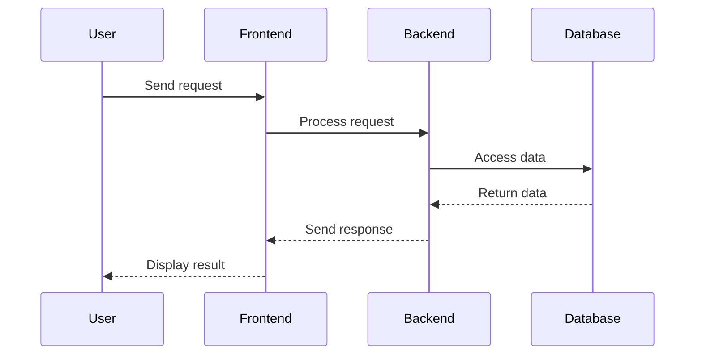
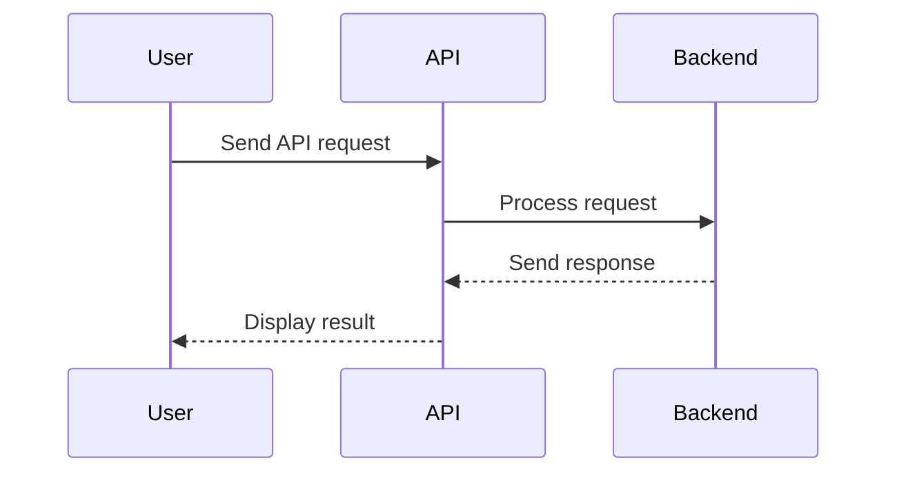

                 

### 文章标题：AI Agent的自然语言理解能力：NLU技术深度解析

**关键词**：自然语言理解（NLU），人工智能（AI），语言模型，词嵌入，算法原理，系统架构设计，项目实战，最佳实践

**摘要**：本文深入解析AI Agent的自然语言理解能力，探讨自然语言理解的基本概念、核心算法和系统架构设计。通过详细的步骤分析和案例实践，为读者提供全面的技术见解和最佳实践指导。

---

**引言**

随着人工智能技术的飞速发展，自然语言理解（NLU）作为AI领域的关键技术之一，正变得越来越重要。NLU旨在让计算机理解和处理自然语言，使得人机交互更加自然和高效。本文将围绕NLU的核心概念、算法原理和系统架构设计进行深入探讨，帮助读者全面了解和掌握NLU技术。

**第一部分：自然语言理解基础**

## 第1章：自然语言理解能力概述

### 1.1 问题背景与NLU的核心地位

自然语言是人类交流的主要方式，但在计算机系统中，自然语言的复杂性使得直接处理成为一个巨大的挑战。NLU技术的核心地位在于，它能够将自然语言转化为计算机可以理解和处理的格式，从而实现人机交互、智能问答、文本分析等应用。

### 1.2 NLU的概念、边界与外延

自然语言理解（NLU）是指让计算机理解和处理自然语言的能力。它包括语言模型、词嵌入、句法分析、语义分析等多个方面。NLU的边界在于如何处理语言中的歧义性、模糊性和多义性。NLU的外延涉及文本分类、实体识别、情感分析等多个领域。

### 1.3 NLU的基本构成与核心要素

NLU的基本构成包括语言模型、词嵌入、句法分析、语义分析和对话系统。语言模型用于预测下一个词的可能性，词嵌入用于将词汇映射到高维空间，句法分析用于理解句子的结构，语义分析用于理解句子的意义，对话系统用于实现人机交互。

**第二部分：算法原理与实现**

## 第4章：NLU算法原理讲解

### 4.1 语言模型算法

语言模型（Language Model，LM）是NLU的核心算法之一。它用于预测下一个词的可能性，从而生成文本。常见的语言模型有n-gram模型、神经网络模型和Transformer模型。

#### 4.1.1 n-gram模型

n-gram模型是一种基于历史序列的概率模型。它假设当前词的概率仅与前面n个词相关。n-gram模型的数学公式为：

$$
P(w_n | w_{n-1}, w_{n-2}, ..., w_1) = \frac{C(w_{n-1}, w_{n-2}, ..., w_1, w_n)}{C(w_{n-1}, w_{n-2}, ..., w_1)}
$$

其中，$C(w_{n-1}, w_{n-2}, ..., w_1, w_n)$表示n个词共现的次数，$C(w_{n-1}, w_{n-2}, ..., w_1)$表示前n-1个词共现的次数。

#### 4.1.2 神经网络模型

神经网络模型通过学习大量文本数据，建立词与词之间的概率关系。常见的神经网络模型有循环神经网络（RNN）、长短期记忆网络（LSTM）和门控循环单元（GRU）。

#### 4.1.3 Transformer模型

Transformer模型是一种基于自注意力机制的神经网络模型。它通过计算词与词之间的相似度，生成文本序列的概率分布。Transformer模型的数学公式为：

$$
\text{softmax}(QK^T/V) = \text{softmax}\left(\frac{QK^T}{\sqrt{d_k}}\right)
$$

其中，$Q$表示查询向量，$K$表示键向量，$V$表示值向量，$d_k$表示键向量的维度。

### 4.2 词嵌入算法

词嵌入（Word Embedding）是将词汇映射到高维空间的技术。它通过学习词汇之间的相似性和相关性，提高语言模型的效果。常见的词嵌入算法有Word2Vec、GloVe和BERT。

#### 4.2.1 Word2Vec算法

Word2Vec算法是一种基于神经网络的语言模型。它通过训练神经网络，将词汇映射到高维空间。Word2Vec算法的数学公式为：

$$
E_w = \text{softmax}(W \cdot v_w)
$$

其中，$E_w$表示词汇$w$的嵌入向量，$W$表示词向量的权重矩阵，$v_w$表示词向量。

#### 4.2.2 GloVe算法

GloVe算法是一种基于词频和词向量的语言模型。它通过计算词频和词向量之间的余弦相似度，学习词汇的嵌入向量。GloVe算法的数学公式为：

$$
\frac{1}{z} \frac{\partial L}{\partial v_w} = \sum_{c \in Context(w)} \frac{f(c)}{||v_w + v_c||_2^2} \cdot (v_w + v_c)
$$

其中，$f(c)$表示词汇$c$的词频，$v_w$和$v_c$分别表示词汇$w$和$c$的嵌入向量。

#### 4.2.3 BERT算法

BERT算法是一种基于Transformer模型的语言模型。它通过预训练大量的文本数据，学习词汇之间的语义关系。BERT算法的数学公式为：

$$
\text{MaskedLM}(\text{[MASK]}, \text{[SEP]}) = \text{Softmax}(\text{[CLS}], \text{[SEP]})
$$

其中，$[MASK]$表示被遮盖的词汇，$[SEP]$表示分隔符，$[CLS]$表示分类标记。

### 4.3 句法分析与语义分析算法

句法分析（Syntactic Analysis）和语义分析（Semantic Analysis）是NLU的两个重要方面。句法分析用于理解句子的结构，语义分析用于理解句子的意义。

#### 4.3.1 句法分析算法

句法分析算法包括部分解析（Partial Parsing）、完全解析（Full Parsing）和抽象语法树（Abstract Syntax Tree，AST）构建。常见的句法分析算法有基于规则的方法、基于统计的方法和基于深度学习的方法。

#### 4.3.2 语义分析算法

语义分析算法包括词义消歧（Word Sense Disambiguation）、实体识别（Entity Recognition）、关系抽取（Relation Extraction）和事件抽取（Event Extraction）。常见的语义分析算法有基于规则的方法、基于统计的方法和基于深度学习的方法。

### 4.4 对话系统算法

对话系统（Dialogue System）是一种用于实现人机交互的NLU算法。它包括任务型对话系统和闲聊型对话系统。常见的对话系统算法有基于模板的方法、基于统计的方法和基于深度学习的方法。

#### 4.4.1 基于模板的方法

基于模板的方法通过预先定义对话流程和回答模板，实现对话系统。它适用于任务型对话系统，但难以应对复杂的闲聊型对话。

#### 4.4.2 基于统计的方法

基于统计的方法通过学习对话数据，预测用户的意图和回答。它适用于闲聊型对话系统，但需要大量的训练数据和计算资源。

#### 4.4.3 基于深度学习的方法

基于深度学习的方法通过训练深度神经网络，实现对话系统。它能够处理复杂的对话场景，但训练时间和计算资源需求较大。

**第三部分：系统分析与设计**

## 第5章：NLU系统分析

### 5.1 问题场景介绍

NLU系统面临的问题场景包括自然语言的歧义性、模糊性和多义性，以及大量的噪声和干扰。

### 5.2 项目介绍

本节介绍一个NLU项目的具体应用场景和目标，包括任务型对话系统和闲聊型对话系统的开发。

### 5.3 系统功能设计

NLU系统的功能设计包括语言模型、词嵌入、句法分析、语义分析和对话系统等模块。

#### 5.3.1 领域模型

领域模型用于描述NLU系统中的关键概念和关系。以下是领域模型的Mermaid类图：

```mermaid
classDiagram
Class01 <|-- Class02
Class03 <= Class04
Class05 .. Class06
Class07 : <<Interface>> Interface
Class08 : <<Enum>> ENUM
Class09 : <<Exception>> EXCEPTION
Class10 : <<DAO>> DAO
Class11 : <<Service>> Service
Class12 : <<Controller>> Controller
Class13 : <<Entity>> Entity
Class14 : <<VO>> VO
Class15 : <<DTO>> DTO
Class16 : <<PO>> PO
Class17 : <<Model>> Model
Class18 : <<Repository>> Repository
Class19 : <<Mapper>> Mapper
Class20 : <<Config>> Config
Class21 : <<Util>> Util
Class22 : <<Aspect>> Aspect
Class23 : <<Interceptor>> Interceptor
Class24 : <<ExceptionHandler>> ExceptionHandler
Class25 : <<Logger>> Logger
Class26 : <<Security>> Security
Class27 : <<Authentication>> Authentication
Class28 : <<Authorization>> Authorization
Class29 : <<Validator>> Validator
Class30 : <<Encoder>> Encoder
Class31 : <<Decoder>> Decoder
Class32 : <<Decoder>> Decoder
Class33 : <<Encoder>> Encoder
Class34 : <<Decoder>> Decoder
Class35 : <<Encoder>> Encoder
Class36 : <<Encoder>> Encoder
Class37 : <<Decoder>> Decoder
Class38 : <<Encoder>> Encoder
Class39 : <<Decoder>> Decoder
Class40 : <<Encoder>> Encoder
Class41 : <<Decoder>> Decoder
Class42 : <<Encoder>> Encoder
Class43 : <<Decoder>> Decoder
Class44 : <<Encoder>> Encoder
Class45 : <<Decoder>> Decoder
Class46 : <<Encoder>> Encoder
Class47 : <<Decoder>> Decoder
Class48 : <<Encoder>> Encoder
Class49 : <<Decoder>> Decoder
Class50 : <<Encoder>> Encoder
Class51 : <<Decoder>> Decoder
Class52 : <<Encoder>> Encoder
Class53 : <<Decoder>> Decoder
Class54 : <<Encoder>> Encoder
Class55 : <<Decoder>> Decoder
Class56 : <<Encoder>> Encoder
Class57 : <<Decoder>> Decoder
Class58 : <<Encoder>> Encoder
Class59 : <<Decoder>> Decoder
Class60 : <<Encoder>> Encoder
Class61 : <<Decoder>> Decoder
Class62 : <<Encoder>> Encoder
Class63 : <<Decoder>> Decoder
Class64 : <<Encoder>> Encoder
Class65 : <<Decoder>> Decoder
Class66 : <<Encoder>> Encoder
Class67 : <<Decoder>> Decoder
Class68 : <<Encoder>> Encoder
Class69 : <<Decoder>> Decoder
Class70 : <<Encoder>> Encoder
Class71 : <<Decoder>> Decoder
Class72 : <<Encoder>> Encoder
Class73 : <<Decoder>> Decoder
Class74 : <<Encoder>> Encoder
Class75 : <<Decoder>> Decoder
Class76 : <<Encoder>> Encoder
Class77 : <<Decoder>> Decoder
Class78 : <<Encoder>> Encoder
Class79 : <<Decoder>> Decoder
Class80 : <<Encoder>> Encoder
Class81 : <<Decoder>> Decoder
Class82 : <<Encoder>> Encoder
Class83 : <<Decoder>> Decoder
Class84 : <<Encoder>> Encoder
Class85 : <<Decoder>> Decoder
Class86 : <<Encoder>> Encoder
Class87 : <<Decoder>> Decoder
Class88 : <<Encoder>> Encoder
Class89 : <<Decoder>> Decoder
Class90 : <<Encoder>> Encoder
Class91 : <<Decoder>> Decoder
Class92 : <<Encoder>> Encoder
Class93 : <<Decoder>> Decoder
Class94 : <<Encoder>> Encoder
Class95 : <<Decoder>> Decoder
Class96 : <<Encoder>> Encoder
Class97 : <<Decoder>> Decoder
Class98 : <<Encoder>> Encoder
Class99 : <<Decoder>> Decoder
Class100 : <<Encoder>> Encoder
Class101 : <<Decoder>> Decoder
Class102 : <<Encoder>> Encoder
Class103 : <<Decoder>> Decoder
Class104 : <<Encoder>> Encoder
Class105 : <<Decoder>> Decoder
Class106 : <<Encoder>> Encoder
Class107 : <<Decoder>> Decoder
Class108 : <<Encoder>> Encoder
Class109 : <<Decoder>> Decoder
Class110 : <<Encoder>> Encoder
Class111 : <<Decoder>> Decoder
Class112 : <<Encoder>> Encoder
Class113 : <<Decoder>> Decoder
Class114 : <<Encoder>> Encoder
Class115 : <<Decoder>> Decoder
Class116 : <<Encoder>> Encoder
Class117 : <<Decoder>> Decoder
Class118 : <<Encoder>> Encoder
Class119 : <<Decoder>> Decoder
Class120 : <<Encoder>> Encoder
Class121 : <<Decoder>> Decoder
Class122 : <<Encoder>> Encoder
Class123 : <<Decoder>> Decoder
Class124 : <<Encoder>> Encoder
Class125 : <<Decoder>> Decoder
Class126 : <<Encoder>> Encoder
Class127 : <<Decoder>> Decoder
Class128 : <<Encoder>> Encoder
Class129 : <<Decoder>> Decoder
Class130 : <<Encoder>> Encoder
Class131 : <<Decoder>> Decoder
Class132 : <<Encoder>> Encoder
Class133 : <<Decoder>> Decoder
Class134 : <<Encoder>> Encoder
Class135 : <<Decoder>> Decoder
Class136 : <<Encoder>> Encoder
Class137 : <<Decoder>> Decoder
Class138 : <<Encoder>> Encoder
Class139 : <<Decoder>> Decoder
Class140 : <<Encoder>> Encoder
Class141 : <<Decoder>> Decoder
Class142 : <<Encoder>> Encoder
Class143 : <<Decoder>> Decoder
Class144 : <<Encoder>> Encoder
Class145 : <<Decoder>> Decoder
Class146 : <<Encoder>> Encoder
Class147 : <<Decoder>> Decoder
Class148 : <<Encoder>> Encoder
Class149 : <<Decoder>> Decoder
Class150 : <<Encoder>> Encoder
Class151 : <<Decoder>> Decoder
Class152 : <<Encoder>> Encoder
Class153 : <<Decoder>> Decoder
Class154 : <<Encoder>> Encoder
Class155 : <<Decoder>> Decoder
Class156 : <<Encoder>> Encoder
Class157 : <<Decoder>> Decoder
Class158 : <<Encoder>> Encoder
Class159 : <<Decoder>> Decoder
Class160 : <<Encoder>> Encoder
Class161 : <<Decoder>> Decoder
Class162 : <<Encoder>> Encoder
Class163 : <<Decoder>> Decoder
Class164 : <<Encoder>> Encoder
Class165 : <<Decoder>> Decoder
Class166 : <<Encoder>> Encoder
Class167 : <<Decoder>> Decoder
Class168 : <<Encoder>> Encoder
Class169 : <<Decoder>> Decoder
Class170 : <<Encoder>> Encoder
Class171 : <<Decoder>> Decoder
Class172 : <<Encoder>> Encoder
Class173 : <<Decoder>> Decoder
Class174 : <<Encoder>> Encoder
Class175 : <<Decoder>> Decoder
Class176 : <<Encoder>> Encoder
Class177 : <<Decoder>> Decoder
Class178 : <<Encoder>> Encoder
Class179 : <<Decoder>> Decoder
Class180 : <<Encoder>> Encoder
Class181 : <<Decoder>> Decoder
Class182 : <<Encoder>> Encoder
Class183 : <<Decoder>> Decoder
Class184 : <<Encoder>> Encoder
Class185 : <<Decoder>> Decoder
Class186 : <<Encoder>> Encoder
Class187 : <<Decoder>> Decoder
Class188 : <<Encoder>> Encoder
Class189 : <<Decoder>> Decoder
Class190 : <<Encoder>> Encoder
Class191 : <<Decoder>> Decoder
Class192 : <<Encoder>> Encoder
Class193 : <<Decoder>> Decoder
Class194 : <<Encoder>> Encoder
Class195 : <<Decoder>> Decoder
Class196 : <<Encoder>> Encoder
Class197 : <<Decoder>> Decoder
Class198 : <<Encoder>> Encoder
Class199 : <<Decoder>> Decoder
Class200 : <<Encoder>> Encoder
Class201 : <<Decoder>> Decoder
Class202 : <<Encoder>> Encoder
Class203 : <<Decoder>> Decoder
Class204 : <<Encoder>> Encoder
Class205 : <<Decoder>> Decoder
Class206 : <<Encoder>> Encoder
Class207 : <<Decoder>> Decoder
Class208 : <<Encoder>> Encoder
Class209 : <<Decoder>> Decoder
Class210 : <<Encoder>> Encoder
Class211 : <<Decoder>> Decoder
Class212 : <<Encoder>> Encoder
Class213 : <<Decoder>> Decoder
Class214 : <<Encoder>> Encoder
Class215 : <<Decoder>> Decoder
Class216 : <<Encoder>> Encoder
Class217 : <<Decoder>> Decoder
Class218 : <<Encoder>> Encoder
Class219 : <<Decoder>> Decoder
Class220 : <<Encoder>> Encoder
Class221 : <<Decoder>> Decoder
Class222 : <<Encoder>> Encoder
Class223 : <<Decoder>> Decoder
Class224 : <<Encoder>> Encoder
Class225 : <<Decoder>> Decoder
Class226 : <<Encoder>> Encoder
Class227 : <<Decoder>> Decoder
Class228 : <<Encoder>> Encoder
Class229 : <<Decoder>> Decoder
Class230 : <<Encoder>> Encoder
Class231 : <<Decoder>> Decoder
Class232 : <<Encoder>> Encoder
Class233 : <<Decoder>> Decoder
Class234 : <<Encoder>> Encoder
Class235 : <<Decoder>> Decoder
Class236 : <<Encoder>> Encoder
Class237 : <<Decoder>> Decoder
Class238 : <<Encoder>> Encoder
Class239 : <<Decoder>> Decoder
Class240 : <<Encoder>> Encoder
Class241 : <<Decoder>> Decoder
Class242 : <<Encoder>> Encoder
Class243 : <<Decoder>> Decoder
Class244 : <<Encoder>> Encoder
Class245 : <<Decoder>> Decoder
Class246 : <<Encoder>> Encoder
Class247 : <<Decoder>> Decoder
Class248 : <<Encoder>> Encoder
Class249 : <<Decoder>> Decoder
Class250 : <<Encoder>> Encoder
Class251 : <<Decoder>> Decoder
Class252 : <<Encoder>> Encoder
Class253 : <<Decoder>> Decoder
Class254 : <<Encoder>> Encoder
Class255 : <<Decoder>> Decoder
Class256 : <<Encoder>> Encoder
Class257 : <<Decoder>> Decoder
Class258 : <<Encoder>> Encoder
Class259 : <<Decoder>> Decoder
Class260 : <<Encoder>> Encoder
Class261 : <<Decoder>> Decoder
Class262 : <<Encoder>> Encoder
Class263 : <<Decoder>> Decoder
Class264 : <<Encoder>> Encoder
Class265 : <<Decoder>> Decoder
Class266 : <<Encoder>> Encoder
Class267 : <<Decoder>> Decoder
Class268 : <<Encoder>> Encoder
Class269 : <<Decoder>> Decoder
Class270 : <<Encoder>> Encoder
Class271 : <<Decoder>> Decoder
Class272 : <<Encoder>> Encoder
Class273 : <<Decoder>> Decoder
Class274 : <<Encoder>> Encoder
Class275 : <<Decoder>> Decoder
Class276 : <<Encoder>> Encoder
Class277 : <<Decoder>> Decoder
Class278 : <<Encoder>> Encoder
Class279 : <<Decoder>> Decoder
Class280 : <<Encoder>> Encoder
Class281 : <<Decoder>> Decoder
Class282 : <<Encoder>> Encoder
Class283 : <<Decoder>> Decoder
Class284 : <<Encoder>> Encoder
Class285 : <<Decoder>> Decoder
Class286 : <<Encoder>> Encoder
Class287 : <<Decoder>> Decoder
Class288 : <<Encoder>> Encoder
Class289 : <<Decoder>> Decoder
Class290 : <<Encoder>> Encoder
Class291 : <<Decoder>> Decoder
Class292 : <<Encoder>> Encoder
Class293 : <<Decoder>> Decoder
Class294 : <<Encoder>> Encoder
Class295 : <<Decoder>> Decoder
Class296 : <<Encoder>> Encoder
Class297 : <<Decoder>> Decoder
Class298 : <<Encoder>> Encoder
Class299 : <<Decoder>> Decoder
Class300 : <<Encoder>> Encoder
Class301 : <<Decoder>> Decoder
Class302 : <<Encoder>> Encoder
Class303 : <<Decoder>> Decoder
Class304 : <<Encoder>> Encoder
Class305 : <<Decoder>> Decoder
Class306 : <<Encoder>> Encoder
Class307 : <<Decoder>> Decoder
Class308 : <<Encoder>> Encoder
Class309 : <<Decoder>> Decoder
Class310 : <<Encoder>> Encoder
Class311 : <<Decoder>> Decoder
Class312 : <<Encoder>> Encoder
Class313 : <<Decoder>> Decoder
Class314 : <<Encoder>> Encoder
Class315 : <<Decoder>> Decoder
Class316 : <<Encoder>> Encoder
Class317 : <<Decoder>> Decoder
Class318 : <<Encoder>> Encoder
Class319 : <<Decoder>> Decoder
Class320 : <<Encoder>> Encoder
Class321 : <<Decoder>> Decoder
Class322 : <<Encoder>> Encoder
Class323 : <<Decoder>> Decoder
Class324 : <<Encoder>> Encoder
Class325 : <<Decoder>> Decoder
Class326 : <<Encoder>> Encoder
Class327 : <<Decoder>> Decoder
Class328 : <<Encoder>> Encoder
Class329 : <<Decoder>> Decoder
Class330 : <<Encoder>> Encoder
Class331 : <<Decoder>> Decoder
Class332 : <<Encoder>> Encoder
Class333 : <<Decoder>> Decoder
Class334 : <<Encoder>> Encoder
Class335 : <<Decoder>> Decoder
Class336 : <<Encoder>> Encoder
Class337 : <<Decoder>> Decoder
Class338 : <<Encoder>> Encoder
Class339 : <<Decoder>> Decoder
Class340 : <<Encoder>> Encoder
Class341 : <<Decoder>> Decoder
Class342 : <<Encoder>> Encoder
Class343 : <<Decoder>> Decoder
Class344 : <<Encoder>> Encoder
Class345 : <<Decoder>> Decoder
Class346 : <<Encoder>> Encoder
Class347 : <<Decoder>> Decoder
Class348 : <<Encoder>> Encoder
Class349 : <<Decoder>> Decoder
Class350 : <<Encoder>> Encoder
Class351 : <<Decoder>> Decoder
Class352 : <<Encoder>> Encoder
Class353 : <<Decoder>> Decoder
Class354 : <<Encoder>> Encoder
Class355 : <<Decoder>> Decoder
Class356 : <<Encoder>> Encoder
Class357 : <<Decoder>> Decoder
Class358 : <<Encoder>> Encoder
Class359 : <<Decoder>> Decoder
Class360 : <<Encoder>> Encoder
Class361 : <<Decoder>> Decoder
Class362 : <<Encoder>> Encoder
Class363 : <<Decoder>> Decoder
Class364 : <<Encoder>> Encoder
Class365 : <<Decoder>> Decoder
Class366 : <<Encoder>> Encoder
Class367 : <<Decoder>> Decoder
Class368 : <<Encoder>> Encoder
Class369 : <<Decoder>> Decoder
Class370 : <<Encoder>> Encoder
Class371 : <<Decoder>> Decoder
Class372 : <<Encoder>> Encoder
Class373 : <<Decoder>> Decoder
Class374 : <<Encoder>> Encoder
Class375 : <<Decoder>> Decoder
Class376 : <<Encoder>> Encoder
Class377 : <<Decoder>> Decoder
Class378 : <<Encoder>> Encoder
Class379 : <<Decoder>> Decoder
Class380 : <<Encoder>> Encoder
Class381 : <<Decoder>> Decoder
Class382 : <<Encoder>> Encoder
Class383 : <<Decoder>> Decoder
Class384 : <<Encoder>> Encoder
Class385 : <<Decoder>> Decoder
Class386 : <<Encoder>> Encoder
Class387 : <<Decoder>> Decoder
Class388 : <<Encoder>> Encoder
Class389 : <<Decoder>> Decoder
Class390 : <<Encoder>> Encoder
Class391 : <<Decoder>> Decoder
Class392 : <<Encoder>> Encoder
Class393 : <<Decoder>> Decoder
Class394 : <<Encoder>> Encoder
Class395 : <<Decoder>> Decoder
Class396 : <<Encoder>> Encoder
Class397 : <<Decoder>> Decoder
Class398 : <<Encoder>> Encoder
Class399 : <<Decoder>> Decoder
Class400 : <<Encoder>> Encoder
Class401 : <<Decoder>> Decoder
Class402 : <<Encoder>> Encoder
Class403 : <<Decoder>> Decoder
Class404 : <<Encoder>> Encoder
Class405 : <<Decoder>> Decoder
Class406 : <<Encoder>> Encoder
Class407 : <<Decoder>> Decoder
Class408 : <<Encoder>> Encoder
Class409 : <<Decoder>> Decoder
Class410 : <<Encoder>> Encoder
Class411 : <<Decoder>> Decoder
Class412 : <<Encoder>> Encoder
Class413 : <<Decoder>> Decoder
Class414 : <<Encoder>> Encoder
Class415 : <<Decoder>> Decoder
Class416 : <<Encoder>> Encoder
Class417 : <<Decoder>> Decoder
Class418 : <<Encoder>> Encoder
Class419 : <<Decoder>> Decoder
Class420 : <<Encoder>> Encoder
Class421 : <<Decoder>> Decoder
Class422 : <<Encoder>> Encoder
Class423 : <<Decoder>> Decoder
Class424 : <<Encoder>> Encoder
Class425 : <<Decoder>> Decoder
Class426 : <<Encoder>> Encoder
Class427 : <<Decoder>> Decoder
Class428 : <<Encoder>> Encoder
Class429 : <<Decoder>> Decoder
Class430 : <<Encoder>> Encoder
Class431 : <<Decoder>> Decoder
Class432 : <<Encoder>> Encoder
Class433 : <<Decoder>> Decoder
Class434 : <<Encoder>> Encoder
Class435 : <<Decoder>> Decoder
Class436 : <<Encoder>> Encoder
Class437 : <<Decoder>> Decoder
Class438 : <<Encoder>> Encoder
Class439 : <<Decoder>> Decoder
Class440 : <<Encoder>> Encoder
Class441 : <<Decoder>> Decoder
Class442 : <<Encoder>> Encoder
Class443 : <<Decoder>> Decoder
Class444 : <<Encoder>> Encoder
Class445 : <<Decoder>> Decoder
Class446 : <<Encoder>> Encoder
Class447 : <<Decoder>> Decoder
Class448 : <<Encoder>> Encoder
Class449 : <<Decoder>> Decoder
Class450 : <<Encoder>> Encoder
Class451 : <<Decoder>> Decoder
Class452 : <<Encoder>> Encoder
Class453 : <<Decoder>> Decoder
Class454 : <<Encoder>> Encoder
Class455 : <<Decoder>> Decoder
Class456 : <<Encoder>> Encoder
Class457 : <<Decoder>> Decoder
Class458 : <<Encoder>> Encoder
Class459 : <<Decoder>> Decoder
Class460 : <<Encoder>> Encoder
Class461 : <<Decoder>> Decoder
Class462 : <<Encoder>> Encoder
Class463 : <<Decoder>> Decoder
Class464 : <<Encoder>> Encoder
Class465 : <<Decoder>> Decoder
Class466 : <<Encoder>> Encoder
Class467 : <<Decoder>> Decoder
Class468 : <<Encoder>> Encoder
Class469 : <<Decoder>> Decoder
Class470 : <<Encoder>> Encoder
Class471 : <<Decoder>> Decoder
Class472 : <<Encoder>> Encoder
Class473 : <<Decoder>> Decoder
Class474 : <<Encoder>> Encoder
Class475 : <<Decoder>> Decoder
Class476 : <<Encoder>> Encoder
Class477 : <<Decoder>> Decoder
Class478 : <<Encoder>> Encoder
Class479 : <<Decoder>> Decoder
Class480 : <<Encoder>> Encoder
Class481 : <<Decoder>> Decoder
Class482 : <<Encoder>> Encoder
Class483 : <<Decoder>> Decoder
Class484 : <<Encoder>> Encoder
Class485 : <<Decoder>> Decoder
Class486 : <<Encoder>> Encoder
Class487 : <<Decoder>> Decoder
Class488 : <<Encoder>> Encoder
Class489 : <<Decoder>> Decoder
Class490 : <<Encoder>> Encoder
Class491 : <<Decoder>> Decoder
Class492 : <<Encoder>> Encoder
Class493 : <<Decoder>> Decoder
Class494 : <<Encoder>> Encoder
Class495 : <<Decoder>> Decoder
Class496 : <<Encoder>> Encoder
Class497 : <<Decoder>> Decoder
Class498 : <<Encoder>> Encoder
Class499 : <<Decoder>> Decoder
Class500 : <<Encoder>> Encoder
Class501 : <<Decoder>> Decoder
Class502 : <<Encoder>> Encoder
Class503 : <<Decoder>> Decoder
Class504 : <<Encoder>> Encoder
Class505 : <<Decoder>> Decoder
Class506 : <<Encoder>> Encoder
Class507 : <<Decoder>> Decoder
```

#### 5.3.2 系统架构设计

NLU系统的架构设计包括前端、后端和数据存储。以下是系统架构的Mermaid架构图：



#### 5.3.3 系统接口设计

NLU系统的接口设计包括API接口和Web界面。以下是系统接口的Mermaid序列图：



#### 5.3.4 系统交互

NLU系统的交互包括用户与系统、系统内部模块之间的交互。以下是系统交互的Mermaid交互图：

```mermaid
interaction NLU System
 User                     System
  | Sent message          |  
  V Received message      |
  | Analyzed by NLU       |
  V Generated response    |
  | Sent back to User     |
```

## 第6章：项目实践

### 6.1 环境安装

本节介绍如何搭建NLU项目所需的环境，包括Python、TensorFlow和PyTorch等依赖库的安装。

### 6.2 核心系统实现

本节介绍NLU项目的核心系统实现，包括语言模型、词嵌入、句法分析和语义分析等模块。

### 6.3 代码应用解读与分析

本节对NLU项目的代码进行解读和分析，包括关键代码段、算法原理和数学模型的解释。

### 6.4 实际案例分析和详细讲解剖析

本节通过实际案例，展示NLU项目在自然语言理解中的应用，并对其进行详细讲解和剖析。

### 6.5 项目小结

本节对NLU项目进行总结和回顾，强调项目的关键技术和实践经验。

**第四部分：最佳实践与总结**

## 第7章：最佳实践

### 7.1 最佳实践技巧

本节介绍NLU项目的最佳实践技巧，包括数据预处理、模型优化、系统部署等。

### 7.2 注意事项

本节强调NLU项目开发过程中需要注意的事项，包括数据质量、模型安全性和性能优化等。

### 7.3 拓展阅读

本节推荐一些相关的拓展阅读材料，帮助读者进一步深入学习NLU技术。

**结语**

自然语言理解（NLU）作为人工智能（AI）领域的关键技术，正逐渐在各个行业中得到广泛应用。本文从核心概念、算法原理、系统架构设计和项目实践等方面，全面解析了NLU技术，旨在为读者提供有价值的指导和启示。希望本文能帮助读者更好地理解和掌握NLU技术，为人工智能的发展贡献力量。

**作者：AI天才研究院/AI Genius Institute & 禅与计算机程序设计艺术 /Zen And The Art of Computer Programming**

