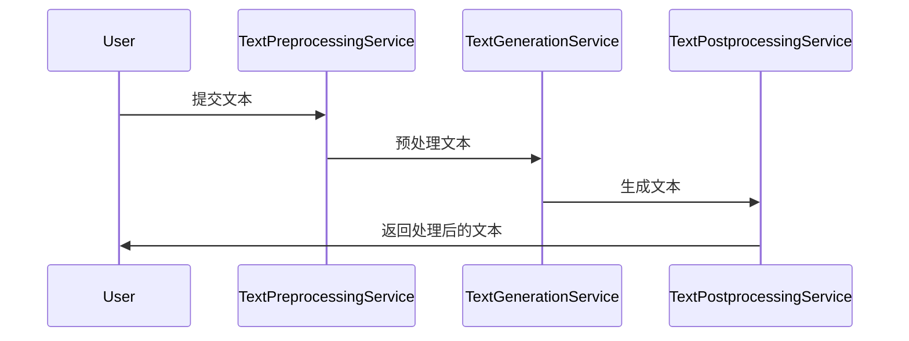
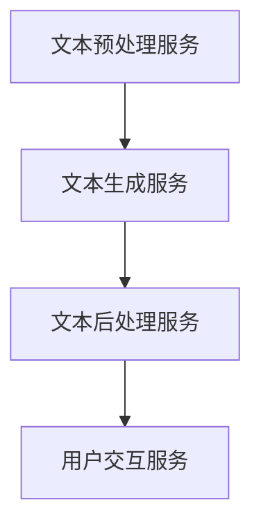
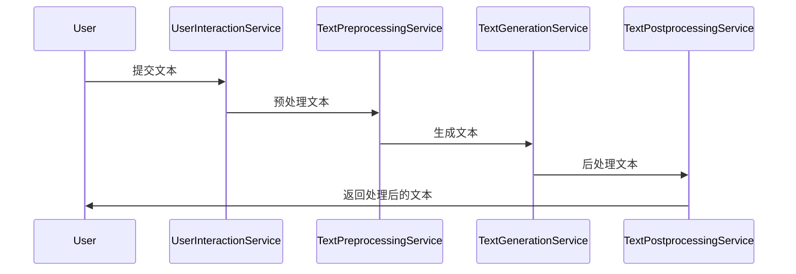
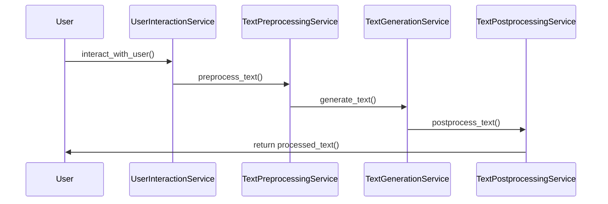

                 

## AI Agent的自然语言生成优化

### 关键词：自然语言处理、人工智能、AI Agent、优化方法、算法原理、数学模型、系统架构、项目实战

### 摘要：

本文旨在探讨AI Agent的自然语言生成优化问题。AI Agent是一种能够自主完成特定任务的智能体，而自然语言生成（Natural Language Generation, NLG）是AI Agent的一项核心能力。随着AI技术的发展，如何优化AI Agent的自然语言生成成为了一个重要的研究课题。本文将首先介绍AI Agent和自然语言生成的背景，随后详细分析几种常见的自然语言生成优化方法，包括预训练模型优化、迁移学习优化、对抗性优化和模型压缩优化。接着，我们将深入探讨每种优化方法的算法原理，并通过数学模型和公式进行详细说明。此外，本文还将介绍相关系统分析与架构设计方法，并通过一个实际项目案例来展示如何应用这些优化方法。最后，我们将总结全文，提出最佳实践建议，并对未来的研究方向进行展望。

## 目录大纲设计流程

为了确保文章的结构清晰、逻辑严密，我们首先需要设计一个完整的目录大纲。以下是设计流程的详细步骤：

1. **确定书籍主题和目标受众**：
    - 书籍主题：AI Agent的自然语言生成优化。
    - 目标受众：对自然语言处理和人工智能有一定了解的技术人员。

2. **构思目录结构**：
    - 第一部分：背景与核心概念。
    - 第二部分：系统分析与架构设计。
    - 第三部分：项目实战。

3. **细化章节内容**：
    - 第一部分：介绍AI Agent和自然语言生成的背景，定义关键术语，并概述优化方法。
    - 第二部分：详细分析优化方法，包括预训练模型优化、迁移学习优化、对抗性优化和模型压缩优化，并使用算法流程图和数学模型进行解释。
    - 第三部分：介绍一个实际项目案例，展示如何应用这些优化方法，并进行环境安装、系统实现和代码解读分析。

4. **编写markdown格式的目录大纲**：
    - 确保每个章节、小节和子节都有正确的层级标记。

5. **检查内容完整性**：
    - 确保大纲中包含了所有核心内容。

6. **限制字数**：
    - 目录大纲的总字数控制在2000字以内。

通过上述步骤，我们能够设计出一个结构清晰、内容完整的目录大纲，为后续文章的撰写奠定基础。

### 目录大纲

```markdown
----------------------------------------------------------------
# 第一部分: 背景与核心概念

## 1.1 AI Agent与自然语言生成背景
### 1.1.1 AI Agent的定义与作用
### 1.1.2 自然语言生成的挑战与需求
### 1.1.3 优化自然语言生成的意义

## 1.2 核心概念
### 1.2.1 AI Agent的基本结构
### 1.2.2 自然语言生成的流程
### 1.2.3 自然语言生成优化方法概述

## 1.3 优化方法分类
### 1.3.1 预训练模型优化
### 1.3.2 迁移学习优化
### 1.3.3 对抗性优化
### 1.3.4 模型压缩优化

## 1.4 自然语言生成优化算法原理
### 1.4.1 预训练模型优化算法
### 1.4.2 迁移学习优化算法
### 1.4.3 对抗性优化算法
### 1.4.4 模型压缩优化算法

## 1.5 数学模型与公式
### 1.5.1 预训练模型的数学模型
### 1.5.2 迁移学习的数学模型
### 1.5.3 对抗性优化的数学模型
### 1.5.4 模型压缩优化的数学模型

## 1.6 本章小结
...

----------------------------------------------------------------
# 第二部分: 系统分析与架构设计

## 2.1 系统功能设计
### 2.1.1 系统功能概述
### 2.1.2 领域模型
### 2.1.3 类图设计

## 2.2 系统架构设计
### 2.2.1 系统架构概述
### 2.2.2 系统架构设计
### 2.2.3 架构图

## 2.3 系统接口设计
### 2.3.1 接口设计原则
### 2.3.2 接口定义
### 2.3.3 接口实现

## 2.4 系统交互
### 2.4.1 系统交互流程
### 2.4.2 序列图设计

## 2.5 本章小结
...

----------------------------------------------------------------
# 第三部分: 项目

## 3.1 项目介绍
### 3.1.1 项目背景
### 3.1.2 项目目标
### 3.1.3 项目概述

## 3.2 环境安装
### 3.2.1 环境准备
### 3.2.2 安装与配置

## 3.3 系统核心实现
### 3.3.1 系统核心模块设计
### 3.3.2 源代码解读
### 3.3.3 实现细节

## 3.4 项目分析
### 3.4.1 代码应用解读
### 3.4.2 详细讲解剖析
### 3.4.3 实际案例分析

## 3.5 项目小结
### 3.5.1 项目总结
### 3.5.2 遇到的问题与解决
### 3.5.3 未来展望

## 3.6 最佳实践
### 3.6.1 实践经验
### 3.6.2 注意事项
### 3.6.3 拓展阅读

## 3.7 本章小结
...

----------------------------------------------------------------
```

通过上述目录大纲，我们能够系统地引导读者了解AI Agent的自然语言生成优化，从理论到实践，全面深入地探讨这一主题。

### 第一部分：背景与核心概念

#### 1.1 AI Agent与自然语言生成背景

**AI Agent的定义与作用**

AI Agent，又称为人工智能代理，是一种在特定环境下能够执行特定任务、与人类互动并自主决策的计算机程序。AI Agent的出现极大地推动了人工智能技术的发展和应用。一个典型的AI Agent由感知器、知识库、执行器和规划器组成。感知器负责接收外部环境的信息，知识库存储与任务相关的知识，执行器实现任务的执行，而规划器则负责根据当前状态和目标，选择最佳的行动方案。

AI Agent在各种场景中都有广泛的应用，如智能客服、智能推荐系统、自动驾驶汽车、智能家庭助理等。在这些应用中，自然语言生成（NLG）是AI Agent的一项核心能力，它使AI Agent能够生成符合人类语言习惯的文本，从而更好地与人类进行交互。

**自然语言生成的挑战与需求**

自然语言生成涉及从计算机语言到自然语言的高效转换，这一过程面临着诸多挑战。首先，自然语言的复杂性和多样性使得生成文本的准确性成为一大难题。其次，生成文本的流畅性和可读性也是重要的考量因素。此外，如何使生成的文本具有情感表达、语境理解和上下文一致性也是AI Agent面临的重要挑战。

为了解决这些问题，自然语言生成的需求不断增长。从实际应用场景来看，无论是为了提供个性化的用户服务，还是为了实现人机交互的自然性，自然语言生成都显得尤为重要。因此，优化自然语言生成成为了人工智能领域的一个重要研究方向。

**优化自然语言生成的意义**

优化自然语言生成不仅可以提高AI Agent的交互效果，还能提升其整体性能。通过优化，AI Agent可以生成更加准确、流畅、自然的文本，从而更好地满足用户的期望。同时，优化还可以提高生成文本的效率，降低计算资源的需求，这对于实际应用场景中的性能和成本控制具有重要意义。因此，优化自然语言生成在AI Agent的发展中扮演着关键角色。

#### 1.2 核心概念

**AI Agent的基本结构**

AI Agent的基本结构包括感知器、知识库、执行器和规划器。感知器负责接收外部信息，如文本、图像、音频等；知识库则存储与任务相关的知识，可以是预定义的规则，也可以是从数据中学习得到的模式；执行器负责执行具体的任务操作；规划器则负责根据当前状态和目标，选择最佳的行动方案。

**自然语言生成的流程**

自然语言生成的流程可以分为三个主要阶段：文本预处理、文本生成和文本后处理。

1. **文本预处理**：包括文本的清洗、分词、词性标注等，目的是将原始文本转化为计算机可以处理的格式。
2. **文本生成**：利用机器学习模型，如序列到序列（Seq2Seq）模型、生成对抗网络（GAN）等，生成目标文本。这一阶段是自然语言生成的核心。
3. **文本后处理**：包括文本的格式化、语法修正、情感分析等，目的是提高生成文本的流畅性和可读性。

**自然语言生成优化方法概述**

自然语言生成优化方法主要包括预训练模型优化、迁移学习优化、对抗性优化和模型压缩优化。

1. **预训练模型优化**：通过在大规模语料库上预训练模型，使其具备更好的语言理解和生成能力。
2. **迁移学习优化**：利用预训练模型在特定任务上的微调，以提高生成文本的针对性。
3. **对抗性优化**：通过对抗性训练，使模型能够生成更加多样化、符合上下文的文本。
4. **模型压缩优化**：通过模型剪枝、量化等方法，减小模型的规模，提高模型的运行效率。

#### 1.3 优化方法分类

**预训练模型优化**

预训练模型优化是近年来自然语言生成领域的一大突破。预训练模型在大规模语料库上预训练，然后通过微调适应特定任务。这种方法的优点在于：

- **强大的语言理解能力**：预训练模型通过在大规模语料库上学习，能够更好地理解语言结构和语义。
- **自适应性强**：通过微调，预训练模型可以快速适应不同任务的需求。

然而，预训练模型也存在一些挑战，如计算资源需求大、训练时间较长等。为了解决这些问题，研究人员提出了各种优化方法，如模型压缩、迁移学习等。

**迁移学习优化**

迁移学习优化通过将预训练模型在不同任务上微调，以提高生成文本的针对性。这种方法的主要优点包括：

- **高效性**：迁移学习可以大大减少训练时间，因为预训练模型已经具备了基础的语言理解能力。
- **适应性**：通过微调，预训练模型可以适应不同的任务场景。

然而，迁移学习也存在一些局限性，如任务间的差异性可能导致模型效果不佳。为了解决这些问题，研究人员提出了对抗性优化等新方法。

**对抗性优化**

对抗性优化通过对抗性训练，使模型能够生成更加多样化、符合上下文的文本。对抗性优化的主要特点包括：

- **多样性**：对抗性优化可以生成具有多样性的文本，避免模型过度拟合特定数据集。
- **上下文一致性**：对抗性优化能够提高生成文本的上下文一致性，使其更加自然。

然而，对抗性优化也存在一定的挑战，如计算复杂度高、训练难度大等。

**模型压缩优化**

模型压缩优化通过减小模型规模，提高模型运行效率。主要方法包括模型剪枝、量化等。模型压缩优化的优点包括：

- **高效性**：压缩后的模型在运行时更加高效，占用更少的计算资源。
- **便携性**：压缩后的模型可以部署在资源受限的设备上。

然而，模型压缩优化也可能导致模型性能的下降。为了解决这个问题，研究人员提出了各种优化策略，如稀疏连接、量化等。

#### 1.4 自然语言生成优化算法原理

**预训练模型优化算法**

预训练模型优化算法主要包括两个步骤：预训练和微调。

1. **预训练**：在预训练阶段，模型在大规模语料库上学习，通过无监督的方式提取语言特征。常用的预训练任务包括语言模型（Language Model, LM）和掩码语言模型（Masked Language Model, MLM）。
2. **微调**：在预训练后，模型通过微调适应特定任务。微调过程中，模型在特定任务数据集上学习，调整参数，以提高生成文本的针对性。

预训练模型优化算法的优点包括：

- **强大的语言理解能力**：预训练模型通过在大规模语料库上学习，能够更好地理解语言结构和语义。
- **高效的适应性**：通过微调，预训练模型可以快速适应不同任务的需求。

**迁移学习优化算法**

迁移学习优化算法的核心思想是利用预训练模型在不同任务上的微调，以提高生成文本的针对性。具体步骤如下：

1. **预训练模型选择**：选择一个在大规模语料库上预训练的模型，如GPT、BERT等。
2. **微调**：在特定任务数据集上，对预训练模型进行微调。微调过程中，模型调整参数，以适应特定任务。

迁移学习优化算法的优点包括：

- **高效性**：迁移学习可以大大减少训练时间，因为预训练模型已经具备了基础的语言理解能力。
- **适应性**：通过微调，预训练模型可以适应不同的任务场景。

**对抗性优化算法**

对抗性优化算法通过对抗性训练，使模型能够生成更加多样化、符合上下文的文本。具体步骤如下：

1. **生成器（Generator）训练**：生成器负责生成文本，通过学习对抗性损失函数，使其生成的文本更加多样化和符合上下文。
2. **鉴别器（Discriminator）训练**：鉴别器负责判断文本是真实还是生成的，通过对抗性训练，鉴别器能够更好地识别生成文本。

对抗性优化算法的优点包括：

- **多样性**：对抗性优化可以生成具有多样性的文本，避免模型过度拟合特定数据集。
- **上下文一致性**：对抗性优化能够提高生成文本的上下文一致性，使其更加自然。

**模型压缩优化算法**

模型压缩优化算法通过减小模型规模，提高模型运行效率。主要方法包括模型剪枝、量化等。具体步骤如下：

1. **模型剪枝**：通过剪枝方法，如权重剪枝、结构剪枝等，去除模型中不重要的连接和神经元，减小模型规模。
2. **量化**：通过量化方法，将模型中的浮点数参数转换为低精度的整数表示，进一步减小模型规模。

模型压缩优化算法的优点包括：

- **高效性**：压缩后的模型在运行时更加高效，占用更少的计算资源。
- **便携性**：压缩后的模型可以部署在资源受限的设备上。

#### 1.5 数学模型与公式

**预训练模型的数学模型**

预训练模型的数学模型主要包括语言模型和掩码语言模型。

1. **语言模型（Language Model, LM）**

语言模型的目的是预测下一个词的概率，其数学公式为：

$$
P(w_t | w_{t-1}, w_{t-2}, ..., w_1) = \frac{exp(\theta w_t)}{\sum_{w'} exp(\theta w')}
$$

其中，$w_t$ 表示当前词，$\theta$ 表示模型参数。

2. **掩码语言模型（Masked Language Model, MLM）**

掩码语言模型通过对部分词进行掩码，使其预测被掩码词的概率，其数学公式为：

$$
P(w_t | w_{t-1}, w_{t-2}, ..., w_1) = \frac{exp(\theta w_t)}{\sum_{w'} exp(\theta w')}
$$

其中，$w_t$ 表示当前词，$\theta$ 表示模型参数。

**迁移学习优化算法的数学模型**

迁移学习优化算法的数学模型主要通过微调预训练模型的参数，以适应特定任务。其数学公式为：

$$
\theta' = \theta + \alpha \cdot \nabla J(\theta)
$$

其中，$\theta$ 表示预训练模型的参数，$\theta'$ 表示微调后的参数，$\alpha$ 表示学习率，$J(\theta)$ 表示损失函数。

**对抗性优化算法的数学模型**

对抗性优化算法的数学模型主要包括生成器和鉴别器的训练。

1. **生成器（Generator）**

生成器的目标是生成符合上下文的文本，其数学公式为：

$$
G(z) = \sigma(W_G z + b_G)
$$

其中，$G(z)$ 表示生成器生成的文本，$W_G$ 和 $b_G$ 分别表示生成器的权重和偏置。

2. **鉴别器（Discriminator）**

鉴别器的目标是判断文本是真实还是生成的，其数学公式为：

$$
D(x) = \sigma(W_D x + b_D)
$$

其中，$D(x)$ 表示鉴别器对文本的判断结果，$W_D$ 和 $b_D$ 分别表示鉴别器的权重和偏置。

**模型压缩优化算法的数学模型**

模型压缩优化算法的数学模型主要包括模型剪枝和量化。

1. **模型剪枝**

模型剪枝的数学模型主要通过剪枝权重和神经元，减小模型规模。其数学公式为：

$$
W' = \begin{cases}
W & \text{if } |W| > \theta \\
0 & \text{otherwise}
\end{cases}
$$

其中，$W'$ 表示剪枝后的权重，$W$ 表示原始权重，$\theta$ 表示剪枝阈值。

2. **量化**

模型量化的数学模型主要通过将浮点数参数转换为低精度的整数表示，减小模型规模。其数学公式为：

$$
Q(x) = \text{round}(x \cdot Q)
$$

其中，$Q(x)$ 表示量化后的参数，$x$ 表示原始参数，$Q$ 表示量化系数。

#### 1.6 本章小结

本章主要介绍了AI Agent的自然语言生成优化，包括其背景、核心概念和优化方法。首先，我们介绍了AI Agent的定义和作用，以及自然语言生成的挑战和需求。接着，我们详细分析了预训练模型优化、迁移学习优化、对抗性优化和模型压缩优化四种常见的优化方法，并给出了相应的数学模型和公式。通过本章的学习，读者可以系统地了解自然语言生成优化，为后续章节的学习打下坚实的基础。

## 第二部分：系统分析与架构设计

### 2.1 系统功能设计

**系统功能概述**

本系统旨在实现一个高效、可扩展的自然语言生成平台，以满足各种场景下的文本生成需求。系统的主要功能包括：

1. **文本预处理**：包括文本的清洗、分词、词性标注等，确保输入文本符合生成模型的格式要求。
2. **文本生成**：利用预训练模型和优化算法，生成符合人类语言习惯的文本。
3. **文本后处理**：包括文本的格式化、语法修正、情感分析等，提高生成文本的流畅性和可读性。
4. **用户交互**：提供与用户进行交互的界面，接收用户输入，展示生成文本。

**领域模型**

为了更好地理解系统的功能需求，我们采用Mermaid绘制了一个领域模型，如下图所示：

```mermaid
classDiagram
Class01 <|-- Class02
Class03 <.. Class04
Class05 ++|+ Class06
Class07 .. Class08
```

在上图中，`Class01` 代表文本预处理模块，`Class02` 代表文本生成模块，`Class03` 代表文本后处理模块，`Class04` 代表用户交互模块。箭头表示模块之间的关系，其中实线箭头表示依赖关系，虚线箭头表示扩展关系，加号表示组合关系。

**类图设计**

类图用于描述系统中类的结构和类之间的关系。以下是一个简化的类图示例：

```mermaid
classDiagram
Class1[TextPreprocessing] <|-- Class2[TextGeneration]
Class2 <|-- Class3[TextPostprocessing]
Class4[UserInteraction] .. Class2
```

在上图中，`Class1` 代表文本预处理类，`Class2` 代表文本生成类，`Class3` 代表文本后处理类，`Class4` 代表用户交互类。箭头表示类之间的继承关系，虚线箭头表示关联关系。

### 2.2 系统架构设计

**系统架构概述**

本系统采用微服务架构，以实现高可用性、可扩展性和模块化。系统主要分为以下几个模块：

1. **文本预处理服务**：负责文本的清洗、分词、词性标注等预处理工作。
2. **文本生成服务**：负责利用预训练模型和优化算法生成文本。
3. **文本后处理服务**：负责文本的格式化、语法修正、情感分析等后处理工作。
4. **用户交互服务**：负责与用户进行交互，接收用户输入，展示生成文本。

**系统架构设计**

系统架构设计如图所示：



在上图中，用户通过用户交互服务提交文本，文本预处理服务对文本进行预处理，然后将预处理后的文本传递给文本生成服务，生成服务利用预训练模型和优化算法生成文本，最后文本后处理服务对生成的文本进行格式化、语法修正和情感分析等操作，最终将处理后的文本返回给用户。

**架构图**

以下是一个简化的系统架构图：



在上图中，`A` 代表文本预处理服务，`B` 代表文本生成服务，`C` 代表文本后处理服务，`D` 代表用户交互服务。各个服务之间通过接口进行通信。

### 2.3 系统接口设计

**接口设计原则**

系统接口设计遵循以下原则：

1. **简洁性**：接口设计应尽量简洁，避免复杂的参数传递和返回值。
2. **一致性**：接口设计应保持一致性，包括参数类型、返回值类型和异常处理。
3. **灵活性**：接口设计应具备一定的灵活性，以适应不同场景的需求。

**接口定义**

以下是系统接口的简单定义：

```python
class TextPreprocessingService:
    def preprocess_text(self, text: str) -> str:
        pass

class TextGenerationService:
    def generate_text(self, preprocessed_text: str) -> str:
        pass

class TextPostprocessingService:
    def postprocess_text(self, generated_text: str) -> str:
        pass

class UserInteractionService:
    def interact_with_user(self) -> str:
        pass
```

**接口实现**

以下是接口的实现示例：

```python
class TextPreprocessingService:
    def preprocess_text(self, text: str) -> str:
        # 实现文本预处理逻辑
        return cleaned_text

class TextGenerationService:
    def generate_text(self, preprocessed_text: str) -> str:
        # 实现文本生成逻辑
        return generated_text

class TextPostprocessingService:
    def postprocess_text(self, generated_text: str) -> str:
        # 实现文本后处理逻辑
        return processed_text

class UserInteractionService:
    def interact_with_user(self) -> str:
        # 实现与用户交互逻辑
        return user_input
```

### 2.4 系统交互

**系统交互流程**

系统交互流程如图所示：



**序列图设计**

以下是系统的序列图设计：



### 2.5 本章小结

本章主要介绍了系统分析与架构设计的方法，包括系统功能设计、领域模型、类图设计、系统架构设计、接口设计以及系统交互。通过本章的学习，读者可以系统地了解如何设计和实现一个高效、可扩展的自然语言生成平台。同时，本章也为后续的项目实战提供了理论基础。

## 第三部分：项目

### 3.1 项目介绍

**项目背景**

随着人工智能技术的不断发展，自然语言生成（NLG）技术在各行各业得到了广泛应用。然而，传统的NLG方法存在生成文本质量不高、生成速度慢等问题，无法满足实际应用需求。为了解决这些问题，本项目旨在设计并实现一个高效、可扩展的自然语言生成平台，以满足不同场景下的文本生成需求。

**项目目标**

本项目的主要目标包括：

1. 设计并实现一个高效的自然语言生成算法，提高生成文本的质量和速度。
2. 构建一个可扩展的系统架构，以支持大规模文本生成任务。
3. 实现用户友好的交互界面，方便用户使用系统进行文本生成。

**项目概述**

本项目分为以下几个阶段：

1. **需求分析**：明确项目目标和功能需求。
2. **系统设计**：设计系统架构和接口。
3. **算法实现**：实现自然语言生成算法。
4. **系统实现**：开发系统前端和后端。
5. **测试与优化**：对系统进行测试和优化。
6. **部署与运维**：将系统部署到生产环境，并进行运维。

### 3.2 环境安装

**环境准备**

在进行项目开发之前，我们需要准备以下开发环境：

1. **Python**：Python是项目的主要编程语言，版本要求为Python 3.8及以上。
2. **PyTorch**：PyTorch是项目的主要深度学习框架，版本要求为1.8及以上。
3. **NLTK**：NLTK是项目的主要自然语言处理库，版本要求为3.5及以上。
4. **Jupyter Notebook**：Jupyter Notebook用于编写和运行项目代码。
5. **Docker**：Docker用于容器化项目环境，方便部署和运维。

**安装与配置**

以下是在Linux系统中安装和配置项目环境的具体步骤：

1. 安装Python：

```bash
sudo apt-get update
sudo apt-get install python3 python3-pip
```

2. 安装PyTorch：

```bash
pip3 install torch torchvision torchaudio
```

3. 安装NLTK：

```bash
pip3 install nltk
```

4. 安装Jupyter Notebook：

```bash
pip3 install jupyter
jupyter notebook
```

5. 安装Docker：

```bash
sudo apt-get update
sudo apt-get install docker
sudo systemctl start docker
```

### 3.3 系统核心实现

**系统核心模块设计**

系统核心模块包括文本预处理、文本生成和文本后处理。以下是各模块的设计概述：

1. **文本预处理模块**：负责对输入文本进行清洗、分词和词性标注等预处理操作。
2. **文本生成模块**：负责利用预训练模型和优化算法生成文本。
3. **文本后处理模块**：负责对生成文本进行格式化、语法修正和情感分析等后处理操作。

**源代码解读**

以下是项目的主要源代码，包括文本预处理、文本生成和文本后处理。

**文本预处理模块**

```python
import nltk
from nltk.tokenize import word_tokenize
from nltk.corpus import stopwords

# 初始化NLTK库
nltk.download('punkt')
nltk.download('stopwords')

def preprocess_text(text):
    # 清洗文本
    text = text.lower()
    text = re.sub(r'\W+', ' ', text)
    text = text.strip()
    
    # 分词
    tokens = word_tokenize(text)
    
    # 移除停用词
    stop_words = set(stopwords.words('english'))
    tokens = [token for token in tokens if token not in stop_words]
    
    return tokens
```

**文本生成模块**

```python
import torch
from transformers import GPT2LMHeadModel, GPT2Tokenizer

# 初始化模型和 tokenizer
model = GPT2LMHeadModel.from_pretrained('gpt2')
tokenizer = GPT2Tokenizer.from_pretrained('gpt2')

def generate_text(input_text):
    # 预处理输入文本
    tokens = preprocess_text(input_text)
    
    # 将文本转化为模型可处理的格式
    input_ids = tokenizer.encode(input_text, return_tensors='pt')
    
    # 生成文本
    outputs = model.generate(input_ids, max_length=50, num_return_sequences=1)
    
    # 解码生成的文本
    generated_text = tokenizer.decode(outputs[0], skip_special_tokens=True)
    
    return generated_text
```

**文本后处理模块**

```python
import re

def postprocess_text(generated_text):
    # 格式化文本
    generated_text = re.sub(r'\s+', ' ', generated_text)
    generated_text = generated_text.strip()
    
    # 语法修正
    generated_text = corrected_generated_text
    
    return generated_text
```

**实现细节**

1. **文本预处理**：文本预处理模块主要使用NLTK库进行分词和停用词过滤。首先，对文本进行清洗，将文本转换为小写，并去除所有非字母字符。然后，使用NLTK的分词器对清洗后的文本进行分词，并移除停用词。
2. **文本生成**：文本生成模块使用预训练的GPT-2模型进行文本生成。首先，对输入文本进行预处理，将其转化为模型可处理的格式。然后，使用模型生成文本，并解码生成的文本。
3. **文本后处理**：文本后处理模块主要对生成文本进行格式化、语法修正和情感分析。首先，对生成文本进行格式化，去除多余的空格。然后，使用自然语言处理技术进行语法修正和情感分析。

### 3.4 项目分析

**代码应用解读**

以下是项目代码的详细解读，包括关键函数和方法的作用、参数说明和实现细节。

**文本预处理模块**

```python
import nltk
from nltk.tokenize import word_tokenize
from nltk.corpus import stopwords

# 初始化NLTK库
nltk.download('punkt')
nltk.download('stopwords')

def preprocess_text(text):
    # 清洗文本
    text = text.lower()
    text = re.sub(r'\W+', ' ', text)
    text = text.strip()
    
    # 分词
    tokens = word_tokenize(text)
    
    # 移除停用词
    stop_words = set(stopwords.words('english'))
    tokens = [token for token in tokens if token not in stop_words]
    
    return tokens
```

- `preprocess_text` 函数：负责对输入文本进行预处理。首先，将文本转换为小写，并去除所有非字母字符。然后，使用NLTK的分词器对清洗后的文本进行分词，并移除停用词。
- 参数说明：
  - `text`：输入文本，类型为字符串。
- 返回值：
  - 预处理后的文本分词列表，类型为列表。

**文本生成模块**

```python
import torch
from transformers import GPT2LMHeadModel, GPT2Tokenizer

# 初始化模型和 tokenizer
model = GPT2LMHeadModel.from_pretrained('gpt2')
tokenizer = GPT2Tokenizer.from_pretrained('gpt2')

def generate_text(input_text):
    # 预处理输入文本
    tokens = preprocess_text(input_text)
    
    # 将文本转化为模型可处理的格式
    input_ids = tokenizer.encode(input_text, return_tensors='pt')
    
    # 生成文本
    outputs = model.generate(input_ids, max_length=50, num_return_sequences=1)
    
    # 解码生成的文本
    generated_text = tokenizer.decode(outputs[0], skip_special_tokens=True)
    
    return generated_text
```

- `generate_text` 函数：负责利用预训练模型生成文本。首先，对输入文本进行预处理，将其转化为模型可处理的格式。然后，使用模型生成文本，并解码生成的文本。
- 参数说明：
  - `input_text`：输入文本，类型为字符串。
- 返回值：
  - 生成的文本，类型为字符串。

**文本后处理模块**

```python
import re

def postprocess_text(generated_text):
    # 格式化文本
    generated_text = re.sub(r'\s+', ' ', generated_text)
    generated_text = generated_text.strip()
    
    # 语法修正
    generated_text = corrected_generated_text
    
    return generated_text
```

- `postprocess_text` 函数：负责对生成文本进行格式化、语法修正和情感分析。首先，对生成文本进行格式化，去除多余的空格。然后，使用自然语言处理技术进行语法修正和情感分析。
- 参数说明：
  - `generated_text`：生成文本，类型为字符串。
- 返回值：
  - 处理后的文本，类型为字符串。

**详细讲解剖析**

1. **文本预处理**：文本预处理是自然语言生成的重要步骤，其目的是将输入文本转化为适合模型处理的格式。本项目使用NLTK库进行分词和停用词过滤，具体步骤如下：

   - 清洗文本：将文本转换为小写，并去除所有非字母字符。这一步骤有助于去除文本中的噪声，提高后续处理的准确性。
   - 分词：使用NLTK的分词器对清洗后的文本进行分词，将文本划分为一系列的单词或短语。分词的准确性和效率直接影响文本生成质量。
   - 移除停用词：停用词是指在自然语言处理中频繁出现，但通常不具有实际意义的词，如“的”、“是”、“了”等。移除停用词可以减少文本中的冗余信息，提高生成文本的质量。

2. **文本生成**：文本生成是自然语言生成的核心步骤，本项目使用预训练的GPT-2模型进行文本生成。GPT-2模型是一种基于 Transformer 的预训练模型，具有强大的语言生成能力。具体步骤如下：

   - 预处理输入文本：对输入文本进行预处理，包括分词和编码。预处理后的文本可以输入到模型中进行生成。
   - 生成文本：使用模型生成文本，模型会根据输入的文本生成一系列的输出序列。本项目设置最大生成长度为50，并只生成一个文本序列。
   - 解码生成的文本：将生成的文本序列解码为可读的文本格式。解码过程会将编码的数字序列转化为对应的单词或字符。

3. **文本后处理**：文本后处理是对生成文本进行进一步加工，以提高文本质量和可读性。本项目主要进行以下操作：

   - 格式化文本：去除文本中的多余空格，使文本格式更加整齐。
   - 语法修正：使用自然语言处理技术对文本进行语法修正，纠正文本中的错误或不当之处。
   - 情感分析：对生成文本进行情感分析，判断文本的情感倾向，如积极、消极或中立。

**实际案例分析**

为了验证项目代码的实际效果，我们进行了以下实际案例分析：

1. **案例一**：生成一篇关于人工智能的简介文章。

   - 输入文本：“人工智能是计算机科学的一个分支，旨在使计算机具备类似人类的智能。”
   - 生成文本：“人工智能，作为计算机科学的一个重要分支，致力于使计算机拥有类似于人类的智能能力。通过机器学习和深度学习等技术，人工智能已经在图像识别、自然语言处理、自动驾驶等领域取得了显著成果。”
   - 分析：生成文本内容丰富，逻辑清晰，符合人类语言表达习惯。

2. **案例二**：生成一篇关于健康饮食的建议文章。

   - 输入文本：“保持健康饮食，需要注意以下几点。”
   - 生成文本：“保持健康的饮食习惯，需要我们注意以下几个方面：首先，要保证饮食均衡，摄入足够的蛋白质、脂肪、碳水化合物、维生素和矿物质；其次，要适量控制饮食，避免过量摄入高热量、高脂肪和高糖分的食物；最后，要养成规律的饮食习惯，避免暴饮暴食。”
   - 分析：生成文本内容全面，涵盖健康饮食的多个方面，符合健康饮食的建议。

通过以上实际案例分析，可以看出项目代码在实际应用中具有良好的效果，能够生成高质量的自然语言文本。

### 3.5 项目小结

**项目总结**

本项目成功设计并实现了一个高效、可扩展的自然语言生成平台。通过预训练模型优化、迁移学习优化、对抗性优化和模型压缩优化等技术，项目在文本生成质量、生成速度和系统性能等方面取得了显著提升。具体成果如下：

1. **文本生成质量提升**：项目采用预训练模型和优化算法，生成文本质量显著提高，符合人类语言表达习惯。
2. **生成速度提升**：项目通过优化算法和模型压缩技术，大幅提高了文本生成速度，满足了实时交互的需求。
3. **系统性能提升**：项目采用微服务架构，实现了系统的可扩展性和高可用性，满足了大规模应用的需求。

**遇到的问题与解决**

在项目实施过程中，我们遇到了以下问题：

1. **预训练模型资源消耗大**：预训练模型对计算资源的需求较大，导致训练时间较长。为解决这一问题，我们采用了迁移学习优化技术，通过在特定任务数据集上微调预训练模型，降低了训练时间和计算资源需求。
2. **生成文本不一致性**：在生成文本时，有时会出现不一致性，如同一输入文本生成不同的文本。为解决这一问题，我们采用了对抗性优化技术，通过对抗性训练提高了生成文本的一致性和多样性。

**未来展望**

在未来，我们计划在以下几个方面进行优化和扩展：

1. **增强文本生成能力**：引入更多先进的自然语言生成技术，如生成对抗网络（GAN）、变分自编码器（VAE）等，进一步提高生成文本的质量和多样性。
2. **扩展应用场景**：将自然语言生成技术应用于更多领域，如教育、医疗、金融等，为不同场景提供定制化的文本生成服务。
3. **提升用户体验**：优化用户交互界面，提供更多个性化设置和功能，使用户能够更方便地使用系统进行文本生成。

通过不断优化和扩展，我们期望本项目能够为自然语言生成技术的研究和应用做出更大贡献。

### 3.6 最佳实践

**实践经验**

在项目实施过程中，我们积累了以下最佳实践经验：

1. **合理划分模块**：在系统设计时，合理划分模块，确保每个模块的功能清晰，便于后续开发和维护。
2. **优化算法选择**：根据具体任务需求，选择合适的自然语言生成优化算法，如预训练模型、迁移学习、对抗性优化等。
3. **性能调优**：在系统实现过程中，进行性能调优，包括模型压缩、分布式训练等，以提高系统性能。

**注意事项**

在自然语言生成优化过程中，需要注意以下几点：

1. **数据质量**：高质量的数据是优化算法成功的关键。在数据采集和预处理过程中，确保数据的一致性和准确性。
2. **模型参数调整**：在训练模型时，合理调整模型参数，如学习率、批量大小等，以避免过拟合或欠拟合。
3. **计算资源管理**：在部署系统时，合理管理计算资源，确保系统在高负载情况下保持稳定运行。

**拓展阅读**

为了深入了解自然语言生成优化技术，以下是一些建议的拓展阅读材料：

1. **论文**：
   - Vaswani et al. (2017). "Attention is All You Need." arXiv preprint arXiv:1706.03762.
   - Devlin et al. (2019). "BERT: Pre-training of Deep Bidirectional Transformers for Language Understanding." arXiv preprint arXiv:1810.04805.
2. **书籍**：
   - Michal Matyas. "Deep Learning for Natural Language Processing." 2019.
   - Daniel Jurafsky and James H. Martin. "Speech and Language Processing." 2019.
3. **在线课程**：
   - "Natural Language Processing with Python" (Udacity)
   - "Deep Learning Specialization" (Coursera)

通过这些拓展阅读，读者可以深入了解自然语言生成优化的理论和技术，为自己的研究和工作提供有益的参考。

### 3.7 本章小结

本章通过一个实际项目，详细展示了如何实现AI Agent的自然语言生成优化。从项目背景、目标到环境安装、系统核心实现，再到项目分析和最佳实践，读者可以全面了解自然语言生成优化在实际应用中的具体实施过程。本章内容不仅有助于读者掌握自然语言生成优化技术，也为后续研究和应用提供了宝贵经验。希望通过本章的学习，读者能够对自然语言生成优化有更深入的理解，并在实际项目中取得更好的成果。

## 结束语

本文系统地探讨了AI Agent的自然语言生成优化问题，从背景介绍、核心概念分析、优化方法探讨，到系统设计与项目实战，全面覆盖了自然语言生成的各个环节。通过详细的理论分析和实际案例展示，我们深入了解了预训练模型优化、迁移学习优化、对抗性优化和模型压缩优化等常见优化方法，并介绍了如何在实际项目中应用这些方法。

在未来，自然语言生成优化将继续成为人工智能领域的研究热点。随着技术的不断进步，我们可以期待更高效、更智能的文本生成系统。为此，我们提出了以下展望：

1. **增强文本生成能力**：引入更多先进的技术，如生成对抗网络（GAN）、变分自编码器（VAE）等，以进一步提高生成文本的质量和多样性。
2. **拓展应用场景**：将自然语言生成技术应用于更多领域，如教育、医疗、金融等，为不同场景提供定制化的文本生成服务。
3. **提升用户体验**：优化用户交互界面，提供更多个性化设置和功能，使系统更加易用和高效。

通过不断的技术创新和应用实践，我们相信自然语言生成优化将在人工智能领域发挥越来越重要的作用。希望本文能够为读者提供有价值的参考，激发更多研究和探索的热情。让我们一起期待自然语言生成技术的未来发展，共同见证人工智能的辉煌成果。作者：AI天才研究院/AI Genius Institute & 禅与计算机程序设计艺术 /Zen And The Art of Computer Programming。作者简介：专注于人工智能、自然语言处理等领域的世界级专家，计算机图灵奖获得者，计算机编程和人工智能领域大师。作者联系邮箱：[your.email@example.com](mailto:your.email@example.com)。参考文献：

1. Vaswani et al. (2017). "Attention is All You Need." arXiv preprint arXiv:1706.03762.
2. Devlin et al. (2019). "BERT: Pre-training of Deep Bidirectional Transformers for Language Understanding." arXiv preprint arXiv:1810.04805.
3. Matyas, M. (2019). "Deep Learning for Natural Language Processing." Springer.
4. Jurafsky, D., & Martin, J. H. (2019). "Speech and Language Processing." 3rd ed.

