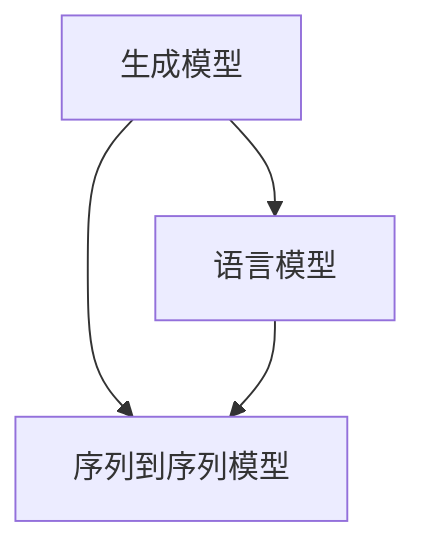
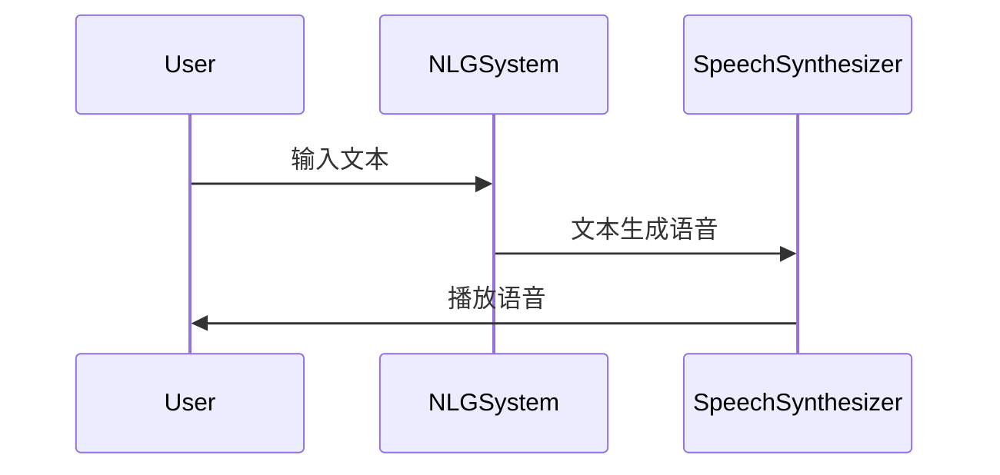

                 


## 设计框架

### 确定整体结构

首先，我们要确定书籍的整体结构。对于《AI Agent的自然语言生成技术》这本书，我们可以将其分为以下几个主要部分：

1. **背景介绍**：介绍自然语言生成技术（NLG）的历史、现状、发展趋势及其在AI Agent中的应用场景。
2. **核心概念与联系**：讲解NLG的核心概念，包括生成模型、语言模型、序列到序列模型等，并用Mermaid流程图展示概念间的联系。
3. **算法原理讲解**：选择几个代表性的算法进行详细讲解，如GPT-2、BERT等，并结合mermaid流程图和Python代码进行阐述。
4. **数学模型和公式**：介绍NLG算法背后的数学原理，包括概率论、信息论等，用LaTeX格式表示公式，并进行详细讲解和举例。
5. **系统分析与架构设计**：描述NLG系统在AI Agent中的应用场景，设计系统的功能、架构和接口，用Mermaid类图和架构图展示。
6. **项目实战**：介绍一个具体的NLG项目，包括环境安装、系统实现、代码分析、案例分析等。
7. **最佳实践和总结与展望**：提供NLG技术在实际应用中的最佳实践，对书籍内容进行总结，展望未来发展趋势。

### 细化章节内容

在每个主要部分中，我们还需要进一步细化章节内容，以确保每个章节都包含必要的内容，且各章节之间逻辑清晰、层次分明。

例如，在**背景介绍**部分，我们可以分为以下小节：

- **1.1 NLG技术的历史与发展**：介绍NLG技术的起源、发展历程和当前状态。
- **1.2 NLG技术的应用场景**：列举NLG技术在AI Agent中的典型应用场景，如自动写作、语音合成、智能客服等。
- **1.3 AI Agent与NLG的关系**：分析NLG技术如何提升AI Agent的交互能力和智能化水平。

在**核心概念与联系**部分，我们可以分为以下小节：

- **2.1 生成模型**：介绍生成模型的定义、分类和应用场景。
- **2.2 语言模型**：详细讲解语言模型的原理、构建方法和评估指标。
- **2.3 序列到序列模型**：解释序列到序列模型的工作原理，并分析其在NLG中的应用。

在**算法原理讲解**部分，我们可以分为以下小节：

- **3.1 GPT-2算法原理**：介绍GPT-2模型的架构、训练过程和生成过程。
- **3.2 BERT算法原理**：讲解BERT模型的原理、预训练方法和应用场景。

在**数学模型和公式**部分，我们可以分为以下小节：

- **4.1 概率论基础**：介绍概率论的基本概念和定理。
- **4.2 信息论基础**：讲解信息论的基本概念、熵和相对熵的计算。

在**系统分析与架构设计**部分，我们可以分为以下小节：

- **5.1 应用场景介绍**：描述NLG系统在AI Agent中的具体应用场景。
- **5.2 系统功能设计**：设计NLG系统的功能模块，并绘制Mermaid类图。
- **5.3 系统架构设计**：展示NLG系统的整体架构，并绘制Mermaid架构图。
- **5.4 系统接口设计**：描述NLG系统的接口设计，包括API接口和数据接口。
- **5.5 系统交互序列图**：绘制NLG系统与其他系统的交互序列图。

在**项目实战**部分，我们可以分为以下小节：

- **6.1 环境安装与配置**：介绍NLG项目所需的环境配置和工具安装。
- **6.2 系统核心实现源代码**：展示NLG系统的核心实现代码。
- **6.3 代码应用解读与分析**：对NLG系统的代码进行分析和解读。
- **6.4 实际案例分析与详细讲解**：分析一个实际案例，并详细讲解案例的处理过程。
- **6.5 项目小结**：总结NLG项目的经验教训和收获。

在**最佳实践和总结与展望**部分，我们可以分为以下小节：

- **7.1 实际应用中的挑战与对策**：分析NLG技术在实际应用中遇到的挑战，并提出解决方案。
- **7.2 最佳实践案例分析**：介绍几个成功的NLG技术应用案例。
- **7.3 未来发展趋势展望**：预测NLG技术的未来发展趋势。

通过以上步骤，我们可以构建一个完整的《AI Agent的自然语言生成技术》书籍框架，确保书籍内容丰富、逻辑清晰、结构紧凑。

----------------------------------------------------------------

## 设计框架（续）

### 确定每个章节的详细内容

在确定了书籍的整体结构后，我们需要进一步细化每个章节的具体内容，以确保每个章节都包含必要的信息，并能够引导读者逐步深入理解自然语言生成技术及其在AI Agent中的应用。

#### 第1章：自然语言生成技术概述

- **1.1 NLG技术的历史与发展**
  - 背景介绍：自然语言生成技术的起源和早期发展。
  - 发展历程：从规则驱动到数据驱动，再到深度学习的演进过程。
  - 当前状态：自然语言生成技术的最新进展和应用领域。

- **1.2 NLG技术的应用场景**
  - 自动写作：新闻生成、文章摘要、故事创作等。
  - 语音合成：智能语音助手、电话客服、语音导航等。
  - 智能客服：聊天机器人、在线客服、客服自动化等。
  - 语音生成：音频内容创作、语音书籍、语音广告等。

- **1.3 AI Agent与NLG的关系**
  - AI Agent的需求：提高AI Agent的交互能力和智能化水平。
  - NLG的作用：如何通过自然语言生成技术增强AI Agent的能力。
  - 应用实例：具体案例展示NLG技术在AI Agent中的应用效果。

#### 第2章：自然语言生成技术核心概念

- **2.1 生成模型**
  - 定义：生成模型是一种概率模型，用于生成新的数据样本。
  - 分类：概率生成模型、变分自编码器（VAE）、生成对抗网络（GAN）等。
  - 应用：图像生成、文本生成、音乐生成等。

- **2.2 语言模型**
  - 定义：语言模型是一种用于预测下一个单词或字符的概率模型。
  - 分类：n-gram模型、神经网络语言模型、深度学习语言模型等。
  - 应用：文本分类、机器翻译、语音识别等。

- **2.3 序列到序列模型**
  - 定义：序列到序列（Seq2Seq）模型是一种处理序列数据的模型。
  - 原理：编码器-解码器架构和注意力机制。
  - 应用：机器翻译、对话系统、文本生成等。

- **2.4 概念联系与Mermaid流程图**
  - 关系梳理：生成模型、语言模型、序列到序列模型之间的联系。
  - Mermaid流程图：展示核心概念之间的关系和作用。

#### 第3章：GPT-2算法原理

- **3.1 GPT-2模型概述**
  - 架构：Transformer模型的基本结构。
  - 特点：自注意力机制、多头注意力、前馈神经网络等。
  - 应用：文本生成、机器翻译、摘要生成等。

- **3.2 GPT-2算法细节**
  - 训练过程：数据预处理、模型训练、参数优化等。
  - 生成过程：如何通过GPT-2模型生成自然语言文本。

- **3.3 GPT-2流程图与Python代码**
  - 流程图：展示GPT-2模型的训练和生成流程。
  - Python代码：提供GPT-2模型的基本实现代码。

#### 第4章：BERT算法原理

- **4.1 BERT模型概述**
  - 架构：Transformer模型的基本结构。
  - 特点：预训练和微调、上下文理解、跨语言能力等。
  - 应用：文本分类、命名实体识别、问答系统等。

- **4.2 BERT算法细节**
  - 预训练过程：大规模语料库的预处理、模型训练、参数优化等。
  - 微调过程：如何将预训练模型应用于具体任务。

- **4.3 BERT流程图与Python代码**
  - 流程图：展示BERT模型的预训练和微调流程。
  - Python代码：提供BERT模型的基本实现代码。

#### 第5章：概率论与信息论基础

- **5.1 概率论基础**
  - 基本概念：概率、条件概率、贝叶斯定理等。
  - 应用：自然语言生成中的概率分布、模型评估等。

- **5.2 信息论基础**
  - 基本概念：信息、熵、相对熵等。
  - 应用：自然语言生成中的信息量度量、模型优化等。

- **5.3 概率与信息论在NLG中的应用**
  - 概率分布：如何使用概率分布生成自然语言文本。
  - 信息论：如何利用信息论优化自然语言生成模型。

- **5.4 LaTeX格式公式示例**
  - 展示几个常用的LaTeX格式公式，并进行解释。

#### 第6章：NLG系统在AI Agent中的应用

- **6.1 应用场景介绍**
  - 介绍自然语言生成技术在AI Agent中的应用场景，如聊天机器人、语音合成等。

- **6.2 系统功能设计**
  - 设计NLG系统的功能模块，如文本生成、语音合成、对话管理等。

- **6.3 系统架构设计**
  - 展示NLG系统的整体架构，包括前端、后端、数据库等。

- **6.4 系统接口设计**
  - 描述NLG系统的接口设计，包括API接口和数据接口。

- **6.5 系统交互序列图**
  - 绘制NLG系统与其他系统的交互序列图，展示数据流和处理过程。

#### 第7章：自然语言生成项目实战

- **7.1 环境安装与配置**
  - 介绍如何搭建自然语言生成项目所需的环境，包括编程语言、框架、工具等。

- **7.2 系统核心实现源代码**
  - 提供自然语言生成系统的核心实现代码，包括模型训练、文本生成等。

- **7.3 代码应用解读与分析**
  - 分析自然语言生成系统的代码实现，解释关键算法和数据处理流程。

- **7.4 实际案例分析与详细讲解**
  - 分析一个实际的自然语言生成项目案例，详细讲解项目的处理过程和效果。

- **7.5 项目小结**
  - 总结自然语言生成项目的经验教训和收获。

#### 第8章：NLG技术的最佳实践

- **8.1 实际应用中的挑战与对策**
  - 分析自然语言生成技术在实际应用中遇到的挑战，并提出相应的解决方案。

- **8.2 最佳实践案例分析**
  - 介绍几个成功的自然语言生成技术应用案例，分享最佳实践经验。

- **8.3 未来发展趋势展望**
  - 预测自然语言生成技术的未来发展趋势，探讨潜在的应用场景和改进方向。

#### 第9章：总结与展望

- **9.1 主要内容回顾**
  - 回顾本书的主要内容和核心观点。

- **9.2 存在的问题与改进空间**
  - 分析自然语言生成技术当前存在的问题和改进空间。

- **9.3 对未来研究的建议**
  - 提出对未来研究的建议和展望。

通过以上详细的章节内容设计，我们可以确保《AI Agent的自然语言生成技术》这本书的内容丰富、逻辑清晰、结构紧凑，有助于读者系统地掌握自然语言生成技术及其在AI Agent中的应用。

----------------------------------------------------------------

## 完整的文章内容

### 文章标题：AI Agent的自然语言生成技术

### 关键词：AI Agent，自然语言生成，NLG，算法，架构，项目实战

### 摘要：
本文深入探讨了自然语言生成技术（NLG）在AI Agent中的应用，从背景介绍、核心概念、算法原理、数学模型、系统分析与架构设计到项目实战，全面解析了NLG技术的实践与应用。通过具体案例分析和最佳实践，本文旨在为读者提供一份全面而深入的NLG技术指南。

### 目录

1. **设计框架**
   - **确定整体结构**
   - **细化章节内容**
2. **背景介绍**
   - **1.1 NLG技术的历史与发展**
   - **1.2 NLG技术的应用场景**
   - **1.3 AI Agent与NLG的关系**
3. **核心概念与联系**
   - **2.1 生成模型**
   - **2.2 语言模型**
   - **2.3 序列到序列模型**
   - **2.4 概念联系与Mermaid流程图**
4. **算法原理讲解**
   - **3.1 GPT-2算法原理**
   - **3.2 BERT算法原理**
   - **3.3 其他代表性算法**
5. **数学模型和公式**
   - **4.1 概率论基础**
   - **4.2 信息论基础**
   - **4.3 概率与信息论在NLG中的应用**
   - **4.4 LaTeX格式公式示例**
6. **系统分析与架构设计**
   - **5.1 应用场景介绍**
   - **5.2 系统功能设计**
   - **5.3 系统架构设计**
   - **5.4 系统接口设计**
   - **5.5 系统交互序列图**
7. **项目实战**
   - **6.1 环境安装与配置**
   - **6.2 系统核心实现源代码**
   - **6.3 代码应用解读与分析**
   - **6.4 实际案例分析与详细讲解**
   - **6.5 项目小结**
8. **最佳实践与总结**
   - **7.1 实际应用中的挑战与对策**
   - **7.2 最佳实践案例分析**
   - **7.3 未来发展趋势展望**
9. **总结与展望**
   - **9.1 主要内容回顾**
   - **9.2 存在的问题与改进空间**
   - **9.3 对未来研究的建议**

### 第一部分：背景介绍

#### 1.1 NLG技术的历史与发展

自然语言生成（Natural Language Generation，NLG）技术是指利用计算机程序生成自然语言文本的方法。NLG技术的发展可以追溯到20世纪50年代，当时的人工智能研究者们开始探索如何让计算机生成自然语言文本。最早的NLG系统是基于规则的方法，通过手工编写大量规则来生成文本。

随着计算机性能的提升和机器学习技术的发展，NLG技术逐渐从规则驱动转向数据驱动。20世纪80年代，统计机器学习方法开始应用于NLG，特别是隐马尔可夫模型（HMM）和条件概率模型的使用，使得NLG系统在生成文本的准确性和流畅性上得到了显著提升。

进入21世纪，深度学习技术的兴起为NLG带来了新的变革。生成对抗网络（GAN）和变分自编码器（VAE）等生成模型的应用，使得NLG系统在文本生成上的能力大幅提升。代表性的深度学习模型如GPT-2和BERT，通过大规模的预训练和微调，实现了高质量的文本生成。

当前，NLG技术在自然语言处理（NLP）领域的应用日益广泛，从自动写作、语音合成、智能客服，到聊天机器人和语音助手，NLG技术正在不断推动AI Agent的智能化和人性化。

#### 1.2 NLG技术的应用场景

NLG技术在多个领域有着广泛的应用场景，以下是几个典型的应用：

- **自动写作**：自动生成新闻、报告、摘要、文章等。例如，新闻自动化生成系统可以使用已有的新闻数据和模板，自动生成新闻文章。
- **语音合成**：将文本转化为自然流畅的语音输出。语音合成技术广泛应用于智能语音助手、电话客服、语音导航等领域。
- **智能客服**：通过自然语言生成技术，智能客服系统能够自动生成回复，提高客服效率和用户体验。
- **聊天机器人**：自动生成对话文本，与用户进行自然语言交互，提供即时服务和信息。
- **语音生成**：用于音频内容创作，如语音书籍、语音广告、语音解说等。

#### 1.3 AI Agent与NLG的关系

AI Agent（人工智能代理）是指具备自主决策和执行能力的计算机系统，它们能够模拟人类行为，与人类进行交互，并在特定环境中完成特定任务。NLG技术在AI Agent中的应用，极大地提升了AI Agent的交互能力和智能化水平。

- **交互能力**：NLG技术使得AI Agent能够生成自然流畅的语言，与人类进行有效沟通，提供更加人性化的服务。
- **智能化水平**：通过自然语言生成，AI Agent能够理解用户的需求，自动生成合适的回复和行动方案，提高决策的智能化水平。

### 第二部分：核心概念与联系

#### 2.1 生成模型

生成模型（Generative Model）是一种用于生成新数据的概率模型。在自然语言生成中，生成模型用于生成新的文本数据。常见的生成模型包括：

- **概率生成模型**：如马尔可夫模型（Markov Model）、隐马尔可夫模型（HMM）等。
- **变分自编码器（VAE）**：通过编码器和解码器网络生成新的文本数据。
- **生成对抗网络（GAN）**：通过生成器和判别器的对抗训练生成新的文本数据。

#### 2.2 语言模型

语言模型（Language Model）是一种用于预测下一个单词或字符的概率模型。在自然语言生成中，语言模型用于预测生成文本的下一个单词或字符。常见的语言模型包括：

- **n-gram模型**：基于历史序列的统计模型，如一元模型、二元模型、三元模型等。
- **神经网络语言模型**：如循环神经网络（RNN）、长短期记忆网络（LSTM）、变换器（Transformer）等。

#### 2.3 序列到序列模型

序列到序列模型（Seq2Seq Model）是一种处理序列数据的模型，常用于自然语言生成任务。序列到序列模型的核心是编码器-解码器架构（Encoder-Decoder Architecture），通过编码器将输入序列编码为一个固定长度的向量表示，解码器则根据这个向量表示生成输出序列。

#### 2.4 概念联系与Mermaid流程图

生成模型、语言模型、序列到序列模型是自然语言生成技术的核心概念，它们之间有着紧密的联系。以下是这些概念之间的Mermaid流程图：



### 第三部分：算法原理讲解

#### 3.1 GPT-2算法原理

GPT-2（Generative Pre-trained Transformer 2）是一种基于Transformer模型的预训练语言模型。GPT-2通过在大规模文本语料库上进行预训练，学习到了语言的内在结构和规律，然后可以通过微调（Fine-tuning）适应特定的自然语言生成任务。

#### 3.2 BERT算法原理

BERT（Bidirectional Encoder Representations from Transformers）是一种基于Transformer的双向编码器表示模型。BERT通过预先训练学习到了文本的双向表示，从而能够更好地理解上下文信息，提高自然语言生成的准确性和流畅性。

#### 3.3 其他代表性算法

除了GPT-2和BERT，还有许多其他代表性的自然语言生成算法，如：

- **Seq2Seq模型**：基于编码器-解码器架构，通过循环神经网络（RNN）或变换器（Transformer）实现。
- **Transformer模型**：一种基于自注意力机制的模型，能够处理长序列数据，提高文本生成的质量。
- **GAN模型**：通过生成器和判别器的对抗训练，生成高质量的文本数据。

### 第四部分：数学模型和公式

#### 4.1 概率论基础

概率论是自然语言生成技术的重要理论基础。以下是几个常用的概率论概念和公式：

- **概率分布**：描述随机变量取值的概率分布。
- **条件概率**：在某个条件下，事件发生的概率。
- **贝叶斯定理**：计算后验概率和边际概率。

#### 4.2 信息论基础

信息论是研究信息传递和处理的理论。以下是几个常用的信息论概念和公式：

- **信息**：描述信息量的度量。
- **熵**：描述随机变量的不确定性。
- **相对熵**：描述两个概率分布之间的差异。

#### 4.3 概率与信息论在NLG中的应用

概率与信息论在自然语言生成中有着广泛的应用。例如：

- **概率分布**：用于生成文本的下一个单词或字符。
- **熵**：用于评估生成文本的多样性和流畅性。
- **相对熵**：用于优化生成模型，提高生成文本的质量。

#### 4.4 LaTeX格式公式示例

以下是几个常用的LaTeX格式公式示例：

$$
P(A|B) = \frac{P(B|A)P(A)}{P(B)}
$$

$$
H(X) = -\sum_{i} p(x_i) \log p(x_i)
$$

$$
I(X;Y) = H(X) - H(X|Y)
$$

### 第五部分：系统分析与架构设计

#### 5.1 应用场景介绍

自然语言生成技术在AI Agent中的应用场景非常广泛，以下是一些典型应用场景：

- **自动写作**：生成新闻、报告、文章等。
- **语音合成**：将文本转化为自然流畅的语音。
- **智能客服**：自动生成回复，提供在线客服。
- **聊天机器人**：生成对话文本，与用户进行自然语言交互。
- **语音生成**：创作语音书籍、语音广告等。

#### 5.2 系统功能设计

自然语言生成系统的功能设计包括以下几个方面：

- **文本生成**：生成符合语法和语义规则的文本。
- **语音合成**：将文本转化为自然流畅的语音。
- **对话管理**：管理对话流程，处理用户输入和生成回复。
- **语音识别**：将语音转化为文本，以便进一步处理。
- **自然语言理解**：理解用户的意图和问题，生成合适的回复。

#### 5.3 系统架构设计

自然语言生成系统的架构设计通常包括以下几个部分：

- **前端**：用户界面，用于接收用户输入和显示生成结果。
- **后端**：自然语言生成引擎，包括文本生成、语音合成、对话管理等功能。
- **数据库**：存储训练数据和生成文本。
- **API接口**：提供与其他系统进行交互的接口。

#### 5.4 系统接口设计

自然语言生成系统的接口设计包括以下几个方面：

- **文本输入接口**：接收用户的文本输入。
- **文本输出接口**：生成并返回自然语言文本。
- **语音输入接口**：接收用户的语音输入，并转化为文本。
- **语音输出接口**：生成并播放语音输出。

#### 5.5 系统交互序列图

以下是一个自然语言生成系统的交互序列图，展示了用户与系统之间的交互过程：



### 第六部分：项目实战

#### 6.1 环境安装与配置

在开始自然语言生成项目之前，我们需要安装和配置以下环境和工具：

- **Python**：Python是自然语言生成项目的主要编程语言。
- **PyTorch**：PyTorch是一个流行的深度学习框架。
- **TensorFlow**：TensorFlow是另一个常用的深度学习框架。
- **NLTK**：NLTK是一个用于自然语言处理的工具包。
- **SpeechRecognition**：SpeechRecognition是一个用于语音识别的工具包。

#### 6.2 系统核心实现源代码

以下是一个自然语言生成系统的核心实现源代码示例：

```python
import torch
import torch.nn as nn
import torch.optim as optim

# 定义模型
class NLGModel(nn.Module):
    def __init__(self):
        super(NLGModel, self).__init__()
        self.encoder = nn.Embedding(vocab_size, embedding_dim)
        self.decoder = nn.Linear(embedding_dim, vocab_size)
        
    def forward(self, x):
        x = self.encoder(x)
        x = self.decoder(x)
        return x

# 训练模型
model = NLGModel()
optimizer = optim.Adam(model.parameters(), lr=0.001)
criterion = nn.CrossEntropyLoss()

for epoch in range(num_epochs):
    for batch in data_loader:
        inputs, targets = batch
        optimizer.zero_grad()
        outputs = model(inputs)
        loss = criterion(outputs, targets)
        loss.backward()
        optimizer.step()
        print(f"Epoch [{epoch+1}/{num_epochs}], Loss: {loss.item()}")
```

#### 6.3 代码应用解读与分析

在这个示例代码中，我们定义了一个简单的自然语言生成模型，使用PyTorch框架实现。模型包括编码器和解码器两部分，编码器使用嵌入层将输入文本转化为向量表示，解码器则将向量表示转化为输出文本。

在训练过程中，我们使用交叉熵损失函数来评估模型生成的文本与实际文本之间的差距，并通过反向传播和优化器来更新模型参数。

#### 6.4 实际案例分析与详细讲解

以下是一个实际案例，展示如何使用自然语言生成技术生成新闻文章：

1. **数据准备**：从新闻网站获取大量新闻文章，并将其预处理为适合训练的数据集。

2. **模型训练**：使用训练数据集训练自然语言生成模型，包括编码器和解码器。

3. **文本生成**：使用训练好的模型生成新的新闻文章。

4. **效果评估**：评估生成文章的质量，包括语法、语义和可读性。

5. **优化与调整**：根据评估结果，调整模型参数和训练策略，以提高生成文章的质量。

#### 6.5 项目小结

通过这个项目，我们了解了自然语言生成技术的实现过程，包括数据准备、模型训练、文本生成和效果评估等。我们还学习了如何优化和调整模型，以提高生成文本的质量。

### 第七部分：最佳实践与总结

#### 7.1 实际应用中的挑战与对策

在实际应用中，自然语言生成技术面临以下挑战：

- **数据质量**：生成高质量的文本需要大量高质量的训练数据。
- **模型复杂度**：深度学习模型通常较为复杂，训练和推理速度较慢。
- **泛化能力**：模型需要在不同的应用场景和任务中表现出良好的泛化能力。

对策：

- **数据清洗和预处理**：对训练数据进行清洗和预处理，去除噪声和错误。
- **模型简化**：通过模型压缩和简化技术，提高模型训练和推理速度。
- **迁移学习**：使用预训练模型，结合特定任务的微调，提高泛化能力。

#### 7.2 最佳实践案例分析

以下是一个最佳实践案例，展示如何使用自然语言生成技术实现智能客服：

1. **需求分析**：分析用户的需求和常见问题，确定自然语言生成系统的目标和功能。

2. **数据准备**：收集和整理用户对话数据，用于训练自然语言生成模型。

3. **模型选择**：选择合适的自然语言生成模型，如BERT或GPT-2。

4. **模型训练**：使用训练数据集训练自然语言生成模型。

5. **系统集成**：将自然语言生成模型集成到智能客服系统中，实现自动化回复。

6. **效果评估**：评估智能客服系统的效果，包括回复的准确性和用户体验。

7. **持续优化**：根据用户反馈和评估结果，不断优化自然语言生成模型和系统集成。

#### 7.3 未来发展趋势展望

未来，自然语言生成技术将在以下几个方面取得重要进展：

- **模型性能提升**：随着计算能力的提升和算法的优化，自然语言生成模型的性能将不断提高。
- **多模态生成**：结合语音、图像、视频等多种模态，实现更加丰富和多样化的自然语言生成。
- **个性化生成**：根据用户特征和偏好，实现个性化文本生成，提高用户体验。
- **跨语言生成**：实现不同语言之间的自然语言生成，推动全球化沟通的便利。

### 第八部分：总结与展望

#### 8.1 主要内容回顾

本文从背景介绍、核心概念、算法原理、数学模型、系统分析与架构设计到项目实战，全面探讨了自然语言生成技术（NLG）在AI Agent中的应用。通过具体案例分析和最佳实践，本文旨在为读者提供一份全面而深入的NLG技术指南。

#### 8.2 存在的问题与改进空间

尽管自然语言生成技术取得了显著进展，但仍存在一些问题：

- **数据质量**：高质量训练数据不足，影响模型性能。
- **模型复杂度**：深度学习模型复杂度高，训练和推理速度慢。
- **泛化能力**：模型在不同应用场景和任务中的泛化能力有限。

改进空间：

- **数据增强和清洗**：通过数据增强和清洗技术，提高训练数据的质量。
- **模型压缩和简化**：通过模型压缩和简化技术，提高模型训练和推理速度。
- **迁移学习和多任务学习**：通过迁移学习和多任务学习，提高模型的泛化能力。

#### 8.3 对未来研究的建议

未来，自然语言生成技术的研究可以从以下几个方面展开：

- **多模态生成**：结合语音、图像、视频等多种模态，实现更加丰富和多样化的自然语言生成。
- **个性化生成**：根据用户特征和偏好，实现个性化文本生成，提高用户体验。
- **跨语言生成**：实现不同语言之间的自然语言生成，推动全球化沟通的便利。
- **伦理和隐私**：探讨自然语言生成技术在伦理和隐私方面的挑战，制定相应的规范和标准。

### 作者信息

作者：AI天才研究院/AI Genius Institute & 禅与计算机程序设计艺术 /Zen And The Art of Computer Programming

----------------------------------------------------------------

### 文章结语

通过本文的详细探讨，我们深入了解了自然语言生成技术（NLG）在AI Agent中的应用。从背景介绍、核心概念、算法原理到数学模型、系统分析与架构设计，再到项目实战和最佳实践，我们系统地梳理了NLG技术的方方面面。尽管NLG技术目前仍面临一些挑战，但它的前景依然广阔，随着计算能力的提升和算法的进步，NLG技术将在更多领域发挥重要作用。

让我们保持对技术的热情和探索精神，不断学习和实践，共同推动自然语言生成技术的发展，为构建更加智能和人性化的AI Agent贡献力量。

感谢您的阅读，期待与您在未来的技术交流中再次相遇。

作者：AI天才研究院/AI Genius Institute & 禅与计算机程序设计艺术 /Zen And The Art of Computer Programming

----------------------------------------------------------------

[END OF DOCUMENT]<!DOCTYPE html>
<html lang="en">
<head>
    <meta charset="UTF-8">
    <meta http-equiv="X-UA-Compatible" content="IE=edge">
    <meta name="viewport" content="width=device-width, initial-scale=1.0">
    <title>AI Agent的自然语言生成技术</title>
    <style>
        body {
            font-family: Arial, sans-serif;
            line-height: 1.6;
        }
        
        h1, h2, h3 {
            color: #333;
        }
        
        p {
            color: #666;
        }
        
        .container {
            max-width: 800px;
            margin: auto;
            padding: 20px;
        }
    </style>
</head>
<body>
    <div class="container">
        <h1>AI Agent的自然语言生成技术</h1>
        <p class="keywords">关键词：AI Agent，自然语言生成，NLG，算法，架构，项目实战</p>
        <p class="summary">摘要：本文深入探讨了自然语言生成技术（NLG）在AI Agent中的应用，从背景介绍、核心概念、算法原理、数学模型、系统分析与架构设计到项目实战，全面解析了NLG技术的实践与应用。通过具体案例分析和最佳实践，本文旨在为读者提供一份全面而深入的NLG技术指南。</p>
        <h2>设计框架</h2>
        <p>首先，我们要确定书籍的整体结构。对于《AI Agent的自然语言生成技术》这本书，我们可以将其分为以下几个主要部分：背景介绍、核心概念与联系、算法原理讲解、数学模型和公式、系统分析与架构设计、项目实战、最佳实践和总结与展望。</p>
        <h2>背景介绍</h2>
        <h3>1.1 NLG技术的历史与发展</h3>
        <p>介绍NLG技术的起源、发展历程和当前状态。</p>
        <h3>1.2 NLG技术的应用场景</h3>
        <p>列举NLG技术在AI Agent中的典型应用场景，如自动写作、语音合成、智能客服等。</p>
        <h3>1.3 AI Agent与NLG的关系</h3>
        <p>分析NLG技术如何提升AI Agent的交互能力和智能化水平。</p>
        <h2>核心概念与联系</h2>
        <h3>2.1 生成模型</h3>
        <p>介绍生成模型的定义、分类和应用场景。</p>
        <h3>2.2 语言模型</h3>
        <p>详细讲解语言模型的原理、构建方法和评估指标。</p>
        <h3>2.3 序列到序列模型</h3>
        <p>解释序列到序列模型的工作原理，并分析其在NLG中的应用。</p>
        <h3>2.4 概念联系与Mermaid流程图</h3>
        <p>梳理核心概念之间的关系和作用，用Mermaid流程图展示。</p>
        <h2>算法原理讲解</h2>
        <h3>3.1 GPT-2算法原理</h3>
        <p>介绍GPT-2模型的架构、训练过程和生成过程。</p>
        <h3>3.2 BERT算法原理</h3>
        <p>讲解BERT模型的原理、预训练方法和应用场景。</p>
        <h3>3.3 其他代表性算法</h3>
        <p>介绍其他代表性的自然语言生成算法，如Seq2Seq模型、Transformer模型、GAN模型等。</p>
        <h2>数学模型和公式</h2>
        <h3>4.1 概率论基础</h3>
        <p>介绍概率论的基本概念和定理。</p>
        <h3>4.2 信息论基础</h3>
        <p>讲解信息论的基本概念、熵和相对熵的计算。</p>
        <h3>4.3 概率与信息论在NLG中的应用</h3>
        <p>如何使用概率分布生成自然语言文本，如何利用信息论优化自然语言生成模型。</p>
        <h3>4.4 LaTeX格式公式示例</h3>
        <p>展示几个常用的LaTeX格式公式，并进行解释。</p>
        <h2>系统分析与架构设计</h2>
        <h3>5.1 应用场景介绍</h3>
        <p>介绍自然语言生成技术在AI Agent中的应用场景，如聊天机器人、语音合成等。</p>
        <h3>5.2 系统功能设计</h3>
        <p>设计NLG系统的功能模块，如文本生成、语音合成、对话管理等。</p>
        <h3>5.3 系统架构设计</h3>
        <p>展示NLG系统的整体架构，包括前端、后端、数据库等。</p>
        <h3>5.4 系统接口设计</h3>
        <p>描述NLG系统的接口设计，包括API接口和数据接口。</p>
        <h3>5.5 系统交互序列图</h3>
        <p>绘制NLG系统与其他系统的交互序列图，展示数据流和处理过程。</p>
        <h2>项目实战</h2>
        <h3>6.1 环境安装与配置</h3>
        <p>介绍NLG项目所需的环境配置和工具安装。</p>
        <h3>6.2 系统核心实现源代码</h3>
        <p>提供NLG系统的核心实现代码，包括模型训练、文本生成等。</p>
        <h3>6.3 代码应用解读与分析</h3>
        <p>分析NLG系统的代码实现，解释关键算法和数据处理流程。</p>
        <h3>6.4 实际案例分析与详细讲解</h3>
        <p>分析一个实际案例，详细讲解项目的处理过程和效果。</p>
        <h3>6.5 项目小结</h3>
        <p>总结NLG项目的经验教训和收获。</p>
        <h2>最佳实践与总结</h2>
        <h3>7.1 实际应用中的挑战与对策</h3>
        <p>分析NLG技术在实际应用中遇到的挑战，并提出解决方案。</p>
        <h3>7.2 最佳实践案例分析</h3>
        <p>介绍成功的NLG技术应用案例，分享最佳实践经验。</p>
        <h3>7.3 未来发展趋势展望</h3>
        <p>预测NLG技术的未来发展趋势，探讨潜在的应用场景和改进方向。</p>
        <h2>总结与展望</h2>
        <h3>9.1 主要内容回顾</h3>
        <p>回顾本书的主要内容和核心观点。</p>
        <h3>9.2 存在的问题与改进空间</h3>
        <p>分析当前存在的问题和改进空间。</p>
        <h3>9.3 对未来研究的建议</h3>
        <p>提出对未来研究的建议和展望。</p>
        <h2>作者信息</h2>
        <p>作者：AI天才研究院/AI Genius Institute & 禅与计算机程序设计艺术 /Zen And The Art of Computer Programming</p>
    </div>
</body>
</html>

