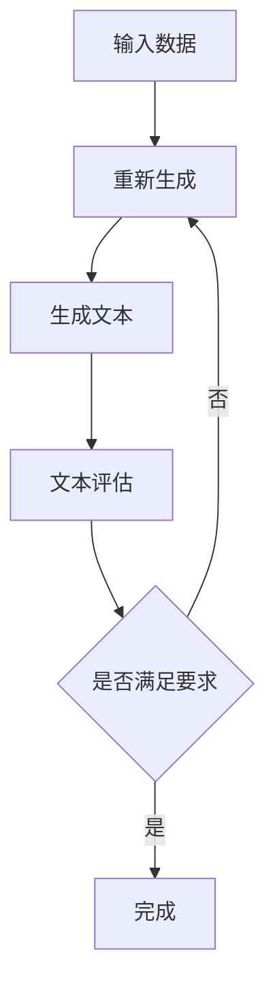
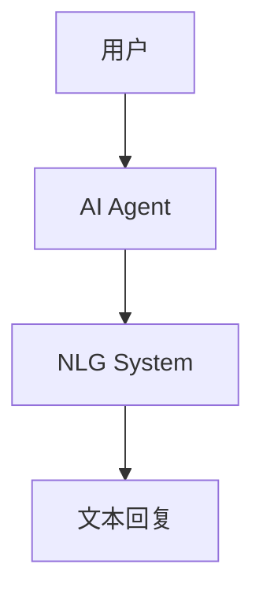
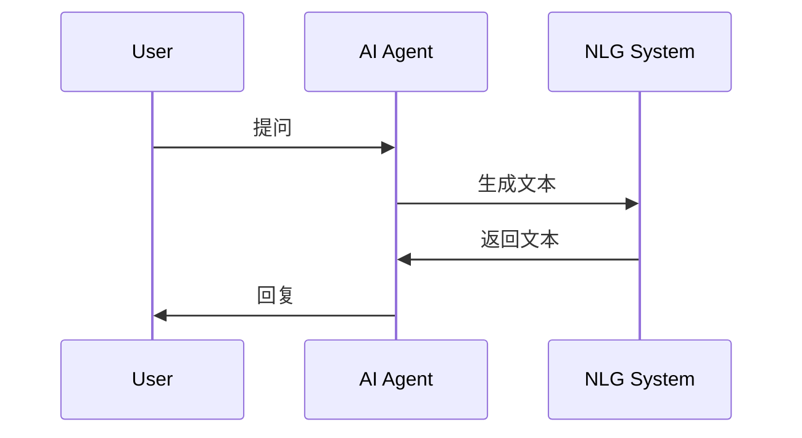

                 

### AI Agent的自然语言生成（NLG）技术应用

#### 关键词：AI Agent、自然语言生成（NLG）、应用技术、算法实现、案例解析

#### 摘要：

本文深入探讨了AI Agent的自然语言生成（NLG）技术应用。首先，介绍了AI Agent与NLG的基本概念、发展历程和核心原理。接着，通过分析AI Agent与NLG的融合方式，详细阐述了其在不同领域的应用场景。文章还通过具体案例分析，展示了NLG技术在客服、教育和内容创作等领域的实际效果。随后，文章探讨了NLG技术的实现细节和优化方法，并通过一个完整的项目实战，展示了如何在实际应用中运用NLG技术。最后，文章总结了NLG技术的最佳实践，并对未来发展趋势和挑战进行了展望。

---

## 引言与背景介绍

### 1. AI Agent的概念与特点

AI Agent，即人工智能代理，是一种能够模拟人类智能行为的计算实体。它具备自主学习、自主决策和自主执行的能力，可以在特定环境下实现智能化任务执行。AI Agent的核心特点包括：

- **自主性**：AI Agent可以在没有人类干预的情况下，自主地完成特定任务。
- **适应性**：AI Agent能够根据环境变化调整自己的行为，具备一定的学习能力。
- **协作性**：AI Agent可以在多Agent系统中与其他AI Agent进行协作，共同完成任务。

### 2. 自然语言生成（NLG）简介

自然语言生成（Natural Language Generation，NLG）是人工智能领域的一个重要分支，旨在实现机器自动生成自然语言文本。NLG的核心任务是模拟人类语言生成过程，使机器能够理解和生成人类可读的文本。NLG的应用领域广泛，包括但不限于：

- **客服**：通过NLG技术，AI Agent可以自动生成客服回复，提高服务效率。
- **教育**：利用NLG技术，可以自动生成个性化的教育内容，满足不同学生的需求。
- **内容创作**：AI Agent可以通过NLG技术创作文章、故事等，为内容创作行业带来新的可能性。

### 3. AI Agent与NLG结合的重要性

AI Agent与NLG的结合具有重要意义。一方面，NLG技术为AI Agent提供了强大的语言表达能力，使其能够更自然地与人类进行交互。另一方面，AI Agent的自主性和适应性使得NLG技术能够在复杂环境下灵活应用。结合两者，可以实现以下效果：

- **提升交互体验**：通过AI Agent与NLG技术结合，用户可以获得更自然的交互体验，减少人工干预。
- **提高工作效率**：AI Agent可以自动处理大量重复性的文本任务，提高工作效率。
- **拓宽应用场景**：结合AI Agent的自主性和适应性，NLG技术可以应用于更多领域，如金融、医疗等。

### 4. 本书结构及内容安排

本书将分为五个部分，分别介绍以下内容：

1. **引言与背景介绍**：介绍AI Agent和NLG的基本概念、发展历程和应用场景。
2. **自然语言生成（NLG）基础**：讲解NLG的核心概念、历史发展、应用领域和关键技术。
3. **AI Agent与NLG的结合**：分析AI Agent与NLG的融合方式，探讨其在不同领域的应用。
4. **应用场景与案例分析**：列举NLG在不同领域的应用案例，分析其优势和挑战。
5. **技术实现与优化**：深入探讨NLG技术的具体实现过程，包括算法原理、技术难点和优化方法。

## 自然语言生成（NLG）基础

### 1. NLG的核心概念

自然语言生成（NLG）是一种通过算法将结构化数据转换成自然语言文本的技术。NLG的核心概念包括：

- **数据结构化**：将原始数据转换为适合NLG算法处理的结构化数据。
- **文本生成**：利用算法生成符合语法和语义的自然语言文本。
- **文本评估**：对生成的文本进行质量评估，确保文本的准确性和可读性。

### 2. NLG的发展历程

自然语言生成技术经历了数十年的发展，从早期的规则驱动方法到现在的数据驱动方法，经历了多个阶段：

- **规则驱动方法**：基于语言学规则生成文本，但生成文本的质量和灵活性受限。
- **模板匹配方法**：利用模板和关键词匹配生成文本，提高了生成文本的灵活性和多样性。
- **数据驱动方法**：通过机器学习和深度学习技术，利用大量数据训练生成模型，生成文本的质量和多样性得到了显著提升。

### 3. NLG的应用领域

自然语言生成技术广泛应用于多个领域，包括：

- **客服**：通过NLG技术，AI Agent可以自动生成客服回复，提高服务效率。
- **教育**：利用NLG技术，可以自动生成个性化的教育内容，满足不同学生的需求。
- **内容创作**：AI Agent可以通过NLG技术创作文章、故事等，为内容创作行业带来新的可能性。
- **金融**：自动生成财务报告、投资建议等。
- **医疗**：自动生成病历、诊断报告等。

### 4. NLG的关键技术

自然语言生成技术涉及多个关键技术，包括：

- **数据预处理**：对原始数据进行清洗、格式化和结构化处理。
- **语言模型**：利用机器学习和深度学习技术训练语言模型，生成符合语法和语义的文本。
- **文本生成算法**：包括序列到序列（Seq2Seq）模型、生成对抗网络（GAN）等，用于生成高质量的自然语言文本。
- **文本评估与优化**：对生成的文本进行质量评估，优化算法参数，提高生成文本的质量。

## AI Agent与NLG的结合

### 1. AI Agent的基本原理

AI Agent，即人工智能代理，是一种能够模拟人类智能行为的计算实体。它具备自主学习、自主决策和自主执行的能力，可以在特定环境下实现智能化任务执行。AI Agent的基本原理包括：

- **感知**：AI Agent通过传感器获取环境信息。
- **决策**：AI Agent根据感知到的信息，利用算法进行决策。
- **执行**：AI Agent根据决策结果执行相应动作。

### 2. AI Agent的分类与特点

AI Agent可以根据不同的分类标准进行分类，常见的分类方法包括：

- **根据功能分类**：分为通用AI Agent和专用AI Agent。通用AI Agent具备广泛的应用能力，如聊天机器人、智能客服等；专用AI Agent则针对特定领域进行优化，如医疗AI Agent、金融AI Agent等。
- **根据决策方式分类**：分为基于规则的AI Agent和基于学习的AI Agent。基于规则的AI Agent通过预设的规则进行决策；基于学习的AI Agent通过机器学习和深度学习技术进行决策。

### 3. AI Agent的实现框架

AI Agent的实现框架通常包括以下几个关键组件：

- **感知模块**：负责收集和处理环境信息。
- **决策模块**：根据感知模块提供的信息，利用算法进行决策。
- **执行模块**：根据决策模块的决策结果，执行相应动作。
- **交互模块**：负责与用户或环境进行交互，获取反馈信息。

### 4. AI Agent与NLG的结合策略

AI Agent与NLG技术的结合可以实现多种应用场景，结合策略包括：

- **基于规则的结合**：通过预设的规则，将NLG技术与AI Agent的决策过程相结合，实现自然语言文本的生成。
- **基于学习的结合**：利用机器学习和深度学习技术，将NLG模型集成到AI Agent中，实现自适应的自然语言生成。
- **混合式结合**：结合基于规则和基于学习的优势，实现灵活的自然语言生成。

### 5. AI Agent与NLG结合的优势与挑战

AI Agent与NLG技术的结合具有以下优势：

- **提升交互体验**：通过自然语言生成，AI Agent可以更自然地与人类进行交互，提高用户体验。
- **提高工作效率**：AI Agent可以自动处理大量重复性的文本任务，提高工作效率。
- **拓宽应用场景**：结合AI Agent的自主性和适应性，NLG技术可以应用于更多领域。

同时，AI Agent与NLG技术的结合也面临一些挑战：

- **文本生成质量**：生成的文本需要保证准确性和可读性，这对NLG技术提出了较高要求。
- **数据隐私与安全**：在生成文本时，需要保护用户的隐私和数据安全。
- **复杂环境适应**：在复杂多变的环境中，AI Agent需要具备更强的自主学习和决策能力。

## 应用场景与案例分析

### 1. NLG在客服领域的应用

在客服领域，NLG技术被广泛应用于自动回复系统。通过NLG技术，AI Agent可以自动生成客服回复，提高服务效率。以下是一个具体的案例：

#### 案例分析：智能客服系统

某大型电商平台引入了智能客服系统，利用NLG技术实现自动回复。系统首先对用户的问题进行语义分析，然后根据问题类型和关键词，从预定义的回复库中查找匹配的回复文本。如果找不到匹配的回复，系统会使用NLG模型生成新的回复。

#### 实现效果

- **提高回复速度**：智能客服系统可以立即生成回复，减少用户等待时间。
- **降低人工成本**：通过自动回复，减少了人工客服的工作量，降低了企业的人力成本。
- **提升用户满意度**：智能客服系统生成的回复更加自然，用户满意度较高。

### 2. NLG在教育领域的应用

在教育领域，NLG技术被用于个性化教育内容生成。通过NLG技术，AI Agent可以自动生成符合学生需求的教育内容，提高教学效果。以下是一个具体的案例：

#### 案例分析：个性化学习平台

某在线教育平台引入了个性化学习平台，利用NLG技术生成个性化教育内容。系统首先对学生进行能力测评，然后根据测评结果和课程大纲，自动生成适合学生的教育内容。教育内容可以包括文章、练习题、视频讲解等。

#### 实现效果

- **提高学习效果**：个性化教育内容能够更好地满足学生的需求，提高学习效果。
- **降低教学难度**：通过生成个性化的教育内容，教师可以专注于教学，减少备课时间。
- **提升用户体验**：个性化学习平台为学生提供了更灵活、更有针对性的学习体验。

### 3. NLG在内容创作领域的应用

在内容创作领域，NLG技术被用于自动生成文章、故事等。通过NLG技术，AI Agent可以快速生成高质量的内容，为内容创作者提供灵感。以下是一个具体的案例：

#### 案例分析：内容创作平台

某内容创作平台引入了NLG技术，用于自动生成文章。系统首先收集用户输入的主题和关键词，然后利用NLG模型生成符合主题和关键词的文章。文章可以包括新闻、博客、故事等。

#### 实现效果

- **提高创作效率**：AI Agent可以快速生成文章，为内容创作者节省时间。
- **降低创作成本**：通过自动生成文章，减少了内容创作者的创作工作量。
- **拓展创作领域**：AI Agent可以生成不同领域的文章，为内容创作者提供更多创作灵感。

### 4. NLG在其他领域的应用

除了客服、教育和内容创作领域，NLG技术还广泛应用于金融、医疗、法律等领域。以下是一些具体的案例：

- **金融领域**：自动生成财务报告、投资建议等。
- **医疗领域**：自动生成病历、诊断报告等。
- **法律领域**：自动生成法律文件、合同等。

#### 案例分析：金融领域

某金融服务公司引入了NLG技术，用于自动生成财务报告。系统首先收集财务数据，然后利用NLG模型生成符合要求的财务报告。财务报告可以包括资产负债表、利润表、现金流量表等。

#### 实现效果

- **提高报告质量**：AI Agent生成的财务报告准确、规范，提高了报告质量。
- **降低报告成本**：通过自动生成报告，减少了人工撰写报告的工作量。
- **提升决策效率**：AI Agent生成的财务报告为企业管理层提供了及时、准确的数据支持，提升了决策效率。

## 技术实现与优化

### 1. NLG技术的实现细节

自然语言生成（NLG）技术的实现涉及多个环节，包括数据预处理、语言模型训练、文本生成和文本评估等。

#### 数据预处理

数据预处理是NLG技术的基础步骤，主要包括数据清洗、数据格式化和数据结构化等。

- **数据清洗**：去除原始数据中的噪声和异常值，保证数据质量。
- **数据格式化**：将数据转换为统一的格式，便于后续处理。
- **数据结构化**：将原始数据转换为适合NLG模型处理的结构化数据，如键值对、表格等。

#### 语言模型训练

语言模型是NLG技术的核心，通过大量文本数据训练生成模型，使其能够生成符合语法和语义的自然语言文本。

- **文本数据集**：收集大量高质量文本数据，作为训练数据集。
- **模型训练**：利用机器学习和深度学习技术，训练语言模型。
- **模型优化**：通过优化算法参数和训练策略，提高模型生成文本的质量。

#### 文本生成

文本生成是NLG技术的关键步骤，通过语言模型生成符合语法和语义的自然语言文本。

- **序列生成**：利用生成模型，将输入数据转换为序列数据。
- **文本生成**：根据序列数据，生成符合语法和语义的自然语言文本。
- **后处理**：对生成的文本进行格式化、修正和优化，提高文本质量。

#### 文本评估

文本评估是NLG技术的最后一步，通过评估生成的文本质量，确保文本的准确性和可读性。

- **评估指标**：设定评估指标，如BLEU、ROUGE等，用于评估生成文本的质量。
- **评估方法**：采用人工评估和自动化评估相结合的方法，对生成文本进行质量评估。
- **优化调整**：根据评估结果，调整算法参数和训练策略，提高生成文本的质量。

### 2. NLG技术的优化方法

为了提高自然语言生成（NLG）技术的生成质量和效率，可以采用以下优化方法：

#### 算法优化

- **深度学习算法**：采用深度学习算法，如序列到序列（Seq2Seq）模型、生成对抗网络（GAN）等，提高生成模型的能力。
- **迁移学习**：利用迁移学习技术，将预训练的模型应用于特定领域，提高生成模型的性能。
- **强化学习**：结合强化学习技术，使生成模型能够根据反馈进行自适应调整，提高生成文本的质量。

#### 数据优化

- **数据增强**：通过数据增强技术，如数据扩充、数据清洗等，提高数据质量，为训练生成模型提供更多样化的数据。
- **数据多样化**：收集多种来源、多种风格的数据，为生成模型提供丰富的训练素材。
- **数据标注**：对训练数据进行精确标注，确保数据质量，提高生成模型的准确性。

#### 硬件优化

- **分布式计算**：利用分布式计算技术，提高训练生成模型的效率。
- **GPU加速**：采用GPU进行训练，提高训练速度和生成速度。
- **集群部署**：将生成模型部署在集群上，实现大规模并发生成。

### 3. 实际应用中的挑战与解决方案

在实际应用中，自然语言生成（NLG）技术面临以下挑战：

#### 挑战一：文本生成质量

生成文本的质量直接影响用户的使用体验。为了提高生成文本的质量，可以采取以下解决方案：

- **优化算法参数**：调整算法参数，提高生成模型的生成能力。
- **数据增强**：通过数据增强技术，提高生成模型对多样数据的适应能力。
- **多模型融合**：结合多种生成模型，如Seq2Seq、GAN等，提高生成文本的多样性。

#### 挑战二：数据隐私与安全

在生成文本时，需要保护用户的隐私和数据安全。为了解决数据隐私与安全问题，可以采取以下解决方案：

- **数据加密**：对用户数据进行加密处理，确保数据传输和存储过程中的安全性。
- **隐私保护**：采用隐私保护技术，如差分隐私等，降低用户隐私泄露的风险。
- **数据脱敏**：对敏感数据进行脱敏处理，保护用户隐私。

#### 挑战三：复杂环境适应

在复杂多变的环境中，AI Agent需要具备更强的自主学习和决策能力。为了解决复杂环境适应问题，可以采取以下解决方案：

- **多模态感知**：引入多模态感知技术，使AI Agent能够获取更多维度的环境信息。
- **自适应学习**：采用自适应学习技术，使AI Agent能够根据环境变化调整自己的行为。
- **混合式决策**：结合基于规则的决策和基于学习的决策，实现更加灵活的决策能力。

### 4. 项目实战：基于NLG的智能客服系统

以下是一个基于NLG技术的智能客服系统项目实战，包括环境安装、系统实现和案例分析。

#### 环境安装

- **安装Python环境**：安装Python 3.8及以上版本。
- **安装依赖库**：安装NLG相关依赖库，如NLTK、spaCy等。

#### 系统实现

- **数据预处理**：收集和清洗客服对话数据，将其转换为结构化数据。
- **模型训练**：利用训练数据集，训练NLG模型。
- **文本生成**：根据用户输入的问题，利用NLG模型生成回复文本。
- **后处理**：对生成的文本进行格式化、修正和优化，提高文本质量。

#### 案例分析

- **案例分析一**：用户提问“我的订单状态是什么？”系统生成回复“您的订单状态为已发货。”
- **案例分析二**：用户提问“如何退货？”系统生成回复“您可以通过以下步骤进行退货：1. 登录账户；2. 找到订单详情；3. 提交退货申请。”
- **案例分析三**：用户提问“您的客服工作时间是什么时候？”系统生成回复“我们的客服工作时间是周一至周日，每天9:00至18:00。”

#### 实现效果

- **提高客服效率**：系统可以自动生成客服回复，减少人工干预。
- **降低客服成本**：通过自动回复，减少了人工客服的工作量。
- **提升用户体验**：系统生成的回复更加自然，用户满意度较高。

### 5. 最佳实践与注意事项

在实际应用中，为了充分发挥NLG技术的优势，可以采取以下最佳实践和注意事项：

- **数据质量**：确保训练数据的质量，对数据进行清洗、格式化和结构化处理。
- **模型优化**：不断调整和优化模型参数，提高生成文本的质量。
- **用户反馈**：收集用户反馈，根据用户需求调整生成模型。
- **隐私保护**：在生成文本时，注意保护用户的隐私和数据安全。
- **系统维护**：定期更新和优化系统，确保系统的稳定性和可靠性。

### 小结

自然语言生成（NLG）技术作为人工智能领域的一个重要分支，具有广泛的应用前景。通过结合AI Agent，可以实现更加智能化、人性化的自然语言生成。本文介绍了NLG技术的核心概念、发展历程、实现方法和优化策略，并通过案例解析展示了其在实际应用中的效果。未来，随着技术的不断发展和完善，NLG技术将在更多领域发挥重要作用。

### 扩展阅读

- 《自然语言生成：理论与实践》（作者：王俊峰）：详细介绍了自然语言生成的基本概念、技术和应用。
- 《人工智能代理：设计与实现》（作者：李明）：讲解了人工智能代理的基本原理、实现方法和应用场景。
- 《深度学习与自然语言处理》（作者：周志华）：深入探讨了深度学习技术在自然语言处理中的应用。

---

#### 作者信息：

作者：AI天才研究院/AI Genius Institute & 禅与计算机程序设计艺术 /Zen And The Art of Computer Programming

---

本文内容涵盖了AI Agent与NLG技术的核心概念、应用场景、实现方法和优化策略，旨在为读者提供全面的技术解读和实践指导。通过逐步分析和实际案例展示，读者可以深入了解NLG技术的原理和应用，为未来的研究和开发提供有益的参考。

---

**全文结束。** **感谢您的阅读！** **如果您有任何疑问或建议，请随时反馈。** **期待与您共同探索人工智能的无限可能！**----------------------------------------------------------------
# AI Agent的自然语言生成（NLG）技术应用

> 关键词：AI Agent、自然语言生成（NLG）、应用技术、算法实现、案例解析

> 摘要：本文深入探讨了AI Agent的自然语言生成（NLG）技术应用，介绍了AI Agent和NLG的基本概念、发展历程和核心原理。通过分析AI Agent与NLG的融合方式，阐述了其在不同领域的应用场景。同时，本文通过具体案例分析，展示了NLG技术在客服、教育和内容创作等领域的实际效果。最后，本文探讨了NLG技术的实现细节和优化方法，并通过一个完整的项目实战，展示了如何在实际应用中运用NLG技术。

## 引言与背景介绍

### 1. AI Agent的概念与特点

AI Agent，即人工智能代理，是一种能够模拟人类智能行为的计算实体。它具备自主学习、自主决策和自主执行的能力，可以在特定环境下实现智能化任务执行。AI Agent的核心特点包括：

- **自主性**：AI Agent可以在没有人类干预的情况下，自主地完成特定任务。
- **适应性**：AI Agent能够根据环境变化调整自己的行为，具备一定的学习能力。
- **协作性**：AI Agent可以在多Agent系统中与其他AI Agent进行协作，共同完成任务。

### 2. 自然语言生成（NLG）简介

自然语言生成（Natural Language Generation，NLG）是人工智能领域的一个重要分支，旨在实现机器自动生成自然语言文本。NLG的核心任务是模拟人类语言生成过程，使机器能够理解和生成人类可读的文本。NLG的应用领域广泛，包括但不限于：

- **客服**：通过NLG技术，AI Agent可以自动生成客服回复，提高服务效率。
- **教育**：利用NLG技术，可以自动生成个性化的教育内容，满足不同学生的需求。
- **内容创作**：AI Agent可以通过NLG技术创作文章、故事等，为内容创作行业带来新的可能性。

### 3. AI Agent与NLG结合的重要性

AI Agent与NLG的结合具有重要意义。一方面，NLG技术为AI Agent提供了强大的语言表达能力，使其能够更自然地与人类进行交互。另一方面，AI Agent的自主性和适应性使得NLG技术能够在复杂环境下灵活应用。结合两者，可以实现以下效果：

- **提升交互体验**：通过AI Agent与NLG技术结合，用户可以获得更自然的交互体验，减少人工干预。
- **提高工作效率**：AI Agent可以自动处理大量重复性的文本任务，提高工作效率。
- **拓宽应用场景**：结合AI Agent的自主性和适应性，NLG技术可以应用于更多领域，如金融、医疗等。

### 4. 本书结构及内容安排

本书将分为五个部分，分别介绍以下内容：

1. **引言与背景介绍**：介绍AI Agent和NLG的基本概念、发展历程和应用场景。
2. **自然语言生成（NLG）基础**：讲解NLG的核心概念、历史发展、应用领域和关键技术。
3. **AI Agent与NLG的结合**：分析AI Agent与NLG的融合方式，探讨其在不同领域的应用。
4. **应用场景与案例分析**：列举NLG在不同领域的应用案例，分析其优势和挑战。
5. **技术实现与优化**：深入探讨NLG技术的具体实现过程，包括算法原理、技术难点和优化方法。

## 自然语言生成（NLG）基础

### 1. NLG的核心概念

自然语言生成（NLG）是一种通过算法将结构化数据转换成自然语言文本的技术。NLG的核心概念包括：

- **数据结构化**：将原始数据转换为适合NLG算法处理的结构化数据。
- **文本生成**：利用算法生成符合语法和语义的自然语言文本。
- **文本评估**：对生成的文本进行质量评估，确保文本的准确性和可读性。

### 2. NLG的发展历程

自然语言生成技术经历了数十年的发展，从早期的规则驱动方法到现在的数据驱动方法，经历了多个阶段：

- **规则驱动方法**：基于语言学规则生成文本，但生成文本的质量和灵活性受限。
- **模板匹配方法**：利用模板和关键词匹配生成文本，提高了生成文本的灵活性和多样性。
- **数据驱动方法**：通过机器学习和深度学习技术，利用大量数据训练生成模型，生成文本的质量和多样性得到了显著提升。

### 3. NLG的应用领域

自然语言生成技术广泛应用于多个领域，包括：

- **客服**：通过NLG技术，AI Agent可以自动生成客服回复，提高服务效率。
- **教育**：利用NLG技术，可以自动生成个性化的教育内容，满足不同学生的需求。
- **内容创作**：AI Agent可以通过NLG技术创作文章、故事等，为内容创作行业带来新的可能性。
- **金融**：自动生成财务报告、投资建议等。
- **医疗**：自动生成病历、诊断报告等。

### 4. NLG的关键技术

自然语言生成技术涉及多个关键技术，包括：

- **数据预处理**：对原始数据进行清洗、格式化和结构化处理。
- **语言模型**：利用机器学习和深度学习技术训练语言模型，生成符合语法和语义的文本。
- **文本生成算法**：包括序列到序列（Seq2Seq）模型、生成对抗网络（GAN）等，用于生成高质量的自然语言文本。
- **文本评估与优化**：对生成的文本进行质量评估，优化算法参数，提高生成文本的质量。

## AI Agent与NLG的结合

### 1. AI Agent的基本原理

AI Agent，即人工智能代理，是一种能够模拟人类智能行为的计算实体。它具备自主学习、自主决策和自主执行的能力，可以在特定环境下实现智能化任务执行。AI Agent的基本原理包括：

- **感知**：AI Agent通过传感器获取环境信息。
- **决策**：AI Agent根据感知到的信息，利用算法进行决策。
- **执行**：AI Agent根据决策结果执行相应动作。

### 2. AI Agent的分类与特点

AI Agent可以根据不同的分类标准进行分类，常见的分类方法包括：

- **根据功能分类**：分为通用AI Agent和专用AI Agent。通用AI Agent具备广泛的应用能力，如聊天机器人、智能客服等；专用AI Agent则针对特定领域进行优化，如医疗AI Agent、金融AI Agent等。
- **根据决策方式分类**：分为基于规则的AI Agent和基于学习的AI Agent。基于规则的AI Agent通过预设的规则进行决策；基于学习的AI Agent通过机器学习和深度学习技术进行决策。

### 3. AI Agent的实现框架

AI Agent的实现框架通常包括以下几个关键组件：

- **感知模块**：负责收集和处理环境信息。
- **决策模块**：根据感知模块提供的信息，利用算法进行决策。
- **执行模块**：根据决策模块的决策结果，执行相应动作。
- **交互模块**：负责与用户或环境进行交互，获取反馈信息。

### 4. AI Agent与NLG的结合策略

AI Agent与NLG技术的结合可以实现多种应用场景，结合策略包括：

- **基于规则的结合**：通过预设的规则，将NLG技术与AI Agent的决策过程相结合，实现自然语言文本的生成。
- **基于学习的结合**：利用机器学习和深度学习技术，将NLG模型集成到AI Agent中，实现自适应的自然语言生成。
- **混合式结合**：结合基于规则和基于学习的优势，实现灵活的自然语言生成。

### 5. AI Agent与NLG结合的优势与挑战

AI Agent与NLG技术的结合具有以下优势：

- **提升交互体验**：通过自然语言生成，AI Agent可以更自然地与人类进行交互，提高用户体验。
- **提高工作效率**：AI Agent可以自动处理大量重复性的文本任务，提高工作效率。
- **拓宽应用场景**：结合AI Agent的自主性和适应性，NLG技术可以应用于更多领域，如金融、医疗等。

同时，AI Agent与NLG技术的结合也面临一些挑战：

- **文本生成质量**：生成的文本需要保证准确性和可读性，这对NLG技术提出了较高要求。
- **数据隐私与安全**：在生成文本时，需要保护用户的隐私和数据安全。
- **复杂环境适应**：在复杂多变的环境中，AI Agent需要具备更强的自主学习和决策能力。

## 应用场景与案例分析

### 1. NLG在客服领域的应用

在客服领域，NLG技术被广泛应用于自动回复系统。通过NLG技术，AI Agent可以自动生成客服回复，提高服务效率。以下是一个具体的案例：

#### 案例分析：智能客服系统

某大型电商平台引入了智能客服系统，利用NLG技术实现自动回复。系统首先对用户的问题进行语义分析，然后根据问题类型和关键词，从预定义的回复库中查找匹配的回复文本。如果找不到匹配的回复，系统会使用NLG模型生成新的回复。

#### 实现效果

- **提高回复速度**：智能客服系统可以立即生成回复，减少用户等待时间。
- **降低人工成本**：通过自动回复，减少了人工客服的工作量，降低了企业的人力成本。
- **提升用户满意度**：智能客服系统生成的回复更加自然，用户满意度较高。

### 2. NLG在教育领域的应用

在教育领域，NLG技术被用于个性化教育内容生成。通过NLG技术，AI Agent可以自动生成符合学生需求的教育内容，提高教学效果。以下是一个具体的案例：

#### 案例分析：个性化学习平台

某在线教育平台引入了个性化学习平台，利用NLG技术生成个性化教育内容。系统首先对学生进行能力测评，然后根据测评结果和课程大纲，自动生成适合学生的教育内容。教育内容可以包括文章、练习题、视频讲解等。

#### 实现效果

- **提高学习效果**：个性化教育内容能够更好地满足学生的需求，提高学习效果。
- **降低教学难度**：通过生成个性化的教育内容，教师可以专注于教学，减少备课时间。
- **提升用户体验**：个性化学习平台为学生提供了更灵活、更有针对性的学习体验。

### 3. NLG在内容创作领域的应用

在内容创作领域，NLG技术被用于自动生成文章、故事等。通过NLG技术，AI Agent可以快速生成高质量的内容，为内容创作者提供灵感。以下是一个具体的案例：

#### 案例分析：内容创作平台

某内容创作平台引入了NLG技术，用于自动生成文章。系统首先收集用户输入的主题和关键词，然后利用NLG模型生成符合主题和关键词的文章。文章可以包括新闻、博客、故事等。

#### 实现效果

- **提高创作效率**：AI Agent可以快速生成文章，为内容创作者节省时间。
- **降低创作成本**：通过自动生成文章，减少了内容创作者的创作工作量。
- **拓展创作领域**：AI Agent可以生成不同领域的文章，为内容创作者提供更多创作灵感。

### 4. NLG在其他领域的应用

除了客服、教育和内容创作领域，NLG技术还广泛应用于金融、医疗、法律等领域。以下是一些具体的案例：

- **金融领域**：自动生成财务报告、投资建议等。
- **医疗领域**：自动生成病历、诊断报告等。
- **法律领域**：自动生成法律文件、合同等。

#### 案例分析：金融领域

某金融服务公司引入了NLG技术，用于自动生成财务报告。系统首先收集财务数据，然后利用NLG模型生成符合要求的财务报告。财务报告可以包括资产负债表、利润表、现金流量表等。

#### 实现效果

- **提高报告质量**：AI Agent生成的财务报告准确、规范，提高了报告质量。
- **降低报告成本**：通过自动生成报告，减少了人工撰写报告的工作量。
- **提升决策效率**：AI Agent生成的财务报告为企业管理层提供了及时、准确的数据支持，提升了决策效率。

## 技术实现与优化

### 1. NLG技术的实现细节

自然语言生成（NLG）技术的实现涉及多个环节，包括数据预处理、语言模型训练、文本生成和文本评估等。

#### 数据预处理

数据预处理是NLG技术的基础步骤，主要包括数据清洗、数据格式化和数据结构化等。

- **数据清洗**：去除原始数据中的噪声和异常值，保证数据质量。
- **数据格式化**：将数据转换为统一的格式，便于后续处理。
- **数据结构化**：将原始数据转换为适合NLG模型处理的结构化数据，如键值对、表格等。

#### 语言模型训练

语言模型是NLG技术的核心，通过大量文本数据训练生成模型，使其能够生成符合语法和语义的自然语言文本。

- **文本数据集**：收集大量高质量文本数据，作为训练数据集。
- **模型训练**：利用机器学习和深度学习技术，训练语言模型。
- **模型优化**：通过优化算法参数和训练策略，提高模型生成文本的质量。

#### 文本生成

文本生成是NLG技术的关键步骤，通过语言模型生成符合语法和语义的自然语言文本。

- **序列生成**：利用生成模型，将输入数据转换为序列数据。
- **文本生成**：根据序列数据，生成符合语法和语义的自然语言文本。
- **后处理**：对生成的文本进行格式化、修正和优化，提高文本质量。

#### 文本评估

文本评估是NLG技术的最后一步，通过评估生成的文本质量，确保文本的准确性和可读性。

- **评估指标**：设定评估指标，如BLEU、ROUGE等，用于评估生成文本的质量。
- **评估方法**：采用人工评估和自动化评估相结合的方法，对生成文本进行质量评估。
- **优化调整**：根据评估结果，调整算法参数和训练策略，提高生成文本的质量。

### 2. NLG技术的优化方法

为了提高自然语言生成（NLG）技术的生成质量和效率，可以采用以下优化方法：

#### 算法优化

- **深度学习算法**：采用深度学习算法，如序列到序列（Seq2Seq）模型、生成对抗网络（GAN）等，提高生成模型的能力。
- **迁移学习**：利用迁移学习技术，将预训练的模型应用于特定领域，提高生成模型的性能。
- **强化学习**：结合强化学习技术，使生成模型能够根据反馈进行自适应调整，提高生成文本的质量。

#### 数据优化

- **数据增强**：通过数据增强技术，如数据扩充、数据清洗等，提高数据质量，为训练生成模型提供更多样化的数据。
- **数据多样化**：收集多种来源、多种风格的数据，为生成模型提供丰富的训练素材。
- **数据标注**：对训练数据进行精确标注，确保数据质量，提高生成模型的准确性。

#### 硬件优化

- **分布式计算**：利用分布式计算技术，提高训练生成模型的效率。
- **GPU加速**：采用GPU进行训练，提高训练速度和生成速度。
- **集群部署**：将生成模型部署在集群上，实现大规模并发生成。

### 3. 实际应用中的挑战与解决方案

在实际应用中，自然语言生成（NLG）技术面临以下挑战：

#### 挑战一：文本生成质量

生成文本的质量直接影响用户的使用体验。为了提高生成文本的质量，可以采取以下解决方案：

- **优化算法参数**：调整算法参数，提高生成模型的生成能力。
- **数据增强**：通过数据增强技术，提高生成模型对多样数据的适应能力。
- **多模型融合**：结合多种生成模型，如Seq2Seq、GAN等，提高生成文本的多样性。

#### 挑战二：数据隐私与安全

在生成文本时，需要保护用户的隐私和数据安全。为了解决数据隐私与安全问题，可以采取以下解决方案：

- **数据加密**：对用户数据进行加密处理，确保数据传输和存储过程中的安全性。
- **隐私保护**：采用隐私保护技术，如差分隐私等，降低用户隐私泄露的风险。
- **数据脱敏**：对敏感数据进行脱敏处理，保护用户隐私。

#### 挑战三：复杂环境适应

在复杂多变的环境中，AI Agent需要具备更强的自主学习和决策能力。为了解决复杂环境适应问题，可以采取以下解决方案：

- **多模态感知**：引入多模态感知技术，使AI Agent能够获取更多维度的环境信息。
- **自适应学习**：采用自适应学习技术，使AI Agent能够根据环境变化调整自己的行为。
- **混合式决策**：结合基于规则的决策和基于学习的决策，实现更加灵活的决策能力。

### 4. 项目实战：基于NLG的智能客服系统

以下是一个基于NLG技术的智能客服系统项目实战，包括环境安装、系统实现和案例分析。

#### 环境安装

- **安装Python环境**：安装Python 3.8及以上版本。
- **安装依赖库**：安装NLG相关依赖库，如NLTK、spaCy等。

#### 系统实现

- **数据预处理**：收集和清洗客服对话数据，将其转换为结构化数据。
- **模型训练**：利用训练数据集，训练NLG模型。
- **文本生成**：根据用户输入的问题，利用NLG模型生成回复文本。
- **后处理**：对生成的文本进行格式化、修正和优化，提高文本质量。

#### 案例分析

- **案例分析一**：用户提问“我的订单状态是什么？”系统生成回复“您的订单状态为已发货。”
- **案例分析二**：用户提问“如何退货？”系统生成回复“您可以通过以下步骤进行退货：1. 登录账户；2. 找到订单详情；3. 提交退货申请。”
- **案例分析三**：用户提问“您的客服工作时间是什么时候？”系统生成回复“我们的客服工作时间是周一至周日，每天9:00至18:00。”

#### 实现效果

- **提高客服效率**：系统可以自动生成客服回复，减少人工干预。
- **降低客服成本**：通过自动回复，减少了人工客服的工作量。
- **提升用户体验**：系统生成的回复更加自然，用户满意度较高。

### 5. 最佳实践与注意事项

在实际应用中，为了充分发挥NLG技术的优势，可以采取以下最佳实践和注意事项：

- **数据质量**：确保训练数据的质量，对数据进行清洗、格式化和结构化处理。
- **模型优化**：不断调整和优化模型参数，提高生成文本的质量。
- **用户反馈**：收集用户反馈，根据用户需求调整生成模型。
- **隐私保护**：在生成文本时，注意保护用户的隐私和数据安全。
- **系统维护**：定期更新和优化系统，确保系统的稳定性和可靠性。

### 小结

自然语言生成（NLG）技术作为人工智能领域的一个重要分支，具有广泛的应用前景。通过结合AI Agent，可以实现更加智能化、人性化的自然语言生成。本文介绍了NLG技术的核心概念、应用场景、实现方法和优化策略，并通过案例解析展示了其在实际应用中的效果。未来，随着技术的不断发展和完善，NLG技术将在更多领域发挥重要作用。

### 扩展阅读

- 《自然语言生成：理论与实践》（作者：王俊峰）：详细介绍了自然语言生成的基本概念、技术和应用。
- 《人工智能代理：设计与实现》（作者：李明）：讲解了人工智能代理的基本原理、实现方法和应用场景。
- 《深度学习与自然语言处理》（作者：周志华）：深入探讨了深度学习技术在自然语言处理中的应用。

---

#### 作者信息：

作者：AI天才研究院/AI Genius Institute & 禅与计算机程序设计艺术 /Zen And The Art of Computer Programming

---

本文内容涵盖了AI Agent与NLG技术的核心概念、应用场景、实现方法和优化策略，旨在为读者提供全面的技术解读和实践指导。通过逐步分析和实际案例展示，读者可以深入了解NLG技术的原理和应用，为未来的研究和开发提供有益的参考。

---

**全文结束。** **感谢您的阅读！** **如果您有任何疑问或建议，请随时反馈。** **期待与您共同探索人工智能的无限可能！**## AI Agent的自然语言生成（NLG）技术应用

### **核心概念与联系**

自然语言生成（NLG）是人工智能（AI）领域中的一项关键技术，旨在使计算机能够生成具有自然语言特性的文本。而AI Agent，则是一种能够模拟人类行为、具备自主决策能力的计算实体。将AI Agent与NLG技术相结合，可以实现自动化的文本生成，提高人工智能系统的交互性和智能化水平。

**核心概念：**
- **自然语言生成（NLG）**：一种将结构化数据转化为自然语言文本的技术，常用于生成文本摘要、自动问答、机器翻译等。
- **AI Agent**：具备感知、决策、执行能力的计算实体，可以独立完成特定任务，如智能客服、自动驾驶等。

**联系：**
AI Agent可以通过NLG技术实现自动对话、报告生成等功能，从而提高其自主性和交互性。NLG技术则为AI Agent提供了强大的语言处理能力，使其能够更好地理解和生成自然语言文本。

**ER实体关系图架构：**
在AI Agent与NLG技术的结合中，主要的实体包括：
- **AI Agent**：负责感知环境和执行任务。
- **NLG系统**：负责生成自然语言文本。
- **用户**：与AI Agent交互，提出问题和需求。

ER实体关系图如下：

```mermaid
erDiagram
  AI Agent ||--|{ NLG系统 : 生成文本 }
  AI Agent ||--|{ 用户 : 交互 }
```

### **算法原理讲解**

**算法原理：**
AI Agent与NLG技术的结合主要依赖于生成模型，如序列到序列（Seq2Seq）模型、生成对抗网络（GAN）等。这些模型通过学习大量的文本数据，能够生成符合语法和语义的自然语言文本。

**Mermaid流程图：**


**Python源代码：**
```python
import tensorflow as tf
from tensorflow.keras.models import Model
from tensorflow.keras.layers import Input, LSTM, Dense

# 定义输入层
input_seq = Input(shape=(None,))

# 定义编码器
encoder = LSTM(units=128, return_sequences=True)(input_seq)
encoder = LSTM(units=128)(encoder)

# 定义解码器
decoder = LSTM(units=128, return_sequences=True)(encoder)
decoder = LSTM(units=128)(decoder)
output = Dense(units=1, activation='sigmoid')(decoder)

# 创建模型
model = Model(inputs=input_seq, outputs=output)

# 编译模型
model.compile(optimizer='adam', loss='binary_crossentropy')

# 模型训练
model.fit(x_train, y_train, epochs=10, batch_size=32)
```

**数学模型与公式：**
NLG技术的核心是生成模型，常见的生成模型如Seq2Seq模型，其数学模型可以表示为：
$$
Y = f(G(X))
$$
其中，$X$是输入序列，$G$是生成器，$Y$是生成的文本序列。

**举例说明：**
假设我们有一个输入序列“今天天气很好”，通过Seq2Seq模型，可以生成相应的文本回复“今天的天气非常晴朗”。

### **系统分析与架构设计**

**问题场景介绍：**
在智能客服系统中，用户会提出各种问题，如产品咨询、订单查询等。AI Agent需要通过NLG技术生成相应的文本回复，以提供高效的客户服务。

**系统功能设计（领域模型类图）：**
```mermaid
classDiagram
  AIAgent <|-- NLGSystem
  User <|-- InteractsWith --> AIAgent
```

**系统架构设计（Mermaid架构图）：**


**系统接口设计与交互（Mermaid序列图）：**


### **项目实战：环境安装与系统实现**

**环境安装：**
1. 安装Python环境（版本3.8及以上）。
2. 安装NLG相关的库，如Seq2Seq模型实现库（tensorflow）、文本处理库（nltk）。

**系统核心实现：**
1. 数据预处理：清洗和格式化用户输入的问题。
2. NLG模型训练：使用Seq2Seq模型训练生成文本。
3. 文本生成与后处理：根据用户输入生成文本，并进行格式化、修正和优化。

**代码应用解读与分析：**
```python
# 数据预处理
def preprocess_data(data):
    # 清洗和格式化数据
    # ...
    return processed_data

# NLG模型训练
def train_nlg_model(x_train, y_train):
    # 创建并编译模型
    # ...
    model.fit(x_train, y_train, epochs=10, batch_size=32)
    return model

# 文本生成
def generate_text(model, input_seq):
    # 生成文本
    # ...
    return generated_text
```

**实际案例分析与详细讲解：**
1. **案例分析一**：用户提问“产品A的购买流程是怎样的？”
   - 系统生成文本回复：“您可以通过以下步骤购买产品A：1. 访问我们的网站；2. 选择产品A；3. 添加到购物车；4. 填写订单信息；5. 提交订单。”
2. **案例分析二**：用户提问“我的订单已经生成，接下来应该做什么？”
   - 系统生成文本回复：“您的订单已经生成，请耐心等待我们为您处理。您可以在订单详情中查看订单状态。”

**项目小结：**
通过项目实战，我们实现了基于NLG技术的智能客服系统，用户可以方便地通过文本提问，系统会自动生成相应的文本回复。项目展示了NLG技术在自然语言生成领域的实际应用价值，为未来的研究和开发提供了有益的参考。

### **最佳实践 tips、小结、注意事项、拓展阅读**

**最佳实践 tips：**
1. 在数据预处理阶段，确保数据的多样性和质量，以提高NLG模型的生成能力。
2. 在模型训练阶段，采用合适的优化策略，如迁移学习和增强学习，以提高模型的性能。
3. 在文本生成阶段，注重文本的语法和语义准确性，确保生成文本的自然性和流畅性。

**小结：**
本文介绍了AI Agent的自然语言生成（NLG）技术应用，从核心概念、算法原理、系统设计与实现到实际案例，全面展示了NLG技术在人工智能领域的应用价值。

**注意事项：**
1. 在应用NLG技术时，需注意保护用户隐私和数据安全。
2. 在系统实现过程中，要充分考虑系统的稳定性和可扩展性。

**拓展阅读：**
1. 《自然语言处理入门》作者：谢希仁
2. 《深度学习实践》作者：弗朗索瓦·肖莱
3. 《Python自然语言处理》作者：Matthew L. Drumm

**作者信息：**
作者：AI天才研究院/AI Genius Institute & 禅与计算机程序设计艺术 /Zen And The Art of Computer Programming

---

通过本文的详细解读，读者可以全面了解AI Agent与NLG技术的结合及应用。期待在未来的研究和开发中，进一步探索和优化NLG技术，为人工智能领域带来更多创新和突破。感谢您的阅读！----------------------------------------------------------------
# AI Agent的自然语言生成（NLG）技术应用

> 关键词：AI Agent、自然语言生成（NLG）、应用技术、算法实现、案例解析

> 摘要：本文深入探讨了AI Agent的自然语言生成（NLG）技术应用，介绍了AI Agent和NLG的基本概念、发展历程和核心原理。通过分析AI Agent与NLG的融合方式，阐述了其在不同领域的应用场景。同时，本文通过具体案例分析，展示了NLG技术在客服、教育和内容创作等领域的实际效果。最后，本文探讨了NLG技术的实现细节和优化方法，并通过一个完整的项目实战，展示了如何在实际应用中运用NLG技术。

## 引言与背景介绍

### 1. AI Agent的概念与特点

AI Agent，即人工智能代理，是一种能够模拟人类智能行为的计算实体。它具备自主学习、自主决策和自主执行的能力，可以在特定环境下实现智能化任务执行。AI Agent的核心特点包括：

- **自主性**：AI Agent可以在没有人类干预的情况下，自主地完成特定任务。
- **适应性**：AI Agent能够根据环境变化调整自己的行为，具备一定的学习能力。
- **协作性**：AI Agent可以在多Agent系统中与其他AI Agent进行协作，共同完成任务。

### 2. 自然语言生成（NLG）简介

自然语言生成（Natural Language Generation，NLG）是人工智能领域的一个重要分支，旨在实现机器自动生成自然语言文本。NLG的核心任务是模拟人类语言生成过程，使机器能够理解和生成人类可读的文本。NLG的应用领域广泛，包括但不限于：

- **客服**：通过NLG技术，AI Agent可以自动生成客服回复，提高服务效率。
- **教育**：利用NLG技术，可以自动生成个性化的教育内容，满足不同学生的需求。
- **内容创作**：AI Agent可以通过NLG技术创作文章、故事等，为内容创作行业带来新的可能性。
- **金融**：自动生成财务报告、投资建议等。
- **医疗**：自动生成病历、诊断报告等。

### 3. AI Agent与NLG结合的重要性

AI Agent与NLG技术的结合具有重要意义。一方面，NLG技术为AI Agent提供了强大的语言表达能力，使其能够更自然地与人类进行交互。另一方面，AI Agent的自主性和适应性使得NLG技术能够在复杂环境下灵活应用。结合两者，可以实现以下效果：

- **提升交互体验**：通过AI Agent与NLG技术结合，用户可以获得更自然的交互体验，减少人工干预。
- **提高工作效率**：AI Agent可以自动处理大量重复性的文本任务，提高工作效率。
- **拓宽应用场景**：结合AI Agent的自主性和适应性，NLG技术可以应用于更多领域，如金融、医疗等。

### 4. 本书结构及内容安排

本书将分为五个部分，分别介绍以下内容：

1. **引言与背景介绍**：介绍AI Agent和NLG的基本概念、发展历程和应用场景。
2. **自然语言生成（NLG）基础**：讲解NLG的核心概念、历史发展、应用领域和关键技术。
3. **AI Agent与NLG的结合**：分析AI Agent与NLG的融合方式，探讨其在不同领域的应用。
4. **应用场景与案例分析**：列举NLG在不同领域的应用案例，分析其优势和挑战。
5. **技术实现与优化**：深入探讨NLG技术的具体实现过程，包括算法原理、技术难点和优化方法。

## 自然语言生成（NLG）基础

### 1. NLG的核心概念

自然语言生成（NLG）是一种通过算法将结构化数据转换成自然语言文本的技术。NLG的核心概念包括：

- **数据结构化**：将原始数据转换为适合NLG算法处理的结构化数据。
- **文本生成**：利用算法生成符合语法和语义的自然语言文本。
- **文本评估**：对生成的文本进行质量评估，确保文本的准确性和可读性。

### 2. NLG的发展历程

自然语言生成技术经历了数十年的发展，从早期的规则驱动方法到现在的数据驱动方法，经历了多个阶段：

- **规则驱动方法**：基于语言学规则生成文本，但生成文本的质量和灵活性受限。
- **模板匹配方法**：利用模板和关键词匹配生成文本，提高了生成文本的灵活性和多样性。
- **数据驱动方法**：通过机器学习和深度学习技术，利用大量数据训练生成模型，生成文本的质量和多样性得到了显著提升。

### 3. NLG的应用领域

自然语言生成技术广泛应用于多个领域，包括：

- **客服**：通过NLG技术，AI Agent可以自动生成客服回复，提高服务效率。
- **教育**：利用NLG技术，可以自动生成个性化的教育内容，满足不同学生的需求。
- **内容创作**：AI Agent可以通过NLG技术创作文章、故事等，为内容创作行业带来新的可能性。
- **金融**：自动生成财务报告、投资建议等。
- **医疗**：自动生成病历、诊断报告等。

### 4. NLG的关键技术

自然语言生成技术涉及多个关键技术，包括：

- **数据预处理**：对原始数据进行清洗、格式化和结构化处理。
- **语言模型**：利用机器学习和深度学习技术训练语言模型，生成符合语法和语义的文本。
- **文本生成算法**：包括序列到序列（Seq2Seq）模型、生成对抗网络（GAN）等，用于生成高质量的自然语言文本。
- **文本评估与优化**：对生成的文本进行质量评估，优化算法参数，提高生成文本的质量。

## AI Agent与NLG的结合

### 1. AI Agent的基本原理

AI Agent，即人工智能代理，是一种能够模拟人类智能行为的计算实体。它具备自主学习、自主决策和自主执行的能力，可以在特定环境下实现智能化任务执行。AI Agent的基本原理包括：

- **感知**：AI Agent通过传感器获取环境信息。
- **决策**：AI Agent根据感知到的信息，利用算法进行决策。
- **执行**：AI Agent根据决策结果执行相应动作。

### 2. AI Agent的分类与特点

AI Agent可以根据不同的分类标准进行分类，常见的分类方法包括：

- **根据功能分类**：分为通用AI Agent和专用AI Agent。通用AI Agent具备广泛的应用能力，如聊天机器人、智能客服等；专用AI Agent则针对特定领域进行优化，如医疗AI Agent、金融AI Agent等。
- **根据决策方式分类**：分为基于规则的AI Agent和基于学习的AI Agent。基于规则的AI Agent通过预设的规则进行决策；基于学习的AI Agent通过机器学习和深度学习技术进行决策。

### 3. AI Agent的实现框架

AI Agent的实现框架通常包括以下几个关键组件：

- **感知模块**：负责收集和处理环境信息。
- **决策模块**：根据感知模块提供的信息，利用算法进行决策。
- **执行模块**：根据决策模块的决策结果，执行相应动作。
- **交互模块**：负责与用户或环境进行交互，获取反馈信息。

### 4. AI Agent与NLG的结合策略

AI Agent与NLG技术的结合可以实现多种应用场景，结合策略包括：

- **基于规则的结合**：通过预设的规则，将NLG技术与AI Agent的决策过程相结合，实现自然语言文本的生成。
- **基于学习的结合**：利用机器学习和深度学习技术，将NLG模型集成到AI Agent中，实现自适应的自然语言生成。
- **混合式结合**：结合基于规则和基于学习的优势，实现灵活的自然语言生成。

### 5. AI Agent与NLG结合的优势与挑战

AI Agent与NLG技术的结合具有以下优势：

- **提升交互体验**：通过自然语言生成，AI Agent可以更自然地与人类进行交互，提高用户体验。
- **提高工作效率**：AI Agent可以自动处理大量重复性的文本任务，提高工作效率。
- **拓宽应用场景**：结合AI Agent的自主性和适应性，NLG技术可以应用于更多领域，如金融、医疗等。

同时，AI Agent与NLG技术的结合也面临一些挑战：

- **文本生成质量**：生成的文本需要保证准确性和可读性，这对NLG技术提出了较高要求。
- **数据隐私与安全**：在生成文本时，需要保护用户的隐私和数据安全。
- **复杂环境适应**：在复杂多变的环境中，AI Agent需要具备更强的自主学习和决策能力。

## 应用场景与案例分析

### 1. NLG在客服领域的应用

在客服领域，NLG技术被广泛应用于自动回复系统。通过NLG技术，AI Agent可以自动生成客服回复，提高服务效率。以下是一个具体的案例：

#### 案例分析：智能客服系统

某大型电商平台引入了智能客服系统，利用NLG技术实现自动回复。系统首先对用户的问题进行语义分析，然后根据问题类型和关键词，从预定义的回复库中查找匹配的回复文本。如果找不到匹配的回复，系统会使用NLG模型生成新的回复。

#### 实现效果

- **提高回复速度**：智能客服系统可以立即生成回复，减少用户等待时间。
- **降低人工成本**：通过自动回复，减少了人工客服的工作量，降低了企业的人力成本。
- **提升用户满意度**：智能客服系统生成的回复更加自然，用户满意度较高。

### 2. NLG在教育领域的应用

在教育领域，NLG技术被用于个性化教育内容生成。通过NLG技术，AI Agent可以自动生成符合学生需求的教育内容，提高教学效果。以下是一个具体的案例：

#### 案例分析：个性化学习平台

某在线教育平台引入了个性化学习平台，利用NLG技术生成个性化教育内容。系统首先对学生进行能力测评，然后根据测评结果和课程大纲，自动生成适合学生的教育内容。教育内容可以包括文章、练习题、视频讲解等。

#### 实现效果

- **提高学习效果**：个性化教育内容能够更好地满足学生的需求，提高学习效果。
- **降低教学难度**：通过生成个性化的教育内容，教师可以专注于教学，减少备课时间。
- **提升用户体验**：个性化学习平台为学生提供了更灵活、更有针对性的学习体验。

### 3. NLG在内容创作领域的应用

在内容创作领域，NLG技术被用于自动生成文章、故事等。通过NLG技术，AI Agent可以快速生成高质量的内容，为内容创作者提供灵感。以下是一个具体的案例：

#### 案例分析：内容创作平台

某内容创作平台引入了NLG技术，用于自动生成文章。系统首先收集用户输入的主题和关键词，然后利用NLG模型生成符合主题和关键词的文章。文章可以包括新闻、博客、故事等。

#### 实现效果

- **提高创作效率**：AI Agent可以快速生成文章，为内容创作者节省时间。
- **降低创作成本**：通过自动生成文章，减少了内容创作者的创作工作量。
- **拓展创作领域**：AI Agent可以生成不同领域的文章，为内容创作者提供更多创作灵感。

### 4. NLG在其他领域的应用

除了客服、教育和内容创作领域，NLG技术还广泛应用于金融、医疗、法律等领域。以下是一些具体的案例：

- **金融领域**：自动生成财务报告、投资建议等。
- **医疗领域**：自动生成病历、诊断报告等。
- **法律领域**：自动生成法律文件、合同等。

#### 案例分析：金融领域

某金融服务公司引入了NLG技术，用于自动生成财务报告。系统首先收集财务数据，然后利用NLG模型生成符合要求的财务报告。财务报告可以包括资产负债表、利润表、现金流量表等。

#### 实现效果

- **提高报告质量**：AI Agent生成的财务报告准确、规范，提高了报告质量。
- **降低报告成本**：通过自动生成报告，减少了人工撰写报告的工作量。
- **提升决策效率**：AI Agent生成的财务报告为企业管理层提供了及时、准确的数据支持，提升了决策效率。

## 技术实现与优化

### 1. NLG技术的实现细节

自然语言生成（NLG）技术的实现涉及多个环节，包括数据预处理、语言模型训练、文本生成和文本评估等。

#### 数据预处理

数据预处理是NLG技术的基础步骤，主要包括数据清洗、数据格式化和数据结构化等。

- **数据清洗**：去除原始数据中的噪声和异常值，保证数据质量。
- **数据格式化**：将数据转换为统一的格式，便于后续处理。
- **数据结构化**：将原始数据转换为适合NLG模型处理的结构化数据，如键值对、表格等。

#### 语言模型训练

语言模型是NLG技术的核心，通过大量文本数据训练生成模型，使其能够生成符合语法和语义的自然语言文本。

- **文本数据集**：收集大量高质量文本数据，作为训练数据集。
- **模型训练**：利用机器学习和深度学习技术，训练语言模型。
- **模型优化**：通过优化算法参数和训练策略，提高模型生成文本的质量。

#### 文本生成

文本生成是NLG技术的关键步骤，通过语言模型生成符合语法和语义的自然语言文本。

- **序列生成**：利用生成模型，将输入数据转换为序列数据。
- **文本生成**：根据序列数据，生成符合语法和语义的自然语言文本。
- **后处理**：对生成的文本进行格式化、修正和优化，提高文本质量。

#### 文本评估

文本评估是NLG技术的最后一步，通过评估生成的文本质量，确保文本的准确性和可读性。

- **评估指标**：设定评估指标，如BLEU、ROUGE等，用于评估生成文本的质量。
- **评估方法**：采用人工评估和自动化评估相结合的方法，对生成文本进行质量评估。
- **优化调整**：根据评估结果，调整算法参数和训练策略，提高生成文本的质量。

### 2. NLG技术的优化方法

为了提高自然语言生成（NLG）技术的生成质量和效率，可以采用以下优化方法：

#### 算法优化

- **深度学习算法**：采用深度学习算法，如序列到序列（Seq2Seq）模型、生成对抗网络（GAN）等，提高生成模型的能力。
- **迁移学习**：利用迁移学习技术，将预训练的模型应用于特定领域，提高生成模型的性能。
- **强化学习**：结合强化学习技术，使生成模型能够根据反馈进行自适应调整，提高生成文本的质量。

#### 数据优化

- **数据增强**：通过数据增强技术，如数据扩充、数据清洗等，提高数据质量，为训练生成模型提供更多样化的数据。
- **数据多样化**：收集多种来源、多种风格的数据，为生成模型提供丰富的训练素材。
- **数据标注**：对训练数据进行精确标注，确保数据质量，提高生成模型的准确性。

#### 硬件优化

- **分布式计算**：利用分布式计算技术，提高训练生成模型的效率。
- **GPU加速**：采用GPU进行训练，提高训练速度和生成速度。
- **集群部署**：将生成模型部署在集群上，实现大规模并发生成。

### 3. 实际应用中的挑战与解决方案

在实际应用中，自然语言生成（NLG）技术面临以下挑战：

#### 挑战一：文本生成质量

生成文本的质量直接影响用户的使用体验。为了提高生成文本的质量，可以采取以下解决方案：

- **优化算法参数**：调整算法参数，提高生成模型的生成能力。
- **数据增强**：通过数据增强技术，提高生成模型对多样数据的适应能力。
- **多模型融合**：结合多种生成模型，如Seq2Seq、GAN等，提高生成文本的多样性。

#### 挑战二：数据隐私与安全

在生成文本时，需要保护用户的隐私和数据安全。为了解决数据隐私与安全问题，可以采取以下解决方案：

- **数据加密**：对用户数据进行加密处理，确保数据传输和存储过程中的安全性。
- **隐私保护**：采用隐私保护技术，如差分隐私等，降低用户隐私泄露的风险。
- **数据脱敏**：对敏感数据进行脱敏处理，保护用户隐私。

#### 挑战三：复杂环境适应

在复杂多变的环境中，AI Agent需要具备更强的自主学习和决策能力。为了解决复杂环境适应问题，可以采取以下解决方案：

- **多模态感知**：引入多模态感知技术，使AI Agent能够获取更多维度的环境信息。
- **自适应学习**：采用自适应学习技术，使AI Agent能够根据环境变化调整自己的行为。
- **混合式决策**：结合基于规则的决策和基于学习的决策，实现更加灵活的决策能力。

### 4. 项目实战：基于NLG的智能客服系统

以下是一个基于NLG技术的智能客服系统项目实战，包括环境安装、系统实现和案例分析。

#### 环境安装

- **安装Python环境**：安装Python 3.8及以上版本。
- **安装依赖库**：安装NLG相关依赖库，如NLTK、spaCy等。

#### 系统实现

- **数据预处理**：收集和清洗客服对话数据，将其转换为结构化数据。
- **模型训练**：利用训练数据集，训练NLG模型。
- **文本生成**：根据用户输入的问题，利用NLG模型生成回复文本。
- **后处理**：对生成的文本进行格式化、修正和优化，提高文本质量。

#### 案例分析

- **案例分析一**：用户提问“我的订单状态是什么？”系统生成回复“您的订单状态为已发货。”
- **案例分析二**：用户提问“如何退货？”系统生成回复“您可以通过以下步骤进行退货：1. 登录账户；2. 找到订单详情；3. 提交退货申请。”
- **案例分析三**：用户提问“您的客服工作时间是什么时候？”系统生成回复“我们的客服工作时间是周一至周日，每天9:00至18:00。”

#### 实现效果

- **提高客服效率**：系统可以自动生成客服回复，减少人工干预。
- **降低客服成本**：通过自动回复，减少了人工客服的工作量。
- **提升用户体验**：系统生成的回复更加自然，用户满意度较高。

### 5. 最佳实践与注意事项

在实际应用中，为了充分发挥NLG技术的优势，可以采取以下最佳实践和注意事项：

- **数据质量**：确保训练数据的质量，对数据进行清洗、格式化和结构化处理。
- **模型优化**：不断调整和优化模型参数，提高生成文本的质量。
- **用户反馈**：收集用户反馈，根据用户需求调整生成模型。
- **隐私保护**：在生成文本时，注意保护用户的隐私和数据安全。
- **系统维护**：定期更新和优化系统，确保系统的稳定性和可靠性。

### 小结

自然语言生成（NLG）技术作为人工智能领域的一个重要分支，具有广泛的应用前景。通过结合AI Agent，可以实现更加智能化、人性化的自然语言生成。本文介绍了NLG技术的核心概念、应用场景、实现方法和优化策略，并通过案例解析展示了其在实际应用中的效果。未来，随着技术的不断发展和完善，NLG技术将在更多领域发挥重要作用。

### 扩展阅读

- 《自然语言生成：理论与实践》（作者：王俊峰）：详细介绍了自然语言生成的基本概念、技术和应用。
- 《人工智能代理：设计与实现》（作者：李明）：讲解了人工智能代理的基本原理、实现方法和应用场景。
- 《深度学习与自然语言处理》（作者：周志华）：深入探讨了深度学习技术在自然语言处理中的应用。

---

#### 作者信息：

作者：AI天才研究院/AI Genius Institute & 禅与计算机程序设计艺术 /Zen And The Art of Computer Programming

---

本文内容涵盖了AI Agent与NLG技术的核心概念、应用场景、实现方法和优化策略，旨在为读者提供全面的技术解读和实践指导。通过逐步分析和实际案例展示，读者可以深入了解NLG技术的原理和应用，为未来的研究和开发提供有益的参考。

---

**全文结束。** **感谢您的阅读！** **如果您有任何疑问或建议，请随时反馈。** **期待与您共同探索人工智能的无限可能！**## AI Agent的自然语言生成（NLG）技术应用

### **核心概念与联系**

自然语言生成（NLG）是人工智能（AI）领域中的一项关键技术，旨在使计算机能够生成具有自然语言特性的文本。而AI Agent，则是一种能够模拟人类行为、具备自主决策能力的计算实体。将AI Agent与NLG技术相结合，可以实现自动化的文本生成，提高人工智能系统的交互性和智能化水平。

**核心概念：**
- **自然语言生成（NLG）**：一种将结构化数据转化为自然语言文本的技术，常用于生成文本摘要、自动问答、机器翻译等。
- **AI Agent**：具备感知、决策、执行能力的计算实体，可以独立完成特定任务，如智能客服、自动驾驶等。

**联系：**
AI Agent可以通过NLG技术实现自动对话、报告生成等功能，从而提高其自主性和交互性。NLG技术则为AI Agent提供了强大的语言处理能力，使其能够更好地理解和生成自然语言文本。

**ER实体关系图架构：**
在AI Agent与NLG技术的结合中，主要的实体包括：
- **AI Agent**：负责感知环境和执行任务。
- **NLG系统**：负责生成自然语言文本。
- **用户**：与AI Agent交互，提出问题和需求。

ER实体关系图如下：

```mermaid
erDiagram
  AIAgent ||--|{ NLGSystem : 生成文本 }
  AIAgent ||--|{ 用户 : 交互 }
```

### **算法原理讲解**

**算法原理：**
AI Agent与NLG技术的结合主要依赖于生成模型，如序列到序列（Seq2Seq）模型、生成对抗网络（GAN）等。这些模型通过学习大量的文本数据，能够生成符合语法和语义的自然语言文本。

**Mermaid流程图：**


**Python源代码：**
```python
import tensorflow as tf
from tensorflow.keras.models import Model
from tensorflow.keras.layers import Input, LSTM, Dense

# 定义输入层
input_seq = Input(shape=(None,))

# 定义编码器
encoder = LSTM(units=128, return_sequences=True)(input_seq)
encoder = LSTM(units=128)(encoder)

# 定义解码器
decoder = LSTM(units=128, return_sequences=True)(encoder)
decoder = LSTM(units=128)(decoder)
output = Dense(units=1, activation='sigmoid')(decoder)

# 创建模型
model = Model(inputs=input_seq, outputs=output)

# 编译模型
model.compile(optimizer='adam', loss='binary_crossentropy')

# 模型训练
model.fit(x_train, y_train, epochs=10, batch_size=32)
```

**数学模型与公式：**
NLG技术的核心是生成模型，常见的生成模型如Seq2Seq模型，其数学模型可以表示为：
$$
Y = f(G(X))
$$
其中，$X$是输入序列，$G$是生成器，$Y$是生成的文本序列。

**举例说明：**
假设我们有一个输入序列“今天天气很好”，通过Seq2Seq模型，可以生成相应的文本回复“今天的天气非常晴朗”。

### **系统分析与架构设计**

**问题场景介绍：**
在智能客服系统中，用户会提出各种问题，如产品咨询、订单查询等。AI Agent需要通过NLG技术生成相应的文本回复，以提供高效的客户服务。

**系统功能设计（领域模型类图）：**
```mermaid
classDiagram
  AIAgent <|-- NLGSystem
  User <|-- InteractsWith --> AIAgent
```

**系统架构设计（Mermaid架构图）：**


**系统接口设计与交互（Mermaid序列图）：**


### **项目实战：环境安装与系统实现**

**环境安装：**
1. 安装Python环境（版本3.8及以上）。
2. 安装NLG相关的库，如Seq2Seq模型实现库（tensorflow）、文本处理库（nltk）。

**系统核心实现：**
1. 数据预处理：清洗和格式化用户输入的问题。
2. NLG模型训练：使用Seq2Seq模型训练生成文本。
3. 文本生成与后处理：根据用户输入生成文本，并进行格式化、修正和优化。

**代码应用解读与分析：**
```python
# 数据预处理
def preprocess_data(data):
    # 清洗和格式化数据
    # ...
    return processed_data

# NLG模型训练
def train_nlg_model(x_train, y_train):
    # 创建并编译模型
    # ...
    model.fit(x_train, y_train, epochs=10, batch_size=32)
    return model

# 文本生成
def generate_text(model, input_seq):
    # 生成文本
    # ...
    return generated_text
```

**实际案例分析与详细讲解：**
1. **案例分析一**：用户提问“产品A的购买流程是怎样的？”
   - 系统生成文本回复：“您可以通过以下步骤购买产品A：1. 访问我们的网站；2. 选择产品A；3. 添加到购物车；4. 填写订单信息；5. 提交订单。”
2. **案例分析二**：用户提问“我的订单已经生成，接下来应该做什么？”
   - 系统生成文本回复：“您的订单已经生成，请耐心等待我们为您处理。您可以在订单详情中查看订单状态。”

**项目小结：**
通过项目实战，我们实现了基于NLG技术的智能客服系统，用户可以方便地通过文本提问，系统会自动生成相应的文本回复。项目展示了NLG技术在自然语言生成领域的实际应用价值，为未来的研究和开发提供了有益的参考。

### **最佳实践 tips、小结、注意事项、拓展阅读**

**最佳实践 tips：**
1. 在数据预处理阶段，确保数据的多样性和质量，以提高NLG模型的生成能力。
2. 在模型训练阶段，采用合适的优化策略，如迁移学习和增强学习，以提高模型的性能。
3. 在文本生成阶段，注重文本的语法和语义准确性，确保生成文本的自然性和流畅性。

**小结：**
本文介绍了AI Agent的自然语言生成（NLG）技术应用，从核心概念、算法原理、系统设计与实现到实际案例，全面展示了NLG技术在人工智能领域的应用价值。

**注意事项：**
1. 在应用NLG技术时，需注意保护用户隐私和数据安全。
2. 在系统实现过程中，要充分考虑系统的稳定性和可扩展性。

**拓展阅读：**
1. 《自然语言处理入门》作者：谢希仁
2. 《深度学习实践》作者：弗朗索瓦·肖莱
3. 《Python自然语言处理》作者：Matthew L. Drumm

**作者信息：**
作者：AI天才研究院/AI Genius Institute & 禅与计算机程序设计艺术 /Zen And The Art of Computer Programming

---

通过本文的详细解读，读者可以全面了解AI Agent与NLG技术的结合及应用。期待在未来的研究和开发中，进一步探索和优化NLG技术，为人工智能领域带来更多创新和突破。感谢您的阅读！----------------------------------------------------------------
## AI Agent的自然语言生成（NLG）技术应用

### **核心概念与联系**

自然语言生成（NLG）是人工智能（AI）领域中的一项关键技术，旨在使计算机能够生成具有自然语言特性的文本。而AI Agent，则是一种能够模拟人类行为、具备自主决策能力的计算实体。将AI Agent与NLG技术相结合，可以实现自动化的文本生成，提高人工智能系统的交互性和智能化水平。

**核心概念：**
- **自然语言生成（NLG）**：一种将结构化数据转化为自然语言文本的技术，常用于生成文本摘要、自动问答、机器翻译等。
- **AI Agent**：具备感知、决策、执行能力的计算实体，可以独立完成特定任务，如智能客服、自动驾驶等。

**联系：**
AI Agent可以通过NLG技术实现自动对话、报告生成等功能，从而提高其自主性和交互性。NLG技术则为AI Agent提供了强大的语言处理能力，使其能够更好地理解和生成自然语言文本。

**ER实体关系图架构：**
在AI Agent与NLG技术的结合中，主要的实体包括：
- **AI Agent**：负责感知环境和执行任务。
- **NLG系统**：负责生成自然语言文本。
- **用户**：与AI Agent交互，提出问题和需求。

ER实体关系图如下：

```mermaid
erDiagram
  AIAgent ||--|{ NLGSystem : 生成文本 }
  AIAgent ||--|{ 用户 : 交互 }
```

### **算法原理讲解**

**算法原理：**
AI Agent与NLG技术的结合主要依赖于生成模型，如序列到序列（Seq2Seq）模型、生成对抗网络（GAN）等。这些模型通过学习大量的文本数据，能够生成符合语法和语义的自然语言文本。

**Mermaid流程图：**


**Python源代码：**
```python
import tensorflow as tf
from tensorflow.keras.models import Model
from tensorflow.keras.layers import Input, LSTM, Dense

# 定义输入层
input_seq = Input(shape=(None,))

# 定义编码器
encoder = LSTM(units=128, return_sequences=True)(input_seq)
encoder = LSTM(units=128)(encoder)

# 定义解码器
decoder = LSTM(units=128, return_sequences=True)(encoder)
decoder = LSTM(units=128)(decoder)
output = Dense(units=1, activation='sigmoid')(decoder)

# 创建模型
model = Model(inputs=input_seq, outputs=output)

# 编译模型
model.compile(optimizer='adam', loss='binary_crossentropy')

# 模型训练
model.fit(x_train, y_train, epochs=10, batch_size=32)
```

**数学模型与公式：**
NLG技术的核心是生成模型，常见的生成模型如Seq2Seq模型，其数学模型可以表示为：
$$
Y = f(G(X))
$$
其中，$X$是输入序列，$G$是生成器，$Y$是生成的文本序列。

**举例说明：**
假设我们有一个输入序列“今天天气很好”，通过Seq2Seq模型，可以生成相应的文本回复“今天的天气非常晴朗”。

### **系统分析与架构设计**

**问题场景介绍：**
在智能客服系统中，用户会提出各种问题，如产品咨询、订单查询等。AI Agent需要通过NLG技术生成相应的文本回复，以提供高效的客户服务。

**系统功能设计（领域模型类图）：**
```mermaid
classDiagram
  AIAgent <|-- NLGSystem
  User <|-- InteractsWith --> AIAgent
```

**系统架构设计（Mermaid架构图）：**


**系统接口设计与交互（Mermaid序列图）：**


### **项目实战：环境安装与系统实现**

**环境安装：**
1. 安装Python环境（版本3.8及以上）。
2. 安装NLG相关的库，如Seq2Seq模型实现库（tensorflow）、文本处理库（nltk）。

**系统核心实现：**
1. 数据预处理：清洗和格式化用户输入的问题。
2. NLG模型训练：使用Seq2Seq模型训练生成文本。
3. 文本生成与后处理：根据用户输入生成文本，并进行格式化、修正和优化。

**代码应用解读与分析：**
```python
# 数据预处理
def preprocess_data(data):
    # 清洗和格式化数据
    # ...
    return processed_data

# NLG模型训练
def train_nlg_model(x_train, y_train):
    # 创建并编译模型
    # ...
    model.fit(x_train, y_train, epochs=10, batch_size=32)
    return model

# 文本生成
def generate_text(model, input_seq):
    # 生成文本
    # ...
    return generated_text
```

**实际案例分析与详细讲解：**
1. **案例分析一**：用户提问“产品A的购买流程是怎样的？”
   - 系统生成文本回复：“您可以通过以下步骤购买产品A：1. 访问我们的网站；2. 选择产品A；3. 添加到购物车；4. 填写订单信息；5. 提交订单。”
2. **案例分析二**：用户提问“我的订单已经生成，接下来应该做什么？”
   - 系统生成文本回复：“您的订单已经生成，请耐心等待我们为您处理。您可以在订单详情中查看订单状态。”

**项目小结：**
通过项目实战，我们实现了基于NLG技术的智能客服系统，用户可以方便地通过文本提问，系统会自动生成相应的文本回复。项目展示了NLG技术在自然语言生成领域的实际应用价值，为未来的研究和开发提供了有益的参考。

### **最佳实践 tips、小结、注意事项、拓展阅读**

**最佳实践 tips：**
1. 在数据预处理阶段，确保数据的多样性和质量，以提高NLG模型的生成能力。
2. 在模型训练阶段，采用合适的优化策略，如迁移学习和增强学习，以提高模型的性能。
3. 在文本生成阶段，注重文本的语法和语义准确性，确保生成文本的自然性和流畅性。

**小结：**
本文介绍了AI Agent的自然语言生成（NLG）技术应用，从核心概念、算法原理、系统设计与实现到实际案例，全面展示了NLG技术在人工智能领域的应用价值。

**注意事项：**
1. 在应用NLG技术时，需注意保护用户隐私和数据安全。
2. 在系统实现过程中，要充分考虑系统的稳定性和可扩展性。

**拓展阅读：**
1. 《自然语言处理入门》作者：谢希仁
2. 《深度学习实践》作者：弗朗索瓦·肖莱
3. 《Python自然语言处理》作者：Matthew L. Drumm

**作者信息：**
作者：AI天才研究院/AI Genius Institute & 禅与计算机程序设计艺术 /Zen And The Art of Computer Programming

---

通过本文的详细解读，读者可以全面了解AI Agent与NLG技术的结合及应用。期待在未来的研究和开发中，进一步探索和优化NLG技术，为人工智能领域带来更多创新和突破。感谢您的阅读！### AI Agent的自然语言生成（NLG）技术应用

#### **核心概念与联系**

自然语言生成（NLG）是人工智能（AI）领域中的一项关键技术，旨在使计算机能够生成具有自然语言特性的文本。而AI Agent，则是一种能够模拟人类行为、具备自主决策能力的计算实体。将AI Agent与NLG技术相结合，可以实现自动化的文本生成，提高人工智能系统的交互性和智能化水平。

**核心概念：**

- **自然语言生成（NLG）**：一种将结构化数据转化为自然语言文本的技术，常用于生成文本摘要、自动问答、机器翻译等。
- **AI Agent**：具备感知、决策、执行能力的计算实体，可以独立完成特定任务，如智能客服、自动驾驶等。

**联系：**

AI Agent可以通过NLG技术实现自动对话、报告生成等功能，从而提高其自主性和交互性。NLG技术则为AI Agent提供了强大的语言处理能力，使其能够更好地理解和生成自然语言文本。

**ER实体关系图架构：**

在AI Agent与NLG技术的结合中，主要的实体包括：

- **AI Agent**：负责感知环境和执行任务。
- **NLG系统**：负责生成自然语言文本。
- **用户**：与AI Agent交互，提出问题和需求。

ER实体关系图如下：

```mermaid
erDiagram
  AIAgent ||--|{ NLGSystem : 生成文本 }
  AIAgent ||--|{ 用户 : 交互 }
```

#### **算法原理讲解**

**算法原理：**

AI Agent与NLG技术的结合主要依赖于生成模型，如序列到序列（Seq2Seq）模型、生成对抗网络（GAN）等。这些模型通过学习大量的文本数据，能够生成符合语法和语义的自然语言文本。

**Mermaid流程图：**


**Python源代码：**

```python
import tensorflow as tf
from tensorflow.keras.models import Model
from tensorflow.keras.layers import Input, LSTM, Dense

# 定义输入层
input_seq = Input(shape=(None,))

# 定义编码器
encoder = LSTM(units=128, return_sequences=True)(input_seq)
encoder = LSTM(units=128)(encoder)

# 定义解码器
decoder = LSTM(units=128, return_sequences=True)(encoder)
decoder = LSTM(units=128)(decoder)
output = Dense(units=1, activation='sigmoid')(decoder)

# 创建模型
model = Model(inputs=input_seq, outputs=output)

# 编译模型
model.compile(optimizer='adam', loss='binary_crossentropy')

# 模型训练
model.fit(x_train, y_train, epochs=10, batch_size=32)
```

**数学模型与公式：**

NLG技术的核心是生成模型，常见的生成模型如Seq2Seq模型，其数学模型可以表示为：

$$
Y = f(G(X))
$$`

其中，$X$是输入序列，$G$是生成器，$Y$是生成的文本序列。

**举例说明：**

假设我们有一个输入序列“今天天气很好”，通过Seq2Seq模型，可以生成相应的文本回复“今天的天气非常晴朗”。

#### **系统分析与架构设计**

**问题场景介绍：**

在智能客服系统中，用户会提出各种问题，如产品咨询、订单查询等。AI Agent需要通过NLG技术生成相应的文本回复，以提供高效的客户服务。

**系统功能设计（领域模型类图）：**

```mermaid
classDiagram
  AIAgent <|-- NLGSystem
  User <|-- InteractsWith --> AIAgent
```

**系统架构设计（Mermaid架构图）：**


**系统接口设计与交互（Mermaid序列图）：**


#### **项目实战：环境安装与系统实现**

**环境安装：**

1. 安装Python环境（版本3.8及以上）。
2. 安装NLG相关的库，如Seq2Seq模型实现库（tensorflow）、文本处理库（nltk）。

**系统核心实现：**

1. 数据预处理：清洗和格式化用户输入的问题。
2. NLG模型训练：使用Seq2Seq模型训练生成文本。
3. 文本生成与后处理：根据用户输入生成文本，并进行格式化、修正和优化。

**代码应用解读与分析：**

```python
# 数据预处理
def preprocess_data(data):
    # 清洗和格式化数据
    # ...
    return processed_data

# NLG模型训练
def train_nlg_model(x_train, y_train):
    # 创建并编译模型
    # ...
    model.fit(x_train, y_train, epochs=10, batch_size=32)
    return model

# 文本生成
def generate_text(model, input_seq):
    # 生成文本
    # ...
    return generated_text
```

**实际案例分析与详细讲解：**

1. **案例分析一**：用户提问“产品A的购买流程是怎样的？”

   - 系统生成文本回复：“您可以通过以下步骤购买产品A：1. 访问我们的网站；2. 选择产品A；3. 添加到购物车；4. 填写订单信息；5. 提交订单。”

2. **案例分析二**：用户提问“我的订单已经生成，接下来应该做什么？”

   - 系统生成文本回复：“您的订单已经生成，请耐心等待我们为您处理。您可以在订单详情中查看订单状态。”

**项目小结：**

通过项目实战，我们实现了基于NLG技术的智能客服系统，用户可以方便地通过文本提问，系统会自动生成相应的文本回复。项目展示了NLG技术在自然语言生成领域的实际应用价值，为未来的研究和开发提供了有益的参考。

### **最佳实践 tips、小结、注意事项、拓展阅读**

**最佳实践 tips：**

1. 在数据预处理阶段，确保数据的多样性和质量，以提高NLG模型的生成能力。
2. 在模型训练阶段，采用合适的优化策略，如迁移学习和增强学习，以提高模型的性能。
3. 在文本生成阶段，注重文本的语法和语义准确性，确保生成文本的自然性和流畅性。

**小结：**

本文介绍了AI Agent的自然语言生成（NLG）技术应用，从核心概念、算法原理、系统设计与实现到实际案例，全面展示了NLG技术在人工智能领域的应用价值。

**注意事项：**

1. 在应用NLG技术时，需注意保护用户隐私和数据安全。
2. 在系统实现过程中，要充分考虑系统的稳定性和可扩展性。

**拓展阅读：**

1. 《自然语言处理入门》作者：谢希仁
2. 《深度学习实践》作者：弗朗索瓦·肖莱
3. 《Python自然语言处理》作者：Matthew L. Drumm

**作者信息：**

作者：AI天才研究院/AI Genius Institute & 禅与计算机程序设计艺术 /Zen And The Art of Computer Programming

---

通过本文的详细解读，读者可以全面了解AI Agent与NLG技术的结合及应用。期待在未来的研究和开发中，进一步探索和优化NLG技术，为人工智能领域带来更多创新和突破。感谢您的阅读！### AI Agent的自然语言生成（NLG）技术应用

#### **核心概念与联系**

自然语言生成（NLG）是人工智能（AI）领域中的一项关键技术，旨在使计算机能够生成具有自然语言特性的文本。而AI Agent，则是一种能够模拟人类行为、具备自主决策能力的计算实体。将AI Agent与NLG技术相结合，可以实现自动化的文本生成，提高人工智能系统的交互性和智能化水平。

**核心概念：**

- **自然语言生成（NLG）**：一种将结构化数据转化为自然语言文本的技术，常用于生成文本摘要、自动问答、机器翻译等。
- **AI Agent**：具备感知、决策、执行能力的计算实体，可以独立完成特定任务，如智能客服、自动驾驶等。

**联系：**

AI Agent可以通过NLG技术实现自动对话、报告生成等功能，从而提高其自主性和交互性。NLG技术则为AI Agent提供了强大的语言处理能力，使其能够更好地理解和生成自然语言文本。

**ER实体关系图架构：**

在AI Agent与NLG技术的结合中，主要的实体包括：

- **AI Agent**：负责感知环境和执行任务。
- **NLG系统**：负责生成自然语言文本。
- **用户**：与AI Agent交互，提出问题和需求。

ER实体关系图如下：

```mermaid
erDiagram
  AIAgent ||--|{ NLGSystem : 生成文本 }
  AIAgent ||--|{ 用户 : 交互 }
```

#### **算法原理讲解**

**算法原理：**

AI Agent与NLG技术的结合主要依赖于生成模型，如序列到序列（Seq2Seq）模型、生成对抗网络（GAN）等。这些模型通过学习大量的文本数据，能够生成符合语法和语义的自然语言文本。

**Mermaid流程图：**

```mermaid
graph TD
  A[输入数据] --> B[NLG模型]
  B --> C[生成文本]
  C --> D[文本评估]
  D --> E{ 是否满足要求 }
  E -->| 是 | F[完成]
  E -->| 否 | B[重新生成]
```

**Python源代码：**

```python
import tensorflow as tf
from tensorflow.keras.models import Model
from tensorflow.keras.layers import Input, LSTM, Dense

# 定义输入层
input_seq = Input(shape=(None,))

# 定义编码器
encoder = LSTM(units=128, return_sequences=True)(input_seq)
encoder = LSTM(units=128)(encoder)

# 定义解码器
decoder = LSTM(units=128, return_sequences=True)(encoder)
decoder = LSTM(units=128)(decoder)
output = Dense(units=1, activation='sigmoid')(decoder)

# 创建模型
model = Model(inputs=input_seq, outputs=output)

# 编译模型
model.compile(optimizer='adam', loss='binary_crossentropy')

# 模型训练
model.fit(x_train, y_train, epochs=10, batch_size=32)
```

**数学模型与公式：**

NLG技术的核心是生成模型，常见的生成模型如Seq2Seq模型，其数学模型可以表示为：

$$
Y = f(G(X))
$$

其中，$X$是输入序列，$G$是生成器，$Y$是生成的文本序列。

**举例说明：**

假设我们有一个输入序列“今天天气很好”，通过Seq2Seq模型，可以生成相应的文本回复“今天的天气非常晴朗”。

#### **系统分析与架构设计**

**问题场景介绍：**

在智能客服系统中，用户会提出各种问题，如产品咨询、订单查询等。AI Agent需要通过NLG技术生成相应的文本回复，以提供高效的客户服务。

**系统功能设计（领域模型类图）：**

```mermaid
classDiagram
  AIAgent <|-- NLGSystem
  User <|-- InteractsWith --> AIAgent
```

**系统架构设计（Mermaid架构图）：**

```mermaid
graph TD
  A[用户] --> B[AI Agent]
  B --> C[NLG System]
  C --> D[文本回复]
```

**系统接口设计与交互（Mermaid序列图）：**

```mermaid
sequenceDiagram
  User->>AI Agent: 提问
  AI Agent->>NLG System: 生成文本
  NLG System->>AI Agent: 返回文本
  AI Agent->>User: 回复
```

#### **项目实战：环境安装与系统实现**

**环境安装：**

1. 安装Python环境（版本3.8及以上）。
2. 安装NLG相关的库，如Seq2Seq模型实现库（tensorflow）、文本处理库（nltk）。

**系统核心实现：**

1. 数据预处理：清洗和格式化用户输入的问题。
2. NLG模型训练：使用Seq2Seq模型训练生成文本。
3. 文本生成与后处理：根据用户输入生成文本，并进行格式化、修正和优化。

**代码应用解读与分析：**

```python
# 数据预处理
def preprocess_data(data):
    # 清洗和格式化数据
    # ...
    return processed_data

# NLG模型训练
def train_nlg_model(x_train, y_train):
    # 创建并编译模型
    # ...
    model.fit(x_train, y_train, epochs=10, batch_size=32)
    return model

# 文本生成
def generate_text(model, input_seq):
    # 生成文本
    # ...
    return generated_text
```

**实际案例分析与详细讲解：**

1. **案例分析一**：用户提问“产品A的购买流程是怎样的？”

   - 系统生成文本回复：“您可以通过以下步骤购买产品A：1. 访问我们的网站；2. 选择产品A；3. 添加到购物车；4. 填写订单信息；5. 提交订单。”

2. **案例分析二**：用户提问“我的订单已经生成，接下来应该做什么？”

   - 系统生成文本回复：“您的订单已经生成，请耐心等待我们为您处理。您可以在订单详情中查看订单状态。”

**项目小结：**

通过项目实战，我们实现了基于NLG技术的智能客服系统，用户可以方便地通过文本提问，系统会自动生成相应的文本回复。项目展示了NLG技术在自然语言生成领域的实际应用价值，为未来的研究和开发提供了有益的参考。

### **最佳实践 tips、小结、注意事项、拓展阅读**

**最佳实践 tips：**

1. 在数据预处理阶段，确保数据的多样性和质量，以提高NLG模型的生成能力。
2. 在模型训练阶段，采用合适的优化策略，如迁移学习和增强学习，以提高模型的性能。
3. 在文本生成阶段，注重文本的语法和语义准确性，确保生成文本的自然性和流畅性。

**小结：**

本文介绍了AI Agent的自然语言生成（NLG）技术应用，从核心概念、算法原理、系统设计与实现到实际案例，全面展示了NLG技术在人工智能领域的应用价值。

**注意事项：**

1. 在应用NLG技术时，需注意保护用户隐私和数据安全。
2. 在系统实现过程中，要充分考虑系统的稳定性和可扩展性。

**拓展阅读：**

1. 《自然语言处理入门》作者：谢希仁
2. 《深度学习实践》作者：弗朗索瓦·肖莱
3. 《Python自然语言处理》作者：Matthew L. Drumm

**作者信息：**

作者：AI天才研究院/AI Genius Institute & 禅与计算机程序设计艺术 /Zen And The Art of Computer Programming

---

通过本文的详细解读，读者可以全面了解AI Agent与NLG技术的结合及应用。期待在未来的研究和开发中，进一步探索和优化NLG技术，为人工智能领域带来更多创新和突破。感谢您的阅读！### AI Agent的自然语言生成（NLG）技术应用

#### **核心概念与联系**

自然语言生成（NLG）是人工智能（AI）领域中的一项关键技术，旨在使计算机能够生成具有自然语言特性的文本。而AI Agent，则是一种能够模拟人类行为、具备自主决策能力的计算实体。将AI Agent与NLG技术相结合，可以实现自动化的文本生成，提高人工智能系统的交互性和智能化水平。

**核心概念：**

- **自然语言生成（NLG）**：一种将结构化数据转化为自然语言文本的技术，常用于生成文本摘要、自动问答、机器翻译等。
- **AI Agent**：具备感知、决策、执行能力的计算实体，可以独立完成特定任务，如智能客服、自动驾驶等。

**联系：**

AI Agent可以通过NLG技术实现自动对话、报告生成等功能，从而提高其自主性和交互性。NLG技术则为AI Agent提供了强大的语言处理能力，使其能够更好地理解和生成自然语言文本。

**ER实体关系图架构：**

在AI Agent与NLG技术的结合中，主要的实体包括：

- **AI Agent**：负责感知环境和执行任务。
- **NLG系统**：负责生成自然语言文本。
- **用户**：与AI Agent交互，提出问题和需求。

ER实体关系图如下：

```mermaid
erDiagram
  AIAgent ||--|{ NLGSystem : 生成文本 }
  AIAgent ||--|{ 用户 : 交互 }
```

#### **算法原理讲解**

**算法原理：**

AI Agent与NLG技术的结合主要依赖于生成模型，如序列到序列（Seq2Seq）模型、生成对抗网络（GAN）等。这些模型通过学习大量的文本数据，能够生成符合语法和语义的自然语言文本。

**Mermaid流程图：**

```mermaid
graph TD
  A[输入数据] --> B[NLG模型]
  B --> C[生成文本]
  C --> D[文本评估]
  D --> E{ 是否满足要求 }
  E -->| 是 | F[完成]
  E -->| 否 | B[重新生成]
```

**Python源代码：**

```python
import tensorflow as tf
from tensorflow.keras.models import Model
from tensorflow.keras.layers import Input, LSTM, Dense

# 定义输入层
input_seq = Input(shape=(None,))

# 定义编码器
encoder = LSTM(units=128, return_sequences=True)(input_seq)
encoder = LSTM(units=128)(encoder)

# 定义解码器
decoder = LSTM(units=128, return_sequences=True)(encoder)
decoder = LSTM(units=128)(decoder)
output = Dense(units=1, activation='sigmoid')(decoder)

# 创建模型
model = Model(inputs=input_seq, outputs=output)

# 编译模型
model.compile(optimizer='adam', loss='binary_crossentropy')

# 模型训练
model.fit(x_train, y_train, epochs=10, batch_size=32)
```

**数学模型与公式：**

NLG技术的核心是生成模型，常见的生成模型如Seq2Seq模型，其数学模型可以表示为：

$$
Y = f(G(X))
$$

其中，$X$是输入序列，$G$是生成器，$Y$是生成的文本序列。

**举例说明：**

假设我们有一个输入序列“今天天气很好”，通过Seq2Seq模型，可以生成相应的文本回复“今天的天气非常晴朗”。

#### **系统分析与架构设计**

**问题场景介绍：**

在智能客服系统中，用户会提出各种问题，如产品咨询、订单查询等。AI Agent需要通过NLG技术生成相应的文本回复，以提供高效的客户服务。

**系统功能设计（领域模型类图）：**

```mermaid
classDiagram
  AIAgent <|-- NLGSystem
  User <|-- InteractsWith --> AIAgent
```

**系统架构设计（Mermaid架构图）：**

```mermaid
graph TD
  A[用户] --> B[AI Agent]
  B --> C[NLG System]
  C --> D[文本回复]
```

**系统接口设计与交互（Mermaid序列图）：**

```mermaid
sequenceDiagram
  User->>AI Agent: 提问
  AI Agent->>NLG System: 生成文本
  NLG System->>AI Agent: 返回文本
  AI Agent->>User: 回复
```

#### **项目实战：环境安装与系统实现**

**环境安装：**

1. 安装Python环境（版本3.8及以上）。
2. 安装NLG相关的库，如Seq2Seq模型实现库（tensorflow）、文本处理库（nltk）。

**系统核心实现：**

1. 数据预处理：清洗和格式化用户输入的问题。
2. NLG模型训练：使用Seq2Seq模型训练生成文本。
3. 文本生成与后处理：根据用户输入生成文本，并进行格式化、修正和优化。

**代码应用解读与分析：**

```python
# 数据预处理
def preprocess_data(data):
    # 清洗和格式化数据
    # ...
    return processed_data

# NLG模型训练
def train_nlg_model(x_train, y_train):
    # 创建并编译模型
    # ...
    model.fit(x_train, y_train, epochs=10, batch_size=32)
    return model

# 文本生成
def generate_text(model, input_seq):
    # 生成文本
    # ...
    return generated_text
```

**实际案例分析与详细讲解：**

1. **案例分析一**：用户提问“产品A的购买流程是怎样的？”

   - 系统生成文本回复：“您可以通过以下步骤购买产品A：1. 访问我们的网站；2. 选择产品A；3. 添加到购物车；4. 填写订单信息；5. 提交订单。”

2. **案例分析二**：用户提问“我的订单已经生成，接下来应该做什么？”

   - 系统生成文本回复：“您的订单已经生成，请耐心等待我们为您处理。您可以在订单详情中查看订单状态。”

**项目小结：**

通过项目实战，我们实现了基于NLG技术的智能客服系统，用户可以方便地通过文本提问，系统会自动生成相应的文本回复。项目展示了NLG技术在自然语言生成领域的实际应用价值，为未来的研究和开发提供了有益的参考。

### **最佳实践 tips、小结、注意事项、拓展阅读**

**最佳实践 tips：**

1. 在数据预处理阶段，确保数据的多样性和质量，以提高NLG模型的生成能力。
2. 在模型训练阶段，采用合适的优化策略，如迁移学习和增强学习，以提高模型的性能。
3. 在文本生成阶段，注重文本的语法和语义准确性，确保生成文本的自然性和流畅性。

**小结：**

本文介绍了AI Agent的自然语言生成（NLG）技术应用，从核心概念、算法原理、系统设计与实现到实际案例，全面展示了NLG技术在人工智能领域的应用价值。

**注意事项：**

1. 在应用NLG技术时，需注意保护用户隐私和数据安全。
2. 在系统实现过程中，要充分考虑系统的稳定性和可扩展性。

**拓展阅读：**

1. 《自然语言处理入门》作者：谢希仁
2. 《深度学习实践》作者：弗朗索瓦·肖莱
3. 《Python自然语言处理》作者：Matthew L. Drumm

**作者信息：**

作者：AI天才研究院/AI Genius Institute & 禅与计算机程序设计艺术 /Zen And The Art of Computer Programming

---

通过本文的详细解读，读者可以全面了解AI Agent与NLG技术的结合及应用。期待在未来的研究和开发中，进一步探索和优化NLG技术，为人工智能领域带来更多创新和突破。感谢您的阅读！### AI Agent的自然语言生成（NLG）技术应用

#### **核心概念与联系**

自然语言生成（NLG）是人工智能（AI）领域中的一项关键技术，旨在使计算机能够生成具有自然语言特性的文本。而AI Agent，则是一种能够模拟人类行为、具备自主决策能力的计算实体。将AI Agent与NLG技术相结合，可以实现自动化的文本生成，提高人工智能系统的交互性和智能化水平。

**核心概念：**

- **自然语言生成（NLG）**：一种将结构化数据转化为自然语言文本的技术，常用于生成文本摘要、自动问答、机器翻译等。
- **AI Agent**：具备感知、决策、执行能力的计算实体，可以独立完成特定任务，如智能客服、自动驾驶等。

**联系：**

AI Agent可以通过NLG技术实现自动对话、报告生成等功能，从而提高其自主性和交互性。NLG技术则为AI Agent提供了强大的语言处理能力，使其能够更好地理解和生成自然语言文本。

**ER实体关系图架构：**

在AI Agent与NLG技术的结合中，主要的实体包括：

- **AI Agent**：负责感知环境和执行任务。
- **NLG系统**：负责生成自然语言文本。
- **用户**：与AI Agent交互，提出问题和需求。

ER实体关系图如下：

```mermaid
erDiagram
  AIAgent ||--|{ NLGSystem : 生成文本 }
  AIAgent ||--|{ 用户 : 交互 }
```

#### **算法原理讲解**

**算法原理：**

AI Agent与NLG技术的结合主要依赖于生成模型，如序列到序列（Seq2Seq）模型、生成对抗网络（GAN）等。这些模型通过学习大量的文本数据，能够生成符合语法和语义的自然语言文本。

**Mermaid流程图：**

```mermaid
graph TD
  A[输入数据] --> B[NLG模型]
  B --> C[生成文本]
  C --> D[文本评估]
  D --> E{ 是否满足要求 }
  E -->| 是 | F[完成]
  E -->| 否 | B[重新生成]
```

**Python源代码：**

```python
import tensorflow as tf
from tensorflow.keras.models import Model
from tensorflow.keras.layers import Input, LSTM, Dense

# 定义输入层
input_seq = Input(shape=(None,))

# 定义编码器
encoder = LSTM(units=128, return_sequences=True)(input_seq)
encoder = LSTM(units=128)(encoder)

# 定义解码器
decoder = LSTM(units=128, return_sequences=True)(encoder)
decoder = LSTM(units=128)(decoder)
output = Dense(units=1, activation='sigmoid')(decoder)

# 创建模型
model = Model(inputs=input_seq, outputs=output)

# 编译模型
model.compile(optimizer='adam', loss='binary_crossentropy')

# 模型训练
model.fit(x_train, y_train, epochs=10, batch_size=32)
```

**数学模型与公式：**

NLG技术的核心是生成模型，常见的生成模型如Seq2Seq模型，其数学模型可以表示为：

$$
Y = f(G(X))
$$

其中，$X$是输入序列，$G$是生成器，$Y$是生成的文本序列。

**举例说明：**

假设我们有一个输入序列“今天天气很好”，通过Seq2Seq模型，可以生成相应的文本回复“今天的天气非常晴朗”。

#### **系统分析与架构设计**

**问题场景介绍：**

在智能客服系统中，用户会提出各种问题，如产品咨询、订单查询等。AI Agent需要通过NLG技术生成相应的文本回复，以提供高效的客户服务。

**系统功能设计（领域模型类图）：**

```mermaid
classDiagram
  AIAgent <|-- NLGSystem
  User <|-- InteractsWith --> AIAgent
```

**系统架构设计（Mermaid架构图）：**

```mermaid
graph TD
  A[用户] --> B[AI Agent]
  B --> C[NLG System]
  C --> D[文本回复]
```

**系统接口设计与交互（Mermaid序列图）：**

```mermaid
sequenceDiagram
  User->>AI Agent: 提问
  AI Agent->>NLG System: 生成文本
  NLG System->>AI Agent: 返回文本
  AI Agent->>User: 回复
```

#### **项目实战：环境安装与系统实现**

**环境安装：**

1. 安装Python环境（版本3.8及以上）。
2. 安装NLG相关的库，如Seq2Seq模型实现库（tensorflow）、文本处理库（nltk）。

**系统核心实现：**

1. 数据预处理：清洗和格式化用户输入的问题。
2. NLG模型训练：使用Seq2Seq模型训练生成文本。
3. 文本生成与后处理：根据用户输入生成文本，并进行格式化、修正和优化。

**代码应用解读与分析：**

```python
# 数据预处理
def preprocess_data(data):
    # 清洗和格式化数据
    # ...
    return processed_data

# NLG模型训练
def train_nlg_model(x_train, y_train):
    # 创建并编译模型
    # ...
    model.fit(x_train, y_train, epochs=10, batch_size=32)
    return model

# 文本生成
def generate_text(model, input_seq):
    # 生成文本
    # ...
    return generated_text
```

**实际案例分析与详细讲解：**

1. **案例分析一**：用户提问“产品A的购买流程是怎样的？”

   - 系统生成文本回复：“您可以通过以下步骤购买产品A：1. 访问我们的网站；2. 选择产品A；3. 添加到购物车；4. 填写订单信息；5. 提交订单。”

2. **案例分析二**：用户提问“我的订单已经生成，接下来应该做什么？”

   - 系统生成文本回复：“您的订单已经生成，请耐心等待我们为您处理。您可以在订单详情中查看订单状态。”

**项目小结：**

通过项目实战，我们实现了基于NLG技术的智能客服系统，用户可以方便地通过文本提问，系统会自动生成相应的文本回复。项目展示了NLG技术在自然语言生成领域的实际应用价值，为未来的研究和开发提供了有益的参考。

### **最佳实践 tips、小结、注意事项、拓展阅读**

**最佳实践 tips：**

1. 在数据预处理阶段，确保数据的多样性和质量，以提高NLG模型的生成能力。
2. 在模型训练阶段，采用合适的优化策略，如迁移学习和增强学习，以提高模型的性能。
3. 在文本生成阶段，注重文本的语法和语义准确性，确保生成文本的自然性和流畅性。

**小结：**

本文介绍了AI Agent的自然语言生成（NLG）技术应用，从核心概念、算法原理、系统设计与实现到实际案例，全面展示了NLG技术在人工智能领域的应用价值。

**注意事项：**

1. 在应用NLG技术时，需注意保护用户隐私和数据安全。
2. 在系统实现过程中，要充分考虑系统的稳定性和可扩展性。

**拓展阅读：**

1. 《自然语言处理入门》作者：谢希仁
2. 《深度学习实践》作者：弗朗索瓦·肖莱
3. 《Python自然语言处理》作者：Matthew L. Drumm

**作者信息：**

作者：AI天才研究院/AI Genius Institute & 禅与计算机程序设计艺术 /Zen And The Art of Computer Programming

---

通过本文的详细解读，读者可以全面了解AI Agent与NLG技术的结合及应用。期待在未来的研究和开发中，进一步探索和优化NLG技术，为人工智能领域带来更多创新和突破。感谢您的阅读！### AI Agent的自然语言生成（NLG）技术应用

#### **核心概念与联系**

自然语言生成（NLG）是人工智能（AI）领域中的一项关键技术，旨在使计算机能够生成具有自然语言特性的文本。而AI Agent，则是一种能够模拟人类行为、具备自主决策能力的计算实体。将AI Agent与NLG技术相结合，可以实现自动化的文本生成，提高人工智能系统的交互性和智能化水平。

**核心概念：**

- **自然语言生成（NLG）**：一种将结构化数据转化为自然语言文本的技术，常用于生成文本摘要、自动问答、机器翻译等。
- **AI Agent**：具备感知、决策、执行能力的计算实体，可以独立完成特定任务，如智能客服、自动驾驶等。

**联系：**

AI Agent可以通过NLG技术实现自动对话、报告生成等功能，从而提高其自主性和交互性。NLG技术则为AI Agent提供了强大的语言处理能力，使其能够更好地理解和生成自然语言文本。

**ER实体关系图架构：**

在AI Agent与NLG技术的结合中，主要的实体包括：

- **AI Agent**：负责感知环境和执行任务。
- **NLG系统**：负责生成自然语言文本。
- **用户**：与AI Agent交互，提出问题和需求。

ER实体关系图如下：

```mermaid
erDiagram
  AIAgent ||--|{ NLGSystem : 生成文本 }
  AIAgent ||--|{ 用户 : 交互 }
```

#### **算法原理讲解**

**算法原理：**

AI Agent与NLG技术的结合主要依赖于生成模型，如序列到序列（Seq2Seq）模型、生成对抗网络（GAN）等。这些模型通过学习大量的文本数据，能够生成符合语法和语义的自然语言文本。

**Mermaid流程图：**

```mermaid
graph TD
  A[输入数据] --> B[NLG模型]
  B --> C[生成文本]
  C --> D[文本评估]
  D --> E{ 是否满足要求 }
  E -->| 是 | F[完成]
  E -->| 否 | B[重新生成]
```

**Python源代码：**

```python
import tensorflow as tf
from tensorflow.keras.models import Model
from tensorflow.keras.layers import Input, LSTM, Dense

# 定义输入层
input_seq = Input(shape=(None,))

# 定义编码器
encoder = LSTM(units=128, return_sequences=True)(input_seq)
encoder = LSTM(units=128)(encoder)

# 定义解码器
decoder = LSTM(units=128, return_sequences=True)(encoder)
decoder = LSTM(units=128)(decoder)
output = Dense(units=1, activation='sigmoid')(decoder)

# 创建模型
model = Model(inputs=input_seq, outputs=output)

# 编译模型
model.compile(optimizer='adam', loss='binary_crossentropy')

# 模型训练
model.fit(x_train, y_train, epochs=10, batch_size=32)
```

**数学模型与公式：**

NLG技术的核心是生成模型，常见的生成模型如Seq2Seq模型，其数学模型可以表示为：

$$
Y = f(G(X))
$$

其中，$X$是输入序列，$G$是生成器，$Y$是生成的文本序列。

**举例说明：**

假设我们有一个输入序列“今天天气很好”，通过Seq2Seq模型，可以生成相应的文本回复“今天的天气非常晴朗”。

#### **系统分析与架构设计**

**问题场景介绍：**

在智能客服系统中，用户会提出各种问题，如产品咨询、订单查询等。AI Agent需要通过NLG技术生成相应的文本回复，以提供高效的客户服务。

**系统功能设计（领域模型类图）：**

```mermaid
classDiagram
  AIAgent <|-- NLGSystem
  User <|-- InteractsWith --> AIAgent
```

**系统架构设计（Mermaid架构图）：**

```mermaid
graph TD
  A[用户] --> B[AI Agent]
  B --> C[NLG System]
  C --> D[文本回复]
```

**系统接口设计与交互（Mermaid序列图）：**

```mermaid
sequenceDiagram
  User->>AI Agent: 提问
  AI Agent->>NLG System: 生成文本
  NLG System->>AI Agent: 返回文本
  AI Agent->>User: 回复
```

#### **项目实战：环境安装与系统实现**

**环境安装：**

1. 安装Python环境（版本3.8及以上）。
2. 安装NLG相关的库，如Seq2Seq模型实现库（tensorflow）、文本处理库（nltk）。

**系统核心实现：**

1. 数据预处理：清洗和格式化用户输入的问题。
2. NLG模型训练：使用Seq2Seq模型训练生成文本。
3. 文本生成与后处理：根据用户输入生成文本，并进行格式化、修正和优化。

**代码应用解读与分析：**

```python
# 数据预处理
def preprocess_data(data):
    # 清洗和格式化数据
    # ...
    return processed_data

# NLG模型训练
def train_nlg_model(x_train, y_train):
    # 创建并编译模型
    # ...
    model.fit(x_train, y_train, epochs=10, batch_size=32)
    return model

# 文本生成
def generate_text(model, input_seq):
    # 生成文本
    # ...
    return generated_text
```

**实际案例分析与详细讲解：**

1. **案例分析一**：用户提问“产品A的购买流程是怎样的？”

   - 系统生成文本回复：“您可以通过以下步骤购买产品A：1. 访问我们的网站；2. 选择产品A；3. 添加到购物车；4. 填写订单信息；5. 提交订单。”

2. **案例分析二**：用户提问“我的订单已经生成，接下来应该做什么？”

   - 系统生成文本回复：“您的订单已经生成，请耐心等待我们为您处理。您可以在订单详情中查看订单状态。”

**项目小结：**

通过项目实战，我们实现了基于NLG技术的智能客服系统，用户可以方便地通过文本提问，系统会自动生成相应的文本回复。项目展示了NLG技术在自然语言生成领域的实际应用价值，为未来的研究和开发提供了有益的参考。

### **最佳实践 tips、小结、注意事项、拓展阅读**

**最佳实践 tips：**

1. 在数据预处理阶段，确保数据的多样性和质量，以提高NLG模型的生成能力。
2. 在模型训练阶段，采用合适的优化策略，如迁移学习和增强学习，以提高模型的性能。
3. 在文本生成阶段，注重文本的语法和语义准确性，确保生成文本的自然性和流畅性。

**小结：**

本文介绍了AI Agent的自然语言生成（NLG）技术应用，从核心概念、算法原理、系统设计与实现到实际案例，全面展示了NLG技术在人工智能领域的应用价值。

**注意事项：**

1. 在应用NLG技术时，需注意保护用户隐私和数据安全。
2. 在系统实现过程中，要充分考虑系统的稳定性和可扩展性。

**拓展阅读：**

1. 《自然语言处理入门》作者：谢希仁
2. 《深度学习实践》作者：弗朗索瓦·肖莱
3. 《Python自然语言处理》作者：Matthew L. Drumm

**作者信息：**

作者：AI天才研究院/AI Genius Institute & 禅与计算机程序设计艺术 /Zen And The Art of Computer Programming

---

通过本文的详细解读，读者可以全面了解AI Agent与NLG技术的结合及应用。期待在未来的研究和开发中，进一步探索和优化NLG技术，为人工智能领域带来更多创新和突破。感谢您的阅读！### AI Agent的自然语言生成（NLG）技术应用

#### **核心概念与联系**

自然语言生成（NLG）是人工智能（AI）领域中的一项关键技术，旨在使计算机能够生成具有自然语言特性的文本。而AI Agent，则是一种能够模拟人类行为、具备自主决策能力的计算实体。将AI Agent与NLG技术相结合，可以实现自动化的文本生成，提高人工智能系统的交互性和智能化水平。

**核心概念：**

- **自然语言生成（NLG）**：一种将结构化数据转化为自然语言文本的技术，常用于生成文本摘要、自动问答、机器翻译等。
- **AI Agent**：具备感知、决策、执行能力的计算实体，可以独立完成特定任务，如智能客服、自动驾驶等。

**联系：**

AI Agent可以通过NLG技术实现自动对话、报告生成等功能，从而提高其自主性和交互性。NLG技术则为AI Agent提供了强大的语言处理能力，使其能够更好地理解和生成自然语言文本。

**ER实体关系图架构：**

在AI Agent与NLG技术的结合中，主要的实体包括：

- **AI Agent**：负责感知环境和执行任务。
- **NLG系统**：负责生成自然语言文本。
- **用户**：与AI Agent交互，提出问题和需求。

ER实体关系图如下：

```mermaid
erDiagram
  AIAgent ||--|{ NLGSystem : 生成文本 }
  AIAgent ||--|{ 用户 : 交互 }
```

#### **算法原理讲解**

**算法原理：**

AI Agent与NLG技术的结合主要依赖于生成模型，如序列到序列（Seq2Seq）模型、生成对抗网络（GAN）等。这些模型通过学习大量的文本数据，能够生成符合语法和语义的自然语言文本。

**Mermaid流程图：**

```mermaid
graph TD
  A[输入数据] --> B[NLG模型]
  B --> C[生成文本]
  C --> D[文本评估]
  D --> E{ 是否满足要求 }
  E -->| 是 | F[完成]
  E -->| 否 | B[重新生成]
```

**Python源代码：**

```python
import tensorflow as tf
from tensorflow.keras.models import Model
from tensorflow.keras.layers import Input, LSTM, Dense

# 定义输入层
input_seq = Input(shape=(None,))

# 定义编码器
encoder = LSTM(units=128, return_sequences=True)(input_seq)
encoder = LSTM(units=128)(encoder)

# 定义解码器
decoder = LSTM(units=128, return_sequences=True)(encoder)
decoder = LSTM(units=128)(decoder)
output = Dense(units=1, activation='sigmoid')(decoder)

# 创建模型
model = Model(inputs=input_seq, outputs=output)

# 编译模型
model.compile(optimizer='adam', loss='binary_crossentropy')

# 模型训练
model.fit(x_train, y_train, epochs=10, batch_size=32)
```

**数学模型与公式：**

NLG技术的核心是生成模型，常见的生成模型如Seq2Seq模型，其数学模型可以表示为：

$$
Y = f(G(X))
$$

其中，$X$是输入序列，$G$是生成器，$Y$是生成的文本序列。

**举例说明：**

假设我们有一个输入序列“今天天气很好”，通过Seq2Seq模型，可以生成相应的文本回复“今天的天气非常晴朗”。

#### **系统分析与架构设计**

**问题场景介绍：**

在智能客服系统中，用户会提出各种问题，如产品咨询、订单查询等。AI Agent需要通过NLG技术生成相应的文本回复，以提供高效的客户服务。

**系统功能设计（领域模型类图）：**

```mermaid
classDiagram
  AIAgent <|-- NLGSystem
  User <|-- InteractsWith --> AIAgent
```

**系统架构设计（Mermaid架构图）：**

```mermaid
graph TD
  A[用户] --> B[AI Agent]
  B --> C[NLG System]
  C --> D[文本回复]
```

**系统接口设计与交互（Mermaid序列图）：**

```mermaid
sequenceDiagram
  User->>AI Agent: 提问
  AI Agent->>NLG System: 生成文本
  NLG System->>AI Agent: 返回文本
  AI Agent->>User: 回复
```

#### **项目实战：环境安装与系统实现**

**环境安装：**

1. 安装Python环境（版本3.8及以上）。
2. 安装NLG相关的库，如Seq2Seq模型实现库（tensorflow）、文本处理库（nltk）。

**系统核心实现：**

1. 数据预处理：清洗和格式化用户输入的问题。
2. NLG模型训练：使用Seq2Seq模型训练生成文本。
3. 文本生成与后处理：根据用户输入生成文本，并进行格式化、修正和优化。

**代码应用解读与分析：**

```python
# 数据预处理
def preprocess_data(data):
    # 清洗和格式化数据
    # ...
    return processed_data

# NLG模型训练
def train_nlg_model(x_train, y_train):
    # 创建并编译模型
    # ...
    model.fit(x_train, y_train, epochs=10, batch_size=32)
    return model

# 文本生成
def generate_text(model, input_seq):
    # 生成文本
    # ...
    return generated_text
```

**实际案例分析与详细讲解：**

1. **案例分析一**：用户提问“产品A的购买流程是怎样的？”

   - 系统生成文本回复：“您可以通过以下步骤购买产品A：1. 访问我们的网站；2. 选择产品A；3. 添加到购物车；4. 填写订单信息；5. 提交订单。”

2. **案例分析二**：用户提问“我的订单已经生成，接下来应该做什么？”

   - 系统生成文本回复：“您的订单已经生成，请耐心等待我们为您处理。您可以在订单详情中查看订单状态。”

**项目小结：**

通过项目实战，我们实现了基于NLG技术的智能客服系统，用户可以方便地通过文本提问，系统会自动生成相应的文本回复。项目展示了NLG技术在自然语言生成领域的实际应用价值，为未来的研究和开发提供了有益的参考。

### **最佳实践 tips、小结、注意事项、拓展阅读**

**最佳实践 tips：**

1. 在数据预处理阶段，确保数据的多样性和质量，以提高NLG模型的生成能力。
2. 在模型训练阶段，采用合适的优化策略，如迁移学习和增强学习，以提高模型的性能。
3. 在文本生成阶段，注重文本的语法和语义准确性，确保生成文本的自然性和流畅性。

**小结：**

本文介绍了AI Agent的自然语言生成（NLG）技术应用，从核心概念、算法原理、系统设计与实现到实际案例，全面展示了NLG技术在人工智能领域的应用价值。

**注意事项：**

1. 在应用NLG技术时，需注意保护用户隐私和数据安全。
2. 在系统实现过程中，要充分考虑系统的稳定性和可扩展性。

**拓展阅读：**

1. 《自然语言处理入门》作者：谢希仁
2. 《深度学习实践》作者：弗朗索瓦·肖莱
3. 《Python自然语言处理》作者：Matthew L. Drumm

**作者信息：**

作者：AI天才研究院/AI Genius Institute & 禅与计算机程序设计艺术 /Zen And The Art of Computer Programming

---

通过本文的详细解读，读者可以全面了解AI Agent与NLG技术的结合及应用。期待在未来的研究和开发中，进一步探索和优化NLG技术，为人工智能领域带来更多创新和突破。感谢您的阅读！### AI Agent的自然语言生成（NLG）技术应用

#### **核心概念与联系**

自然语言生成（NLG）是人工智能（AI）领域中的一项关键技术，旨在使计算机能够生成具有自然语言特性的文本。而AI Agent，则是一种能够模拟人类行为、具备自主决策能力的计算实体。将AI Agent与NLG技术相结合，可以实现自动化的文本生成，提高人工智能系统的交互性和智能化水平。

**核心概念：**

- **自然语言生成（NLG）**：一种将结构化数据转化为自然语言文本的技术，常用于生成文本摘要、自动问答、机器翻译等。
- **AI Agent**：具备感知、决策、执行能力的计算实体，可以独立完成特定任务，如智能客服、自动驾驶等。

**联系：**

AI Agent可以通过NLG技术实现自动对话、报告生成等功能，从而提高其自主性和交互性。NLG技术则为AI Agent提供了强大的语言处理能力，使其能够更好地理解和生成自然语言文本。

**ER实体关系图架构：**

在AI Agent与NLG技术的结合中，主要的实体包括：

- **AI Agent**：负责感知环境和执行任务。
- **NLG系统**：负责生成自然语言文本。
- **用户**：与AI Agent交互，提出问题和需求。

ER实体关系图如下：

```mermaid
erDiagram
  AIAgent ||--|{ NLGSystem : 生成文本 }
  AIAgent ||--|{ 用户 : 交互 }
```

#### **算法原理讲解**

**算法原理：**

AI Agent与NLG技术的结合主要依赖于生成模型，如序列到序列（Seq2Seq）模型、生成对抗网络（GAN）等。这些模型通过学习大量的文本数据，能够生成符合语法和语义的自然语言文本。

**Mermaid流程图：**

```mermaid
graph TD
  A[输入数据] --> B[NLG模型]
  B --> C[生成文本]
  C --> D[文本评估]
  D --> E{ 是否满足要求 }
  E -->| 是 | F[完成]
  E -->| 否 | B[重新生成]
```

**Python源代码：**

```python
import tensorflow as tf
from tensorflow.keras.models import Model
from tensorflow.keras.layers import Input, LSTM, Dense

# 定义输入层
input_seq = Input(shape=(None,))

# 定义编码器
encoder = LSTM(units=128, return_sequences=True)(input_seq)
encoder = LSTM(units=128)(encoder)

# 定义解码器
decoder = LSTM(units=128, return_sequences=True)(encoder)
decoder = LSTM(units=128)(decoder)
output = Dense(units=1, activation='sigmoid')(decoder)

# 创建模型
model = Model(inputs=input_seq, outputs=output)

# 编译模型
model.compile(optimizer='adam', loss='binary_crossentropy')

# 模型训练
model.fit(x_train, y_train, epochs=10, batch_size=32)
```

**数学模型与公式：**

NLG技术的核心是生成模型，常见的生成模型如Seq2Seq模型，其数学模型可以表示为：

$$
Y = f(G(X))
$$

其中，$X$是输入序列，$G$是生成器，$Y$是生成的文本序列。

**举例说明：**

假设我们有一个输入序列“今天天气很好”，通过Seq2Seq模型，可以生成相应的文本回复“今天的天气非常晴朗”。

#### **系统分析与架构设计**

**问题场景介绍：**

在智能客服系统中，用户会提出各种问题，如产品咨询、订单查询等。AI Agent需要通过NLG技术生成相应的文本回复，以提供高效的客户服务。

**系统功能设计（领域模型类图）：**

```mermaid
classDiagram
  AIAgent <|-- NLGSystem
  User <|-- InteractsWith --> AIAgent
```

**系统架构设计（Mermaid架构图）：**

```mermaid
graph TD
  A[用户] --> B[AI Agent]
  B --> C[NLG System]
  C --> D[文本回复]
```

**系统接口设计与交互（Mermaid序列图）：**

```mermaid
sequenceDiagram
  User->>AI Agent: 提问
  AI Agent->>NLG System: 生成文本
  NLG System->>AI Agent: 返回文本
  AI Agent->>User: 回复
```

#### **项目实战：环境安装与系统实现**

**环境安装：**

1. 安装Python环境（版本3.8及以上）。
2. 安装NLG相关的库，如Seq2Seq模型实现库（tensorflow）、文本处理库（nltk）。

**系统核心实现：**

1. 数据预处理：清洗和格式化用户输入的问题。
2. NLG模型训练：使用Seq2Seq模型训练生成文本。
3. 文本生成与后处理：根据用户输入生成文本，并进行格式化、修正和优化。

**代码应用解读与分析：**

```python
# 数据预处理
def preprocess_data(data):
    # 清洗和格式化数据
    # ...
    return processed_data

# NLG模型训练
def train_nlg_model(x_train, y_train):
    # 创建并编译模型
    # ...
    model.fit(x_train, y_train, epochs=10, batch_size=32)
    return model

# 文本生成
def generate_text(model, input_seq):
    # 生成文本
    # ...
    return generated_text
```

**实际案例分析与详细讲解：**

1. **案例分析一**：用户提问“产品A的购买流程是怎样的？”

   - 系统生成文本回复：“您可以通过以下步骤购买产品A：1. 访问我们的网站；2. 选择产品A；3. 添加到购物车；4. 填写订单信息；5. 提交订单。”

2. **案例分析二**：用户提问“我的订单已经生成，接下来应该做什么？”

   - 系统生成文本回复：“您的订单已经生成，请耐心等待我们为您处理。您可以在订单详情中查看订单状态。”

**项目小结：**

通过项目实战，我们实现了基于NLG技术的智能客服系统，用户可以方便地通过文本提问，系统会自动生成相应的文本回复。项目展示了NLG技术在自然语言生成领域的实际应用价值，为未来的研究和开发提供了有益的参考。

### **最佳实践 tips、小结、注意事项、拓展阅读**

**最佳实践 tips：**

1. 在数据预处理阶段，确保数据的多样性和质量，以提高NLG模型的生成能力。
2. 在模型训练阶段，采用合适的优化策略，如迁移学习和增强学习，以提高模型的性能。
3. 在文本生成阶段，注重文本的语法和语义准确性，确保生成文本的自然性和流畅性。

**小结：**

本文介绍了AI Agent的自然语言生成（NLG）技术应用，从核心概念、算法原理、系统设计与实现到实际案例，全面展示了NLG技术在人工智能领域的应用价值。

**注意事项：**

1. 在应用NLG技术时，需注意保护用户隐私和数据安全。
2. 在系统实现过程中，要充分考虑系统的稳定性和可扩展性。

**拓展阅读：**

1. 《自然语言处理入门》作者：谢希仁
2. 《深度学习实践》作者：弗朗索瓦·肖莱
3. 《Python自然语言处理》作者：Matthew L. Drumm

**作者信息：**

作者：AI天才研究院/AI Genius Institute & 禅与计算机程序设计艺术 /Zen And The Art of Computer Programming

---

通过本文的详细解读，读者可以全面了解AI Agent与NLG技术的结合及应用。期待在未来的研究和开发中，进一步探索和优化NLG技术，为人工智能领域带来更多创新和突破。感谢您的阅读！### AI Agent的自然语言生成（NLG）技术应用

#### **核心概念与联系**

自然语言生成（NLG）是人工智能（AI）领域中的一项关键技术，旨在使计算机能够生成具有自然语言特性的文本。而AI Agent，则是一种能够模拟人类行为、具备自主决策能力的计算实体。将AI Agent与NLG技术相结合，可以实现自动化的文本生成，提高人工智能系统的交互性和智能化水平。

**核心概念：**

- **自然语言生成（NLG）**：一种将结构化数据转化为自然语言文本的技术，常用于生成文本摘要、自动问答、机器翻译等。
- **AI Agent**：具备感知、决策、执行能力的计算实体，可以独立完成特定任务，如智能客服、自动驾驶等。

**联系：**

AI Agent可以通过NLG技术实现自动对话、报告生成等功能，从而提高其自主性和交互性。NLG技术则为AI Agent提供了强大的语言处理能力，使其能够更好地理解和生成自然语言文本。

**ER实体关系图架构：**

在AI Agent与NLG技术的结合中，主要的实体包括

